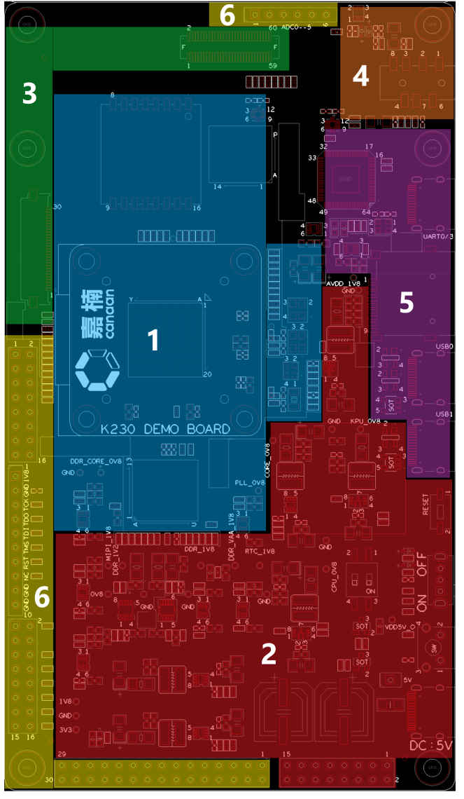
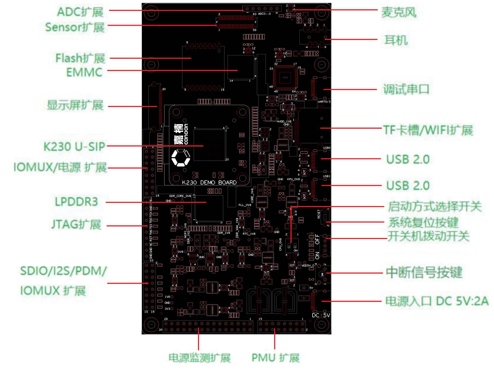
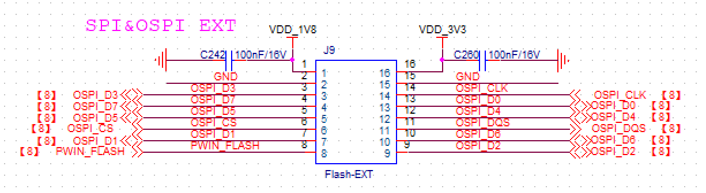
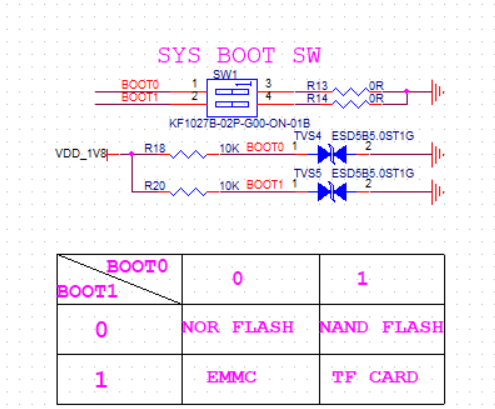
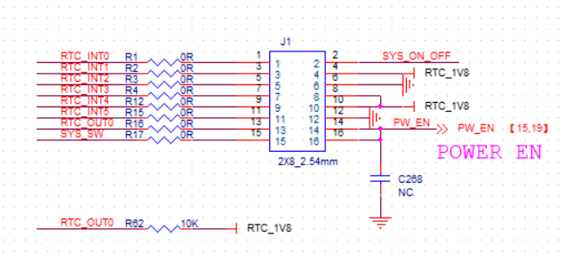
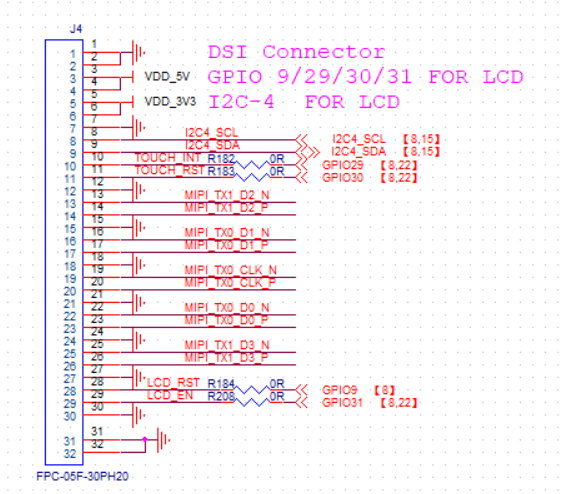
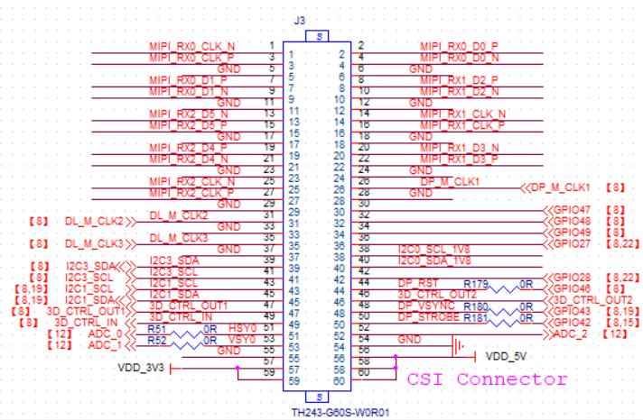
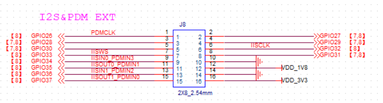
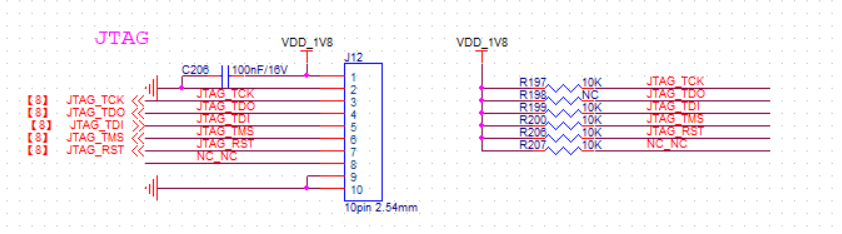
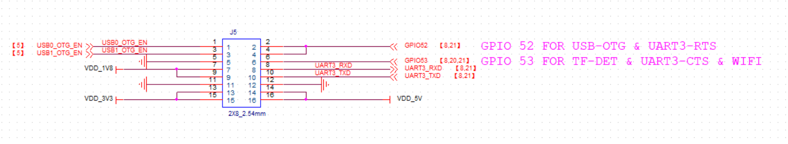

# K230 DEMO BOARD Resource Usage Guide

## Disclaimer

The products, services, or features you purchase are subject to the commercial contracts and terms of Beijing Canaan Creative Information Technology Co., Ltd. (“the Company,” hereinafter) and its affiliates. Some or all of the products, services, or features described in this document may not be within your purchase or usage scope. Unless otherwise agreed in the contract, the Company does not make any explicit or implicit statements or warranties regarding the accuracy, reliability, completeness, merchantability, fitness for a particular purpose, and non-infringement of any representations, information, or content in this document. Unless otherwise agreed, this document is for reference only.

Due to product version upgrades or other reasons, the content of this document may be updated or modified periodically without any notice.

## Trademark Statement

 "Canaan" and other Canaan trademarks are trademarks of Beijing Canaan Creative Information Technology Co., Ltd. and its affiliates. All other trademarks or registered trademarks mentioned in this document are owned by their respective owners.

**Copyright © 2023 Beijing Canaan Creative Information Technology Co., Ltd. All rights reserved.**
Without the written permission of the Company, no unit or individual may excerpt, copy, or disseminate any part or all of the content of this document in any form.

## Table of Contents

[TOC]

## Preface

### Overview

This document primarily introduces the usage instructions for the K230 DEMO BOARD.

### Intended Audience

This document (this guide) is mainly intended for the following personnel:

- Technical Support Engineers
- Software Development Engineers

### Abbreviation Definitions

| Abbreviation | Description |
|--------------|-------------|
|              |             |
|              |             |

### Revision History

| Document Version | Description of Changes               | Author  | Date       |
|------------------|--------------------------------------|---------|------------|
| V1.0             | Initial version                      | Du Lingyi | 2023-03-10 |
| V1.1             | Updated to correspond to EVB V1.1    | Du Lingyi | 2023-05-05 |
| V1.2             | Updated the usage method of J5, USB OTG pin header | Du Lingyi | 2023-05-10 |
| V1.3             | Changed content from EVB to K230 DEMO BOARD | Du Lingyi | 2023-06-07 |

## Development Board Overview

### K230 DEMO BOARD Overview

The K230 DEMO BOARD is a fully equipped development and testing board with an attached camera sub-board and screen, ready for plug-and-play. Once powered on, you can immediately begin subsequent development work for the K230. The K230 DEMO BOARD is delivered in a mainboard-assembled-with-multiple-sub-boards form. This document will briefly summarize the various component sub-boards and usage processes of the K230 DEMO BOARD through the interfaces on the mainboard.

### K230 DEMO BOARD Mainboard Diagram

(**Figure 1.2.1**: K230 DEMO BOARD Sample, Sub-boards Unassembled)

### K230 DEMO BOARD Supporting Assembled Sub-Boards

To ensure verification flexibility, the K230 DEMO BOARD is equipped with multiple interfaces and has the ability to connect with different types of sub-cards for more comprehensive chip function development. The types of sub-boards that the mainboard can support are as follows:

- Flash Module Sub-Card (refer to **Section 2.2** for usage details)
- DSI Screen and Adapter Board (refer to **Section 2.4** for usage details)
- IMX335 Module Sensor Board (refer to **Section 2.4** for usage details)
- WIFI Sub-Card (refer to **Section 2.6** for usage details)
- I2S/PDM Interface Digital Audio Sub-Card (refer to **Section 2.7** for usage details)

The usage methods of the interfaces and sub-cards will be detailed in **Section 2** when introducing the corresponding interface of each sub-card. Among the above sub-cards, the Flash Module Sub-Card, DSI Screen, and Adapter Board, and IMX335 Module Sensor Board will be assembled on the K230 DEMO BOARD mainboard for delivery. The remaining sub-cards are **not included** in the K230 DEMO BOARD delivery list by default and are listed here only to assist in explaining the relevant interface functions and usage.

Additionally, the following development cables will be included with the K230 DEMO BOARD upon delivery:

- 2 USB Type-C Cables
- 1 OTG Adapter Cable, Type-C Male to USB-A Female
- 1 Type-C Male to Ethernet Cable

For a fully assembled DEMO board, refer to **Figure 1.3.1**.

(**Figure 1.3.1**: K230 DEMO BOARD Sample, Fully Assembled)

## DEMO BOARD Hardware Function Description

### K230 DEMO BOARD Mainboard Function Modules and All Interfaces

(**Figure 2.1.1**: The top image shows the K230 DEMO BOARD functional area division, and the bottom image shows all supported interfaces and their corresponding positions on the DEMO BOARD)

The K230 DEMO BOARD can be roughly divided into 6 areas as shown in the left image of **Figure 2.1.1**, in the order of the marked numbers:

1. (Blue) Core Area - This is where the main chip K230 and its storage DDR, flash, eMMC, and system main clock are located.
1. (Red) Power Area - This is where all power supplies and power control components on the DEMO BOARD mainboard are located.
1. (Green) Video Input and Output - This is where the camera and screen connect to the mainboard.
1. (Orange) Audio Input and Output - This is where the microphone and headphones are located.
1. (Purple) General Interface - This area contains the interfaces for data exchange with other devices.
1. (Yellow) Pin Header Interface - This area contains pin headers corresponding to key signals on the DEMO BOARD, which can be used as test points or connection points for external signals and expansion sub-cards.

Each area in the left image contains several components/interfaces listed in the right image. In the following sections of this chapter, each component/interface covered in each area will be listed in the above sequence. Additional information or usage instructions will be provided as needed when listing the corresponding components/interfaces.

**In cases where schematics appear in this chapter, unless otherwise specified, it is assumed that the pin configurations of the components on the DEMO BOARD are completely consistent with the pin configurations in the schematics (referring to single or dual rows, pin-out order). Additionally, all pin numbers and component numbers mentioned are marked with white silkscreen on the K230 DEMO BOARD. Please confirm with the actual DEMO BOARD.**

### Core Area (Basic Parameters)

This section is the core processing and storage area of the DEMO BOARD, containing the following 5 interfaces/components listed in the right image of **Figure 2.1.1**:

1. **K230-USIP (Component Number on DEMO BOARD: U1)**
1. **LPDDR3 (Component Number on DEMO BOARD: U5)**
   The selected model is NT6CL128M32DM-H0, Nanya 32bits - 4Gbits LPDDR3, with a maximum rate of 2133Mbps.
1. **eMMC (Component Number on DEMO BOARD: U30)**
   The selected model is KLM4G1FETE-B041, Samsung 8bits - 4GBytes eMMC, compatible up to Ver. 5.1, clock rate 200MHz.
1. **Flash Expansion (Component Number on DEMO BOARD: J9)**

(**Figure 2.2.1**: The top image is an example of the flash module sub-card, with the white dot at the top left indicating pin 1. The bottom image is the Flash Expansion-J9 schematic)

The FLASH expansion on the DEMO board has already been soldered with a verified flash module, requiring no further modification. The selected model is NOR flash, OSPI interface (GD25LX256E, Manufacturer: Giga Device, 256Mbits).

### Power Area (Power-On Method)

(**Figure 2.3.1**: Main Component Locations in the Power Area, showing the power-on mode via switch)

This area generates all the power required on the DEMO BOARD. All components related to DEMO BOARD power control are located in this area, and there are 2 power-on modes to choose from (the selection method will be explained later). The numbered components/interfaces in **Figure 2.3.1** correspond to the following 6 main components/interfaces (names are consistent with the list in the right image of **Figure 2.1.1**):

1. **Boot Mode Selection Switch (Component Number on DEMO BOARD: SW1)**
   The K230 supports loading boot files from four different locations, selected via four high and low logic states on the DIP switch. The four states correspond to the boot locations and the SW1 schematic as shown in **Figure 2.3.2** below.
   
   (**Figure 2.3.2**: SW1 Schematic)
   Switches 1 and 2 correspond to BOOT0 and BOOT1, respectively. Flip the switch to pins 1 and 2 for high logic levels (H side marked on the DEMO BOARD) and to pins 3 and 4 for low logic levels (L side marked on the DEMO BOARD). All numbers are marked on the DEMO BOARD surface with silkscreen.

1. **System Reset Button (Component Number on DEMO BOARD: K2)**
   Low-active reset button. When pressed, it pulls the reset low; when released, the default state is high. You can determine the current reset status by checking the voltage at pin 2.

1. **Power Switch (Component Number on DEMO BOARD: K3)**

1. **Interrupt Signal Button (Component Number on DEMO BOARD: K1)**
   A test button used to manually generate an interrupt signal.

1. **Power Input DC 5V: 2A (Component Number on DEMO BOARD: J2)**

1. **PMU Expansion (Component Number on DEMO BOARD: J1)**
   Pin header expansion used for power testing, not needed during normal use of the DEMO board.
   
   (**Figure 2.3.3**: PMU Expansion J1 Schematic)

1. **Red LED Power Indicator (Component Number on DEMO BOARD: LED1)**

**Normal Power-On Procedure:**

- Set SW1 to the desired BOOT position.
- Connect the 5V power supply to the power input-J2 via the Type-C power cable.
- Flip K3 to the ON position to power on. If the power is successfully connected, the red LED indicator in **Figure 2.3.1** will light up.
- Under normal power conditions, you can check if the reset status is high to ensure the K230 has successfully started.
- If the power indicator does not light up during power-on, check if the jumper cap at pins 15 and 16 of the PMU expansion (J6) (specifically marked in the box labeled 6 in **Figure 2.3.1**) is correctly inserted.

### Video Input and Output (Camera Sub-Board and Screen Sub-Board)

(**Figure 2.4.1**: Main Component Locations in the Video Area)

This is where the camera and screen sub-cards delivered with the DEMO BOARD are connected. The numbered components/interfaces in **Figure 2.4.1** correspond to the following 2 main components/interfaces (names are consistent with the list in the right image of **Figure 2.1.1**).

1. **Display Expansion (Component Number on DEMO BOARD: J4)**
   MIPI DSI interface, transmitting video signals from MIPI to the display through an FPC cable, also known as the MIPI TX interface. This is where the **DSI Touch Screen Adapter Board** mentioned in **Section 1.3** connects, directly connecting J4 and the adapter board via a 30-pin wide FPC cable. The pin definition schematic for J4 is shown in **Figure 2.4.2**.
   
   (**Figure 2.4.2**: Display Expansion Pin Definition Schematic. Pins 31 and 32 are fixed pins, not signal pins, and can be ignored.)

1. **Sensor Expansion (Component Number on DEMO BOARD: J3)**
   MIPI CSI interface, transmitting video signals received from the camera through a board-to-board connector, also known as the MIPI RX interface. This is where the **IMX335 Module Sensor Board** mentioned in **Section 1.3** connects. The pin definition schematic for **J3** is shown in **Figure 2.4.3**.
   
   (**Figure 2.4.3**: Sensor Expansion Pin Definition Schematic)

All module sub-boards are fully assembled upon delivery, as shown in **Figure 1.3.1**.

### Audio Input and Output

(**Figure 2.5.1**: Location of Headphones and Microphone on the DEMO BOARD)

This area is for connecting external audio devices. All sound signal processing in this area is completed within the K230, allowing direct connection of headphones to output analog signals without any modifications. This section only supports analog signals; digital sound signals are extracted via pin headers and converted externally using the I2S/PDM interface digital audio adapter board, which will be introduced separately in **Section 2.7**. The numbered components/interfaces in **Figure 2.5.1** correspond to the following two main interfaces/devices (names are consistent with the list in the right image of **Figure 2.1.1**):

1. **Headphones (Component Number on DEMO BOARD: J7)**
1. **Microphone (Component Number on DEMO BOARD: U29)**

### General Interface (Standard Development Methods)

(**Figure 2.6.1**: Location of Data Interfaces on the DEMO BOARD)

This area is for connecting to external computers/information sources. The numbered components/interfaces in **Figure 2.6.1** correspond to the following three main interfaces/devices (names are consistent with the list in the right image of **Figure 2.1.1**):

1. **USB 2.0 (Component Numbers on DEMO BOARD: J11, J13)**
   Two USB 2.0 interfaces supporting OTG, directly interacting with the K230. J11 corresponds to USB0, and J13 corresponds to USB1.

1. **TF Card Slot/WIFI Expansion (Component Number on DEMO BOARD: U4)**
   The K230 supports booting from the TF card slot, which is where the TF card with the K230 boot program is loaded. The method for selecting TF card booting is described in **Section 2.3**. Additionally, this slot can also accommodate the **WIFI sub-card** mentioned in the list in **Section 1.3**, which is a shared relationship. The **WIFI sub-card** is used to add a WIFI module for network functionality verification. This sub-card has TF card slot gold fingers and can be directly inserted into the TF card slot for normal use.

1. **Serial Debugging (Component Number on DEMO BOARD: J6)**
   Use a Type-C data cable for UART serial debugging, with the default baud rate set to 115200.

### Pin Header Interface

(**Figure 2.7.1**: Location of Pin Headers on the DEMO BOARD, with pin 1 of each pin header circled)

This area outputs power and some signals from the K230 GPIO through pin headers. The numbered components/interfaces in **Figure 2.7.1** correspond to the following three main interfaces/devices (names are consistent with the list in the right image of **Figure 2.1.1**):

1. **Power Monitoring Expansion (Component Number on DEMO BOARD: J10)**
   This is an internal test interface used during development and is not needed when using the K230 for product development.

1. **SDIO/I2S/PDM/IOMUX Expansion (Component Number on DEMO BOARD: J8)**
   Pin headers connected to GPIO26-37 of the K230, with a corresponding IO voltage level of 1.8V. As mentioned in **Section 2.5**, the **I2S/PDM interface digital audio adapter board** listed in **Section 1.3** should be placed here to convert the digital audio generated by the K230 externally. Align the female header of the sub-board with pin 1 of the pin header here to use it. The pin definitions can be found in the schematic.
   
   (**Figure 2.7.2**: SDIO/I2S/PDM/IOMUX Expansion-J8 Schematic)

1. **JTAG Expansion (Component Number on DEMO BOARD: J12)**
   Port for connecting a JTAG debugger. Use jumper wires to connect the pins on the JTAG expansion to the corresponding JTAG debugger ports. The pin definitions are shown in **Figure 2.7.4**.
   
   (**Figure 2.7.3**: JTAG Expansion Pin Definition Schematic, with data lines pulled up to 1.8V via 10K resistors)

1. **IOMUX/Power Expansion (Component Number on DEMO BOARD: J5)**
   Control pin headers for USB and serial ports. By shorting certain pins on J5, you can change the modes of the two USB interfaces mentioned in **Section 2.6**. The pin definitions of J5 are shown in **Figure 2.7.5**.
   If USB0 is to be used as a HOST or for Ethernet port conversion, short pins 1 and 2 of J5; for DEVICE mode, leave pins 1 and 2 open (default delivery is shorted).
   Similarly, if USB1 is to be used as a HOST or for Ethernet port conversion, add a jumper cap on pins 3 and 4 of J5 (default delivery is not shorted).
   Additionally, pins 8 and 10 can be used as an extra serial debug port with UART_RX and UART_TX, respectively.
   
   (**Figure 2.7.4**: IOMUX/Power Expansion-J5 Schematic)

1. **ADC Expansion (Component Number on DEMO BOARD: J15)**
   The K230 has a total of 6 ADC input ports routed to J15. These can be used to collect sensor data or feedback signals as needed. The ADC input location is next to the MIPI CSI interface. Note that ADC5 (second hole from the bottom right in **Figure 2.7.1**) is shared with the headphone jack. When headphones are not connected, this ADC input will always be grounded and cannot be used normally. If ADC5 has no reading, connect headphones to the headphone jack.
