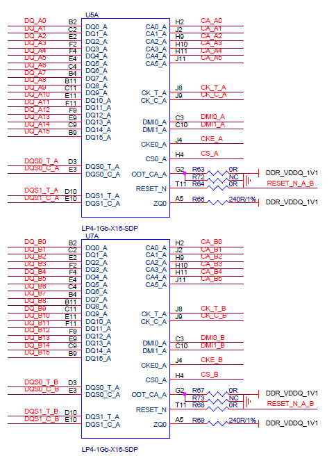
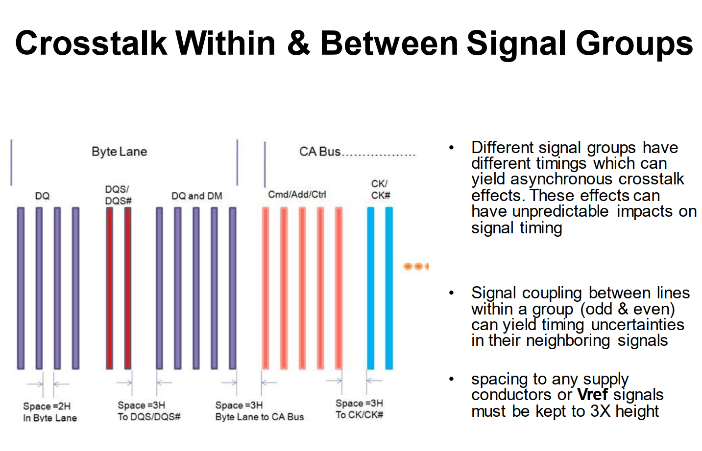
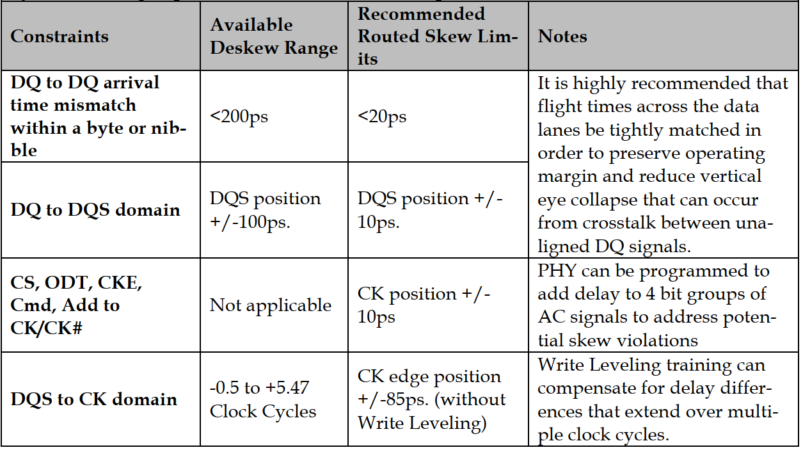
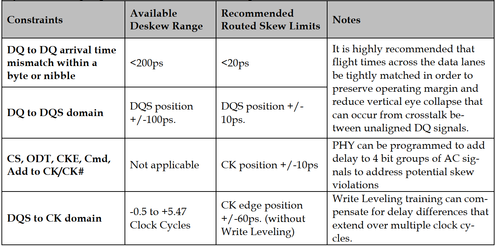

# K230 Hardware Design Guide

Copyright © 2023 Beijing Canaan Creative Information Technology Co., Ltd.

## Disclaimer

The products, services, or features you purchase are subject to the commercial contracts and terms of Beijing Canaan Creative Information Technology Co., Ltd. ("the Company", hereinafter referred to as such) and its affiliates. All or part of the products, services, or features described in this document may not fall within the scope of your purchase or usage. Unless otherwise agreed in the contract, the Company does not provide any express or implied statements or warranties regarding the accuracy, reliability, completeness, merchantability, fitness for a particular purpose, or non-infringement of any statements, information, or content in this document. Unless otherwise agreed, this document is provided only as a reference guide.

Due to product version upgrades or other reasons, the content of this document may be updated or modified periodically without any prior notice.

## Trademark Statement

 "Canaan" and other Canaan trademarks are trademarks of Beijing Canaan Creative Information Technology Co., Ltd. and its affiliates. All other trademarks or registered trademarks mentioned in this document are owned by their respective owners.

**Copyright © 2023 Beijing Canaan Creative Information Technology Co., Ltd. All rights reserved.**
Without the written permission of the Company, no unit or individual is allowed to excerpt, copy any part or all of the content of this document, and it may not be transmitted in any form.

## Table of Contents

[toc]

## Preface

### Overview

This document mainly introduces the key points and precautions of the K230 processor hardware design, aiming to help customers shorten the product design cycle, improve product design stability, and reduce the failure rate. Please refer to the requirements of this guide for hardware design and try to use the relevant core templates released by K230. If changes are necessary due to special reasons, please strictly follow the requirements of high-speed digital circuit design.

### Target Audience

This document (guide) is mainly applicable to the following personnel:

- Hardware Development Engineers
- Technical Support Engineers
- Test Engineers

### Glossary

| Abbreviation | Description                           |
| ------------ | ------------------------------------- |
| DDR          | Double Data Rate                      |
| SDRAM        | Synchronous Dynamic Random Access Memory |
| LPDDR        | Low Power Double Data Rate            |
| MIPI         | Mobile Industry Processor Interface   |
| OTG          | On the Go                             |
| APB          | Advanced Peripheral Bus               |
| SPI          | Serial Peripheral Interface           |
| DMA          | Direct Memory Access                  |
| AHB          | Advanced High Performance Bus         |
| PCM          | Pulse Code Modulation                 |
| PDM          | Pulse Density Modulation              |
| PCLK         | Peripheral High-speed Clock           |
| CLK          | Clock                                 |
| DQS          | Bi-directional Data Strobe            |
| GPIO         | General-purpose Input/Output          |
| eMMC         | Embedded Multi-media Card             |
| SIP          | System In a Package                   |
| PMU          | Power Management Unit                 |

### Revision History

| Document Version | Modification Description | Modifier | Date       |
| ---------------- | ------------------------ | -------- | ---------- |
| V1.0             | Initial Version          | Zhao Ruixin | 2023-06-14 |

## 1. Chip Overview

### 1.1 Chip Block Diagram

Figure 1-1 K230 Block Diagram

### 1.2 Application Block Diagram

Figure 1-2 is the K230 door lock application block diagram

Figure 1-2 K230 Door Lock Solution Application Block Diagram
Figure 1-3 is the dictionary pen solution application block diagram

Figure 1-3 K230 Dictionary Pen Solution Application Block Diagram

## 2. Packaging and Pins

### 2.1 Packaging

#### 2.1.1 Information

The packaging information of K230 is shown in Table 2-1:

| Device | Package  | Size          | Pitch |
| ------ | -------- | ------------- | ----- |
| K230   | VFBGA390 | 13mm x 13mm   | 0.65  |
| K230D  | LFBGA256 | 11mm x 11mm   | 0.65  |

#### 2.1.2 Package Dimensions

##### K230 Dimensions

Figure 2-1

Figure 2-2

Figure 2-3

Ball Solder Mask Opening: 0.270mm

Primary datum C and bottom are solder balls

Dimension b is the maximum solder ball diameter, parallel to primary datum C

##### K230D Dimensions

Figure 2-4

Figure 2-5

Ball Solder Mask Opening: 0.270mm

Primary datum C and bottom are solder balls

Dimension b is the maximum solder ball diameter, parallel to primary datum C

#### 2.1.3 Pin Definition Diagram

The pin distribution diagram of K230 is as follows:

Figure 2-6 K230 Package Pin Distribution

Figure 2-7 K230D Package Pin Distribution
For pin details, see table [K230_PINOUT_V1.2_20240822.xlsx](https://kendryte-download.canaan-creative.com/developer/k230/HDK/K230%E7%A1%AC%E4%BB%B6%E6%96%87%E6%A1%A3/K230_PINOUT_V1.2_20240822.xlsx).

## 3. Schematic Design Recommendations

### 3.1. Minimum System Design

#### 3.1.1 Clock Requirements

The main system of K230 requires a 24MHz high-speed clock, and the RTC of the PMU subsystem requires a 32.768kHz low-speed clock.

Table 3-1 shows the parameters of the allowable clock sources for K230.

| Frequency | Accuracy | Level |
| --------- | -------- | ----- |
| 32.768KHz | 20ppm    | 1.8V  |
| 24MHz     | 20ppm    | 1.8V  |

It is recommended to use clock sources with an accuracy of 20ppm or higher.

##### High-Speed Clock

The recommended passive crystal connection method is shown in Figure 3-1.

Figure 3-1 K230 Crystal Circuit
Note:

- The selected capacitors need to match the load capacitance of the crystal, and it is recommended to use NPO material.
- It is recommended to use a 4-pin SMD crystal, with 2 GND pins fully connected to the ground to enhance the system clock's ESD interference resistance.
- To improve the startup speed, a 1MΩ resistor can be added between the IN pin and the OUT pin.

The recommended active crystal connection method is shown in Figure 3-2.

Figure 3-2 K230 Active Crystal Circuit
During operation, the crystal output is connected to the CLK24M_XIN pin of K230, and the CLK24M_XOUT pin is left floating.

##### Low-Speed Clock

The K230 chip has a built-in PMU circuit, and the single board needs to provide a clock for the PMU circuit. The recommended circuit is shown in Figure 3-3.

Figure 3-3 K230 RTC Clock Passive Crystal Circuit
The recommended active crystal connection method is shown in Figure 3-4.

Figure 3-4 K230 RTC Clock Active Crystal Circuit

During operation, the crystal output is connected to the CLK32K768_XIN pin of K230, and the CLK32K768_XOUT pin is left floating.
Note:

- When using an active crystal, the NC places in the above active crystal circuits need to be connected with a 0Ω resistor.

#### 3.1.2 Reset Circuit

The hardware reset of K230 is achieved through the RSTN pin, which is active low.
If using a button reset, it is recommended to add a 100nF capacitor to the reset signal pin to eliminate reset signal jitter, enhance anti-interference ability, and prevent system abnormal reset caused by mis-triggering.
The reset circuit schematic is shown in Figure 3-5.

Figure 3-5 K230 Reset Circuit

#### 3.1.3 System Boot Sequence

The K230 chip provides four boot modes, which can be configured through the BOOT0 and BOOT1 pins.
Table 3-2 shows the boot modes of K230 under different configurations.

| BOOT0 | BOOT1 | K230       | K230D      |
| ----- | ----- | ---------- | ---------- |
| 0     | 0     | NOR FLASH  | NOR FLASH  |
| 1     | 0     | NAND FLASH | NAND FLASH |
| 0     | 1     | MMC0       | MMC1       |
| 1     | 1     | MMC1       | MMC0       |

Table 3-2 Boot Mode Description

Note:

- When all four boot modes fail, it will jump to USB/UART boot.

Figure 3-6 shows the recommended BOOT circuit

Figure 3-6 K230 BOOT Circuit

#### 3.1.4 JTAG Debug Circuit

The recommended JTAG interface circuit for the K230 chip is shown in Figure 3-7.

Figure 3-7 K230 JTAG Download Circuit
Among them, JTAG_TCK, JTAG_TDI, JTAG_TMS, and JTAG_RST are recommended to be pulled up with 10kΩ, and JTAG_TDO is left floating.
K230 must use the CKLink series debugger provided by Pingtouge Semiconductor Co., Ltd., otherwise, the chip cannot be debugged.

#### 3.1.5 DDR Controller

The K230 chip has two versions, K230 and K230D. The K230 version requires a separate DDR circuit design. The K230D version has the DDR Die packaged together and does not require an external DDR circuit design.
The K230 DDR controller has the following features:

- Supports LPDDR3/LPDDR4
- Supports 2 ranks
- Supports 16-bit, 32-bit DDR data bus width
- Verified models:
  | Type  | Model            | Manufacturer | Capacity |
  | ------ | ---------------- | ------------ | -------- |
  | LPDDR3 | NT6CL128M32DM-H0 | Nanya     | 4Gb  |
  | LPDDR3 | RS128M32LD3D1LMZ-125BT | Rayson     | 4Gb  |
  | LPDDR4 | W66AP6NBUAF/G/HI | Winbond     | 4Gb  |
  | LPDDR4 | K4F8E304HB-MGCJ  | Samsung     | 8Gb  |

The schematic of the K230 DDR PHY and each DRAM chip must be consistent with the reference schematic, including power decoupling capacitors.

##### LPDDR3

The circuit design of LPDDR3 refers to Figures 3-8, 3-9, 3-10, and 3-11.

Figure 3-8 K230 LPDDR3 Circuit

Figure 3-9 K230 LPDDR3 Power Circuit

Figure 3-10 LPDDR3 Chip Power Circuit

Figure 3-11 LPDDR3 Chip Circuit

When using LPDDR3:

- The schematic of the DDR PHY and each DRAM chip needs to be consistent with the reference design, including power decoupling capacitors.
- The DDR_ZN pin needs to be connected to a 240Ω (1%) calibration resistor to ground.
- The DDR_RESET pin is left floating.
- The chip has a built-in VREF circuit for the DDR controller, so the DDR_VREF pin needs to be left floating.
- The LP3_VREFDQ voltage of the LP3 chip is 0.8V, and it is recommended to use 100Ω and 200Ω (1%) resistors for voltage division.
- The LP3_VREFCA voltage is 0.6V, and it is recommended to use 1kΩ (1%) resistors for voltage division.
- The CA, CS, CKE, CLK, and ODT pins of the LP3 need to use 100Ω resistors to pull up to DDR_VDDQ_1V2 and ground.

##### LPDDR4

The circuit design of LPDDR4 refers to Figures 3-12, 3-13, 3-14, 3-15, and 3-16.

Figure 3-12 K230 LPDDR4 Circuit

Figure 3-13 K230 LPDDR4 Power Circuit

Figure 3-14 K230 LPDDR4 Reference Voltage Circuit

Figure 3-16 LPDDR4 Chip Power Circuit

When using LPDDR4, note:

- The schematic of the DDR PHY and each DRAM chip needs to be consistent with the reference design, including power decoupling capacitors.
- The DDR_ZN pin needs to be connected to a 240Ω (1%) calibration resistor to ground.
- The RESRT_N pin is directly connected to the corresponding pin of the chip.
- When using LPDDR4 chips with K230, the VREF voltage is 0.6V, and it is recommended to use 1kΩ (1%) resistors for voltage division.

##### K230D DDR Module

K230D has a built-in DDR Die, so only the reference voltage and calibration resistor need to be connected.
Reference circuits are shown in Figures 3-17 and 3-18.

Figure 3-17 K230D DDR Peripheral Circuit

Figure 3-18 K230D DDR Reference Voltage

When using the K230D DDR module, note:

- The VREF voltage is 0.55V, it is recommended to use 100Ω (1%) resistors for voltage division.
- The calibration resistor should be 240Ω (1%).

#### 3.1.6 FLASH

The K230 has an OSPI/QSPI controller that can be used to connect FLASH memory chips, with the following features:

- OSPI supports 4/8-bit mode NOR FLASH.
- OSPI supports NOR FLASH up to DDR200, SDR166.
- QSPI supports 1/2/4-bit mode NAND & NOR FLASH.
- QSPI supports NOR FLASH up to SDR100.

##### OSPI

The OSPI reference schematic is shown in Figures 3-19 and 3-20.

Figure 3-19 K230 OSPI Circuit

Figure 3-20 OSPI FLASH Circuit

Please place pull-up resistors according to the requirements of the FLASH chip.

##### QSPI NOR

In the QSPI signals, the CS, CLK, D0, D1, D2, and D3 pins are multiplexed with the corresponding OSPI signal pins, as shown in Table 3-3.

| QSPI Pin | OSPI Pin |
| -------- | -------- |
| QSPI_CS  | OSPI_CS  |
| QSPI_CLK | OSPI_CLK |
| QSPI_D0  | OSPI_D0  |
| QSPI_D1  | OSPI_D1  |
| QSPI_D2  | OSPI_D2  |
| QSPI_D3  | OSPI_D3  |

Table 3-3 QSPI and OSPI Corresponding Pins

The reference circuit is shown in Figure 3-21.

Figure 3-21 QSPI NOR FLASH Chip Circuit
Please place pull-up resistors according to the requirements of the FLASH chip.

##### QSPI NAND

The reference circuit for QSPI NAND is shown in Figure 3-22.

Figure 3-22 QSPI NAND FLASH Chip Circuit
Please place pull-up resistors according to the requirements of the FLASH chip.

### 3.2. MMC Circuit

The K230 eMMC control circuit has two controllers, MMC0 and MMC1.

#### MMC0

The MMC0 controller has the following features:

- Supports SDIO3.0, operating in 4/1-bit mode, up to SDR104.
- Supports eMMC5.0, operating in 8/4/1-bit mode, supports HS200.
- Supports voltage switching required by SD cards, 3.3V and 1.8V.

MMC0 is generally used to control eMMC circuits. The recommended eMMC reference circuit is shown in Figures 3-23 and 3-24.

Figure 3-23 K230 eMMC Circuit

Figure 3-24 eMMC Chip Circuit

Please connect the corresponding pins according to the eMMC manufacturer's requirements. If there are no special requirements, connect the corresponding pins directly.

#### MMC1

The MMC1 controller has the following features:

- Supports SDIO3.0, operating in 4/1-bit mode, up to SDR104.
- Supports voltage switching required by SD cards, 3.3V and 1.8V.

The MMC1 interface's performance and pin count cannot meet the requirements for controlling eMMC circuits, so it can only be used to control SD/TF card circuits. The reference schematics are shown in Figures 3-25, 3-26, and 3-27.

Figure 3-25 K230 SD Card Interface Circuit

Figure 3-26 SD Card Pull-up Circuit

Figure 3-27 SD Card Slot Circuit

When designing the SD card circuit, note:

- The decoupling capacitors for SD card pins should not be omitted and should be placed close to the card slot.
- ESD devices should be placed near the SD card slot for each signal.
- Pull-up resistors are required for each signal.
- It is recommended to design according to the reference circuit.

### 3.3. USB Circuit

The K230 chip has two built-in USB2.0 OTG controllers with the following features:

- Supports USB2.0 protocol, backward compatible with USB 1.1 protocol.
- Supports Host mode or Device mode, can be dynamically switched.
- Host mode supports 480Mbps, 12Mbps, 1.5Mbps transfer rates.
- Device mode supports 480Mbps, 12Mbps transfer modes.

The USB reference schematics are shown in Figures 3-28 and 3-29.

Figure 3-28 K230 USB Circuit

Figure 3-29 USB Interface Circuit

Note:

- ESD devices should be placed near the USB port for each signal.
- The USB_VBUS power of K230 must be connected to a 5V power supply through a 30kΩ (1%) resistor and cannot be directly connected to the power supply.
- To ensure signal quality, the USB_TXRTUNE pin of K230 must be connected to a 200Ω (1%) resistor to ground.
- The USB_ID can be used for OTG device identification. When grounded, K230 acts as a HOST; when floating or pulled high, K230 acts as a SLAVE.

### 3.4. Audio Circuit

#### 3.4.1 I2S

The K230 chip has an I2S controller with the following features:

- Two input and output channels.
- Supports PHILIP I2S standard.
- Supports left/right, PCM formats.
- Synchronous operation mode.
- Selectable master or slave mode.
- Adjustable interface voltage.
- Sampling rates from 8kHz to 384kHz.

The I2S interface has three pins: I2S_CLK, I2S_WS, and I2S_SD. I2S_CLK is the serial clock signal, I2S_WS is the data frame control signal, and I2S_SD is the serial data signal. The I2S interface is typically used to connect to decoders and other audio peripherals. Figures 3-30 and 3-31 show the K230 I2S interface circuit and some peripheral circuits.

Figure 3-30 K230 I2S Interface Circuit

Figure 3-31 K230 I2S Reference Peripheral

#### 3.4.2 PDM

The K230 supports 4 channels of PDM signal input. Sampling rates range from 8kHz to 384kHz. The PDM interface is typically used to connect to digital microphones and other audio devices with PDM interfaces. Figure 3-32 shows the K230 PDM peripheral circuit.

Figure 3-32 K230 PDM Peripheral Circuit

#### 3.4.3 Analog Audio Interface

The analog audio section of the K230 chip has the following features:

- Supports 2 DAC channels and 2 ADC channels.
- DAC supports differential and single-ended output, ADC supports differential and single-ended input.
- Supports low-noise analog microphone bias output.

The reference circuit for analog audio is shown in Figures 3-33 and 3-34.

Figure 3-33 K230 Analog Audio Interface Circuit

Figure 3-34 Audio Interface Circuit

Note, to achieve better audio quality, consider the following measures:

- Use both large and small capacitance low-ESR ceramic capacitors for power pins.
- Place a large capacitance low-ESR capacitor on the MICBIAS pin.
- Place the DC blocking capacitors for audio input close to the K230 chip.
- Place filter circuits or DC blocking capacitors on the output pins.

### 3.5. Video Circuit

#### 3.5.1 MIPI DSI

The MIPI DSI controller of the K230 has the following features:

- Supports 1 signal output.
- Supports 1/2/4-lane mode.
- Maximum rate up to 1.5Gbps.

All MIPI DSI signals are directly connected. The reference hardware design is shown in Figures 3-35 and 3-36.

Figure 3-35 K230 MIPI DSI Interface Circuit

Figure 3-36 Screen Interface Circuit

Note:

- The MIPI_ATB pin must be left floating.
- The MIPI_REXT pin must be connected to a 200Ω (1%) resistor to ground.
- The connector circuit pins are only suitable for the JinZhaoHui screen; please design the circuit according to your own screen module.

### 3.6. Camera Circuit

#### 3.6.1 MIPI CSI

The MIPI CSI controller of the K230 has the following features:

- Supports up to 3 MIPI signal inputs, supports 1/2/4-lane mode.
- Can be configured as 3 channels of 2-lane signal input or 1 channel of 4-lane and 1 channel of 2-lane signal input.
- Maximum rate up to 1.5Gbps.

It is recommended to directly connect MIPI CSI signals. The reference hardware design is shown in Figures 3-37 and 3-38.

Figure 3-37 K230 MIPI CSI Interface Circuit

Figure 3-38 Camera Connector Circuit

Note:

- This connector circuit is for internal testing only; please design the circuit according to your needs for actual use.

### 3.7. Low-Speed Subsystem Circuit

#### 3.7.1 I2C Circuit

The K230 chip supports 5 I2C interfaces with the following features:

- Supports I2C bus master mode.
- Supports 7/10-bit addresses.
- Supports I2C rates up to 3.4Mbit/s.

When using I2C peripherals, pay attention to the corresponding power domain supply, which must be consistent. The SCL and SDA signals of the I2C need external pull-up resistors. Choose different resistor values based on bus load and bus rate.

- For systems not exceeding 400kb/s, the recommended resistor value is 4.7kΩ.
- For systems exceeding 400kb/s but less than 3.4Mb/s, the recommended pull-up resistor is 2.2kΩ.

#### 3.7.2 UART Circuit

The K230 supports 5 UART signals with the following features:

- Supports 2-wire UART and 4-wire UART.
- Supports RS485 interface.
- Supports baud rates up to 3.125M.
- Supports software and hardware flow control, compliant with the 16750 standard.
- Supports IrDA 1.0 SIR reception.

When using UART peripherals, pay attention to the corresponding power domain supply, which must be consistent.

#### 3.7.3 PWM Circuit

The K230 supports 6 PWM signals with the following features:

- Supports arbitrary duty cycle.
- Supports programmable output waveform.
- Supports generating periodic pulse signals and one-time pulse signals.
- Can be used as a periodic accurate interrupt generator.
- Supports output glitch elimination.

#### 3.7.4 MCLK Circuit

The K230 supports outputting 3 MCLK signals. This signal can be used as the driving clock for cameras.

### 3.7.4 MCLK Circuit

Supports output clock frequencies as shown in Table 3-4:

|        |        |      |      |      |      |      |      |
| :----: | :----: | :---: | :---: | :---: | :---: | :---: | :---: |
|  792   |  132   | 66.67 | 46.59 |  36  | 28.57 | 23.76 | 18.56 |
|  594   | 118.8  |  66   | 45.69 | 34.94 | 28.29 | 23.53 | 18.18 |
|  400   | 113.14 |  66   | 44.44 | 34.43 | 28.29 | 22.85 | 17.39 |
|  396   |  100   | 60.92 |  44   | 33.33 | 27.31 | 22.22 | 16.67 |
|  297   |   99   | 59.4  | 42.43 |  33  |  27   |  22   |  16   |
|  264   |   99   | 57.14 | 41.68 |  33  | 26.67 | 21.21 | 15.38 |
|  200   |   88   | 56.57 |  40   | 31.68 | 26.4  | 21.05 | 14.81 |
|  198   | 84.86  |  54   | 39.6  | 31.26 | 25.83 | 20.48 | 14.29 |
|  198   |   80   | 52.8  | 39.6  | 30.77 | 25.55 |  20   | 13.79 |
| 158.4  |  79.2  |  50   | 37.71 | 30.46 |  25   | 19.8  | 13.33 |
| 148.5  | 74.25  | 49.5  | 37.13 | 29.7  | 24.75 | 19.16 | 12.9  |
| 133.33 |   72   | 49.5  | 36.36 | 29.33 | 24.75 | 19.05 | 12.5  |

Table 3-4 MCLK Output Clock Frequencies (in MHz)

#### 3.7.5 ADC Circuit

The K230 integrates an 11-bit (effective resolution) SAR ADC with a maximum sampling rate of no less than 1MHz. It has the following features:

- Signal input range: 0-1.8V
- Supports 6-channel input
- Supports single sampling and continuous sampling
- Internally integrated signal conditioning circuit with a cutoff frequency at half the bandwidth. The ADC can directly sample signals or design peripheral circuits as needed.

#### 3.7.6 PMU Circuit

The PMU module of the K230 is used to control and manage internal and external power supplies of the chip. It has a built-in RTC circuit and supports 6 input channels. Its functions are shown in the table below:

| Interrupt Source | Edge Trigger | Level Trigger | Debounce | Edge Count Detection | Long/Short Press Detection |
| :--------------: | :----------: | :-----------: | :------: | :------------------: | :-----------------------: |
|      INT_0       |     Yes      |      Yes      |    Yes   |          -           |           Yes             |
|      INT_1       |     Yes      |      Yes      |    Yes   |         Yes          |            -              |
|      INT_2       |     Yes      |      Yes      |     -    |          -           |            -              |
|      INT_3       |     Yes      |      Yes      |     -    |          -           |            -              |
|      INT_4       |      -       |      Yes      |     -    |          -           |            -              |
|      INT_5       |      -       |      Yes      |     -    |          -           |            -              |

Supports two output channels OUT0 and OUT1, which can be used to enable power supplies. In a cold start state, the PMU only enables the long press interrupt of INT0 and the high-level input interrupt of INT4 as triggers for PMU module startup. OUT0 and OUT1 default to low level with an initial pull-down resistance of about 40Ω. Upon receiving either of these two interrupts, OUT0 is pulled high, and OUT1 is pulled high after approximately 50ms. OUT0 and OUT1 can be used to control the enable pins of external PMICs or for other purposes.

### 3.8. Power Design

#### 3.8.1 K230 Power Requirements

| Module         | Power Pin         | Description                                                   |
| -------------- | ----------------- | ------------------------------------------------------------- |
| CORE           | VDD0P8_CORE       | Power for CPU0 and other units                                |
| CPU            | VDD0P8_CPU        | Power for CPU1                                                |
| KPU            | VDD0P8_KPU        | Power for KPU                                                 |
| DDR Controller | VDD0P8_DDR_CORE   | Digital CORE power for DDR, can be powered off                |
|                | VDD1P1_DDR_IO     | IO power for DDR                                              |
|                | VAA_DDR           | PLL power for DDR                                             |
| USB            | AVDD3P3_USB       | 3.3V power for USB PHY, can be left unpowered if not in use   |
|                | AVDD1P8_USB       | 1.8V power for USB PHY, can be left unpowered if not in use   |
| PLL            | AVDD0P8_PLL       | Power for PLL                                                 |
| MIPI           | AVDD0P8_MIPI      | 0.8V power for MIPI, can be left unpowered if not in use      |
|                | AVDD1P8_MIPI      | 1.8V power for MIPI, can be left unpowered if not in use      |
| VDD1P8         | VDD1P8            | 1.8V module power                                             |
| ADC            | AVDD1P8_ADC       | Power for ADC, can be left unpowered if not in use            |
| CODEC          | AVDD1P8_CODEC     | Power for CODEC, can be left unpowered if not in use          |
| PMU            | AVDD1P8_RTC       | RTC power for PMU, can be left unpowered if not in use        |
|                | AVDD1P8_LDO       | LDO power for PMU, can be left unpowered if not in use        |
| MMC            | VDD3P3_SD         | 3.3V output buffer and pre-buffer IO power, can be left unpowered if not in use |
| IO             | VDDIO3P3_0        | IO power for IO_2-IO_13, voltage selectable between 1.8V or 3.3V, can be left unpowered if not in use |
|                | VDDIO3P3_1        | IO power for IO_14-IO_25, voltage selectable between 1.8V or 3.3V, can be left unpowered if not in use |
|                | VDDIO3P3_2        | IO power for IO_26-IO_37, voltage selectable between 1.8V or 3.3V, can be left unpowered if not in use |
|                | VDDIO3P3_3        | IO power for IO_38-IO_49, voltage selectable between 1.8V or 3.3V, can be left unpowered if not in use |
|                | VDDIO3P3_4        | IO power for IO_50-IO_61, voltage selectable between 1.8V or 3.3V, can be left unpowered if not in use |
|                | VDDIO3P3_5        | IO power for IO_62-IO_63, voltage selectable between 1.8V or 3.3V, can be left unpowered if not in use |
| K230D DDR Part | VDD1P8_DDR_VDD1   | DDR power in K230D, not present in K230                       |
|                | VDD1P1_DDR_VDD2   | DDR power in K230D, not present in K230, cannot be powered off |
|                | VDD1P1_DDR_VDDQ   | DDR power in K230D, not present in K230, can be powered off   |

Table 3-6 K230 Power Requirements

#### 3.8.2 Power-Up Sequence

VDD0P8_CORE must be powered up earlier than VDD1P8 and VDDIO3P3_0 to VDDIO3P3_5 IO interfaces. AVDD0P8_MIPI must be powered up earlier than AVDD1P8_MIPI, and AVDD1P8_RTC must not be powered up later than AVDD1P8_LDO. There are no other specific power-up sequence requirements.

#### 3.8.3 Power Design Recommendations

##### PMU

| Module Name | Pin          | Min Voltage (V) | Typical Voltage (V) | Max Voltage (V) | Current (mA) | Notes                      |
| ----------- | ------------ | --------------- | ------------------- | --------------- | ------------ | ------------------------- |
| PMU         | AVDD1P8_RTC  | 1.674            | 1.8                 | 1.98            | 10           | Recommended to use LDO    |
|             | AVDD1P8_LDO  | 1.674            | 1.8                 | 1.98            | 10           | Recommended to use LDO    |

##### Core Modules

| Module Name | Pin          | Min Voltage (V) | Typical Voltage (V) | Max Voltage (V) | Current (mA) | Notes                                              |
| ----------- | ------------ | --------------- | ------------------- | --------------- | ------------ | -------------------------------------------------- |
| CORE        | VDD0P8_CORE  | 0.72             | 0.8                 | 0.88            | 2250         | Recommended to use a DC/DC with at least 3A capacity and low ripple noise |
| CPU         | VDD0P8_CPU   | 0.72             | 0.8                 | 0.88            | 1000         | Recommended to use a DC/DC with at least 2A capacity and low ripple noise |
| KPU         | VDD0P8_KPU   | 0.72             | 0.8                 | 0.88            | 3000         | Recommended to use a DC/DC with at least 4A capacity and low ripple noise |

##### DDR

| Module Name | Pin                  | Min Voltage (V) | Typical Voltage (V) | Max Voltage (V) | Current (mA) | Notes                                              |
| ----------- | -------------------- | --------------- | ------------------- | --------------- | ------------ | -------------------------------------------------- |
| DDR         | VDD0P8_DDR_CORE      | 0.744            | 0.8                 | 0.88            | 400          | Power ripple requirement within 4%, recommended to use a low noise LDO capable of high current output |
|             | VDD1P1_DDR_IO (LPDDR4) | 1.06             | 1.1                 | 1.17            | 800          | LP4 ripple requirement within 5%, recommended to use a low noise LDO capable of high current output |
|             | VDD1P1_DDR_IO (LPDDR3) | 1.14             | 1.2                 | 1.3             | 800          | LP3 ripple requirement within 10%, recommended to use a low noise LDO capable of high current output |
|             | VAA_DDR              | 1.674            | 1.8                 | 1.98            | 10           | Ripple requirement within 5% of typical voltage    |

##### K230D DDR Die

| Module Name      | Pin            | Min Voltage (V) | Typical Voltage (V) | Max Voltage (V) | Current (mA) | Notes                                                        |
| ---------------- | -------------- | --------------- | ------------------- | --------------- | ------------ | ------------------------------------------------------------ |
| K230D DDR die    | VDD1P8_DDR_VDD1 | 1.7              | 1.8                 | 1.95            | 75           | Ripple requirement within 5% of typical voltage, same power network as DDR controller |
|                  | VDD1P1_DDR_VDD2 | 1.06             | 1.1                 | 1.17            | 450          | Same power network as VDD1P1_DDR_IO                          |
|                  | VDD1P1_DDR_VDDQ | 1.06             | 1.1                 | 1.17            | 300          | Recommended to use a low noise LDO capable of high current output |

##### I/O

| Module Name | Pin         | Min Voltage (V) | Typical Voltage (V) | Max Voltage (V) | Current (mA) | Notes                                                                                                               |
| ----------- | ----------- | --------------- | ------------------- | --------------- | ------------ | -------------------------------------------------------------------------------------------------------------------- |
| IO          | VDDIO3P3_0  | 1.62/2.97       | 1.8/3.3             | 1.98/3.63       | 50           | IO units have 5 voltage groups, each configurable to 1.8V or 3.3V. Each group controls the output and input voltage of the corresponding I/O ports and their multiplexed functions. The IO voltage should match the connected peripherals; if not, level shifting is required. |
|          | VDDIO3P3_1 | 1.62/2.97   | 1.8/3.3      | 1.98/3.63   | 50        |                                                                                                                                                                                            |
|          | VDDIO3P3_2 | 1.62/2.97   | 1.8/3.3      | 1.98/3.63   | 50        |                                                                                                                                                                                            |
|          | VDDIO3P3_3 | 1.62/2.97   | 1.8/3.3      | 1.98/3.63   | 50        |                                                                                                                                                                                            |
|          | VDDIO3P3_4 | 1.62/2.97   | 1.8/3.3      | 1.98/3.63   | 50        |                                                                                                                                                                                            |
|          | VDDIO3P3_5 | 1.62/2.97   | 1.8/3.3      | 1.98/3.63   | 50        |                                                                                                                                                                                            |

##### USB

| Module Name | Pin          | Min Voltage (V) | Typical Voltage (V) | Max Voltage (V) | Current (mA) | Notes                     |
| ----------- | ------------ | --------------- | ------------------- | --------------- | ------------ | ------------------------- |
| USB         | AVDD3P3_USB  | 3.07            | 3.3                 | 3.63            | 50           | Recommended to use LDO    |
|             | AVDD1P8_USB  | 1.674           | 1.8                 | 1.98            | 60           | Recommended to use LDO    |

##### PLL

| Module Name | Pin          | Min Voltage (V) | Typical Voltage (V) | Max Voltage (V) | Current (mA) | Notes                             |
| ----------- | ------------ | --------------- | ------------------- | --------------- | ------------ | --------------------------------- |
| PLL         | AVDD0P8_PLL  | 0.72            | 0.8                 | 0.88            | 120          | Recommended to use high-precision LDO |

##### MIPI

| Module Name | Pin           | Min Voltage (V) | Typical Voltage (V) | Max Voltage (V) | Current (mA) | Notes                     |
| ----------- | ------------- | --------------- | ------------------- | --------------- | ------------ | ------------------------- |
| MIPI        | AVDD0P8_MIPI  | 0.744           | 0.8                 | 0.88            | 100          | Recommended to use LDO    |
|             | AVDD1P8_MIPI  | 1.674           | 1.8                 | 1.98            | 30           | Recommended to use LDO    |

##### ADC

| Module Name | Pin          | Min Voltage (V) | Typical Voltage (V) | Max Voltage (V) | Current (mA) | Notes                             |
| ----------- | ------------ | --------------- | ------------------- | --------------- | ------------ | --------------------------------- |
| ADC         | AVDD1P8_ADC  | 1.62            | 1.8                 | 1.98            | 10           | Recommended to use high-precision LDO |

##### CODEC

| Module Name | Pin            | Min Voltage (V) | Typical Voltage (V) | Max Voltage (V) | Current (mA) | Notes                             |
| ----------- | -------------- | --------------- | ------------------- | --------------- | ------------ | --------------------------------- |
| CODEC       | AVDD1P8_CODEC  | 1.62            | 1.8                 | 1.98            | 100          | Recommended to use high-precision LDO |

##### Others

| Module Name | Pin         | Min Voltage (V) | Typical Voltage (V) | Max Voltage (V) | Current (mA) | Notes |
| ----------- | ----------- | --------------- | ------------------- | --------------- | ------------ | ----- |
| Others      | VDD3P3_SD   | 2.7             | 3.3                 | 3.63            | 50           |       |
|             | VDD1P8      | 1.62            | 1.8                 | 1.98            | 500          |       |

Note:

- For the DDR chips used by the K230, the power supply must be on the same power network as the main chip.
- Modules with the same voltage requirements can use the same power source if the voltage accuracy and current requirements are met. For applications with low precision requirements, analog modules like ADCs can also be connected to the power source used by digital modules after isolation.
- The K230 integrates a DDR_Vref power supply for the chip's DDR controller. For external chips, the reference design for the LPDDR3 VREF power supply is shown in Figure 3-39.

Figure 3-39 LPDDR3 Chip Vref Circuit

It is recommended to use resistors with an accuracy of ±1%. The reference design for the external LPDDR4 VREF power supply is shown in Figure 3-40.

Figure 3-40 LPDDR4 Chip Vref Circuit

The reference design for the K230D DDR module VREF power supply is shown in Figure 3-41.

Figure 3-41 K230D Version DDR Vref Circuit

#### 3.8.4 Dynamic Voltage Scaling

The power supplies for the CPU and KPU in the K230 support dynamic voltage scaling to ensure high performance and low power consumption. The adjustable voltage nodes for the CPU are shown in Table 3-7.

| Voltage Node | Voltage (V) |
| ------------ | ----------- |
| V_typical    | 0.8         |
| V_high       | 0.9         |
| V_ultrahigh  | 1.0         |
| V_low        | 0.7         |
| V_retention  | 0.48        |

Table 3-7 CPU Adjustable Voltage Nodes

Among them, V_retention is the voltage node for the DDR retention function. The adjustable voltage nodes for the KPU are shown in Table 3-8.

| Voltage Node | Voltage (V) |
| ------------ | ----------- |
| V_typical    | 0.8         |
| V_high       | 0.9         |
| V_ultrahigh  | 1.0         |
| V_low        | 0.7         |

Table 3-8 KPU Adjustable Voltage Nodes

## 4. PCB Design Recommendations

### 4.1 High-Speed PCB Design Recommendations

#### 4.1.1 DDR Design

Impedance Control: Single-ended DDR 50Ω, Differential (clock clk, data dqs) 100Ω;
Crosstalk Requirements: Follow the 3W rule;
Length Matching Requirements: Ensure the same number of vias for the same type of signal lines, and avoid more than 2 layer changes for vias;
The internal DDR routing length of the chip is shown in Table 4-1. When routing on the PCB, ensure that the total length of internal and external routing meets the length matching requirements.
It is strongly recommended to refer to the design of the K230 EVB, including routing and capacitor selection and placement.

**Pin Length Table**:

| Pin Number | Pin Name           | Length (μm) | Length (mil) |
|------------|--------------------|-------------|--------------|
| N17        | DDR_CKE0_CKEA0     | 3725.8      | 146.8        |
| P18        | DDR_CKE1_CKEA1     | 4338.56     | 170.94       |
| T20        | DDR_CS0_CSA0       | 5839.03     | 230.06       |
| T19        | DDR_CS1_CSA1       | 5528.07     | 217.81       |
| R19        | DDR_CKP_CKAP       | 6252.24     | 246.34       |
| R20        | DDR_CKN_CKAN       | 6050.13     | 238.38       |
| P19        | DDR_CA9_CAA5       | 5809.3      | 228.89       |
| M18        | DDR_CA8_CAA4       | 4033.87     | 158.93       |
| N20        | DDR_CA7_CAA3       | 4888.23     | 192.6        |
| N19        | DDR_CA6_CAA2       | 4415.08     | 173.95       |
| L16        | DDR_CA5_CAA1       | 2171.4      | 85.55        |
| M19        | DDR_CA4_CAA0       | 4599.65     | 181.23       |
| L17        | DDR_CA3_NC         | 2258.98     | 89           |
| M20        | DDR_CA2_NC         | 4190.42     | 165.1        |
| L20        | DDR_CA1_NC         | 5108.55     | 201.28       |
| K20        | DDR_CA0_NC         | 4832.33     | 190.39       |
| L18        | DDR_ODT_NC         | 3849.11     | 151.65       |
| J18        | DDR_NC_CKEB0       | 2599.43     | 102.42       |
| J17        | DDR_NC_CKEB1       | 2792.84     | 110.04       |
| J19        | DDR_NC_CSB1        | 4018.49     | 158.33       |
| J20        | DDR_NC_CSB0        | 4941.35     | 194.69       |
| G20        | DDR_NC_CLKBP       | 5403.63     | 212.9        |
| F20        | DDR_NC_CLKBN       | 5418.33     | 213.48       |
| E20        | DDR_NC_CAB0        | 5468.25     | 215.45       |
| G19        | DDR_NC_CAB1        | 4067.91     | 160.28       |
| G18        | DDR_NC_CAB2        | 3807.29     | 150.01       |
| H17        | DDR_NC_CAB3        | 3113.45     | 122.67       |
| F17        | DDR_NC_CAB4        | 2757.73     | 108.65       |
| F19        | DDR_NC_CAB5        | 4558.27     | 179.6        |
| U17        | DDR_DQ24_DQA7      | 4829.45     | 190.28       |
| Y18        | DDR_DQ25_DQA6      | 6467.43     | 254.82       |
| V18        | DDR_DQ26_DQA5      | 5047.5      | 198.87       |
| W18        | DDR_DQ27_DQA4      | 5267.44     | 207.54       |
| Y16        | DDR_DQ28_DQA3      | 5846.86     | 230.37       |
| V16        | DDR_DQ29_DQA2      | 4311.64     | 169.88       |
| T16        | DDR_DQ30_DQA1      | 3576.39     | 140.91       |
| U16        | DDR_DQ31_DQA0      | 3132.83     | 123.43       |
| V17        | DDR_DM3_DMIA0      | 4110.44     | 161.95       |
| W17        | DDR_DQS3P_DQSA0P   | 6342.48     | 249.89       |
| Y17        | DDR_DQS3N_DQSA0N   | 6135.17     | 241.73       |
| R17        | DDR_DQ8_DQA8       | 4018.24     | 158.32       |
| T18        | DDR_DQ9_DQA9       | 5760.1      | 226.95       |
| R18        | DDR_DQ10_DQA10     | 4540.62     | 178.9        |
| U20        | DDR_DQ11_DQA11     | 5625.11     | 221.63       |
| W19        | DDR_DQ12_DQA12     | 6897.92     | 271.78       |
| U18        | DDR_DQ13_DQA13     | 4908.14     | 193.38       |
| P16        | DDR_DQ14_DQA14     | 2036.92     | 80.25        |
| T17        | DDR_DQ15_DQA15     | 4492.07     | 176.99       |
| P17        | DDR_DM1_DMIA1      | 4129.14     | 162.69       |
| V20        | DDR_DQS1P_DQSA1P   | 7005.11     | 276          |
| V19        | DDR_DQS1N_DQSA1N   | 6768.98     | 266.7        |
| C17        | DDR_DQ0_DQB15      | 4038.16     | 159.1        |
| D16        | DDR_DQ1_DQB14      | 3663.33     | 144.34       |
| D17        | DDR_DQ2_DQB13      | 4242.29     | 167.15       |
| C18        | DDR_DQ3_DQB12      | 5598.19     | 220.57       |
| E18        | DDR_DQ4_DQB11      | 3830.51     | 150.92       |
| E17        | DDR_DQ5_DQB10      | 4273.06     | 168.36       |
| B19        | DDR_DQ6_DQB9       | 6879.01     | 271.03       |
| C19        | DDR_DQ7_DQB8       | 6640.84     | 261.65       |
| D18        | DDR_DM0_DMIB0      | 5275.38     | 207.85       |
| B18        | DDR_DQS0P_DQSB1P   | 6516.79     | 256.76       |
| A18        | DDR_DQS0N_DQSB1N   | 6628.66     | 261.17       |
| C14        | DDR_DQ16_DQB0      | 2966.98     | 116.9        |
| D14        | DDR_DQ17_DQB1      | 2708.03     | 106.7        |
| B14        | DDR_DQ18_DQB2      | 4486.79     | 176.78       |
| A14        | DDR_DQ19_DQB3      | 5608.52     | 220.98       |
| A17        | DDR_DQ20_DQB4      | 5037.71     | 198.49       |
| B16        | DDR_DQ21_DQB5      | 4419.48     | 174.13       |
| C16        | DDR_DQ22_DQB6      | 4381.95     | 172.65       |
| B17        | DDR_DQ23_DQB7      | 5515.88     | 217.33       |
| C15        | DDR_DM2_DMIB1      | 4509.87     | 177.69       |
| B15        | DDR_DQS2P_DQSB1P   | 4623.9      | 182.18       |
| A15        | DDR_DQS2N_DQSB1N   | 4942.59     | 194.74       |

Table 4-1 Internal DDR Trace Lengths

Within LPDDR3 byte groups, DQ can be swapped, but DQ swapping is not supported between bytes or between byte groups. For LPDDR4, DQ can be swapped within byte groups, DQ swapping is not supported between bytes, but byte swapping within channel groups is supported.

It is recommended to follow the EVB swap order for routing. If you modify the swap during your own design, you need to adjust the DDR training code. Please contact FAE in advance.

Figure 4-1 DDR Trace Spacing Design Rules

Figures 4-2 and 4-3 show the length matching design requirements for LPDDR3 and LPDDR4 respectively. To ensure stable operation at higher speeds, it is recommended to design according to the requirements listed under "Recommended Routed Skew Limits".

**LPDDR3 Section**:

Figure 4-2 LPDDR3 Length Matching Design Rules

**LPDDR4 Section**:

Figure 4-3 LPDDR4 Length Matching Design Rules

#### 4.1.2 USB 2.0 Design

- Impedance Control: Differential 90Ω.
- Skew within the differential pair should not exceed 4ps, with a maximum of 6 vias allowed.

#### 4.1.3 MIPI Design

- Impedance Control: MIPI_DSI differential 100Ω, MIPI_CSI differential 100Ω.
- Length matching within the pair should be controlled within 0.3mm.
