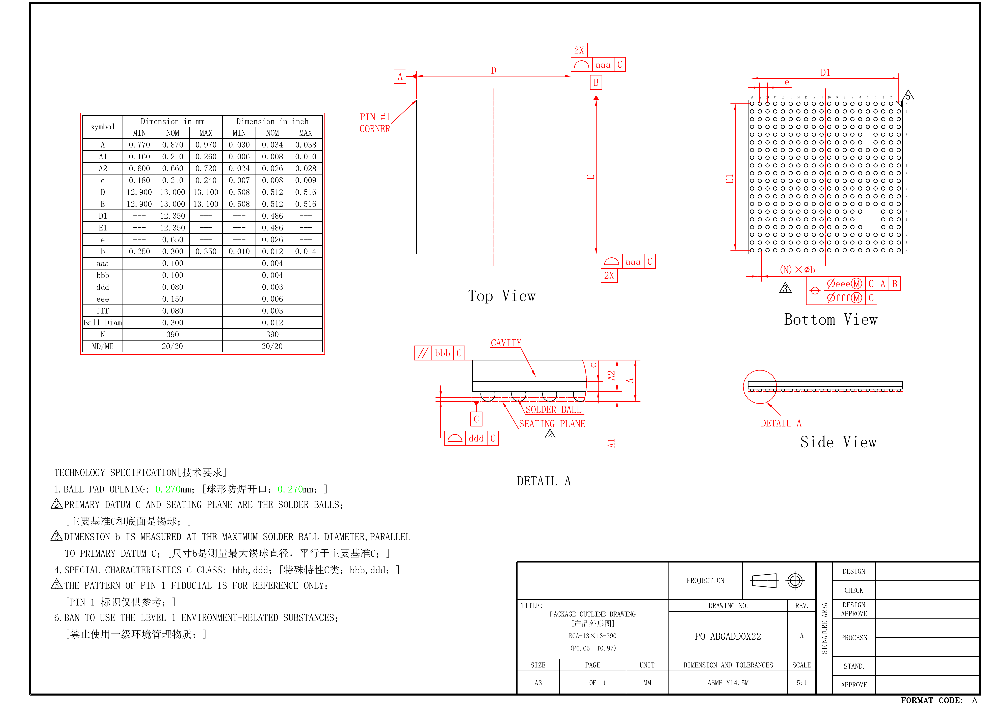
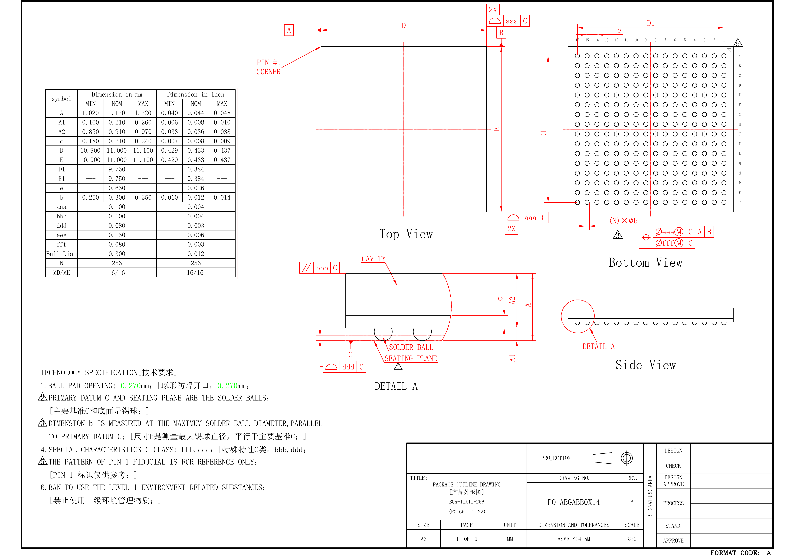
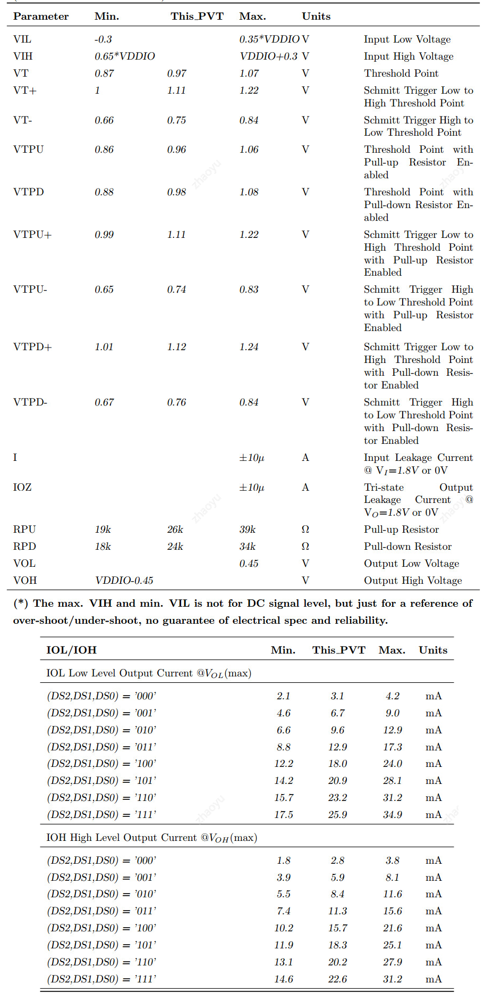

# K230 Product Full Datasheet

Document version: V1.0
Release date: 2023-7-6

## Disclaimer

The products, services or features you purchase shall be subject to the commercial contracts and terms of Canaan Creative CO., LTD. (the "Company") and its affiliates, and all or part of the products, services or features described in this document may not be within the scope of your purchase or use. Unless otherwise agreed in the contract, the Company does not provide any express or implied representations or warranties as to the correctness, reliability, completeness, merchantability, fitness for a particular purpose and non-aggression of any statements, information, or content in this document.Unless otherwise agreed, this document is intended as a guide for use only.

Due to product version upgrades or other reasons, the content of this document may be updated or modified from time to time without any notice.

## Trademark Notice

"Canaan" and other Canaan trademarks are trademarks of Canaan Creative CO., LTD. and its affiliates. All other trademarks or registered trademarks that may be mentioned in this document are owned by their respective owners.

Copyright©2023 Canaan Creative CO., LTD.
This document is only suitable for the development and design of K230 platform, without the written permission of the company, any unit or individual shall not disseminate part or all of the content of this document in any form.

Canaan Creative CO., LTD.
Website：canaan-creative.com
Business Email：<salesAI@canaan-creative.com>

## Preface

### Purpose

This document is intended to provide a full description of the K230 platform and its features.

### Intended Audience

The main people to whom this document (this guide) applies:

- Design and maintenance personnel for electronic products
- Sales personnel for electronic products
- Technical support personnel

### Terms

### Revision history

| Version Number | Modified by    | Revision Date | Revision Notes                                                                    |
| -------------- | -------------- | ------------- | --------------------------------------------------------------------------------- |
| V1.0           | Ruizheng Li,Heng Wen | 2023-7-6     | Revised version |
|                |                |              |           |

## Index

[TOC]

## Chapter 1 Introduction

### 1.1 Overview

The K230 chip is the latest generation SoC product in Canaan Technology's (NASDAQ: CAN) Kendryte® series of AIOT chips. The chip adopts a brand-new multi-heterogeneous unit acceleration computing architecture, integrates two RISC-V C908 computing cores, and has a built-in new generation KPU (Knowledge Process Unit) intelligent computing unit. Multi-precision AI computing power with INT8 and INT16. Supports general AI computing framework. The chip also has a variety of peripheral interfaces, as well as multiple scalar, vector, graphics, and other dedicated hardware acceleration units such as image 2D engine, AI 2D engine, 2.5D GPU, and 3D depth engine. K230 provides full-process computing acceleration for various computing tasks such as images, videos, audio, AI, etc. The chip has many features such as low latency, high performance, low power consumption, fast startup, and high security.
K230 can be used in various smart hardware products, such as smart door locks, home smart security cameras, dictionary pens, payment recognition, 3D structured light vision modules, drones, interactive robots, smart home appliances, smart toys, and smart manufacturing, intelligent vehicle cockpit and many other fields.

### 1.2 Feature

#### 1.2.1 CPU subsystem

- CPU0 subsystem

  - 64bit RISC-V processor
  - Supports maximum 800 MHz working frequency
  - Supports RISC-V 64GCB instruction set
  - Cpu contains floating-point units (FPUs)
  - L1 cache contains 32 KB instruction cache (I-cache) and 32 KB data cache (D-cache)
  - Integrates with 128 KB L2 cache
  - Supports memory management unit (MMU)
  - Integrates with the interrupt controller (PLIC), which can process 208 interrupt external sources
  - Supports the Joint Test Action Group (JTAG) debugging interface
  - Supports WFI

- CPU1 subsystem

  - 64bit RISC-V processor
  - Supports maximum 1.6 GHz working frequency
  - Supports RISC-V Vector Extension 1.0 specification
  - Cpu contains floating-point units (FPUs)
  - 128bits vector-process-unit
  - L1 cache contains 32 KB instruction cache (I-cache) and 32 KB data cache (D-cache)
  - Integrates with 256 KB L2 cache
  - Supports memory management unit (MMU)
  - Integrates with the interrupt controller (PLIC), which can process 208 interrupt external sources
  - Supports the Joint Test Action Group (JTAG) debugging interface
  - Supports WFI

#### 1.2.2 KPU subsystem

- Support INT8 and INT16
- Support weight sparse compression
- Typical network performance：
  - Resnet 50 ≥ 85fps @INT8
  - Mobilenet_v2 ≥ 670fps @INT8
  - YoloV5S ≥ 38fps @INT8
- Support TensorFlow / PyTorch / TFLite / PaddlePaddle / ONNX
- Support quantization toolchain and profiling tools
- Loss of quantization accuracy <1%
- Support Abs, Acos, Acosh, And, ArgMax, ArgMin, Asin, Asinh, Add, AveragePool, BatchNormalization, Cast, Ceil, Celu, Clip, Concat, Constant, ConstantOfShape, Conv, ConvTranspose, Cos, Cosh, CumSum, DepthToSpace, DequantizeLinear, Div, Dropout, Elu, Equal, Exp, Erf, Expand, Flatten, Floor, Gather, GatherElements, GatherND, Gemm, GlobalAveragePool, GlobalMaxPool, Greater, GreaterOrEqual, Hardmax, HardSigmoid, HardSwish, Identity, InstanceNormalization, LpNormalization, LeakyRelu, Less, LessOrEqual, Log, LogSoftmax, LRN, LSTM, MatMul, MaxPool, Max, Min, Mod, Mul, Neg, Not, OneHot, Pad, Pow, PRelu, QuantizeLinear, QLinearConv, QLinearMatmul, RandomNormal, RandomNormalLike, RandomUniform, RandomUniformLike, Range, ReduceL1, ReduceL2, ReduceLogSum, ReduceLogSumExp, ReduceMax, ReduceMean, ReduceMin, ReduceProd, ReduceSum, ReduceSumSquare, Relu, Reshape, Resize, ReverseSequence, Round, ScatterND, Selu, Shape, Sin, Sinh, Sigmoid, Sign, Size, Slice, Softmax, Softplus, Softsign, SpaceToDepth, Split, Sqrt, Squeeze, Sub, Sum, Tanh, Tile, TopK, Transpose, Upsample, Unsqueeze, Where

#### 1.2.3 2D Engine

- 2D GDMA Engine

  - X-Mirror/Y-Mirror/Rotation（90/180/270）
  - Typical image rotation capability：
    - 2 x 1080\*1280 YUV400 @15fps + 1 x 1080\*1920 YUV420 @30fps
  - Provides one physical DMA channel
  - The axi data width is 64-bit
  - Supports configurable axi transaction outstanding numbers: the max outstanding number is 8
  - Supports data transfer with the linked list
  - Supports configurable weight-based channel priority arbitration
  - Supports lowpower mode：each channel supports auto clock gate
  - Supports configurable image row stride
  - The maximum image resolution supports 64Kx64K
  - The data width of the image pixel supports 8/16/24/32bits
  - Max Burst length can be set to 8 or 4 for non-24bit width pixel, and 12 for 24bit pixel

- Non AI 2D
  - Support OSD mode
  - Support CSC mode
  - Support draw border mode
  - Support corp operation

- Independent AI 2D Engine
  - Affine/Crop/Resize/Padding/Shift
  - Resize
  - Crop
  - Affine
  - The calculation of resize and affine coordinates supports opencv's round, as well as ceil and floor
  - Pad
    - Support four edge parts to complement constant pads, the pad value can be specified, and the maximum number of pads on a single side is 1023
  - CSC
    - Both input and output images support the following formats
    - YUV420_NV12
    - YUV420_NV12
    - YUV420_I420
    - YUV400
    - RGB_packed
    - NCHW

  - Shift

    - RAW16 input   -> shift to RAW8 output

  - Support CPU to read internal registers

  - The accelerator can access the system SRAM(2MB).

  - Support software reset through configuration register

  - Support clk gating

    **NOTE**

  - Note1: The highest source image resolution supports 4K

  - Note2: All configured ddr addresses follow 16B align, which is friendly to performance

  - Note3: A configuration register cannot exceed 1KB

  - Note4: When configuring cpu, configure 32bit each time, and configure 4 times for each 128bit, and must configure 4 times, the order is from low to high; when configuring GNNE, configure 128bit at a time

#### 1.2.4 DPU (Depth Processing Unit)

- Using 3D structured light depth calculation
- The maximum resolution of the landscape image is 1920\*1080, and the maximum resolution of the portrait image is 1080\*1440
- Typical performance is 1280\*800@30fps, 1280\*1080@15fps,1920\*1080@9fps
- Both read and write AXI bus support crop
- Support standard axi-4 protocol, data bit width 64bit, address bit width 32bit, burst_length up to 16, read and write outstanding up to 8
- Support standard apb3.0 protocol, data bit width 32bit, address bit width 32bit
- Img_check: The precision of the input speckle image is int8, the precision of the output calculation result is int1, and it supports output after downsampling
- LCN: The precision of the input speckle image is int8, and the precision of the output calculation result is int12, which supports normalized calculation of the source image
- SAD: Input the normalized speckle image/reference image, the accuracy is int12, the output row and column parallax accuracy is int16, support Init_SAD single/double layer enable, support SAD double layer enable, and support the first layer input of Init_SAD/SAD is involved in the calculation after 1/2 downsampling
- Post_proc: The precision of the input column parallax is int16, the precision of the output calculation result is int1, supports Post_proc enable, and supports Post_proc inner mask denoising enable
- Align: The precision of input column parallax is int16, the precision of mask is int1, the precision of output depth/disparity map is int16, the precision of input/output infrared map is int8, supports height block processing parallax/infrared alignment, supports parallax/infrared Alignment enable, support Align inner parallax denoising enable, support parallax/infrared up and down sampling enable, support Disp2depth enable
- Support normal calculation end interrupt, timeout interrupt, instruction exception interrupt, configuration instruction overflow interrupt, AXI write response exception interrupt
- Support independent soft reset, interrupt clear operation

#### 1.2.5 Memory

- DDR

  - 16-bit per channel LPDDR4, two channels, the max speed is 3200Mbps
  - 32-bit LPDDR3 supported,the max speed is 2133Mbps
  - Maximum capacity: 2GB
  - Scalable 1:1/1:2 frequency ratio architecture. We setting 1:2 frequency ratio
  - For LPDDR3 configurations, direct software request control or programmable internal control for ZQ short calibration cycles
  - For LPDDR3 configurations, support for ZQ long calibration after self-refresh exit
  - For LPDDR4 configurations, direct software request control or programmable internal control for ZQ calibration cycles
  - For LPDDR4 configurations, support for ZQ calibration after SR-Powerdown exit
  - Dynamic scheduling to optimize bandwidth and latency
  - For maximum SDRAM efficiency, commands are executed out-of-order
  - Hardware configurable and software programmable Quality of Service (QoS) support
  - Programmable support for all of the following SDRAM data-bus widths: Full data-bus width or Half of the full data-bus width
  - Supports max to 2 ranks
  - Control options to avoid starvation of lower priorities
  - Guaranteed coherency for write-after-read (WAR) and read-after-write (RAW) hazards (always on the HIF interface and on the AXI interface only if appropriate hardware configuration parameter and software register are set)
  - Write combine to allow multiple writes to the same address to be combined into a single write to SDRAM; supported for same starting address
  - Supports automatic SDRAM power-down entry and exit caused by lack of transaction arrival for a programmable time
  - Supports automatic Clock Stop (LPDDR3/LPDDR4) entry and exit caused by lack transaction arrival
  - Supports automatic low power mode operation caused by lack of transaction arrival for a rogrammable time through the Hardware Low Power Interface
  - Flexible address mapper logic to allow application specific mapping of row, column, bank, and rank bits
  - Leverages out of order requests with CAM to maximize throughput
  - APB interface for the software accessible registers
  - 5 host ports using AMBA AXI
  - Automatic periodic retraining through PHY MASTER Interface
  - Support for:
    1. (LPDDR3, LPDDR4) Command Bus eye training relative to CK
    1. Write Leveling to compensate for CK-DQS timing skew
    1. Write Training: DQS to DQ
       Two modes of training are available in LPDDR4:
       - Command-based FIFO WR/RD with user patterns
       - An internal DQS clock tree oscillator, to determine the need for, and the magnitude of, required periodic training
    1. Data bus VREFDQ training
    1. Read training( DQ bit deskew training using DRAM mode registers and DQS to DQ eye centering training using DRAM array)
  - LVSTL IO calibration and ODT calibration
  - Support for a SW controllable DQ bit and AC bit swizzling
  - Firmware-based 2D eye mapping diagnostic tool allows measuring 2D eye for every bit of the bus at both DRAM and host receivers
  - Direct override programming available for all VREF, ODT, drive strength, and timing delays to facilitate debug and characterization

- SRAM
  - SRAM：2MB (shared sram)+2MB (default for KPU)
  - The shared 2MB sram provides access to CPU/KPU/decompression and other modules
  - The shared 2MB sram has two independent 128bit AXI4 Slave buses. Burst supports incremental, fixed, and wrap. The maximum burst length is 16. Exclusive transmission is not supported. The maximum outstanding read and write are 16 respectively
  - The shared 2MB sram is divided into two groups. The first group is shared by KPU port0, axi slave0, axi slave1, and decompression module. When decompression does not work, KPU port0 has the highest priority, followed by axi slave0/axi slave1. The other group of KPU port1, axi slave 0, and axi slave 1 are shared. KPU port1 has the highest priority
  - The decompression module shares 768KB SRAM to cache the decompression process data

- Flash

  - Supports the SPI NOR flash and SPI NAND flash
  - Supports the read and write operations in internal DMA mode for the SPI NAND flash and the SPI NOR flash.
  - Support Enhanced (Dual/Quad/Octal) SPI features:
    - Programmble address,instruction,wait cycles,and data frame size
    - Dual Data Rate(DDR) support
    - Read Data Strobe support for DDR transfer
  - Data item size(4 to 32bits)-Item size of each data transfer under control of the programmer
  - Execute In Place(XIP) mode support:
    - AHB address is mapped to SPI NOR flash address directly
    - Read and write SPI NOR flash directly
  - Read and write SPI NAND flash need to operate according to the NAND flash operation requirement
  - Except XIP mode, all operations need to operate according to the flash operation requirement
  - Programmable delay on the sample time of received serial data bit(rxd)
  - Programmable clock bit rate
  - The latency of strb can be adjusted

    **Note:**

    If data frame size is set to 8bit and DDR mode is selected, one clock pulse corresponds to two byte data. So total data length must be set to an even number.

#### 1.2.6 system component

- RMU

  - Reset management module (RMU) is responable for power on reset deglitch, manage wdt reset，chip soft reset and generate sub-module reset
  - Reset glitch length less than 8ms will be filtered
  - Manage two watchdog reset and generate soc reset
  - Manage software soc reset request and generate soc reset
  - Manage sub-module software reset request and generate sub-module reset

- CMU

  - Clock management module (CMU) is designed to manage generation of sub-module and system clock、clock division、clock switch and clock gating
  - The clock source include external 24MHz OSC and four internal PLLs
  - CPU1 and KPU module support DVFS. Their frequency should meet current voltage
  - When CPU1 and KPU use the same clock source, their frequency can be changed synchronously
  - When CPU1 and KPU use different clock source, their frequency can be changed independently

- PWR

  - Power control module (PWR) is used for power control of SOC and sub-module
  - There are five power mode : Power on, sleep0, sleep1, standby, powerdown
  - There are three kinds of wakeup source : GPIO, PMU and timer
  - Each power domain can be controlled to power down、power up 、clock gating according to defferent application

- Interrupt

  - K230 supports 208 interrupt sources

- PDMA

  - PDMA (Peripheral Direct Memory Access) supports the data transfer between peripheral ports and DDR/SRAM
  - PDMA provides 8 channels to transfer different transactions, with 64-byte data buffer per channel
  - It supports up to 35 peripheral ports through channel configuration
  - Low power IDLE state of each channel can be set by shutting down corresponding clock
  - A 64-bit AXI4 master is used to transfer different channel transactions
  - The priority of each transaction is configured with each channel. Transactions with high priority gets high chance to be transferred
  - Peripheral data address can only be accessed in 4 bytes aligned with strobe signal to indicate the lower 1/2/4 byte(s) are used, and only fixed address is supported

- SDMA

  - Provides four DMA channels：ch0,ch1,ch2 and ch3
  - The axi data width is 64-bit
  - The max axi burst length is 16
  - Supports configurable axi transaction outstanding numbers: the max outstanding number of ch0,ch2,ch3 is 2, the max outstanding number of ch1 is 16
  - Supports configurable data endian
  - Supports data transfer with the linked list
  - Supports configurable weight-based channel priority arbitration
  - Supports lowpower mode：each channel supports auto clock gate
  - Supports specified data transfer for decompression module using ch0 and ch1

- General-puspose timers

  - APB interface supports APB3
  - Up to six programmable timers
  - Configurable timer width: 8 to 32 bits
  - Support for two operation modes: free-running and user-defined count
  - Support for independent clocking of timers
  - Configurable polarity for each individual interrupt
  - Configurable option for a single or combined interrupt output flag
  - Configurable option to have read/write coherency registers for each timer
  - connfigurable option to include timer toggle output, which toggles whenever timer counter reloads
  - Configurable option to enable programmable pulse-width modulation of timer toggle outputs
  - Configurable option to include pulse width modulation of timer toggle output with 0% and 100%
    duty cycle.
  - Can be used to count external input signal with frequency less than 1MHz and ducy cycle from 0~100%

- Stc timer

  - 64 bit timer width
  - 3 configurable timescale : 27MHz, 1MHz, 90KHz
  - Configurable enable、load、clear control register
  - Apb 3.0 interface
  - One timer can be used for video-input/video-output and audio synchronization.
  - One timer is used for cpu0 and one timer is used for cpu1.
  - Timer used for video/audio synchronization provides two sets of timer value, one is old value and the other is latest value

- Watchdog

  - APB3 interface support
  - Watchdog counter width of 32 bits
  - Counter counts down from a preset value to 0 to indicate the occurrence of a timeout
  - If a timeout occurs the watchdog can perform one of the following operations:
    - Generate a system reset
    - First generate an interrupt and even if it is cleared (or not) by the service routine by the time a second timeout occurs then generate a system reset
  - Programmable reset pulse length

- RTC

  - Typical working frequency: external clock source 32768 Hz
  - Involved in the work mode: normal working mode, independent power supply working mode
  - Interface type: APB3.0 interface
  - Support calendar initial value configuration, configuration items including year, month, day, week, when, minutes and seconds
  - Can read less than 1 second counter count, and the initial values can be configured, minimum scale unit for each calibration cycle of the crystals
  - Support disruption: a timer interrupt (configurable project includes year, month, day, week,, minutes and seconds), the interrupt for level interrupts, need to register to clear; Periodic interruption (including annual, monthly, daily, weekly, every hour, every minute, every second, every 1/8 of a second, 1/64 of a second trigger interrupt) the interrupts for pulse, pulse width is two 32768 hz clock cycles
  - Typical application scenario: calendar, timing interrupt trigger interrupt trigger, cycle
  - Other features: a regular in the system domain, need external power supply; A low speed clock of 32768Hz is required

- Mailbox

  - Bus interface: Mailbox with APB 3.0 interface
  - Data bit width: 32bit, configurable via APB bus
  - Configuring the clock: configuring the clock to be the pclk clock
  - Support for hardware locks
  - Support for cpu0_sys and cpu1_sys to send interrupts to each other
  - Support for register configuration and status reading of submodules

- Temperature Sensor

  - ±3°C Accuracy Without Trimming
  - Supply voltages: VDD 0.72-0.88V, VDDA 1.62-1.98V
  - Temperature Measurement Range: -40 ~ 125℃

#### 1.2.6 Video input

- Compatible with MIPI 1.2 RX protocol, max up to three 2lane sensors or one 4lane sensor and one 2lane sensor
- 3 x MIPI CSI
- Support sensor slave mode
- Support flash trigger mode which support both follow-strobe mode and pwm mode
- Support structured light sensor and can separate the IR data and speckle data to different DVP interface.
- Support timestamp
- Support HDR sensor
- Support hardware discard frame
- 8/10/12/16 Bit Bayer RAW

#### 1.2.7 ISP

- Total throughput：8MP@30fps
- Auto Focus measurement (AF)
- Auto White Balance measurement (AWB)
- Auto Exposure measurement (AE)
- Advanced 2DNR spatial noise reduction
- Advanced 3DNR: spatial and temporal noise reduction
- WDR in single wide dynamic frame
- Multi-exposure HDR (Native/Built-in HDR interface, 12~16-bit HDR input). The performance is up to 2960x1666@60fps for DOL2 and 1920x1080@90fps for DOL3 HDR.
- CPD, compand function to support native HDR sensor which performs HDR merging in sensor
- Variable sensor interface for RGB-Bayer Sensors, DOL or stagger HDR sensors
- 20-bit HDR Processing, includes multi exposure stitching and local tone mapping
- Test Pattern Generator (TPG)
- Black level Compensation
- Sensor Linear Correction
- Defect Pixel Cluster Correction (DPCC)
- Green Equalization
- Lens Shade Correction (De-Vignetting)
- De-warping, including fisheye correction, wide field of view (FOV) correction, keystone correction and scaling and 4PTZ view
- Digital Gain
- 2-Stage Adaptive Noise Filter (Noise reduction, Sharpness, Blurring)
- Enhanced Color Interpolation (Bayer De-mosaic filter)
- Chromatic Aberration Correction (CAC)
- Color Correction (Xtalk) Matrix (CCM)
- Color Space Conversion (CSC)
- Programmable gamma correction for sensor adaptation and display correction
- Histogram Calculation
- Anti-flicker
- Cropping of the output picture (to crop interpolation artifacts), also used for windowing
- Color Processing: Contrast, Saturation, Brightness, Hue (CPROC)
- Sharpen/Blur Filter
- Flash light control
- Mechanical shutter control
- Image size: horizontal size multiple of 8 and vertical size multiple of 4
- Enhanced Chroma Noise Reduction (CNR)
- Video Stabilization (VSM)
- Multi-Context Management to support three sensors within a single ISP Core (MCM). In MCM mode, only DVP0 supports HDR

#### 1.2.8 Video output

- 1 x MIPI DSI, 1 x 4 lane or 1 x 2 lane
- Resolution: 2MP@60fps
- Support up to 13 layers, including 4 video layers, 8 OSD layers and 1 background layer.
- Support all common output picture formats: UXVGA (1600x1200), SXVGA (1280x1024), 1080p, 720p
- Video Layer 0:
  - support scaling up and scaling down function
  - support 2-plane, YUV420 data format input
  - support configurable start pixel & start line input
  - Support 90 °, 180 °, 270 ° rotation
  - Support x-mirror/y-mirror function.
- Video Layer 1:
  - support 2-plane, YUV420 data format input
  - support configurable start pixel & start line input
  - support 90 °, 180 °, 270 ° rotation
  - Support x-mirror/y-mirror function.
- Video Layer 2 & Layer 3:
  - Support 2-plane, YUV420 & YUV422 data format input
  - Support configurable start pixel & start line input
  - Do not support scaling function
- 8 OSD layers support 1 or 2 plane ARGB formats:
  - RGB888 with separate alpha channel
  - RGB565 with separate alpha channel
  - ARGB8888
  - ARGB4444
  - ARGB1555
  - Monochrome(8-bit)
- Display mix:
  - OSD layer support configurable global alpha blending or pixel by pixel alpha mode
  - Video layer only support configurable global alpha
  - Configurable output size and position for each layer
- Support vsync interrupt, DPI interface underrun interrupt and configurable output line number interrupt
- Support configurable color space conversion, yuv2rgb or rgb2yuv
- Support gamma correction on RGB data before output
- Support dither function

  **Note**
- When not using scaling, it is recommended to use layer1 (supports rotation but not scaling)/layer2 (does not support rotation and scaling)/layer3 (does not support rotation and scaling). The video layer can only use three layers
- When scaling is necessary and layer0 is required, the maximum frame rate at 1080p is 20fps, and 30 frames can be supported at 720p

#### 1.2.9 video codec

  **video encoding**
  General encoding features

- Maximum encoding performance up to 8MP@20fps
- Stride support.
- Horizontal and vertical mirroring.
- CBR / VBR / CQP / ROI encoding
- Support for optional rotation of the source frame in 90 degree steps before encoding. Note If YUV422 is rotated by 90 degrees or 270 degrees and not converted to YUV420, the result is encoded as YUV440.

The video processor supports encoding the following source-frame input formats:

- 1-plane YUV422, scan-line format, interleaved in YUYV or UYVY order. Note YUV422 inputs can be converted to YUV420 format.
- 1-plane RGB, 8-bit, byte address order RGBA, BGRA, ARGB, or ABGR.
- 2-plane YUV420, scan-line format, chroma interleaved in UV or VU order.
- 3-plane YUV420, scan-line format.
- 3-plane YUV420 10-in-16 bit scan line format. Note Support for 3-plane formats is included to help you with testing. Do not use these for maximum performance.
- YUV420 10-bit, P010, little endian, MSB aligned.
- YUV420 10-bit, 2 × 2 tile format.

Supported codecs

The following codec standards are supported for encoding:

- HEVC (H.265) Main.
- HEVC (H.265) Main 10 Profile.
- H.264 Baseline Profile (BP).
- H.264 Main Profile (MP).
- H.264 High Profile (HP).
- H.264 High 10 Profile.
- JPEG, baseline sequential, YUV420 and YUV422. Note Only the JPEG codec can encode YUV422.
- MJPEG

HEVC (H.265) encoding features

- The encoded bitstream complies with the HEVC (H.265) Main Profile.
- Maximum frame width of 4,096 pixels.
- Maximum frame height of 4,096 pixels.
- 8-bit or 10-bit sample depth with I and P frames.
- Progressive encoding with 64 × 64 CTU size.
- Tiled mode, up to four tiles, horizontal splits only.
- Wavefront parallel encoding.
- The Motion Estimation (ME) search window is ±128 pixels horizontally, ±64 pixels vertically. - ME search down to Quarter Picture ELement (QPEL) resolution.
- 8 × 8, 16 × 16, and 32 × 32 luma intra-modes.
- 4 × 4, 8 × 8, and 16 × 16 chroma intra-modes.
- 8 × 8, 16 × 16, and 32 × 32 inter-modes.
- 8 × 8, 16 × 16, and 32 × 32 transform size for luma.
- 4 × 4, 8 × 8, and 16 × 16 transform size for chromas.
- Skipped CUs, Merge modes.
- Deblocking.
- Sample Adaptive Offset (SAO).
- Constrained intra-prediction selectable.
- Fixed Quantization Parameters (QP) operation or rate-controlled operation.
- Rate controlled based on bitrate and buffer size settings. This is also known as leaky bucket.
- Long term reference frame.
- Selectable intra-frame refresh interval.
- Encoders do not prevent the output from exceeding the maximum number of bits per CTU.

H.264 encoding features

- The encoded bitstream complies with the Baseline, Main, High, and High 10 Profiles.
- Maximum frame width of 4,096 pixels.
- Maximum frame height of 4,096 pixels.
- I and P frames.
- Progressive encoding.
- Context Adaptive Binary Arithmetic Coding (CABAC) or Context Adaptive Variable Length Coding (CAVLC) entropy coding. Note B frames are not supported with CAVLC entropy coding.
- The Motion Estimation (ME) search window is ±128 pixels horizontally, ±64 pixels vertically.
- ME search down to Quarter Picture Element (QPEL) resolution.
- All 4 × 4, 8 × 8, 16 × 16 luma, and 8 × 8 chroma intra-modes evaluated.
- 8 × 8, and 16 × 16 inter-modes.
- 4 × 4 and 8 × 8 transform.
- Skipped macroblocks.
- Deblocking.
- Constrained intra-prediction selectable.
- Fixed QP operation or rate-controlled operation.
- Rate controlled based on bitrate and buffer size settings. This is also known as leaky bucket.
- Long term reference frame.
- Selectable intra-frame refresh interval.
- Escaping to prevent Network Abstraction Layer (NAL) unit start code emulation. This is always enabled and is independent of the NAL packet format setting. For more information, see ITU-T H.264 Annex B. Note Encoders do not prevent the output from exceeding the maximum number of bits per macroblock.

  **video decoding**
  General decoding features

- Maximum decoding performance up to 8MP@40fps
- Supported source frame output formats are:
  - 2 plane YUV420 scan line format, chroma interleaved in UV or VU order.
  - 3 plane YUV420 scan line format. Note Support for 3-plane formats is included to help you with testing. Do not use these for maximum performance.
  - YUV420 10 bit, P010, little endian, MSB aligned.
  - YUV420 10 bit, 2 × 2 tile format. Note The YUV buffer and stride must have correct alignment for maximum performance.
- Stride support for scan-line formats only.
- Support for rotation of the decoded frame in 90 degree steps before output.
- Support for downscaling the decoded frame horizontally and vertically by a factor of 2 or 4.
- Support for downscaling the decoded frame horizontally and vertically by any factor individually. The smallest resolution can be 2 x 2 pixels.
- Support for output of average frame luminance and chrominance for each 32 x 32 pixel block, for every output display frame.

Supported codecs

The following codec standards are supported for decoding:

- HEVC (H.265) Main/Main10.
- H.264 Baseline, Main, High, and High10 Progressive Profile.
- JPEG, baseline sequential, YUV420 and YUV422. Note Only the JPEG codec can decode YUV422.

HEVC (H.265) decoding features

- The decoder is fully compliant to the Main and Main10 Profiles.
- Maximum frame width is 4,096 pixels.
- Maximum frame height is 4,096 pixels.
- Error concealment is performed in case of bit errors.
- Stream parameter information is output.

H.264 decoding features

- Baseline, Main, High, and High 10 progressive Profiles.
- For progressive streams
  - Average bitrates up to 100MBit/s.
  - Maximum frame width is 4,096 pixels.
  - Maximum frame height is 4,096 pixels.
- For interlaced streams
  - Average bitrates up to 50MBit/s.
  - A maximum frame width of 2,048 pixels.
  - A maximum frame height of 4,096 pixels.
- Error concealment is performed in case of bit errors.
- Stream parameter information is output. Escaping to prevent NAL unit start code emulation is always expected. This is independent of the NAL packet format setting. For more information, see ITU T H.264 Annex B.

JPEG decoding features

- Average bitrates up to 20MBit/s.
- Support for 4:2:0 output by the video encoder, baseline sequential YYYYCbCr interleaved MCU format only.
- Support for 4:2:2 output by the video encoder, baseline sequential YYCbCr interleaved MCU format only.
- Maximum frame width is 8,192 pixels.
- Maximum frame height is 8,192 pixels.
- Error concealment is performed in case of bit errors.

#### 1.2.10 2.5D GPU

- Support following Hardware Components
  - Command list based DMAs, Fire and Forgot Control mechanism to minimize CPU overhead
  - Primitive Rasterizer, 16x Anti-aliasing without performance drop.
  - Texture Mapping Unit, 4 Texel/cycle in Bi-linear filter
  - Hardware composition, Frame buffer compression
  - Tessellation, No CPU Involved in Bezier Curve generation
  - Alpha blending
- Support Image Transformation
  - Texture mapping, Point sampling, Bilinear filtering
  - Blit support, Stretch (independently on x and y axis)
  - Rotation any angle, Mirroring, FP24 coordinate precision, no precision difference in any degree rotation
  - 2.5D Perspective Correct Projections
  - Configurable Coordinate Systems and Transformations (3x3 matrix)
  - Scissoring and viewport clipping,  Mage Interpolation, Paint
  - Odd/even and non-zero fill rules
- Support draw engine
  - Pixel / Line drawing with any degree
  - Gradient Filled rectangles
  - Triangles, Polygon
  - Path Generation
  - Linear gradient paint paths
- Support following Color Formats
  - 32-bit RGBA8888 / BGRA8888 / ABGR8888
  - 16-bit RGBA5551 / RGB565
  - 8-bit Α8 / L8 / RGB332,  4-bit A4 / L4 & 2-bit A2 / L2 & 1-bit A1 / L1
  - 1/2/4/8-bit index format
- Support Antialiasing
  - 16x MSAA(4x4), no quality difference betwwen horizon and vertical direction
  - 8x MSAA(4x2), low cost version, horizon quality is better than veritical directon

#### 1.2.11 Audio

K230 audio supports the following features:

- Audio codec inside
- 2 DAC channels for stereo playback with sample rate 8-192Khz
- 2 ADC channels for stereo recording from microphone with sample rate 8-192Khz
- Audio codec support Automatic Level Control (ALC) function to adjust the signal level,which is input into ADC
- Maximum 8 x PDM DMIC inputs
- I2S interface supports 2x2 expansion
- Support master mode, which means clock(pdm_clk and i2s_sclk) and ws(only I2S) are output from audio.
- I2S input, pdm input and I2s output audio modes can work simultaneously
- APB2.0 interface is used to configure registers, and read/write PCM data. The default frequency of configurable APB working clock PCLK is 100MHz, and the data interface is 32 bits
- PCM data can be transferred by PDMA. Burst length in PDMA is configurable
- The audio module can start working again after being disabled and re-enabled
- The audio module can start working again after asserting reset and de-asserting reset
- PDM audio
  - PDM audio input with data sampling rate of 2.048/2.8224 MHz, 1-bit data width, sampling clock rate of 0.256MHz/0.384MHz/0.512MHz/0.768MHz/1.024MHz/1.4112MHz/1.536MHz/2.048MHz/2.8224MHz/3.072MHz/4.096MHz/5.6448MHz/6.144MHz/12.288MHz/24.576MHz, corresponding PCM sampling rate of 8kHz/12kHz/16kHz/24kHz/32kHz/44.1kHz/48kHz/96kHz/192kHz
  - Oversampling rate is configurable with x128, x64 and x32
  - 1-4 IOs are used for input PDM audio
  - The input can be configured with 1-8 PDM channels. It supports left/right mono mode and dual mode of PDM. All IO channel modes are unified. The maximum number of IO in dual mode is 4
  - The serial numbers of enabled channels are from small to big. Random enabling of each channel is not supported
  - The skew between PDM input data and pdm_clk is up to 18 PCLK cycles
  - Conversion from input PDM audio data to PCM audio data
- I2S audio
  - PCM audio in I2S Phillips, left-aligned and right-aligned format
  - I2S audio input/output with data sampling rate of 8kHz/12kHz/16kHz/24kHz/32kHz/44.1kHz/48kHz/96kHz/192kHz, and data width of 32 bits. The valid data width(32/24/20/16/12bits) needs to be customized. The sampling clock rate supports 2×32(data width)×data sampling rate
  - 1-2 IO to input, and 1-2 IO to output I2S audio data. The full-duplex mode is supported
  - Connect to on-chip or off-chip i2s codec to input and output audio data
  - Each RX/TX channel FIFO depth is 8. FIFO threshold can be configured
  - DMA mode enable and disable
  - IO number and left/right channel flag can be fetched from higher bits of data when valid data width is less than 32bits in DMA mode

#### 1.2.12 peripheral

- UART
  - Support 5 UART interface
  - 9-bit serial data support
  - False start bit detection
  - Programmable fractional baud rate support
  - APB data bus widths of 32
  - Additional DMA interface signals for compatibility with DMA interface, DMA interface signal active low
  - Transmit and receive FIFO depths of 32, Supports 32x32-bit transmit first-in, first-out (FIFO) and 32x32-bit RX FIFO, Internal FIFO (RAM)
  - Busy functionality
  - Functionality based on the 16550 industry standard
    - Programmable character properties, such as:
      - Number of data bits per character (5-8)
      - Optional parity bit (with odd, even select or Stick Parity)
      - Number of stop bits (1, 1.5 or 2)
    - Line break generation and detection
    - DMA signaling with two programmable modes
    - Prioritized interrupt identification
  - Programmable FIFO enable/disable
  - Separate system resets for each clock domain to prevent metastability

- I2C
  - Support 5 I2C interface
  - Two-wire I2C serial interface–consists of a serial data line (SDA) and a serial clock (SCL)
  - Three speeds:
    - Standard mode (0 to 100 Kb/s)
    - Fast mode (≤400 Kb/s) or fast mode plus (≤1000 Κb/s)
    - High-speed mode (≤3.4 Mb/s)
  - Clock synchronization
  - Master I2C
  - 7- or 10-bit addressing
  - 7- or 10-bit combined format transfers
  - Bulk transmit mode
  - Transmit and receive buffers
    - 32x32 bits TX FIFOs and 64x8 bits RX FIFOs
  - Interrupt or polled-mode operation
  - Handles Bit and Byte waiting at all bus speeds
  - DMA operation.
  - Programmable SDA hold time (tHD;DAT)
  - Bus clear feature
  - Device ID feature
  - Support for APB data bus widths of 32 bits

- PWM

  - Support 6 channel
  - Interface of APB 3.0, width 32 bit data; Slave Error response is not supported
  - Support arbitrary duty ratio
  - Support programmable output waveform (support two adjacent channel output waveform and even)
  - Support produce periodic pulse signal of pulse signal and one-time
  - Precise interruption generator can be used as a cycle
  - Support output burr elimination

- GPIO (multiplexed with function pins):
  - 64 x GPIO + 8 x PMU GPIO
  - 50 x GPIO + 6 x PMU GPIO(SIP)
  - Separate data registers and data direction registers for each signal
  - Configurable hardware and software control for each signal, or for each bit of each signal Separate auxiliary data input, data output, and data control for each I/O in Hardware Control mode. As output, each GPIO can be set to 0 or 1 separately.
  - Independently controllable signal bits
  - Configurable interrupt mode for GPIO group0 and GPIO group1. As input, each GPIO pin can act as an interrupt source.  IO both edge interrupts.
  - Configurable debounce logic with an external slow clock to debounce interrupts
  - Option to generate single or multiple interrupts
  - Configurable reset values on output signals
  - Configurable synchronization of interrupt signals
  - 32-bit APB width

- USB

  - Support 2 USB 2.0 OTG
  - Support for the following speeds:High-Speed (HS, 480-Mbps),Full-Speed (FS, 12-Mbps) and Low-Speed (LS, 1.5-Mbps) modes
  - Multiple options available for low power operations
  - DMA mode access support on the application side
  - Supports up to 6 bidirectional endpoints, including control endpoint 0
  - Supports the Keep-Alive in Low-Speed mode and SOFs in High/Full-Speed modes
  - The USB 2.0 modules supports the following transfer types:Control transfer,Bulk transfer,Interrupt transfer,isochronous transfer
  - Internal DMA mode has two modes of operation: Buffer DMA mode and Scatter/Gather DMA mode
  - Total Data FIFO RAM Depth is 3072
  - Not support ADP/HNP/SRP/Battery Charger

- SD/EMMC
  - Support 2 SDxC: SD3.01, eMMC 5.0
  - The eMMC/SD/SDIO controller features as below.

    - Supports SD memory and SD Input/Output (SDIO) digital interface protocol, and compliant with SD HCI specification
    - Uses the same SD-HCI register set for eMMC transfers
    - Supports eMMC protocols including eMMC 5.1
    - Supports SD-HCI Host version 3 mode or less
    - Supports the following data transfer types for SD, eMMC modes:
      - CPU
      - SDMA
      - ADMA2
      - ADMA3
    - Supports independent controller, AMBA Slave interface and Master Interface clocks
    - Supports gating of controller base clock if Host Controller is inactive
    - Support context aware functional clock gates
    - Applications can gate the slave interface clock if Host Controller is inactive
    - Supports interrupt enabling and masking
    - Supports Command Queuing Engine (CQE) and compliant with eMMC CQ HCI
    - Programmable scheduler algorithm selection of task execution
    - Supports data prefetch for back-to-back WRITE operations
    - Supports auto-tuning
    - Support clock gating

  - Support features for interfaces

    - SD
      - Supports 4-bit interface
      - Supports UHS-I mode
      - Supports Default Speed (DS), high-speed (HS), SDR12, SDR25, SDR50 and SDR104 speed modes
      - Supports SDIO read wait
      - Supports SDIO card interrupts in both 1-bit and 4-bit modes
      - Wake up on card interrupt
    - eMMC
      - Supports 4-bit/8-bit interface
      - Supports legacy, high-speed SDR, high-speed DDR, HS200, and HS400 speed modes
      - Supports boot operation and alternative boot operation

- SPI
  - Support 3 SPI interface : 1 x OSPI + 2 x QSPI
  - Supports AHB Slave Interface for software programming(AMBA 3)
  - Supports AXI Master Interface for Internal DMA transfers
    - AMBA 3 AXI
    - AXI data width : 64
    - AXI address width : 32
  - Supports two separate FIFOs. One acts as an RX FIFO and the other one acts as a TX FIFO. Each of them is 256-location deep
  - Enhanced SPI features (Dual/Quad/Octal for OSPI, Dual/Quad for QSPI)
  - Programmble address,instruction,wait cycles,and data frame size
  - Supports programmable serial data frame length: 4 bits to 32 bits
  - Programmable delay on the sample time of received serial data bit(rxd)
  - Programmable clock bit rate

#### 1.2.13 security

- Support PUF / OTP / TRNG
- Support following symmetric algorithm
  - AES128/192/256
  - CMAC128/192/256
  - SM4-128

- Support following asymmetric algorithm
  - RSA-1024/2048/3072/4096
  - RSA encrypt/decrypt/signature/verify
  - ECC-163/233/283/409/571/192/224/256/384/521
  - ECDSA-233/283/409/571/224/256/384/521
  - ECC CDH-163/233/283/409/571/192/224/256/384/521
  - SM2 encrypt/decrypt/signature/verify

- Support following hash algorithm
  - HMAC
  - SHA224/256/384/512, SHA_512/224, SHA_512/256
  - SM3

- TRNG
  - 160Mbps@20Mhz
  - Stabilization time minimum than 50us

- OTP program region has raw OTP density 32Kbits, with security protection
- Support security boot with signature

#### 1.2.14 PMU

- Support RTC function in 32Khz
- Support the default 6 inputs and 2 outputs
- Support IO configurable, reusable as GPIOs, the highest rate of up to 25 MHZ
- Support a set of long and short press detection function which can be used as system shutdown or wakeup signal
- Support a set of edge number counter which can be regularly cleared
- Support two sets of edge and level detection with debounce function
- Support four groups of edge and level detection
- Support configurable interrupt operation
- Support 512 bits system log when it is been shutdown
- Support two sets of output IOs with configurable delay time

#### 1.2.15 Others

- decompression

  - Decompression accelerator is mainly used to implement hardware GZIP decompression function.
  - Decompression bandwidth ≥ 400MB/s
  - Support GZIP file format version 4.3
  - Support DEFLATE compressed file version 1.3
  - The maximum dictionary size is 32KB
  - Support the minimum word matching length of 3Byte and the maximum word matching length of 258Byte
  - Only dynamic huffman compression mode is supported
  - Support data stream CRC32 verification
  - Support hardware to automatically generate dynamic huffman tree
  - The APB3 register interface is used to configure the startup decompression accelerator
  - Request the DMA controller to transfer large blocks through hardware, and request to transfer 32Kbyte at most once

- FFT/IFFT

  - Support maximum 4096 point fft, ifft calculation
  - Support int16 calculation accuracy, the real and imaginary parts of input and output are both in int16 format
  - Support the standard axi4 slave interface, which is used for parameter configuration and data transfer.
  - The input supports RIRI...., RRRR.... (singal real part), RRRR...IIII... format arrangement, and the output supports RIRI...., RRRR...IIII... format arrangement
  - It adopts the calculation method of base 2-time decimation, and there is only one butterfly operator inside
  - A single clock domain design is adopted, and the bus clock is also used as the operation clock
  - The calculation time of 4096-point fft/ifft is controlled within 1ms, including the total overhead of data movement, calculation, and interrupt interaction
  - Support interrupt mask, original interrupt query

- Fastboot: 3A first picture ≤ 400ms
- Working environment temperature: -40 ~ 85°C

### 1.3 Block Diagram

Figure 1-3-1 K230 block diagram

## Chapter 2 Package Information

K230 have two types of package, one is K230 that has a single die, the other is K230D that merges a 1Gb LPDDR4.

## 2.1 K230

Figure 2-1-1 K230 Package

### 2.2 K230D

Figure 2-2-1 K230D Package

### 2.3 Pin information description

This part please refer to《K230_PINOUT_V1.0_20230524》document.

## chapter 3 Electrical Specification

### 3.1 Absolute Max Rating

Table 3-1-1 Absolute Max Rating

|              | Power Parameter | Min  | Max             | Units |
| ------------ |:--------------- | ---- | --------------- | ----- |
| PMU          | AVDD1P8_RTC     | -0.1 | 1.98            | V     |
| PMU          | AVDD1P8_LDO     | -0.1 | 1.98            | V     |
| CORE         | VDD0P8_CORE     | -0.1 | 0.88            | V     |
| CPU          | VDD0P8_CPU      | -0.1 | 0.88            | V     |
| KPU          | VDD0P8_KPU      | -0.1 | 0.88            | V     |
| DDR          | VDD0P8_DDR_CORE | -0.1 | 0.88            | V     |
| DDR          | VDD1P1_DDR_IO   | -0.1 | 1.21/1.32/1.485 | V     |
| DDR          | VAA_DDR         | -0.1 | 1.98            | V     |
| IO           | VDDIO3P3_0      | -0.1 | 1.98/3.63       | V     |
| IO           | VDDIO3P3_1      | -0.1 | 1.98/3.63       | V     |
| IO           | VDDIO3P3_2      | -0.1 | 1.98/3.63       | V     |
| IO           | VDDIO3P3_3      | -0.1 | 1.98/3.63       | V     |
| IO           | VDDIO3P3_4      | -0.1 | 1.98/3.63       | V     |
| IO           | VDDIO3P3_5      | -0.1 | 1.98/3.63       | V     |
| USB          | AVDD3P3_USB     | -0.1 | 3.63            | V     |
| USB          | AVDD1P8_USB     | -0.1 | 1.98            | V     |
| PLL          | AVDD0P8_PLL     | -0.1 | 0.88            | V     |
| MIPI         | AVDD0P8_MIPI    | -0.1 | 0.88            | V     |
| MIPI         | AVDD1P8_MIPI    | -0.1 | 1.98            | V     |
| ADC          | AVDD1P8_ADC     | -0.1 | 1.98            | V     |
| AUDIO CODEC  | AVDD1P8_CODEC   | -0.1 | 1.98            | V     |
| MMC          | VDD3P3_SD       | -0.1 | 3.63            | V     |
| SYSTEM       | VDD1P8          | -0.1 | 1.98            | V     |
| K230D LPDDR4 | VDD1P8_DDR_VDD1 | -0.1 | 1.98            | V     |
| K230D LPDDR4 | VDD1P1_DDR_VDD2 | -0.1 | 1.21            | V     |
| K230D LPDDR4 | VDD1P1_DDR_VDDQ | -0.1 | 1.21            | V     |

### 3.2 Recommended Operating Condition

Table 3-2-1 Recommended operating conditions for power supplies

| Module       | Parameter       | Min             | Typical      | Max             | Units |
| ------------ |:--------------- | --------------- | ------------ | --------------- | ----- |
| PMU          | AVDD1P8_RTC     | 1.674           | 1.8          | 1.98            | V     |
| PMU          | AVDD1P8_LDO     | 1.674           | 1.8          | 1.98            | V     |
| CORE         | VDD0P8_CORE     | 0.72            | 0.8          | 0.88            | V     |
| CPU          | VDD0P8_CPU      | 0.72            | 0.8          | 0.88            | V     |
| KPU          | VDD0P8_KPU      | 0.72            | 0.8          | 0.88            | V     |
| DDR          | VDD0P8_DDR_CORE | 0.744           | 0.8          | 0.88            | V     |
| DDR          | VDD1P1_DDR_IO   | 1.06/1.14/1.283 | 1.1/1.2/1.35 | 1.21/1.32/1.485 | V     |
| DDR          | VAA_DDR         | 1.674           | 1.8          | 1.98            | V     |
| IO           | VDDIO3P3_0      | 1.62/2.97       | 1.8/3.3      | 1.98/3.63       | V     |
| IO           | VDDIO3P3_1      | 1.62/2.97       | 1.8/3.3      | 1.98/3.63       | V     |
| IO           | VDDIO3P3_2      | 1.62/2.97       | 1.8/3.3      | 1.98/3.63       | V     |
| IO           | VDDIO3P3_3      | 1.62/2.97       | 1.8/3.3      | 1.98/3.63       | V     |
| IO           | VDDIO3P3_4      | 1.62/2.97       | 1.8/3.3      | 1.98/3.63       | V     |
| IO           | VDDIO3P3_5      | 1.62/2.97       | 1.8/3.3      | 1.98/3.63       | V     |
| USB          | AVDD3P3_USB     | 3.07            | 3.3          | 3.63            | V     |
| USB          | AVDD1P8_USB     | 1.674           | 1.8          | 1.98            | V     |
| PLL          | AVDD0P8_PLL     | 0.72            | 0.8          | 0.88            | V     |
| MIPI         | AVDD0P8_MIPI    | 0.744           | 0.8          | 0.88            | V     |
| MIPI         | AVDD1P8_MIPI    | 1.674           | 1.8          | 1.98            | V     |
| ADC          | AVDD1P8_ADC     | 1.62            | 1.8          | 1.98            | V     |
| AUDIO CODEC  | AVDD1P8_CODEC   | 1.62            | 1.8          | 1.98            | V     |
| MMC          | VDD3P3_SD       | 2.7             | 3.3          | 3.63            | V     |
| SYSTEM       | VDD1P8          | 1.62            | 1.8          | 1.98            | V     |
| K230D LPDDR4 | VDD1P8_DDR_VDD1 | 1.7             | 1.8          | 1.98            | V     |
| K230D LPDDR4 | VDD1P1_DDR_VDD2 | 1.06            | 1.1          | 1.21            | V     |
| K230D LPDDR4 | VDD1P1_DDR_VDDQ | 1.06            | 1.1          | 1.21            | V     |

### 3.3 DC Characteristics

#### 3.3.1 Electrical Characteristics for General IO

Table 3-3-1 Electrical Characteristics for General IO

#### 3.3.2 Electrical Characteristics for PLL

Table 3-3-2 Electrical Characteristics for PLL

| Parameter | Description                       | Min  | Type | Max | Units                     |
| --------- | --------------------------------- | ---- | ---- | --- | ------------------------- |
| Fref      | Divided reference frequency range | 488K |      | 4G  | Hz                        |
| Fout      | Total output frequency range      | 50M  | NA   | 4G  | Hz                        |
| Fvco      | VCO frequency range               | 800M | NA   | 4G  | Hz                        |
| Tlt       | Lock time                         | 500  |      |     | div referency clock cycle |
| Ijitter   | input jitter                      |      | 2%   |     | div referency clock cycle |

### 3.3.3 Electrical Characteristics for DDR

Table 3-3-3 common DC input conditions 

| Parameter                                         | Symbol | Unit | Minimum   | Typical | Maximum   |
| ------------------------------------------------- | ------ | ---- | --------- | ------- | --------- |
| Vref input leakage current                        | IIZ    | uA   |           |         | 50        |
| BP_DAT input leakage current                      | IIZ    | uA   |           |         | 50        |
| Input high voltage for BP_DAT*                    | VIH-DC | V    | Vref+0.02 |         |           |
| Input low voltage for BP_DAT*                     | VIL-DC | V    |           |         | Vref-0.02 |
| Differential input voltage for abs(DQS_t – DQS_c) | VID-DC | V    | 0.1       |         |           |
|                                                   |        |      |           |         |           |
| Note：                                             |        |      |           |         |           |

1. BP_DAT *represent the DDR_DQ* Pins
1. BP_A *represent the DDR_CA* Pins

Table 3-3-4 common AC input conditions 

| Parameter                     | Symbol  | Unit | Minimum | Typical | Maximum |
| ----------------------------- | ------- | ---- | ------- | ------- | ------- |
| Input capacitance DQ          | CpadDQ  | pF   | 1.54    | 1.62    | 1.76    |
| Input capacitance DQS         | CpadDQS | pF   | 1.44    | 1.56    | 1.66    |
| Input capacitance,address/cmd | CpadAC  | pF   | 1.71    | 1.81    | 1.94    |
|                               |         |      |         |         |         |
| Note：                         |         |      |         |         |         |

1. This is specified at the top level of the DBYTE and ACX4 blocks. It does not include any customer-supplied routing between these blocks and the C4 bump.
1. Effective parallel capacitance when ODT of 60ohm is enabled。

Table 3-3-5 common input conditions 

| Parameter                                    | Symbol         | Unit | Minimum | Maximum |
| -------------------------------------------- | -------------- | ---- | ------- | ------- |
| M_DQ edge arrival relative to M_DQS,800MT/s  | tDQSDQRead800  | UI   | -0.39   | 0.39    |
| M_DQ edge arrival relative to M_DQS,1066MT/s | tDQSDQRead1066 | UI   | -0.38   | 0.38    |
| M_DQ edge arrival relative to M_DQS,1333MT/s | tDQSDQRead1333 | UI   | -0.37   | 0.37    |
| M_DQ edge arrival relative to M_DQS,1600MT/s | tDQSDQRead1600 | UI   | -0.36   | 0.36    |
| M_DQ edge arrival relative to M_DQS,1866MT/s | tDQSDQRead1866 | UI   | -0.35   | 0.35    |
| M_DQ edge arrival relative to M_DQS,2133MT/s | tDQSDQRead2133 | UI   | -0.34   | 0.34    |
| M_DQ edge arrival relative to M_DQS,2400MT/s | tDQSDQRead2400 | UI   | -0.33   | 0.33    |
| M_DQ edge arrival relative to M_DQS,2667MT/s | tDQSDQRead2667 | UI   | -0.32   | 0.32    |
| M_DQ edge arrival relative to M_DQS,3200MT/s | tDQSDQRead3200 | UI   | -0.31   | 0.31    |

Note：

1. This timing parameter applies to all BP_DAT DQ bits within a related DQ byte
1. A larger range implies more margin for channel and DRAM timing effects
1. Per lane deskew training can correct for static skew, up to deskew limits
1. Refer to the receiver timing budget in the Signal and Power Integrity Application Note for more information

Table 3-3-6 LPDDR3 DC input conditions 

| Parameter                                         | Symbol     | Unit | Minimum                      | Typical  | Maximum |
| ------------------------------------------------- | ---------- | ---- | ---------------------------- | -------- | ------- |
| Reference voltage                                 | Vref       | V    |                              | Variable |         |
| DC reference voltage error                        | VrefDC-err | VDDQ | -0.75%                       |          | 0.75%   |
| On-die termination (ODT) programmable resistances | RTT        | ohm  | open, 240,120, 80, 60,48, 40 |          |         |
| ODT low-level (0.5*VDDQ) largesignal resistance   | RODT-L/RTT |      | 0.9                          | 1.0      | 1.1     |
| ODT mid-level (0.8*VDDQ) largesignal resistance   | RODT-M/RTT |      | 0.8                          |          | 1.05    |
| ODT high-level (1.1*VDDQ) largesignal resistance  | RODT-H/RTT |      | 0.75                         |          | 1.05    |

Table 3-3-7 LPDDR3 AC input conditions 

| Parameter                                            | Symbol        | Unit | Minimum      | Typical | Maximum      |
| ---------------------------------------------------- | ------------- | ---- | ------------ | ------- | ------------ |
| Reference voltage                                    | VrefAC-err    | VDDQ | -0.25%       |         | 0.25%        |
| Low-speed Input high voltage for BP_DAT (logic 1)    | VIH-ACLS      | V    | Vref + 0.070 |         | VDDQ +0.15   |
| Low-speed Input low voltage for BP_DAT (logic 0)     | VIL-ACLS      | V    | -0.15        |         | Vref - 0.070 |
| High-speed input high voltage for BP_DAT (logic 1)   | VIH-ACHS      | V    | Vref + 0.070 |         | Vref + 0.440 |
| High-speed input low voltage for BP_DAT (logic 0)    | VIL-ACHS      | V    | Vref - 0.440 |         | Vref - 0.070 |
| ODT low-level (0.5*VDDQ) smallsignal resistance      | RODTss-M /RTT |      | 0.95         |         | 1.75         |
| ODT mid-level (0.8*VDDQ) smallsignal resistance      | RODTss-M /RTT |      | 0.85         |         | 1.05         |
| ODT high-level (1.1*VDDQ) smallsignal resistance     | RODTss-H /RTT |      | 0.75         |         | 1.05         |
| Input crossing voltage for differential signals DQS* | VIX           | mV   | VDQSavg-75   | VDQSavg | VDQSavg +75  |

Table 3-3-8 LPDDR4 DC input conditions 

| Parameter                                         | Symbol     | Unit | Minimum                      | Typical  | Maximum |
| ------------------------------------------------- | ---------- | ---- | ---------------------------- | -------- | ------- |
| Reference voltage                                 | Vref       | V    |                              | Variable |         |
| DC reference voltage error                        | VrefDC-err | VDDQ | -0.75%                       |          | 0.75%   |
| On-die termination (ODT) programmable resistances | RTT        | ohm  | open, 240,120, 80, 60,48, 40 |          |         |
| ODT mid-level (0.25*VDDQ) largesignal resistance  | RODT-M/RTT |      | 0.8                          |          | 1.1     |
| ODT high-level (0.5*VDDQ) largesignal resistance  | RODT-H/RTT |      | 0.9                          | 1.0      | 1.1     |

Table 3-3-9 LPDDR4 AC input conditions 

| Parameter                                            | Symbol        | Unit | Minimum      | Typical | Maximum      |
| ---------------------------------------------------- | ------------- | ---- | ------------ | ------- | ------------ |
| Reference voltage                                    | VrefAC-err    | VDDQ | -0.25%       |         | 0.25%        |
| Low-speed Input high voltage for BP_DAT (logic 1)    | VIH-ACLS      | V    | Vref + 0.070 |         | VDDQ +0.15   |
| Low-speed Input low voltage for BP_DAT (logic 0)     | VIL-ACLS      | V    | -0.15        |         | Vref - 0.070 |
| High-speed input high voltage for BP_DAT (logic 1)   | VIH-ACHS      | V    | Vref + 0.070 |         | Vref + 0.440 |
| High-speed input low voltage for BP_DAT (logic 0)    | VIL-ACHS      | V    | Vref - 0.440 |         | Vref - 0.070 |
| ODT mid-level (0.25*VDDQ) smallsignal resistance     | RODTss-M /RTT |      | 0.9          |         | 1.1          |
| ODT high-level (0.5*VDDQ) smallsignal resistance     | RODTss-H /RTT |      | 0.95         |         | 1.75         |
| Input crossing voltage for differential signals DQS* | VIX           | mV   | VDQSavg-75   | VDQSavg | VDQSavg +75  |

#### 3.3.4 Electrical Characteristics for MIPI DSI

Table 3-3-10 Supply Requirements

| Symbol | Parameter          | Condition | Minimum | Typical | Maximum | Unit |
| ------ | ------------------ | --------- | ------- | ------- | ------- | ---- |
| Vslew  | Supplies slew rate |           |         |         | 0.1     | V/μs |

Table 3-3-11 Input DC Specifications

| Symbol                             | Parameter                                | Condition                                                                   | Minimum | Typical | Maximum | Unit |
| ---------------------------------- | ---------------------------------------- | --------------------------------------------------------------------------- | ------- | ------- | ------- | ---- |
| Apply to CLKP/N and DATAP/N Inputs |                                          |                                                                             |         |         |         |      |
| VI                                 | Input signal voltage range               |                                                                             | -50     |         | 1350    | mV   |
| ILEAK                              | Input leakage current                    | VGNDSH(min) ≤ VI ≤ VGNDSH(max) + VOH(absmax) Lane module in LP receive mode | -10     |         | 10      | μA   |
| VGNDSH                             | Ground shift                             |                                                                             | -50     |         | 50      | mV   |
| VOH(absmax)                        | Maximum transient output voltage level   |                                                                             | -0.15   |         | 1.45    | V    |
| tVOH(absmax)                       | Maximum transient time above VOH(absmax) |                                                                             |         |         | 20      | ns   |

Table 3-3-12 HS Line Drivers DC Specifications

| Symbol           | Parameter                                                               | Condition                                                                                          | Minimum | Typical | Maximum | Unit |
| ---------------- | ----------------------------------------------------------------------- | -------------------------------------------------------------------------------------------------- | ------- | ------- | ------- | ---- |
| &#124;VOD&#124;  | HS Transmit Differential output voltage magnitude                       | 80 Ω ≤ RL ≤ 125 Ω Note: can be programmed using test control register 0x24(cb_sel_v400_prog[2:0]). | 140     | 200     | 270     | mV   |
| ∆&#124;VOD&#124; | Change in Differential output voltage magnitude between logic states    | 80 Ω ≤ RL ≤ 125 Ω                                                                                  |         |         | 14      | mV   |
| VCMTX            | Steady-state common-mode output voltage                                 | 80 Ω ≤ RL ≤ 125 Ω                                                                                  | 150     | 200     | 250     | mV   |
| ∆VCMTX(1,0)      | Changes in steady-state common-mode output voltage between logic states | 80 Ω ≤ RL ≤ 125 Ω                                                                                  |         |         | 5       | mV   |
| VOHHS            | HS output high voltage                                                  | 80 Ω ≤ RL ≤ 125 Ω                                                                                  |         |         | 360     | mV   |
| ZOS              | Single-ended output impedance                                           |                                                                                                    | 40      | 50      | 62.5    | Ω    |
| ∆ZOS             | Single-ended output impedance mismatch                                  |                                                                                                    |         |         | 10      | %    |

Table 3-3-13 LP Line Drivers DC Specifications

| Symbol       | Parameter                                                     | Minimum | Typical | Maximum | Unit |
| ------------ | ------------------------------------------------------------- | ------- | ------- | ------- | ---- |
| VOL          | Output low-level SE voltage                                   | -50     |         | 50      | mV   |
| VOH          | Output high-level SE voltage                                  | 1.1     | 1.2     | 1.3     | V    |
| ZOLP         | Single-ended output impedance                                 | 110     |         |         | Ω    |
| ∆ZOLP(01,10) | Single-ended output impedance mismatch driving opposite level |         |         | 20      | %    |
| ∆ZOLP(00,11) | Single-ended output impedance mismatch driving same level     |         |         | 5       | %    |

Table 3-3-14 LP Line Receiver DC Specifications

| Symbol   | Parameter                      | Minimum | Typical | Maximum | Unit |
| -------- | ------------------------------ | ------- | ------- | ------- | ---- |
| VIL      | Input low voltage, not in ULPS |         |         | 550     | mV   |
| VIL-ULPS | Logic 0 input voltage, ULPS    |         |         | 300     | mV   |
| VIH      | Input high voltage             | 740     |         |         | mV   |
| VHYST    | Input hysteresis               | 25      |         |         | mV   |

Table 3-3-15 Contention Line Receiver DC Specifications

| Symbol | Parameter                  | Minimum | Typical | Maximum | Unit |
| ------ | -------------------------- | ------- | ------- | ------- | ---- |
| VILF   | Input low fault threshold  |         |         | 200     | mV   |
| VIHF   | Input high fault threshold | 450     |         |         | mV   |

#### 3.3.5 Electrical Characteristics for MIPI CSI

Table 3-3-16 Supply Requirements

| Symbol | Parameter          | Condition | Minimum | Typical | Maximum | Unit |
| ------ | ------------------ | --------- | ------- | ------- | ------- | ---- |
| Vslew  | Supplies slew rate | --        | --      | --      | 0.1     | V/μs |

Table 3-3-17 Input DC Specifications

| Symbol                             | Parameter                                | Minimum | Typical | Maximum | Unit | Notes                                                                                                                                                                                                                                             |
| ---------------------------------- | ---------------------------------------- | ------- | ------- | ------- | ---- | ------------------------------------------------------------------------------------------------------------------------------------------------------------------------------------------------------------------------------------------------- |
| Apply to CLKP/N and DATAP/N Inputs |                                          |         |         |         |      |                                                                                                                                                                                                                                                   |
| VPIN                               | Pin signal voltage range                 | -50     |         | 1350    | mV   |                                                                                                                                                                                                                                                   |
| ILEAK                              | Pin leakage current                      | -10     |         | 10      | µA   | VGNDSH(min) ≤ VPIN ≤ VGNDSH(max) + VOH(absmax) Lane module in LP receive mode                                                                                                                                                                     |
| VGNDSH                             | Ground shift                             | -50     |         | 50      | mV   |                                                                                                                                                                                                                                                   |
| VPIN(absmax)                       | Maximum transient output voltage level   | -0.15   |         | 1.45    | V    |                                                                                                                                                                                                                                                   |
| VPIN(absmax)                       | Maximum transient time above VOH(absmax) |         |         | 20      | ns   | The voltage overshoot and undershoot beyond the VPIN is only allowed during a single 20ns window after any LP-0 to LP-1  transition or vice versa. For all other situations the voltage overshoot and undershoot must stay within the VPIN range. |

Table 3-3-18 HS Line Receiver DC Specifications

| Symbol  | Parameter                                 | Minimum | Typical | Maximum | Unit | Notes                                                                                                                                                                                                                                                   |
| ------- | ----------------------------------------- | ------- | ------- | ------- | ---- | ------------------------------------------------------------------------------------------------------------------------------------------------------------------------------------------------------------------------------------------------------- |
| VIDTH   | Differential input high voltage threshold |         |         | 70      | mV   | D-PHY spec 1.1 compatibility mode (<=1.5Gbps)                                                                                                                                                                                                           |
| VIDTH   | Differential input high voltage threshold |         |         | 40      | mV   | In case of High-Speed deskew calibration (>1.5Gbps)                                                                                                                                                                                                     |
| VIDTL   | Differential input low voltage threshold  | -70     |         |         | mV   | D-PHY spec 1.1 compatibility mode (<=1.5Gbps)                                                                                                                                                                                                           |
| VIDTL   | Differential input low voltage threshold  | -40     |         |         | mV   | In case of High-Speed deskew calibration (>1.5Gbps)                                                                                                                                                                                                     |
| VIHHS   | Single ended input high voltage           |         |         | 460     | mV   | Excluding possible additional RF interference of 100mV peak sine wave beyond 450MHz                                                                                                                                                                     |
| VILHS   | Single ended input low voltage            | -40     |         |         | mV   | Excluding possible additional RF interference of 100mV peak sine wave beyond 450MHz                                                                                                                                                                     |
| VCMRXDC | Input common mode voltage                 | 70      |         | 330     | mV   | Excluding possible additional RF interference of 100mV peak sine wave beyond 450MHz. This table value includes a ground difference of 50mV between the transmitter and the receiver, the static common-mode level tolerance and variations below 450MHz |
| ZID     | Differential input impedance              | 80      | 100     | 125     | Ω    |                                                                                                                                                                                                                                                         |

Table 3-3-19 LP Line Drivers DC Specifications

| Symbol       | Parameter                                                     | Minimum | Typical | Maximum | Unit |
| ------------ | ------------------------------------------------------------- | ------- | ------- | ------- | ---- |
| VOL          | Output low-level SE voltage                                   | -50     |         | 50      | mV   |
| VOH          | Output high-level SE voltage                                  | 1.1     | 1.2     | 1.3     | V    |
| ZOLP         | Single-ended output impedance                                 | 110     |         |         | Ω    |
| ∆ZOLP(01,10) | Single-ended output impedance mismatch driving opposite level |         |         | 20      | %    |
| ∆ZOLP(00,11) | Single-ended output impedance mismatch driving same level     |         |         | 5       | %    |

Table 3-3-20 LP Line Receiver DC Specifications

| Symbol   | Parameter                   | Minimum | Typical | Maximum | Unit |
| -------- | --------------------------- | ------- | ------- | ------- | ---- |
| VIL      | Input low voltage           |         |         | 550     | mV   |
| VIH      | Input high voltage          | 740     |         |         | mV   |
| VIL-ULPS | Logic 0 input voltage, ULPS |         |         | 300     | mV   |
| VHYST    | Input hysteresis            | 25      |         |         | mV   |

Table 3-3-21 Contention Line Receiver DC Specifications

| Symbol | Parameter                  | Minimum | Typical | Maximum | Unit |
| ------ | -------------------------- | ------- | ------- | ------- | ---- |
| VILF   | Input low fault threshold  |         |         | 200     | mV   |
| VIHF   | Input high fault threshold | 450     |         |         | mV   |

### 3.3.6 Electrical Characteristics for USB

Table 3-3-22 Electrical Characteristics for USB

| Parameter                                                                    | Symbol  | Test Condition                                        | Min       | Max   | Unit |
| ---------------------------------------------------------------------------- | ------- | ----------------------------------------------------- | --------- | ----- | ---- |
| High-power Port                                                              | VBUS    |                                                       | 4.75      | 5.25  | V    |
| Low-power Port                                                               | VBUS    |                                                       | 4.4       | 5.25  | V    |
| High-power Hub Port (out)                                                    | ICCPRT  |                                                       | 500       |       | mA   |
| Low-power Hub Port (out)                                                     | ICCUPT  |                                                       | 100       |       | mA   |
| High-power Function (in)                                                     | ICCHPF  |                                                       |           | 500   | mA   |
| Low-power Function (in)                                                      | ICCLPF  |                                                       |           | 100   | mA   |
| Unconfigured Function/Hub (in)                                               | ICCINIT |                                                       |           | 100   | mA   |
| Suspended High-power Device                                                  | ICCSH   |                                                       |           | 2.5   | mA   |
| Suspended Low-power Device                                                   | ICCSL   |                                                       |           | 500   | uA   |
| High (driven)                                                                | VIH     |                                                       | 2         |       | V    |
| High (floating)                                                              | VIHZ    |                                                       | 2.7       | 3.6   | V    |
| Low                                                                          | VIL     |                                                       | 0.8       |       | V    |
| Differential Input Sensitivity                                               | VDI     |                                                       | (D+)-(D-) |       | 0.2  |
| Differential Common Mode Range                                               | VCM     | Includes VDI range;                                   | 0.8       | 2.5   | V    |
| High-speed squelch detection threshold (differential signal amplitude)       | VHSSQ   | specification refers to differential signal amplitude | 100       | 150   | mV   |
| High speed disconnect detection threshold (differential signal amplitude)    | VHSDSC  | specification refers to differential signal amplitude | 525       | 625   | mV   |
| High-speed differential input signaling levels                               |         | Specified by eye pattern templates                    |           |       |      |
| High-speed data signaling common mode voltage range (guideline for receiver) | VHSCM   |                                                       | -50       | 500   | mV   |
| Low                                                                          | VOL     |                                                       | 0         | 0.3   | V    |
| High (Driven)                                                                | VOH     |                                                       | 2.8       | 3.6   | V    |
| SE1                                                                          | VOSE1   |                                                       | 0.8       |       | V    |
| Output Signal Crossover Voltage                                              | VCRS    |                                                       | 1.3       | 2     | V    |
| High-speed idle level                                                        | VHSOI   |                                                       | -10       | 10    | mV   |
| High-speed data signaling high                                               | VHSOH   |                                                       | 360       | 440   | mV   |
| High-speed data signaling low                                                | VHSOL   |                                                       | -10       | 10    | mV   |
| Chirp J level (differential voltage)                                         | VCHIRPJ |                                                       | 700       | 1100  | mV   |
| Chirp K level (differential voltage)                                         | VCHIRPK |                                                       | -900      | -500  | mV   |
| Downstream Facing Port Bypass Capacitance (per hub)                          | CHPB    | VBUS to GND,                                          | 120       |       | uF   |
| Upstream Facing Port Bypass Capacitance                                      | CRPB    | VBUS to GND                                           | 1         | 10    | uF   |
| Downstream Facing Port                                                       | CIND    |                                                       | 150       |       | pF   |
| Upstream Facing Port (w/o cable)                                             | CINUB   |                                                       | 100       |       | pF   |
| Transceiver edge rate control capacitance                                    | CEDGE   |                                                       | 75        |       | pF   |
| TDR spec for high-speed termination                                          |         |                                                       |           |       |      |
| Bus Pull-up Resistor on Upstream Facing Port                                 | RPU     | 1.5 kΩ ±5%                                            | 1.425     | 1.575 | kΩ   |
| Bus Pull-down Resistor on Downstream Facing Port                             | RPD     | 15 kΩ±5%                                              | 14.25     | 15.75 | kΩ   |
| Input impedance exclusive of pullup/pulldown (for low-/full speed)           | ZINP    |                                                       | 300       |       | kΩ   |
| Termination voltage for upstream facing port pullup (RPU)                    | VTERM   |                                                       | 3         | 3.6   | V    |
| Termination voltage in high speed                                            | VHSTERM |                                                       | -10       | 10    | mV   |

#### 3.3.7 Electrical Characteristics for SD/eMMC

Table 3-3-23 SD/eMMC electrical specifications

| Parameter                    | Test conditions | Min          | Max           | Units |
| ---------------------------- | --------------- | ------------ | ------------- | ----- |
| MMC0_* signals               | Relative to VSS | -0.3         | 3.63          | V     |
| Input High Voltage(ViH)      | Relative to VSS | 1.68         | -             | V     |
| Input Low Voltage(ViL)       | Relative to VSS | -            | 0.9           | V     |
| VOH                          | Relative to VSS | 0.75*VDDIO33 | -             | V     |
| VOL                          | Relative to VSS | -            | 0.125*VDDIO33 | V     |
| Operating temprature rang TJ | -               | -40          | 125           | C     |
