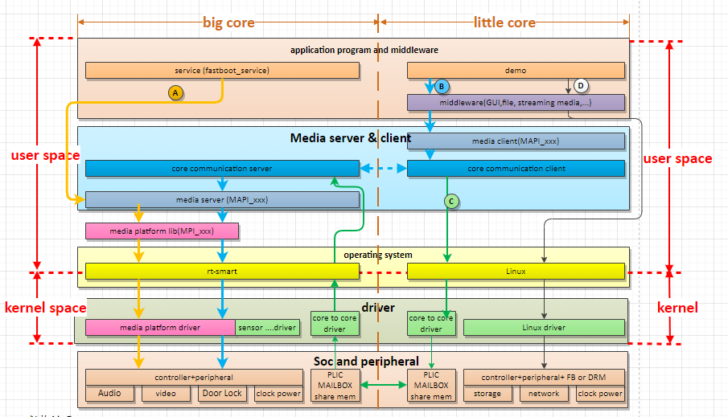

# K230 SDK instructions


Copyright 2023 Canaan Inc. ©

<div style="page-break-after:always"></div>

## Disclaimer

The products, services or features you purchase should be subject to Canaan Inc. ("Company", hereinafter referred to as "Company") and its affiliates are bound by the commercial contracts and terms and conditions of all or part of the products, services or features described in this document may not be covered by your purchase or use. Unless otherwise agreed in the contract, the Company does not provide any express or implied representations or warranties as to the correctness, reliability, completeness, merchantability, fitness for a particular purpose and non-infringement of any statements, information, or content in this document. Unless otherwise agreed, this document is intended as a guide for use only.

Due to product version upgrades or other reasons, the content of this document may be updated or modified from time to time without any notice.

## Trademark Notice

, "Canaan" and other Canaan trademarks are trademarks of Canaan Inc. and its affiliates. All other trademarks or registered trademarks that may be mentioned in this document are owned by their respective owners.

**Copyright 2023 Canaan Inc.. © All Rights Reserved.**
Without the written permission of the company, no unit or individual may extract or copy part or all of the content of this document without authorization, and shall not disseminate it in any form.

<div style="page-break-after:always"></div>

## Directory

[TOC]

## preface

### Overview

This document describes the installation and use of the K230 SDK.

### Reader object

This document (this guide) is intended primarily for:

- Technical Support Engineer
- Software Development Engineer

### Definition of acronyms

| abbreviation | illustrate |
|------|------|
|   sdk   |    Software Development Kit  |

### Revision history

| Document version number | Modify the description                   | Author | Date       |
| ---------- | -------------------------- | ------ | ---------- |
| V1.0       | Initial edition                       | Yang Guang   | 2023-03-10 |
| V1.1       | Added security image and EMMC burning instructions    | Wang Jianxin | 2023-04-07 |
| V1.2       | Added spinor image burning instructions       | Wang Jianxin | 2023-05-05 |
| V1.3       | Quick up and secure image instructions           | Wang Jianxin | 2023-05-29 |
| V1.4       | Description of the big core auto-starter procedure           | Haibo Hao | 2023-06-1  |
| v1.5       | USIP LP4                  | Wang Jianxin | 2023-06-12 |
| V1.6       | Modify the description of the big core auto-starter           | Zhao Zhongxiang | 2023-06-28  |
| v1.7 | Added the section on the partition of the boot medium and adjusted the chapter on image burning | Wang Jianxin | 2023-07-05 |
| v1.8 | Added CanMV-K230 motherboard information | Chen Haibin | 2023-10-11 |

## 1. Overview

### 1.1 SDK software architecture overview

The K230 SDK is a software development kit for the K230 development board, which contains the source code, toolchain and other related resources needed for development of Linux & RT-smart dual-core heterogeneous systems.

The K230 SDK software architecture hierarchy is shown in Figure 1-1:


Figure 1-1 K230 SDK software architecture

## 2. Set up the development environment

### 2.1 Supported Hardware

The hardware information documents [supported by the K230 platform can refer to the directory 00_hardware](../../../zh/00_hardware), where the hardware information documents for different motherboards are as follows:

| Motherboard type  | Motherboard hardware reference directory|
| --- | --- |
| K230-USIP-LP3-EVB |For specific hardware information, refer to: [00_hardware/K230_LP3](../../../zh/00_hardware/K230_LP3) |
| K230-USIP-LP4-EVB | For specific hardware information, refer to: [00_hardware/K230_LP4](../../../zh/00_hardware/K230_LP4)|
| K230-SIP-LP3-EVB | For specific hardware information, refer to: [00_hardware/K230D](../../../zh/00_hardware/K230D)|
| CanMV-K230 | For specific hardware information, refer to: [00_hardware](../../../zh/00_hardware/CanMV_K230)|

### 2.2 Development environment setup

#### 2.2.1 Compilation Environment

| Host environment                    | description                                                 |
|-----------------------------|------------------------------------------------------|
| Docker compilation environment              | The SDK provides a docker file, which can generate docker images for compiling the SDK |
| Ubuntu 20.04.4 LTS (x86_64) | The SDK can be compiled in the ubuntu 20.04 environment                      |

The K230 SDK needs to be compiled in the Linux environment, the SDK supports docker environment compilation, and the docker file() is released in the SDK development package,`tools/docker/Dockerfile` which can generate docker images. For details on how to use and compile dockerfiles, see Section 4.3.1.

The Docker image used by the SDK is based on ubuntu 20.04, if you do not use the docker compilation environment, you can refer to the content of dockerfile in the ubuntu 20.04 host environment, install the relevant HOST package and toolchain, and compile the SDK.

The K230 SDK has not been verified in the host environment of other Linux versions, and there is no guarantee that the SDK can be compiled in other environments.

#### 2.2.2 SDK development kit

The K230 SDK is released as a compressed package or downloaded using commands yourself`git clone https://github.com/kendryte/k230_sdk`.

### 2.3 preparation

This section uses the K230-USIP-LP3-EVB and CanMV-K230 motherboards as examples

#### 2.3.1 CanMV-K230

Please prepare the following hardware:

- CanMV-K230
- TypeC USB cable at least 1
- One network cable (optional)
- One HDMI cable
- SD card
- HDMI-enabled monitors

Note: CanMV-K230 motherboard power supply and serial port share a TypeC port, as shown below:


#### 2.3.2 K230-USIP-LP3-EVB

Please prepare the following hardware:

- K230-USIP-LP3-EVB
- Typec USB cable at least 2
- TypeC USB to Ethernet converter (optional)
- One network cable (optional)
- SD card (optional)

Note: The recommended TypeC USB to Ethernet model is<https://item.jd.com/5326738.html>

Refer to the K230 DEMO BOARD Resource Instructions to prepare the development board.

#### 2.3.3 Serial port

K230 motherboard provides two debugging serial ports through USB, using debugging serial ports under Windows, you need to install USB to serial port drivers, the driver download link is as follows:

<https://ftdichip.com/wp-content/uploads/2021/11/CDM-v2.12.36.4.U-WHQL-Certified.zip>

After installing the driver, the board is powered on, and the PC uses the type C data cable to connect the debugging serial port of the motherboard, and two USB serial port devices can be found, as shown in the following figure:


Figure 2-1 USB serial device

The above figure is an example of the debugging serial port `COM47`of the little core and the debugging serial port`COM48` of the big core.

Serial port baud rate setting: `115200 8N1`

## 3. Prepare for SDK installation

### 3.1 Install the SDK

The K230 SDK development package is released as a compressed package and used in the Linux environment.

### 3.2 SDK directory structure

The directory structure of the K230 SDK is shown in the following figure:

```shell
k230_sdk
├── configs
│   ├── k230_evb_defconfig
│   └── k230_evb_usiplpddr4_defconfig
│   └── k230d_defconfig
├── Kconfig
├── LICENSE
├── Makefile
├── parse.mak
├── README.md
├── repo.mak
├── src
│   ├── big
│   │   ├── mpp
│   │   ├── rt-smart
│   │   └── unittest
│   ├── common
│   │   ├── cdk
│   │   └── opensbi
│   ├── little
│   │   ├── buildroot-ext
│   │   ├── linux
│   │   └── uboot
│   └── reference
│       ├── ai_poc
│       ├── business_poc
│       └── fancy_poc
├── board
│   ├── common
│   │   ├── env
│   │   └── gen_image_cfg
│   │   ├── gen_image_script
│   │   └── post_copy_rootfs
│   ├── k230_evb_doorlock
│   └── k230_evb_peephole_device
└── tools
    ├── docker
    │   └── Dockerfile
    ├── doxygen
    ├── firmware_gen.py
    └── get_download_url.sh
```

The purpose of each directory is described below:

- `configs`: The board-level default configuration of the SDK is stored, mainly containing the following information: reference board type, toolchain path,

    Memory layout planning, storage planning configuration, etc

- `src`: Source code directory, divided into three directories: big core code (`big`), common combponents (`common`), and little core code (`little`).

   Big core code contains:`rt-smart` operating system,`mpp` , `unittest`

   Common components contain:`cdk` code and `opensbi`code

   Little core code contains:`linux` kernel code, `buildroot` code, `uboot`code

- `tools`: Stores various tools, scripts, etc. For example`kconfig`, `doxygen`, , `dockerfile`and so on
- `board`: Environment variables, image configuration files, file systems, etc

## 4. SDK compilation

### 4.1 Introduction to SDK compilation

The K230 SDK supports one-click compilation of large and little core operating systems and common components, and generates image files that can be programmed for deployment to the development board and start running. The username of the Linux system on the device is root without password;

### 4.2 SDK configuration

The K230 SDK uses Kconfig as the SDK configuration interface, and the board-level configuration supported by default is placed in the configs directory.

#### 4.2.1 Configuration File Description

`k230_evb_defconfig` : Default SDK profile based on K230 USIP LP3 EVB
`k230_evb_usiplpddr4_defconfig` : Default SDK profile based on K230 USIP LP4 EVB
`k230d_defconfig` : Default SDK profile based on K230-SIP-LP3-EVB
`k230_evb_nand_defconfig` : Based on the K230 USIP LP3 EVB, the default SDK configuration file of the nand image is generated
`k230_canmv_defconfig` : Default SDK configuration file based on CanMV-K230
`k230_evb_doorlock_defconfig` : Door lock poc default SDK profile based on K230 USIP LP3 EVB
`k230_evb_peephole_device_defconfig` : Cat's eye POC based on K230 USIP LP3 EVB
`k230d_doorlock_defconfig` : Door lock POC based on K230-SIP-LP3-EVB

### 4.3 Compiling the SDK

#### 4.3.1 Compilation steps

Note: The commands in this section are for reference only, please replace the file name according to the actual situation.
Setp 1: Download the code

`git clone https://github.com/kendryte/k230_sdk`

Step 2: Enter the SDK root directory

`cd k230_sdk`

Step 3: Download toolchain

```shell
source tools/get_download_url.sh && make prepare_sourcecode
```

>`make prepare_sourcecode` will download both Linux and RT-Smart toolchain, buildroot package and AI package from Microsoft Azure cloud server with CDN, the download cost time may based on your network connection speed.

Step 4: Generate a docker image (required for the first compilation, skip this step after you have generated a docker image)

`docker build -f tools/docker/Dockerfile -t k230_docker tools/docker`

Step 5: Enter the docker environment,

`docker run -u root -it -v $(pwd):$(pwd) -v $(pwd)/toolchain:/opt/toolchain -w $(pwd) k230_docker /bin/bash`

Step 6: Run the following command in the Docker environment to compile the SDK

```bash
make CONF=k230_evb_defconfig  #compile K230-USIP-LP3-EVB image
#make CONF=k230_evb_usiplpddr4_defconfig  #compile K230-USIP-LP4-EVB image
#make CONF=k230d_defconfig  #compile K230-SIP-LP3-EVB iamge
#make CONF=k230_evb_nand_defconfig  #compile K230-USIP-LP3-EVB nand image
```

> - Compile the K230-USIP-LP4-EVB board image using the`make CONF=k230_evb_usiplpddr4_defconfig` command
> - Compile the K230-USIP-LP3-EVB board image using the`make CONF=k230_evb_defconfig`  command.
> - Compile the K230-SIP-LP3-EVB board image using the`make CONF=k230d_defconfig`  command.
> - Compile the nand image of the K230-USIP-LP3-EVB board using the `make CONF=k230_evb_nand_defconfig`  command
> - Compile the image of the CanMV-K230 board using the `make CONF=k230_canmv_defconfig`  command
>
> Remark:
The SDK does not support multi-process compilation, do not add multi-process compilation parameters like -j32.

#### 4.3.2 Compile the output product

After the compilation is complete, you `output/xx_defconfig/images`can see the compilation output in the directory. ls


Figure 4-1 Compilation product

`images`The image files in the directory are described as follows:

`sysimage-sdcard.img` ------------- are non-secure boot images for SD and EMMC;

`sysimage-sdcard.img.gz` -------- is a non-secure boot image archive (gzip archive of sysimage-sdcard.img file) of SD and emmc, which needs to be decompressed first when burning.

`sysimage-sdcard_aes.img.gz`It is an AES Secure Boot image compressed package for SD and EMMC, and you need to decompress it before flashing.

`sysimage-sdcard_sm.img.gz`It is an SM Secure Boot image compressed package of SD and EMMC, and you need to decompress it first when burning.

If you need a security image, refer to 4.3.4 to enable secure images.

The compilation products of the big core system are placed in`images/big-core` the directory.

The compilation products of the little core system are placed in`images/little-core` the directory.

#### 4.3.3 can enter uboot command image

The SDK compiles the fast image by default (uboot directly starts the system, will not enter the uboot command line), if you need to enter the uboot command line, please refer to the following to unconfigure`CONFIG_QUICK_BOOT`:

In the SDK home directory , select `make menuconfig` and `board configuration`cancel`quick boot` the Configuration option.

enter uboot command image becomes fast starting system method: Enter uboot command line execution`setenv quick_boot true;saveenv;`

#### 4.3.4 Secure image

The SDK does not generate a secure image by default, if you need a secure image, refer to the following CONFIG_GEN_SECURITY_IMG configuration:

In the home directory of the SDK`make menuconfig`, select `board configuration`and attach`create security image` the option.

#### 4.3.5 debug images

The SDK generates a release image by default, if you need to debug the image, refer to the following CONFIG_BUILD_DEBUG_VER configuration:

In the home directory of the SDK`make menuconfig`, select `build debug/release version`and attach`debug` the option.

## 5. SDK image flashing

According to the hardware characteristics and software requirements of different motherboards, select the supported image programming method.
> The CanMV-K230 motherboard only supports SD card image boot.

### 5.1 SD card image flashing

#### 5.1.1 Ubuntu burning

Before inserting the SD card into the host, enter:

`ls -l /dev/sd\*`

View the current storage device.

After inserting the SD card into the host, enter again:

`ls -l /dev/sd\*`

Looking at the storage devices at this time, the new addition is the SD card device node.

Assume that /dev/sdc is the sd card device node, run the following command to flash the SD card:

`sudo dd if=sysimage-sdcard.img of=/dev/sdc bs=1M oflag=sync`

Note: `sysimage-sdcard.img`It can be a `images`file in a directory`sysimage-sdcard.img`, or a`sysimage-sdcard_aes.img.gz` file after `sysimage-sdcard.img.gz`decompressed files`sysimage-sdcard_sm.img.gz`.

#### 5.1.2 Burning under Windows

Windows can burn the SD card through the balena Etcher tool (balena Etcher tool download address<https://www.balena.io/etcher/>).

1)Insert the TF card into the PC, then launch the balena Etcher tool, click the "Flash from file" button on the tool interface, and select the firmware to be programmed, as shown below.


Figure 5-1 Select firmware

2)Click the "Select target" button on the tool interface to select the target sdcard card.


Figure 5-2 Select an SD card

3)Click the "Flash" button to start flashing, the flashing process has a progress bar display, and Flash Finish will be prompted after flashing.

4)When the burning is completed, insert the SD card into the development board card slot, select BOOT to boot from SD, and finally power on the development board to boot from the SD card.


Figure 5-3 Start burning


Figure 5-4 Burning complete

>Note1: When using`sysimage-sdcard_aes.img.gz` , , `sysimage-sdcard.img.gz`files, `sysimage-sdcard_sm.img.gz`you need to decompress and burn the decompressed files.
>Note 2: When burning the image, other programs are forbidden to read and write sd card, please turn off the computer's auto play function (Settings - auto play).

### 5.2 EMMC image flashing reference

#### 5.2.1 Programming emm reference under Linux

1)Download the compressed package of the image to the SD card

Boot Linux from the SD card, under Linux, you can refer to the following command to download the compressed package of the image to the SD card

```shell
ifconfig eth0 up;udhcpc;mount /dev/mmcblk1p4 /mnt;cd /mnt/;

scp wangjianxin@10.10.1.94:/home/wangjianxin/k230_sdk/output/k230_evb_defconfig/images/sysimage-sdcard.img.gz  .
```

2)Unzip the package to EMMC

`gunzip sysimage-sdcard.img.gz -c >/dev/mmcblk0`

3)Cut into EMMC starts, restart the board

#### 5.2.1 Flashing EMMC reference under Uboot

1)Download the ssysimage-sdcard.img .gz image to memory.

```bash
usb start; dhcp;  tftp 0x900000010.10.1.94:wjx/sysimage-sdcard.img.gz;
 #note：Need to replace the 0x9000000 according to the memory size, for example, if the memory is only 128MB, you can replace it with 0x2400000
```

2)Write the image to EMMC

```bash
gzwrite mmc  0   0x${fileaddr}  0x${filesize};
```

3)Restart the board

### 5.3 Spinor image flashing reference

#### 5.3.1 Uboot under programming reference

1) Download the sysimage-spinor32m.img image to memory.

`usb start; dhcp; tftp 0x9000000 10.10.1.94:wjx/sysimage-spinor32m.img;
 #note: You need to replace the 0x9000000 according to the memory size, for example, if the memory is only 128M, you can replace it with 0x2400000

2)Write the image to SPI nor Flash

`sf probe 0:0;sf erase 0 0x2000000;sf write 0x$fileaddr 0 0x$filesize; sf remove;`

3)Restart the board

#### 5.3.2 Linux programming spinor

1) Download the spinor image sysimage-spinor32m.img to the sd card

Boot Linux from the SD card, under Linux, you can refer to the following command to image to the SD card

```bash
ifconfig eth0 up; udhcpc; mount /dev/mmcblk1p4 /mnt;cd /mnt/;
scp wangjianxin@10.10.1.94:/home/wangjianxin/k230_sdk/output/k230_evb_defconfig/images/sysimage-spinor32m.img  .
```

2)Refer to the following command to write the image to SPI nor Flash

```bash
[root@canaan /mnt ]#flashcp -v sysimage-spinor32m.img  /dev/mtd9
Erasing blocks: 508/508 (100%)
Writing data: 32512k/32512k (100%)
Verifying data: 32512k/32512k (100%)
[root@canaan /mnt ]#
```

3)change boot switch to  spi nor , restart the board

#### 5.3.3 Spinor Image Description

Because Spor Flash is relatively small, Linux deleted KO, RTT deleted some demo programs.

### 5.4. Spinand Image Programming Reference

#### 5.4.1 Programming reference under Uboot

1) Download the sysimage-spinand32m.img image to memory.

`usb start; dhcp;  tftp 0x9000000 10.10.1.94:wjx/sysimage-spinand32m.img;`

2)Write the image to SPI NAND flash

`mtd erase spi-nand0 0 0x2000000;mtd write spi-nand0 0x$fileaddr  0 0x$filesize;`

3)Restart the board

## 6. SDK boot media partitioning and modification

### 6.1 SPI NOR

#### 6.1.1 SPI NOR default partition

| Spi nor partition    |           |          |        |         |
| ------------- | --------- | -------- | ------ | ------- |
| content          | Start address  | size     | Size MB | size    |
| spl boot     | 0x0       | 512KB    | 0.5    | 512KB   |
| uboot     | 0x80000   | 0x160000 | 1.375  | 1.375MB |
| env | 0x1e0000  | 128KB    | 0.125  | 128KB   |
| fast boot config      | 0x200000  | 512KB    | 0.5    | 512KB   |
| face data      | 0x280000  | 512kB    | 0.5    | 512kB   |
| sensor config      | 0x300000  | 256KB    | 0.25   | 256KB   |
| AI models        | 0x340000  | 3MB      | 3      | 3MB     |
| Speckles          | 0x640000  | 2MB      | 2      | 2MB     |
| RTT           | 0x840000  | 0x1c0000 | 1.75   | 1.75MB  |
| rtapp         | 0xa00000  | 0x5c0000 | 5.75   | 3.75MB  |
| linux         | 0xfc0000  | 0x700000 | 7      | 7MB     |
| rootfs        | 0x16c0000 | 0xb00000 | 13     | 13MB    |

#### 6.1.2 Partition modification and implementation instructions

Execute make menuconfig --->storage configurations--->spi nor partion config in the sdk home directory to modify the partition (the interface is as follows); after modification, execute make build-image;


Modify the partition through menuconfig for detailed implementation instructions:

Make Menuconfig will generate .config after configuration (part of the content below)

```bash
CONFIG_SPI_NOR_SENSOR_CFG_CFG_BASE=0x300000
CONFIG_SPI_NOR_SENSOR_CFG_CFG_SIZE=0x40000
CONFIG_SPI_NOR_AI_MODE_CFG_BASE=0x340000
CONFIG_SPI_NOR_AI_MODE_CFG_SIZE=0x300000
CONFIG_SPI_NOR_SPECKLE_CFG_BASE=0x640000
CONFIG_SPI_NOR_SPECKLE_CFG_SIZE=0x200000
CONFIG_SPI_NOR_RTTK_BASE=0x840000
CONFIG_SPI_NOR_RTTK_SIZE=0x1c0000
CONFIG_SPI_NOR_RTT_APP_BASE=0xa00000
CONFIG_SPI_NOR_RTT_APP_SIZE=0x5c0000
CONFIG_SPI_NOR_LK_BASE=0xfc0000
CONFIG_SPI_NOR_LK_SIZE=0x700000
CONFIG_SPI_NOR_LR_BASE=0x16c0000
CONFIG_SPI_NOR_LR_SIZE=0x900000
```

The tools/menuconfig_to_code.sh script dynamically (the key scripts are below) modify the Linux device tree and board/common/gen_image_cfg/genimage-spinor .cfg files based on these definitions;

```bash
image sysimage-spinor32m.img {
    flash  {}
    flashtype = "spinor-32M-gd25lx256e"
    .....
    partition quick_boot_cfg {
        offset = ${CONFIG_SPI_NOR_QUICK_BOOT_CFG_BASE}
        image = "${quick_boot_cfg_data_file}"
        size = ${CONFIG_SPI_NOR_QUICK_BOOT_CFG_SIZE}
    }

    partition face_db {
        offset = ${CONFIG_SPI_NOR_FACE_DB_CFG_BASE}
        image = "${face_database_data_file}"
        size = ${CONFIG_SPI_NOR_FACE_DB_CFG_SIZE}
    }

    partition sensor_cfg {
        offset = ${CONFIG_SPI_NOR_SENSOR_CFG_CFG_BASE}
        image = "${sensor_cfg_data_file}"
        size = ${CONFIG_SPI_NOR_SENSOR_CFG_CFG_SIZE}
    }

    partition ai_mode {
        offset = ${CONFIG_SPI_NOR_AI_MODE_CFG_BASE}
        image = "${ai_mode_data_file}"
        size = ${CONFIG_SPI_NOR_AI_MODE_CFG_SIZE}
    }

    partition speckle_cfg {
        offset = ${CONFIG_SPI_NOR_SPECKLE_CFG_BASE}
        image = "${speckle_data_file}"
        size = ${CONFIG_SPI_NOR_SPECKLE_CFG_SIZE}
    }

    partition rtt {
        offset = ${CONFIG_SPI_NOR_RTTK_BASE}
        image = "big-core/rtt_system.bin"
        size = ${CONFIG_SPI_NOR_RTTK_SIZE}
    }
    partition rtt_app {
        offset = ${CONFIG_SPI_NOR_RTT_APP_BASE}
        image = "${rtapp_data_file}"
        size = ${CONFIG_SPI_NOR_RTT_APP_SIZE}
    }

    partition linux {
        offset = ${CONFIG_SPI_NOR_LK_BASE}
        image = "little-core/linux_system.bin"
        size = ${CONFIG_SPI_NOR_LK_SIZE}
    }
    partition rootfs_ubi {
        offset = ${CONFIG_SPI_NOR_LR_BASE}
        image = "rootfs.ubi"
        size = ${CONFIG_SPI_NOR_LR_SIZE}
    }
}
```

Finally, genimage parses the board/common/gen_image_cfg/genimage-spinor.cfg file and generates the correct image.

```bash
genimage --rootpath little-core/rootfs/ --tmppath genimage.tmp --inputpath images --outputpath images
--config board/common/gen_image_cfg/genimage-spinor.cfg
```

#### 6.1.3 Partition data format and generation process

At present, the data partitioned by parameters such as fast boot parameters, face data, sensor config, AI models, speckles, RTT, RTPp and other parameters are not encrypted, and the format and generation process are as follows:


The main build scripts are as follows:

```bsh
# For more detailed generation details, please read board/common/gen_image_script/gen_image_comm_func.sh file gen_cfg_part_bin
${k230_gzip} -f -k ${filename}  #gzip
sed -i -e "1s/\x08/\x09/"  ${filename}.gz
#add uboot head
${mkimage} -A riscv -O linux -T firmware -C gzip -a ${add} -e ${add} -n ${name}  -d ${filename}.gz  ${filename}.gzu;
python3  ${firmware_gen}   -i ${filename}.gzu -o fh_${filename} ${arg}; #add k230 firmware head

The corresponding execution process is printed as follows：
## + k230_priv_gzip -n8 -f -k speckle.bin
## + sed -i -e '1s/\x08/\x09/' speckle.bin.gz
## + mkimage -A riscv -O linux -T firmware -C gzip -a 0x14040000 -e 0x14040000 -n speckle -d speckle.bin.gz speckle.bin.gzu
## Image Name:   speckle
## Created:      Wed Jul  5 15:37:49 2023
## Image Type:   RISC-V Linux Firmware (gzip compressed)
## Data Size:    45 Bytes = 0.04 KiB = 0.00 MiB
## Load Address: 14040000
## Entry Point:  14040000
## + python3 /home/wangjianxin/k230_sdk/tools/firmware_gen.py -i speckle.bin.gzu -o fh_speckle.bin -n
## the magic is:  b'K230'
## ----- NO ENCRYPTION + HASH-256 -----
## the encryption type:  0
## mesg_hash:  b'3543e2038aedad88a29f8ee98983064367cc79f6e709ed7571df9b391884b8b1'
```

When uboot starts, it will parse the data of the check parameter partition (fast start parameters, face characteristics, calibration parameters, AI model, speckle, RTT, RTAPP), and read the parsed raw data to the correct location in the memory.

The location of each parameter partition in memory can be configured by making menuconfig--memory configuration (the reference interface is as follows)


#### 6.1.4 RTAPP and AI Mode partitioning special instructions

The app of the RTAPP partition cannot be executed repeatedly, the purpose of designing this partition is to save memory, and the memory may be released after the application of this partition is executed once, and it cannot be executed repeatedly;

When compiling, the pointer to the model file in the large-core romfs file system will be modified to the AI model area (see the script below), and the use method is the same as a normal file.

```bash
#board/common/gen_image_script/gen_image.sh
for f in ${all_kmode};
    do
        eval fstart="\${${f%%\.*}_start}"
        eval fsize="\${${f%%\.*}_size}"
        fstart=$(printf "0x%x" $((${fstart} + ${CONFIG_MEM_AI_MODEL_BASE})))
        fsize=$(printf "0x%x" ${fsize})
        sed -i "s/_bin_$f,/(char*)${fstart},/g" ${RTSMART_SRC_DIR}/kernel/bsp/maix3/applications/romfs.c
        sed -i "s/sizeof(_bin_$f)/${fsize}/g" ${RTSMART_SRC_DIR}/kernel/bsp/maix3/applications/romfs.c
    done
```

#### 6.1.5 SPI NOR validated models

gd25lx256e

### 6.2 SD and EMMC

#### 6.2.1 SD and EMMC default partitions

| SD and emmc cards are partitioned by default |           |            |        |       |
| ------------------ | --------- | ---------- | ------ | ----- |
| substance               | Start address  | Size value     | Size MB | size  |
| MBR partition table          | 0x0       | 0x100000   | 1      | 1MB   |
| Level 1 uboot          | 0x100000  | 0x80000    | 0.5    | 512KB |
| Spare level 1 boot       | 0x180000  | 0x60000    | 0.375  | 384KB |
| uboot environment variables      | 0x1e0000  | 0x20000    | 0.125  | 128KB |
| Level 2 uboot          | 0x200000  | 0x800000   | 0.5    | 8MB   |
| RTT                | 0xa00000  | 0x1400000  | 20     | 20MB  |
| linux              | 0x1e00000 | 0x6200000  | 98     | 98MB  |
| rootfs             | 0x8000000 | 0x5000000  | 80     | 80MB  |
| Test partition           | 0xd000000 | 0x10000000 | 256    | 256MB |

#### 6.2.2 SD and EMMC partition modifications

If you need partitioning, modify the board/common/gen_image_cfg/genimage-sdcard.cfg file, and execute make build-image after modification

### 6.3 NAND SPI

#### 6.3 SPI NAND default partition

| Spinand partition   |           |          |           |        |         |
| ------------- | --------- | -------- | --------- | ------ | ------- |
| substance          | Start address  | size     | Start address  | Size MB | size    |
| Level 1 uboot     | 0x0       | 512KB    | 0x0       | 0.5    | 512KB   |
| Level 2 uboot     | 0x80000   | 0x160000 | 0x80000   | 1.375  | 1.375MB |
| uboot environment variables | 0x1e0000  | 128KB    | 0x1e0000  | 0.125  | 128KB   |
| RTT           | 0x200000  | 0x800000 | 0x200000  | 8      | 8MB     |
| linux         | 0xa00000  | 0x700000 | 0xa00000  | 7      | 7MB     |
| rootfs        | 0x1100000 | 0xf00000 | 0x1100000 | 15     | 15MB    |

#### 6.3.2 SPI NAND partition modification

If you need partitioning, modify the board/common/gen_image_cfg/genimage-spinand.cfg file, and execute make build-image after modification

#### 6.3.4 SPI NAND validated models

w25n01gw

## 7. SDK memory configuration

Run under the k230_sdk `make menuconfig->Memory configuration`to configure the memory space used by each region, or you can directly compile configs/k230_evb_defconfig modification, and the description of each region is as follows

``` shell
CONFIG_MEM_TOTAL_SIZE="0x20000000"      #total memory size          can not modify
CONFIG_MEM_PARAM_BASE="0x00000000"      #parameter  start           can not modify
CONFIG_MEM_PARAM_SIZE="0x00100000"      #parameter  size            can not modify
CONFIG_MEM_IPCM_BASE="0x00100000"       #core communication start   can not modify
CONFIG_MEM_IPCM_SIZE="0x00100000"       #core communication size    can not modify
CONFIG_MEM_RTT_SYS_BASE="0x00200000"    #rtt memory start           can modify
CONFIG_MEM_RTT_SYS_SIZE="0x07E00000"    #rtt memory size            can modify
CONFIG_MEM_AI_MODEL_BASE="0x1FC00000"   #ai model start             can modify
CONFIG_MEM_AI_MODEL_SIZE="0x00400000"   #ai model size              can modify
CONFIG_MEM_LINUX_SYS_BASE="0x08000000"  #linux memory start         can modify
CONFIG_MEM_LINUX_SYS_SIZE="0x08000000"  #linux memory size          can modify
CONFIG_MEM_MMZ_BASE="0x10000000"        #core share memory start    can modify
CONFIG_MEM_MMZ_SIZE="0x0FC00000"        #core share memory size     can modify
CONFIG_MEM_BOUNDARY_RESERVED_SIZE="0x00001000"  #isolation area     can not modify
```

> CONFIG_MEM_LINUX_SYS_BASE requires a 2MB alignment

## 8. SDK board debugging

> The CanMV-K230 motherboard does not support single-board debugging because it does not lead to debugging GPIOs.

### 8.1 Preparation before commissioning

1. Download the software and DebugServer User Guide v5.6 <https://occ.t-head.cn/community/download>from the T-Head Platform`T-Head-DebugServer`, and install the software on your PC by referring to DebugServer User Guide v5.6`T-Head-DebugServer`


2.Prepare the flat-headed CKLINK, USB cable, K230 EVB board shown in the figure below


### 8.2 Debugging

1. Refer to the figure below to connect the CKLINK, K230 EVB board, and PC computer, and then power up the EVB.


2.Open the T-HeadDebugServer software installed in step 1 on the computer, and see a picture similar to the following to print the connection to explain that the connection is successful, if the connection fails, please refer to "DebugServer User Guide v5.6" to troubleshoot the cause of the failure.


3.Start riscv64-unknown-linux-gnu-gdb on the server that compiled the code, execute the target remote xx.xx.xx.xx1025 command to connect the board, and perform gdb debugging after the connection is successful.


## 9. The SDK starts

The current version compiles the generated image by default, and after burning it to the board, the big core will automatically run a face detection program, and the picture collected by the camera will be displayed on the display; After startup, you can exit the program by typing 'q' on the console side of the big core.

> 1. If the IMX335 camera is not connected to the EVB series motherboard, the program will report an error when starting the program, the program will automatically exit, and press Enter to return to the console.
> 1. If you need to cancel the auto-start function of the big core, you need to `k230_sdk/src/big/rt-smart/init.sh` comment out the contents of .
