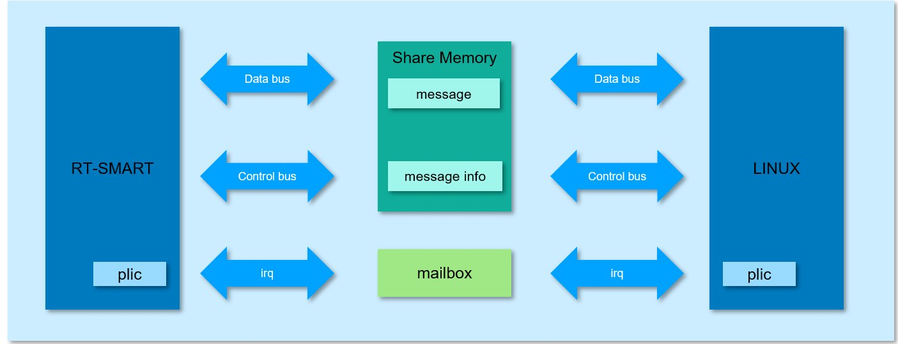

# K230 Intercore Communication API Reference


Copyright 2023 Canaan Inc. ©

<div style="page-break-after:always"></div>

## Disclaimer

The products, services or features you purchase should be subject to Canaan Inc. ("Company", hereinafter referred to as "Company") and its affiliates are bound by the commercial contracts and terms and conditions of all or part of the products, services or features described in this document may not be covered by your purchase or use. Unless otherwise agreed in the contract, the Company does not provide any express or implied representations or warranties as to the correctness, reliability, completeness, merchantability, fitness for a particular purpose and non-infringement of any statements, information, or content in this document. Unless otherwise agreed, this document is intended as a guide for use only.

Due to product version upgrades or other reasons, the content of this document may be updated or modified from time to time without any notice.

## Trademark Notice

, "Canaan" and other Canaan trademarks are trademarks of Canaan Inc. and its affiliates. All other trademarks or registered trademarks that may be mentioned in this document are owned by their respective owners.

**Copyright 2023 Canaan Inc.. © All Rights Reserved.**
Without the written permission of the company, no unit or individual may extract or copy part or all of the content of this document without authorization, and shall not disseminate it in any form.

<div style="page-break-after:always"></div>

## Directory

[TOC]

## preface

### Overview

This document mainly introduces the functions and usage of the system control module in the media subsystem, and the functions and usage of other modules will be discussed in their own special documents.

### Reader object

This document (this guide) is intended primarily for:

- Technical Support Engineer
- Software Development Engineer

### Definition of acronyms

| abbreviation   | illustrate                                     |
|--------|------------------------------------------|
| ipcm   | internal processor communication module  |
| IPCMSG | internal processor communication message |

### Revision history

| Document version number | Modify the description | Author | date     |
|------------|----------|--------|----------|
| v1.0       | Initial edition     | Haibo Hao | 2023/3/8 |

## 1. Overview

### 1.1 Overview

This document describes the K230 heterogeneous internuclear communication.

#### 1.1.1 Internuclear communication implementation principle



- Shared memory is used for large and little cores to send the specific content of communication messages
- Shared memory management is used to identify the properties of communication messages such as address, size, port number, etc
- Mailbox implements the notification mechanism after the large and little cores send messages through interrupts

#### 1.1.2 Memory Space Usage

At present, the data sharing memory area used by large and little cores is designed to have a total of 1M space, and for the party involved in communication, the sending and receiving space each occupies 512KB of space. The area of shared memory used to maintain the state of individual cores is 4KB.

### 1.2 Function Description

#### 1.2.1 IPCMSG

IPCMSG is a component of K230 large and little cores that communicates in user mode, mainly for sending control messages. This module includes functions such as service addition and deletion, message creation and deletion, disconnection, sending messages, etc. Support three message sending methods, send asynchronous messages, send synchronous messages, and send messages that do not require a reply. The timeout mechanism is supported for synchronous messages, and the timeout period can be set when users call APIs. If a message that needs to be replied to is received 60 seconds after it is sent, the reply message will be discarded.

#### 1.2.2 DATAFIFO

DATAFIFO is an inter-core communication component used by K230 large and little cores when large and little cores interact with a large amount of data (such as encoding data) in user mode. The internal main use of shared memory to complete the interaction of data, the data is passed pointers, the content of the data will not be copied, and the sending and receiving notifications of data rely on thread polling to achieve.

DATAFIFO mainly contains the opening, closing, writing and reading of data, and other control commands

## 2. API Reference

### 2.1 IPCMSG

This function module provides the following APIs:

- [kd_ipcmsg_add_service](#211-kd_ipcmsg_add_service)
- [kd_ipcmsg_del_service](#212-kd_ipcmsg_del_service)
- [kd_ipcmsg_try_connect](#213-kd_ipcmsg_try_connect)
- [kd_ipcmsg_connect](#214-kd_ipcmsg_connect)
- [kd_ipcmsg_disconnect](#215-kd_ipcmsg_disconnect)
- [kd_ipcmsg_is_connect](#216-kd_ipcmsg_is_connect)
- [kd_ipcmsg_send_only](#217-kd_ipcmsg_send_only)
- [kd_ipcmsg_send_async](#218-kd_ipcmsg_send_async)
- [kd_ipcmsg_send_sync](#219-kd_ipcmsg_send_sync)
- [kd_ipcmsg_run](#2110-kd_ipcmsg_run)
- [kd_ipcmsg_create_message](#2111-kd_ipcmsg_create_message)
- [kd_ipcmsg_create_resp_message](#2112-kd_ipcmsg_create_resp_message)
- [kd_ipcmsg_destory_message](#2113-kd_ipcmsg_destroy_message)

#### 2.1.1 kd_ipcmsg_add_service

【Description】

Add a service

【Syntax】

k_s32 kd_ipcmsg_add_service(const k_char\* pszServiceName, const [k_ipcmsg_connect_s](#314-k_ipcmsg_connect_s)* pstConnectAttr);

【Parameters】

| **Parameter name**         | **Description**                          | **Input/output** |
|-----------------|-------------------------------|-----------|
| pszServiceName  | A pointer to the name of the service.            | input      |
| pstConnectAttr  | The property structure of the connecting peer server.  | input      |

【Return value】

| **Return value**   | **Description**                            |
|---------|---------------------------------|
| 0       | Succeed.                          |
| Non-0    | Failed with the value of [error code](#41-ipcmsg) |

【Differences】

none

【Requirement】

- Header file: k_comm_ipcmsg.h k_ipcmsg.h
- Library file: libipcmsg.a

【Note】

Multiple services can be added, but different services cannot use the same port number, and the client and service are connected

The same port number is used to communicate, so one service can correspond to one client

【Example】

none

【See Also】

[kd_ipcmsg_del_service](#212-kd_ipcmsg_del_service)

#### 2.1.2 kd_ipcmsg_del_service

【Description】

Delete the service

【Syntax】

k_s32 kd_ipcmsg_del_service(const k_char* pszServiceName);

【Parameters】

| **Parameter name**         | **Description**                                                              | **Input/output** |
|-----------------|-------------------------------------------------------------------|-----------|
| pszServiceName  | A pointer to the name of the service. Maximum length of service name: K_IPCMSG_MAX_SERVICENAME_LEN. | input      |

【Return value】

| **Return value**   | **Description**                            |
|---------|---------------------------------|
| 0       | Succeed.                          |
| Non-0    | Failed with the value of [error code](#41-ipcmsg) |

【Differences】

none

【Requirement】

- Header file: k_comm_ipcmsg.h k_ipcmsg.h
- Library file: libipcmsg.a

【Note】

none

【Example】

none

【See Also】

[kd_ipcmsg_create_resp_message](#2112-kd_ipcmsg_create_resp_message)

#### 2.1.3 kd_ipcmsg_try_connect

【Description】

The connection is established in non-blocking mode

【Syntax】

k_s32 kd_ipcmsg_try_connect(k_s32\* ps32Id, const k_char\* pszServiceName, [k_ipcmsg_handle_fn_ptr](#316-k_ipcmsg_handle_fn_ptr) pfnMessageHandle);

【Parameters】

| **Parameter name**           | **Description**                | **Input/output** |
|-------------------|---------------------|-----------|
| ps32Id            | Message communication ID pointer.  | output      |
| pszServiceName    | Service name pointer.      | input      |
| pfnMessageHandle  | Message handling callback functions.  | input      |

【Return value】

| **Return value**   | **Description**                            |
|---------|---------------------------------|
| 0       | Succeed.                          |
| Non-0    | Failed with the value of [error code](#41-ipcmsg) |

【Differences】

none

【Requirement】

- Header file: k_comm_ipcmsg.h k_ipcmsg.h
- Library file: libipcmsg.a

【Note】

none

【Example】

none

【See Also】

[kd_ipcmsg_connect](#214-kd_ipcmsg_connect)

[kd_ipcmsg_disconnect](#215-kd_ipcmsg_disconnect)

#### 2.1.4 kd_ipcmsg_connect

【Description】

Blocking mode establishes the connection

【Syntax】

k_s32 kd_ipcmsg_connect(k_s32\* ps32Id, const k_char\* pszServiceName, [k_ipcmsg_handle_fn_ptr](#316-k_ipcmsg_handle_fn_ptr) pfnMessageHandle);

【Parameters】

| **Parameter name**           | **Description**                | **Input/output** |
|-------------------|---------------------|-----------|
| ps32Id            | Message communication ID pointer.  | output      |
| pszServiceName    | Service name pointer.      | input      |
| pfnMessageHandle  | Message handlers.      | input      |

【Return value】

| **Return value**   | **Description**                            |
|---------|---------------------------------|
| 0       | Succeed.                          |
| Non-0    | Failed with the value of [error code](#41-ipcmsg) |

【Differences】

none

【Requirement】

- Header file: k_comm_ipcmsg.h k_ipcmsg.h
- Library file: libipcmsg.a

【Note】

none

【Example】

none

【See Also】

[kd_ipcmsg_try_connect](#213-kd_ipcmsg_try_connect)

[kd_ipcmsg_disconnect](#215-kd_ipcmsg_disconnect)

#### 2.1.5 kd_ipcmsg_disconnect

【Description】

Disconnect

【Syntax】

k_s32 kd_ipcmsg_disconnect(k_s32 s32Id);

【Parameters】

| **Parameter name**   | **Description**           | **Input/output** |
|-----------|----------------|-----------|
| s32Id     | The message communication ID.  | input      |

【Return value】

| **Return value**   | **Description**                            |
|---------|---------------------------------|
| 0       | Succeed.                          |
| Non-0    | Failed with the value of [error code](#41-ipcmsg) |

【Differences】

none

【Requirement】

- Header file: k_comm_ipcmsg.h k_ipcmsg.h
- Library file: libipcmsg.a

【Note】

none

【Example】

none

【See Also】

[kd_ipcmsg_try_connect](#213-kd_ipcmsg_try_connect)

[kd_ipcmsg_connect](#214-kd_ipcmsg_connect)

#### 2.1.6 kd_ipcmsg_is_connect

【Description】

Whether the message communication is connected status.

【Syntax】

k_bool kd_ipcmsg_is_connect(k_s32 s32Id);

【Parameters】

| **Parameter name**   | **Description**           | **Input/output** |
|-----------|----------------|-----------|
| s32Id     | The message communication ID.  | input      |

【Return value】

| **Return value**    | **Description**         |
|----------|--------------|
| K_TRUE   | Connection status.   |
| K_FALSE  | Non-connected state. |

【Differences】

none

【Requirement】

- Header file: k_comm_ipcmsg.h k_ipcmsg.h
- Library file: libipcmsg.a

【Note】

none

【Example】

none

【See Also】

#### 2.1.7 kd_ipcmsg_send_only

【Description】

Only sends messages to peers and does not receive return values from peers

【Syntax】

k_s32 kd_ipcmsg_send_only(k_s32 s32Id, [k_ipcmsg_message_s](#315-k_ipcmsg_messsage_s) *pstRequest);

【Parameters】

| **Parameter name**     | **Description**                | **Input/output** |
|-------------|---------------------|-----------|
| s32Id       | Message service ID.       | input      |
| pstRequest  | A pointer to the message structure.  | input      |

【Return value】

| **Return value**  | **Description**                        |
|-------------|---------------------------------|
| 0           | Succeed.                          |
| Non-0        | Failed with the value of [error code](#41-ipcmsg) |

【Differences】

none

【Requirement】

- Header file: k_comm_ipcmsg.h k_ipcmsg.h
- Library file: libipcmsg.a

【Note】

none

【Example】

none

【See Also】

#### 2.1.8 kd_ipcmsg_send_async

【Description】

Send asynchronous messages. This interface is a non-blocking interface, which returns after sending a message to the peer without waiting for the processing of the message command.

If you call this interface to send a reply message, you do not need to reply to the peer, otherwise the peer must reply

【Syntax】

k_s32 kd_ipcmsg_send_async(k_s32 s32Id, [k_ipcmsg_message_s](#315-k_ipcmsg_messsage_s)* pstMsg, k_ipcmsg_resphandle_fn_ptr pfnRespHandle);

【Parameters】

| **Parameter name**        | **Description**                                                                   | **Input/output** |
|----------------|------------------------------------------------------------------------|-----------|
| s32Id          | Message service ID.                                                          | input      |
| pstMsg         | Message pointer.                                                             | input      |
| pfnRespHandle  | Message reply handler. NULL is possible when sending a reply message, otherwise NULL is not allowed. | input      |

【Return value】

| **Return value**   | **Description**                            |
|---------|---------------------------------|
| 0       | Succeed.                          |
| Non-0    | Failed with the value of [error code](#41-ipcmsg) |

【Differences】

none

【Requirement】

- Header file: k_comm_ipcmsg.h k_ipcmsg.h
- Library file: libipcmsg.a

【Note】

none

【Example】

none

【See Also】

#### 2.1.9 kd_ipcmsg_send_sync

【Description】

Send a synchronization message. This interface blocks waiting for the peer message command to finish processing before returning.

【Syntax】

k_s32 kd_ipcmsg_send_sync(k_s32 s32Id, [k_ipcmsg_message_s](#315-k_ipcmsg_messsage_s)* pstMsg [k_ipcmsg_message_s](#315-k_ipcmsg_messsage_s)** ppstMsg, k_s32 s32TimeoutMs);

【Parameters】

| **Parameter name**       | **Description**                    | **Input/output** |
|---------------|-------------------------|-----------|
| s32Id         | Message service ID.           | input      |
| pstMsg        | Message pointer.              | input      |
| ppstMsg       | A pointer to the pointer to reply to the message.  | output      |
| s32TimeoutMs  | Timeout. Unit: ms.    | input      |

【Return value】

| **Return value**   | **Description**                            |
|---------|---------------------------------|
| 0       | Succeed.                          |
| Non-0    | Failed with the value of [error code](#41-ipcmsg) |

【Differences】

none

【Requirement】

- Header file: k_comm_ipcmsg.h k_ipcmsg.h
- Library file: libipcmsg.a

【Note】

If this interface times out, the internal call [kd_ipcmsg_destory_message *](#2113-kd_ipcmsg_destroy_message)ppstMsg (reply cancellation

Since the same message cannot be destroyed repeatedly, this interface does not need to be destroyed after the timeout exit

Processing of reply messages

【Example】

none

【See Also】

#### 2.1.10 kd_ipcmsg_run

【Description】

Message handlers

【Syntax】

k_void kd_ipcmsg_run(k_s32 s32Id);

【Parameters】

| **Parameter name**   | **Description**           | **Input/output** |
|-----------|----------------|-----------|
| s32Id     | Message service ID.  | input      |

【Return value】

| **Return value**   | **** Description|
|---------|------|
| void    | not   |

【Differences】

none

【Requirement】

- Header file: k_comm_ipcmsg.h k_ipcmsg.h
- Library file: libipcmsg.a

【Note】

none

【Example】

none

【See Also】

#### 2.1.11 kd_ipcmsg_create_message

【Description】

Create a message

【Syntax】

[k_ipcmsg_message_s *](#315-k_ipcmsg_messsage_s)kd_ipcmsg_create_message(k_u32 u32Module, k_u32 u32CMD, k_void*
pBody, k_u32 u32BodyLen);

【Parameters】

| **Parameter name**     | **Description**                                                       | **Input/output** |
|-------------|------------------------------------------------------------|-----------|
| u32Modules   | Module ID. Created by the user to distinguish between different messages for different modules.          | input      |
| u32CMD      | u32CMD command ID. Created by the user to distinguish between different commands under the same module. | input      |
| pBody       | Message body pointer                                                 | input      |
| u32BodyLen  | Message body size                                                 | input      |

【Return value】

| **Return value**                 | **Description**             |
|-----------------------|------------------|
| k_ipcmsg_message_s*  | Message structure pointer. |
| null                  | Message creation failed     |

【Differences】

none

【Requirement】

- Header file: k_comm_ipcmsg.h k_ipcmsg.h
- Library file: libipcmsg.a

【Note】

none

【Example】

none

【See Also】

[kd_ipcmsg_destory_message](#2113-kd_ipcmsg_destroy_message)

#### 2.1.12 kd_ipcmsg_create_resp_message

【Description】

Create a reply message

【Syntax】

[k_ipcmsg_message_s](#315-k_ipcmsg_messsage_s)\* kd_ipcmsg_create_resp_message([k_ipcmsg_message_s](#315-k_ipcmsg_messsage_s)\* pstRequest, k_s32 s32RetVal, k_void* pBody, k_u32 u32BodyLen);

【Parameters】

| **Parameter name**     | **Description**                    | **Input/output** |
|-------------|-------------------------|-----------|
| pstRequest  | A pointer to the request message.        | input      |
| s32RetVal   | Reply return value.            | input      |
| pBody       | Message body pointer to reply to a message.  | input      |
| u32BodyLen  | The message body size of the reply message.  | input      |

【Return value】

| **Return value**                 | **Description**             |
|-----------------------|------------------|
| k_ipcmsg_message_s*  | Message structure pointer. |
| null                  | Message creation failed     |

【Differences】

none

【Requirement】

- Header file: k_comm_ipcmsg.h k_ipcmsg.h
- Library file: libipcmsg.a

【Note】

none

【Example】

none

【See Also】

[kd_ipcmsg_destory_message](#2113-kd_ipcmsg_destroy_message)

#### 2.1.13 kd_ipcmsg_destroy_message

【Description】

Destroy the message

【Syntax】

k_void kd_ipcmsg_destroy_message([k_ipcmsg_message_s](#315-k_ipcmsg_messsage_s)* pstMsg);

【Parameters】

| **Parameter name**   | **Description**        | **Input/output** |
|-----------|-------------|-----------|
| pstMsg    | Message pointer.  | input      |

【Return value】

| **Return value**   | **** Description|
|---------|------|
| k_void  | not   |

【Differences】

none

【Requirement】

- Header file: k_comm_ipcmsg.h k_ipcmsg.h
- Library file: libipcmsg.a

【Note】

Repeated destruction of the same message is not supported, otherwise it will cause system exceptions.

【Example】

none

【See Also】

[kd_ipcmsg_create_message](#2111-kd_ipcmsg_create_message)

[kd_ipcmsg_create_resp_message](#2112-kd_ipcmsg_create_resp_message)

### 2.2 DATAFIFO

This function module provides the following APIs:

- [kd_datafifo_open](#221-kd_datafifo_open)
- [kd_datafifo_open_by_addr](#222-kd_datafifo_open_by_addr)
- [kd_datafifo_close](#223-kd_datafifo_close)
- [kd_datafifo_read](#224-kd_datafifo_read)
- [kd_datafifo_write](#225-kd_datafifo_write)
- [kd_datafifo_cmd](#226-kd_datafifo_cmd)

#### 2.2.1 kd_datafifo_open

【Description】

Open the data path.

【Syntax】

k_s32 kd_datafifo_open([k_datafifo_handle](#321-k_datafifo_handle)\* Handle, [k_datafifo_params_s](#325-k_datafifo_params_s)\* pstParams)

【Parameters】

| **Parameter name**    | **Description**                | **Input/output** |
|------------|---------------------|-----------|
| Handle     | Data path handle.      | output      |
| pstParams  | Data path parameter pointer.  | input      |

【Return value】

| **Return value**   | **Description**                                |
|---------|-------------------------------------|
| 0       | Succeed.                              |
| Non-0    | Failed with a value of [error code](#42-datafifo). |

【Differences】

none

【Requirement】

- Header file: k_datafifo.h
- Library file: libdatafifo.a

【Note】

none

【Example】

none

#### 2.2.2 kd_datafifo_open_by_addr

【Description】

Open the data path through a physical address.

【Syntax】

k_s32 kd_datafifo_open_by_addr([k_datafifo_handle](#321-k_datafifo_handle) \*Handle, [k_datafifo_params_s](#325-k_datafifo_params_s) *pstParams, k_u64 u64Phyaddr)

【Parameters】

| **Parameter name**     | **Description**                  | **Input/output** |
|-------------|-----------------------|-----------|
| Handle      | Data path handle.        | output      |
| pstParams   | Data path parameter pointer.    | input      |
| u32PhyAddr  | The physical address of the data cache.  | input      |

【Return value】

| **Return value**   | **Description**                                |
|---------|-------------------------------------|
| 0       | Succeed.                              |
| Non-0    | Failed with a value of [error code](#42-datafifo). |

【Differences】

none

【Requirement】

- Header file: k_datafifo.h
- Library file: libdatafifo.a

【Note】

none

【Example】

none

#### 2.2.3 kd_datafifo_close

【Description】

Close the data path.

【Syntax】

k_s32 kd_datafifo_close([k_datafifo_handle](#321-k_datafifo_handle) Handle)

【Parameters】

| **Parameter name**   | **Description**            | **Input/output** |
|-----------|-----------------|-----------|
| Handle    | Data path handle.  | input      |

【Return value】

| **Return value**   | **Description**                                |
|---------|-------------------------------------|
| 0       | Succeed.                              |
| Non-0    | Failed with a value of [error code](#42-datafifo). |

【Differences】

none

【Requirement】

- Header file: k_datafifo.h
- Library file: libdatafifo.a

【Note】

When DataFifo is turned off, in order to ensure the normal release of data on both sides of the read/write end, the user needs to ensure that the reader finishes reading the data existing in the DataFifo[, and the writing end needs to call an additional kd_datafifo_write (](#225-kd_datafifo_write)Handle, NULL) after writing the data to trigger the data release and read pointer update on the write side

【Example】

none

#### 2.2.4 kd_datafifo_read

【Description】

Read the data.

【Syntax】

k_s32 kd_datafifo_read([k_datafifo_handle](#321-k_datafifo_handle) Handle, void** ppData)

【Parameters】

| **Parameter name**   | **Description**                    | **Input/output** |
|-----------|-------------------------|-----------|
| Handle    | Data path handle.          | input      |
| ppData    | A pointer to the read data pointer.  | output      |

【Return value】

| **Return value**   | **Description**                                |
|---------|-------------------------------------|
| 0       | Succeed.                              |
| Non-0    | Failed with a value of [error code](#42-datafifo). |

【Differences】

none

【Requirement】

- Header file: k_datafifo.h
- Library file: libdatafifo.a

【Note】

none

【Example】

none

#### 2.2.5 kd_datafifo_write

【Description】

Write data.

【Syntax】

k_s32 kd_datafifo_write([k_datafifo_handle](#321-k_datafifo_handle) Handle, void* pData)

【Parameters】

| **Parameter name**   | **Description**            | **Input/output** |
|-----------|-----------------|-----------|
| Handle    | Data path handle.  | input      |
| pData     | The data written.    | input      |

【Return value】

| **Return value**   | **Description**                                |
|---------|-------------------------------------|
| 0       | Succeed.                              |
| Non-0    | Failed with a value of [error code](#42-datafifo). |

【Differences】

none

【Requirement】

- Header file: k_datafifo.h
- Library file: libdatafifo.a

【Note】
When pData is NULL, the data release callback function on the write side is triggered, and the read pointer on the write side is updated.

【Example】

none

#### 2.2.6 kd_datafifo_cmd

【Description】

Other operations.

【Syntax】

k_s32 kd_datafifo_cmd([k_datafifo_handle](#321-k_datafifo_handle) Handle, [k_datafifo_cmd_e](#326-k_datafifo_cmd_e) enCMD, void* pArg)

【Parameters】

| **Parameter name**   | **Description**                  | **Input/output** |
|-----------|-----------------------|-----------|
| Handle    | Data path handle.        | input      |
| enCMD     | Action commands.            | input      |
| pArg      | Parameters, see [Note] for details.  | **Input/output** |

【Return value】

| **Return value**  | **Description**                            |
|-------------|-------------------------------------|
| 0           | Succeed.                              |
| Non-0        | Failed with a value of [error code](#42-datafifo). |

【Differences】

none

【Requirement】

- Header file: k_datafifo.h
- Library file: libdatafifo.a

【Note】
Control commands and corresponding parameters:

| command                                     | Parameters along with descriptions                                                                                                                                                                                               |
|------------------------------------------|------------------------------------------------------------------------------------------------------------------------------------------------------------------------------------------------------------|
| DATAFIFO_CMD_GET_PHY_ADDR                | Returns the physical address of DATAFIFO, k_u64 type.                                                                                                                                                                      |
| DATAFIFO_CMD_READ_DONE                   | After the read end uses the data, it needs to call the head-to-tail pointer of this update read.                                                                                                                                                       |
| DATAFIFO_CMD_WRITE_DONE                  | After the writer finishes writing the data, you need to call the write-tail pointer of the update writer. No return value and the parameter can be NULL.                                                                                                                                |
| DATAFIFO_CMD_SET_DATA_RELEASE \_CALLBACK | Data release callback function.                                                                                                                                                                                         |
| DATAFIFO_CMD_GET_AVAIL_WRITE\_ ONLY       | Returns the number of data that can be written, k_u32 type. Note: Due to the need to keep a data item to assist buffer management, the length of the data that can actually be used for cache is one data item less than the length of the configured DATAFIFO u32EntriesNum* u32CacheLineSize). |
| DATAFIFO_CMD_GET_AVAIL_READ_L IN         | Returns the number of data that can be read, k_u32 type                                                                                                                                                                           |

【Example】

none

## 3. Data Type

### 3.1 IPCMSG

The module has the following data types

- [K_IPCMSG_MAX_CONTENT_LEN](#311-k_ipcmsg_max_content_len)
- [K_IPCMSG_PRIVDATA_NUM](#312-k_ipcmsg_privdata_num)
- [K_IPCMSG_INVALID_MSGID](#313-k_ipcmsg_invalid_msgid)
- [k_ipcmsg_connect_s](#314-k_ipcmsg_connect_s)
- [k_ipcmsg_message_s](#315-k_ipcmsg_messsage_s)
- [k_ipcmsg_handle_fn_ptr](#316-k_ipcmsg_handle_fn_ptr)

#### 3.1.1 K_IPCMSG_MAX_CONTENT_LEN

【Description】

Defines the maximum length of the message body.

【Definition】

```C
#define K_IPCMSG_MAX_CONTENT_LEN (1024)
```

【Note】

none

【See Also】

none

The module has the following data types

#### 3.1.2 K_IPCMSG_PRIVDATA_NUM

【Description】

Defines the maximum number of private data in the message body.

【Definition】

```C
#define K_IPCMSG_MAX\_ PRIVDATA_NUM (8)
```

【Note】

none

【See Also】

none

#### 3.1.3 K_IPCMSG_INVALID_MSGID

【Description】

Defines an invalid message ID.

【Definition】

```C
#define K_IPCMSG_INVALID_MSGID (0xFFFFFFFFFFFFFFFF)
```

【Note】

none

【See Also】

none

#### 3.1.4 k_ipcmsg_connect_s

【Description】

Defines the module ID enumeration type.

【Definition】

```C

typedef struct IPCMSG_CONNECT_S

{

k_u32 u32RemoteId;

k_u32 u32Port;

k_u32 u32Priority;

} k_ipcmsg_connect_s;
```

【Members】

| **Member Name** | **Description**                                                             |
|--------------|----------------------------------------------------------------------|
| u32RemoteId  | An enumeration value that identifies the remote CPU that connects. 0: small nucleus; 1: large nucleus                        |
| u32Port      | Custom port number for messaging Value range: \[0, 512\]                        |
| u32Priority  | The priority of the messaging. The value range is 0: normal priority; 1: high priority. The default is 0 |

【Note】

none

【See Also】

[kd_ipcmsg_add_service](#211-kd_ipcmsg_add_service)

#### 3.1.5 k_ipcmsg_messsage_s

【Description】

Define the message structure.

【Definition】

``` C

typedef struct IPCMSG_MESSAGE_S

{

k_bool bIsResp; /**<Identify the response messgae*/

k_u64 u64Id; /**<Message ID*/

k_u32 u32Module; /**<Module ID, user-defined*/

k_u32 u32CMD; /**<CMD ID, user-defined*/

k_s32 s32RetVal; /**<Retrun Value in response message*/

k_s32 as32PrivData[K_IPCMSG_PRIVDATA_NUM]; /**<Private data, can be modify directly after ::kd_ipcmsg_create_message or ::kd_ipcmsg_create_resp_message*/

void* pBody; /**<Message body*/

k_u32 u32BodyLen; /**<Length of pBody*/

} k_ipcmsg_message_t;
```

【Members】

| **Member name**     | **Description**                                                      |
|---------------|-----------------------------------------------------------|
| bIsResp       | Indicate whether the message replies to the message: K_TURE: reply; K_FALSE: do not reply. |
| u64Id         | Message ID.                                                 |
| u32Modules     | Module ID.                                                 |
| u32CMD        | CMD ID。                                                  |
| s32RetVal     | Return value.                                                  |
| as32PrivData  | Private data.                                                |
| pBody         | Message body pointer.                                              |
| u32BodyLen    | Message body length, in bytes                                      |

【Note】

none

【See Also】

- [kd_ipcmsg_send_only](#217-kd_ipcmsg_send_only)
- [kd_ipcmsg_send_async](#218-kd_ipcmsg_send_async)
- [kd_ipcmsg_send_sync](#219-kd_ipcmsg_send_sync)
- [kd_ipcmsg_create_message](#2111-kd_ipcmsg_create_message)
- [kd_ipcmsg_create_resp_message](#2112-kd_ipcmsg_create_resp_message)
- [kd_ipcmsg_destory_message](#2113-kd_ipcmsg_destroy_message)

#### 3.1.6 k_ipcmsg_handle_fn_ptr

【Description】

Defines a message reply handler

【Definition】

```C
typedef void (*k_ipcmsg_handle_fn_ptr)(k_s32 s32Id, k_ipcmsg_message_s* pstMsg);
```

【Members】

| **Member Name** | **Description**   |
|--------------|------------|
| s32Id        | Message service ID |
| pstMsg       | Message body pointer |

【Note】

none

【See Also】

- [kd_ipcmsg_try_connect](#213-kd_ipcmsg_try_connect)
- [kd_ipcmsg_connect](#214-kd_ipcmsg_connect)

### 3.2 DATAFIFO

This module has the following data structures

- [k_datafifo_handle](#321-k_datafifo_handle)
- [K_DATAFIFO_INVALID_HANDLE](#322-k_datafifo_invalid_handle)
- [K_DATAFIFO_RELEASESTREAM_FN_PTR](#323-k_datafifo_releasestream_fn_ptr)
- [K_DATAFIFO_OPEN_MODE_E](#324-k_datafifo_open_mode_e)
- [k_datafifo_params_s](#325-k_datafifo_params_s)
- [k_datafifo_cmd_e](#326-k_datafifo_cmd_e)

#### 3.2.1 k_datafifo_handle

【Description】

DEFINE A DATAFIFO HANDLE

【Definition】

```C
typedef K_U32 K_DATAFIFO_HANDLE;
```

【Members】

| **Member Name** | **Description**   |
|--------------|------------|
| s32Id        | Message service ID |
| pstMsg       | Message body pointer |

【Note】

none

【See Also】

none

#### 3.2.2 K_DATAFIFO_INVALID_HANDLE

【Description】

Defines an invalid handle to the data path.

【Definition】

```C
#define K_DATAFIFO_INVALID_HANDLE (-1)
```

【Note】

none

【See Also】

none

#### 3.2.3 K_DATAFIFO_RELEASESTREAM_FN_PTR

【Description】

Define a data path stream release function.

【Definition】

```C
typedef void (*K_DATAFIFO_RELEASESTREAM_FN_PTR)(void* pStream);
```

【Note】

none

【See Also】

none

#### 3.2.4 K_DATAFIFO_OPEN_MODE_E

【Description】

Define the data path open mode.

【Definition】

```C

typedef struct k_DATAFIFO_PARAMS_S

{

k_u32 u32EntriesNum; /**< The number of items in the ring buffer*/

k_u32 u32CacheLineSize; /**< Item size*/

k_bool bDataReleaseByWriter; /**<Whether the data buffer release by writer*/

K_DATAFIFO_OPEN_MODE_E enOpenMode; /**<READER or WRITER*/

} k_datafifo_params_s;
```

【Members】

| **Member name**    | **Description**             |
|-----------------|----------------------|
| DATAFIFO_READER | Read out the role, only read the data |
| DATAFIFO_WRITER | Write to the role, only the data |

【Note】

none

【See Also】

none

#### 3.2.5 k_datafifo_params_s

【Description】

Define the path configuration parameters

【Definition】

```C
typedef struct k_DATAFIFO_PARAMS_S

{

k_u32 u32EntriesNum; /**< The number of items in the ring buffer*/

k_u32 u32CacheLineSize; /**< Item size*/

k_bool bDataReleaseByWriter; /**<Whether the data buffer release by writer*/

K_DATAFIFO_OPEN_MODE_E enOpenMode; /**<READER or WRITER*/

} k_datafifo_params_s;
```

【Members】

| **Member name**          | **Description**                 |
|-----------------------|--------------------------|
| u32EntriesNum         | The number of data looping through the buffer. |
| u32CacheLineSize      | The size of each data item.       |
| bDataReleaseByWriter  | Whether the writer is required to free the data. |
| enOpenMode            | The role that opens the path.         |

【Note】

u32EntriesNum and u32CacheLineSize do not limit the value range, as long as the MMZ memory is large enough, DATAFIFO can be created successfully. Therefore, the user needs to ensure that these 2 parameters are within a reasonable range.

【See Also】

none

#### 3.2.6 k_datafifo_cmd_e

【Description】

Defines the control type of the data path

【Definition】

```C
typedef enum k_DATAFIFO_CMD_E

{

DATAFIFO_CMD_GET_PHY_ADDR, /**<Get the physic address of ring buffer*/

DATAFIFO_CMD_READ_DONE, /**<When the read buffer read over, the reader should call this function to notify the writer*/

DATAFIFO_CMD_WRITE_DONE, /**<When the writer buffer is write done, the writer should call this function*/

DATAFIFO_CMD_SET_DATA_RELEASE_CALLBACK, /**<When bDataReleaseByWriter is K_TRUE, the writer should call this to register release callback*/

DATAFIFO_CMD_GET_AVAIL_WRITE_LEN, /**<Get available write length*/

DATAFIFO_CMD_GET_AVAIL_READ_LEN /**<Get available read length*/

} k_datafifo_cmd_e;
```

【Members】

| **Member name**                                | **Description**                                                                                                                                                                                                        |
|------------------------------------------|-------------------------------------------------------------------------------------------------------------------------------------------------------------------------------------------------------------|
| DATAFIFO_CMD_GET_PHY_ADDR                | Returns the physical address of DATAFIFO, k_u64 type.                                                                                                                                                                       |
| DATAFIFO_CMD_READ_DONE                   | After the read end uses the data, it needs to call the head-to-tail pointer of this update read.                                                                                                                                                        |
| DATAFIFO_CMD_WRITE_DONE                  | After the writer finishes writing the data, you need to call the write-tail pointer of the update writer. No return value and the parameter can be NULL.                                                                                                                                 |
| DATAFIFO_CMD_SET_DATA_RELEASE \_CALLBACK | Data release callback function.                                                                                                                                                                                          |
| DATAFIFO_CMD_GET_AVAIL_WRITE\_ ONLY       | Returns the number of data that can be written, k_u32 type. Note: Due to the need to keep a data item for auxiliary buffer management, the length of the data that can actually be used for cache is one data item less than the length of the configured DATAFIFO u32EntriesNum* u32CacheLineSize). |
| DATAFIFO_CMD_GET_AVAIL_READ_L IN         | Returns the number of data that can be read, k_u32 type                                                                                                                                                                            |

【Note】

none

【See Also】

none

## 4. Error codes

### 4.1 IPCMSG

Table 41

| Error code    | Macro definitions              | **Description**         |
|-------------|---------------------|--------------|
| 0x1901      | K_IPCMSG_EINVAL     | The configuration parameter is invalid |
| 0x1902      | K_IPCMSG_ETIMEOUT   | Timeout error     |
| 0x1903      | K_IPCMSG_ENOOP      | Driver failed to open |
| 0x1904      | K_IPCMSG_EINTER     | Internal error     |
| 0x1905      | K_IPCMSG_ENULL_PTR  | Null pointer error   |
| 0x00000000  | K_SUCCESS           | succeed         |
| 0xFFFFFFFF  | K_FAILURE           | fail         |
| 0x1901      | K_IPCMSG_EINVAL     | The configuration parameter is invalid |
| 0x1902      | K_IPCMSG_ETIMEOUT   | Timeout error     |

### 4.2 DATAFIFO

Table 42

| Error code    | Macro definitions                           | **Description**         |
|-------------|----------------------------------|--------------|
| 0x1A01      | K_DATAFIFO_ERR_EINVAL_PARAM ETER | The configuration parameter is invalid |
| 0x1A02      | K_DATAFIFO_ERR_NULL_PTR          | Null pointer error   |
| 0x1A03      | K_DATAFIFO_ERR_NOMEM             | Failed to allocate memory |
| 0x1A04      | K_DATAFIFO_ERR_DEV_OPT           | Device operation failed |
| 0x1A05      | K_DATAFIFO_ERR_NOT_PERM          | Operation is not allowed   |
| 0x1A06      | K_DATAFIFO_ERR_NO_DATA           | No data to read |
| 0x1A07      | K_DATAFIFO_ERR_NO_SPACE          | No writable space |
| 0x1A08      | K_DATAFIFO_ERR_READ              | Read error       |
| 0x1A09      | K_DATAFIFO_ERR_WRITE             | Write error       |
| 0x00000000  | K_SUCCESS                        | succeed         |
| 0xFFFFFFFF  | K_FAILURE                        | fail         |

## 5. Debugging information

### 5.1 ipcm

【Debugging Information】

``` text
msh /bin\>cat /proc/ipcm

*---REMOTE NODE: ID=0, STATE: READY

\|-RECV BUFFER, PHYS\<0x0000000000180000, 0x00079000\>

\|-SEND BUFFER, PHYS\<0x0000000000100000, 0x00080000\>

\|-Port \| State \| Send Count \| Recv Count \| Max Send Len \| Max Recv Len

1 Connected 15 15 320 608

*---LOCAL NODE: ID=1, STATE: ALIVE
```

【Debugging Information Analysis】

Record the current usage of the IPCM module

【Parameter description】

| **Parameters**         | **Description**          |                            |
|--------------|---------------|----------------------------|
| REMOTE NODE  | ID            | The ID number of the remote processor           |
|              | STATE         | The status of the remote processor.         |
|              | RECV BUFFER   | The physical address interval of the receiving buffer   |
|              | SEND BUFFER   | The range of physical addresses where the buffer is sent. |
|              | Port          | Port number                     |
|              | State         | Port connection status               |
|              | Send Count    | Number of sends                   |
|              | Recv Count    | Number of receptions                   |
|              | Max Send len  | The maximum length of data sent         |
|              | Max Recv len  | The maximum received data length         |
