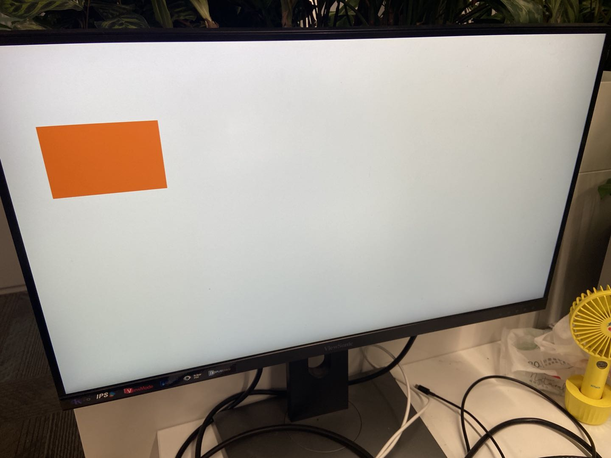
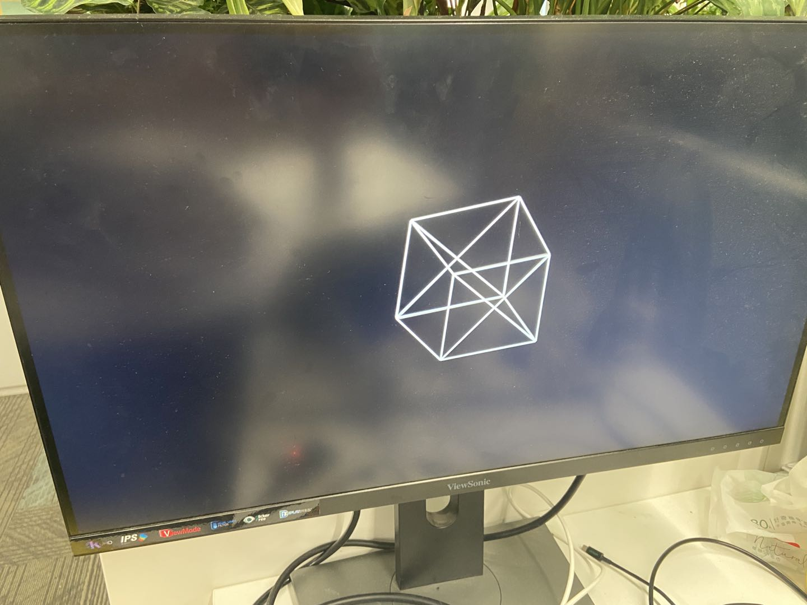
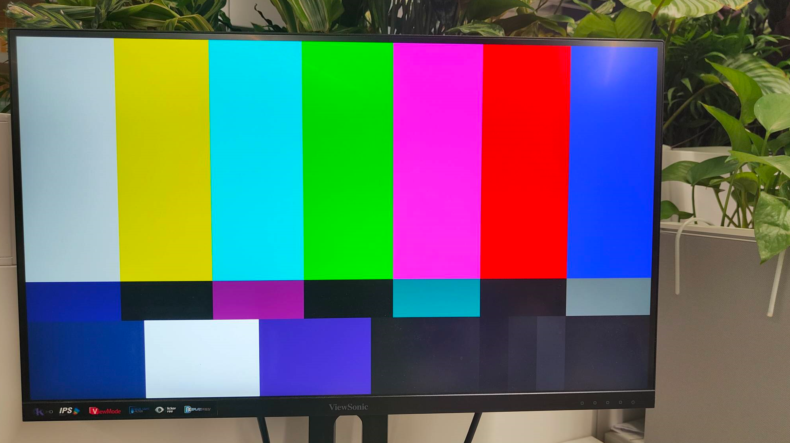
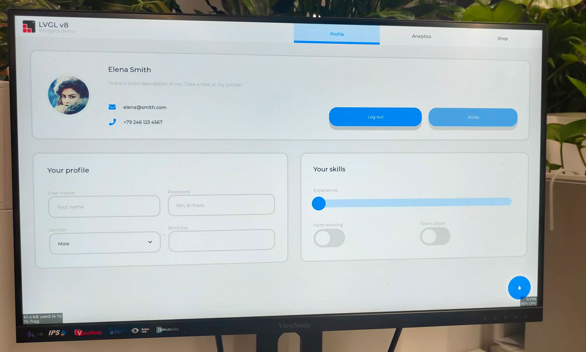

# K230 SDK Demo User Guide


Copyright 2023 Canaan Inc. ©

<div style="page-break-after:always"></div>

## Disclaimer

The products, services or features you purchase should be subject to Canaan Inc. ("Company", hereinafter referred to as "Company") and its affiliates are bound by the commercial contracts and terms and conditions of all or part of the products, services or features described in this document may not be covered by your purchase or use. Unless otherwise agreed in the contract, the Company does not provide any express or implied representations or warranties as to the correctness, reliability, completeness, merchantability, fitness for a particular purpose and non-infringement of any statements, information, or content in this document. Unless otherwise agreed, this document is intended as a guide for use only.

Due to product version upgrades or other reasons, the content of this document may be updated or modified from time to time without any notice.

## Trademark Notice

, "Canaan" and other Canaan trademarks are trademarks of Canaan Inc. and its affiliates. All other trademarks or registered trademarks that may be mentioned in this document are owned by their respective owners.

**Copyright 2023 Canaan Inc.. © All Rights Reserved.**
Without the written permission of the company, no unit or individual may extract or copy part or all of the content of this document without authorization, and shall not disseminate it in any form.

<div style="page-break-after:always"></div>

## Directory

[TOC]

## preface

### Overview

This document mainly introduces the demo program provided in the K230 SDK to adapt to the Canmv-K230 development board.

### Reader object

This document (this guide) is intended primarily for:

- Technical Support Engineer
- Software Development Engineer

### Definition of acronyms

| abbreviation | illustrate                                                        |
|------|-------------------------------------------------------------|
| UVC  | USB video class（USB Camera）                                |
| VVI  | Virtual Video Input, which mainly used for pipeline debugging |

### Revision history

| Document version number | Modify the description  | Author | date  |
|---|---|---|---|
| V1.0       | Initial | System Software Department | 2023-10-11 |

## 1. Overview

This document describes the demo functions and usage methods provided by the K230 SDK. The executable programs on rt-smart are compiled into  /sharefs directory of the little core by default.When testing the big core program, you need to wait for the little core to be fully started, and then the big core enter the /sharefs/app directory to test. The audio and video resource files used in the test demos can be obtained at the following link address <https://kendryte-download.canaan-creative.com/k230/downloads/test_resource/>

## 2. Demo introduction

### 2.1 Display_demo

#### 2.1.1 Introduction to display_demo

VO (Video Output) module actively reads video and graphics data from the corresponding location in memory, and outputs video and graphics through the corresponding display device. Display/write-back devices, video layers, and graphics layer conditions supported by the chip.

#### 2.1.2 Feature description

Video ouput contains a use case, which is the test of inserting frames at the VO OSD layer

#### 2.1.3 Dependent Resources

Monitor with HDMI interface and HDMI cable, the display must support 1080P30, otherwise it cannot be displayed

#### 2.1.4 Instructions for Use

##### 2.1.4.1 Compilation

Software compilation refers to the README.md in the release SDK package

##### 2.1.4.2 Execution

VO OSD layer inserts frames

`./sample_vo.elf 15`

After executing the command, pressing Enter once will insert a solid green image, and press Enter again to exit

The display effect is as follows:


### 2.2 Venc_demo

#### 2.2.1 Introduction to Venc_demo

Venc demo encodes the graphics received by vi, and can frame and OSD overlay the input image. The supported encoding protocols are H.264/H.265/JPEG. The encoding results can be stored as a file, exported to the local computer, and played back using video software.

#### 2.2.2 Feature description

Only 1280x720 resolution is supported.

#### 2.2.3 Dependent Resources

Camera

#### 2.2.4 Instructions for Use

##### 2.2.4.1 mpp_demo Execution

After execution`./sample_venc.elf -h`, the instructions for using the demo are output as follows:

```shell
Usage : ./sample_venc.elf [index] -sensor [sensor_index] -o [filename]
index:
    0) H.265e.
    1) JPEG encode.
    2) OSD + H.264e.
    3) OSD + Border + H.265e.

sensor_index: see vicap doc
```

sensor_index value refer to the `k230_docs/en/01_software/board/mpp/K230_Camera_Sensor_Adaptation_Guide.md`description of the k_vicap_sensor_type in the document, and the default value is 7

Example:

```shell
./sample_venc.elf 0 -sensor 7 -o out.265
```

##### 2.2.4.2 MAPI encoding demo

sample_venc default sensor type used is IMX335_MIPI_2LANE_RAW12_1920X1080_30FPS_LINEAR, the demo currently supports 3-way encoding, you can modify the sensor type and other parameters by passing parameters from the command line, the specific description is as follows:

After launching the board:

1. Use `lsmod` to check whether the k_ipcm module is loaded on the little core side. If it is not loaded, execute `insmod k_ipcm.ko` to load the k_ipcm module.
1. Start the internuclear communication process on the large nuclear side, execute `./sample_sys_inif.elf`
1. In the /mnt directory on the little core side, execute  , `./sample_venc`by default, 1-channel H264 video encoding is executed, the resolution is 1280x720, and the generated code stream file is stored under the /tmp directory

```shell
Usage: ./sample_venc -s 0 -n 2 -o /tmp -t 0
                     -s or --sensor_type [sensor_index],\n");
                            see vicap doc
                     -n or --chn_num [number], 1, 2, 3
                     -t or --type [type_index]
                            0: h264 type
                            1: h265 type
                            2: jpeg type
                     -o or --out_path [output_path]
                     -h or --help, will print usage
```

sensor_index value refer to the `k230_docs/en/01_software/board/mpp/K230_Camera_Sensor_Adaptation_Guide.md`description of the k_vicap_sensor_type in the document, and the default value is 7

Depending on the encoding type, different stream files will be generated in the output directory specified by the little core, for the H264 type, a file will be generated, where 0 represents 0 channel, ` ctrl+c `for the H265 type, a file of the form  will be generated, and the same 0 will `stream_chn0.264`represent 0 channel; for the JPEG type, the shape will be generated`stream_chn0.265``chn0_0.jpg`The jpg image represents the 0th image of channel 0, and 10 jpg images will be generated by default.

##### 2.2.4.3 View results

The output file can be exported locally for viewing with video playback software.

### 2.3 Nonai_2d_demo

#### 2.3.1 Introduction to Nonai_2d_demo

Nonai_2d demo implements the function of image overlay on the input file.

#### 2.3.2 Feature description

Nonai_2d performs image overlay operations by reading a YUV (I420 format) file.

#### 2.3.3 Dependent Resources

Not.

#### 2.3.4 Instructions for Use

The input parameters are as follows:

| The parameter name | description | Default value |
|---|---|---|
| -i | Enter a file name | - |
| -in | Image width  | - |
| -h | Image height  | - |
| -or | Output file name | - |

##### 2.3.4.1 Execution

Example:

```shell
./sample_nonai_2d.elf -i /sharefs/foreman_128x64_3frames.yuv -w 128 -h 64 -o /sharefs/out_2d.yuv
```

##### 2.3.4.2 View results

The output file can be exported to the local computer for viewing with the YUV playback software.

### 2.4 Vdec_demo

#### 2.4.1 Introduction to Vdec_demo

Vdec demo implements the function of video decoding. The decoding function supports H.264/H.265/JPEG decoding. The supported input data formats are .264/.265/.jpeg.

#### 2.4.2 Feature description

Vdec demos are decoded by reading stream files. The decoding output is displayed on the screen.

#### 2.4.3 Dependent Resources

Not.

#### 2.4.4 Instructions for Use

##### 2.4.4.1 Execution

Execute, `./sample_vdec.elf -help`you can see the configurable parameters and descriptions, the default values of which are shown in the following table:

| The parameter name | illustrate                                       | Default value |
|--------|--------------------------------------------|--------|
| i      | Enter a file name, which needs to be suffixed .264/.265/.jpg | -    |
| type | vo connector type, please refer to vo document | 0 |

The type value is set to 0 in the`k230_docs/en/01_software/board/mpp/K230_video_output_API_reference.md` description of the k_connector_type

###### 2.4.4.1.1 VDEC bound VO decoding display

`./sample_vdec.elf -type 1 -i canaan.264`

###### 2.4.4.1.2 MAPI VIDEC bound VO decoding display

`./sample_vdec.elf -type 1 -i canaan.264`

##### 2.4.4.2 View results

The decoding result can be viewed on the screen.

### 2.5 Audio_demo

#### 2.5.1 Introduction to audio_demo

Audio Demo implements audio input and output functions by calling API interfaces. The audio input and output use the I2S module. The demo includes use cases where audio input or audio output can be tested separately, as well as use cases where audio input and output can be tested at the same time.

#### 2.5.2 Feature description

##### 2.5.2.1 Audio input

Audio input analyzes whether it is normal by capturing sounds from the environment and saving them as files.

In the demo, 15S minutes of audio data is collected, and the file format collected is WAV, which can be played directly using VLC.

##### 2.5.2.2 Audio output

The audio output is judged by playing the WAV file, plugging in the headphones to listen to the sound.

In the demo, the audio output function is tested by playing WAV, and WAV files in different audio formats can be uploaded to test the audio output function.

##### 2.5.2.3 Audio input and output

Audio input and output can be tested at the same time.

1. Test the function of the I2S module, that is: real-time acquisition of sound in the environment through the I2S audio input and sound in the environment through the I2S audio output, and connect the headphones to hear the sound in the environment in real time.

##### 2.5.2.4 Audio codec

Built-in G711A/U 16bit audio codec, users can register other external codecs.

#### 2.5.3 Instructions for Use

##### 2.5.3.1 Compilation

1. For a detailed description of the software compilation environment, refer to the SDK`README.md`.

##### 2.5.3.2 Execution

After entering the rt-smart system, enter the /sharefs/app directory to`sample_audio.elf` test the demo.

- You can enter `./sample_audio.elf -help`how to view the demo.
- `-type`option to test different module functionality;
- `-samplerate`Option to configure audio input and output different sample rates (8K-192K), default is 44.1K;
- `-enablecodec`Use a built-in codec or off-chip audio daughter board;
- `-loglevel`Print the kernel log level;
- `-bitwidth`Set audio sampling accuracy (16/24/32);
- `-filename`Load or store the WAV/G711 file name.


###### 2.5.3.2.1 I2S audio input test

- Input `./sample_audio.elf -type 0`to acquire PCM audio data in 15S
- `-samplerate`option to choose to capture audio at different sample rates,
- `-bitwidth` to set different sampling accuracy,
- `-enablecodec`Set whether to use the built-in codec,
- `-filename` Save the data to a file. After collecting 15s data, the demo automatically exits.

Demo implementation idea: This test collects data by calling the API function: AND in a loop`kd_mpi_ai_get_frame``kd_mpi_ai_release_frame`. Note that the AI dev number corresponding to i2s is 0.


###### 2.5.3.2.2 I2S audio output test

To support playback of WAV files, you need to copy the WAV file to the sharefs path. The demo will loop the WAV file (any other WAV file can also be used), and the user can press any key to exit the function test.

Demo implementation idea: This test outputs sound in real time by calling API functions in a loop`kd_mpi_ao_send_frame`.


###### 2.5.3.2.3 I2S audio input and output API interface test

input`./sample_audio.elf -type 3 -bitwidth 16`, real-time test of audio input and output functions through API interface.

Test the overall functionality of audio input and output by calling the API interface:`kd_mpi_ai_get_frame` Obtain audio data and call `kd_mpi_ao_send_frame`output audio data. The user can press any key to exit the feature test. During the test, the timestamp information collected by AI is output in real time.


###### 2.5.3.2.4 System binding test for I2S audio input and output modules

Input`./sample_audio.elf -type 4`, real-time test of audio input and output functions through AI and AO module binding.

By calling the system binding API interface: `kd_mpi_sys_bind`bind the AI and AO modules to test the overall function of audio input and output. The user can press any key to exit the feature test.


###### 2.5.3.2.5 Coding Tests

Get AI data and encode it and save it to a file. The codec only supports G711A/U, 16bit.

System binding method:`./sample_audio.elf -type 7 -bitwidth 16 -enablecodec 1 -filename /sharefs/i2s_codec.g711a`


API interface mode:`./sample_audio.elf -type 9 -bitwidth 16 -enablecodec 1 -filename /sharefs/i2s_codec.g711a`


###### 2.5.3.2.6 Decoding test

Read file data and decode playback. The codec only supports G711A/U, 16bit.

System binding method:`./sample_audio.elf -type 8 -filename /sharefs/gyz.g711a -enablecodec 1 -bitwidth 16`


API interface mode:`./sample_audio.elf -type 10 -filename /sharefs/gyz.g711a -enablecodec 1 -bitwidth 16`


###### 2.5.3.2.7 Audio full-process test

1. The recording module ai-\>aenc-\>file and the playback module file-\>adec-\>ao two links run at the same time, simulating the scene of voice intercom. Using the built-in codec, 16-bit precision to simulate. `-filename` to select the file to be played, for G711A format, select`-samplerate` the sampling accuracy. Recording file name: +: if -`_rec`filename is -filename`/sharefs/test.g711a`, the recording file name is:`/sharefs/test.g711a_rec`


2.AI-\>AENC, ADC-\>AO two links are bound loopback test. Using the built-in codec, 16-bit precision to simulate.

Also test the G711 encoded stream timestamp.


Enter`cat /proc/umap/sysbind` to view the inter-module system bindings.


###### 2.5.3.2.8 MAPI Audio Test

Make sure that the intercore communication process is started: first confirm that the little core loads the k_ipcm.ko module, and then confirm that the big core starts:`/sharefs/app/sample_sys_init.elf &`

- You can enter `/mnt/sample_audio -help`how to view the demo.
- `-type`option to test different module functionality.
- `-samplerate`option to configure audio input and output with different sample rates (8K-192K), default is 44.1K.
- `-enablecodec`Use the built-in codec or off-chip audio daughter board, and use the built-in codec by default.
- `-filename`Load or store the G711 file name.
- `-channels`: Specifies the number of channels. 8


- AI->AENC test

Execute command on the little core: `/mnt/sample_audio -type 0 -filename test.g711a`Press the q key to exit the test. The demo captures audio data in real time and encodes it into G711A format and saves it to a file.


- ADEC->AO test

Execute command on the little core: `/mnt/sample_audio -type 1 -filename tes.g711a`Press the q key to exit the test. The demo can loop decoding and play files in the local G711A format.


- AI->aenc adec->ao loopback test

Run the command on the little core: /mnt/sample_audio -type 2 , press the q key to exit the test. The demo can collect audio data in real time and encode it into G711A format, and then decode the G711A format data and play the output.


### 2.6 Vicap_demo

#### 2.6.1 Introduction to vicap_demo

VICAP Demo implements the camera data acquisition preview function by calling the MPI interface.

#### 2.6.2 Feature description

The CanMV development board uses the OV5647 camera module by default, which supports up to three data streams for a single camera.

#### 2.6.3 Dependent Resources

Camera module

#### 2.6.4 Instructions for Use

##### 2.6.4.1 Compilation

For a detailed description of the software compilation environment, refer to the SDK`README.md`.

1. Executed in the k230_sdk directory, the `make mpp-clean && rt-smart && make build-image`modification of the big core is compiled into the SD card image, and the image`k230_sdk/output/k230_evb_defconfig/images/` file will be generated under the directory`sysimage-sdcard.img`.

##### 2.6.4.2 Execution

1. Copy the `src/big/mpp/userapps/sample/elf/sample_vicap.elf`file to the directory specified locally
1. Mount this directory to the little core Linux via nfs`/sharefs`
1. On the large kernel end, enter via`cd /sharefs` the command`/sharefs`
1. Execute commands in this directory`./sample_vicap` to obtain command help information

When you enter the : `sample_vicap`command, print the following prompt:

```shell
usage: ./sample_vicap -mode 0 -dev 0 -sensor 0 -chn 0 -chn 1 -ow 640 -oh 480 -preview 1 -rotation 1
Options:
 -mode:         vicap work mode[0: online mode, 1: offline mode. only offline mode support multiple sensor input]     default 0
 -dev:          vicap device id[0,1,2]        default 0
 -dw:           enable dewarp[0,1]    default 0
 -sensor:       sensor type[0: ov9732@1280x720, 1: ov9286_ir@1280x720], 2: ov9286_speckle@1280x720]
 -ae:           ae status[0: disable AE, 1: enable AE]        default enable
 -awb:          awb status[0: disable AWB, 1: enable AWb]     default enable
 -chn:          vicap output channel id[0,1,2]        default 0
 -ow:           the output image width, default same with input width
 -oh:           the output image height, default same with input height
 -ox:           the output image start position of x
 -oy:           the output image start position of y
 -crop:         crop enable[0: disable, 1: enable]
 -ofmt:         the output pixel format[0: yuv, 1: rgb888, 2: rgb888p, 3: raw], only channel 0 support raw data, default yuv
 -preview:      the output preview enable[0: disable, 1: enable], only support 2 output channel preview
 -rotation:     display rotaion[0: degree 0, 1: degree 90, 2: degree 270, 3: degree 180, 4: unsupport rotaion]
 -help:         print this help
```

The parameters are described as follows:

| **Parameter name** | **Optional parameter value** | **Parameter description** |
|---|---|---|
| -Dev         | 0: vicap device 0 1: vicap device 1 2: vicap device 2.                             | Specify the currently used vicap device, and the system supports up to three vicap devices. By specifying the device number, the binding relationship between the sensor and different vicap devices is realized. For example: -dev 1 -sensor 0 binds the ov9732 1280x720 RGB image output to vicap device 1.                   |
| -mode | 0: Online mode; 1: Offline mode | Specify the vicap device working mode, current before online mode and offline mode. For multiple sensor inputs, it must be specified as offline mode. |
| -sensor      | 23: OV5647 (CanMV development board only supports this sensor) | Specifies the type of sensor currently in use                                                         |
| -Chn         | 0: vicap device output channel 0 1: vicap device output channel 1 2: vicap device output channel 2.     | Specify the output channel of the currently used vicap device, one vicap device supports up to three outputs, and only channel 0 supports RAW image format output  |
| -ow          |                                                                         | Specifies the output image width, which defaults to the input image width. The width needs to be 16 bytes aligned. If the default width exceeds the maximum width of the display output, the display output width is used as the final output width of the image If the output width is smaller than the input image width and the ox or oy parameters are not specified, the default is the scaled output |
| -oh          |                                                                         | Specifies the output image height, which defaults to the input image height. If the default height exceeds the maximum height of the display output, the display output height is used as the final output height of the image If the output height is less than the input image height and the ox or oy parameter is not specified, the default is the scaled output  |
| -ox          |                                                                         | Specifies the horizontal start position of the image output, this parameter greater than 0 will perform the output cropping operation  |
| -Limited liability company          |                                                                         | Specifies the vertical start position of the image output, this parameter greater than 0 will perform the output cropping operation |
| -crop        | 0: Disable the cropping function 1: Enable the cropping function                                         | When the output image size is smaller than the input image size, the output is not scaled by default, or clipped if the flag is specified  |
| -ofmt        | 0:YUV format output 1:RGB format output 2:RAW format output                            | Specify the output image format, the default is YUV output.  |
| -preview     | 0: Disable preview display 1: Enable preview display                                         | Specifies the output image preview display function. The default is enabled. Currently, up to 2 output images can be previewed at the same time. |
| -rotation    | 0: Rotate 0 degrees 1: Rotate 90 degrees 2: Rotate 180 degrees 3: Rotate 270 degrees 4: Rotation is not supported          | Specifies the rotation angle of the preview display window. By default, only the first output image window supports the rotation function. |

Example 1:

`./sample_vicap -dev 0 -sensor 23 -chn 0 -chn 1 -ow 640 -oh 480`

Note: Bind the ov5647@1920x1080 RGB output to vicap device 0 and enable vicap device output channel 0 and channel 1, where channel 0 output size defaults to the input image size (1920x1080) and channel 1 output image size is 640x480

### 2.7 DMA_demo

#### 2.7.1 Introduction to DMA_demo

##### 2.7.1.1 Unbound mode

DMA channels 0-3 are GDMA and 4-7 are SDMA.

- Channel 0 continuous input image with 1920x1080 resolution, 8bit, YUV400, single channel mode, output after rotation 90 degrees, and golden data comparison
- Channel 1 continuous input image with 1280x720 resolution, 8bit, YUV420, dual-channel mode, output after rotation 180 degrees, and golden data comparison
- Channel 2 continuous input image with resolution of 1280x720, 10bit, YUV420, triple channel mode, x-mirror, y-mirror post output, and golden data comparison
- Channel 4 loops a piece of data in 1D mode, and compares it with the golden data after the transfer is completed
- Channel 5 loops a piece of data in 2D mode, and compares it with the golden data after the transfer is completed

##### 2.7.1.2 Binding mode

Using VVI as the DMA analog input, channel 0 of VVI device 0 is bound to channel 0 of DMA, and channel 1 of VVI device 0 is bound to channel 1 of DMA. Every other second, vvi enters an image of 640x320, YUV400, 8bit, rotated 90°, and 640x320, YUV400, 8bit, rotated 180° to channel 1.

#### 2.7.2 Feature description

Including DMA device property configuration, channel property configuration, graphics input, output, release, pipeline binding and other functions.

#### 2.7.3 Dependent Resources

not

#### 2.7.4 Instructions for Use

##### 2.7.4.1 Compilation

Software compilation refers to the README.md in the release SDK package.

##### 2.7.4.2 Execution

1. Unbound mode demo runs

`/sharefs/app/sample_dma.elf`

A test message will be displayed on the screen, enter q to finish the run.

1. The bound mode demo runs

`/sharefs/app/sample_dma_bind.elf`

A test message will be displayed on the screen, enter q to finish the run.

### 2.8 USB_demo

#### 2.8.1 Introduction to USB_demo

USB demo currently debugs 4 functions,

As a device, simulate a U disk, simulate a mouse and keyboard.

As host, connect a USB flash drive and connect a mouse and keyboard.

#### 2.8.2 Feature description

The functionality of the USB demo is the original integration of Linux systems.

#### 2.8.3 Dependent Resources

typeC line, typeC to typeA.

#### 2.8.4 Instructions for Use

##### 2.8.4.1 Simulate a USB flash drive as a device

```shell
#Plan a memory space as disk space to simulate a USB flash drive.
[root@canaan / ]#gadget-storage-mem.sh
2+0 records in
2+0 records out
mkfs.fat 4.1 (2017-01-24)
[ 1218.882053] Mass Storage Function, version: 2009/09/11
[ 1218.887308] LUN: removable file: (no medium)
[ 1218.895464] dwc2 91500000.usb-otg: bound driver configfs-gadget
[root@canaan / ]#[ 1219.019554] dwc2 91500000.usb-otg: new device is high-speed
[ 1219.056629] dwc2 91500000.usb-otg: new address 5

#Use the FAT partition of SD/eMMC as disk space to simulate a USB flash drive.
[root@canaan ~ ]#gadget-storage.sh
[  359.995510] Mass Storage Function, version: 2009/09/11
[  360.000762] LUN: removable file: (no medium)
[  360.013138] dwc2 91500000.usb-otg: bound driver configfs-gadget
[root@canaan ~ ]#[  360.136809] dwc2 91500000.usb-otg: new device is high-speed
[  360.173543] dwc2 91500000.usb-otg: new address 43
```

Connect the USB port of the development board, connect typeC to the PC, and display the U disk connection on the PC.

##### 2.8.4.2 Connect the USB flash drive as HOST

The USB port of the K230 development board is connected to the U disk through typeC to typeA.

##### 2.8.4.3 Simulate a mouse and keyboard as a device

The K230 development board USB port is connected to another computer device through typeC for testing

```shell
[root@canaan / ]#gadget-hid.sh

[root@canaan / ]#hid_gadget_test /dev/hidg0 mouse
#Enter the corresponding operations according to the prompts, such as -123 -123, and you can see the mouse pointer on the PC move.

[root@canaan / ]#hid_gadget_test /dev/hidg1 keyboard
#Enter the corresponding operations according to the prompts, and you can see similar keyboard input on the PC. For example a b c --return
```

##### 2.8.4.4 Connect a mouse and keyboard as HOST

K230 development board USB connects mouse or keyboard via typeC to typeA.

```shell
#Use the following command to determine the event corresponding to the input device.
[root@canaan ~ ]#cat /proc/bus/input/devices
...
I: Bus=0003 Vendor=046d Product=c52f Version=0111
N: Name="Logitech USB Receiver"
P: Phys=usb-91500000.usb-otg-1/input0
S: Sysfs=/devices/platform/soc/91500000.usb-otg/usb1/1-1/1-1:1.0/0003:046D:C52F.0001/input/input2
U: Uniq=
H: Handlers=event2
B: PROP=0
B: EV=17
B: KEY=ffff0000 0 0 0 0
B: REL=1943
B: MSC=10
```

```shell
[root@canaan / ]$ test_mouse /dev/input/event2
#Click or move the mouse, and the serial port will display the corresponding display.

[root@canaan / ]$ test_keyboard /dev/input/event2
#Press different keys on the keyboard, and the serial port will have corresponding displays.
```

### 2.9 GPU_demo

#### 2.9.1 Introduction to GPU_demo

The GPU demo contains a total of three executable programs

- `tiger`: Example of drawing a vector drawing of a tiger
- `linearGrad`: Draw a linear gradient example
- `imgIndex`: Draw a color lookup table

#### 2.9.2 Feature description

GPU demo mainly covers the three functions of GPU vector drawing, linear gradient (achieved through pattern), and color lookup table.

#### 2.9.3 Dependent Resources

The file system is writable.

#### 2.9.4 Instructions for Use

Go to a writable directory and execute the program

##### 2.9.4.1 tiger

Run the `tiger`command and generate a tiger .png in the current directory after execution, as shown in the following figure


##### 2.9.4.2 linear degrees

Run the `linearGrad`command and generate a linearGrad .png in the current directory after execution, as shown in the following figure


##### 2.9.4.3 imgIndex

Run the `imgIndex`command and generate four image files in the current directory, as shown in the following figure

- `imgIndex1.png`: index1 mode, supports 2 colors


- `imgIndex2.png`: index2 mode, supports 4 colors


- `imgIndex4.png`: index4 mode, supports 16 colors


- `imgIndex8.png`: index8 mode, supports 256 colors


##### 2.9.4.4 vglite_drm

Run the `vglite_drm`command, which displays the pattern drawn by the GPU on the LCD screen, and press`Enter` the key again to display the next pattern, as shown in the figure



##### 2.9.4.5 vglite_cube

Run the `vglite_cube`command and a rotating cube drawn by the GPU will be displayed on the LCD screen, as shown in the following figure



This demo runtime kernel will have a large number of print messages, if you do not want these messages to be displayed, you can reduce the kernel print level

```shell
sysctl -w kernel.printk=6
```

### 2.10 DRM display demo

#### 2.10.1 Introduction to using demo

The demo runs on a K230 small-core Linux system and displays the image on the screen.

#### 2.10.2 Features Description

1. DRM supports 5 layer operations, including: 1 video layer and 4 OSD layers;
1. The video layer supports NV12, NV21, NV16, NV61 color spaces
1. The OSD layer supports ARGB8888, ARGB4444, RGB888, RGB565 color spaces

#### 2.10.3 Dependent Resources

HDMI monitor

#### 2.10.4 Instructions for Use

##### 2.10.4.1 Compilation

Software compilation refers to the README.md in the release SDK package

##### 2.10.4.2 Execution

```shell
modetest -M canaan-drm -D 0 -a -s 38@36:1920x1080-30  -P 32@36:1920x1080@AR24 -v -F smpte
```

After executing the above command, a color bar will be displayed on the HDMI monitor, as follows:



### 2.11 LVGL demo

#### 2.11.1 Introduction to using demo

The demo runs on a K230 small-core Linux system and displays a configuration interface on an HDMI display.

#### 2.11.3 Dependent Resources

HDMI monitor

#### 2.11.3 Instructions for Use

##### 2.11.3.1 Compilation

Software compilation refers to the README.md in the release SDK package

##### 2.11.3.2 Execution

```shell
lvgl_demo_widgets
```

After executing the above command, the configuration interface will be displayed on the HDMI monitor, as follows:



### 2.14 Rtsp push streaming Demo

#### 2.12.1 Introduction to Demo

This demo implements RTSP streaming.

#### 2.12.2 Feature description

The demo supports simultaneous push of audio and video streams to RTSP Server, which `mapi venc&aenc`encodes audio and video through interfaces; after pushing, the demo supports three URL push and pull streams.

#### 2.12.3 Dependent Resources

A USB-to-ETH network port converter is required, and the development board is connected to the network cable

#### 2.12.4 Instructions for Use

##### 2.12.4.1 Compilation

Refer to the introduction in the Release SDK package`README.md`, you can compile cdk-user in the docker environment, and`k230_sdk/src/common/cdk/user/out/little` generate the executable program rtsp_demo after the compilation is completed

##### 2.12.4.2 Execution

rtsp_demo the sensor type used by default is IMX335_MIPI_2LANE_RAW12_1920X1080_30FPS_LINEAR, the sensor type and other parameters can be modified by passing parameters from the command line, as follows:

After launching the board:

1. Use `lsmod` to check whether the k_ipcm module is loaded on the little core side. If it is not loaded, execute `insmod k_ipcm.ko` to load the k_ipcm module.
1. Start the internuclear communication process on the large nuclear side, execute `./sample_sys_inif.elf`
1. In the little core side/mnt directory, execute, the ` ./rtsp_demo `default is 1-channel H265 video encoding push, the resolution is 1280x720, if you need to refer to the following parameter description, when pushing the MJPEG code stream, the resolution currently supports a maximum of 2032x1944, and the minimum resolution is 640x480

```shell
Usage: ./rtsp_demo -s 0 -n 2 -t h265 -w 1280 -h 720 -a 0
                    -s: the sensor type:
                        see vicap doc
                    -n: the session number, range: 1, 2，3
                    -t: the video encoder type: h264/h265/mjpeg
                    -w: the video encoder width
                    -h: the video encoder height
                    -a: audio input type(0:mic input  1:headphone input):default 0.
```

The sensor type value is described in the `k230_docs/en/01_software/board/mpp/K230_Camera_Sensor_Adaptation_Guide.md`k_vicap_sensor_type in the document
Audio input type selectable: onboard MIC or headphone input.

After the rtsp_demo on the little core runs normally, the URL address of the form will be printed, `rtsp://ip:8554/session0` where 0 represents the 0th way, which can be played through the stream of VLC pulling URLs; if you need to stop running, please stop VLC pulling the stream first, and then execute the` ctrl+c ` Stop Running rtsp_demo.

### 2.13 FaceAe Demo

#### 2.13.1 Demo introduction

This demo is used in the big core, which is a demo of VICAP, KPU, VO (video output), and AERoi joint debugging, and can appropriately adjust the face exposure brightness through the face detection interface.

#### 2.13.2 Compilation

1. First refer to the README.md in the release SDK package and compile the image using Docker.
1. After the compilation is complete, the sample (sample_face_ae.elf) is stored in this path by default`k230_sdk/src/big/mpp/userapps/sample/elf`
1. Since KPU linkage requires the use of the detection model test.kmodel, the path is stored after compilation`k230_sdk/src/big/mpp/userapps/sample/elf`

#### 2.13.3 Execution

```shell
cd /sharefs/app
./sample_face_ae.elf test.kmodel 1 # arg1: Model name， arg2： enable face ae

Wait for the initialization to complete and prompt any letter + enter,
for example:Type a, press Enter, and run face ae demo
After successful execution, the physical address of each frame of image will be printed.
```

### 2.14 FFT Demo

#### 2.14.1 Introduction to Demo

This demo is used to verify the use of FFT APIs and test FFT functions, see src/big/mpp/userapps/sample/sample_fft/

#### 2.14.2 Feature description

First, the FFT calculation is performed, and the IFT calculation is performed

#### 2.14.3 Dependent Resources

not

#### 2.14.4 Instructions for Use

##### 2.14.4.1 Compilation

> Please refer to the README.md in the release SDK package.

##### 2.14.4.2 Execution

1. After the large and little core systems are up, execute the following command on the big core command line:

   ```bash
   cd /sharefs/app;./sample_fft.elf
   ```

   The output content of the big core serial port is as follows:

   ```text
   msh /sharefs/app>./sample_fft.elf 1 0
   -----fft ifft point 0064  -------
       max diff 0003 0001
       i=0045 real  hf 0000  hif fc24 org fc21 dif 0003
       i=0003 imag  hf ffff  hif 0001 org 0000 dif 0001
   -----fft ifft point 0064 use 133 us result: ok


   -----fft ifft point 0128  -------
       max diff 0003 0002
       i=0015 real  hf 0001  hif fca1 org fc9e dif 0003
       i=0031 imag  hf 0001  hif fffe org 0000 dif 0002
   -----fft ifft point 0128 use 121 us result: ok


   -----fft ifft point 0256  -------
       max diff 0003 0001
       i=0030 real  hf 0000  hif fca1 org fc9e dif 0003
       i=0007 imag  hf ffff  hif 0001 org 0000 dif 0001
   -----fft ifft point 0256 use 148 us result: ok


   -----fft ifft point 0512  -------
       max diff 0003 0003
       i=0060 real  hf 0000  hif fca1 org fc9e dif 0003
       i=0314 imag  hf 0001  hif fffd org 0000 dif 0003
   -----fft ifft point 0512 use 206 us result: ok


   -----fft ifft point 1024  -------
       max diff 0005 0002
       i=0511 real  hf 0000  hif fc00 org fc05 dif 0005
       i=0150 imag  hf 0000  hif fffe org 0000 dif 0002
   -----fft ifft point 1024 use 328 us result: ok


   -----fft ifft point 2048  -------
       max diff 0005 0003
       i=1022 real  hf 0000  hif fc00 org fc05 dif 0005
       i=1021 imag  hf 0000  hif 0003 org 0000 dif 0003
   -----fft ifft point 2048 use 574 us result: ok


   -----fft ifft point 4096  -------
       max diff 0005 0002
       i=4094 real  hf 027b  hif 041f org 0424 dif 0005
       i=0122 imag  hf 0000  hif 0002 org 0000 dif 0002
   -----fft ifft point 4096 use 1099 us result: ok

   ```
