# K230 SDK EVB Board Demo User Guide


All rights reserved ©2023 Beijing Canaan Creative Information Technology Co., Ltd.

<div style="page-break-after:always"></div>

## Disclaimer

The products, services, or features you purchase are subject to the commercial contracts and terms of Beijing Canaan Creative Information Technology Co., Ltd. ("the Company", hereinafter referred to as such) and its affiliates. All or part of the products, services, or features described in this document may not be within the scope of your purchase or use. Unless otherwise agreed in the contract, the Company makes no express or implied representations or warranties regarding the accuracy, reliability, completeness, merchantability, fitness for a particular purpose, or non-infringement of any statements, information, or content in this document. Unless otherwise agreed, this document is for guidance and reference only.

Due to product version upgrades or other reasons, the content of this document may be updated or modified without any notice.

## Trademark Statement

, "Canaan" and other Canaan trademarks are trademarks of Beijing Canaan Creative Information Technology Co., Ltd. and its affiliates. All other trademarks or registered trademarks mentioned in this document are owned by their respective owners.

**All rights reserved © 2023 Beijing Canaan Creative Information Technology Co., Ltd. All rights reserved.**
Without the written permission of the Company, no unit or individual may excerpt, copy part or all of the content of this document, nor disseminate it in any form.

<div style="page-break-after:always"></div>

## Table of Contents

[TOC]

## Preface

### Overview

This document mainly introduces the demo programs provided in the K230 SDK.

### Intended Audience

This document (this guide) is primarily intended for the following personnel:

- Technical Support Engineers
- Software Development Engineers

### Abbreviations

| Abbreviation | Description                                              |
|--------------|----------------------------------------------------------|
| UVC          | USB video class (USB camera)                             |
| VVI          | Virtual video input, mainly used for pipeline debugging  |

### Revision History

| Document Version | Description of Changes | Author           | Date       |
|------------------|------------------------|------------------|------------|
| V1.0             | Initial version        | System Software Dept. | 2023-03-10 |
| V1.1             | Added descriptions for VICAP, DPU demo, UVC demo | System Software Dept. | 2023-04-07 |
| V1.2             | Added multi-channel venc encoding demo, added vi->venc->MAPI->small core file saving demo; Updated VICAP usage instructions, supporting multi-channel output and image scaling and cropping functions; All existing demos support loading or saving audio files via sharefs; Added encoding demo: ai->aenc->file, added decoding demo: file->adec->ao; Added comprehensive audio demo: ai->aenc adec->ao; Modified UVC demo command execution on the large core; Added MAPI video encoding demo execution description; Added VICAP, KPU, VO joint debugging demo | System Software Dept. | 2023-05-06 |
| V1.3             | Modified usage instructions for venc demo, vdec demo, nonai_2d demo; Added rtsp streaming demo instructions | System Software Dept. | 2023-05-31 |
| V1.4             | Added sharefs usage instructions | SDK Dept. | 2023-06-01 |
| V1.5             | Added voice intercom demo instructions | SDK Dept. | 2023-06-12 |
| V1.6             | Added DRM demo, added LVGL demo | SDK Dept. | 2023-06-29 |
| V1.7             | Modified sensor parameters in venc demo, added MAPI VDEC binding VO decoding display in vdec demo | SDK Dept. | 2023-06-30 |
| V1.8             | Modified usage instructions for mapi sample_venc and rtsp_demo | SDK Dept. | 2023-07-01 |
| V1.9             | Modified usage instructions for vicap demo, supporting multi-channel sensor input | SDK Dept. | 2023-08-01 |
| V2.0             | Modified test commands for uvc demo | SDK Dept. | 2023-08-30 |

## 1. Overview

This document introduces the demo functions provided by the K230 SDK and their usage. The executable programs on rt-smart are all compiled into the small core/sharefs directory by default. When testing the large core program, you need to wait for the small core to fully start, then enter the /sharefs/app directory in the large core's msh to test. The audio and video resource files used in each test demo can be obtained from the following link:
<https://kendryte-download.canaan-creative.com/k230/downloads/test_resource/>

## 2. Demo Introduction

### 2.1 Display_demo

#### 2.1.1 Introduction to display_demo

The VO (Video Output) module actively reads video and graphic data from the corresponding position in the memory and outputs video and graphics through the corresponding display device. The chip supports display/write-back devices, video layers, and graphic layers.

#### 2.1.2 Feature Description

Video output includes three use cases: a self-test mode for DSI, a binding test for VO and VVI, and a frame insertion test for the VO layer.

#### 2.1.3 Dependency Resources

A screen is needed.

#### 2.1.4 Usage Instructions

##### 2.1.4.1 Compilation

Refer to the README.md in the release SDK software package for software compilation.

##### 2.1.4.2 Execution

To run the DSI self-test mode demo:

`./sample_vo.elf 2`

A color bar image will be displayed on the screen, as shown below:

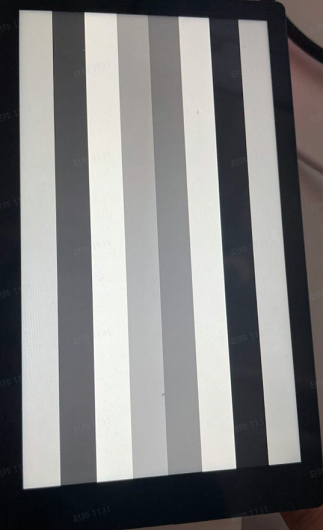

1. To run the VO and VVI binding demo:

    `./sample_vo.elf 9`

    Press Enter once to start sending ARGB data from VVI, press Enter again to exit the program. The display effect alternates between red, green, and blue primary colors, as shown below:

    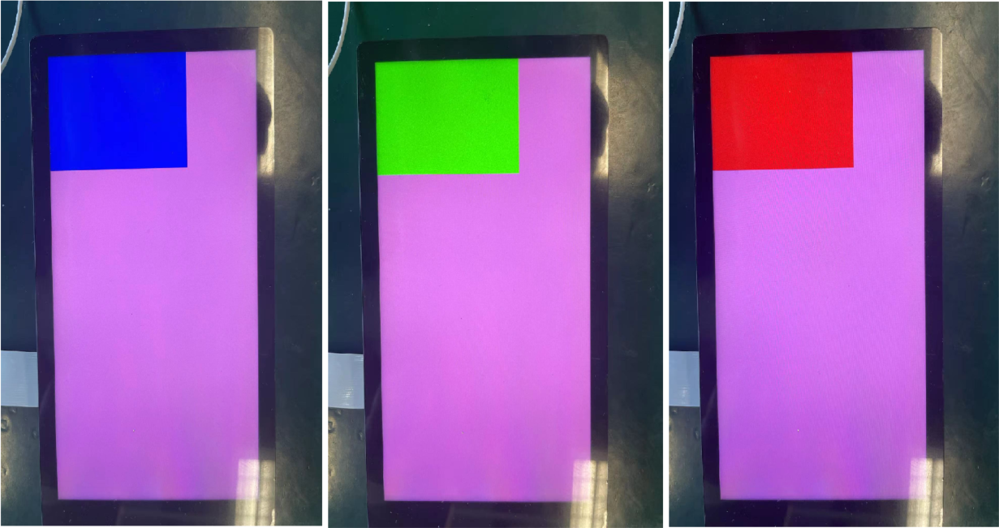

1. To run the VO layer frame insertion demo:

    `./sample_vo.elf 7`

    After executing the command, press Enter once to insert an image from the user layer, press Enter again to exit the program. The display effect is as follows:

    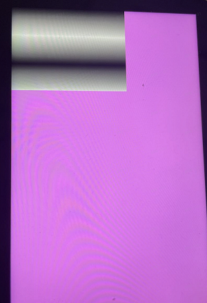

### 2.2 Venc_demo

#### 2.2.1 Introduction to Venc_demo

The Venc demo encodes the graphics received by VI and can add frames and OSD overlays to the input image. It supports H.264/H.265/JPEG encoding protocols. The encoding results can be stored as files, exported locally, and played using video software.

#### 2.2.2 Feature Description

Only supports 1280x720 resolution.

#### 2.2.3 Dependency Resources

A camera is needed.

#### 2.2.4 Usage Instructions

##### 2.2.4.1 mpp_demo Execution

After executing `./sample_venc.elf -h`, the usage instructions for the demo will be output, as follows:

```shell
Usage : ./sample_venc.elf [index] -sensor [sensor_index] -o [filename]
index:
    0) H.265e.
    1) JPEG encode.
    2) OSD + H.264e.
    3) OSD + Border + H.265e.

sensor_index: see vicap doc
```

The sensor_index value can be found in the `k230_docs/zh/01_software/board/mpp/K230_Camera_Sensor_Adaptation_Guide.md` document under the description of k_vicap_sensor_type, with a default value of 7.

Example:

```shell
./sample_venc.elf 0 -sensor 7 -o out.265
```

##### 2.2.4.2 MAPI Encoding Demo

The sample_venc default sensor type is IMX335_MIPI_2LANE_RAW12_1920X1080_30FPS_LINEAR. Currently, this demo supports 3-channel encoding. The sensor type and other parameters can be modified via command-line arguments, as described below:

After starting the development board:

1. Check if the k_ipcm module is loaded on the small core side using `lsmod`. If not, execute `insmod k_ipcm.ko` to load the k_ipcm module.
1. Start the inter-core communication process on the large core side by executing `./sample_sys_inif.elf`.
1. On the small core side, in the /mnt directory, execute `./sample_venc`. By default, it performs 1-channel H.264 video encoding with a resolution of 1280x720. The generated stream file is stored in the /tmp directory. To pass parameters, refer to the following parameter description:

```shell
Usage: ./sample_venc -s 0 -n 2 -o /tmp -t 0
                     -s or --sensor_type [sensor_index],\n");
                            see vicap doc
                     -n or --chn_num [number], 1, 2, 3
                     -t or --type [type_index]
                            0: h264 type
                            1: h265 type
                            2: jpeg type
                     -o or --out_path [output_path]
                     -h or --help, will print usage
```

The sensor_index value can be found in the `k230_docs/zh/01_software/board/mpp/K230_Camera_Sensor_Adaptation_Guide.md` document under the description of k_vicap_sensor_type, with a default value of 7.

You can stop the execution using `ctrl+c`. Depending on the encoding type, different stream files will be generated in the specified output directory on the small core. For H.264 type, a file like `stream_chn0.264` will be generated, where 0 represents channel 0; For H.265 type, a file like `stream_chn0.265` will be generated, where 0 represents channel 0; For JPEG type, files like `chn0_0.jpg` will be generated, representing the 0th image of channel 0, with 10 JPEG images generated by default.

##### 2.2.4.3 Viewing Results

The output files can be exported locally and viewed using video playback software.

### 2.3 Nonai_2d_demo

#### 2.3.1 Introduction to Nonai_2d_demo

The Nonai_2d demo implements image overlay functionality on input files.

#### 2.3.2 Feature Description

Nonai_2d performs image overlay operations by reading YUV (I420 format) files.

#### 2.3.3 Dependency Resources

None.

#### 2.3.4 Usage Instructions

Input parameters are as follows:

| Parameter | Description     | Default Value |
|-----------|-----------------|---------------|
| -i        | Input file name | -             |
| -w        | Image width     | -             |
| -h        | Image height    | -             |
| -o        | Output file name| -             |

##### 2.3.4.1 Execution

Example:

```shell
./sample_nonai_2d.elf -i /sharefs/foreman_128x64_3frames.yuv -w 128 -h 64 -o /sharefs/out_2d.yuv
```

##### 2.3.4.2 Viewing Results

The output file can be exported locally and viewed using YUV playback software.

### 2.4 Vdec_demo

#### 2.4.1 Introduction to Vdec_demo

The Vdec demo implements video decoding functionality. It supports H.264/H.265/JPEG decoding. The supported input data formats are .264/.264/.jpeg.

#### 2.4.2 Feature Description

The Vdec demo decodes stream files and displays the decoded output on the screen.

#### 2.4.3 Dependency Resources

None.

#### 2.4.4 Usage Instructions

##### 2.4.4.1 Execution

Executing `./sample_vdec.elf -help` shows the configurable parameters and their descriptions, with default values as shown in the table below:

| Parameter | Description                                      | Default Value |
|-----------|--------------------------------------------------|---------------|
| i         | Input file name, with extensions .264/.265/.jpg  | -             |
| type      | VO connector type, refer to VO document description | 0             |

The type value is described in the `k230_docs/zh/01_software/board/mpp/K230_Video_Output_API_Reference.md` document under the description of k_connector_type, set to 0.

###### 2.4.4.1.1 VDEC Binding VO Decoding Display

`./sample_vdec.elf -i canaan.264`

###### 2.4.4.1.2 MAPI VDEC Binding VO Decoding Display

`./sample_vdec.elf -i canaan.264`

##### 2.4.4.2 Viewing Results

The decoding results can be viewed on the screen.

### 2.5 Audio_demo

#### 2.5.1 Introduction to audio_demo

The audio demo implements audio input and output functions by calling API interfaces. Audio input includes I2S and PDM modules, and audio output includes the I2S module. The demo includes use cases for individually testing audio input or output, as well as use cases for simultaneously testing audio input and output.

#### 2.5.2 Feature Description

##### 2.5.2.1 Audio Input

Audio input captures ambient sound and saves it to a file for analysis to determine if it is functioning correctly.

Audio input includes tests for the I2S and PDM modules. The demo captures 15 seconds of audio data, and the captured file format is WAV, which can be played directly using VLC. The I2S audio input has 2 groups, with the demo defaulting to using group 0 for audio input. The PDM audio input has 4 groups, with the demo defaulting to using group 0 for audio input.

##### 2.5.2.2 Audio Output

Audio output plays a WAV file, and the sound can be heard through headphones to determine if it is functioning correctly.

Audio output only includes the I2S module test. The demo tests the audio output function by playing a WAV file. Different audio format WAV files can be uploaded to test the audio output function. The I2S audio output has 2 groups, with the demo defaulting to using group 0 for audio output.

#### 2.5.2.3 Audio Input and Output

Audio input and output can be tested simultaneously.

1. Test the i2s module functionality: Real-time collection of ambient sound through i2s audio input and output through i2s audio output. You can listen to the ambient sound in real-time using headphones.
1. Test the pdm module functionality: Real-time collection of ambient sound through pdm audio input and output through i2s audio output. You can listen to the ambient sound in real-time using headphones.

##### 2.5.2.4 Audio Codec

Built-in g711a/u 16bit audio codec, users can register other external codecs.

##### 2.5.2.5 Data Link

1. The signal received from the analog microphone by the audio codec is converted into PCM data in I2S format and input into the I2S of the audio module. PCM data output from I2S is converted into an analog signal by the audio codec and sent out. This mode does not use digital IO and fixedly uses the sdi0 and sdo0 interfaces of I2S.
1. Direct connection between I2S and external digital microphones and PA. Two sets of interfaces can be chosen: sdi0, sdo0, and sdi1, sdo1.
1. External PDM microphones can input up to 8 channels of PDM data to the 4 input data interfaces of the audio module.

You can use the built-in codec or external devices (audio sub-board) to test audio-related functions. Using the built-in codec allows testing one set of I2S audio input and output and audio codec-related functions. Using the audio sub-board allows testing 2 sets of i2s audio input and output and 4 sets of pdm audio input functions.


##### 2.5.2.6 Notes

1. The built-in codec supports a maximum sampling precision of 24bit; 32bit is not supported. Therefore, when testing i2s audio input and output using the built-in codec, only 16/24 bit sampling precision is supported.
1. The audio sub-board i2s loopback test only supports 32bit sampling precision. The reason is as follows:

    The audio sub-board uses the MSM261S3526Z0CM silicon microphone for collection, which is in I2S Philips format. The audio sub-board output uses the codec tm8211, which is in i2s right-aligned format with 16bit sampling. Since the i2s module uses the same ws for transmission and reception, only one i2s alignment format can be configured when running simultaneously. To correctly collect audio data, the i2s transmission and reception are configured to I2S Philips format to adapt to the MSM261S3526Z0CM silicon microphone. However, the output is in right-aligned format, so the output data loses precision. But using 32bit precision for transmission and reception is not affected by the i2s alignment format, so there is no impact.

    If testing audio input or output separately, it is not affected by sampling precision, and 16/24/32bit are all supported.

1. When collecting audio using the audio sub-board, the supported sampling rate range is (8k~48k).

    The audio sub-board collection module uses the MSM261S3526Z0CM silicon microphone, with a maximum clock of 4MHz. When the sampling rate is 96k (6.144MHz) and 192k (12.288MHz), the collected sound from the audio sub-board will be abnormal.

#### 2.5.3 Dependency Resources

1. Audio testing depends on the audio sub-board.

The audio sub-board schematic is as follows:

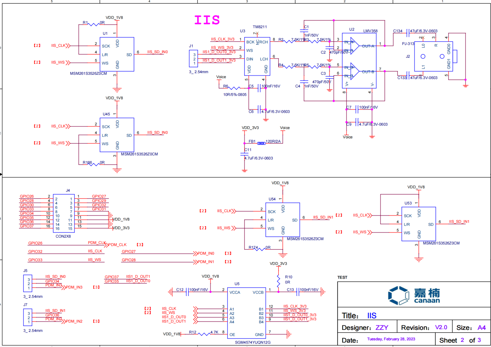

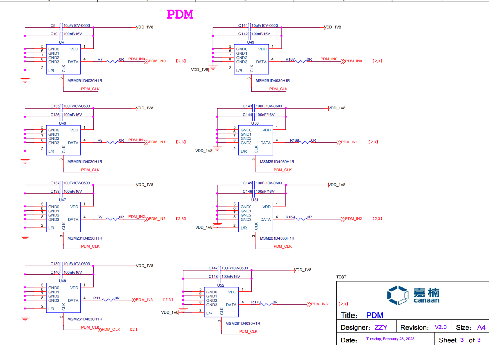

When testing i2s input and output, the audio sub-board can be connected as follows using jumper caps:

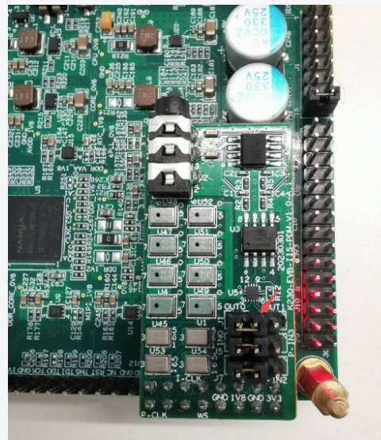

For pdm audio collection, when collecting data from the 0th or 1st pdm channel, it does not conflict with i2s pins.

When using the 2nd and 3rd pdm channels, jumper caps are needed to switch to pdm channel mode, as follows:

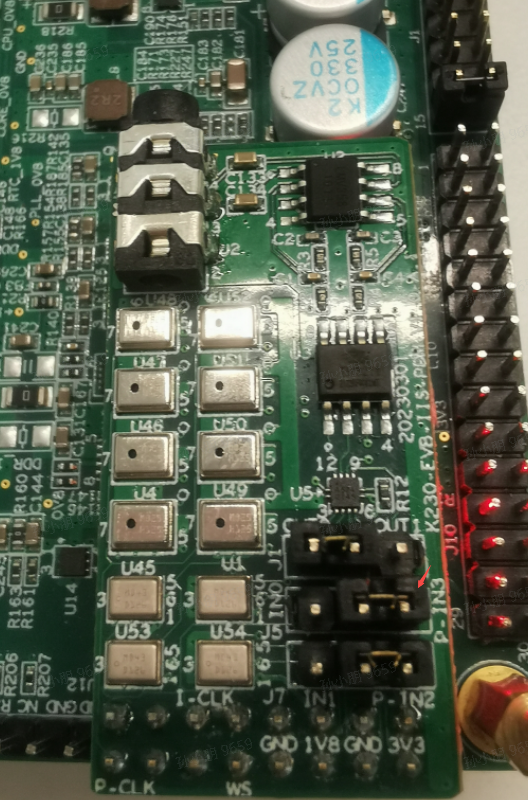

#### 2.5.4 Usage Instructions

##### 2.5.4.1 Compilation

1. Refer to the `README.md` in the SDK for the software compilation environment.
1. Set up the sharefs environment, as reading and writing files depend on sharefs.

##### 2.5.4.2 Execution

After entering the rt-smart system, navigate to the /sharefs directory. `sample_audio.elf` is the test demo.

- You can input `./sample_audio.elf -help` to view the demo usage method.
- Use the `-type` option to test different module functions.
- Use the `-samplerate` option to configure different sampling rates for audio input and output (8k-192k), with a default of 44.1k.
- Use the `-enablecodec` option to use the built-in codec or external audio sub-board.
- Use the `-loglevel` option to set the kernel log level.
- Use the `-bitwidth` option to set audio sampling precision (16/24/32).
- Use the `-filename` option to load or save wav/g711 files.


###### 2.5.4.2.1 I2S Audio Input Test

- Input `./sample_audio.elf -type 0` to collect 15s of pcm audio data.
- Use the `-samplerate` option to select the sampling rate for audio collection.
- Use the `-bitwidth` option to set the sampling precision.
- Use the `-enablecodec` option to set whether to use the built-in codec.
- Use the `-filename` option to save data to a file. After collecting 15s of data, the demo automatically exits.

The demo implementation idea: This test collects data by looping the API functions: `kd_mpi_ai_get_frame` and `kd_mpi_ai_release_frame`. Note that the ai dev number corresponding to i2s is 0.


###### 2.5.4.2.2 PDM Audio Input Test

- Input `./sample_audio.elf -type 1` to collect 15s of pcm audio data.
- Use the `-samplerate` option to select the sampling rate for audio collection.
- Use the `-bitwidth` option to set the sampling precision.
- Use the `-enablecodec` option to set whether to use the built-in codec. After collecting 15s of data, the demo automatically exits and saves the data to a file.

The demo implementation idea: This test collects data by looping the API functions: `kd_mpi_ai_get_frame` and `kd_mpi_ai_release_frame`. Note that the ai dev number corresponding to pdm is 1.

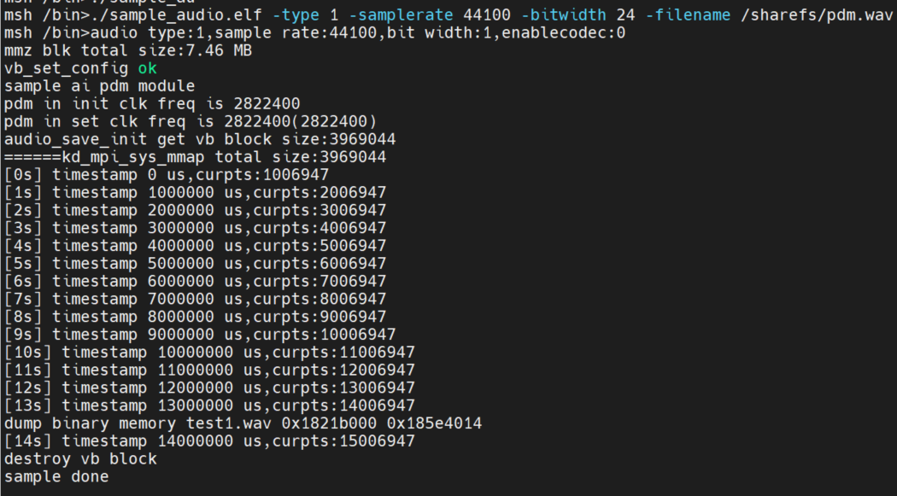

###### 2.5.4.2.3 I2S Audio Output Test

Supports playing wav files, which need to be copied to the sharefs path. This demo will loop playback of the wav file (any other wav file can also be used). Users can press any key to exit the function test.

The demo implementation idea: This test outputs sound in real-time by looping the API function: `kd_mpi_ao_send_frame`.

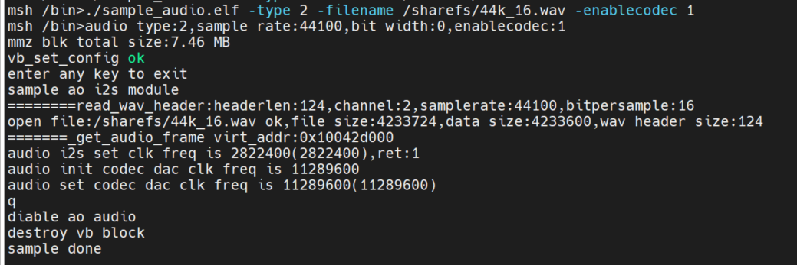

###### 2.5.4.2.4 I2S Audio Input and Output API Interface Test

Input `./sample_audio.elf -type 3 -bitwidth 32` to test audio input and output functionalities in real-time through the API interface.

The overall functionality of audio input and output is tested by calling the API interface: `kd_mpi_ai_get_frame` to get audio data and `kd_mpi_ao_send_frame` to output audio data. Users can press any key to exit the function test. During the test, the timestamp information collected by ai is output in real-time.

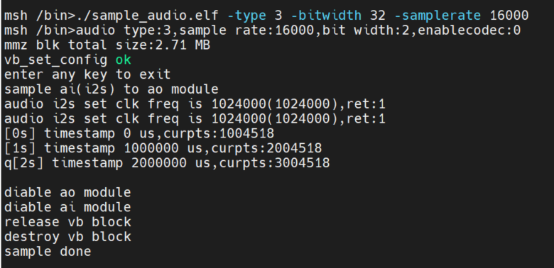

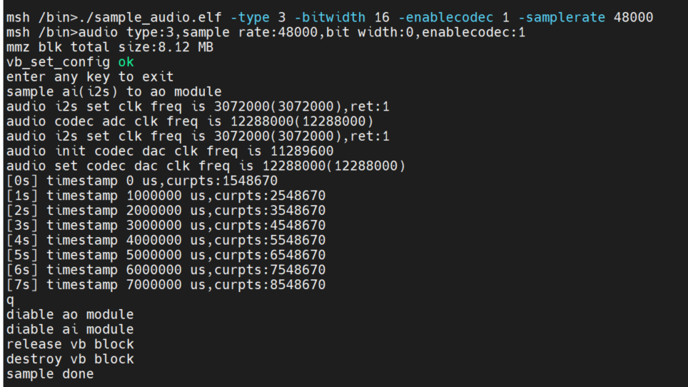

###### 2.5.4.2.5 I2S Audio Input and Output Module System Binding Test

Input `./sample_audio.elf -type 4` to test audio input and output functionalities in real-time by binding the ai and ao modules.

The overall functionality of audio input and output is tested by calling the system binding API interface: `kd_mpi_sys_bind` to bind the ai and ao modules. Users can press any key to exit the function test.

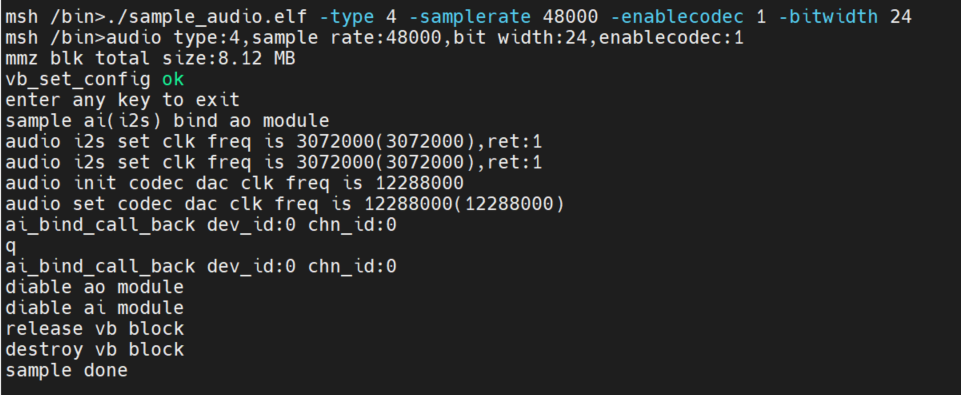

###### 2.5.4.2.6 PDM Audio Input, I2S Output API Interface Test

Input `./sample_audio.elf -type 5 -bitwidth 32` to test audio input and output functionalities in real-time through the API interface.

The overall functionality of audio input and output is tested by calling the API interface: `kd_mpi_ai_get_frame` to get audio data and `kd_mpi_ao_send_frame` to output audio data. Users can press any key to exit the function test. During the test, the timestamp information collected by ai is output in real-time.

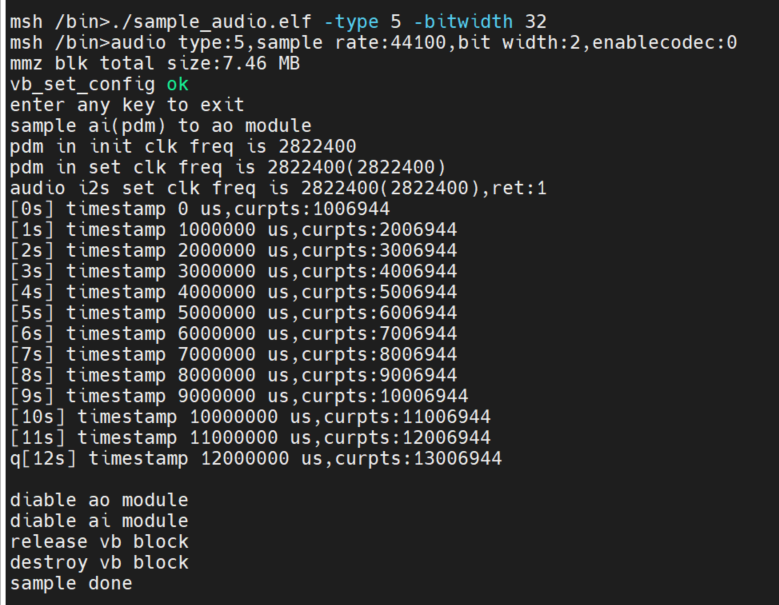

###### 2.5.4.2.7 PDM Audio Input, I2S Output System Binding Test

Input `./sample_audio.elf -type 6 -bitwidth 32` to test audio input and output functionalities in real-time by binding the ai and ao modules.

The overall functionality of audio input and output is tested by calling the system binding API interface: `kd_mpi_sys_bind` to bind the ai and ao modules. Users can press any key to exit the function test.

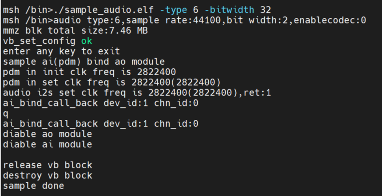

###### 2.5.4.2.8 Encoding Test

Collect ai data and encode it to save to a file. Encoding and decoding only support g711a/u, 16bit.

System binding method: `./sample_audio.elf -type 7 -bitwidth 16 -enablecodec 1 -filename /sharefs/i2s_codec.g711a`

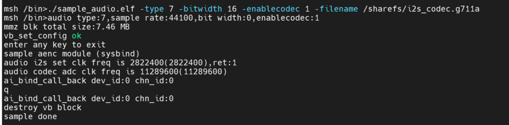

API interface method: `./sample_audio.elf -type 9 -bitwidth 16 -enablecodec 1 -filename /sharefs/i2s_codec.g711a`

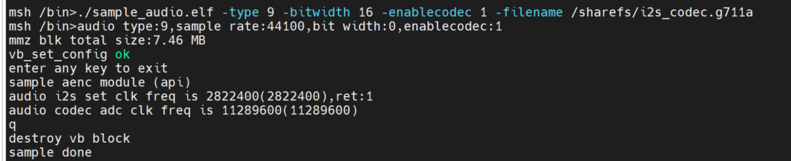

###### 2.5.4.2.9 Decoding Test

Read file data and decode it for playback. Encoding and decoding only support g711a/u, 16bit.

System binding method: `./sample_audio.elf -type 8 -filename /sharefs/gyz.g711a -enablecodec 1 -bitwidth 16`

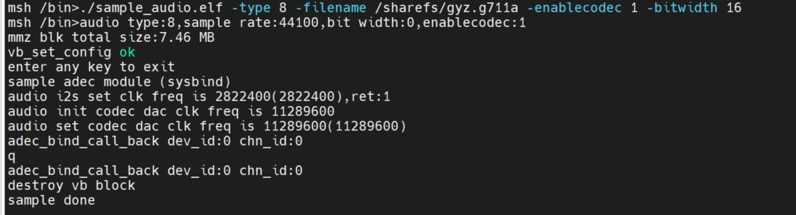

API interface method: `./sample_audio.elf -type 10 -filename /sharefs/gyz.g711a -enablecodec 1 -bitwidth 16`

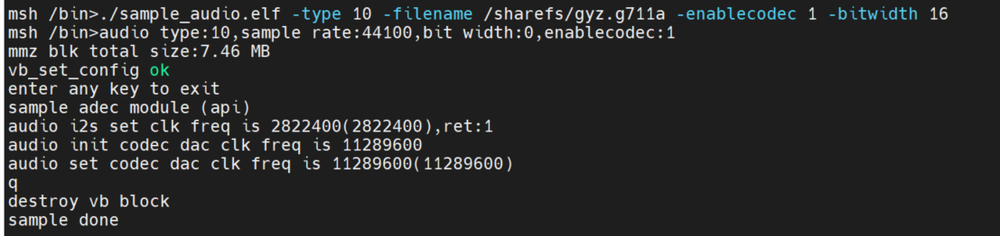

###### 2.5.4.2.10 Full Audio Process Test

1. Recording module ai->aenc->file and playback module file->adec->ao two paths run simultaneously, simulating a voice intercom scenario. Use the built-in codec with 16bit precision for simulation. Use `-filename` to choose the file to be played, in g711a format, and `-samplerate` to choose the sampling precision. The recording file name is the playback file name followed by `_rec`: for example, if `-filename` is `/sharefs/test.g711a`, the recording file name will be `/sharefs/test.g711a_rec`.

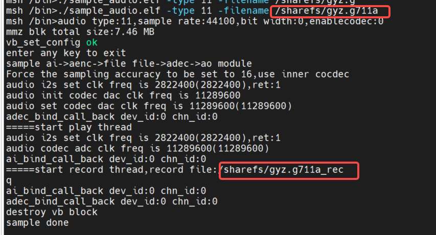

1. ai->aenc, adec->ao two paths binding loopback test. Use the built-in codec with 16bit precision for simulation.

Simultaneously test the timestamp of the stream after g711 encoding.

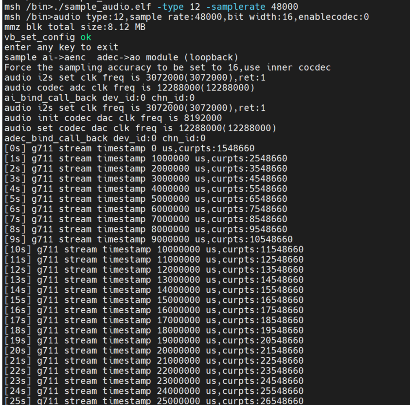

Input `cat /proc/umap/sysbind` to view the system binding between modules.

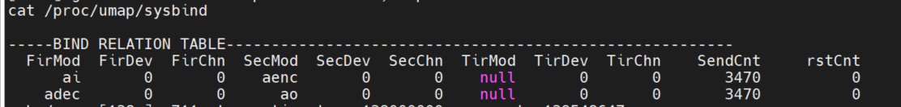

###### 2.5.4.2.11 MAPI Audio Test

Ensure the inter-core communication process is started on the large core: execute on the large core: `/bin/sample_sys_init.elf &`
Ensure the small core loads the inter-core communication driver module: `insmod /mnt/k_ipcm.ko`

- You can input `/mnt/sample_audio -help` to view the demo usage method.
- Use the `-type` option to test different module functions.
- Use the `-samplerate` option to configure different sampling rates for audio input and output (8k-192k), with a default of 44.1k.
- Use the `-enablecodec` option to use the built-in codec or external audio sub-board, with the built-in codec used by default.
- Use the `-filename` option to load or save g711 files.
- Use the `-channels` option to specify the number of channels.

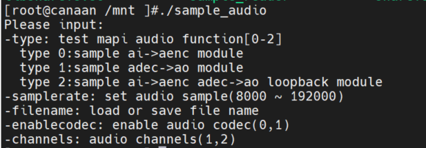

- ai->aenc test

Execute the command on the small core: `/mnt/sample_audio -type 0 -filename test.g711a`, press the q key to exit the test. The demo can collect audio data in real-time, encode it into g711a format, and save it to a file.

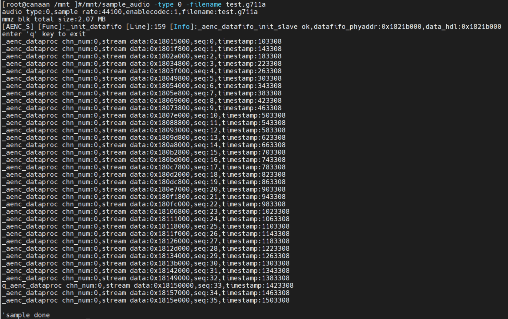

- adec->ao test

Execute the command on the small core: `/mnt/sample_audio -type 1 -filename tes.g711a`, press the q key to exit the test. The demo can loop decode and play local g711a format files.

### Translation to English

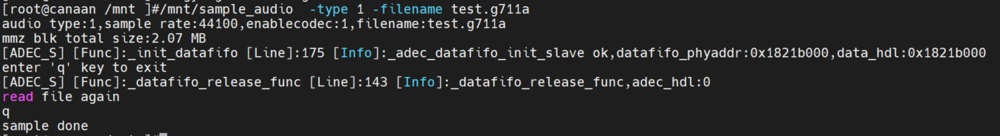

- ai->aenc adec->ao loopback test

Execute the command on the small core: `/mnt/sample_audio -type 2`, press the q key to exit the test. The demo can collect audio data in real-time, encode it into g711a format, and then decode the g711a format data for playback output.
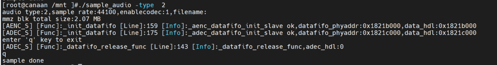

### 2.6 Vicap_demo

#### 2.6.1 Introduction to vicap_demo

The vicap demo implements camera data collection and preview functionality by calling the mpi interface.

#### 2.6.2 Feature Description

The current version supports image collection and preview for three camera modules: OV9732, OV9286, and IMX335. It supports up to three data streams per camera and up to three camera data inputs.

#### 2.6.3 Dependency Resources

Camera module

#### 2.6.4 Usage Instructions

##### 2.6.4.1 Compilation

Refer to the `README.md` in the SDK for the software compilation environment.

1. Execute `make mpp-clean && rt-smart && make build-image` in the k230_sdk directory to compile the modifications into the SD card image. The image file `sysimage-sdcard.img` will be generated in the `k230_sdk/output/k230_evb_defconfig/images/` directory.

##### 2.6.4.2 Execution

1. Copy the `src/big/mpp/userapps/sample/elf/sample_vicap.elf` file to a specified local directory.
1. Mount this directory to the small core Linux `/sharefs` via NFS.
1. On the large core, navigate to `/sharefs` using the `cd /sharefs` command.
1. Execute the `./sample_vicap` command in this directory to get command help information.

When the `sample_vicap` command is entered, the following prompt information is printed:

```shell
usage: ./sample_vicap -mode 0 -dev 0 -sensor 0 -chn 0 -chn 1 -ow 640 -oh 480 -preview 1 -rotation 1
Options:
 -mode:         vicap work mode[0: online mode, 1: offline mode. only offline mode supports multiple sensor input]     default 0
 -dev:          vicap device id[0,1,2]        default 0
 -dw:           enable dewarp[0,1]    default 0
 -sensor:       sensor type[0: ov9732@1280x720, 1: ov9286_ir@1280x720], 2: ov9286_speckle@1280x720]
 -ae:           ae status[0: disable AE, 1: enable AE]        default enable
 -awb:          awb status[0: disable AWB, 1: enable AWB]     default enable
 -chn:          vicap output channel id[0,1,2]        default 0
 -ow:           the output image width, default same with input width
 -oh:           the output image height, default same with input height
 -ox:           the output image start position of x
 -oy:           the output image start position of y
 -crop:         crop enable[0: disable, 1: enable]
 -ofmt:         the output pixel format[0: yuv, 1: rgb888, 2: rgb888p, 3: raw], only channel 0 supports raw data, default yuv
 -preview:      the output preview enable[0: disable, 1: enable], only support 2 output channel preview
 -rotation:     display rotation[0: degree 0, 1: degree 90, 2: degree 270, 3: degree 180, 4: unsupported rotation]
 -help:         print this help
```

Parameter description:

| **Parameter Name** | **Optional Values** | **Description** |
|---|---|---|
| -dev         | 0: vicap device 0, 1: vicap device 1, 2: vicap device 2. | Specifies the vicap device to use. The system supports up to three vicap devices. By specifying the device number, the binding relationship between the sensor and different vicap devices is achieved. For example: `-dev 1 -sensor 0` means binding the OV9732 1280x720 RGB image output to vicap device 1. |
| -mode | 0: online mode; 1: offline mode | Specifies the work mode of the vicap device. Currently supports online and offline modes. For multiple sensor inputs, it must be specified as offline mode. |
| -sensor      | 0: ov9732@1280x720, 1: ov9286_ir@1280x720, 2: ov9286_speckle@1280x720, 3: imx335_2lan@1920x1080, 4: imx335_2lan@2592x1944, 5: imx335_4lan@2592x1944 | Specifies the type of sensor to use. The current system supports three types of image output: OV9732 1280x720 RGB image output, OV9286 1280x720 infrared image output, OV9286 1280x720 speckle image output. The IMX335 outputs RGB images. |
| -chn         | 0: vicap device output channel 0, 1: vicap device output channel 1, 2: vicap device output channel 2. | Specifies the output channel of the vicap device. A vicap device supports up to three outputs, only channel 0 supports RAW image format output. |
| -ow   |       | Specifies the output image width, default is the input image width. The width needs to be aligned to 16 bytes. If the default width exceeds the maximum display output width, the display output width will be used as the final output width. If the output width is smaller than the input image width and the `ox` or `oy` parameters are not specified, it defaults to scaled output. |
| -oh   |       | Specifies the output image height, default is the input image height. If the default height exceeds the maximum display output height, the display output height will be used as the final output height. If the output height is smaller than the input image height and the `ox` or `oy` parameters are not specified, it defaults to scaled output. |
| -ox   |       | Specifies the horizontal starting position of the image output. If this parameter is greater than 0, crop operation will be performed. |
| -oy   |       | Specifies the vertical starting position of the image output. If this parameter is greater than 0, crop operation will be performed. |
| -crop        | 0: Disable crop function, 1: Enable crop function | When the output image size is smaller than the input image size, it defaults to scaled output. If this flag is specified, it will crop the output. |
| -ofmt        | 0: yuv format output, 1: rgb format output, 2: raw format output | Specifies the output image format, default is yuv output. |
| -preview     | 0: Disable preview display, 1: Enable preview display | Specifies the output image preview display function. Default is enabled. Currently supports up to 2 output image previews simultaneously. |
| -rotation    | 0: Rotate 0 degrees, 1: Rotate 90 degrees, 2: Rotate 180 degrees, 3: Rotate 270 degrees, 4: Unsupported rotation | Specifies the rotation angle of the preview display window. Default only the first output image window supports rotation function. |

Example 1:

`./sample_vicap -dev 0 -sensor 0 -chn 0 -chn 1 -ow 640 -oh 480`

Description: Binds OV9732@1280x720 RGB to vicap device 0, and enables vicap device output channels 0 and 1. Channel 0 output size defaults to input image size (1280x720), channel 1 output image size is 640x480.

Example 2:

`./sample_vicap.elf -mode 1 -dev 0 -sensor 0 -chn 0 -ow 1080 -oh 720 -dev 1 -sensor 1 -chn 0 -ow 1080 -oh 720 -dev 2 -sensor 2 -chn 0 -ow 1080 -oh 720 -preview 0`

Description: Three-way input and output. Binds OV9732@1280x720 RGB to vicap device 0 and sets channel 0 output size to 1080x720; binds OV9286@1280x720 infrared to vicap device 1 and sets channel 0 output size to 1080x720; binds OV9286@1280x720 speckle to vicap device 2 and sets channel 0 output size to 1080x720 (no preview).

### 2.7 DMA_demo

#### 2.7.1 Introduction to DMA_demo

##### 2.7.1.1 Non-binding Mode

DMA channels 0-3 are GDMA, channels 4-7 are SDMA.

- Channel 0 continuously inputs images with a resolution of 1920x1080, 8bit, YUV400, single-channel mode, rotates 90 degrees and outputs, and compares with golden data.
- Channel 1 continuously inputs images with a resolution of 1280x720, 8bit, YUV420, dual-channel mode, rotates 180 degrees and outputs, and compares with golden data.
- Channel 2 continuously inputs images with a resolution of 1280x720, 10bit, YUV420, triple-channel mode, x-mirror, y-mirror and outputs, and compares with golden data.
- Channel 4 performs 1D mode cyclic transfer of a segment of data, and compares with golden data after the transfer is complete.
- Channel 5 performs 2D mode cyclic transfer of a segment of data, and compares with golden data after the transfer is complete.

##### 2.7.1.2 Binding Mode

Uses VVI as DMA simulated input. Channel 0 of VVI device 0 is bound to DMA channel 0, and channel 1 of VVI device 0 is bound to DMA channel 1. VVI inputs a 640x320, YUV400, 8bit, rotated 90° image to channel 0 every second, and inputs a 640x320, YUV400, 8bit, rotated 180° image to channel 1.

#### 2.7.2 Feature Description

Includes DMA device attribute configuration, channel attribute configuration, graphic input, output, release, and pipeline binding functions.

#### 2.7.3 Dependency Resources

None

#### 2.7.4 Usage Instructions

##### 2.7.4.1 Compilation

Refer to the README.md in the release SDK software package for software compilation.

##### 2.7.4.2 Execution

1. Non-binding mode demo run

`/bin/sample_dma.elf`

Test information will be displayed on the screen, input q to end the run.

1. Binding mode demo run

`/bin/sample_dma_bind.elf`

Test information will be displayed on the screen, input q to end the run.

### 2.8 DPU_demo

#### 2.8.1 Introduction to dpu_demo

##### 2.8.1.1 Non-binding Mode

Parses parameters from the configuration file and configures the DPU's device and channel attributes, reads and configures reference and template images from the specified path, loops input of infrared and speckle images, obtains results and checks if the calculations are correct.

##### 2.8.1.2 Binding Mode

Parses parameters from the configuration file and configures the DPU's device and channel attributes, reads and configures reference and template images from the specified path, binds the pipeline using VVI as the simulated front-end, inputs infrared and speckle images, DPU calculates the results, user space obtains the results and saves the depth map as a file (the depth map can be opened with appropriate software), press q to exit the program.

#### 2.8.2 Feature Description

Includes configuration file parsing, device and channel attribute configuration, device and channel start and stop, user space input data, output results, release results, and pipeline binding input and output.

#### 2.8.3 Dependency Resources

None

#### 2.8.4 Usage Instructions

##### 2.8.4.1 Compilation

Refer to the README.md in the SDK for the software compilation environment. Since this module requires dependent files, the following steps need to be performed during compilation:

##### 2.8.4.2 Execution

1. The configuration files and input/output golden data required for the demo are stored in the `k230_sdk/test_resource/dpu` directory. To facilitate use, you can copy the entire `dpu` folder to the `/sharefs/` directory (refer to the corresponding documentation for the use of `sharefs`). After copying, the `/sharefs/dpu/` directory will exist in the large core.
1. Copy `k230_sdk/src/big/mpp/userapps/sample/elf/sample_dpu.elf` to the `/sharefs/` directory.
1. Non-binding mode demo run

    `/sharefs/sample_dpu.elf /sharefs/dpu/`

    Test information will be displayed on the screen, and the run will end after 10 frames. In the above command, the parameter `/sharefs/dpu/` can be set according to the actual path where the user's configuration files are stored.

1. Binding mode demo run

    `/sharefs/sample_dpu.elf /sharefs/dpu/ BOUND`

    Test information will be displayed on the screen, input q to end the run. In the above command, the parameter `/sharefs/dpu/` can be set according to the actual path where the user's configuration files are stored.

### 2.9 UVC_demo

#### 2.9.1 Introduction to uvc_demo

The uvc demo treats the K230 development board as a USB camera. When connected to a PC via a USB cable, the PC's player can display the real camera's image.

#### 2.9.2 Feature Description

The current version supports bulk transfer and ISO transfer.

The current version only supports 640x480 NV12 format images and 1280x720 H264/MJPEG format images.

Supports PID, VID, and device name configuration through modification of shell scripts.

#### 2.9.3 Dependency Resources

Camera module, OV9732/IMX335 camera.

Type-C cable to connect USB0 to the PC.

PC camera application or PotPlayer software installed.

#### 2.9.4 Usage Instructions

##### 2.9.4.1 Compilation

Refer to the README.md in the SDK for the software compilation environment.

1. The source code for the small core user program is located at `cdk/user/mapi/sample/camera`.
1. The small core driver program is located at `linux/drivers/usb/dwc2`.
1. The small core driver program is located at `linux/drivers/usb/gadget`.
1. The large core program involves the mpp repository and cdk.

The large core RTT implements the camera driver functionality.

The small core Linux implements the USB driver functionality and obtains camera images from the large core through mapi.

Refer to [K230_USB Application Practical_UVC Transmission of YUV and Encoded Streams](../../../../en/02_applications/tutorials/K230_USB_Application_Practice_UVC_Transmission_YUV_and_Encoding_Stream.md).

##### 2.9.4.2 Execution

After entering the large core rt-smart system, navigate to the `/bin` directory and execute:

```shell
msh /sharefs/app>./sample_sys_init.elf
```

After entering the small core Linux system, navigate to the `/mnt` directory and execute:

```shell
./canaan-camera.sh start otg0

./camera -t 7
```

Connect the USB0 of the development board to the PC using a type-C USB cable, and use PotPlayer to play the camera.

By default, BULK transfer is used. You can switch to ISO transfer using the following commands:

```shell
./canaan-camera.sh stop

./canaan-camera.sh start otg0 iso

./camera -i -t 7
```

The `-t` option is used to specify the vicap sensor type. Refer to the `k230_docs/zh/01_software/board/mpp/K230_Camera_Sensor适配指南.md` document for the description of `k_vicap_sensor_type`. The default value is 7.

In PotPlayer, go to `Options` -> `Device` -> `Camera` interface,
`Video Capture Device` -> `Device`, select `UVC Camera`
`Video Capture Device` -> `Format`, select `H264 1280*720 30(P 16:9)` or `MJPG 1280*720 30(P 16:9)` or `NV12 640*360p 30(P 16:9)`

PotPlayer -> `Open` -> `Camera/Other Device`

### 2.10 USB_demo

#### 2.10.1 Introduction to USB_demo

The USB demo currently supports four functionalities.

Since the upgrade function of K230 can only use USB0, USB0 is set as a device to simulate a USB drive and a mouse/keyboard. The jumper cap should not connect pin1/pin2 of J5, as the device cannot enable 5V power supply.

As a host, it can connect to a USB drive and a mouse/keyboard. The jumper cap needs to connect pin3/pin4 of J5 to enable 5V power supply.

#### 2.10.2 Feature Description

The USB demo functionality is integrated into the Linux system.

#### 2.10.3 Dependency Resources

Type-C cable, Type-C to Type-A adapter.

#### 2.10.4 Usage Instructions

##### 2.10.4.1 Simulate a USB Drive as a Device

```shell
# Allocate a memory space as the disk space for the simulated USB drive.
[root@canaan / ]#gadget-storage-mem.sh
2+0 records in
2+0 records out
mkfs.fat 4.1 (2017-01-24)
[ 1218.882053] Mass Storage Function, version: 2009/09/11
[ 1218.887308] LUN: removable file: (no medium)
[ 1218.895464] dwc2 91500000.usb-otg: bound driver configfs-gadget
[root@canaan / ]#[ 1219.019554] dwc2 91500000.usb-otg: new device is high-speed
[ 1219.056629] dwc2 91500000.usb-otg: new address 5

# Use the FAT partition of the SD/eMMC as the disk space for the simulated USB drive.
[root@canaan ~ ]#gadget-storage.sh
[  359.995510] Mass Storage Function, version: 2009/09/11
[  360.000762] LUN: removable file: (no medium)
[  360.013138] dwc2 91500000.usb-otg: bound driver configfs-gadget
[root@canaan ~ ]#[  360.136809] dwc2 91500000.usb-otg: new device is high-speed
[  360.173543] dwc2 91500000.usb-otg: new address 43
```

Connect USB0 of the development board to the PC using a type-C cable. The PC will display a connected USB drive.

##### 2.10.4.2 Connect a USB Drive as a Host

The K230 development board connects USB1 to a USB drive using a Type-C to Type-A adapter.

##### 2.10.4.3 Simulate a Mouse/Keyboard as a Device

The K230 development board connects USB0 to another computer using a Type-C cable for testing.

```shell
[root@canaan / ]#gadget-hid.sh

[root@canaan / ]#hid_gadget_test /dev/hidg0 mouse
# Follow the prompts to input corresponding operations, such as -123 -123, to see the mouse pointer move on the PC.

[root@canaan / ]#hid_gadget_test /dev/hidg1 keyboard
# Follow the prompts to input corresponding operations, which will simulate keyboard input on the PC. For example, a b c --return
```

##### 2.10.4.4 Connect a Mouse/Keyboard as a Host

The K230 development board connects USB1 to a mouse or keyboard using a Type-C to Type-A adapter.

```shell
# Use the following command to determine the event corresponding to the input device. If the K230 development board is not connected to a screen, connecting a mouse or keyboard will change the corresponding event.
[root@canaan ~ ]#cat /proc/bus/input/devices
...
I: Bus=0003 Vendor=046d Product=c52f Version=0111
N: Name="Logitech USB Receiver"
P: Phys=usb-91500000.usb-otg-1/input0
S: Sysfs=/devices/platform/soc/91500000.usb-otg/usb1/1-1/1-1:1.0/0003:046D:C52F.0001/input/input2
U: Uniq=
H: Handlers=event2
B: PROP=0
B: EV=17
B: KEY=ffff0000 0 0 0 0
B: REL=1943
B: MSC=10
```

```shell
[root@canaan / ]$ test_mouse /dev/input/event2
# Click or move the mouse, and the corresponding display will appear in the serial port.

[root@canaan / ]$ test_keyboard /dev/input/event2
# Press different keys on the keyboard, and the corresponding display will appear in the serial port.
```

### 2.11 GPU_demo

#### 2.11.1 Introduction to GPU_demo

The GPU demo includes three executable programs:

- `tiger`: Draws a vector illustration of a tiger.
- `linearGrad`: Draws a linear gradient example.
- `imgIndex`: Draws a color lookup table example.

#### 2.11.2 Feature Description

The GPU demo mainly covers three functionalities: vector drawing, linear gradient (implemented through pattern), and color lookup table.

#### 2.11.3 Dependency Resources

Writable file system.

#### 2.11.4 Usage Instructions

Navigate to a writable directory and execute the program.

##### 2.11.4.1 tiger

Run the `tiger` command. After execution, a `tiger.png` file will be generated in the current directory, as shown below:


##### 2.11.4.2 linearGrad

Run the `linearGrad` command. After execution, a `linearGrad.png` file will be generated in the current directory, as shown below:


##### 2.11.4.3 imgIndex

Run the `imgIndex` command. After execution, four image files will be generated in the current directory, as shown below:

- `imgIndex1.png`: index1 mode, supports 2 colors


- `imgIndex2.png`: index2 mode, supports 4 colors


- `imgIndex4.png`: index4 mode, supports 16 colors


- `imgIndex8.png`: index8 mode, supports 256 colors


##### 2.11.4.4 vglite_drm

Run the `vglite_drm` command. The GPU will display the pattern on the LCD screen, and pressing the `Enter` key again will display the next pattern, as shown below:


##### 2.11.4.5 vglite_cube

Run the `vglite_cube` command. The GPU will display a rotating cube on the LCD screen, as shown below:

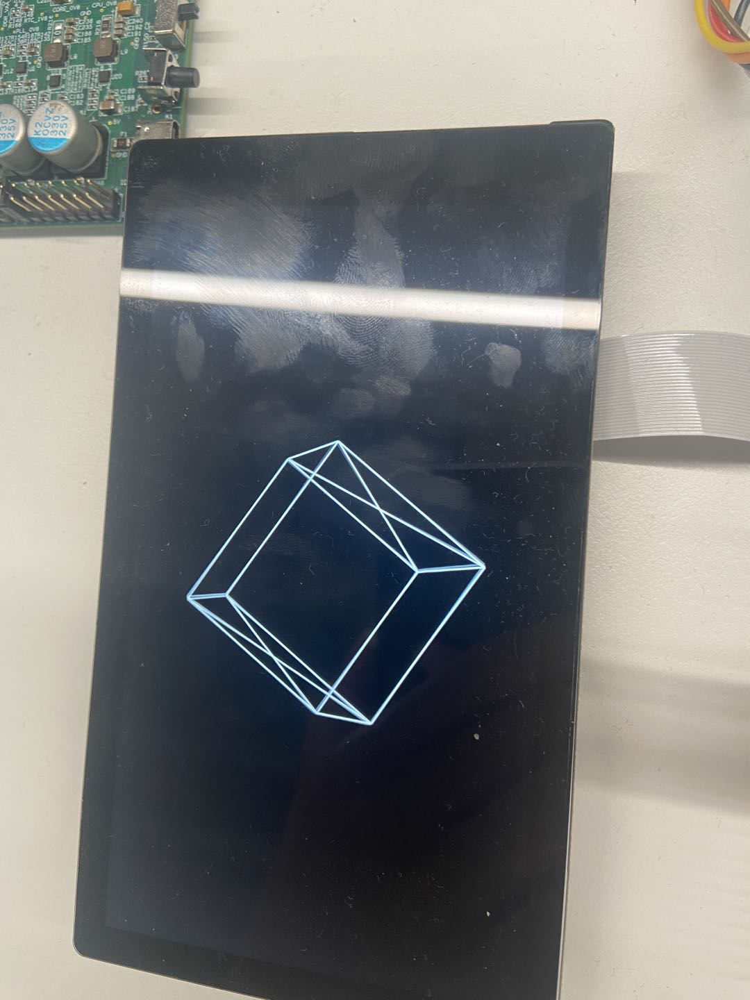

During the demo run, the kernel will print a lot of messages. If you do not want to display these messages, you can reduce the kernel print level:

```shell
sysctl -w kernel.printk=6
```

### 2.12 DRM Display Demo

#### 2.12.1 Introduction to the Demo

This demo runs on the Linux system of the K230 small core and displays images on the screen.

#### 2.12.2 Feature Description

1. DRM supports operations on 5 layers, including 1 video layer and 4 OSD layers.
1. The video layer supports NV12, NV21, NV16, NV61 color spaces.
1. The OSD layer supports ARGB8888, ARGB4444, RGB888, RGB565 color spaces.

#### 2.12.3 Dependency Resources

LCD screen.

#### 2.12.4 Usage Instructions

##### 2.12.4.1 Compilation

Refer to the README.md in the release SDK software package for software compilation.

##### 2.12.4.2 Execution

```shell
modetest -M canaan-drm -D 0 -a -s 38@36:1080x1920-30  -P 31@36:1080x1920@NV12 -v -F smpte
```

After executing the above command, a color bar will be displayed on the LCD screen, as shown below:

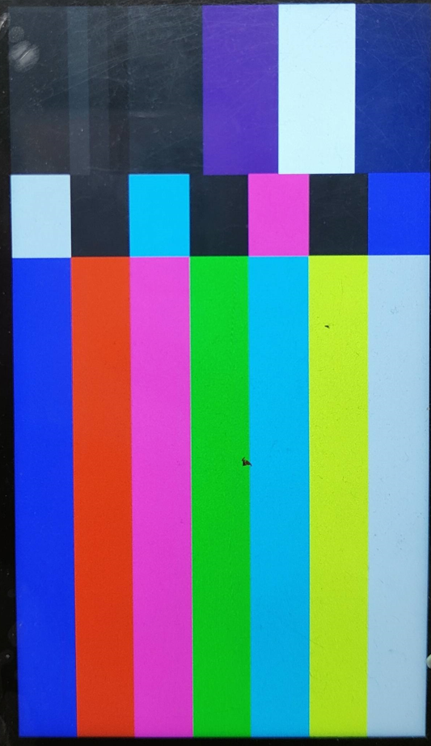

### 2.13 LVGL Demo

#### 2.13.1 Introduction to the Demo

This demo runs on the Linux system of the K230 small core and displays a configuration interface on the screen, which supports touch operations.

#### 2.13.3 Dependency Resources

LCD screen.

#### 2.13.2 Feature Description

1. Supports button and slider functionalities.
1. Supports touch functionality.

#### 2.13.4 Usage Instructions

##### 2.13.4.1 Compilation

Refer to the README.md in the release SDK software package for software compilation.

##### 2.13.4.2 Execution

```shell
lvgl_demo_widgets
```

After executing the above command, a configuration interface will be displayed on the LCD screen, which can be configured through the touchscreen, as shown below:

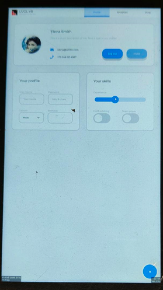

### 2.14 RTSP Streaming Demo

#### 2.14.1 Introduction to the Demo

This demo implements RTSP streaming.

#### 2.14.2 Feature Description

This demo supports simultaneous streaming of audio and video streams to an RTSP server, using the `mapi venc&aenc` interface to encode audio and video. After streaming, the URL can be pulled for playback. Currently, this demo supports streaming and pulling for up to 3 URLs.

#### 2.14.3 Dependency Resources

A USB to Ethernet adapter is needed to connect the development board to a network cable.

#### 2.14.4 Usage Instructions

##### 2.14.4.1 Compilation

Refer to the `README.md` in the release SDK software package for compilation instructions. In the Docker environment, compile `cdk-user`, and the executable program `rtsp_demo` will be generated in `k230_sdk/src/common/cdk/user/out/little`.

##### 2.14.4.2 Execution

By default, `rtsp_demo` uses the sensor type `IMX335_MIPI_2LANE_RAW12_1920X1080_30FPS_LINEAR`. You can modify the sensor type and other parameters through command-line arguments. Detailed instructions are as follows:

After starting the development board:

1. Use `lsmod` to check if the `k_ipcm` module is loaded on the small core side. If not, execute `insmod k_ipcm.ko` to load the `k_ipcm` module.
1. On the large core side, start the inter-core communication process by executing `/sharefs/app/sample_sys_init.elf`.
1. On the small core side, navigate to the `/mnt` directory and execute `./rtsp_demo`. By default, it streams one H.265 video stream with a resolution of 1280x720. For parameter descriptions, see below. When streaming MJPEG streams, the maximum supported resolution is currently 2032x1944, and the minimum resolution is 640x480.

```shell
Usage: ./rtsp_demo -s 0 -n 2 -t h265 -w 1280 -h 720 -a 0
                    -s: the sensor type:
                        see vicap doc
                    -n: the session number, range: 1, 2, 3
                    -t: the video encoder type: h264/h265/mjpeg
                    -w: the video encoder width
                    -h: the video encoder height
                    -a: audio input type (0: mic input, 1: headphone input), default 0.
```

The sensor type values can be found in the `k230_docs/zh/01_software/board/mpp/K230_Camera_Sensor适配指南.md` document under the description of `k_vicap_sensor_type`.
The audio input type can be selected as onboard mic or headphone input.

After `rtsp_demo` runs successfully on the small core, it will print a URL in the form of `rtsp://ip:8554/session0`, where `0` represents the first stream. You can use VLC to pull the stream from the URL for playback. To stop the stream, first stop VLC from pulling the stream, then execute `ctrl+c` to stop `rtsp_demo`.

### 2.15 FaceAeDemo

#### 2.15.1 Demo Introduction

This demo is used on the large core and is a demo for joint debugging of VICAP, KPU, VO (video output), and AERoi. It can appropriately adjust the face exposure brightness through the face detection interface.

#### 2.15.2 Compilation

1. First, refer to the README.md in the release SDK package and use Docker to compile the image.
1. After compilation, the sample (sample_face_ae.elf) will be stored by default in the path `k230_sdk/src/big/mpp/userapps/sample/elf`.
1. Since the KPU linkage requires the use of the detection model `test.kmodel`, the compiled path is `k230_sdk/src/big/mpp/userapps/sample/elf`.

#### 2.15.3 Execution

After starting the development board, enter the small core `/mnt` directory, add the inter-core communication module, start inter-core communication, and create a shared file system. Share `sample_face_ae.elf` and `test.kmodel` with the large core through the small core shared file system. You can transfer files to the small core file system through methods such as mounting or TFTP. Currently, the default files are already stored in the small core `~` directory.

```shell
cd /mnt
insmod k_ipcm.ko
mkdir /sharefs
cp ~/sample_face_ae.elf /sharefs/
cp test.kmodel /sharefs/
./sharefs &
```

After the small core starts `sharefs`, the large core shared file system will obtain the sample and kmodel.

```shell
cd /sharefs
./sample_face_ae.elf test.kmodel 1 # arg1: model name, arg2: enable face ae
Wait for initialization to complete and prompt any letter + enter.
Type 'a', press enter, and run the face ae demo.
After successful execution, the physical address of each frame of the image will be printed.
```

### 2.16 DPU_Vicap_demo

#### 2.16.1 Demo Introduction

The demo process is as follows:

1. Start VICAP.
1. Dump a frame of speckle image in user space.
1. Send the speckle image obtained from VICAP to DMA for 90-degree rotation processing.
1. Get the rotated image from DMA in user space.
1. Send the rotated image from DMA to DPU for depth processing.
1. Get the depth image processed by DPU in user space.
1. Save it as a file in the large and small core shared directory `/sharefs`. You can share this file to the server through `mnt` and use tools to view the depth image.

#### 2.16.2 Feature Description

ISP captures images, DMA performs image rotation, and DPU performs depth processing.

#### 2.16.3 Dependency Resources

Calibration files are needed, including configuration files and reference image files. The configuration files and reference image files need to match the sensor. The configuration files and reference image files are located in the path `k230_sdk/test_resource/dpu`, and these files only correspond to sensor1.

#### 2.16.4 Usage Instructions

##### 2.16.4.1 Compilation

1. Place the configuration files and reference image files in the directory `k230_sdk/src/big/rt-smart/userapps/root/bin/dpu`, as shown below:
    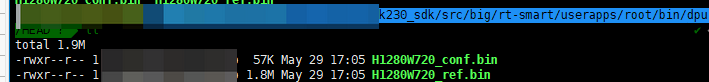

1. Execute the compilation command `make` in the `k230_sdk` directory.

1. After compilation, the demo file `sample_dpu_vicap.elf` will be in the directory `k230_sdk/src/big/mpp/userapps/sample/elf`. The system image file `sysimage-sdcard.img` will be in the directory `k230_sdk/output/k230_evb_defconfig/images`.

For more detailed compilation process, refer to the README.md in the release SDK package.

##### 2.16.4.2 Execution

1. Mount NFS using the following commands:

    ```shell
    ifconfig eth0 up
    udhcpc
    # Replace the IP address and path below with your server's IP and path
    mount -t nfs 10.10.1.94:/home/user/nfs /sharefs -o nolock
    ```

    After mounting successfully, the `/sharefs` directory can be seen on both the large and small cores. Copy the compiled demo `sample_dpu_vicap.elf` to the server's NFS directory (here it is `/home/user/nfs`). At this point, the corresponding elf file can also be seen in the large core RTT's `/sharefs`.

1. Use the command `./sample_dpu_vicap.elf -dev 0 -sensor 2 -chn 0 -preview 1 -rotation 1` to start the demo. The output print information is as follows:

    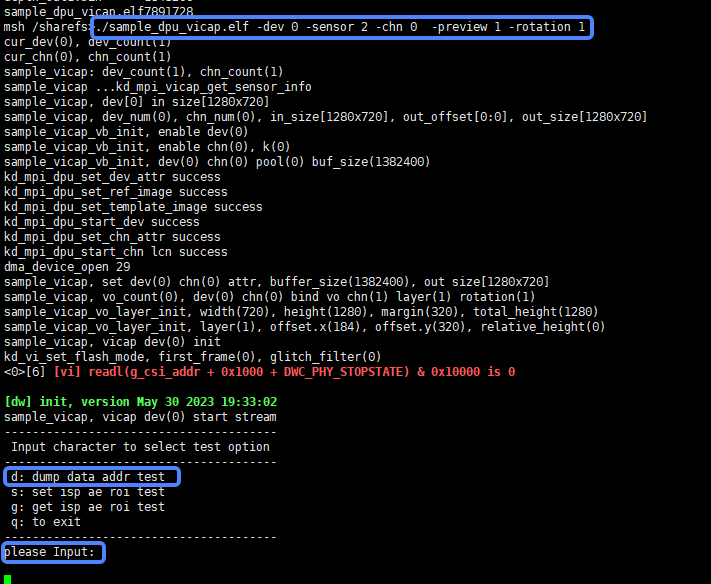

1. Input `d`, the output print information is as follows:

    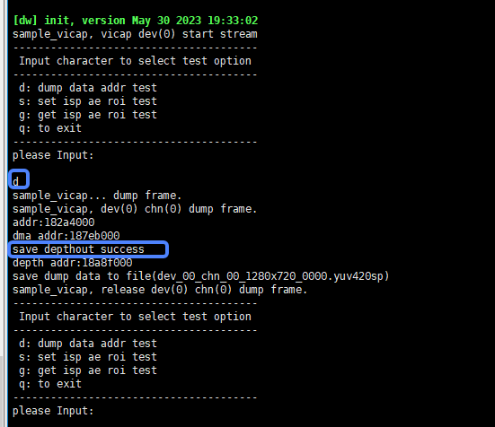

1. Input `q` to exit the program.

1. At this point, the `depth_out.bin` file is in the `/sharefs` directory. This file is the depth image file output by DPU, which can be opened and viewed using appropriate software.

##### 2.16.4.3 Results

1. The actual scene is as follows:

    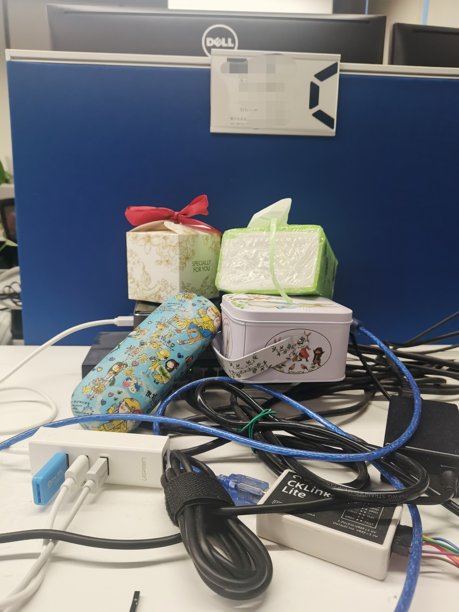

1. The speckle image captured by the sensor is as follows:

    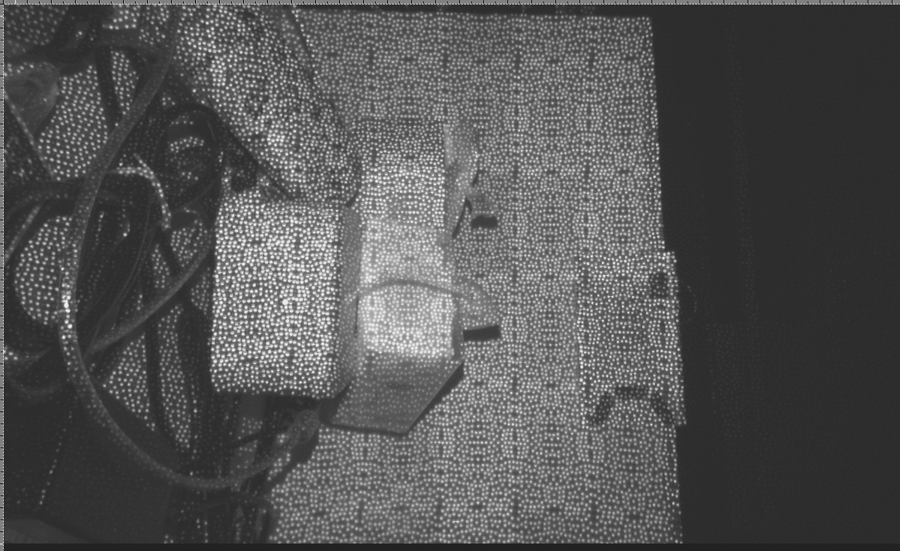

1. The speckle image rotated 90 degrees clockwise by DMA is as follows:

    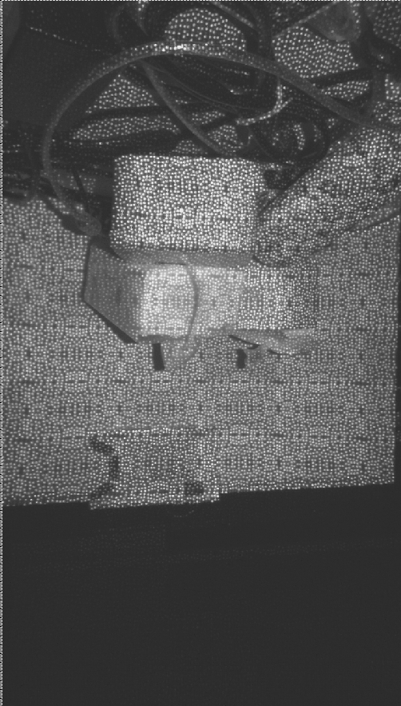

1. The depth image result output by DPU is as follows:

    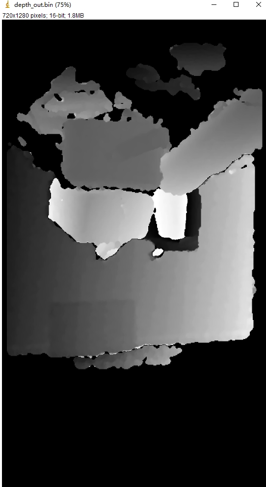

### 2.17 VICAP_DMA_DPU_demo

#### 2.17.1 Demo Introduction

The demo process is as follows:

1. Bind VICAP to DMA, and DMA to DPU.
1. Start DPU, DMA, and VICAP.
1. ISP sends the speckle image to DMA, DMA rotates it 90 degrees and sends it to DPU, DPU performs depth processing and prints the depth image address on the screen.

#### 2.17.2 Feature Description

ISP captures images, DMA performs image rotation, and DPU performs depth processing.

#### 2.17.3 Dependency Resources

Calibration files are needed, including configuration files and reference image files. The configuration files and reference image files need to match the sensor. The configuration files and reference image files are located in the path `k230_sdk/test_resource/dpu`, and these files only correspond to sensor1.

#### 2.17.4 Usage Instructions

##### 2.17.4.1 Compilation

1. Place the configuration files and reference image files in the directory `k230_sdk/src/big/rt-smart/userapps/root/bin/dpu`, as shown below:
    
1. Execute the compilation command `make` in the `k230_sdk` directory.
1. After compilation, the demo file `sample_vdd_r.elf` will be in the directory `k230_sdk/src/big/mpp/userapps/sample/elf`. The system image file `sysimage-sdcard.img` will be in the directory `k230_sdk/output/k230_evb_defconfig/images`.

For more detailed compilation process, refer to the README.md in the release SDK package.

##### 2.17.4.2 Execution

1. Mount NFS using the following commands:

    ```shell
    ifconfig eth0 up
    udhcpc
    # Replace the IP address and path below with your server's IP and path
    mount -t nfs 10.10.1.94:/home/user/nfs /sharefs -o nolock
    ```

    After mounting successfully, the `/sharefs` directory can be seen on both the large and small cores. Copy the compiled demo `sample_vdd_r.elf` to the server's NFS directory (here it is `/home/user/nfs`). At this point, the corresponding elf file can also be seen in the large core RTT's `/sharefs`.

1. Use the command `./sample_vdd_r.elf` to start the demo.

1. Input `q` to stop the demo and save the depth image as a file in `/sharefs`, named `depthout.bin`.

1. You can use appropriate software to view the depth image.

1. The results are as follows:

    

### 2.18 Voice Intercom Demo

#### 2.18.1 Demo Introduction

This demo is used to demonstrate the bidirectional transmission and processing of audio data (the current version implements part of the voice intercom functionality).

#### 2.18.2 Feature Description

Voice intercom involves two ends, both of which can collect, encode, and send audio data to the other end in real-time, and can also receive and decode the audio data from the other end for output. The current implementation refers to ONVIF and extends the backchannel on the RTSP protocol to support sending audio data from the client to the server. In the following text, server and client refer to the two ends of the voice intercom.

The currently implemented functions are as follows:

1. The audio stream format is G711 mu-Law.
1. The server end implements real-time audio collection, encoding, and sending, as well as receiving audio data from the client through the backchannel for decoding and output. The receiving end has not implemented a jitter buffer.
1. The client end implements receiving, decoding, and playing audio streams, as well as real-time audio collection, G711 mu-Law encoding, and sending to the server end through the backchannel. The receiving end has not implemented a jitter buffer.
1. Only one-to-one intercom is supported (only one backchannel is supported).
1. Echo cancellation is not supported (the device side needs to output audio to headphones, and cannot use external speakers).

#### 2.18.3 Dependency Resources

Two K230 devices are needed. Connect the development boards to the same local area network through a USB-to-Ethernet adapter.

#### 2.18.4 Usage Instructions

##### 2.18.4.1 Compilation

Refer to the README.md in the release SDK package for instructions. In the Docker environment, compile `cdk-user`, and the executable programs `rtsp_server` and `backchannel_client` will be generated in `k230_sdk/src/common/cdk/user/out/little`.

##### 2.18.4.2 rtsp_server Parameter Description

| Parameter Name | Description | Parameter Range | Default Value |
|:--|:--|:--|:--|
| h | Print command line parameter information | - | - |
| v | Whether to create a video session | - | - |
| t | Encoding type | h264, h265 | h265 |
| w | Video encoding width | `[640, 1920]` | 1280 |
| h | Video encoding height | `[480, 1080]` | 720 |
| b | Video encoding bitrate | - | 2000 |
| a | Voice change setting | `[-12, 12]` | 0 |
| s | Sensor type | See camera sensor documentation | 7 |

The sensor type can be found in the `k230_docs/zh/01_software/board/mpp/K230_Camera_Sensor适配指南.md` document under the description of `k_vicap_sensor_type`.

##### 2.18.4.3 Execution

For ease of description, the board running the server is named board A, and the board running the client is named board B:

1. First, run `rtsp_server` on board A, with microphone input and headphone output.
1. Then, run `backchannel_client` on board B, with microphone input and headphone output.

Specific execution steps on board A:

1. After starting the development board, enter the `/mnt` directory on the small core:
1. Execute on the small core: `insmod k_ipcm.ko`
1. Execute on the large core: `cd /bin; ./sample_sys_init.elf`
1. Execute on the small core: `./rtsp_server` (after running `rtsp_server`, a URL address like `rtsp://<server_ip>:8554/BackChannelTest` will be printed)

Specific execution steps on board B:

1. After starting the development board, enter the `/mnt` directory on the small core:
1. Execute on the small core: `insmod k_ipcm.ko`
1. Execute on the large core: `cd /bin; ./sample_sys_init.elf`
1. Execute on the small core: `./backclient_test rtsp://<server_ip>:8554/BackChannelTest`

The `backclient_test` execution command is `./backclient_test <rtsp_url> <out_type>`, where `rtsp_url` is the RTSP address, and `out_type` is the VO output connect type. Refer to the `k230_docs/zh/01_software/board/mpp/K230_视频输出_API参考.md` document for the description of `k_connector_type`. The `out_type` is set to 0 by default.

### 2.19 Depth Map Display Demo

#### 2.19.1 Demo Introduction

This demo is used to display the depth map processed by DPU on the screen.

#### 2.19.2 Feature Description

1. Bind VICAP to DMA, and DMA to DPU.
1. Start DPU, DMA, VICAP, and VO.
1. ISP sends the speckle image to DMA, DMA rotates it 90 degrees and sends it to DPU, DPU performs depth processing.
1. Get the depth result in user space.
1. Send the depth map to VO for display.

#### 2.19.3 Dependency Resources

Calibration files are needed, including configuration files and reference image files. The configuration files and reference image files need to match the sensor. The configuration files and reference image files are located in the path `k230_sdk/test_resource/dpu`, and these files only correspond to sensor1.

#### 2.19.4 Usage Instructions

##### 2.19.4.1 Compilation

1. Place the configuration files and reference image files in the directory `k230_sdk/src/big/rt-smart/userapps/root/bin/dpu`.
1. Execute the compilation command `make` in the `k230_sdk` directory.
1. After compilation, the demo file `sample_dpu_vo.elf` will be in the directory `k230_sdk/src/big/mpp/userapps/sample/elf`.
In the `k230_sdk/output/k230_evb_defconfig/images` directory, there will be a system image file named `sysimage-sdcard.img`.

> For more detailed compilation instructions, please refer to the README.md in the release SDK package.

##### 2.19.4.2 Execution

1. Mount NFS. After successful mounting, the `/sharefs` directory will be visible on both the large and small cores. Copy the compiled demo `sample_dpu_vo.elf` to the NFS directory on the server. At this point, the corresponding ELF file can also be seen in the `/sharefs` directory on the large core RTT.
1. Use the command `./sample_dpu_vo.elf` to start the demo. The depth map processed by DPU will be displayed on the screen.
1. Press 'q' to exit the demo.

### 2.20 OTA Remote Upgrade Demo

#### 2.20.1 Demo Introduction

OTA stands for Over The Air, which is a technology for downloading updates remotely, as opposed to on-site flashing. It allows updating the device firmware over the network.

#### 2.20.2 Feature Description

1. The flashing method and firmware updates are stored on a remote server, making it easy to modify.
1. Supports signed and encrypted upgrade packages to ensure data integrity and security.
1. Disaster recovery plans are not supported. Common OTA disaster recovery mechanisms include A/B backup schemes or Recovery schemes. K230's application scenarios may use small-capacity Norflash or large-capacity eMMC. Specific usage scenarios can be developed based on this demo.

#### 2.20.3 Dependency Resources

Set up an HTTP server, such as using the HFS (HTTP File Server).

#### 2.20.4 Usage Instructions

##### 2.20.4.1 Creating an Upgrade Package

```shell
xxx@develop:~/k230/k230_sdk/tools/ota$ tree
.
├── ota_package
│   ├── rootfs
│   │   ├── etc
│   │   └── mnt
│   └── rtt_system.bin
├── ota_private.pem
├── ota_public.pem
├── ota_upgrade.sh
├── package_kpk.sh
└── README
```

1. To create an upgrade package: Enter the `k230_sdk/tools/ota` directory and execute `./package_kpk.sh`. This will generate the `ota_package.kpk` upgrade package. The `ota_package` directory should be created by the user and should contain the firmware for the partitions to be upgraded (e.g., `rtt_system.bin`), as well as the file system of the small core Linux. Note that the upgrade mechanism involves downloading the upgrade package to memory and then decompressing it for flashing. Due to memory capacity limitations, the size of the partition files included in the `ota_package` should not exceed 20MB. Multiple flashes can be performed if necessary.
1. For partition firmware of different media, refer to the `k230_sdk/tools/gen_image_cfg/xxx.cfg` file. Even if some partitions are not visible in the small core Linux system, the entire disk space can be erased and upgraded through offset addresses.
1. `ota_upgrade.sh` is the upgrade script executed on the device. If partitions are modified, this script needs to be correspondingly modified.
1. `ota_private.pem` is the private key for signing the upgrade package. The public key needs to be compiled or copied to the `/etc/` directory on the device. Refer to the README for more details.

##### 2.20.4.2 Compiling Device-side Programs

1. The device-side OTA program is located in `buildroot-ext/package/ota`. Compiling buildroot will install the OTA program to the `/usr/bin` directory of the file system, and `ota.cfg` to the `/etc/` directory. The `ota.cfg` file can be configured with the server-side upgrade package download link and the path to the public key.

##### 2.20.4.3 Execution

1. Open `hfs.exe` and add a folder from the disk, then copy the upgrade package to this directory.
1. Ensure that the development board can communicate with the server over the network. Execute `ota` on the development board to complete the download and upgrade operation.

### 2.21 FFT Demo

#### 2.21.1 Demo Introduction

This demo is used to verify the usage of FFT API and test FFT functionality. The code can be found in `src/big/mpp/userapps/sample/sample_fft/`.

#### 2.21.2 Feature Description

First, perform FFT calculation, then perform IFFT calculation.

#### 2.21.3 Dependency Resources

None

#### 2.21.4 Usage Instructions

##### 2.21.4.1 Compilation

> Please refer to the README.md in the release SDK package.

##### 2.21.4.2 Execution

1. After both the large and small core systems are up, execute the following command on the large core:

   ```bash
   cd /sharefs/app; ./sample_fft.elf
   ```

   The large core serial output will be as follows:

   ```text
   msh /sharefs/app>./sample_fft.elf 1 0
   -----fft ifft point 0064  -------
       max diff 0003 0001
       i=0045 real  hf 0000  hif fc24 org fc21 dif 0003
       i=0003 imag  hf ffff  hif 0001 org 0000 dif 0001
   -----fft ifft point 0064 use 133 us result: ok


   -----fft ifft point 0128  -------
       max diff 0003 0002
       i=0015 real  hf 0001  hif fca1 org fc9e dif 0003
       i=0031 imag  hf 0001  hif fffe org 0000 dif 0002
   -----fft ifft point 0128 use 121 us result: ok


   -----fft ifft point 0256  -------
       max diff 0003 0001
       i=0030 real  hf 0000  hif fca1 org fc9e dif 0003
       i=0007 imag  hf ffff  hif 0001 org 0000 dif 0001
   -----fft ifft point 0256 use 148 us result: ok


   -----fft ifft point 0512  -------
       max diff 0003 0003
       i=0060 real  hf 0000  hif fca1 org fc9e dif 0003
       i=0314 imag  hf 0001  hif fffd org 0000 dif 0003
   -----fft ifft point 0512 use 206 us result: ok


   -----fft ifft point 1024  -------
       max diff 0005 0002
       i=0511 real  hf 0000  hif fc00 org fc05 dif 0005
       i=0150 imag  hf 0000  hif fffe org 0000 dif 0002
   -----fft ifft point 1024 use 328 us result: ok


   -----fft ifft point 2048  -------
       max diff 0005 0003
       i=1022 real  hf 0000  hif fc00 org fc05 dif 0005
       i=1021 imag  hf 0000  hif 0003 org 0000 dif 0003
   -----fft ifft point 2048 use 574 us result: ok


   -----fft ifft point 4096  -------
       max diff 0005 0002
       i=4094 real  hf 027b  hif 041f org 0424 dif 0005
       i=0122 imag  hf 0000  hif 0002 org 0000 dif 0002
   -----fft ifft point 4096 use 1099 us result: ok

   ```
