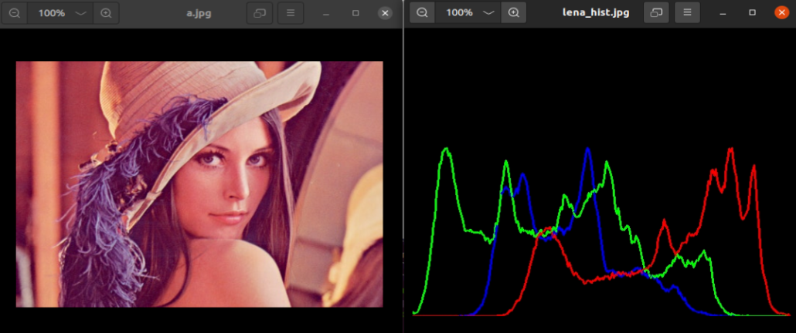
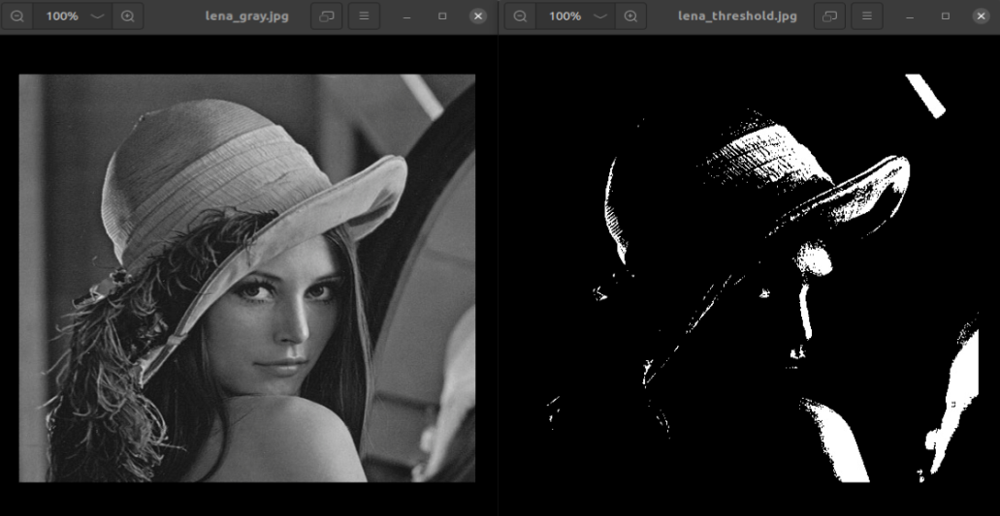
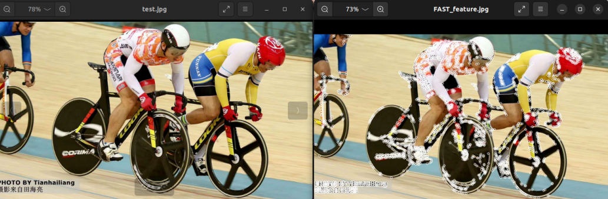
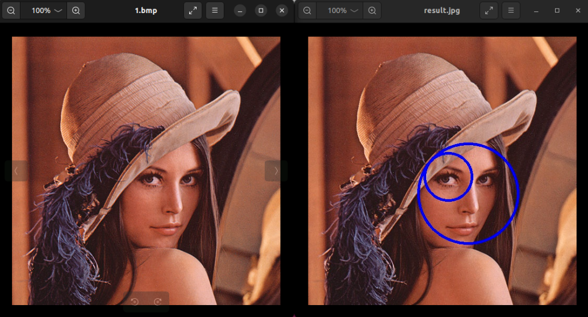

# K230 OpenCV Development Guide


Copyright 2023 Canaan Inc. ©

<div style="page-break-after:always"></div>

## disclaimer

The products, services or features you purchase should be subject to Canaan Inc. ("Company", hereinafter referred to as "Company") and its affiliates are bound by the commercial contracts and terms and conditions of all or part of the products, services or features described in this document may not be covered by your purchase or use. Unless otherwise agreed in the contract, the Company does not provide any express or implied representations or warranties as to the correctness, reliability, completeness, merchantability, fitness for a particular purpose and non-infringement of any statements, information, or content in this document. Unless otherwise agreed, this document is intended as a guide for use only.

Due to product version upgrades or other reasons, the content of this document may be updated or modified from time to time without any notice.

## Trademark Notice

, "Canaan" and other Canaan trademarks are trademarks of Canaan Inc. and its affiliates. All other trademarks or registered trademarks that may be mentioned in this document are owned by their respective owners.

**Copyright 2023 Canaan Inc.. © All Rights Reserved.**
Without the written permission of the company, no unit or individual may extract or copy part or all of the content of this document without authorization, and shall not disseminate it in any form.

<div style="page-break-after:always"></div>

## directory

[TOC]

## preface

### overview

This document focuses on the K230 OpenCV.

### Reader object

This document (this guide) is intended primarily for:

- Technical Support Engineer
- Software Development Engineer

### Definition of acronyms

| abbreviation | illustrate                                                        |
|------|-------------------------------------------------------------|
| OpenCV  | Open Source Computer Vision Library                                |

### Revision history

| Document version number | Modify the description | Modified by     | date       |
| ---------- | -------- | ---------- | ---------- |
| V1.0       | first edition     | Algorithm Department | 2023-05-30 |

## 1. Introduction to OpenCV

OpenCV, whose full name is Open Source Computer Vision Library, is a cross-platform computer vision library. OpenCV was initiated and co-developed by Intel Corporation, licensed under the BSD license, and is free to use in business and research. OpenCV can be used to develop real-time image processing, computer vision, and pattern recognition programs.
Canaan Technology provides an upgraded version of the OpenCV acceleration library optimized for K230, which can greatly reduce the inference time of OpenCV operators compared to the original version of OpenCV. An example of comparison is as follows:

| Operator name |K230 + origional OpenCV | K230 + upgraded version of OpenCV |
| ---    |  ---      | ---             |
| Calculate the integral diagram (inter) |   34.5ms | 7.7ms |
| Affine transformation (warpaffine) |  391.1ms |34.7ms  |

Note:
>THE ABOVE OPERATOR INFERENCE TIME IS TESTED UNDER THE CONDITION OF K230 LARGE CORE +1.6GHZ.
>Calculate the integration graph (inter) operator: the input image is a 1280x1080 grayscale map; the integral graph type is a 32-bit floating-point number.
>Affine transform (warpaffine) operator: the input image is a 1280x1080 grayscale map; rotate 15 degrees clockwise and zoom 0.6 times; the target image is a 1280x1080 grayscale map;

In addition, the SDK already contains an upgraded version of the OpenCV acceleration library (located under the path) that is pre-cross-compiled,`k230_sdk/src/big/utils/lib/opencv/` and users can directly use this static library to compile their own executable programs.

## 2. Test case compilation example

This section explains how to compile executable programs using the default OpenCV static library in the SDK. The SDK already contains several examples of compiled executable programs based on OpenCV implementations (located`k230_sdk/src/big/utils/examples/opencv/` in the path), and this section is based on these examples. The directory structure under this path is described below:

```text
|-- 1_opencv_calcHist              # OpenCV Example 1
|   |-- CMakeLists.txt             # CMake configuration file for OpenCV Example 1
|   `-- opencv_calcHist.cpp        # Source code for OpenCV Example 1
|-- 2_opencv_threshold             # OpenCV Example 2
|   |-- CMakeLists.txt             # CMake Configuration File for OpenCV Example 2
|   `-- opencv_threshold.cpp       # Source code for OpenCV Example 2
|-- 3_opencv_findContours
|   |-- CMakeLists.txt
|   `-- opencv_findContours.cpp
|-- 4_opencv_features2d
|   |-- CMakeLists.txt
|   `-- opencv_features2d.cpp
|-- 5_opencv_objdetect
|   |-- CMakeLists.txt
|   `-- opencv_objdetect.cpp
|-- CMakeLists.txt               # Overall CMake Configuration File
|-- build_app.sh                 # Overall Compilation Script
|-- cmake                        # Default CMaek configuration
|   |-- Riscv64.cmake
|   `-- link.lds
`-- resources                    # All input images and data required for the OpenCV example
    |-- 1.bmp
    ...
    |-- a.jpg
```

First, run `build_app.sh`the file:

```shell
./build_app.sh
```

The following prompt appears in the terminal to indicate that the executable program is compiled successfully:

```shell
Install the project...
-- Install configuration: "Release"
-- Installing: /data/zhanglimin/code_kmodel_export_build_inference_k230/k230_sdk/src/big/utils/examples/opencv/out/bin/1_opencv_calcHist.elf
-- Installing: /data/zhanglimin/code_kmodel_export_build_inference_k230/k230_sdk/src/big/utils/examples/opencv/out/bin/2_opencv_threshold.elf
-- Installing: /data/zhanglimin/code_kmodel_export_build_inference_k230/k230_sdk/src/big/utils/examples/opencv/out/bin/3_opencv_findContours.elf
-- Installing: /data/zhanglimin/code_kmodel_export_build_inference_k230/k230_sdk/src/big/utils/examples/opencv/out/bin/4_opencv_features2d.elf
-- Installing: /data/zhanglimin/code_kmodel_export_build_inference_k230/k230_sdk/src/big/utils/examples/opencv/out/bin/5_opencv_objdetect.elf
```

Finally, all `k230_sdk/src/big/utils/examples/opencv/out/bin`the compiled ELF files are included in the folder:

- `1_opencv_calcHist.elf`
- `2_opencv_threshold.elf`
- `3_opencv_findContours.elf`
- `4_opencv_features2d.elf`
- `5_opencv_objdetect.elf`

## 3. Test case run example

Note:
>All input image data required for test case operation is located under the path of the SDK`k230_sdk/src/big/utils/examples/opencv/resources`.

### 3.1 opencv_calcHist

`1_opencv_calcHist`The test cases run as follows:

```text
msh /sharefs/bin_opencv>./1_opencv_calcHist.elf
```

`1_opencv_calcHist`An example of the running result of a test case is as follows:



Among them, the left side is the original image, and the right side is the pixel histogram information of 3 channels.

### 3.2 opencv_threshold

`2_opencv_threshold`The test cases run as follows:

```text
msh /sharefs/bin_opencv>./2_opencv_threshold.elf
```

`2_opencv_threshold`An example of the running result of a test case is as follows:


The left side is the original image and the right side is the thresholded image.

### 3.3 opencv_findContours

`3_opencv_findContours`The test cases run as follows:

```text
msh /sharefs/bin_opencv>./3_opencv_findContours.elf
```

`3_opencv_findContours`An example of the running result of a test case is as follows:


Among them, the original image on the left and the contour infographic on the right.

### 3.4 opencv_features2d

`4_opencv_features2d`The test cases run as follows:

```text
msh /sharefs/bin_opencv>./4_opencv_features2d.elf
```

`4_opencv_features2d`An example of the running result of a test case is as follows:

The left side is the original image, and the right side is the processed feature extraction result map.

### 3.5 opencv_objdetect

`5_opencv_objdetect`The test cases run as follows:

```text
msh /sharefs/bin_opencv>./5_opencv_objdetect.elf
```

`5_opencv_objdetect`An example of the running result of a test case is as follows:


Among them, the left side is the original image, and the right side is the object detection result map of the eyes and face.

## 4. Cross-compilation and use of the original version of OpenCV library

Note:
>In chapters 1~3, they are explained based on the K230 accelerated version of OpenCV library provided by Canaan Technology. If you want to use the native OpenCV library for application development, you can refer to this section: first, cross-compile the static library of the original version of OpenCV; and then, compile the executable program based on the static library of the original version of OpenCV.

### 4.1 Download the OpenCV source code

First of all, use Github to get the OpenCV repository, since OpenCV comes from Github, it is normal to have a slow cloning speed, please be patient:

```shell
git clone https://github.com/opencv/opencv.git
```

There are many versions in OpenCV, and here we use the latest version 4.6.0:

```shel
# Switch to v4.6.0 branch
git checkout tags/4.6.0 -b v4.6.0-branch
```

### 4.2 Apply patch service packs

The path of the patch service pack in the SDK is:`k230_sdk/src/big/rt-smart/userapps/opencv/v4.6.0` .

First, create a new folder under the OpenCV root directory`patch` and put the service packs in `patch`the folder. An example of a placed directory structure is as follows:

```text
|-- 3rdparty
|-- patch # Patch Pack for OpenCV
| |-- 0001-****.patch
| |-- 0002-****.patch
| |-- 0003-****.patch
...
| |-- 0011-****.patch
| |-- 0017-****.patch
| |-- 0018-****.patch
|-- CMakeLists.txt
...
|-- include
|-- modules
|-- platforms
|-- samples
```

Then, execute the following command under the OpenCV root directory to apply the patch:

``` shell
git am ./patch/*.patch
```

At this time, the example of the OpenCV directory structure after patching is as follows:

```text
|-- 3rdparty
|-- patch
|-- CMakeLists.txt
...
|-- apps
|-- build.sh
|-- cmake
|-- data
|-- doc
|-- include
|-- modules
|-- platforms
| |-- android
...
| |-- rt_smart
| | `-- riscv64-gcc.toolchain.cmake # rt_smart平台的编译配置文件
| |-- scripts
| |-- semihosting
| |-- wince
| |-- winpack_dldt
| `-- winrt
|-- samples
`-- version
```

### 4.3 Cross-compiling OpenCV static libraries

First, check `build.sh`that the toolchain path in the file is correct:

```shell
# Note: 'toolchain_path` prefix may vary depending on the specific environment of the developer, for reference only.
toolchain_path=~/.tools/gnu_gcc/riscv64-linux-musleabi_for_x86_64-pc-linux-gnu/bin
c_compiler=${toolchain_path}/riscv64-unknown-linux-musl-gcc
cxx_compiler=${toolchain_path}/riscv64-unknown-linux-musl-g++

cmake .. -G "Unix Makefiles" -DCMAKE_TOOLCHAIN_FILE="../platforms/rt_smart/riscv64-rvv-gcc.toolchain.cmake" \
-DCMAKE_C_COMPILER=$c_compiler \
-DCMAKE_CXX_COMPILER=$cxx_compiler
```

Then, create a folder`build` and `build`execute the following command in the directory:

``` shell
source ../build.sh
make -j$(nproc)
make install
```

During the compilation process, if no alarm message appears in the terminal, the compilation is successful, and the compiled product contains the`build/install` static library file of the original version of OpenCV.

### 4.4 Compiling Executable Programs

This section modifies the test cases in Section 2 to illustrate how to compile executable programs based on the original version of the OpenCV library.
First, copy the original version of the OpenCV library to`k230_sdk/src/big/utils/lib/` the bottom and name the folder`opencv_rtt`.
Then, delete the accelerated version of OpenCV libraries and softlink the original version of OpenCV libraries:

```shell
cd k230_sdk/src/big/utils/lib/opencv_rtt
rm opencv
ln -s opencv_rtt opencv
```

Then, modify the files in each sample folder (such as`1_opencv_calcHist` folders), `CMakeLists.txt`modify the content of the linked static library, and delete the link to the library`csi_cv`:

```shell
# Accelerated version of OpenCV library, using the following link settings
target_link_libraries(${bin} opencv_imgcodecs opencv_imgproc opencv_core libjpeg-turbo libopenjp2 libpng libtiff libwebp zlib csi_cv)
# The original version of OpenCV library has been changed to the following link settings
target_link_libraries(${bin} opencv_imgcodecs opencv_imgproc opencv_core libjpeg-turbo libopenjp2 libpng libtiff libwebp zlib)
```

Finally, the rest of the steps, such as compiling and running the program, are consistent with the accelerated version of OpenCV.
