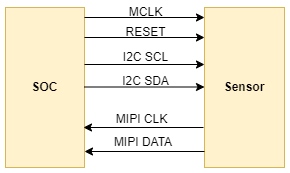
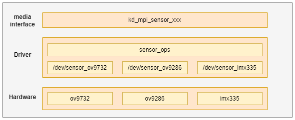

# K230 Camera Sensor Adaptation Guide


Copyright 2023 Canaan Inc. ©

<div style="page-break-after:always"></div>

## Disclaimer

The products, services or features you purchase should be subject to Canaan Inc. ("Company", hereinafter referred to as "Company") and its affiliates are bound by the commercial contracts and terms and conditions of all or part of the products, services or features described in this document may not be covered by your purchase or use. Unless otherwise agreed in the contract, the Company does not provide any express or implied representations or warranties as to the correctness, reliability, completeness, merchantability, fitness for a particular purpose and non-infringement of any statements, information, or content in this document. Unless otherwise agreed, this document is intended as a guide for use only.

Due to product version upgrades or other reasons, the content of this document may be updated or modified from time to time without any notice.

## Trademark Notice

, "Canaan" and other Canaan trademarks are trademarks of Canaan Inc. and its affiliates. All other trademarks or registered trademarks that may be mentioned in this document are owned by their respective owners.

**Copyright 2023 Canaan Inc.. © All Rights Reserved.**
Without the written permission of the company, no unit or individual may extract or copy part or all of the content of this document without authorization, and shall not disseminate it in any form.

<div style="page-break-after:always"></div>

## Directory

[TOC]

## preface

### Overview

This document describes the K230 platform Camera Sensor framework and how to add support for a new Camera Sensor.

### Reader object

This document (this guide) is intended primarily for:

- Technical Support Engineer
- Software Development Engineer

### Definition of acronyms

| abbreviation | illustrate |
| ---- | ---- |
|      |      |
|      |      |

### Revision history

| Document version number | Modify the description  | Author | date  |
|---|---|---|---|
| V1.0       | Initial | Wang Chenggen | 2023-05-30 |
|            |          |        |            |
|            |          |        |            |

## 1. Overview

This document mainly describes the basic framework of the K230 platform Camera Sensor and how to add support for a new Camera Sensor.

The K230 platform supports a variety of interface types of sensors, and we take the most commonly used MIPI CSI interface Sensor as an example. The schematic diagram of the hardware connection between the sensor and the main control platform is as follows:



The master sends configuration registers through the I2C interface to control the working method of the sensor, and the sensor sends image data to the master SOC through the MIPI CSI interface.

## 2. Camera Sensor Framework

### 2.1 Introduction to the framework

The Camera Sensor framework is shown in Figure 2-1, and the lowest layer is the sensor driver layer



Figure 2-1 Camera sensor framework

From top to bottom: media interface layer, driver layer, and hardware layer

- Media interface layer: This layer provides kd_mpi_sensor_xxx interfaces for external modules to operate and access sensor devices on the upper side, and operates specific sensor devices through IOCTL below
- Driver layer: This layer includes the sensor's common operating interface and the specific sensor device driver. The public operation interface is mainly IOCTL operation command and sensor I2C read and write interface, and the sensor driver mainly provides the implementation of device nodes and operation interface. This part is also the main work of sensor adaptation.
- Hardware layer: corresponds to each specific sensor hardware

## 3. Sensor adaptation preparation

Before adapting to a new sensor, users need to do the following preparations:

1. Get the Sensor datasheet from a formal channel, initialize the sequence.
1. View the Sensor datasheet and related application notes, with a particular focus on Sensor exposure, gain control methods, exposure and gain limitations in different modes, long exposure implementation methods, black level values, bayer data output sequences, and more.
1. Ask the Sensor manufacturer for the required mode initialization sequence, understand the data number rate of each sequence, the total width and height of the Sensor output, what is the exact frame rate, etc.
1. Confirm whether the Sensor control interface is I2C, SPI, or another interface, and the device address of the Sensor can be set through hardware. For scenarios with multiple cameras, the sensor tries not to multiplex the I2C bus. The Sensor IO level in different scenarios may be 1.8V or 3.3V, and the design needs to ensure that the IO level of the sensor is consistent with the GPIO supply voltage corresponding to the SOC. If the sensor level is 1.8V, GPIOs used for sensor control, such as Reset, I2C, PRDN, need to be powered by 1.8V.
1. Confirm that the Sensor outputs the data interface and protocol type. Currently, only the MIPI CSI interface is supported.
1. Confirm that wdr mode is VC, DT, or DOL.
1. Confirm whether image cropping is required for different timing.

## 4. Sensor adaptation example

This section describes in detail how to add support for a new camera sensor.

The ov9732 driver is used as an example to illustrate, and the corresponding driver file source code path is as follows:

```shell
src/big/mpp/kernel/sensor/src/ov9732_drv.c
```

### 4.1 Define supported sensor types

The sensor types supported by the system are defined by the following enumeration variables:

```c
typedef enum {
    OV_OV9732_MIPI_1280X720_30FPS_10BIT_LINEAR = 0,
    OV_OV9286_MIPI_1280X720_30FPS_10BIT_LINEAR_IR = 1,
    OV_OV9286_MIPI_1280X720_30FPS_10BIT_LINEAR_SPECKLE = 2,

    OV_OV9286_MIPI_1280X720_60FPS_10BIT_LINEAR_IR = 3,
    OV_OV9286_MIPI_1280X720_60FPS_10BIT_LINEAR_SPECKLE = 4,

    OV_OV9286_MIPI_1280X720_30FPS_10BIT_LINEAR_IR_SPECKLE = 5,
    OV_OV9286_MIPI_1280X720_60FPS_10BIT_LINEAR_IR_SPECKLE  = 6,

    IMX335_MIPI_2LANE_RAW12_1920X1080_30FPS_LINEAR = 7,
    IMX335_MIPI_2LANE_RAW12_2592X1944_30FPS_LINEAR = 8,
    IMX335_MIPI_4LANE_RAW12_2592X1944_30FPS_LINEAR = 9,
    IMX335_MIPI_2LANE_RAW12_1920X1080_30FPS_MCLK_7425_LINEAR = 10,
    IMX335_MIPI_2LANE_RAW12_2592X1944_30FPS_MCLK_7425_LINEAR = 11,
    IMX335_MIPI_4LANE_RAW12_2592X1944_30FPS_MCLK_7425_LINEAR = 12,

    IMX335_MIPI_4LANE_RAW10_2XDOL = 13,
    IMX335_MIPI_4LANE_RAW10_3XDOL = 14,

    SC_SC035HGS_MIPI_1LANE_RAW10_640X480_120FPS_LINEAR = 15,
    SC_SC035HGS_MIPI_1LANE_RAW10_640X480_60FPS_LINEAR = 16,
    SC_SC035HGS_MIPI_1LANE_RAW10_640X480_30FPS_LINEAR = 17,

    OV_OV9286_MIPI_1280X720_30FPS_10BIT_MCLK_25M_LINEAR_SPECKLE = 18,
    OV_OV9286_MIPI_1280X720_30FPS_10BIT_MCLK_25M_LINEAR_IR = 19,
    OV_OV9732_MIPI_1280X720_30FPS_10BIT_MCLK_16M_LINEAR = 20,

    OV_OV5647_MIPI_1920X1080_30FPS_10BIT_LINEAR = 21,
    OV_OV5647_MIPI_2592x1944_10FPS_10BIT_LINEAR = 22,
    OV_OV5647_MIPI_640x480_60FPS_10BIT_LINEAR = 23,
    OV_OV5647_MIPI_CSI0_1920X1080_30FPS_10BIT_LINEAR = 24,

    SC_SC201CS_MIPI_1LANE_RAW10_1600X1200_30FPS_LINEAR = 25,
    SC_SC201CS_SLAVE_MODE_MIPI_1LANE_RAW10_1600X1200_30FPS_LINEAR = 26,
} k_vicap_sensor_type;
```

When the user needs to add a new sensor support type, he first needs to add the definition of the corresponding type here,**which is the only sign for the application to obtain the sensor configuration**

### 4.2 Sensor driver adaptation

The sensor driver adaptation is the most important part of the whole process, and the user can modify it by copying the existing sensor driver file, in which the AE-related register configuration and calculation method of the sensor need to consult the corresponding manual or seek professional personnel assistance.

#### 4.2.1 Define the list of sensor register configurations

The sensor register configuration is defined by the data type k_sensor_reg_list:

```c
typedef struct {
    k_u16 reg_addr;
    k_u8  reg_val;
} k_sensor_reg_list;
```

The following is a list of register configurations for the OV9732

```c
static k_sensor_reg_list ov9732_mipi2lane_720p_30fps_linear[] = {
    {0x0103, 0x01},
    {0x0100, 0x00},

    ......

    {0x400b, 0xc0},
    {REG_NULL, 0x00},
};
```

#### 4.2.2 Define the modes supported by the sensor

The mode parameter of the sensor is defined by the data type k_sensor_mode

```c
typedef struct {
    k_u32 index;
    k_vicap_sensor_type sensor_type;
    k_sensor_size size;
    k_u32 fps;
    k_u32 hdr_mode;
    k_u32 stitching_mode;
    k_u32 bit_width;
    k_sensor_data_compress compress;
    k_u32 bayer_pattern;
    k_sensor_mipi_info mipi_info;
    k_sensor_ae_info ae_info;
    k_sensor_reg_list *reg_list;
} k_sensor_mode;
```

The following are the supported modes for the OV9732

```c
static k_sensor_mode ov9732_mode_info[] = {
    ......

    {
        .index = 2,
        .sensor_type = OV_OV9732_MIPI_1280X720_30FPS_10BIT_LINEAR,
        .size = {
            .bounds_width = 1280,
            .bounds_height = 720,
            .top = 0,
            .left = 0,
            .width = 1280,
            .height = 720,
        },
        .fps = 30000,
        .hdr_mode = SENSOR_MODE_LINEAR,
        .bit_width = 10,
        .bayer_pattern = BAYER_BGGR,
        .mipi_info = {
            .csi_id = 0,
            .mipi_lanes = 1,
            .data_type = 0x2B, //RAW10
        },
        .reg_list = ov9732_mipi2lane_720p_30fps_linear,
    },

}
```

#### 4.2.3 Implement the sensor operation interface

The operation interface of the sensor is defined by the data type k_sensor_function, and the user implements the relevant operation interface according to the actual situation, and not all interfaces must be implemented.

```c
typedef struct {
    k_s32 (*sensor_power) (void *ctx, k_s32 on);
    k_s32 (*sensor_init) (void *ctx, k_sensor_mode mode);
    k_s32 (*sensor_get_chip_id)(void *ctx, k_u32 *chip_id);
    k_s32 (*sensor_get_mode)(void *ctx, k_sensor_mode *mode);
    k_s32 (*sensor_set_mode)(void *ctx, k_sensor_mode mode);
    k_s32 (*sensor_enum_mode)(void *ctx, k_sensor_enum_mode *enum_mode);
    k_s32 (*sensor_get_caps)(void *ctx, k_sensor_caps *caps);
    k_s32 (*sensor_conn_check)(void *ctx, k_s32 *conn);
    k_s32 (*sensor_set_stream)(void *ctx, k_s32 enable);
    k_s32 (*sensor_get_again)(void *ctx, k_sensor_gain *gain);
    k_s32 (*sensor_set_again)(void *ctx, k_sensor_gain gain);
    k_s32 (*sensor_get_dgain)(void *ctx, k_sensor_gain *gain);
    k_s32 (*sensor_set_dgain)(void *ctx, k_sensor_gain gain);
    k_s32 (*sensor_get_intg_time)(void *ctx, k_sensor_intg_time *time);
    k_s32 (*sensor_set_intg_time)(void *ctx, k_sensor_intg_time time);
    k_s32 (*sensor_get_exp_parm)(void *ctx, k_sensor_exposure_param *exp_parm);
    k_s32 (*sensor_set_exp_parm)(void *ctx, k_sensor_exposure_param exp_parm);
    k_s32 (*sensor_get_fps)(void *ctx, k_u32 *fps);
    k_s32 (*sensor_set_fps)(void *ctx, k_u32 fps);
    k_s32 (*sensor_get_isp_status)(void *ctx, k_sensor_isp_status *staus);
    k_s32 (*sensor_set_blc)(void *ctx, k_sensor_blc blc);
    k_s32 (*sensor_set_wb)(void *ctx, k_sensor_white_balance wb);
    k_s32 (*sensor_get_tpg)(void *ctx, k_sensor_test_pattern *tpg);
    k_s32 (*sensor_set_tpg)(void *ctx, k_sensor_test_pattern tpg);
    k_s32 (*sensor_get_expand_curve)(void *ctx, k_sensor_compand_curve *curve);
    k_s32 (*sensor_get_otp_data)(void *ctx, void *data);
} k_sensor_function;
```

The following are the supported modes for the OV9732

```c
    .sensor_func = {
        .sensor_power = ov9732_sensor_power_on,
        .sensor_init = ov9732_sensor_init,
        .sensor_get_chip_id = ov9732_sensor_get_chip_id,
        .sensor_get_mode = ov9732_sensor_get_mode,
        .sensor_set_mode = ov9732_sensor_set_mode,
        .sensor_enum_mode = ov9732_sensor_enum_mode,
        .sensor_get_caps = ov9732_sensor_get_caps,
        .sensor_conn_check = ov9732_sensor_conn_check,
        .sensor_set_stream = ov9732_sensor_set_stream,
        .sensor_get_again = ov9732_sensor_get_again,
        .sensor_set_again = ov9732_sensor_set_again,
        .sensor_get_dgain = ov9732_sensor_get_dgain,
        .sensor_set_dgain = ov9732_sensor_set_dgain,
        .sensor_get_intg_time = ov9732_sensor_get_intg_time,
        .sensor_set_intg_time = ov9732_sensor_set_intg_time,
        .sensor_get_exp_parm = ov9732_sensor_get_exp_parm,
        .sensor_set_exp_parm = ov9732_sensor_set_exp_parm,
        .sensor_get_fps = ov9732_sensor_get_fps,
        .sensor_set_fps = ov9732_sensor_set_fps,
        .sensor_get_isp_status = ov9732_sensor_get_isp_status,
        .sensor_set_blc = ov9732_sensor_set_blc,
        .sensor_set_wb = ov9732_sensor_set_wb,
        .sensor_get_tpg = ov9732_sensor_get_tpg,
        .sensor_set_tpg = ov9732_sensor_set_tpg,
        .sensor_get_expand_curve = ov9732_sensor_get_expand_curve,
        .sensor_get_otp_data = ov9732_sensor_get_otp_data,
    },
```

#### 4.2.4 Define the sensor-driven structure

The sensor driver structure is defined by struct sensor_driver_dev and mainly includes sensor I2C configuration information, sensor driver name, and sensor operation collection

```c
struct sensor_driver_dev {
    k_sensor_i2c_info i2c_info;
    k_u8 *sensor_name;
    k_sensor_function sensor_func;
    k_sensor_mode *sensor_mode;
    k_sensor_ae_info ae_info;
    k_s32 pwd_gpio;
    k_s32 reset_gpio;
};
```

The definition and initialization of the OV9732 driver structure are as follows:

```c
struct sensor_driver_dev ov9732_sensor_drv = {
    .i2c_info = {
        .i2c_bus = NULL,
        .i2c_name = "i2c1",
        .slave_addr = 0x36,
    },
    .sensor_name = "ov9732",
    .sensor_func = {
        .sensor_power = ov9732_sensor_power_on,
        .sensor_init = ov9732_sensor_init,
        .sensor_get_chip_id = ov9732_sensor_get_chip_id,
        .sensor_get_mode = ov9732_sensor_get_mode,
        .sensor_set_mode = ov9732_sensor_set_mode,
        ......
    },
};
```

#### 4.2.5 Update the sensor driver list

Add the sensor-driven struct defined in the previous section to the sensor_drv_list array.
The list of sensors supported by the current system is as follows:

```c
struct sensor_driver_dev *sensor_drv_list[] = {
    &ov9732_sensor_drv,
    &ov9286_sensor_drv,
    &imx335_sensor_drv,
};
```

### 4.3 Update the list of sensor configuration information

The sensor configuration information is defined k_vicap_sensor_info structure:

```shell
typedef struct {
    const char *sensor_name; /*sensor name*/
    const char *calib_file; /*sensor calibration file*/
    k_u16 width; /*sensor width*/
    k_u16 height; /*sensor height*/
    k_vicap_csi_num csi_num; /*the csi num for sensor connected*/
    k_vicap_mipi_lanes mipi_lanes; /*the mipi lanes for sensor connected*/
    k_vicap_data_source source_id; /*source id*/
    k_bool is_3d_sensor; /*3D sensor flag*/

    k_vicap_mipi_phy_freq phy_freq; /*mipi phy freq*/
    k_vicap_csi_data_type data_type; /*CSI data type*/
    k_vicap_hdr_mode hdr_mode; /*HDR mode*/
    k_vicap_vi_flash_mode flash_mode; /*flash mode*/
    k_vicap_vi_first_frame_sel first_frame;
    k_u16 glitch_filter;
    k_vicap_sensor_type sensor_type; /*sensor type*/
} k_vicap_sensor_info;
```

The following is the corresponding configuration information of the OV9732:

```shell
const k_vicap_sensor_info sensor_info_list[] = {
    {
        "ov9732",
        "ov9732",
        1920,
        1080,
        VICAP_CSI0,
        VICAP_MIPI_1LANE,
        VICAP_SOURCE_CSI0,
        K_FALSE,
        VICAP_MIPI_PHY_800M,
        VICAP_CSI_DATA_TYPE_RAW10,
        VICAP_LINERA_MODE,
        VICAP_FLASH_DISABLE,
        VICAP_VI_FIRST_FRAME_FS_TR0,
        0,
        OV_OV9732_MIPI_1920X1080_30FPS_10BIT_LINEAR
    },
```

Each time the user adds a sensor configuration mode, he needs to add a corresponding mode configuration to the sensor_info_list structure.

### 4.4 Add sensor configuration file

The current SDK version sensor configuration file includes XML files and JSON files, and the file storage path is as follows:

```shell
src/big/mpp/userapps/src/sensor/config/
```

The following is the corresponding configuration file for ov9732:

```shell
ov9732.xml  ov9732_auto.json  ov9732_manual.json
```

For newly added sensors, support can be achieved by copying and modifying existing files, and the calibration and tuning parameters can be modified and exported through related tools.
