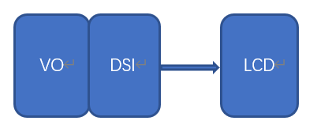

# K230 LCD Adaptation Guide


Copyright © 2023 Beijing Canaan Creative Information Technology Co., Ltd.

<div style="page-break-after:always"></div>

## Disclaimer

The products, services, or features you purchase are subject to the commercial contracts and terms of Beijing Canaan Creative Information Technology Co., Ltd. (hereinafter referred to as "the Company") and its affiliates. Some or all of the products, services, or features described in this document may not be within the scope of your purchase or use. Unless otherwise agreed in the contract, the Company does not provide any explicit or implicit statements or guarantees regarding the correctness, reliability, completeness, merchantability, suitability for a particular purpose, and non-infringement of any statements, information, or content in this document. Unless otherwise agreed, this document is only a reference for usage guidance.

Due to product version upgrades or other reasons, the content of this document may be updated or modified periodically without any notice.

## Trademark Statement

 "Canaan" and other Canaan trademarks are trademarks of Beijing Canaan Creative Information Technology Co., Ltd. and its affiliates. All other trademarks or registered trademarks mentioned in this document are owned by their respective owners.

**Copyright © 2023 Beijing Canaan Creative Information Technology Co., Ltd. All rights reserved.**
Without the written permission of the Company, no unit or individual is allowed to excerpt, copy any part or all of the content of this document, or transmit it in any form.

<div style="page-break-after:always"></div>

## Table of Contents

[TOC]

## Preface

### Overview

This document mainly describes the LCD framework of the K230 platform and how to add support for a new LCD.

### Target Audience

This document (this guide) is mainly intended for the following personnel:

- Technical Support Engineers
- Software Development Engineers

### Abbreviation Definitions

| Abbreviation | Description |
| ---- | ---- |
|      |      |
|      |      |

### Revision History

| Document Version | Description of Changes  | Author | Date  |
|---|---|---|---|
| V1.0       | Initial Version | Wang Quan | 2023-11-30 |
|            |          |        |            |
|            |          |        |            |

## 1. Overview

This document mainly describes the basic framework of the K230 platform LCD and how to add support for a new LCD.

The K230 platform supports LCDs with MIPI-DSI interfaces. The hardware connection diagram between the LCD and the main control platform is as follows:



The main control sends configuration information to the LCD through the MIPI-DSI interface while transmitting image data to the LCD.

## 2. LCD Adaptation Preparation Work

Before adapting a new LCD, users need to do the following preparation work:

1. Obtain the LCD Datasheet and initialization sequence from official channels.
1. Carefully analyze the LCD Datasheet to obtain the LCD output timing, specifically including: pixelclock, vtotal, vactive, vfp, vbp, vsa, htotal, hactive, hfp, hbp, hsa, etc.
1. Refer to the "K230_Video Output_API Reference" to calculate the TxDPHY clock parameters.

## 3. LCD Adaptation Example

Here we take the hx8399 driver as an example to explain, the corresponding driver file source path is as follows:

```shell
src/big/mpp/kernel/connector/src/hx8399.c
```

### 3.1 Define Supported LCD Types

Define the following enumeration variables in the src/big/mpp/include/comm/k_connector_comm.h file:

```c
typedef enum {
    HX8377_V2_MIPI_4LAN_1080X1920_30FPS = 0,
    LT9611_MIPI_4LAN_1920X1080_30FPS = 1,
    ST7701_V1_MIPI_2LAN_480X800_30FPS = 2,
    ST7701_V1_MIPI_2LAN_480X854_30FPS = 3,
    LT9611_MIPI_ADAPT_RESOLUTION = 100,
    LT9611_MIPI_4LAN_1920X1080_60FPS,
    LT9611_MIPI_4LAN_1920X1080_50FPS,
    LT9611_MIPI_4LAN_1920X1080_25FPS,
    LT9611_MIPI_4LAN_1920X1080_24FPS,
    LT9611_MIPI_4LAN_1280X720_60FPS = 110,
    LT9611_MIPI_4LAN_1280X720_50FPS,
    LT9611_MIPI_4LAN_1280X720_30FPS,
    LT9611_MIPI_4LAN_640X480_60FPS = 120,
} k_connector_type;
```

When users need to add new LCD support types, they first need to add the corresponding type definition here. **This type is the only identifier for the application to obtain the LCD configuration.**

### 3.2 LCD Driver Adaptation

The LCD driver adaptation is the most important part of the entire process. Users can modify by copying existing LCD driver files.

#### 3.2.1 Add LCD Initialization Code

```c
k_s32 hx8399_init(void *ctx, k_connector_info *info)
{
    k_s32 ret = 0;
    struct connector_driver_dev* dev = ctx;

    ret |= hx8399_set_phy_freq(&info->phy_attr);
    ret |= hx8399_dsi_resolution_init(info);
    ret |= hx8399_dsi_resolution_init(&info->resolution, info->bg_color, info->intr_line);

    return ret;
}
```

1. hx8399_set_phy_freq will initialize the TxDPHY output timing.
1. hx8399_dsi_resolution_init initializes the MIPI-DSI controller, including the LCD's initialization firmware data.
1. hx8399_dsi_resolution_init initializes the display controller.

#### 3.2.2 Implement LCD Operation Interface

The LCD operation interface is defined by the data type k_connector_function. Users implement the relevant operation interfaces according to the actual situation. Not all interfaces must be implemented.

```c
typedef struct {
    k_s32 (*connector_power) (void *ctx, k_s32 on);
    k_s32 (*connector_init) (void *ctx, k_connector_info *info);
    k_s32 (*connector_get_chip_id) (void *ctx, k_u32 *chip_id);
    k_s32 (*connector_get_negotiated_data) (void *ctx, k_connector_negotiated_data *negotiated_data);
    k_s32 (*connector_conn_check)(void *ctx, k_s32 *conn);
} k_connector_function;
```

The following is the supported operation set of the LCD:

```c
    .connector_func = {
        .connector_power = hx8399_power_on,
        .connector_init = hx8399_init,
        .connector_get_chip_id = hx8399_get_chip_id,
        .connector_conn_check = hx8399_conn_check,
    },
```

#### 3.2.3 Define LCD Driver Structure

The LCD driver structure is defined by struct connector_driver_dev, mainly including the LCD driver name, GPIO reset signal, and LCD operation set.

```c
struct connector_driver_dev
{
    struct rt_device  parent;
    struct rt_mutex   connector_mutex;
    k_u8 *connector_name;
    k_connector_function connector_func;

    k_s32 backlight_gpio;
    k_s32 reset_gpio;

    void *driver_data;
};
```

The LCD driver structure definition and initialization content are as follows:

```c
struct connector_driver_dev hx8399_connector_drv = {
    .connector_name = "hx8399",
    .connector_func = {
        .connector_power = hx8399_power_on,
        .connector_init = hx8399_init,
        .connector_get_chip_id = hx8399_get_chip_id,
        .connector_conn_check = hx8399_conn_check,
    },
};
```

#### 3.2.4 Update LCD Driver List

Add the LCD driver structure defined in the previous section to the connector_drv_list array. The list of LCDs supported by the current system is as follows:

```c
src/big/mpp/kernel/connector/src/connector_comm.c
extern struct connector_driver_dev hx8399_connector_drv;
extern struct connector_driver_dev lt9611_connector_drv;

struct connector_driver_dev *connector_drv_list[CONNECTOR_NUM_MAX] = {
    &hx8399_connector_drv,
    &lt9611_connector_drv,
};
```

### 3.3 Update LCD Configuration Information List

The LCD configuration information is defined by the structure k_connector_info:

```c
typedef struct
{
    k_u32 n;
    k_u32 m;
    k_u32 voc;
    k_u32 hs_freq;
} k_connectori_phy_attr;

typedef struct {
    const char *connector_name;
    k_u32 screen_test_mode;
    k_u32 dsi_test_mode;
    k_u32 bg_color;
    k_u32 intr_line;
    k_dsi_lan_num lan_num;
    k_dsi_work_mode work_mode;
    k_vo_dsi_cmd_mode cmd_mode;
    k_connectori_phy_attr phy_attr;
    k_vo_display_resolution resolution;
    k_connector_type type;
} k_connector_info;
```

The following is the corresponding configuration information for HX8399:

```c
src/big/mpp/userapps/src/connector/mpi_connector.c
const k_connector_info connector_info_list[] = {
    {
        "hx8399",
        0,
        0,
        BACKGROUND_BLACK_COLOR,
        11,
        K_DSI_4LAN,
        K_BURST_MODE,
        K_VO_LP_MODE,
        {15, 295, 0x17, 0x96},
        {74250, 445500, 1160, 1080, 20, 20, 40, 2134, 1920, 5, 8, 206},
        HX8377_V2_MIPI_4LAN_1080X1920_30FPS,
    },
```

Each time a user adds an LCD configuration mode, they need to add a corresponding mode configuration item to the sensor_info_list structure.

Let's take HX8399 LCD as an example to explain:

1. The parameters {15, 295, 0x17, 0x96} need to refer to the document "K230_Video Output_API Reference" to calculate the TxDPHY clock parameters.
1. The parameters {74250, 445500, 1160, 1080, 20, 20, 40, 2134, 1920, 5, 8, 206} need to refer to the LCD datasheet.
1. HX8377_V2_MIPI_4LAN_1080X1920_30FPS is the k_connector_type we defined in the src/big/mpp/include/comm/k_connector_comm.h file.
