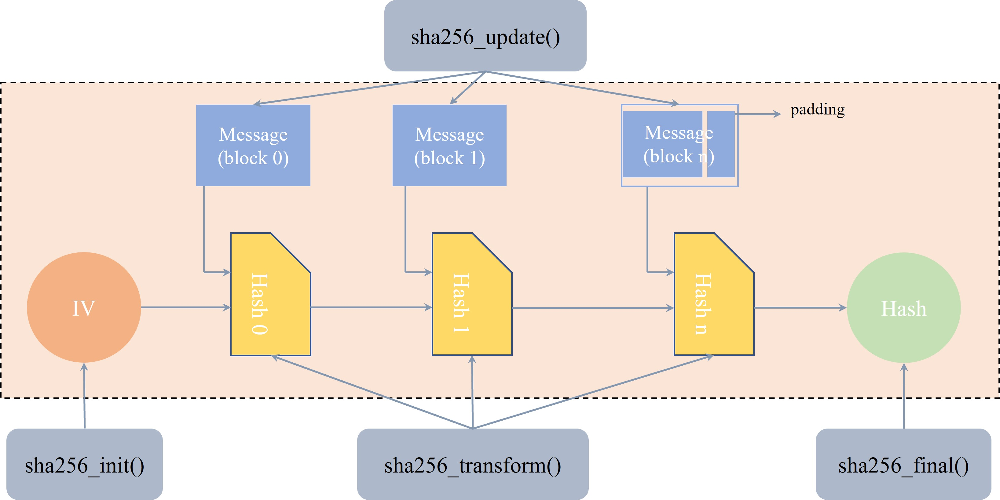

# K230 SHA256 API Reference


©2023 Canaan Creative Co., Ltd. All Rights Reserved

<div style="page-break-after:always"></div>

## Disclaimer

The products, services, or features you purchase are subject to the commercial contracts and terms of Canaan Creative Co., Ltd. (hereinafter referred to as "the Company") and its affiliates. All or part of the products, services, or features described in this document may not fall within the scope of your purchase or usage. Unless otherwise agreed in the contract, the Company does not provide any express or implied statements or warranties regarding the accuracy, reliability, completeness, merchantability, fitness for a particular purpose, or non-infringement of any representations, information, or content in this document. Unless otherwise agreed, this document is for guidance and reference only.

Due to product version upgrades or other reasons, the content of this document may be updated or modified periodically without any notice.

## Trademark Statement

, "Canaan" and other Canaan trademarks are trademarks of Canaan Creative Co., Ltd. and its affiliates. All other trademarks or registered trademarks mentioned in this document are owned by their respective holders.

**© 2023 Canaan Creative Co., Ltd. All rights reserved.**
Without the written permission of the Company, no unit or individual is allowed to excerpt, copy part or all of the content of this document, nor disseminate it in any form.

<div style="page-break-after:always"></div>

## Table of Contents

[TOC]

## Preface

### Overview

This document mainly introduces the usage of the K230 SHA256 software, including the usage of the SHA256 API and an introduction to the test program.

### Intended Audience

This document (this guide) is mainly intended for the following personnel:

- Technical Support Engineers
- Software Development Engineers

### Abbreviation Definitions

| Abbreviation | Description |
| ------------ | ----------- |
| SHA256       | Secure Hash Algorithm |

### Revision History

| Document Version | Description | Author | Date       |
| ---------------- | ----------- | ------ | ---------- |
| V1.0             | Initial Version | Yang Fan | 2023-05-30 |

## 1. Function Introduction

SHA256 is mainly used to calculate the hash value of data. The SHA256 algorithm is implemented in the rt-smart of the main core to calculate the hash value of data. The code logic is shown in the following figure:



## 2. API Reference

The SHA256 module mainly provides the following API:

- [kd_mpi_cipher_sha256](#21-kd_mpi_cipher_sha256)

### 2.1 kd_mpi_cipher_sha256

**Description**:

Calculates the hash value of the message based on the input message.

**Syntax**:

```c
kd_mpi_cipher_sha256(const void *data, k_u32 len, k_u8 *hash);
```

**Parameters**:

| Parameter Name | Description            | Input/Output |
| -------------- | ---------------------- | ------------ |
| data           | Input message          | Input        |
| len            | Length of the input message | Input        |
| hash           | Calculated hash value  | Output       |

**Return Value**:

| Return Value | Description              |
| ------------ | ------------------------ |
| 0            | Success                  |
| Non-zero     | Failure, refer to error code definitions |

**Chip Differences**:

None

**Requirements**:

- Header file: mpi_cipher_api.h
- Library file: libcipher.a

**Notes**:

None

**Example**:

None

**Related Topics**:

None

## 3. Debugging and Print Information

Write a user-mode application *sample_cipher.c* to test the SHA256 functionality.

The test code is already written and located in the *mpp/userapps/sample/sample_cipher* directory. The specific debugging method is as follows:

1. After the main core starts, enter the *bin* directory;
1. Run the *sample_cipher.elf* program;
1. Print information.

The specific print information is as follows:

```shell
msh />cd bin/
msh /bin>./sample_cipher.elf
input = ''
digest: e3b0c442 98fc1c14 9afbf4c8 996fb924 27ae41e4 649b934c a495991b 7852b855
result: PASS

input = 'abc'
digest: ba7816bf 8f01cfea 414140de 5dae2223 b00361a3 96177a9c b410ff61 f20015ad
result: PASS

input = 'abcdbcdecdefdefgefghfghighijhijkijkljklmklmnlmnomnopnopq'
digest: 248d6a61 d20638b8 e5c02693 0c3e6039 a33ce459 64ff2167 f6ecedd4 19db06c1
result: PASS

input = 'The quick brown fox jumps over the lazy dog'
digest: d7a8fbb3 07d78094 69ca9abc b0082e4f 8d5651e4 6d3cdb76 2d02d0bf 37c9e592
result: PASS

input = 'The quick brown fox jumps over the lazy cog'
digest: e4c4d8f3 bf76b692 de791a17 3e053211 50f7a345 b46484fe 427f6acc 7ecc81be
result: PASS

input = 'bhn5bjmoniertqea40wro2upyflkydsibsk8ylkmgbvwi420t44cq034eou1szc1k0mk46oeb7ktzmlxqkbte2sy'
digest: 9085df2f 02e0cc45 5928d0f5 1b27b4bf 1d9cd260 a66ed1fd a11b0a3f f5756d99
result: PASS
```
