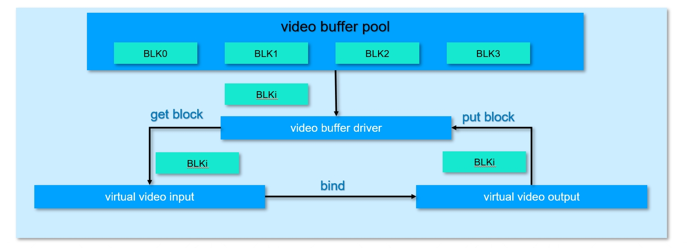

# K230 System Control API Reference


Copyright 2023 Canaan Inc. ©

<div style="page-break-after:always"></div>

## Disclaimer

The products, services or features you purchase should be subject to Canaan Inc. ("Company", hereinafter referred to as "Company") and its affiliates are bound by the commercial contracts and terms and conditions of all or part of the products, services or features described in this document may not be covered by your purchase or use. Unless otherwise agreed in the contract, the Company does not provide any express or implied representations or warranties as to the correctness, reliability, completeness, merchantability, fitness for a particular purpose and non-infringement of any statements, information, or content in this document. Unless otherwise agreed, this document is intended as a guide for use only.

Due to product version upgrades or other reasons, the content of this document may be updated or modified from time to time without any notice.

## Trademark Notice

, "Canaan" and other Canaan trademarks are trademarks of Canaan Inc. and its affiliates. All other trademarks or registered trademarks that may be mentioned in this document are owned by their respective owners.

**Copyright 2023 Canaan Inc.. © All Rights Reserved.**
Without the written permission of the company, no unit or individual may extract or copy part or all of the content of this document without authorization, and shall not disseminate it in any form.

<div style="page-break-after:always"></div>

## Directory

[TOC]

## preface

### Overview

This document mainly introduces the functions and usage of the system control module in the media subsystem, and the functions and usage of other modules will be discussed in their own special documents.

### Reader object

This document (this guide) is intended primarily for:

- Technical Support Engineer
- Software Development Engineer

### Definition of acronyms

| abbreviation | illustrate                                |
|------|-------------------------------------|
| mpp  | Media Process Platform 媒体处理平台 |
| .vb   | Video buffer video buffer pool             |

### Revision history

| Document version number | Modify the description | Author | date     |
|------------|----------|--------|----------|
| V1.0       | Initial edition     | Haibo Hao | 2023/3/4 |

## 1. Overview

### 1.1 Overview

According to the characteristics of the k230 chip, the system control completes the reset and basic initialization of each component of the hardware, and is responsible for completing the initialization and deinitialization of MPP (Media Process Platform media processing platform) system memory management, log management, binding management and other modules.

### 1.2 Function Description

#### 1.2.1 VB Pool

A video buffer pool is a set of buffers (rather than one) that are primarily used by multimedia hardware devices and flow between multimedia hardware devices. The vb pool is divided into public vb pool and private vb pool, the public vb pool is mainly for VI, before using to determine the size of the vb block according to the image parameters of the VI, and then apply for a certain number of vb blocks to form a vb pool. In general, for the original picture input by the VI, the size of one frame corresponds to the size of a vb block, and multiple vb blocks are equivalent to providing the VI with a mechanism for multi-frame buffering. These public vb blocks can also be used by VO or VENC. Private vb pools often represent that the data stored in memory is closely related to the multimedia device itself, for example, the encoded stream data is still very different from the actual image pixel composition of the video stream, these streams are only available codecs, and VB provides a dedicated buffer pool for these devices. The following figure shows the process of virtual VI and virtual VO using VB for vb block circulation.



#### 1.2.2 System binding

System binding, that is, establishing an association between the data receiver by binding the data source (only the data receiver is allowed to bind the data source). Once bound, the data generated by the data source is automatically sent to the recipient. K230 large voice and video processing is mainly divided into several large modules as follows:

Voice: Audio Input (AI), Audio Encoder (AENC), Audio recognition (AREC), Audio Decoder (ADEC), Audio Output (AO)

Image: Video Input (VI), Video Encoder (VENC), Image Rotation (done by GSDMA, DMA), Depth Process Unit (DPU), Video Decoder (VDEC), Video Output (VO), Virtual Video Input (Virtual). Video Input (VVI), Virtual Video Output (VVO)

The binding relationships supported by the K230 are as follows

Table 11

| **Data source**        | **Data recipients** | **Description**                                                 |
|-------------------|----------------|----------------------------------------------------------|
| VI (Video Input)      | GSDMA          | VI data can be sent to GSDMA for rotation processing                        |
|                   | IN             | The data of the VI can be sent directly to VO for display                           |
|                   | DPU            | The VI's data can be sent directly to the DPU for processing                          |
|                   | EXPIRES           | VI data can be sent directly to VINC for processing                         |
| GSDMA (Image Rotation) | IN             | The data processed by GSDMA can be sent directly to the VO display                   |
|                   | DPU            | The data processed by GSDMA can be sent directly to the DPU for processing               |
|                   | EXPIRES           | The data processed by VPOC can be sent directly to VENC for encoding              |
| VDEC (Video Decoding)    | GSDMA          | VDEC's data will eventually be played locally and may need to be rotated before playback           |
|                   | IN             | VDEC's data is eventually played locally                                 |
| DPU (Advanced Processing Unit) | not             | The DPU is the endpoint of the video data and does not support binding relationships                      |
| VENC (Video Coding)    | not             | Binding relationships are not supported                                           |
| VO (Video Display)      | not             | VO is the endpoint of video data and does not support binding relationships                       |
| AI (Audio Input)      | AREC           | The data processed by AI can be sent directly to the speech recognition module for recognition         |
|                   | AENC           | The data processed by AI can be sent directly to the speech coding module for encoding         |
|                   | TO             | The data processed by AI can be played back directly                         |
| ADEC (Voice Decoding)    | TO             | The data processed by ADEC can be played back directly                       |
| AREC (Speech Recognition)    | TO             | The data processed by AREC can be directly played, such as local offline voice translation |
| AENC (Voice Coding)    | not             | Binding relationships are not supported                                           |
| AO (Audio Output)      | not             | AO is the endpoint of audio data and does not support binding                       |

## 2. API Reference

### 2.1 Multimedia memory management

This function module provides the following APIs:

- [kd\_mpi\_sys\_mmz\_alloc](#211-kd_mpi_sys_mmz_alloc)
- [kd\_mpi\_sys\_mmz\_alloc\_cached](#212-kd_mpi_sys_mmz_alloc_cached)
- [kd\_mpi\_sys\_mmap](#213-kd_mpi_sys_mmap)
- [kd\_mpi\_sys\_mmap\_cached](#214-kd_mpi_sys_mmap_cached)
- [kd\_mpi\_sys\_munmap](#215-kd_mpi_sys_munmap)
- [kd\_mpi\_sys\_mmz\_flush\_cache](#216-kd_mpi_sys_mmz_flush_cache)
- [kd\_mpi\_sys\_mmz\_free](#217-kd_mpi_sys_mmz_free)
- [kd\_mpi\_sys\_get\_virmem\_info](#218-kd_mpi_sys_get_virmem_info)
- [kd\_mpi\_vb\_set\_config](#219-kd_mpi_vb_set_config)
- [kd\_mpi\_vb\_get\_config](#2110-kd_mpi_vb_get_config)
- [kd\_mpi\_vb\_init](#2111-kd_mpi_vb_init)
- [kd\_mpi\_vb\_exit](#2112-kd_mpi_vb_exit)
- [kd\_mpi\_vb\_create\_pool](#2113-kd_mpi_vb_create_pool)
- [kd\_mpi\_vb\_destory\_pool](#2114-kd_mpi_vb_destory_pool)
- [kd\_mpi\_vb\_get\_block](#2115-kd_mpi_vb_get_block)
- [kd\_mpi\_vb\_release\_block](#2116-kd_mpi_vb_release_block)
- [kd\_mpi\_vb\_phyaddr\_to\_handle](#2117-kd_mpi_vb_phyaddr_to_handle)
- [kd\_mpi\_vb\_handle\_to\_phyaddr](#2118-kd_mpi_vb_handle_to_phyaddr)
- [kd\_mpi\_vb\_handle\_to\_pool\_id](#2119-kd_mpi_vb_handle_to_pool_id)
- [kd\_mpi\_vb\_inquire\_user\_cnt](#2120-kd_mpi_vb_inquire_user_cnt)
- [kd\_mpi\_vb\_get\_supplement\_attr](#2121-kd_mpi_vb_get_supplement_attr)
- [kd\_mpi\_vb\_set\_supplement\_config](#2122-kd_mpi_vb_set_supplement_config)
- [kd\_mpi\_vb\_get\_supplement\_config](#2123-kd_mpi_vb_get_supplement_config)
- [kd\_mpi\_vb\_set\_mod\_pool\_config](#2124-kd_mpi_vb_set_mod_pool_config)
- [kd\_mpi\_vb\_get\_mod\_pool\_config](#2125-kd_mpi_vb_get_mod_pool_config)
- [kd\_mpi\_vb\_init\_mod\_common\_pool](#2126-kd_mpi_vb_init_mod_common_pool)
- [kd\_mpi\_vb\_exit\_mod\_common\_pool](#2127-kd_mpi_vb_exit_mod_common_pool)

#### 2.1.1 kd_mpi_sys_mmz_alloc

【Description】

Apply MMZ memory in user space

【Syntax】

k_s32 kd_mpi_sys_mmz_alloc(k_u64\* phy_addr, void\*\* virt_addr, const k_char\* mmb, const k_char\* zone, k_u32 len);

【Parameters】

| **Parameter name**  | **Description**                          | Input/output |
|-----------|------------------------------|-----------|
| phy_addr  | Physical address pointer.               | output      |
| virt_addr | A pointer to a pointer to the virtual address.     | output      |
| mmb       | A string pointer to the mb name.       | input      |
| zone      | A string pointer to the MMZ zone name.  | input      |
| only       | Memory block size.                 | input      |

【Return value】

| Return value | **Description**                                           |
|--------|-----------------------------------------------|
| 0      | succeed                                          |
| Non-0    | Failed, the value of which is described in [error code](#412-multimedia-memory-zone-error-codes) |

【Differences】

none.

【Requirement】

- Header file: mpi_sys_api.h
- Library file: libsys.a

【Note】

MMZ consists of multiple zones, each with multiple MMBs. You can call this MPI and allocate a memory block of size len \*mmb in the \*zone of the MMZ. In this case, pointers to the physical address and the user-mode virtual address are returned. If there is an anonymous area in MMZ, set \*zone to null. If \*mmb is set to null, the created MMB is named null. 【Example】

none

【See Also】

none

#### 2.1.2 kd_mpi_sys_mmz_alloc_cached

【Description】

Request MMZ memory with cache in user space

【Syntax】

k_s32 kd_mpi_sys_mmz_alloc_cached(k_u64\* phy_addr, void\*\* virt_addr, const k_char\* mmb, const k_char\* zone, k_u32 len);

【Parameters】

| **Parameter name**  | **Description**                          | Input/output |
|-----------|------------------------------|-----------|
| phy_addr  | Physical address pointer.               | output      |
| virt_addr | A pointer to a pointer to the virtual address.     | output      |
| mmb       | A string pointer to the mb name.       | input      |
| zone      | A string pointer to the MMZ zone name.  | input      |
| only       | Memory block size.                 | input      |

【Return value】

| Return value | **Description**                                           |
|--------|-----------------------------------------------|
| 0      | succeed                                          |
| Non-0    | Failed, the value of which is described in [error code](#412-multimedia-memory-zone-error-codes) |

【Differences】

none

【Requirement】

- Header file: mpi_sys_api.h
- Library file: libsys.a

【Note】

- [The difference between kd_mpi_sys_mmz_alloc_cached](#212-kd_mpi_sys_mmz_alloc_cached) and kd_mpi_sys_mmz_alloc[: caching is supported by calling](#211-kd_mpi_sys_mmz_alloc) the memory allocated by the kd_mpi_sys_mmz_alloc_cached, and [it is recommended](#212-kd_mpi_sys_mmz_alloc_cached) if the memory to be allocated will be used frequently [kd_mpi_sys_mmz_alloc_cached](#212-kd_mpi_sys_mmz_alloc_cached).This improves the read/write efficiency and system performance of the CPU.
- When the CPU accesses the memory allocated by this interface, it places the data in memory in the cache. Hardware devices can only access physical memory, not cache. In this case[kd_mpi_sys_mmz_flush_cache](#216-kd_mpi_sys_mmz_flush_cache) needs to be called to synchronize the data.

【Example】

none

【See Also】

none

#### 2.1.3 kd_mpi_sys_mmap

【Description】

Memory storage mapping interface.

【Syntax】

void \*kd_mpi_sys_mmap(k_u64 phy_addr, k_u32 size);

【Parameters】

| **Parameter name** | **Description**                      | Input/output |
|----------|--------------------------|-----------|
| phy_addr | The memory cell start address to be mapped | input      |
| size     | The number of bytes mapped             | input      |

【Return value】

| Return value | **Description**      |
|--------|----------|
| 0      | Invalid address |
| Non-0    | A valid address |

【Differences】

none

【Requirement】

- Header file: mpi_sys_api.h
- Library file: libsys.a

【Note】

- Only physical addresses obtained through MMZ applications can be mapped using this API
- If the address range belongs to a VB, the size of the map needs to be smaller than the size of the VB pool

【Example】

none

【See Also】

[kd_mpi_sys_munmap()](#215-kd_mpi_sys_munmap)

#### 2.1.4 kd_mpi_sys_mmap_cached

【Description】

Memory stores interfaces with caches.

【Syntax】

void \*kd_mpi_sys_mmap_cached(k_u64 phy_addr, k_u32 size);

【Parameters】

| **Parameter name** | **Description**                      | Input/output |
|----------|--------------------------|-----------|
| phy_addr | The memory cell start address to be mapped | input      |
| size     | The number of bytes mapped             | input      |

【Return value】

| Return value | **Description**      |
|--------|----------|
| 0      | Invalid address |
| Non-0    | A valid address |

【Differences】

none

【Requirement】

- Header file: mpi_sys_api.h
- Library file: libsys.a

【Note】

- Only physical addresses obtained through MMZ applications can be mapped using this API
- If the address range belongs to a VB, the size of the map needs to be smaller than the size of the VB pool

【Example】

none

【See Also】

none

#### 2.1.5 kd_mpi_sys_munmap

【Description】

Memory storage mapping dismissal interface.

【Syntax】

void \*kd_mpi_sys_mmap(void \*virt_addr, k_u32 size);

【Parameters】

| **Parameter name**  | **Description**                | Input/output |
|-----------|--------------------|-----------|
| virt_addr | The virtual address returned by mmap | input      |
| size      | The number of bytes mapped       | input      |

【Return value】

| Return value | **Description**  |
|--------|------|
| 0      | succeed |
| Non-0    | fail |

【Differences】

none

【Requirement】

- Header file: mpi_sys_api.h
- Library file: libsys.a

【Note】

none

【Example】

none

【See Also】

- [kd_mpi_sys_mmap](#213-kd_mpi_sys_mmap)
- [kd_mpi_sys_mmap_cached](#214-kd_mpi_sys_mmap_cached)

#### 2.1.6 kd_mpi_sys_mmz_flush_cache

【Description】

Flushes the contents of the cache to memory and invalidates the contents of the cache.

【Syntax】

k_s32 kd_mpi_sys_mmz_flush_cache(k_u64 phy_addr, void\* virt_addr, k_u32 size);

【Parameters】

| **Parameter name**  | **Description**                                       | Input/output |
|-----------|-------------------------------------------|-----------|
| phy_addr  | The starting physical address of the data to be manipulated.                | input      |
| virt_addr | The starting virtual address pointer for the data to be manipulated. NULL cannot be passed | input      |
| size      | The size of the data to be manipulated                          | input      |

【Return value】

| Return value | **Description**                                           |
|--------|-----------------------------------------------|
| 0      | succeed                                          |
| Non-0    | Failed, the value of which is described in [error code](#412-multimedia-memory-zone-error-codes) |

【Differences】

none

【Requirement】

- Header file: mpi_sys_api.h
- Library file: libsys.a

【Note】

- If the data in the cache is up-to-date, you need to call this MPI to synchronize the data to memory. This ensures that hardware that does not have direct access to the cache can obtain the correct data.
- This MPI must be invoked before [kd_mpi_sys_mmz_alloc_cached](#212-kd_mpi_sys_mmz_alloc_cached) used
- Setting phy_addr to 0 means that the entire cache range is operated. (Not supported at this time)
- You need to make sure that the transmitted parameters are valid
- Ensure that the kd_mpi_sys_mmz_free is not invoked to free the memory being flushed when performing a refresh operation[](#217-kd_mpi_sys_mmz_free). Otherwise, unpredictable exceptions can occur.

【Example】

none

【See Also】

- [kd_mpi_sys_mmz_alloc_cached](#212-kd_mpi_sys_mmz_alloc_cached)
- [kd_mpi_sys_mmap_cached](#214-kd_mpi_sys_mmap_cached)

#### 2.1.7 kd_mpi_sys_mmz_free

【Description】

Frees MMZ memory in user mode.

【Syntax】

k_s32 kd_mpi_sys_mmz_free(k_u64 phy_addr, void\* virt_addr);

【Parameters】

| **Parameter name**  | **Description**            | Input/output |
|-----------|----------------|-----------|
| phy_addr  | Physical address.     | input      |
| virt_addr | Virtual address pointer. | input      |

【Return value】

| Return value | **Description**                                           |
|--------|-----------------------------------------------|
| 0      | succeed                                          |
| Non-0    | Failed, the value of which is described in [error code](#412-multimedia-memory-zone-error-codes) |

【Differences】

none

【Requirement】

- Header file: mpi_sys_api.h
- Library file: libsys.a

【Note】

- The address entered must be a valid physical address, and the virtual address pointer can be set to NULL.
- Memory that is in progress cannot be freed or an unpredictable exception will be thrown.

【Example】

none

【See Also】

- [kd_mpi_sys_mmz_alloc](#211-kd_mpi_sys_mmz_alloc)
- [kd_mpi_sys_mmz_alloc_cached](#212-kd_mpi_sys_mmz_alloc_cached)

#### 2.1.8 kd_mpi_sys_get_virmem_info

【Description】

Obtain the corresponding memory information based on the virtual address, including the physical address and cached attribute

【Syntax】

k_s32 kd_mpi_sys_get_virmem_info(const void\* virt_addr, k_sys_virmem_info\* mem_info);

【Parameters】

| **Parameter name**  | **Description**                                                     | Input/output |
|-----------|---------------------------------------------------------|-----------|
| virt_addr | Virtual address pointer.                                          | input      |
| mem_info  | The memory information corresponding to the virtual address, including the physical address and cached attribute. | output      |

【Return value】

| Return value | **Description**                                           |
|--------|-----------------------------------------------|
| 0      | succeed                                          |
| Non-0    | Failed, the value of which is described in [error code](#412-multimedia-memory-zone-error-codes) |

【Differences】

none

【Requirement】

- Header file: mpi_sys_api.h k_mmz_comm.h
- Library file: libsys.a

【Note】

- The input must be a user-mode virtual address.
- Cross-process use is not supported.

【Example】

none

【See Also】

- [kd_mpi_sys_mmz_alloc](#211-kd_mpi_sys_mmz_alloc)
- [kd_mpi_sys_mmz_alloc_cached](#212-kd_mpi_sys_mmz_alloc_cached)

#### 2.1.9 kd_mpi_vb_set_config

【Description】

Set the MPP VB Pool property.

【Syntax】

k_s32 kd_mpi_vb_set_config(const [k_vb_config](#323-k_vb_config) \*config);

【Parameters】

| **Parameter name** | **Description**                  | Input/output |
|----------|----------------------|-----------|
| config   | Video buffer pool property pointer. | input      |

【Return value】

| Return value | **Description**                                       |
|--------|-------------------------------------------|
| 0      | succeed                                      |
| Non-0    | Failed, the value of which is described in [error code](#411-video-buffer-pool-error-code) |

【Differences】

none

【Requirement】

- Header file: mpi_vb_api.h k_vb_comm.h
- Library file: libvb.a

【Note】

- You can set the vb pool property only when the system is in an uninitialized state, otherwise failure will be returned.
- The size of each vb block in the public vb pool should vary depending on the current image pixel format and whether the image is compressed

   is different. For specific allocation sizes, see [](#323-k_vb_config) the description in k_vb_config Struct.

【Example】

none

【See Also】

[kd_mpi_vb_get_config](#2110-kd_mpi_vb_get_config)

#### 2.1.10 kd_mpi_vb_get_config

【Description】

Gets the MPP video buffer pool properties.

【Syntax】

k_s32 kd_mpi_vb_get_config(const [k_vb_config](#323-k_vb_config) \*config);

【Parameters】

| **Parameter name** | **Description**                  | Input/output |
|----------|----------------------|-----------|
| config   | Video buffer pool property pointer. | output      |

【Return value】

| Return value | **Description**                                       |
|--------|-------------------------------------------|
| 0      | succeed                                      |
| Non-0    | Failed, the value of which is described in [error code](#411-video-buffer-pool-error-code) |

【Differences】

none

【Requirement】

- Header file: mpi_vb_api.h k_vb_comm.h
- Library file: libvb.a

【Note】

You must call [kd_mpi_vb_set_config](#219-kd_mpi_vb_set_config) to set the MPP video buffer pool properties before you get the properties.

【Example】

none

【See Also】

[kd_mpi_vb_set_config](#219-kd_mpi_vb_set_config)

#### 2.1.11 kd_mpi_vb_init

【Description】

Initialize the MPP video buffer pool.

【Syntax】

k_s32 kd_mpi_vb_init(void);

【Parameters】

none

【Return value】

| Return value | **Description**                                       |
|--------|-------------------------------------------|
| 0      | succeed                                      |
| Non-0    | Failed, the value of which is described in [error code](#411-video-buffer-pool-error-code) |

【Differences】

none

【Requirement】

- Header file: mpi_vb_api.h k_vb_comm.h
- Library file: libvb.a

【Note】

- You must call [kd_mpi_vb_set_config](#219-kd_mpi_vb_set_config) to set the MPP video buffer pool properties before initializing the vb pool, or it will be lost
    Fail.
- It can be initialized repeatedly without returning failures.

【Example】

none

【See Also】

[kd_mpi_vb_exit](#2112-kd_mpi_vb_exit)

#### 2.1.12 kd_mpi_vb_exit

【Description】

Go and initialize the MPP video buffer pool.

【Syntax】

k_s32 kd_mpi_vb_exit(void);

【Parameters】

none

【Return value】

| Return value | **Description**                                       |
|--------|-------------------------------------------|
| 0      | succeed                                      |
| Non-0    | Failed, the value of which is described in [error code](#411-video-buffer-pool-error-code) |

【Differences】

none

【Requirement】

- Header file: mpi_vb_api.h k_vb_comm.h
- Library file: libvb.a

【Note】

- Deinitialization does not clear previous configurations of the vb pool.
- It can be repeatedly deinitialized and does not return failure.
- Before exiting the VB pool, make sure that any VB in the VB pool is not in use, otherwise you cannot exit.

【Example】

none

【See Also】

[kd_mpi_vb_init](#2111-kd_mpi_vb_init)

#### 2.1.13 kd_mpi_vb_create_pool

【Description】

Create a video buffer pool

【Syntax】

k_s32 kd_mpi_vb_create_pool([k_vb_pool_config](#324-k_vb_pool_config) \*config);

【Parameters】

| **Parameter name** | **Description**                    | Input/output |
|----------|------------------------|-----------|
| config   | VB poolconfiguration property parameter pointer | input      |

【Return value】

| Return value               | **Description**                                              |
|----------------------|--------------------------------------------------|
| Non-VB_INVALID_POOLID | A valid vb pool ID number                               |
| VB_INVALID_POOLID    | The creation of the vb pool failed, either because the parameters are illegal or there is not enough reserved memory. |

【Differences】

none

【Requirement】

- Header file: mpi_vb_api.h k_vb_comm.h
- Library file: libvb.a

【Note】

none

【Example】

none

【See Also】

[kd_mpi_vb_destory_pool](#2114-kd_mpi_vb_destory_pool)

#### 2.1.14 kd_mpi_vb_destory_pool

【Description】

Destroy a video buffer pool.

【Syntax】

k_s32 kd_mpi_vb_destory_pool(k_u32 pool_id);

【Parameters】

| **Parameter name** | **Description**                                          | Input/output |
|----------|----------------------------------------------|-----------|
| pool_id  | VB poolID number. Value range: [0, VB_MAX_POOLS]. | input      |

【Return value】

| Return value | **Description**                                         |
|--------|---------------------------------------------|
| 0      | Succeed.                                      |
| Non-0   | Failed, see [Error Code](#411-video-buffer-pool-error-code) for value. |

【Differences】

none

【Requirement】

- Header file: mpi_vb_api.h k_vb_comm.h
- Library file: libvb.a

【Note】

- Destroying a non-existent vb pool returns a [K_ERR_VB_UNEXIST](#411-video-buffer-pool-error-code)
- Only buffer pools created by [k_mpi_vb_create_pool](#2113-kd_mpi_vb_create_pool) can be destroyed

【Example】

none

【See Also】

[kd_mpi_vb_create_pool](#2113-kd_mpi_vb_create_pool)

#### 2.1.15 kd_mpi_vb_get_block

【Description】

User mode gets a vb block

【Syntax】

k_vb_blk_handle kd_mpi_vb_get_block(k_u32 pool_id, k_u64 blk_size, const k_char \*mmz_name);

【Parameters】

| **Parameter name** | **Description**                                                     | Input/output |
|----------|---------------------------------------------------------|-----------|
| pool_id  | VB poolID number. Value range: [0, VB_MAX_POOLS].            | input      |
| blk_size | VB block size. Value range: The full range of data types, measured in bytes. | input      |
| mmz_name | The name of the DDR where the vb pool resides.                                 | input      |

【Return value】

| Return value               | **Description**              |
|----------------------|------------------|
| Non-VB_INVALID_HANDLE | A valid vb block handle |
| VB_INVALID_HANDLE    | Failed to get vb block   |

【Differences】

none

【Requirement】

- Header file: mpi_vb_api.h k_vb_comm.h
- Library file: libvb.a

【Note】

- After creating a vb pool, the user can call this API to obtain a vb block from the vb pool; that is, the first parameter P is set to the ID of the created vb pool; when obtaining the vb block from the specified vb pool, the parameter mmz_name invalid \*
- If the user needs to obtain a block of cache of the specified size from any of the public vb pools, they can set the first parameter Pool to an invalid ID number (VB_INVALID_POOLID), set the second parameter blk_size to the desired vb block size, and specify the public vb pool on which DDR to obtain the vb block from. If there is no public vb pool on the specified DDR, the vb block will not be fetched. If mmz_name equals NULL, it means that the public vb pool on the anonymous DDR fetches the vb block.

【Example】

none

【See Also】

[kd_mpi_vb_release_block](#2116-kd_mpi_vb_release_block)

#### 2.1.16 kd_mpi_vb_release_block

【Description】

User mode frees a vb block

【Syntax】

k_s32 kd_mpi_vb_release_block(k_vb_blk_handle block);

【Parameters】

| **Parameter name** | **Description**       | Input/output |
|----------|-----------|-----------|
| block    | vb ?? | input      |

【Return value】

| Return value | **Description**                                         |
|--------|---------------------------------------------|
| 0      | Succeed.                                      |
| Non-0   | Failed, see [Error Code](#411-video-buffer-pool-error-code) for value. |

【Differences】

none

【Requirement】

- Header file: mpi_vb_api.h k_vb_comm.h
- Library file: libvb.a

【Note】

After the obtained vb block is exhausted, this interface should be called to free the vb block.

【Example】

none

【See Also】

[kd_mpi_vb_get_block](#2115-kd_mpi_vb_get_block)

#### 2.1.17 kd_mpi_vb_phyaddr_to_handle

【Description】

The user mode obtains its handle through the physical address of the vb block.

【Syntax】

k_vb_blk_handle kd_mpi_vb_phyaddr_to_handle(k_u64 phys_addr);

【Parameters】

| **Parameter name**  | **Description**       | Input/output |
|-----------|-----------|-----------|
| phys_addr | vb ?? | input      |

【Return value】

| Return value               | **Description**                |
|----------------------|--------------------|
| Non-VB_INVALID_HANDLE | A valid vb block handle   |
| VB_INVALID_HANDLE    | Failed to get cache fast handle |

【Differences】

none

【Requirement】

- Header file: mpi_vb_api.h k_vb_comm.h
- Library file: libvb.a

【Note】

The physical address should be the address of a valid vb block obtained from the MPP video buffer pool.

【Example】

none

【See Also】

none

#### 2.1.18 kd_mpi_vb_handle_to_phyaddr

【Description】

User mode gets the physical address of a vb block

【Syntax】

k_u64 kd_mpi_vb_handle_to_phyaddr(k_vb_blk_handle block);

【Parameters】

| **Parameter name** | **Description**       | Input/output |
|----------|-----------|-----------|
| block    | vb ?? | input      |

【Return value】

| Return value | **Description**                          |
|--------|------------------------------|
| 0      | Invalid return value, vb block handle is illegal. |
| Non-0   | A valid physical address.               |

【Differences】

none

【Requirement】

- Header file: mpi_vb_api.h k_vb_comm.h
- Library file: libvb.a

【Note】

The specified vb block should be a valid vb block obtained from the MPP video buffer pool.

【Example】

none

【See Also】

none

#### 2.1.19 kd_mpi_vb_handle_to_pool_id

【Description】

User mode gets the ID of the vb pool in which a framebuffer block resides.

【Syntax】

k_s32 kd_mpi_vb_handle_to_pool_id(k_vb_blk_handle block);

【Parameters】

| **Parameter name** | **Description**       | Input/output |
|----------|-----------|-----------|
| block    | vb ?? | input      |

【Return value】

| Return value               | **Description**                |
|----------------------|--------------------|
| Non-VB_INVALID_POOLID | A valid vb pool ID number |
| VB_INVALID_POOLID    | Failed to get vb pool ID. |

【Differences】

none

【Requirement】

- Header file: mpi_vb_api.h k_vb_comm.h
- Library file: libvb.a

【Note】

The specified vb block should be a valid vb block obtained from the MPP video buffer pool.

【Example】

none

【See Also】

none

#### 2.1.20 kd_mpi_vb_inquire_user_cnt

【Description】

Query vb block usage count information.

【Syntax】

k_s32 kd_mpi_vb_inquire_user_cnt(k_vb_blk_handle block);

【Parameters】

| **Parameter name** | **Description**       | Input/output |
|----------|-----------|-----------|
| block    | vb ?? | input      |

【Return value】

| Return value   | **Description**                |
|----------|--------------------|
| K_FAILED | The query failed           |
| Other values   | The vb block uses the count value. |

【Differences】

none

【Requirement】

- Header file: mpi_vb_api.h k_vb_comm.h
- Library file: libvb.a

【Note】

none.

【Example】

none

【See Also】

none

#### 2.1.21 kd_mpi_vb_get_supplement_attr

【Description】

Gets auxiliary information for VB Block memory.

【Syntax】

k_s32 kd_mpi_vb_get_supplement_attr(k_vb_blk_handle block, [k_video_supplement](#333-k_video_supplement) \*supplement);【参数】

| **Parameter name**   | **Description**                                             | Input/output |
|------------|-------------------------------------------------|-----------|
| block      | vb ??                                       | input      |
| supplement | Auxiliary information for VB Block memory. Such as ISP information, DCF information, etc | output      |

【Return value】

| Return value | **Description**                                       |
|--------|-------------------------------------------|
| 0      | succeed                                      |
| Non-0    | Failed, the value of which is described in [error code](#411-video-buffer-pool-error-code) |

【Differences】

none

【Requirement】

- Header file: mpi_vb_api.h k_vb_comm.h
- Library file: libvb.a

【Note】

The virtual address information stored by Supplement DCF and ISP is a kernel-state virtual address

【Example】

none

【See Also】

none

#### 2.1.22 kd_mpi_vb_set_supplement_config

【Description】

Sets additional information for VB memory.

 description

Some information needs to be appended to the VB memory. For example, DCF information, ISP statistics, some real-time parameters of ISP

etc., this additional information can be passed through the various modules of MPP with VB memory. User mode can also get VB memory

Get this information.

【Syntax】

k_s32 kd_mpi_vb_set_supplement_config(const [k_vb_supplement_config](#326-k_vb_supplement_config) \*supplement_config);

【Parameters】

| **Parameter name**          | **Description**                                                | Input/output |
|-------------------|----------------------------------------------------|-----------|
| supplement_config | VB memory additional information control structure. Used to allocate memory for additional information. | input      |

【Return value】

| Return value | **Description**                                       |
|--------|-------------------------------------------|
| 0      | succeed                                      |
| Non-0    | Failed, the value of which is described in [error code](#411-video-buffer-pool-error-code) |

【Differences】

none

【Requirement】

- Header file: mpi_vb_api.h k_vb_comm.h
- Library file: libvb.a

【Note】

- Currently, 2 VB memory additions are supported, namely:
- DCF information, corresponding to the structure [k_jpeg_dcf](#335-k_jpeg_dcf). The corresponding MASK is VB_SUPPLEMENT_JPEG_MASK.
- ISP information, corresponding to the results [k_isp_frame_info](#334-k_isp_frame_info). The corresponding MASK is VB_SUPPLEMENT_ISPINFO_MASK.
- This interface needs to  be called before [kd_mpi_vb_init](#2111-kd_mpi_vb_init) for the auxiliary information to take effect.

【Example】

none

【See Also】

[kd_mpi_vb_get_supplement_config](#2123-kd_mpi_vb_get_supplement_config)

#### 2.1.23 kd_mpi_vb_get_supplement_config

【Description】

Gets additional information about VB memory.

【Syntax】

k_s32 kd_mpi_vb_set_supplement_config(const [k_vb_supplement_config](#326-k_vb_supplement_config) \*supplement_config);

【Parameters】

| **Parameter name**          | **Description**                                                | Input/output |
|-------------------|----------------------------------------------------|-----------|
| supplement_config | VB memory additional information control structure. Used to allocate memory for additional information. | output      |

【Return value】

| Return value | **Description**                                       |
|--------|-------------------------------------------|
| 0      | succeed                                      |
| Non-0    | Failed, the value of which is described in [error code](#411-video-buffer-pool-error-code) |

【Differences】

none

【Requirement】

- Header file: mpi_vb_api.h k_vb_comm.h
- Library file: libvb.a

【Note】

none

【Example】

none

【See Also】

kd_mpi_vb_set_supplement_config

#### 2.1.24 kd_mpi_vb_set_mod_pool_config

【Description】

Set the module public video buffer pool properties.

【Syntax】

k_s32 kd_mpi_vb_set_mod_pool_config(k_vb_uid vb_uid, const [k_vb_config](#323-k_vb_config) \*config);

【Parameters】

| **Parameter name** | **Description**                               | Input/output |
|----------|-----------------------------------|-----------|
| vb_uid   | Use the module ID of the module's common video buffer pool. | input      |
| config   | Video buffer pool property pointer.              | input      |

【Return value】

| Return value | **Description**                                       |
|--------|-------------------------------------------|
| 0      | succeed                                      |
| Non-0    | Failed, the value of which is described in [error code](#411-video-buffer-pool-error-code) |

【Differences】

none

【Requirement】

- Header file: mpi_vb_api.h k_vb_comm.h
- Library file: libvb.a

【Note】

- The configuration of the module's common video buffer is configured according to actual needs, otherwise memory will be generated
- If module VB has already been created, configure again to return error code KD_ERR_VB_BUSY

【Example】

none

【See Also】

[kd_mpi_vb_get_mod_pool_config](#2125-kd_mpi_vb_get_mod_pool_config)

#### 2.1.25 kd_mpi_vb_get_mod_pool_config

【Description】

Gets the module public video buffer pool property.

【Syntax】

k_s32 kd_mpi_vb_get_mod_pool_config(k_vb_uid vb_uid, [k_vb_config](#323-k_vb_config) \*config);

【Parameters】

| **Parameter name** | **Description**                               | Input/output |
|----------|-----------------------------------|-----------|
| vb_uid   | Use the module ID of the module's common video buffer pool. | input      |
| config   | Video buffer pool property pointer.              | output      |

【Return value】

| Return value | **Description**                                       |
|--------|-------------------------------------------|
| 0      | succeed                                      |
| Non-0    | Failed, the value of which is described in [error code](#411-video-buffer-pool-error-code) |

【Differences】

none

【Requirement】

- Header file: mpi_vb_api.h k_vb_comm.h
- Library file: libvb.a

【Note】

You must call [kd_mpi_vb_set_mod_pool_config](#2124-kd_mpi_vb_set_mod_pool_config) to set the module's public video buffer pool property before you get the genus

Sex.

【Example】

none

【See Also】

[kd_mpi_vb_set_mod_pool_config](#2124-kd_mpi_vb_set_mod_pool_config)

#### 2.1.26 kd_mpi_vb_init_mod_common_pool

【Description】

Initialize the module public video buffer pool.

【Syntax】

k_s32 kd_mpi_vb_init_mod_common_pool([k_vb_uid](#322-k_vb_uid) vb_uid);

【Parameters】

| **Parameter name** | **Description**                               | Input/output |
|----------|-----------------------------------|-----------|
| vb_uid   | Use the module ID of the module's common video buffer pool. | input      |

【Return value】

| Return value | **Description**                                       |
|--------|-------------------------------------------|
| 0      | succeed                                      |
| Non-0    | Failed, the value of which is described in [error code](#411-video-buffer-pool-error-code) |

【Differences】

none

【Requirement】

- Header file: mpi_vb_api.h k_vb_comm.h
- Library file: libvb.a

【Note】

- Public video buffer pool initialization must first be called [kd_mpi_vb_init](#2111-kd_mpi_vb_init).
- You must call [kd_mpi_vb_set_mod_pool_config](#2124-kd_mpi_vb_set_mod_pool_config)f to configure the vb pool property before initializing the vb pool or it will fail.
- It can be initialized repeatedly without returning failures.

【Example】

none

【See Also】

[kd_mpi_vb_exit_mod_common_pool](#2127-kd_mpi_vb_exit_mod_common_pool)

#### 2.1.27 kd_mpi_vb_exit_mod_common_pool

【Description】

Exit the module public video buffer pool.

【Syntax】

k_s32 kd_mpi_vb_exit_mod_common_pool([k_vb_uid](#322-k_vb_uid) vb_uid);

【Parameters】

| **Parameter name** | **Description**                               | Input/output |
|----------|-----------------------------------|-----------|
| vb_uid   | Use the module ID of the module's common video buffer pool. | input      |

【Return value】

| Return value | **Description**                                       |
|--------|-------------------------------------------|
| 0      | succeed                                      |
| Non-0    | Failed, the value of which is described in [error code](#411-video-buffer-pool-error-code) |

【Differences】

none

【Requirement】

- Header file: mpi_vb_api.h k_vb_comm.h
- Library file: libvb.a

【Note】

- The interface must[](#2112-kd_mpi_vb_exit) be called before calling kd_mpi_vb_exit or failure is returned.
- Exiting clears the previous configuration of the module's public video buffer pool.
- You can exit repeatedly without returning failures.
- Before exiting the VB pool, make sure that any VB in the VB pool is not in use, otherwise you cannot exit.

【Example】

none

【See Also】

[kd_mpi_vb_init_mod_common_pool](#2126-kd_mpi_vb_init_mod_common_pool)

### 2.2 System Binding

This function module provides the following APIs:

- [kd_mpi_sys_bind](#221-kd_mpi_sys_bind)
- [kd_mpi_sys_unbind](#222-kd_mpi_sys_unbind)
- [kd_mpi_sys_get_bind_by_dest](#223-kd_mpi_sys_get_bind_by_dest)

#### 2.2.1 kd_mpi_sys_bind

【Description】

Data source-to-data receiver binding interface

【Syntax】

k_s32 kd_mpi_sys_bind([k_mpp_chn](#312-k_mpp_chn) \*src_chn, [k_mpp_chn](#312-k_mpp_chn) \*dest_chn);

【Parameters】

| **Parameter name** | **Description**            | Input/output |
|----------|----------------|-----------|
| src_chn  | Source channel pointer.   | input      |
| dest_chn | The destination channel pointer. | input      |

【Return value】

| Return value | **Description**                                     |
|--------|-----------------------------------------|
| 0      | succeed                                    |
| Non-0    | Failed, the value of which is described in [error code](#42-system-binding-error-codes) |

【Differences】

none

【Requirement】

- Header file: mpi_sys_api.h k_module.h
- Library file: libsys.a

【Note】

- For more information about the binding relationships supported by the system, see [Table 1-1](#411-video-buffer-pool-error-code).
- Only one data source can be bound to the same data recipient.
- Binding refers to the association between a data source and a data recipient. Once bound, the data generated by the data source is automatic
    Send to the recipient

【Example】

None/xx.

【See Also】

[kd_mpi_sys_unbind](#222-kd_mpi_sys_unbind)

#### 2.2.2 kd_mpi_sys_unbind

【Description】

The data source to the data receiver is unbound interface.

【Syntax】

k_s32 kd_mpi_sys_unbind([k_mpp_chn](#312-k_mpp_chn) \*src_chn, [k_mpp_chn](#312-k_mpp_chn) \*dest_chn);

【Parameters】

| **Parameter name** | **Description**            | Input/output |
|----------|----------------|-----------|
| src_chn  | Source channel pointer.   | input      |
| dest_chn | The destination channel pointer. | input      |

【Return value】

| Return value | **Description**                                     |
|--------|-----------------------------------------|
| 0      | succeed                                    |
| Non-0    | Failed, the value of which is described in [error code](#42-system-binding-error-codes) |

【Differences】

none

【Requirement】

- Header file: mpi_sys_api.h k_module.h
- Library file: libsys.a

【Note】

pstDestChn returns success directly if the bound source channel cannot be found. If the source channel of the binding is found,
However, if the source channel of the binding and the pstSrcChn do not match, the return fails.

【Example】

None/xx.

【See Also】

[kd_mpi_sys_bind](#221-kd_mpi_sys_bind)

#### 2.2.3 kd_mpi_sys_get_bind_by_dest

【Description】

Gets the information of the source channel bound on this channel.

【Syntax】

k_s32 kd_mpi_sys_get_bind_by_dest([k_mpp_chn](#312-k_mpp_chn) \*dest_chn, [k_mpp_chn](#312-k_mpp_chn) \*src_chn);

【Parameters】

| **Parameter name** | **Description**            | Input/output |
|----------|----------------|-----------|
| src_chn  | Source channel pointer.   | output      |
| dest_chn | The destination channel pointer. | input      |

【Return value】

| Return value | **Description**                                     |
|--------|-----------------------------------------|
| 0      | succeed                                    |
| Non-0    | Failed, the value of which is described in [error code](#42-system-binding-error-codes) |

【Differences】

none

【Requirement】

- Header file: mpi_sys_api.h k_module.h
- Library file: libsys.a

【Note】

none

【Example】

None/xx.

【See Also】

- [kd_mpi_sys_bind](#221-kd_mpi_sys_bind)
- [kd_mpi_sys_unbind](#222-kd_mpi_sys_unbind)

### 2.3 Log Management

This function module provides the following APIs:

- [kd_mpi_log_set_level_conf](#231-kd_mpi_log_set_level_conf)
- [kd_mpi_log_get_level_conf](#232-kd_mpi_log_get_level_conf)
- [kd_mpi_log_set_wait_flag](#233-kd_mpi_log_set_wait_flag)
- [kd_mpi_log_read](#234-kd_mpi_log_read)
- [kd_mpi_log_close](#235-kd_mpi_log_close)
- [kd_mpi_log_set_console](#236-kd_mpi_log_set_console)
- [kd_mpi_log_get_console](#237-kd_mpi_log_get_console)

#### 2.3.1 kd_mpi_log_set_level_conf

【Description】

Set the log level.

【Syntax】

k_s32 kd_mpi_log_set_level_conf(const [k_log_level_conf](#341-k_log_level_conf) \*conf);

【Parameters】

| **Parameter name** | **Description**                   | Input/output |
|----------|-----------------------|-----------|
| Conf     | Log level information structure.  | input      |

【Return value】

| Return value | **Description**                                     |
|--------|-----------------------------------------|
| 0      | succeed                                    |
| Non-0    | Failed, the value of which is described in [error code](#43-log-management-error-codes) |

【Differences】

none

【Requirement】

- Header file: mpi_sys_api.h k_module.h k_log_comm.h
- Library file: libsys.a

【Note】

When the member mod_name in conf is set to the string "all", the log level of all modules is set. not
Then, only the log level of the module specified by the mod_id is set

【Example】

none

【See Also】

[kd_mpi_log_get_level_conf](#232-kd_mpi_log_get_level_conf)

#### 2.3.2 kd_mpi_log_get_level_conf

【Description】

Set the log level.

【Syntax】

k_s32 kd_mpi_log_get_level_conf([k_log_level_conf](#341-k_log_level_conf) \*conf);

【Parameters】

| **Parameter name**        | **Description**                         | Input/output |
|-----------------|-----------------------------|-----------|
| conf-\>mod_id   | You need to get the module ID of the log level. | input      |
| conf-\>level    | The log level obtained            | output      |
| conf-\>mod_name | The name of the module                  | output      |

【Return value】

| Return value | **Description**                                     |
|--------|-----------------------------------------|
| 0      | succeed                                    |
| Non-0    | Failed, the value of which is described in [error code](#43-log-management-error-codes) |

【Differences】

none

【Requirement】

- Header file: mpi_sys_api.h k_module.h k_log_comm.h
- Library file: libsys.a

【Note】

none

【Example】

none

【See Also】

[kd_mpi_log_set_level_conf](#231-kd_mpi_log_set_level_conf)

#### 2.3.3 kd_mpi_log_set_wait_flag

【Description】

Set the wait flag when reading logs.

【Syntax】

k_s32 kd_mpi_log_set_wait_flag(k_bool is_wait);

【Parameters】

| **Parameter name** | **Description**                         | Input/output |
|----------|-----------------------------|-----------|
| is_wait  | Flag for whether to wait when reading logs.  | input      |

【Return value】

| Return value | **Description**                                     |
|--------|-----------------------------------------|
| 0      | succeed                                    |
| Non-0    | Failed, the value of which is described in [error code](#43-log-management-error-codes) |

【Differences】

none

【Requirement】

- Header file: mpi_sys_api.h k_module.h k_log_comm.h
- Library file: libsys.a

【Note】

none

【Example】

none

【See Also】

none

#### 2.3.4 kd_mpi_log_read

【Description】

Read the logs.

【Syntax】

k_s32 kd_mpi_log_read(k_char \*buf, k_u32 size);

【Parameters】

| **Parameter name** | **Description**                       | Input/output |
|----------|---------------------------|-----------|
| buf      | A memory pointer to hold logs.  | output      |
| size     | The size of the read log.          | input      |

【Return value】

| Return value     | **Description**                    |
|------------|------------------------|
| Greater than or equal to 0 | The size of the log that was successfully read. |

【Differences】

none

【Requirement】

- Header file: mpi_sys_api.h k_module.h k_log_comm.h
- Library file: libsys.a

【Note】

none

【Example】

none

【See Also】

none

#### 2.3.5 kd_mpi_log_close

【Description】

Close the log file.

【Syntax】

void kd_mpi_log_close(void);

【Parameters】

none

【Return value】

none

【Differences】

none

【Requirement】

- Header file: mpi_sys_api.h k_module.h k_log_comm.h
- Library file: libsys.a

【Note】

none

【Example】

none

【See Also】

none

#### 2.3.6 kd_mpi_log_set_console

【Description】

Configure whether to print logs directly from the console.

【Syntax】

k_s32 kd_mpi_log_set_console(k_bool is_console);

【Parameters】

| **Parameter name**   | **Description**                | Input/output |
|------------|--------------------|-----------|
| is_console | Whether to print through the console | input      |

【Return value】

| Return value | **Description**                                     |
|--------|-----------------------------------------|
| 0      | succeed                                    |
| Non-0    | Failed, the value of which is described in [error code](#43-log-management-error-codes) |

【Differences】

none

【Requirement】

- Header file: mpi_sys_api.h k_module.h k_log_comm.h
- Library file: libsys.a

【Note】

none

【Example】

none

【See Also】

[kd_mpi_log_get_console](#237-kd_mpi_log_get_console)

#### 2.3.7 kd_mpi_log_get_console

【Description】

Gets whether the log is printed directly from the console.

【Syntax】

k_s32 kd_mpi_log_set_console(k_bool is_console);

【Parameters】

| **Parameter name**   | **Description**                | Input/output |
|------------|--------------------|-----------|
| is_console | Whether to print through the console | output      |

【Return value】

| Return value | **Description**                                     |
|--------|-----------------------------------------|
| 0      | succeed                                    |
| Non-0    | Failed, the value of which is described in [error code](#43-log-management-error-codes) |

【Differences】

none

【Requirement】

- Header file: mpi_sys_api.h k_module.h k_log_comm.h
- Library file: libsys.a

【Note】

none

【Example】

none

【See Also】

[kd_mpi_log_set_console](#236-kd_mpi_log_set_console)

## 3. Data Type

### 3.1 Common Data Types

The module has the following data types

- [k_mod_id](#311-k_mod_id)
- [k_mpp_chn](#312-k_mpp_chn)

#### 3.1.1 k_mod_id

【Description】

Defines the module ID enumeration type.

【Definition】

```C
typedef enum {

K_ID_CMPI = 0, /*< common module platform interface */

K_ID_LOG = 1, /*< mpi device log */

K_ID_MMZ = 2, /*< media memory zone */

K_ID_MMZ_USER_DEV = 3, /*< media memory zone user used */

K_ID_VB = 4, /*< video buffer device */

K_ID_SYS = 5, /*< system contrl device */

K_ID_VI = 6, /*< video in device */

K_ID_VPROC = 7, /*< video proc device */

K_ID_VREC = 8, /*< video recognize device */

K_ID_VENC = 9, /*< video encoding device */

K_ID_VDEC = 10, /*< video decoding device */

K_ID_VO = 11, /*< video output device */

K_ID_AI = 12, /*< audio input device */

K_ID_AREC = 13, /*< audio recognize device */

K_ID_AENC = 14, /*< audio encoding device */

K_ID_ADEC = 15, /*< audio decoding device */

K_ID_AO = 16, /*< audio output device */

K_ID_DPU = 17, /*< depth Process Unit */

K_ID_V_VI, /*< virtual video input device */

K_ID_V_VO, /*< virtual video output device */

K_ID_DMA, /*< dma device */

K_ID_BUTT, /*< Invalid */

} k_mod_id;
```

【Note】

none

【See Also】

none

#### 3.1.2 k_mpp_chn

【Description】

Defines the module ID enumeration type.

【Definition】

```C
typedef struct {

k_mod_id mod_id; /*< Module ID */

k_s32 dev_id; /*< Device ID */

k_s32 chn_id; /*< Channel ID */

} k_mpp_chn;
```

【Members】

| **Member Name** | **Description**    |
|----------|--------|
| mod_id   | Module number |
| dev_id   | Device number |
| chn_id   | Channel number |

【Note】

none

【See Also】

- [kd_mpi_sys_bind](#221-kd_mpi_sys_bind)
- [kd_mpi_sys_unbind](#222-kd_mpi_sys_unbind)
- [kd_mpi_sys_get_bind_by_dest](#223-kd_mpi_sys_get_bind_by_dest)

### 3.2 Multimedia memory management

The module has the following data types

- [VB_MAX_POOLS](#321-vb_max_pools)
- [k_vb_uid](#322-k_vb_uid)
- [k_vb_config](#323-k_vb_config)
- [k_vb_pool_config](#324-k_vb_pool_config)
- [k_vb_remap_mode](#325-k_vb_remap_mode)
- [k_vb_supplement_config](#326-k_vb_supplement_config)

#### 3.2.1 VB_MAX_POOLS

【Description】

Maximum number of video buffer pools

【Definition】

```C
#define VB_SINGLE_MAX_BLKS 256
```

【Note】

none

【See Also】

none

#### 3.2.2 k_vb_uid

【Description】

Defines the module ID enumeration type.

【Definition】

``` C
typedef enum {

VB_UID_VI = 0,

VB_UID_VPROC = 1,

VB_UID_VREC = 2,

VB_UID_VENC = 3,

VB_UID_VDEC = 4,

VB_UID_VO = 5,

VB_UID_USER = 6,

VB_UID_AI = 7,

VB_UID_AREC = 8,

VB_UID_AENC = 9,

VB_UID_ADEC = 10,

VB_UID_AO = 11,

VB_UID_V_VI = 12,

VB_UID_V_VO = 13,

VB_UID_DMA = 14,

VB_UID_BUTT = 15,

}k_vb_uid;
```

【Note】

none

【See Also】

none

#### 3.2.3 k_vb_config

【Description】

Defines the video buffer pool property structure.

【Definition】

``` C
typedef struct {

k_u32 max_pool_cnt;

k_vb_pool_config comm_pool[VB_MAX_COMM_POOLS];

} k_vb_config;
```

【Members】

| **Member name**     | **Description**                                                        |
|--------------|------------------------------------------------------------|
| max_pool_cnt | The number of vb pools that can be accommodated in the entire system. Value range: (0, VB_MAX_POOLS] |
| comm_pool    | Public vb pool property structure. Static properties                            |

【Note】

- blk_size equal to 0 or blk_cnt equal to 0, the corresponding vb pool will not be created.
- It is recommended that the entire struct be memset to 0 before assigning values as needed.

【See Also】

- kd_mpi_vb_get_config

#### 3.2.4 k_vb_pool_config

【Description】

Defines the video buffer pool property structure.

【Definition】

```C
typedef struct

{

k_u64 blk_size; /*< Size of each VB block*/

k_u32 blk_cnt; /*< Number of blocks*/

k_vb_remap_mode mode; /*< Mapping mode of the kernel mode virtual addresses of the VB*/

char mmz_name[MAX_MMZ_NAME_LEN];/*< Name of the MMZ that allocates the memory for the current VB pool*/

}k_vb_pool_config;
```

【Members】

| **Member Name** | **Description**                                             |
|----------|-------------------------------------------------|
| blk_size | The vb block size, in Byte bits.                    |
| blk_cnt  | The number of vb blocks per vb pool. 0 \~ VB_SINGLE_MAX_BLKS |
| mode     | Kernel-state virtual address mapping mode for VB                     |
| mmz_name | The MMZ region from which the current vb pool allocates memory.             |

【Note】

- The size of each vb block u64BlkSize should be calculated based on the current image width, pixel format, data bit width, whether it is compressed, and so on.
- The vb pool is allocated from free MMZ memory, and a vb pool contains several vb blocks of the same size. If the size of the vb pool exceeds the free space in reserved memory, the creation of the vb pool fails.
- The user needs to ensure that the DDR name already exists, if the DDR name does not exist, the memory will not be divided. If the array mmz_name is memset to 0, a vb pool is created in an unnamed DDR.

【See Also】

- [kd_mpi_vb_set_config](#219-kd_mpi_vb_set_config)
- [kd_mpi_vb_create_pool](#2113-kd_mpi_vb_create_pool)

#### 3.2.5 k_vb_remap_mode

【Description】

Defines the VB kernel-state virtual address mapping pattern.

【Definition】

```C
typedef enum {

VB_REMAP_MODE_NONE = 0, /*< no remap */

VB_REMAP_MODE_NOCACHE = 1, /*< no cache remap */

VB_REMAP_MODE_CACHED = 2, /*< cache remap, if you use this mode, you should flush cache by yourself */

VB_REMAP_MODE_BUTT

} k_vb_remap_mode;
```

【Members】

| **Member name**              | **Description**           |
|-----------------------|---------------|
| VB_REMAP_MODE_NONE    | Do not map.      |
| VB_REMAP_MODE_NOCACHE | Map to nocache |
| VB_REMAP_MODE_CACHED  | Map to cache   |

【Note】

none

【See Also】

none

#### 3.2.6 k_vb_supplement_config

【Description】

Define a VB additional information structure.

【Definition】

```C
typedef struct

{

k_u32 supplement_config; /*<Control of the auxiliary information*/

}k_vb_supplement_config;
```

【Members】

| **Member name**          | **Description**          |
|-------------------|--------------|
| supplement_config | Additional Information Control |

【Note】

Currently, two additional information are supported, please refer to the description of the interface [kd_mpi_vb_set_supplement_config](#2122-kd_mpi_vb_set_supplement_config).

【See Also】

- [kd_mpi_vb_set_supplement_config](#2122-kd_mpi_vb_set_supplement_config)
- [kd_mpi_vb_get_supplement_config](#2123-kd_mpi_vb_get_supplement_config)

### 3.3 Video Common Data Types

This module has the following data types

- [k_video_frame_info](#331-k_video_frame_info)
- [k_video_frame](#332-k_video_frame)
- [k_video_supplement](#333-k_video_supplement)
- [k_isp_frame_info](#334-k_isp_frame_info)
- [k_jpeg_dcf](#335-k_jpeg_dcf)
- [k_isp_dcf_info](#336-k_isp_dcf_info)
- [k_isp_dcf_update_info](#337-k_isp_dcf_update_info)
- [k_isp_dcf_const_info](#338-k_isp_dcf_const_info)
- [k_compress_mode](#339-k_compress_mode)
- [k_color_gamut](#3310-k_color_gamut)
- [k_dynamic_range](#3311-k_dynamic_range)
- [k_video_format](#3312-k_video_format)
- [k_video_filed](#3313-k_video_filed)
- [k_pixel_format](#3314-k_pixel_format)

#### 3.3.1 k_video_frame_info

【Description】

Defines the frame information structure of a video image

【Definition】

```C
typedef struct {

k_video_frame v_frame; /*< Video picture frame */

k_u32 pool_id; /*< VB pool ID */

k_mod_id mod_id; /*< Logical unit for generating video frames */

} k_video_frame_info;
```

【Members】

| **Member Name** | **Description**                                      |
|----------|------------------------------------------|
| v_frame  | Video image frame.                             |
| pool_id  | Video buffer pool ID.                          |
| mod_id   | Which hardware logic module writes the current frame data from. |

【Note】

Currently, two additional information are supported, please refer to the description of the interface [kd_mpi_vb_set_supplement_config](#2122-kd_mpi_vb_set_supplement_config).

【See Also】

[k_video_frame](#332-k_video_frame)

#### 3.3.2 k_video_frame

【Description】

Defines the frame information structure of a video image

【Definition】

```C
typedef struct {

k_u32 width; /*< Picture width */

k_u32 height; /*< Picture height */

k_video_field field; /*< video frame filed*/

k_pixel_format pixel_format; /*< Pixel format of a picture */

k_video_format video_format;

k_dynamic_range dynamic_range;

k_compress_mode compress_mode;

k_color_gamut color_gamut;

k_u32 header_stride**[**3**]**;

k_u32 stride**[**3**]**;

k_u64 header_phys_addr**[**3**]**;

k_u64 header_virt_addr**[**3**]**;

k_u64 phys_addr**[**3**]**;

k_u64 virt_addr**[**3**]**;

k_s16 offset_top; /* top offset of show area */

k_s16 offset_bottom; /* bottom offset of show area */

k_s16 offset_left; /* left offset of show area */

k_s16 offset_right; /* right offset of show area */

k_u32 time_ref;

k_u64 pts;

k_u64 priv_data;

k_video_supplement supplement; /*< Supplementary information about images */

} k_video_frame;
```

【Members】

| **Member name**         | **Description**                                |
|------------------|------------------------------------|
| width            | Image width                           |
| height           | Image height                           |
| filed            | Frame field mode.                         |
| pixel_format     | Video image pixel format.                 |
| video_format     | Video image format.                     |
| dynamic_range    | Dynamic range.                         |
| compress_mode    | Video compression mode.                     |
| color_gamut      | Color gamut range.                         |
| header_stride    | Image compression head span.                   |
| stride           | Image data span.                     |
| header_phys_addr | Compress the header physical address                     |
| header_virt_addr | Compression header virtual address (kernel-state virtual address)   |
| phys_addr        | The physical address of the image data                   |
| virt_addr        | Image data virtual address (kernel-state virtual address) |
| offset_top       | The top crop width of the image.                 |
| offset_bottom    | The bottom crop width of the image.                 |
| offset_left      | The cropped width on the left side of the image                   |
| offset_right     | The cropped width on the right side of the image                   |
| time_ref         | Image frame sequence number                       |
| pts              | Image timestamp                         |
| priv_data        | Private data                           |
| supplement       | Supplemental information for the image                     |

【Note】

none

【See Also】

none

#### 3.3.3 k_video_supplement

【Description】

Define video image frame supplemental information.

【Definition】

```C
typedef struct {

k_u64 jpeg_dcf_phy_addr;

k_u64 isp_info_phy_addr;

void  jpeg_dcf_kvirt_addr; /*< jpeg_dcf, used in JPEG DCF */

void isp_info_kvirt_addr; /*< isp_frame_info, used in ISP debug, when get raw and send raw */

} k_video_supplement;
```

【Members】

| **Member name**            | **Description**                                        |
|---------------------|--------------------------------------------|
| jpeg_dcf_phy_addr   | The physical address of the JPEG DCF information.                  |
| isp_info_phy_addr   | The physical address of the ISP secondary information.                   |
| jpeg_dcf_kvirt_addr | Virtual address of JPEG DCF information (kernel-state virtual address)  |
| isp_info_kvirt_addr | The virtual address of the ISP secondary information. (kernel-state virtual address) |

【Note】

none

【See Also】

[k_video_frame](#332-k_video_frame)

#### 3.3.4 k_isp_frame_info

【Description】

Real-time information about the ISP.

【Definition】

```C
typedef struct {

k_u32 iso; /*< ISP internal ISO : again\*dgain\*is_pgain */

k_u32 exposure_time; /*< exposure time (reciprocal of shutter speed),unit is us */

k_u32 isp_dgain;

k_u32 again;

k_u32 dgain;

k_u32 ratio**[**3**]**;

k_u32 isp_nr_strength;

k_u32 f_number; /*< the actual F-number (F-stop) of lens when the image was taken */

k_u32 sensor_id; /*< which sensor is used */

k_u32 sensor_mode;

k_u32 hmax_times; /*< sensor hmax_times,unit is ns */

k_u32 vmax; /*< sensor vmax,unit is line */

k_u32 vc_num; /*< when dump wdr frame, which is long or short exposure frame. */

} k_isp_frame_info;
```

【Members】

| **Member name**        | **Description**                                                        |
|-----------------|------------------------------------------------------------|
| iso             | Current sensor analog gain\*sensor digital gain\*ISP digital gain\*100. |
| exposure_time   | Exposure time, in microseconds (us).                               |
| isp_dgain       | ISP digital gain.                                              |
| again           | Analog gain of the sensor.                                         |
| dgain           | Digital gain of the sensor.                                         |
| ratio           | Multi-frame composite WDR adjacently 2 frames default exposure ratio.                             |
| isp_nr_strength | The NR strength of the ISP. Currently not supported, the default value is 0.                       |
| f_number        | The F-number of the lens currently in use.                                      |
| sensor_id       | The sensorID currently in use.                                       |
| sensor_mode     | The currently used seneor sequence pattern.                                 |
| hmax_times      | The sensor currently in use corresponds to the time it takes to read out a line in nanoseconds (ns).       |
| vmax            | The number of lines in a frame                                                 |
| vc_num          | The sequence number of the current rookie's frame.                                     |

【Note】

none

【See Also】

none

#### 3.3.5 k_jpeg_dcf

【Description】

DCF information used by JPEG pictures.

【Definition】

``` C
typedef struct {

k_u8 capture_time**[**DCF_CAPTURE_TIME_LENGTH**]**; /*< the date and time when the picture data was generated*/

k_u32 flash; /*< whether the picture is captured when a flash lamp is on*/

k_u32 digital_zoom_ratio; /*< indicates the digital zoom ratio when the image was shot.*

*if the numerator of the recorded value is 0, this indicates that digital zoom was not used.*/

k_isp_dcf_info isp_dcf_info;

} k_jpeg_dcf;
```

【Members】

| **Member name**           | **Description**                              |
|--------------------|----------------------------------|
| capture_time       | The time when the JPEG picture was taken               |
| flash              | Whether the JPEG photo was taken with a flash or not   |
| digital_zoom_ratio | The digital zoom factor at the time the JPEG photo was taken |
| isp_dcf_info       | DCF Additional Information                      |

【Note】

none

【See Also】

none

#### 3.3.6 k_isp_dcf_info

The current version does not update the details of this data type

#### 3.3.7 k_isp_dcf_update_info

The current version does not update the details of this data type

#### 3.3.8 k_isp_dcf_const_info

The current version does not update the details of this data type

#### 3.3.9 k_compress_mode

【Description】

Defines the video compressed data format structure

【Definition】

``` C
typedef enum

{

COMPRESS_MODE_NONE = 0, /* no compress */

COMPRESS_MODE_SEG, /* compress unit is 256x1 bytes as a segment.*/

COMPRESS_MODE_TILE, /* compress unit is a tile.*/

COMPRESS_MODE_LINE, /* compress unit is the whole line. raw for VI */

COMPRESS_MODE_FRAME, /* compress unit is the whole frame. YUV for VI), RGB for VO(read) */

COMPRESS_MODE_BUTT

} k_compress_mode;
```

【Members】

| **Member name**            | **Description**                                             |
|---------------------|-------------------------------------------------|
| COMPRESS_MODE_NONE  | Uncompressed video format.                              |
| COMPRESS_MODE_SEG   | Segment compressed video format                                |
| COMPRESS_MODE_TILE  | Tile compressed video format, compressed according to Tile into a segment. |
| COMPRESS_MODE_LINE  | Line compressed video format, compressed in one line as one segment.      |
| COMPRESS_MODE_FRAME | A frame-compressed video format, compressed in units of one frame.        |

【Note】

none

【See Also】

none

#### 3.3.10 k_color_gamut

【Description】

Defines a gamut range enumeration.

【Definition】

``` C
typedef enum {

COLOR_GAMUT_BT601 = 0,

COLOR_GAMUT_BT709,

COLOR_GAMUT_BT2020,

COLOR_GAMUT_USER,

COLOR_GAMUT_BUTT

} k_color_gamut;
```

【Members】

| **Member name**           | **Description**                        |
|--------------------|----------------------------|
| COLOR_GAMUT_BT601  | BT601 color gamut range              |
| COLOR_GAMUT_BT709  | BT709 color gamut range              |
| COLOR_GAMUT_BT2020 | BT2020 color gamut range             |
| COLOR_GAMUT_USER   | User-defined color gamut, non-standard color gamut |

【Note】

The blue, green, macro, and white point coordinates for each color gamut range are as follows

| ColorGamut  | Primary          |                  |                 |                  |
|-------------|------------------|------------------|-----------------|------------------|
|             | Green            | Blue             | Reg             | White            |
| BT601       | （0.29, 0.60）   | (0.15, 0.06)     | (0.64, 0.33)    | (0.3127, 0.3290) |
| BT709       | (0.300, 0.600）  | (0.150, 0.060）  | (0.640, 0.330)  | (0.3127, 0.3290) |
| BT2020      | (0.170, 0.797)   | (0.131, 0.046)   | (0.708, 0.292)  | (0.3127, 0.3290) |

【See Also】

none

#### 3.3.11 k_dynamic_range

【Description】

Defines dynamic range enumeration.

【Definition】

typedef enum {

DYNAMIC_RANGE_SDR8 = 0,

DYNAMIC_RANGE_SDR10,

DYNAMIC_RANGE_HDR10,

DYNAMIC_RANGE_HLG,

DYNAMIC_RANGE_SLF,

DYNAMIC_RANGE_XDR,

DYNAMIC_RANGE_BUTT

} k_dynamic_range;

【Members】

| **Member name**            | **Description**                        |
|---------------------|----------------------------|
| DYNAMIC_RANGE_SDR8  | Standard dynamic range for 8-bit data.  |
| DYNAMIC_RANGE_SDR10 | Standard dynamic range for 10-bit data. |
| DYNAMIC_RANGE_HDR10 | High dynamic range of 10-bit data.   |
| DYNAMIC_RANGE_HLG   | High dynamic range of 10-bit data.   |
| DYNAMIC_RANGE_SLF   | void                       |
| DYNAMIC_RANGE_XDR   | void                       |

【Note】

The curves corresponding to each dynamic range are as follows:

| Dynamic Range  | Transfer Characteristic                                                                                                                                                                                                                                                                                                                                                                                                 |
|----------------|-------------------------------------------------------------------------------------------------------------------------------------------------------------------------------------------------------------------------------------------------------------------------------------------------------------------------------------------------------------------------------------------------------------------------|
| SDR8/ SDR10    | V = α \* Lc0.45 - (α - 1) is 1 \>= Lc \>= β V = 4,500 \* Lcfor β \> Lc \>= 0                                                                                                                                                                                                                                                                                                                                           |
| HDR10          | V = ( ( c1 + c2 \* Lc n ) ÷ ( 1 + c3 \* Lc n ) )m for all values of Lc c1 = c3 - c2 + 1 = 3424 ÷ 4096 = 0.8359375 c2 = 32 \* 2413 ÷ 4096 = 18.8515625 c3 = 32 \* 2392 ÷ 4096 = 18.6875 m = 128 \* 2523 ÷ 4096 = 78.84375 n = 0.25 \* 2610 ÷ 4096 = 0.1593017578125 for which Lc equal to 1 for peak white is ordinarily intended to correspond to a reference output luminance level of 10000 candelas per square metre |
| HLG            | V = a \* Ln( 12 \* Lc - b ) + c for 1 \>= Lc \> 1 ÷ 12 V = Sqrt( 3 ) \* Lc0.5 for 1 ÷ 12 \>= Lc \>= 0 a = 0.17883277, b = 0.28466892, c = 0.55991073                                                                                                                                                                                                                                                                    |

【See Also】

none

#### 3.3.12 k_video_format

【Description】

Defines the video format structure.

【Definition】

```C
typedef enum

{

VIDEO_FORMAT_LINEAR = 0, /* nature video line */

VIDEO_FORMAT_TILE_64x16, /* tile cell: 64pixel x 16line */

VIDEO_FORMAT_TILE_16x8, /* tile cell: 16pixel x 8line */

VIDEO_FORMAT_LINEAR_DISCRETE, /* The data bits are aligned in bytes */

VIDEO_FORMAT_BUTT

} k_video_format;
```

【Members】

| **Member name**                     | **Description**                                                                                      |
|------------------------------|------------------------------------------------------------------------------------------|
| VIDEO_FORMAT_LINEAR          | Video format stored linearly.                                                                     |
| VIDEO_FORMAT_TILE_64x16      | The TILE format stores a video format where the block size of the tile is 64 pixels wide and 16 rows of pixels high.                   |
| VIDEO_FORMAT_TILE_16x8       | The TILE format stores a video format where the block size of the tile is 16 pixels wide and 8 rows pixels high, also known as the small TILE format. |
| VIDEO_FORMAT_LINEAR_DISCRETE | Linear discrete natural row storage data format, data bit width is byte-aligned, low bit is valid, high bit is invalid.                 |

【Note】

none

【See Also】

none

#### 3.3.13 k_video_filed

【Description】

Defines the video image frame field type.

【Definition】

``` C
typedef enum

{

VIDEO_FIELD_TOP = 0x1, /* even field */

VIDEO_FIELD_BOTTOM = 0x2, /* odd field */

VIDEO_FIELD_INTERLACED = 0x3, /* two interlaced fields */

VIDEO_FIELD_FRAME = 0x4, /* frame */

VIDEO_FIELD_BUTT

} k_video_field;
```

【Members】

| **Member name**               | **Description**          |
|------------------------|--------------|
| VIDEO_FIELD_TOP        | Top farm type     |
| VIDEO_FIELD_BOTTOM     | Bottom field type     |
| VIDEO_FIELD_INTERLACED | Two interpolation types |
| VIDEO_FIELD_FRAME      | Frame type       |

【Note】

none

【See Also】

[k_video_frame](#332-k_video_frame)

#### 3.3.14 k_pixel_format

【Description】

Defines the pixel format type.

【Definition】

``` C
typedef enum {

PIXEL_FORMAT_RGB_444 = 0,

PIXEL_FORMAT_RGB_555,

PIXEL_FORMAT_RGB_565,

PIXEL_FORMAT_RGB_888,

PIXEL_FORMAT_BGR_444,

PIXEL_FORMAT_BGR_555,

PIXEL_FORMAT_BGR_565,

PIXEL_FORMAT_BGR_888,

PIXEL_FORMAT_ARGB_1555,

PIXEL_FORMAT_ARGB_4444,

PIXEL_FORMAT_ARGB_8565,

PIXEL_FORMAT_ARGB_8888,

PIXEL_FORMAT_ARGB_2BPP,

PIXEL_FORMAT_ABGR_1555,

PIXEL_FORMAT_ABGR_4444,

PIXEL_FORMAT_ABGR_8565,

PIXEL_FORMAT_ABGR_8888,

PIXEL_FORMAT_RGB_MONOCHROME_8BPP,

PIXEL_FORMAT_RGB_BAYER_8BPP,

PIXEL_FORMAT_RGB_BAYER_10BPP,

PIXEL_FORMAT_RGB_BAYER_12BPP,

PIXEL_FORMAT_RGB_BAYER_14BPP,

PIXEL_FORMAT_RGB_BAYER_16BPP,

PIXEL_FORMAT_YVU_PLANAR_422,

PIXEL_FORMAT_YVU_PLANAR_420,

PIXEL_FORMAT_YVU_PLANAR_444,

PIXEL_FORMAT_YVU_SEMIPLANAR_422,

PIXEL_FORMAT_YVU_SEMIPLANAR_420,

PIXEL_FORMAT_YVU_SEMIPLANAR_444,

PIXEL_FORMAT_YUV_SEMIPLANAR_422,

PIXEL_FORMAT_YUV_SEMIPLANAR_420,

PIXEL_FORMAT_YUV_SEMIPLANAR_444,

PIXEL_FORMAT_YUYV_PACKAGE_422,

PIXEL_FORMAT_YVYU_PACKAGE_422,

PIXEL_FORMAT_UYVY_PACKAGE_422,

PIXEL_FORMAT_VYUY_PACKAGE_422,

PIXEL_FORMAT_YYUV_PACKAGE_422,

PIXEL_FORMAT_YYVU_PACKAGE_422,

PIXEL_FORMAT_UVYY_PACKAGE_422,

PIXEL_FORMAT_VUYY_PACKAGE_422,

PIXEL_FORMAT_VY1UY0_PACKAGE_422,

PIXEL_FORMAT_YUV_400,

PIXEL_FORMAT_UV_420,

/* SVP data format */

PIXEL_FORMAT_BGR_888_PLANAR,

PIXEL_FORMAT_HSV_888_PACKAGE,

PIXEL_FORMAT_HSV_888_PLANAR,

PIXEL_FORMAT_LAB_888_PACKAGE,

PIXEL_FORMAT_LAB_888_PLANAR,

PIXEL_FORMAT_S8C1,

PIXEL_FORMAT_S8C2_PACKAGE,

PIXEL_FORMAT_S8C2_PLANAR,

PIXEL_FORMAT_S8C3_PLANAR,

PIXEL_FORMAT_S16C1,

PIXEL_FORMAT_U8C1,

PIXEL_FORMAT_U16C1,

PIXEL_FORMAT_S32C1,

PIXEL_FORMAT_U32C1,

PIXEL_FORMAT_U64C1,

PIXEL_FORMAT_S64C1,

PIXEL_FORMAT_BUTT

} k_pixel_format;
```

【Members】

none

【Note】

none

【See Also】

outline

### 3.4 Multimedia Log Management

This module has the following data structures

- [k_log_level_conf](#341-k_log_level_conf)

#### 3.4.1 k_log_level_conf

【Description】

Define the log level information structure.

【Definition】

```C
typedef struct {

k_mod_id mod_id;

k_s32 level;

k_char mod_name[16];

} k_log_level_conf;
```

【Members】

| **Member Name** | **Description**        |
|----------|------------|
| mod_id   | The ID of the module   |
| level    | Log level   |
| mod_name | The name of the module |

【Note】

none

【See Also】

- [kd_mpi_log_set_level_conf](#231-kd_mpi_log_set_level_conf)
- [kd_mpi_log_get_level_conf](#232-kd_mpi_log_get_level_conf)

## 4. Error codes

### 4.1 Multimedia memory management error codes

#### 4.1.1 Video buffer pool error code

Table 41

| **Error code**   | **Macro definitions**                 | **Description**              |
|------------|------------------------|------------------|
| 0xa0048006 | K_ERR_VB_NULL_PTR      | Parameter null pointer error   |
| 0xa004800c | K_ERR_VB_NOMEM         | Failed to allocate memory     |
| 0xa004800d | K_ERR_VB_NOBUF         | Failed to allocate cache     |
| 0xa0048005 | K_ERR_VB_UNEXIST       | The video buffer does not exist   |
| 0xa0048003 | K_ERR_VB_ILLEGAL_PARAM | The parameter setting is invalid     |
| 0xa0048010 | K_ERR_VB_NOTREADY      | The vb pool is not ready   |
| 0xa0048012 | K_ERR_VB_BUSY          | The system is busy           |
| 0xa0048009 | K_ERR_VB_NOT_PERM      | Operation is not allowed       |
| 0xa0048040 | K_ERR_VB_2MPOOLS       | Too many vb pools have been created |

#### 4.1.2 Multimedia memory zone error codes

Table 42

| **Error code**   | **Macro definitions**                          | **Description**            |
|------------|---------------------------------|----------------|
| 0xa0038003 | K_ERR_MMZ_USERDEV_ILLEGAL_PARAM | The parameter settings are minimal   |
| 0xa0038006 | K_ERR_MMZ_USERDEV_NULL_PTR      | Parameter null pointer error |
| 0xa0038008 | K_ERR_MMZ_USERDEV_NOT_SUPPORT   | Unsupported operations   |
| 0xa0038009 | K_ERR_MMZ_USERDEV_NOT_PERM      | Operation is not allowed     |
| 0xa003800c | K_ERR_MMZ_USERDEV_NOMEM         | Failed to allocate memory   |
| 0xa0038010 | K_ERR_MMZ_USERDEV_NOTREADY      | The system is not ready     |
| 0xa0038011 | K_ERR_MMZ_USERDEV_BADADDR       | Wrong address     |
| 0xa0038012 | K_ERR_MMZ_USERDEV_BUSY          | The system is busy         |

### 4.2 System binding error codes

Table 43

| **Error code**   | **Macro definitions**                  | **Description**                          |
|------------|-------------------------|------------------------------|
| 0xa0058003 | K_ERR_SYS_ILLEGAL_PARAM | Parameter error                     |
| 0xa0058006 | K_ERR_SYS_NULL_PTR      | Null pointer error                   |
| 0xa0058008 | K_ERR_SYS_NOT_SUPPORT   | Unsupported features                 |
| 0xa0058009 | K_ERR_SYS_NOT_PERM      | Operation is not allowed                   |
| 0xa0058010 | K_ERR_SYS_NOTREADY      | System control properties are not configured           |
| 0xa0058011 | K_ERR_SYS_BADADDR       | The system is busy                       |
| 0xa005800c | K_ERR_SYS_NOMEM         | Failed to allocate memory, such as low system memory |

### 4.3 Log management error codes

Table 44

| **Error code**   | **Macro definitions**                  | **Description**                          |
|------------|-------------------------|------------------------------|
| 0xa0018003 | K_ERR_LOG_ILLEGAL_PARAM | Parameter error                     |
| 0xa0018006 | K_ERR_LOG_NULL_PTR      | Null pointer error                   |
| 0xa0018009 | K_ERR_LOG_NOT_PERM      | Operation is not allowed                   |
| 0xa0018010 | K_ERR_LOG_NOTREADY      | The log device is not ready               |
| 0xa001800c | K_ERR_LOG_NOMEM         | Failed to allocate memory, such as low system memory |

## 5. Debugging information

### 5.1 Overview

The debug information uses the PROC file system, which can reflect the current operating status of the system in real time, and the recorded information can be used for problem location and analysis

【File Directory】

/proc/

【Document List】

| **File name**      | **Description**                                 |
|---------------|--------------------------------------|
| umap/sysbind  | Records the current system binding              |
| umap/vb       | Record the current buffer usage of the VB module. |
| mem-media     | Records the current usage of multimedia memory         |

### 5.2 Multimedia memory management

#### 5.2.1 VB Pool Debugging Information

【Debugging Information】

```text
-----VB PUB CONFIG--------------------------------------------------------------
MaxPoolCnt
        10
-----VB SUPPLEMENT ATTR---------------------------------------------------------
Config  Size    VbCnt
1       204     21
-----COMMON POOL CONFIG---------------------------------------------------------
PoolConfId        BlkSize           Count   RemapMode
0                 8294400           5       CACHED
1                 8192              3       NONE
2                 4096              5       NOCACHE
-----MODULE COMMON MOD POOL CONFIG of [2]---------------------------------------
PoolConfId        BlkSize           Count   RemapMode
0                 4096              5       CACHED
1                 8192              3       NONE

-------------------------------------------------------------------------------------
PoolId  PhysAddr            VirtAddr            IsComm  Owner  BlkSz     BlkCnt  Free    MinFree
0       0x18001000          0xc00d1000          1       -1     8294400   5       2       2
BLK   VI    VENC  VDEC  VO    USER  AI    AREC  AENC  ADEC  AO    V_VI  V_VO  DMA   DPU
0     0     0     0     0     1     0     0     0     0     0     0     0     0     0
1     0     0     0     0     1     0     0     0     0     0     0     0     0     0
2     0     0     0     0     1     0     0     0     0     0     0     0     0     0
Sum   0     0     0     0     3     0     0     0     0     0     0     0     0     0

-------------------------------------------------------------------------------------
PoolId  PhysAddr            VirtAddr            IsComm  Owner  BlkSz     BlkCnt  Free    MinFree
1       0x1a78f000          0x0                 1       -1     8192      3       3       3

-------------------------------------------------------------------------------------
PoolId  PhysAddr            VirtAddr            IsComm  Owner  BlkSz     BlkCnt  Free    MinFree
2       0x1a796000          0xc2860000          1       -1     4096      5       5       5

-------------------------------------------------------------------------------------
PoolId  PhysAddr            VirtAddr            IsComm  Owner  BlkSz     BlkCnt  Free    MinFree
3       0x1a79c000          0xc2866000          1       2      4096      5       5       5

-------------------------------------------------------------------------------------
PoolId  PhysAddr            VirtAddr            IsComm  Owner  BlkSz     BlkCnt  Free    MinFree
4       0x1a7a2000          0x0                 1       2      8192      3       3       3
```

【Debugging Information Analysis】

Record the block usage of the current VB module

【Parameter description】

| **Parameters**                                                         | **Description**                                                               |                                                                                                        |
|--------------------------------------------------------------|------------------------------------------------------------------------|--------------------------------------------------------------------------------------------------------|
| VB PUB CONFIG                                                | MaxPoolCnt                                                             | The maximum number of vb pools.                                                                                   |
| VB SUPPLEMENT ATTR                                           | Config                                                                 | Video frame supplemental information configuration.                                                                                   |
|                                                              | Size                                                                   | Video frame supplemental information takes up memory space.                                                                           |
|                                                              | VbCnt                                                                  | The total number of VB blocks contained by all VB pools (shared, private).                                                            |
| COMMON POOL CONFIG                                           | Spools                                                                 | A handle to the public vb pool.                                                                                     |
|                                                              | Size                                                                   | The size of the block within the vb pool.                                                                                     |
|                                                              | Count                                                                  | The number of blocks in the vb pool.                                                                                     |
| MODULE COMMON POOL CONFIG of VB_UID (模块分配的 公共 VB)   | Spools                                                                 | A handle to the public vb pool.                                                                                     |
|                                                              | Size                                                                   | The size of the block within the vb pool.                                                                                     |
|                                                              | Count                                                                  | The number of blocks in the vb pool.                                                                                     |
| NULL (table space, i.e. anonymous DDR)                                      | Spools                                                                 | A handle to the public/private vb pool.                                                                                |
|                                                              | PhysAddr                                                               | The starting physical address of the public/private vb pool.                                                                        |
|                                                              | VirtAddr                                                               | The start virtual address of the public/private vb pool.                                                                        |
|                                                              | IsComm                                                                 | Whether the vb pool is public. Value: {0, 1}.                                                                        |
|                                                              | Owner                                                                  | The owner of the vb pool. -2: Private pool. -1: Public pool. ≥0: Module VB.                                               |
|                                                              | BlkSz                                                                  | The size of the vb block within the vb pool.                                                                                 |
|                                                              | BlkCnt                                                                 | The number of vb blocks in the vb pool.                                                                                 |
|                                                              | Free                                                                   | The number of vb pool free vb blocks.                                                                               |
|                                                              | MinFree                                                                | The minimum number of free vb blocks remaining since the MinFree program was run. A count of 0 indicates that there may be frame drops due to insufficient vb blocks. |
|                                                              | BLK                                                                    | A handle to the vb block within the vb pool.                                                                                 |
|                                                              | VI/VPROC/VREC/VENC /VDEC/VO/USER/AI/AREC /AENC/ADEC/AO/V_VI/ V_VO/DMA  | Module Name The number under indicates how many places the current module occupies that vb block in the vb pool.  0: Not occupied.  Non-0: Number of occupancy    |

### 5.2.2 Multimedia memory zone debugging information

【Debugging Information】

```text
msh /bin\>cat /proc/media-mem

+---ZONE: PHYS(0x18000000, 0x1FEFFFFF), GFP=0, nBYTES=130048KB,    NAME="anonymous"
   |-MMB: phys(0x18000000, 0x18000FFF), kvirt=0xC00D0000, flags=0x00000001, length=4KB,    name="sup_nc"
   |-MMB: phys(0x18001000, 0x1A78DFFF), kvirt=0xC00D1000, flags=0x00000003, length=40500KB,    name="vb_pool"
   |-MMB: phys(0x1A78E000, 0x1A78EFFF), kvirt=0xC285E000, flags=0x00000001, length=4KB,    name="sup_nc"
   |-MMB: phys(0x1A78F000, 0x1A794FFF), kvirt=0x00000000, flags=0x00000000, length=24KB,    name="vb_pool"
   |-MMB: phys(0x1A795000, 0x1A795FFF), kvirt=0xC285F000, flags=0x00000001, length=4KB,    name="sup_nc"
   |-MMB: phys(0x1A796000, 0x1A79AFFF), kvirt=0xC2860000, flags=0x00000001, length=20KB,    name="vb_pool"
   |-MMB: phys(0x1A79B000, 0x1A79BFFF), kvirt=0xC2865000, flags=0x00000001, length=4KB,    name="sup_nc"
   |-MMB: phys(0x1A79C000, 0x1A7A0FFF), kvirt=0xC2866000, flags=0x00000003, length=20KB,    name="vb_mod_pool"
   |-MMB: phys(0x1A7A1000, 0x1A7A1FFF), kvirt=0xC286B000, flags=0x00000001, length=4KB,    name="sup_nc"
   |-MMB: phys(0x1A7A2000, 0x1A7A7FFF), kvirt=0x00000000, flags=0x00000000, length=24KB,    name="vb_mod_pool"

---MMZ_USE_INFO:
 total size=130048KB(127MB),used=40608KB(39MB + 672KB),remain=89440KB(87MB + 352KB),zone_number=1,block_number=10

```

【Debugging Information Analysis】

Records the current usage of multimedia memory

【Parameter description】

none

### 5.3 System Binding

#### 5.3.1 System binding debugging information

【Debugging Information】

```text
msh /bin\>cat /proc/umap/sysbind

\-----BIND RELATION TABLE--------------------------------------------------------

FirMod FirDev FirChn SecMod SecDev SecChn TirMod TirDev TirChn SendCnt rstCnt

vvi 0 0 vvo 0 0 null 0 0 42 0

vvi 0 0 vvo 1 1 null 0 0 42 0
```

【Debugging Information Analysis】

Records the current system binding

【Parameter description】

| **Parameters**    | **Description**                                 |
|---------|------------------------------------------|
| FirMod  | The module number of the data source                           |
| FirDev  | The device number of the data source                           |
| FirChn  | The channel number of the data source                           |
| SecMod  | Module number of the second module (bound to the data source)       |
| SecDev  | The device number of the second module (bound to the data source)     |
| SecChn  | The channel number of the second module (bound to the data source)     |
| ThrMod  | Module number of the third module (bound to the second module)   |
| ThrDev  | Device number of the third module (bound to the second module) |
| ThrChn  | Channel number of the third module (bound to the second module) |
| Sendcnt | The number of times the data was sent                           |
| Rstcnt  | The number of resets                               |
