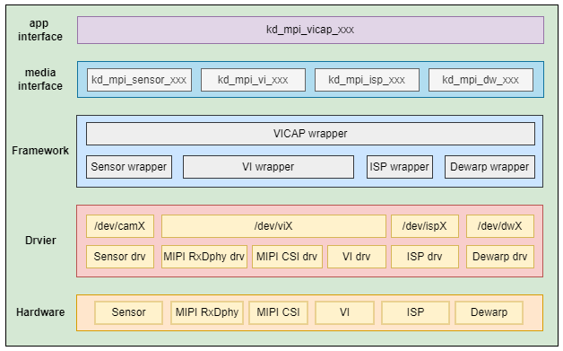

# K230 VICAP API Reference


Copyright 2023 Canaan Inc. ©

<div style="page-break-after:always"></div>

## Disclaimer

The products, services or features you purchase should be subject to Canaan Inc. ("Company", hereinafter referred to as "Company") and its affiliates are bound by the commercial contracts and terms and conditions of all or part of the products, services or features described in this document may not be covered by your purchase or use. Unless otherwise agreed in the contract, the Company does not provide any express or implied representations or warranties as to the correctness, reliability, completeness, merchantability, fitness for a particular purpose and non-infringement of any statements, information, or content in this document. Unless otherwise agreed, this document is intended as a guide for use only.

Due to product version upgrades or other reasons, the content of this document may be updated or modified from time to time without any notice.

## Trademark Notice

, "Canaan" and other Canaan trademarks are trademarks of Canaan Inc. and its affiliates. All other trademarks or registered trademarks that may be mentioned in this document are owned by their respective owners.

**Copyright 2023 Canaan Inc.. © All Rights Reserved.**
Without the written permission of the company, no unit or individual may extract or copy part or all of the content of this document without authorization, and shall not disseminate it in any form.

<div style="page-break-after:always"></div>

## Directory

[TOC]

## preface

### Overview

This document mainly guides application developers on how to obtain image data through the VICAP module, and describes the basic functions of each module API.

### Reader object

This document (this guide) is intended primarily for:

- Technical Support Engineer
- Software Development Engineer

### Definition of acronyms

| abbreviation | illustrate |
|------|------|
|      |      |

### Revision history

| Document version number | Modify the description                                                                                                                                   | Author        | date      |
|------------|--------------------------------------------------------------------------------------------------------------------------------------------|---------------|-----------|
| V1.0       | Initial                                                                                                                               | Wang Chenggen        | 2023/4/4  |
| V1.1       | Modify VICAP Overview; Add APIs and data type jumps                                                                              | Zhao Zhongxiang      | 2023/4/6  |
| V1.2       | Remove ISP-related interfaces Add API and data type descriptions; Separate the sensor interface from the libvicap library to become a libsensor library; Add ov9286 IR/speckle type; Update VICAP description Update document format | Guo Shidong  Wang Chenggen | 2023/4/26 |

## 1. Overview

### 1.1 Overview

The VICAP subsystem is the subsystem responsible for video image input capture processing in the K230 SOC. By processing the signal output by the sensor in real time, the restored and enhanced digital image is obtained, making it closer to the image seen by the human eye in reality. It mainly includes MIPI RXDphy, mipi csi, ISP and DW. MIPI is used to receive high-speed differential signals from sensors and convert them to DVP interfaces for ISP processing; ISPs for image information processing; and DW for fisheye correction and multiple resize outputs.

This document describes the application programming interface of the VICAP module, which provides the operation interface and configuration parameters for application developers to capture video image data through the VICAP module.

### 1.2 Function Description

#### 1.2.1 VICAP

The VICAP module is an abstract description of the entire image acquisition processing unit.

VICAP hardware consists of four modules: Sensor, VI, ISP, and Dewarp (as shown in Figure 1-1 below). Support up to 3 sensors at the same time, the MCM module through the ISP to realize the time division multiplexing management of multiple sensors, the output data of the multiple sensors is written to DDR through the Write interface of the Memory Interface of the MCM, and then read in and loaded into the ISP Pipeline for processing through the Read interface.


Figure 1-1 VICAP hardware architecture diagram

The VICAP software architecture is shown in Figure 1-2, from top to bottom: application interface layer, media interface layer, system framework layer, driver layer and hardware layer.

- Application layer interface: Provide kd_mapi_vicap_xxx form of API interface and usage instructions. It is a further encapsulation of the functional interfaces provided by the various submodules of the media interface layer, simplifying the application development process.
- Media Interface Layer: This layer consists of VICAP submodules, each of which provides its own Media Interface API encapsulation.
- Framework layer: responsible for the control and management of the software functions and business logic of the entire system of VICAP. By integrating the interfaces and functions provided by each sub-module, a complete set of VICAP system control logic and processes is formed.
- Driver layer: A collection of kernel driver functions for each hardware module of VICAP.

Hardware layer: A collection of specific hardware modules of VICAP, including sensors.



#### 1.2.2 Sensor

The Sensor module is one of the data sources for VICAP to capture images and is responsible for configuring the operating parameters and working mode of the image sensor unit.

The K230 platform supports a variety of interface types of sensors, and we take the most commonly used MIPI CSI interface Sensor as an example. The schematic diagram of the hardware connection between the sensor and the main control platform is as follows:


Figure 1-3

The master sends configuration registers through the I2C interface to control the working method of the sensor, and the sensor sends image data to the master SOC through the MIPI CSI interface.

The system architecture of the sensor module is shown in Figure 1-4 below:


Figure 1-4 Sensor system architecture

From top to bottom: media interface layer, hardware driver layer, and hardware layer

- Media Interface Layer: Provides kd_mpi_sensor_xxx interfaces for external modules to operate and access sensor devices.
- Driver layer: This layer mainly consists of two parts, namely: sensor_dev and sensor_drv.
- sensor_dev: Responsible for the registration of device driver files and provide the implementation process of file operation interface. The kernel driver is accessed by registering the device file node /dev/sensorxx for programs in user space.
- sensor_drv: The hardware driver for the specific sensor and encapsulates the operation for the sensor as a unified interface.
- Hardware layer: sensor module hardware, the current system supports up to three hardware sensors at the same time.

## 2. API Reference

### 2.1 VICAP

This function module provides the following APIs:

- [kd_mpi_vicap_get_sensor_info](#211-kd_mpi_vicap_get_sensor_info)
- [kd_mpi_vicap_set_dev_attr](#212-kd_mpi_vicap_set_dev_attr)
- [kd_mpi_vicap_get_dev_attr](#213-kd_mpi_vicap_get_dev_attr)
- [kd_mpi_vicap_set_chn_attr](#214-kd_mpi_vicap_set_chn_attr)
- [kd_mpi_vicap_get_chn_attr](#215-kd_mpi_vicap_get_chn_attr)
- [kd_mpi_vicap_init](#216-kd_mpi_vicap_init)
- [kd_mpi_vicap_deinit](#217-kd_mpi_vicap_deinit)
- [kd_mpi_vicap_start_stream](#218-kd_mpi_vicap_start_stream)
- [kd_mpi_vicap_stop_stream](#219-kd_mpi_vicap_stop_stream)
- [kd_mpi_vicap_dump_frame](#2110-kd_mpi_vicap_dump_frame)
- [kd_mpi_vicap_dump_release](#2111-kd_mpi_vicap_dump_release)

#### 2.1.1 kd_mpi_vicap_get_sensor_info

【Description】

Gets sensor configuration information based on the specified sensor configuration type

【Syntax】

k_s32 kd_mpi_vicap_get_sensor_info(k_vicap_sensor_type sensor_type, k_vicap_sensor_info \*sensor_info)

【Parameters】

| **Parameter name** | **Description**       | **Input/output** |
|--------------|----------------|---------------|
| sensor_type  | Sensor configuration type | input          |
| sensor_info  | Sensor configuration information | output          |

【Return value】

| **Return value** | **Description**               |
|------------|------------------------|
| 0          | Succeed.                 |
| Non-0        | Failed, refer to Error Code Definition. |

【Differences】

None.

【Requirement】

- Header file: mpi_vicap_api.h
- Library file: libvicap.a

【Note】

Application developers need to call this API to obtain sensor configuration information according to the type of sensor configuration to be used, and call subsequent interfaces to initialize other VICAP modules according to the configuration information.

【Example】

None.

【See Also】

#### 2.1.2 kd_mpi_vicap_set_dev_attr

【Description】

Set the VICAP device properties

【Syntax】

k_s32 kd_mpi_vicap_set_dev_attr(k_vicap_dev dev_num, k_vicap_dev_attr dev_attr)

【Parameters】

| **Parameter name** | **Description**      | **Input/output** |
|--------------|---------------|---------------|
| dev_num      | VICAP device number   | input          |
| dev_attr     | VICAP device properties | input          |

【Return value】

| **Return value** | **Description**               |
|------------|------------------------|
| 0          | Succeed.                 |
| Non-0        | Failed, refer to Error Code Definition. |

【Differences】

None.

【Requirement】

- Header file: mpi_vicap_api.h
- Library file: libvicap.a

【Note】

None.

【Example】

None.

【See Also】

#### 2.1.3 kd_mpi_vicap_get_dev_attr

【Description】

Gets the VICAP device properties

【Syntax】

k_s23 kd_mpi_vicap_set_chn_attr(k_vicap_dev dev, k_vicap_chn_attr chn_attr)

【Parameters】

| **Parameter name** | **Description**      | **Input/output** |
|--------------|---------------|---------------|
| dev_num      | VICAP device number   | input          |
| dev_attr     | VICAP device properties | output          |

【Return value】

| **Return value** | **Description**               |
|------------|------------------------|
| 0          | Succeed.                 |
| Non-0        | Failed, refer to Error Code Definition. |

【Differences】

None.

【Requirement】

- Header file: mpi_vicap_api.h
- Library file: libvicap.a

【Note】

None.

【Example】

None.

【See Also】

#### 2.1.4 kd_mpi_vicap_set_chn_attr

【Description】

Set the VICAP device properties

【Syntax】

k_s32 kd_mpi_vicap_set_chn_attr(k_vicap_dev dev_num, k_vicap_chn chn_num, k_vicap_chn_attr chn_attr)

【Parameters】

| **Parameter name** | **Description**          | **Input/output** |
|--------------|-------------------|---------------|
| dev_num      | VICAP device number       | input          |
| chn_num      | VICAP output channel number   | input          |
| chn_attr     | VICAP outputs channel properties | input          |

【Return value】

| **Return value** | **Description**               |
|------------|------------------------|
| 0          | Succeed.                 |
| Non-0        | Failed, refer to Error Code Definition. |

【Differences】

None.

【Requirement】

- Header file: mpi_vicap_api.h
- Library file: libvicap.a

【Note】

None.

【Example】

None.

【See Also】

#### 2.1.5 kd_mpi_vicap_get_chn_attr

【Description】

Gets the VICAP device properties

【Syntax】

k_s32 kd_mpi_vicap_get_chn_attr(k_vicap_dev dev_num, k_vicap_chn chn_num, k_vicap_chn_attr \*chn_attr)

【Parameters】

| **Parameter name** | **Description**          | **Input/output** |
|--------------|-------------------|---------------|
| dev_num      | VICAP device number       | input          |
| chn_num      | VICAP output channel number   | input          |
| chn_attr     | VICAP outputs channel properties | output          |

【Return value】

| **Return value** | **Description**               |
|------------|------------------------|
| 0          | Succeed.                 |
| Non-0        | Failed, refer to Error Code Definition. |

【Differences】

None.

【Requirement】

- Header file: mpi_vicap_api.h
- Library file: libvicap.a

【Note】

None.

【Example】

None.

【See Also】

#### 2.1.6 kd_mpi_vicap_init

【Description】

VICAP device initialization

【Syntax】

k_s32 kd_mpi_vicap_init(k_vicap_dev dev_num)

【Parameters】

| **Parameter name** | **Description**    | **Input/output** |
|--------------|-------------|---------------|
| dev_num      | VICAP device number | input          |

【Return value】

| **Return value** | **Description**               |
|------------|------------------------|
| 0          | Succeed.                 |
| Non-0        | Failed, refer to Error Code Definition. |

【Differences】

None.

【Requirement】

- Header file: mpi_vicap_api.h
- Library file: libvicap.a

【Note】

Before using this interface, you need to call kd_mpi_vicap_set_dev_attr set device properties, and then call kd_mpi_vicap_set_chn_attr to set output channel properties.

【Example】

none

【See Also】

#### 2.1.7 kd_mpi_vicap_deinit

【Description】

VICAP device deinitialization

【Syntax】

k_s32 kd_mpi_vicap_deinit(k_vicap_dev dev_num)

【Parameters】

| **Parameter name** | **Description**    | **Input/output** |
|--------------|-------------|---------------|
| dev_num      | VICAP device number | input          |

【Return value】

| **Return value** | **Description**               |
|------------|------------------------|
| 0          | Succeed.                 |
| Non-0        | Failed, refer to Error Code Definition. |

【Differences】

None.

【Requirement】

- Header file: mpi_vicap_api.h
- Library file: libvicap.a

【Note】

None.

【Example】

None.

【See Also】

#### 2.1.8 kd_mpi_vicap_start_stream

【Description】

Start the VICAP device output data stream

【Syntax】

k_s32 kd_mpi_vicap_start_stream(k_vicap_dev dev_num)

【Parameters】

| **Parameter name** | **Description**    | **Input/output** |
|--------------|-------------|---------------|
| dev_num      | VICAP device number | input          |

【Return value】

| **Return value** | **Description**               |
|------------|------------------------|
| 0          | Succeed.                 |
| Non-0        | Failed, refer to Error Code Definition. |

【Differences】

None.

【Requirement】

- Header file: mpi_vicap_api.h
- Library file: libvicap.a

【Note】

None.

【Example】

None.

【See Also】

#### 2.1.9 kd_mpi_vicap_stop_stream

【Description】

Stop the VICAP device data stream output

【Syntax】

k_s32 kd_mpi_vicap_stop_stream(k_vicap_dev dev_num)

【Parameters】

| **Parameter name** | **Description**    | **Input/output** |
|--------------|-------------|---------------|
| dev_num      | VICAP device number | input          |

【Return value】

| **Return value** | **Description**               |
|------------|------------------------|
| 0          | Succeed.                 |
| Non-0        | Failed, refer to Error Code Definition. |

【Differences】

None.

【Requirement】

- Header file: mpi_vicap_api.h
- Library file: libvicap.a

【Note】

none

【Example】

None.

【See Also】

#### 2.1.10 kd_mpi_vicap_dump_frame

【Description】

Dump vicap data according to the specified device and output channel

【Syntax】

k_s32 kd_mpi_vicap_dump_frame(k_vicap_dev dev_num, k_vicap_chn chn_num, k_vicap_dump_format foramt,

k_video_frame_info \*vf_info, k_u32 milli_sec)

【Parameters】

| **Parameter name** | **Description**        | **Input/output** |
|--------------|-----------------|---------------|
| dev_num      | VICAP device number     | input          |
| chn_num      | VICAP output channel number | input          |
| Affected       | Dump data type    | input          |
| vf_info      | Dump frame information      | output          |
| milli_sec    | Timeout        | input          |

【Return value】

| **Return value** | **Description**               |
|------------|------------------------|
| 0          | Succeed.                 |
| Non-0        | Failed, refer to Error Code Definition. |

【Differences】

None.

【Requirement】

- Header file: mpi_vicap_api.h
- Library file: libvicap.a

【Note】

None.

【Example】

None.

【See Also】

#### 2.1.11 kd_mpi_vicap_dump_release

【Description】

Release the dump data frame

【Syntax】

k_s32 kd_mpi_vicap_dump_release(k_vicap_dev dev_num, k_vicap_chn chn_num, const k_video_frame_info \*vf_info)

【Parameters】

| **Parameter name** | **Description**        | **Input/output** |
|--------------|-----------------|---------------|
| dev_num      | VICAP device number     | input          |
| chn_num      | VICAP output channel number | input          |
| vf_info      | Dump frame information      | input          |

【Return value】

| **Return value** | **Description**               |
|------------|------------------------|
| 0          | Succeed.                 |
| Non-0        | Failed, refer to Error Code Definition. |

【Differences】

None.

【Requirement】

- Header file: mpi_vicap_api.h
- Library file: libvicap.a

【Note】

None.

【Example】

None.

【See Also】

### 2.2 Sensor

This function module provides the following APIs:

- [kd_mpi_sensor_open](#221-kd_mpi_sensor_open)
- [kd_mpi_sensor_close](#222-kd_mpi_sensor_close)
- [kd_mpi_sensor_power_set](#223-kd_mpi_sensor_power_set)
- [kd_mpi_sensor_id_get](#224-kd_mpi_sensor_id_get)
- [kd_mpi_sensor_init](#225-kd_mpi_sensor_init)
- [kd_mpi_sensor_reg_read](#226-kd_mpi_sensor_reg_read)
- [kd_mpi_sensor_reg_write](#227-kd_mpi_sensor_reg_write)
- [kd_mpi_sensor_mode_get](#228-kd_mpi_sensor_mode_get)
- [kd_mpi_sensor_mode_set](#229-kd_mpi_sensor_mode_set)
- [kd_mpi_sensor_stream_enable](#2210-kd_mpi_sensor_stream_enable)
- [kd_mpi_sensor_again_set](#2211-kd_mpi_sensor_again_set)
- [kd_mpi_sensor_again_get](#2212-kd_mpi_sensor_again_get)
- [kd_mpi_sensor_dgain_set](#2213-kd_mpi_sensor_dgain_set)
- [kd_mpi_sensor_dgain_get](#2214-kd_mpi_sensor_dgain_get)
- [kd_mpi_sensor_intg_time_set](#2215-kd_mpi_sensor_intg_time_set)
- [kd_mpi_sensor_intg_time_get](#2216-kd_mpi_sensor_intg_time_get)

#### 2.2.1 kd_mpi_sensor_open

【Description】

Open the sensor device according to the sensor device name

【Syntax】

k_s32 kd_mpi_sensor_open(const char \*sensor_name)

【Parameters】

| **Parameter name** | **Description**       | **Input/output** |
|--------------|----------------|---------------|
| sensor_name  | Sensor device name | input          |

【Return value】

| **Return value** | **Description**               |
|------------|------------------------|
| positive value       | Succeed. Returns the device descriptor   |
| Negative       | Failed, refer to Error Code Definition. |

【Differences】

None.

【Requirement】

- Header file: mpi_sensor_api.h
- Library file: libsensor.a

【Note】

None.

【Example】

None.

【See Also】

#### 2.2.2 kd_mpi_sensor_close

【Description】

Turn off the sensor device

【Syntax】

k_s32 kd_mpi_sensor_close (k_s32 fd)

【Parameters】

| **Parameter name** | **Description**             | **Input/output** |
|--------------|----------------------|---------------|
| fd           | Sensor device file descriptor | input          |

【Return value】

| **Return value** | **Description**               |
|------------|------------------------|
| 0          | Succeed.                 |
| Non-0        | Failed, refer to Error Code Definition. |

【Differences】

None.

【Requirement】

- Header file: mpi_sensor_api.h
- Library file: libsensor.a

【Note】

None.

【Example】

None.

【See Also】

#### 2.2.3 kd_mpi_sensor_power_set

【Description】

Set the sensor power state

【Syntax】

k_s32 kd_mpi_sensor_power_set(k_s32 fd, k_bool is)

【Parameters】

| **Parameter name** | **Description**                                      | **Input/output** |
|--------------|-----------------------------------------------|---------------|
| fd           | Sensor device file descriptor                          | input          |
| on           | Set the sensor power-on status, K_TRUE: power-on, K_FALSE: power-down | input          |

【Return value】

| **Return value** | **Description**               |
|------------|------------------------|
| 0          | Succeed.                 |
| Non-0        | Failed, refer to Error Code Definition. |

【Differences】

None.

【Requirement】

- Header file: mpi_sensor_api.h
- Library file: libsensor.a

【Note】

None.

【Example】

None.

【See Also】

#### 2.2.4 kd_mpi_sensor_id_get

【Description】

Get the sensor ID

【Syntax】

k_s32 kd_mpi_sensor_id_get(k_s32 fd, k_u32 \*sensor_id)

【Parameters】

| **Parameter name** | **Description**             | **Input/output** |
|--------------|----------------------|---------------|
| fd           | Sensor device file descriptor | input          |
| sensor_id    | The obtained sensor ID      | output          |

【Return value】

| **Return value** | **Description**               |
|------------|------------------------|
| 0          | Succeed.                 |
| Non-0        | Failed, refer to Error Code Definition. |

【Differences】

None.

【Requirement】

- Header file: mpi_sensor_api.h
- Library file: libsensor.a

【Note】

None.

【Example】

None.

【See Also】

#### 2.2.5 kd_mpi_sensor_init

【Description】

Sensor initialization

【Syntax】

k_s32 kd_mpi_sensor_init(k_s32 fd, k_sensor_mode mode)

【Parameters】

| **Parameter name** | **Description**                                    | **Input/output** |
|--------------|---------------------------------------------|---------------|
| fd           | Sensor device file descriptor                        | input          |
| mode         | Initializes the sensor configuration register according to the specified sensor mode | input          |

【Return value】

| **Return value** | **Description**               |
|------------|------------------------|
| 0          | Succeed.                 |
| Non-0        | Failed, refer to Error Code Definition. |

【Differences】

None.

【Requirement】

- Header file: mpi_sensor_api.h
- Library file: libsensor.a

【Note】

None.

【Example】

None.

【See Also】

#### 2.2.6 kd_mpi_sensor_reg_read

【Description】

Read the contents of the sensor register

【Syntax】

k_s32 kd_mpi_sensor_reg_read(k_s32 fd, k_u32 reg_addr, k_u32 \*reg_val)

【Parameters】

| **Parameter name** | **Description**             | **Input/output** |
|--------------|----------------------|---------------|
| fd           | Sensor device file descriptor | input          |
| reg_addr     | Sensor register address     | input          |
| reg_val      | Read the register contents       | output          |

【Return value】

| **Return value** | **Description**               |
|------------|------------------------|
| 0          | Succeed.                 |
| Non-0        | Failed, refer to Error Code Definition. |

【Differences】

None.

【Requirement】

- Header file: mpi_sensor_api.h
- Library file: libsensor.a

【Note】

None.

【Example】

None.

【See Also】

#### 2.2.7 kd_mpi_sensor_reg_write

【Description】

Write the contents of the sensor register

【Syntax】

k_s32 kd_mpi_sensor_reg_write(k_s32 fd, k_u32 reg_addr, k_u32 reg_val)

【Parameters】

| **Parameter name** | **Description**             | **Input/output** |
|--------------|----------------------|---------------|
| fd           | Sensor device file descriptor | input          |
| reg_addr     | Sensor register address     | input          |
| reg_val      | Write the contents of the sensor register | input          |

【Return value】

| **Return value** | **Description**               |
|------------|------------------------|
| 0          | Succeed.                 |
| Non-0        | Failed, refer to Error Code Definition. |

【Differences】

None.

【Requirement】

- Header file: mpi_sensor_api.h
- Library file: libsensor.a

【Note】

None.

【Example】

None.

【See Also】

#### 2.2.8 kd_mpi_sensor_mode_get

【Description】

Get the sensor mode configuration

【Syntax】

k_s32 kd_mpi_sensor_mode_get(k_s32 fd, k_sensor_mode \*mode)

【Parameters】

| **Parameter name** | **Description**                      | **Input/output** |
|--------------|-------------------------------|---------------|
| fd           | Sensor device file descriptor          | input          |
| mode         | Returns the obtained sensor mode configuration parameters | output          |

【Return value】

| **Return value** | **Description**               |
|------------|------------------------|
| 0          | Succeed.                 |
| Non-0        | Failed, refer to Error Code Definition. |

【Differences】

None.

【Requirement】

- Header file: mpi_sensor_api.h
- Library file: libsensor.a

【Note】

None.

【Example】

None.

【See Also】

#### 2.2.9 kd_mpi_sensor_mode_set

【Description】

Set the sensor mode configuration

【Syntax】

k_s32 kd_mpi_sensor_mode_get(k_s32 fd, k_sensor_mode mode)

【Parameters】

| **Parameter name** | **Description**                | **Input/output** |
|--------------|-------------------------|---------------|
| fd           | Sensor device file descriptor    | input          |
| mode         | Set the sensor mode configuration parameter | input          |

【Return value】

| **Return value** | **Description**               |
|------------|------------------------|
| 0          | Succeed.                 |
| Non-0        | Failed, refer to Error Code Definition. |

【Differences】

None.

【Requirement】

- Header file: mpi_sensor_api.h
- Library file: libsensor.a

【Note】

None.

【Example】

None.

【See Also】

#### 2.2.10 kd_mpi_sensor_stream_enable

【Description】

Set the sensor mode configuration

【Syntax】

k_s32 kd_mpi_sensor_stream_enable(k_s32 fd, k_s32 enable)

【Parameters】

| **Parameter name** | **Description**                                         | **Input/output** |
|--------------|--------------------------------------------------|---------------|
| fd           | Sensor device file descriptor                             | input          |
| enable       | Set the sensor stream output status, 0: output disabled, non-0: output enabled | input          |

【Return value】

| **Return value** | **Description**               |
|------------|------------------------|
| 0          | Succeed.                 |
| Non-0        | Failed, refer to Error Code Definition. |

【Differences】

None.

【Requirement】

- Header file: mpi_sensor_api.h
- Library file: libsensor.a

【Note】

None.

【Example】

None.

【See Also】

#### 2.2.11 kd_mpi_sensor_again_set

【Description】

Set the sensor analog gain

【Syntax】

k_s32 kd_mpi_sensor_again_set(k_s32 fd, k_sensor_gain gain)

【Parameters】

| **Parameter name** | **Description**             | **Input/output** |
|--------------|----------------------|---------------|
| fd           | Sensor device file descriptor | input          |
| gain         | GAIN configuration parameters         | input          |

【Return value】

| **Return value** | **Description**               |
|------------|------------------------|
| 0          | Succeed.                 |
| Non-0        | Failed, refer to Error Code Definition. |

【Differences】

None.

【Requirement】

- Header file: mpi_sensor_api.h
- Library file: libsensor.a

【Note】

None.

【Example】

None.

【See Also】

#### 2.2.12 kd_mpi_sensor_again_get

【Description】

Get the sensor analog gain

【Syntax】

k_s32 kd_mpi_sensor_again_set(k_s32 fd, k_sensor_gain \*gain)

【Parameters】

| **Parameter name** | **Description**             | **Input/output** |
|--------------|----------------------|---------------|
| fd           | Sensor device file descriptor | input          |
| gain         | GAIN configuration parameters         | output          |

【Return value】

| **Return value** | **Description**               |
|------------|------------------------|
| 0          | Succeed.                 |
| Non-0        | Failed, refer to Error Code Definition. |

【Differences】

None.

【Requirement】

- Header file: mpi_sensor_api.h
- Library file: libsensor.a

【Note】

None.

【Example】

None.

【See Also】

#### 2.2.13 kd_mpi_sensor_dgain_set

【Description】

Set the sensor digital gain

【Syntax】

k_s32 kd_mpi_sensor_dgain_set(k_s32 fd, k_sensor_gain gain)

【Parameters】

| **Parameter name** | **Description**             | **Input/output** |
|--------------|----------------------|---------------|
| fd           | Sensor device file descriptor | input          |
| gain         | GAIN configuration parameters         | input          |

【Return value】

| **Return value** | **Description**               |
|------------|------------------------|
| 0          | Succeed.                 |
| Non-0        | Failed, refer to Error Code Definition. |

【Differences】

None.

【Requirement】

- Header file: mpi_sensor_api.h
- Library file: libsensor.a

【Note】

None.

【Example】

None.

【See Also】

#### 2.2.14 kd_mpi_sensor_dgain_get

【Description】

Get the sensor digital gain

【Syntax】

k_s32 kd_mpi_sensor_dgain_get(k_s32 fd, k_sensor_gain \*gain)

【Parameters】

| **Parameter name** | **Description**             | **Input/output** |
|--------------|----------------------|---------------|
| fd           | Sensor device file descriptor | input          |
| gain         | GAIN configuration parameters         | output          |

【Return value】

| **Return value** | **Description**               |
|------------|------------------------|
| 0          | Succeed.                 |
| Non-0        | Failed, refer to Error Code Definition. |

【Differences】

None.

【Requirement】

- Header file: mpi_sensor_api.h
- Library file: libsensor.a

【Note】

None.

【Example】

None.

【See Also】

#### 2.2.15 kd_mpi_sensor_intg_time_set

【Description】

Set the sensor integration time

【Syntax】

k_s32 kd_mpi_sensor_intg_time_set(k_s32 fd, k_sensor_intg_time time)

【Parameters】

| **Parameter name** | **Description**             | **Input/output** |
|--------------|----------------------|---------------|
| fd           | Sensor device file descriptor | input          |
| time         | Integration time configuration parameters     | input          |

【Return value】

| **Return value** | **Description**               |
|------------|------------------------|
| 0          | Succeed.                 |
| Non-0        | Failed, refer to Error Code Definition. |

【Differences】

None.

【Requirement】

- Header file: mpi_sensor_api.h
- Library file: libsensor.a

【Note】

None.

【Example】

None.

【See Also】

#### 2.2.16 kd_mpi_sensor_intg_time_get

【Description】

Get sensor integration time

【Syntax】

k_s32 kd_mpi_sensor_intg_time_get(k_s32 fd, k_sensor_intg_time \*time)

【Parameters】

| **Parameter name** | **Description**             | **Input/output** |
|--------------|----------------------|---------------|
| fd           | Sensor device file descriptor | input          |
| time         | Integration time configuration parameters     | output          |

【Return value】

| **Return value** | **Description**               |
|------------|------------------------|
| 0          | Succeed.                 |
| Non-0        | Failed, refer to Error Code Definition. |

【Differences】

None.

【Requirement】

- Header file: mpi_sensor_api.h
- Library file: libsensor.a

【Note】

None.

【Example】

None.

【See Also】

## 3. Data Type

### 3.1 VICAP

The relevant data types for this function module are defined as follows:

- [k_vicap_sensor_type](#311-k_vicap_sensor_type)
- [k_vicap_dev](#312-k_vicap_dev)
- [k_vicap_chn](#313-k_vicap_chn)
- [k_vicap_csi_num](#314-k_vicap_csi_num)
- [k_vicap_mipi_lanes](#315-k_vicap_mipi_lanes)
- [k_vicap_csi_data_type](#316-k_vicap_csi_data_type)
- [k_vicap_data_source](#317-k_vicap_data_source)
- [k_vicap_vi_dvp_port](#318-k_vicap_vi_dvp_port)
- [k_vicap_vi_flash_mode](#319-k_vicap_vi_flash_mode)
- [k_vicap_img_window](#3110-k_vicap_img_window)
- [k_vicap_work_mode](#3111-k_vicap_work_mode)
- [k_vicap_sensor_info](#3112-k_vicap_sensor_info)
- [k_vicap_dump_format](#3113-k_vicap_dump_format)
- [k_vicap_dev_attr](#3114-k_vicap_dev_attr)
- [k_vicap_chn_attr](#3115-k_vicap_chn_attr)

#### 3.1.1 k_vicap_sensor_type

【Note】The sensor type definition supported by the current system

【Definition】

```c
typedef enum {
OV_OV9732_MIPI_1920X1080_30FPS_10BIT_LINEAR,
OV_OV9732_MIPI_1920X1080_30FPS_10BIT_HDR,
OV_OV9732_MIPI_1280X720_30FPS_10BIT_LINEAR,
OV_OV9286_MIPI_1920X1080_30FPS_10BIT_LINEAR,
OV_OV9286_MIPI_1920X1080_30FPS_10BIT_HDR,
OV_OV9286_MIPI_1280X720_30FPS_10BIT_LINEAR_IR,
OV_OV9286_MIPI_1280X720_30FPS_10BIT_LINEAR_SPECKLE,
SENSOR_TYPE_MAX,
} k_vicap_sensor_type;
```

【Members】

| **Member name**                                       | **Description**                                |
|----------------------------------------------------|-----------------------------------------|
| OV_OV9732_MIPI_1920X1080_30FPS_10BIT_LINEAR        | OV9732 1080P 10bit 30 frame linear output configuration     |
| OV_OV9732_MIPI_1920X1080_30FPS_10BIT_HDR           | OV9732 1080P 10bit 30 fps HDR output configuration      |
| OV_OV9732_MIPI_1280X720_30FPS_10BIT_LINEAR         | OV9732 720P 10bit 30 frame linear output configuration      |
| OV_OV9286_MIPI_1920X1080_30FPS_10BIT_LINEAR        | OV9286 1080P 10bit 30 frame linear output configuration     |
| OV_OV9286_MIPI_1920X1080_30FPS_10BIT_HDR           | OV9286 1080P 10bit 30fps HDR output configuration      |
| OV_OV9286_MIPI_1280X720_30FPS_10BIT_LINEAR_IR      | OV9286 720P 10bit 30 fps linear output IR configuration |
| OV_OV9286_MIPI_1280X720_30FPS_10BIT_LINEAR_SPECKLE | OV9286 720P 10bit 30 fps linear output speckle configuration |

【Note】

1. This list needs to be maintained by the sensor driver developer, and the application developer opens the specified type of sensor device through the sensor type defined here
1. The current version supports the following types:

    OV_OV9732_MIPI_1280X720_30FPS_10BIT_LINEAR

    OV_OV9286_MIPI_1280X720_30FPS_10BIT_LINEAR_IR

    OV_OV9286_MIPI_1280X720_30FPS_10BIT_LINEAR_SPECKLE

#### 3.1.2 k_vicap_dev

【Note】VICAP device number definition

【Definition】

```c
typedef enum {
VICAP_DEV_ID_0 = 0,
VICAP_DEV_ID_1 = 1,
VICAP_DEV_ID_2 = 2,
VICAP_DEV_ID_MAX,
} k_vicap_dev;
```

【Members】

| **Member name**   | **Description**   |
|----------------|------------|
| VICAP_DEV_ID_0 | VICAP device 0 |
| VICAP_DEV_ID_1 | VICAP device 1 |
| VICAP_DEV_ID_2 | VICAP Device 2 |

#### 3.1.3 k_vicap_chn

【Note】vicap output channel number definition

【Definition】

```c
typedef enum {
VICAP_CHN_ID_0 = 0,
VICAP_CHN_ID_1 = 1,
VICAP_CHN_ID_2 = 2,
VICAP_CHN_ID_MAX,
} k_vicap_chn;
```

【Members】

| **Member name**   | **Description**       |
|----------------|----------------|
| VICAP_CHN_ID_0 | VICAP output channel 0 |
| VICAP_CHN_ID_1 | VICAP output channel 1 |
| VICAP_CHN_ID_2 | VICAP output channel 2 |

#### 3.1.4 k_vicap_csi_num

【Note】VICAP CSI designation definition

【Definition】

```c
typedef enum {
VICAP_CSI0 = 1,
VICAP_CSI1 = 2,
VICAP_CSI2 = 3,
} k_vicap_csi_num;
```

【Members】

| **Member Name** | **** Description|
|--------------|----------|
| VICAP_CSI0   | CSI0     |
| VICAP_CSI1   | CSI1     |
| VICAP_CSI2   | CSI2     |

【Note】

The CSI number of the sensor connection is determined by the hardware physical connection.

#### 3.1.5 k_vicap_mipi_lanes

【Note】VICAP MIPI channel number definition

【Definition】

```c
typedef enum {
VICAP_MIPI_1LANE = 0,
VICAP_MIPI_2LANE = 1,
VICAP_MIPI_4LANE = 3,
} k_vicap_mipi_lanes;
```

【Members】

| **Member name**     | **** Description|
|------------------|----------|
| VICAP_MIPI_1LANE | 1 lane   |
| VICAP_MIPI_2LANE | 2 lane   |
| VICAP_MIPI_4LANE | 4 lane   |

【Note】

The number of MIPI channels used for the sensor connection is determined by the hardware physical connection, and when using 4lane, only a maximum of two sensors can be connected.

#### 3.1.6 k_vicap_csi_data_type

【Note】VICAP MIPI channel number definition

【Definition】

```c
typedef enum {
VICAP_CSI_DATA_TYPE_RAW8 = 0x2A,
VICAP_CSI_DATA_TYPE_RAW10 = 0x2B,
VICAP_CSI_DATA_TYPE_RAW12 = 0x2C,
VICAP_CSI_DATA_TYPE_RAW14 = 0x2D,
} k_vicap_csi_data_type;
```

【Members】

| **Member name**              | **** Description|
|---------------------------|----------|
| VICAP_CSI_DATA_TYPE_RAW8  | RAW8     |
| VICAP_CSI_DATA_TYPE_RAW10 | RAW10    |
| VICAP_CSI_DATA_TYPE_RAW12 | RAW12    |
| VICAP_CSI_DATA_TYPE_RAW14 | RAW14    |

【Note】

none

#### 3.1.7 k_vicap_data_source

Description: Vicap data source

【Definition】

```c
typedef enum {
VICAP_SOURCE_CSI0 = 0, /**< vicap acquire data from the csi0*/
VICAP_SOURCE_CSI1 = 1, /**< vicap acquire data from the csi0*/
VICAP_SOURCE_CSI1_FS_TR0 = 2, /**<vicap acquire data from the csi1 for flash trigger 0*/
VICAP_SOURCE_CSI1_FS_TR1 = 3, /**<vicap acquire data from the csi0 for flash trigger 1*/
VICAP_SOURCE_CSI2 = 4, /**< vicap acquire data from the csi2*/
} k_vicap_data_source;
```

【Members】

| **Member name**             | **Description**                            |
|--------------------------|-------------------------------------|
| VICAP_SOURCE_CSI0        | VICAP data source is CSI0                 |
| VICAP_SOURCE_CSI1        | VICAP data source is CSI1                 |
| VICAP_SOURCE_CSI1_FS_TR0 | VICAP data source is CSI1 Flash trigger 0 |
| VICAP_SOURCE_CSI1_FS_TR1 | VICAP data source is CSI1 Flash trigger 1 |
| VICAP_SOURCE_CSI2        | VICAP data source is CSI2                 |

【Note】

#### 3.1.8 k_vicap_vi_dvp_port

【Description】VICAP vi DVP port number

【Definition】

```c
typedef enum {
VICAP_VI_DVP_PORT0 = 0,
VICAP_VI_DVP_PORT1 = 1,
VICAP_VI_DVP_PORT2 = 2,
VICAP_VI_DVP_PORT_MAX,
} k_vicap_vi_dvp_port;
```

【Members】

| **Member name**       | **Description**  |
|--------------------|-----------|
| VICAP_VI_DVP_PORT0 | DVP port 0 |
| VICAP_VI_DVP_PORT1 | DVP port 1  |
| VICAP_VI_DVP_PORT2 | DVP port 2  |

【Note】

1. The default port 0 corresponds to CSI0, port 1 corresponds to CSI1, and port 2 corresponds to CSI2
1. Only port 0 supports HDR sensor, and when the user needs to use HDR mode, it must be bound to DVP port 0.
1. When the user needs to change the port mapping relationship, the binding operation needs to be performed

#### 3.1.9 k_vicap_vi_flash_mode

【Description】VICAP flash light source control mode

【Definition】

```c
typedef enum {
VICAP_FLASH_FOLLOW_STROBE = 0,
VICAP_FLASH_FOLLOW_STROBE_BASE_PWM = 1,
VICAP_FLASH_NORMAL_PWM = 2,
VICAP_FLASH_DISABLE = 3, /**< disable flash light*/
} k_vicap_vi_flash_mode;
```

【Members】

| **Member name**                       | **Description**                    |
|------------------------------------|-----------------------------|
| VICAP_FLASH_FOLLOW_STROBE          | Controlled by a strobe signal            |
| VICAP_FLASH_FOLLOW_STROBE_BASE_PWM | Based on PWM mode, it is controlled by the strobe signal |
| VICAP_FLASH_NORMAL_PWM             | Controlled by PWM signals               |
| VICAP_FLASH_DISABLE                | disable                        |

【Note】

#### 3.1.10 k_vicap_img_window

【Description】VICAP image window definition

【Definition】

```c
typedef struct {
k_u16 h_start;
k_u16 v_start;
k_u16 width;
k_u16 height;
} k_vicap_img_window;
```

【Members】

| **Member Name** | **Description**     |
|--------------|--------------|
| h_start      | Horizontal starting position |
| v_start      | Vertical start position |
| width        | Image width     |
| height       | Image height     |

#### 3.1.11 k_vicap_work_mode

【Description】vicap working mode

【Definition】

```c
typedef enum {
VICAP_WORK_ONLINE_MODE,
VICAP_WORK_OFFLINE_MODE,
} k_vicap_work_mode;
```

【Members】

| **Member name**            | **** Description|
|-------------------------|----------|
| VICAP_WORK_ONLINE_MODE  | Online mode |
| VICAP_WORK_OFFLINE_MODE | Offline mode |

Note: When multiple camera inputs are supported, it must be specified as offline mode.

#### 3.1.12 k_vicap_sensor_info

【Description】VICAP sensor configuration information

【Definition】

```c
typedef struct {
const char *sensor_name;
k_vicap_csi_num csi_num; /**< CSI NUM that the sensor connects to*/
k_vicap_mipi_lanes mipi_lanes; /**< MIPI lanes that the sensor connects to*/
k_vicap_data_source source_id; /**<source id that the sensor used to*/
k_bool is_3d_sensor;
k_vicap_mipi_phy_freq phy_freq;
k_vicap_csi_data_type data_type;
k_vicap_hdr_mode hdr_mode;
k_vicap_vi_flash_mode flash_mode;
k_vicap_sensor_type sensor_type;
} k_vicap_sensor_info;
```

【Members】

| **Member Name** | **Description**                              |
|--------------|---------------------------------------|
| sensor_name  | Sensor name                            |
| csi_num      | The CSI number to which the current sensor hardware is connected             |
| mipi_lanes   | The number of MIPI channels used by the current sensor hardware connection |
| source_id    | The VICAP data source designator used by the current sensor       |
| is_3d_sensor | Whether it is a 3Dsensor                        |
| phy_freq     | PHY frequency                               |
| data_type    | MIPI CSI data type                      |
| hdr_mode     | HDR mode                               |
| flash_mode   | Flash configuration mode                        |
| sensor_type  | Sensor configuration type                        |

#### 3.1.13 k_vicap_dump_format

【Note】VICAPdumo data frame format

【Definition】

```c
typedef enum {
VICAP_DUMP_YUV = 0,
VICAP_DUMP_RGB = 1,
VICAP_DUMP_RAW = 2,
} k_vicap_dump_format;
```

【Members】

| **Member name**   | **Description**     |
|----------------|--------------|
| VICAP_DUMP_YUV | Dump YUV data |
| VICAP_DUMP_RGB | Dump RGB data |
| VICAP_DUMP_RAW | Dump RAW data |

#### 3.1.14 k_vicap_dev_attr

【Description】VICAP device properties

【Definition】

```c
typedef struct {
    k_vicap_window acq_win;
    k_vicap_work_mode mode;
    k_vicap_isp_pipe_ctrl pipe_ctrl;
    k_u32 cpature_frame;
    k_vicap_sensor_info sensor_info;
    k_bool dw_enable;
    k_u32 buffer_num;
    k_u32 buffer_size;
} k_vicap_dev_attr;
```

【Members】

| **Member name**  | **Description**                                                     |
| ------------- | ------------------------------------------------------------ |
| acq_win       | Image capture window                                                 |
| mode          | Vicap working mode. When multiple camera inputs are supported, it must be specified as offline mode.  |
| pipe_ctrl     | ISP pipeline control switch.                                      |
| cpature_frame | Specify the number of frames of the collected data, input range \[0,1023\], 0: continuous acquisition          |
| sensor_info   | Sensor configuration information                                               |
| dw_enable     | Dewarp enable flag |
| buffer_num    | In offline mode, configure the number of buffers in which the sensor receives data                   |
| buffer_size   | In offline mode, configure the buffer size of the sensor to receive data                   |

【Note】For small memory application scenarios, it is recommended to close the 3DNR module to reduce the memory occupation. When closing mode to set device properties for the app, set pipe_ctrl.bits.dnr3_enable to 0

#### 3.1.15 k_vicap_chn_attr

【Description】VICAP device properties

【Definition】

```c
typedef struct {
    k_vicap_window out_win;
    k_vicap_window crop_win;
    k_vicap_window scale_win;
    k_bool crop_enable;
    k_bool scale_enable;
    k_bool chn_enable;
    k_pixel_format pix_format;
    k_u32 buffer_num;
    k_u32 buffer_size;
    k_u8 alignment;
} k_vicap_chn_attr;
```

【Members】

| **Member Name** | **Description**                 |
| ------------ | ------------------------ |
| out_win      | Output window size             |
| crop_win     | Crop the window size             |
| scale_win    | Scale the window size             |
| crop_enable  | Crop enabled                 |
| scale_enable | Zoom enable                 |
| chn_enable   | Channel enable                 |
| pix_format   | Output pixel format             |
| buffer_num   | The number of buffers used by the current channel |
| buffer_size  | Buffer size               |
| alignment    | Buffer alignment           |

### 3.2 Sensor

The relevant data types for this function module are defined as follows:

- [k_sensor_bayer_pattern](#321-k_sensor_bayer_pattern)
- [k_sensor_exp_frame_type](#322-k_sensor_exp_frame_type)
- [k_sensor_exposure_param](#323-k_sensor_exposure_param)
- [k_sensor_intg_time](#324-k_sensor_intg_time)
- [k_sensor_gain](#325-k_sensor_gain)
- [k_sensor_size](#326-k_sensor_size)
- [k_sensor_ae_info](#327-k_sensor_ae_info)
- [k_sensor_mode](#328-k_sensor_mode)

#### 3.2.1 k_sensor_bayer_pattern

【Definition】The Bayer mode definition of the sensor output

```c
typedef enum {
BAYER_RGGB = 0,
BAYER_GRBG = 1,
BAYER_GBRG = 2,
BAYER_BGGR = 3,
BAYER_BUTT } k_sensor_bayer_pattern;
```

【Members】

| **Member Name** | **** Description|
|--------------|----------|
| BAYER_RGGB   | RGGB mode |
| BAYER_GRBG   | GRBG mode |
| BAYER_GBRG   | GBRG mode |
| BAYER_BGGR   | BGGR mode |

#### 3.2.2 k_sensor_exp_frame_type

【Description】

【Definition】

```c
typedef enum {
SENSOR_EXPO_FRAME_TYPE_1FRAME = 0,
SENSOR_EXPO_FRAME_TYPE_2FRAMES = 1,
SENSOR_EXPO_FRAME_TYPE_3FRAMES = 2,
SENSOR_EXPO_FRAME_TYPE_4FRAMES = 3,
SENSOR_EXPO_FRAME_TYPE_MAX } k_sensor_exp_frame_type;
```

【Members】

| **Member name**                   | **Description**           |
|--------------------------------|--------------------|
| SENSOR_EXPO_FRAME_TYPE_1FRAME  | Linear mode, single frame exposure |
| SENSOR_EXPO_FRAME_TYPE_2FRAMES | 2-frame HDR exposure mode     |
| SENSOR_EXPO_FRAME_TYPE_3FRAMES | 2-frame HDR exposure mode     |
| SENSOR_EXPO_FRAME_TYPE_4FRAMES | 4-frame HDR exposure mode     |

#### 3.2.3 k_sensor_exposure_param

【Note】Sensor exposure parameter definition

【Definition】

```c
typedef struct {
k_u8 exp_frame_type;
float gain[SENSOR_EXPO_FRAME_TYPE_MAX];
float exp_time[SENSOR_EXPO_FRAME_TYPE_MAX];
} k_sensor_exposure_param;
```

【Members】

| **Member name**   | **** Description|
|----------------|----------|
| exp_frame_type | Exposure type |
| gain           | Exposure gain |
| exp_time       | Exposure time |

#### 3.2.4 k_sensor_intg_time

【Note】Sensor exposure time definition

【Definition】

```c
typedef struct {
k_u8 exp_frame_type;
float intg_time[SENSOR_EXPO_FRAME_TYPE_MAX];
} k_sensor_intg_time;
```

【Members】

| **Member name**   | **** Description|
|----------------|----------|
| exp_frame_type | Exposure type |
| intg_time      | Integration time |

#### 3.2.5 k_sensor_gain

Description: Exposure gain definition

【Definition】

```c
typedef struct {
k_u8 exp_frame_type;
float gain[SENSOR_EXPO_FRAME_TYPE_MAX];
} k_sensor_gain;
```

【Members】

| **Member name**   | **** Description|
|----------------|----------|
| exp_frame_type | Exposure type |
| gain           | Exposure gain |

#### 3.2.6 k_sensor_size

【Note】Image size definition supported by sensor

【Definition】

```c
typedef struct {
k_u32 bounds_width;
k_u32 bounds_height;
k_u32 top;
k_u32 left;
k_u32 width;
k_u32 height;
} k_sensor_size;
```

【Members】

| **Member name**  | **** Description|
|---------------|----------|
| bounds_width  | Width boundary |
| bounds_height | Height boundary |
| top           | Top border |
| left          | Left border   |
| width         | width     |
| height        | height     |

#### 3.2.7 k_sensor_ae_info

【Description】AE parameter configuration

【Definition】

```c
typedef struct {
k_u16 frame_length;
k_u16 cur_frame_length;
float one_line_exp_time;
k_u32 gain_accuracy;
float min_gain;
float max_gain;
float integration_time_increment;
float gain_increment;
k_u16 max_long_integraion_line;
k_u16 min_long_integraion_line;
k_u16 max_integraion_line;
k_u16 min_integraion_line;
k_u16 max_vs_integraion_line;
k_u16 min_vs_integraion_line;
float max_long_integraion_time;
float min_long_integraion_time;
float max_integraion_time;
float min_integraion_time;
float max_vs_integraion_time;
float min_vs_integraion_time;
float cur_long_integration_time;
float cur_integration_time;
float cur_vs_integration_time;
float cur_long_gain;
float cur_long_again;
float cur_long_dgain;
float cur_gain;
float cur_again;
float cur_dgain;
float cur_vs_gain;
float cur_vs_again;
float cur_vs_dgain;
k_sensor_gain_info long_gain;
k_sensor_gain_info gain;
k_sensor_gain_info vs_gain;
k_sensor_gain_info a_long_gain;
k_sensor_gain_info a_gain;
k_sensor_gain_info a_vs_gain;
k_sensor_gain_info d_long_gain;
k_sensor_gain_info d_gain;
k_sensor_gain_info d_vs_gain;
k_u32 max_fps;
k_u32 min_fps;
k_u32 cur_fps;
k_sensor_auto_fps afps_info;
k_u32 hdr_ratio;
} k_sensor_ae_info;
```

【Members】

| **Member name**               | **Description**              |
|----------------------------|-----------------------|
| frame_length               | Frame length                |
| cur_frame_length           | The current frame length            |
| one_line_exp_time          | Line exposure time (unit: s) |
| gain_accuracy              | Gain accuracy              |
| min_gain                   | Minimum gain              |
| max_gain                   | Maximum gain              |
| integration_time_increment | The increment of the integration time        |
| gain_increment             | The increment of gain            |
| max_long_integraion_line   | Maximum long frame integration line        |
| min_long_integraion_line   | Minimum long frame integration line        |
| max_integraion_line        | Maximum medium frame integration line        |
| min_integraion_line        | Minimum mid-frame integration line        |
| max_vs_integraion_line     | Maximum short frame integration line        |
| min_vs_integraion_line     | Minimum short frame integration line        |
| max_long_integraion_time   | Maximum long frame area time        |
| min_long_integraion_time   | Minimum long frame area time        |
| max_integraion_time        | Maximum medium frame area time        |
| min_integraion_time        | Minimum medium frame area time        |
| max_vs_integraion_time     | Maximum short frame area time        |
| min_vs_integraion_time     | Minimum short frame area time        |
| cur_long_integration_time  | The current long frame integration time      |
| cur_integration_time       | The current frame integration time        |
| cur_vs_integration_time    | The current short frame integration time      |
| cur_long_gain              | Current long frame gain          |
| cur_long_again             | Current long frame analog gain      |
| cur_long_dgain             | Current long frame digital gain      |
| cur_gain                   | Current frame gain            |
| cur_again                  | The current frame emulates the gain        |
| cur_dgain                  | Digital gain for the current frame        |
| cur_vs_gain                | Current short frame gain          |
| cur_vs_again               | Current short frame analog gain      |
| cur_vs_dgain               | Current short-frame digital gain      |
| long_gain                  | Long frame gain              |
| gain                       | Medium gain                |
| vs_gain                    | Short frame gain              |
| a_long_gain                | Long frame analog gain          |
| a_gain                     | Medium frame analog gain          |
| a_vs_gain                  | Short frame analog gain          |
| d_long_gain                | Long frame digital gain          |
| d_gain                     | Medium frame digital gain          |
| d_vs_gain                  | Short frame digital gain          |
| max_fps                    | Maximum frame rate              |
| min_fps                    | Minimum frame rate              |
| cur_fps                    | The current frame rate              |
| hdr_ratio                  | HDR ratio              |

#### 3.2.8 k_sensor_mode

【Description】Sensor mode parameters

【Definition】

```c
typedef struct {
k_u32 index;
k_vicap_sensor_type sensor_type;
k_sensor_size size;
k_u32 fps;
k_u32 hdr_mode;
k_u32 stitching_mode;
k_u32 bit_width;
k_u32 bayer_pattern;
k_sensor_mipi_info mipi_info;
k_sensor_ae_info ae_info;
k_sensor_reg_list *reg_list;
} k_sensor_mode;
```

【Members】

| **Member name**   | **Description**                 |
|----------------|--------------------------|
| index          | The current schema index             |
| sensor_type    | Sensor configuration type           |
| size           | Current mode sensor size       |
| fps            | Frame rate                     |
| hdr_mode       | HDR mode                  |
| stitching_mode | HDR stiching模式         |
| bit_width      | Output data width             |
| bayer_pattern  | Bayer mode                 |
| mipi_info      | MIPI parameter information             |
| ae_info        | AE parameter information               |
| reg_list       | A list of register configurations for the current mode |

## 4. Error codes

Table 41 VICAP API error codes

| Error code   | Macro definitions                    | description                                         |
|------------|---------------------------|----------------------------------------------|
| 0xA0158001 | K_ERR_VICAP_INVALID_DEVID | The device ID is outside the legal range                         |
| 0xA0158002 | K_ERR_VICAP_INVALID_CHNID | The channel ID is outside the legal range                         |
| 0xA0158003 | K_ERR_VICAP_ILLEGAL_PARAM | The parameter is outside the legal range                             |
| 0xA0158004 | K_ERR_VICAP_EXIST         | An attempt was made to request or create an existing device, channel, or resource |
| 0xA0158005 | K_ERR_VICAP_UNEXIST       | Attempting to use or destroy a device, channel, or resource that does not exist   |
| 0xA0158006 | K_ERR_VICAP_NULL_PTR      | There is a null pointer in the function parameter                           |
| 0xA0158007 | K_ERR_VICAP_NOT_CONFIG    | Not configured before use                                 |
| 0xA0158008 | K_ERR_VICAP_NOT_SUPPORT   | Unsupported parameters or features                         |
| 0xA0158009 | K_ERR_VICAP_NOT_PERM      | This operation is not allowed, such as attempting to modify static configuration parameters         |
| 0xA015800C | K_ERR_VICAP_NOMEM         | Failed to allocate memory, such as low system memory                 |
| 0xA015800D | K_ERR_VICAP_NOBUF         | Allocation cache failures, such as the requested data buffer is too large         |
| 0xA015800E | K_ERR_VICAP_BUF_EMPTY     | There is no data in the buffer                               |
| 0xA015800F | K_ERR_VICAP_BUF_FULL      | The buffer is full of data                               |
| 0xA0158010 | K_ERR_VICAP_NOTREADY      | The system is not initialized or the corresponding module is not loaded             |
| 0xA0158011 | K_ERR_VICAP_BADADDR       | The address is outside the legal range                             |
| 0xA0158012 | K_ERR_VICAP_BUSY          | VICAP system busy                                  |

## 5. Debugging information

For more information about VICAP memory management and system binding, see K230 System Control API Reference.
