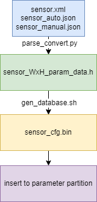

# K230 VICAP SENSOR Parameter Partition Reference


Copyright 2023 Canaan Inc. ©

<div style="page-break-after:always"></div>

## Disclaimer

The products, services or features you purchase should be subject to Canaan Inc. ("Company", hereinafter referred to as "Company") and its affiliates are bound by the commercial contracts and terms and conditions of all or part of the products, services or features described in this document may not be covered by your purchase or use. Unless otherwise agreed in the contract, the Company does not provide any express or implied representations or warranties as to the correctness, reliability, completeness, merchantability, fitness for a particular purpose and non-infringement of any statements, information, or content in this document. Unless otherwise agreed, this document is intended as a guide for use only.

Due to product version upgrades or other reasons, the content of this document may be updated or modified from time to time without any notice.

## Trademark Notice

, "Canaan" and other Canaan trademarks are trademarks of Canaan Inc. and its affiliates. All other trademarks or registered trademarks that may be mentioned in this document are owned by their respective owners.

**Copyright 2023 Canaan Inc.. © All Rights Reserved.**
Without the written permission of the company, no unit or individual may extract or copy part or all of the content of this document without authorization, and shall not disseminate it in any form.

<div style="page-break-after:always"></div>

## Directory

[TOC]

## preface

### Overview

This document mainly guides image tuning and application developers how to create VICAP debugging parameter files for use in SPI-NOR-FLASH mode.

### Reader object

This document (this guide) is intended primarily for:

- Technical Support Engineer
- Software Development Engineer
- Image tuning engineer

### Definition of acronyms

| abbreviation | illustrate |
|------|------|
|      |      |

### Revision history

| Document version number | Modify the description                                                                                                                                   | Author        | date      |
|------------|--------------------------------------------------------------------------------------------------------------------------------------------|---------------|-----------|
| V1.0       | Initial edition                                                                                                                                       | Guo Shidong        | 2023/10/07  |

## 1. Overview

### 1.1 Overview

In the process of real-time processing of the signal output by the sensor, the tuning parameters and calibration parameters play a key role in the ISP processing method and the restoration and enhancement of the image. By default, calibration xml, auto json, and manual json files are used as tuning parameters and calibration parameter configurations imported by VICAP runtime. In the fast startup mode, the default parameter import method is time-consuming, so it provides a scheme for importing configuration parameters by parameter partition.

This document describes how to create a parameter partition and how VICAP uses it.

## 2. Production process reference

### 2.1 Flowchart

The production flow chart is as follows:



Figure 2-1 Parameter partition production flowchart

The production steps are as follows:

- [Step 1: Convert the header file](#221-convert-header-files)
- [Step 2: Convert the binary](#222-converting-binaries)
- [Step 3: How to use it](#223-usage)
- [Precautions](#224-precautions)

### 2.2 Production steps

#### 2.2.1 Convert header files

Take senosr: IMX335, resolution: 2592x1944 as an example

Copy the parameter file to the directory where the conversion header file

```shell
cp k230_sdk/src/big/mpp/userapps/src/sensor/config/imx335-2592x1944.xml k230_sdk/src/big/mpp/userapps/src/vicap/src/isp/sdk/t_frameworks/t_database_c/calibration_data/
cp k230_sdk/src/big/mpp/userapps/src/sensor/config/imx335-2592x1944_auto.json k230_sdk/src/big/mpp/userapps/src/vicap/src/isp/sdk/t_frameworks/t_database_c/calibration_data/
cp k230_sdk/src/big/mpp/userapps/src/sensor/config/imx335-2592x1944_manual.json k230_sdk/src/big/mpp/userapps/src/vicap/src/isp/sdk/t_frameworks/t_database_c/calibration_data/
```

Jump to the conversion operation directory (tool source code and script storage directory)

```shell
cd k230_sdk/src/big/mpp/userapps/src/vicap/src/isp/sdk/t_frameworks/t_database_c/calibration_data/
```

Execute the Convert Header File Tool *parse_convert.py* to parse and convert the copied three configuration files into a single parameter header file (Python 3.x is recommended by the conversion tool).


```shell
python parse_convert.py -s imx335 -x imx335-2592x1944.xml -a imx335-2592x1944_auto.json -m imx335-2592x1944_manual.json > imx335_2592x1944_param_data.h
```

```c
#ifndef __IMX335_CALIBRATION_H__
#define __IMX335_CALIBRATION_H__

#include "isp_database.h"
#include "k_autoconf_comm.h"
static const TUNING_PARAM_T database_tuning_param =
{
    /* calib data */
    ...
    /* auto data */
    ...
    /* manual data */
    ...
    /* dewarp data */
    ...
    /* version_info */
}
#endif
```

After conversion, you will get the structure above, which consists of five parts:

Calib Data, Auto Data, and Manual Data are generated by externally specified configuration file parse

Dewarp data needs to be replaced in the structure according to the actual configuration, refer to[Dewarp parameter configuration](#2224-dewarp-parameter-configuration)

Version Info is automatically generated for the transformation tool, describing the sensor name and creation date

#### 2.2.2 Converting binaries

The binary file is composed of four files: header, configuration parameters, padding, and dewarp parameters, considering the actual allocation size of parameter partitions, it is recommended to add up to three sets of configuration files

- [Step 1: Header creation](#2221-header-creation)
- [Step 2: Configure the parameter binary file creation](#2222-configuration-parameter-binary-file-creation)
- [Step 3: Pad the file production](#2223-padding-file)
- [Step 4: Configure the dewarp parameters](#2224-dewarp-parameter-configuration)
- [Step 5: Merge the files](#2225-merge-files)
- [Other: Scripted production method (recommended)](#2226-punching-into-the-parameter-partition)

##### 2.2.2.1 Header creation

Modify the definitions of *FILENAME_00, FILENAME_01 and FILENAME_02* in *gen_database_param_bin_calib_header.c* as follows:

```c
#define FILENAME_00 "imx335-2592x1944"
#define FILENAME_01 "ov9732-1280x720"
#define FILENAME_02 "ov9286-1280x720"
```

If the configuration of IMX335-2592x1944 is IMX335 and the resolution is 2592x1944, the FILENAME_0X is modified to "IMX335-2592x1944" , the definition will be used as the check header when using parameter partitioning, if the check header does not match, it will be read by default using the configuration file loading method, and the corresponding warning prompt will be printed in the log, and the name of the check header definition is unique and cannot be repeated.

Three sets of check headers can be added, once the order is fixed, the order of parameter partitions also needs to be synchronized with the check header, and the synchronization method refers to the[binary file](#2222-configuration-parameter-binary-file-creation) made later.

After modifying the definition, compile the source code into an executable program and execute it, resulting in header: sensor_cfg_calib_header.bin

```shell
gcc -o main_header gen_database_param_bin_calib_header.c
./main_header
# obtained sensor_cfg_calib_header.bin
```

##### 2.2.2.2 Configuration parameter binary file creation

Modify the *DATABASE_SELECT* definition in *gen_database_param_bin.c* to make different configuration binaries by passing in different parameters at external compilation time, as shown in the following example:

```c
#if DATABASE_SELECT == 0
#include "imx335_2592x1944_param_data.h"
#elif DATABASE_SELECT == 1
#include "ov9732_param_data.h"
#elif DATABASE_SELECT == 2
#include "ov9286_param_data.h"
// will append new header file to convert bin, you can make DATABASE_SELECT++, build need add flag "-DDATABASE_SELECT=?, ?:0, 1, 2..."
#endif
```

The number of the *DATABASE_SELECT* determines the order in which the different sensor configuration parameters are arranged, and this order needs to be synchronized with the order of the headers. In the example imx335_2592x1944_param_data.h, ov9732_param_data.h, and ov9286_param_data.h are generated by three sets of XML JSON.

Compile the source code and execute

```shell
DATABASE_CURRENT_DIR=$PWD
DATABASE_CFLAGS="-I$DATABASE_CURRENT_DIR/../include \
 -I$DATABASE_CURRENT_DIR/../../t_common_c/include/  \
 -I$DATABASE_CURRENT_DIR/../../t_json_c/include/    \
 -I$DATABASE_CURRENT_DIR/../../t_mxml_c/mxml-3.3.1/ \
 -I$DATABASE_CURRENT_DIR/../../../../../../../../../include/comm"
gcc -o main_01 gen_database_param_bin.c $DATABASE_CFLAGS -DDATABASE_SELECT=0
gcc -o main_02 gen_database_param_bin.c $DATABASE_CFLAGS -DDATABASE_SELECT=1
gcc -o main_03 gen_database_param_bin.c $DATABASE_CFLAGS -DDATABASE_SELECT=2
$DATABASE_CURRENT_DIR/main_01 0
$DATABASE_CURRENT_DIR/main_02 1
$DATABASE_CURRENT_DIR/main_03 2
# obtained sensor_cfg_00.bin(imx335)、sensor_cfg_01.bin(ov9732)、sensor_cfg_02.bin(ov9286)
```

Compile multiple executors and execute them, and the 0 1 2 arguments passed in at execution time are the ordinal numbers in the generated binary file names.

##### 2.2.2.3 padding file

The purpose of the padding file is to align the subsequent dewarp parameters for ease of use, and the padding length will change according to the total length of the header + parameter structure, which is automatically generated by the script.

##### 2.2.2.4 Dewarp parameter configuration

The basic parameters of the LUT table of DeWarp are defined in the parameter partition, and the LUT file corresponding to DeWarp can be correctly found when using the partition

```c
typedef struct {
    uint8_t has_lut;
    uint64_t lut_offset;
    uint8_t split_enable;
    uint16_t split_horizon_line;
    uint16_t split_vertical_line_up;
    uint16_t split_vertical_line_down;
} DEWARP_SPLIT_T;
```

has_lut: Whether there is a Dewarp lut file, this member is set to 0 to indicate that the DeWarp parameter is not required, and set to 1 to indicate that the DeWarp parameter is required

lut_offset: When the has_lut is set to 1, the member takes effect, and the value will correspond to the offset of the address of the dewarp parameter in the parameter partition, the specific calculation method is *parameter partition base address + header size + parameter structure size + padding size* , and the *parameter partition base address* is defined in *k_autoconf_comm.h* *CONFIG_MEM_SENSOR_CFG_BASE*, this definition varies depending on the hardware on which it is compiled. It can be calculated through *gen_database.sh* script provided by the SDK and printed when executed:


Figure 2-2 The parameter partition automatically calculates the dewarp offset

split_enable: The default setting is 0

split_horizon_line: Default 8191

split_vertical_line_up: Default 8191

split_vertical_line_down: Default 8191

The dewarp parameter file needs to specify the path in the script, see below

Examples are shown when using Dewarp and when not using DeWarp

```c
// use dewarp configuration
/* dewarp data */
{
    /* has_lut */
    1,
    /* lut_offset */
    CONFIG_MEM_SENSOR_CFG_BASE + 426528, // 426528: calc from the script
    /* split_enable */
    0,
    /* split_horizon_line */
    8191,
    /* split_vertical_line_up */
    8191,
    /* split_vertical_line_down */
    8191,
},

// not use dewarp configuration
/* dewarp data */
{
    /* has_lut */
    0,
    /* lut_offset */
    0,
    /* split_enable */
    0,
    /* split_horizon_line */
    8191,
    /* split_vertical_line_up */
    8191,
    /* split_vertical_line_down */
    8191,
},

```

##### 2.2.2.5 Merge files

The documents produced through 2.2.2.1 - 2.2.2.4 are as follows:
| **File name**| **Description**                       |
|------------|--------------------------------|
| sensor_cfg_calib_header.bin | header file    |
| sensor_cfg_0X.bin           | Configuration parameter file  |
| padding.bin                 | Files used for alignment|
| imx335-2592x1944.bin        | Dewarp parameter file, and refer to the Dewarp User Guide for the generation method|

Combine the above files to get the binary sensor_cfg.bin that is finally used for parameter partitioning **

```shell
cat sensor_cfg_calib_header.bin \
    sensor_cfg_00.bin sensor_cfg_01.bin \
    sensor_cfg_02.bin \
    padding.bin \
    ../../../../../../../sensor/dewarp/imx335-2592x1944.bin > sensor_cfg.bin
```

In order, the last merged file is the dewarp parameter file generated in k230_sdk/src/big/mpp/userapps/src/sensor/dewarp, if you add a new dewarp parameter file, you can append it at the end in order.

##### 2.2.2.6 Scripting binary files

The SDK provides semi-automated scripts for the concatenation process 2.2.2.1 - 2.2.2.5 named *gen_database.sh*, and users can directly compile the SDK by executing the source code definition of header, dewarp, and parameter parsing after completing the source code definition of header, dewarp, and parameter parsing.

```shell
#!/bin/sh
DATABASE_CURRENT_DIR=$PWD
DATA_SAVE_PATH=../../../../../../../../../../../../tools/gen_image_cfg/data/
DATABASE_CFLAGS="-I$DATABASE_CURRENT_DIR/../include \
 -I$DATABASE_CURRENT_DIR/../../t_common_c/include/  \
 -I$DATABASE_CURRENT_DIR/../../t_json_c/include/    \
 -I$DATABASE_CURRENT_DIR/../../t_mxml_c/mxml-3.3.1/ \
 -I$DATABASE_CURRENT_DIR/../../../../../../../../../include/comm"

# DATABASE_SELECT 0: imx335 2592x1944, 1: ov9732 1280x720, 2: ov9286 1280x720, ...
echo -n

gcc -o main_01 gen_database_param_bin.c $DATABASE_CFLAGS -DDATABASE_SELECT=0
gcc -o main_02 gen_database_param_bin.c $DATABASE_CFLAGS -DDATABASE_SELECT=1
gcc -o main_03 gen_database_param_bin.c $DATABASE_CFLAGS -DDATABASE_SELECT=2

gcc -o main_header gen_database_param_bin_calib_header.c

$DATABASE_CURRENT_DIR/main_header
$DATABASE_CURRENT_DIR/main_01 0
$DATABASE_CURRENT_DIR/main_02 1
$DATABASE_CURRENT_DIR/main_03 2

rm $DATABASE_CURRENT_DIR/main_header
rm $DATABASE_CURRENT_DIR/main_01
rm $DATABASE_CURRENT_DIR/main_02
rm $DATABASE_CURRENT_DIR/main_03

FILE_LENGTH=$(wc -c < sensor_cfg_calib_header.bin)
FILE_LENGTH=$(expr $FILE_LENGTH + $(wc -c < sensor_cfg_00.bin))
FILE_LENGTH=$(expr $FILE_LENGTH + $(wc -c < sensor_cfg_01.bin))
FILE_LENGTH=$(expr $FILE_LENGTH + $(wc -c < sensor_cfg_02.bin))
PADDING_LENGTH=$(expr 16 - $FILE_LENGTH % 16)
dd if=/dev/zero of=padding.bin bs=1 count=$PADDING_LENGTH
echo "The first LUT offset is "$(expr $PADDING_LENGTH + $FILE_LENGTH)

cat sensor_cfg_calib_header.bin\
    sensor_cfg_00.bin sensor_cfg_01.bin\
    sensor_cfg_02.bin\
    padding.bin\
    ../../../../../../../sensor/dewarp/imx335-2592x1944.bin > sensor_cfg.bin
```

##### 2.2.2.6 Punching into the parameter partition

After the binary file is made, you need to put the file in the parameter partition storage location, which is completed by the SDK compilation script, and does not require users to operate by themselves. You only need to make a file in k230_sdk/src/big/mpp/userapps/src/vicap/src/isp/sdk/t_frameworks/t_database_c/calibration_data/.

#### 2.2.3 Usage

After completing the correct production process, it is used through the API provided by VICAP

【Description】ViCap parses the mode of configuration parameters

【Definition】

```c
typedef enum {
    VICAP_DATABASE_PARSE_XML_JSON = 0,
    VICAP_DATABASE_PARSE_HEADER = 1,
} k_vicap_database_parse_mode;
```

【Members】

| **Member name**                       | value   | **Description**                    |
|------------------------------------| ---- |-----------------------------|
| VICAP_DATABASE_PARSE_XML_JSON      | 0    | Use XML, Auto JSON, Manual JSON modes|
| VICAP_DATABASE_PARSE_HEADER        | 1    | Use the parameter partition loading mode  |

【Note】
Only 0 and 1 are internally validated, and other values are invalid

【Note】vicap sets the parameter loading mode

【Description】

According to the dev_num, set the default value of different vicap devices to load ISP parameters, which is 0

【Syntax】

k_s32 kd_mpi_vicap_set_database_parse_mode(k_vicap_dev dev_num, k_vicap_database_parse_mode parse_mode)

【Parameters】

| **Parameter name** | **Description**       | **Input/output** |
|--------------|----------------|---------------|
| dev_num      | VICAP device number    | input          |
| parse_mode   | Parameter loading mode   | input          |

【Return value】

| **Return value** | **Description**               |
|------------|------------------------|
| positive value       | Succeed. Returns the device descriptor   |
| Negative       | Failed, refer to Error Code Definition. |

【Differences】

None.

【Requirement】

- Header file: mpi_vicap_api.h
- Library file: libvicap.a

【Note】

The call needs to be completed before kd_mpi_vicap_init

【Example】

```c
typedef enum {
    VICAP_DEV_ID_0 = 0,
    VICAP_DEV_ID_1 = 1,
    VICAP_DEV_ID_2 = 2,
    VICAP_DEV_ID_MAX,
} k_vicap_dev;

int ret = 0;
k_vicap_dev vicap_dev = VICAP_DEV_ID_0;
ret = kd_mpi_vicap_set_database_parse_mode(vicap_dev, VICAP_DATABASE_PARSE_HEADER);
if (ret) {
    printf("kd_mpi_vicap_set_database_parse_mode failed, %d\n", ret);
    return ret;
}
```

#### 2.2.4 Precautions

1. When generating the parameter header file, the structure of dewarp is the default value, which needs to be filled in according to the actual situation, and the offset value is calculated, and the offset value can be automatically calculated by executing *gen_database.sh* , and the corresponding position is filled in after calculation
1. *gen_database_param_bin.c* Decide which set of header files to include and make them into parameter files based on the value of the compilation option definition *gcc -D DATABASE_SELECT*, in the same order as the sequence numbers defined in the header
1. The parameter partitioning function is currently only available in SPI NOR Flash mode, and other modes have no parameter partitioning and cannot be used even if loaded
1. The definition format of the *FILENAME_0X* in the header production source code is: *sensor_name-width x height*, the header will be verified when used inside VICAP, and the check header is generated by splicing inside VICAP for comparison, and the format of the check header is *sensor_name-input_widthxinput_height* used in the driver configuration
1. The conversion tool matches the calibrated XML, Auto JSON, Manual JSON, and VICAP versions, and different versions are not compatible
1. When using parameter partitioning, VICAP will check the parameter partition according to the currently used sensor configuration and the set parsing mode, and when the verification is successful, it will take out the set of parameters for loading without additional user settings. When the check header comparison fails, it automatically switches back to the default configuration parameter parse mode
