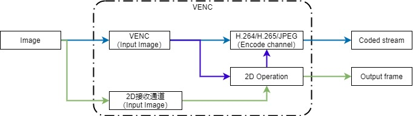
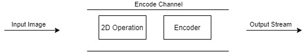
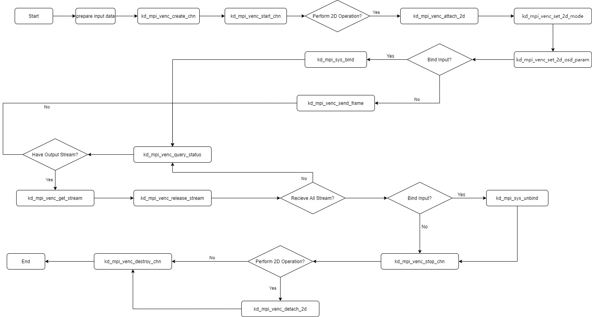
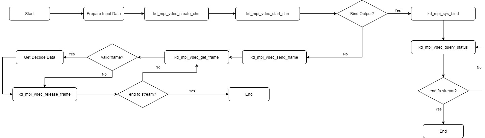

# K230 video codec API reference

Copyright 2023 Canaan Inc. ©

## Disclaimer

The products, services or features you purchase should be subject to Canaan Inc. ("Company", hereinafter referred to as "Company") and its affiliates are bound by the commercial contracts and terms and conditions of all or part of the products, services or features described in this document may not be covered by your purchase or use. Unless otherwise agreed in the contract, the Company does not provide any express or implied representations or warranties as to the correctness, reliability, completeness, merchantability, fitness for a particular purpose and non-infringement of any statements, information, or content in this document. Unless otherwise agreed, this document is intended as a guide for use only.

Due to product version upgrades or other reasons, the content of this document may be updated or modified from time to time without any notice.

## Trademark Notice

, "Canaan" and other Canaan trademarks are trademarks of Canaan Inc. and its affiliates. All other trademarks or registered trademarks that may be mentioned in this document are owned by their respective owners.

**Copyright 2023 Canaan Inc.. © All Rights Reserved.**
Without the written permission of the company, no unit or individual may extract or copy part or all of the content of this document without authorization, and shall not disseminate it in any form.

## contents

[TOC]

## Preface

### Overview

This document describes the functions and usage of the video codec module.

### Reader object

This document (this guide) is intended primarily for:

- Technical Support Engineer
- Software Development Engineer

### Definition of acronyms

| abbreviation | illustrate |
|------|------|
|      |      |
|      |      |

### Revision history

| Document version number | Author | date | Modify the description |
|---|---|---|---|
| V1.0       |Yan Cui | 2023.03.10 | Init edition  |
| V1.1       |Yan Cui | 2023.03.31 | 1. Add 2D setting/acquisition operation mode interface kd_mpi_venc_set_2d_mode, kd_mpi_venc_get_2d_mode 2. Modify 2D parameter setting/acquisition interface, kd_mpi_venc_set_2d_osd_param, kd_mpi_venc_get_2d_osd_param 3. Added interface for setting image format conversion coefficient in 2D operation kd_mpi_venc_set_2d_set_custom_coef 4. kd_mpi_venc_set_2d_set_custom_coef delete the pic_format properties in the encoder property structure k_venc_attr |
| V1.1.1     |Yan Cui | 2023.04.11 |1. Added encoding image rotation setting/acquisition interface  kd_mpi_venc_set_rotaion, kd_mpi_venc_get_rotaion 2. Added 2D frame property setting/acquisition interface kd_mpi_venc_set_2d_border_param. kd_mpi_venc_get_2d_border_param 3. Delete the 2D operation attribute structure`k_venc_2d_attr` 4. Add OSD background layer format description 5. Add some MAPI function interfaces and data types, referenct to Section 4 MAPI. |
| V1.2       |Yan Cui | 2023.04.27 | 1. Modify the linewidth parameter of the 2D frame structure k_venc_2d_border_attr 2. Modify the 2D User-Defined Conversion coefficient API name as kd_mpi_venc_set_2d_custom_coef 3. Modify the conversion factor parameter type for the kd_mpi_venc_set_2d_custom_coef. 4. Add the interface to obtain the conversion coefficient kd_mpi_venc_get_2d_custom_coef 5. Add gamut settings and get interface kd_mpi_venc_set_2d_color_gamut, kd_mpi_venc_get_2d_color_gamut 6. Modify the rotation angle parameters of the kd_mpi_venc_set_rotaion. 7. Modify the input format of JPEG in the video encoding function description |
| V1.2.1     |Yan Cui | 2023-04-28 | 1. Add GOP attribute to k_venc_chn_attr |
| V1.2.2     |Yan Cui | 2023-05-24 | 1. Add image flipping settings/acquisition interface kd_mpi_venc_set_mirror, kd_mpi_venc_get_mirror 2. Added IDR frame enable interface kd_mpi_venc_enable_idr |
| V1.3       |Yan Cui |  2023-05-25  | 1. Add IDR frame enable interface kd_mapi_venc_request_idr in mapi|
| V1.3.1       |Yan Cui |  2023-06-14  | 1. Add MPI to set the decoding downscale. kd_mpi_vdec_set_downscale |
| V1.3.2       |Yan Cui |  2023-06-19  | 1. Modification kd_mapi_venc_request_idr 2. Add kd_mpi_venc_request_idr, kd_mapi_venc_enable_idr 3. Add H.265 SAO settings and obtain interface kd_mpi_venc_set_h265_sao, kd_mpi_venc_get_h265_sao 4. Add deblocking setting/getting interface kd_mpi_venc_set_dblk, kd_mpi_venc_get_dblk 5. Add ROI interface kd_mpi_venc_set_roi_attr and kd_mpi_venc_get_roi_attr |
| V1.3.3       |Yan Cui |  2023-06-20  | 1. Add H.264/H.265 entropy coding mode setting/obtain interface kd_mpi_venc_set_h264_entropy, kd_mpi_venc_get_h264_entropy, kd_mpi_venc_set_h265_entropy, kd_mpi_venc_get_h265_entropy 2. Rename enumeration k_venc_rotation as k_rotation 3. Add decoding rotation setting interface kd_mpi_vdec_set_rotation |
| V1.3.4 |Yan Cui | 2023-06-30 | Modify codec and 2D supported data types |

## 1. Overview

### 1.1 Overview

Video codec module, support H.264, H.265, JPEG codec. The VENC module implements 2D arithmetic and encoding functions, both of which can be enabled simultaneously or separately. The VDEC module implements the decoding function.

VENC, VENC+2D, and VDEC support system binding, and system binding is not supported when 2D is operated alone.

### 1.2 Function Description

#### 1.2.1 Video Coding

Figure 1-1 Encoding data flow diagram

A typical encoding process includes the reception of the input image, the overlay of the image content, the encoding of the image, and the output of the code stream.

The coding module is composed of VENC receiving channel, coding channel, 2D receiving channel and 2D operation module. The coding power and 2D computing power are shown in the table below.

The path shown by the green arrow in the encoded data flow diagram is a separate 2D operation. The path shown by the blue arrow is the flow of separate encoding operations. The path shown by the purple arrow is the process of doing 2D operations before coding.

Table 1-1 Coding capabilities

| | H264 | HEVC | JPEG |
|---|---|---|---|
| Input format | YUV420 NV12 8bit, ARGB8888, BGRA8888 | YUV420 NV12 8bit, ARGB8888, BGRA8888 | YUV420 NV12 8bit, YUV422 UYVY 8bit, ARGB8888, BGRA8888 |
| Output format | YUV420 H.264 Baseline Profile(BP) ; H.264 Main Profile(MP) ; H.264 High Profile(HP);  H.264 High 10 Profile(HP) | YUV420 HEVC (H.265) Main ; HEVC (H.265) Main 10 Profile | YUV420 and YUV422 JPEG baseline sequential |
| Maximum resolution | 3840x2160 | 3840x2160 | 8192x8192 |
| Bitrate control mode | CBR/VBR/FIXQP | CBR/VBR/FIXQP | FIXQP |
| GOP | I/P frames | I/P frames | - |
| Encode the channel | 4-way | 4-way | 4-way |

Note: H264/HEVC/JPEG share 4 channels.

Table 1-2 2D computing capabilities

| Video input format | Video output format | Overlay data format | Maximum resolution |
|---|---|---|---|
| I420/NV12/ARGB8888/BGRA8888 | Same input format | ARGB8888/ARGB4444/ARGB1555 | 3840x2160  |

##### 1.2.1.1 Encoded channels

The encoding channel is the basic container that holds multi user settings for the encoding channel and manages multi internal resources of the encoding channel. The encoding channel completes the function of image overlay and encoding. The 2D module realizes image overlay operations and the encoder module realizes image encoding, and they separately or in cooperation.

Figure 1-2 Encoding channel

##### 1.2.1.2 Bitrate control

The bitrate controller controls the encoding bitrate.

From the perspective of informatics, the lower the compression ratio of the image, the higher the quality of the compressed image; the higher the compression ratio of the image, the lower the quality of the compressed image. In the case of scene changes, the encoding code rate will fluctuate greatly if the image quality is stable, and if the encoding code rate is stable, the image quality will fluctuate greatly.

H264/H265 encoding supports three bitrate control modes: CBR, VBR and FIXQP three bitrate control modes.

MJPEG only supports FIXQP mode.

###### 1.2.1.2.1 CBR

(Constant Bit Rate) A fixed bit rate. That is, the coding bitrate is guaranteed to be stable during the bitrate statistics time.

###### 1.2.1.2.2 VBR

VBR (Variable Bit Rate) variable bit rate, that is, allows the encoding bit rate to fluctuate during the bitrate statistical time, so as to ensure the smooth quality of the encoded image.

###### 1.2.1.2.3 FIXQP

FIXQP fixed QP value. During the bitrate statistics time, all macroblock QP values of the encoded images are the same, and the QP values set by the user are used.

##### 1.2.1.3 GOP structure

This module only supports I-frames and P-frames

##### 1.2.1.4 2D operations

The 2D computing module can realize the OSD overlay of image data, and the OSD mode can realize 8 regions image overlay, and each region does not overlap. The supported OSD formats are: ARGB4444/ARGB1555/ARGB8888.

###### 1.2.1.4.1 Calculation of 2D conversion coefficients

During the OSD overlay operation, if the format of the input video is YUV, the OSD layer needs to convert RGB to YUV. The kernel state has a set of default conversion factors, and users can customize a set of 12-bit conversion factors if needed. The conversion coefficient is obtained by the conversion formula of RGB to YUV.

It is known that the conversion formula of RGB to YUV is as follows:

Then, the coefficient in the 3\*3 matrix is rounded to get the corresponding conversion coefficient after multiplying by 256, and the value in the 3\*1 matrix is the corresponding conversion coefficient.

Taking BT709 LIMITED as an example, the conversion formula of RGB-\>YUV is:

Y = 0.1826\*R + 0.6142\*G + 0.0620\*B + 16

SD = -0.1007\*R-0.3385\*G+0.4392\*B+128

V = 0.4392\*R - 0.3990\*G - 0.0402\*B + 128

The conversion factor is: { 47, 157, 16, 16, -26, -86, 112, 128, 112, -102, -10, 128 }

###### 1.2.1.4.2 Configuration of 2D conversion coefficients

The 2D conversion factor can be configured via the user-defined coefficient[interface kd_mpi_venc_set_2d_custom_coef](#2120-kd_mpi_venc_set_2d_custom_coef)and the color gamut configuration interface[kd_mpi_venc_set_2d_color_gamut](#2122-kd_mpi_venc_set_2d_color_gamut), either by selecting one of the two interfaces. If neither interface is called before the operation begins, the default coefficient is used for gamut conversion.

##### 1.2.1.5 Restrictions

Encoding operations have the following limitations:

1. If the input data format is YUV420, the physical start addresses of the image data of Y, U, and V components must be 4k aligned.
1. If the input data format is NV12, the physical start address of the image data needs to be 4k aligned with the image data for Y and UV data.

2D operations have the following limitations:

1. The physical start address of the source image as well as the destination image in the DDR should be guaranteed to be 8byte align.
1. Images, OSDs, and borders are only supported with even sizes.
1. The src and dst addresses of the video data in the overlay and frame operations must be the same.

The decoding operation has the following limitations:

1. The physical start address of each frame of input data requires 4K alignment.

##### 1.2.1.6 Examples of coding application

Figure 1-3 Flowchart of typical coding application

#### 1.2.2 Video decoding

Table 12 VPU decoding capabilities

| | H264 | HEVC | JPEG |
|:--|:--|:--|:--|
| Input format | H.264 Baseline; H.264 Main; H.264 High; H.264 High10; 支持interlaced stream | HEVC (H.265) Main/Main10 | JPEG, baseline sequential |
| Output format | YUV420 NV12 | YUV420 NV12 | YUV422 UYVY, YUV420 NV12 |
| Decoding channel | 4-way | 4-way | 4-way |

Note: H264/HEVC/JPEG share 4 channels.

VDEC supports streaming mode:

- Streaming (K_VDEC_SEND_MODE_STREAM): Users can send any length of code stream to the decoder each time, and the decoder completes the identification process of one frame code stream internally. It should be noted that for H.264/H.265, the end of the current frame stream can only be recognized when the next frame stream is received, so in this transmit mode, enter a frame of H.264/H.265 stream, and you cannot expect to start decoding the image immediately.

##### 1.2.2.1 Examples of decoding applications

Figure 1-3 Flowchart of typical coding application scenarios

## 2. API Reference

### 2.1 Video Coding

This function module provides the following APIs:

- [kd_mpi_venc_create_chn](#211-kd_mpi_venc_create_chn): Create an encoding channel.
- [kd_mpi_venc_destory_chn](#212-kd_mpi_venc_destory_chn):Destory an encoding channel.
- [kd_mpi_venc_start_chn](#213-kd_mpi_venc_start_chn): Turn on the encoding channel to receive the input image.
- [kd_mpi_venc_stop_chn](#214-kd_mpi_venc_stop_chn): Stop the encoding channel from receiving the input image.
- [kd_mpi_venc_query_status](#215-kd_mpi_venc_query_status): Query the encoding channel status.
- [kd_mpi_venc_get_stream](#216-kd_mpi_venc_get_stream): Obtain the encoded code stream.
- [kd_mpi_venc_release_stream](#217-kd_mpi_venc_release_stream):Release encodeing frame.
- [kd_mpi_venc_send_frame](#218-kd_mpi_venc_send_frame): Support users to send raw images for encoding.
- [kd_mpi_venc_set_rotaion](#219-kd_mpi_venc_set_rotaion): Set the encoded image rotation angle.
- [kd_mpi_venc_get_rotaion](#2110-kd_mpi_venc_get_rotaion): Gets the rotation angle of the encoded image.
- [kd_mpi_venc_set_mirror](#2111-kd_mpi_venc_set_mirror): Set the encoded image rotation angle.
- [kd_mpi_venc_get_mirror](#2112-kd_mpi_venc_get_mirror): Get the encoded image flip method.
- [kd_mpi_venc_enable_idr](#2113-kd_mpi_venc_enable_idr)to generate IDR frames based on GOP intervals.
- [kd_mpi_venc_set_2d_mode](#2114-kd_mpi_venc_set_2d_mode): Set the 2D calculation mode.
- [kd_mpi_venc_get_2d_mode](#2115-kd_mpi_venc_get_2d_mode): Get the 2D operation mode.
- [kd_mpi_venc_set_2d_osd_param](#2116-kd_mpi_venc_set_2d_osd_param): Set the region properties of the OSD in 2D operations.
- [kd_mpi_venc_get_2d_osd_param](#2117-kd_mpi_venc_get_2d_osd_param): Get the region attribute of the OSD specified in the 2D operation.
- [kd_mpi_venc_set_2d_border_param](#2118-kd_mpi_venc_set_2d_border_param): Set the frame properties in 2D operations.
- [kd_mpi_venc_get_2d_border_param](#2119-kd_mpi_venc_get_2d_border_param): Get the frame properties in 2D operations.
- [kd_mpi_venc_set_2d_custom_coef](#2120-kd_mpi_venc_set_2d_custom_coef): Set the image format conversion coefficient in 2D operations.
- [kd_mpi_venc_get_2d_custom_coef](#2121-kd_mpi_venc_get_2d_custom_coef): Get the image format conversion coefficient in 2D operation.
- [kd_mpi_venc_set_2d_color_gamut](#2122-kd_mpi_venc_set_2d_color_gamut): Set the color gamut for 2D operations.
- [kd_mpi_venc_get_2d_color_gamut](#2123-kd_mpi_venc_get_2d_color_gamut): Get the color gamut of 2D operations
- [kd_mpi_venc_attach_2d](#2124-kd_mpi_venc_attach_2d): Attach 2D operations with venc.
- [kd_mpi_venc_detach_2d](#2125-kd_mpi_venc_detach_2d): Detach 2D operations from venc.
- [kd_mpi_venc_send_2d_frame](#2126-kd_mpi_venc_send_2d_frame): Send a frame of data to the 2D module.
- [kd_mpi_venc_get_2d_frame](#2127-kd_mpi_venc_get_2d_frame): Get 2D calculation results.
- [kd_mpi_venc_start_2d_chn](#2128-kd_mpi_venc_start_2d_chn): Start the 2D channel to receive the input image.
- [kd_mpi_venc_stop_2d_chn](#2129-kd_mpi_venc_stop_2d_chn): Stop the 2D channel from receiving the input image.
- [kd_mpi_venc_request_idr](#2130-kd_mpi_venc_request_idr)and generate an IDR frame immediately after the call.
- [kd_mpi_venc_set_h265_sao](#2131-kd_mpi_venc_set_h265_sao): Set the Sao property of the H.265 channel.
- [kd_mpi_venc_get_h265_sao](#2132-kd_mpi_venc_get_h265_sao): Get the Sao properties of the H.265 channel.
- [kd_mpi_venc_set_dblk](#2133-kd_mpi_venc_set_dblk): Set the Deblocking enable of the protocol encoding channel.
- [kd_mpi_venc_get_dblk](#2134-kd_mpi_venc_get_dblk): Gets the deblocking status of the protocol encoding channel.
- [kd_mpi_venc_set_roi_attr](#2135-kd_mpi_venc_set_roi_attr): Set the ROI properties of H.264/H.265 channels.
- [kd_mpi_venc_get_roi_attr](#2136-kd_mpi_venc_get_roi_attr): Obtain the ROI properties of H.264/H.265 channels.
- [kd_mpi_venc_set_h264_entropy](#2137-kd_mpi_venc_set_h264_entropy): Set the entropy encoding mode of the H.264 protocol encoding channel.
- [kd_mpi_venc_get_h264_entropy](#2138-kd_mpi_venc_get_h264_entropy): Get the entropy encoding mode of the H.264 protocol encoding channel.
- [kd_mpi_venc_set_h265_entropy](#2139-kd_mpi_venc_set_h265_entropy): Set the entropy encoding mode of the H.265 protocol encoding channel.
- [kd_mpi_venc_get_h265_entropy](#2140-kd_mpi_venc_get_h265_entropy): Get the entropy encoding mode of the H.265 protocol encoding channel.

#### 2.1.1 kd_mpi_venc_create_chn

【Description】

Create an encoding channel.

【Syntax】

k_s32 kd_mpi_venc_create_chn(k_u32 chn_num, const [k_venc_chn_attr](#3115-k_venc_chn_attr) \*attr);

【Parameters】

| Parameter name | description | Input/output |
|---|---|---|
| chn_num  | Encode channel information. Value range: [0, [VENC_MAX_CHN_NUM](#311-venc_max_chn_num)]. | input      |
| attr     | Encodes the channel property pointer.                                                   | input      |

【Return value】

| Return value | description |
|---|---|
| 0      | Succeed.                        |
| Non-0    | Failed, see[Error codes](#error codes). |

【Differences】

None.

【Requirement】

- Header files: mpi_venc_api.h, k_type.h, k_module.h, k_sys_comm.h, k_venc_comm.h
- Library file: libvenc.a

【Note】

- The encoder supported channel widths and heights as shown in the following table:

| H.264/H.265 | JPEG   |       |        |      |     |      |     |
|-------------|--------|-------|--------|------|-----|------|-----|
| WIDTH       | HEIGHT | WIDTH | HEIGHT |      |     |      |     |
| MAX         | MIN    | MAX   | MIN    | MAX  | MIN | MAX  | MIN |
| 4096        | 128    | 4096  | 64     | 8192 | 128 | 8192 | 64  |

【Example】

None.

【See Also】

None.

#### 2.1.2 kd_mpi_venc_destory_chn

【Description】

Destroy the encoding channel.

【Syntax】

k_s32 kd_mpi_venc_destory_chn(k_u32 chn_num);

【Parameters】

| Parameter name | description | Input/output |
|---|---|---|
| chn_num  | Encode channel number. Value range: [0, [VENC_MAX_CHN_NUM](#311-venc_max_chn_num)]. | input      |

【Return value】

| Return value | description                          |
|---|---|
| 0      | Succeed.                        |
| Non-0    | Failed, see[Error codes](#5-error codes). |

【Differences】

None.

【Requirement】

- Header files: mpi_venc_api.h, k_type.h, k_module.h, k_sys_comm.h, k_venc_comm.h
- Library file: libvenc.a

【Note】

- If will return fails if not stop receiving images before destroying.

【Example】

None.

【See Also】

[kd_mpi_venc_stop_chn](#214-kd_mpi_venc_stop_chn)

#### 2.1.3 kd_mpi_venc_start_chn

【Description】

Start encoding channel to receive the input image.

【Syntax】

k_s32 kd_mpi_venc_start_chn(k_u32 chn_num);

【Parameters】

| Parameter name | description | Input/output |
|---|---|---|
| chn_num | Encode channel number. Value range: [0, [VENC_MAX_CHN_NUM](#311-venc_max_chn_num)]. | input |

【Return value】

| Return value | description                          |
|--------|-------------------------------|
| 0      | Succeed.                        |
| Non-0    | Failed, see[Error codes](#5-error codes). |

【Differences】

None.

【Requirement】

- Header files: mpi_venc_api.h, k_type.h, k_module.h, k_sys_comm.h, k_venc_comm.h
- Library file: libvenc.a

【Note】

- If the channel is not created, the failed K_ERR_VENC_UNEXIST is returned.
- If the channel has already started receiving images and  not stoped, call this interface again to receive specify the number of frames, will return operation is not allowed.
- Only after receiving is started, the encoder start receiving image encoding.

【Example】

None.

【See Also】

 kd_mpi_venc_create_chn[kd_mpi_venc_stop_chn](#214-kd_mpi_venc_stop_chn)

#### 2.1.4 kd_mpi_venc_stop_chn

【Description】

Stop the encoding channel from receiving the input image.

【Syntax】

k_s32 kd_mpi_venc_stop_chn(k_u32 chn_num);

【Parameters】

| Parameter name | description | Input/output |
|---|---|---|
| chn_num | Encode channel number. Value range: [0, [VENC_MAX_CHN_NUM](#311-venc_max_chn_num)]. | input |

【Return value】

| Return value | description                          |
|--------|-------------------------------|
| 0      | Succeed.                        |
| Non-0    | Failed, see[Error codes](#5-error codes). |

【Differences】

None.

【Requirement】

- Header files: mpi_venc_api.h, k_type.h, k_module.h, k_sys_comm.h, k_venc_comm.h
- Library file: libvenc.a

【Note】

- If the channel is not created, return fails.
- This interface does not determine whether the current reception is stopped, that is, it allows repeated stops without returning an error.
- This interface is used to stop receiving an image, it supports stop receiving images before the encoding channel is destroyed or reset.
- Calling this interface only stops receiving the original data encoding, and the stream buffer is not cleared.

【Example】

None.

【See Also】

[kd_mpi_venc_destory_chn](#212-kd_mpi_venc_destory_chn)

#### 2.1.5 kd_mpi_venc_query_status

【Description】

Query the encoding channel status.

【Syntax】

k_s32 kd_mpi_venc_query_status(k_u32 chn_num, [k_venc_chn_status](#3115-k_venc_chn_attr) \*status);

【Parameters】

| Parameter name | description | Input/output |
|---|---|---|
| chn_num  | Encode channel number. Value range: [0, [VENC_MAX_CHN_NUM](#311-venc_max_chn_num)]. | input |
| status   | pointer of the encoded channel status.                                                     | output |

【Return value】

| Return value | description |
|---|---|
| 0      | Succeed.                        |
| Non-0    | Failed, see[Error codes](#5-error codes). |

【Differences】

None.

【Requirement】

- Header files: mpi_venc_api.h, k_type.h, k_module.h, k_sys_comm.h, k_venc_comm.h
- Library file: libvenc.a

【Note】

- If the channel is not created, the return fails.

【Example】

None.

【See Also】

[kd_mpi_venc_create_chn](#211-kd_mpi_venc_create_chn)

#### 2.1.6 kd_mpi_venc_get_stream

【Description】

Get the encoded bitstream.

【Syntax】

k_s32 kd_mpi_venc_get_stream(k_u32 chn_num, [k_venc_stream](#3123-k_venc_stream) \*stream, k_s32 milli_sec);

【Parameters】

| Parameter name  | description | Input/output |
|---|---|---|
| chn_num | Encode channel number. Value range: [0, [VENC_MAX_CHN_NUM](#311-venc_max_chn_num)]. | input |
| stream    | Bitstream structure pointer. | output |
| milli_sec | Obtain the bitstream timeout period. Value range: [-1, +∞ ) -1: Blocking. 0: Non-blocking. Greater than 0: Timeout period | input |

【Return value】

| Return value | description                          |
|--------|-------------------------------|
| 0      | Succeed.                        |
| Non-0    | Failed, see[Error codes](#5-error codes). |

【Differences】

None.

【Requirement】

- Header files: mpi_venc_api.h, k_type.h, k_module.h, k_sys_comm.h, k_venc_comm.h
- Library file: libvenc.a

【Note】

- If the channel is not created, the return fails.
- If stream is empty, return the K_ERR_VENC_NULL_PTR.
- If the milli_sec is less than -1, the K_ERR_VENC_ILLEGAL_PARAM is returned.

【Example】

None.

【See Also】

 kd_mpi_venc_create_chn[kd_mpi_venc_start_chn](#213-kd_mpi_venc_start_chn)

#### 2.1.7 kd_mpi_venc_release_stream

【Description】

Release the bitstream buffer.

【Syntax】

k_s32 kd_mpi_venc_release_stream(k_u32 chn_num, [k_venc_stream](#3123-k_venc_stream) \*stream);

【Parameters】

| Parameter name | description | Input/output |
|---|---|---|
| chn_num  | Encode channel number. Value range: [0, [VENC_MAX_CHN_NUM](#311-venc_max_chn_num)]. | input |
| stream   | Bitstream structure pointer. | output |

【Return value】

| Return value | description |
|---|---|
| 0      | Succeed.                        |
| Non-0    | Failed, see[Error codes](#5-error codes). |

【Differences】

None.

【Requirement】

- Header files: mpi_venc_api.h, k_type.h, k_module.h, k_sys_comm.h, k_venc_comm.h
- Library file: libvenc.a

【Note】

- If the channel is not created, an error code K_ERR_VENC_UNEXIST is returned.
- If the stream is empty, the error code K_ERR_VENC_NULL_PTR is returned.

【Example】

None.

【See Also】

 kd_mpi_venc_create_chn[kd_mpi_venc_start_chn](#213-kd_mpi_venc_start_chn)

#### 2.1.8 kd_mpi_venc_send_frame

【Description】

Allows users to send raw images for encoding.

【Syntax】

k_s32 kd_mpi_venc_send_frame(k_u32 chn_num, k_video_frame_info \*frame, k_s32 milli_sec);

【Parameters】

| Parameter name  | description | Input/output |
|---|---|---|
| chn_num | Encode channel number. Value range: [0, [VENC_MAX_CHN_NUM](#311-venc_max_chn_num)]. | input |
| frame | Pointer to the original image information structure, refer to the K230 System Control API Reference. | input |
| milli_sec | Send image timeout. Value range: [-1,+∞ ) -1: Blocking. 0: Non-blocking. \> 0: Timeout. | input |

【Return value】

| Return value | description |
|---|---|
| 0      | Succeed.                        |
| Non-0    | Failed, see[Error codes](#5-error codes). |

【Differences】

None.

【Requirement】

- Header files: mpi_venc_api.h, k_type.h, k_module.h, k_sys_comm.h, k_venc_comm.h
- Library file: libvenc.a

【Note】

- This interface allows the user to send images to the encoding channel.
- If the milli_sec is less than -1, the K_ERR_VENC_ILLEGAL_PARAM is returned.
- To call this API to send an image, the user needs to ensure that the encoding channel has been created and the receiving input image is enabled.

【Example】

None.

【See Also】

(#211-kd_mpi_venc_create_chn)
 kd_mpi_venc_create_chn[kd_mpi_venc_start_chn](#213-kd_mpi_venc_start_chn)

#### 2.1.9 kd_mpi_venc_set_rotaion

【Description】

Set the encoded image rotation angle.

【Syntax】

k_s32 kd_mpi_venc_set_rotaion(k_u32 chn_num, const [k_rotation](#3112-k_rotation) rotation);

【Parameters】

| Parameter name | description | Input/output |
|---|---|---|
| chn_num  | Encode channel number. Value range[0, [VENC_MAX_CHN_NUM](#311-venc_max_chn_num)). | input |
| rotation | Rotation angle enumeration. | input      |

【Return value】

| Return value | description                          |
|--------|-------------------------------|
| 0      | Succeed.                        |
| Non-0    | Failed, an [error code](#5-error codes) is returned. |

【Differences】

None.

【Requirement】

- Header files: mpi_venc_api.h, k_type.h, k_module.h, k_sys_comm.h, k_venc_comm.h
- Library file: libvenc.a

【Note】

None.

【Example】

None.

【See Also】

None.

#### 2.1.10 kd_mpi_venc_get_rotaion

【Description】

Get the rotation angle of the encoded image.

【Syntax】

k_s32 kd_mpi_venc_get_rotaion(k_u32 chn_num, [k_rotation](#3112-k_rotation) \*rotation);

【Parameters】

| Parameter name | description | Input/output |
|---|---|---|
| chn_num  | Encode channel number. Value range: [0, [VENC_MAX_CHN_NUM](#311-venc_max_chn_num)). | input      |
| rotation | Rotation angle enumeration pointer.                                                   | output      |

【Return value】

| Return value | description                          |
|--------|-------------------------------|
| 0      | Succeed.                        |
| Non-0    | Failed, an [error code](#5-error codes) is returned. |

【Differences】

None.

【Requirement】

- Header files: mpi_venc_api.h, k_type.h, k_module.h, k_sys_comm.h, k_venc_comm.h
- Library file: libvenc.a

【Note】

None.

【Example】

None.

【See Also】

None.

#### 2.1.11 kd_mpi_venc_set_mirror

【Description】

Set the encoded image flip mode.

【Syntax】

k_s32 kd_mpi_venc_set_mirror(k_u32 chn_num, const [k_venc_mirror](#3113-k_venc_mirror) mirror);

【Parameters】

| Parameter name | description | Input/output |
|---|---|---|
| chn_num | Channel number. Value range: [0, VENC_MAX_CHN_NUM]. | input |
| mirror | Flip mode enumeration. | input |

【Return value】

| Return value | description |
|---|---|
| 0      | Succeed.                        |
| Non-0    | Failed, an [error code](#5-error codes) is returned. |

【Differences】

None.
【Requirement】

- Header files: mpi_venc_api.h, k_type.h, k_module.h, k_sys_comm.h, k_venc_comm.h
- Library file: libvenc.a

【Note】

None.
【Example】

None.
【See Also】

None.

#### 2.1.12 kd_mpi_venc_get_mirror

【Description】

Set the encoded image flip mode.
【Syntax】

| k_s32 kd_mpi_venc_get_mirror(k_u32 chn_num, [k_venc_mirror](#3113-k_venc_mirror) mirror);|

【Parameters】

| Parameter name | description | Input/output |
|---|---|---|
| chn_num | Channel number. Value range: [0, VENC_MAX_CHN_NUM]. | input |
| mirror | Flip mode enumeration. | output |

【Return value】

| Return value | description |
|---|---|
| 0      | Succeed.                        |
| Non-0    | Failed, an [error code](#5-error codes) is returned. |

【Differences】

None.
【Requirement】

- Header files: mpi_venc_api.h, k_type.h, k_module.h, k_sys_comm.h, k_venc_comm.h
- Library file: libvenc.a

【Note】

None.
【Example】

None.
【See Also】

None.

#### 2.1.13 kd_mpi_venc_enable_idr

【Description】

Set IDR frame enable.

【Syntax】

k_s32 kd_mpi_venc_enable_idr(k_u32 chn_num, const k_bool idr_enable);

【Parameters】

| Parameter name | description | Input/output |
|---|---|---|
| chn_num  | Encode channel number. Value range: [0,  [K_VENC_2D_MAX_CHN_NUM](#311-venc_max_chn_num)). | input |
| idr_enable | Whether IDR frames are enabled. 0: Not enabled. 1: Enable. | input |

【Return value】

| Return value | description                          |
|--------|-------------------------------|
| 0      | Succeed.                        |
| Non-0    | Failed, an [error code](#5-error codes) is returned. |

【Differences】

None.

【Requirement】

- Header files: mpi_venc_api.h, k_type.h, k_module.h, k_sys_comm.h, k_venc_comm.h
- Library file: libvenc.a

【Note】

- This API needs to be called after the encoding channel is created and before the encoding channel is started.

【Example】

None.

【See Also】

None.

#### 2.1.14 kd_mpi_venc_set_2d_mode

【Description】

Set the 2D calculation mode.

【Syntax】

k_s32 kd_mpi_venc_set_2d_mode(k_u32 chn_num, const [k_venc_2d_calc_mode](#318-k_venc_2d_calc_mode) mode);

【Parameters】

| Parameter name | description | Input/output |
|---|---|---|
| chn_num  | Encode channel number. Value range: [0,  [K_VENC_2D_MAX_CHN_NUM](#311-venc_max_chn_num)). | input |
| mode     | 2D arithmetic mode enumeration. | input |

【Return value】

| Return value | description |
|---|---|
| 0      | Succeed.                        |
| Non-0    | Failed, an [error code](#5-error codes) is returned. |

【Differences】

None.

【Requirement】

- Header files: mpi_venc_api.h, k_type.h, k_module.h, k_sys_comm.h, k_venc_comm.h
- Library file: libvenc.a

【Note】

- Currently, the arithmetic mode does not support K_VENC_2D_CALC_MODE_CSC mode.

【Example】

None.

【See Also】

None.

#### 2.1.15 kd_mpi_venc_get_2d_mode

【Description】

Get the 2D calculation mode.

【Syntax】

k_s32 kd_mpi_venc_get_2d_mode(k_u32 chn_num, [k_venc_2d_calc_mode](#318-k_venc_2d_calc_mode) \*fashion);

【Parameters】

| Parameter name | description | Input/output |
|---|---|---|
| chn_num  | Encode channel number. Value range: [0,  [K_VENC_2D_MAX_CHN_NUM](#311-venc_max_chn_num)). | input |
| mode     | 2D arithmetic mode enumerates pointers.                                                      | output |

【Return value】

| Return value | description                          |
|---|---|
| 0      | Succeed.                        |
| Non-0    | Failed, an [error code](#5-error codes) is returned. |

【Differences】

None.

【Requirement】

- Header files: mpi_venc_api.h, k_type.h, k_module.h, k_sys_comm.h, k_venc_comm.h

- Library file: libvenc.a

【Note】

- Currently, the arithmetic mode does not support K_VENC_2D_CALC_MODE_CSC mode.

【Example】

None.

【See Also】

None.

#### 2.1.16 kd_mpi_venc_set_2d_osd_param

【Description】

Set the region properties of the OSD in 2D operations.

【Syntax】

k_s32 kd_mpi_venc_set_2d_osd_param(k_u32 chn_num, k_u8 index, const [k_venc_2d_osd_attr](#3125-k_venc_2d_osd_attr) \*attr);

【Parameters】

| Parameter name | description | Input/output |
|---|---|---|
| chn_num  | Encode channel number. Value range: [0,  [K_VENC_2D_MAX_CHN_NUM](#311-venc_max_chn_num)). | input |
| index    | OSD区域索引。 取值范围:[0, [K_VENC_MAX_2D_OSD_REGION_NUM](#312-k_venc_max_2d_osd_region_num))。 | input |
| attr     | OSD property pointer.                                                                               | input |

【Return value】

| Return value | description                          |
|--------|-------------------------------|
| 0      | Succeed.                        |
| Non-0    | Failed, an [error code](#5-error codes) is returned. |

【Differences】

None.

【Requirement】

- Header files: mpi_venc_api.h, k_type.h, k_module.h, k_sys_comm.h, k_venc_comm.h
- Library file: libvenc.a

【Note】

- If there are n overlay regions, the index values should be set to 0\~n-1, respectively.

【Example】

None.

【See Also】

None.

#### 2.1.17 kd_mpi_venc_get_2d_osd_param

【Description】

Get the region attribute of the OSD specified in the 2D operation.

【Syntax】

k_s32 kd_mpi_venc_get_2d_osd_param(k_u32 chn_num, k_u8 index, const [k_venc_2d_osd_attr](#3125-k_venc_2d_osd_attr) \*attr);

【Parameters】

| Parameter name | description | Input/output |
|---|---|---|
| chn_num  | Encode channel number. Value range: [0,  [K_VENC_2D_MAX_CHN_NUM](#311-venc_max_chn_num)). | input |
| index    | OSD origin index。 Value range:[0, [K_VENC_MAX_2D_OSD_REGION_NUM](#312-k_venc_max_2d_osd_region_num))。 | input |
| attr     | Pointer of OSD property. | output |

【Return value】

| Return value | description                          |
|--------|-------------------------------|
| 0      | Succeed.                        |
| Non-0    | Failed, an [error code](#5-error codes) is returned. |

【Differences】

None.

【Requirement】

- Header files: mpi_venc_api.h, k_type.h, k_module.h, k_sys_comm.h, k_venc_comm.h
- Library file: libvenc.a

【Note】

None.

【Example】

None.

【See Also】

None.

#### 2.1.18 kd_mpi_venc_set_2d_border_param

【Description】

Set the border properties in 2D operations.

【Syntax】

k_s32 kd_mpi_venc_set_2d_border_param(k_u32 chn_num, k_u8 index, const [k_venc_2d_border_attr](#3126-k_venc_2d_border_attr) \*attr);

【Parameters】

| Parameter name | description | Input/output |
|---|---|---|
| chn_num  | Encode channel number. Value range: [0,  [K_VENC_2D_MAX_CHN_NUM](#311-venc_max_chn_num)).        | input |
| index    | Border index. Value range: [0, [K_VENC_MAX_2D_BORDER_NUM](#313-k_venc_max_2d_border_num))。 | input |
| attr     | Picture frame property pointer. | input |

【Return value】

| Return value | description                          |
|--------|-------------------------------|
| 0      | Succeed.                        |
| Non-0    | Failed, an [error code](#5-error codes) is returned. |

【Differences】

None.

【Requirement】

- Header files: mpi_venc_api.h, k_type.h, k_module.h, k_sys_comm.h, k_venc_comm.h
- Library file: libvenc.a

【Note】

- If there are n boxes, the index value should be set to 0\~n-1, respectively.

【Example】

None.

【See Also】

None.

#### 2.1.19 kd_mpi_venc_get_2d_border_param

【Description】

Get the border properties in 2D operations.

【Syntax】

k_s32 kd_mpi_venc_get_2d_border_param(k_u32 chn_num, k_u8 index, [k_venc_2d_border_attr](#3126-k_venc_2d_border_attr) \*attr);

【Parameters】

| Parameter name | description | Input/output |
|---|---|---|
| chn_num  | Encode channel number. Value range: [0,  [K_VENC_2D_MAX_CHN_NUM](#311-venc_max_chn_num)). | input |
| index    | Border index. Value range:[0, [K_VENC_MAX_2D_BORDER_NUM](#313-k_venc_max_2d_border_num))。 | input |
| attr     | Picture frame property pointer. | output |

【Return value】

| Return value | description |
|---|---|
| 0      | Succeed.                        |
| Non-0    | Failed, an [error code](#5-error codes) is returned. |

【Differences】

None.

【Requirement】

- Header files: mpi_venc_api.h, k_type.h, k_module.h, k_sys_comm.h, k_venc_comm.h
- Library file: libvenc.a

【Note】

None.

【Example】

None.

【See Also】

None.

#### 2.1.20 kd_mpi_venc_set_2d_custom_coef

【Description】

Set the image format conversion coefficient in 2D operations.

【Syntax】

k_s32 kd_mpi_venc_set_2d_custom_coef(k_u32 chn_num, const k_s16 \*coef);

【Parameters】

| Parameter name | description | Input/output |
|---|---|---|
| chn_num  | Encode channel number. Value range: [0,  [K_VENC_2D_MAX_CHN_NUM](#311-venc_max_chn_num)). | input |
| coef     | Conversion factor pointer. Refer to [Configuration of 2D conversion coefficients](#12141-Configuration of 2D conversion coefficients)                    | input |

【Return value】

| Return value | description |
|---|---|
| 0      | Succeed.                        |
| Non-0    | Failed, an [error code](#5-error codes) is returned. |

【Differences】

None.

【Requirement】

- Header files: mpi_venc_api.h, k_type.h, k_module.h, k_sys_comm.h, k_venc_comm.h
- Library file: libvenc.a

【Note】

- The kernel state has a set of default conversion factors, which can be configured through this interface if you need to customize the conversion factors.
- This API call should be made after setting the operation mode.
- For a description of the conversion factor, see[ Configuration of 2D conversion coefficientst](#12141-Configuration of 2D conversion coefficients)
- If the operation mode is K_VENC_2D_CALC_MODE_BORDER, the conversion coefficient is not applicable, and an error is reported when calling this interface.

【Example】

None.

【See Also】

[kd_mpi_venc_set_2d_mode](#2114-kd_mpi_venc_set_2d_mode)

#### 2.1.21 kd_mpi_venc_get_2d_custom_coef

【Description】

Get the image format conversion coefficient in 2D operation.

【Syntax】

k_s32 kd_mpi_venc_get_2d_custom_coef(k_u32 chn_num, k_s16 \*coef);

【Parameters】

| Parameter name | description | Input/output |
|---|---|---|
| chn_num  | Encode channel number. Value range: [0,  [K_VENC_2D_MAX_CHN_NUM](#311-venc_max_chn_num)). | input |
| coef     | Conversion factor pointer. Refer to [Configuration of 2D conversion coefficients](#12141-Configuration of 2D conversion coefficients)  | output |

【Return value】

| Return value | description                          |
|--------|-------------------------------|
| 0      | Succeed.                        |
| Non-0    | Failed, an [error code](#5-error codes) is returned. |

【Differences】

None.

【Requirement】

- Header files: mpi_venc_api.h, k_type.h, k_module.h, k_sys_comm.h, k_venc_comm.h
- Library file: libvenc.a

【Note】

- This API call should be called after setting the operation mode.
- If the operation mode is K_VENC_2D_CALC_MODE_BORDER, the conversion coefficient is not applicable, and an error is reported when calling this interface.

【Example】

None.

【See Also】

None.

#### 2.1.22 kd_mpi_venc_set_2d_color_gamut

【Description】

Set the gamut for 2D operations.

【Syntax】

k_s32 kd_mpi_venc_set_2d_color_gamut(k_u32 chn_num, Const [k_venc_2d_color_gamut](#3114-k_venc_2d_color_gamut) color_gamut);

【Parameters】

| Parameter name    | description | Input/output |
|---|---|---|
| chn_num     | Encode channel number. Value range: [0,  [K_VENC_2D_MAX_CHN_NUM](#311-venc_max_chn_num)). | input |
| color_gamut | Gamut enumeration. | input |

【Return value】

| Return value | description                          |
|--------|-------------------------------|
| 0      | Succeed.                        |
| Non-0    | Failed, an [error code](#5-error codes) is returned. |

【Differences】

None.

【Requirement】

- Header files: mpi_venc_api.h, k_type.h, k_module.h, k_sys_comm.h, k_venc_comm.h
- Library file: libvenc.a

【Note】

- The kernel state has a set of default conversion coefficient, which can be configured through this interface if you need to customize the conversion factors.
- This API should be called after setting the operation mode.
- When the operation mode is K_VENC_2D_CALC_MODE_BORDER, the color gamut is not applicable, and an error will be returne when calling this interface.

【Example】

None.

【See Also】

None.

#### 2.1.23 kd_mpi_venc_get_2d_color_gamut

【Description】

Get the gamut for 2D operations.

【Syntax】

k_s32 kd_mpi_venc_get_2d_color_gamut(k_u32 chn_num, [k_venc_2d_color_gamut](#3114-k_venc_2d_color_gamut) \*color_gamut);

【Parameters】

| Parameter name    | description | Input/output |
|---|---|---|
| chn_num     | Encode channel number. Value range: [0,  [K_VENC_2D_MAX_CHN_NUM](#311-venc_max_chn_num)). | input |
| color_gamut | Gamut enumeration pointer. | output |

【Return value】

| Return value | description |
|---|---|
| 0      | Succeed.                        |
| Non-0    | Failed, an [error code](#5-error codes) is returned. |

【Differences】

None.

【Requirement】

- Header files: mpi_venc_api.h, k_type.h, k_module.h, k_sys_comm.h, k_venc_comm.h
- Library file: libvenc.a

【Note】

- The kernel state has a set of default conversion coefficient, which can be configured through this interface if you need to customize the conversion coefficient.
- This API call should be made after setting the operation mode.
- When the operation mode is K_VENC_2D_CALC_MODE_BORDER, the color gamut is not applicable, and an error will be reported when calling this interface.

【Example】

None.

【See Also】

None.

#### 2.1.24 kd_mpi_venc_attach_2d

【Description】

Attach 2D operations with venc.

【Syntax】

k_s32 kd_mpi_venc_attach_2d(k_u32 chn_num);

【Parameters】

| Parameter name | description | Input/output |
|---|---|---|
| chn_num  | Encode channel number. Value range: [0,  [K_VENC_2D_MAX_CHN_NUM](#311-venc_max_chn_num)). | input |

【Return value】

| Return value | description |
|---|---|
| 0      | Succeed.                        |
| Non-0    | Failed, an [error code](#5-error codes) is returned. |

【Differences】

None.

【Requirement】

- Header files: mpi_venc_api.h, k_type.h, k_module.h, k_sys_comm.h, k_venc_comm.h
- Library file: libvenc.a

【Note】

- Currently, the binding only supports the encoding channel number same as the 2D operation channel number. Only the first 3 encodings support attach 2D operation.

【Example】

None.

【See Also】

None.

#### 2.1.25 kd_mpi_venc_detach_2d

【Description】

Separate 2D operations from venc.

【Syntax】

k_s32 kd_mpi_venc_detach_2d(k_u32 chn_num);

【Parameters】

| Parameter name | description | Input/output |
|---|---|---|
| chn_num  | Channel number of 2D operation. Value range:[0,  [K_VENC_2D_MAX_CHN_NUM](#311-venc_max_chn_num))。 | input |

【Return value】

| Return value | description |
|---|---|
| 0      | Succeed.                        |
| Non-0    | Failed, an [error code](#5-error codes) is returned. |

【Differences】

None.

【Requirement】

- Header files: mpi_venc_api.h, k_type.h, k_module.h, k_sys_comm.h, k_venc_comm.h
- Library file: libvenc.a

【Note】

- To call this interface, the user needs to ensure that the encoding channel is stopped.

【Example】

None.

【See Also】

[kd_mpi_venc_stop_chn](#214-kd_mpi_venc_stop_chn)

#### 2.1.26 kd_mpi_venc_send_2d_frame

【Description】

Send a frame of data to the 2D module.

【Syntax】

| k_s32 kd_mpi_venc_send_2d_frame(k_u32 chn_num, const k_video_frame_info \*frame, k_s32 milli_sec);

【Parameters】

| Parameter name  | description | Input/output |
|---|---|---|
| chn_num | Channel number of 2D operation. Value range: [0, [K_VENC_2D_MAX_CHN_NUM](#311-venc_max_chn_num))。 | input |
| frame | Pointer to the original image information structure, refer to the K230 System Control API Reference. | input |
| milli_sec | Send image timeout. Value range: [-1,+∞ ) -1: Blocking. 0: Non-blocking. \> 0: Timeout. | input |

【Return value】

| Return value | description |
|---|---|
| 0      | Succeed.                      |
| Non-0    | Failed with [error code](#5-error codes) returned|

【Differences】

None.

【Requirement】

- Header files: mpi_venc_api.h, k_type.h, k_module.h, k_sys_comm.h, k_venc_comm.h
- Library file: libvenc.a

【Note】

- This interface is only used in scenarios with only single 2D operation, and in scenarios where encoding is performed after 2D operation, you need to use the venc interface to send image[kd_mpi_venc_send_frame](#218-kd_mpi_venc_send_frame).

【Example】

None.

【See Also】

[kd_mpi_venc_send_frame](#218-kd_mpi_venc_send_frame)

#### 2.1.27 kd_mpi_venc_get_2d_frame

【Description】

Get the results of 2D operations.

【Syntax】

k_s32 kd_mpi_venc_get_2d_frame(k_u32 chn_num, k_video_frame_info \*frame, k_s32 milli_sec);

【Parameters】

| Parameter name  | description | Input/output |
|---|---|---|
| chn_num | Channel number of 2D operation. Value range: [0, [K_VENC_2D_MAX_CHN_NUM](#311-venc_max_chn_num))。 | input  |
| frame | Pointer of an output image information structure, reference to the K230 System Control API Reference.                          | input |
| milli_sec | Send image timeout. Value range: [-1,+∞ ) -1: Blocking. 0: Non-blocking. \> 0: Timeout. | input |

【Return value】

| Return value | description                          |
|--------|-------------------------------|
| 0      | Succeed.                        |
| Non-0    | Failed, an [error code](#5-error codes) is returned. |

【Differences】

None.

【Requirement】

- Header files: mpi_venc_api.h, k_type.h, k_module.h, k_sys_comm.h, k_venc_comm.h
- Library file: libvenc.a

【Note】

- This API is only used in scenarios where a single 2D operation is performed, and in scenarios where the encoding is performed after the 2D operation, the kd_mpi_venc_get_stream is required to get the encoded code stream[kd_mpi_venc_get_stream](#216-kd_mpi_venc_get_stream)

【Example】

None.

【See Also】

[kd_mpi_venc_get_stream](#216-kd_mpi_venc_get_stream)

#### 2.1.28 kd_mpi_venc_start_2d_chn

【Description】

Start the 2D channel to receive the input image.

【Syntax】

k_s32 kd_mpi_venc_start_2d_chn(k_u32 chn_num);

【Parameters】

| Parameter name | description | Input/output |
|---|---|---|
| chn_num  | Channel number of 2D operation. Value range: [0, [K_VENC_2D_MAX_CHN_NUM](#311-venc_max_chn_num))。 | input      |

【Return value】

| Return value | description                          |
|--------|-------------------------------|
| 0      | Succeed.                        |
| Non-0    | Failed, an [error code](#5-error codes) is returned. |

【Differences】

None.

【Requirement】

- Header files: mpi_venc_api.h, k_type.h, k_module.h, k_sys_comm.h, k_venc_comm.h

【Note】

- This API is only used in scenarios of single 2D operations, and in VENC+2D scenarios, you need to call[kd_mpi_venc_start_chn](#213-kd_mpi_venc_start_chn)

【Example】

None.

【See Also】

[kd_mpi_venc_start_chn](#213-kd_mpi_venc_start_chn)

#### 2.1.29 kd_mpi_venc_stop_2d_chn

【Description】

Stop the 2D channel from receiving the input image.

【Syntax】

k_s32 kd_mpi_venc_stop_2d_chn(k_u32 chn_num);

【Parameters】

| Parameter name | description | Input/output |
|---|---|---|
| chn_num | Channel number of 2D operation. Value range: [0, [K_VENC_2D_MAX_CHN_NUM](#311-venc_max_chn_num))。 | input |

【Return value】

| Return value | description                          |
|--------|-------------------------------|
| 0      | Succeed.                        |
| Non-0    | Failed, an [error code](#5-error codes) is returned. |

【Differences】

None.

【Requirement】

- Header files: mpi_venc_api.h, k_type.h, k_module.h, k_sys_comm.h, k_venc_comm.h
- Library file: libvenc.a

【Note】

None.

【Example】

None.

【See Also】

None.

#### 2.1.30 kd_mpi_venc_request_idr

【Description】

Requested an IDR frame, and an IDR frame is generated immediately after the call.

【Syntax】

k_s32 kd_mpi_venc_request_idr(k_u32 chn_num);

【Parameters】

| Parameter name | description | Input/output |
|---|---|---|
| chn_num  | Encode channel number. Value range: [0,  [K_VENC_2D_MAX_CHN_NUM](#311-venc_max_chn_num)). | input |

【Return value】

| Return value | description                          |
|--------|-------------------------------|
| 0      | Succeed.                        |
| Non-0    | Failed, an [error code](#5-error codes) is returned. |

【Differences】

None.

【Requirement】

- Header files: mpi_venc_api.h, k_type.h, k_module.h, k_sys_comm.h, k_venc_comm.h
- Library file: libvenc.a

【Note】

None.

【Example】

None.

【See Also】

None.

#### 2.1.31 kd_mpi_venc_set_h265_sao

【Description】

Set the Sao property of the H.265 channel.

【Syntax】

k_s32 kd_mpi_venc_set_h265_sao(k_u32 chn_num, const [k_venc_h265_sao](#3127-k_venc_h265_sao) *h265_sao);

【Parameters】

| Parameter name | description | Input/output |
|---|---|---|
| chn_num  | Encode channel number. Value range: [0,  [K_VENC_2D_MAX_CHN_NUM](#311-venc_max_chn_num)). | input |
| h265_sao | SAO configuration of H.265 protocol encoding channels. | input |

【Return value】

| Return value | description                          |
|--------|-------------------------------|
| 0      | Succeed.                        |
| Non-0    | Failed, an [error code](#5-error codes) is returned. |

【Differences】

None.

【Requirement】

- Header files: mpi_venc_api.h, k_type.h, k_module.h, k_sys_comm.h, k_venc_comm.h
- Library file: libvenc.a

【Note】

- This API needs to be called after the encoding channel is created and before the encoding channel is started.

【Example】

None.

【See Also】

None.

#### 2.1.32 kd_mpi_venc_get_h265_sao

【Description】

Get the Sao properties of the H.265 channel.

【Syntax】

k_s32 kd_mpi_venc_get_h265_sao(k_u32 chn_num, [k_venc_h265_sao](#3127-k_venc_h265_sao) *h265_sao);

【Parameters】

| Parameter name | description | Input/output |
|---|---|---|
| chn_num  | Encode channel number. Value range: [0,  [K_VENC_2D_MAX_CHN_NUM](#311-venc_max_chn_num)). | input |
| h265_sao | SAO configuration of H.265 protocol encoding channels. | output |

【Return value】

| Return value | description                          |
|--------|-------------------------------|
| 0      | Succeed.                        |
| Non-0    | Failed, an [error code](#5-error codes) is returned. |

【Differences】

None.

【Requirement】

- Header files: mpi_venc_api.h, k_type.h, k_module.h, k_sys_comm.h, k_venc_comm.h
- Library file: libvenc.a

【Note】

None.

【Example】

None.

【See Also】

None.

#### 2.1.33 kd_mpi_venc_set_dblk

【Description】

Set the Deblocking enable for the H.264/H.265 protocol encoding channel.

【Syntax】

k_s32 kd_mpi_venc_set_dblk(k_u32 chn_num, const k_bool dblk_en);

【Parameters】

| Parameter name | description | Input/output |
|---|---|---|
| chn_num  | Encode channel number. Value range: [0,  [K_VENC_2D_MAX_CHN_NUM](#311-venc_max_chn_num)). | input |
| dblk_en | Whether deblocking is enabled. K_TRUE: Enable. K_FALSE: Not enabled. Enabled by default. | input |

【Return value】

| Return value | description                          |
|--------|-------------------------------|
| 0      | Succeed.                        |
| Non-0    | Failed, an [error code](#5-error codes) is returned. |

【Differences】

None.

【Requirement】

- Header files: mpi_venc_api.h, k_type.h, k_module.h, k_sys_comm.h, k_venc_comm.h
- Library file: libvenc.a

【Note】

- This API needs to be called after the encoding channel is created and before the encoding channel is started.

【Example】

None.

【See Also】

None.

#### 2.1.34 kd_mpi_venc_get_dblk

【Description】

Get the Deblocking status of the H.264/H.265 protocol encoding channel.

【Syntax】

k_s32 kd_mpi_venc_get_dblk(k_u32 chn_num, k_bool *dblk_en);

【Parameters】

| Parameter name | description | Input/output |
|---|---|---|
| chn_num  | Encode channel number. Value range: [0,  [K_VENC_2D_MAX_CHN_NUM](#311-venc_max_chn_num)). | input |
| dblk_en | Whether deblocking is enabled. K_TRUE: Enable. K_FALSE: Not enabled. Enabled by default. | output |

【Return value】

| Return value | description                          |
|--------|-------------------------------|
| 0      | Succeed.                        |
| Non-0    | Failed, an [error code](#5-error codes) is returned. |

【Differences】

None.

【Requirement】

- Header files: mpi_venc_api.h, k_type.h, k_module.h, k_sys_comm.h, k_venc_comm.h
- Library file: libvenc.a

【Note】

None.

【Example】

None.

【See Also】

None.

#### 2.1.35 kd_mpi_venc_set_roi_attr

【Description】

Set the ROI properties of H.264/H.265 channels.

【Syntax】

k_s32 kd_mpi_venc_set_roi_attr(k_u32 chn_num, const [k_venc_roi_attr](#3129-k_venc_roi_attr) *roi_attr);

【Parameters】

| Parameter name | description | Input/output |
|---|---|---|
| chn_num  | Encode channel number. Value range: [0,  [K_VENC_2D_MAX_CHN_NUM](#311-venc_max_chn_num)). | input |
| dblk_en | Whether deblocking is enabled. K_TRUE: Enable. K_FALSE: Not enabled. Enabled by default. | input |

【Return value】

| Return value | description                          |
|--------|-------------------------------|
| 0      | Succeed.                        |
| Non-0    | Failed, an [error code](#5-error codes) is returned. |

【Differences】

None.

【Requirement】

- Header files: mpi_venc_api.h, k_type.h, k_module.h, k_sys_comm.h, k_venc_comm.h
- Library file: libvenc.a

【Note】

- This API needs to be called after the encoding channel is created and before the encoding channel is started.

【Example】

None.

【See Also】

None.

#### 2.1.36 kd_mpi_venc_get_roi_attr

【Description】

Get the ROI properties of H.264/H.265 channels.

【Syntax】

k_s32 kd_mpi_venc_get_roi_attr(k_u32 chn_num, [k_venc_roi_attr](#3129-k_venc_roi_attr) *roi_attr);

【Parameters】

| Parameter name | description | Input/output |
|---|---|---|
| chn_num  | Encode channel number. Value range: [0,  [K_VENC_2D_MAX_CHN_NUM](#311-venc_max_chn_num)). | input |
| dblk_en | Whether deblocking is enabled. K_TRUE: Enable. K_FALSE: Not enabled. Enabled by default. | output |

【Return value】

| Return value | description                          |
|--------|-------------------------------|
| 0      | Succeed.                        |
| Non-0    | Failed, an [error code](#5-error codes) is returned. |

【Differences】

None.

【Requirement】

- Header files: mpi_venc_api.h, k_type.h, k_module.h, k_sys_comm.h, k_venc_comm.h
- Library file: libvenc.a

【Note】

None.

【Example】

None.

【See Also】

None.

#### 2.1.37 kd_mpi_venc_set_h264_entropy

【Description】

Set the entropy encoding mode of the H.264 protocol encoding channel.

【Syntax】

k_s32 kd_mpi_venc_set_h264_entropy(k_u32 chn_num, const [k_venc_h264_entropy](#3130-k_venc_h264_entropy) *h264_entropy);

【Parameters】

| Parameter name | description | Input/output |
|---|---|---|
| chn_num  | Encode channel number. Value range: [0,  [K_VENC_2D_MAX_CHN_NUM](#311-venc_max_chn_num)). | input |
| h264_entropy | The entropy coding mode of the H.264 protocol encoding channel. | input |

【Return value】

| Return value | description                          |
|--------|-------------------------------|
| 0      | Succeed.                        |
| Non-0    | Failed, an [error code](#5-error codes) is returned. |

【Differences】

None.

【Requirement】

- Header files: mpi_venc_api.h, k_type.h, k_module.h, k_sys_comm.h, k_venc_comm.h
- Library file: libvenc.a

【Note】

- This API needs to be called after the encoding channel is created and before the encoding channel is started.

【Example】

None.

【See Also】

None.

#### 2.1.38 kd_mpi_venc_get_h264_entropy

【Description】

Get the entropy encoding mode of the H.264 protocol encoding channel.

【Syntax】

k_s32 kd_mpi_venc_get_h264_entropy(k_u32 chn_num, [k_venc_h264_entropy](#3130-k_venc_h264_entropy) *h264_entropy);

【Parameters】

| Parameter name | description | Input/output |
|---|---|---|
| chn_num  | Encode channel number. Value range: [0,  [K_VENC_2D_MAX_CHN_NUM](#311-venc_max_chn_num)). | input |
| h264_entropy | The entropy coding mode of the H.264 protocol encoding channel. | output |

【Return value】

| Return value | description                          |
|--------|-------------------------------|
| 0      | Succeed.                        |
| Non-0    | Failed, an [error code](#5-error codes) is returned. |

【Differences】

None.

【Requirement】

- Header files: mpi_venc_api.h, k_type.h, k_module.h, k_sys_comm.h, k_venc_comm.h
- Library file: libvenc.a

【Note】

None.

【Example】

None.

【See Also】

None.

#### 2.1.39 kd_mpi_venc_set_h265_entropy

【Description】

Set the entropy encoding mode of the H.265 protocol encoding channel.

【Syntax】

k_s32 kd_mpi_venc_set_h265_entropy(k_u32 chn_num, const [k_venc_h265_entropy](#3131-k_venc_h265_entropy) *h265_entropy);

【Parameters】

| Parameter name | description | Input/output |
|---|---|---|
| chn_num  | Encode channel number. Value range: [0,  [K_VENC_2D_MAX_CHN_NUM](#311-venc_max_chn_num)). | input |
| h265_entropy | The entropy coding mode of the H.265 protocol encoding channel. | input |

【Return value】

| Return value | description                          |
|--------|-------------------------------|
| 0      | Succeed.                        |
| Non-0    | Failed, an [error code](#5-error codes) is returned. |

【Differences】

None.

【Requirement】

- Header files: mpi_venc_api.h, k_type.h, k_module.h, k_sys_comm.h, k_venc_comm.h
- Library file: libvenc.a

【Note】

- This API needs to be called after the encoding channel is created and before the encoding channel is started.

【Example】

None.

【See Also】

None.

#### 2.1.40 kd_mpi_venc_get_h265_entropy

【Description】

Get the entropy encoding mode of the H.265 protocol encoding channel.

【Syntax】

k_s32 kd_mpi_venc_get_h265_entropy(k_u32 chn_num, [k_venc_h265_entropy](#3131-k_venc_h265_entropy) *h265_entropy);

【Parameters】

| Parameter name | description | Input/output |
|---|---|---|
| chn_num  | Encode channel number. Value range: [0,  [K_VENC_2D_MAX_CHN_NUM](#311-venc_max_chn_num)). | input |
| h265_entropy | The entropy coding mode of the H.265 protocol encoding channel. | output |

【Return value】

| Return value | description                          |
|--------|-------------------------------|
| 0      | Succeed.                        |
| Non-0    | Failed, an [error code](#5-error codes) is returned. |

【Differences】

None.

【Requirement】

- Header files: mpi_venc_api.h, k_type.h, k_module.h, k_sys_comm.h, k_venc_comm.h
- Library file: libvenc.a

【Note】

None.

【Example】

None.

【See Also】

None.

### 2.2 Video Decoding

This function module provides the following APIs:

- [kd_mpi_vdec_create_chn](#221-kd_mpi_vdec_create_chn): Create a video decoding channel.
- [kd_mpi_vdec_destroy_chn](#222-kd_mpi_vdec_destroy_chn): Destroy the video decoding channel.
- [kd_mpi_vdec_start_chn](#223-kd_mpi_vdec_start_chn): Enable the video decoding channel.
- [kd_mpi_vdec_stop_chn](#224-kd_mpi_vdec_stop_chn): Stop the video decoding channel.
- [kd_mpi_vdec_query_status](#225-kd_mpi_vdec_query_status): The decoder stops receiving the code stream sent by the user.
- [kd_mpi_vdec_send_stream](#226-kd_mpi_vdec_send_stream): Send stream data to the video decoding channel.
- [kd_mpi_vdec_get_frame](#227-kd_mpi_vdec_get_frame): Get the decoded image of the video decoding channel.
- [kd_mpi_vdec_release_frame](#228-kd_mpi_vdec_release_frame): Get the decoded image of the video decoding channel.
- [kd_mpi_vdec_set_downscale](#229-kd_mpi_vdec_set_downscale): Set the decoded output to reduce the image (specify length, width, or proportion).
- [kd_mpi_vdec_set_rotation](#2210-kd_mpi_vdec_set_rotation): Set the decoding rotation angle.

#### 2.2.1 kd_mpi_vdec_create_chn

【Description】

Create a video decoding channel.

【Syntax】

k_s32 kd_mpi_vdec_create_chn(k_u32 chn_num, const [k_vdec_chn_attr](#323-k_vdec_chn_attr) \*attr);

【Parameters】

| Parameter name | description | Input/output |
|---|---|---|
| chn_num  | Encode channel information. Value range: [0, [K_VDEC_MAX_CHN_NUM](#321-k_vdec_max_chn_num)]. | input |
| attr     | Decodes the channel property pointer. | input |

【Return value】

| Return value | description                          |
|--------|-------------------------------|
| 0      | Succeed.                        |
| Non-0    | Failed, see[Error codes](#5-error codes). |

【Differences】

None.

【Requirement】

- Header files: mpi_vdec_api.h, k_type.h, k_module.h, k_sys_comm.h, k_vdec_comm.h
- Library file: libvdec.a

【Note】

None.

【Example】

None.

【See Also】

None.

#### 2.2.2 kd_mpi_vdec_destroy_chn

【Description】

Destroy the video decoding channel.

【Syntax】

k_s32 kd_mpi_vdec_destroy_chn(k_u32 chn_num);

【Parameters】

| Parameter name | description  | Input/output |
|---|---|---|
| chn_num  | Encode channel information. Value range: [0, [K_VDEC_MAX_CHN_NUM](#321-k_vdec_max_chn_num)]. | input |

【Return value】

| Return value | description                          |
|--------|-------------------------------|
| 0      | Succeed.                        |
| Non-0    | Failed, see[Error codes](#5-error codes). |

【Differences】

None.

【Requirement】

- Header files: mpi_vdec_api.h, k_type.h, k_module.h, k_sys_comm.h, k_vdec_comm.h
- Library file: libvdec.a

【Note】

None.

【Example】

None.

【See Also】

None.

#### 2.2.3 kd_mpi_vdec_start_chn

【Description】

Turn on the video decoding channel.

【Syntax】

k_s32 kd_mpi_vdec_start_chn(k_u32 chn_num);

【Parameters】

| Parameter name | description | Input/output |
|---|---|---|
| chn_num  | Encode channel information. Value range: [0, [K_VDEC_MAX_CHN_NUM](#321-k_vdec_max_chn_num)]. | input |

【Return value】

| Return value | description                          |
|--------|-------------------------------|
| 0      | Succeed.                        |
| Non-0    | Failed, see[Error codes](#5-error codes). |

【Differences】

None.

【Requirement】

- Header files: mpi_vdec_api.h, k_type.h, k_module.h, k_sys_comm.h, k_vdec_comm.h
- Library file: libvdec.a

【Note】

None.

【Example】

None.

【See Also】

None.

#### 2.2.4 kd_mpi_vdec_stop_chn

【Description】

Stop the video decoding channel.

【Syntax】

k_s32 kd_mpi_vdec_stop_chn(k_u32 chn_num);

【Parameters】

| Parameter name | description | Input/output |
|---|---|---|
| chn_num  | Encode channel information. Value range: [0, [K_VDEC_MAX_CHN_NUM](#321-k_vdec_max_chn_num)]. | input |

【Return value】

| Return value | description                          |
|--------|-------------------------------|
| 0      | Succeed.                        |
| Non-0    | Failed, see[Error codes](#5-error codes). |

【Differences】

None.

【Requirement】

- Header files: mpi_vdec_api.h, k_type.h, k_module.h, k_sys_comm.h, k_vdec_comm.h
- Library file: libvdec.a

【Note】

None.

【Example】

None.

【See Also】

None.

#### 2.2.5 kd_mpi_vdec_query_status

【Description】

Query the status of the decoding channel.

【Syntax】

k_s32 kd_mpi_vdec_query_status(k_u32 chn_num, [k_vdec_chn_status](#324-k_vdec_chn_status) \*status);

【Parameters】

| Parameter name | description | Input/output |
|---|---|---|
| chn_num  | Encode channel information. Value range: [0, [K_VDEC_MAX_CHN_NUM](#321-k_vdec_max_chn_num)]. | input |
| status   | Video decoding channel status structure pointer.                                               | output |

【Return value】

| Return value | description                          |
|--------|-------------------------------|
| 0      | Succeed.                        |
| Non-0    | Failed, see[Error codes](#5-error codes). |

【Differences】

None.

【Requirement】

- Header files: mpi_vdec_api.h, k_type.h, k_module.h, k_sys_comm.h, k_vdec_comm.h
- Library file: libvdec.a

【Note】

None.

【Example】

None.

【See Also】

None.

#### 2.2.6 kd_mpi_vdec_send_stream

【Description】

Sends stream data to the video decoding channel.

【Syntax】

k_s32 kd_mpi_vdec_send_stream(k_u32 chn_num, const [k_vdec_stream](#326-k_vdec_stream) \*stream, k_s32 milli_sec);

【Parameters】

| Parameter name  | description | Input/output |
|---|---|---|
| chn_num   | Encode channel information. Value range: [0, [K_VDEC_MAX_CHN_NUM](#321-k_vdec_max_chn_num)]. | input |
| stream    | Decode the bitstream data pointer. | input |
| milli_sec | Flag of the code stream mode. Value range: -1: Blocking. 0: Non-blocking. Positive value: Timeout period, no upper limit, in ms. | input |

【Return value】

| Return value | description                          |
|--------|-------------------------------|
| 0      | Succeed.                        |
| Non-0    | Failed, see[Error codes](#5-error codes). |

【Differences】

None.

【Requirement】

- Header files: mpi_vdec_api.h, k_type.h, k_module.h, k_sys_comm.h, k_vdec_comm.h
- Library file: libvdec.a

【Note】

None.

【Example】

None.

【See Also】

None.

#### 2.2.7 kd_mpi_vdec_get_frame

【Description】

Gets the decoded image of the video decoding channel.

【Syntax】

k_s32 kd_mpi_vdec_get_frame(k_u32 chn_num, k_video_frame_info \*frame_info, [k_vdec_supplement_info](#327-k_vdec_supplement_info) \*supplement, k_s32 milli_sec);

【Parameters】

| Parameter name   | description | Input/output |
|---|---|---|
| Chn | Encode channel information. Value range: [0, [K_VDEC_MAX_CHN_NUM](#321-k_vdec_max_chn_num)].  Enter |
| frame_info | For the obtained decoded image information, refer to the K230 System Control API Reference.| output |
| supplement | Obtain supplementary information for the decoded image. | output |
| milli_sec  | Flag of the code stream mode. Value range: -1: Blocking. 0: Non-blocking. Positive value: timeout period, no upper value, in ms Dynamic property. | input |

【Return value】

| Return value | description                          |
|--------|-------------------------------|
| 0      | Succeed.                        |
| Non-0    | Failed, see[Error codes](#5-error codes). |

【Differences】

None.

【Requirement】

- Header files: mpi_vdec_api.h, k_type.h, k_module.h, k_sys_comm.h, k_vdec_comm.h
- Library file: libvdec.a

【Note】

None.

【Example】

None.

【See Also】

None.

#### 2.2.8 kd_mpi_vdec_release_frame

【Description】

Gets the decoded image of the video decoding channel.

【Syntax】

k_s32 kd_mpi_vdec_release_frame(k_u32 chn_num, const k_video_frame_info \*frame_info);

【Parameters】

| Parameter name   | description | Input/output |
|---|---|---|
| Chn        | Encode channel information. Value range: [0, [K_VDEC_MAX_CHN_NUM](#321-k_vdec_max_chn_num)]. | input |
| frame_info | The decoded image information pointer, geted by[kd_mpi_vdec_get_frame](#227-kd_mpi_vdec_get_frame)interface, refer to the K230 System Control API Reference. | input |

【Return value】

| Return value | description                          |
|--------|-------------------------------|
| 0      | Succeed.                        |
| Non-0    | Failed, see[Error codes](#5-error codes). |

【Differences】

None.

【Requirement】

- Header files: mpi_vdec_api.h, k_type.h, k_module.h, k_sys_comm.h, k_vdec_comm.h
- Library file: libvdec.a

【Note】

None.

【Example】

None.

【See Also】

[kd_mpi_vdec_get_frame](#227-kd_mpi_vdec_get_frame)

#### 2.2.9 kd_mpi_vdec_set_downscale

【Description】

Set the decoded output to reduce the image (specify length, width, or proportion).

【Syntax】

k_s32 kd_mpi_vdec_set_downscale(k_u32 chn_num, const  [k_vdec_downscale](#3211-k_vdec_downscale)  *downscale)

【Parameters】

| Parameter name | description | Input/output |
|---|---|---|
| chn_num  | Encode channel information. Value range: [0, [K_VDEC_MAX_CHN_NUM](#321-k_vdec_max_chn_num)]. | input |
| downscale    | Downsize parameter structure pointer. | input |

【Return value】

| Return value | description                          |
|--------|-------------------------------|
| 0      | Succeed.                        |
| Non-0    | Failed, see[Error codes](#5-error codes). |

【Differences】

None.

【Requirement】

- Header files: mpi_vdec_api.h, k_type.h, k_module.h, k_sys_comm.h, k_vdec_comm.h
- Library file: libvdec.a

【Note】

Set after kd_mpi_vdec_create_chn and before kd_mpi_vdec_start_chn.

【Example】

None.

【See Also】

None.

#### 2.2.10 kd_mpi_vdec_set_rotation

【Description】

Set the decoding rotation angle.

【Syntax】

k_s32 kd_mpi_vdec_set_rotation(k_u32 chn_num, const  [k_rotation](#3112-k_rotation) rotation)

【Parameters】

| Parameter name | description | Input/output |
|---|---|---|
| chn_num  | Encode channel number. Value range: [0, [K_VDEC_MAX_CHN_NUM](#321-k_vdec_max_chn_num)]. | input |
| rotation | Rotation angle enumeration. | input      |

【Return value】

| Return value | description                          |
|--------|-------------------------------|
| 0      | Succeed.                        |
| Non-0    | Failed, see[Error codes](#5-error codes). |

【Differences】

None.

【Requirement】

- Header files: mpi_vdec_api.h, k_type.h, k_module.h, k_sys_comm.h, k_vdec_comm.h
- Library file: libvdec.a

【Note】

Set between kd_mpi_vdec_create_chn and kd_mpi_vdec_start_chn.

【Example】

None.

【See Also】

None.

## 3. Data Type

### 3.1 Video Coding

The relevant data types for this function module are defined as follows:

- [VENC_MAX_CHN_NUM](#311-venc_max_chn_num):Define maximum channel number of encoding.
- [K_VENC_MAX_2D_OSD_REGION_NUM](#312-k_venc_max_2d_osd_region_num): Define the maximum number of regions for 2D operations to overlay OSDs.
- [K_VENC_MAX_2D_BORDER_NUM](#313-k_venc_max_2d_border_num): Define the maximum number of 2D frames.
- [K_VENC_2D_COFF_NUM](#314-k_venc_2d_coff_num): Define the number of CSC conversion coefficients for 2D operations.
- [K_VENC_2D_MAX_CHN_NUM](#315-k_venc_2d_max_chn_num):Define maximum channel number of 2D operation.
- [k_venc_rc_mode](#316-k_venc_rc_mode): Define the code channel bitrate controller mode.
- [k_venc_pack_type](#317-k_venc_pack_type): Define a JPEG stream PACK type enumeration.
- [k_venc_2d_calc_mode](#318-k_venc_2d_calc_mode): Define the enumeration of calculation modes for 2D operations.
- [k_venc_2d_src_dst_fmt](#319-k_venc_2d_src_dst_fmt): Define the enumeration of input and output data formats for 2D operations.
- [k_venc_2d_osd_fmt](#3110-k_venc_2d_osd_fmt): Defines the OSD layer data format enumeration for 2D operations.
- [k_venc_2d_add_order](#3111-k_venc_2d_add_order): Define OSD overlay enumeration for 2D operations.
- [k_rotation](#3112-k_rotation): Define encoded rotation angle enumeration.
- [k_venc_mirror](#3113-k_venc_mirror): Define encoding flipping mode enumeration.
- [k_venc_2d_color_gamut](#3114-k_venc_2d_color_gamut): Defines gamut enumeration for 2D operations.
- [k_venc_chn_attr](#3115-k_venc_chn_attr): Define the encoding channel property structure.
- [k_venc_attr](#3116-k_venc_attr): Define the encoder property structure.
- [k_venc_rc_attr](#3117-k_venc_rc_attr): Define the of H.264/H.265 encoded channel CBR attribution structure.
- [k_venc_cbr](#3118-k_venc_cbr): Define the H.264/H.265 coded channel CBR attribute structure.
- [k_venc_vbr](#3119-k_venc_vbr): Define the VBR attribute structure of the H.264/H.265 encoding channel.
- [k_venc_fixqp](#3120-k_venc_fixqp): Define the H.264/H.265 encoding channel Fixqp attribute structure.
- [k_venc_mjpeg_fixqp](#3121-k_venc_mjpeg_fixqp): Define the MJPEG encoding channel Fixqp attribute structure.
- [k_venc_chn_status](#3122-k_venc_chn_status): Define the state struct of the encoding channel.
- [k_venc_stream](#3123-k_venc_stream): Define the frame stream type structure.
- [k_venc_pack](#3124-k_venc_pack): Define the frame stream packet structure.
- [k_venc_2d_osd_attr](#3125-k_venc_2d_osd_attr): 2D overlay attribute structure.
- [k_venc_2d_border_attr](#3126-k_venc_2d_border_attr): 2D frame structure.
- [k_venc_h265_sao](#3127-k_venc_h265_sao): Define the structure of the H.265 protocol encoding channel Sao.
- [k_venc_rect](#3128-k_venc_rect): Define the rectangular area information structure.
- [k_venc_roi_attr](#3129-k_venc_roi_attr): Define and encode region of interest information.
- [k_venc_h264_entropy](#3130-k_venc_h264_entropy): Define the entropy coding structure of the H.264 protocol encoding channel.
- [k_venc_h265_entropy](#3131-k_venc_h265_entropy): Define the entropy coding structure of the H.265 protocol encoding channel.

#### 3.1.1 VENC_MAX_CHN_NUM

【Description】

Define the maximum number of channels.

【Definition】

\#define VENC_MAX_CHN_NUM 4

【Note】

None.

【See Also】

None.

#### 3.1.2 K_VENC_MAX_2D_OSD_REGION_NUM

【Description】

Define the maximum number of regions for overlaying OSDs for 2D operations.

【Definition】

\#define K_VENC_MAX_2D_OSD_REGION_NUM 8

【Note】

None.

【See Also】

None.

#### 3.1.3 K_VENC_MAX_2D_BORDER_NUM

【Description】

Define the maximum number of frames for 2D operations.

【Definition】

\#define K_VENC_MAX_2D_BORDER_NUM 32

【Note】

None.

【See Also】

None.

#### 3.1.4 K_VENC_2D_COFF_NUM

【Description】

Define the number of CSC conversion coefficients for 2D operations.

【Definition】

\#define K_VENC_2D_COFF_NUM 12

【Note】

None.

【See Also】

None.

#### 3.1.5 K_VENC_2D_MAX_CHN_NUM

【Description】

Define the number of channels for 2D operations.

【Definition】

\#define K_VENC_2D_MAX_CHN_NUM 3

【Note】

None.

【See Also】

None.

#### 3.1.6 k_venc_rc_mode

【Description】

Define the code channel bitrate controller mode.

【Definition】

typedef enum {
&emsp;K_VENC_RC_MODE_CBR = 1,
&emsp;K_VENC_RC_MODE_VBR,
&emsp;K_VENC_RC_MODE_FIXQP,
&emsp;K_VENC_RC_MODE_MJPEG_FIXQP,
&emsp;K_VENC_RC_MODE_BUTT,
} k_venc_rc_mode;

【Members】

| Member name | description |
|---|---|
| K_VENC_RC_MODE_CBR | H.264/H.265 CBR mode. |
| K_VENC_RC_MODE_VBR | H.264/H.265 VBR mode. |
| K_VENC_RC_MODE_FIXQP | H.264/H.265 Fixqp mode. |
| K_VENC_RC_MODE_MJPEG_FIXQP | MJPEG Fixqp模式。 |

【Note】

None.

【See Also】

None.

#### 3.1.7 k_venc_pack_type

【Description】

Definesa JPEG bitstream PACK type enumeration.

【Definition】

typedef enum {
&emsp;K_VENC_P_FRAME = 1,
&emsp;K_VENC_I_FRAME = 2,
&emsp;K_VENC_HEADER = 3,
&emsp;K_VENC_BUTT
} k_venc_pack_type;

【Members】

| Member name       | description     |
|----------------|----------|
| K_VENC_P_FRAME | I-frame.    |
| K_VENC_I_FRAME | P帧。    |
| K_VENC_HEADER  | Header。 |

【Note】

None.

【See Also】

None.

#### 3.1.8 k_venc_2d_calc_mode

【Description】

Define the calculation mode enumeration for 2D operations.

【Definition】

typedef enum {
&emsp;K_VENC_2D_CALC_MODE_CSC = 0,
&emsp;K_VENC_2D_CALC_MODE_OSD,
&emsp;K_VENC_2D_CALC_MODE_BORDER,
&emsp;K_VENC_2D_CALC_MODE_OSD_BORDER,
&emsp;K_VENC_2D_CALC_MODE_BUTT
} k_venc_2d_calc_mode;

【Members】

| Member name                       | description                     |
|--------------------------------|--------------------------|
| K_VENC_2D_CALC_MODE_CSC        | Image format conversion.           |
| K_VENC_2D_CALC_MODE_OSD        | Image overlay.               |
| K_VENC_2D_CALC_MODE_BORDER     | Picture frame.                   |
| K_VENC_2D_CALC_MODE_OSD_BORDER | Overlay the picture first, then draw the frame. |

【Note】

- K_VENC_2D_CALC_MODE_CSC mode is not currently supported.

【See Also】

None.

#### 3.1.9 k_venc_2d_src_dst_fmt

【Description】

Define an enumeration of input and output data formats for 2D operations.

【Definition】

typedef enum {
&emsp;K_VENC_2D_SRC_DST_FMT_YUV420_NV12= 0,
&emsp;K_VENC_2D_SRC_DST_FMT_YUV420_NV21,
&emsp;K_VENC_2D_SRC_DST_FMT_YUV420_I420,
&emsp;K_VENC_2D_SRC_DST_FMT_ARGB8888 = 4,
&emsp;K_VENC_2D_SRC_DST_FMT_ARGB4444,
&emsp;K_VENC_2D_SRC_DST_FMT_ARGB1555,
&emsp;K_VENC_2D_SRC_DST_FMT_XRGB8888,
&emsp;K_VENC_2D_SRC_DST_FMT_XRGB4444,
&emsp;K_VENC_2D_SRC_DST_FMT_XRGB1555,
&emsp;K_VENC_2D_SRC_DST_FMT_BGRA8888,
&emsp;K_VENC_2D_SRC_DST_FMT_BGRA4444,
&emsp;K_VENC_2D_SRC_DST_FMT_BGRA5551,
&emsp;K_VENC_2D_SRC_DST_FMT_BGRX8888,
&emsp;K_VENC_2D_SRC_DST_FMT_BGRX4444,
&emsp;K_VENC_2D_SRC_DST_FMT_BGRX5551,
&emsp;K_VENC_2D_SRC_DST_FMT_RGB888,
&emsp;K_VENC_2D_SRC_DST_FMT_BGR888,
&emsp;K_VENC_2D_SRC_DST_FMT_RGB565,
&emsp;K_VENC_2D_SRC_DST_FMT_BGR565,
&emsp;K_VENC_2D_SRC_DST_FMT_SEPERATE_RGB,
&emsp;K_VENC_2D_SRC_DST_FMT_BUTT
} k_venc_2d_src_dst_fmt;

【Note】

None.

【See Also】

None.

#### 3.1.10 k_venc_2d_osd_fmt

【Description】

Defines OSD layer data format enumeration for 2D operations.

【Definition】

typedef enum {
&emsp;K_VENC_2D_OSD_FMT_ARGB8888= 0,
&emsp;K_VENC_2D_OSD_FMT_ARGB4444,
&emsp;K_VENC_2D_OSD_FMT_ARGB1555,
&emsp;K_VENC_2D_OSD_FMT_XRGB8888,
&emsp;K_VENC_2D_OSD_FMT_XRGB4444,
&emsp;K_VENC_2D_OSD_FMT_XRGB1555,
&emsp;K_VENC_2D_OSD_FMT_BGRA8888,
&emsp;K_VENC_2D_OSD_FMT_BGRA4444,
&emsp;K_VENC_2D_OSD_FMT_BGRA5551,
&emsp;K_VENC_2D_OSD_FMT_BGRX8888,
&emsp;K_VENC_2D_OSD_FMT_BGRX4444,
&emsp;K_VENC_2D_OSD_FMT_BGRX5551,
&emsp;K_VENC_2D_OSD_FMT_RGB888,
&emsp;K_VENC_2D_OSD_FMT_BGR888,
&emsp;K_VENC_2D_OSD_FMT_RGB565,
&emsp;K_VENC_2D_OSD_FMT_BGR565,
&emsp;K_VENC_2D_OSD_FMT_SEPERATE_RGB,
&emsp;K_VENC_2D_OSD_FMT_BUTT
} k_venc_2d_osd_fmt;

【Note】

- Currently, overlay images only support ARGB8888, ARGB4444, and ARGB1555 formats.

【See Also】

None.

#### 3.1.11 k_venc_2d_add_order

【Description】

Define sequential enumeration of OSD overlays (video, osd, and background layers) of 2D operations.

【Definition】

typedef enum {
/\* bottom ------\> top \*/
&emsp;K_VENC_2D_ADD_ORDER_VIDEO_OSD= 0,
&emsp;K_VENC_2D_ADD_ORDER_OSD_VIDEO,
&emsp;K_VENC_2D_ADD_ORDER_VIDEO_BG,
&emsp;K_VENC_2D_ADD_ORDER_BG_VIDEO,
&emsp;K_VENC_2D_ADD_ORDER_VIDEO_BG_OSD,
&emsp;K_VENC_2D_ADD_ORDER_VIDEO_OSD_BG,
&emsp;K_VENC_2D_ADD_ORDER_BG_VIDEO_OSD,
&emsp;K_VENC_2D_ADD_ORDER_BG_OSD_VIDEO,
&emsp;K_VENC_2D_ADD_ORDER_OSD_VIDEO_BG,
&emsp;K_VENC_2D_ADD_ORDER_OSD_BG_VIDEO,
&emsp;K_VENC_2D_ADD_ORDER_BUTT
} k_venc_2d_add_order;

【Members】

| Member name                         | description                                     |
|----------------------------------|------------------------------------------|
| K_VENC_2D_ADD_ORDER_VIDEO_OSD    | Video is at the bottom layer and OSD is at the top level.                 |
| K_VENC_2D_ADD_ORDER_OSD_VIDEO    | OSD is at the bottom and video is at the top level.                 |
| K_VENC_2D_ADD_ORDER_VIDEO_BG     | Video is on the bottom layer, and the background color is on the top layer.                |
| K_VENC_2D_ADD_ORDER_BG_VIDEO     | The background color is on the bottom layer, and the video is on the top layer.                |
| K_VENC_2D_ADD_ORDER_VIDEO_BG_OSD | Video is on the bottom layer, background color is in the middle layer, and OSD is on the top layer. |
| K_VENC_2D_ADD_ORDER_VIDEO_OSD_BG | Video is on the bottom layer, OSD is in the middle layer, and the background color is on the top layer. |
| K_VENC_2D_ADD_ORDER_BG_VIDEO_OSD | The background color is on the bottom layer, the video is in the middle layer, and the OSD is on the top layer. |
| K_VENC_2D_ADD_ORDER_BG_OSD_VIDEO | The background color is on the bottom layer, the OSD is in the middle layer, and the video is on the top layer. |
| K_VENC_2D_ADD_ORDER_OSD_VIDEO_BG | OSD is on the bottom layer, video is in the middle layer, and the background color is on the top layer. |
| K_VENC_2D_ADD_ORDER_OSD_BG_VIDEO | The OSD is at the bottom layer, the background color is in the middle layer, and the video is on the top layer. |

【Note】

None.

【See Also】

None.

#### 3.1.12 k_rotation

【Description】

Define an encoded rotation angle enumeration.

【Definition】

typedef enum {
&emsp;K_VPU_ROTATION_0 = 0,
&emsp;K_VPU_ROTATION_90 = 1,
&emsp;K_VPU_ROTATION_180 = 2,
&emsp;K_VPU_ROTATION_270 = 3,
&emsp;K_VPU_ROTATION_BUTT
} k_rotation;

【Members】

| Member name             | description              |
|----------------------|-------------------|
| K_VPU_ROTATION_0    | Do not rotate, rotate 0 degrees. |
| K_VPU_ROTATION_90   | Rotate 90 degrees.        |
| K_VPU_ROTATION_180  | Rotate 180 degrees.       |
| K_VPU_ROTATION_270  | Rotate 270 degrees.       |

【Note】

None.

【See Also】

None.

#### 3.1.13 k_venc_mirror

【Description】

Defines the encoding flipping mode enumeration.

【Definition】

typedef enum {
&emsp;K_VENC_MIRROR_HORI = 0,
&emsp;K_VENC_MIRROR_VERT = 1,
&emsp;K_VENC_MIRROR_BUTT
} k_venc_mirror;

【Members】

| Member name             | description              |
|----------------------|-------------------|
| K_VENC_MIRROR_HORI   | Flip horizontally. |
| K_VENC_MIRROR_VERT   | Flip vertically. |

【Note】

None.

【See Also】

None.

#### 3.1.14 k_venc_2d_color_gamut

【Description】

Define gamut enumeration for 2D operations.

【Definition】

typedef enum {
&emsp;VENC_2D_COLOR_GAMUT_BT601 = 0,
&emsp;VENC_2D_COLOR_GAMUT_BT709,
&emsp;VENC_2D_COLOR_GAMUT_BT2020,
&emsp;VENC_2D_COLOR_GAMUT_BUTT
} k_venc_2d_color_gamut;

【Members】

| Member name                   | description        |
|----------------------------|-------------|
| VENC_2D_COLOR_GAMUT_BT601  | BT.601 color gamut  |
| VENC_2D_COLOR_GAMUT_BT709, | BT.709 color gamut  |
| VENC_2D_COLOR_GAMUT_BT2020 | BT.2020 color gamut |

【Note】

None.

【See Also】

None.

#### 3.1.15 k_venc_chn_attr

【Description】

Defines the encoding channel property structure.

【Definition】

typedef struct {
&emsp;[k_venc_attr](#3116-k_venc_attr) venc_attr;
&emsp;[k_venc_rc_attr](#3117-k_venc_rc_attr) rc_attr;
} k_venc_chn_attr;

【Members】

| Member name  | description             |
|-----------|------------------|
| venc_attr | Encoder properties.     |
| rc_attr   | Bitrate controller properties. |

【Note】

None.

【See Also】

None.

#### 3.1.16 k_venc_attr

【Description】

Define the encoder property structure.

【Definition】

typedef struct {
&emsp;k_payload_type type;
&emsp;k_u32 stream_buf_size;
&emsp;k_u32 stream_buf_cnt;
&emsp;k_u32 pic_width;
&emsp;k_u32 pic_height;
&emsp;k_venc_profile profile;
} k_venc_attr;

【Members】

| Member name | description |
|---|---|
| type            | Encode the protocol type coin. |
| stream_buf_size | Bitstream buffer size. |
| stream_buf_size | Bitstream buffer size. |
| stream_buf_cnt  | Number of code stream buffers.|
| profile         | A hierarchical enumeration of the encoding.|
| pic_width       | Encode the image width. Value range: `[MIN_WIDTH, MAX_WIDTH]`, in pixels. Must be an integer multiple of the MIN_ALIGN.   |
| pic_height      | Encode the image height. Value range: `[MIN_HEIGHT, MAX_HEIGHT]`, in pixels. Must be an integer multiple of the MIN_ALIGN. |

【Note】

None.

【See Also】

None.

#### 3.1.17 k_venc_rc_attr

【Description】

Define the encoding channel bitrate controller attribution structure.

【Definition】

typedef struct {
&emsp;[k_venc_rc_mode](#316-k_venc_rc_mode) rc_mode;
&emsp;union { [k_venc_cbr](#3118-k_venc_cbr) cbr;
&emsp;&emsp;[k_venc_vbr](#3119-k_venc_vbr) vbr;
&emsp;&emsp;[k_venc_fixqp](#3120-k_venc_fixqp) fixqp;
&emsp;&emsp;[k_venc_mjpeg_fixqp](#3121-k_venc_mjpeg_fixqp) mjpeg_fixqp;
&emsp;};
} k_venc_rc_attr;

【Members】

| Member name     | description                                        |
|--------------|---------------------------------------------|
| rc_mode      | RC mode.                                    |
| cbr          | Constant bit rate mode attribution, reference to H.264/H.265 protocol. |
| VBR          | Varible bitrate mode attribution, reference to H.264/H.265 protocol. |
| fixqp        | Fixed QP mode attribution, reference to H.264/H.265 protocol.     |
| mjpeg_fixqp  | Fixed QP mode attributes, referenc to Mjpeg protocol. |            |

【Note】

None.

【See Also】

None.

#### 3.1.18 k_venc_cbr

【Description】

Define the structure of H.264/H.265 encoded channel CBR attribution.

【Definition】

typedef struct {
&emsp;k_u32 GOP;
&emsp;k_u32 stats_time;
&emsp;k_u32 src_frame_rate;
&emsp;k_u32 dst_frame_rate;
&emsp;k_u32 bit_rate;
} k_venc_cbr;

【Members】

| Member name        | description                                               |
|-----------------|----------------------------------------------------|
| gop             | GOP value.                                            |
| stats_time      | CBR bitrate statistics time, in seconds. Value range: `[1, 60]`. |
| src_frame_rate  | Enter the frame rate, in fps.                            |
| dst_frame_rate  | The encoder outputs the frame rate, in fps.                      |
| bit_rate        | Average bitrate, in kbps.                        |

【Note】

- If the bitrate set exceeds the maximum live bitrate specified in the chip manual, real-time encoding is not guaranteed.

【See Also】

None.

#### 3.1.19 k_venc_vbr

【Description】

Define the H.264/H.265 encoding channel VBR attribute structure.

【Definition】

typedef struct {
&emsp;k_u32 GOP;
&emsp;k_u32 stats_time;
&emsp;k_u32 src_frame_rate;
&emsp;k_u32 dst_frame_rate;
&emsp;k_u32 max_bit_rate;
&emsp;k_u32 bit_rate;
} k_venc_vbr;

【Members】

| Member name        | description                                               |
|-----------------|----------------------------------------------------|
| gop             | GOP value.                                            |
| stats_time      | VBR bitrate statistics time, in seconds. Value range: `[1, 60]`. |
| src_frame_rate  | Enter the frame rate, in fps.                            |
| dst_frame_rate  | The encoder outputs the frame rate, in fps.                      |
| max_bit_rate    | Maximum bitrate, in kbps.                        |
| bit_rate        | Average bitrate, in kbps.                        |

【Note】

See [k_venc_cbr](#3118-k_venc_cbr)for src_frame_rate and dst_frame_rate instructions.

【See Also】

None.

#### 3.1.20 k_venc_fixqp

【Description】

Define the H.264/H.265 encoding channel Fixqp attribute structure.

【Definition】

typedef struct {
&emsp;k_u32 GOP;
&emsp;k_u32 src_frame_rate;
&emsp;k_u32 dst_frame_rate;
&emsp;k_u32 i_qp; k_u32 p_qp;
} k_venc_fixqp;

【Members】

| Member name        | description                                   |
|-----------------|----------------------------------------|
| gop             | GOP value.                                |
| src_frame_rate  | Enter the frame rate, in fps.                |
| dst_frame_rate  | The encoder outputs the frame rate, in fps.          |
| i_qp            | I frame all macroblock Qp values. Value range: `[0, 51]`. |
| q_qp            | P-frame all macroblock Qp values. Value range: `[0, 51]`. |

【Note】

See [k_venc_cbr](#3118-k_venc_cbr)for src_frame_rate and dst_frame_rate instructions.

【See Also】

None.

#### 3.1.21 k_venc_mjpeg_fixqp

【Description】

Define the MJPEG encoding channel Fixqp attribute structure.

【Definition】

typedef struct {
&emsp;k_u32 src_frame_rate;
&emsp;k_u32 dst_frame_rate;
&emsp;k_u32 q_factor;
} k_venc_mjpeg_fixqp;

【Members】

| Member name        | description                                      |
|-----------------|-------------------------------------------|
| src_frame_rate  | Enter the frame rate, in fps.                   |
| dst_frame_rate  | The encoder outputs the frame rate, in fps.             |
| q_factor        | MJPEG encoded Qfactor. Value range: `[1, 99]`. |

【Note】

src_frame_rate and dst_frame_rate instructions, reference to [k_venc_cbr](#3118-k_venc_cbr).

【See Also】

None.

#### 3.1.22 k_venc_chn_status

【Description】

Defines the state struct of the encoding channel.

【Definition】

typedef struct {
&emsp;k_u32 cur_packs;
&emsp;k_u64 release_pic_pts;
&emsp;k_bool end_of_stream;
} k_venc_chn_status;

【Members】

| Member name         | description                    |
|------------------|-------------------------|
| cur_packs        | The number of bitstream packets for the current frame.    |
| release_pic_pts  | Release the PTS of the image corresponding to the bitstream. |
| end_of_stream    | Stream end flag bit.      |

【Note】

None.

【See Also】

None.

#### 3.1.23 k_venc_stream

【Description】

Defines the frame stream type structure.

【Definition】

typedef struct {
&emsp;[k_venc_pack](#3124-k_venc_pack) \*pack;
&emsp;k_u32 pack_cnt;
} k_venc_stream;

【Members】

| Member name | description                     |
|----------|--------------------------|
| pack     | Frame stream packet structure.           |
| pack_cnt | The number of all packets in a frame stream. |

【Note】

None.

【See Also】

None.

#### 3.1.24 k_venc_pack

【Description】

Define the frame stream packet structure.

【Definition】

&emsp;typedef struct {
&emsp;k_u64 phys_addr;
&emsp;k_u32 len;
&emsp;k_u64 pts;
&emsp;[k_venc_pack_type](#317-k_venc_pack_type) type;
} k_venc_pack;

【Members】

| Member name   | description                |
|------------|---------------------|
| phys_addr  | The physical address of the stream packet.    |
| only        | Stream packet length.        |
| pts        | Timestamp. Unit: us. |
| type       | Package data type.        |

【Note】

None.

【See Also】

None.

#### 3.1.25 k_venc_2d_osd_attr

【Description】

2D overlay attribute structure.

【Definition】

typedef struct{
&emsp;k_u16 width;
&emsp;k_u16 height;
&emsp;k_u16 startx;
&emsp;k_u16 starty;
&emsp;k_u32 phys_addr`[3]`;
&emsp;k_u8 bg_alpha;
&emsp;k_u8 osd_alpha;
&emsp;k_u8 video_alpha;
&emsp;[k_venc_2d_add_order](#3111-k_venc_2d_add_order) add_order;
&emsp;k_u32 bg_color;
&emsp;[k_venc_2d_osd_fmt](#3110-k_venc_2d_osd_fmt) fmt;
} k_venc_2d_osd_attr;

【Members】

| Member name    | description                                                                      |
|-------------|---------------------------------------------------------------------------|
| width       | The width of the OSD overlay area.                                                       |
| height      | The height of the OSD overlay area.                                                       |
| startx      | The upper left point of the OSD overlay area is offset in the x direction in the original image                                |
| Starts      | The pixel shift of the upper left point of the OSD overlay area in the y direction in the original image                                |
| phys_addr   | The physical address of the OSD image.                                                       |
| bg_alpha    | The transparency of the background layer.                                                          |
| osd_alpha   | Transparency of OSD images.                                                         |
| video_alpha | video: Enter the transparency of the image.                                                   |
| add_order   | OSD overlay order enumeration.                                                         |
| bg_color    | OSD背景层颜色,YUV444格式。 Y: bit0\~bit7 U: bit8\~bit15 V: bit16\~bit 23 |
| fmt         | OSD image format enumeration.                                                         |

【Note】

- The source image and destination image should be guaranteed to be 8byte align at the start address of the DDR.
- The size of the supported image and OSD is even.
- The src and dst addresses of the OSD must be the same.

【See Also】

None.

#### 3.1.26 k_venc_2d_border_attr

【Description】

2D frame structure.

【Definition】

typedef struct {
&emsp;k_u16 width;
&emsp;k_u16 height;
&emsp;k_u16 line_width;
&emsp;k_u32 color;
&emsp;k_u16 startx;
&emsp;k_u16 starty;
} k_venc_2d_border_attr;

【Members】

| Member name   | description                                                                 |
|------------|----------------------------------------------------------------------|
| width      | The width of the frame area, which is the width of the bounding box, including the line width.                             |
| height     | The height of the frame area, which is the height of the bounding box, including the line width.                             |
| line_width | The line width of the frame.                                                         |
| color      | The color of the box. The format is YUV444 Y: bit0\~bit7 U: bit8\~bit15 V: bit16\~bit 23 |
| startx     | The pixel offset of the upper-left point of the frame area in the x direction in the original image                              |
| Starts     | The upper left point of the frame area is offset from pixels in the y direction in the original image                              |

【Note】

- The source image and destination image should be guaranteed to be 8byte align at the start address of the DDR.
- Images and frames are supported with even sizes.
- The src and dst addresses must be the same.

【See Also】

None.

#### 3.1.27 k_venc_h265_sao

【Description】

Define the structure of the H.265 protocol encoding channel Sao.

【Definition】

typedef struct {
&emsp;k_u32 slice_sao_luma_flag;
&emsp;k_u32 slice_sao_chroma_flag;
} k_venc_h265_sao;

【Members】

| Member name | description |
|:--|:--|
| slice_sao_luma_flag | The default is 1. Value range: 0 or 1. |
| slice_sao_chroma_flag | The default is 1. Value range: 0 or 1. |

【Note】

None.

#### 3.1.28 k_venc_rect

【Description】

Defines a rectangular area information structure.

【Definition】

typedef struct {
&emsp;k_s32 left;
&emsp;k_s32 right;
&emsp;k_u32 top;
&emsp;k_u32 bottom;
} k_venc_rect;

【Members】

| Member name | description |
|:--|:--|
| left   | Left offset。 |
| right  | Right offset。 |
| top    | Top offset。 |
| bottom | Bottom offset。 |

【Note】

None.

【See Also】

None.

#### 3.1.29 k_venc_roi_attr

【Description】

Define encoded region of interest information.

【Definition】

typedef struct {
&emsp;k_u32 IDX;
&emsp;k_bool enable;
&emsp;k_bool is_abs_qp;
&emsp;k_s32 qp;
&emsp;[k_venc_rect](#3128-k_venc_rect) rect;
} k_venc_roi_attr;

【Members】

| Member name | description |
|:--|:--|
| idx | Index of ROI area, the index range supported by the system is ,`[0,15]` and indexes beyond this range are not supported. |
| enable | Whether to enable this ROI region. |
| is_abs_qp | ROI region QP mode. K_FALSE: Relative QP. K_TRUE: Absolute QP.|
| qp | QP value, range`[0,51]`. |
| rect | ROI region. left, right, top, bottom must be 16 aligned. |

【Note】

None.

【See Also】

None.

#### 3.1.30 k_venc_h264_entropy

【Description】

Define the H.264 protocol encoding channel entropy coding structure.

【Definition】

typedef struct {
&emsp;k_u32 entropy_coding_mode;
&emsp;k_u32 cabac_init_idc;
} k_venc_h264_entropy;

【Members】

| Member name | description |
|:--|:--|
| entropy_coding_mode | Entropy encoding pattern. 0： cavlc。 1： cabac。 >=2 does not make sense. Baseline does not support cabac. The default value is 1.|
| cabac_init_idc | Value range: `[0, 2]`, default value 0, see H.264 protocol for details. |

【Note】

None.

【See Also】

None.

#### 3.1.31 k_venc_h265_entropy

【Description】

Define the H.265 protocol encoding channel entropy coding structure.

【Definition】

typedef struct {
&emsp;k_u32 cabac_init_flag;
} k_venc_h265_entropy;

【Members】

| Member name | description |
|:--|:--|
| cabac_init_flag | Value range:  , `[0, 1]`Default value 1, see H.265 protocol for details. |

【Note】

None.

【See Also】

None.

### 3.2 Video Decoding

The relevant data types for this function module are defined as follows:

- [K_VDEC_MAX_CHN_NUM](#321-k_vdec_max_chn_num):Define the decoding maximum channel number.
- [k_vdec_send_mode](#322-k_vdec_send_mode): Define the decoding channel property structure.
- [k_vdec_chn_attr](#323-k_vdec_chn_attr): Define the decoding channel property structure.
- [k_vdec_chn_status](#324-k_vdec_chn_status): Define the channel state structure.
- [k_vdec_dec_err](#325-k_vdec_dec_err): Define the structure for decoding error messages.
- [k_vdec_stream](#326-k_vdec_stream): Define the stream structure for video decoding.
- [k_vdec_supplement_info](#327-k_vdec_supplement_info): Define the output frame supplemental information.

#### 3.2.1 K_VDEC_MAX_CHN_NUM

【Description】

Define the maximum number of channels.

【Definition】

\#define K_VDEC_MAX_CHN_NUM 4

【Note】

None.

【See Also】

None.

#### 3.2.2 k_vdec_send_mode

【Description】

Defines the decoding channel property structure.

【Definition】

typedef enum {
&emsp;K_VDEC_SEND_MODE_STREAM = 0,
&emsp;K_VDEC_SEND_MODE_FRAME,
&emsp;K_VDEC_SEND_MODE_BUTT
} k_vdec_send_mode;

【Members】

| Member name                | description                           |
|-------------------------|--------------------------------|
| K_VDEC_SEND_MODE_STREAM | Send streams by stream.             |
| OT_VDEC_SEND_MODE_FRAME | Send the stream as a frame. In frames. |

【Note】

Currently only streaming is supported.

【See Also】

None.

#### 3.2.3 k_vdec_chn_attr

【Description】

Defines the decoding channel property structure.

【Definition】

typedef struct {
&emsp;k_payload_type type;
&emsp;[k_vdec_send_mode](#322-k_vdec_send_mode) mode;
&emsp;k_u32 pic_width;
&emsp;k_u32 pic_height;
&emsp;k_u32 stream_buf_size;
&emsp;k_u32 frame_buf_size;
&emsp;k_u32 frame_buf_cnt;
&emsp;k_pixel_format pic_format;
} k_vdec_chn_attr;

【Members】

| Member name         | description                                              |
|------------------|---------------------------------------------------|
| type             | Decodes the protocol type enumeration value.                              |
| mode             | The code stream transmission method.                                    |
| pic_width        | The maximum width of the decoded image supported by the channel in pixels          |
| pic_height       | The maximum height of the decoded image supported by the channel in pixels          |
| stream_buf_size  | The size of the stream cache.                                  |
| frame_buf_size   | The decoded image frame stores the buffer size.                          |
| pic_format       | Input data format enumeration, refer to the K230 System Control API Reference. |

【Note】

- Currently supported pic_format are: PIXEL_FORMAT_YUV_SEMIPLANAR_420 and PIXEL_FORMAT_YVU_PLANAR_420.

【See Also】

None.

#### 3.2.4 k_vdec_chn_status

【Description】

Defines the channel state structure.

【Definition】

typedef struct {
&emsp;k_payload_type type;
&emsp;k_bool is_started;
&emsp;k_u32 recv_stream_frames;
&emsp;k_u32 dec_stream_frames;
&emsp;[k_vdec_dec_err](#325-k_vdec_dec_err) dec_err;
&emsp;k_u32 width;
&emsp;k_u32 height;
&emsp;k_u64 latest_frame_pts;
&emsp;k_bool end_of_stream;
} k_vdec_chn_status;

【Members】

| Member name            | description                                                           |
|---------------------|----------------------------------------------------------------|
| type                | Decoding protocol.                                                     |
| is_started          | Whether the decoder has started receiving the bitstream.                                   |
| recv_stream_frames  | "The number of frames of the stream received in the stream buffer. -1 means invalid. Invalid when streaming mode is sent. " |
| dec_stream_frames   | The number of decoded frames in the stream buffer.                                       |
| dec_err             | Decode error messages.                                                 |
| width               | Image width.                                                     |
| height              | Image height.                                                     |
| latest_frame_pts    | The timestamp of the most recently decoded image.                                         |
| end_of_stream       | Stream end flag bit.                                             |

【Note】

None.

【See Also】

None.

#### 3.2.5 k_vdec_dec_err

【Description】

Define a structure for decoding error messages.

【Definition】

typedef struct {
&emsp;k_s32 set_pic_size_err;
&emsp;k_s32 format_err;
&emsp;k_s32 stream_unsupport;
} k_vdec_dec_err;

【Members】

| Member name          | description                                                     |
|-------------------|----------------------------------------------------------|
| set_pic_size_err  | The width (or height) of the image is greater than the width (or height) of the channel.                   |
| format_err        | Unsupported format.                                           |
| stream_unsupport  | Unsupported specifications (bitstream specifications are inconsistent with the specifications claimed to be supported by the solution). |

【Note】

None.

【See Also】

None.

#### 3.2.6 k_vdec_stream

【Description】

Defines the bitstream structure for video decoding.

【Definition】

typedef struct {
&emsp;k_bool end_of_stream;
&emsp;k_u64 pts;
&emsp;k_u32 len;
&emsp;k_u8 \* addr;
} k_vdec_stream;

【Members】

| Member name      | description                         |
|---------------|------------------------------|
| end_of_stream | Whether all streams have been sent.           |
| pts           | The timestamp of the stream packet. In μs. |
| only           | The length of the stream packet. Units in byte. |
| addr          | The address of the stream packet.               |

【Note】

None.

【See Also】

None.

#### 3.2.7 k_vdec_supplement_info

【Description】

Defines the output frame supplemental information.

【Definition】

typedef struct {
&emsp;k_payload_type type;
&emsp;k_bool is_valid_frame;
&emsp;k_bool end_of_stream;
} k_vdec_supplement_info;

【Members】

| Member name       | description                 |
|----------------|----------------------|
| type           | Decodes the protocol type enumeration value. |
| is_valid_frame | Whether it is a valid frame.       |
| end_of_stream  | Stream end flag bit.   |

【Note】

None.

【See Also】

None.

#### 3.2.8 k_vdec_dsl_mode

【Description】

Defines decoding reduced size mode enumeration.

【Definition】

typedef enum {
&emsp;K_VDEC_DSL_MODE_BY_SIZE,
&emsp;K_VDEC_DSL_MODE_BY_RATIO,
&emsp;K_VDEC_DSL_MODE_BUTT
} k_vdec_dsl_mode;

【Members】

| Member name                | description                           |
|-------------------------|--------------------------------|
| K_VDEC_DSL_MODE_BY_SIZE | Reduced according to size.             |
| K_VDEC_DSL_MODE_BY_RATIO | Decrease according to scale.            |

【Note】

None.

【See Also】

None.

#### 3.2.9 k_vdec_dsl_size

【Description】

Define a decoding parameter structure that reduces size by size.

【Definition】

typedef struct {
&emsp;k_u32 dsl_frame_width;
&emsp;k_u32 dsl_frame_height;
} k_vdec_dsl_size;

【Members】

| Member name                | description                           |
|-------------------------|--------------------------------|
| dsl_frame_width | The width after reducing the size.             |
| dsl_frame_height | Reduce the height after the size.            |

【Note】

None.

【See Also】

None.

#### 3.2.10 k_vdec_dsl_ratio

【Description】

Define decoding the proportional size reduction parameter structure.

【Definition】

typedef struct {
&emsp;k_u8 dsl_ratio_hor;
&emsp;k_u8 dsl_ratio_ver;
} k_vdec_dsl_ratio;

【Members】

| Member name                | description                           |
|-------------------------|--------------------------------|
| dsl_frame_width | Reduce the horizontal scale of the dimension.             |
| dsl_frame_height | Reduce the vertical ratio of the dimension.            |

【Note】

None.

【See Also】

None.

#### 3.2.11 k_vdec_downscale

【Description】

Reduced size structure.

【Definition】

typedef struct {
    &emsp;[k_vdec_dsl_mode](#328-k_vdec_dsl_mode) dsl_mode;
    &emsp;union
    {
    &emsp;&emsp;[k_vdec_dsl_size](#329-k_vdec_dsl_size) dsl_size;
    &emsp;&emsp;[k_vdec_dsl_ratio](#3210-k_vdec_dsl_ratio) dsl_ratio;
    };
} k_vdec_downscale;

【Members】

| Member name       | description                 |
|----------------|----------------------|
| dsl_mode       | Decrease size mode enumeration. |
| dsl_size       | Reduce the size parameter structure by size.       |
| dsl_ratio      | Reduce the size parameter structure proportionally.   |

【Note】

None.

【See Also】

None.

## 4. MAPI

### 4.1 Video Coding

#### 4.1.1 Overview

MAPI is called on a little core to obtain the stream data of the VENC.

#### 4.1.2 Encoded data flow diagram

Figure 4-1

Typical encoding processes include the reception of input images, the encoding of images, the cross-core transmission of data streams, and the output of code streams.

The coding module (VENC) above is composed of a VENC receiving channel, a coding channel, a 2D receiving channel, and a 2D computing module, see[1.2.1 Video Coding](#121-Video Coding).

#### 4.1.3 API

The video coding module mainly provides functions such as the creation and destruction of video coding channels, the opening and stopping of video coding channels to receive images, the setting and acquisition of encoding channel properties, and the registration and unregistration of callback functions to obtain code streams.

This function module provides the following MAPIs:

[kd_mapi_venc_init](#4131-kd_mapi_venc_init)

[kd_mapi_venc_deinit](#4132-kd_mapi_venc_deinit)

[kd_mapi_venc_registercallback](#4133-kd_mapi_venc_registercallback)

[kd_mapi_venc_unregistercallback](#4134-kd_mapi_venc_unregistercallback)

[kd_mapi_venc_start](#4135-kd_mapi_venc_start)

[kd_mapi_venc_stop](#4136-kd_mapi_venc_stop)

[kd_mapi_venc_bind_vi](#4137-kd_mapi_venc_bind_vi)

[kd_mapi_venc_unbind_vi](#4138-kd_mapi_venc_unbind_vi)

[kd_mapi_venc_request_idr](#4139-kd_mapi_venc_request_idr)

[kd_mapi_venc_enable_idr](#41310-kd_mapi_venc_enable_idr)

##### 4.1.3.1 kd_mapi_venc_init

【Description】

Initialize the encoding channel.

【Syntax】

k_s32 kd_mapi_venc_init(k_u32 chn_num, [k_venc_chn_attr](#3115-k_venc_chn_attr) \* pst_venc_attr)

【Parameters】

| Parameter name      | description                                        | Input/output |
|---------------|---------------------------------------------|-----------|
| chn_num       | VENC channel number Value range: [0, VENC_MAX_CHN_NUM) | input      |
| pst_venc_attr | VENC channel property pointer. Static properties.              | input      |

【Return value】

| Return value | description               |
|--------|--------------------|
| 0      | succeed               |
| Non-0    | Failed with a value of error code |

【Differences】

None.

【Requirement】

Header files: mapi_venc_api.h, k_venc_comm.h
Library file: libmapi.a libipcmsg.a libdatafifo.a

【Note】

- Initialization of kd_mapi_sys_init () and kd_mapi_media_init () is required before calling this interface, as detailed in the "SYS MAPI" section.
- Repeated initialization returns success

【Example】

Please refer to sample_venc code

【See Also】

 kd_mapi_venc_deinit[k_venc_chn_attr](#3115-k_venc_chn_attr)

##### 4.1.3.2 kd_mapi_venc_deinit

【Description】

The encoding channel is deinitialized.

【Syntax】

k_s32 kd_mapi_venc_deinit(k_u32 chn_num)

【Parameters】

| Parameter name | description                                        | Input/output |
|----------|---------------------------------------------|-----------|
| chn_num  | VENC channel number Value range: [0, VENC_MAX_CHN_NUM) | input      |

【Return value】

| Return value | description                          |
|--------|-------------------------------|
| 0      | succeed                          |
| Non-0    | Failed with the value of [error codes](#5-error codes) |

【Differences】

None.

【Requirement】

Header files: mapi_venc_api.h, k_venc_comm.h
Library file: libmapi.a libipcmsg.a libdatafifo.a

【Note】

None.

【Example】

None.

【See Also】

[kd_mapi_venc_init](#4131-kd_mapi_venc_init)

##### 4.1.3.3 kd_mapi_venc_registercallback

【Description】

Registers an encoding channel callback function for encoding data acquisition.

【Syntax】

k_s32 kd_mapi_venc_registercallback(k_u32 chn_num, [kd_venc_callback_s](#4141-kd_venc_callback_s) \*pst_venc_cb);

【Parameters】

| Parameter name    | description                                        | Input/output |
|-------------|---------------------------------------------|-----------|
| chn_num     | VENC channel number Value range: [0, VENC_MAX_CHN_NUM) | input      |
| pst_venc_cb | Encoder callback function structure pointer.                  | input      |

【Return value】

| Return value | description                          |
|--------|-------------------------------|
| 0      | succeed                          |
| Non-0    | Failed with the value of [error codes](#5-error codes) |

【Differences】

None.

【Requirement】

Header files: mapi_venc_api.h, k_venc_comm.h
Library file: libmapi.a libipcmsg.a libdatafifo.a

【Note】

- The callback function struct pointer cannot be empty.
- When the contents of the struct are exactly the same, it means that the structure of the callback function is equal.
- Each channel supports up to five callback functions.

【Example】

none

【See Also】

kd_mapi_venc_unregistercallback
kd_venc_callback_s

##### 4.1.3.4 kd_mapi_venc_unregistercallback

【Description】

Deregister the encoding channel callback function.

【Syntax】

k_s32 kd_mapi_venc_unregistercallback(k_u32 chn_num, [kd_venc_callback_s](#4141-kd_venc_callback_s) \*pst_venc_cb);

【Parameters】

| Parameter name    | description                                        | Input/output |
|-------------|---------------------------------------------|-----------|
| chn_num     | VENC channel number Value range: [0, VENC_MAX_CHN_NUM) | input      |
| pst_venc_cb | Encoder callback function structure pointer.                  | input      |

【Return value】

| Return value | description                          |
|--------|-------------------------------|
| 0      | succeed                          |
| Non-0    | Failed with the value of [error codes](#5-error codes) |

【Differences】

None.

【Requirement】

Header files: mapi_venc_api.h, k_venc_comm.h

库文件:libmapi.a libipcmsg.a libdatafifo.a

【Note】

pst_venc_cb callback function structure content is exactly the same as the structure content at the time of registration, the callback function can be deregistered.

【Example】

none

【See Also】

[kd_mapi_venc_registercallback](#4133-kd_mapi_venc_registercallback)

##### 4.1.3.5 kd_mapi_venc_start

【Description】

Start the encoding channel.

【Syntax】

k_s32 kd_mapi_venc_start(k_s32 chn_num ,k_s32 s32_frame_cnt);

【Parameters】

| Parameter name      | description                                        | Input/output |
|---------------|---------------------------------------------|-----------|
| chn_num       | VENC channel number Value range: [0, VENC_MAX_CHN_NUM) | input      |
| s32_frame_cnt | The number of frames expected to be encoded                            | input      |

【Return value】

| Return value | description                          |
|--------|-------------------------------|
| 0      | succeed                          |
| Non-0    | Failed with the value of [error codes](#5-error codes) |

【Differences】

None.

【Requirement】

Header files: mapi_venc_api.h, k_venc_comm.h
Library file: libmapi.a libipcmsg.a libdatafifo.a

【Note】

- Scenario 1: In the video stream encoding scenario, s32_frame_cnt value[KD_VENC_LIMITLESS_FRAME_COUNT](#4146-kd_venc_limitless_frame_count)
- Scenario 2: In the scenario of single or multiple data encoding, you can start it again after the previous encoding is completed.
- When scenario 1 switches to scenario 2, you need to call the kd_mapi_venc_stop interface first.
- When scenario 2 switches to scenario 1, you can call the kd_mapi_venc_stop interface first, or you can start encoding again after coding.
- For the encoded markup, see [kd_venc_data_s](#4143-kd_venc_data_s) end_of_stream in kd_venc_data_s.

【Example】

None.

【See Also】

[kd_mapi_venc_stop](#4136-kd_mapi_venc_stop)

##### 4.1.3.6 kd_mapi_venc_stop

【Description】

Stop encoding the channel.

【Syntax】

k_s32 kd_mapi_venc_stop(k_s32 chn_num);

【Parameters】

| Parameter name | description                                        | Input/output |
|----------|---------------------------------------------|-----------|
| chn_num  | VENC channel number Value range: [0, VENC_MAX_CHN_NUM) | input      |

【Return value】

| Return value | description                          |
|--------|-------------------------------|
| 0      | succeed                          |
| Non-0    | Failed with the value of [error codes](#5-error codes) |

【Differences】

None.

【Requirement】

Header files: mapi_venc_api.h, k_venc_comm.h
Library file: libmapi.a libipcmsg.a libdatafifo.a

【Note】

None.

【Example】

None.

【See Also】

[kd_mapi_venc_start](#4135-kd_mapi_venc_start)

##### 4.1.3.7 kd_mapi_venc_bind_vi

【Description】

The encoding channel binds the input source VI

【Syntax】

k_s32 kd_mapi_venc_bind_vi(k_s32 src_dev, k_s32 src_chn,k_s32 chn_num);

【Parameters】

| Parameter name | description                                        | Input/output |
|----------|---------------------------------------------|-----------|
| src_dev  | Enter the source Device ID                             | input      |
| src_chn  | Enter the source Channel ID                            | input      |
| chn_num  | VENC channel number Value range: [0, VENC_MAX_CHN_NUM) | input      |

【Return value】

| Return value | description                          |
|--------|-------------------------------|
| 0      | succeed                          |
| Non-0    | Failed with the value of [error codes](#5-error codes) |

【Differences】

None.

【Requirement】

Header files: mapi_venc_api.h, k_venc_comm.h
Library file: libmapi.a libipcmsg.a libdatafifo.a

【Note】

None.

【Example】

None.

【See Also】

[kd_mapi_venc_unbind_vi](#4138-kd_mapi_venc_unbind_vi)

##### 4.1.3.8 kd_mapi_venc_unbind_vi

【Description】

Unbind the input source VI of the encoding channel.

【Syntax】

k_s32 kd_mapi_venc_unbind_vi(k_s32 src_dev, k_s32 src_chn, k_s32 chn_num);

【Parameters】

| Parameter name | description                                        | Input/output |
|----------|---------------------------------------------|-----------|
| src_dev  | Enter the source Device ID                             | input      |
| src_chn  | Enter the source Channel ID                            | input      |
| chn_num  | VENC channel number Value range: [0, VENC_MAX_CHN_NUM) | input      |

【Return value】

| Return value | description                          |
|--------|-------------------------------|
| 0      | succeed                          |
| Non-0    | Failed with the value of [error codes](#5-error codes) |

【Differences】

None.

【Requirement】

Header files: mapi_venc_api.h, k_venc_comm.h
Library file: libmapi.a libipcmsg.a libdatafifo.a

【Note】

None.

【Example】

None.

【See Also】

[kd_mapi_venc_bind_vi](#4137-kd_mapi_venc_bind_vi)

##### 4.1.3.9 kd_mapi_venc_request_idr

【Description】

An IDR frame is requested, and an IDR frame is generated immediately after the call.

【Syntax】

k_s32 kd_mapi_venc_request_idr(k_s32 chn_num);

【Parameters】

| Parameter name | description                                        | Input/output |
|----------|---------------------------------------------|-----------|
| chn_num  | VENC channel number value range:`[0, VENC_MAX_CHN_NUM]`   | input      |

【Return value】

| Return value | description                          |
|--------|-------------------------------|
| 0      | succeed                          |
| Non-0    | Failed with the value of [error codes](#5-error codes) |

【Differences】

None.

【Requirement】

Header files: mapi_venc_api.h, k_venc_comm.h
Library file: libmapi.a libipcmsg.a libdatafifo.a

【Note】

None.

【Example】

None.

【See Also】

[kd_mapi_venc_start](#4135-kd_mapi_venc_start)

##### 4.1.3.10 kd_mapi_venc_enable_idr

【Description】

Enable IDR frames to generate IDR frames based on the GOP interval.

【Syntax】

k_s32 kd_mapi_venc_enable_idr(k_s32 chn_num, k_bool idr_enable);

【Parameters】

| Parameter name | description                                        | Input/output |
|----------|---------------------------------------------|-----------|
| chn_num  | VENC channel number value range:`[0, VENC_MAX_CHN_NUM]`   | input      |
| idr_enable  | Whether it is capable of IDR frames, 0: not enabled 1: enabled              | input      |

【Return value】

| Return value | description                          |
|--------|-------------------------------|
| 0      | succeed                          |
| Non-0    | Failed with the value of [error codes](#5-error codes) |

【Differences】

None.

【Requirement】

Header files: mapi_venc_api.h, k_venc_comm.h
Library file: libmapi.a libipcmsg.a libdatafifo.a

【Note】

- The interface should be called after [kd_mpi_venc_create_chn](#211-kd_mpi_venc_create_chn) and before [kd_mpi_venc_start_chn](#213-kd_mpi_venc_start_chn).

【Example】

None.

【See Also】

[kd_mapi_venc_start](#4135-kd_mapi_venc_start)

#### 4.1.4 Data Types

The data types related to video encoding are defined as follows:

- [kd_venc_callback_s](#4141-kd_venc_callback_s)
- [pfn_venc_dataproc](#4142-pfn_venc_dataproc)
- [kd_venc_data_s](#4143-kd_venc_data_s)
- [k_venc_data_pack_s](#4144-k_venc_data_pack_s)
- [KD_VENC_MAX_FRAME_PACKCOUNT](#4145-kd_venc_max_frame_packcount)
- [KD_VENC_LIMITLESS_FRAME_COUNT](#4146-kd_venc_limitless_frame_count)

##### 4.1.4.1 kd_venc_callback_s

【Description】

Encode the callback function structure.

【Definition】

typedef struct
{
&emsp;[pfn_venc_dataproc](#4142-pfn_venc_dataproc)
&emsp;k_u8 \*p_private_data;
&emsp;k_u8 \*p_private_data;
}kd_venc_callback_s;

【Members】

| Member name       | description                                                  |
|----------------|-------------------------------------------------------|
| pfn_data_cb    | Callback handlers. Used to get encoded data                        |
| p_private_data | Private data pointers. As a parameter, it is called in the pfn_venc_dataproc. |

【Note】

- After the struct is registered, after the encoding is started, when there is encoded data, the pfn_data_cb function will be called. The user gets the encoded data through this function.
- p_private_data is private data and can be used by users.

【See Also】

- [kd_mapi_venc_registercallback](#4133-kd_mapi_venc_registercallback)
- [kd_mapi_venc_unregistercallback](#4134-kd_mapi_venc_unregistercallback)
- [pfn_venc_dataproc](#4142-pfn_venc_dataproc)

##### 4.1.4.2 pfn_venc_dataproc

【Description】

Define an encoded data callback function.

【Definition】

typedef k_s32 (*pfn_venc_dataproc)(k_u32 chn_num, [kd_venc_data_s](#4144-k_venc_data_pack_s) \*p_vstream_data, k_u8 \*p_private_data);

【Members】

| Member name       | description         |
|----------------|--------------|
| chn_num        | Encode the channel handle |
| kd_venc_data_s | Data pointer     |
| p_private_data | Private data pointers |

【Note】

None.

【See Also】

- [kd_mapi_venc_registercallback](#4133-kd_mapi_venc_registercallback)
- [kd_mapi_venc_unregistercallback](#4134-kd_mapi_venc_unregistercallback)

##### 4.1.4.3 kd_venc_data_s

【Description】

The type of packet encoded.

【Definition】

typedef struct
{
&emsp;[k_venc_chn_status](#3122-k_venc_chn_status);
&emsp;k_u32 u32_pack_cnt;
&emsp;[k_venc_data_pack_s](#4144-k_venc_data_pack_s) astPack `[`[KD_VENC_MAX_FRAME_PACKCOUNT](#4145-kd_venc_max_frame_packcount)`]`;
}kd_venc_data_s;

【Members】

| Member name     | description     |
|--------------|----------|
| status       | Channel status |
| u32_pack_cnt | The number of packages |
| astPack      | Packets   |

【Note】

None.

【See Also】

 pfn_venc_dataproc[kd_mapi_venc_start](#4135-kd_mapi_venc_start)

##### 4.1.4.4 k_venc_data_pack_s

【Description】

The type of packet encoded.

【Definition】

typedef struct
{
&emsp;k_char * vir_addr;
&emsp;k_u64 phys_addr;
&emsp;k_u32 len;
&emsp;k_u64 pts;
&emsp;k_venc_pack_type type;
}k_venc_data_pack_s;

【Members】

| Member name  | description             |
|-----------|------------------|
| vir_addr  | The virtual address of the packet |
| phys_addr | The physical address of the packet |
| Len       | The length of the packet     |
| pts       | timestamp           |
| type      | Stream PACK type     |

【Note】

Both vir_addr and phys_addr have an address;

【See Also】

[kd_venc_data_s](#4143-kd_venc_data_s)

##### 4.1.4.5 KD_VENC_MAX_FRAME_PACKCOUNT

【Description】

Defines the maximum number of packets in each frame of data.

【Definition】

\#define KD_VENC_MAX_FRAME_PACKCOUNT 12

【Note】

None.

【See Also】

None.

##### 4.1.4.6 KD_VENC_LIMITLESS_FRAME_COUNT

【Description】

Define unlimited encoding of videos.

【Definition】

\#define KD_VENC_LIMITLESS_FRAME_COUNT -1

【Note】

None.

【See Also】

[kd_mapi_venc_start](#4135-kd_mapi_venc_start)

### 4.2 Video Decoding

#### 4.2.1 API

The video decoding module mainly provides functions such as creating and destroying video decoding channels, opening and stopping video decoding channels to receive images, setting and obtaining decoding channel properties, and binding output decoded images with VO.

This function module provides the following MAPIs:

[kd_mapi_vdec_init](#4211-kd_mapi_vdec_init)

[kd_mapi_vdec_deinit](#4212-kd_mapi_vdec_deinit)

[kd_mapi_vdec_start](#4213-kd_mapi_vdec_start)

[kd_mapi_vdec_stop](#4214-kd_mapi_vdec_stop)

[kd_mapi_vdec_bind_vo](#4137-kd_mapi_venc_bind_vi)

[kd_mapi_vdec_unbind_vo](#4138-kd_mapi_venc_unbind_vi)

[kd_mapi_vdec_send_stream](#4139-kd_mapi_venc_request_idr)

[kd_mapi_vdec_query_status](#4218-kd_mapi_vdec_query_status)

##### 4.2.1.1 kd_mapi_vdec_init

【Description】

Initialize the decoding channel.

【Syntax】

k_s32 kd_mapi_vdec_init(k_u32 chn_num,const [k_vdec_chn_attr](#323-k_vdec_chn_attr) *attr);

【Parameters】

| Parameter name      | description                                        | Input/output |
|---------------|---------------------------------------------|-----------|
| chn_num       | VDEC channel number Value range: [0, VDEC_MAX_CHN_NUM) | input      |
| attr          | VDEC channel property pointer. Static properties.              | input      |

【Return value】

| Return value | description               |
|--------|--------------------|
| 0      | succeed               |
| Non-0    | Failed with a value of error code |

【Differences】

None.

【Requirement】

Header files: mapi_vdec_api.h, k_vdec_comm.h
Library file: libmapi.a libipcmsg.a libdatafifo.a

【Note】

- Initialization of kd_mapi_sys_init () and kd_mapi_media_init () is required before calling this interface, as detailed in the "SYS MAPI" section.
- Repeated initialization returns success

【Example】

Please refer to sample_vdec code

【See Also】

[kd_mapi_vdec_deinit](#4212-kd_mapi_vdec_deinit)

##### 4.2.1.2 kd_mapi_vdec_deinit

【Description】

The encoding channel is deinitialized.

【Syntax】

k_s32 kd_mapi_vdec_deinit(k_u32 chn_num);

【Parameters】

| Parameter name | description                                        | Input/output |
|----------|---------------------------------------------|-----------|
| chn_num  | VDEC channel number Value range: [0, VDEC_MAX_CHN_NUM) | input      |

【Return value】

| Return value | description                          |
|--------|-------------------------------|
| 0      | succeed                          |
| Non-0    | Failed with the value of [error codes](#5-error codes) |

【Differences】

None.

【Requirement】

Header files: mapi_vdec_api.h, k_vdec_comm.h
Library file: libmapi.a libipcmsg.a libdatafifo.a

【Note】

None.

【Example】

None.

【See Also】

[kd_mapi_vdec_init](#4211-kd_mapi_vdec_init)

##### 4.2.1.3 kd_mapi_vdec_start

【Description】

Start the decoding channel.

【Syntax】

k_s32 kd_mapi_vdec_start(k_u32 chn_num);

【Parameters】

| Parameter name      | description                                        | Input/output |
|---------------|---------------------------------------------|-----------|
| chn_num       | VDEC channel number Value range: [0, VDEC_MAX_CHN_NUM) | input      |

【Return value】

| Return value | description                          |
|--------|-------------------------------|
| 0      | succeed                          |
| Non-0    | Failed with the value of [error codes](#5-error codes) |

【Differences】

None.

【Requirement】

Header files: mapi_venc_api.h, k_venc_comm.h
Library file: libmapi.a libipcmsg.a libdatafifo.a

【Note】

None.
【Example】

None.

【See Also】

[kd_mapi_vdec_stop](#4214-kd_mapi_vdec_stop)

##### 4.2.1.4 kd_mapi_vdec_stop

【Description】

Stop the decoding channel.

【Syntax】

k_s32 kd_mapi_vdec_stop(k_u32 chn_num);

【Parameters】

| Parameter name | description                                        | Input/output |
|----------|---------------------------------------------|-----------|
| chn_num  | VDEC channel number Value range: [0, VDEC_MAX_CHN_NUM) | input      |

【Return value】

| Return value | description                          |
|--------|-------------------------------|
| 0      | succeed                          |
| Non-0    | Failed with the value of [error codes](#5-error codes) |

【Differences】

None.

【Requirement】

Header files: mapi_vdec_api.h, k_vdec_comm.h
Library file: libmapi.a libipcmsg.a libdatafifo.a

【Note】

None.

【Example】

None.

【See Also】

[kd_mapi_vdec_start](#4213-kd_mapi_vdec_start)

##### 4.2.1.5 kd_mapi_vdec_bind_vo

【Description】

The decoding channel is bound to the output source VO

【Syntax】

k_s32 kd_mapi_vdec_bind_vo(k_s32 chn_num,k_s32 vo_dev, k_s32 vo_chn);

【Parameters】

| Parameter name | description                                        | Input/output |
|----------|---------------------------------------------|-----------|
| chn_num  | VDEC channel number Value range: [0, VDEC_MAX_CHN_NUM)  | input      |
| vo_dev   | 输出vo device id                            | input      |
| vo_chn   | 输出vo device channel                       | input      |

【Return value】

| Return value | description                          |
|--------|-------------------------------|
| 0      | succeed                          |
| Non-0    | Failed with the value of [error codes](#5-error codes) |

【Differences】

None.

【Requirement】

Header files: mapi_vdec_api.h, k_vdec_comm.h
Library file: libmapi.a libipcmsg.a libdatafifo.a

【Note】

None.

【Example】

None.

【See Also】

[kd_mapi_vdec_unbind_vo](#4216-kd_mapi_vdec_unbind_vo)

##### 4.2.1.6 kd_mapi_vdec_unbind_vo

【Description】

Debind the output source VO of the decoding channel.

【Syntax】

k_s32 kd_mapi_vdec_unbind_ao(k_s32 chn_num,k_s32 vo_dev, k_s32 vo_chn);

【Parameters】

| Parameter name | description                                        | Input/output |
|----------|---------------------------------------------|-----------|
| chn_num  | VDEC channel number Value range: [0, VDEC_MAX_CHN_NUM)  | input      |
| vo_dev   | 输出vo device id                            | input      |
| vo_chn   | 输出vo device channel                       | input      |

【Return value】

| Return value | description                          |
|--------|-------------------------------|
| 0      | succeed                          |
| Non-0    | Failed with the value of [error codes](#5-error codes) |

【Differences】

None.

【Requirement】

Header files: mapi_vdec_api.h, k_vdec_comm.h
Library file: libmapi.a libipcmsg.a libdatafifo.a

【Note】

None.

【Example】

None.

【See Also】

[kd_mapi_vdec_bind_vo](#4215-kd_mapi_vdec_bind_vo)

##### 4.2.1.7 kd_mapi_vdec_send_stream

【Description】

Send stream data decoding.

【Syntax】

k_s32 kd_mapi_vdec_send_stream(k_u32 chn_num, [k_vdec_stream](#326-k_vdec_stream) *stream, k_s32 milli_sec);

【Parameters】

| Parameter name | description                                        | Input/output |
|----------|---------------------------------------------|-----------|
| chn_num  | VDEC channel number Value range: [0, VDEC_MAX_CHN_NUM)  | input      |
| stream    | Decode the bitstream data pointer. | input |
| milli_sec | Flag of the code stream mode. Value range: -1: Blocking. 0: Non-blocking. Positive value: Timeout period, no upper limit, in ms. | input |

【Return value】

| Return value | description                          |
|--------|-------------------------------|
| 0      | succeed                          |
| Non-0    | Failed with the value of [error codes](#5-error codes) |

【Differences】

None.

【Requirement】

Header files: mapi_vdec_api.h, k_vdec_comm.h
Library file: libmapi.a libipcmsg.a libdatafifo.a

【Note】

None.

【Example】

None.

【See Also】

None.

##### 4.2.1.8 kd_mapi_vdec_query_status

【Description】

Query the status of the decoding channel.

【Syntax】

k_s32 kd_mapi_vdec_query_status(k_u32 chn_num, k_vdec_chn_status *status);

【Parameters】

| Parameter name | description | Input/output |
|---|---|---|
| chn_num  | Encode channel information. Value range: [0, [K_VDEC_MAX_CHN_NUM](#321-k_vdec_max_chn_num)]. | input |
| status   | Video decoding channel status structure pointer.                                               | output |

【Return value】

| Return value | description                          |
|--------|-------------------------------|
| 0      | succeed                          |
| Non-0    | Failed with the value of [error codes](#5-error codes) |

【Differences】

None.

【Requirement】

Header files: mapi_vdec_api.h, k_vdec_comm.h
Library file: libmapi.a libipcmsg.a libdatafifo.a

【Note】

None.

【Example】

None.

【See Also】

None.

## 5. error codes

Table 41 Encodes API error codes
| Error code   | Macro definitions                   | description                                         |
|------------|--------------------------|----------------------------------------------|
| 0xa0098001 | K_ERR_VENC_INVALID_DEVID | The device ID is outside the legal range                           |
| 0xa0098002 | K_ERR_VENC_INVALID_CHNID | The channel ID is outside the legal range                           |
| 0xa0098003 | K_ERR_VENC_ILLEGAL_PARAM | The parameter is outside the legal range                             |
| 0xa0098004 | K_ERR_VENC_EXIST         | An attempt was made to request or create an existing device, channel, or resource |
| 0xa0098005 | K_ERR_VENC_UNEXIST       | Attempting to use or destroy a device, channel, or resource that does not exist   |
| 0xa0098006 | K_ERR_VENC_NULL_PTR      | There is a null pointer in the function parameter                           |
| 0xa0098007 | K_ERR_VENC_NOT_CONFIG    | Not configured before use                                 |
| 0xa0098008 | K_ERR_VENC_NOT_SUPPORT   | Unsupported parameters or features                         |
| 0xa0098009 | K_ERR_VENC_NOT_PERM      | This operation is not allowed, such as attempting to modify static configuration parameters         |
| 0xa009800c | K_ERR_VENC_NOMEM         | Failed to allocate memory, such as low system memory                 |
| 0xa009800d | K_ERR_VENC_NOBUF         | Allocation cache failures, such as the requested data buffer is too large         |
| 0xa009800e | K_ERR_VENC_BUF_EMPTY     | There is no data in the buffer                               |
| 0xa009800f | K_ERR_VENC_BUF_FULL      | The buffer is full of data                               |
| 0xa0098010 | K_ERR_VENC_NOTREADY      | The system is not initialized or the corresponding module is not loaded             |
| 0xa0098011 | K_ERR_VENC_BADADDR       | The address is outside the legal range                             |
| 0xa0098012 | K_ERR_VENC_BUSY          | The VENC system is busy                                   |

Table 42 Decodes API error codes
| Error code   | Macro definitions                   | description                                         |
|------------|--------------------------|----------------------------------------------|
| 0xa00a8001 | K_ERR_VDEC_INVALID_DEVID | The device ID is outside the legal range                           |
| 0xa00a8002 | K_ERR_VDEC_INVALID_CHNID | The channel ID is outside the legal range                           |
| 0xa00a8003 | K_ERR_VDEC_ILLEGAL_PARAM | The parameter is outside the legal range                             |
| 0xa00a8004 | K_ERR_VDEC_EXIST         | An attempt was made to request or create an existing device, channel, or resource |
| 0xa00a8005 | K_ERR_VDEC_UNEXIST       | Attempting to use or destroy a device, channel, or resource that does not exist   |
| 0xa00a8006 | K_ERR_VDEC_NULL_PTR      | There is a null pointer in the function parameter                           |
| 0xa00a8007 | K_ERR_VDEC_NOT_CONFIG    | Not configured before use                                 |
| 0xa00a8008 | K_ERR_VDEC_NOT_SUPPORT   | Unsupported parameters or features                         |
| 0xa00a8009 | K_ERR_VDEC_NOT_PERM      | This operation is not allowed, such as attempting to modify static configuration parameters         |
| 0xa00a800c | K_ERR_VDEC_NOMEM         | Failed to allocate memory, such as low system memory                 |
| 0xa00a800d | K_ERR_VDEC_NOBUF         | Allocation cache failures, such as the requested data buffer is too large         |
| 0xa00a800e | K_ERR_VDEC_BUF_EMPTY     | There is no data in the buffer                               |
| 0xa00a800f | K_ERR_VDEC_BUF_FULL      | The buffer is full of data                               |
| 0xa00a8010 | K_ERR_VDEC_NOTREADY      | The system is not initialized or the corresponding module is not loaded             |
| 0xa00a8011 | K_ERR_VDEC_BADADDR       | The address is outside the legal range                             |
| 0xa00a8012 | K_ERR_VDEC_BUSY          | The VDEC system is busy                                   |

## 6. Debugging information

For multimedia memory management and system-bound debugging information, refer to K230 System Control API Reference.
