# K230 Video Output API Reference


Copyright © 2023 Beijing Canaan Creative Information Technology Co., Ltd.

<div style="page-break-after:always"></div>

## Disclaimer

The products, services, or features you purchase shall be governed by the commercial contracts and terms of Beijing Canaan Creative Information Technology Co., Ltd. ("the Company", hereinafter the same) and its affiliates. All or part of the products, services, or features described in this document may not be within the scope of your purchase or use. Unless otherwise agreed in the contract, the Company does not provide any express or implied statements or warranties regarding the correctness, reliability, completeness, merchantability, fitness for a particular purpose, and non-infringement of any statements, information, or content in this document. Unless otherwise agreed, this document is for guidance reference only.

Due to product version upgrades or other reasons, the content of this document may be updated or modified periodically without any notice.

## Trademark Statement

, "Canaan" and other Canaan trademarks are trademarks of Beijing Canaan Creative Information Technology Co., Ltd. and its affiliates. All other trademarks or registered trademarks mentioned in this document are owned by their respective owners.

**Copyright © 2023 Beijing Canaan Creative Information Technology Co., Ltd. All rights reserved.**
Without the Company's written permission, no unit or individual is allowed to excerpt, copy any part or all of the content of this document, or disseminate it in any form.

<div style="page-break-after:always"></div>

## Table of Contents

[TOC]

## Preface

### Overview

This document primarily introduces the functions and usage of the video output system control module. The functionalities and usage of other modules will be discussed in dedicated documents.

### Target Audience

This document (this guide) is mainly intended for the following personnel:

- Technical Support Engineers
- Software Development Engineers

### Abbreviation Definitions

| Abbreviation | Description                |
|--------------|----------------------------|
| VO           | Video output               |
| DSI          | Display Serial Interface   |

### Revision History

| Document Version | Description | Author         | Date       |
|------------------|-------------|----------------|------------|
| V1.0             | Initial Version | System Software Dept. | 2023-03-10 |

## 1. Overview

The VO (Video Output) module actively reads video and graphic data from the corresponding location in the memory and outputs the video and graphics through the corresponding display device. The chip supports display/write-back devices, video layers, and graphic layers.

Layer support:

|            | LAYER0             | LAYER1             | LAYER2                    |
|------------|--------------------|--------------------|---------------------------|
| Input Format | YUV420 NV12        | YUV420 NV12        | YUV420 NV12 YUV422 NV16 ? |
| Max Resolution | 1920x1080          | 1920x1080          | 1920x1080                 |
| Overlay Display | Supports configurable overlay order | Supports configurable overlay order | Supports configurable overlay order |
| Rotation   | √                  | √                  | -                         |
| Scaler     | √                  | -                  | -                         |
| Mirror     | √                  | √                  | -                         |
| Gray       | √                  | √                  | -                         |
| Independent Switch | √                  | √                  | √                         |

OSD Layer support:

|                    | OSD0                                                      | OSD1                                                      | OSD2                                                      | OSD3                                                      |
|--------------------|-----------------------------------------------------------|-----------------------------------------------------------|-----------------------------------------------------------|-----------------------------------------------------------|
| Input Format       | RGB888  RGB565 ARGB8888 Monochrome-8-bit RGB4444 RGB1555  | RGB888  RGB565 ARGB8888 Monochrome-8-bit RGB4444 RGB1555  | RGB888  RGB565 ARGB8888 Monochrome-8-bit RGB4444 RGB1555  | RGB888  RGB565 ARGB8888 Monochrome-8-bit RGB4444 RGB1555  |
| Max Resolution     | 1920x1080                                                 | 1920x1080                                                 | 1920x1080                                                 | 1920x1080                                                 |
| Overlay Display    | Supports configurable overlay order                       | Supports configurable overlay order                       | Supports configurable overlay order                       | Supports configurable overlay order                       |
| ARGB 265 Level ALPHA | √                                                         | √                                                         | √                                                         | √                                                         |
| Independent Switch | √                                                         | √                                                         | √                                                         | √                                                         |

### 1.1 Hardware Description

This hardware description is based on the evblp3.

#### 1.1.1 Mipi Interface

The hardware pins on the evblp3 are as follows:

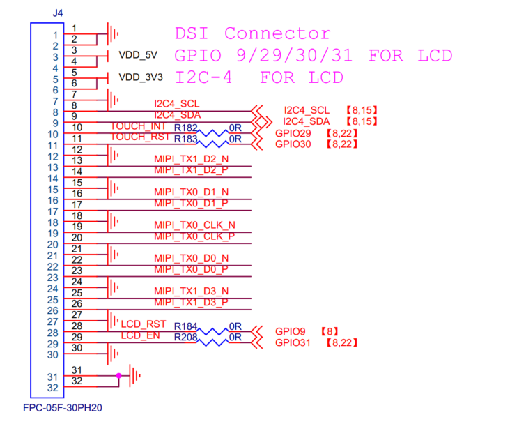

- Screen touch IIC uses iic4 (scl: gpio7, sda gpio8)
- Screen touch rst: gpio29, int: gpio30
- Screen rst: gpio9, backlight: gpio31
- Mipi pins correspond one-to-one with the screen pins

#### 1.1.2 Physical Diagram

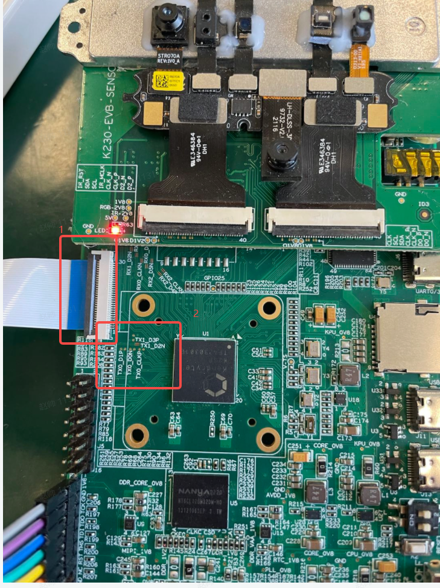

- In the figure, 1 is the mipi interface, using a soft ribbon cable
- In the figure, 2 is the mipi signal test point, containing four data lines and one clk line

### 1.2 Software Description

The video output software configuration is divided into three parts: phy configuration, dsi configuration, and VO configuration.

#### 1.2.1 PHY Configuration Process

The phy frequency requires three parameters to be configured: calculate PLL, configure voc, and configure freq. Based on these three parameters, the txphy frequency can be determined. Each parameter calculation is as follows.

##### 1.2.1.1 Calculate the PHY PLL

The data rate is given by twice the PLL output clock phase frequency: Data rate (Gbps) = PLL Fout (GHz) * 2. The output frequency is a function of the input reference frequency and the multiplication/division ratio. The calculation of the phy PLL is divided into 4 ranges, each corresponding to a different frequency. It can be determined as follows:

| M      | m+2 |
|--------|-----|
| N      | n+1 |
| Fclkin | 24M |

For:

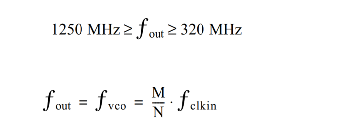

However, the following restrictions must be followed:

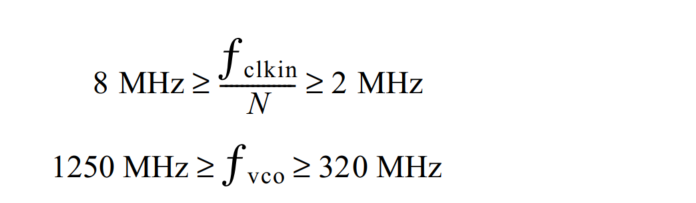

For:

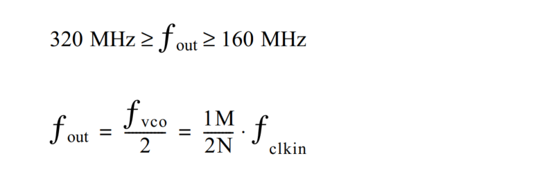

For:

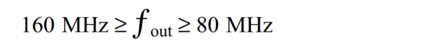

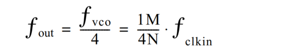

For:

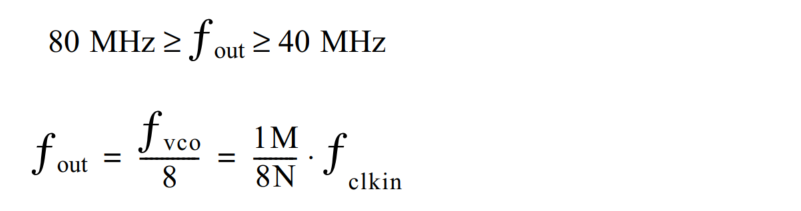

Each of the above corresponds to a pll level, with different levels corresponding to different calculation formulas and restrictions. An example calculation is as follows:

Example:

The mipi rate is 445.5M, so the pll rate is 222.75M. The second formula should be chosen, and the calculation is as follows:

222750000 = 1M / 2N = (m+2) / 2(n+1) * 24000000. The formula is rearranged as follows:

222.75n + 198.75 = 12m. The calculation using Excel is as follows:

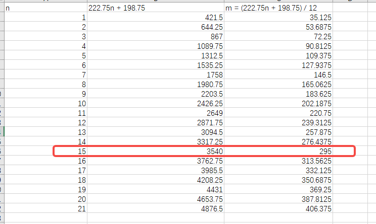

The resulting m = 295, n = 15.

The configuration of m and n in the pll must be integer values. If none of the values are integers, m and n need to be adjusted by adding or subtracting 1, then recalculating to find the closest frequency, and verifying if it's usable. If not, repeat the above steps.

##### 1.2.1.2 Configure the PHY VOC

The configuration of the phy voc can be determined by referring to the table:

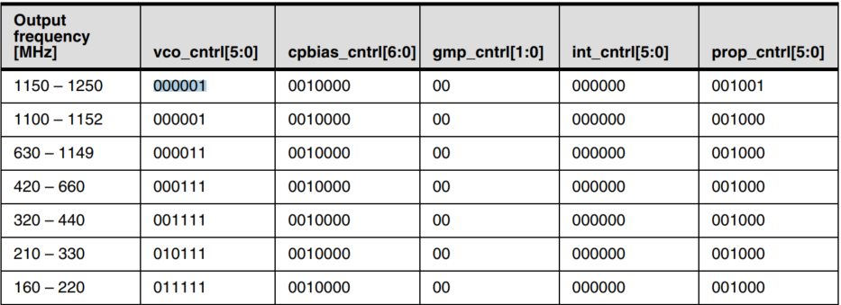

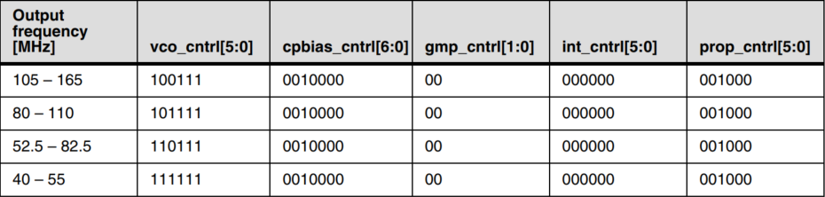

Example:

The mipi rate is 445.5M, so the pll rate is 222.75M, voc = 010111 = 0x17.

##### 1.2.1.3 Configure the Frequency

The configuration of the phy frequency can be determined by referring to the table:

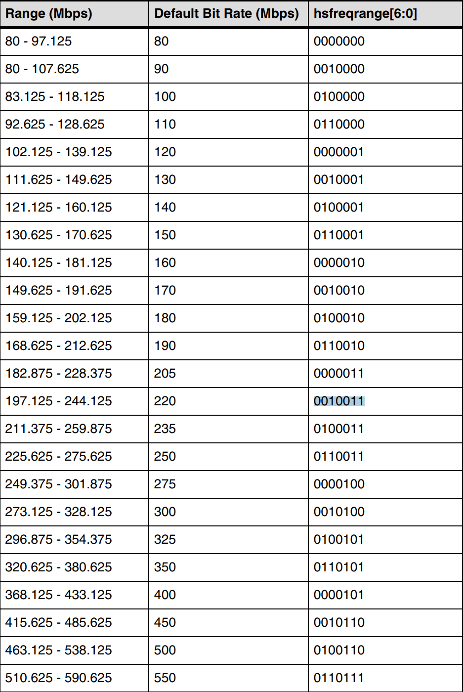

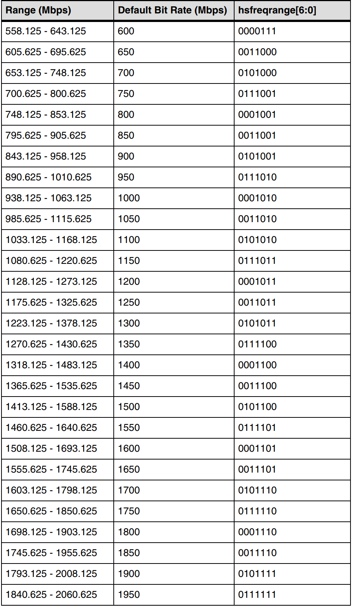

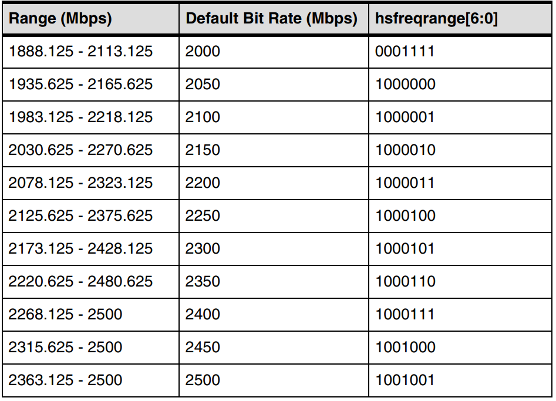

Example:

The mipi rate is 445.5M, so the pll rate is 222.75M. The frequency is chosen as 0100101. When configuring this, the highest bit bit\[7\] = 1, so freq = 10100101= 0xa5.

#### 1.2.2 DSI Configuration

DSI (Display Serial Interface) is part of a set of communication protocols defined by the MIPI alliance, mainly implementing all the protocol functions defined in the MIPI DSI specification, including a bidirectional PHY with two and four channels.

DSI mainly configures the timing used for screen display and the functionality for sending commands.

##### 1.2.2.1 Configuring Display Timing

Each manufacturer's screen has a set of timings used for screen control, mainly including frame control timing and line control timing, as shown in the following figure:

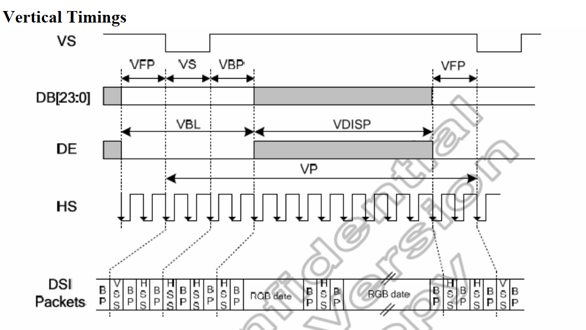

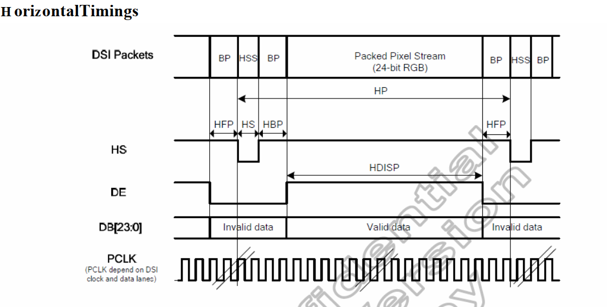

The timing used in DSI is consistent with the screen's timing configuration.

##### 1.2.2.2 Sending DSI Commands

DSI needs to enter lp mode first, and then commands can be sent. The required APIs are as follows:

- [kd_mpi_dsi_set_lp_mode_send_cmd](#226-kd_mpi_dsi_set_lp_mode_send_cmd)
- [kd_mpi_dsi_send_cmd](#223-kd_mpi_dsi_send_cmd)

The sent data is in 8-bit format, and it will automatically choose to send long or short packets based on the quantity.

##### 1.2.2.3 DSI Self-Test Mode

The DSI self-test mode generates color bar data according to the configured DSI timing and sends it out, thus not relying on the VO to read data from DDR. The test mode display is as follows:

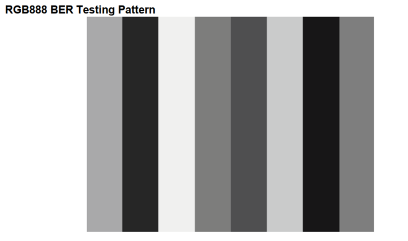

The DSI and VO use a 24-bit interface, so the configured color bar appears as shown above. The usage method is to enable the color bar after configuring the DSI. The API is as follows:

- [kd_mpi_dsi_set_test_pattern](#225-kd_mpi_dsi_set_test_pattern)

#### 1.2.3 VO Configuration

The VO (video output) module actively reads video and graphic data from the corresponding location in the memory and outputs the video and graphics through the corresponding display device. The VO part includes two configurations: timing configuration and video layer configuration.

##### 1.2.3.1 VO Timing Configuration

The VO timing configuration uses the same parameters as the DSI timing configuration, as described in the DSI timing introduction.

##### 1.2.3.2 VO Layer Configuration

The VO layer currently supports 3 layers and 4 OSD layers. The layer can only display YUV image formats (the functions supported by layer0 and layer1 are listed in the [Overview](#1-overview) table).

##### 1.2.3.3 VO Write-Back Function Configuration

The VO also supports a write-back function, which can verify whether the VO configuration is correct. After the VO configuration is completed, the data will be written back to the DDR, making it easy to verify whether there is any anomaly in the VO configuration.

#### 1.2.4 VO Module Debugging Methods

##### 1.2.4.1 Screen Testing Methods

- Configure the screen to enter self-test mode through LP commands and check if the generated image is normal.
- Read the screen registers through LP commands to see if there is a response.

##### 1.2.4.2 DSI Testing Methods

- After configuring the DSI, let the screen enter self-test mode, measure the signals to see if they are normal, and check if the screen generates a color bar image.
- Check the phy error status register to see if there is an error status, which can be viewed through proc.

##### 1.2.4.3 VO Testing Methods

- After the VO configuration is completed, enable the write-back function and check if it meets the configuration requirements.
- Read the DSI error status register to check if there is any underflow or overflow in the data transmission between VO and DSI. If so, adjust the timing appropriately and try again.

## 2. API Reference

### 2.1 TXPHY

This functional module provides the following APIs:

- [kd_mpi_set_mipi_phy_attr](#211-kd_mpi_set_mipi_phy_attr)

### 2.1.1 kd_mpi_set_mipi_phy_attr

**Description**:

Sets the frequency of the PHY.

**Syntax**:

```c
k_s32 kd_mpi_set_mipi_phy_attr(k_vo_mipi_phy_attr *attr)
```

**Parameters**:

| Parameter | Description                  | Input/Output |
|-----------|------------------------------|--------------|
| attr      | Description of the PHY frequency structure | Input        |

**Return Values**:

| Return Value | Description               |
|--------------|---------------------------|
| 0            | Success.                  |
| Non-zero     | Failure, refer to error codes. |

**Chip Differences**:

None

**Requirements**:

- Header files: mpi_vo_api.h, k_vo_comm.h
- Library file: libvo.a

**Notes**:

None

**Example**:

None

**Related Topics**:

None

### 2.2 DSI

This functional module provides the following APIs:

- [kd_mpi_dsi_set_attr](#221-kd_mpi_dsi_set_attr)
- [kd_mpi_dsi_enable](#222-kd_mpi_dsi_enable)
- [kd_mpi_dsi_send_cmd](#223-kd_mpi_dsi_send_cmd)
- [kd_mpi_dsi_read_pkg](#224-kd_mpi_dsi_read_pkg)
- [kd_mpi_dsi_set_test_pattern](#225-kd_mpi_dsi_set_test_pattern)
- [kd_mpi_dsi_set_lp_mode_send_cmd](#226-kd_mpi_dsi_set_lp_mode_send_cmd)

#### 2.2.1 kd_mpi_dsi_set_attr

**Description**:

Configures DSI attribute parameters.

**Syntax**:

```c
k_s32 kd_mpi_dsi_set_attr(k_display_mode *attr)
```

**Parameters**:

| Parameter | Description         | Input/Output |
|-----------|---------------------|--------------|
| attr      | DSI attribute parameters | Input        |

**Return Values**:

| Return Value | Description               |
|--------------|---------------------------|
| 0            | Success.                  |
| Non-zero     | Failure, refer to error codes. |

**Chip Differences**:

None

**Requirements**:

- Header files: mpi_vo_api.h, k_vo_comm.h
- Library file: libvo.a

**Notes**:

None

**Example**:

None

**Related Topics**:

None

#### 2.2.2 kd_mpi_dsi_enable

**Description**:

Enables DSI.

**Syntax**:

```c
k_s32 kd_mpi_dsi_enable(void)
```

**Parameters**:

None

**Return Values**:

| Return Value | Description               |
|--------------|---------------------------|
| 0            | Success.                  |
| Non-zero     | Failure, refer to error codes. |

**Chip Differences**:

None

**Requirements**:

- Header files: mpi_vo_api.h
- Library file: libvo.a

**Notes**:

None

**Example**:

None

**Related Topics**:

None

#### 2.2.3 kd_mpi_dsi_send_cmd

**Description**:

Sends a command via DSI.

**Syntax**:

```c
k_s32 kd_mpi_dsi_send_cmd(k_u8 *data, k_s32 cmd_len)
```

**Parameters**:

| Parameter | Description       | Input/Output |
|-----------|-------------------|--------------|
| data      | Data to be sent   | Input        |
| cmd_len   | Length of the data | Input        |

**Return Values**:

| Return Value | Description               |
|--------------|---------------------------|
| 0            | Success.                  |
| Non-zero     | Failure, refer to error codes. |

**Chip Differences**:

None

**Requirements**:

- Header files: mpi_vo_api.h
- Library file: libvo.a

**Notes**:

None

**Example**:

None

**Related Topics**:

None

#### 2.2.4 kd_mpi_dsi_read_pkg

**Description**:

Reads a package via DSI.

**Syntax**:

```c
k_s32 kd_mpi_dsi_read_pkg(k_u8 *rx_buf, k_s32 cmd_len)
```

**Parameters**:

| Parameter | Description       | Input/Output |
|-----------|-------------------|--------------|
| rx_buf    | Buffer to receive data | Input        |
| cmd_len   | Length of the data | Input        |

**Return Values**:

| Return Value | Description               |
|--------------|---------------------------|
| 0            | Success.                  |
| Non-zero     | Failure, refer to error codes. |

**Chip Differences**:

None

**Requirements**:

- Header files: mpi_vo_api.h
- Library file: libvo.a

**Notes**:

None

**Example**:

None

**Related Topics**:

None

#### 2.2.5 kd_mpi_dsi_set_test_pattern

**Description**:

Configures DSI to enter test mode.

**Syntax**:

```c
k_s32 kd_mpi_dsi_set_test_pattern(void)
```

**Parameters**:

None

**Return Values**:

| Return Value | Description               |
|--------------|---------------------------|
| 0            | Success.                  |
| Non-zero     | Failure, refer to error codes. |

**Chip Differences**:

None

**Requirements**:

- Header files: mpi_vo_api.h
- Library file: libvo.a

**Notes**:

None

**Example**:

None

**Related Topics**:

None

#### 2.2.6 kd_mpi_dsi_set_lp_mode_send_cmd

**Description**:

Configures DSI to enter LP mode and send commands.

**Syntax**:

```c
k_s32 kd_mpi_dsi_set_lp_mode_send_cmd(void)
```

**Parameters**:

None

**Return Values**:

| Return Value | Description               |
|--------------|---------------------------|
| 0            | Success.                  |
| Non-zero     | Failure, refer to error codes. |

**Chip Differences**:

None

**Requirements**:

- Header files: mpi_vo_api.h
- Library file: libvo.a

**Notes**:

None

**Example**:

None

**Related Topics**:

None

### 2.3 VO

- [kd_mpi_vo_init](#231-kd_mpi_vo_init)
- [kd_mpi_vo_set_dev_param](#232-kd_mpi_vo_set_dev_param)
- [kd_mpi_vo_enable_video_layer](#233-kd_mpi_vo_enable_video_layer)
- [kd_mpi_vo_disable_video_layer](#234-kd_mpi_vo_disable_video_layer)
- [kd_mpi_vo_enable](#235-kd_mpi_vo_enable)
- [kd_mpi_vo_chn_insert_frame](#236-kd_mpi_vo_chn_insert_frame)
- [kd_mpi_vo_chn_dump_frame](#237-kd_mpi_vo_chn_dump_frame)
- [kd_mpi_vo_chn_dump_release](#238-kd_mpi_vo_chn_dump_release)
- [kd_mpi_vo_osd_enable](#239-kd_mpi_vo_osd_enable)
- [kd_mpi_vo_osd_disable](#2310-kd_mpi_vo_osd_disable)
- [kd_mpi_vo_set_video_osd_attr](#2311-kd_mpi_vo_set_video_osd_attr)
- [kd_mpi_vo_set_wbc_attr](#2312-kd_mpi_vo_set_wbc_attr)
- [kd_mpi_vo_enable_wbc](#2313-kd_mpi_vo_enable_wbc)
- [kd_mpi_vo_disable_wbc](#2314-kd_mpi_vo_disable_wbc)
- [kd_display_reset](#2315-kd_display_reset)
- [kd_display_set_backlight](#2316-kd_display_set_backlight)
- [kd_mpi_vo_set_user_sync_info](#2317-kd_mpi_vo_set_user_sync_info)
- kd_mpi_vo_draw_frame

#### 2.3.1 kd_mpi_vo_init

**Description**:

Initializes VO with default parameters.

**Syntax**:

```c
k_s32 kd_mpi_vo_init(void)
```

**Parameters**:

None

**Return Values**:

| Return Value | Description               |
|--------------|---------------------------|
| 0            | Success.                  |
| Non-zero     | Failure, refer to error codes. |

**Chip Differences**:

None

**Requirements**:

- Header files: mpi_vo_api.h
- Library file: libvo.a

**Notes**:

None

**Example**:

None

**Related Topics**:

None

#### 2.3.2 kd_mpi_vo_set_dev_param

**Description**:

Sets device parameters for VO.

**Syntax**:

```c
k_s32 kd_mpi_vo_set_dev_param(k_vo_pub_attr *attr)
```

**Parameters**:

| Parameter | Description                             | Input/Output |
|-----------|-----------------------------------------|--------------|
| attr      | Pointer to the public attribute structure of the video output device. | Input        |

**Return Values**:

| Return Value | Description               |
|--------------|---------------------------|
| 0            | Success.                  |
| Non-zero     | Failure, refer to error codes. |

**Chip Differences**:

None

**Requirements**:

- Header files: mpi_vo_api.h, k_vo_comm.h
- Library file: libvo.a

**Notes**:

None

**Example**:

None

**Related Topics**:

None

#### 2.3.3 kd_mpi_vo_enable_video_layer

**Description**:

Configures layer attribute parameters.

**Syntax**:

```c
k_s32 kd_mpi_vo_enable_video_layer(k_vo_layer layer)
```

**Parameters**:

| Parameter | Description                                         | Input/Output |
|-----------|-----------------------------------------------------|--------------|
| layer     | Video output layer number, range [0 – K_MAX_VO_LAYER_NUM] | Input        |
| attr      | Pointer to the video layer attribute structure      | Input        |

**Return Values**:

| Return Value | Description               |
|--------------|---------------------------|
| 0            | Success.                  |
| Non-zero     | Failure, refer to error codes. |

**Chip Differences**:

None

**Requirements**:

- Header files: mpi_vo_api.h
- Library file: libvo.a

**Notes**:

None

**Example**:

None

**Related Topics**:

None

#### 2.3.4 kd_mpi_vo_disable_video_layer

**Description**:

Disables the video layer.

**Syntax**:

```c
k_s32 kd_mpi_vo_disable_video_layer(k_vo_layer layer)
```

**Parameters**:

| Parameter | Description                                         | Input/Output |
|-----------|-----------------------------------------------------|--------------|
| layer     | Video output layer number, range [0 – K_MAX_VO_LAYER_NUM] | Input        |

**Return Values**:

| Return Value | Description               |
|--------------|---------------------------|
| 0            | Success.                  |
| Non-zero     | Failure, refer to error codes. |

**Chip Differences**:

None

**Requirements**:

- Header files:
- Library file:

**Notes**:

None

**Example**:

None

**Related Topics**:

None

#### 2.3.5 kd_mpi_vo_enable

**Description**:

Enables VO.

**Syntax**:

```c
k_u8 kd_mpi_vo_enable(void)
```

**Parameters**:

None

**Return Values**:

| Return Value | Description               |
|--------------|---------------------------|
| 0            | Success.                  |
| Non-zero     | Failure, refer to error codes. |

**Chip Differences**:

None

**Requirements**:

- Header files:
- Library file:

**Notes**:

None

**Example**:

None

**Related Topics**:

None

#### 2.3.6 kd_mpi_vo_chn_insert_frame

**Description**:

Inserts a frame into the VO channel.

**Syntax**:

```c
k_s32 kd_mpi_vo_chn_insert_frame(k_u32 chn_num, k_video_frame_info *vf_info)
```

**Parameters**:

| Parameter | Description               | Input/Output |
|-----------|---------------------------|--------------|
| chn_num   | Channel number            | Input        |
| vf_info   | Pointer to the video frame structure | Input        |

**Return Values**:

| Return Value | Description               |
|--------------|---------------------------|
| 0            | Success.                  |
| Non-zero     | Failure, refer to error codes. |

**Chip Differences**:

None

**Requirements**:

- Header files: mpi_vo_api.h, k_video_comm.h
- Library file: libvo.a

**Notes**:

None

**Example**:

None

**Related Topics**:

None

#### 2.3.7 kd_mpi_vo_chn_dump_frame

**Description**:

Captures a frame from the VO channel.

**Syntax**:

```c
k_s32 kd_mpi_vo_chn_dump_frame(k_u32 chn_num, k_video_frame_info *vf_info, k_u32 timeout_ms)
```

**Parameters**:

| Parameter   | Description               | Input/Output |
|-------------|---------------------------|--------------|
| chn_num     | Channel ID                | Input        |
| vf_info     | Pointer to the video frame structure | Input        |
| timeout_ms  | Timeout duration          | Input        |

**Return Values**:

| Return Value | Description               |
|--------------|---------------------------|
| 0            | Success.                  |
| Non-zero     | Failure, refer to error codes. |

**Chip Differences**:

None

**Requirements**:

- Header files: mpi_vo_api.h, k_video_comm.h
- Library file: libvo.a

**Notes**:

None

**Example**:

None

**Related Topics**:

None

#### 2.3.8 kd_mpi_vo_chn_dump_release

**Description**:

Releases the captured frame.

**Syntax**:

```c
k_s32 kd_mpi_vo_chn_dump_release(k_u32 chn_num, const k_video_frame_info *vf_info)
```

**Parameters**:

| Parameter | Description               | Input/Output |
|-----------|---------------------------|--------------|
| chn_num   | Channel ID                | Input        |
| vf_info   | Pointer to the video frame structure | Input        |

**Return Values**:

| Return Value | Description               |
|--------------|---------------------------|
| 0            | Success.                  |
| Non-zero     | Failure, refer to error codes. |

**Chip Differences**:

None

**Requirements**:

- Header files: mpi_vo_api.h, k_video_comm.h
- Library file: libvo.a

**Notes**:

None

**Example**:

None

**Related Topics**:

None

#### 2.3.9 kd_mpi_vo_osd_enable

**Description**:

Enables the OSD layer.

**Syntax**:

```c
k_s32 kd_mpi_vo_osd_enable(k_vo_osd layer)
```

**Parameters**:

| Parameter | Description                                         | Input/Output |
|-----------|-----------------------------------------------------|--------------|
| layer     | Video output layer number, range [0 – K_MAX_VO_OSD_NUM] | Input        |

**Return Values**:

| Return Value | Description               |
|--------------|---------------------------|
| 0            | Success.                  |
| Non-zero     | Failure, refer to error codes. |

**Chip Differences**:

None

**Requirements**:

- Header files: mpi_vo_api.h, k_vo_comm.h
- Library file: libvo.a

**Notes**:

None

**Example**:

None

**Related Topics**:

None

### 2.3.10 kd_mpi_vo_osd_disable

**Description**:

Disables the OSD layer.

**Syntax**:

```c
k_s32 kd_mpi_vo_osd_disable(k_vo_osd layer)
```

**Parameters**:

| Parameter | Description                                         | Input/Output |
|-----------|-----------------------------------------------------|--------------|
| layer     | Video output layer number, range [0 – K_MAX_VO_OSD_NUM] | Input        |

**Return Values**:

| Return Value | Description               |
|--------------|---------------------------|
| 0            | Success.                  |
| Non-zero     | Failure, refer to error codes. |

**Chip Differences**:

None

**Requirements**:

- Header files: mpi_vo_api.h, k_vo_comm.h
- Library file: libvo.a

**Notes**:

None

**Example**:

None

**Related Topics**:

None

#### 2.3.11 kd_mpi_vo_set_video_osd_attr

**Description**:

Sets the attributes of the OSD layer.

**Syntax**:

```c
k_s32 kd_mpi_vo_set_video_osd_attr(k_vo_osd layer, k_vo_video_osd_attr *attr)
```

**Parameters**:

| Parameter       | Description                                         | Input/Output |
|-----------------|-----------------------------------------------------|--------------|
| layer           | Video output layer number, range [0 – K_MAX_VO_OSD_NUM] | Input        |
| attr            | OSD layer attribute parameters                      | Input        |

**Return Values**:

| Return Value | Description               |
|--------------|---------------------------|
| 0            | Success.                  |
| Non-zero     | Failure, refer to error codes. |

**Chip Differences**:

None

**Requirements**:

- Header files: mpi_vo_api.h, k_vo_comm.h
- Library file: libvo.a

**Notes**:

None

**Example**:

None

**Related Topics**:

None

#### 2.3.12 kd_mpi_vo_set_wbc_attr

**Description**:

Sets the writeback attributes.

**Syntax**:

```c
k_s32 kd_mpi_vo_set_wbc_attr(k_vo_wbc_attr *attr)
```

**Parameters**:

| Parameter | Description               | Input/Output |
|-----------|---------------------------|--------------|
| attr      | Writeback attribute parameters | Input      |

**Return Values**:

| Return Value | Description               |
|--------------|---------------------------|
| 0            | Success.                  |
| Non-zero     | Failure, refer to error codes. |

**Chip Differences**:

None

**Requirements**:

- Header files: mpi_vo_api.h, k_vo_comm.h
- Library file: libvo.a

**Notes**:

None

**Example**:

None

**Related Topics**:

None

#### 2.3.13 kd_mpi_vo_enable_wbc

**Description**:

Enables writeback.

**Syntax**:

```c
k_s32 kd_mpi_vo_enable_wbc(void)
```

**Parameters**:

None

**Return Values**:

| Return Value | Description               |
|--------------|---------------------------|
| 0            | Success.                  |
| Non-zero     | Failure, refer to error codes. |

**Chip Differences**:

None

**Requirements**:

- Header files: mpi_vo_api.h, k_vo_comm.h
- Library file: libvo.a

**Notes**:

None

**Example**:

None

**Related Topics**:

None

#### 2.3.14 kd_mpi_vo_disable_wbc

**Description**:

Disables writeback.

**Syntax**:

```c
k_s32 kd_mpi_vo_disable_wbc(void)
```

**Parameters**:

None

**Return Values**:

| Return Value | Description               |
|--------------|---------------------------|
| 0            | Success.                  |
| Non-zero     | Failure, refer to error codes. |

**Chip Differences**:

None

**Requirements**:

- Header files: mpi_vo_api.h, k_vo_comm.h
- Library file: libvo.a

**Notes**:

None

**Example**:

None

**Related Topics**:

None

#### 2.3.15 kd_display_reset

**Description**:

Resets the video output subsystem.

**Syntax**:

```c
k_s32 kd_display_reset(void)
```

**Parameters**:

None

**Return Values**:

| Return Value | Description               |
|--------------|---------------------------|
| 0            | Success.                  |
| Non-zero     | Failure, refer to error codes. |

**Chip Differences**:

None

**Requirements**:

- Header files: mpi_vo_api.h, k_vo_comm.h
- Library file: libvo.a

**Notes**:

None

**Example**:

None

**Related Topics**:

None

#### 2.3.16 kd_display_set_backlight

**Description**:

Resets the screen and turns on the backlight.

**Syntax**:

```c
k_s32 kd_display_set_backlight(void)
```

**Parameters**:

None

**Return Values**:

| Return Value | Description               |
|--------------|---------------------------|
| 0            | Success.                  |
| Non-zero     | Failure, refer to error codes. |

**Chip Differences**:

None

**Requirements**:

- Header files: mpi_vo_api.h, k_vo_comm.h
- Library file: libvo.a

**Notes**:

None

**Example**:

None

**Related Topics**:

None

#### 2.3.17 kd_mpi_vo_set_user_sync_info

**Description**:

Sets user interface timing information for configuring clock source, clock size, and clock division ratio.

**Syntax**:

```c
k_s32 kd_mpi_vo_set_user_sync_info(k_vo_user_sync_info *sync_info)
```

**Parameters**:

| Parameter | Description               | Input/Output |
|-----------|---------------------------|--------------|
| sync_info | User sync information     | Input        |

**Return Values**:

| Return Value | Description               |
|--------------|---------------------------|
| 0            | Success.                  |
| Non-zero     | Failure, refer to error codes. |

**Chip Differences**:

None

**Requirements**:

- Header files: mpi_vo_api.h, k_vo_comm.h
- Library file: libvo.a

**Notes**:

None

**Example**:

None

**Related Topics**:

None

#### 2.3.18 kd_mpi_vo_draw_frame

**Description**:

Draws a frame.

**Syntax**:

```c
k_s32 kd_mpi_vo_draw_frame(k_vo_draw_frame *frame)
```

**Parameters**:

| Parameter | Description           | Input/Output |
|-----------|-----------------------|--------------|
| frame     | Frame attribute parameters | Input  |

**Return Values**:

| Return Value | Description               |
|--------------|---------------------------|
| 0            | Success.                  |
| Non-zero     | Failure, refer to error codes. |

**Chip Differences**:

None

**Requirements**:

- Header files: mpi_vo_api.h, k_vo_comm.h
- Library file: libvo.a

**Notes**:

None

**Example**:

None

**Related Topics**:

None

#### 2.3.19 kd_mpi_get_connector_info

**Description**:

Retrieves the connector data structure based on the connection type.

**Syntax**:

```c
k_s32 kd_mpi_get_connector_info(k_connector_type connector_type, k_connector_info *connector_info)
```

**Parameters**:

| Parameter       | Description               | Input/Output |
|-----------------|---------------------------|--------------|
| connector_type  | Type of the connector     | Input        |
| connector_info  | Connector data structure  | Input        |

**Return Values**:

| Return Value | Description               |
|--------------|---------------------------|
| 0            | Success.                  |
| Non-zero     | Failure, refer to error codes. |

**Chip Differences**:

None

**Requirements**:

- Header files: mpi_vo_api.h, k_vo_comm.h, k_connector_comm.h
- Library file: libvo.a, libconnector.a

**Notes**:

None

**Example**:

None

**Related Topics**:

None

#### 2.3.20 kd_mpi_connector_open

**Description**:

Opens the connector device node based on the connector name.

**Syntax**:

```c
k_s32 kd_mpi_connector_open(const char *connector_name)
```

**Parameters**:

| Parameter       | Description               | Input/Output |
|-----------------|---------------------------|--------------|
| connector_name  | Device node of the connector | Input     |

**Return Values**:

| Return Value | Description               |
|--------------|---------------------------|
| fd           | Success, returns the file descriptor ID |
| < 0          | Failure, refer to error codes. |

**Chip Differences**:

None

**Requirements**:

- Header files: mpi_vo_api.h, k_vo_comm.h, k_connector_comm.h
- Library file: libvo.a, libconnector.a

**Notes**:

None

**Example**:

None

**Related Topics**:

None

#### 2.3.21 kd_mpi_connector_power_set

**Description**:

Turns the power of the connector on or off.

**Syntax**:

```c
k_s32 kd_mpi_connector_power_set(k_s32 fd, k_bool on)
```

**Parameters**:

| Parameter       | Description               | Input/Output |
|-----------------|---------------------------|--------------|
| fd              | File descriptor of the connector | Input   |
| on              | Power state of the connector | Input      |

**Return Values**:

| Return Value | Description               |
|--------------|---------------------------|
| 0            | Success.                  |
| Non-zero     | Failure, refer to error codes. |

**Chip Differences**:

None

**Requirements**:

- Header files: mpi_vo_api.h, k_vo_comm.h, k_connector_comm.h
- Library file: libvo.a, libconnector.a

**Notes**:

None

**Example**:

None

**Related Topics**:

None

#### 2.3.22 kd_mpi_connector_init

**Description**:

Initializes the VO connector.

**Syntax**:

```c
k_s32 kd_mpi_connector_init(k_s32 fd, k_connector_info info)
```

**Parameters**:

| Parameter       | Description               | Input/Output |
|-----------------|---------------------------|--------------|
| fd              | File descriptor of the connector | Input   |
| info            | Initialization parameters of the connector | Input |

**Return Values**:

| Return Value | Description               |
|--------------|---------------------------|
| 0            | Success.                  |
| Non-zero     | Failure, refer to error codes. |

**Chip Differences**:

None

**Requirements**:

- Header files: mpi_vo_api.h, k_vo_comm.h, k_connector_comm.h
- Library file: libvo.a, libconnector.a

**Notes**:

None

**Example**:

None

**Related Topics**:

None

#### 2.3.23 kd_mpi_connector_get_negotiated_data

**Description**:

Automatically negotiates the resolution between the display driver and the monitor. The negotiated data is saved in the `negotiated_data` variable.

**Syntax**:

```c
k_s32 kd_mpi_connector_get_negotiated_data(k_s32 fd, k_connector_negotiated_data *negotiated_data)
```

**Parameters**:

| Parameter        | Description                                   | Input/Output |
|------------------|-----------------------------------------------|--------------|
| fd               | File descriptor                               | Input        |
| negotiated_data  | Data negotiated between the display driver and HDMI monitor | Input |

**Return Values**:

| Return Value | Description                                               |
|--------------|-----------------------------------------------------------|
| >= 1         | Success, number of resolutions supported by the display driver after negotiation |
| -1           | Failure, refer to error codes.                            |

**Chip Differences**:

None

**Requirements**:

- Header files: mpi_vo_api.h, k_vo_comm.h, k_connector_comm.h
- Library file: libvo.a, libconnector.a

**Notes**:

`kd_mpi_connector_get_negotiated_data()` only negotiates with the monitor. It does not set the best resolution to the VO, DSI, or HDMI modules.

**Example**:

None

**Related Topics**:

None

#### 2.3.24 kd_mpi_connector_adapt_resolution

**Description**:

Automatically negotiates the resolution between the display driver and the monitor. The negotiated data is saved in the `negotiated_data` variable, and the best resolution is set to the VO, DSI, and HDMI modules.

**Syntax**:

```c
k_s32 kd_mpi_connector_adapt_resolution(k_connector_type type, k_connector_negotiated_data *negotiated_data)
```

**Parameters**:

| Parameter        | Description                                   | Input/Output |
|------------------|-----------------------------------------------|--------------|
| type             | Device node of the connector, HDMI interface is usually set to `LT9611_MIPI_ADAPT_RESOLUTION` | Input |
| negotiated_data  | Data negotiated between the display driver and HDMI monitor | Input |

**Return Values**:

| Return Value | Description               |
|--------------|---------------------------|
| 0            | Success.                  |
| -1           | Failure, refer to error codes. |

**Chip Differences**:

None

**Requirements**:

- Header files: mpi_vo_api.h, k_vo_comm.h, k_connector_comm.h
- Library file: libvo.a, libconnector.a

**Notes**:

1. `kd_mpi_connector_adapt_resolution()` internally calls `kd_mpi_connector_get_negotiated_data()` to negotiate with the monitor.
1. After the application calls `kd_mpi_connector_adapt_resolution()` to complete the adaptive setting, it can still call `kd_mpi_get_connector_info()`, `kd_mpi_connector_open()`, `kd_mpi_connector_power_set()`, and `kd_mpi_connector_init()` to reset the output resolution.

**Example**:

None

**Related Topics**:

None

#### 2.3.25 kd_mpi_connector_set_mirror

**Description**:

Sets the screen mirror function.

**Syntax**:

```c
k_s32 kd_mpi_connector_set_mirror(k_s32 fd, k_connector_mirror mirror)
```

**Parameters**:

| Parameter | Description           | Input/Output |
|-----------|-----------------------|--------------|
| fd        | File descriptor       | Input        |
| mirror    | Screen mirror function | Input       |

**Return Values**:

| Return Value | Description               |
|--------------|---------------------------|
| 0            | Success.                  |
| -1           | Failure, refer to error codes. |

**Chip Differences**:

None

**Requirements**:

- Header files: mpi_vo_api.h, k_vo_comm.h, k_connector_comm.h
- Library file: libvo.a, libconnector.a

**Notes**:

1. `kd_mpi_connector_adapt_resolution()` internally calls `kd_mpi_connector_get_negotiated_data()` to negotiate with the monitor.
1. After the application calls `kd_mpi_connector_adapt_resolution()` to complete the adaptive setting, it can still call `kd_mpi_get_connector_info()`, `kd_mpi_connector_open()`, `kd_mpi_connector_power_set()`, and `kd_mpi_connector_init()` to reset the output resolution.

**Example**:

None

**Related Topics**:

None

### 3.1.1 k_vo_intf_sync

**Description**:

Defines the resolution and frame rate in video.

**Definition**:

```c
typedef enum {  
    K_VO_OUT_1080P30,  
    K_VO_OUT_1080P60,  
} k_vo_intf_sync;
```

**Members**:

| Member Name           | Description                                      |
|-----------------------|--------------------------------------------------|
| K_VO_OUT_1080P30      | 1080 indicates 1920x1080 pixels. 30 indicates 30fps |
| K_VO_OUT_1080P60      | 1080 indicates 1920x1080 pixels. 60 indicates 60fps |
| K_VO_OUT_1080x1920P30 | 1080x1920 indicates 1080x1920 pixels. 30 indicates 30fps |
| K_VO_OUT_1080x1920P60 | 1080x1920 indicates 1080x1920 pixels. 60 indicates 60fps |

**Notes**:

None

**Related Data Types and Interfaces**:

None

### 3.1.2 k_vo_intf_type

**Description**:

Defines the resolution and frame rate in video.

**Definition**:

```c
typedef enum {  
    K_VO_INTF_MIPI = 0,  
} k_vo_intf_type;
```

**Members**:

| Member Name   | Description |
|---------------|-------------|
| K_VO_INTF_MIPI | MIPI interface |

**Notes**:

None

**Related Data Types and Interfaces**:

None

### 3.1.3 k_pixel_format

**Description**:

Data formats supported by the display layer. The following structure lists only the data formats supported by the display, not all data formats.

**Definition**:

```c
typedef enum {  
    PIXEL_FORMAT_YVU_PLANAR_420,  
    PIXEL_FORMAT_YVU_PLANAR_422,  
    PIXEL_FORMAT_RGB_565,  
    PIXEL_FORMAT_RGB_888,  
    PIXEL_FORMAT_ARGB_8888,  
    PIXEL_FORMAT_ARGB_4444,  
    PIXEL_FORMAT_ARGB_1555,  
    PIXEL_FORMAT_RGB_MONOCHROME_8BPP,  
} k_pixel_format;
```

**Members**:

| Member Name               | Description |
|---------------------------|-------------|
| PIXEL_FORMAT_YVU_PLANAR_420 | YUV420 NV12 |
| PIXEL_FORMAT_YVU_PLANAR_422 | YUV422 NV16 |
| PIXEL_FORMAT_RGB_565        | RGB565      |
| PIXEL_FORMAT_RGB_888        | RGB888      |
| PIXEL_FORMAT_RGB_MONOCHROME_8BPP | 8-bit RGB |
| PIXEL_FORMAT_ARGB_8888      | ARGB8888    |
| PIXEL_FORMAT_ARGB_4444      | ARGB4444    |
| PIXEL_FORMAT_ARGB_1555      | ARGB1555    |

**Notes**:

None

**Related Data Types and Interfaces**:

None

### 3.1.4 k_vo_osd

**Description**:

Number of OSDs and the ID of each OSD.

**Definition**:

```c
typedef enum {  
    K_VO_OSD0,  
    K_VO_OSD1,  
    K_VO_OSD2,  
    K_VO_OSD3,  
    K_MAX_VO_OSD_NUM,  
} k_vo_osd;
```

**Members**:

| Member Name      | Description      |
|------------------|------------------|
| K_VO_OSD0        | OSD layer 0      |
| K_VO_OSD1        | OSD layer 1      |
| K_VO_OSD2        | OSD layer 2      |
| K_VO_OSD3        | OSD layer 3      |
| K_MAX_VO_OSD_NUM | Maximum number of OSD layers |

**Notes**:

None

**Related Data Types and Interfaces**:

None

### 3.1.5 k_vo_layer

**Description**:

Number of layers and the ID of each layer.

**Definition**:

```c
typedef enum {  
    K_VO_LAYER0 = 0,  
    K_VO_LAYER1,  
    K_VO_LAYER2,  
    K_MAX_VO_LAYER_NUM,  
} k_vo_layer;
```

**Members**:

| Member Name       | Description      |
|-------------------|------------------|
| K_VO_LAYER0       | Layer 0          |
| K_VO_LAYER1       | Layer 1          |
| K_VO_LAYER2       | Layer 2          |
| K_MAX_VO_LAYER_NUM | Maximum number of layers |

**Notes**:

None

**Related Data Types and Interfaces**:

None

### 3.1.6 k_vo_rotation

**Description**:

Supported layer rotation functions.

**Definition**:

```c
typedef enum {  
    K_ROTATION_0 = (0x01L << 0),  
    K_ROTATION_90 = (0x01L << 1),  
    K_ROTATION_180 = (0x01L << 2),  
    K_ROTATION_270 = (0x01L << 3),  
} k_vo_rotation;
```

**Notes**:

None

**Related Data Types and Interfaces**:

None

### 3.1.7 k_vo_mirror_mode

**Description**:

Supported layer mirror functions.

**Definition**:

```c
typedef enum {  
    K_VO_MIRROR_NONE = (0x01L << 4),  
    K_VO_MIRROR_HOR = (0x01L << 5),  
    K_VO_MIRROR_VER = (0x01L << 6),  
    K_VO_MIRROR_BOTH = (0x01L << 7),  
} k_vo_mirror_mode;
```

**Members**:

| Member Name     | Description               |
|------------------|---------------------------|
| K_VO_MIRROR_NONE | No mirror for the layer   |
| K_VO_MIRROR_HOR  | Horizontal mirror         |
| K_VO_MIRROR_VER  | Vertical mirror           |
| K_VO_MIRROR_BOTH | Both horizontal and vertical mirror |

**Notes**:

None

**Related Data Types and Interfaces**:

None

### 3.1.8 k_vo_user_sync_info

**Description**:

User-defined clock division.

**Definition**:

```c
typedef struct {  
    k_u32 ext_div;  
    k_u32 dev_div;  
    k_u32 clk_en;  
} k_vo_user_sync_info;
```

**Members**:

| Member Name | Description        |
|-------------|--------------------|
| ext_div     | External clock division |
| dev_div     | Clock division     |
| clk_en      | Display clock enable |

**Notes**:

None

**Related Data Types and Interfaces**:

None

### 3.1.9 k_vo_point

**Description**:

Defines a coordinate information structure.

**Definition**:

```c
typedef struct {  
    k_u32 x;  
    k_u32 y;  
} k_vo_point;
```

**Members**:

| Member Name | Description |
|-------------|-------------|
| x           | X coordinate |
| y           | Y coordinate |

**Notes**:

None

**Related Data Types and Interfaces**:

None

### 3.1.10 k_vo_size

**Description**:

Defines a size information structure.

**Definition**:

```c
typedef struct {  
    k_u32 width;  
    k_u32 height;  
} k_vo_size;
```

**Members**:

| Member Name | Description |
|-------------|-------------|
| width       | Width       |
| height      | Height      |

**Notes**:

None

**Related Data Types and Interfaces**:

None

### 3.1.11 k_vo_video_layer_attr

**Description**:

Defines the attributes of the display layer.

**Definition**:

```c
typedef struct {  
    k_vo_point display_rect;  
    k_vo_size img_size;  
    k_pixel_format pixel_format;  
    k_u32 stride;  
    k_u32 uv_swap_en;  
    k_u32 alpha_type;  
} k_vo_video_layer_attr;
```

**Members**:

| Member Name   | Description                                                                                                                         |
|---------------|-------------------------------------------------------------------------------------------------------------------------------------|
| display_rect  | Starting position of the OSD layer                                                                                                  |
| img_size      | Image resolution structure, i.e., the size of the composite image                                                                   |
| pixel_format  | Data format supported by the video layer                                                                                            |
| stride        | Image stride                                                                                                                        |
| uv_swap_en    | UV swap                                                                                                                             |
| alpha_type    | Type of alpha, only used by OSD layers. Divided into fixed alpha (256 levels), using R from RGB as alpha, using G from RGB as alpha, using B from RGB as alpha, or using the alpha channel as alpha |

**Notes**:

alpha_type is only used by OSD layers.

**Related Data Types and Interfaces**:

None

### 3.1.12 k_vo_wbc_attr

**Description**:

Defines writeback attributes.

**Definition**:

```c
typedef struct {  
    k_vo_size target_size;  
    k_pixel_format pixel_format;  
    k_u32 stride;  
    k_u32 y_phy_addr;  
} k_vo_wbc_attr;
```

**Members**:

| Member Name  | Description       |
|--------------|-------------------|
| target_size  | Target size for writeback |
| pixel_format | Data format for writeback |
| stride       | Writeback stride  |
| y_phy_addr   | Physical address for image writeback |

**Notes**:

y_phy_addr needs allocated space.

**Related Data Types and Interfaces**:

None

### 3.1.13 k_vo_pub_attr

**Description**:

Configures the public attributes of the video output device.

**Definition**:

```c
typedef struct {
    k_u32 bg_color;  
    k_vo_intf_type intf_type;  
    k_vo_intf_sync intf_sync;  
    k_vo_display_resolution *sync_info;  
} k_vo_pub_attr;
```

**Members**:

| Member Name | Description                   |
|-------------|-------------------------------|
| bg_color    | Background color              |
| intf_type   | Interface type, currently only supports MIPI |
| intf_sync   | Resolution and frame rate in video |
| sync_info   | Timing information for image output |

**Notes**:

None

**Related Data Types and Interfaces**:

None

### 3.1.14 k_vo_scaler_attr

**Description**:

Defines the scaler attributes.

**Definition**:

```c
typedef struct {  
    k_vo_size in_size;  
    k_vo_size out_size;  
    k_u32 stride;  
} k_vo_scaler_attr;
```

**Members**:

| Member Name | Description        |
|-------------|--------------------|
| in_size     | Input size         |
| out_size    | Output size        |
| stride      | Input stride       |
| y_phy_addr  | Physical address for image writeback |

**Notes**:

None

**Related Data Types and Interfaces**:

None

### 3.1.15 k_vo_draw_frame

**Description**:

Defines the attributes for drawing a frame.

**Definition**:

```c
typedef struct {  
    k_u32 draw_en;  
    k_u32 line_x_start;  
    k_u32 line_y_start;  
    k_u32 line_x_end;  
    k_u32 line_y_end;  
    k_u32 frame_num;  
} k_vo_draw_frame;
```

**Members**:

| Member Name   | Description               |
|---------------|---------------------------|
| draw_en       | Enable drawing frame      |
| line_x_start  | X-axis start position     |
| line_y_start  | Y-axis start position     |
| line_x_end    | X-axis end position       |
| line_y_end    | Y-axis end position       |
| frame_num     | Frame number (0 - 16)     |

**Notes**:

None

**Related Data Types and Interfaces**:

None

### 3.1.16 k_vo_display_resolution

**Description**:

Display timing attributes.

**Definition**:

```c
typedef struct {  
    k_u32 pclk;  
    k_u32 phyclk;  
    k_u32 htotal;  
    k_u32 hdisplay;  
    k_u32 hsync_len;  
    k_u32 hback_porch;  
    k_u32 hfront_porch;  
    k_u32 vtotal;  
    k_u32 vdisplay;  
    k_u32 vsync_len;  
    k_u32 vback_porch;  
    k_u32 vfront_porch;  
} k_vo_display_resolution;
```

**Members**:

| Member Name   | Description           |
|---------------|-----------------------|
| pclk          | Pixel clock frequency |
| phyclk        | D-PHY frequency       |
| htotal        | Total pixels per line |
| hdisplay      | Active pixels per line|
| hsync_len     | Horizontal sync length|
| hback_porch   | Horizontal back porch |
| hfront_porch  | Horizontal front porch|
| vtotal        | Total lines per frame |
| vdisplay      | Active lines per frame|
| vsync_len     | Vertical sync length  |
| vback_porch   | Vertical back porch   |
| vfront_porch  | Vertical front porch  |

**Notes**:

None

**Related Data Types and Interfaces**:

None

### 3.1.17 k_vo_mipi_phy_attr

**Description**:

Defines the structure for MIPI PHY frequency.

**Definition**:

```c
typedef struct {  
    k_u32 n;  
    k_u32 m;  
    k_u32 voc;  
    k_u32 phy_lan_num;  
    k_u32 hs_freq;  
} k_vo_mipi_phy_attr;  
```

**Members**:

| Member Name  | Description         |
|--------------|---------------------|
| n            | PLL coefficient     |
| m            | PLL coefficient     |
| voc          | PLL coefficient     |
| hs_freq      | PHY frequency range |
| phy_lan_num  | Number of PHY lanes |

**Notes**:

None

**Related Data Types and Interfaces**:

None

### 3.1.18 k_vo_video_osd_attr

**Description**:

Configures the public attributes of the OSD layer.

**Definition**:

```c
typedef struct {  
    k_vo_point display_rect;  
    k_vo_size img_size;  
    k_pixel_format pixel_format;  
    k_u32 stride;  
    k_u8 global_alpha;  
} k_vo_video_osd_attr;
```

**Members**:

| Member Name   | Description     |
|---------------|-----------------|
| display_rect  | Position info   |
| img_size      | Effective size  |
| pixel_format  | Data format     |
| stride        | Stride          |
| global_alpha  | Transparency    |

**Notes**:

None

**Related Data Types and Interfaces**:

None

### 3.1.19 k_video_frame_info

**Description**:

Information of a frame.

**Definition**:

```c
typedef struct {  
    k_video_frame v_frame;  
    k_u32 pool_id;  
    k_mod_id mod_id;  
} k_video_frame_info;
```

**Members**:

| Member Name | Description       |
|-------------|-------------------|
| v_frame     | Frame information |
| pool_id     | VB pool ID        |
| mod_id      | Video frame ID    |

**Notes**:

None

**Related Data Types and Interfaces**:

None

### 3.1.20 k_connector_type

**Description**:

Type of screen connection.

**Definition**:

```c
typedef enum {  
    HX8377_V2_MIPI_4LAN_1080X1920_30FPS,
    LT9611_MIPI_4LAN_1920X1080_60FPS,
    LT9611_MIPI_4LAN_1920X1080_30FPS,
} k_connector_type;
```

**Members**:

| Member Name                           | Description                    |
|---------------------------------------|--------------------------------|
| HX8377_V2_MIPI_4LAN_1080X1920_30FPS   | HX8377 screen initialization   |
| LT9611_MIPI_4LAN_1920X1080_60FPS      | HDMI 1080p60 initialization    |
| LT9611_MIPI_4LAN_1920X1080_30FPS      | HDMI 1080p30 initialization    |

**Notes**:

None

**Related Data Types and Interfaces**:

None

### 3.1.21 k_dsi_lan_num

**Description**:

Number of DSI lanes.

**Definition**:

```c
typedef enum {  
    K_DSI_1LAN = 0,  
    K_DSI_2LAN = 1,  
    K_DSI_4LAN = 3,  
} k_dsi_lan_num;
```

**Members**:

| Member Name | Description |
|-------------|-------------|
| K_DSI_1LAN  | 1-lane mode |
| K_DSI_2LAN  | 2-lane mode |
| K_DSI_4LAN  | 4-lane mode |

**Notes**:

None

**Related Data Types and Interfaces**:

None

### 3.1.22 k_dsi_work_mode

**Description**:

DSI work mode.

**Definition**:

```c
typedef enum {  
    K_BURST_MODE = 0,  
    K_NON_BURST_MODE_WITH_SYNC_EVENT = 1,  
    K_NON_BURST_MODE_WITH_PULSES = 2,  
} k_dsi_work_mode;
```

**Members**:

| Member Name                        | Description                       |
|------------------------------------|-----------------------------------|
| K_BURST_MODE                       | DSI works in burst mode           |
| K_NON_BURST_MODE_WITH_SYNC_EVENT   | DSI works in non-burst sync event mode |
| K_NON_BURST_MODE_WITH_PULSES       | DSI works in non-burst pulses mode |

**Notes**:

None

**Related Data Types and Interfaces**:

None

### 3.1.23 k_vo_dsi_cmd_mode

**Description**:

DSI command transmission mode.

**Definition**:

```c
typedef enum {  
    K_VO_LP_MODE,  
    K_VO_HS_MODE,  
} k_vo_dsi_cmd_mode;
```

**Members**:

| Member Name | Description           |
|-------------|-----------------------|
| K_VO_LP_MODE | Send command in LP mode |
| K_VO_HS_MODE | Send command in HS mode |

**Notes**:

None

**Related Data Types and Interfaces**:

None

### 3.1.24 k_connectori_phy_attr

**Description**:

Configuration information for the PHY of the connector.

**Definition**:

```c
typedef struct {  
    k_u32 n;  
    k_u32 m;  
    k_u32 voc;  
    k_u32 hs_freq;  
} k_connectori_phy_attr;
```

**Members**:

| Member Name | Description         |
|-------------|---------------------|
| n           | PLL coefficient     |
| m           | PLL coefficient     |
| voc         | PLL coefficient     |
| hs_freq     | PHY frequency range |

**Notes**:

None

**Related Data Types and Interfaces**:

None

### 3.1.25 k_connector_info

**Description**:

Information of the connector.

**Definition**:

```c
typedef struct {  
    const char *connector_name;  
    k_u32 screen_test_mode;  
    k_u32 dsi_test_mode;  
    k_u32 bg_color;  
    k_u32 intr_line;  
    k_dsi_lan_num lan_num;  
    k_dsi_work_mode work_mode;  
    k_vo_dsi_cmd_mode cmd_mode;  
    k_connectori_phy_attr phy_attr;  
    k_vo_display_resolution resolution;  
    k_connector_type type;  
} k_connector_info;
```

**Members**:

| Member Name     | Description            |
|-----------------|------------------------|
| connector_name  | Name of the connector  |
| screen_test_mode| Screen test mode       |
| dsi_test_mode   | DSI test mode          |
| bg_color        | Background color       |
| intr_line       | Interrupt line         |
| lan_num         | Number of DSI lanes    |
| work_mode       | DSI work mode          |
| cmd_mode        | DSI command mode       |
| phy_attr        | PHY attributes         |
| resolution      | Display resolution     |
| type            | Connector type         |

**Notes**:

None

**Related Data Types and Interfaces**:

None

### 3.1.26 k_connector_negotiated_data

**Description**:

Data negotiated between the display driver and the HDMI display.

**Definition**:

```c
typedef struct {  
    k_u32 connection_status;  
    k_u32 negotiated_count;  
    k_connector_type negotiated_types[256];  
} k_connector_negotiated_data;
```

**Members**:

| Member Name         | Description                                                                 |
|---------------------|-----------------------------------------------------------------------------|
| connection_status   | HDMI interface connection status                                            |
| negotiated_count    | Number of resolutions supported by the display driver after negotiation with HDMI display |
| negotiated_types[256] | List of resolutions supported by the display driver after negotiation with HDMI display, negotiated_types[0] indicates the best resolution |

**Notes**:

None

**Related Data Types and Interfaces**:

None

### 3.1.27 k_connector_mirror

**Description**:

Mirror function of the display driver.

**Definition**:

```c
typedef enum {  
    K_CONNECTOR_MIRROR_HOR = 1,  
    K_CONNECTOR_MIRROR_VER,  
    K_CONNECTOR_MIRROR_BOTH,  
} k_connector_mirror;
```

**Members**:

| Member Name             | Description                  |
|-------------------------|------------------------------|
| K_CONNECTOR_MIRROR_HOR  | Horizontal mirror            |
| K_CONNECTOR_MIRROR_VER  | Vertical mirror              |
| K_CONNECTOR_MIRROR_BOTH | Both horizontal and vertical mirror |

**Notes**:

None

**Related Data Types and Interfaces**:

None

## 4. Error Codes

Table 41 VO API Error Codes

| Error Code  | Macro Definition         | Description              |
|-------------|--------------------------|--------------------------|
| 0xa00b8006  | K_ERR_VO_NULL_PTR        | Null pointer error       |
| 0xa00b8001  | K_ERR_VO_INVALID_DEVID   | Invalid device ID        |
| 0xa00b8002  | K_ERR_VO_INVALID_CHNID   | Invalid channel ID       |
| 0xa00b8005  | K_ERR_VO_UNEXIST         | Video buffer does not exist |
| 0xa00b8004  | K_ERR_VO_EXIST           | Video buffer exists      |
| 0xa00b8003  | K_ERR_VO_ILLEGAL_PARAM   | Invalid parameter settings |
| 0xa00b8010  | K_ERR_VO_NOTREADY        | VO not ready             |
| 0xa00b8012  | K_ERR_VO_BUSY            | System busy              |
| 0xa00b8007  | K_ERR_VO_NOT_CONFIG      | Configuration not allowed |
| 0xa00b8008  | K_ERR_VO_NOT_SUPPORT     | Unsupported operation    |
| 0xa00b8009  | K_ERR_VO_NOT_PERM        | Operation not permitted  |
| 0xa00b800c  | K_ERR_VO_NOMEM           | Memory allocation failure |
| 0xa00b800d  | K_ERR_VO_NOBUF           | No buffer available      |
| 0xa00b800e  | K_ERR_VO_BUF_EMPTY       | Buffer is empty          |
| 0xa00b800f  | K_ERR_VO_BUF_FULL        | Buffer is full           |
| 0xa00b8011  | K_ERR_VO_BADADDR         | Invalid address          |
| 0xa00b8012  | K_ERR_VO_BUSY            | System busy              |
