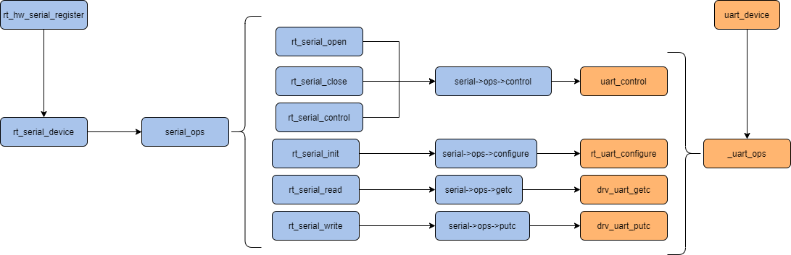
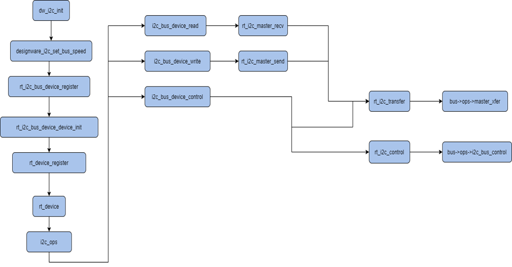
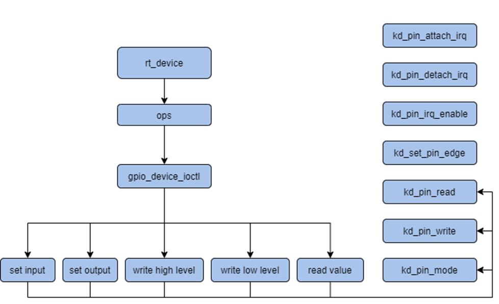
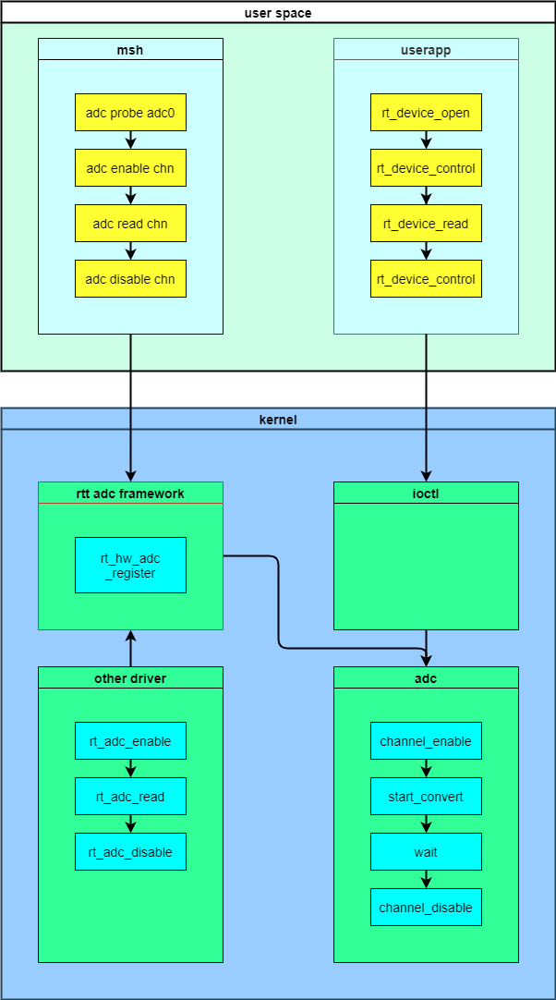
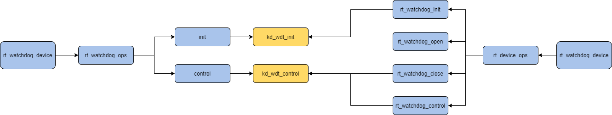
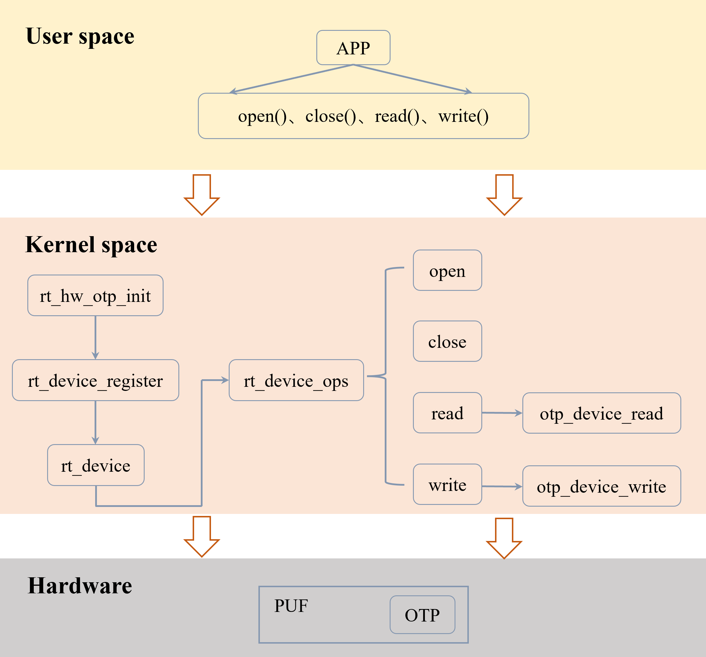
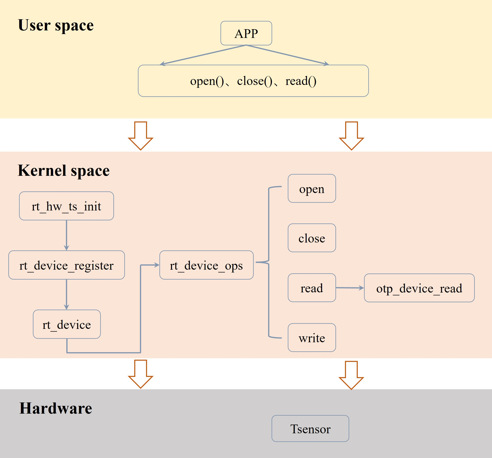
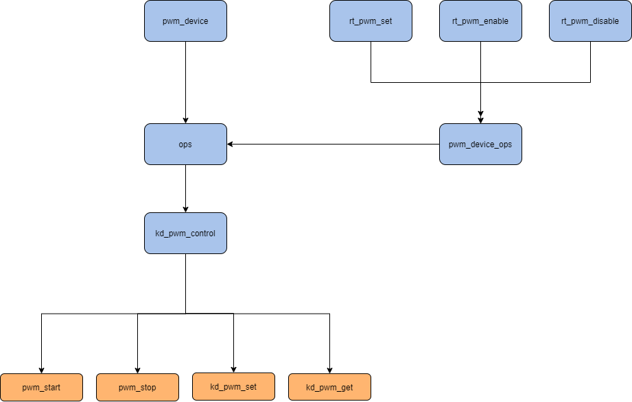
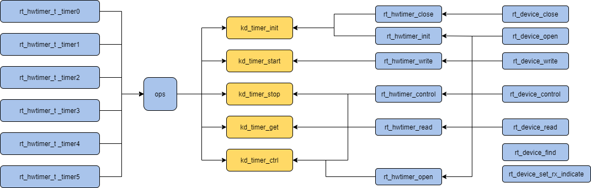

# K230 Big core low-speed driver API reference


Copyright 2023 Canaan Inc. ©

<div style="page-break-after:always"></div>

## Disclaimer

The products, services or features you purchase should be subject to Canaan Inc. ("Company", hereinafter referred to as "Company") and its affiliates are bound by the commercial contracts and terms and conditions of all or part of the products, services or features described in this document may not be covered by your purchase or use. Unless otherwise agreed in the contract, the Company does not provide any express or implied representations or warranties as to the correctness, reliability, completeness, merchantability, fitness for a particular purpose and non-infringement of any statements, information, or content in this document. Unless otherwise agreed, this document is intended as a guide for use only.

Due to product version upgrades or other reasons, the content of this document may be updated or modified from time to time without any notice.

## Trademark Notice

, "Canaan" and other Canaan trademarks are trademarks of Canaan Inc. and its affiliates. All other trademarks or registered trademarks that may be mentioned in this document are owned by their respective owners.

**Copyright 2023 Canaan Inc.. © All Rights Reserved.**
Without the written permission of the company, no unit or individual may extract or copy part or all of the content of this document without authorization, and shall not disseminate it in any form.

<div style="page-break-after:always"></div>

## Directory

[TOC]

## preface

### Overview

This document mainly introduces the design of K230 large-core RT-Smart on-driver software, including the use of UART, I2C, GPIO, Hard-lock, ADC, WDT, OTP, TS, PWM, RTC, TIMER and other drivers in user mode and kernel mode.

### Reader object

This document (this guide) is intended primarily for:

- Technical Support Engineer
- Software Development Engineer

### Definition of acronyms

| abbreviation      | illustrate                          |
|-----------|---------------------------------------------|
| UART      | Universal Asynchronous Receiver/Transmitter |
| I2C       | Inter-Integrated Circuit                    |
| GPIO      | General-purpose input/output                |
| Hard-lock | Hardware mutexes                            |
| ADC       | analog-to_digital converter                 |
| WDT       | watchdog                                    |
| OTP       | One-Time Programmable                       |
| TS        | Temperature Sensor                          |

### Revision history

| Document version | Modify the description | Author | Date |
|------------------|------------------------|--------|------|
| V1.0 | Initial edition             | Juntao Fan | 2023/4/26 |
| V1.1 | Added watchdog section    | Juntao Fan | 2023/5/26 |
| V1.2 | Added OTP TS section      | Juntao Fan | 2023/5/31 |
| V1.3 | Add PWM RTC Timer section | Juntao Fan | 2023/6/29 |

## 1 Overview

### 1.1 Overview

UART：

A universal asynchronous transceiver that communicates bidirectionally and enables full-duplex transmission and reception. In embedded designs, UART is used to communicate with PCs, including supervisory debuggers and other devices such as EEPROMs.

I2C：

Developed by Philips (migrated to NXP in 2006), a simple, two-wire, bidirectional synchronous serial bus in the early 1980s, it uses a clock line and a data line to transfer information between two devices connected to the bus, providing a simple and efficient method for data exchange between devices. Each device connected to the bus has a unique address, and any device can act as both a master and a slave, but only one master is allowed at a time.

GPIO:

(General Porpose Intput Output) Short for General Purpose Input and Output Port. Its output and input can be controlled through software, which is commonly used pins, and the high and low levels of the pin can be controlled to read or write it.

Hard-lock：

Canaan self-developed module, it is used for the mutual exclusion of shared resources between processes with the same core or between different cores, and can be used for the mutual exclusion of shared resources.

ADC:

An ADC, or Analog-to-digital converter, is a device that converts a continuously changing analog signal into a discrete digital signal. Real-world analog signals, such as temperature, pressure, sound, or images, need to be converted into digital forms that are easier to store, process, and transmit. Analog-to-digital converters can achieve this function and can be found in a variety of different products.

WDT：
WDT is the abbreviation of watchdog, essentially a timer, the software program needs to feed the dog every once in a while, if the WDT timeout can generate an interrupt signal or reset signal to the CPU, thereby preventing the program from running abnormally without resetting through the combination of software and hardware.

OTP：
OTP is mainly used to store security-sensitive confidential information, such as bootrom firmware information, encryption and decryption keys, signature information, and user-defined security information. The OTP is integrated into the security module PUF, providing secure storage capabilities for the entire SoC, protecting critical data such as the root key and boot code from being compromised by attackers. The big core side OTP driver mainly provides two functions: read and write, the readable area is 24Kbits space including production information, and the write area is the last 512 bytes of OTP space.

TS：
K230 TS (Temperature Sensor), self-developed temperature sensor, using TSMC 12nm process. The application scenario for TS is frequency reduction. The big core-side TS driver mainly provides the read function, and before reading the TS, it is necessary to configure the TS register enable signal, output mode, and then read the junction temperature of the chip. In addition, the TS register reads the die junction temperature every 2.6s.

PWM: is a method of digital coding of analog signal levels, using the duty cycle of square waves to encode the level of a specific analog signal through pulses of different frequencies, so that the output end gets a series of pulses of equal amplitude, and these pulses are used to replace the required waveform equipment.

RTC: The real-time clock can provide accurate real-time time, which can be used to generate year, month, day, hour, minute, second, day and other information.

TIMER (HWTIMER): Counts internal and external pulse signals through the internal counter module, which can work in timer mode and counter mode.

### 1.2 Function Description

The UART drive structure is as follows:



The I2C driver structure is as follows:



The GPIO driver structure is as follows:



The ADC drive structure is shown below:



Abstracts the ADC hardware into a device that contains six channels. The support sampling voltage range is 0V\~1.8V, and the floating range is 5mV.

The WDT driver structure is as follows:



The OTP drive structure is as follows:



The TS drive structure is shown in the following figure:



The PWM driver structure is shown in the following figure:



The RTC driver structure is shown in the following figure:


The TIMER drive structure is shown in the following figure:



### 1.3 Driver API usage

#### 1.3.1 UART

##### Kernel-state programs use uart

1. Locate the device handle through the device node.

`uart_dev = rt_device_find(“uart”)`

1. Turn on the serial device in interrupt receive and poll transmit modes

`rt_device_open(uart_dev, RT_DEVICE_FLAG_INT_RX)`

1. Set up the receive callback function

`rt_device_set_rx_indicate(uart_dev,call_back)`

1. Send a string

`rt_device_write(uart_dev, 0, str, (sizeof(str) - 1))`

#### 1.3.2 I2C

##### Kernel-state programs use I2C

1. Find the bus handle by the bus name

`i2c_bus = rt_i2c_bus_device_find(I2C_NAME)`

1. Create message

```text
struct rt_i2c_msg msgs
msgs.addr = CHIP_ADDRESS;
msgs.flags = RT_I2C_WR;
msgs.buf = buf;
msgs.len = 2;
```

1. Transmit

`rt_i2c_transfer(bus, &msgs, 1)`

#### 1.3.3 GPIO

##### Kernel-state programs use GPIO

1. Include header files

`#include "drv_gpio.h"`

1. Set the key input-output mode

`kd_pin_mode(LED_PIN_NUM1, GPIO_DM_OUTPUT)`
`kd_pin_mode(KEY1_PIN_NUM, GPIO_DM_INPUT)`

1. Set the high and low levels

`kd_pin_write(LED_PIN_NUM1, GPIO_PV_LOW)`
`kd_pin_write(LED_PIN_NUM1, GPIO_PV_HIGH)`

1. Read the level

`kd_pin_read(KEY1_PIN_NUM)`

1. Set the interrupt mode and bind the interrupt function

`kd_pin_attach_irq(KEY1_PIN_NUM,GPIO_PE_FALLING, key_irq, RT_NULL)`

1. Interrupt enable

`kd_pin_irq_enable(KEY1_PIN_NUM, KD_GPIO_IRQ_ENABLE)`

##### User-mode programs use GPIO (read-write only)

1. Turn on the device

`gpio_fd = open("/dev/gpio", O_RDWR)`

1. Configure the input-output mode

`ioctl(fd, GPIO_DM_OUTPUT, &mode33)`

1. Output high and low levels

`ioctl(fd, GPIO_WRITE_HIGH, &mode33)`

1. Read the level

`ioctl(fd, GPIO_READ_VALUE, &mode27)`

#### 1.3.4 Hard-lock

##### The kernel state uses hard-lock

1. Include header files

`#include "drv_hardlock.h"`

1. Request the use of a lock

`kd_request_lock(rt_uint32_t num)`

1. Release the lock

`kd_hardlock_unlock(rt_uint32_t num)`

#### 1.3.5 ADC

##### 1.3.5.1 User-mode MSH uses ADC

The steps for the user to obtain the ADC sampling value through MSH are as follows:

1. Before using a device, you need to find out if the device exists, and you can use the command adc probe followed by the name of the registered ADC device. As shown below;

`msh />adc probe adc`
`probe adc success`

1. A channel of the enable device can be enabled using the command adc enable followed by the channel number;

`msh />adc enable 0`
`adc channel 0 enables success`

1. To read data for a channel of an ADC device, you can use the command adc read followed by the channel number;

`msh />adc read 0`
`adc channel 0 read value is 0x00000796`

1. Closing a channel of a device can be followed by the channel number using the command adc enable;

`msh />adc disable 0`
`adc channel 0 disable success`

##### 1.3.5.2 User-mode programs use ADC

The steps to obtain the ADC sampling value in a user-mode program are as follows:

1. rt_device_find Find the ADC device. As follows:

`rt_device_t adc_dev;`
`adc_dev = rt_device_find("adc");`

1. Open the ADC device through the device handle. As follows:

`ret = rt_device_open(adc_dev, RT_DEVICE_OFLAG_RDWR);`

1. Enables a channel of the ADC device through a device handle. As follows:

```text
uint32_t *p;
uint32_t channel = 0;
p = (uint32_t *)(intptr_t)channel;
ret = rt_device_control(adc_dev, 0, (void *)p);
```

1. Read data from ADC through a device handle. As follows:

```text
uint32_t channel = 0;
uint32_t reg_value;
rt_device_read(adc_dev, channel, (void *)&reg_value, sizeof(unsigned int));
```

1. Disables a channel of the ADC device through the device handle when a channel of the ADC is no longer in use;

```text
uint32_t *p;
uint32_t channel = 0;
p = (uint32_t *)(intptr_t)channel;
ret = rt_device_control(adc_dev, 0, (void *)p);
```

##### 1.3.5.3 Kernel-state programs use ADC

1. Find the ADC device

The application obtains a device handle based on the ADC device name, which in turn can manipulate the ADC device, and the Find Device function is as follows:

`rt_device_t rt_device_find(const char* name);`

1. Enable ADC channels

`rt_err_t rt_adc_enable(rt_adc_device_t dev, rt_uint32_t channel);`

1. Read the ADC channel sampling value

`rt_uint32_t rt_adc_read(rt_adc_device_t dev, rt_uint32_t channel);`

1. Close the ADC channel

`rt_err_t rt_adc_disable(rt_adc_device_t dev, rt_uint32_t channel);`

#### 1.3.6 WDT

##### 1.3.6.1 User-mode programs use WDT

1. Open the Devices node

`open(WDT_DEVICE_NAME, O_RDWR);`

1. Set the timeout period

`ioctl(wdt_fd, CTRL_WDT_SET_TIMEOUT, &timeout);`

1. Start watchdog timing

`ioctl(wdt_fd, CTRL_WDT_START, NULL);`

1. Feed the dog

`ioctl(wdt_fd, CTRL_WDT_KEEPALIVE, NULL)`

##### 1.3.6.2 Kernel-state programs use WDT

1. Gets the device handle

`wdt_dev = rt_device_find(WDT_DEVICE_NAME);`

1. Initialize the device

`rt_device_init(wdt_dev);`

1. Set the timeout period

`rt_device_control(wdt_dev, KD_DEVICE_CTRL_WDT_SET_TIMEOUT, &timeout);`

1. Start watchdog timing

`rt_device_control(wdt_dev, KD_DEVICE_CTRL_WDT_START, RT_NULL);`

1. Feed the dog

`rt_device_control(wdt_dev, KD_DEVICE_CTRL_WDT_KEEPALIVE, RT_NULL);`

#### 1.3.7 OTP

The big core-side OTP driver can support scenarios such as being invoked by other kernel-state drivers and user-mode applications, and the following describes the use and precautions of OTP drivers in these two application scenarios.

##### 1.3.7.1 User-mode programs use OTP

In rt-smart, applications access hardware devices through I/O device management interfaces, and applications can access the hardware after implementing the corresponding device drivers. The RT-smart user layer accesses `/dev/otp` OTP hardware through operations,  and when user-mode applications use OTP, they can access OTP devices through operations such as open, read, write, etc. The specific operation of using OTP for user-mode applications is as follows:

1. Add header files `rtdevice.h`;
1. The application obtains a device handle based on the device name;
1. After obtaining a handle to the device, the application can open the device;
1. Initialization parameters, including offset, buffer, size;
1. Read/write data from OTP devices via device handles and parameter values;
1. Shut down the device with a device handle.

Here, the snippet code looks like this:

```c
#include <rtdevice.h>
#include <rtthread.h>

// Find the device and get the handle
otp_dev = rt_device_find(“otp”);

//  Open the device
ret = rt_device_open(otp_dev, RT_DEVICE_OFLAG_RDWR);

// Initializes read parameters and reads values from the OTP space, The parameters represent the offset to read the OTP, the length of bytes to read, and the buffer.
uint32_t pos = 0x0;
uint32_t  size = 0xC00;
uint32_t buffer[768] = {0};
ret = rt_device_read(otp_dev, pos, (void *)buffer, size);


// Initializes the write parameters and writes to the OTP space, representing the offset to write to OTP, the length of bytes to write, and the value to write.
pos = 0x0;
size = 0x4;
buffer[0] = 0xff11ff11;
ret = rt_device_write(otp_dev, pos, (void *)buffer, size);

// Close the device
rt_device_close(otp_dev);

```

##### 1.3.7.2 Kernel-state programs use OTP

In rt-smart, when other kernel-mode drivers want to read and write to the OTP space, they only need to call the interface provided by the OTP driver. The specific steps are as follows:

1. Add header files `drv_otp.h`;
1. Gets a device handle based on the device name;
1. Initialization parameters, including offset, buffer, size;
1. Read/write data from OTP devices via device handles and parameter values;
   - otp_device_read
   - otp_device_write

Here, the snippet code looks like this:

```c
#include drv_otp.h

// Get the handle
otp_dev = rt_device_find(“otp”);

// From (otp_read_base + 0x0) read 0xC00 Byte
uint32_t pos = 0x0;
uint32_t  size = 0xC00;
uint32_t buffer[768] = {0};
ret = otp_device_read(otp_dev, pos, (void *)buf, size);

// Write '0xff11ff11' to (otp_write_base + 0x0)
pos = 0x0;
size = 0x4;
buffer[0] = 0xff11ff11;
ret = otp_device_write(otp_dev, pos, (void *)buffer, size);

```

##### 1.3.7.3 Precautions

When using the read-write API, you need to pay attention to the following key points:

- Dangerous operation: OTP space is a programmable region, once the bit bit is written from 0 to 1, it cannot be recovered;
- Read and write offset: The base addresses of read and write operations are different, the readable space range of the OTP region is , and`(otp_read_base + 0x0)~(otp_read_base + 0xc00)` the length of the writable space is`(otp_write_base + 0x0)~(otp_write_base + 0x200)` ;
- Read and write size: size is a multiple of 4.

#### 1.3.8 TS

The big core-side TS driver can support scenarios such as being called by other kernel-state drivers and user-mode applications, and the following describes the use and precautions of TS drivers in these two application scenarios.

##### 1.3.8.1 User-mode programs use TS

In rt-smart, applications access hardware devices through I/O device management interfaces, and applications can access the hardware after implementing the corresponding device drivers. The RT-smart user layer accesses `/dev/ts` the TS hardware through operations ,  and when user-mode applications use TS, they can access TS devices through `open` operations such as , , ,`read` and `close` so on. The specific operation of using TS for user-mode applications is as follows:

1. Add header files `rtdevice.h`;
1. The application obtains a device handle based on the device name;
1. After obtaining a handle to the device, the application can open the device;
1. Initialization parameters, including offset, buffer, size;
1. Read data from the TS device through device handles and parameter values;
1. Shut down the device with a device handle.

Here, the snippet code looks like this:

```c
#include <rtdevice.h>
#include <rtthread.h>

// Find the device and get the handle
ts_dev = rt_device_find(“ts”);

//  Open the device
ret = rt_device_open(ts_dev, RT_DEVICE_OFLAG_RDWR);

// Initializes the read parameters and reads the values from the TS device. The parameters represent the offset of the TS read, the length of bytes to be read, and the buffer point.
uint32_t pos = 0x0;
uint32_t  size = 0x0;
uint32_t buffer[1] = {0};
ret = rt_device_read (ts_dev, pos, (void *)buffer, size);

ts_val = *(uint32_t *)buffer;
code = (double)(ts_val & 0xfff);

usleep(2600000);

if(ts_val >> 12)
{
    temp = (1e-10 * pow(code, 4) * 1.01472 - 1e-6 * pow(code, 3) * 1.10063 + 4.36150 * 1e-3 * pow(code, 2) - 7.10128 * code + 3565.87);

    printf("ts_val: 0x%x, TS = %lf C\n", ts_val, temp);
}

// Close the device
rt_device_close(ts_dev);

```

##### 1.3.8.2 Kernel-state programs use TS

In rt-smart, when other drivers in kernel mode want to read the die junction temperature, they only need to call the interface provided by the TS driver. The specific steps are as follows:

1. Add header files `drv_ts.h`;
1. Gets a device handle based on the device name;
1. Initialization parameters, including offset, buffer, size;
1. Read temperature data from the TS device through device handles and parameter values;
   - ts_device_read

Here, the snippet code looks like this:

```c
#include drv_ts.h

ts_dev = rt_device_find(“ts”);

uint32_t pos = 0x0;
uint32_t  size = 0x0;
uint32_t buffer[1] = {0};
ret = ts_device_read (ts_dev, pos, (void *)buffer, size);

```

##### 1.3.8.3 Precautions

When calling the API to read the TS temperature, you need to pay attention to the following key points:

- TS driver will read the tsensor register and return the value of the register, but the value of the register is not the real temperature value, and it needs to be converted by mathematical formulas, and the detailed formula information is as follows:

```c
// code is the result obtained by reading the value of the TS register and reserving 12 bits. temp is the temperature of the internal node of the chip
code = ts_val & 0xfff;
temp = (1e-10 * pow(code, 4) * 1.01472 - 1e-6 * pow(code, 3) * 1.10063 + 4.36150 * 1e-3 * pow(code, 2) - 7.10128 * code + 3565.87);

```

#### 1.3.9 PWM

At present, the PWM driver only provides a call method from the kernel state, and the usage method is as follows:

##### 1.3.9.1 Kernel-state programs use PWM

```c
pwm_demo:
    pwm_dev = (struct rt_device_pwm *)rt_device_find(PWM_DEV_NAME);
    /* Set the PWM period and pulse width */
    period = 100000;         /* PWM period, nanosecond ns */
    pulse = 50000;          /* PWM positive pulse width, nanosecond ns */
    rt_pwm_set(pwm_dev, PWM_DEV_CHANNEL_2, period, pulse);
    period = 100000;
    pulse = 25000;
    rt_pwm_set(pwm_dev, PWM_DEV_CHANNEL_3, period, pulse);
    period = 100000;
    pulse = 75000;
    rt_pwm_set(pwm_dev, PWM_DEV_CHANNEL_4, period, pulse);
    /* Enable PWM device, any channel of the same pwm only needs to be enabled once */
    rt_pwm_enable(pwm_dev, PWM_DEV_CHANNEL_2);
    rt_pwm_enable(pwm_dev, PWM_DEV_CHANNEL_4);
    sleep(10);
    /* disable */
    rt_pwm_disable(pwm_dev, PWM_DEV_CHANNEL_2);
    rt_pwm_disable(pwm_dev, PWM_DEV_CHANNEL_4);
```

##### 1.3.9.2 The FinSH command uses PWM

```shell
Set the period and duty cycle of a channel of a PWM device
msh />pwm_set pwm1 1 500000 5000

Enable a channel of the PWM device
msh />pwm_enable pwm1 1

Disable a channel of the PWM device
msh />pwm_disable pwm1 1
```

##### 1.3.9.3 Precautions

K230 has a total of 6 PWM channels, of which channel 0 ~ 2 (pwm 0 ~ 2) belongs to the same PWM, channel 3 ~ 5 (pwm 3 ~ 5) belongs to one PWM, when using multi-channel PWM at the same time, the same PWM, only need to enable one of the channels.
As [Kernel-state programs use PWM](#1391-kernel-state-programs-use-pwm) and channel4 only enable channel4, in which case channel3 is also enabled.

#### 1.3.10 RTC

##### 1.3.10.1 Kernel mode uses RTC

The RTC driver provides kernel-mode call methods, which are used as follows:

```c
time_t now;
rt_device_t device = RT_NULL;

device = rt_device_find(RTC_NAME);
rt_device_open(device, 0);
set_date(2024, 1, 1); //Set Date
set_time(12, 30, 0); //Set Time

while(1)
{
    now = time(RT_NULL); //Get current time
    rt_kprintf("%s\n", ctime(&now)); //Print the time
    rt_thread_mdelay(1000);
}
```

If you want to use the interrupt function of the K230 RTC, refer to the following example:

```c
void user_alarm_callback(void)
{
    rt_kprintf("[ user alarm callback function. ]\n");
}

void alarm_rtc()
{
    time_t now;
    uint32_t i;
    struct tm p_tm;
    rt_device_t dev = RT_NULL;
    struct rt_alarm * alarm = RT_NULL;
    struct kd_alarm_setup setup;

    dev = rt_device_find(RTC_NAME);
    rt_device_open(dev, 0);
    set_date(2024, 1, 1);
    set_time(1, 1, 0);

    now = time(RT_NULL);
    gmtime_r(&now,&p_tm);
    setup.flag = RTC_INT_TICK_SECOND; //The tick interrupt is triggered every second. For details, see macro definition
    setup.tm.tm_year = p_tm.tm_year;
    setup.tm.tm_mon = p_tm.tm_mon;
    setup.tm.tm_mday = p_tm.tm_mday;
    setup.tm.tm_wday = p_tm.tm_wday;
    setup.tm.tm_hour = p_tm.tm_hour;
    setup.tm.tm_min = p_tm.tm_min;
    setup.tm.tm_sec = p_tm.tm_sec;

    rt_device_control(dev, RT_DEVICE_CTRL_RTC_SET_CALLBACK, &user_alarm_callback); //set rtc interrupt callback

    rt_device_control(dev, RT_DEVICE_CTRL_RTC_SET_ALARM, &setup);   //set alarm time

    for (i=0; i<5; i++)
    {
        now = time(RT_NULL);
        rt_kprintf("%s\n", ctime(&now));
        rt_thread_mdelay(1000);
    }
    rt_device_control(dev, RT_DEVICE_CTRL_RTC_STOP_ALARM, RT_NULL); //close interrupt
    rt_device_close(dev);
}
```

##### 1.3.10.2 Precautions

When using the K230's RTC module, the PMU must be activated when the chip is powered on (refer to the PMU documentation), otherwise the RTC will not work.

Taking "K230-USIP-EVB-LP3-V1.1" as an example, it is necessary to connect the pin header io13 io14 in the J1 area and power it on.

The K230's RTC supports two interrupt modes:

```text
1. alarm interrupt (timed interrupt), which generates only one interrupt at a scheduled time.  Maximum accuracy: seconds

2. tick interrupts (periodic interrupts), such as every second, every minute, every hour, every day, etc.  Maximum accuracy: 1/64 second
```

#### 1.3.11 TIMER

##### 1.3.11.1 The kernel state uses TIMER

The TIMER driver provides kernel-state call methods, which are used as follows:

```c
static rt_err_t tmr_timeout_cb(rt_device_t dev, rt_size_t size)
{
    rt_kprintf("hwtimer timeout callback fucntion @tick\n");
    return RT_EOK;
}

/* he following example code omits error checking for function calls for reference only.*/
void test_hwtimer(void)
{
    rt_hwtimerval_t timerval;
    rt_hwtimer_mode_t mode;
    rt_size_t tsize;
    rt_uint32_t freq = 25000000;  /* Counting frequency, just 12.5M 25M 50M 100M*/

    tmr_dev_0 = rt_device_find("hwtimer0");
    tmr_dev_1 = rt_device_find("hwtimer1");

    rt_device_open(tmr_dev_0, RT_DEVICE_OFLAG_RDWR);
    rt_device_open(tmr_dev_1, RT_DEVICE_OFLAG_RDWR);

    /* Set the frequency represented by freq to timer */
    rt_device_control(tmr_dev_0, HWTIMER_CTRL_FREQ_SET, &freq)
    /* If freq is not set, the driver uses the default count frequency */


    /* Bind interrupt callback function */
    rt_device_set_rx_indicate(tmr_dev_0, tmr_timeout_cb);
    rt_device_set_rx_indicate(tmr_dev_1, tmr_timeout_cb);

    timerval.sec = 10;
    timerval.usec = 0;
    tsize = sizeof(timerval);
    mode = HWTIMER_MODE_ONESHOT;

    rt_device_control(tmr_dev_0, HWTIMER_CTRL_MODE_SET, &mode);

    /* Set the count time to timer */
    rt_device_write(tmr_dev_0, 0, &timerval, tsize);

    timerval.sec = 5;
    timerval.usec = 0;
    tsize = sizeof(timerval);
    mode = HWTIMER_MODE_ONESHOT;

    rt_device_control(tmr_dev_1, HWTIMER_CTRL_MODE_SET, &mode);
    rt_device_write(tmr_dev_1, 0, &timerval, tsize);

    while(1)
    {
        /* Gets the current count value */
        rt_device_read(tmr_dev_0, 0, &timerval, sizeof(timerval));
        rt_kprintf("Read timer0: Sec = %d, Usec = %d\n", timerval.sec, timerval.usec);

        rt_device_read(tmr_dev_1, 0, &timerval, sizeof(timerval));
        rt_kprintf("Read timer1: Sec = %d, Usec = %d\n", timerval.sec, timerval.usec);

        rt_thread_mdelay(1000);
    }

}
```

##### 1.3.11.2 Precautions

When setting the freq counting frequency, only 12.5M 25M 50M 100M can be selected, no other values can be set, the larger the freq, the higher the counting accuracy.

## 2. API Reference

### 2.1 Kernel-mode API

#### 2.1.1 UART

The UART module provides the following APIs:

- [rt_serial_init](#2111-rt_serial_init)
- [rt_serial_open](#2112-rt_serial_open)
- [rt_serial_close](#2113-rt_serial_close)
- [rt_serial_read](#2114-rt_serial_read)
- [rt_serial_write](#2115-rt_serial_write)
- [rt_serial_control](#2116-rt_serial_control)

##### 2.1.1.1 rt_serial_init

【Description】

Initialize a serial device.

【Syntax】

`rt_serial_init(struct rt_device *dev)`

【Parameters】

| Parameter name | description     | Input/output |
|----------------|----------|-----------|
| Dev      | Device handle | input      |

【Return value】

| Return value | description |
|--------|------|
| RT_EOK | succeed |
| other   | fail |

##### 2.1.1.2 rt_serial_open

【Description】

Turn on a serial device.

【Syntax】

`rt_serial_open(struct rt_device *dev, rt_uint16_t oflag)`

【Parameters】

| Parameter name | description   | Input/output |
|----------------|---------------|--------------|
| Dev      | Device handle       | input        |
| oflag    | `RT_DEVICE_FLAG_INT_RX RT_DEVICE_FLAG_DMA_RX` `RT_DEVICE_FLAG_INT_TX` `RT_DEVICE_FLAG_DMA_TX` | input |

【Return value】

| Return value  | description |
|---------------|-------------|
|     RT_EOK    |   succeed   |
|     -RT_EIO   |   fail      |

##### 2.1.1.3 rt_serial_close

【Description】

Turn off a serial device.

【Syntax】

`rt_serial_close(struct rt_device *dev)`

【Parameters】

| Parameter name | description     | Input/output |
|----------------|----------|-----------|
|  Dev    |   Device handle | input     |

【Return value】

| Return value | description |
|--------|------|
| RT_EOK | succeed |
| other   | fail |

##### 2.1.1.4 rt_serial_read

【Description】

Read serial port data.

【Syntax】

`rt_serial_read(struct rt_device *dev, rt_off_t pos, void *buffer, rt_size_t size)`

【Parameters】

| Parameter name | description   | Input/output |
|----------------|---------------|--------------|
|       Dev      | Device handle |     input    |
|       pos      | Offset to 0   |     input    |
|       buffer   | A pointer to load the data | input |
|       size     | The size to read |   input   |

【Return value】

| Return value | description |
|--------------|-------------|
|   rt_size_t  | The number of bytes read |

##### 2.1.1.5 rt_serial_write

【Description】

Send serial port data.

【Syntax】

`rt_serial_write(struct rt_device *dev, rt_off_t pos, void *buffer, rt_size_t size)`

【Parameters】

| Parameter name | description   | Input/output |
|----------------|---------------|--------------|
|       Dev      | Device handle |     input    |
|       pos      | Offset to 0   |     input    |
|       buffer   | The pointer to which the data will be written | input |
|       size     | The size to write |   input   |

【Return value】

| Return value | description |
|--------------|-------------|
|   rt_size_t  | The number of bytes written |

##### 2.1.1.6 rt_serial_control

【Description】

Through the control interface, the application can configure the serial device such as baud rate, data bit, check digit, receive buffer size, stop bit and other parameters modification.

【Syntax】

`rt_serial_control(struct rt_device *dev, int cmd, void *args)`

【Parameters】

| Parameter name | description   | Input/output |
|----------------|---------------|--------------|
|       Dev      | Device handle |   input      |
|       cmd      | Command control word, can be valued:`RT_DEVICE_CTRL_CONFIG` | input |
|       args     | Parameters of the control, desirable type: `struct serial_configure` | input |

【Return value】

| Return value | description |
|--------------|-------------|
|   RT_EOK     | The function executed successfully |
|   -RT_ENOSYS | Execution failed with dev empty |
|   other      | Execution failed |

【Differences】

none.

【Requirement】

Header file:`rtdevice.h` ,`rtthread.h`

【Note】

none

【Example】

none

【See Also】

none

#### 2.1.2 I2C

The I2C module provides the following APIs:

- [rt_i2c_bus_device_find](#2121-rt_i2c_bus_device_find)
- [rt_i2c_master_send](#2122-rt_i2c_master_send)
- [rt_i2c_master_recv](#2123-rt_i2c_master_recv)
- [rt_i2c_transfer](#2124-rt_i2c_transfer)

##### 2.1.2.1 rt_i2c_bus_device_find

【Description】

Look for the I2C bus.

【Syntax】

`rt_i2c_bus_device_find(const char *bus_name)`

【Parameters】

| Parameter name | description        | Input/output |
|----------|-------------|-----------|
| bus_name | I2C bus name | input      |

【Return value】

| Return value  | description                       |
|---------|----------------------------|
| rt_i2c_bus_device* | The function executes successfully and returns a bus handle |
| RT_NULL | The bus does not exist                 |

##### 2.1.2.2 rt_i2c_master_send

【Description】

Sends data to the I2C slave device.

【Syntax】

```text
rt_i2c_master_send(struct rt_i2c_bus_device *bus,
rt_uint16_t addr,
rt_uint16_t flags,
const rt_uint8_t *buf,
rt_uint32_t count);
```

【Parameters】

| Parameter name | description                                                                  | Input/output |
|----------|-----------------------------------------------------------------------|-----------|
| bus      | I2C bus handle                                                           | input      |
| addr     | I2C slave device address                                                        | input      |
| flags    | Flags, which can be flags`RT_I2C_WR RT_I2C_RD` other than and can be 'OR' operation | input      |
| buf      | The data buffer to be sent                                                  | input      |
| count    | Size of data to be sent (in bytes)                                          | input      |

【Return value】

| Return value | description                                 |
|--------|--------------------------------------|
| positive value | Success, returns the number of bytes sent |
| Negative | fail                                 |

##### 2.1.2.3 rt_i2c_master_recv

【Description】

Sends data to the I2C slave device.

【Syntax】

```text
rt_i2c_master_recv(struct rt_i2c_bus_device *bus,
rt_uint16_t addr,
rt_uint16_t flags,
rt_uint8_t *buf,
rt_uint32_t count)
```

【Parameters】

| Parameter name | description                                                                  | Input/output |
|----------|-----------------------------------------------------------------------|-----------|
| bus      | I2C bus handle                                                           | input      |
| addr     | I2C slave device address                                                        | input      |
| flags    | Flag bits, which can be flags`RT_I2C_WR` other than , can`RT_I2C_RD`  be 'OR' operation | input      |
| buf      | Receive data data buffer                                                    | input      |
| count    | Received data size (in bytes)                                            | input      |

【Return value】

| Return value | description                 |
|--------|---------------------|
| positive value | Success, returns the number of bytes received |
| Negative | fail                   |

##### 2.1.2.4 rt_i2c_transfer

【Description】

Sends data to the I2C slave device.

【Syntax】

```text
rt_i2c_transfer(struct rt_i2c_bus_device *bus,
struct rt_i2c_msg msgs[],
rt_uint32_t num)
```

【Parameters】

| Parameter name | description                 | Input/output |
|----------|----------------------|-----------|
| bus      | I2C bus handle          | input      |
| msg      | An array pointer to the message to be transmitted | input      |
| A      | The number of elements of the message array   | input      |

【Return value】

| Return value | description                                 |
|--------|--------------------------------------|
| 0    | Failed, the operation is not supported by the bus |
| positive value | Success, returns the number of transmitted MSG |
| -RT_EIO | The transfer failed |

【Differences】

none.

【Requirement】

Header file:`drivers/i2c.h`

【Note】

none

【Example】

none

【See Also】

none

#### 2.1.3 GPIO

The GPIO module provides the following APIs:

- [kd_pin_mode](#2131-kd_pin_mode)
- [kd_pin_write](#2132-kd_pin_write)
- [kd_pin_read](#2133-kd_pin_read)
- [kd_pin_attach_irq](#2134-kd_pin_attach_irq)
- [kd_pin_detach_irq](#2135-kd_pin_detach_irq)
- [kd_pin_irq_enable](#2136-kd_pin_irq_enable)
- [gpio_device_ioctl](#2137-gpio_device_ioctl)

##### 2.1.3.1 kd_pin_mode

【Description】

Set the GPIO pin input and output mode.

【Syntax】

`kd_pin_mode(rt_base_t pin, rt_base_t mode)`

【Parameters】

| Parameter name | description                                                                                | Input/output |
|----------|-------------------------------------------------------------------------------------|-----------|
| pin      | GPIO number                                                                            | input      |
| mode     | Mode. `GPIO_DM_INPUT`、`GPIO_DM_INPUT_PULL_DOWN`、`GPIO_DM_INPUT_PULL_UP`、`GPIO_DM_OUTPUT` | input      |

【Return value】

| Return value | description |
|--------|------|
| RT_EOK | succeed |
| other   | fail |

##### 2.1.3.2 kd_pin_write

【Description】

Set the GPIO pin level.

【Syntax】

`kd_pin_write(rt_base_t pin, rt_base_t value)`

【Parameters】

| Parameter name | description                                | Input/output |
|----------|-------------------------------------|-----------|
| pin      | GPIO number                            | input      |
| value    | Level status. `GPIO_PV_LOW`、`GPIO_PV_HIGH` | input      |

【Return value】

| Return value   | description |
|----------|------|
| No return value |      |

##### 2.1.3.3 kd_pin_read

【Description】

Set the GPIO pin level.

【Syntax】

`kd_pin_read(rt_base_t pin)`

【Parameters】

| Parameter name | description     | Input/output |
|----------|----------|-----------|
| pin      | GPIO number | input      |

【Return value】

| Return value | description                   |
|--------|------------------------|
| 0      | The current state of the pin is low     |
| 1      | Pin current level state high |

##### 2.1.3.4 kd_pin_attach_irq

【Description】

Bind the pin interrupt function and set the interrupt mode.

【Syntax】

`kd_pin_attach_irq(rt_int32_t pin,rt_uint32_t mode, void (*hdr)(void *args), void *args)`

【Parameters】

| Parameter name | description                                                                                    | Input/output |
|----------|-----------------------------------------------------------------------------------------|-----------|
| pin      | GPIO number                                                                                | input      |
| mode     | Interrupt mode. `GPIO_PE_RISING`、 `GPIO_PE_FALLING`、 `GPIO_PE_BOTH`、 `GPIO_PE_HIGH`、 `GPIO_PE_LOW` | input          |
| hdr      | Interrupt callback function, set by the user                                                                | input          |
| args     | The parameters of the interrupt callback function can be RT_NULL                                                       | input          |

【Return value】

| Return value | description     |
|--------|----------|
| RT_EOK | Binding succeeded |
| Error code | Binding failed |

##### 2.1.3.5 kd_pin_detach_irq

【Description】

Unbind the pin interrupt function and disable interrupt enable for the GPIO pin.

【Syntax】

`kd_pin_detach_irq(rt_int32_t pin)`

【Parameters】

| Parameter name | description     | Input/output |
|----------|----------|-----------|
| pin      | GPIO number | input      |

【Return value】

| Return value   | description     |
|----------|----------|
| Pin number | Dismissed successfully |
| Error code   | Dismiss failed |

##### 2.1.3.6 kd_pin_irq_enable

【Description】

Interrupt enable for GPIO pins.

【Syntax】

`kd_pin_irq_enable(rt_base_t pin, rt_uint32_t enabled)`

【Parameters】

| Parameter name | description                 | Input/output |
|----------|----------------------|-----------|
| pin      | GPIO number             | input      |
| enabled  | Whether it is enabled. `True/false` | input    |

【Return value】

| Return value | description     |
|--------|----------|
| RT_EOK | Enable success |
| Error code | Enable failed |

##### 2.1.3.7 gpio_device_ioctl

【Description】

GPIO function control.

【Syntax】

`gpio_device_ioctl(rt_device_t dev, int cmd, void *args)`

【Parameters】

| Parameter name | description      | Input/output |
|---------|-----------|----------|
| Dev      | GPIO handle | input    |
| cmd      | Control commands. `KD_GPIO_DM_OUTPUT`、 `KD_GPIO_DM_INPUT`、 `KD_GPIO_DM_INPUT_PULL_UP`、 `KD_GPIO_DM_INPUT_PULL_DOWN`、 `KD_GPIO_WRITE_LOW`、 `KD_GPIO_WRITE_HIGH`、 `KD_GPIO_READ_VALUE` | input |
| args     | A pointer to a data structure passed down from the user that contains the pin number | input |

【Return value】

| Return value | description |
|--------|------|
| RT_EOK | succeed |
| Error code | fail |

【Differences】

none.

【Requirement】

Header file:`drv_gpio.h`

【Note】

none

【Example】

none

【See Also】

none

#### 2.1.4 Hard-lock

The Hard-lock module provides the following APIs:

- [kd_request_lock](#2141-kd_request_lock)
- [kd_hardlock_lock](#2142-kd_hardlock_lock)
- [kd_hardlock_unlock](#2143-kd_hardlock_unlock)

##### 2.1.4.1 kd_request_lock

【Description】

Request the use of a lock.

【Syntax】

`kd_request_lock(rt_uint32_t num)`

【Parameters】

| Parameter name | description           | Input/output |
|----------|----------------|-----------|
| A      | Lock number. 0\~127 | input      |

【Return value】

| Return value | description     |
|--------|----------|
| 0      | The application was successful |
| -1     | The application failed |

##### 2.1.4.2 kd_hardlock_lock

【Description】

Lock.

【Syntax】

`kd_hardlock_lock (rt_uint32_t num)`

【Parameters】

| Parameter name | description           | Input/output |
|----------|----------------|-----------|
| A      | Lock number. 0\~127 | input      |

【Return value】

| Return value | description                         |
|--------|------------------------------|
| 0      | The lock is successful                     |
| -1     | The lock is in the locked state and cannot be locked this time |

##### 2.1.4.3 kd_hardlock_unlock

【Description】

Lock.

【Syntax】

`kd_hardlock_unlock (rt_uint32_t num)`

【Parameters】

| Parameter name | description           | Input/output |
|----------|----------------|-----------|
| A      | Lock number. 0\~127 | input      |

【Return value】

| Return value   | description |
|----------|------|
| No return value  |      |

【Differences】

none.

【Requirement】

Header file:`drv_hardlock.h`

【Note】

none

【Example】

none

【See Also】

none

#### 2.1.5 ADC

The ADC module provides the following APIs:

- [rt_device_find](#2151-rt_device_find)
- [rt_adc_enable](#2152-rt_adc_enable)
- [rt_adc_read](#2153-rt_adc_read)
- [rt_adc_disable](#2154-rt_adc_disable)

##### 2.1.5.1 rt_device_find

【Description】

The application obtains a device handle based on the ADC device name, which in turn can manipulate the ADC device.

【Syntax】

`rt_device_t rt_device_find(const char* name);`

【Parameters】

| Parameter name | description          | Input/output |
|----------|---------------|-----------|
| name     | ADC device name  | input      |

【Return value】

| Return value   | description                               |
|----------|------------------------------------|
| Device handle | Finding the corresponding device returns the corresponding device handle |
| RT_NULL  | Device not found                       |

【Differences】

none.

【Requirement】

- Header file:`rtdevice.h` ,`rtthread.h`

【Note】

none

【Example】

none

【See Also】

none

##### 2.1.5.2 rt_adc_enable

【Description】

The ADC needs to be enabled before reading the ADC device data, and the ADC is enabled by this function.

【Syntax】

`rt_err_t rt_adc_enable(rt_adc_device_t dev, rt_uint32_t channel);`

【Parameters】

| Parameter name | description         | Input/output |
|----------|--------------|-----------|
| Dev      | ADC device handle | input      |
| channel  | ADC channel     | input      |

【Return value】

| Return value     | description                   |
|------------|------------------------|
| RT_EOK     | succeed                   |
| -RT_ENOSYS | Failed, device action method is empty |
| Other error codes | fail                   |

【Differences】

none.

【Requirement】

- Header file:`rtdevice.h` ,`rtthread.h`

【Note】

none

【Example】

none

【See Also】

none

##### 2.1.5.3 rt_adc_read

【Description】

Reading ADC channel sampling values can be done through this function.

【Syntax】

`rt_err_t rt_adc_read(rt_adc_device_t dev, rt_uint32_t channel);`

【Parameters】

| Parameter name | description         | Input/output |
|----------|--------------|-----------|
| Dev      | ADC device handle | input      |
| channel  | ADC channel     | input      |

【Return value】

| Return value     | description       |
|------------|------------|
| The numeric value read | The numeric value read |

【Differences】

none.

【Requirement】

- Header file:`rtdevice.h` ,`rtthread.h`

【Note】

none

【Example】

none

【See Also】

none

##### 2.1.5.4 rt_adc_disable

【Description】

Closing the ADC channel can be done with this function.

【Syntax】

`rt_err_t rt_adc_disable(rt_adc_device_t dev, rt_uint32_t channel);`

【Parameters】

| Parameter name | description         | Input/output |
|----------|--------------|-----------|
| Dev      | ADC device handle | input      |
| channel  | ADC channel     | input      |

【Return value】

| Return value     | description                   |
|------------|------------------------|
| RT_EOK     | succeed                   |
| -RT_ENOSYS | Failed, device action method is empty |
| Other error codes | fail                   |

【Differences】

none.

【Requirement】

- Header file:`rtdevice.h` ,`rtthread.h`

【Note】

none

【Example】

none

【See Also】

none

#### 2.1.6 WDT

The WDT module provides the following APIs:

- [rt_device_find](#2161-rt_device_find)
- [rt_device_init](#2162-rt_device_init)
- [rt_device_control](#2163-rt_device_control)

##### 2.1.6.1 rt_device_find

【Description】

The application obtains a device handle based on the WDT device name, which in turn can manipulate the WDT device.

【Syntax】

`rt_device_t rt_device_find(const char* name);`

【Parameters】

| Parameter name | description          | Input/output |
|----------|---------------|-----------|
| name     | WDT device name  | input      |

【Return value】

| Return value   | description                               |
|----------|------------------------------------|
| Device handle | Finding the corresponding device returns the corresponding device handle |
| RT_NULL  | Device not found                       |

【Differences】

none.

【Requirement】

- Header file:`rtdevice.h` ,`rtthread.h`

【Note】

none

【Example】

none

【See Also】

none

##### 2.1.6.2 rt_device_init

【Description】

Initialize a WDT device, primarily the `timeout table`initialization of the pair.

【Syntax】

`rt_err_t rt_device_init(rt_device_t dev)`

【Parameters】

| Parameter name | description          | Input/output |
|----------|---------------|-----------|
| Dev     | WDT device handle  | input      |

【Return value】

| Return value     | description          |
|-----------|---------------|
| RT_EOK    | Initialization succeeded     |

【Differences】

none.

【Requirement】

- Header file:`rtthread.h`

【Note】

none

【Example】

none

【See Also】

none

##### 2.1.6.3 rt_device_control

【Description】

Functional functions, according to the incoming cmd, can call different functions downward, similar to the function of the user layer IOCTL.

【Syntax】

`rt_err_t rt_device_control(rt_device_t dev, int cmd, void *arg)`

【Parameters】

| Parameter name | description          | Input/output |
|----------|---------------|-----------|
| Dev     | WDT device handle         | input |
| cmd     | WDT Contrl function macro definition | input |
| Arg     | A pointer to the incoming data      | input |

【Return value】

| Return value     | description             |
|-----------|-----------------|
| RT_EOK    | The function call succeeded      |
| RT_EINVAL | Incoming cmd is invalid      |
| RT_ENOSYS | The driver does not have a contrl interface |

【Differences】

none.

【Requirement】

- Header file:`rtthread.h`

【Note】

none

【Example】

none

【See Also】

none

#### 2.1.7 OTP

In the large-core rt-smart, the OTP module mainly provides the following APIs:

- [otp_device_read](#2171-otp_device_read)
- [otp_device_write](#2172-otp_device_write)

##### 2.1.7.1 otp_device_read

【Description】

Read OTP space, readable range: offset 0x0~0xbfc, size is 0xc00.

【Syntax】

otp_device_read(rt_device_t dev, rt_off_t pos, void \*buffer, rt_size_t size);

【Parameters】

| Parameter name        | description                                          | Input/output |
|-----------------|----------------------------------------------|-----------|
| Dev             | Device handle                                      | input      |
| pos             | The offset of the address to read                             | input      |
| buffer          | Memory buffer pointer, read data will be saved in the buffer   | output      |
| size            | Size of read data (byte)                         | input      |

【Return value】

| Return value                 | description                            |
|-----------------------|---------------------------------|
| Read the actual size of the data      | In bytes byte                 |
| 0                     | Read failed, refer to the error code definition          |

【Differences】

none

【Requirement】

- Header file: drv_otp.h
- Library file: None

【Note】

none

【Example】

none

【See Also】

none

##### 2.1.7.2 otp_device_write

【Description】

Write OTP space, writable range: offset 0x0~0x1fc, size is 0x200.

【Syntax】

otp_device_write(rt_device_t dev, rt_off_t pos, const void \*buffer, rt_size_t size);

【Parameters】

| Parameter name        | description                                          | Input/output |
|-----------------|----------------------------------------------|-----------|
| Dev             | Device handle                                      | input      |
| pos             | The offset at which the data is to be written                             | input      |
| buffer          | A memory buffer pointer to place the data to be written                | output      |
| size            | Size of inhalation data (byte)                         | input      |

【Return value】

| Return value                 | description                            |
|-----------------------|---------------------------------|
| The actual size of the data written      | In bytes byte                 |
| 0                     | Write failed, refer to Error Code Definition          |

【Differences】

none

【Requirement】

- Header file: drv_otp.h
- Library file: None

【Note】

none

【Example】

none

【See Also】

none

#### 2.1.8 TS

In the large-core rt-smart, the TS module mainly provides the following APIs:

- [ts_device_read](#2181-ts_device_read)

##### 2.1.8.1 ts_device_read

【Description】

Read the chip junction temperature.

【Syntax】

ts_device_read(rt_device_t dev, rt_off_t pos, void \*buffer, rt_size_t size);

【Parameters】

| Parameter name        | description                                          | Input/output |
|-----------------|----------------------------------------------|-----------|
| Dev             | Device handle                                      | input      |
| pos             | To read the offset of the address, set to 0                     | input      |
| buffer          | Memory buffer pointer, read data will be saved in the buffer    | output      |
| size            | The size of the read data (byte), set to 0                 | input      |

【Return value】

| Return value                 | description                            |
|-----------------------|---------------------------------|
| Read the actual size of the data      | In bytes byte                 |
| 0                     | Read failed, refer to the error code definition          |

【Differences】

none

【Requirement】

- Header file: drv_ts.h
- Library file: None

【Note】

none

【Example】

none

【See Also】

none

#### 2.1.9 PWM

The PWM module provides the following kernel-state APIs:

- [rt_pwm_set](#2191-rt_pwm_set)
- [rt_pwm_enable](#2192-rt_pwm_enable)
- [rt_pwm_disable](#2193-rt_pwm_disable)

##### 2.1.9.1 rt_pwm_set

【Description】

Set the period and positive pulse width of the PWM device.

【Syntax】

`rt_pwm_set(struct rt_device_pwm *device, int channel, rt_uint32_t period, rt_uint32_t pulse)`

【Parameters】

| Parameter name  | description          | Input/output |
|----------|---------------|-----------|
| device   | PWM device handle   | input      |
| channel  | PWM channel number      | input      |
| period   | PWM cycle (NS)    | input      |
| pulse    | PWM positive pulse width (ns) | input    |

【Return value】

| Return value      | description            |
|-------------|----------------|
| RT_EOK      | succeed            |
| -RT_EIO     | device is empty     |
| -RT_ENOSYS  | The device action method is empty |
| Other error codes   | Execution failed        |

【Differences】

none.

【Requirement】

- Header file:`drivers/rt_drv_pwm.h`

【Note】

none

【Example】

none

【See Also】

none

##### 2.1.9.2 rt_pwm_enable

【Description】

Enable the PWM device.

【Syntax】

`rt_err_t rt_pwm_enable(struct rt_device_pwm *device, int channel);`

【Parameters】

| Parameter name  | description          | Input/output |
|----------|---------------|-----------|
| device   | PWM device handle   | input      |
| channel  | PWM channel number      | input      |

【Return value】

| Return value      | description             |
|-------------|-----------------|
| RT_EOK      | Device enablement successful     |
| -RT_ENOSYS  | The device action method is empty |
| Other error codes   | Device enablement failed     |

【Differences】

none.

【Requirement】

- Header file:`drivers/rt_drv_pwm.h`

【Note】

none

【Example】

none

【See Also】

none

##### 2.1.9.3 rt_pwm_disable

【Description】

Turn off the corresponding channel for the PWM device.

【Syntax】

`rt_err_t rt_pwm_disable(struct rt_device_pwm *device, int channel);`

【Parameters】

| Parameter name  | description          | Input/output |
|----------|---------------|-----------|
| device   | PWM device handle   | input      |
| channel  | PWM channel number      | input      |

【Return value】

| Return value      | description             |
|-------------|-----------------|
| RT_EOK      | The device shuts down successfully     |
| -RT_EIO     | The device handle is empty     |
| Other error codes   | Device shutdown failed     |

【Differences】

none.

【Requirement】

- Header file:`drivers/rt_drv_pwm.h`

【Note】

none

【Example】

none

【See Also】

none

#### 2.1.10 RTC

The PWM module provides the following kernel-state APIs:

- [set_date](#21101-set_date)
- [set_time](#21102-set_time)

##### 2.1.10.1 set_date

【Description】

Set the date, year, month, and day.

【Syntax】

`rt_err_t set_date(rt_uint32_t year, rt_uint32_t month, rt_uint32_t day)`

【Parameters】

| Parameter name  | description          | Input/output |
|----------|---------------|-----------|
| year   | The year to set     | input      |
| month  | The month to set     | input      |
| day    | The day to set       | input      |

【Return value】

| Return value      | description                   |
|-------------|-----------------------|
| RT_EOK      | Setup successful               |
| -RT_ERROR   | Failed, RTC device not found |
| Other error codes   | fail                   |

【Differences】

none.

【Requirement】

- Header file:`time.h`

【Note】

none

【Example】

none

【See Also】

none

##### 2.1.10.2 set_time

【Description】

Set the date, year, month, and day.

【Syntax】

`rt_err_t set_time(rt_uint32_t hour, rt_uint32_t minute, rt_uint32_t second)`

【Parameters】

| Parameter name  | description          | Input/output |
|----------|---------------|-----------|
| hour     | When to be set     | input      |
| minute   | Points to be set     | input      |
| second   | The seconds to set     | input      |

【Return value】

| Return value      | description                   |
|-------------|-----------------------|
| RT_EOK      | Setup successful               |
| -RT_ERROR   | Failed, RTC device not found |
| Other error codes   | fail                   |

【Differences】

none.

【Requirement】

- Header file:`time.h`

【Note】

none

【Example】

none

【See Also】

none

#### 2.1.11 TIMER

The TIMER module provides the following kernel-state APIs:

- `rt_device_open`
- `rt_device_control`
- [rt_device_set_rx_indicate](#21111-rt_device_set_rx_indicate)
- `rt_device_read`
- `rt_device_write`

##### 2.1.11.1 rt_device_set_rx_indicate

【Description】

Set a callback function that is called when the device receives data.

【Syntax】

`rt_err_t rt_device_set_rx_indicate(rt_device_t dev, rt_err_t (*rx_ind)(rt_device_t dev, rt_size_t size))`

【Parameters】

| Parameter name  | description          | Input/output |
|----------|---------------|-----------|
| Dev      | Open device handle | input      |
| *rx_ind  | The callback function pointer   | input      |

【Return value】

| Return value      | description                   |
|-------------|-----------------------|
| RT_EOK      | Setup successful               |
| Other error codes   | fail                   |

【Differences】

none.

【Requirement】

- Header file:`rtthread.h`

【Note】

none

【Example】

none

【See Also】

none

### 2.2 User-mode API

#### 2.2.1 ADC

The ADC block provides the following APIs in user mode:

- [rt_device_find](#2211-rt_device_find)
- [rt_device_open](#2212-rt_device_open)
- [rt_device_control](#2213-rt_device_control)
- [rt_device_read](#2214-rt_device_read)

##### 2.2.1.1 rt_device_find

【Description】

Find the device. The function looks up the device by the specified name. The application obtains a device handle based on the device name, which in turn can manipulate the device.

【Syntax】

`rt_device_t rt_device_find(const char *name);`

【Parameters】

| Parameter name | description          | Input/output |
|----------|---------------|-----------|
| name     | The name of the device.  | input      |

【Return value】

| Return value      | description             |
|-------------|------------------|
| rt_device_t | The device handle was successfully returned |
| RT_NULL     | Failure returns RT_NULL |

【Differences】

none.

【Requirement】

- Header file:`rtdevice.h` ,`rtthread.h`

【Note】

none

【Example】

none

【See Also】

none

##### 2.2.1.2 rt_device_open

【Description】

Turn on the device. Through the device handle, the application can open and close the device, when the device is opened, it will detect whether the device has been initialized, and if there is no initialization, it will call the initialization interface by default to initialize the device.

【Syntax】

`rt_err_t rt_device_open(rt_device_t dev, rt_uint16_t oflag);`

【Parameters】

| Parameter name | description                                           | Input/output |
|----------|------------------------------------------------|-----------|
| Dev      | Device handle                                       | input      |
| oflag    | The device's open mode flag bit, supported `RT_DEVICE_FLAG_RDWR` | input      |

【Return value】

| Return value    | description            |
|-----------|-----------------|
| RT_EOK    | Successfully returned to RT_EOK |
| rt error code | Failure returns an error code  |

【Differences】

none

【Requirement】

- Header file:`rtdevice.h` ,`rtthread.h`

【Note】

none

【Example】

none

【See Also】

none

##### 2.2.1.3 rt_device_control

【Description】

This function performs various control functions on the device and enables a channel of the ADC device through this function.

【Syntax】

`rt_err_t rt_device_control(rt_device_t dev, int cmd, void *arg);`

【Parameters】

| Parameter name | description                                                                                           | Input/output |
|----------|------------------------------------------------------------------------------------------------|-----------|
| Dev      | Device handle                                                                                       | input      |
| cmd      | Command control word, this parameter is usually related to the device driver. 0 means to enable the ADC corresponding channel, and 1 means to close the ADC corresponding channel | input      |
| Arg      | Controls command-related parameters. This corresponds to the ADC channel number                                                        | input      |

【Return value】

| Return value    | description            |
|-----------|-----------------|
| RT_EOK    | Successfully returned to RT_EOK |
| rt error code | Failure returns an error code  |

【Differences】

none

【Requirement】

- Header file:`rtdevice.h` ,`rtthread.h`

【Note】

- You should pass in the channel number using the third part of the sample code in section 1.2.2.

【Example】

none

【See Also】

none

##### 2.2.1.4 rt_device_read

【Description】

The function reads data from the device. When the parameter is an ADC device handle, the function reads the sampled value of the ADC channel.

【Syntax】

`rt_size_t rt_device_read(rt_device_t dev, rt_off_t pos, void *buffer, rt_size_t size);`

【Parameters】

| Parameter name | description                                                           | Input/output |
|----------|----------------------------------------------------------------|-----------|
| Dev      | Device handle. Use the obtained ADC device handle here                        | input      |
| pos      | The offset of the read. Here corresponds to the channel number                                 | input      |
| buffer   | A data buffer used to hold read data. A 32-bit unsigned number should be used here | output      |
| size     | The size of the buffer. It should be 4 bytes here                              | input      |

【Return value】

| Return value    | description                                                                                               |
|-----------|----------------------------------------------------------------------------------------------------|
| rt_size_t | Success returns the size of the actual read, in bytes if it is a character device, and in blocks if it is a block device |
| buffer    | The user holds a data buffer for reading data. Here is the sampled value of the ADC channel                                            |
| 0         | Failure returns 0                                                                                       |

【Differences】

none

【Requirement】

- Header file:`rtdevice.h` ,`rtthread.h`

【Note】

none

【Example】

none

【See Also】

none

#### 2.2.2 WDT

WDT modules can use the posix interface in user mode:

- [open](#2221-open)
- [ioctl](#2222-ioctl)

##### 2.2.2.1 open

【Description】

Open the device node from user mode.

Syntax】

`int open(const char *file, int flags, ...);`

【Parameters】

| Parameter name | description                                                           | Input/output |
|----------|----------------------------------------------------------------|-----------|
| file      | Device node path                     | input      |
| flags     | `O_RDONLY` `O_WRONLY`  patterns `O_RDWR`and so on | input      |

【Return value】

| Return value    | description                                                                                               |
|-----------|------------------------------|
| Greater than 0 | Success returns the open device node descriptor |
| Less than 0 | fail                       |

【Differences】

none

【Requirement】

- Header file:`fcntl.h`

【Note】

none

【Example】

none

【See Also】

none

##### 2.2.2.2 ioctl

【Description】

Invoke different functions of the driver by passing in different parameters.

Syntax】

`int ioctl(int fildes, int cmd, ...);`

【Parameters】

| Parameter name | description                                                           | Input/output |
|----------|----------------------------------------------------------------|-----------|
| fildes  | Device descriptor | input      |
| cmd     | command      | input      |

【Return value】

| Return value | description |
|-----|-----|
| 0   | succeed |
| Non-0 | fail |

【Differences】

none

【Requirement】

- Header file:`sys/ioctl.h`

【Note】

none

【Example】

none

【See Also】

none

#### 2.2.3 OTP

The OTP module provides the following APIs in user mode:

- [rt_device_find](#2231-rt_device_find)
- [rt_device_open](#2232-rt_device_open)
- [rt_device_read](#2233-rt_device_read)
- [rt_device_write](#2234-rt_device_write)
- [rt_device_close](#2235-rt_device_close)

##### 2.2.3.1 rt_device_find

【Description】

Find the device. The function looks up the device by the specified name. The application obtains a device handle based on the device name, which in turn can manipulate the device.

【Syntax】

`rt_device_t rt_device_find(const char *name);`

【Parameters】

| Parameter name | description          | Input/output |
|----------|---------------|-----------|
| name     | The name of the device.  | input      |

【Return value】

| Return value      | description             |
|-------------|------------------|
| rt_device_t | The device handle was successfully returned |
| RT_NULL     | Failure returns RT_NULL |

【Differences】

none.

【Requirement】

- Header file:`rtdevice.h` ,`rtthread.h`

【Note】

none

【Example】

none

【See Also】

none

##### 2.2.3.2 rt_device_open

【Description】

Turn on the device. Through the device handle, the application can open and close the device, when the device is opened, it will detect whether the device has been initialized, and if there is no initialization, it will call the initialization interface by default to initialize the device.

【Syntax】

`rt_err_t rt_device_open(rt_device_t dev, rt_uint16_t oflag);`

【Parameters】

| Parameter name | description                                           | Input/output |
|----------|------------------------------------------------|-----------|
| Dev      | Device handle                                       | input      |
| oflag    | The device's open mode flag bit, supported `RT_DEVICE_FLAG_RDWR` | input      |

【Return value】

| Return value    | description            |
|-----------|-----------------|
| RT_EOK    | Successfully returned to RT_EOK |
| rt error code | Failure returns an error code  |

【Differences】

none

【Requirement】

- Header file:`rtdevice.h` ,`rtthread.h`

【Note】

none

【Example】

none

【See Also】

none

##### 2.2.3.3 rt_device_read

【Description】

Read data from an OTP device in the readable range: offset 0x0~0xbfc, size is 0xc00.

【Syntax】

`rt_size_t rt_device_read(rt_device_t dev, rt_off_t pos, void *buffer, rt_size_t size);`

【Parameters】

| Parameter name | description                                                           | Input/output |
|----------|----------------------------------------------------------------|-----------|
| Dev      | Device handle. The obtained OTP device handle is used here                        | input      |
| pos      | The offset of the read. This corresponds to the offset of the address to be read                                 | input      |
| buffer   | A data buffer used to hold read data. A 32-bit unsigned number should be used here | output      |
| size     | The size of the buffer. Here corresponds to the size of the read data (bytes)                              | input      |

【Return value】

| Return value    | description                                                                                               |
|-----------|----------------------------------------------------------------------------------------------------|
| rt_size_t | Success returns the size of the actual read, in bytes                                                                 |
| 0         | Failure returns 0                                                                                       |

【Differences】

none

【Requirement】

- Header file:`rtdevice.h` ,`rtthread.h`

【Note】

none

【Example】

none

【See Also】

none

##### 2.2.3.4 rt_device_write

【Description】

Write data to the OTP device in the writable range of offset 0x0~0x1fc and size 0x200.

【Syntax】

`rt_size_t otp_device_write(rt_device_t dev, rt_off_t pos, const void *buffer, rt_size_t size);`

【Parameters】

| Parameter name | description                                                           | Input/output |
|----------|----------------------------------------------------------------|-----------|
| Dev      | Device handle. The obtained OTP device handle is used here                        | input      |
| pos      | Offset. This corresponds to the offset to which the data is to be written                                 | input      |
| buffer   | A data buffer used to hold read data. Place the data to be written | output      |
| size     | The size of the buffer. Here, the size of the data written (bytes) corresponds                              | input      |

【Return value】

| Return value    | description                                                                                               |
|-----------|----------------------------------------------------------------------------------------------------|
| rt_size_t | Success returns the size of the data actually written, in bytes                                                                 |
| 0         | Failure returns 0                                                                                       |

【Differences】

none

【Requirement】

- Header file:`rtdevice.h` ,`rtthread.h`

【Note】

none

【Example】

none

【See Also】

none

##### 2.2.3.5 rt_device_close

【Description】

Turn off the device.

【Syntax】

`rt_err_t rt_device_close(rt_device_t dev);`

【Parameters】

| Parameter name | description                                                           | Input/output |
|----------|----------------------------------------------------------------|-----------|
| Dev      | Device handle. The obtained OTP device handle is used here                        | input      |

【Return value】

| Return value    | description                                                                                               |
|-----------|----------------------------------------------------------------------------------------------------|
| rt_err_t | If successful, shut down the device                                                                 |
| Error code         | If it fails, an error code is returned                                                                       |

【Differences】

none

【Requirement】

- Header file:`rtdevice.h` ,`rtthread.h`

【Note】

none

【Example】

none

【See Also】

none

#### 2.2.4 TS

The TS module provides the following APIs in user mode, which are consistent with the APIs provided by OTP, please refer to the introduction of user-mode APIs in OTP [](#223-otp) .

- rt_device_find
- rt_device_open
- rt_device_read
- rt_device_close

## 3. Data Type

Data type used by the UART module: No private data type is defined

Data type used by I2C module: No private data type is defined

Data type used by ADC module: No private data type defined

Data types used by GPIO modules:

- [struct rt_device_gpio](#31-struct-rt_device_gpio)

Data type used by ADC module: No private data type defined

Types of data used by the Hard-lock module:

- [struct device_hardlock](#32-device_hardlock)

Data type used by WDT module: No private data type defined

Data type used by the OTP module: No private data type defined

Data type used by TS module: No private data type is defined

Data type used by PWM module: No private data type is defined

Types of data used by RTC modules:

- [struct kd_alarm_setup](#33-struct-kd_alarm_setup)

### 3.1 struct rt_device_gpio

【Description】

The collection of GPIO pins passed in by the user and used to load the return values when reading the pins.

【Definition】

```text
struct rt_device_gpio
{
    rt_uint16_t pin; //The gpio number
    rt_uint16_t value; //The read level value will be stored in this variable
};
```

【Note】

none

【See Also】

none

### 3.2 device_hardlock

【Description】

An abstraction of the hardlock device in the driver.

【Definition】

```text
struct device_hardlock
{
    volatile void *hw_base; // Module base address in kernel
    char used[HARDLOCK_MAX]; //Indicates whether the lock is in use. The corresponding number is set to 1 during the application
};
```

【Note】

none

【See Also】

none

### 3.3 struct kd_alarm_setup

【Description】

When configuring RTC interrupts, the interrupt type and timing time are registered down into the driver.

【Definition】

```text
struct kd_alarm_setup
{
    rt_uint32_t flag;  /* alarm flag */
    struct tm tm;     /* when will the alarm wake up user */
};
```

【Note】

none

【See Also】

none

## 4. Error codes

| Error code | Macro definitions | description       |
|----------|--------|------------|
| RT_EOK   | 0      | succeed       |
| RT_ERROR | 1      | An error has occurred |

## 5. Calculation formula

### 5.1 ADC calculation formula

The ADC hardware reference voltage is 1.8 V, 12 bit digital signal output, and 10 bits significant bit due to noise interference. After obtaining the ADC sampling voltage value through the API, the conversion to the actual voltage value is calculated as follows:

For example, when MSH gets the sampling value of the ADC of 0x713, which is 1811, the actual voltage value is:

V\~1.8V, floating range of 5mV.

### 5.2 WDT timeout calculation formula

```text
value = clock * timeout;   timeout：Timeout period set by the user, in seconds
log2(value) = ret + 16;
ret = log2(value) - 16;
```

RET is the timeout value that will eventually be configured to the WDT module.

The user does not need to care about how the timeout is calculated, the calculation process has been implemented in the driver, when the user calls ioctl or rt_device_control configures the timeout, the driver will find a value closest to the time set by the user to configure into the WDT module.
