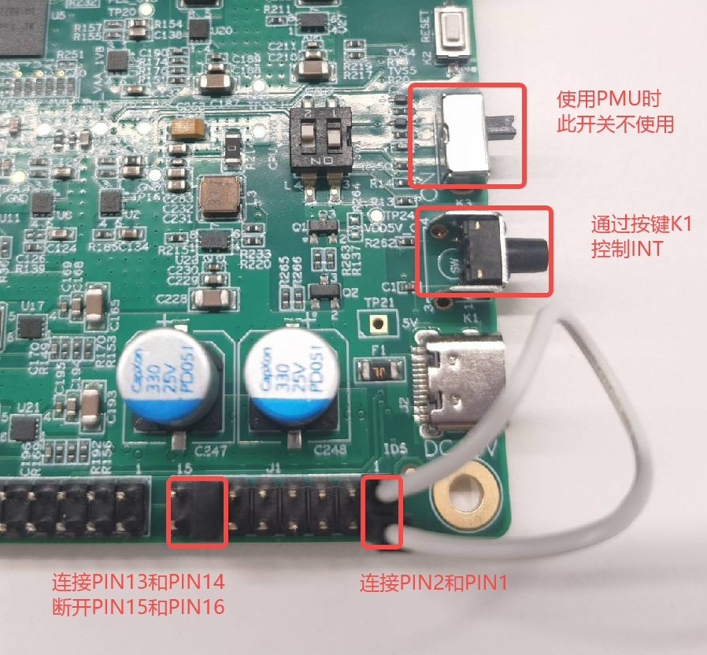
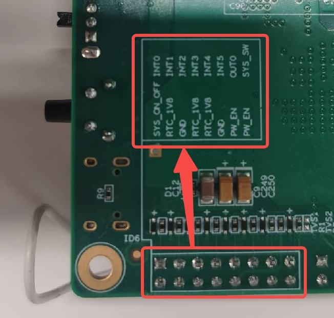

# K230 PMU User Guide


Copyright 2023 Canaan Inc. ©

<div style="page-break-after:always"></div>

## Disclaimer

The products, services or features you purchase should be subject to Canaan Inc. ("Company", hereinafter referred to as "Company") and its affiliates are bound by the commercial contracts and terms and conditions of all or part of the products, services or features described in this document may not be covered by your purchase or use. Unless otherwise agreed in the contract, the Company does not provide any express or implied representations or warranties as to the correctness, reliability, completeness, merchantability, fitness for a particular purpose and non-infringement of any statements, information, or content in this document. Unless otherwise agreed, this document is intended as a guide for use only.

Due to product version upgrades or other reasons, the content of this document may be updated or modified from time to time without any notice.

## Trademark Notice

, "Canaan" and other Canaan trademarks are trademarks of Canaan Inc. and its affiliates. All other trademarks or registered trademarks that may be mentioned in this document are owned by their respective owners.

**Copyright 2023 Canaan Inc.. © All Rights Reserved.**
Without the written permission of the company, no unit or individual may extract or copy part or all of the content of this document without authorization, and shall not disseminate it in any form.

<div style="page-break-after:always"></div>

## Directory

[TOC]

## preface

### Overview

This document describes the specific usage methods of PMU modules and SDK configuration compilation methods, including the construction of software and hardware environments, and introduces the control interface.

### Reader object

This document (this guide) is intended primarily for:

- Technical Support Engineer
- Software Development Engineer

### Definition of acronyms

| abbreviation | illustrate |
| --- | --- |
| PMU | Power Management Unit |

### Revision history

| Document version number | Modify the description | Author | date |
| --- | --- | --- | --- |
| V1.0 | Initial edition | Zhang Tao | 2023/05/19 |

## 1. Function introduction

The PMU module provides 6 input and 2 output ports, each with the following functions:

1. INT0 is used as the power on and off button by default, supporting long press to power on, long press shutdown event reporting, long press forced shutdown, level or edge event reporting, support debounce, two long press times can be matched
1. INT1 supports level or edge detection, edge count detection, both support triggering boot and reporting events, support debounce, and edge count values can be configured (it is recommended not to open both detection modes at the same time, the edge detection function will be overridden)
1. INT2 supports level or edge detection, triggers power-on and report events, and debounces
1. INT3 supports level or edge detection, triggers power-on and escalation events, and debounces
1. INT4 supports level or edge detection, triggering power-on and reporting events (edge detection recommended)
1. INT5 supports level or edge detection, triggering power-on and reporting events (edge detection recommended)
1. OUTPUT0 is used to control PMICs
1. OUTPUT1 not used yet

The PMU module also provides a log storage function of 64Byte, of which the last 4Byte is used by the driver and the remaining 60Byte is left to the user

## 2. User Control

The PMU can be controlled by the user through the device tree and sysfs, the PMU can be configured through the device tree at system startup, and the PMU can be dynamically configured through sysfs after startup

### 2.1 PMU Device Tree Configuration

```c
pmu: pmu@0x91000000 {
    compatible = "kendryte, k230-pmu";
    reg = <0x0 0x91000000 0x0 0xb0>;
    interrupt-parent = <&intc>;
    interrupts = <175>;
    status = "disabled";
    /*
    int0 {
        force-powerdown-value = <320000>;
        power-event-value = <96000>;
        debounce-value = <256>;
        type = <IRQ_TYPE_EDGE_RISING>;
        wakeup;
        event;
    };
    int1 {
        debounce-value = <256>;
        edge-cnt-type = <IRQ_TYPE_EDGE_RISING>;
        edge-cnt-value = <1>;
        edge-cnt-wakeup;
        edge-cnt-event;
        type = <IRQ_TYPE_EDGE_RISING>;
        wakeup;
        event;
    };
    int2 {
        debounce-value = <256>;
        type = <IRQ_TYPE_EDGE_RISING>;
        wakeup;
        event;
    };
    int3 {
        debounce-value = <256>;
        type = <IRQ_TYPE_EDGE_RISING>;
        wakeup;
        event;
    };
    int4 {
        type = <IRQ_TYPE_EDGE_FALLING>;
        wakeup;
        event;
    };
    int5 {
        type = <IRQ_TYPE_EDGE_RISING>;
        wakeup;
        event;
    };
    rtc {
        alarm-wakeup;
        alarm-event;
        tick-wakeup;
        tick-event;
    };
    */
};
```

Key field meanings:

- `force-powerdown-value` Long press to force shutdown time
- `power-event-value` Long press on and long press on the shutdown event time
- `debounce-value` Debounce time
- `type` Detection type, support rising edge, falling edge, high level, low level
- `wakeup` Enable power-on to wake up red energy
- `event` Enable event reporting
- `edge-cnt-type` Detection type, support rising edge, falling edge
- `edge-cnt-value` Edge count value

All times are measured in (1/32768) seconds, e.g. 327680 for 10 seconds

### 2.2 PMU file control

PMU sysfs is located in `/sys/devices/platform/soc/91000000.pmu`the directory and the file structure is as follows:

```sh
.
|-- driver -> ../../../../bus/platform/drivers/k230-pmu
|-- driver_override
|-- int0
|   |-- debounce_value
|   |-- event
|   |-- force_powerdown_value
|   |-- power_event_value
|   |-- type
|   `-- wakeup
|-- int1
|   |-- debounce_value
|   |-- edge_cnt_event
|   |-- edge_cnt_type
|   |-- edge_cnt_value
|   |-- edge_cnt_wakeup
|   |-- event
|   |-- type
|   `-- wakeup
|-- int2
|   |-- debounce_value
|   |-- event
|   |-- type
|   `-- wakeup
|-- int3
|   |-- debounce_value
|   |-- event
|   |-- type
|   `-- wakeup
|-- int4
|   |-- event
|   |-- type
|   `-- wakeup
|-- int5
|   |-- event
|   |-- type
|   `-- wakeup
|-- modalias
|-- of_node -> ../../../../firmware/devicetree/base/soc/pmu@0x91000000
|-- pmu
|   |-- pmu_logs
|   |-- pmu_regs
|   |-- pmu_status
|   `-- wakeup_source
|-- rtc
|   |-- alarm_event
|   |-- alarm_wakeup
|   |-- tick_event
|   `-- tick_wakeup
|-- subsystem -> ../../../../bus/platform
`-- uevent
```

Main file features:

- `pmu/pmu_status` PMU Status (read-only)
  - `PMU_RESET` The PMU is powered off
  - `SOC_FORCE_PD` The SoC is forced to power down
  - `SOC_NORMAL_PD` The SoC is powered off normally
  - `SOC_RESET` The SoC is reset
- `pmu/wakeup_source` system wakeup source (read-only)
  INT0,INT1,INT2,INT3,INT4,INT5,RTC_ALARM,RTC_TICK
- `pmu/pmu_logs` User LOG file (binary file, 4-byte alignment required for read and write)
- `pmu/pmu_regs` PMU debugging (binary, 4-byte alignment required for read and write)
- `int0/force_powerdown_value` Long press to force shutdown time
- `int0/power_event_value` Long press on and long press on the shutdown event time
- `int1/edge_cnt_type` Detection type, valid values "rising", "falling"
- `int1/edge_cnt_value` Edge count value
- `*/debounce_value` Debounce time
- `*/type` Detection type, valid values "rising", "falling", "low", "high"
- `*/*wakeup` Wake up, valid values "enabled", "disabled"
- `*/*event` Event reported, valid values "enabled", "disabled"

For example, enable INT1 rising edge to wake up:

```sh
cd /sys/devices/platform/soc/91000000.pmu/int1
echo rising > type
echo enabled > wakeup
```

For example, enable INT2 falling edge events to be reported:

```sh
cd /sys/devices/platform/soc/91000000.pmu/int2
echo falling > type
echo enabled > event
```

### 2.3 PMU events are reported

PMU uses the input subsystem to report events, and the reported event code is so `EV_KEY`that users can perform business processing after receiving the corresponding events. For example, after receiving`KEY_POWER` the key value, the user can perform shutdown preparation and invoke the`poweroff` shutdown command

You can use the `evtest`tool for testing with the following event table:
| action | Key value |
| :-: | :-: |
| INT0 Press and hold to shut down | KEY_POWER |
| INT0 level or edge | BTN_0 |
| INT1 level or edge or edge count | BTN_1 |
| INT2 level or edge | BTN_2 |
| INT3 level or edge | BTN_3 |
| INT4 level or edge | BTN_4 |
| INT5 level or edge | BTN_5 |
| RTC_ALARM | BTN_6 |
| RTC_TICK | BTN_7 |

### 2.4 PMU shutdown control

1. Use `poweroff`the command shutdown
1. Force shutdown by pressing the INT0 button long (not recommended unless the system is down. *Forced shutdown after system downtime will cause PMU to wake up*).

## 3. Hardware connection

When using a PMU, you need to set up the EVB board as follows

1. Use the jumper cap to connect PIN13(OUT0) and PIN14(PW_EN) of the J1 interface, taking care to disconnect PIN15(SYS_SW) and PIN16(PW_EN)
1. Depending on the different wake-up source, PIN2 (SYS_ON_OFF) is connected to the corresponding PIN using a jumper, and the button K1 can control the state of INT, press the button to go high, and release it to low
   | Wake source | PIN | label |
   | :-: | :-: | :-: |
   | INT0 | 1 | INT0 |
   | INT1 | 3 | INT1 |
   | INT2 | 5 | INT2 |
   | INT3 | 7 | INT3 |
   | INT4 | 9 | INT4 |
   | INT5 | 11 | INT5 |

Connection diagram using INT0 as a wake-up source:



## 4. Precautions

1. The PMU module is not enabled by default in the device tree, if you need to use it, enable it in the device tree
1. When using the PMU module, be sure to wake up the PMU module through any INT, otherwise the kernel will be stuck when initializing the driver
