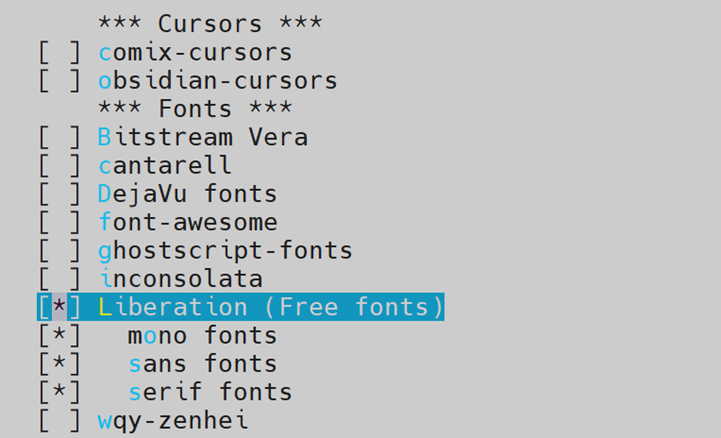
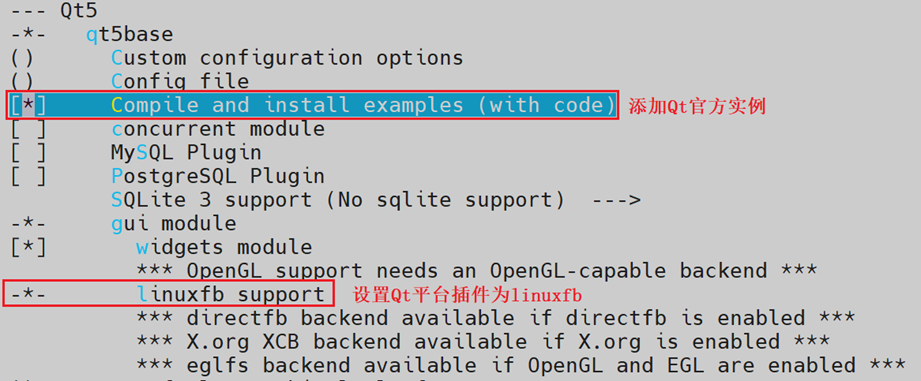
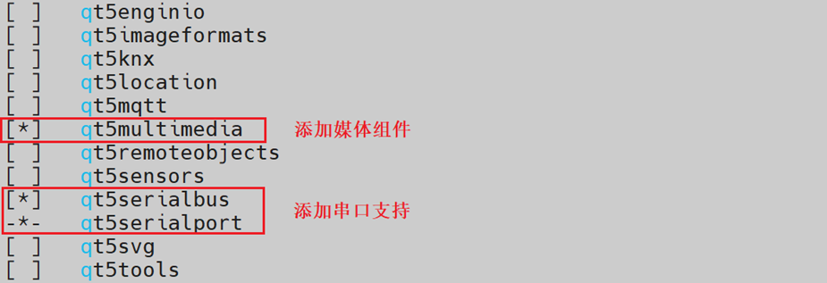
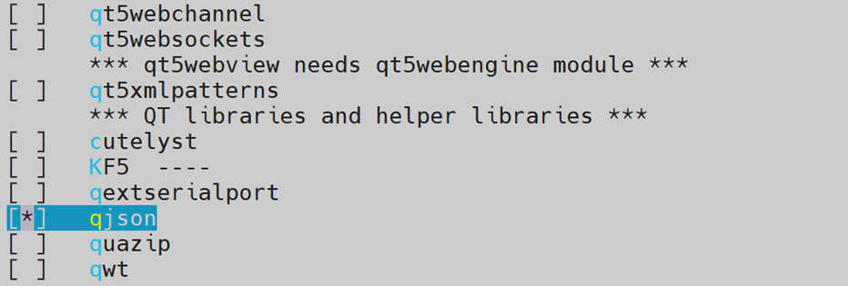

# K230 Qt Porting Guide


Copyright © 2023 Beijing Canaan Creative Information Technology Co., Ltd.

<div style="page-break-after:always"></div>

## Disclaimer

The products, services, or features you purchase are subject to the commercial contracts and terms of Beijing Canaan Creative Information Technology Co., Ltd. ("the Company", hereinafter referred to as "we") and its affiliates. All or part of the products, services, or features described in this document may not be within the scope of your purchase or use. Unless otherwise agreed in the contract, we do not make any explicit or implicit statements or warranties regarding the accuracy, reliability, completeness, merchantability, fitness for a particular purpose, or non-infringement of any representations, information, or content in this document. Unless otherwise agreed, this document is intended only as a reference for usage guidance.

Due to product version upgrades or other reasons, the content of this document may be updated or modified periodically without any notice.

## Trademark Statement

, "Canaan" and other Canaan trademarks are trademarks of Beijing Canaan Creative Information Technology Co., Ltd. and its affiliates. All other trademarks or registered trademarks mentioned in this document are owned by their respective owners.

**Copyright © 2023 Beijing Canaan Creative Information Technology Co., Ltd. All rights reserved.**
Without written permission from the Company, no unit or individual is allowed to excerpt, copy any part or all of the content of this document, and shall not disseminate it in any form.

<div style="page-break-after:always"></div>

## Table of Contents

[TOC]

## Preface

### Overview

This document mainly introduces the porting of the Qt GUI environment.

### Target Audience

This document (this guide) is primarily intended for the following personnel:

- Technical Support Engineers
- Software Development Engineers

### Revision History

| Document Version | Description of Changes | Author | Date |
| --- | --- | --- | --- |
| V1.0 | Initial version | Wang Quan | 2023/11/29 |

## 1. Introduction to Qt

Qt is a cross-platform C++ graphical user interface application development framework. It can be used to develop both GUI programs and non-GUI programs, such as console tools and servers. Qt is an object-oriented framework and is easily extensible, allowing for true component programming.

### 1.1 Features of Qt GUI

1. Excellent cross-platform characteristics, supporting Windows, Linux, FreeBSD.
1. Uses object-oriented mechanisms.
1. Rich component support, Qt includes over 250 C++ classes.

## 2. Qt Porting Instructions

This document mainly describes how to add support for Qt 5.15 through buildroot.

### 2.1 Enter the buildroot Configuration Interface

In the main directory of k230_sdk, run the following command:

```sh
make buildroot-menuconfig
```

### 2.2 Add Font Support

Click on Target packages --> Fonts, cursors, icons, sounds and themes.

The following figure shows the font configuration interface:



Try to choose free fonts to reduce subsequent copyright disputes.

### 2.3 Add Qt 5 Components

Click on Target packages --> Graphic libraries and applications (graphic/text) --> Qt 5, and select the following configuration options:

The following figures show the Qt configuration interface:






### 2.4 Save buildroot Configuration Information

In the main directory of k230_sdk, run the following command:

```sh
make buildroot-savedefconfig
```

### 2.5 View buildroot Configuration Options

After successfully adding fonts and Qt, the buildroot configuration file is as follows:

```sh
BR2_PACKAGE_QT5=y
BR2_PACKAGE_QT5BASE_EXAMPLES=y
BR2_PACKAGE_QT5BASE_WIDGETS=y
BR2_PACKAGE_QT5BASE_FONTCONFIG=y
BR2_PACKAGE_QT5BASE_HARFBUZZ=y
BR2_PACKAGE_QT5BASE_GIF=y
BR2_PACKAGE_QT5BASE_JPEG=y
BR2_PACKAGE_QT5BASE_PNG=y
BR2_PACKAGE_QT5BASE_TSLIB=y
BR2_PACKAGE_QT5MULTIMEDIA=y
BR2_PACKAGE_QT5SERIALBUS=y
BR2_PACKAGE_QJSON=y
```

## 3. Add Environment Variables and JSON Configuration File

### 3.1 Add Qt Environment Variables

```c
export QT_QPA_FB_DRM=1
export QT_QPA_EGLFS_KMS_ATOMIC=1
export QT_QPA_EGLFS_KMS_CONFIG=/etc/qt_config.json
export QT_QPA_FONTDIR=/usr/share/fonts
export QT_QPA_PLATFORM=linuxfb:rotation=0
export QT_ROOT=/usr/lib/qt
export QT_QPA_PLATFORM_PLUGIN_PATH=$QT_ROOT/plugins
export QT_QPA_GENERIC_PLUGINS="tslib:/dev/input/event0"
export XDG_RUNTIME_DIR=/tmp
export RUNLEVEL=3
export QT_DEBUG_PLUGINS=1
export QT_LOGGING_RULES="qt.qpa.*=true"
```

Save the above environment variables in the /etc/profile file of the development board file system to make the environment variables effective at startup.

The following figure shows the explanation of the relevant environment variables:

1. QT_QPA_FB_DRM=1: Since the Framebuffer driver has been deprecated by the Linux kernel, most SOC chip display drivers use the DRM architecture. Setting the QT_QPA_FB_DRM environment variable to 1 indicates that Qt uses the DRM driver and the libdrm library.
1. QT_QPA_EGLFS_KMS_ATOMIC=1: Indicates the use of the atomic API of the DRM driver instead of the default legacy API.
1. QT_QPA_EGLFS_KMS_CONFIG=/etc/qt_config.json: Sets the absolute path of the JSON configuration file.
1. QT_QPA_FONTDIR=/usr/share/fonts: Sets the absolute path of the fonts directory.
1. QT_DEBUG_PLUGINS=1: Indicates that Qt outputs debugging information when loading plugins, making it easy to know which plugins Qt has loaded, which plugins have loaded successfully, which plugins have failed to load, and the reasons for plugin loading failures, among other debugging information.
1. QT_LOGGING_RULES="qt.qpa.*=true": Enables logging of the Qt graphics and input subsystem.

### 3.2 Add JSON Configuration File

```c
{
  "device": "/dev/dri/card0",
  "outputs": [
    { "name": "DSI1", "mode": "1080x1920", "size": "1080x1920", "format": "rgb565", "physicalWidth": 68, "physicalHeight": 120}
  ]
}
```

Pay special attention to the following fields:

- name: The display is connected via DSI1. Similar connection parameters include: HDMI1, DP1, VGA1, LVDS1. Please choose according to the actual situation.
- format: Sets the color space of the Qt display buffer. This needs to be obtained by querying the layer parameters of the DRM display controller.
- physicalWidth and physicalHeight: Sets the physical size of the display, in millimeters.
