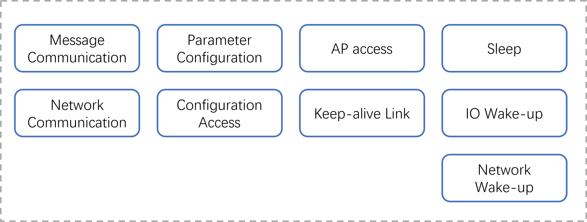

# K230 SDK IoT WiFi AiW4211LV10 User Guide


Copyright 2023 Canaan Inc. ©

<div style="page-break-after:always"></div>

## Disclaimer

The products, services or features you purchase should be subject to Canaan Inc. ("Company", hereinafter referred to as "Company") and its affiliates are bound by the commercial contracts and terms and conditions of all or part of the products, services or features described in this document may not be covered by your purchase or use. Unless otherwise agreed in the contract, the Company does not provide any express or implied representations or warranties as to the correctness, reliability, completeness, merchantability, fitness for a particular purpose and non-infringement of any statements, information, or content in this document. Unless otherwise agreed, this document is intended as a guide for use only.

Due to product version upgrades or other reasons, the content of this document may be updated or modified from time to time without any notice.

## Trademark Notice

, "Canaan" and other Canaan trademarks are trademarks of Canaan Inc. and its affiliates. All other trademarks or registered trademarks that may be mentioned in this document are owned by their respective owners.

**Copyright 2023 Canaan Inc.. © All Rights Reserved.**
Without the written permission of the company, no unit or individual may extract or copy part or all of the content of this document without authorization, and shall not disseminate it in any form.

<div style="page-break-after:always"></div>

## Directory

[TOC]

## Preface

### Overview

This document mainly describes the specific usage methods of IoT WiFi AiW4211LV10 and SDK configuration compilation methods, including software and hardware environment construction, driver loading and configuration tool use, and introduces the WiFi control interface.

### Reader Object

This document (this guide) is intended primarily for:

- Technical Support Engineer
- Software Development Engineer

### Definition of Acronyms

| abbreviation | illustrate |
|------|------|
|      |      |
|      |      |

### Revision History

| Document version number | Modify the description | Author | date       |
|------------|----------|--------|------------|
| V1.0       | Initial edition     | Xu Baikun | 2023/04/24 |

## 1. Function Introduction

AiW4211LV10 is a low-power IoT WiFi chip, our company uses this chip platform to design an AiW4211LV10 development board, the development board can be connected to the K230 EVB board through the TF card slot. After the K230 EVB is loaded with the AiW4211LV10 driver, a wlan0 wireless card can be generated to realize network data communication.


Figure 1-1 AiW4211LV10 development board

The main functions of WiFi are shown in Figure 1-1:



Figure 1-1 WiFi function block diagram

Brief introduction of the main functions of WiFi:

- Message communication: WiFi receives and parses message instructions and command parameters sent by the host to trigger the execution of corresponding events
- Network communication: network data transparent transmission
- Parameter configuration: Establishes a SoftAP, receives configuration parameters, and triggers configuration events
- Configuration access: Manage configuration files formed by configuration data, stored on flash
- AP access: Access the specified AP, monitor the access status, and handle it accordingly
- keepalive link: Establishes a keepalive link between maintenance and the remote server
- Sleep: Set the software and hardware environment, power down the host (according to the platform characteristics, the K230 is self-powered), and the WiFi enters sleep mode
- IO wake-up: Processes button or PIR wake-up signals, restores the software and hardware environment, and powers up the host
- Wake-on-LAN: Processes wake-up packets from keepalive links, restores the software and hardware environment, and powers up the host

## 2. Module Dependencies

The hardware relies on the AiW4211LV10 development board and the K230 EVB development board. Software relies on the K230 SDK.

### 2.1 Software Environment

K230 SDK V0.5.1 and later.
AiW4211LV10 SDK。

### 2.2 Hardware Environment

The K230 EVB development board is set to emmc startup, and the TF card slot is vacated for AiW4211LV10 development board access.
The hardware version and jumper of the development board are shown in Table 2-1:

Table 2-1 Development Board Versions

| **Development board**  | **Hardware version** | **Settings**                                                                  |
|-------------|--------------|---------------------------------------------------------------------------|
| K230 EVB    | V1.1         | POWER BY BUTTON STARTUP MODE, JUMPER RELATIONSHIP: 1.JUMPER J1 1----2 2.JUMPER J1 13--14 |
| AiW4211LV10 | V1.1         |                                                                           |

The K230 EVB development board is connected to the AiW4211LV10 development board pinout, and the connection relationship is shown in Table 2-2:

Table 2-2 Flying line relationship

|                   | **Link1**    | **Link2**              | **Link3**          | **Link4**        | **Link5**    | **Link6**    | **Link7**     |
|-------------------|--------------|------------------------|--------------------|------------------|--------------|--------------|---------------|
| **K230** **pin** header| TP21 (5V)    | D8. PIN9 (GPIO34)       | J1. PIN9 (RTC_INT4) | J1. PIN14 (PW_EN) |              |              |               |
| **WiFi** **header** | J6. PIN1 (5V) | J2. PIN3 (SDIO_INT_OUT) | D6. PIN3 (WH)       | Day 2. PIN2 (GPIO2)  | Day 2. PIN4 (TX) | Day 2. PIN5 (RX) | J2. PIN6 (GND) |
| **TTL-USB**       |              |                        |                    |                  | RX           | TX           | GND           |
| **Description**          | 5V power supply line     | WiFi data disconnect line         | WiFi wake-up K230 interrupt line | WiFi monitors K230 levels | com port sending and receiving    | com port sending and receiving    | com port GND      |

Connection Instructions:

- The TP21 is a 5V voltage test point that requires a soldering pin and a connection to J5 PIN16 if the K230 EVB version is V1.0
- If you use a K230 EVB that does not involve waking up WiFi, you do not need to set up Link3
- If WiFi is configured to sleep by monitoring the power state of the K230 core, Link4 is established, otherwise it is not needed.
- The connection between TTL-USB and WiFi is mainly to observe the firmware output of WiFi, and it can be left without connection
- The description of the pin headers of the AiW4211LV10 development board is shown in Table 2-3

Table 2-3 Description of the header headers of WiFi development boards

| **WIFI daughter board** **interface** | **Signal Definition** | **Description**          | **Level**             | **Necessity** | **K230 USIP LP3 EVB** **Interface** |                             |
|-----------------------|--------------|-------------------|----------------------|------------|--------------------------------|-----------------------------|
| J4                    | Goldfinger       | SDIO_CLK/CMD/DATA | SDIO signals and GND        | 3.3V       | Must connect                           | TF card slot                      |
| J6                    | PIN1         | VDD_5V_WIFI       | Power input _5V          | POWER      | Must connect                           | TP21(V1.1) or J5.PIN16(V1.0) |
|                       | PIN2         | GND               | GND                  | GND        | obligate                           |                             |
|                       | PIN3         | WIFI_WAKE_HOST    | WIFI WAKE-UP K230         | 1.8V       | Functional signals                       | J1. PIN9                     |
|                       | PIN4         | WIFI_UART0_TX     | Serial port TX, can be connected to K230   | 1.8V       | obligate                           | J8. PIN15, no connection required at this time    |
|                       | PIN5         | WIFI_UART0_RX     | Serial port RX, can be connected to K230   | 1.8V       | obligate                           | J8. PIN13, currently no connection required    |
|                       | PIN6         | HOST_WAKE_WIFI    | K230 WAKE-UP WIFI         | 1.8V       | Functional signals                       | J8. PIN11, currently no connection required    |
| J2                    | PIN1         | WIFI_POWER_EN     | WIFI enabled, reserved       | 3.3V       | obligate                           |                             |
|                       | PIN2         | GPIO2             | Monitor K230 levels         | 3.3V       | Functional signals                       | J1. PIN14                    |
|                       | PIN3         | SDIO_INT_OUT      | SDIO Interruption             | 1.8V       | Functional signals                       | J8. PIN9                     |
|                       | PIN4         | UART0_TXD         | Debug serial port TXD          | 3.3V       | Debug the serial port                       | Even PC                        |
|                       | PIN5         | UART0_RXD         | Debug serial port RXD          | 3.3V       | Debug the serial port                       | Even PC                        |
|                       | PIN6         | GND               | GND                  | GND        | Debug the serial port                       | Even PC                        |
| J3                    | PIN1         | PIR_WAKE_HOST     | PIR WAKE-UP K230          | 1.8V       | Optional                           | J1. PIN pending                  |
|                       | PIN2         | GND               | PIR power supply, connected to PIR black wire | GND        | \\                             | \\                          |
|                       | PIN3         | PIR_WAKE_WiFi     | PIR signal, connected to the PIR brown line | 3.3V       | \\                             | \\                          |
|                       | PIN4         | VDD_3V3           | PIR power supply, connected to PIR red wire | POWER      | \\                             | \\                          |

## 3. Module Configuration

### 3.1 SDK Directory Structure

The directory structure of the WiFi SDK is as follows:

├ ── README.txt // Brief compilation and usage documentation

├ - support // Store the firmware flashing tool BurnTool .exe, compile the environment to build documentation and support packages

├ - toolchain // Firmware cross-compilation toolchain

├ —— Makefile // Compilation entry Makefile, which can achieve one-click compilation

├ - SocChannel //WiFi driver and configuration tool source code

├ - AiW4211LV10 //WiFi firmware source code

The compilation-driven toolchain is not included in the SDK due to platform dependency, please contact us if necessary.

### 3.2 Customized Modifications

In the WiFi SDK, in order to facilitate firmware customization, the code closely related to the hardware design, the relevant parameters of SoftAP that need to be published and can be customized by users, as well as custom global variables used by multiple files, are placed in canaan_private.h and canaan_private.c files. The description of the key projects is shown in Table 3-1:

Table 3-1 Description of key items of customization

| **Project**                      | **Description**                                                                                                                                |
|-------------------------------|-----------------------------------------------------------------------------------------------------------------------------------------|
| CONFIG_WIFI_MONITOR_HOSTLEVEL | When this macro is enabled, WiFi triggers sleep by monitoring the power status pin of the K230 and the sleep command is ignored                                                                      |
| HOST_LLEVEL_TIME              | When used in conjunction with CONFIG_WIFI_MONITOR_HOSTLEVEL, the power status pin pulls low for a sustained HOST_LLEVEL_TIME time that triggers sleep, which is set to prevent stabilization and filter cold crank erratic conditions |
| LONG_PRESS_TIME               | Long press the K4 button on the WiFi development board for LONG_PRESS_TIME time WiFi will establish SoftAP mode for configuring AP access. Refer to 5.3.1.                                        |
| TCP_SERVER_PORT               | After the softAP is established, WiFi starts a tcp socket server to receive network configuration information, TCP_SERVER_PORT specifying the listening port                                        |
| g_softap_ipaddr               | SoftAP gateway, mask, and IP                                                                                                                  |
| g_softapcfg                   | SoftAP hotspot name and password                                                                                                                |
| gpios_config\[\] g_gpios_config | WiFi GPIO configuration table, related to hardware design, describes the number, function name, direction, interrupt type, trigger mode, and interrupt callback function of each function GPIO                                   |
| kd_gpios_hoststanby           | WiFi to Host power-down interface, can be realized according to the characteristics of the platform, because the K230 is powered down, this interface does not operate any IO                                                                |
| kd_gpios_wakehost             | WiFi powers up the host, which can be realized according to the characteristics of the platform, and for the K230 platform, WiFi sends an IO signal to the K230 PMU                                                    |

## 4. Firmware Compilation

### 4.1 Compilation Environment

For the firmware compilation environment construction, please refer to the document "AiW4211V10/AiW4211LV10 SDK Development Environment Setup User Guide .pdf", which is stored in the support directory of the WiFi SDK.
Users can also contact Chengdu Aiqi Technology Co., Ltd<http://www.aichtech.com/>. for relevant information.

### 4.2 Compilation Methods

Enter the WiFi SDK source code directory to execute the commands make all and make install, and compile the WiFi firmware, driver, configuration tools and communication interface shared library files and store them in the top-level out directory:

out/

├── Bin

│ ├── aiw4211l_demo_allinone.bin

│ ├── aiw4211lv10.ko

│ ├── wifi.conf

│ ├── iotwifi_link

│ ├── iotwifi_cli

│ └── k230_pwrdown

├── inc

│ ├── soc_msg.h

│ └── hal_iotwifi_cli.h

└── lib

└── libhal_iotwifi.so

It is also possible to compile the parts independently:
make firmware: Compile WiFi firmware aiw4211l_demo_allinone.bin
make driver: Compile the WiFi driver aiw4211lv10.ko
make tools: compile configuration tools and communication interface shared libraries, iotwifi_link, iotwifi_cli, libhal_iotwifi.so, k230_pwrdown

Note: The K230 SDK already integrates WiFi drivers, configuration tools, and communication interface libraries, so these can not be compiled

## 5. Module Starts

### 5.1 Firmware Flashing

Use the BurnTool .exe of the programming tool in the WiFi SDK support directory to flash the firmware aiw4211l_demo_allinone.bin to the AiW4211LV10 development board through the serial port.

For programming methods, please refer to the document "AiW4211V10/AiW4211LV10 BurnTool Tool Tool User Guide.pdf", which is stored in the support directory of the WiFi SDK.

Users can also contact Chengdu Aiqi Technology Co., Ltd<http://www.aichtech.com/>. for relevant information.

Figure 5-1 shows a schematic diagram of fast programming of veneers:


Figure 5-1 Rapid programming of veneer

Step 1: Choose to program the COM port
Step 2: Configure COM port parameters through the "Setting" menu item
Step 3: Select WiFi firmware
step 4: Click the "Connect" control to initiate a connection to the WiFi development board, the WiFi development board is powered on, and the tool log window can see ready to load ... , indicating that the connection has been established and can start flashing
Step 5: Click the "Send file" control to start flashing

### 5.2 Driver Loading

Refer to Section 2.2 to configure the hardware environment, press and hold the K1 button on the K230 EVB board to power on and start, and load the driver:

modprobe AIW4211LV10 or modprobe AIW4211LV10 MMC=1 GPIO=34

Start the configuration tool server side and run it in the background: iotwifi_link &

The current driver supports passing in the MMC master number and GPIO number for interrupt detection, which can achieve more flexible hardware configuration, and if no parameters are passed, the default values of 1 and 34 specified in the code are used respectively. iotwifi_link functions similar to wpa_supplicant, first up, and then synchronize the MAC address and IP address from the WiFi device side to the Host side.


Figure 5-2 Driver loading and iotwifi_link startup

### 5.3 Parameter Configuration

The access AP, sleep level, sleep cycle, wake-up IO, TCP keepalive target server, keepalive parameters, etc. of AiW4211LV10 directly affect WiFi operation, and parameters that need to be dynamically adjusted according to the actual scenario can be configured through the methods provided in Section 5.3.1 and 5.3.2.

Unless the user wants to change the configuration, there is no need to reconfigure after each boot.

#### 5.3.1 Configure AP Access Through the Network

The AiW4211LV10 development board supports configuring the name, password, and encryption method of the target AP through the network. The steps to configure AP access are as follows:

Step 1: Prepare a router and record its hotspot name, password, and encryption method information
Step 2: The AiW4211LV10 development board will start and run for the first time after the firmware is flashed, or long press the K4 button on the board for 3s after the configuration has been completed, WiFi will start the SoftAP mode to generate a hotspot and establish a socket server based on the TCP protocol
Step 3: Connect your PC to the hotspot and start NetAssist
Step 4: Configure NetAssist to connect to WiFi as a tcp socket client
Step 5: After the server parses the configuration data, connect to the specified AP and exit the SoftAP mode

If the user has the ability, he can develop a mobile APP for network configuration, and here only the PC+NetAssist solution is used for simplicity. The SoftAP parameters and configuration data format are shown in Table 5-1, and the NetAssist configuration operation is shown in Figure 5-1:

Table 5-1 SoftAP parameters and configuration data format

| **Project**    | **Parameters**                                                                                          |
|-------------|---------------------------------------------------------------------------------------------------|
| AP name     | K230                                                                                              |
| AP password | 12345678                                                                                          |
| server ip   | 192.168.43.1                                                                                      |
| server port | 35556                                                                                             |
| config data | cfg=\<targer ap name\>,\<targer ap auth\>,\<targer ap password\> for example：cfg=xuyuxuan,2,Xuyuxuan123 |


Figure 5-3 NetAssist configuration runs

#### 5.3.2 Configure AP Access Through Messages

The AiW4211LV10 development board supports configuring target AP parameters through message channels (same as 5.3.1 functions), in addition to configuring WiFi sleep parameters and tcp keepalive parameters through message channels. The message channel is a software channel established between the K230 and the AiW4211LV10 via the SDIO bus.

##### 5.3.2.1 Configuration via the Configuration Tool

The configuration steps are as follows:

Step 1: Prepare a router and start the hotspot
Step 2: Connect the PC to the hotspot, then start NetAssist, here for simplicity use PC+NetAssist as the remote keepalive server
Step 3: Configure NetAssist as a tcp socket server to wait for WiFi keepalive link access
Step 4: The K230 side edits the configuration file/etc/wifi.conf based on the hotspot information and the server information started by NetAssist
Step 5: Run the configuration tool client, parse the configuration file, and send the configuration message: iotwifi_cli --config /etc/wifi.conf
Step 6: After receiving the configuration parameters, AiW4211LV10 first stores the sleep parameters, then accesses the specified AP, and finally establishes a tcp socket client to connect to the tcp socket server established by NetAssist

/etc/wifi.conf is a WiFi working parameter configuration file, written in json format. It is basically a mapping of the [wifi_config_t](#6121-wifi_config_t) structure. For details, please refer to Chapter 6.1.2. The contents of the file are as follows:

```c
{
"sleep": {
"level": 2,
"period": 3000,
"wake_gpios": [5]
},
"conn": {
"ssid": "xuyuxuan",
"auth": 2,
"key": "Xuyuxuan123",
"bssid": "",
"pairwise": 0
},
"keepalive": {
"svrip": "192.168.50.197",
"svrport": 5001,
"time": 10,
"intvl": 2,
"probes": 5,
"hrintvl": 60,
"hrprobes": 5
}
}
```

Note: "wake_gpios": \[5\] is an array item, the current array has only one element 5, indicating that WiFi can be woken up by its own gpio5, the IO corresponds to the key K4, if the new wake-up source can be appended with comma separation. It depends on the specific hardware design.


Figure 5-4 (A) WiFi access router and assigned IP (B) tcp keepalive server

##### 5.3.2.2 Configure by Calling APIs

In the actual business program, you can configure parameters by calling the API interface [kd_wifi_config](#6121-wifi_config_t) provided by the communication interface shared library libhal_iotwifi.so. For API description, please refer to Chapter 6.1.1. The configuration steps are the same as 5.3.2.1. .

The tool introduced in Section 5.3.2.1 also iotwifi_cli configure WiFi parameters by calling this interface.

### 5.4 System Hibernation

#### 5.4.1 Configuring Hibernation Through Tools

Run the configuration tool client to send a sleep command to trigger WiFi sleep: iotwifi_cli --dirsleep


Figure 5-5 WiFi enters the hibernation log

#### 5.4.2 Sleep by Calling the API

In the actual business program, WiFi sleep can be triggered by calling the API interface [kd_wifi_sleep](#62-sleep-interface) provided by the communication interface shared library libhal_iotwifi.so. Please refer to Chapter 6.2 for details.

The tool iotwifi_cli also triggers WiFi sleep by calling this interface.

#### 5.4.3 Sleep by Monitoring Levels

The K230 EVB can be self-powered, after power-down, the level of the J1 PIN14 (PW_EN) pin of the K230 EVB development board will be pulled low, and WiFi can also trigger sleep by monitoring the level of this pin. The premise of this function is that the K230 power management function is normal, and the macro CONFIG_WIFI_MONITOR_HOSTLEVEL is enabled when compiling the WiFi firmware (not enabled by default), after enabling the macro, WiFi will ignore the sleep command sent by the K230 and sleep only according to the pin level state.

The tool k230_pwrdown can realize the relatively simple K230 EVB dual-core self-power-down, which does not do any security processing of business logic such as file storage and status detection, so it can only be used for scenario verification where the level triggers WiFi sleep. The tool is not integrated into the K230 SDK, so it needs to be copied to the K230 EVB for execution:

./k230_pwrdown

### 5.5 System Wake

#### 5.5.1 Key Wake-up

If WiFi has gone to sleep, simply press the K4 button on the AiW4211LV10 development board to wake up WiFi, WiFi will send a wake-up signal to the PMU of the K230 EVB, and if the K230 EVB is in the power-down state (non-cold start) configured in Section 5.4.3, it will be powered on.


Figure 5-6 Press the button wake-up log

#### 5.5.2 Wake on LAN

If the WiFi has gone to sleep, NetAssist sends wakeup to wake up the WiFi, WiFi will send a wake-up signal to the PMU of the K230 EVB, and if the K230 EVB is in the power-down state (non-cold start) configured in Section 5.4.3, it will be powered on.


Figure 5-7 Wake-on-LAN log

## 6. API Reference

The wireless network card generated after the AiW4211LV10 driver is loaded is no different from that of general WiFi network cards, so there is no special API for network communication functions.
In addition to basic network communication, K230 and WiFi also have two message communication interfaces, which need to be highlighted.

### 6.1 Config Interface

#### 6.1.1 API

int kd_wifi_config([wifi_config_t](#6121-wifi_config_t) \*config)
Configure WiFi working parameters:

- Configure the name, password, authentication, and encryption method of the target AP
- Configure WiFi sleep level, wake-up period, and wake-up GPIOs
- Configure TCP keepalive time parameters, etc

#### 6.1.2 Data Structures

##### 6.1.2.1 wifi_config_t

```c
typedef struct {
unsigned int config_mask;
#define CFG_MASK_SLEEP (1 << 0)
#define CFG_MASK_CONNECT (1 << 1)
#define CFG_MASK_KEEPALIVE (1 << 2)
wifi_sleep_t sleep;
wifi_connect_t conn;
wifi_keepalive_t keepalive;
} wifi_config_t;
```

Table 6-1 wifi_config_t structure members

| config_mask                    | Configure the target item mask to enable or mask the target item, for example, configure all: config_mask = CFG_MASK_SLEEP\|CFG_MASK_CONNECT\|CFG_MASK_KEEPALIVE CFG_MASK_SLEEP: Configure sleep parameters CFG_MASK_CONNECT: Configure AP connection parameters CFG_MASK_KEEPALIVE: Configure tcp keepalive parameters |
|--------------------------------|------------------------------------------------------------------------------------------------------------------------------------------------------------------------------------------------------------------------------|
| [sleep](#6122-wifi_sleep_t)         | Sleep parameters                                                                                                                                                                                                                     |
| [Conn](#6123-wifi_connect_t)        | AP connection parameters                                                                                                                                                                                                                   |
| [keepalive](#6124-wifi_keepalive_t) | TCP keepalive parameter                                                                                                                                                                                                            |

##### 6.1.2.2 wifi_sleep_t

```c
typedef struct
{
unsigned int level;
#define WIFI_SLEEP_LIGHT 1
#define WIFI_SLEEP_DEEP 2
#define WIFI_SLEEP_ULTRA 3
unsigned int period;
union
{
/*
* gpioX_wake: 0---disable, 1---enable
*/
struct {
unsigned int gpio0_wake:1;
unsigned int gpio1_wake:1;
unsigned int gpio2_wake:1;
unsigned int gpio3_wake:1;
unsigned int gpio4_wake:1;
unsigned int gpio5_wake:1;
unsigned int gpio6_wake:1;
unsigned int gpio7_wake:1;
unsigned int gpio8_wake:1;
unsigned int gpio9_wake:1;
unsigned int gpio10_wake:1;
unsigned int gpio11_wake:1;
unsigned int gpio12_wake:1;
unsigned int gpio13_wake:1;
unsigned int gpio14_wake:1;
};
unsigned int wake_gpios;
};
} wifi_sleep_t;
```

Table 6-2 wifi_sleep_t structure members

| level      | Sleep level WIFI_SLEEP_LIGHT: light sleep WIFI_SLEEP_DEEP: deep sleep, main sleep mode WIFI_SLEEP_ULTRA: super deep sleep, only 3/5/7/14 GPIO can wake up, currently not used |
|------------|------------------------------------------------------------------------------------------------------------------------------------|
| period     | Wake up period, effective value 33\~\~4000ms. WiFi periodically wakes up from sleep to detect whether the AP has sent a cache of data to itself                                             |
| wake_gpios | Enable or disable to wake up WiFi gpio (WiFi side gpio)                                                                                      |

##### 6.1.2.3 wifi_connect_t

```c
typedef struct
{
char ssid[EXT_WIFI_MAX_SSID_LEN + 1];
ext_wifi_auth_mode auth;
char key[EXT_WIFI_MAX_KEY_LEN + 1];
unsigned char bssid[EXT_WIFI_MAC_LEN];
ext_wifi_pairwise pairwise;
} wifi_connect_t;
```

Table 6-3 wifi\_**connect**\_t structure members

| ssid     | AP name                                                                                                                                                                                                                                                                         |
|----------|--------------------------------------------------------------------------------------------------------------------------------------------------------------------------------------------------------------------------------------------------------------------------------|
| Auth     | Authentication Type EXT_WIFI_SECURITY_OPEN EXT_WIFI_SECURITY_WEP EXT_WIFI_SECURITY_WPA2PSK EXT_WIFI_SECURITY_WPAPSK_WPA2PSK_MIX EXT_WIFI_SECURITY_WPAPSK EXT_WIFI_SECURITY_WPA EXT_WIFI_ SECURITY_WPA2 EXT_WIFI_SECURITY_SAE EXT_WIFI_SECURITY_WPA3_WPA2_PSK_MIX EXT_WIFI_SECURITY_UNKNOWN |
| Key      | AP password                                                                                                                                                                                                                                                                         |
| BSSID    | AP bssid, generally the AP mac address                                                                                                                                                                                                                                                     |
| pairwise | Encryption type EXT_WIFI_PARIWISE_UNKNOWN EXT_WIFI_PAIRWISE_AES EXT_WIFI_PAIRWISE_TKIP EXT_WIFI_PAIRWISE_TKIP_AES_MIX                                                                                                                                                                 |

##### 6.1.2.4 wifi_keepalive_t

```c
typedef struct
{
unsigned char svrip[16];
unsigned short svrport;
unsigned short tcp_keepalive_time;
unsigned short tcp_keepalive_intvl;
unsigned short tcp_keepalive_probes;
unsigned short heartbeat_intvl;
unsigned short heartbeat_probes;
} wifi_keepalive_t;
```

Table 6-4 wifi_keepalive_t structure members

| svrip                | IP address of the server                                                          |
|----------------------|-------------------------------------------------------------------------|
| svrport              | The port number on the server side                                                          |
| tcp_keepalive_time   | TCP layer keepalive heartbeat packet regular send cycle, seconds                                    |
| tcp_keepalive_intvl  | TCP layer keepalive heartbeat packet does not respond after a new send cycle, seconds                          |
| tcp_keepalive_probes | After the TCP keepalive heartbeat packet no response count exceeds this threshold, the TCP connection is judged to be abnormal and disconnected and reconnected |
| heartbeat_intvl      | Application layer heartbeat packet sending cycle, seconds                                                |
| heartbeat_probes     | After the application-layer heartbeat packet no response count exceeds this threshold, the socket connection is determined to be abnormal and the socket is disconnected and reconnected      |

### 6.2 Sleep Interface

int kd_wifi_sleep(void)
To control WiFi sleep, sleep related parameters are set in the config API.

## 7. WiFi Function Limitation

  AiW4211LV10 chip is a single-band wifi chip, does not support AP and STA coexistence at the same time, when the AP is fixed in a certain channel when starting, and then the STA will scan on different channels, at this time the AP will be disconnected.
  When passing in conf through sdio for misconfiguration, AiW4211LV10 will show that the sta connection ap failed serial port printing please reset conf, at this time a new correct conf can be passed in through the iotwifi_cli.
  When the STA is misconfigured through the client, the wifi will switch from the AP to STA mode, AiW4211LV10 will show that the STA connection AP fails The serial port also prints Please Reset CONF, because STA and AP cannot coexist at the same time, then the wifi chip will switch from STA to AP mode to restart TCP Server, STA needs to reconnect to the AP and re-access as a client.
