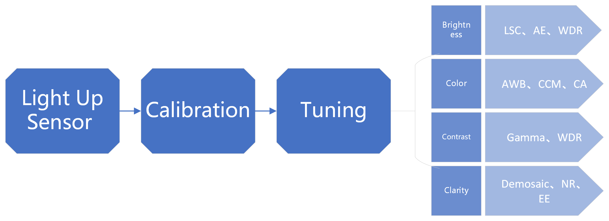
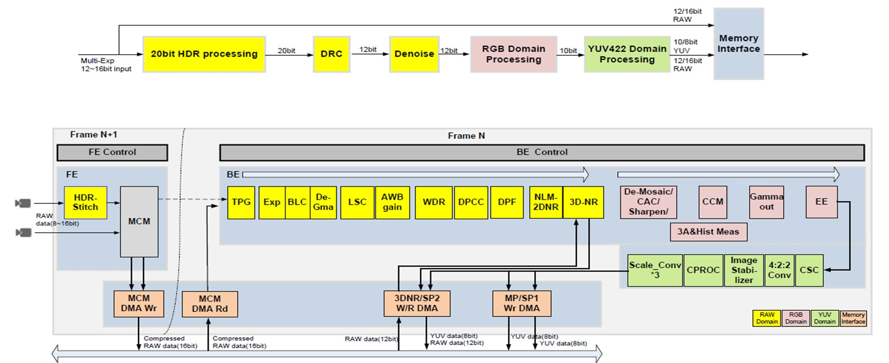

# K230 ISP Image Tuning Guide

Copyright 2023 Canaan Inc. ©

## Disclaimer

The products, services or features you purchase should be subject to Canaan Inc. ("Company", hereinafter referred to as "Company") and its affiliates are bound by the commercial contracts and terms and conditions of all or part of the products, services or features described in this document may not be covered by your purchase or use. Unless otherwise agreed in the contract, the Company does not provide any express or implied representations or warranties as to the correctness, reliability, completeness, merchantability, fitness for a particular purpose and non-infringement of any statements, information, or content in this document. Unless otherwise agreed, this document is intended as a guide for use only.

Due to product version upgrades or other reasons, the content of this document may be updated or modified from time to time without any notice.

## Trademark Notice

, "Canaan" and other Canaan trademarks are trademarks of Canaan Inc. and its affiliates. All other trademarks or registered trademarks that may be mentioned in this document are owned by their respective owners.

**Copyright 2023 Canaan Inc. © All Rights Reserved.**
Without the written permission of the company, no unit or individual may extract or copy part or all of the content of this document without authorization, and shall not disseminate it in any form.

## Directory

[TOC]

## Preface

### Overview

This document mainly guides users to perform image tuning for K230 ISP.

### Reader object

This document (this guide) is intended primarily for:

- Image Tuning Engineer
- Technical Support Engineer
- Software Development Engineer

### Revision history

| Document version number  | Modify the description                           | Author | date       |
|------------|-----------------------------------|--------|------------|
| V1.0       | Initial edition                             | Liu Jiaan | 2023-09-04 |
| V1.1       | Updated some parameters descriptions | Rong Jian | 2024-01-30 |
| V1.2       | Updated some parameters descriptions | Rong Jian | 2024-04-28 |

## 1. K230 ISP Image Tuning Overview

When it comes to image tuning, brightness, color, contrast, and clarity are our main concerns. Through the calibration of the sensor and lens and the joint tuning of the ISP submodule, the overall brightness of the image is reasonable, the color reproduction in the image is accurate, the clarity of the image is good, there is no obvious noise, the contrast of the image is high, and the overall appearance is relatively transparent.

The overall image tuning process is as follows:

K230 ISP pipeline as following figure:

Please note:

- In K230 HDR mode, the K230 CSI (Camera serial interface) module does not support the sensor data mode of Hsync before Vsync. And when the Vsync of each frame (L/S/VS) is high (effective data output), there should be no overlap.
- When enabling TNR in 3DNR, the ISP requires that the sensor Hblank should not be less than 180 pixel clocks (it is recommended to set it to not less than 256 pixel clocks), and it is recommended： the Frame length - Active lines >= 92 lines.

## 2. Calibration

### 2.1 Overview

Use the calibration tool (K230ISPCalibrationTool.exe) to complete the parameter calibration function of six ISP modules, BLC, LSC, CC, AWB, NC, and CAC.

The calibration sequence of the modules is as follows:

Before using the calibration tool(K230ISPCalibrationTool.exe), the user needs to pre-install the MATLAB Runtime (R2023a). Download address: <https://ssd.mathworks.com/supportfiles/downloads/R2023a/Release/0/deployment_files/installer/complete/win64/MATLAB_Runtime_R2023a_win64.zip>

The main interface of the calibration tool is shown in the figure below.

Click the corresponding module button to jump directly to the calibration interface of each module to start calibration.

### 2.2 Black level correction

#### 2.2.1 The principle and significance of black level calibration

When the analog signal is very weak, it may not be converted by A/D, resulting in loss of image detail when the light is very low. Therefore, Sesnor will give the analog signal a fixed offset before the A/D conversion to ensure that the output digital signal retains more image detail. The black level correction module determines the specific value of this offset by calibration. Subsequent ISP processing mode
block, you need to subtract the offset value first to ensure the linear consistency of the data. If the sensor's black level parameters are not obtained in advance, or if a more accurate black level value is required, the black level calibration is performed.

#### 2.2.2 Black level calibration acquisition RAW image

When performing black level calibration, the steps to acquire a RAW image are as follows:

1. The module is in a completely black environment (e.g. covering the lens with a black cloth) to ensure that no light enters the sensor;
1. Set the sensor's exposure mode to manual mode;
1. 12 RAW images were collected under different Gain values (1x, 2x, 3x, 4x) and different integration times (0.01ms, 0.02ms, 0.03ms).
1. And save to the folder according to the naming rules, the naming form of the folder: Gain_4_T_0.03 (Gain_4_T_0.03 means exposure gain = 4, exposure time = 0.03s), other exposure time and Gain naming form and so on.

#### 2.2.3 Start calibration using the calibration tool

When you click "Black level correction" on the main interface, the tool will pop up the dialog box as shown in the figure.

Operation steps:

1. Click the "Select" button to select the saved RAW image folder;
1. "Align Pos" text box: fill in the bayer pattern of the RAW diagram;
1. Set the Bit Width of the input and output;
1. Set the resolution: the width and height of the image;
1. Click the "OK" button to calibrate.

Thereinto:

1. Combine Channel text box: If checked, the BLC obtained by the user is the measured value of R, Gr, Gb, and B after the merger.
1. Normal File Out / Extended File Outy: If you check Normal File Out, it means that the output is blc_para.txt; if you check Extended File Out, it means that the BLC of R, Gr, Gb, and B channels will be output according to different exposure times and Gain.

After calibration, the chart of Black Level vs Integration Time is shown in the figure below.

### 2.3 Lens shading Correction

#### 2.3.1 Basic principle and significance of LSC calibration

The purpose of LSC calibration is to eliminate vignetting caused by uneven optical refraction of the lens. In the lens shading phenomenon, the brightness attenuation from the brightness of the central target point to the corner conforms to the law of cosine to the fourth power, and the brightness attenuation trend can be effectively reflected through the calibration results, and the calibration results are stored using a 32x16 grid, and then the brightness of each area of the image is restored to the brightness of the target point. LSC calibration includes luma shading and color shading calibration. Because the characteristic curves of color shading at different color temperatures are different, in order to meet the correction requirements of color shading at different color temperatures, it is necessary to calibrate the LSC at different color temperatures.

#### 2.3.2 LSC calibration acquisition RAW image

Things to note before collecting RAW images:

- Adjust the AE target brightness setting so that the average brightness in the center of the image is about 80% of the maximum value (e.g. 8bit:255).
- The light source environment of the LSC acquisition object must be a light source with a flat and uniform luminance distribution, and the acquisition object must remain smooth and texture-free, so the DNP light box can be selected as the scene for LSC calibration and acquisition of RAW images.

When performing LSC calibration, the steps to acquire RAW images are as follows:

1. The lens of the control equipment is aimed at the target area of the DNP light box and ensures that the environment is not disturbed;
1. Open the DNP light box, the color temperature light source is cut to D65, and the illumination of the light box is suitable;
1. Collect a RAW image;
1. Switch the light source of the DNP light box (D50, TL84, F12, A) and repeat steps 2-3.

#### 2.3.3 Start calibration using the calibration tool

When you click "Lens Shade correction" on the main interface, the tool will pop up the dialog box as shown in the figure.

Specific operation steps:

1. In Region 2, check the bayer pattern type of the RAW image, fill in the image width, height, and bit width, check the type of LSC correction required (Color Shading or Lumi&Color Shading), check the color temperature light source in the CCT drop-down menu, and fill in the Black Level Offset value for each channel in the offset Subtraction column;
1. Click the "load image" button in Region 1 to import the RAW image to be calibrated;
1. Region 3 is set for LSC knot positions. First, determine the number of grids. The hardware statistics of K230 ISP LSC are 32x16 grids, so "33Full x 17Symm knots" can be selected for calibration; If you plan to use the ISP ALSC function, check "ALSC uniform..."; If "Automatic initial knot positioning" is checked, the ALSC function cannot be enabled in auto.json.
1. Region 4 selects the maximum calibration ratio of the center/corner;
1. Region 5 can set the compensation ratio of the corner (if it is set to 80%, it means that the brightness of the corner to be calibrated is 80% of the center brightness.);
1. Keep the other settings as default;
1. Click "Start" to start calibration and save LSC data;
1. Region 6 selects the calibrated LSC data to apply to the image, preview the calibration effect, and click "save image to file" to save the Png image under each light source.

Note: When setting the compensation ratio in step 5, it should be determined according to the severity of the shading of the lens. When the lens shading is very serious, the gain of the four corners of the picture compensation is very large, which is easy to cause the noise of the four corners to become larger. At this time, it is necessary to reduce the compensation ratio to achieve the purpose of optimizing the four-corner noise.

### 2.4 Color Correction

#### 2.4.1 CCM calibration principle

The principle of CCM calibration is to calculate a 3x3 CCM matrix by comparing the actual color information of the 24-color card color block collected by the sensor with its expected value. CCM's 3x3 matrix converts the sensor's color space to the sRGB standard color space.

#### 2.4.2 CC calibration to acquire RAW images

When performing CC calibration, the steps to acquire RAW images are as follows:

1. The 24-color card can be placed on the inner wall of the standard lightbox (the lens is directly facing the color card to collect the RAW image) or the 24-color card can be placed at the bottom of the lightbox (the lens and the 24-color card are at a 45-degree angle to collect the RAW image);
1. Open the standard light box, select the D65 light source, and adjust the illumination of the light box;
1. Adjust the distance and position of the lens to the 24-color card to ensure that the 24-color card occupies about 2/3 of the image range;
1. Adjust the AE target brightness setting to ensure that the average brightness of the RAW graph is about 50;
1. Collect a RAW image;
1. Switch the light source (D50, TL84, F12, A) and repeat step 5;
1. Keeping the lens position still, remove the 24-color card and collect a RAW image of the gray wall background inside the light box under 5 light sources.

#### 2.4.3 Start calibration using the calibration tool

When you click "Color Correction" on the main interface, the tool will pop up the dialog box as shown in the figure.

The specific operation steps are as follows:

1. Set the width, height, bit width, Black level Offset, and bayer pattern of the RAW image in area 1;
1. Click the "Load" option to import color checker reference file CC_Standard.cxf(click "Load sRGB References"，this cxf file is located in  the director of calibration tool Canaan.Calibration.Samples\Data\), 24-color card RAW image(click "Load Color Checker Image"), gray wall background RAW image(click "Load Background Image");
 Import reference color checker, and you can also obtain the Lab values of customer reference through the "Load Lab Customer References" option under the "Load" option; Alternatively, you can use the "Load References Image" option under the "Load" option to access the reference color checker image file, and then select "Select Reference Color Checker" under the "Function" option. Move the mouse to control the crosshairs so that they are located at the center of the four corners color blocks. Click the mouse one by one to complete the area selection of the reference color checker.
1. Click the "LSC" button to import the calibrated LSC parameter file;
1. Configure calibration parameters;
    - Set up gamma
    - Check CIELAB Reference
    - Configure the 24-patch weight
    - Set the preferred light source
    - Set the output saturation, which defaults to 1
1. Select the way to select 24 color blocks in the drop-down key of area 3 (there are three modes: automatic, semi-automatic and manual);
 At semi-automatic mode, move the mouse to control the crosshairs so that they are located at the center of the four corners color blocks. Click the mouse one by one to complete the area selection of the reference color checker.
1. Click "Caibrate" to start calibration.

### 2.5 Auto White Balance

#### 2.5.1 Basic principle and significance of AWB calibration

AWB calibration, that is, the calculation of the best Planck fit curve and color temperature fitting curve based on the white point characteristics (R/G, B/G) of the sensor under several standard light sources. The purpose of AWB calibration is to enable the camera to automatically recognize and adapt to various color temperature light source conditions to guarantee the accurate reproduction of white and other colors in the image.

#### 2.5.2 Start calibration using the calibration tool

When you click "Auto White Balance" on the main interface, the tool will pop up the dialog box as shown in the figure.

The specific operation steps are as follows:

1. Click the "file" button to import the sensor spectral sensitivity file, as shown in the following figure;

   

   Note: If the user does not have the sensor spectral sensitivity file they are using, use the default OV2775_sensitivity.txt (this txt file is located in  the director of calibration tool Canaan.Calibration.Samples\Data\) in the toolkit. Because AWB calibration now does not depend on the sensor spectral sensitivity file, but in order not to affect the subsequent operation, so import any sensor spectral sensitivity file.

1. Click the "illuination" button, import the light file CIE_Illuminants.cxf (this cxf file is located in  the director of calibration tool Canaan.Calibration.Samples\Data\), and select the light sources to be calibrated (at least 3), as shown in the figure. Click the "OK" button, the spectral release of each light source will be displayed on the left as shown in the figure, and each light source will be divided into indoor light source and outdoor light source by drop-down key.

   

   

1. Click the "AWB V2+ Calibration" button（please click the "Start Calibration" button in old version calibration tool） and select the parameter file of each light source generated by CC calibration as shown in the red box of the figure;

   

1. Check the "White Points Evalute" box and select an image for white point estimation;

1. Click the "Gain Region Modifier" button, select the png picture of each light source saved in the LSC calibration, as shown in the figure, click "OK" to enter the next step;

   

1. Define the starting point range size of the gain polygon, as shown in the figure, click the "OK" button to enter the next step;

   

1. Manually adjust the range of the orange box (near the white area) and the black box (all identified as white points in the black box) through the button in the red frame area, and adjust the range of the black box to include all the selected white points of the light source, as shown in the figure. Save the data and, if the test fails, resize the polygon.

   

#### 2.5.3 calibration of AWB parameter K_Factor

In the AWB algorithm, the judgement for outdoor environment is: Exp*K_Factor <=0.12 (Exp is exposure).

For example, take 2000 lux as the ambient illumination segmentation point for the outdoor and transition, obtain the exposure value (ET \* gain) corresponding to this illumination and calculate: K_Factor=0.12/(ET \* gain).

### 2.6 Noise Calibration

#### 2.6.1 The principle and significance of Noise Profile calibration

Noise Profile calibration involves the quantitative measurement and characterization of the noise characteristics generated by the sensor under different conditions. This is because, when sensors operate at different light, temperature, or ISO settings, they generate different types and magnitude of noise. Understanding the characteristics of these noises is key to effective noise reduction or correction.

#### 2.6.2 Noise Profile calibrated to acquire RAW images

When performing CC calibration, the steps to acquire RAW images are as follows:

1. Place the black and white gradient test card on the inner wall of the standard light box, open the light box and select the D50 color temperature light source;
1. Turn off AE, change to manual exposure mode, and collect two sets of RAW images, each group of 30 pictures;
    - Light group: adjust the brightness of the light box, maintain the exposure time, keep gain 1x unchanged, so that the black area of the gradient card is in the middle gray value;
    - Dark group: Adjust the brightness of the light box, maintain the exposure time, keep the gain 1x unchanged, so that the gradient card white area is in the middle gray value.

#### 2.6.3 Start calibration using the calibration tool

When you click "Noise Calibration" on the main interface, the tool will pop up the dialog box as shown in the figure.

The specific operation steps are as follows:

1. Set the width and height, bit width, and black level offset of the RAW image;
1. Click the "flie" button to import two sets of light and dark RAW image series;
1. Click the "ROI" button to set the ROI of the image;
1. Adjust the parameters. For the Lowlight histogram, take the histogram area from Lower range to Split point; for the Highlight histogram, take the histogram from Split point to Higher ranger, and the superposition area of the two should basically cover all value intervals (8bit width) of 0~255. For the selection of Split point and high range value points, the reserved areas of hightlight and lowlight should be made to conform to the Poisson distribution. If black level offset is set, Lower range >= black level;
1. Gamma correction and Model Fitting require no setup;
1. 点击“Evaluate Measures”；
1. Click "Fit to Model" again to complete the Noise calibration and save the result.

### 2.7 Chromatic Aberration Correction

#### 2.7.1 The principle and significance of CAC calibration

Chromatic aberration is a common optical defect that occurs when a lens cannot concentrate all colors of light on the same focal point. This often results in a red-green or blue-violet color shift at the edges of the image. To correct for this offset, we need to make a CAC correction. By analyzing the captured image data, a mathematical model can be built to describe chromatic aberration. Once the model is established, corrective parameters can be determined, which will be used to correct for chromatic aberration.

#### 2.7.2 CAC calibration acquisition RAW image

When performing CAC calibration, the steps to acquire RAW images are as follows:

1. Place the checkerboard or dot image on the inner wall of the standard light box, open the light box and select the D50 color temperature light source;
1. Adjust the AE setting so that the minimum value of the black block point needs to be greater than the BLC value, and the maximum value of the white area does not exceed 208;
1. Collect a RAW image and save it.

#### 2.7.3 Start calibration using the calibration tool

When you click "Chromatic Aberration Correction" on the main interface, the tool will pop up the dialog box as shown in the figure.

The specific operation steps are as follows:

1. Click the "Demosaic & Filter" button and set the bayer pattern format;

1. Click the "load image" button to load the RAW image, and the image can be displayed in the preview window;

1. Set the parameters under the "Demosaic & Filter" interface;

   Because the CAC module comes after demosaic, the tool implements a simple demosaic function here.

    - ISP_demosaic_threshold: The default value for the threshold is set to 4. A higher value is set, the edge detection algorithm detects fewer edges, a lower value results in more edges being detected, and a value of 255 indicates that edge detection is completely disabled.
    - Simulate 2 additional Line Buffers: Allows the user to extend the vertical offset. This allows vertical vector clipping to be set to +-3. In this case, filtering that reduces chromaticity is not performed, and it is not checked by default.
    - Filter stage1 select：
    - Sharpen Level：
    - Denoise Level：
    - Lum_weight Off: A special feature that allows the filter algorithm to be deactivated. This feature helps suppress noise that is stronger in dark areas than in light areas. Due to nonlinear gamma correction, in the processing chain, contrast and noise are emphasized in dark areas and attenuated in bright areas. To compensate for this, the texture parameters are weighted using a function derived from the average brightness of the 5x5 core before comparing them to the threshold. By default, it is not checked, and the image preview effect has little noise.

1. Click the "Color Correction" button to set the parameters under this interface;

    - Check "ISP_bls_enable" to set the correct BLC;
    - Check "Auto White-Balance”；
    - Set up CCM;
    - Global gain is set to 1.0 by default.

1. Click the "Gamma" button to set the gamma curve, the default setting is gamma 2.2;

1. Click the "LSC" button, and then click "Load parameters" to load the LSC calibration parameters under the corresponding light source D50 and check "Enable";

1. Click the "CA Estimate" button, check the "CA_Estimate" box, and click "Process" to run;

1. Click the "CAC" button to see the calibration results from this interface.

## 3. Module introduction

### 3.1 BLS

#### 3.1.1 Function Description

Subtract the offset value of the black level to ensure the linear consistency of the data.

#### 3.1.2 Main parameters

| parameter        | Type and value range      | description       |
| ---------- | ----------------- | ------------------------------------------- |
| bls_enable | bool              | BLS enable switch                                 |
| bls        | int bls[4] 0~4095 | Black level compensation value for four channels, value based on ISP 12bits |

#### 3.1.3 Tuning Strategy

Although four separate black level compensation values are supported, it is recommended to use the same values.

### 3.2 LSC

#### 3.2.1 Function Description

In the K230, the LSC algorithm calibrates the image using a 32x16 grid. During the RAW image data processing process, the LSC algorithm divides the image into 32x16 subblocks and processes the four channels of the RAW image.

#### 3.2.2 Main parameters

| parameter        | Type and value range      | description       |
| ------ | ---------------- | -------------------------------------------------------- |
| enable | bool             | LSC enable switch                                              |
| matrix | matrix[4] [1089] | The Lens shading calibration parameters of R, Gr, Gb, and B four channels are obtained from the calibration file |
| x_size | xSize[32]        | The distance between the two mesh nodes of the x-axis, obtained from the calibration file                  |
| y_size | ySize[16]        | The distance between each two mesh nodes of the y-axis, obtained from the calibration file       |

### 3.3 Dgain

#### 3.3.1 Function Description

The ISP digital gain is mainly used to improve the brightness of the image.

#### 3.3.2 Main parameters

| parameter        | Type and value range      | description       |
| --------------- | ---------------- | --------------------- |
| enable     | bool             | Enable switch for ISP digital gain |
| digital_gain_r  | float 1.0~255.99 | Digital gain of the R channel       |
| digital_gain_gr | float 1.0~255.99 | Digital gain of the Gr channel      |
| digital_gain_gb | float 1.0~255.99 | Digital gain of Gb channel      |
| digital_gain_b  | float 1.0~255.99 | Digital gain of the B channel       |

### 3.4 AE

#### 3.4.1 Function Description

Auto exposure controls the brightness of the image. The main debugging of the AE module is the adjustment of the brightness of the AE target value, the adjustment of the AE convergence speed and smoothness.

#### 3.4.2 Main parameters

| parameter        | Type and value range      | description       |
| --------------- | -------------- | ------------------------------------------------------ |
| enable          | bool           | false: disable AE  true : enable AE |
| antiFlickerMode | Int 0~3        | Anti-Banding working mode 0: Off  1: 50Hz  2: 60Hz  3: User defined |
| autoHdrEnable | bool        | true: auto calculate the HDR ratio at HDR mode  false: use the fixed HDR ratio at HDR mode|
| dampOver        | float 0~1.0    | Damping factor to smooth AE convergence during overexposure                       |
| dampOverGain    | float 0~128.0  | The convergence acceleration gain factor outside the clip range when AE is overexposed. If the value is larger, the convergence will be faster. |
| dampOverRatio   | float 1.0~4.0  | The scale factor outside the clip range when AE is overexposed. If the value is smaller, the convergence will be faster.  |
| dampUnder       | float 0~1.0    | Damping factor to smooth AE convergence under exposure                       |
| dampUnderGain   | float 0~16.0   | The convergence acceleration gain factor outside the clip range when AE is underexposed. If the value is larger, the convergence will be faster. |
| dampUnderRatio  | float 0~1.0    | The clip range scale factor when AE is underexposed. If the value is larger, the convergence will be faster. |
| expV2WindowWeight | float[32x32] 0~255  | the exposure weight for every grid |
| frameCalEnable          | bool           | Exposure setting frame interval enable switch  true : Enable exposure setting frame interval function  false: disable exposure setting frame interval function  |
| lowLightHdrGain  | float[20] 0~255.0   | The gain values of each "gain" levels at HDR mode, the maximum "gain" level is 20. |
| lowLightHdrLevel  | int 0~16  | total gain levels at HDR mode |
| lowLightHdrRepress | float[20] 0~1.0   | The repress ratios of each "gain" levels at HDR mode  |
| lowLightLinearGain | float[20] 0~255.0 | The gain values of each "gain" levels at linear mode, the maximum "gain" level is 20. |
| lowLightLinearLevel  | int 0~19   | total gain levels at linear mode |
| lowLightLinearRepress | float[20] 0~1.0 | The repress ratios of each "gain" levels at linear mode |
| motionFilter  | float 0~1.0  | Motion filter, use to calculate the motion factor at AE scene evaluation adaptive mode  |
| motionThreshold  | float 0~1.0 | Motion threshold     |
| roiNumber  | int   |  the seiral number of current ROI window   |
| roiWeight  | float   |  The weight for ROI window   |
| roiWindow  | float (fx,fy,fw, fh) | the starting point coordinates (x, y) and width&height of the current ROI window |
| semMode  | int 0~2  | Scene mode  0: Scene evaluation disable  1: Scene evaluation fix  2: Scene evaluation adaptive    |
| setPoint        | float 0~255.0  | Set the target brightness value for AE   |
| targetFilter  | float 0~1.0   | The smoothness coefficient for the AE setpoint value change, with larger values leading to faster changes |
| tolerance       | float 0~100.0  | Set the percentage lock range of AE's brightness target value                       |
| wdrContrast.max  | float 0~255.0   | Maximum contrast value for calcuating AE setpoint at AE scene evaluation adaptive mode  |
| wdrContrast.min  | float 0~255.0   | Minimum contrast value for calcuating AE setpoint at AE scene evaluation adaptive mode    |

### 3.5 AWB

#### 3.5.1 Function Description

Depending on the light source, the color of the object will be different. The human eye has the property of constancy, and the true color of the object can be recognized under different color temperature light sources, but the reaction of the sensor in different light sources and the reaction of the human eye is different, which will lead to color casting. AWB is to reduce the influence of the external light source on the true color of the object, so that the color cast object is transformed into an object without color shift under the ideal daylight source.

#### 3.5.2 Main parameters

| parameter        | Type and value range      | description       |
| ------- | -------------- | ------------------------------------ |
| enable      | bool  | false: disable AWB  true : enable AWB|
| awbTempWeight   | float 0.0~1.0  | AWB weight of temperature lights |
| mode   | int 0,1  |  0: AWB   1: AWB METEDATA |
| roiNumber   | int   | The serial number of current ROI window |
| roiWeight  | float   |  The weight for ROI window   |
| roiWindow   | float (fx,fy,fw, fh) | Current ROI window's starting coordinate(x,y), width and height   |
| useCcMatrix | bool  | false: disable CCM adaptive  true : enable CCM adaptive |
| useCcOffset | bool  | false: disable CCM offset adaptive  true : enable CCM offset adaptive   |
| useDamping  | bool  | false: disable AWB damping  true : enable AWB damping |
| kFactor     | float | Used to identify the photosensitivity coefficient of outdoor and tansition |

#### 3.5.3 Parameter kFactor calibration instructions

In the AWB algorithm, the judgement for outdoor environment is: Exp*kFactor <=0.12 (Exp is exposure).

For example, take 2000 lux as the ambient illumination segmentation point for the outdoor and transition, obtain the exposure value (ET \* gain) corresponding to this illumination and calculate: kFactor=0.12/(ET \* gain).

The larger the kFactor, the stronger the sensitivity of the sensor; the smaller the kFactor, the weaker the sensitivity of the sensor.

The parameter kFactor is located in the AWB parameters of the .xml file, and needs to be calculated using the above method and then to be filled in xml file.

### 3.6 WDR

#### 3.6.1 Function Description

In the process of image processing, it is easy to find that the contrast of the image is insufficient, and there may be loss of detail in the bright and dark areas, the WDR module improves the contrast of the image with the help of histogram statistical equalization method, and at the same time improves the detail information of the bright and dark areas.

#### 3.6.2 Main parameters

| parameter        | Type and value range      | description       |
| --------------- | -------------- | ------------------------------------------------------------ |
| enable      | bool       | WDR enable switch    |
| contrast        | int -1023~1023 | The higher the value, the stronger the local contrast     |
| entropy         | int[20]        | local weight |
| entropy_base    | int            | Luminance factor parameters. The larger the base, the smaller the slope and the stronger the local contrast            |
| entropy_slope   | int            | Luminance factor parameters. The larger the base, the smaller the slope and the stronger the local contrast            |
| flat_strength   | int 0~19       | Tensile strength in flat areas     |
| flat_thr        | int 0~20       | Flat area threshold. The larger the value, the flatter the discriminant image, less than the threshold is discriminated as a flat area, and greater than the threshold is discriminated as a texture area |
| gamma_down      | int[20]        | local weight      |
| gamma_pre       | int[20]        | local weight    |
| gamma_up        | Int[20]        | global curve    |
| global_strength | int 0~128      | Global contrast intensity    |
| high_strength   | int 0~128      | The strength of the protection of the bright area information of the image. The higher the value, the stronger the protection of bright areas in the image   |
| low_strength    | int 0~255      | The strength of protection for information in dark areas of the image. The higher the value, the stronger the protection of information in dark areas of the image   |
| strength        | int 0~128      | Total intensity   |

#### 3.6.3 Tuning Strategies

In linear mode, the Stength setting is fixed at 128. Low Strength is actually the maximum gain, and it is used in conjunction with High Strength to adjust image brightness. When the dark areas of the image need to be lightened, the Low Strength can be increased. High Strength can be increased when the highlighted areas of the image are overexposed and need to be suppressed. To avoid excessive noise enhancement, Low Strength should be gradually reduced as the gain increases, while High Strength can remain unchanged or gradually increased. Global Strength is used to control the overall contrast. When the overall contrast of the image is weak, this parameter can be increased appropriately. Contrast, Flat Strength and Flat Threshold are used to adjust local contrast. You can use the default parameters first, and if the local contrast is not good, you can increase the Contrast appropriately. Increasing the contrast can make gray shades in flat areas more pronounced. Currently, adjust the Flat Threshold to identify textured and planar areas, and add Flat Strength to smooth flat areas to reduce shades of gray.

### 3.7 GE

#### 3.7.1 Function Description

The main function of green equalization is to balance the difference between neighboring pixels Gr and Gb in RAW data, and prevent the subsequent generation of squares, maze grids and other similar textures in the demosaic interpolation algorithm. This module is located before DPCC.

#### 3.7.2 Main parameters

| parameter        | Type and value range | description             |
| ----------- | -------------- | ---------------- |
| enable | bool           | Enable switch for green equalization |
| threshold   | float 0~511.0  | Green equalization intensity threshold. |

### 3.8 DPCC

#### 3.8.1 Function Description

Limited by the sensor manufacturing process, it is impossible for a sensor with several megapixels to be intact, especially for a lower cost sensor, where the number of dead pixels may be more. If the bad pixels in the sensor are not disposed of early, they may be amplified and diffused in subsequent demosaic interpolation algorithms. Therefore, this module completes the calibration of bad pixels before the demosaic module. The fixed dead pixel table can hold a maximum of 2048 dead pixels. Seven sets of setting values are available to choose from.

#### 3.8.2 Main parameters

| parameter        | Type and value range      | description       |
| ------------ | --------------------------- | ------------------ |
| enable      | bool                        | false: disable DPCC (Default);   true: enable DPCC       |
| bpt_Enable  | bool      | bad pixel table enable |
| bpt_Num | int 0~1024    | Number of current bad pixel entries in bad pixel table |
| bpt_out_mode | int 0~14 | output median mode selection for bad pixels in BPT |
| bpt_pos_X   | int       | Bad pixel horizontal address (pixel position) |
| bpt_pos_Y   | int       | Bad pixel vertical address (pixel position) |
| bypass      | bool      | false: DPCC enable  true : DPCC bypass |
| line_mad_fac | int lineMadFac\[2][3] 0~63 | Average absolute difference coefficient |
| line_thresh | int lineThresh\[2][3] 0~255 | Line threshold for set R&B&G |
| methods_set | int methodsSet[3] 0~8191 | Methods enable for each channel. There are two methods for bad point correction, which can be divided into median filtering including center point and median filtering without center point according to the Settings. |
| out_mode    | int 0~15  | Calibrate the interpolation mode of the unit |
| pg_fac      | int pgFac\[2][3] 0~63     | Peak gradient factor  |
| rg_fac      | int rgFac\[2][3] 0~63     | Rank gradient factor  |
| rnd_offs    | int rndOffs\[2][3] 0~3    | Differential rank offsets for rank neighbor difference |
| rnd_thresh  | int rndThresh\[2][3] 0~63 | Rank neighbor difference threshold |
| ro_limits   | int roLimits\[2][3] 0~3   | Rank order limits |
| set_use     | int 1~7                  | Select which set of calibration setting values |

### 3.9 DPF

#### 3.9.1 Function Description

Bilateral filtering noise reduction.

#### 3.9.2 Main parameters

| parameter        | Type and value range      | description       |
| ----------- | ---------------- | ----------------------------------- |
| enable      | bool             | Enable switch.                          |
| gain        | float 1.0~1000.0 | sensor gain                         |
| gradient    | float 0.1~128    | gradient                                |
| min         | float 1.0~128.0  | strength clip                       |
| offset      | float 0~128.0    | The higher the value, the greater the noise reduction intensity                |
| div         | float 0~64.0     | The higher the value, the smaller the noise reduction intensity                |
| sigma_g     | float 1.0~128.0  | The larger the value of the spatial filtering of the G channel, the greater the weight   |
| sigma_rb    | float 1.0~128.0  | The larger the value of the spatial filtering of the R&B channel, the greater the weight |
| noise_curve | float 0~4095.0   | Curve of 17 points, obtained from the calibration file      |

### 3.10 3DNR

#### 3.10.1 Function Description

Image denoising is an important link and step in digital image processing, and the denoising effect will have an impact on subsequent image processing. 3DNR combines temporal and spatial domain information to more effectively identify and reduce noise, as well as motion detection to ensure that the noise reduction process does not affect the detail and clarity of moving objects.

#### 3.10.2 Main Parameters

| parameter        | Type and value range      | description       |
| ---------------- | --------------- | ------------------------------------------------------------ |
| enable           | bool            | 2DNR and 3DNR total enable switches                                         |
| tnr_en           | bool            | 3DNR enable switch                                                 |
| nlm_en           | bool            | 2DNR enable switch                                                 |
| sigma            | float 0.1~16.0 | 2DNR intensity, the higher the value, the greater the noise reduction intensity                               |
| strength         | float 0~128.0   | 2DNR intensity, the higher the value, the greater the noise reduction intensity                               |
| blend_motion     | float 0~100.0   | Represents the weight of the 2DNR-processed frame and the tnr output frame. Changing it affects the denoising intensity, but the motion estimate is constant |
| blend_slope      | float 0.1~32.0  | Combine slopes; the higher the value, the greater the weight of the NLM image. Weight slope for 2DNR mixing. Smaller values result in higher static blend weights, and larger values result in higher motion blend weights. |
| blend_static     | float 0~100.0   | Represents the weight of the frame processed by DNR in the still region and the tnr output frame              |
| dialte_h         | float           | The width of the window for 3DNR motion dilation                               |
| filter_len       | float 0~1024    | The length of the time domain filter window, which indicates how many frames were referenced                     |
| filter_len2      | float 0~100     | The length of the motion history frame                                             |
| motion_dilate_en | bool            | motion_dilate enable switch                                        |
| motion_erode_en  | bool            | motion_erode enable switch                                         |
| noise_level      | float 0~1024    | The motion detection threshold is greater than this value and is judged to be the motion zone                       |
| noisemodel_a     | float           | Customize the slope of the pregamma curve                                     |
| noisemodel_b     | float           | Customize the offset value of the Pregamma curve                                 |
| pregamma_en      | bool            | Enable switch for Pregamma Transform                                 |
| preweight        | float           | The weight of the motion information for the previous frame                                         |
| range_h          | float           | The radius of the motion detection window in the horizontal direction, 7 represents the use of 15x15               |
| range_v          | float           | The radius of the motion detection window in the vertical direction, 7 represents the use of 15x15               |
| sadweight        | float           | Set the weight of the motion difference type a, the final motion detection is the weighted sum of the two types of motion difference, and calculate the block diff parameter |
| thr_motion_slope | float           | The transition section, after the slope, is a 100% sports area                        |

#### 3.10.3 Tuning Strategies

1. 先打开tnr，nlm，dilate，erode，pregamma；
1. Set the damping ratio of the filter_len control reference frame;
1. Set the damping ratio filter_len2 control motion frames;
1. Use noise_level to distinguish foreground from background;
1. Set thr_motion_slope, sad weight, preweight to calculate the motion area.

Please note：if want to enable TNR, the ISP requires that the sensor/ISP Hblank should not be less than 180 pixel clocks (recommended to be set to 256 pixel clocks), and the Vblank should not be less than 60 sensor ET lines.

### 3.11 Demosaic

#### 3.11.1 Function Description

The functions realized by the Demosaic module are mainly to convert the input bayer format data into RGB format data through the interpolation algorithm, and support noise reduction, sharpening, moiré removal, and purple fringing functions.

#### 3.11.2 Main Parameters

| parameter        | Type and value range      | description       |
| ---------------------------- | -------------- | :----------------------------------------------------------- |
| demosaic_enable              | bool           | Demosaic enable switch                                             |
| demosaic_thr                 | int 0~255      | The interpolation threshold for the r and b channels is less than this value for directionless interpolation                 |
| dmsc_dir_thr_min             | int 0~4095     | Dark area G channel interpolation                                                |
| dmsc_dir_thr_max             | int 0~4095     | Bright area G channel interpolation                                                |
| dmsc_denoise_strength        | int 0~31       | Low-frequency filtering noise reduction intensity                                             |
| dmsc_sharpen_enable          | bool           | Sharpen enable switch                                            |
| dmsc_sharpen_clip_black      | int 0~2047     | Black bars sharpen limit parameter                                             |
| dmsc_sharpen_clip_white      | int 0~2047     | White edge sharpening limit parameter                                             |
| dmsc_sharpen_factor_black    | int 0~511      | Sharpening enhancement for black edges, the higher the value, the more pronounced the sharpening enhancement effect               |
| dmsc_sharpen_factor_white    | int 0~511      | Sharpening enhancement for edges, the higher the value, the more pronounced the sharpening enhancement effect               |
| dmsc_sharpen_line_enable     | bool           | Image adjacent short lines enable switch                                       |
| dmsc_sharpen_line_r1         | int 0~255      | /                                                            |
| dmsc_sharpen_line_r2         | int 0~255      | /                                                            |
| dmsc_sharpen_line_strength   | int 0~4095     | The higher the value, the greater the line sharpening intensity                                     |
| dmsc_sharpen_line_thr        | int            | Line sharpening threshold                                                 |
| dmsc_sharpen_line_thr_shift1 | int 0~10       | /                                                            |
| dmsc_sharpen_r1              | int 0~256      | Sharpen curve parameters                                                 |
| dmsc_sharpen_r2              | int 0~256      | Sharpen curve parameters                                                 |
| dmsc_sharpen_r3              | int 0~256      | Sharpen curve parameters                                                 |
| dmsc_sharpen_size            | int 0~16       | Indicates the rendering of a high-frequency signal. A smaller value indicates more detail in the sharpened area and more small details that will be sharpened |
| dmsc_sharpen_t1              | int 0~2047     | Sharpen curve parameters                                                 |
| dmsc_sharpen_t2_shift        | int 0~11       | Sharpen curve parameters                                                 |
| dmsc_sharpen_t3              | int 0~2047     | Sharpen curve parameters                                                 |
| dmsc_sharpen_t4_shift        | int 0~11       | Sharpen curve parameters                                                 |
| dmsc_demoire_area_thr        | int 0~32       | The threshold of demolar area is greater than the threshold before the demoliré treatment is performed               |
| dmsc_demoire_enable          | bool           | demoire enable switch                                             |
| dmsc_demoire_r1              | int 0~255      | moire elimination intensity curve parameters                                       |
| dmsc_demoire_r2              | int 0~255      | moire elimination intensity curve parameters                                       |
| dmsc_demoire_t1              | int 0~255      | moire elimination intensity curve parameters                                       |
| dmsc_demoire_t2_shift        | int 0~8        | moire elimination intensity curve parameters                                       |
| demoire_edge_r1              | int 0~255      | moire conversion curve parameters                                           |
| demoire_edge_r2              | int 0~255      | moire conversion curve parameters                                           |
| demoire_edge_t1              | int 0~511      | moire conversion curve parameters                                           |
| demoire_edge_t2_shift        | int 0~9        | moire conversion curve parameters                                           |
| dmsc_demoire_sat_shrink      | int 0~32       | The higher the value, the stronger the saturation reduction in the moire area                             |
| dmsc_depurple_cbcr_mode      | int [0,1,2,3]  | Depurple channel mode. 0: Close depurple, 1: R channel depurple, 2: B channel depurple, 3: R & B channel depurple |
| dmsc_depurple_enable         | bool           | Depurple enable switch                                             |
| dmsc_depurple_sat_shrink     | int 0~8        | Saturation reduction value in the purple fringing area. The higher the value, the stronger the saturation reduction                 |
| dmsc_depurple_thr            | int 8~255      | Detect the intensity threshold for purple fringing. The smaller the value, the more pixels are treated as purple stripes       |

#### 3.11.3 Tuning Strategies

1. interpolation

   For 12-bit raw, the interpolated Threshold corresponding to the value 0 is dir_thr_min, the interpolated Threshold of the value 4095 is dir_thr_max, and the value in the middle corresponds to the Threshold on the dir_thr_min and the line segment determined by the dir_thr_max.

   

   demosaic_thr settings: gradient difference> threshold, direction interpolation; gradient difference< threshold, mean interpolation. Smaller values mean more false colors in high-frequency regions.

1. Sharpening and noise reduction

   denoise_strength indicates the intensity of low-frequency noise filtering, and when set to 0, it is equivalent to turning off the noise reduction function. In general, the noise reduction function is turned off in the demosaic module, and only when the noise of the image is particularly large, the noise reduction is used here.

   Setting of sharpening curve parameters: The steeper the curve, the greater the sharpening intensity.

   

   sharpen_line settings: When the noise of the image is relatively large, if you want to make the edges smooth and continuous, you can open the sharpen_line. The basic effect of sharpen_line is to smooth lines or textures vertically or horizontally. The larger the vertical axis sharpen_line_r1, the larger the sharpen_line_r2, the closer the sharpening result is to directional (horizontal or vertical) enhancement. In addition, more points are incorrectly connected, which can lead to errors in high-frequency details.

   sharpen_factor&Clip setting: The higher the factor value, the stronger the sharpening effect; the larger the clip value, the weaker the truncation effect and the more detail is preserved. Factor>clip settings should be avoided as much as possible, so that black and white detail is kept low, and sharpening intensity is high, resulting in no sense of layering.

1. Demoire

   moire transition curve:

   

   moire calibration curve:

   

### 3.12 ManualWB

#### 3.12.1 Function Description

Manually set the gain value of the white balance.

#### 3.12.2 Main parameters

| parameter        | Type and value range      | description       |
| ----------- | ------------------- | -------------------------- |
| driver_load | bool                | Indicates whether to load the parameters under the module |
| gain        | float [4] 1.0~3.999 | four channels white balance gain       |

### 3.13 CCM

#### 3.13.1 Function Description

Linear correction of color space is accomplished by matrix and vector offsets of standard 3×3. CCM 3x3 matrix converts the sensor color space to the sRGB standard color space.

#### 3.13.2 Main parameters

| parameter        | Type and value range      | description       |
| ----------- | ----------------------------- | -------------------------- |
| enable | bool               | CCM enable switch |
| ccmatrix    | float ccMatrix[9] -8.0~7.996  | Color calibration matrix               |
| ccoffset    | ccOffset[3] -2048~2047(12bit) | Offset                     |

### 3.14 Gamma

#### 3.14.1 Function Description

The Gamma module is mainly a nonlinear conversion of luminance space to adapt to general output devices.

#### 3.14.2 Main parameters

| parameter        | Type and value range      | description       |
| ------------ | -------------- | -------------------------- |
| enable  | bool           | gamma enable switch |
| standard  | bool | Standard gamma enable switch |
| standard_val | float          | The size of the gamma value, default 2.2     |
| curve        | int [64]       | Gamma curve of 64 points          |

#### 3.14.3 Tuning Strategies

The value of gamma2.2 is used by default, and users can customize the gamma curve according to their needs.

### 3.15 EE

#### 3.15.1 Function Description

The EE module is used to sharpen and enhance the texture of the image details to improve the clarity of the image. While sharpening the edges of the image, control the relevant parameters, and suppress the black and white edges of the image.

#### 3.15.2 Main Parameters

| parameter        | Type and value range      | description       |
| :-------------- | :---------- | :----------------------------------------------------- |
| enable          | bool        | Enable control of EE functions                                       |
| ee_strength     | int 0~128   | EE intensity                                                |
| ee_src_strength | int 0~255   | The higher the value, the greater the noise reduction intensity. The default setting is 1                        |
| ee_y_up_gain    | int 0~10000 | Gain intensity of bright edges                                         |
| ee_y_down_gain  | int 0~10000 | Gain intensity on the dark edge                                         |
| ee_uv_gain      | int 0~1024  | Control of edge color saturation, the higher the value, the more pronounced the saturation drop       |
| ee_edge_gain    | int 0~10000 | The intensity of detection of edge details. The higher the gain value, the more edge detail is detected |

### 3.16 CA

#### 3.16.1 Function Description

The CA module is based on the UV gain curve to adjust the image saturation, and its main function is to eliminate color noise in dark areas or low saturation areas. In practice, it can help eliminate white balance deviations in false color and low-saturation areas caused by the nonlinearity of the R/G/B trichannel in high-highlight overexposed areas.

#### 3.16.2 Main parameters

| parameter        | Type and value range      | description       |
| -------- | -------------- | ------------------------------------------------------------ |
| ca_en    | bool           | Enable switch for CA module                                             |
| curve_en | bool           | Enable switch for ca_curve and dci_curve                                |
| ca_mode  | Int [0,1,2]    | 0: Adjust saturation according to brightness; 1: Adjust saturation according to original saturation; 2: Adjust saturation according to brightness and original saturation |
| ca_curve | flaot          | CA curve of 64 points                                               |

### 3.17 DCI

#### 3.17.1 Function Description

Dynamic Contrast Improve is used to adjust the global contrast of an image.

#### 3.17.2 Main Parameters

| parameter      | Type and value range | description            |
| --------- | -------------- | --------------- |
| dci_en    | bool           | DCI enable switch     |
| dci_curve | float          | DCI curve for 64 points |

### 3.18 CProcess(Color Processing)

#### 3.18.1 Function Description

The color of the image is processed in the YUV domain.

#### 3.18.2 Main Parameters

| parameter        | Type and value range      | description       |
| ----------- | ------------------- | ------------------------------------------------------------ |
| enable | bool        | CProcess enable switch  |
| luma_in     | int                 | Luminance input range. 0: Y_in range [64..940],1: Y_in full range [0..1023] |
| luma_out    | int                 | Luminance Output Clipping Range. 0: Y_out clipping range [16..235],1: Y_out clipping range [0..255] |
| chroma_out  | int                 | Chrominance pixel clipping range at output. 0: CbCr_out clipping range [16..240]，1: Full UV_out clipping range [0..255] |
| bright      | float -128~127      | Brightness adjustment value                                                   |
| contrast    | float 0.3~1.9921875 | Contrast adjustment value                                                 |
| hue         | float -90~89        | Hue adjustment value                                                   |
| saturation  | float 0~1.9921875   | Saturation adjustment value                                                 |

### 3.19 Compand

#### 3.19.1 Function Description

The data stretching and compression module.

#### 3.19.2 Main Parameters

| parameter        | Type and value range      | description       |
| ----------- | ------------------- | ------------------------------------------------------------ |
| enable | bool        | Compand enable switch  |
| compress_enable | bool        | data compress enable switch  |
| compress_curve_x | int[64] 0~31 | distance of x in compress curve |
| compress_use_out_y_curve| bool  | data compression output Y-axis curve enable switch |
| compress_curve_y| int[64] 0~16777216  | y data in compress curve  |
| expand_enable| bool  | data expand enable switch  |
| expand_curve_x| int[64] 0~31 | distance of x in expand curve  |
| expand_use_out_y_curve| bool  | data expand output Y-axis curve enable switch  |
| expand_curve_y| int[64] 0~16777216  | y data in expand curve  |

### 3.20 CAC (Chromatic Aberration Correction)

#### 3.20.1 Function Description

Chromatic aberration correction module.

#### 3.20.2 Main Parameters

| parameter        | Type and value range      | description       |
| ----------- | ------------------- | ------------------------------------------------------------ |
| a_blue | float -16~15.9375 | parameter for radial blue shift calculation, according to (a_blue \* r + b_blue \* r^2 + c_blue \* r^3) |
| a_red | float -16~15.9375 | parameter for radial red shift calculation, according to (a_red \* r + b_red \* r^2 + c_red \* r^3)  |
| b_blue | float -16~15.9375 | parameter for radial blue shift calculation, according to (a_blue \* r + b_blue \* r^2 + c_blue \* r^3)  |
| b_red | float -16~15.9375 | parameter for radial red shift calculation, according to (a_red \* r + b_red \* r^2 + c_red \* r^3)  |
| c_blue | float -16~15.9375 | parameter for radial blue shift calculation, according to (a_blue \* r + b_blue \* r^2 + c_blue \* r^3)  |
| c_red | float -16~15.9375 | parameter for radial red shift calculation, according to (a_red \* r + b_red \* r^2 + c_red \* r^3)  |
| cac_enable | bool | CAC enable switch  |
| center_h_offs | int |  the horizontal distance between image center and optical center |
| center_v_offs | int |  the vertical distance between image center and optical center |

The a-blue, b-blue, and c-blue can be obtained from the blue_parameters of the CAC field in the xml file; The a_red, b_red, and c_red can be obtained from the red_parameters in the CAC field of the xml file; The center_h_offs can be obtained from the x_offset of the CAC field in the xml file; The center_v_offs can be obtained from the y_offset of the CAC field in the xml file.
