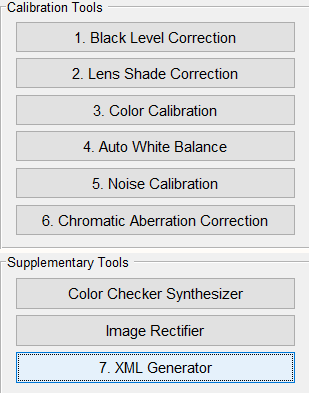
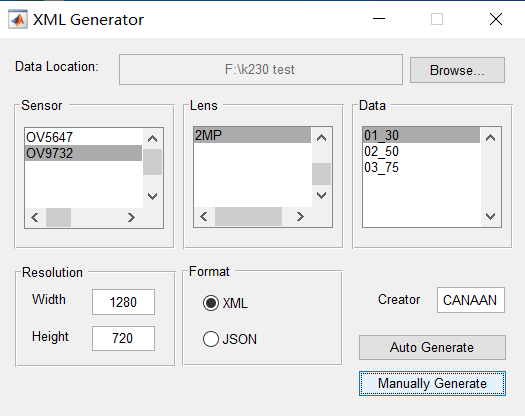
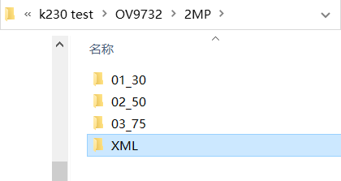

# K230 ISP Initialization Configuration Guide

© 2023 Beijing Canaan Creative Information Technology Co., Ltd. All rights reserved.

## Disclaimer

The products, services, or features you purchase are subject to the commercial contracts and terms of Beijing Canaan Creative Information Technology Co., Ltd. (hereinafter referred to as "the Company") and its affiliates. All or part of the products, services, or features described in this document may not be within the scope of your purchase or use. Unless otherwise stipulated in the contract, the Company does not provide any express or implied statements or warranties regarding the correctness, reliability, completeness, merchantability, fitness for a particular purpose, and non-infringement of any statements, information, or content in this document. Unless otherwise agreed, this document is for reference only.

Due to product version upgrades or other reasons, the content of this document may be updated or modified periodically without any notice.

## Trademark Statement

 "Canaan" and other Canaan trademarks are trademarks of Beijing Canaan Creative Information Technology Co., Ltd. and its affiliates. All other trademarks or registered trademarks mentioned in this document are owned by their respective owners.

**© 2023 Beijing Canaan Creative Information Technology Co., Ltd. All rights reserved.**
Without the written permission of the Company, no unit or individual is allowed to excerpt, copy, or disseminate part or all of the content of this document in any form.

## Table of Contents

[TOC]

## Preface

### Overview

This document mainly guides users in the initialization configuration of the K230 ISP.

### Target Audience

This document (this guide) is mainly applicable to the following personnel:

- Image Debugging Engineers
- Technical Support Engineers
- Software Development Engineers

### Revision History

| Document Version | Description of Changes      | Author | Date       |
|------------------|-----------------------------|--------|------------|
| V1.0             | Initial version             | Rong Jian | 2024-01-24 |
| V1.1             | Updated some parameter descriptions | Rong Jian | 2024-04-28 |

## 1. Overview of K230 ISP Initialization Configuration

After image tuning, the formed ISP configuration parameters need to be written into the corresponding sensor's initialization configuration file. During startup, the ISP will automatically call the settings in these configuration files to complete the initialization. When the module's adaptive function is enabled, the ISP will operate according to the settings of the module's adaptive function. The ISP initialization configuration includes three files: xml, manual.json, and auto.json. If the sensor supports different resolutions, these three configuration files are required for each resolution. These configuration files are stored in the \k230_sdk\src\big\mpp\userapps\src\sensor\config directory.

## 2. xml File

### 2.1 Overview

The xml file can be generated using the K230 ISP Calibration Tool (K230ISPCalibrationTool.exe). All module calibrations in the tool need to be completed to obtain complete calibration data.

The data contained in the xml file comes from two sources:

- Calibration results obtained using the Calibration Tool
- Professional data files provided in the tool release package

The storage location of calibration data and calibration parameter files is shown in the table below:

| Calibration Data                  | Generation Method or Parameter File | Calibration Parameter File Location |
|-----------------------------------|-------------------------------------|-------------------------------------|
| Auto White Balance                | Calibration Tool                    | sensor/lens/sample/AWB/             |
| Black Level Calibration           | Calibration Tool                    | sensor/lens/sample/BlackLevel/      |
| Chromatic Aberration              | Calibration Tool                    | sensor/lens/sample/Calibration Tool/ChromaticAberration/ |
| Color Calibration                 | Calibration Tool                    | sensor/lens/sample/Calibration Tool/ColorReproduction/ |
| Defect Pixel Color Correction     | dpcc_para.txt                       | sensor/lens/sample/Calibration Tool/DefectPixel/ |
| Auto Exposure Calibration         | aec_para.m; k_para.txt              | sensor/lens/sample/Calibration Tool/ExposureCalibration/ |
| HDR                               | hdr_para.txt                        | sensor/lens/sample/Calibration Tool/HDR/ |
| Lens Shading Correction           | Calibration Tool                    | sensor/lens/sample/Calibration Tool/LensShading/ |
| Noise Calibration                 | Calibration Tool                    | sensor/lens/sample/Calibration Tool/Noise/ |
| Photo Response Linearity          | degamma_para.txt                    | sensor/lens/sample/Calibration Tool/PhotoResponseLinearity/ |

### 2.2 Creating Folders for Calibration Parameter Files

Please follow the steps below to create folders for each resolution:

1. Create a folder using the sensor name (e.g., /OV9732)
1. Create a folder using the lens name (e.g., /2MP)
1. Create a folder using the sample name (e.g., /01_30)
1. Create subfolders for each calibration function (as shown in the figure below)  
1. Copy the calibration parameter files into the corresponding parameter folders

For each resolution, an example is as follows:

- sensor
  - lens
    - sample
      - AWB
        - AWB parameters.txt
        - AWB parameters.mat
      - BlackLevel
        - BLS parameters.txt
      - ...

### 2.3 Generating the xml File Using the K230 ISP Calibration Tool

After copying all calibration parameter files into the corresponding folders, open the K230 ISP Calibration Tool and use it to generate the xml file.

As shown in the figure below, click the "7. XML Generator" button on the main interface:

The "XML Generator" dialog box will pop up as shown in the figure below:

In the "Data Location" field, select the correct calibration directory address, select the created sensor folder in the "Sensor" field, select the created lens folder in the "Lens" field, and select the created sample folder in the "Data" field.

Enter the correct Width and Height of the image in the "Resolution" field, select "XML" in the "Format" field, enter the creator's name in the "Creator" field, and then click "Manually Generate" to generate the "XML" subdirectory under the selected lens folder, where the .xml file will be generated.

Rename the generated xml file according to the xml name input in the K230 SDK code (e.g., ov9732-1280x720.xml), and place it in the config directory to be correctly called by the K230 SDK.

### 2.4 AWB Parameter K_Factor

In the xml file, the awb segment contains a K_Factor parameter that needs to be calibrated and manually filled in. This parameter reflects the sensitivity of the camera module.

In the AWB algorithm, the environment is judged as outdoor if Exp*K_Factor <=0.12 (Exp is the exposure).

For example, using 2000 lux as the illumination point between outdoor and transition environments, obtain the exposure value corresponding to this illumination (ET *gain), then calculate: K_Factor = 0.12 / (ET*gain).

## 3. manual.json File

The manual.json file needs to be created manually. Please refer to the imx335-2592x1944_manual.json file to create the manual.json file for the required sensor resolution.

### 3.1 CHdrv2

#### 3.1.1 Function Description

This module sets the HDR mode parameters not included in other ISP modules.

#### 3.1.2 Main Parameters

| Parameter      | Type and Range       | Description                       |
|----------------|----------------------|-----------------------------------|
| base_frame     | int 0~1              | 0: S frame as reference frame;  1: L frame as reference frame.  Recommended setting is 0. |
| bls_out        | int[4]               | Black level out  Default configuration is [0,0,0,0], setting value based on ISP 12bits |
| bypass         | bool                 | false: Pass through HDR module  true: Bypass HDR module |
| bypass_select  | int 0~2              | 0: HDR module outputs L frame;  1: HDR module outputs S frame;  2: HDR module outputs VS frame |
| color_weight   | int[3] 0~255         | color_weight   stitch_color_weight0+stitch_color_weight1*2+stitch_color_weight2=256   Recommended setting is [255, 0, 1] |
| enable         | bool                 | false: HDR not enabled  true: HDR enabled |
| extend_bit     | int[2] -1~8          | Extend bit position   [L/S frame fusion, LS/VS frame fusion]   Recommended setting is [-1,-1], auto-calculation; 0 ~ 8 is manual setting value. |
| ratio          | float[3] 1.0~256.0   | Exposure ratio   [long/short, short/very short, very short/exposure 3] |
| sensor_type    | int 0~6              | 0,1,2: L_12+S_12+VS_12  3: LS_16+VS_12  4,6: L_12+S_12   5: L_12+VS_12 |
| stitching_mode | int 0~1              | 0: Linear synthesis mode;  1: Non-linear synthesis mode |
| trans_range    | float\[6][2] 0.0~1.0 | Synthesis range start and end values  Reference frame pixel lower than start value, synthesis frame pixel is longer frame;   Reference frame pixel higher than end value, synthesis frame pixel is shorter frame;   Reference frame pixel between the two, synthesis frame is fusion of longer and shorter frames.   [[L+S_ref(L)_start, L+S_ref(L)_end],   [LS+VS_ref(LS)_start, LS+VS_ref(LS)_end],   [L+S_ref(S)_start, L+S+ref(S)_end],   [LS+VS_ref(VS)_start, LS+VS_ref(VS)_end],   [LSVS+E3_ref(LSVS)_start, LSVS+E3_ref(LSVS)_end],   [LSVS+E3_ref(E3)_start, LSVS+E3_ref(E3)_end]] |

In the above table:

| Frame Number | Description            |
|--------------|------------------------|
| L frame      | Long exposure frame    |
| S frame      | Short exposure frame   |
| VS frame     | Very short exposure frame |
| LS frame     | Frame fused from L and S frames |
| LSVS frame   | Frame fused from LS and VS frames |

Please note that in K230 HDR mode, the K230 CSI (Camera Serial Interface) module does not support sensor data mode where Hsync precedes Vsync, and each frame (L/S/VS) Vsync high (valid data output) cannot overlap.

### 3.2 CGreenEqu

Please refer to section 3.7 of the "K230 ISP Image Tuning Guide."

### 3.3 CRgbIR

#### 3.3.1 Function Description

This module sets the input processing for RGBIR sensors.

#### 3.3.2 Main Parameters

| Parameter       | Type and Range  | Description                       |
|-----------------|-----------------|-----------------------------------|
| bit             | int             | 12, fixed value                   |
| ccmatrix        | float[12]       | 3x4 color conversion matrix, converts RGBIR values to RGB values |
| dpcc_mid_th     | int             | DPCC channel mid threshold value  |
| dpcc_th         | int             | DPCC channel threshold value      |
| enable          | bool            | false: RGBIR submodule not enabled  true: RGBIR submodule enabled |
| gain            | int[3]          | R/G/B channel gain   Default setting is [1,1,1] |
| ir_threshold    | int             | IR high value threshold   If IR value is higher than this value, IR color influence factor is 0. |
| irbayer_pattern | int             | RGBIR arrangement type   0: BGGIR   2: RGGIR   K230 only supports RGGIR and BGGIR arrangement types, please set the RGBIR sensor data output to one of these two types. |
| l_threshold     | int             | IR low value threshold   If IR value is lower than this value, IR color influence factor is 1. |
| out_rgb_pattern | int             | Output RGB data arrangement type   3: BGGR   No need to change. |

### 3.4 CManualWb

Please refer to section 3.12 of the "K230 ISP Image Tuning Guide."

### 3.5 CCcm

Please refer to section 3.13 of the "K230 ISP Image Tuning Guide."

### 3.6 CDgain

Please refer to section 3.3 of the "K230 ISP Image Tuning Guide."

### 3.7 CCpdv1

Please refer to section 3.19 of the "K230 ISP Image Tuning Guide."

### 3.8 Bls

#### 3.8.1 Function Description

This module sets the black level. The default bls function is turned on.

#### 3.8.2 Main Parameters

| Parameter | Type and Range | Description                       |
|-----------|----------------|-----------------------------------|
| bls       | int[4]         | Black level  [bls_r,bls_gr,bls_gb,bls_b].  Currently, the driver only supports the same black level configuration for each channel, setting value based on ISP 12bits |

### 3.9 CGamma64

Please refer to section 3.14 of the "K230 ISP Image Tuning Guide."

### 3.10 CDpcc

Please refer to section 3.8 of the "K230 ISP Image Tuning Guide."

### 3.11 CDpf

Please refer to section 3.9 of the "K230 ISP Image Tuning Guide."

### 3.12 CLscv2

Please refer to section 3.2 of the "K230 ISP Image Tuning Guide."

### 3.13 CWdrv4

Please refer to section 3.6 of the "K230 ISP Image Tuning Guide."

### 3.14 C3dnrv3_1

Please refer to section 3.10 of the "K230 ISP Image Tuning Guide."

### 3.15 CCproc

Please refer to section 3.18 of the "K230 ISP Image Tuning Guide."

### 3.16 CEEv1

#### 3.16.1 Function Description

This module includes three sub-blocks: CA, DCI, and EE.

#### 3.16.2 Main Parameters

Please refer to sections 3.15 (EE), 3.16 (CA), and 3.17 (DCI) of the "K230 ISP Image Tuning Guide."

### 3.17 CDmscv2

#### 3.17.1 Function Description

This module includes two sub-blocks: CAC and DMSC.

#### 3.17.2 Main Parameters

For CAC parameter settings, please refer to section 3.20 of the "K230 ISP Image Tuning Guide." For DMSC parameter settings, please refer to section 3.11 of the "K230 ISP Image Tuning Guide."

## 4. auto.json File

The auto.json file needs to be created manually. Please refer to the imx335-2592x1944_auto.json file to create the auto.json file for the required sensor resolution.

### 4.1 AdaptiveAe

#### 4.1.1 Function Description

This module sets the parameters for AE control and AE adaptive functionality.

#### 4.1.2 Main Parameters

| Parameter        | Type and Range  | Description                                                   |
| ---------------- | --------------- | ------------------------------------------------------------- |
| enable           | bool            | Auto-exposure enable switch. false: Disable auto-exposure true: Enable auto-exposure    |
| semMode          | int 0~2         | Scene mode 0: Scene evaluation off mode 1: Scene evaluation fixed mode 2: Scene evaluation dynamic mode    |
| antiFlickerMode  | int 0~3         | Anti-flicker mode 0: Off 1: 50Hz 2: 60Hz 3: User defined |
| setPoint         | float 0~255.0   | Set AE brightness target value |
| tolerance        | float 0~100.0   | Set AE brightness target value percentage lock range  |
| dampOver         | float 0~1.0     | Damping factor for smoothing AE convergence during overexposure |
| dampOverGain     | float 0~128.0   | Convergence acceleration gain factor outside the clip range during AE overexposure, the larger the value, the faster the convergence |
| dampOverRatio    | float 1.0~4.0   | Proportional factor outside the clip range during AE overexposure, the smaller the value, the faster the convergence |
| dampUnder        | float 0~1.0     | Damping factor for smoothing AE convergence during underexposure |
| dampUnderGain    | float 0~16.0    | Convergence acceleration gain factor outside the clip range during AE underexposure, the larger the value, the faster the convergence |
| dampUnderRatio   | float 0~1.0     | Proportional factor outside the clip range during AE underexposure, the larger the value, the faster the convergence |
| motionFilter     | float 0~1.0     | Motion change smoothing parameter for calculating the motion factor in AE scene evaluation adaptive mode |
| motionThreshold  | float 0~1.0     | Motion discrimination threshold     |
| targetFilter     | float 0~1.0     | AE brightness target value change smoothing coefficient, the larger the value, the faster the change |
| lowLightLinearRepress  | float[20] 0~1.0   | In linear mode, the target brightness suppression ratio corresponding to the current gain step  |
| lowLightLinearGain     | float[20] 0~255.0 | In linear mode, the gain value corresponding to the current gain step |
| lowLightLinearLevel    | int 0~19           | Total gain steps in linear mode |
| lowLightHdrRepress     | float[20] 0~1.0    | In HDR mode, the target brightness suppression ratio corresponding to the current gain step    |
| lowLightHdrGain        | float[20] 0~255.0  | In HDR mode, the gain value corresponding to the current gain step |
| lowLightHdrLevel       | int 0~16           | Total gain steps in HDR mode |
| wdrContrastMax         | float 0~255.0      | Maximum contrast value for calculating AE setpoint in AE scene evaluation adaptive mode  |
| wdrContrastMin         | float 0~255.0      | Minimum contrast value for calculating AE setpoint in AE scene evaluation adaptive mode    |
| frameCalEnable         | bool              | Exposure setting frame interval enable switch. true: Enable exposure setting frame interval function false: Disable exposure setting frame interval function   |
| autoHdrEnable          | bool              | true: In HDR mode, automatically calculate the current frame HDR ratio false: In HDR mode, use a fixed HDR ratio |
| roiNumber              | int               | Current ROI window index   |
| roiWindow              | float (fx,fy,fw,fh,weight) | Start coordinates (x,y), width, height, and brightness calculation weight of the current ROI window |
| expV2WindowWeight      | float[32x32] 0~255 | Exposure weight of each sub-block |

### 4.2 Awbv2

#### 4.2.1 Function Description

This module sets the parameters for the AWB adaptive functionality.

#### 4.2.2 Main Parameters

| Parameter        | Type and Range      | Description                       |
| ---------------- | ------------------- | --------------------------------- |
| enable           | bool                | true: Enable AWB false: Disable AWB |
| mode             | int 0,1             | 0: AWB 1: AWB METADATA |
| useCcMatrix      | bool                | true: Enable CCM adaptive false: Disable CCM adaptive |
| useCcOffset      | bool                | true: Enable CCM offset adaptive false: Disable CCM offset adaptive  |
| useDamping       | bool                | true: Enable AWB damping changes false: Disable AWB damping changes |
| roiNumber        | int                 | Current ROI window index   |
| roiWindow        | float (fx,fy,fw,fh,weight) | Start coordinates (x,y), width, height, and AWB calculation weight of the current ROI window |

### 4.3 Af

#### 4.3.1 Function Description

This module sets the parameters for the AF functionality. This module is not yet effective.

#### 4.3.2 Main Parameters

| Parameter        | Type and Range      | Description                       |
| ---------------- | ------------------- | --------------------------------- |
| enable           | bool                | false: Disable AF true: Enable AF |
| mode             | int                 | 0: Normal AF mode (Other AF modes planned for development) |
| weightWindow     | float[3] 0~255.0    | Set the weight values for the three statistical windows used for sharpness calculation |
| cMotionThreshold | float 0~1.0         | Not yet used, will be used for motion detection |
| cPointsOfCurve   | int 1~20            | Number of equal divisions for the AF ramp algorithm. The larger the value, the slower the focus speed; the smaller the value, the faster the focus speed, but a large step size may cause inaccurate focusing. |
| cStableTolerance | float 0~1.0         | Threshold for AF to enter the defocus state from the locked state. The smaller the value, the easier it is to enter the refocus state. |
| focalFilter      | float[5] 0~1023     | Not yet used |
| shapFilter       | float[5] 0~1023     | Not yet used |
| focalStableThreshold | float 0~1.0     | Threshold for focus to enter the locked state. The smaller the value, the harder it is to enter the locked state |
| maxFocal         | int 0~1023          | Maximum motor position calibrated for AF |
| minFocal         | int 0~1023          | Minimum motor position calibrated for AF |
| cMseTolerance    | float 0~1.0         | Not yet used |
| cPdConfThreshold | float 0~1023.0      | Not used |
| PdFocal          | int -254~254        | Not used |
| PdDistance       | int 1~254           | Not used |
| PdShiftThrehold  | float 0~1.0         | Not used |
| PdStablecountMax | uint8 1~10          | Not used |
| PdROIIndex       | uint8 0~48          | Not used |

### 4.4 ALscv2

#### 4.4.1 Function Description

This module sets the parameters for the LSC adaptive functionality.

#### 4.4.2 Main Parameters

| Parameter        | Type and Range      | Description                       |
| ---------------- | ------------------- | --------------------------------- |
| enable           | bool                | false: Disable ALSC true: Enable ALSC |
| damping          | float               | Damping factor for smoothing LSC curve changes during ALSC |
| interMode        | int 0~2             | 0: Adaptive adjustment based on gain value 1: Adaptive adjustment based on color temperature 2: Adaptive adjustment based on gain value and color temperature |
| hdr              | bool                | false: Indicates settings for linear mode true: Indicates settings for HDR mode |
| gain             | float[20]           | Gain values for each step |
| strength         | float[20] 0~1.0     | LSC retention strength corresponding to each gain value |

### 4.5 Others

This section provides a unified introduction to other adaptive functionality modules.

The setting parameters of these adaptive functionality modules are usually divided into two parts, guided by the "tables" marker and enclosed in square brackets "[]". Parameters outside these brackets are boolean type enable parameters, while those inside are parameters involved in adaptive functionality adjustment.

#### 4.5.1 Description of Parameters Outside the Tables

In these functionality modules, there are usually three parameters outside the tables:

| Parameter        | Type      | Description                       |
| ---------------- | --------- | --------------------------------- |
| disable          | bool      | Can be fixed to false |
| enable           | bool      | false: Disable; true: Enable Set according to the required adaptive module functionality |
| forcecreate      | bool      | Can be fixed to true |

In the A3dnrv3 module, there are also two parameters outside the tables:

| Parameter        | Type      | Description                       |
| ---------------- | --------- | --------------------------------- |
| nlm_en           | bool      | Non-local means denoising enable switch, recommended to be set to true |
| tnr_en           | bool      | Temporal denoising enable switch. Since K230 ISP tnr is actually controlled by external command parameters, it can be fixed to false |

#### 4.5.2 Description of Parameters Inside the Tables

In the functionality modules, there are two parameters:

| Parameter        | Type and Range      | Description                       |
| ---------------- | ------------------- | --------------------------------- |
| hdr              | bool                | false: Indicates settings for linear mode true: Indicates settings for HDR mode |
| gain             | float[20]           | Gain values for each step |

For other adaptive functionality parameters, please refer to the corresponding functionality sections in the "K230 ISP Image Tuning Guide."

The "gain" parameter can be divided into a maximum of 20 steps from the minimum value (usually 1x) to the maximum value. Each step should set the corresponding gain value in the gain parameter array.

It is important to note that each adaptive module can define different step counts based on its adaptive needs, with a maximum of 20 steps.

All parameters involved in adaptive functionality within the same adaptive functionality module should determine their array size according to the number of gain steps, and each step should set an appropriate value based on the corresponding gain value for that step.
