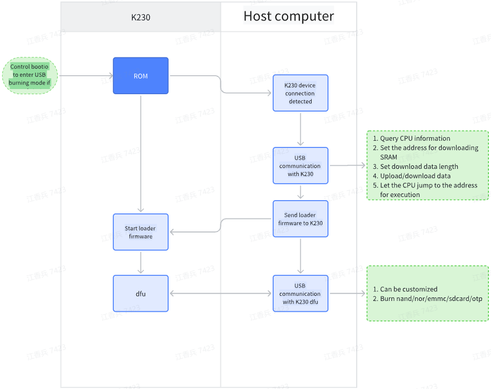

# K230 SDK Burntool User Guide


Copyright © 2023 Beijing Canaan Creative Information Technology Co., Ltd.

<div style="page-break-after:always"></div>

## Disclaimer

The products, services, or features you purchase are subject to the commercial contracts and terms of Beijing Canaan Creative Information Technology Co., Ltd. (hereinafter referred to as "the Company") and its affiliates. All or part of the products, services, or features described in this document may not be within the scope of your purchase or use. Unless otherwise agreed in the contract, the Company does not provide any express or implied statements or warranties regarding the accuracy, reliability, completeness, merchantability, fitness for a particular purpose, and non-infringement of any representations, information, or content in this document. Unless otherwise agreed, this document is for reference only as a usage guide.

Due to product version upgrades or other reasons, the content of this document may be updated or modified without any notice periodically.

## Trademark Statement

, "Canaan," and other Canaan trademarks are trademarks of Beijing Canaan Creative Information Technology Co., Ltd. and its affiliates. All other trademarks or registered trademarks mentioned in this document are owned by their respective owners.

**Copyright © 2023 Beijing Canaan Creative Information Technology Co., Ltd. All rights reserved.**
Without the Company's written permission, no unit or individual may excerpt, copy part or all of the content of this document, or disseminate it in any form.

<div style="page-break-after:always"></div>

## Table of Contents

[TOC]

## Introduction

### Overview

This document describes the usage instructions for Burntool.

### Target Audience

This document (this guide) is primarily intended for the following personnel:

- Technical Support Engineers
- Software Development Engineers

### Abbreviations

| Abbreviation | Description |

### Revision History

| Document Version | Modification Description                                      | Modifier       | Date       |
|------------------|---------------------------------------------------------------|----------------|------------|
| V1.0             | Initial version                                               | jiangxiangbing | 2023-08-01 |
| V2.0             | Removed full image burning page, added loader_sip.bin support for SIP burning | jiangxiangbing | 2023-10-12 |
| V3.0             | Supported sdcard/otp burning, supported reading data from storage media. Users can develop and compile loader.bin based on uboot | jiangxiangbing | 2024-4-1 |

[Burntool Download Link](https://kendryte-download.canaan-creative.com/k230/downloads/burn_tool/k230_burntool_v3.7z)

## 1. Purpose of K230 Burning Tool

1. For devices with SD card storage, users can remove the SD card to burn the image. However, for devices with emmc/nand/nor storage, users cannot do so, so K230 provides a mechanism for burning via USB.

1. OTP stands for One Time Programmable, which means it is a one-time programmable device. The K230 chip provides 768 bytes of space for users to use. It can store information like MAC addresses that need to be permanently bound to the product. Incidentally, the K230 chip comes with a randomly unique chipid, so there is no need to use OTP to store the chipid information.

1. The K230 burning tool version 3 supports burning SD/emmc/nand/nor/otp. It supports partition burning and reading data from storage media.

## 2. How to Use the K230 Burning Tool

When the K230 chip fails to boot from the storage media and detects a USB connection, it will enter the USB burning mode.

At this time, the K230 device can be seen on the computer.


If it appears as shown below, you need to use zadig-2.8.exe to install the USB driver.


Download the k230_burntool software package and open the software.


The first row is for selecting loader.bin. You can open the file and select the loader.bin used by the corresponding device (the software package includes package_canmvpi, package_evb, package_canmvzero, etc.). loader.bin is a must, so the first row disables other editing permissions except for file selection to avoid user confusion.

**1**, The first column, select whether to perform a write operation. If you only need to read data from the device storage media, do not check it.

**2**, The second column, select whether to perform a read operation. If you only need to write data to the device storage media, do not check it. The read data is saved with the file name "file path + .target name," such as fn_ug_u-boot.bin.uboot_a.

**3**, The third column, target address, the starting address of the storage media partition, whether flash or sd/emmc, is in bytes. The partition situation of sd/emmc firmware is related to K230_sdk/board/common/gen_image_cfg/genimage-sdcard.cfg.

**4**, The fourth column, target size. For sd/emmc/nor burning, if this item is empty, the software will use the actual size of the file. For nand, due to the mechanism of skipping bad blocks, the user needs to specify a partition size.

**5**, The fifth column, target name. Except for the first row of loader which is fixed, other partitions can be freely input as long as they are not repeated.

**6**, The sixth column, file path. This is the path of the burning partition file.

**7**, The seventh column, open file. Select the burning partition file.

**8**, Target device selection, SDIO0/SDIO1 can be connected to SD cards or emmc. NOR/NAND can be connected to spi0, spi1, or spi2.

**9**, Start burning. After configuring the previous options and putting the K230 chip in USB burning mode, click to start burning.

## 3. K230 USB Burning Mechanism



The USB burning function of K230 is implemented in bootrom. When the bootrom fails to start during the startup process, it will jump to the USB burning mode. For example, if the device uses an SD card as storage media, one solution is to switch to other media through bootio, so that K230 will enter USB burning mode when it fails to start. Another solution is to remove the SD card, so that K230 will also enter USB burning mode when it fails to start. For emmc/nand/nor devices, only the first solution can be adopted.

ROM only provides the function of downloading data to SRAM via USB and letting the CPU execute programs. The specific read/write driver for the storage media is implemented by loader.bin. loader.bin also performs DDR training operations.

Different devices have different DDR training, and the storage media solutions may vary, so different devices correspond to their respective loader.bin.

## 4. How to Develop K230 Burning Tool loader.bin

The uboot of sdk1.5 includes the source code of loader.bin. It supports the following devices. Customers can refer to these configuration files to modify their own designed devices.

```shell
k230_canmv_burntool_defconfig
k230d_canmv_burntool_defconfig
k230_evb_burntool_defconfig
```

Execute the compilation

```shell
cd uboot
export ARCH=riscv
export CROSS_COMPILE=riscv64-unknown-linux-gnu-
make k230_canmv_burntool_defconfig O=out
make -C out -j
```

The generated u-boot.bin is loader.bin.
