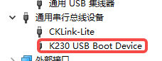
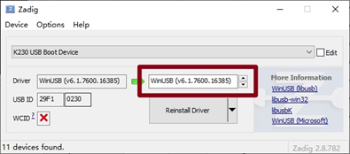
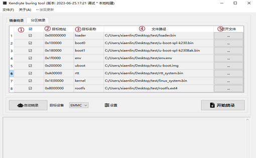

# K230 SDK Burntool User Guide


Copyright 2023 Canaan Inc. ©

<div style="page-break-after:always"></div>

## Disclaimer

The products, services or features you purchase should be subject to Canaan Inc. ("Company", hereinafter referred to as "Company") and its affiliates are bound by the commercial contracts and terms and conditions of all or part of the products, services or features described in this document may not be covered by your purchase or use. Unless otherwise agreed in the contract, the Company does not provide any express or implied representations or warranties as to the correctness, reliability, completeness, merchantability, fitness for a particular purpose and non-infringement of any statements, information, or content in this document. Unless otherwise agreed, this document is intended as a guide for use only.

Due to product version upgrades or other reasons, the content of this document may be updated or modified from time to time without any notice.

## Trademark Notice

, "Canaan" and other Canaan trademarks are trademarks of Canaan Inc. and its affiliates. All other trademarks or registered trademarks that may be mentioned in this document are owned by their respective owners.

**Copyright 2023 Canaan Inc.. © All Rights Reserved.**
Without the written permission of the company, no unit or individual may extract or copy part or all of the content of this document without authorization, and shall not disseminate it in any form.

<div style="page-break-after:always"></div>

## Directory

[TOC]

## Preface

### Overview

This document describes instructions for using the Burnool.

### Reader Object

This document (this guide) is intended primarily for:

- Technical Support Engineer
- Software Development Engineer

### Definition of Acronyms

| Abbreviation | Description |

### Revision History

| Document version number  | Modify the description                           | Author | date       |
|------------|-----------------------------------|--------|------------|
| V1.0       | Initial edition                              | jiangxiangbing | 2023-08-01 |
| V2.0       | Delete the full image burning page, and add loader_sip.bin support for SIP burning     | jiangxiangbing | 2023-10-12 |

## 1. Burntool Burning Mechanism

1. K230 chip just powered on will execute the program solidified on the chip ROM. When the boot fails to print "boot failed with exit code xx", if USB0 is detected to connect a USB cable, the ROM program will enter USB burning mode. Therefore, when burning, it is recommended to dial the BOOTIO code to the SD card to boot, and at the same time do not insert the SD card, USB0 to connect the typeC cable. Then power on. At this point, the computer device manager can see the K230 USB Boot Device


1. The burning tool will first download the loader program to the SRAM space of the K230 through USB communication. The loader program is based on uboot development, mainly to complete DDR training, as well as DFU functions.

1. Next, DFU method burning various storage media, support eMMC/norflash burning.

## 2. Software Acquisition and Installation

### 2.1 Software Acquisition

[Download the link](https://kendryte-download.canaan-creative.com/k230/downloads/burn_tool/k230_burntool_v2.7z)

### 2.2 Windows System Environment Installation

Install with zadig-2.8 .exe without a K230 USB Boot Device driver



## 3. Partition Image Burning

### 3.1 Description of the Interface



1. Select whether to burn the partition
1. Configure the start address of the partition, double-click to modify, the address is byte offset. The address is consistent with the configuration file of Genimage, such as the image of EMMC, and the image configuration path: k230_sdk/board/common/genimage-sdcard.cfg

    ```shell
        partition linux {
            #50M@30M   0x800@0x800
            offset = 30M
            image = "little-core/linux_system.bin"
            size = 50M
        }
    ```

    The linux_system.bin partition starts at 30MB with a 0x1E00000

    Flash the sysimage-sdcard.img and sysimage-spinor32m.img full images generated by the SDK, and configure the partition start address to 0.

1. Configure the partition name, except for loader, other names can be arbitrary, as long as it is not repeated, double-click to modify.
1. The path to the partition image file.
1. Select the partition image file. The loader can be provided in the doc directory in the compressed package, and its partition name needs to be fixed to "loader". The type of loader is due to the different DDR training procedures. If it is a SIP chip device, ddr training is the same, the loader selects k230_burntool_v2/doc/loader_sip.bin, if it is an EVB LP3 device, the loader selects k230_burntool_v2/doc/loader_evb_lp3.bin, if other boards of the unsip chip are used, the loader program needs to be based on ddr The training code is recompiled.
1. Select EMMC or NorFlash
1. Start burning, burning a single device can be done this way.
1. Automatic burning, the computer can connect multiple K230 devices through USB, automatic parallel burning.
