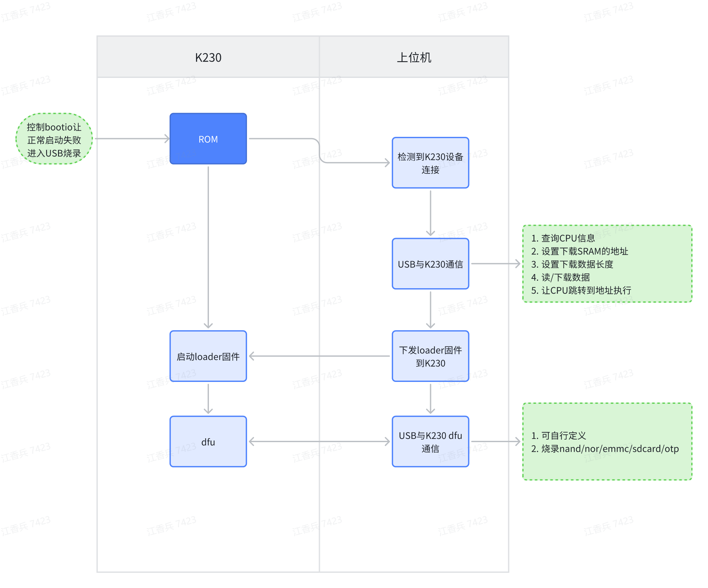

# K230 SDK Burntool User Guide


Copyright 2023 Canaan Inc. ©

<div style="page-break-after:always"></div>

## Disclaimer

The products, services or features you purchase should be subject to Canaan Inc. ("Company", hereinafter referred to as "Company") and its affiliates are bound by the commercial contracts and terms and conditions of all or part of the products, services or features described in this document may not be covered by your purchase or use. Unless otherwise agreed in the contract, the Company does not provide any express or implied representations or warranties as to the correctness, reliability, completeness, merchantability, fitness for a particular purpose and non-infringement of any statements, information, or content in this document. Unless otherwise agreed, this document is intended as a guide for use only.

Due to product version upgrades or other reasons, the content of this document may be updated or modified from time to time without any notice.

## Trademark Notice

, "Canaan" and other Canaan trademarks are trademarks of Canaan Inc. and its affiliates. All other trademarks or registered trademarks that may be mentioned in this document are owned by their respective owners.

**Copyright 2023 Canaan Inc.. © All Rights Reserved.**
Without the written permission of the company, no unit or individual may extract or copy part or all of the content of this document without authorization, and shall not disseminate it in any form.

<div style="page-break-after:always"></div>

## Directory

[TOC]

## Preface

### Overview

This document describes instructions for using the Burnool.

### Reader Object

This document (this guide) is intended primarily for:

- Technical Support Engineer
- Software Development Engineer

### Definition of Acronyms

| Abbreviation | Description |

### Revision History

| Document version number  | Modify the description                           | Author | date       |
|------------|-----------------------------------|--------|------------|
| V1.0       | Initial edition                              | jiangxiangbing | 2023-08-01 |
| V2.0       | Delete the full image burning page, and add loader_sip.bin support for SIP burning     | jiangxiangbing | 2023-10-12 |
| V3.0 | Supports sdcard/otp burning and reading data from storage media. Users can develop and compile loader.bin based on uboot | jiangxiangbing | 2024-4-1 |

[Burning tool download link](https://kendryte-download.canaan-creative.com/k230/downloads/burn_tool/k230_burntool_v3.7z)

## 1. Purpose of K230 burning tool

1. For devices with SD card storage, users can remove the SD card and burn the image. However, users cannot do this for devices with emmc/nand/nor memory, so K230 provides a mechanism for burning through USB.

1. otp is One Time Programmable, which is a one-time programmable device. The K230 chip provides 768bytes of space for users to use. It can store information such as MAC address that needs to be permanently bound to the product. By the way, the k230 chip comes with a random and unique chipid. There is no need to use otp to store chipid information.

1. K230 burning tool v3 version already supports burning SD/emmc/nand/nor/otp. Supports partition burning and reading data from storage media.

## 2. How to use the K230 burning tool

The k230 chip fails to boot from the storage medium when it is powered on, and if it is detected that the USB cable is connected, it will enter the USB burning mode.

At this point you can see the k230 device on the computer


If the following situation occurs, you need to use zadig-2.8.exe to install the USB driver


Download the k230_burntool software package and open the software


The first line is to select loader.bin. You can open the file and select the loader.bin used by the corresponding device (the software package contains loaders such as package_canmvpi package_evb package_canmvzero). loader.bin is required, so in the first line except file selection, other editing permissions are prohibited to avoid user difficulty in selection.

**1**, the first column, select whether to perform write operations. If you only need to read data from the device storage medium, do not check it.

**2**, in the second column, select whether to perform a read operation. If you only need to write data to the device storage medium, do not check it. The read data save file name is "file path +. target name", such as fn_ug_u-boot.bin.uboot_a

**3**, the third column, target address, the starting address of the partition of the storage medium, whether flash or sd/emmc, is in bytes. The partition status of sd/emmc firmware is related to K230_sdk/board/common/gen_image_cfg/genimage-sdcard.cfg.

**4**, fourth column, target size. For sd/emmc/nor burning, if this item is empty, the software will use the actual size of the file. For nand, since there is a mechanism to skip bad blocks, the user needs to specify a partition size.

**5**, fifth column, target name. Except for the loader in the first line, which is fixed, other partitions can be entered at will, as long as they are not repeated.

**6**, sixth column, file path. That is, the path to burn the partition file

**7**, seventh column, open the file. Select burning partition file

**8**, target device selection, SDIO0/SDIO1 can be connected to either SD card or emmc. NOR/NAND can be connected to spi0 or spi1/spi2

**9**, start burning. After the previous options are configured and the k230 chip is in USB burning mode, click to start burning.

## 3. K230 USB burning mechanism



The USB burning function of K230 is implemented in bootrom. When the bootrom fails to start during the startup process, it will jump to USB burning mode. For example, if the device uses an SD card as the storage medium, one solution is to switch to other media through bootio. In this way, the k230 will enter the USB burning mode if it fails to start. Another solution is to pull out the SD card, so that the k230 will enter USB burning mode if it fails to start. For emmc/nand/nor devices, you can only use the first solution.

ROM only provides the function of USB downloading data to SRAM and letting the CPU execute programs. The specific read and write driver for storage media is implemented by loader.bin. loader.bin also performs ddr training operations.

Different devices have different DDR training, and the storage media solutions may be different, so different devices will correspond to their own loader.bin.

## 4. How to develop the K230 burning tool loader.bin

The uboot of sdk1.5 contains the source code of loader.bin. The following devices are supported. Devices designed by customers can refer to these configuration files for modifications.

```shell
k230_canmv_burntool_defconfig
k230d_canmv_burntool_defconfig
k230_evb_burntool_defconfig
```

Execute compilation

```shell
cd uboot
export ARCH=riscv
export CROSS_COMPILE=riscv64-unknown-linux-gnu-
make k230_canmv_burntool_defconfig O=out
make -C out -j
```

The generated u-boot.bin is loader.bin
