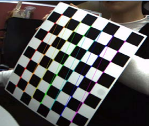
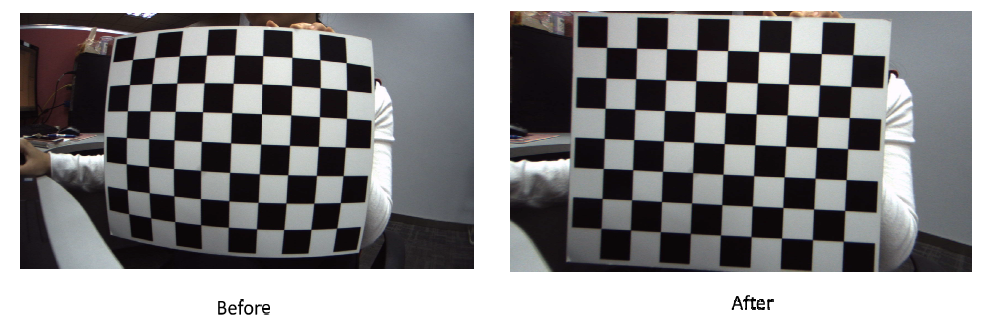
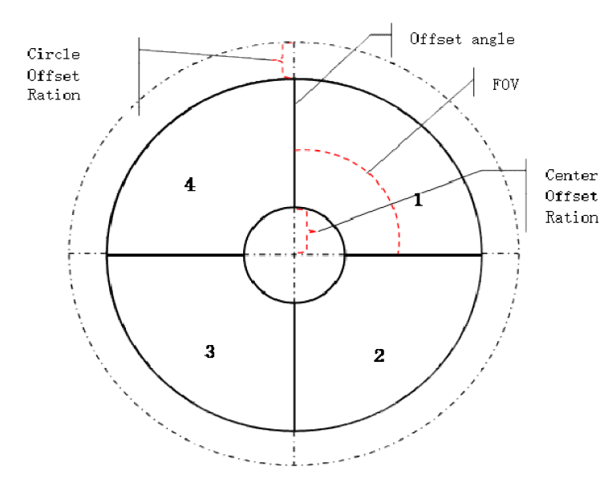

# K230 SDK Dewarp User Guide


Copyright © 2023 Beijing Canaan Creative Information Technology Co., Ltd.

<div style="page-break-after:always"></div>

## Disclaimer

The products, services, or features you purchase are subject to the commercial contracts and terms of Beijing Canaan Creative Information Technology Co., Ltd. (hereinafter referred to as "the Company") and its affiliates. All or part of the products, services, or features described in this document may not be within the scope of your purchase or usage. Unless otherwise stipulated in the contract, the Company does not provide any explicit or implicit statements or warranties regarding the accuracy, reliability, completeness, merchantability, fitness for a particular purpose, or non-infringement of any statements, information, or content in this document. Unless otherwise agreed, this document is for reference purposes only.

Due to product version upgrades or other reasons, the content of this document may be updated or modified periodically without any notice.

## Trademark Statement

, "Canaan" and other Canaan trademarks are trademarks of Beijing Canaan Creative Information Technology Co., Ltd. and its affiliates. All other trademarks or registered trademarks mentioned in this document are owned by their respective owners.

**Copyright © 2023 Beijing Canaan Creative Information Technology Co., Ltd. All rights reserved.**
Without the written permission of the Company, no unit or individual is allowed to excerpt, copy any part or all of the content of this document, or disseminate it in any form.

<div style="page-break-after:always"></div>

## Table of Contents

[TOC]

## Preface

### Overview

This document mainly introduces the calibration and usage methods of the Dewarp module in the K230 VICAP module.

### Target Audience

This document (guide) is mainly intended for the following personnel:

- Technical Support Engineers
- Software Development Engineers

### Abbreviation Definitions

| Abbreviation | Description |
| ------------ | ----------- |
| DW           | Dewarp      |

### Revision History

| Document Version | Description | Author(s)       | Date       |
| ---------------- | ----------- | --------------- | ---------- |
| V1.0             | Initial Version | Liu Jia'an, Huang Ziyi | 2023-06-08 |

## 1. Introduction to Dewarp Calibration

The Dewarp calibration process generates a YAML file containing the camera matrix and distortion coefficients. During the build process, the K230 SDK uses this YAML file to generate a remap file, which is then placed in the `/bin` directory of the main core root file system. When configuring VICAP, set the `dw_enable` field of the `k_vicap_dev_attr` structure to 1 to enable Dewarp. VICAP will look for the `<sensor_name>-<width>x<height>.bin` file (e.g., for IMX335 full resolution, it would be `imx335-2592x1944.bin`) in the current path as the Dewarp configuration file for distortion correction.

### 1.1 Capturing Images

1. Rotate the chessboard on the same plane and capture at least 20 images.
1. Select at least 10 photos covering all angles and save them to a fixed directory. It is recommended to choose images with significant differences.



You can use the `sample_vicap.elf` program to capture images. Convert the saved YUV files to png/bmp formats that are easily readable by OpenCV using ffmpeg, as shown in the following command:

```shell
ffmpeg -f rawvideo -pixel_format nv12 -video_size 2592x1944 -i dev_00_chn_00_2592x1944_0000.yuv420sp 0.png
```

### 1.3 Dewarp Modes Introduction

Dewarp has multiple modes. Here, two modes are introduced: lens correction and split screen.

#### Lens Correction

Lens correction uses the Brown-Conrady distortion model. Input parameters include u0, v0, fx, and fy from the camera's internal matrix, distortion coefficients k1, k2, p1, p2, k3, k4, k5, and k6, and fovRatio. These parameters can be obtained from the previous calibration step. The correction effect is as follows:



#### Split Screen

The split screen mode does not require camera calibration.

Each sector image in the figure below is corrected to a small rectangular split screen image. The calculation method for each small split screen image is similar. After calculating each small image, the corresponding coordinate arrays of each small image need to be concatenated into the coordinate array of the large image. For example, the coordinate calculation process of one small image is as follows. Input parameters include CenterOffsetRatio, CircleOffsetRatio, maxRadius, image width, and image height, which are the dimensions of each small output image, and the center point centerX and centerY of the input image. The output outputX and outputY are coordinates relative to the output small image.



### 1.2 Executing the Calibration Program

Create an XML file containing the image paths, such as `imx335-2592x1944-0.xml`, and fill in the saved image paths from the previous step, in the form of:

```xml
<?xml version="1.0"?>
<opencv_storage>
<images>
images/imx335-2592x1944-0/0.png
...
</images>
</opencv_storage>
```

Edit `run.bat`, change the last parameter to the path of the XML file just created, and change the -o parameter to the path to save the output YAML file, then execute `run.bat`.

## 2. Using Dewarp with the VICAP Module

VICAP controls distortion correction by loading the Dewarp configuration file. The Dewarp configuration file generated after compiling the K230 SDK is placed in `<K230 SDK> src/big/mpp/userapps/src/sensor/config`, and files with the .bin suffix are all dewarp configuration files. The first 8 bytes of their content are split screen parameters, and the rest are all mapping tables. VICAP loads the current sensor based on the file name.

### Lens Correction Mode

Note: **Enabling Dewarp requires an additional vb pool, and the buf_size of the device properties should be changed to the sensor output buffer size. You can refer to the `sample_vicap.c` function `sample_vicap_vb_init` to initialize the vb pool.**

The YAML file generated in the previous step needs to be placed in the `<K230 SDK>/src/big/mpp/userapps/src/sensor/dewarp` directory, and the K230 SDK should be compiled.

If the K230 SDK has been compiled before, you can avoid a full recompile. After placing the YAML file, directly run `make mpp-apps`. If you need to create an image, you also need to run `make build-image`.

### Split Screen Mode

The K230 SDK includes a built-in program for generating split screen mode configuration files. The source code is located in `<K230 SDK>/src/big/mpp/userapps/src/sensor/dewarp/k230dwmapgen/exe/split_screen.c`. After fully compiling the K230 SDK, a `k230dwmapgen-splitscreen` program will be generated in the `<K230 SDK>/src/big/mpp/userapps/src/sensor/build` directory. Running it will print the configuration file through standard output. If you need to keep it, you can redirect it to a file. This program defaults to the 1280x720 camera configuration split screen. If you need to modify parameters, you can change the parameters of the `CreateUpdateWarpPolarMap` function in its source code, recompile and run it.
