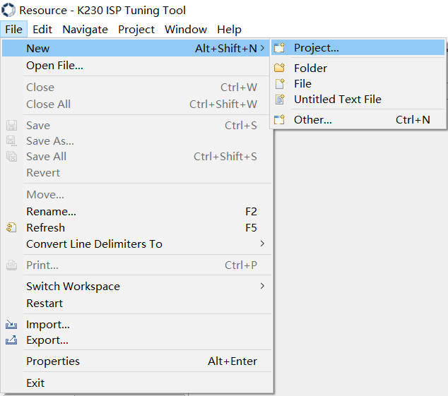
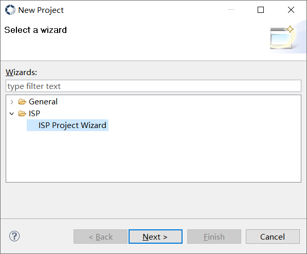

# K230 ISP Tuning Tool User Guide

Copyright 2023 Canaan Inc. ©

## Disclaimer

The products,services or features you purchase should be subject to Canaan Inc.("Company",hereinafter referred to as "Company") and its affiliates are bound by the commercial contracts and terms and conditions of all or part of the products,services or features described in this document may not be covered by your purchase or use.Unless otherwise agreed in the contract,the Company does not provide any express or implied representations or warranties as to the correctness,reliability,completeness,merchantability,fitness for a particular purpose and non-infringement of any statements,information,or content in this document.Unless otherwise agreed,this document is intended as a guide for use only.

Due to product version upgrades or other reasons,the content of this document may be updated or modified from time to time without any notice.

## Trademark Notice

,"Canaan" and other Canaan trademarks are trademarks of Canaan Inc.and its affiliates.All other trademarks or registered trademarks that may be mentioned in this document are owned by their respective owners.

**Copyright 2023 Canaan Inc..© All Rights Reserved.**
Without the written permission of the company,no unit or individual may extract or copy part or all of the content of this document without authorization,and shall not disseminate it in any form.

## Directory

[TOC]

## Preface

### Overview

This document describes instructions for using the Tuning Tool.

### Reader object

This document (this guide) is intended primarily for:

- Technical Support Engineer
- Software Development Engineer

### Definition of acronyms

| abbreviation | illustrate                                                       |
|------|------------------------------------------------------------|
| BLS  | Black Level Subtraction                                    |
| HDR  | High Dynamic Range                                         |
| 3A   | AE(Auto Exposure)、AF(Auto Focus)、AWB(Auto White Balance) |
| DG   | Digital Gain                                               |
| LSC  | Lens Shading Correction                                    |
| WB   | White Balance                                              |
| DM   | Demosaic                                                   |
| DPCC | Defect Pixel Cluster Correction                            |
| DPF  | Denoising Prefilter                                        |
| CNR  | Color Noise Reduction                                      |
| CAC  | Chromatic Aberration Correction                            |
| CA   | Color Adjustment                                           |
| DCI  | Dynamic Contrast Improvement                                           |
| 2DNR | 2D Noise Reduction                                         |
| 3DNR | 3D Noise Reduction                                         |
| GC   | Gamma Correction                                           |
| GE   | Green Equilibrate                                          |
| EE   | Edge Enhance                                               |
| CP   | Color Processing                                           |
| ROI  | Region Of Interested                                       |
| DW   | De-warp                                                    |
| TS   | Tuning-Server                                              |
| TC   | Tuning-Client                                              |
| RTSP | Real Time Streaming Protocol                               |

### Revision history

| Document version number  | Modify the description                           | Author | date       |
|------------|-----------------------------------|--------|------------|
| V1.0       | Initial edition                              | Guo Shidong | 2023-02-20 |
| V1.1       | Updated some feature descriptions                   | Liu Jiaan | 2023-04-07 |
| V1.2       | Updated some feature descriptions Added some feature descriptions   | Guo Shidong | 2023-05-05 |
| V1.3       | Add RTSP feature description  | Guo Shidong | 2023-07-28 |
| V2.0       | Updated to VTunerClient | Huang Ziyi | 2024-01-10 |
| V2.1       | Updated some feature descriptions Added some feature descriptions   | Rong Jian | 2024-01-11 |
| V2.2       | Updated some feature descriptions | Rong Jian | 2024-01-30 |

## 1.Module software architecture

Figure 1-1

## 2.Connection and activation of the Tuning Tool

### 2.1 Tool Get Path

| **File name**      | **Storage location**       | **Features**                                            |
|-----------------|--------------------|-----------------------------------------------------|
| PC tuning tool（K230 ISP Tuning Tool.exe） | k230_sdk/tools/tuning-tool-client/K230_ISP_Tuning_Tool_20240129.7z | PC tool  |
| t_server_c-6.1.0                        | little core filesystem /mnt/          | tuning server executable |
| sample_sys_init.elf                     | big core filesystem /sdcard/app       | rt-smart RPC server   |
|**Table 2-1 List of files**|||

### 2.2 Initiation Process

1. Configure IP for the little core on the board.
1. After the little core on the board waits for sharefs to start, the big core starts the sample_sys_init.elf by running `/sharefs/app/sample_sys_init.elf`.
1. Start the tuning server on the little core of the board by running `/mnt/t_server_c-6.1.0`. Add parameters based on the actual situation and use the "-?" parameter to view the help.
1. Start tuning tool on the PC and connect to K230.

## 3.Introduction to the Tuning Tool interface

Figure 3-1

As shown in Figure 3-1,the basic operation UI of tuning tool is fully expanded in six areas:

(1) Menu operation area: functions such as file operation and window management

(2) Toolbar area: support operations for key functions

| Botton | Description                                                      |
|------|------------------------------------------------------------|
|   | Export settings into file.|
|  | Import settings from file.|
|   | Capture images or videos.|
|   | Send local raw image or video data to a tuning server for ISP processing.|
|    | Preview a video.|
|    | Configure registers.|
|    | Modify connections to tuning servers.|
|    | Modify preferences.|
|    | Provides access to extra components.|

(3) Project explorer area: selecting and managing different projects

(4) Functional area: used to switch the UI of each module of the ISP

(5) Tuning area: the parameters used to debug a module

(6) Echo area: used to print the logs sent and received by some parameters

### 3.1 Connect the board-end tuning-server

#### 3.1.1 Use HTTP to connect to the board-end tuning-server

The SDK supports HTTP connection by default, click the connection button  in the toolbar, and will pop up the server configuration window, as shown in Figure 3-2.

Figure 3-2

Select HTTP mode, ensure that the PC and the board end of the network connected to the network is in the same network segment.Enter the IP address in the "Host" input box, and enter the fixed port 34567 in the "Port" input box. After configuration is completed, click the "OK" button. If the board end tuning server has been started, the connection will be automatically completed. Arbitrarily switch the module in the ④ area in Figure 3-1, you will see the function print on the tuning-server side.

### 3.2 Create/Select Project

If the project is already in area ③ of Figure 3-1, click to select the project to start ISP tuning. If the required project has not been created yet, it needs to be created first.

#### 3.2.1 Create Project

Click on File ->New ->Project... in sequence, as shown in Figure 3-3, will pop up the wizard window, as shown in Figure 3-4.

Figure 3-3

Figure 3-4

Click on the "ISP" directory to display the "ISP Project Wizard". After clicking on the "ISP Project Wizard", click on the "Next" button, and a project creation window will pop up, as shown in Figure 3-5.

Figure 3-5

Enter the project name, specify the project location, and click the "Finish" button to complete the project creation. The project will be displayed in area ③ of Figure 3-1. Click on this project to start ISP tuning.

### 3.3 Online Tuning interface and function description

This section only briefly introduces the main functions of some tuning modules on the tuning tool interface, and the specific tuning strategies and steps were described in detail in the image tuning document.

The ISP functional modules are shown in Figure 3-6.

Figure 3-6

#### 3.3.1 Bypass Setting

Enable control of all ISP functional modules.

#### 3.3.2 Auto Exposure

Auto exposure control. To controll image brightness and convergence speed during AE adjustment.

Support setting ROI window. To enable ROI mode, need to select "FIX" mode in semMode and enable AE.

#### 3.3.3 Auto Focus

Not supported.

#### 3.3.4 Auto Focus Measurement

Not supported.

#### 3.3.5 3D Noise Reduction

Adjust the intensity of image noise reduction by adjusting the parameter configuration.

#### 3.3.6 Black Level Subtraction

Provide sensor-related black level correction,and can be set for R,Gr,Gb,and B channels.

#### 3.3.7 Color Processing

A color processing module that adjusts the contrast,brightness,saturation and hue of an image to set different color preferences or styles.

#### 3.3.8 Color Correction Matrix

Adjust the 3x3 CCM matrix and offset for color correction.

#### 3.3.10 Demosaic

Convert Bayer Raw images to RGB images by interpolation,and provide moire removal,depurple,sharpening and noise reduction processing functions.

This module also includes the CAC submodule, used to calibrate chromatic aberrations,which are mainly introduced by the lens,calibration parameters are generated by the calibration tool.

#### 3.3.11 Defect Pixel Cluster Correction

It provides the function of detecting and calibrating pixel dead pixels,and different calibration methods can be set by selecting set.

#### 3.3.12 Denoising Prefilter

Bilateral filtering noise reduction module.

#### 3.3.13 Digital Gain

Used to enable control and value adjustment of ISP Digital Gain.

#### 3.3.14 Edge Enhance

Used to improve the clarity of the image.By setting appropriate parameters,image clarity can be improved while noise enhancement can be suppressed.

This module also includes two sub modules, CA and DCI.

The CA module is used to adjust the saturation of the image.Adjust the saturation according to the change of image brightness or original saturation to achieve the purpose of local adjustment of saturation,make the color of the bright area more vivid and eliminate the color noise in the dark area or low saturation area.

The DCI module enables dynamic contrast adjustment of images.

#### 3.3.15 Exposure Control

Support to obtain auto exposure and gain, support to set exposure and gain through the tool interface. When setting, the automatic exposure function needs to be turned off.

#### 3.3.16 Exposure Statics

Not supported.

#### 3.3.17 Focus Control

Not supported.

#### 3.3.18 Gamma Correction

Support customer customize gamma,this mode can change the gamma index.

#### 3.3.19 Green Equilibrate

Calibrate the imbalance between the Gr and Gb channels,and set different green equilibrate intensities.

#### 3.3.20 High Dynamic Range

Multi exposure high dynamic, adjustable exposure ratio and fusion value range between different exposures.

#### 3.3.21 Lens Shading Correction

Lens shading correction is provided,and calibration coefficients are generated by the calibration tool.

#### 3.3.22 RGB Infrared Radiation

Not supported.

#### 3.3.23 White Balance

Provide white balance R,Gr,Gb,B four channels gain settings;

#### 3.3.24 Wide Dynamic Range

Provide adjustments to the global and local contrast of an image.

### 3.4 Capture images

#### 3.4.1 Set image format and size

Click the preview button  in the toolbar, and will pop up the live preview window, as shown in Figure 3-7.

Figure 3-7

Check "Stream Enable", select the image format to be captured in the "Output Format" column:

If you want to capture YUV images, please select "YUV420 Semi_ Planar", currently only 8-bit yuvNV12 format data is supported.

If you want to capture raw data images, please select the corresponding bit width option based on the raw data bit width accessed by your ISP.

As Figure 3-8, please set the image size correctly in the "Output Size" input boxes.

Figure 3-8

Click the "OK" button to complete the setup.

#### 3.4.2 Acquiring images

Click the capture button  in the toolbar, and will pop up the capture window, as shown in Figure 3-9.

Figure 3-9

Select the location where the image file will be saved in the "Save Path" bar.

If shooting a single frame image, simply click the "Capture" button;

If shooting multiple frames of images, please set the desired number of frames to be captured in the "Snapshot Num" option, and set the "Output as One File" option (checked or unchecked) based on the desired number of files to be output. After completing the above configuration, click the "Capture" button to start shooting.

### 3.5 Import and export of parameters

#### 3.5.1 Parameter Import

The parameter file that the tool supports import by default is standard xml and json format,which is divided into two parts:calibration parameters and tuning parameters,and supports PC local import.

Click the import button  in the toolbar, and will pop up the open window, as shown in Figure 3-10.

Figure 3-10

Select the xml or json parameter file that needs to be imported in the window shown in Figure 3-10, and click the "Open" button to start importing.

#### 3.5.2 Parameter export

The default export method of the tool will summarize the online tuning parameters into one json file.

Click the export button  in the toolbar, and will pop up the save window, as shown in Figure 3-11.

Figure 3-11

Select the json parameter file to be exported in the window shown in Figure 3-11, and click the "Save" button to start exporting.
