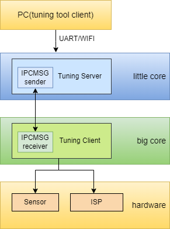
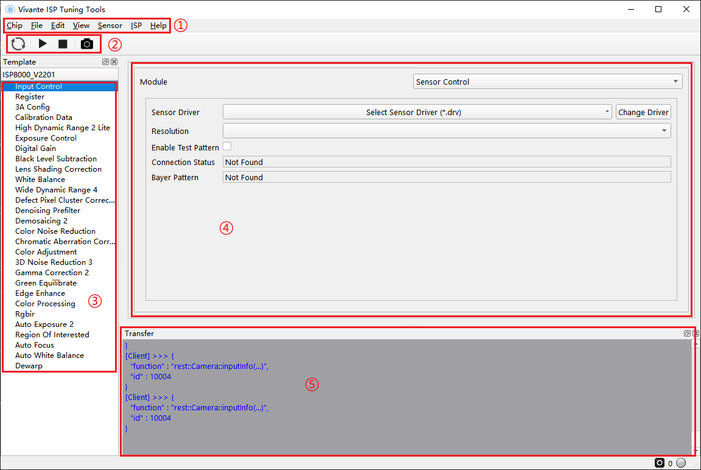
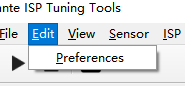
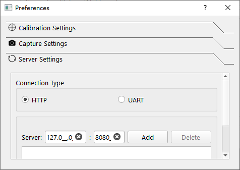
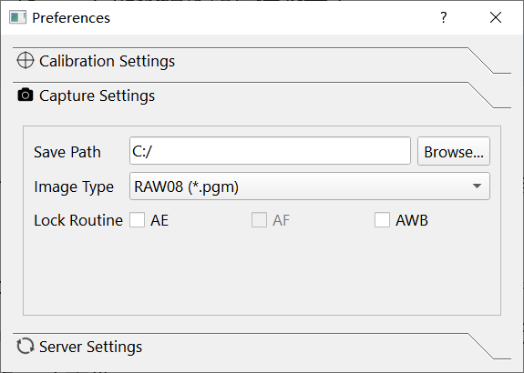
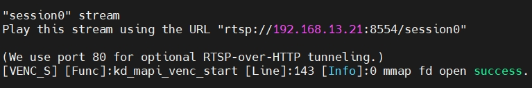
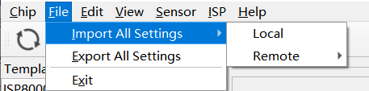

# K230 SDK Tuning Tool User Guide

Copyright 2023 Canaan Inc. ©

## Disclaimer

The products,services or features you purchase should be subject to Canaan Inc.("Company",hereinafter referred to as "Company") and its affiliates are bound by the commercial contracts and terms and conditions of all or part of the products,services or features described in this document may not be covered by your purchase or use.Unless otherwise agreed in the contract,the Company does not provide any express or implied representations or warranties as to the correctness,reliability,completeness,merchantability,fitness for a particular purpose and non-infringement of any statements,information,or content in this document.Unless otherwise agreed,this document is intended as a guide for use only.

Due to product version upgrades or other reasons,the content of this document may be updated or modified from time to time without any notice.

## Trademark Notice

,"Canaan" and other Canaan trademarks are trademarks of Canaan Inc.and its affiliates.All other trademarks or registered trademarks that may be mentioned in this document are owned by their respective owners.

**Copyright 2023 Canaan Inc..© All Rights Reserved.**
Without the written permission of the company,no unit or individual may extract or copy part or all of the content of this document without authorization,and shall not disseminate it in any form.

## Directory

[TOC]

## Preface

### Overview

This document describes instructions for using the Tuning Tool.

### Reader object

This document (this guide) is intended primarily for:

- Technical Support Engineer
- Software Development Engineer

### Definition of acronyms

| abbreviation | illustrate                                                       |
|------|------------------------------------------------------------|
| BLS  | Black Level Subtraction                                    |
| HDR  | High Dynamic Range                                         |
| 3A   | AE(Auto Exposure)、AF(Auto Focus)、AWB(Auto White Balance) |
| DG   | Digital Gain                                               |
| LSC  | Lens Shading Correction                                    |
| WB   | White Balance                                              |
| DM   | Demosaic                                                   |
| DPCC | Defect Pixel Cluster Correction                            |
| DPF  | Denoising Prefilter                                        |
| CNR  | Color Noise Reduction                                      |
| CAC  | Chromatic Aberration Correction                            |
| CA   | Color Adjustment                                           |
| 2DNR | 2D Noise Reduction                                         |
| 3DNR | 3D Noise Reduction                                         |
| GC   | Gamma Correction                                           |
| GE   | Green Equilibrate                                          |
| EE   | Edge Enhance                                               |
| CP   | Color Processing                                           |
| ROI  | Region Of Interested                                       |
| DW   | De-warp                                                    |
| TS   | Tuning-Server                                              |
| TC   | Tuning-Client                                              |
| RTSP | Real Time Streaming Protocol                               |

### Revision history

| Document version number  | Modify the description                           | Author | date       |
|------------|-----------------------------------|--------|------------|
| V1.0       | Initial edition                              | Guo Shidong | 2023-02-20 |
| V1.1       | Update some feature descriptions                   | Liu Jiaan | 2023-04-07 |
| V1.2       | Update some feature descriptions Added some feature descriptions   | Guo Shidong | 2023-05-05 |
| V1.3       | Add RTSP feature description  | Guo Shidong | 2023-07-28 |

## 1.Module software architecture

Figure 1-1

## 2.Connection and activation of the Tuning Tool

### 2.1 Tool Get Path

| **File name**      | **Storage location**       | **Features**                                            |
|-----------------|--------------------|-----------------------------------------------------|
| PC tuning-tool software package(tuning-client.exe) | relaese source code package k230_sdk/tools/tuning-tool-client/Kendyte_ISP_Tool_TuningClient_RC22.5_Pre_596062-20221116.7z | Used for image dump,ISP debugging and other PC-side tools |
| tsconfig.json                     | little core file system /app/tuning-server/        | DUMP data with configuration files    |
| run_tuning_server.sh              | little core file system /app/tuning-server/        | Start the tuning-server script |
| 3aconfig.json                     | little core file system /app/tuning-server/        | Configuration parameters of the 3a module      |
| Tuning Server                     | little core file system /app/tuning-server/        | tuning-server executable program,invoked by run_tuning_server.sh |
| sample_sys_init.elf               | big Core/bin/                               | ISP demo (contains a little number of ISP functions,used in RTSP mode)       |
| sample_vicap_dump.elf             | big Core/bin/                               | VICAP-based ISP demo (including basic ISP pipeline)         |
|**Table 2-1 List of files**|||

### 2.2 Environment compilation

Tuning-tool relies on the tuning-server program communication of the board-end little core system,and relies on the ISP demo of the board-side big core system,which is currently sample_sys_init.elf and sample_vicap_dump.elf,including basic ISP pipeline functions.When using RTSP mode,the big core boots sample_sys_init.elf,and when using non-RTSP mode,the big core boots sample_vicap_dump.elf

According to the README.md in the release source code package,compile the image and flash it to the board end.Tuning-server related components and applications will reside in the little core/app/tuning-server and /lib/tuning-server.
The following table describes the capabilities of big cores to start sample_sys_init.elf and sample_vicap_dump.elf,respectively.

| **Big core demo**          | **On-screen display**  | **RTSP** | **dump raw** | **dump yuv** | **Switch sensors** online| **Switch the resolution** online|
|-----------------------|-----------|----------|--------------|--------------|---------------------|--------------------|
| sample_sys_init.elf   |   Not supported  |   In the tank   |      Not supported  |  In the tank        |       In the tank          |         In the tank        |
| sample_vicap_dump.elf |    In the tank   |  Not supported  |      In the tank    |  In the tank        |      Not supported         |        Not supported       |
**Table 2-2 List of files**

### 2.3 Initiation Process

1.Configure the IP of the little core on the board end
1.After waiting for sharefs to start,put sample_vicap_dump.elf and sample_sys_init.elf into /sharefs,which can be completed by NFS and TFTP methods,refer to the use of sharefs for details
1.The board-end little core starts tuning-server
1.In RTSP mode,the board-end big core starts the ISP demo,cd /sharefs/; ./sample_sys_init.elf
1.Start the ISP demo on the board-end big core,cd /sharefs/; ./sample_vicap_dump.elf -dev \<dev_num\> -sensor \<sensor_num\> -chn \<chn_num\> -ofmt \<out_format\> -preview \<display_enable\>
1.The PC side starts tuning-tool-client

### 2.4 Modify the configuration file

#### 2.4.1 little core

1.tsconfig.json

It is used to configure the image data parameters of the DUMP function and the image parameters of RTSP.In non-RTSP mode,the sensor configuration needs to be specified according to the sample_vicap_dump; in RTSP mode,the sensor configuration can be modified by modifying the sensor_index
If you change convert_to_Bmp to 1,save the dumped data to BMP and send it to the PC to specify the save directory,and the preview window will display BMP.
When the convert_to_Bmp is changed to 0,the original data (yuvNV12) of dump is saved and sent to the PC to the specified save directory,and the preview window cannot be displayed.

| **Keywords**     | **Default value**                | **Features**                         |
|----------------|---------------------------|-----------------------------------|
| Width          | 1920                      | The width of the DUMP image,and the width of the push stream when RTSP is enabled |
| Height         | 1088                      | The height of the DUMP image is the height of the push stream when RTSP is enabled,and the width x height must be aligned by 4K,otherwise the push may fail |
| Align          | 1                         | Number of aligned bytes                        |
| stride         | 1280                      | The aligned data width (followed by Width) is sufficient |
| pixel_format   | 27                        | DUMP image format,27/30:YUV NV12     |
| insert_pic     | 0                         | Interpolation test,0:off,1:on,default off,currently do not need to be enabled |
| convert_to_Bmp | 1                         | The image converted to BMP after dump is enabled by default,and the converted BMP will be displayed in tuning-tool,and the conversion will not be performed after closing,and the tuning-tool display window will not be able to display the image |
| bayer_pattern  | 1                         | 0:BGGR,1:RGGB,default RGGB,temporarily not effective |
| insertFilename | NOT                       | Full path of interpolation test file:The default is empty       |
| save_path      | /app/tuning-server/mount/ | The storage path of DUMP data on the board side,there is no mount directory on the board side,and you need to create it yourself |
| dev_num        | 0                         | Device ID number,default 0,0:sensor0,1:sensor1 |
| chn_num        | 0                         | Bind channel number,default 0                    |
| exp_type       | 0                         | The sensor exposure mode,which is not currently in effect,defaults to 0    |
| rtsp_mode      | 1                         | 0:Use non-RTSP mode,big core boot uses RTSP mode,big core boot sample_vicap_dump.elf,1:Use RTSP mode,big core boot sample_sys_init.elf |
| video_index    | 2                         |rtsp encoding method,0:kVideoTypeH264,1:kVideoTypeH265,2:kVideoTypeMjpeg|
| sensor_index   | 3                         |rtsp uses a switched sensor configuration and supports index 0-8,0:ov9732,1:ov9286 ir,2:ov9286 speckl,3-8:imx335,see tsconfig.json key:HELP for sensor_index|
|**Table 2-3 Configuration parameters**|||

1.run_tuning_server.sh,to start tuning-server,directly follow step 3.
1.Start tuning-server,cd /app/tuning-server; ./run_tuning_server.sh

#### 2.4.2 Big core

1.RT-Smart starts the ISP-demo

Non-RTSP mode:
Modify tsconfig.json's rtsp_mode to 0
> cd /sharefs/; ./sample_vicap_dump.elf
ISP-demo startup method
./sample_vicap_dump.elf -dev \<dev_num\> -sensor \<sensor_num\> -chn \<chn_num\> -ofmt \<out_format\> -preview \<display_enable\>
./sample_vicap_dump.elf -dev 0 -sensor 0 -chn 0
./sample_vicap_dump.elf -dev 0 -sensor 2 -chn 0
By specifying the sensor num to decide which sensor configuration to use,the preview switch determines whether to take a screen preview

RTSP mode:
Modify the rtsp_mode of tsconfig.json to 1
> CD /sharefs/; ./sample_sys_init.elf
ISP-demo start method
./sample_sys_init.elf

By modifying the sensor_index of tsconfig.json to the required value,such as the default IMX335 is 3,decide which sensor configuration to use,no screen,after starting,you need to click the start preview of the tuning-tool interface to open the stream,when you need to switch online,click Stop Preview,modify tsconfig.json,execute the sync command,and click Start repeatedly Preview is enough

#### 2.4.3 PC tuning tool

1.Start tuning-tool

Open the tuning-client .exe in the tuning-tool toolkit in release.The path is:k230_sdk/tools/tuning-tool-client/Kendyte_ISP_Tool_TuningClient_RC22.5_Pre_596062-20221116.7z
Refer to Section 3.1 to configure the IP.

## 3.Introduction to the Tuning Tool interface

Figure 3-1

As shown in Figure 3-1,the basic operation UI of tuning-tool-client is fully expanded in five areas

(1) Menu operation area:for ISP selection,parameter import/export,communication connection configuration

(2) Image manipulation area:Grab images

(3) Functional area:used to switch the UI of each module of the ISP

(4) Tuning area:the parameters used to debug a module

(5) Echo area:used to print the logs sent and received by some parameters

### 3.1 Connect the board-end tuning-server

#### 3.1.1 Use HTTP to connect to the board-end tuning-server

Figure 3-2

The SDK supports HTTP connection by default,click Edit-\> Preferences-\>Server Settings will pop up the configuration window,as shown in Figure 3-2 and Figure 3-3.

Figure 3-3

Select HTTP mode,ensure that the PC and the board end of the network connected to the network is in the same network segment,in the first item of the server to specify the board IP,the second item to specify the port default can be,click add-\> apply in turn to close the window to complete the configuration,if the board end tuning-server has been started,it will automatically complete the connection,arbitrarily switch the module in the (3) area in Figure 3-1,you will see the function print on the tuning-server side.

### 3.2 Online Tuning interface and function description

This section only briefly introduces the main functions of some Tuning modules on the tuning tool interface,and the specific Tuning strategies and steps will be described in detail in the image tuning documents in the future.

#### 3.2.1 Input Control

Sensor Driver:Select the driver configuration .drv the sensor

Resolution:The sensor configures the resolution of the image

Enable Test Pattern:Whether to open sensor test pattern

Connection Status:View the connection status

Bayer Pattern:bayer sequence

#### 3.2.2 Register

Allows users to read and write to ISP registers.

Support reading and writing to the sensor register,currently read and write sensor0 by default,if you read and write sensor1,you need to configure the dev_num parameter in tsconfig.json to be 1.

#### 3.2.3 3A Config

Currently unused,it has been decomposed elsewhere.

#### 3.2.4 Calibration Data

Import and display the XML file generated by the calibration tool on the interface.

#### 3.2.5 High Dynamic Range 2

Not yet supported.

#### 3.2.6 Exposure Control

Support to obtain auto exposure and gain,support to set exposure and gain through the tool interface,set up the auto exposure function.

#### 3.2.7 Digital Gain

Used to enable control and size adjustment of ISP Digital Gain.

#### 3.2.8 Black Level Subtraction

Provide sensor-related black level correction,and can be set for R,Gr,Gb,and B channels.

#### 3.2.9 Lens Shading Correction

Lens shading correction is provided,and calibration coefficients are generated by the calibration tool.

#### 3.2.10 White Balance

Provide white balance R,Gr,Gb,B four channels gain settings;

Color deviation calibration can be accomplished by adjusting the 3x3 CCM matrix and offset.

#### 3.2.11 Wide Dynamic Range 4

Provide adjustments to the global and local contrast of an image.

#### 3.2.12 Defect Pixel Cluster Correction

It provides the function of detecting and calibrating pixel dead pixels,and different calibration methods can be set by selecting set.

#### 3.2.13 Denoising Prefilter

Bilateral filtering noise reduction module.

#### 3.2.14 Demosaicing 2

Convert Bayer Raw images to RGB images by interpolation,and provide moire removal,depurple,sharpening and noise reduction processing functions.

#### 3.2.15 Color Noise Reduction

Not supported.

#### 3.2.16 Chromatic Aberration Correction

Used to calibrate chromatic aberrations,which are mainly introduced by the lens,calibration parameters are generated by the calibration tool.

#### 3.2.17 Color Adjustment

It is divided into two parts:CA and DCI.

The CA module is used to adjust the saturation of the image.Adjust the saturation according to the change of image brightness or original saturation to achieve the purpose of local adjustment of saturation,make the color of the bright area more vivid and eliminate the color noise in the dark area or low saturation area.

The DCI module enables dynamic contrast adjustment of images.

#### 3.2.18 3D Noise Reduction 3

Adjust the intensity of image noise reduction by adjusting the parameter configuration.

#### 3.2.19 Gamma Correction 2

Support customer customize gamma,this mode can change the gamma index.

#### 3.2.20 Green Equilibrate

Calibrate the imbalance between the Gr and Gb channels,and set different green equilibrate intensities.

#### 3.2.21 Edge Enhance

Used to improve the clarity of the image.By setting appropriate parameters,image clarity can be improved while noise enhancement can be suppressed.

#### 3.2.22 Color Processing

A color processing module that adjusts the contrast,brightness,saturation and hue of an image to set different color preferences or styles.

#### 3.2.23 Rgbir

Not yet supported.

#### 3.2.24 Auto Exposure 2

The tool interface does not support adjusting automatic parameters.

#### 3.2.25 Region Of Interested

You can set 8 ROI windows through the tool,and after the number of windows exceeds 1 for the first time,you can no longer close the ROI mode,and the number of ROIs is at least 1.To enable ROI mode,you need to select FIX mode and enable AE in Scene Evaluation Mode in Auto Exposure2 module to enable ROI mode.

#### 3.2.26 Auto Focus

Due to the automatic function,it is not supported at this time.

#### 3.2.27 Auto White Balance

Due to the automatic function,it is not supported at this time.

#### 3.2.28 Dewarp

It has been moved to a separate Dewarp tool.

### 3.3 Grab images

#### 3.3.1 Select Save Directory

Figure 3-4

Click Menu -\>Edit-\>preferences,pop-up window as shown in Figure 3-4,click Capture Settings,click Browser button,select the path to save data,and close the window.

#### 3.3.2 Acquiring images

Currently,only dump 8bit yuvNV12 format data is supported,clickwait for the preview window to pop up,you can transfer the converted image to BMP to the set save path,and display,the original yuv data is stored in the file system.

If both YUV and BMP data are required,you can consider using functions such as mount disks or TFTP to send out data.If you use the mount mode.Modify the "save_path" value in tsconfig.json,the default "save_path":"/app/tuning-server/mount/",you can modify the storage path of the original data when tuning -server dumps data,you can set the path to the mount directory,and directly store yuv and BMP files in this path.

If you don't need BMP data,only use yuv data,you can set "convert_to_Bmp" in tsconfig.json:0,turn off the convert BMP function,so that the yuv data will be sent directly to PC,and the preview window will no longer display the image.

The storage space on the board side is limited,and it cannot be dumped after a certain number of frames,and you need to manually clean the data before executing this function.

The tsconfig.json file can be modified directly,save and execute the sync command,at which time the capture function will be updated,there is no need to exit tuning-server and then modify.

#### 3.3.3 RTSP push

In RTSP mode,http push to PC is supported,after tuning-tool and tuning-server establish a connection,clickwait for the little core to load the push function,and print the address of the push stream after completion.

Copy the printed URL into the URL of the VLC network streaming device,play and wait.
To modify the image parameters online and apply,you need to stop pushing the stream first,clickwait for the stop success prompted in the serial port printing,modify tsconfig.json,save,sync.Just click  again.

If both YUV and BMP data are required,you can consider using functions such as mount disks or TFTP to send out data.If you use the mount mode.Modify the "save_path" value in tsconfig.json,the default "save_path":"/app/tuning-server/mount/",you can modify the storage path of the original data when tuning -server dumps data,you can set the path to the mount directory,and directly store yuv and BMP files in this path.

If you don't need BMP data,only use yuv data,you can set "convert_to_Bmp" in tsconfig.json:0,turn off the convert BMP function,so that the yuv data will be sent directly to PC,and the preview window will no longer display the image.

The storage space on the board side is limited,and it cannot be dumped after a certain number of frames,and you need to manually clean the data before executing this function.

The tsconfig.json file can be modified directly,save and execute the sync command,at which time the capture function will be updated,there is no need to exit tuning-server and then modify.

### 3.4 Import and export of parameters

#### 3.4.1 Parameter Import

The parameter file that the tool supports import by default is standard xml format,which is divided into two parts:calibration parameters and tuning parameters,and supports PC local and remote (board local ) import.

Click File-\>Import All Settings-\> Local/Remote to select the parameter xml file to be imported in the pop-up window,as shown in Figure 3-5.In tuning-tool-client,by default,there are a variety of sensor reference XML,which can be used for testing.You can also import XML files stored in advance in the board-side Linux file system.

Figure 3-5

#### 3.4.2 Parameter export

The default export method of the tool will summarize the calibration parameters and online Tuning parameters into one XML file.

After clicking File-\>Export All Settings in turn,the isp-yyyy-MM-dd_HH-mm-ss.xml file will be saved on the board side,such as:isp-2023-02-07_11-13-17.xml.
