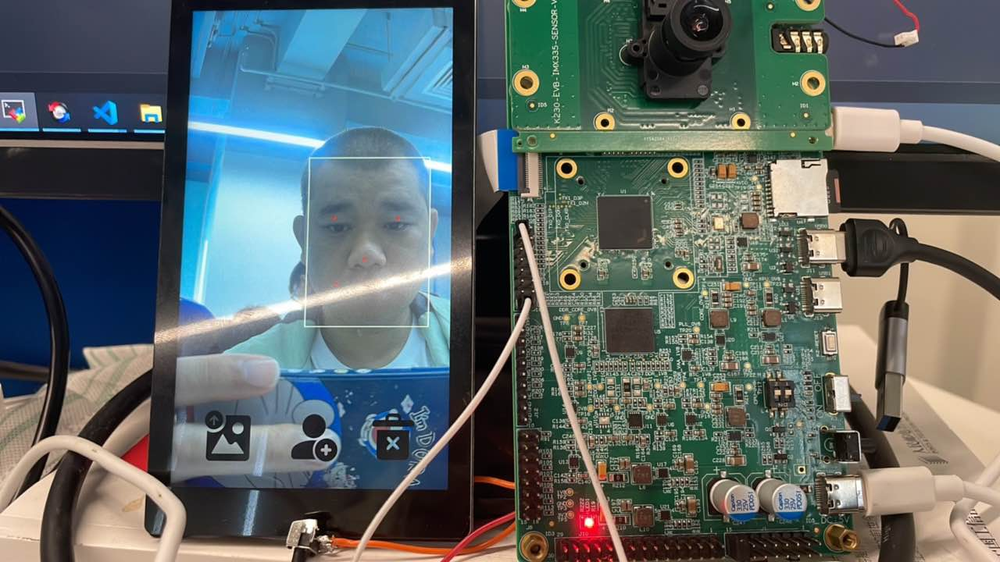
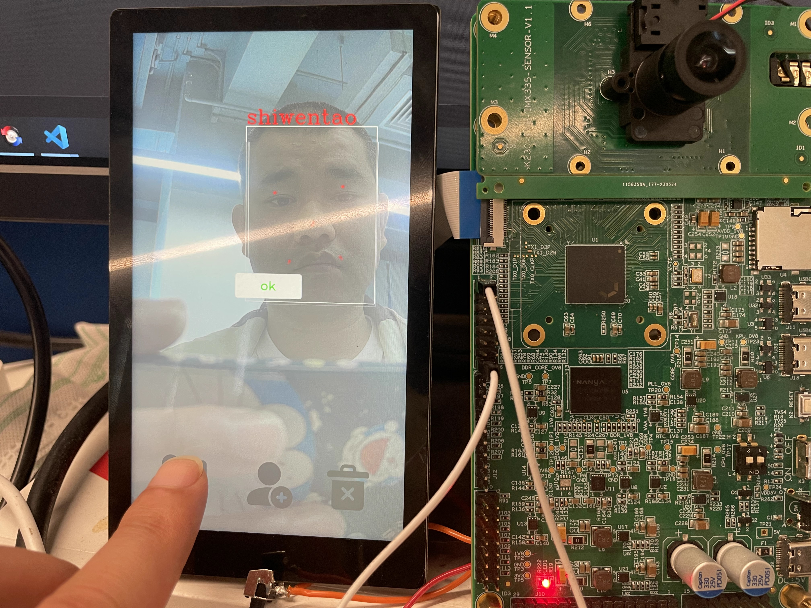
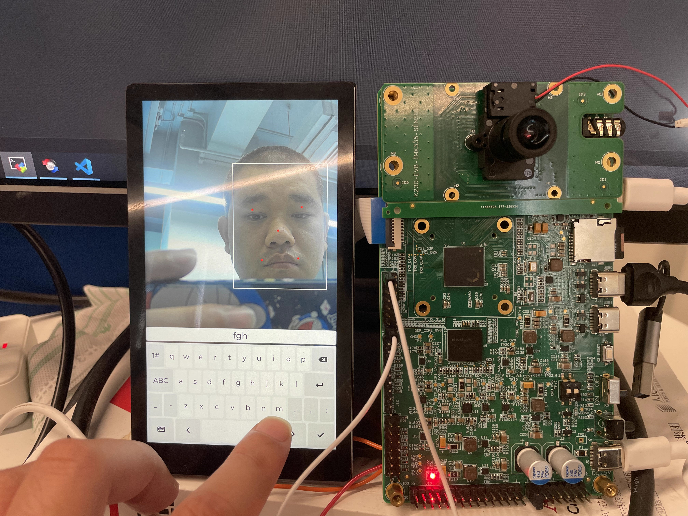
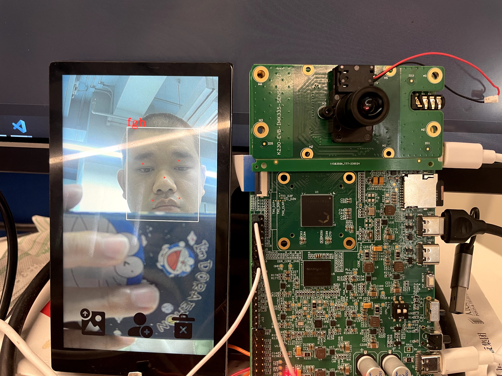

# K230 Scenario Practice - Smart Door Lock POC


Copyright © 2023 Beijing Canaan-JieSi Information Technology Co., Ltd.

<div style="page-break-after:always"></div>

## Disclaimer

The products, services, or features you purchase are subject to the commercial contracts and terms of Beijing Canaan-JieSi Information Technology Co., Ltd. (hereinafter referred to as "the Company") and its affiliates. All or part of the products, services, or features described in this document may not be within the scope of your purchase or use. Unless otherwise agreed in the contract, the Company does not provide any express or implied statements or warranties regarding the accuracy, reliability, completeness, merchantability, fitness for a particular purpose, and non-infringement of any representations, information, or content in this document. Unless otherwise agreed, this document is for reference only as a usage guide.

Due to product version upgrades or other reasons, the content of this document may be updated or modified periodically without any notice.

## Trademark Statement

, "Canaan" and other Canaan trademarks are trademarks of Beijing Canaan-JieSi Information Technology Co., Ltd. and its affiliates. All other trademarks or registered trademarks mentioned in this document are owned by their respective owners.

**Copyright © 2023 Beijing Canaan-JieSi Information Technology Co., Ltd. All rights reserved.**
Without the written permission of the Company, no unit or individual may excerpt, copy, or disseminate part or all of the content of this document in any form.

<div style="page-break-after:always"></div>

## K230 Smart Door Lock

A program developed on the K230 platform that integrates UI, face detection, face recognition, and face registration functions.

### Hardware Environment

- K230-USIP-LP3-EVB-V1.0/K230-USIP-LP3-EVB-V1.1/K230-SIP-EVB-V1.0
- Supporting LCD module
- K230-USIP-IMX335-SENSOR-V1.1 module

### Overview

The smart door lock program, as a POC project, provides customers with a reference on how to use lvgl, big-little core communication, multimedia pipeline, and AI functionalities. The program is mainly divided into two parts: the big core program primarily handles video input and output, AI processing, and related functions, while the little core handles UI and face feature management functions. Communication between the big and little cores is done via IPCMSG, and the program starts from NOR flash on the development board.

### Notes

1. Before powering off or resetting, input `halt` on the little core serial port to protect the file system from damage.

### Source Code Location

The big core program source code is located at `src/reference/business_poc/doorlock/big`, with the directory structure as follows:

```sh
.
├── anchors_320.cc
├── CMakeLists.txt
├── main.cc
├── mbface.kmodel
├── mobile_face.cc
├── mobile_face.h
├── mobile_retinaface.cc
├── mobile_retinaface.h
├── model.cc
├── model.h
├── retinaface.kmodel
├── util.cc
├── util.h
└── vi_vo.h
```

The little core program source code is located at `src/little/buildroot-ext/package/door_lock`, with the directory structure as follows:

```sh
.
├── Config.in
├── src
│   ├── CMakeLists.txt
│   └── ui
│       ├── CMakeLists.txt
│       ├── data
│       │   └── img
│       │       ├── delete.png
│       │       ├── import.png
│       │       └── signup.png
│       ├── demo
│       │   └── main.c
│       ├── lvgl_port
│       │   ├── CMakeLists.txt
│       │   ├── k230
│       │   │   ├── buf_mgt.cpp
│       │   │   ├── buf_mgt.hpp
│       │   │   ├── CMakeLists.txt
│       │   │   ├── lv_port_disp.cpp
│       │   │   └── lv_port_indev.c
│       │   ├── lv_conf_demo.h
│       │   ├── lv_conf.h
│       │   └── lv_port.h
│       └── src
│           ├── db_proc.c
│           ├── db_proc.h
│           ├── main.c
│           ├── msg_proc.cpp
│           ├── msg_proc.h
│           ├── scr_main.c
│           ├── scr_signup.c
│           └── ui_common.h
└── src.mk
```

#### Compiling the Program

For the K230-USIP-LP3-EVB-V1.0/K230-USIP-LP3-EVB-V1.1 development board:
Execute `make CONF=k230_evb_doorlock_defconfig` in the `k230_sdk` directory. The big core program `door_lock.elf` will be generated in the `k230_sdk/src/reference/business_poc/doorlock/big/out` directory, and the little core program in the `app` directory under `k230_sdk/output/k230_evb_doorlock_defconfig/little/buildroot-ext/target`.

For the K230-SIP-EVB-V1.0 development board:
Execute `make CONF=k230d_doorlock_defconfig` in the `k230_sdk` directory. The big core program `door_lock.elf` will be generated in the `k230_sdk/src/reference/business_poc/doorlock/big/out` directory, and the little core program in the `app` directory under `k230_sdk/output/k230d_doorlock_defconfig/little/buildroot-ext/target`.

#### Running the Program

The smart door lock program is in the NOR flash image, and the big and little core programs start automatically. After compiling for the K230-USIP-LP3-EVB-V1.0/K230-USIP-LP3-EVB-V1.1 development board, the `sysimage-spinor32m.img` image will be generated in the `output/k230_evb_doorlock_defconfig/images/` directory. After compiling for the K230-SIP-LP3-EVB-V1.0 development board, the `sysimage-spinor32m.img` image will be generated in the `output/k230d_doorlock_defconfig/images/` directory. Flash the NOR flash image, and set the development board's DIP switch to NOR flash boot.

#### Function Demonstration

1. After starting the big and little core programs, the interface is displayed as follows: 

1. To import face images from an SD card, place images in the `/sharefs/pic` directory. To ensure recognition accuracy, the imported images must be in JPG format with a resolution of 720x1280. Place the face images to be imported in the `/sharefs/pic` directory and press the image import button. The program will automatically extract feature values and use the filename of the image as the label for successful recognition. The operation effect is as follows: 

1. For real-time face registration, click the face registration button and enter the label via the UI keyboard. To ensure recognition accuracy, the face should be centered in the image during registration. The operation effect is as follows:  Recognition effect: 

1. To delete the face database, delete all faces registered via the SD card and real-time face registration. The operation effect is as follows: 

#### OTA

1. Refer to the SDK OTA upgrade function to package the flash partition to be updated. Since the partition file size is saved in the RTT kernel, when upgrading other partitions of NOR flash, the `rtt_system.bin` must also be upgraded.
1. Input the server IP address via the upgrade button.
1. Input commands sequentially via the serial port: `killall -9 ui`, mount the SD card partition to the `/tmp` directory, e.g., `mount /dev/mmcblk0p2 /tmp`.
1. Ensure that the local network server is connected and execute the `/usr/bin/ota` command. The device will restart after a successful upgrade.
