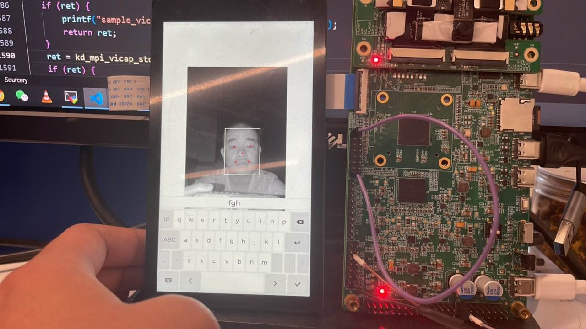

# K230 Scene Practice - Smart Door Lock POC - 3D Structured Light


Copyright © 2023 Beijing Canaan Creative Information Technology Co., Ltd.

<div style="page-break-after:always"></div>

## Disclaimer

The products, services, or features you purchase are subject to the commercial contracts and terms of Beijing Canaan Creative Information Technology Co., Ltd. ("the Company", hereinafter the same) and its affiliates. All or part of the products, services, or features described in this document may not be within the scope of your purchase or use. Unless otherwise agreed in the contract, the Company does not make any express or implied representations or warranties regarding the accuracy, reliability, completeness, merchantability, fitness for a particular purpose, or non-infringement of any statements, information, or content in this document. Unless otherwise agreed, this document is for reference only.

Due to product version upgrades or other reasons, the content of this document may be updated or modified periodically without any notice.

## Trademark Statement

, "Canaan", and other Canaan trademarks are trademarks of Beijing Canaan Creative Information Technology Co., Ltd. and its affiliates. All other trademarks or registered trademarks mentioned in this document are owned by their respective owners.

**Copyright © 2023 Beijing Canaan Creative Information Technology Co., Ltd. All rights reserved.**
Without the written permission of the Company, no unit or individual is allowed to excerpt, copy, or disseminate part or all of the content of this document in any form.

<div style="page-break-after:always"></div>

## K230 Smart Door Lock

A program developed on the K230 platform integrating UI, face detection, IR detection, depth detection, face recognition, and face registration functions. It uses 8-line NOR flash for fast startup, with power-on to image output within 400ms and unlocking within 700ms, using 32M flash and 128M DDR.

### Hardware Environment

- K230-USIP-LP3-EVB-V1.0/K230-USIP-LP3-EVB-V1.1
- Supporting LCD module
- K230-USIP-OV9286-SENSOR-V1.1 module

### Overview

The smart door lock program, as a POC project, provides customers with a reference on how to use lvgl, big-little core communication, multimedia pipeline, and AI functions. The program is mainly divided into two parts: the big core program primarily handles video input/output and AI processing, while the small core handles UI and face feature management. Communication between the big and small cores is achieved through IPCMSG, and the program is started from NOR flash on the development board.

### Notes

1. To ensure recognition effect, the configuration file and reference frame file used by DPU must match the sensor used. If not, replace the matching `H1280W720_conf.bin` and `H1280W720_ref.bin` in the `src/reference/business_poc/doorlock_ov9286/big/bin/` path and recompile the image.

1. Before power-off or reset, input `halt` on the small core serial port to protect the file system from damage.

1. In the door lock POC scenario, personal private information such as face features must be stored in encrypted form to avoid security risks from attackers stealing the information. In the K230 smart door lock POC scenario, face features are encrypted and stored in NOR flash. During the uboot stage, the encrypted data is transferred from flash to DDR and decrypted. This project uses the AES-GCM encryption/decryption algorithm to handle feature encryption/decryption, with the key hardcoded in plaintext in the app for ease of customer experience. However, storing the key in plaintext in the app is inherently insecure. If needed, we will provide a complete face feature encryption/decryption storage solution later. The specific process is as follows:

3.1 After receiving the K230 development board kit, the customer needs to burn the key into the OTP key area.

3.2 In the door lock POC scenario, when the customer needs to store face features, the key is read from OTP, and AES-GCM encryption is performed using the key.

3.3 During the uboot stage, the key burned by the user in the OTP key area is read for decryption.

### Source Code Location

The big core program source code is located in `src/reference/business_poc/doorlock_ov9286/big`, with the directory structure as follows:

```sh
.
├── anchors_320.cc
├── bin
│   ├── H1280W720_conf.bin
│   └── H1280W720_ref.bin
├── build
├── CMakeLists.txt
├── main.cc
├── mobile_face.cc
├── mobile_face.h
├── mobilenetv2_depth.cc
├── mobilenetv2_depth.h
├── mobilenetv2_ir.cc
├── mobilenetv2_ir.h
├── mobile_retinaface.cc
├── mobile_retinaface.h
├── model.cc
├── model.h
├── util.cc
├── util.h
└── vi_vo.h
```

The small core program source code is located in `src/little/buildroot-ext/package/door_lock`, with the directory structure as follows:

```sh
.
├── Config.in
├── src
│   ├── CMakeLists.txt
│   └── ui
│       ├── CMakeLists.txt
│       ├── data
│       │   └── img
│       │       ├── delete.png
│       │       ├── import.png
│       │       └── signup.png
│       ├── demo
│       │   └── main.c
│       ├── lvgl_port
│       │   ├── CMakeLists.txt
│       │   ├── k230
│       │   │   ├── buf_mgt.cpp
│       │   │   ├── buf_mgt.hpp
│       │   │   ├── CMakeLists.txt
│       │   │   ├── lv_port_disp.cpp
│       │   │   └── lv_port_indev.c
│       │   ├── lv_conf_demo.h
│       │   ├── lv_conf.h
│       │   └── lv_port.h
│       └── src
│           ├── db_proc.c
│           ├── db_proc.h
│           ├── main.c
│           ├── msg_proc.cpp
│           ├── msg_proc.h
│           ├── scr_main.c
│           ├── scr_signup.c
│           └── ui_common.h
└── src.mk
```

#### Compiling the Program

For the K230-USIP-LP3-EVB-V1.0/K230-USIP-LP3-EVB-V1.1 development board, compile the program by executing `make CONF=k230_evb_doorlock_ov9286_defconfig` in the `k230_sdk` directory. The big core program `door_lock.elf` will be generated in the `k230_sdk/src/reference/business_poc/doorlock_ov9286/big/out` directory, and the small core program will be generated in the `app` directory under `k230_sdk/output/k230_evb_doorlock_ov9286_defconfig/little/buildroot-ext/target`.

#### Running the Program

The smart door lock is in the NOR flash image, and the big and small core programs start automatically. After compiling for the K230-USIP-LP3-EVB-V1.0/K230-USIP-LP3-EVB-V1.1 development board, a `sysimage-spinor32m.img` image will be generated in the `output/k230_evb_doorlock_ov9286_defconfig/images/` directory. Burn the NOR flash image and set the development board's DIP switch to NOR flash boot.

#### Function Demonstration

1. After the big and small core programs start, the interface will display as follows: 

1. To import face images via SD card, place the images in the `/sharefs/pic` directory. To ensure recognition effectiveness, the imported images should be in JPG format, with a resolution of 720*1280 and a 9:16 aspect ratio. Place the face images to be imported in the `/sharefs/pic` directory, press the image import button, and the program will automatically extract the feature values and use the image file name as the label for successful recognition. The operation effect is as follows: 

1. For real-time face registration, click the face registration button and input the label through the UI-displayed keyboard. To ensure recognition effectiveness, the face should be centered in the image during registration. The operation effect is as follows: 
Recognition effect: 

1. To delete the face database, delete all faces registered via SD card and real-time face registration. The operation effect is as follows: 

#### OTA

1. Refer to the SDK OTA upgrade function to package the flash partition that needs updating. Since the partition file size is saved in the RTT kernel, when upgrading other NOR flash partitions, the `rtt_system.bin` must also be upgraded.
1. Input the server IP address through the upgrade button.
1. Input the command `killall -9 ui` via serial port, mount the SD card partition to the `/tmp` directory, e.g., `mount /dev/mmcblk0p2 /tmp`.
1. Ensure the local network server is connected, execute the `/usr/bin/ota` command, and the device will reboot after a successful upgrade.
