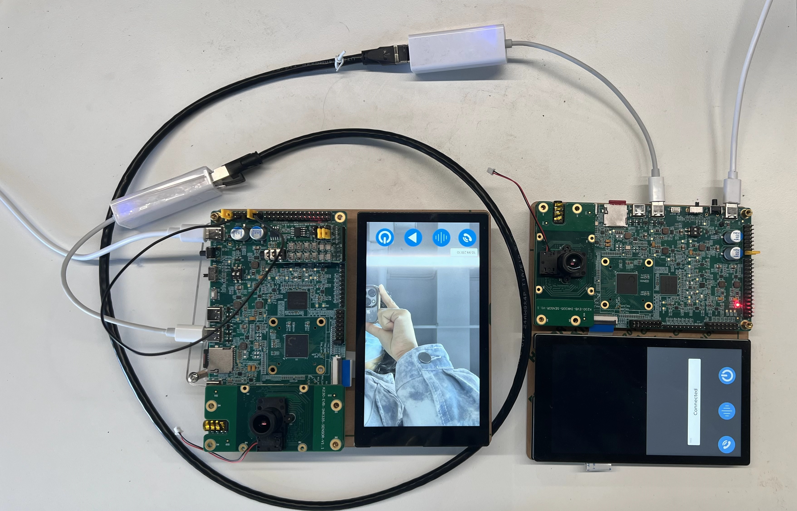

# K230 Scene Pratice-Peephole POC

Copyright 2023 Canaan Inc. ©

## Disclaimer

The products, services or features you purchase should be subject to Canaan Inc. ("Company", hereinafter referred to as "Company") and its affiliates are bound by the commercial contracts and terms and conditions of all or part of the products, services or features described in this document may not be covered by your purchase or use. Unless otherwise agreed in the contract, the Company does not provide any express or implied representations or warranties as to the correctness, reliability, completeness, merchantability, fitness for a particular purpose and non-infringement of any statements, information, or content in this document. Unless otherwise agreed, this document is intended as a guide for use only.

Due to product version upgrades or other reasons, the content of this document may be updated or modified from time to time without any notice.

## Trademark Notice

, "Canaan" and other Canaan trademarks are trademarks of Canaan Inc. and its affiliates. All other trademarks or registered trademarks that may be mentioned in this document are owned by their respective owners.

**Copyright 2023 Canaan Inc.. © All Rights Reserved.**
Without the written permission of the company, no unit or individual may extract or copy part or all of the content of this document without authorization, and shall not disseminate it in any form.

## K230 Peephole

A set of product-level programs developed on the K230 platform that integrate UI, video intercom, and person detection functions. Peephole products support remote peephole and local peephole. The remote peephole is the peephole device can interact with the remote mobile phone device.

### Hardware environment

- K230-USIP-LP3-EVB-V1.0/K230-USIP-LP3-EVB-V1.1 * 2个
- LCD module * 2 pcs
- K230-USIP-IMX335-SENSOR-V1.1 module * 2 pcs
- typeC to network port interface * 2
- An external audio board
- One network cable

In addition to the audio board and network cable, remote peephole requires two sets of equipment, one as a peephole device and one as mobile phone device. The audio board is used on the peephole device side.

In the figure above, the EVB board on the left runs the peephole device side, and the EVB board on the right runs the simulated mobile phone end.
The key functions on the interface UI are as follows:

- Intercom button: Controls the start/cancel of the intercom.
- Voice Change button: Controls the enable/disable of voice changer.
- Play button: Go to the playback interface to play back the recorded video or captured picture.
- Shutdown button: Controls the shutdown of the peephole device.

## overview

As a POC project, peephole program provides a reference on how to use LVGL, big and little core communication, network communication, multimedia pipeline, and AI.

The main features of the program:

1. Two wake-up modes: PIR wake-up and doorbell wake-up.

   - PIR唤醒：
     - peephole device performs person detection and captures, which will be saved.
   - Doorbell wake-up:
     - Remote video intercom, local voice intercom, save and playback.

1. RTSP network services as well as RPC services.
1. Big and little core events, data communication.
1. Image capture, recording, and playback.
1. GUI display.

There are two main parts of the program:

- Peephole device programs: including big core program and little core program
  1. Big core program
  It mainly perform AI detection, video input, video/image encoding, audio input and encoding, audio decoding and output functions.
  1. little core program
  It mainly perform UI interface control, audio and video pushing, saving, playback, interaction with mobile phone devices to realize video intercom function, and local voice intercom function.

- Mobile phone device program: only includes little core program
  The little core program mainly perform the function of controlling the start, end, and voice change of video intercom through the UI interface, and interacts with peephole device to realize the video intercom function.

## Feature demo

### Doorbell mode

Peephole device
Start by long pressing the button, start the UI interface, and the button functions are as follows:

- Intercom button: Intercom enable/cancel, only for local doorbell intercom. After pressing the first time the program runs up, the intercom begins.
- Voice change key: Control voice change enable/disable, only for local doorbell intercom, default value is disable.
- Play key: The key is playback, which is used to play locally stored videos and images. (Note that when local intercom, you need to cancel the intercom before playback)
- Shutdown button: Controls the shutdown of the device.

The local IP address is displayed above the intercom button.

When the doorbell wakes up the peephole device, the screen displays the video captured by the local camera, and video intercom can be performed in two ways. One is a local doorbell voice intercom, and the other is a remote doorbell video intercom.

#### Local doorbell voice intercom

Click the intercom button on the peephole device to start the intercom inside and outside the door. Connect the headphones to the EVB onboard headphone jack and audio board headphone jack of the peephole device, and you can hear the peer sound.

#### Remote doorbell video intercom

For remote intercom, another development board is required to run the mobile program. When connected to the device, the mobile phone will display "Connected" in a pop-up box, and then the pop-up box disappears to continue to display the main interface. The three buttons below function it:

- Intercom key: control the intercom enable/disable, after the program runs, a pop-up box of wake-up mode will appear. After that, the intercom is triggered by this button, and after the first press, the intercom begins.
- Voice change key: control voice change enable/disable, default value is disable.
- Shutdown button: remote control of peephole device shutdown.

## Restrictions and Descriptions

1. Currently, only network direct connection testing is supported, and static IP addresses are configured on both mobile phones and devices.
1. After the remote video intercom hangs up, it cannot be connected again.
1. After the playback is over, remote video intercom is not supported.
1. After the doorbell mode is turned on, it starts to store video, and the storage format is mp4. Starting again in doorbell mode overwrites the previous saved.
1. The PIR mode detects the captured image after detected person, and you need to wake up through the doorbell mode and click the playback button to view it.
1. The currently configured storage space is 256MB.

## Source code location

- The source code path of the peephole device big core program is located`k230_sdk/src/reference/business_poc/peephole/big`
- The source code path of the peephole device applet program is located `k230_sdk/src/reference/business_poc/peephole/peephole_device`
- The source code path of the analog mobile phone device program is located`k230_sdk/src/reference/business_poc/peephole/peephole_phone`

## Compile the program

### Peephole equipment

The peephole device needs to be compiled with the peephole device configuration script, and the compilation command is as follows`make CONF=k230_evb_peephole_device_defconfig`.
**It should be noted that after configuring CONF, even if CONF is not configured, the subsequent compilation commands will be compiled with the previous CONF, and the compiled outputs are in the`k230_sdk/output/${CONF}` directory**
The default CONF is`k230_evb_defconfig`.
The generated image is `output/k230_evb_peephole_device_defconfig/images/sysimage-spinor32m.img`, load this image, automatically run on the peephole device after startup.

### Emulates a cell phone device

You can generate a mobile phone image by `make CONF=k230_evb_peephole_phone_defconfig`compiling, burn the image in the generated image`output/k230_evb_peephole_phone_defconfig/images/sysimage-sdcard.img.gz`, and automatically run the mobile phone program after starting.

## Run the program

### Run the peephole device-side program

The peephole device is shown in the figure below and can be started in two ways.

- Method 1: Dial the DIP switch to`ON`, this method simulates PIR wake-up.
  - The device will capture the first frame, detect the humanoid, and capture the humanoid 10 seconds after it is detected. The humanoid detection referred to in this article is the entire humanoid.
  - Once this mode is activated, doorbell mode can be entered by pressing the doorbell button shortly.
- Method 2: Long press the button, this method simulates the doorbell wake-up.
  - The MIC and earphone on the EVB board simulate the scene outside the door; the MIC and earphone on the audio daughter board simulate the scene inside the door.

After burning the peehole image, you need to short-connect the 1 and 2 pins, 13 and 14 pins, 9 and 15 pins of J1 respectively, as shown in the figure below.

### Run a simulated mobile terminal

After burning the simulated mobile phone image, the mobile phone program will be automatically run after startup. After the pop-up box prompts that it is successfully connected, you can control the interaction with the peephole device through the button.
