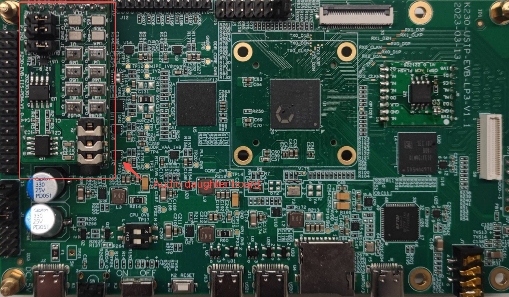
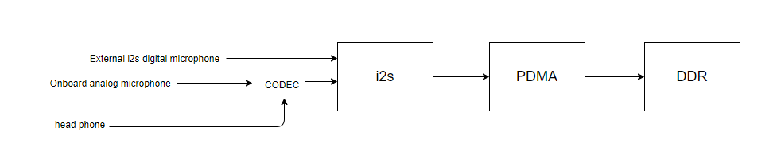
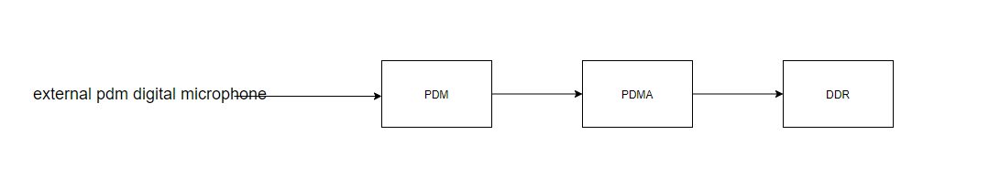
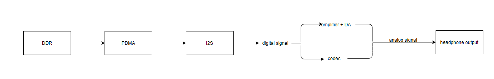

# K230 Audio in Action - Audio capture, playback, codec


Copyright 2023 Canaan Inc. ©

<div style="page-break-after:always"></div>

## Disclaimer

The products, services or features you purchase should be subject to Canaan Inc. ("Company", hereinafter referred to as "Company") and its affiliates are bound by the commercial contracts and terms and conditions of all or part of the products, services or features described in this document may not be covered by your purchase or use. Unless otherwise agreed in the contract, the Company does not provide any express or implied representations or warranties as to the correctness, reliability, completeness, merchantability, fitness for a particular purpose and non-infringement of any statements, information, or content in this document. Unless otherwise agreed, this document is intended as a guide for use only.

Due to product version upgrades or other reasons, the content of this document may be updated or modified from time to time without any notice.

## Trademark Notice

, "Canaan" and other Canaan trademarks are trademarks of Canaan Inc. and its affiliates. All other trademarks or registered trademarks that may be mentioned in this document are owned by their respective owners.

**Copyright 2023 Canaan Inc.. © All Rights Reserved.**
Without the written permission of the company, no unit or individual may extract or copy part or all of the content of this document without authorization, and shall not disseminate it in any form.

<div style="page-break-after:always"></div>

## Directory

[TOC]

### Reader object

This document (this guide) is intended primarily for:

- Technical Support Engineer
- Software Development Engineer

### Definition of acronyms

| abbreviation | illustrate         |
| ---- | ------------ |
| ai   | Audio input module |
| ao   | Audio output module |
| aenc | Audio coding module |
| adec | Audio decoding module |

### Revision history

| Document version number | Modify the description  | Author | date  |
|---|---|---|---|
| V1.0       | Initial edition | Sun Xiaopeng | 2023-07-03 |
|            |          |        |            |
|            |          |        |            |

## 1. Overview

This topic explains how to use audio demos to implement audio capture, playback, encoding, and decoding on big core RT-Smart or little core Linux.

## 2. Environmental preparation

### 2.1 Hardware Environment

- K230-UNSIP-LP3-EVB-V1.0/K230-UNSIP-LP3-EVB-V1.1

- Ubuntu PC 20.04

- Typec USB cable * 2.
  - One is connected to UART0/3 for serial port transceiving, UART0 corresponds to small cores, and UART3 corresponds to large cores.
  - One link to the DC:5V interface for power supply.

- USB TypeC to Ethernet, connect to USB0.

- One network cable

- SD card (if booting with an SD card, or software requires access to the SD card)

- Audio daughter board (required when using external audio path), as shown in the figure below, pay attention to the installation position and jumper cap connection. When using PDM audio transmission interface and external I2S audio transmission interface, you need to use an audio daughter board; only the built-in I2S audio transmission interface does not need an audio daughter board.

  

### 2.2 Compiling the Program

#### 2.2.1 Compilation method

Executed under the directory, `k230_sdk`generated under`make rt-smart` the directory`k230_sdk/src/big/mpp/userapps/sample/elf``sample_audio.elf`, for the audio demo under the big core rt-smart.
Executed under`k230_sdk` a directory, generated`make cdk-user` under a directory`k230_sdk/src/common/cdk/user/out/little/``sample_audio`, an audio demo executed under a little core Linux.
By default, after the board starts, the big core rt-smart system sample_audio.elf under /sharefs, and the little core audio demo sample_audio under /mnt.

#### 2.2.2 Code Location

Program source directory:
Big core audio demo source code location:`k230_sdk/src/big/mpp/userapps/sample/sample_audio`
Little core audio demo source code location:`k230_sdk/src/common/cdk/user/mapi/sample/sample_audio`

## 3. Big core audio in action

The big core demo file is sample_audio.elf, which supports audio capture (AI), audio playback (AO), audio coding (AENC), audio decoding (ADEC) and other functions.

### 3.1 Parameter description

| The parameter name | description | Default value |
|:--|:--|:--|
| help | Print command-line parameter information | - |
| samplerate | Set the audio sample rate, valid value`[8000,12000,16000,24000,32000,44100,48000,96000,192000]` | 44100 |
| enablecodec | I2S uses a built-in (1) or external (0) link, valid values: 0, 1 | 0 |
| bitwidth | Sampling accuracy, RMS: 16, 24, 32 | 16 |
| channels | Number of channels, valid values: 1, 2 | 2 |
| filename | The name of the file for the input or output | - |
| type | Function type, valid values: [0,12], specific values refer to the following table | 0 |

| Type value | Feature description                                                     |
| :----- | :----------------------------------------------------------- |
| 0      | I2S audio capture function                                             |
| 1      | PDM audio capture function                                              |
| 2      | i2s audio playback function                                              |
| 3      | AI->ao loopback function: implemented using API interface. AI is the I2S interface and AO is the I2S interface.   |
| 4      | AI->AO loopback function: implemented using module binding (AI-bound AO). AI is the I2S interface and AO is the I2S interface. |
| 5      | AI->ao loopback function: implemented using API interface. AI is the PDM interface and AO is the I2S interface.   |
| 6      | AI->AO loopback function: implemented using module binding (AI-bound AO). AI is the PDM interface and AO is the I2S interface. |
| 7      | Audio coding function: AI->AENC, implemented using module binding (AI-bound AENC), AI is the I2S interface, and AENC is the G711A encoding format. |
| 8      | Audio decoding function: ADEC->AO, implemented using module binding (ADEC binding AO), AO is the I2S interface, and ADEC is the G711A decoding format. |
| 9      | Audio coding function: AI->AENC, implemented using API interface, AI for I2S interface, AENC for G711A encoding format. |
| 10     | Audio decoding function: ADEC->AO, implemented using API interface, AO is the I2S interface, and ADEC is the G711A decoding format. |
| 12     | AI->AENC, ADEC->AO loopback function: Use module binding (AI-bound AENC, ADEC-bound AO) implementation. AI is the I2S interface and AO is the I2S interface. |

### 3.2 Audio Capture

Audio capture supports two audio transmission interfaces: I2S and PDM. I2S audio acquisition supports two groups and can work at the same time, and PDM audio capture supports four groups and can work at the same time.

I2S audio acquisition: supports two groups, of which the first group can be selected as a built-in or external path, and the second group is fixed as an external path. When the first set is used as a built-in path, the left channel sound is the headphone linear analog input, the right channel sound is the on-board analog microphone input, and when set to mono operating mode, the sound is fixed as the on-board analog microphone input. When used as an external path, the left and right channel sounds are digital microphone inputs on the daughter board.



PDM audio acquisition: external daughter board is required, a total of four groups are supported, and it can work at the same time. Each group supports single/dual channel acquisition, and each channel sound is a digital microphone input on the daughter board.



### 3.2.1 I2S audio capture

After the board is started, run the following test program on the big core:`/sharefs/sample_audio.elf -type 0 -enablecodec 1 -samplerate 48000 -bitwidth 24 -channels 2 -filename /sharefs/test.wav`
The demo uses a sampling rate of 48000, uses a built-in codec path, sampling accuracy of 24bit, two channels, collects data in WAV format to save to /sharefs/test.wav file, and exits after collecting 15s data.

``` shell
/sharefs/sample_audio.elf -type 0 -enablecodec 1 -samplerate 48000 -bitwidth 24 -channels 2 -filename /sharefs/test.wav
audio type:0,sample rate:48000,bit width:24,channels:2,enablecodec:1
mmz blk total size:8.12 MB
vb_set_config ok
sample ai i2s module
audio i2s set clk freq is 3072000(3072000),ret:1
audio codec adc clk freq is 12288000(12288000)
audio_save_init get vb block size:4320044
======kd_mpi_sys_mmap total size:4320044
[0s] timestamp 0 us,curpts:3232823
[1s] timestamp 1000000 us,curpts:4232823
[2s] timestamp 2000000 us,curpts:5232823
[3s] timestamp 3000000 us,curpts:6232823
[4s] timestamp 4000000 us,curpts:7232823
[5s] timestamp 5000000 us,curpts:8232823
[6s] timestamp 6000000 us,curpts:9232823
[7s] timestamp 7000000 us,curpts:10232823
[8s] timestamp 8000000 us,curpts:11232823
[9s] timestamp 9000000 us,curpts:12232823
[10s] timestamp 10000000 us,curpts:13232823
[11s] timestamp 11000000 us,curpts:14232823
[12s] timestamp 12000000 us,curpts:15232823
[13s] timestamp 13000000 us,curpts:16232823
dump binary memory test1.wav 0x18242000 0x18660b2c
[14s] timestamp 14000000 us,curpts:17232823
destroy vb block
sample done
```

### 3.2.2 PDM audio capture

After the board is started, run the following test program on the big core:`/sharefs/sample_audio.elf -type 1 -samplerate 16000 -bitwidth 16 -channels 2 -filename /sharefs/test.wav`
Demo sampling rate 16000, external audio path (need to connect to audio daughter board), sampling accuracy 16bit, dual channel, collected data saved to /sharefs/test .wav file in WAV format, and exit after collecting 15s data.

``` shell
/sharefs/sample_audio.elf -type 1 -samplerate 16000 -bitwidth 16 -channels 2 -filename /sharefs/test.wav
audio type:1,sample rate:16000,bit width:16,channels:2,enablecodec:0
mmz blk total size:2.71 MB
vb_set_config ok
sample ai pdm module
audio_sample_get_ai_pdm_data channel_total:1,rec_channel:0,oversample:0
pdm in init clk freq is 1536000
pdm in set clk freq is 512000(512000)
audio_save_init get vb block size:960044
======kd_mpi_sys_mmap total size:960044
[0s] timestamp 0 us,curpts:1006669
[1s] timestamp 1000000 us,curpts:2006669
[2s] timestamp 2000000 us,curpts:3006669
[3s] timestamp 3000000 us,curpts:4006669
[4s] timestamp 4000000 us,curpts:5006669
[5s] timestamp 5000000 us,curpts:6006669
[6s] timestamp 6000000 us,curpts:7006669
[7s] timestamp 7000000 us,curpts:8006669
[8s] timestamp 8000000 us,curpts:9006669
[9s] timestamp 9000000 us,curpts:10006669
[10s] timestamp 10000000 us,curpts:11006669
[11s] timestamp 11000000 us,curpts:12006669
[12s] timestamp 12000000 us,curpts:13006669
[13s] timestamp 13000000 us,curpts:14006669
dump binary memory test1.wav 0x180c1000 0x181ab62c
[14s] timestamp 14000000 us,curpts:15006669
destroy vb block
sample done
```

### 3.3 Audio Playback

Audio playback supports I2S audio transmission interface. I2S audio capture supports two groups and can work simultaneously. The first group can be selected as an internal or external path, and the second group is fixed as an external path. When the first set is used as a built-in path, the sound output is the on-board headphone output, and when using the external path, the sound output is the daughter board headphone output.



#### 3.3.1 I2S audio playback

After the board is started, run the following test program on the big core:`./sample_audio.elf -type 2 -filename test.wav -enablecodec 1`
The demo automatically sets audio properties according to the WAV file format, loops the WAV file, and uses the headphones to plug into the onboard headphone jack to hear the sound. Press any key to exit the demo.

``` shell
./sample_audio.elf -type 2 -filename test.wav -enablecodec 1
audio type:2,sample rate:44100,bit width:16,channels:2,enablecodec:1
mmz blk total size:7.46 MB
vb_set_config ok
enter any key to exit
sample ao i2s module
========read_wav_header:headerlen:44,channel:2,samplerate:16000,bitpersample:16
open file:test.wav ok,file size:960044,data size:960000,wav header size:44
=======_get_audio_frame virt_addr:0x10010e000
audio i2s set clk freq is 1024000(1024000),ret:1
audio init codec dac clk freq is 11289600
audio set codec dac clk freq is 4096000(4096000)
read file again
q
diable ao audio
destroy vb block
sample done
```

### 3.4 Audio codec

Built-in G711A/U codec module, if you need to support other codec formats, you can register external codecs. All codec modules use CPU software to encode and decode and only support 16-bit sampling accuracy.

#### 3.4.1 Audio Coding

After the board is started, run the following test program on the big core:`./sample_audio.elf -type 7 -filename /sharefs/test.g711a -channels 2 -samplerate 8000 -bitwidth 16 -enablecodec 1`
Encode the data collected by AI (two-channel, sample rate 8000, built-in codec link, sampling accuracy 16) into G711A format, save it to a file, and press any key to exit the demo.

``` shell
./sample_audio.elf -type 7 -filename /sharefs/test.g711a -channels 2 -samplerate 8000 -bitwidth 16 -enablecodec 1
audio type:7,sample rate:8000,bit width:16,channels:1,enablecodec:1
mmz blk total size:1.35 MB
vb_set_config ok
enter any key to exit
sample aenc module (sysbind)
audio i2s set clk freq is 512000(512000),ret:1
audio codec adc clk freq is 2048000(2048000)
q
destroy vb block
sample done
```

#### 3.4.2 Audio Decoding

After the board is started, run the following test program on the big core:`./sample_audio.elf -type 8 -filename /sharefs/test.g711a -channels 2 -samplerate 8000 -bitwidth 16 -enablecodec 1`
Decode the G711A format (sampling rate 8000, channel number 2, sampling accuracy 16) file, play the output through AO (built-in codec path), press any key to exit the demo.

``` shell
./sample_audio.elf -type 8 -filename /sharefs/test.g711a -channels 2 -samplerate 8000 -bitwidth 16 -enablecodec 1
audio type:8,sample rate:8000,bit width:16,channels:2,enablecodec:1
mmz blk total size:1.35 MB
vb_set_config ok
enter any key to exit
sample adec module (sysbind)
audio i2s set clk freq is 512000(512000),ret:1
audio init codec dac clk freq is 4096000
audio set codec dac clk freq is 2048000(2048000)
adec_bind_call_back dev_id:0 chn_id:0
read file again
q
adec_bind_call_back dev_id:0 chn_id:0
destroy vb block
sample done
```

### 3.5 Loopback test

### 3.5.1 I2S acquisition playback loop

After the board is started, run the following test program on the big core:`./sample_audio.elf -type 4 -enablecodec 1 -bitwidth 16 -samplerate 48000 -channels 2`
Run the AI and AO modules at the same time, output the sound data collected by AI (sampling accuracy 16, sampling rate 48000, dual channel) to AO (sampling accuracy 16, sampling rate 48000, dual channel) in real time, use the built-in codec path, press any key to exit the demo.

``` shell
./sample_audio.elf -type 4 -enablecodec 1 -bitwidth 16 -samplerate 48000 -channels 2
audio type:4,sample rate:48000,bit width:16,channels:2,enablecodec:1
mmz blk total size:8.12 MB
vb_set_config ok
enter any key to exit
sample ai(i2s) bind ao module
audio i2s set clk freq is 3072000(3072000),ret:1
audio codec adc clk freq is 12288000(12288000)
audio i2s set clk freq is 3072000(3072000),ret:1
audio init codec dac clk freq is 2048000
audio set codec dac clk freq is 12288000(12288000)
q
diable ao module
diable ai module
release vb block
destroy vb block
sample done
```

### 3.5.2 PDM acquisition playback loopback

After the board is started, run the following test program on the big core:`./sample_audio.elf -type 6 -bitwidth 32 -samplerate 48000 -channels 2 -enablecodec 0`
Run the AI and AO modules at the same time, output the sound data collected by AI (sampling accuracy 32, sampling rate 48000, dual channel) to AO (sampling accuracy 32, sampling rate 48000, dual channel) in real time, use the external daughter board path, press any key to exit the demo.

``` shell
./sample_audio.elf -type 6 -bitwidth 32 -samplerate 48000 -channels 2 -enablecodec 0
audio type:6,sample rate:48000,bit width:32,channels:2,enablecodec:0
mmz blk total size:8.12 MB
vb_set_config ok
enter any key to exit
sample ai(pdm) bind ao module
pdm in init clk freq is 3072000
pdm in set clk freq is 3072000(3072000)
audio i2s set clk freq is 3072000(3072000),ret:1
q
diable ao module
diable ai module
release vb block
destroy vb block
sample done
```

### 3.5.3 Codec loopback

After the board is started, run the following test program on the big core:`./sample_audio.elf -type 12 -samplerate 44100`
At the same time, the AI, ADEC, AENC, and AO modules are run, and the AI-bound AENC and ADEC-bound AO are sent to ADEC to achieve the loopback effect. The audio sampling accuracy is fixed to 16bit, and the built-in codec path is fixed, and any key is pressed to exit the demo.

``` shell
./sample_audio.elf -type 12 -samplerate 44100
audio type:12,sample rate:44100,bit width:16,channels:2,enablecodec:0
mmz blk total size:7.46 MB
vb_set_config ok
enter any key to exit
sample ai->aenc  adec->ao module (loopback)
Force the sampling accuracy to be set to 16,use inner cocdec
audio i2s set clk freq is 2822400(2822400),ret:1
audio codec adc clk freq is 11289600(11289600)
audio i2s set clk freq is 2822400(2822400),ret:1
audio init codec dac clk freq is 12288000
audio set codec dac clk freq is 11289600(11289600)
adec_bind_call_back dev_id:0 chn_id:0
[0s] g711 stream timestamp 0 us,curpts:1059296
[1s] g711 stream timestamp 1000000 us,curpts:2059296
[2s] g711 stream timestamp 2000000 us,curpts:3059296
[3s] g711 stream timestamp 3000000 us,curpts:4059296
[4s] g711 stream timestamp 4000000 us,curpts:5059296
[5s] g711 stream timestamp 5000000 us,curpts:6059296
[6s] g711 stream timestamp 6000000 us,curpts:7059296
[7s] g711 stream timestamp 7000000 us,curpts:8059296
[8s] g711 stream timestamp 8000000 us,curpts:9059296
q
adec_bind_call_back dev_id:0 chn_id:0
destroy vb block
sample done
```

## 4. Little core audio in action

The littlecore demo file is sample_audio, which supports audio capture (AI), audio playback (AO), audio coding (AENC), audio decoding (ADEC) and other functions.

### 4.1 Parameter description

| The parameter name | description | Default value |
|:--|:--|:--|
| help | Print command-line parameter information | - |
| samplerate | Set the audio sample rate, valid value`[8000,12000,16000,24000,32000,44100,48000,96000,192000]` | 44100 |
| enablecodec | I2S uses a built-in (1) or external (0) link, valid values: 0, 1 | 0 |
| channels | Number of channels, valid values: 1, 2 | 2 |
| filename | The name of the file for the input or output | - |
| type | Function type, valid values: [0,2], specific values refer to the following table | 0 |

| Type value | Feature description                                                     |
| :----- | :----------------------------------------------------------- |
| 0      | Audio acquisition and coding function: AI->AENC, implemented by module binding (AI-bound AENC), AI is the I2S interface, AENC is the G711A encoding format, and the sampling accuracy is fixed at 16bit. |
| 1      | Audio decoding and playback function: ADEC->AO, using module binding (ADEC binding AO), AO is the I2S interface, ADEC is the G711A decoding format, and the sampling accuracy is fixed 16bit. |
| 2      | AI->AENC, ADEC->AO loopback function: Use module binding (AI-bound AENC, ADEC-bound AO) implementation. AI is the I2S interface, AENC is the G711A format, ADEC is the G711A format, AO is the I2S interface, and the sampling accuracy is fixed at 16bit. |

### 4.2 Audio Capture Coding

After the board is launched, run the program on the big core: /sharefs/sample_sys_init.elf &
Run the following program on the little core:`./sample_audio -type 0 -samplerate 8000 -enablecodec 1 -channels 1 -filename test.g711a`
Encode the data collected by AI (mono, sampling rate 8000, built-in codec link, sampling accuracy 16) into G711A format, save it to a file, and press the Q key to exit the demo.

``` shell
./sample_audio -type 0 -samplerate 8000 -enablecodec 1 -channels 1 -filename test.g711a
audio type:0,sample rate:8000,channels:1,enablecodec:1,filename:test.g711a
mmz blk total size:0.38 MB
[AENC_S] [Func]:_init_datafifo [Line]:174 [Info]:_aenc_datafifo_init_slave ok,datafifo_phyaddr:0x18061000,data_hdl:0x18061000
enter 'q' key to exit
_aenc_dataproc chn_num:0,stream data:0x18003c00,data len:320,seq:0,timestamp:99306
_aenc_dataproc chn_num:0,stream data:0x18005a00,data len:320,seq:1,timestamp:139306
_aenc_dataproc chn_num:0,stream data:0x18007800,data len:320,seq:2,timestamp:179306
_aenc_dataproc chn_num:0,stream data:0x18009600,data len:320,seq:3,timestamp:219306
_aenc_dataproc chn_num:0,stream data:0x1800b400,data len:320,seq:4,timestamp:259306
_aenc_dataproc chn_num:0,stream data:0x1800d200,data len:320,seq:5,timestamp:299306
_aenc_dataproc chn_num:0,stream data:0x1800f000,data len:320,seq:6,timestamp:339306
_aenc_dataproc chn_num:0,stream data:0x18010e00,data len:320,seq:7,timestamp:379306
_aenc_dataproc chn_num:0,stream data:0x18012c00,data len:320,seq:8,timestamp:419306
_aenc_dataproc chn_num:0,stream data:0x18014a00,data len:320,seq:9,timestamp:459306
_aenc_dataproc chn_num:0,stream data:0x18016800,data len:320,seq:10,timestamp:499306
_aenc_dataproc chn_num:0,stream data:0x18018600,data len:320,seq:11,timestamp:539306
_aenc_dataproc chn_num:0,stream data:0x1801a400,data len:320,seq:12,timestamp:579306
_aenc_dataproc chn_num:0,stream data:0x1801c200,data len:320,seq:13,timestamp:619306
_aenc_dataproc chn_num:0,stream data:0x1801e000,data len:320,seq:14,timestamp:659306
_aenc_dataproc chn_num:0,stream data:0x1801fe00,data len:320,seq:15,timestamp:699306
_aenc_dataproc chn_num:0,stream data:0x18021c00,data len:320,seq:16,timestamp:739306
_aenc_dataproc chn_num:0,stream data:0x18023a00,data len:320,seq:17,timestamp:779306
_aenc_dataproc chn_num:0,stream data:0x18025800,data len:320,seq:18,timestamp:819306
_aenc_dataproc chn_num:0,stream data:0x18027600,data len:320,seq:19,timestamp:859306
_aenc_dataproc chn_num:0,stream data:0x18029400,data len:320,seq:20,timestamp:899306
_aenc_dataproc chn_num:0,stream data:0x1802b200,data len:320,seq:21,timestamp:939306
_aenc_dataproc chn_num:0,stream data:0x1802d000,data len:320,seq:22,timestamp:979306
_aenc_dataproc chn_num:0,stream data:0x1802ee00,data len:320,seq:23,timestamp:1019306
_aenc_dataproc chn_num:0,stream data:0x18030c00,data len:320,seq:24,timestamp:1059306
_aenc_dataproc chn_num:0,stream data:0x18032000,data len:320,seq:25,timestamp:1099306
_aenc_dataproc chn_num:0,stream data:0x18033400,data len:320,seq:26,timestamp:1139306
_aenc_dataproc chn_num:0,stream data:0x18034800,data len:320,seq:27,timestamp:1179306
_aenc_dataproc chn_num:0,stream data:0x18035c00,data len:320,seq:28,timestamp:1219306
_aenc_dataproc chn_num:0,stream data:0x18037000,data len:320,seq:29,timestamp:1259306
q
sample done
```

### 4.3 Audio decoding playback

After the board is launched, run the program on the big core: /sharefs/sample_sys_init.elf &
Run the following test program on the little core:`./sample_audio -type 1 -samplerate 8000 -enablecodec 1 -channels 1 -filename test.g711a`
Decode the G711A format (sample rate 8000, channel number 1, sampling accuracy 16) file through AO (built-in codec path) and press the Q key to exit the demo.

``` shell
./sample_audio -type 1 -samplerate 8000 -enablecodec 1 -channels 1 -filename test.g711a
audio type:1,sample rate:8000,channels:1,enablecodec:1,filename:test.g711a
mmz blk total size:0.38 MB
[ADEC_S] [Func]:_init_datafifo [Line]:189 [Info]:_adec_datafifo_init_slave ok,datafifo_phyaddr:0x18061000,data_hdl:0x18061000
enter 'q' key to exit
[ADEC_S] [Func]:_datafifo_release_func [Line]:157 [Info]:_datafifo_release_func,adec_hdl:0
read file again
read file again
read file again
q
sample done
```

### 4.4 Codec loopback

After the board starts, run the program on the big core:`/sharefs/sample_sys_init.elf &`
Run the following test program on the little core:`./sample_audio -type 2 -samplerate 48000 -enablecodec 1 -channels 2`
At the same time, the AI, ADEC, AENC, AO modules are run, and the AI (sampling rate 48000, channel number 2, sampling accuracy 16) is bound to AENC (G711A), ADEC (G711A) is bound to AO (sampling rate 48000, channel number 2, sampling accuracy 16), and the data obtained from AENC is sent to ADEC to achieve the loopback effect.

``` shell
./sample_audio -type 2 -samplerate 48000 -enablecodec 1 -channels 2
audio type:2,sample rate:48000,channels:2,enablecodec:1,filename:
mmz blk total size:2.26 MB
[AENC_S] [Func]:_init_datafifo [Line]:174 [Info]:_aenc_datafifo_init_slave ok,datafifo_phyaddr:0x18242000,data_hdl:0x18242000
[ADEC_S] [Func]:_init_datafifo [Line]:189 [Info]:_adec_datafifo_init_slave ok,datafifo_phyaddr:0x18243000,data_hdl:0x18243000
enter 'q' key to exit
[ADEC_S] [Func]:_datafifo_release_func [Line]:157 [Info]:_datafifo_release_func,adec_hdl:0
q
sample done
```
