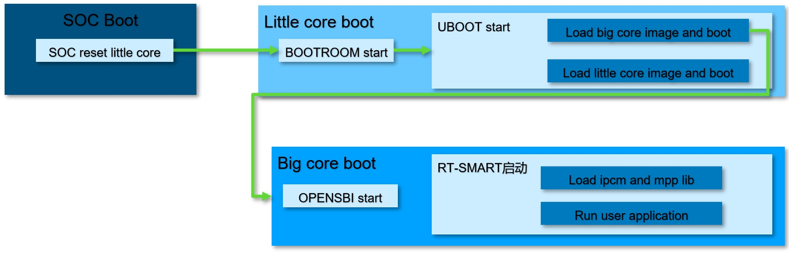
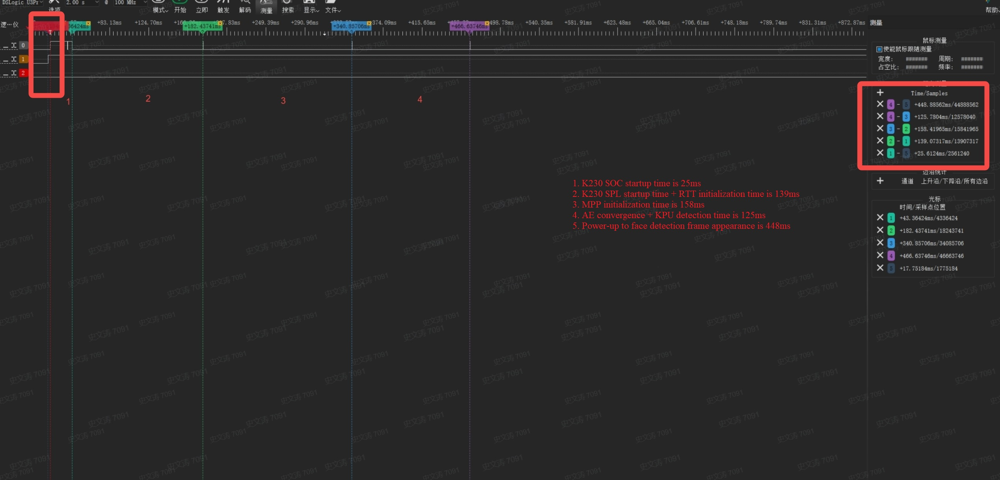
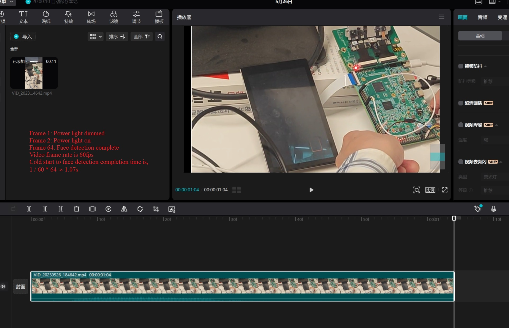
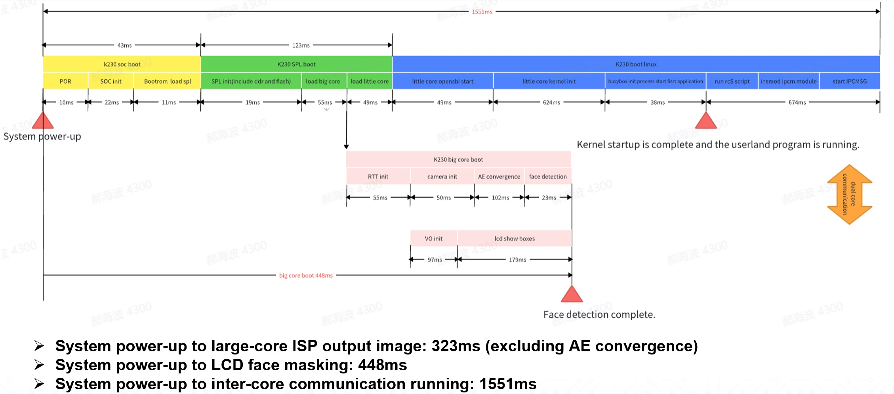

# K230 Boot Optimization Guide


Copyright 2023 Canaan Inc. ©

<div style="page-break-after:always"></div>

## Disclaimer

The products, services or features you purchase should be subject to Canaan Inc. ("Company", hereinafter referred to as "Company") and its affiliates are bound by the commercial contracts and terms and conditions of all or part of the products, services or features described in this document may not be covered by your purchase or use. Unless otherwise agreed in the contract, the Company does not provide any express or implied representations or warranties as to the correctness, reliability, completeness, merchantability, fitness for a particular purpose and non-infringement of any statements, information, or content in this document. Unless otherwise agreed, this document is intended as a guide for use only.

Due to product version upgrades or other reasons, the content of this document may be updated or modified from time to time without any notice.

## Trademark Notice

, "Canaan" and other Canaan trademarks are trademarks of Canaan Inc. and its affiliates. All other trademarks or registered trademarks that may be mentioned in this document are owned by their respective owners.

**Copyright 2023 Canaan Inc.. © All Rights Reserved.**
Without the written permission of the company, no unit or individual may extract or copy part or all of the content of this document without authorization, and shall not disseminate it in any form.

<div style="page-break-after:always"></div>

## K230 boot sequence

The overall startup process of the K230 is shown in the figure below



## Start-up time measurement

### Software measurement

The CPU core of the k230 is RISCV, and the user can use the following code to obtain the current time in any software of the large and little cores.

``` C
uint64_t perf_get_smodecycles(void)
{
    uint64_t cnt;
    __asm__ __volatile__(
        "rdcycle %0" : "=r"(cnt)
    );
    return cnt;
}
```

The obtained value is the number of clock cycles that the current CPU is running, divided by the frequency of the CPU to make the current running time. k230_sdk default clock frequency is 1.6GHz for big cores and 800MHz for little cores.

### Hardware measurement

Adding GPIO edge changes at the point that needs to be measured allows for more accurate timing with a logic analyzer or oscilloscope.
The power signal on the development board can be detected by the 14th pin of the K230_EVB_LPDDR3_UNSIP board J1 (15 and 16 pins need to be shorted with jumper caps).


### External observations

Video recording of the entire system boot process, the on-board power light on means that the system is powered on, and the VO display VI image represents that the video pipeline has been established and can be displayed. A frame appears to frame the face to indicate that face recognition is completed.


## System cropping

As can be seen from the figure in the previous section, the first step after bootROM is to load the image of the large and little cores, so the first step to optimize the boot time is to crop the large and little core images first.

### Little core cropping

#### Linux image pruning

Please refer to the Linux Module Removal section in [K230_Memory Optimization Guide.md.](K230_Memory_Optimization_Guide.md)

#### rootfs cropping

Delete the programs or libraries that will not be used in rootfs, for the door lock POC project mainly includes the following content, the cutting process reference file`k230_sdk/board/k230_evb_doorlock/gen_image_script/gen_doorlock_image.sh`

``` shell
rm -rf usr/bin/fio;
rm -rf usr/bin/lvgl_demo_widgets;
rm -rf usr/bin/ssh*
rm -rf usr/bin/sftp
rm -rf usr/bin/lat*
rm -rf usr/bin/hostapd_cli
rm -rf usr/bin/*test*
rm -rf usr/bin/k230_timer_demo
rm -rf usr/bin/gpio_keys_demo
rm -rf lib/modules/5.10.4+/kernel/drivers/gpu/
rm -rf lib/tuning-server;
rm -rf usr/bin/stress-ng  bin/bash usr/sbin/sshd usr/bin/trace-cmd usr/bin/lvgl_demo_widgets;
```

#### File system selection

Currently, the file systems supported by nor flash are ubifs and jffs2, and the door lock POC uses the image of ubifs by default. They are both compressed file systems, and ubifs has better read and write performance than jffs2. Note that when using the ubifs file system, before the system is powered down, the little core needs to enter the halt command before powering down, otherwise it may cause damage to the file system

### Big core cropping

#### Big core app cropping

Strip removes the symbolic information and debugging information of applications and libraries, greatly reducing the space occupation. When compiling the door lock POC, the`k230_sdk/board/k230_evb_doorlock/gen_image_script/gen_doorlock_image.sh` big core application is trimmed in .

``` shell
/opt/toolchain/riscv64-linux-musleabi_for_x86_64-pc-linux-gnu/bin/riscv64-unknown-linux-musl-strip fastboot_app.elf;
```

### Crop effect

The door lock POC project uses the cropped image by default, and the size of each image is as follows

- Little core rootfs.ubifs 11M
- Little core system compressed image linux_system.bin (OpenSBI + Image + DTB) 3.8M
- Big core system compressed image rtt_system.bin (opensbi + rtthread.bin) 1.2M
- Big core applications fastboot_app.elf 11M
- Big core AI model mbface.kmodel + retinaface.kmodel 1.9M

## uboot startup optimization

k230_sdk for uboot code, integrated fast start configuration, uboot itself operation is divided into two segments SPL+UBOOT, when enable fast start SPL will be responsible for loading subsequent large and little core images and running, when not enabled fast start, SPL will load the second half of UBOOT code to run. Code location`little/uboot/board/canaan/common/k230_spl.c`

``` C
int spl_board_init_f(void)
{
    int ret = 0;
    device_disable();
    g_bootmod = sysctl_boot_get_boot_mode();
    ddr_init_training();
    memset(__bss_start, 0, (ulong)&__bss_end - (ulong)__bss_start);
    if(quick_boot()){//默认快起
        //record_boot_time_info("ls");
        ret += k230_img_load_boot_sys(BOOT_SYS_AUTO);
    }
    ret = k230_img_load_boot_sys(BOOT_SYS_UBOOT);
    if(ret )
        printf("uboot boot failed\n");

    return ret;
}
```

The return result of the quick_boot is affected by the quick_boot of uboot's environment variables, and users can manually configure it through the setenv command under uboot or through the configuration quick_boot in the k230_sdk`make menuconfig-->board configuration`.

## Linux boot optimization

### Remove kernel boot printing

In the default environment variable configuration of uboot, set the fw_devlink in bootargs when flash starts to off, and the code file location is .`src/little/uboot/board/canaan/common/k230_img.c` When Linux starts, the console no longer prints boot logs, and after entering the Linux command line, you can view kernel boot logs through DMEG.

``` C
char *board_fdt_chosen_bootargs(void){
    char *bootargs = env_get("bootargs");
    if(NULL == bootargs) {
        if(g_bootmod == SYSCTL_BOOT_SDIO0)
            bootargs = "root=/dev/mmcblk0p3 loglevel=8 rw rootdelay=4 rootfstype=ext4 console=ttyS0,115200 crashkernel=256M-:128M earlycon=sbi";
        else if(g_bootmod == SYSCTL_BOOT_SDIO1)
            bootargs = "root=/dev/mmcblk1p3 loglevel=8 rw rootdelay=4 rootfstype=ext4 console=ttyS0,115200 crashkernel=256M-:128M earlycon=sbi";
        else  if(g_bootmod == SYSCTL_BOOT_NORFLASH)
            //bootargs = "root=/dev/mtdblock9 rw rootwait rootfstype=jffs2 console=ttyS0,115200 earlycon=sbi";
            //bootargs = "ubi.mtd=9 rootfstype=ubifs rw root=ubi0_0 console=ttyS0,115200 earlycon=sbi";
            bootargs = "ubi.mtd=9 rootfstype=ubifs rw root=ubi0_0 console=ttyS0,115200 earlycon=sbi fw_devlink=off quiet";
    }
    //printf("%s\n",bootargs);
    return bootargs;
```

### Organize time-consuming drivers into modules

The door lock POC needs to use a USB driver to connect to the network, and the mmc driver to import face data. These two driver probes are time-consuming and trigger the probe process of peripheral drivers, so these drivers need to be compiled into modules, and they will be automatically loaded using the modprobe mechanism after the kernel starts. For reference to the config configuration`k230_sdk/src/little/linux/arch/riscv/configs/k230_evb_doorlock_defconfig`

``` shell
CONFIG_MMC=m
# CONFIG_MMC_TEST is not set
CONFIG_MMC_SDHCI=m
CONFIG_MMC_SDHCI_PLTFM=m
CONFIG_MMC_SDHCI_OF_KENDRYTE=m
CONFIG_USB=y
CONFIG_USB_ANNOUNCE_NEW_DEVICES=y
CONFIG_USB_STORAGE=y
CONFIG_USB_DWC2=m
CONFIG_USB_TEST=m
CONFIG_USB_GADGET=m
CONFIG_USB_SNP_UDC_PLAT=m
CONFIG_USB_CONFIGFS=m
CONFIG_USB_CONFIGFS_MASS_STORAGE=y
CONFIG_USB_CONFIGFS_F_LB_SS=y
CONFIG_USB_CONFIGFS_F_UVC=y
```

### Application startup optimization

Advance the running time of the application, modify the /etc/inittab file in the root file system so that the first process it runs is the program we need to start first. For example, in`k230_sdk/board/k230_evb_doorlock/inittab` a file, the first process started by the system is `sysinit:nice -n -20 /app/door_lock/ui/ui &`. This initab file replaces the original /etc/inittab file in rootfs when compiling the door lock image. Among them, the ui program is a little core application for door lock POC

## Big Core startup optimization

### RT-Smart starts

Modify the rt-smart kernel source code, run a init.sh script before the shell thread is established, and define the large kernel program to be run in the script. Code location`big/rt-smart/kernel/rt-thread/components/finsh/shell.c`

``` C
if(shell_thread_first_run) {
    shell_thread_first_run = 0;
    msh_exec("/bin/init.sh", 13);
    continue;
}
```

### Application optimization

Take door lock POC as an example:`k230_sdk/src/reference/business_poc/doorlock/big/`

Applications can initialize devices in a multithreaded and parallel manner. For example, inter-core communication and VO initialization are performed separately in separate threads.

``` C
    pthread_create(&ipc_message_handle, NULL, ipc_msg_server, NULL);
    pthread_create(&exit_thread_handle, NULL, exit_app, NULL);
    pthread_create(&vo_thread_handle, NULL, sample_vo_thread, NULL);
```

## Other optimizations

- K230 has a built-in hardware decompression unit, the flash image compiled by the SDK is a compressed image, uboot will use the hardware decompression unit to decompress subsequent core images of various sizes, which has improved the loading speed.

## Optimize performance

Door lock POC start time statistics, the measurement time of this statistic is June 9, and there may be errors with the current latest SDK version data door lock 
