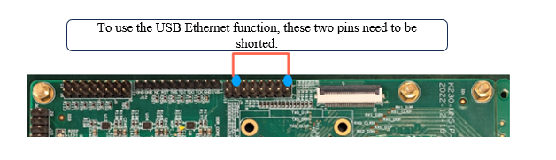
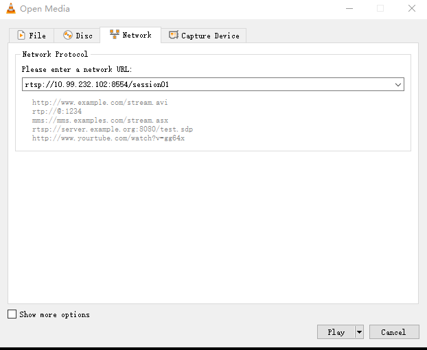

# K230 Coding in Action - rtsp sever build and stream


Copyright 2023 Canaan Inc. ©

<div style="page-break-after:always"></div>

## Disclaimer

The products, services or features you purchase should be subject to Canaan Inc. ("Company", hereinafter referred to as "Company") and its affiliates are bound by the commercial contracts and terms and conditions of all or part of the products, services or features described in this document may not be covered by your purchase or use. Unless otherwise agreed in the contract, the Company does not provide any express or implied representations or warranties as to the correctness, reliability, completeness, merchantability, fitness for a particular purpose and non-infringement of any statements, information, or content in this document. Unless otherwise agreed, this document is intended as a guide for use only.

Due to product version upgrades or other reasons, the content of this document may be updated or modified from time to time without any notice.

## Trademark Notice

, "Canaan" and other Canaan trademarks are trademarks of Canaan Inc. and its affiliates. All other trademarks or registered trademarks that may be mentioned in this document are owned by their respective owners.

**Copyright © 2023 Canaan Inc.. All Rights Reserved.**
Without the written permission of the company, no unit or individual may extract or copy part or all of the content of this document without authorization, and shall not disseminate it in any form.

<div style="page-break-after:always"></div>

## 1. Environmental preparation

### 1.1 Hardware Environment

- K230-USIP-LP3-EVB-V1.0/K230-UNSIP-LP3-EVB-V1.1
- Ubuntu PC 20.04
- Typec USB cable * 2.
  - One is connected to UART0/3 for serial port transceiving, UART0 corresponds to little core, and UART3 corresponds to big core.
  - One is connected to the DC: 5V interface for power supply.
- USB TypeC to Ethernet, connect to USB0.
- One network cable
- SD card (if booting with an SD card, or software requires access to the SD card)
- Camera daughter board (IMX335 for RTSP push video streaming)
- Headset (for voice intercom)
- One DuPont wire, connect USB0_OTG_EN and high level as shown below



Note: Audio intercom requires two sets of equipment.

### 1.2 Software Environment

- K230 SDK
- VLC player

### 1.3 Run Preparation

Executing rtsp programs on EVBs requires starting network services and ensuring that the PC and EVB board are on the same network segment.

## 2. Introduction to the source code

### 2.1 Source code location

The rtsp-related demos included in the SDK are located in the`k230_sdk/src/common/cdk/user/samples` directory, where

- `rtsp_demo`: Voice push video streaming program
- `rtsp_server`: A server-side program for voice intercom
- `backchannel_client`: Voice intercom client program

### 2.2 Source code introduction

The K230 SDK adopts a dual-core architecture, and the little core runs the Linux system to implement network control services. The big core runs the RTT system to control the audio and video hardware. The little core is responsible for guiding the big core during the start-up process. Big and little cores communicate messages and memory sharing through inter-core communication.

 The little core network service has migrated the live source code in the `k230_sdk/src/common/cdk/user/thirdparty/live`
Audio is encoded using G711.
In audio and video streaming, the default maximum resolution of a video is related to the configured sensor_type, and the default maximum resolution is 1920x1080.

#### 2.2.1 Main steps of the procedure

##### 2.2.1.1 Audio and video streaming process

1. `new StreamingPlayer`
   - Initialize intercore communication.
   - Configuring video buffer。
1. `InitVicap`: Initialize the camera.
1. `CreateSession`：
   - Create a server session.
   - Create and open an audio input channel with an audio sample rate of 44.1K and a sampling width of 16bit.
   - Initialize the audio encoding, which is encoded in G711A.
   - Create a video encoding channel to enable IDR frames.
1. `Start`：
   - Turn on the video encoding channel and bind to VO.
   - Turn on the video encoding channel and bind the video input to the video encoding.
   - Start streaming audio and video.

##### 2.2.1.2 Voice intercom program

1. `Init`：
   - Create a server session.
   - Initialize intercore communication.
   - configuring video buffer。
   - Create and open an audio input channel with an audio sample rate of 8K and a sample width of 16bit.
   - Create an audio coding channel with G711U encoding.
   - Create audio output channels and audio decoding channels, and bind audio decoding to audio output.
1. `Start`：
   - Start pushing the audio stream.
   - Turn on the video encoding channel and bind the video input to the video encoding.

## 3. Program execution

### 3.1 RTSP push audio and video streaming

#### 3.1.1 Parameter description

| The parameter name | description |Parameter range | Default value |
|:--|:--|:--|:--|
| help | Print command-line parameter information | - | - |
| n | Number of sessions | `[1, 3]` | 1 |
| t | Encoding type | h264、h265、mjpeg | h264 |
| w | Video encoding width | `[640, 1920]` | 1280 |
| h | Video encoding height | `[480, 1080]` |720 |
| s | Sensor type| Check out the camera sensor documentation | 7 |

The sensor type value is described in the `k230_docs/zh/01_software/board/mpp/K230_Camera_Sensor_Adaption_Guide.md` document about k_vicap_sensor_type

#### 3.1.2 Compiling the Program

Execute `make cdk-user` in the `k230_sdk` directory, and generate `rtsp_demo` in the `k230_sdk/src/common/cdk/user/out/little/` directory.

Program source directory`k230_sdk/src/common/cdk/user/samples/rtsp_demo`

#### 3.1.3 Run the program

Supports simultaneous push of audio and video streams to RTSP Server, where audio and video are encoded through `mapi venc&aenc` interfaces, pull the stream through the url after the push, currently supports two url push and pull streams.

1. Execute on big core:`cd /sharefs; ./sample_sys_init.elf`
1. Execute on the little core:`./rtsp_demo`
1. After running rtsp_demo on the little core, URL addresses in the form :`rtsp://ip:8554/session0` and  will be printed, which can be played by pulling the corresponding stream through VLC.
   VLC streaming mode: Media-> Open Network Streaming-> Enter the corresponding URL in the window that opens.
   

### 3.2 Voice intercom

Used to realize the two-way transmission and processing of audio data.
Voice intercom involves both ends, both ends can collect and encode in real time to send audio data to the peer, and can also receive audio data from the peer for decoding and output.
The current implementation refers to ONVIF and extends the backchannel on the basis of the rtsp protocol to support sending audio data from client to server; the following uses server and client to refer to both ends of voice intercom.

1. The audio stream format is G711 mu-Law;
1. The sever side realizes real-time audio acquisition, encoding and transmission, and receives audio data from the client through the backchannel for decoding and output;
1. The client side realizes the reception, decoding and playback of the audio code stream, as well as the real-time acquisition of audio, G711 mu-Law encoding, and sends it to the server side through the backchannel
1. Only one-on-one intercom is supported (only one backchannel is supported);
1. Does not support echo cancellation and other processing (the device side needs audio output to the headphones, and cannot use an external speaker);

#### 3.2.1 Compiling the Program

Execute `make cdk-user` in the `k230_sdk` directory to generate `rtsp_server` and `backclient_test` in the `k230_sdk/src/common/cdk/user/out/little/` directory.

Program source directory:`k230_sdk/src/common/cdk/user/samples/rtsp_demo/rtsp_server`
`k230_sdk/src/common/cdk/user/samples/rtsp_demo/backchannel_client`

#### 3.2.2 Description of rtsp_server parameters

| The parameter name | description |Parameter range | Default value |
|:--|:--|:--|:--|
| h | Print command-line parameter information | - | - |
| v | Whether to create a video session | - | - |
| t | Encoding type | h264、h265 | h265 |
| w | Video encoding width | `[640, 1920]` | 1280 |
| h | Video encoding height | `[480, 1080]` |720 |
| b | Video encoding bitrate | - | 2000 |
| a | Voice change settings | `[-12, 12]`| 0 |
| s | Sensor type| Check out the camera sensor documentation | 7 |

The sensor type value is described in the `k230_docs/zh/01_software/board/mpp/K230_Camera_Sensor_Adaption_Guide.md` document about k_vicap_sensor_type

#### 3.2.3 Run the program

Two EVBs are connected to the same network segment, one as server and one as client. After the big and little cores are fully booted.

Run the following command on the server side:

- Execute on the big core:`cd /sharefs; ./sample_sys_init.elf`
- Execute on the little core: `cd /mnt; ./rtsp_server`(after running the rtsp_server, the URL address of the form : `rtsp://<server_ip>:8554/BackChannelTest` will be printed).

Run the following command on the client side:

- Execute on the big core:`cd /sharefs; ./sample_sys_init.elf`
- Execute on the little core :`./backclient_test rtsp://<server_ip>:8554/BackChannelTest`)

backclient_test execute the command description: `./backclient_test <rtsp_url> <out_type>`, where rtsp_url is the RTSP address and out_type is the VO output connect type, see the description of k_connector_type in `k230_docs/zh/01_software/board/mpp/K230_Video_Output_API_Reference.md`, out_type is set to 0 by default.

## 4. Run sharefs

The `sample_sys_init.elf`are not loaded to big core by default. It can be run in big core in the following two ways.

1. Modify the build script of `mpp-apps` in `k230_sdk/Makefile` by adding the following command before `cd -;` and execute `make rt-smart;make build-image` in `k230_sdk` directory, and then the image file generated will contain `sample_sys_init.elf` in the `/bin` directory of the core.

    ```sh
    cp userapps/sample/elf/sample_sys_init.elf $(RTSMART_SRC_DIR)/userapps/root/bin/; \
    ```

1. After booting the big and little cores, the executable program is transferred to the EVB board via sharefs and tftp to run.
/sharefs is used to share files between big and little cores, and both big and little cores can realize the function of sharing file systems by accessing their respective /sharefs directories. The file system of the big core itself is read-only. You can mount the /sharefs directory to the SD card partition or the nfs directory of the PC on the little core, and the file transfer function can be realized through tftp.

    ```sh
    mount /dev/mmcblk1p4 /sharefs # Mount /sharefs to the SD card partition
    ```

    ```sh
    mount -t nfs -o nolock <ipaddr>:<nfs_path> /sharefs/ # Mount /sharefs to nfs_path directory of ipaddr
    ```

    The command for tftp is as follows:

    ```sh
    tftp -gr <filename> <ipaddr> # Transfer the file <filename> from the host at ipaddr to the board
    tftp -pl <filename> <ipaddr> # Transfer the file <filename> from the board to the host at ipaddr
    ```
