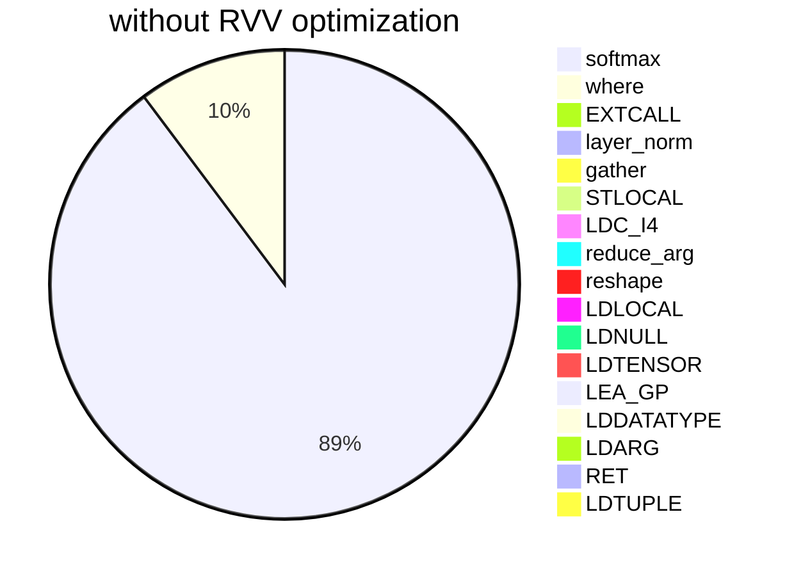
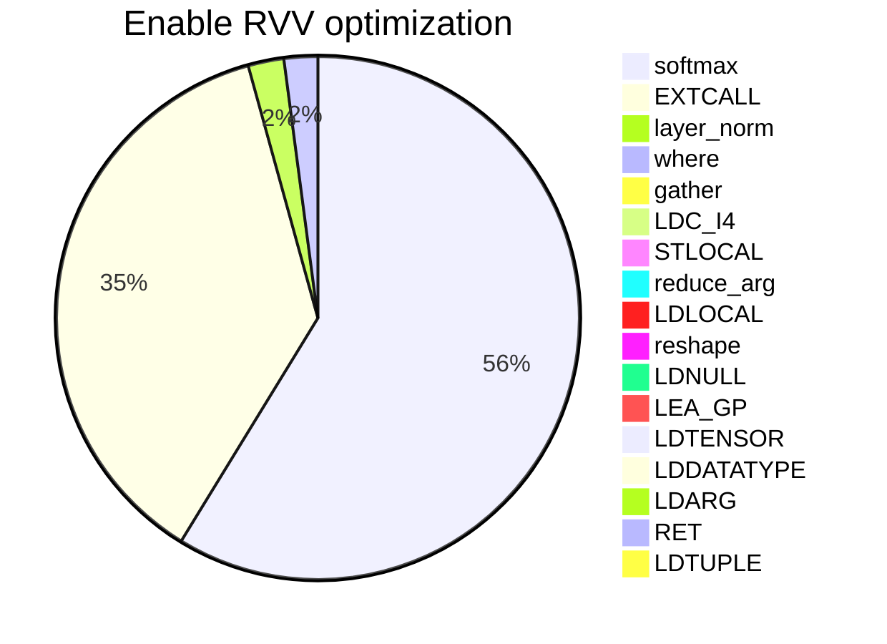

# K230 RVV optimization performance description


Copyright 2023 Canaan Inc. ©

<div style="page-break-after:always"></div>

## Disclaimer

The products, services or features you purchase should be subject to Canaan Inc. ("Company", hereinafter referred to as "Company") and its affiliates are bound by the commercial contracts and terms and conditions of all or part of the products, services or features described in this document may not be covered by your purchase or use. Unless otherwise agreed in the contract, the Company does not provide any express or implied representations or warranties as to the correctness, reliability, completeness, merchantability, fitness for a particular purpose and non-infringement of any statements, information, or content in this document. Unless otherwise agreed, this document is intended as a guide for use only.

Due to product version upgrades or other reasons, the content of this document may be updated or modified from time to time without any notice.

## Trademark Notice

, "Canaan" and other Canaan trademarks are trademarks of Canaan Inc. and its affiliates. All other trademarks or registered trademarks that may be mentioned in this document are owned by their respective owners.

**Copyright 2023 Canaan Inc.. © All Rights Reserved.**
Without the written permission of the company, no unit or individual may extract or copy part or all of the content of this document without authorization, and shall not disseminate it in any form.

<div style="page-break-after:always"></div>

## Directory

[toc]

<div style="page-break-after:always"></div>

## preface

### Overview

This document describes the impact of RVV on model inference performance.

### Reader object

This document (this guide) is intended primarily for:

- Technical Support Engineer
- Software Development Engineer

### Revision history

| Document version number | Modify the description | Author     | date       |
| ----------------------- | ---------------------- | ---------- | ---------- |
| V1.0                    | Initial edition       | Yang Haoqi | 2023/08/04 |

## 1. Overview

In recent years, the rapid development of the field of AI has derived a variety of neural network models, and new operators are constantly emerging. However, the iteration cycle of the AI chip is much longer than that of the AI model, and most of these newly emerged operators cannot directly use the AI chip for inference acceleration, and some of the old operators are not suitable for inference acceleration using the AI chip.Therefore, the CPU becomes the execution carrier of this part of operators, which also means that the performance of the CPU will become a factor affecting the final performance when the model is deployed, and the RVV expansion is an important means for RISC-V CPU to improve performance. The C908 dual-core processor used in K230 has the characteristics of RVV1.0 expansion, which can greatly improve the performance of CPU operator inference.

K230 needs to use the model in `.kmodel` format for model inference. `.kmodel` is compiled by [nncase](https://github.com/kendryte/nncase) for `ONNX` and `TFLite` models. It is suitable for the development board produced by our company and related cooperative enterprises. `nncase` supports common neural network operators, but some operators cannot be accelerated by K230, and these operators can only be inferred using CPU.

## 2. RVV application scenarios

At present, the most widely studied and applied neural network `Transformer` is quite different with `CNN`, and many AI chips designed based on CNN cannot fully accelerate `Transformer`. The following is the operator execution of the `Decoder` model with RVV optimization enabled and without RVV optimization, which is a sub-model in `Transformer`.

### 2.1 RVV optimization is not enabled

| stackvm tensor op | count | time consumption(ms) | percentage(%) |
| ----------------- | ----- | -------------------- | ------------- |
| softmax           | 5     | 1749.61              | 88.6574       |
| where             | 4     | 199.432              | 10.1058       |
| EXTCALL           | 65    | 16.099               | 0.815779      |
| layer_norm        | 7     | 5.81                 | 0.294408      |
| gather            | 2     | 0.393                | 0.0199144     |
| STLOCAL           | 212   | 0.391                | 0.019813      |
| LDC_I4            | 241   | 0.388                | 0.019661      |
| reduce_arg        | 1     | 0.336                | 0.017026      |
| reshape           | 26    | 0.281                | 0.014239      |
| LDLOCAL           | 149   | 0.26                 | 0.0131749     |
| LDNULL            | 106   | 0.166                | 0.00841166    |
| LDTENSOR          | 29    | 0.103                | 0.00521929    |
| LEA_GP            | 58    | 0.097                | 0.00491525    |
| LDDATATYPE        | 29    | 0.07                 | 0.00354709    |
| LDARG             | 5     | 0.008                | 0.000405381   |
| RIGHT             | 1     | 0.004                | 0.000202691   |
| LDTUPLE           | 1     | 0.003                | 0.000152018   |
| total             | 941   | 1973.45              | 100           |

### 2.2 Enable RVV optimization

| stackvm tensor op | count | time consumption(ms) | percentage(%) |
| ----------------- | ----- | -------------------- | ------------- |
| softmax           | 5     | 25.722               | 55.6175       |
| EXTCALL           | 65    | 16.179               | 34.9831       |
| layer_norm        | 7     | 0.967                | 2.0909        |
| where             | 4     | 0.912                | 1.97198       |
| gather            | 2     | 0.39                 | 0.84328       |
| LDC_I4            | 241   | 0.386                | 0.834631      |
| STLOCAL           | 212   | 0.379                | 0.819495      |
| reduce_arg        | 1     | 0.34                 | 0.735167      |
| LDLOCAL           | 149   | 0.259                | 0.560024      |
| reshape           | 26    | 0.243                | 0.525428      |
| LDNULL            | 106   | 0.17                 | 0.367583      |
| LEA_GP            | 58    | 0.103                | 0.222712      |
| LDTENSOR          | 29    | 0.103                | 0.222712      |
| LDDATATYPE        | 29    | 0.076                | 0.164331      |
| LDARG             | 5     | 0.011                | 0.0237848     |
| RIGHT             | 1     | 0.005                | 0.0108113     |
| LDTUPLE           | 1     | 0.003                | 0.00648677    |
| total             | 941   | 46.248               | 100           |

### 2.3 Performance Analysis and Description

From the above model inference situation, the KPU unit of K230 does not support hardware acceleration for `softmax`, `layer_norm`, `where`, `gather`, `reduce_arg`, and `reshape`, so we need to use CPU (C908) to implement inference. At present, the RVV optimization of `softmax`, `layer_norm` and `where` has been completed, and the performance has been improved significantly.

The following is a graph of the proportion of each operator in the model inference time before and after RVV optimization.





The following is a comparison of the performance of related operators before and after RVV optimization.


From the above comparison results, it can be seen that the RVV optimization can greatly improve the inference performance of the CPU operator and shorten the inference time of the whole model (1973-->46) ms. The time of `softmax` operator is reduced to 25 ms, the time of `layer_norm` operator is reduced to 0.97 ms, and the time of `where` operator is reduced to 0.91 ms. The inference time of the whole model is shortened by 97.6%, which has high application value in the actual model deployment.

### 2.4 RVV optimization example

#### 2.4.1 RVV code

Please refer to [layer_norm](https://github.com/kendryte/nncase/blob/master/src/Native/src/kernels/stackvm/optimized/riscv64/layer_norm.cpp) in `nncase`, requires some knowledge of RV instructions and V extension instructions.

The calculation formula of `layer_norm` is:

```plaintext
y= (x−E[x])/sqrt(Var[x]+ϵ)∗γ+β
```

The overall calculation process is detailed in Functions `layernorm_impl`, in order to have higher readability of the code, the RVV optimization code is split into three parts:

1. Calculation `E[x]`, please refer to Function `get_mean` for details .
1. Calculation `Var[x]`, please refer to Function `get_var` for details .
1. For the calculation of the layer_norm according to the above formula, please refer to `layer_norm_update1` Function.

Since multiplication takes less time than division, the formula transformation is performed in step 3 of the calculation. Using `rsqrt` instead of `sqrt` and then using multiplication instead of division.

#### 2.4.2 Core Code Description

The following is the description of the function `get_mean`, which implements the loop loading summation of the array at `a1`, the sum result is stored in `v0`, and the final average is saved in `ret`. It utilizes the vector loading of RVV, vector accumulation instructions to achieve summation, thereby improving computing performance.

```plaintext
"vle32.v v8, (a1);"   // Load the 32 bit vector at the a1 address to the v8 register.
"sub a0,a0, t0;"      // a0 − = t0, for cycle control counting.
"slli t1, t0, 2;"     // t1 = t0 < < 2, because each float32 is 4 bytes, so the address is increased by 4 * t0.
"vfredsum.vs v0,v8,v0;"  // v0 + = v8, vector sum to v0.

"add a1, a1, t1;"      // a1 + = t1, update the loading address.
"bnez a0, XXXXXX%=;"   // If a0 ! = 0, jump to the loop start address.
"vfmv.f.s f0, v0;"     // Move the v0 vector accumulation result to f0.
"fcvt.s.w f1, %[avl];"  // Convert avl to float and save to f1.
"fdiv.s %[ret], f0, f1;" // ret = f0 / f1, get the average value.
```

#### 2.4.3 Add RVV operator process

In the following process, the path uses [nncase](https://github.com/kendryte/nncase) as the root

1. function declaration: src/Native/src/kernels/stackvm/optimized/opt_ops.h
1. Operator implementation:
   - general optimization   src/Native/src/kernels/stackvm/optimized
   - x86 optimization   src/Native/src/kernels/stackvm/optimized/x86_64
   - RVV optimization  src/Native/src/kernels/stackvm/optimized/riscv64
1. Logic call: src/Native/src/kernels/stackvm/tensor_ops.cpp
1. Modify CMakeLists：src/Native/src/kernels/stackvm/optimized/CMakeLists.txt
   - General optimization: 15 lines increase the source file name
   - Platform-specific optimization: 44 lines increase the source file name

### 2.5 tips

If you encounter an operator that does not support RVV optimization and need to support it, you are welcome to [submit an issue and PR](https://github.com/kendryte/nncase/issues).
