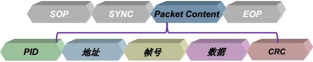
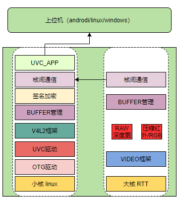
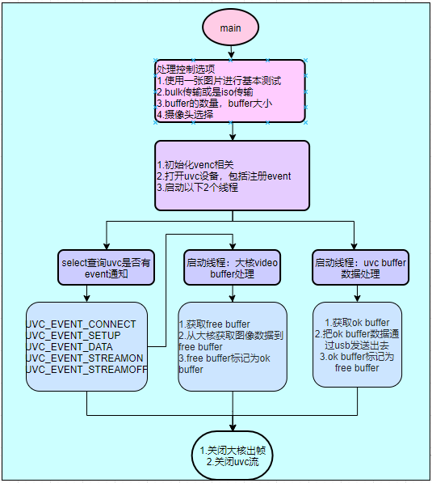

# K230 USB Practical Application - UVC Transmission of YUV and Encoded Streams


Copyright © 2023 Beijing Canaan Creative Information Technology Co., Ltd.

<div style="page-break-after:always"></div>

## Disclaimer

The products, services, or features you purchase are subject to the commercial contracts and terms of Beijing Canaan Creative Information Technology Co., Ltd. (hereinafter referred to as "the Company") and its affiliates. All or part of the products, services, or features described in this document may not be within the scope of your purchase or use. Unless otherwise agreed in the contract, the Company does not provide any express or implied statements or warranties regarding the accuracy, reliability, completeness, merchantability, fitness for a particular purpose, and non-infringement of any representations, information, or content in this document. Unless otherwise agreed, this document is only for use as a reference guide.

Due to product version upgrades or other reasons, the content of this document may be updated or modified without any notice.

## Trademark Statement

 "Canaan" and other Canaan trademarks are trademarks of Beijing Canaan Creative Information Technology Co., Ltd. and its affiliates. All other trademarks or registered trademarks mentioned in this document are owned by their respective owners.

**Copyright © 2023 Beijing Canaan Creative Information Technology Co., Ltd. All rights reserved.**
No part of this document may be excerpted, reproduced, or transmitted in any form without the written permission of the Company.

<div style="page-break-after:always"></div>

## Overview

This document explains how to implement the USB camera function on the K230 development board. This means connecting the K230 development board to a computer, allowing the computer to play images captured by the K230 camera through a media player.

## 1. Environment Preparation

### 1.1 Hardware Environment

- K230-UNSIP-LP3-EVB-V1.0/K230-UNSIP-LP3-EVB-V1.1
- Ubuntu PC 20.04
- At least one Type-C USB cable
- USB Type-C to Ethernet adapter (if using TFTP loading and NFS file system)
- One Ethernet cable
- SD card (if using SD card boot, or if the software needs to access the SD card)

### 1.2 Software Environment

The k230_sdk provides toolchains located in the following paths:

- Big core rt-smart toolchain

```shell
k230_sdk/toolchain/riscv64-linux-musleabi_for_x86_64-pc-linux-gnu
```

- Small core Linux toolchain

```shell
k230_sdk/toolchain/Xuantie-900-gcc-linux-5.10.4-glibc-x86_64-V2.6.0
```

You can also download the toolchain via the following links:

```shell
wget https://download.rt-thread.org/rt-smart/riscv64/riscv64-unknown-linux-musl-rv64imafdcv-lp64d-20230222.tar.bz2
wget https://occ-oss-prod.oss-cn-hangzhou.aliyuncs.com/resource//1659325511536/Xuantie-900-gcc-linux-5.10.4-glibc-x86_64-V2.6.0-20220715.tar.gz
```

## 2. SDK UVC Demo Experience

### 2.1 Compile and Flash Firmware with Release SDK

Refer to [K230_SDK_User_Manual](../../01_software/board/K230_SDK_User_Manual.md) chapters 2/3/4/5 for detailed instructions.

### 2.2 Execute Command to Test Demo

Refer to [K230_SDK_Demo_User_Guide](../../01_software/board/examples/K230_SDK_EVB_Board_Demo_User_Guide.md) chapter 2.9 UVC_demo.

## 3. How to Develop UVC Functionality

### 3.1 USB/UVC Protocol

### 3.1.1 USB Protocol

The USB protocol is extensive and widely used, with plenty of information available online. This document only describes points that I believe are helpful for understanding the USB protocol.

USB 2.0 has four lines: VBUS, GND, D+, and D-, with differential signal transmission. Low-speed/full-speed uses 3.3V voltage, and high-speed uses 400mV voltage. Besides transmitting differential 0/1 data signals, other voltage combinations can be used for speed identification, idle, reset, wake-up, and other signals.

The PHY can be understood as performing a parallel-to-serial conversion, converting UTMI+ signals to differential D+/D- signals.


In theory, the two data signals can be controlled entirely using GPIO, but the protocol is too complex, and the GPIO speed is too slow. Whether it's SPI/SDIO/UART/IIC, these interface controllers aim to provide necessary interfaces to the software while minimizing software operations. The USB controller handles protocol functions as much as possible in hardware, such as speed negotiation, automatic response packet generation upon receiving a data packet, etc. It provides some register interfaces to inform the software of the current USB communication status. The most crucial part is providing data transmission interfaces, allowing the software to send and receive different data, usually using DMA.

USB data is transmitted in packets. The following diagram shows the packet structure:



The PID determines the packet type, such as token packet, data packet, handshake packet, and special packet. Different packet types contain different fields; for example, data packets only include PID+data+CRC, while handshake packets only include PID.

Packets form transactions, consisting of a token packet, an optional data packet, and an optional handshake packet. The diagram below uses a USB 2.0 high-speed bus analyzer from Nanjing QinHeng to capture USB interaction information. This instrument is recommended for capturing data on USB lines.


The front part shows enumeration transfer, including SETUP transactions, data IN/OUT transactions, and status IN/OUT transactions. The later part shows isochronous transfer, including data IN transactions.

Transfers consist of single or multiple transactions, with four types of transfers:

Control Transfer - Used during the enumeration phase. All USB devices need a unified protocol to identify various USB device types when connecting to the host. The USB controller initially sets endpoint 0 as a bidirectional control endpoint.


Interrupt Transfer - Used in scenarios with small data volumes, non-continuous data, and high real-time requirements, such as mouse and keyboard.


Isochronous Transfer - Used in scenarios with large data volumes, continuous data, and real-time requirements, such as USB camera devices.


Bulk Transfer - Used in scenarios with large data volumes but no real-time requirements, such as USB flash drives.


No matter the USB device protocol, all are implemented through these four types of transfers. Therefore, USB protocol stacks in operating systems like Linux provide interfaces for these four transfer types.

### 3.1.2 UVC Protocol

### 3.1.2.1 UVC Descriptors

USB descriptors let the host know the device's attribute information. When a device is first connected to the host, the host sends requests supported by all devices. General descriptors include device descriptor, configuration descriptor, interface descriptor, endpoint descriptor, and string descriptor. Different device types may define specific descriptors to extend device descriptions.

On Windows, the UsbTreeView software can view USB device descriptors. The diagram below shows the overall layout of a UVC device's descriptors.


In this descriptor layout, the first item is the device descriptor, followed by the configuration descriptor. This device has a single configuration descriptor. The configuration descriptor is followed by an Interface Association Descriptor (IAD), which includes a video control interface (VC) and multiple video streaming interfaces.

The video control interface includes video control interface header descriptor, input terminal descriptor, processing unit descriptor, encoding unit descriptor, output terminal descriptor, and interrupt endpoint descriptor.

The video streaming interface includes one interface and multiple alternate setting interfaces.

The host can understand the UVC camera's topology and control it through video control interface descriptors. For example, the processing unit (PU) includes adjustments like backlight, contrast, chroma, etc. The host first learns which adjustments are available through the descriptors, then interacts with the UVC device to obtain control range information.


### 3.1.2.2 UVC Video Stream Format Selection

The VS interface includes many formats (YUV/MJPEG/H264, etc.), each containing multiple frames (various resolutions). Parameter settings require negotiation between the host and the USB device. The negotiation process is roughly as shown below:


Process Description:

- The host first sends the desired settings to the USB device (PROBE).
- The device modifies the host's desired settings within its capabilities and returns them to the host (PROBE).
- If the host considers the settings feasible, it commits (COMMIT).
- The current settings of the interface are set to a specific setting.

### 3.1.2.3 UVC Video Stream Payload


The payload data includes a header at the front, and the payload data contains multiple USB packets. How does the host recognize a new frame of image data? Through the payload header.

The payload header has a fixed first 2 bytes and an extended part. Focus on the FID - different formats have variations, but all formats use this bit toggling between 0 and 1 to identify a new frame of image data.


### 3.2 Linux Driver Layer

The K230 SDK design places video and audio functions on the big core RTT for performance. The USB functionality on Linux is mature, so UVC functionality is developed based on Linux, obtaining video data from the big core via inter-core mapi communication.



### 3.2.1 Controller Driver


The K230 integrates Synopsys' USB module, with the controller driver located in linux/drivers/usb/dwc2.

In the current SDK design, UVC is fixed to use USB1, and the OTG mode is recognized as device mode via the ID signal.

platform.c - handles resets, registers interrupts, configures parameters, etc. The SDK's USB defaults to buffer DMA mode. Scatter Gather DMA mode can enhance ISO transfer performance, but the HOST mode using this DMA mode cannot support HUB.

gadget.c - focuses on this driver code, dwc2_gadget_init initializes important structures, gadget.ops, and ep.ops. The usb_ep_ops queue submits data transfer requests, essentially placing these requests in a processing list. The USB will process these requests one by one and report completion callbacks.

```c
// Device tree
usbotg1: usb-otg@91540000 {
    compatible = "kendryte,k230-otg";
    reg = <0x0 0x91540000 0x0 0x10000>;
    interrupt-parent = <&intc>;
    interrupts = <174>;
    g-rx-fifo-size = <512>;
    g-np-tx-fifo-size = <64>;
    g-tx-fifo-size = <512 1024 64 64 64 64>;
    dr_mode = "otg";
    otg-rev = <0x200>;
};
```

### 3.2.2 Gadget Driver

The source code is located in linux/drivers/usb/gadget.

- legacy: the entry point of the entire Gadget device driver. Located in driver/usb/gadget/legacy, it provides samples of common USB class device drivers. Its role is to configure USB device descriptor information, provide a usb_composite_driver, and register it to the composite layer. It can also be dynamically created through functionfs, which is more flexible. The USB gadget demos provided by K230 use this method.
- functions: various USB subclass device function drivers. Located in driver/usb/gadget/functions, it provides corresponding samples. Its role is to configure USB subclass protocol interface descriptors and other subclass protocols, such as UVC protocol, HID, etc. UVC-related files include uvc_video.c, uvc_v4l2.c, uvc_queue.c, uvc_configfs.c, f_uvc.c.

The K230's UVC makes minimal modifications to the gadget driver layer, mainly porting support for the H264 format and extension units.

To compile the Linux kernel with USB Gadget framework support, add:

```shell
-> Device Drivers
    -> USB support
        -> USB Gadget Support
```


Since UVC involves V4L2 module functionality, the media framework also needs to be added:

```shell
-> Device Drivers
    -> Multimedia support
        -> Media core support
            -> Media core support
```


### 3.3 UVC-Gadget Application Layer

From the K230 SDK design architecture, the difference between K230's UVC functionality and a pure Linux UVC functionality is that video data is obtained from the big core RTT via inter-core communication.

The K230 UVC application layer code is located at: cdk/user/mapi/sample/camera.

Source code file descriptions:

- application.c - main function
- camera.c - provides camera object operations, including UVC/UAC control
- frame_cache.c - complex buffer management
- kstream.c - implements video stream operations
- kuvc.c - implements kuvc object operations
- sample_venc.c - obtains encoded images from the big core via mapi
- sample_yuv.c - obtains YUV images from the big core via mapi
- uvc-gadget.c - implements UVC device operations

The debugging steps involve first porting the generic UVC app on Linux, running the standalone functionality on Linux (i.e., playing fixed image data). Then debug the functionality of playing real camera image data.

Below is the design flowchart of the K230 UVC APP:



Most operations in the UVC app are generic, with plenty of information available online.
Here we will discuss the private operations of the K230, focusing on the handling of the `venc_normalp_classic` function.

- First, configure the vicap device attributes, including the camera type, etc.
  - `kd_mapi_vicap_set_dev_attr`
- Obtain camera information, mainly to get the image resolution output by the camera.
  - `k_vicap_sensor_info`
- Calculate the required vb buffer size based on the image output from vicap as needed, and allocate the buffer.
  - `kd_mapi_media_init`
- Configure channel attributes, including output resolution, format, etc.
  - `kd_mapi_vicap_set_chn_attr`
- Start video processing.
  - `kd_mapi_vicap_start`
  - Get a frame of image.
    - `kd_mapi_vicap_dump_frame`
  - Release image buffer.
    - `kd_mapi_vicap_release_frame`
- Initialize the venc module, including encoding format, frame rate, resolution, etc.
  - `kd_mapi_venc_init`
- Register the callback function for encoding completion.
  - `kd_mapi_venc_registercallback`
- Enable H264 GOP interval to generate IDR frames.
  - `kd_mapi_venc_enable_idr`
- Start venc.
  - `kd_mapi_venc_start`
- Bind the venc module to the vi module.
  - `kd_mapi_venc_bind_vi`
  - Callback function after encoding completion to get the encoded image data.
    - `get_venc_stream`

### 3.4 Recommended Reference Materials

- [USB 2.0 Official Documentation Download](https://www.usb.org/document-library/usb-20-specification)
- [UVC 1.1 Official Documentation Download](https://www.usb.org/document-library/video-class-v11-document-set)
- [UVC 1.5 Official Documentation Download](https://www.usb.org/document-library/video-class-v15-document-set)
- [USB Chinese Website](https://www.usbzh.com/article/forum-12.html)
