# K230 USB Application Practice - UVC Transmission YUV and Encoding Stream


Copyright 2023 Canaan Inc. ©

<div style="page-break-after:always"></div>

## Disclaimer

The products, services or features you purchase should be subject to Canaan Inc. ("Company", hereinafter referred to as "Company") and its affiliates are bound by the commercial contracts and terms and conditions of all or part of the products, services or features described in this document may not be covered by your purchase or use. Unless otherwise agreed in the contract, the Company does not provide any express or implied representations or warranties as to the correctness, reliability, completeness, merchantability, fitness for a particular purpose and non-infringement of any statements, information, or content in this document. Unless otherwise agreed, this document is intended as a guide for use only.

Due to product version upgrades or other reasons, the content of this document may be updated or modified from time to time without any notice.

## Trademark Notice

, "Canaan" and other Canaan trademarks are trademarks of Canaan Inc. and its affiliates. All other trademarks or registered trademarks that may be mentioned in this document are owned by their respective owners.

**Copyright 2023 Canaan Inc.. © All Rights Reserved.**
Without the written permission of the company, no unit or individual may extract or copy part or all of the content of this document without authorization, and shall not disseminate it in any form.

<div style="page-break-after:always"></div>

## Overview

This article explains how to implement the USB camera function on the k230 development board. That is, connect the K230 development board to the computer, and the computer can play the image collected by the K230 camera through the player.

## 1. Environmental Preparation

### 1.1 Hardware Environment

- K230-UNSIP-LP3-EVB-V1.0/K230-UNSIP-LP3-EVB-V1.1
- Ubuntu PC 20.04
- Typec USB cable * 1 at least
- USB TypeC to Ethernet (if using TFTP loading and NFS file system)
- One network cable
- SD card (if booting with an SD card, or software requires access to the SD card)

### 1.2 Software Environment

The toolchains are provided in the k230_sdk and are available in the following paths.

- Large core RT-SAMRT toolchain

``` shell
k230_sdk/toolchain/riscv64-linux-musleabi_for_x86_64-pc-linux-gnu
```

- Small-core Linux toolchain

``` shell
k230_sdk/toolchain/Xuantie-900-gcc-linux-5.10.4-glibc-x86_64-V2.6.0
```

The toolchain can also be downloaded via the link below

``` shell
wget https://download.rt-thread.org/rt-smart/riscv64/riscv64-unknown-linux-musl-rv64imafdcv-lp64d-20230222.tar.bz2
wget https://occ-oss-prod.oss-cn-hangzhou.aliyuncs.com/resource//1659325511536/Xuantie-900-gcc-linux-5.10.4-glibc-x86_64-V2.6.0-20220715.tar.gz
```

## 2. SDK UVC Demo Experience

### 2.1 Release SDK Compiles the Firmware and Burns the Firmware

Refer to [section 2/3/4/5](../../01_software/board/K230_SDK_Instructions.md) of the K230_SDK_ Instructions for Use

### 2.2 Execute Command to Test Demo

Refer to [section  2.9 UVC_demo](../../01_software/board/examples/K230_SDK_EVB_Board_Demo_User_Guide.md) of the K230_SDK_Demo User Guide

## 3. How to Develop UVC Functions

### 3.1 USB/UVC Protocol

### 3.1.1 USB Protocol

The USB protocol has more content, is a very common interface, and there is a lot of information on the Internet. This article describes only a few points that I think will help in understanding the USB protocol.

USB2.0 has 4 lines, VBUS/GND/D+/D-, differential signal transmission. 3.3V at low speed/full speed, and 400mV at high speed. In addition to the differential 0/1 signal that carries the data, other voltage combinations can be used as speed identification, idle, reset, wake-up signals, and so on.

PHY can be understood as doing a parallel string operation to convert UTMI+ signals into differential signals of D+/D-.

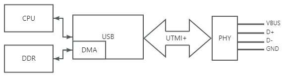

Theoretically, the two data signals can be controlled using GPIO, but the protocol is too complex and GPIO changes too slowly. Whether it is SPI/SDIO/UART/IIC, etc., these interface controllers are like this, the controller provides the necessary interfaces to the software as much as possible, and let the software do as few operations as possible. The USB controller is to let the hardware do the functions of the protocol as much as possible, such as speed negotiation, automatic generation of response packets after receiving data packets, and other functions. A number of register interfaces are provided to inform the software of the current status of USB communication. Of course, the most important thing is to provide an interface for transmitting data, so that the software can send and receive different data, and DMA is generally used to send and receive data.

USB transmission data is based on packets. The following figure shows the composition of the package

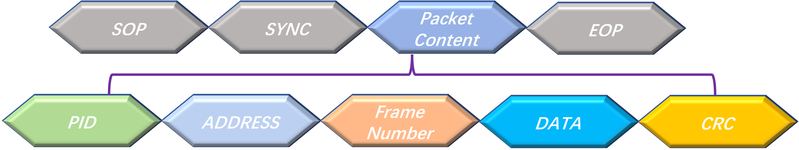

PID determines the type of packet, token packet, data packet, handshake packet and special packet, different packet types contain different field components, such as packet only contains PID + data + CRC, handshake package only PID.

Packets make up transactions, token packets + packets (optional) + handshake packets (optional). The following figure uses the USB interaction information captured by Nanjing Qinheng's USB2.0 high-speed bus analyzer, and if you want to capture data on the USB line, this instrument is recommended.

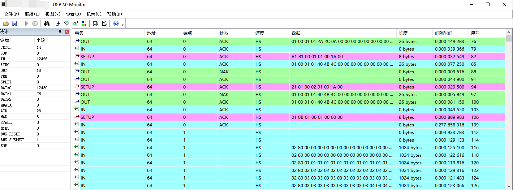

You can see that the front is an enumeration transfer, which contains a SETUP transaction, a data IN/OUT transaction, and a status IN/OUT transaction. This is followed by synchronous transmission, which contains data IN transactions.

Transfers consist of single or multiple transactions and there are 4 transport types:

Control Transfer - Used during the enumeration phase, all USB devices connected to the host require a uniform set of protocols to identify the various USB device types. The USB controller initially makes the 0 endpoint a bidirectional control endpoint.

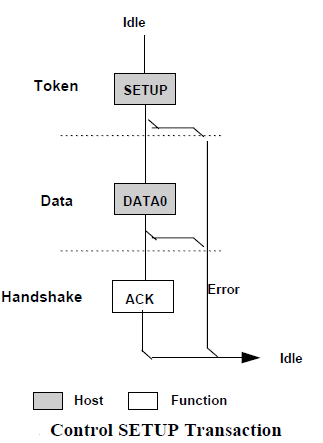

Interrupt transmission - small data volume and discontinuity, and real-time performance requirements are high. For example, mouse and keyboard.

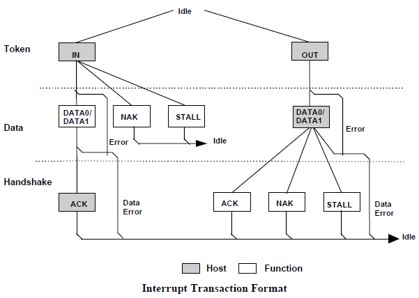

Synchronous transmission - where the amount of data is large, continuous, and real-time is required. For example, USB camera devices.

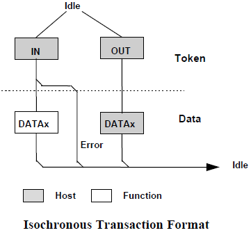

Batch transfer - used in situations where the amount of data is large, but there is no real-time requirement. For example, U disk equipment.

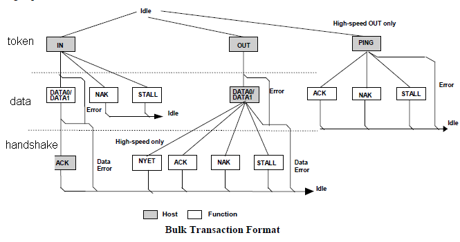

No matter what kind of USB device protocol, it is realized through these 4 kinds of transmission. Therefore, the USB protocol stack of operating systems like Linux provides an interface for these four transmission methods.

### 3.1.2 UVC Protocol

### 3.1.2.1 UVC Descriptors

The USB descriptor is used to let the host know the attribute information of the device. When a device first connects to a host, the host sends a request command that all devices support. Common descriptors include device descriptors, configuration descriptors, interface descriptors, endpoint descriptors, and string descriptors. Different device types may define unique descriptors that extend the description of the device.

Windows can use the UsbTreeView software to view the descriptors of USB devices. The following figure shows the overall layout of a UVC device with its descriptors.


In this layout of the layout, the first item is the device descriptor, followed by the configuration descriptor, which the device possesses. The configuration descriptor is followed by an interface association descriptor IAD, which has a video control interface VC and N video stream interfaces.

The video control interface includes a video control interface header descriptor, an input terminal descriptor, a processing unit descriptor, a coding unit descriptor, an output terminal descriptor, and an interrupt breakpoint descriptor.

The video stream interface includes an interface and a number of corresponding Alternate Setting.

Through the video control interface descriptor, the host side can know the topology of the UVC camera and control it. For example, the processing unit PU, including backlight, contrast, chrominance, etc., the host side first knows which are adjustable items through the descriptor, and then interacts with the UVC device to obtain control range information.

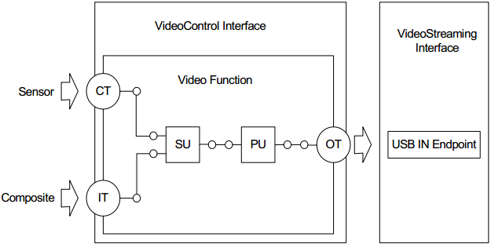

### 3.1.2.2 UVC Video Stream Format Selection

The VS interface contains many formats (YUV/MJPEG/H264, etc.), and each format contains multiple frames (various resolutions). The process of parameter setting requires negotiation between the host and the USB device, and the negotiation process is roughly shown in the following figure:

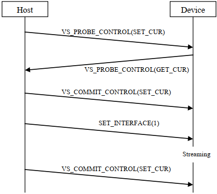

Process Description:

- The host first sends the desired settings to the USB device (PROBE)
- The device modifies the host's expectations within its own capabilities and returns them to the host(PROBE)
- If the Host thinks the settings are feasible, Commit (COMMIT)
- Set the current setting of the interface to one of the settings

### 3.1.2.3 UVC Video Streaming Load

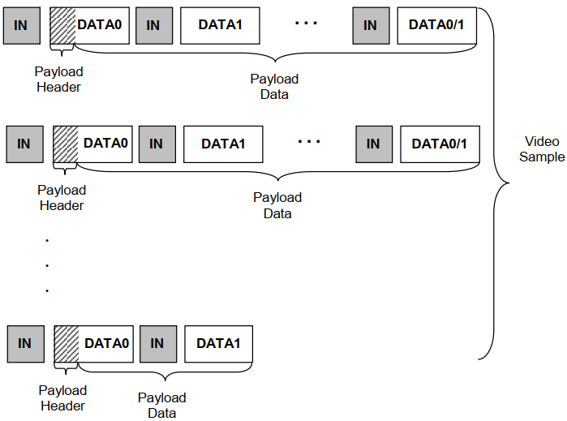

You can see that the payload data contains a header in front of it, and the payload data contains multiple USB packets, how does the host identify a frame of image data?

The payload header fixes the first 2 bytes and the subsequent extensions. Focus on FID - different formats have different regulations. But all formats use this bit to switch between 0 and 1 to recognize a new frame of image data.

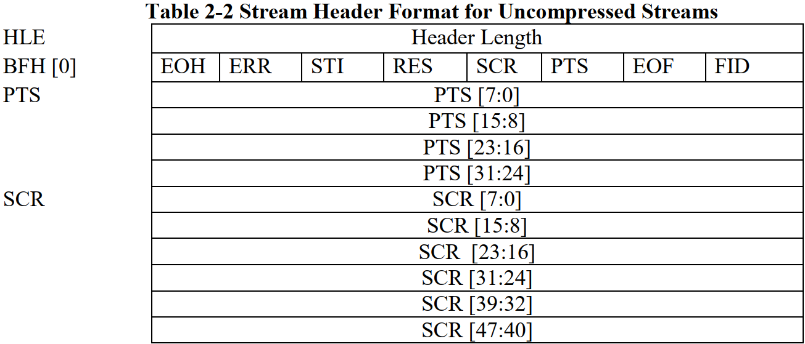

### 3.2 Linux Driver Layer

The SDK design of the K230 puts the video and audio functions on the large-core RTT for performance. The function implementation of USB on Linux is very mature, so UVC function is developed based on Linux to obtain large-core video data through inter-core mapi communication.

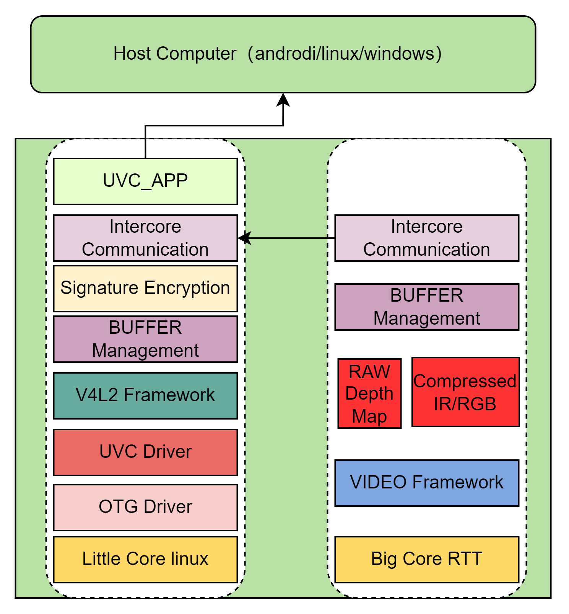

### 3.2.1 Controller Driver

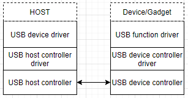

The K230 integrates a Synopsys USB module, and the linux/drivers/usb/dwc2 directory is the driver for this controller.

The current SDK design UVC uses USB1 fixedly, and otg is recognized as device mode through the ID signal.

platform.c, do some reset, register interrupts, configure parameters and other operations. The USB of the SDK supports buffer DMA mode by default. Scatter Gather DMA mode can improve ISO transmission performance, HOST mode cannot support HUB using this DMA mode.

gadget.c, which focuses on the driver code, dwc2_gadget_init initializes important structs, gadget.ops and ep.ops. usb_ep_ops queue is a request to submit data to send and receive, which is actually put into a linked list for processing. USB will process the requests on these linked lists one by one and then report a completion callback.

``` c
//device tree
usbotg1: usb-otg@91540000 {
    compatible = "kendryte,k230-otg";
    reg = <0x0 0x91540000 0x0 0x10000>;
    interrupt-parent = <&intc>;
    interrupts = <174>;
    g-rx-fifo-size = <512>;
    g-np-tx-fifo-size = <64>;
    g-tx-fifo-size = <512 1024 64 64 64 64>;
    dr_mode = "otg";
    otg-rev = <0x200>;
};
```

### 3.2.2 Gadget Drivers

The source code is located at linux/drivers/usb/gadget

- legacy: The entry point for the entire Gadget device driver. Located under driver/usb/gadget/legacy, it gives driver samples for commonly used USB devices. Its role is to configure the USB device descriptor information, provide a usb_composite_driver, and then register it with the composite layer. It can also be created dynamically through functionfs, which is more flexible, and the USB gadget demo provided by K230 adopts this method.
- Functions: Various USB subclass device function drivers. Located in driver/usb/gadget/functions, the corresponding sample is also given. Its role is to configure the interface description of the USB subclass protocol and other subclass protocols, such as UVC protocol, HID, etc. The relevant documents involved in UVC uvc_video.c, uvc_v4l2.c, uvc_queue.c, uvc_configfs.c, f_uvc.c

The UVC of the K230 hardly modifies the gadget driver layer, only porting the H264 format support function and expansion unit.

Linux compiles the kernel to add the USB Gadget framework

``` shell
-> Device Drivers
    -> USB support
        -> USB Gadget Support
```

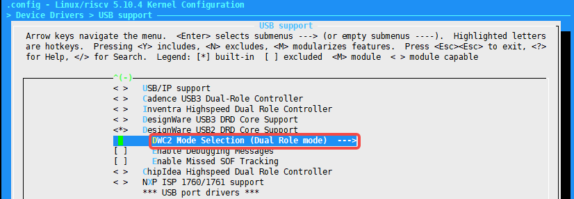

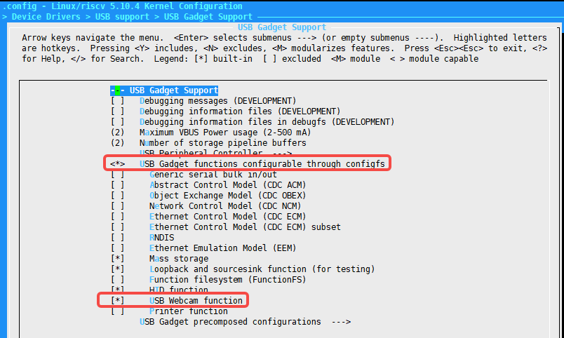

UVC involves the functionality of the V4L2 module, and the Media framework needs to be added

``` shell
-> Device Drivers
    -> Multimedia support
        -> Media core support
            -> Media core support
```

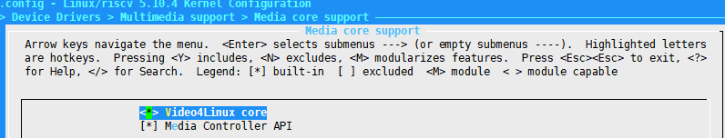

### 3.3 UVC-Gadget Application Layer

From the SDK design architecture of K230, it can be seen that the difference between the UVC function of K230 and the UVC function on Linux is that the way to obtain video data is obtained from the large core RTT through inter-core communication.

The code location of the K230 UVC application layer: cdk/user/mapi/sample/camera

Source code file description:

application.c - Main function

camera.c - Provides camera object manipulation and can include UVC/UAC controls

frame_cache.c - Management of complex buffers

kstream.c - Implements video streaming operations

kuvc.c - Implements kuvc object operations

sample_venc.c - The operation of acquiring encoded images from large nuclei via MAPI

sample_yuv.c - Operation to acquire YUV images from large nuclei via mapi

UVC-gadget.c - Implements UVC device operation

The debugging step is to first port the common uvc_app on Linux and run through the standalone function on Linux, that is, play fixed image data. Then debug the ability to play back real camera image data.

Below is the design flowchart of the K230 UVC APP

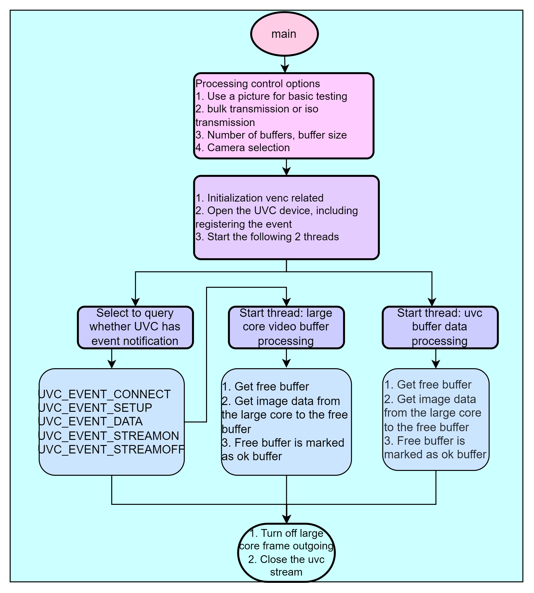

Most of the operations of UVC APP are general operations, and there are more materials on the Internet. Here we talk about the K230 private operation, focusing on the processing of venc_normalp_classic functions.

- First, configure the VICAP device properties, including the camera type
kd_mapi_vicap_set_dev_attr
- Get camera information, mainly to get the image resolution k_vicap_sensor_info output by the camera
- Calculate the required VB buffer size from the vicap output image according to the needs and allocate the buffer kd_mapi_media_init
- Configure channel properties, including the resolution, format, and other kd_mapi_vicap_set_chn_attr of the output
- Start video processing kd_mapi_vicap_start
  - Get a frame of image kd_mapi_vicap_dump_frame
  - Release the image buffer kd_mapi_vicap_release_frame
- Initialize the venc module, including encoding format, frame rate, resolution, etc. kd_mapi_venc_init
- Register the callback function kd_mapi_venc_registercallback after encoding is complete
- Enabling the H264 GOP interval generates IDR frame kd_mapi_venc_enable_idr
- Start the venc kd_mapi_venc_start
- The venc module binds the vi module kd_mapi_venc_bind_vi
  - The callback function after encoding is completed to obtain the encoded image data get_venc_stream

### 3.4 Reference Study Recommendations

- [USB2.0 official documentation download](https://www.usb.org/document-library/usb-20-specification)
- [UUV1.1 official document download](https://www.usb.org/document-library/video-class-v11-document-set)
- [UUV1.5 official document download](https://www.usb.org/document-library/video-class-v15-document-set)
- [USB Chinese network](https://www.usbzh.com/article/forum-12.html)
