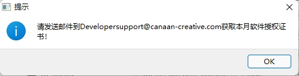
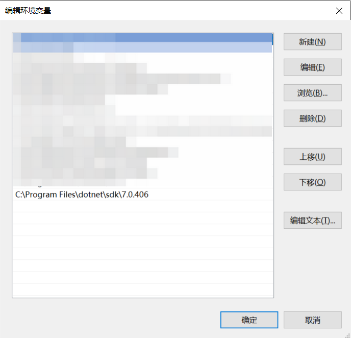

# AI Cube Frequently Asked Questions

Copyright © 2023 Beijing Canaan Creative Information Technology Co., Ltd.

## Disclaimer

The products, services, or features you purchase are subject to the commercial contracts and terms of Beijing Canaan Creative Information Technology Co., Ltd. (hereinafter referred to as "the Company") and its affiliates. All or part of the products, services, or features described in this document may not be within your purchase or usage scope. Unless otherwise stipulated in the contract, the Company does not provide any explicit or implicit statements or warranties regarding the accuracy, reliability, completeness, merchantability, fitness for a particular purpose, and non-infringement of any statements, information, or content in this document. Unless otherwise agreed, this document is only for reference as a usage guide.

Due to product version upgrades or other reasons, the content of this document may be updated or modified periodically without any notice.

## Trademark Statement

, "Canaan," and other Canaan trademarks are trademarks of Beijing Canaan Creative Information Technology Co., Ltd. and its affiliates. All other trademarks or registered trademarks mentioned in this document are owned by their respective owners.

**Copyright © 2023 Beijing Canaan Creative Information Technology Co., Ltd. All rights reserved.**
Without written permission from the Company, no unit or individual is allowed to excerpt, copy any part or all of the content of this document, or disseminate it in any form.

## Table of Contents

[TOC]

## 1 AI Cube Usage Issues

### Issue 1: License prompt appears when AI Cube is opened

**Answer:** AI Cube uses a license verification mechanism. To enter AI Cube, a license for the current month is required. Users can send an email to [Developersupport@canaan-creative.com](mailto:Developersupport@canaan-creative.com) to apply for a license for the current month. Our professional team will provide you with license support.

### Issue 2: AI Cube crashes or becomes unresponsive when running

**Answer:** When encountering a crash issue, first refer to the [AI Cube User Guide](https://kendryte-download.canaan-creative.com/developer/common/AI_Cube_V1.2%E7%94%A8%E6%88%B7%E6%8C%87%E5%8D%97.pdf) to check if the Nvidia graphics driver and dotnet are correctly installed.

Possible causes include:

* The first startup of AI Cube requires waiting. Users can manually execute AI Cube.exe in the AI Cube directory to speed up the opening.

* Missing libomp.dll in the system32 folder. Please refer to [GitHub issue](https://github.com/kendryte/nncase/issues/451) to resolve this issue.

* Incorrect dotnet environment variable configuration. Users can add environment variables in the system environment variable section, such as "C:\Program Files\dotnet\sdk\7.0.406".

