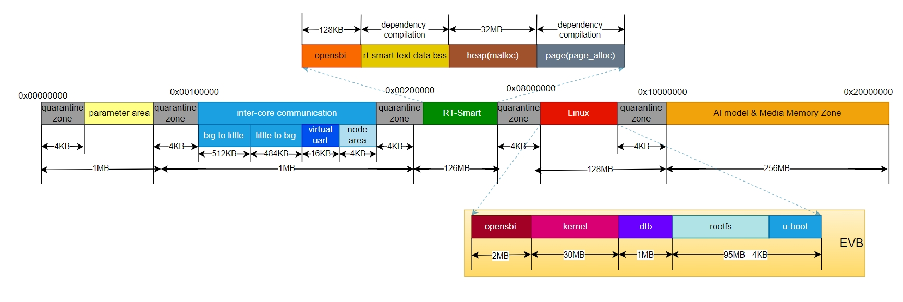

# K230 SDK Release Notes

Copyright 2023 Canaan Inc. ©

## Disclaimer

The products, services or features you purchase should be subject to Canaan Inc. ("Company", hereinafter referred to as "Company") and its affiliates are bound by the commercial contracts and terms and conditions of all or part of the products, services or features described in this document may not be covered by your purchase or use. Unless otherwise agreed in the contract, the Company does not provide any express or implied representations or warranties as to the correctness, reliability, completeness, merchantability, fitness for a particular purpose and non-infringement of any statements, information, or content in this document. Unless otherwise agreed, this document is intended as a guide for use only.

Due to product version upgrades or other reasons, the content of this document may be updated or modified from time to time without any notice.

## Trademark Notice

, "Canaan" and other Canaan trademarks are trademarks of Canaan Inc. and its affiliates. All other trademarks or registered trademarks that may be mentioned in this document are owned by their respective owners.

**Copyright 2023 Canaan Inc.. © All Rights Reserved.**
Without the written permission of the company, no unit or individual may extract or copy part or all of the content of this document without authorization, and shall not disseminate it in any form.

## Directory

[TOC]

## preface

### Overview

This document mainly describes the content related to the release of K230 SDK V1.2.0, including the hardware, features, and usage restrictions supported by the current version.

### Reader object

This document (this guide) is intended primarily for:

- Technical Support Engineer
- Software Development Engineer

### Definition of acronyms

| Abbreviation               | Illustrate                                                   |
|--------------------|--------------------------------------------------------|
| K230 USIP LP3 EVB | The K230 chip in the USIP package is equipped with an LPDDR3 development board              |
| EXPIRES               | Video Encoder, a video coding module                            |
| VDEC               | Video Decoder, a video decoding module                            |
| VICAP              | Video Input Capture, an image input acquisition module                  |
| IN                 | Video Output, a video output module                             |
| .AI                 | Audio Input, the audio input module                              |
| TO                 | Audio Output, the audio output module                             |
| AENC               | Audio Encoder, an audio coding module                            |
| ADEC               | Audio Decoder, an audio decoding module                            |
| NonAI-2D           | 2D graphics acceleration processing module, support OSD overlay, picture frame, CSC transformation and other functions. |
| MCM                | Multi Camera Management                   |

### Revision history

| Document version number | Modify the description | Author     | date     |
|------------|----------|------------|----------|
| V1.0      | Initial     | System Software Department | 2023-11-8 |

## 1. Version Information

| Affiliated products | Version number | Release date |
|----------|--------|----------|
| K230 SDK | V1.2.0 | 2023-11-8|

## 2. Supported hardware

The K230 platform supports K230 USIP LP3 EVB, CanMV-K230 and other motherboards, and the specific hardware information is referred to the document directory:[00_hardware](../00_hardware).

## 3. Description of Version Usage Restrictions

The following figure shows the memory layout of the current SDK USIP LP3 EVB and CanMV-K230:

Figure 1 SDK memory layout

You can configure the memory interval of each module by entering selection in the k230_sdk directory`make menuconfig``Memory->Configuration`, and configuration is not supported at this time
Memory configuration of parameter areas and intercore communication areas

## 4. Version function statistics

### 4.1 Multimedia

| ID | Supported versions      | Functional overview             | Feature description                                                                                   | remark |
|----|---------------|----------------------|--------------------------------------------------------------------------------------------|------|
| 1  | K230 SDK V0.5 | EXPIRE                 | H264/H265/JPEG encoding                                                                         |      |
| 2  | K230 SDK V0.5 | vdec                 | H264/H265/JPEG decoding                                                                         |      |
| 3  | K230 SDK V0.5 | Vicap Bind Venc      | The vicap input is bound to the venc output                                                                    |      |
| 4  | K230 SDK V0.5 | vdec bind vo         | VDEC is bound to VO output images                                                                       |      |
| 5  | K230 SDK V0.5 | venc_2d              | OSD encoding after superposition                                                                              |      |
| 6  | K230 SDK V0.5 | nonai_2d             | OSD overlay                                                                                    |      |
| 7  | K230 SDK V0.5 | I2S audio input         | Sampling accuracy (16/24/32), sampling rate (8K-192K), timestamp (US), two-channel, sample point per frame can be configured.                 |      |
| 8  | K230 SDK V0.5 | PDM audio input         | Sampling accuracy (16/24), sampling rate (8K-192K), oversampling (32/64/128), single and double channels, timestamp (US), sampling points per frame can be configured. |      |
| 9  | K230 SDK V0.5 | I2S audio output         | Sampling accuracy (16/24/32), sampling rate (8K-192K), two-channel, sample point per frame can be configured.                               |      |
| 10 | K230 SDK V0.5 | Internal Audio Codec      | Support ADC, DAC, sampling accuracy (16/24), sampling rate (8K-192K)                                              |      |
| 11 | K230 SDK V0.5 | ai(i2s) bind ao(i2s) | AI binds AO, and I2S audio is collected to I2S audio output loopback                                                    |      |
| 12 | K230 SDK V0.5 | ai(pdm) bind ao(i2s) | AI binds AO, PDM audio acquisition to I2S audio output loopback                                                    |      |
| 13 | K230 SDK V0.6 | EXPIRE                 | Multicode, rotate and mirror                                                                       |      |
| 14 | K230 SDK V0.6 | venc_2d              | Picture frame                                                                                       |      |
| 15 | K230 SDK V0.6 | venc MAPI            | VI-\>VENC-\> little core storage file                                                                     |      |
| 16 | K230 SDK V0.6 | aenc                 | Audio coding, built-in G711A/U                                                                      |      |
| 17 | K230 SDK V0.6 | ADEC                 | Audio decoding, built-in G711A/U                                                                      |      |
| 18 | K230 SDK V0.6 | AI bind aenc         | AI binds AENC to collect encoded data                                                               |      |
| 19 | K230 SDK V0.6 | adec bind to the         | ADEC binds to the AO and plays the output decoded audio                                                           |      |
| 20 | K230 SDK V0.6 | audio 3a             | AEC (Echo Cancellation), ANS (Noise Suppression), AGC (Automatic Gain)                                             |      |
| 21 | K230 SDK V0.7 | Venc GOP | Support setting encoding GOP | |
| 22 | K230 SDK V0.7 | venc mirror | Support setting encoding horizontal and vertical flipping | |
| 23 | K230 SDK V0.7 | Venc IDR | Support encoded IDR frames funciton:enable/disable  | |
| 24 | K230 SDK V0.7 | venc multi channel | mapi_venc_2 H264 encoding | |
| 25 | K230 SDK V0.7 | audio i2s mapi | MAPI-audio_i2S captures audio encoding and passes it to the big core | |
| 26 | K230 SDK V0.7 | Audio enc mapi | Mapi-audio_ little core encoding files are passed to big core for decoding and playback | |
| 27 | K230 SDK V0.7 | audio volume | Added built-in audio codec digital and analog volume control interfaces. | |
| 28 | K230 SDK V0.7 | Mapi rtsp | MAPI-Network Transmission-RTSP audio and video streaming | |
| 29 | K230 SDK V0.8 | MAPI VDEC | The small-core video encoding file is transmitted to the large-core to be decoded and played | |
| 30 | K230 SDK V0.8 | venc mpi | deblock, sao, entropy： enable/disable | |
| 31 | K230 SDK V0.8 | VDEC MPI | Support down scale | |
| 32 | K230 SDK V0.8 | DPU Demo | Screen depth map: vicap->dma->dpu->vo | |
| 32 | K230 SDK V0.8 | Voice intercom demo | Add a voice intercom demo | |
| 33 | K230 SDK V0.9 | Peephole POC | Remote peephole realizes video intercom, voice change, video, humanoid detection and capture functions. | |
| 34 | K230 SDK V1.0 | Peephole POC | 1. Add UI control on the peephole  device. 2. Add local peephole voice intercom function. 3. The mobile phone recording function is changed to the device side implementation, and it is always recording. 4. Add playback function on the peephole  device. | |
| 35 | K230 SDK V1.2 | Peephole POC | nor flash boot up | |

### 4.2 Images

| ID | Supported versions      | Functional overview      | Feature description                                                                                                                              | remark |
|----|---------------|---------------|---------------------------------------------------------------------------------------------------------------------------------------|------|
| 1  | K230 SDK V0.5 | Vicap         | Support capture sensor image (OV9732, OV9286)                                                                                                  |      |
| 2  | K230 SDK V0.5 | AE            | AE auto exposure is supported                                                                                                                        |      |
| 3  | K230 SDK V0.5 | Vicap Bind VO | vicap is bound to the VO output image                                                                                                               |      |
| 4  | K230 SDK V0.5 | GPU drawing       | Vector drawing fills (straight line, quadratic Bezier curve, cubic Bezier curve, elliptic curve) Linear gradient Color lookup table Image compositing/blending, BLIT                                     |      |
| 5  | K230 SDK V0.5 | Image tuning      | tuning tool which Connect the development board through the network and serial port for image optimization. Black level correction  lens shading correction  color calibration  AWB CAC  gamma   |      |
| 6  | K230 SDK V0.5 | display bind  | VO and VICAP, VO and VDEC bindings are supported                                                                                                        |      |
| 7  | K230 SDK V0.5 | display display  | Support OSD and YUV display, support dump frame function, support DSI and VO timing, can be configured, support interpolation frame function                                                                 |      |
| 8  | K230 SDK V0.6 | Image tuning       | The tuning tool configures the sensor register                                                                                                       |      |
| 9  | K230 SDK V0.6 | Timestamp, frame number   | Supports timestamp and frame number                                                                                                                      |      |
| 10 | K230 SDK V0.6 | ISP+KPU Demo  | Face detection demo                                                                                                                      |      |
| 11 | K230 SDK V0.7 | dewarp        | Add the dewarp function to achieve distortion correction                                                                                                       |      |
| 12 | K230 SDK V0.7 | AE Side       | Added FaceAE function and corresponding FaceAE demo                                                                                                  |      |
| 13 | K230 SDK V0.7 | Add Imx335    | Add Imx335 sensor driver and demo                                                                                                            |      |
| 14 | K230 SDK V0.8 | Add DRM       | Linux little core adds DRM driver and demo                                                                                                             |      |
| 15 | K230 SDK V0.8 | Add LVGL      | Linux little core adds LVGL and demo                                                                                                                |      |
| 16 | K230 SDK V0.8 | Launch the APP quickly       | Quick Start APP Sensor changed to Imx335 (with crystal oscillator)                                                                                                       |      |
| 17 | K230 SDK V0.9 | mcm           | Supports up to three sensors                                                                                                                     |      |
| 18 | K230 SDK V0.9 | display mapi  | Add the video output class MAPI                                                                                                                     |      |
| 19 | K230 SDK V1.0 | Debug-Dump sensor raw     | Support for dump sensor RAW data                                                                                                     |      |
| 20 | K230 SDK V1.0 | Commissioning - frame count statistics             | Support total input and output frame count function                                                                                                 |      |
| 21 | K230 SDK V1.0 | dewarp split-screen             | Support 2, 4 split screen output                                                                                                            |      |
| 22 | K230 SDK V1.0 | HDR                      | Support HDR function, support Imx335 2dol HDR                                                                                            |      |
| 23 | K230 SDK V1.1 | MAPI                     | Add vicap's MAPI                                                                                                             |      |
| 24 | K230 SDK V1.1 | HDR frequency conversion               | Supports HDR frequency conversion                                                                                                            |      |
| 25 | K230 SDK V1.1 | Parameter export                  | Support ISP Dewarp parameter export                                                                                                      |      |
| 26 | K230 SDK V1.2 | Add Dictionary Pen POC                  | Add Dictionary Pen POC                                                                                                  |      |

### 4.3 Platform

| ID | Supported versions      | Functional overview               | Feature description                                                                                                                                                                                                                                           | remark |
|----|---------------|------------------------|----------------------------------------------------------------------------------------------------------------------------------------------------------------------------------------------------------------------------------------------------|------|
| 1  | K230 SDK V0.5 | Start the peripheral               | Support eMMC, 1/4-wire SD card                                                                                                                                                                                                                             |      |
| 2  | K230 SDK V0.5 | big core DPU driver            | Image input and output driver development, basic functions, EG reading parameters, support dynamic update of long-period parameters, output buffer, timestamp, algorithm, etc. Support pipeline binding                                                                                                                                    |      |
| 3  | K230 SDK V0.5 | little core UBOOT              | DDR training, disk drive (emmc, sd, spi 1 line); Supports PUFS and gzip decompression                                                                                                                                                                                       |      |
| 4  | K230 SDK V0.5 | little core SPI driver            | 1 line                                                                                                                                                                                                                                                |      |
| 5  | K230 SDK V0.5 | little core SDIO driver           | SDIO0/1 is supported to mount SDCard                                                                                                                                                                                                                              |      |
| 6  | K230 SDK V0.5 | Small-core USB (UVC) driver     | Support UVC driver (K230 chip as slave)                                                                                                                                                                                                                     |      |
| 7  | K230 SDK V0.5 | Small-core GPIO drivers           | Supports separate allocation of each IO as a logical resource; Supports IO and interrupts                                                                                                                                                                                                        |      |
| 8  | K230 SDK V0.5 | little core disks and file systems     | Support SDIO0/1 to mount SDCard, support SDIO0/1 to mount eMMC; Supports ext2/3/4, FAT32 file systems                                                                                                                                                                             |      |
| 9  | K230 SDK V0.5 | I2C driver                | Large and little core I2C bus driver                                                                                                                                                                                                                                  |      |
| 10 | K230 SDK V0.5 | UART driven               | Large and little core UART drivers                                                                                                                                                                                                                                     |      |
| 11 | K230 SDK V0.5 | UVC basic demo            | UVC Camera, which uses the board as a camera                                                                                                                                                                                                                        |      |
| 12 | K230 SDK V0.5 | GSDMA (Big Core Drive)      | Support using gdma for image migration, configure channel properties to achieve image rotation and mirroring, transport multiple image formats (such as YUV400, YUV420, YUV444), move images with multiple pixel widths (such as 8bit, 10bit, 16bit); Support data migration using SDMA, support 1D mode and 2D mode handling. Support pipeline binding. |      |
| 13 | K230 SDK V0.6 | Large-core GPIO drivers           | Supports independent configuration and use of IO functions, independent configuration and triggering interrupts, and hardware mutexes are added to ensure the mutex of register access.                                                                                                                                                             |      |
| 14 | K230 SDK V0.6 | Start the peripheral               | Support SPI nor Flash image generation and startup                                                                                                                                                                                                                    |      |
| 15 | K230 SDK V0.6 | uboot SPI norflash driver | Supports 8-wire DMA                                                                                                                                                                                                                                        |      |
| 16 | K230 SDK V0.6 | big core ADC drive          | Allows the ADC to read voltage values                                                                                                                                                                                                                                |      |
| 17   | K230 SDK V0.7 | Large and little core WDT drivers          | Support for watchdog reset SoC                                          |      |
| 18   | K230 SDK V0.7  | big core SPI driver            | Support SPI single-wire mode, support NANDFLASH                               |      |
| 19   | K230 SDK V0.7  | little core SPI driver            | Support SPI single-wire, eight-wire mode, support NordFlash                         |      |
| 20   | K230 SDK V0.7  | Quick-up feature               | The SDK defaults to fast starting, and non-fast versions can turn off CONFIG_QUICK_BOOT macros through make menuconfig. The fast version uboot will not enter the command line. |      |
| 21   | K230 SDK V0.7  | Secure mirroring               | The SDK does not generate a secure image by default, and you can configure the CONFIG_GEN_SECURITY_IMG to generate a secure image by making menuconfig |      |
| 22   | K230 SDK V0.7  | UVC basic demo            | Added support for H264 format, there is currently a bug, can only run for a while            |      |
| 23 | K230 SDK V0.7 | DPU、GSDMA | The number of buffers is configurable | |
| 24 | K230 SDK V0.8 | big core timer、rtc、pwm | The big core adds timer driver and demo; the big core adds the PWM driver and demo; and the big core adds the RTC driver and demo. | |
| 25 | K230 SDK V0.8 | SPI NAND support | The little core (uboot, Linux) supports 4-wire SPI NAND driver, and the SDK supports booting from Spiron; | |
| 26 | K230 SDK V0.8 | UVC basic demo | UVC supports IMX335 camera, UVC supports MJPEG format | |
| 27 | K230 SDK V0.8 | spinor adds parameter partitioning such as face characteristics | SPI NOR adds parameter partitions such as face features, AI models, calibration parameters, big core apps, speckles, and quick-start parameters; when booting from Spinor, uboot parses and loads the data of each partition. | |
| 28 | K230 SDK V0.9 | little core PWM driver | Supports little core PWM drivers | |
| 29 | K230 SDK V0.9 | little core ADC drive | Supports small-core ADC driving | |
| 30 | K230 SDK V0.9 | Support K230D development board | SDK support K230D development board (SD card boot) | |
| 31 | K230 SDK V0.9 | STING | Support OTA upgrade | |
| 32 | K230 SDK V1.0 | Large nuclear FFT | Support FFT driver | |
| 33 | K230 SDK V1.0.1 | Support CanMV-K230 development board | SDK support CanMV-K230 development board (SD card boot)| |
| 34 | K230 SDK V1.1 | little core Wifi driver | The little core supports AP6256 drivers| |
| 35 | K230 SDK V1.1 | little core three-color lamp driven | The little core supports the I2S interface WS2812 driver| |
| 35 | K230 SDK V1.1 | little core SPI LCD driver | The little core supports SPI interface ST7735S 0.96 inch LCD screen driver| |
| 36  | K230 SDK V1.1 | BurnTool Burning Tool V2           | Delete the full image burning page and add loader_sip.bin support for SIP burning, see [K230_SDK_Burntool User Guide.md](../../en/01_software/pc/burntool/K230_SDK_Burntool_User_Guide.md) for details|      |
| 37  | K230 SDK V1.1 | USB port use           | USB1 is fixed in host mode, which can be connected to peripherals such as USB-ETH or U disk, and EVB's J5 pin pin 3 is connected to pin4 jumper cap to enable power supply to peripherals. USB0 is used for USB gadget testing and USB upgrades, and EVB's J5 pin headers, pins 1 and pin2, are no longer connected using jumper caps. |      |
| 38  | K230 SDK V1.2 | canmv wifi ap6212           | canmv support ap6212 |      |
| 39  | K230 SDK V1.2 | canmv only linux           | add k230_canmv_only_linux_defconfig config |      |

### 4.4 Architecture

| ID | Supported versions      | Functional overview       | Feature description                                                                                                                            | remark                                |
|----|---------------|----------------|-------------------------------------------------------------------------------------------------------------------------------------|-------------------------------------|
| 1  | K230 SDK V0.5 | Multimedia memory management | Multimedia area memory management driver, MPI, MAPI; video buffer pool driver, MPI, MAPI                                                                        |                                     |
| 2  | K230 SDK V0.5 | Log management       | Multimedia log management driver, MPI, MAPI                                                                                                       |                                     |
| 3  | K230 SDK V0.5 | System binding       | Multimedia system binding driver, MPI                                                                                                             |                                     |
| 4  | K230 SDK V0.5 | Large-core multimedia debugging | The proc file system is provided for debugging                                                                                                            |                                     |
| 5  | K230 SDK V0.5 | Internuclear communication       | Internuclear communication drive                                                                                                                        |                                     |
| 6  | K230 SDK V0.5 | Internuclear control communication   | IPCMSG library                                                                                                                            |                                     |
| 7  | K230 SDK V0.5 | Internuclear data communication   | DATAFIFO library                                                                                                                          |                                     |
| 8  | K230 SDK V0.5 | Shared file system   | hlutabréf                                                                                                                             | The little core is the server, and the big core is the client          |
| 9  | K230 SDK V0.5 | System control       | Large and little core clock power supply and reset drive                                                                                                            |                                     |
| 10 | K230 SDK V0.5 | KPU            | KPU driven                                                                                                                             |                                     |
| 11 | K230 SDK V0.5 | big core system debugging   | JTAG debugging, local serial port, CPU usage statistical analysis, etc                                                                                             |                                     |
| 12 | K230 SDK V0.5 | Small-core system debugging   | JTAG debugging, serial port debugging, network port debugging, CPU usage statistical analysis, performance debugging methods, debugging and log output ports (physical serial ports), kernel and exception information output, dump, debug version | Perf is not configured into the kernel and buildroot by default |
| 13 | K230 SDK V0.7 | Software SHA256     | The SHA256 software implementation is added under the large-core MPP                                                                                                         |                                     |
| 14 | K230 SDK V0.7 | OTP read and write function    | The OTP read and write function is added to the large-core rt-smart, and the OTP read function is added to the small-core Linux                                                                             |                                     |
| 15 | K230 SDK V0.7 | Tsensor read function  | Tsensor read function is added to the large-core rt-smart, and Tsensor read function is added to the small-core Linux to read the chip junction temperature                                                      |                                     |
| 16 | K230 SDK V0.7 | TRNG read function     | Added TRNG read function in small-core Linux                                                                                                         |                                     |
| 17 | K230 SDK V0.7 | quickly demo       | Add a big core to quickly launch the face detection demo                                                                                                       |                                     |
| 18 | K230 SDK V0.7 | PMU function        | Add PMU standby and wake-up functions for small-core Linux                                                                                                   |                                     |
| 19 | K230 SDK V0.8 | Door lock POC        | The big core adds POC door lock function, and the little core adds UI function, and the face is registered and recognized through the UI interface or SD card |                                     |
| 20 | K230 SDK V0.9 | Door lock POC        | Support ov9286, face detection and recognition (including IR and speckle live, speckle including DPU deep extraction) |                                     |
| 21 | K230 SDK V0.9 | Encryption and decryption        | Adds AES-GCM encryption and decryption for small-core Linux |                                     |
| 22 | K230 SDK V0.9 | Power control        | uboot adds chip clock/power domain management, big core rt-smart adds power control for CPU1, DPU, VPU, KPU, display, and little core Linux adds power control for display                                                                                                |                                     |
| 23 | K230 SDK V1.0 | Door lock POC        | Add the function of scanning and decrypting facial feature values |                                     |
| 24 | K230 SDK V1.0 | SH256 drive        | Added SH256 driver for large and little core hardware |                                     |
| 25 | K230 SDK V1.1 | big core encryption and decryption driver        | Added big core hardware AES-GCM driver and SM4-ECB/CBC/CFB/OFB/CTR driver |                                     |
| 26 | K230 SDK V1.2 | Door lock OTA        | Add Door lock OTA |

### 4.5 Miscellaneous

| ID | Supported versions      | Functional overview             | Feature description                                                         | remark |
|----|---------------|----------------------|------------------------------------------------------------------|------|
| 1  | K230 SDK V0.5 | to the demos              | Provide three AI demos door_lock, object_detect, and image_classify; |      |
| 2  | K230 SDK V0.5 | AiW4211LV10 WiFi driver | Support network data communication; support control command sending;                             |      |
| 3  | K230 SDK V0.6 | AiW4211LV10 WiFi firmware | Firmware compatible with instructions and network configuration, support network connection reconnection, support K230 level monitoring and wake-up     |      |
| 4  | K230 SDK V0.6 | Touch screen support           | Touch screen support                                                       |      |
| 5  | K230 SDK V0.7 | Software image           | SDK compilation will generate demo executables, but will not be packaged into images by default, and security image files will not be generated by default, so you can configure them manually  |      |
| 6  | K230 SDK V0.7 | Toolchain           | The big core toolchain version is updated to: riscv64-unknown-linux-musl-rv64imafdcv-lp64d-20230420.tar.bz2  |      |
| 7  | K230 SDK V0.8 | Software image           | When the EMMC/SDCARD image is packaged, the demos of the big core will be packaged into the little core/sharefs |      |
| 8  | K230 SDK V0.8 | Demo           | In order to adapt to different camera modules and modify the relevant demo, such as encoding/UVC, the specific use of the demo can be found in the "K230 SDK Demo User Guide" |      |

## 5. Legacy issues and limitations of the version

| ID | Function modules      | Problem/limitation description                                                                         | remark |
|----|---------------|---------------------------------------------------------------------------------------|------|
| 1  | VPU encoding       | VPU repeats the code many times and is probabilistic stuck                                                          |      |
| 2  | usb            | Transporting H264 encoding over USB for a long time is abnormal                    |      |
| 3  | Peephole | During the operation of the simulated mobile phone, the network cannot be automatically reconnected after it is disconnected | |
