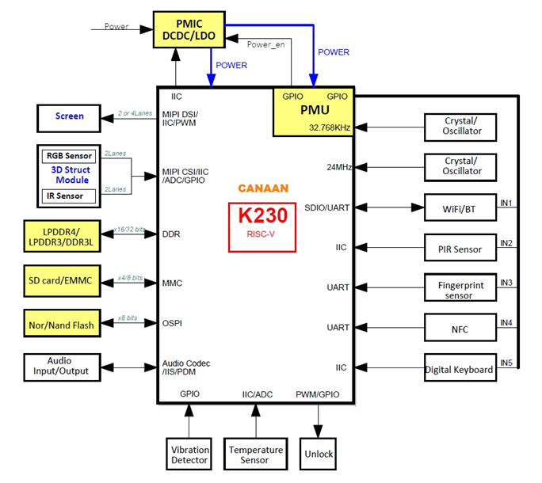

# K230 Product Brief

Document version: V1.0
Release date: 2023-6-10

## Disclaimer

The products, services or features you purchase shall be subject to the commercial contracts and terms of Canaan Creative CO., LTD. (the "Company") and its affiliates, and all or part of the products, services or features described in this document may not be within the scope of your purchase or use. Unless otherwise agreed in the contract, the Company does not provide any express or implied representations or warranties as to the correctness, reliability, completeness, merchantability, fitness for a particular purpose and non-aggression of any statements, information, or content in this document.Unless otherwise agreed, this document is intended as a guide for use only.

Due to product version upgrades or other reasons, the content of this document may be updated or modified from time to time without any notice.

## Trademark Notice

"Canaan" and other Canaan trademarks are trademarks of Canaan Creative CO., LTD. and its affiliates. All other trademarks or registered trademarks that may be mentioned in this document are owned by their respective owners.

Copyright©2023 Canaan Creative CO., LTD.
This document is only suitable for the development and design of K230 platform, without the written permission of the company, any unit or individual shall not disseminate part or all of the content of this document in any form.

Canaan Creative CO., LTD.
Website：canaan-creative.com
Business Email：<salesAI@canaan-creative.com>

## Menu

[TOC]

## Preface

### Purpose

This document is intended to provide a general overview of the K230 platform and its features.

### Intended Audience

The main people to whom this document (this guide) applies:

- Design and maintenance personnel for electronic products
- Sales personnel for electronic products
- Technical support personnel

### Terms

### Revision history

| Version Number | Author    | Revision Date | Revision Notes                                                    |
|----------------|----------------|--------------|-------------------------------------------------------------------|
| V1.0           | Zhenming Huang | 2023-6-10    | Re-format to markdown document based on K230 Brief Datasheet_Complete_Apr_2023_v1 |
|                |                |              |           |

## Overview

The K230 chip is the latest generation SoC product in Canaan Technology's (NASDAQ: CAN) Kendryte® series of AIOT chips. The chip adopts a brand-new multi-heterogeneous unit acceleration computing architecture, integrates two RISC-V C908 computing cores, and has a built-in new generation KPU (Knowledge Process Unit) intelligent computing unit. Multi-precision AI computing power with INT8 and INT16. Supports general AI computing framework. The chip also has a variety of peripheral interfaces, as well as multiple scalar, vector, graphics, and other dedicated hardware acceleration units such as image 2D engine, AI 2D engine, 2.5D GPU, and 3D depth engine. K230 provides full-process computing acceleration for various computing tasks such as images, videos, audio, AI, etc. The chip has many features such as low latency, high performance, low power consumption, fast startup, and high security.
K230 can be used in various smart hardware products, such as smart door locks, home smart security cameras, dictionary pens, payment recognition, 3D structured light vision modules, drones, interactive robots, smart home appliances, smart toys, and smart manufacturing, intelligent vehicle cockpit and many other fields.

## General Specifications

### CPU

- CPU 1: 64bit, RISC-V processor, 1.6GHz, supports RISC-V Vector Extension 1.0 specification, with floating-point units (FPUs), 128bits vector-process-unit, runs RTOS system

- CPU 0: 64bit, RISC-V processor, 800MHz, supports RISC-V 64GCB instruction set, runs LINUX system

### KPU

- Support INT8 and INT16

- Support weight sparse compression
- Typical network performance：
  - Resnet 50 ≥ 85fps @INT8
  - Mobilenet_v2 ≥ 670fps @INT8
  - YoloV5S ≥ 38fps @INT8
- Support TVM / TensorFlow / Pytorch / ONNX
- Support quantitative tool chain and profiling tools
- Loss of quantization accuracy <1%

### 2D Engine

- 2D(GDMA) Engine:
  - OSD/CSC/X-Mirror/Y-Mirror/Rotation（90/180/270）
  - Typical image rotation capability：
    - 2 x 1080\*1280 YUV400 @15fps + 1 x 1080\*1920 YUV420 @30fps

- Independent AI 2D Engine:
  - Affine/Crop/Resize/Padding/Shift

### DPU (Depth Computing Unit)

- Using 3D structured light depth calculation

- Support multiple operators, including Img_check / LCN / SAD / Post_proc / Align
/ Disptodepth
- The maximum resolution of the landscape image is 1920\*1080, and the maximum resolution of the portrait image is 1080\*1440
- Typical performance is 1280\*800@30fps, 1280\*1080@15fps,1920\*1080@9fps

### Memory

- DRAM: DDR3L / LPDDR4 with 16/32bit,
LPDDR3 with 32bit

- DRAM frequency：
  - DDR3L@1600Mbps / LPDDR3@2133Mbps
  - LPDDR4@2667Mbps
- Maximum capacity: 2GB
- SIP mode: 128MB 16bit LPDDR4@3200Mbps
- SRAM：2MB+2MB (default for KPU)

### Video Input

- 3 x MIPI CSI

- (1 x 4lane+1 x 2lane) or 3 x 2lane

### ISP

- Total throughput：8MP@30fps

- Image 3A / 2DNR / 3DNR / WDR / HDR
- Local Tone Mapping
- Sharpen / BLS / LSC / De-warping
- RGB-IR 4x4 pattern

### Video Output

- 1 x MIPI DSI, 1 x 4 lane or 1 x 2 lane

- Resolution: 2MP@60fps

### Video Codec

- Video encoding
  - H.264 Baseline / Main Profile / High Profile
  - H.265 Main Profile
  - JPEG / MJPEG
  - Maximum encoding performance:
    - 8MP@20fps
  - CBR / VBR / CQP / ROI encoding

- Video decoding
  - H.264 Baseline, Main Profile, High Profile
  - H.265 Main Profile
  - JPEG / MJPEG
  - Maximum decoding performance:
    - 8MP@40fps

### 2.5D GPU

- Highly optimized Tessellation Engine, cooperates with the VGlite driver to provide vector graphics drawing functions

- Support rotation, scaling, translation, and format conversion of the input image
- The drawn picture can perform operations such as blending, compression, etc., with the picture in video memory

### Audio

- 2 x DAC: 8-192Khz

- 2 x ADC: 8-192Khz
- Support ALC
- Maximum 8 x PDM DMIC inputs
- I2S interface supports 2x2 expansion

### Peripherals

- Low-speed interface
  - 5 x UART / 5 x I2C / 6 x PWM
  - GPIO (multiplexed with function pins):
    - 64 x GPIO + 8 x PMU GPIO
    - 50 x GPIO + 6 x PMU GPIO(SIP)

- High-speed interface
  - 2 x USB 2.0 OTG
  - 2 x SDxC: SD3.01, eMMC 5.0
  - 3 x SPI: 1 x OSPI + 2 x QSPI
- WDT / RTC / Timer

### Security

- PUF / OTP / TRNG

- Support AES, SHA, RSA, SM2/3/4, ECC

### PMU

- Ultra-low power consumption: in deep sleep mode, standby power consumption ≤ 20uW
- Support RTC function in 32KHz
- Support long and short press detection as system shutdown or wakeup signal
- Support IO edge and level detection to generate interrupts
- Support two output IOs to control PMIC and system reset
- Support 512 bits system log when shutdown

### Other Features

- Decompression module:
  - decompression bandwidth ≥ 400MB/s, GZIP format

- 4096-point FFT / IFFT unit
- Fastboot: 3A first picture ≤ 400ms
- Working environment temperature: -40 ~ 85°C
- Package：BGA, 0.65mm pitch
  - 13 x 13mm
  - 11 x 11mm (SIP 128MB 16bit LPDDR4)

## Block Diagram

## Typical Applications　　

- 3D Face Lock Integrated Application Solution　　

- Smart Dictionary Pen Application Solution　　

