# K230 硬件设计指南

版权所有©2023北京嘉楠捷思信息技术有限公司

## 免责声明

您购买的产品、服务或特性等应受北京嘉楠捷思信息技术有限公司（“本公司”，下同）及其关联公司的商业合同和条款的约束，本文档中描述的全部或部分产品、服务或特性可能不在您的购买或使用范围之内。除非合同另有约定，本公司不对本文档的任何陈述、信息、内容的正确性、可靠性、完整性、适销性、符合特定目的和不侵权提供任何明示或默示的声明或保证。除非另有约定，本文档仅作为使用指导参考。

由于产品版本升级或其他原因，本文档内容将可能在未经任何通知的情况下，不定期进行更新或修改。

## 商标声明

、“嘉楠”和其他嘉楠商标均为北京嘉楠捷思信息技术有限公司及其关联公司的商标。本文档可能提及的其他所有商标或注册商标，由各自的所有人拥有。

**版权所有 © 2023北京嘉楠捷思信息技术有限公司。保留一切权利。**
非经本公司书面许可，任何单位和个人不得擅自摘抄、复制本文档内容的部分或全部，并不得以任何形式传播。

## 目录

[toc]

## 前言

### 概述

本文档主要介绍K230处理器硬件设计的要点及注意事项，旨在帮助客户缩短产品的设计周期、提高产品的设计稳定性及降低故障率。请客户参考本指南的要求进行硬件设计，同时尽量使用K230发布的相关核心模板。如因特殊原因需要更改的，请严格按照高速数字电路设计要求进行。

### 读者对象

本文档（本指南）主要适用于以下人员：

- 硬件开发工程师
- 技术支持工程师
- 测试工程师

### 术语表

| 简称  | 说明                                     |
| ----- | ---------------------------------------- |
| DDR   | Double Data Rate                         |
| SDRAM | Synchronous Dynamic Random Access Memory |
| LPDDR | low power double data rate               |
| MIPI  | Mobile Industry Processor Interface      |
| OTG   | On the Go                                |
| APB   | Advanced Peripheral Bus                  |
| SPI   | Serial Peripheral Interface              |
| DMA   | Direct Memory Access                     |
| AHB   | Advanced High Performance Bus            |
| PCM   | Pulse Code Modulation                    |
| PDM   | Pulse Density Modulation                 |
| PCLK  | Peripheral High-speed Clock              |
| CLK   | Clock                                    |
| DQS   | Bi-directional Data Strobe               |
| GPIO  | General-purpose Input/Output             |
| eMMC  | Embedded Multi-media Card                |
| SIP   | System In a Package                      |
| PMU   | Power Management Unit                    |

### 修订记录

| 文档版本号 | 修改说明 | 修改者 | 日期       |
| ---------- | -------- | ------ | ---------- |
| V1.0       | 初版     | 赵瑞昕 | 2023-06-14 |

## 1. 芯片概述

### 1.1 芯片框图

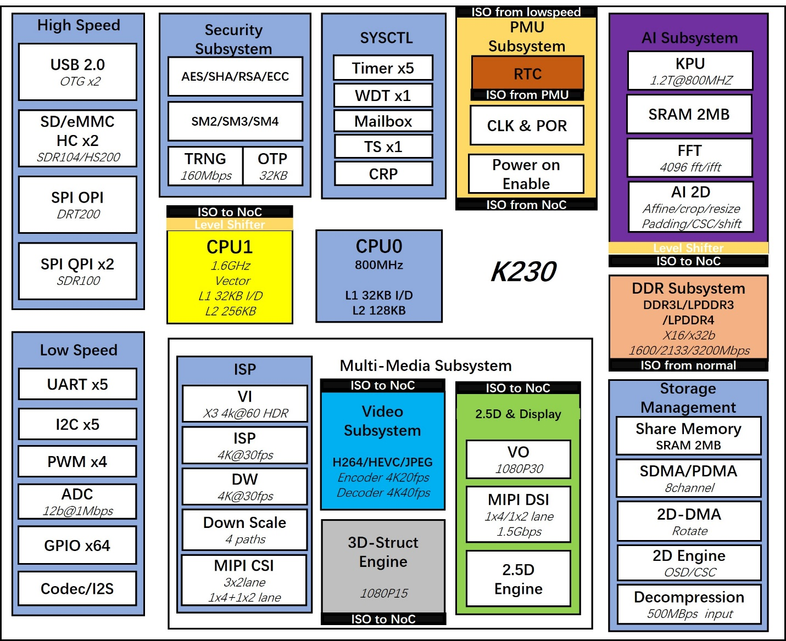
图1-1 K230框图

### 1.2 应用框图

图1-2为K230门锁应用框图
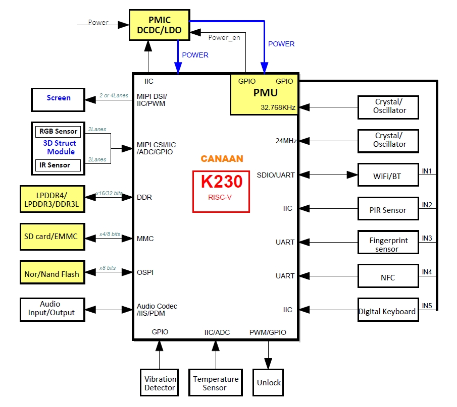
图1-2 K230门锁方案应用框图
图1-3为词典笔方案应用框图
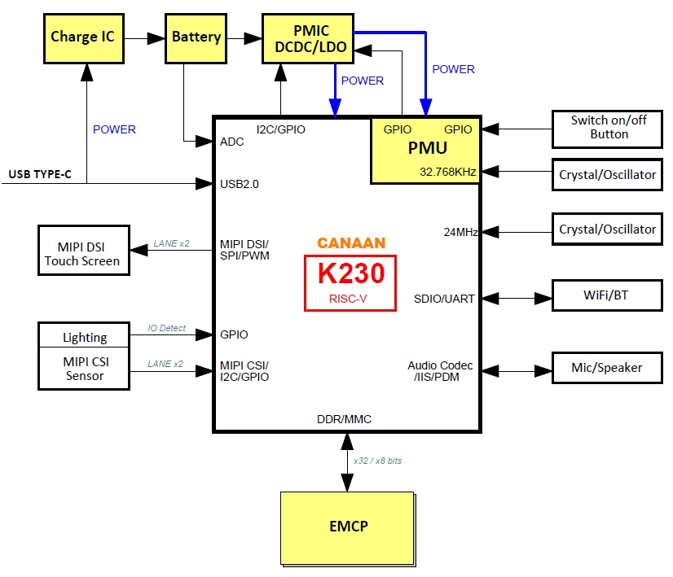
图1-3 K230词典笔方案应用框图

## 2. 封装与管脚

### 2.1 封装

#### 2.1.1 信息

K230的封装信息如下表2-1所示：

| 器件  | 封装     | 大小        | Pitch |
| ----- | -------- | ----------- | ----- |
| K230  | VFBGA390 | 13mm x 13mm | 0.65  |
| K230D | LFBGA256 | 11mm x 11mm | 0.65  |

#### 2.1.2 封装尺寸

##### K230尺寸

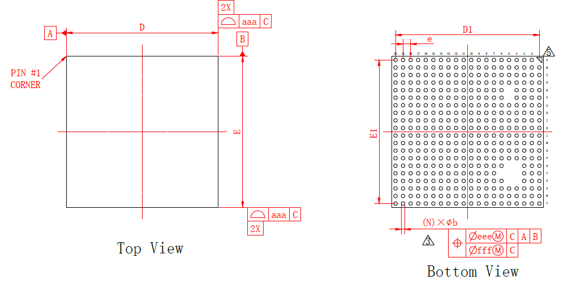
图2-1
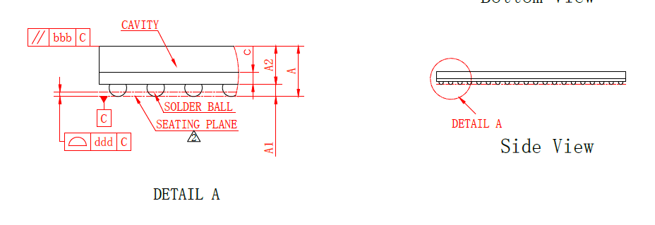
图2-2
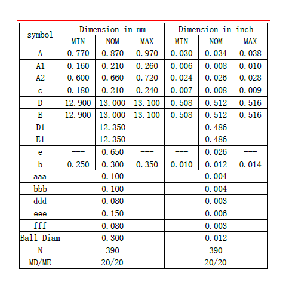
图2-3

球形防焊开口：0.270mm

主要基准C和底面是锡球

尺寸b是测量最大锡球直径，平行于主要基准C

##### K230D尺寸

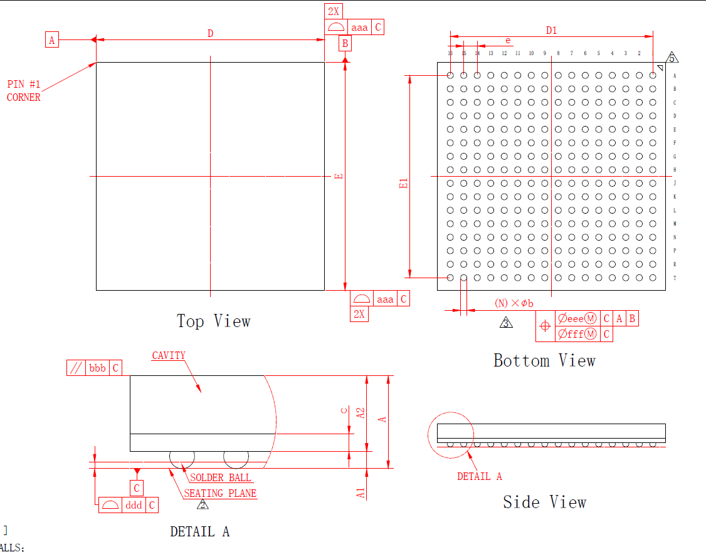
图2-4
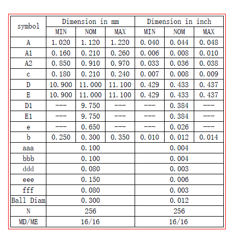
图2-5

球形防焊开口：0.270mm

主要基准C和底面是锡球

尺寸b是测量最大锡球直径，平行于主要基准C

#### 2.1.3 引脚定义图

K230引脚分布图如下：
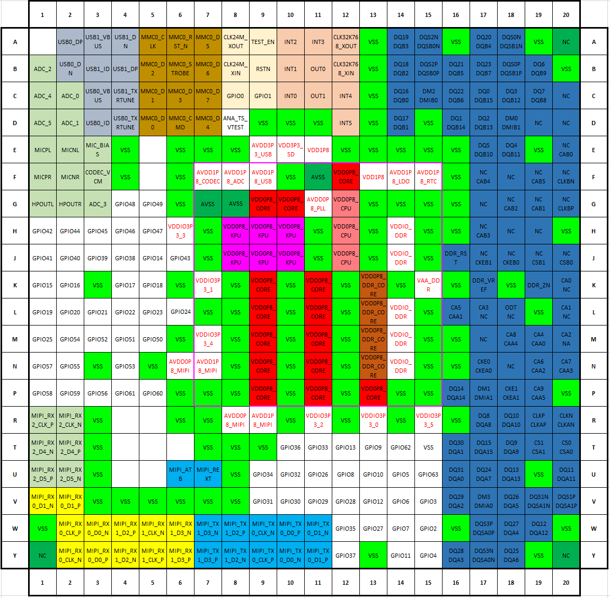
图2-6 K230封装管脚分布

图2-7 K230D封装管脚分布
引脚详情见表[K230_PINOUT_V1.0_20230524.xlsx](K230_PINOUT_V1.0_20230524.xlsx)。

## 3. 原理图设计建议

### 3.1. 最小系统设计

#### 3.1.1 时钟要求

K230的主系统需要24MHz的高速时钟，PMU子系统的RTC需要32.768kHz的低速时钟。

表3-1是K230允许的时钟源参数。

| 频点      | 精度  | 电平 |
| --------- | ----- | ---- |
| 32.768KHz | 20ppm | 1.8V |
| 24MHz     | 20ppm | 1.8V |

建议使用20ppm或精度更高的时钟源提供时钟。

##### 高速时钟

推荐的无源晶体连接方式如图3-1所示。
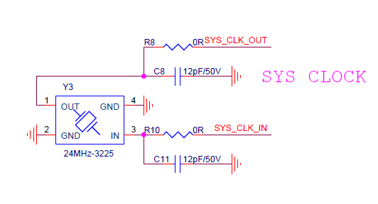
图3-1 K230晶体电路
注意：

- 选用的电容需要与晶振的负载电容匹配，材质建议采用NPO 。
- 建议选用 4Pin 贴片晶振，2个GND管脚与地充分连接，增强系统时钟抗 ESD 干扰能力。
- 如若需要提高起振速度，可在IN管脚和OUT管脚间添加1MΩ电阻。

推荐的有源晶振连接方式如图3-2所示。
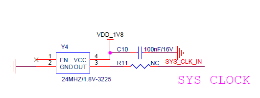
图3-2 K230有源晶振电路
工作时，晶振输出接到K230的CLK24M_XIN 脚，CLK24M_XOUT脚悬空。

##### 低速时钟

K230芯片内置了PMU电路，单板需要给PMU电路提供时钟。推荐的电路如图3-3所示。
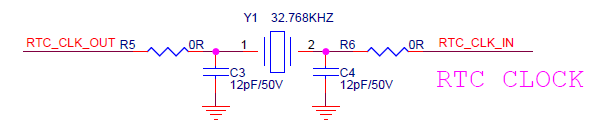
图3-3 K230 RTC时钟无源晶体电路
推荐的有源晶振连接方式如图3-4所示。
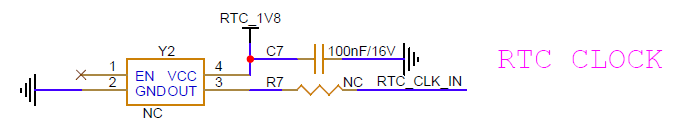
图3-4 K230 RTC时钟有源晶振电路

工作时，晶振输出接到K230的CLK32K768_XIN脚，CLK32K768_XOUT脚悬空。
注意：

- 在使用有源晶振时,以上各有源晶振电路图中NC处需用0Ω电阻连接。

#### 3.1.2 复位电路

K230的硬件复位通过引脚RSTN来实现，低电平有效。
如果使用按键复位，建议复位信号引脚增加100nF电容，用来消除复位信号的抖动，增强抗干扰能力，防止误触发导致的系统异常复位。
复位电路示意图如图3-5。
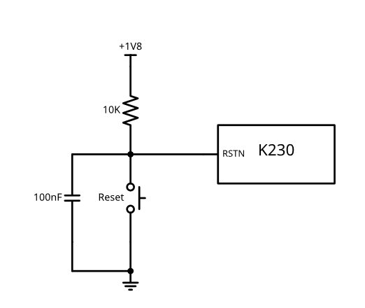
图3-5 K230 复位电路

#### 3.1.3 系统启动引导顺序

K230芯片提供4种启动方式，可以通过BOOT0和BOOT1引脚来进行相关的配置。
表3-2为不同配置下K230的启动方式。

| BOOT0 | BOOT1 | K230       | K230D      |
| ----- | ----- | ---------- | ---------- |
| 0     | 0     | NOR FLASH  | NOR FLASH  |
| 1     | 0     | NAND FLASH | NAND FLASH |
| 0     | 1     | MMC0       | MMC1       |
| 1     | 1     | MMC1       | MMC0       |

表3-2 启动方式说明

注意：

- 四种启动方式都失效时，会跳转到USB/UART启动。

图3-6为推荐的BOOT电路
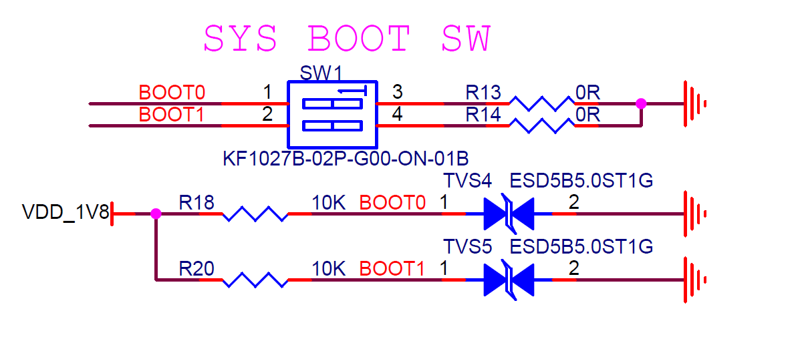
图3-6 K230 BOOT电路

#### 3.1.4 JTAG Debug电路

K230芯片推荐的JTAG接口电路如图3-7。
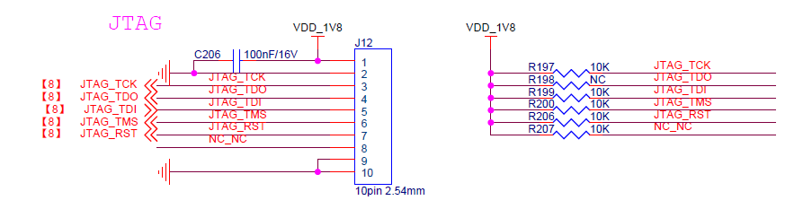
[图3-7 K230 JTAG下载电路
其中，JTAG_TCK、JTAG_TDI、JTAG_TMS和JTAG_RST建议用10kΩ上拉，JTAG_TDO悬空。
K230必须采用平头哥半导体有限公司提供的CKLink系列调试器，否则芯片无法进行调试。

#### 3.1.5 DDR控制器

K230芯片有K230和K230D两个版本，K230版本需单独设计DDR电路。K230D版本将DDR Die一并进行了封装，无需设计外部DDR电路。
K230 DDR控制器有以下特点：

- 支持LPDDR3/LPDDR4
- 支持2 rank
- 支持16位、32位DDR数据总线位宽
- 已验证型号：|  类型  | 型号             | 生产厂商 | 容量 |
  | ------ | ---------------- | -------- | ---- |
  | LPDDR3 | NT6CL128M32DM-H0 | 南亚     | 4Gb  |
  | LPDDR4 | W66AP6NBUAF/G/HI | 华邦     | 4Gb  |

K230 DDR PHY和各个DRAM颗粒的原理图必须和参考原理图一致，包括电源去耦电容。

##### LPDDR3

LPDDR3的电路设计参考图3-8、图3-9、图3-10和图3-11。
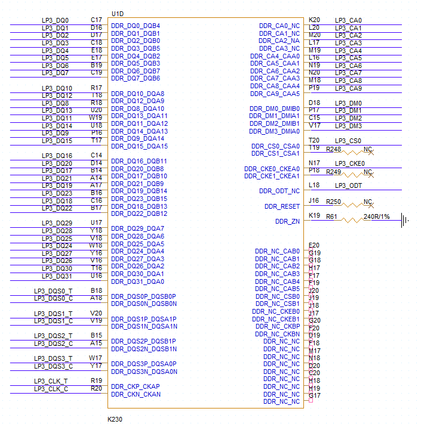
图3-8 K230 LPDDR3电路

图3-9 K230 LPDDR3电源电路
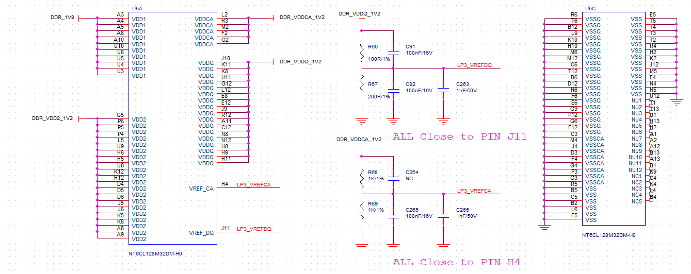
图3-10 LPDDR3颗粒电源电路
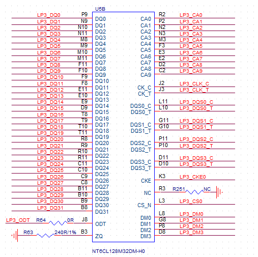
图3-11 LPDDR3颗粒电路

在使用LPDDR3时：

- DDR PHY和各DRAM颗粒原理图需要和参考设计图一致，包含电源去耦电容
- DDR_ZN管脚需要接240Ω（1%）的校准电阻到地
- DDR_RESET管脚悬空
- 芯片已内置DDR控制器的VREF电路，故DDR_VREF管脚需悬空
- LP3颗粒的LP3_VREFDQ电压为0.8V，建议使用100Ω和200Ω (1%)的电阻进行分压得出
- LP3_VREFCA电压为0.6V，建议使用1kΩ(1%)的电阻分压得出
- LP3的CA、CS、CKE、CLK和ODT引脚均需使用100Ω电阻上下拉到DDR_VDDQ_1V2和地

##### LPDDR4

LPDDR4的电路设计参考图3-12、图3-13、图3-14、图3-15和图3-16。
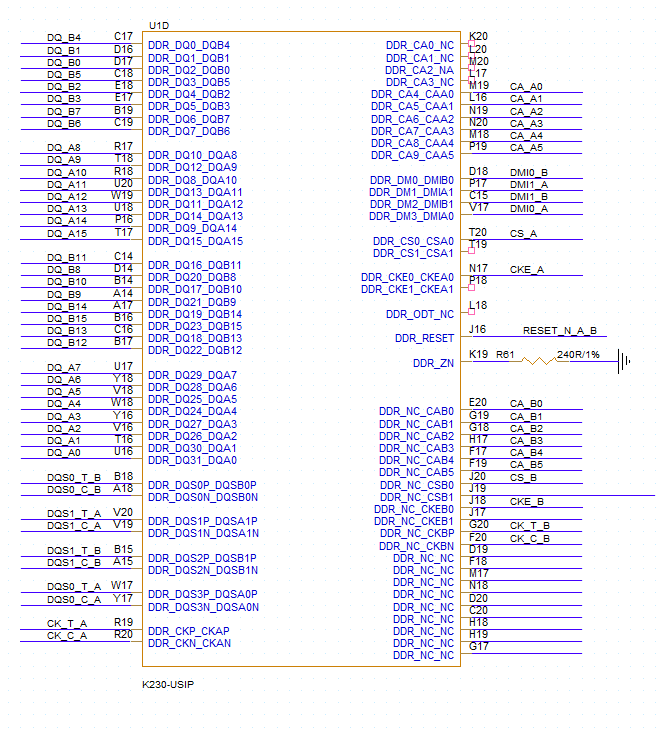
图3-12 K230 LPDDR4电路
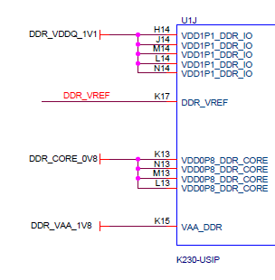
K230 LPDDR4电源电路
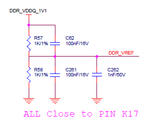
图3-14 K230 LPDDR4参考电压电路  LPDDR4颗粒电路](images/HDG/image026.png)
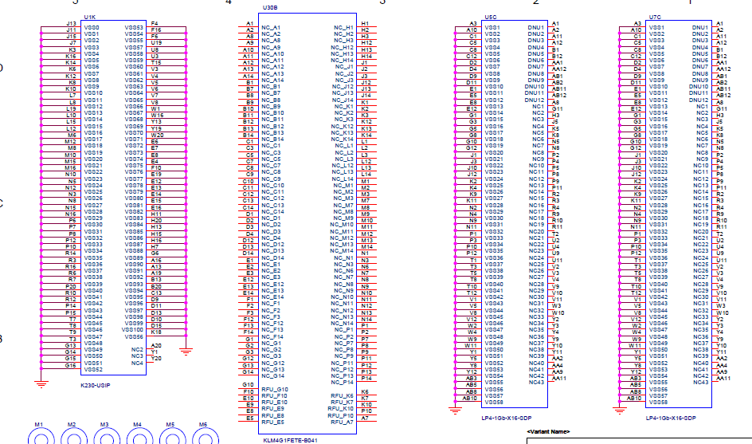
图3-16  LPDDR4颗粒电源电路

在使用LPDDR4时，注意：

- DDR PHY和各DRAM颗粒原理图需要和参考设计图一致，包含电源去耦电容
- DDR_ZN管脚需要接240Ω（1%）的校准电阻到地
- RESRT_N管脚直连到颗粒对应管脚
- K230使用LPDDR4颗粒时，VREF电压为0.6V，建议使用1kΩ(1%)电阻分压

##### K230D DDR模块

K230D已内置DDR Die，因此连接参考电压和校准电阻即可。
参考电路如图3-17和图3-18

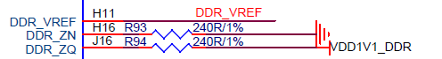
图3-17 K230D DDR外围电路

图3-18 K230D DDR参考电压

在使用K230D的DDR模块时，注意：

- VREF电压为0.55V，建议使用100Ω(1%)电阻分压
- 校准电阻选用240Ω(1%)

#### 3.1.6 FLASH

K230带有OSPI/QSPI控制器，可用来连接FLASH存储芯片，其有以下特点：

- OSPI支持4/8bit模式的NOR FLASH
- OSPI最高支持DDR200,SDR166的NOR FLASH
- QSPI支持1/2/4 bit模式的NAND&NOR FLASH
- QSPI最高支持SDR100的NOR FLASH

##### OSPI

OSPI参考原理图如图3-19和图3-20
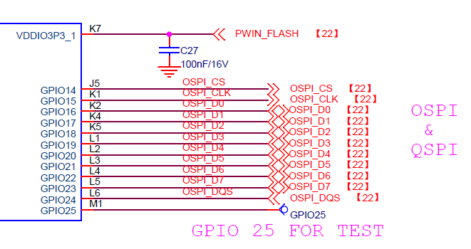
图3-19  K230 OSPI电路
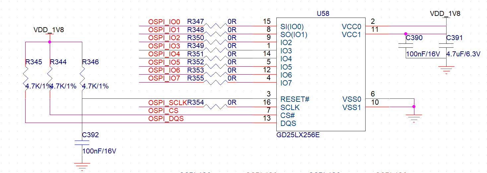
图3-20  OSPI FLASH电路

请根据FLASH芯片的要求放置上拉电阻。

##### QSPI NOR

QSPI信号中,CS、CLK、D0、D1、D2和D3信号的管脚与OSPI对应信号的管脚复用，如表3-3

| QSPI管脚 | OSPI管脚 |
| -------- | -------- |
| QSPI_CS  | OSPI_CS  |
| QSPI_CLK | OSPI_CLK |
| QSPI_D0  | OSPI_D0  |
| QSPI_D1  | OSPI_D1  |
| QSPI_D2  | OSPI_D2  |
| QSPI_D3  | OSPI_D3  |

表3-3 QSPI与OSPI对应管脚

参考电路如图3-21
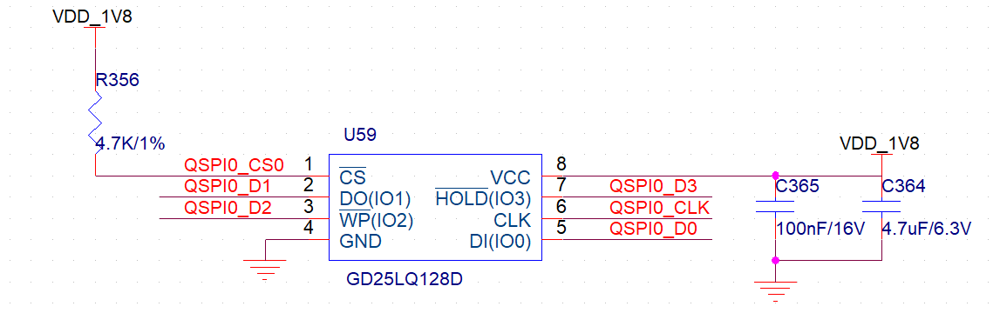
图3-21 QSPI NOR FLASH芯片电路
请根据FLASH芯片的要求放置上拉电阻。

##### QSPI NAND

QSPI NAND的参考电路如图3-22。
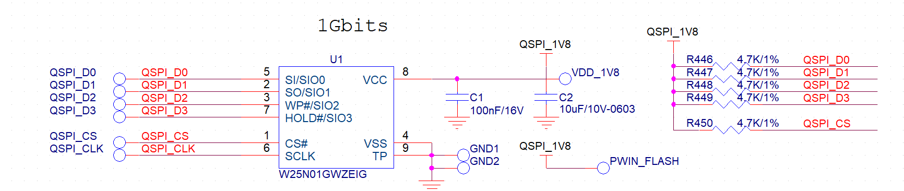
图3-22 QSPI NAND FLASH芯片电路
请根据FLASH芯片的要求放置上拉电阻。

### 3.2. MMC电路

K230 eMMC 控制电路拥有两个控制器MMC0和MMC1。

#### MMC0

MMC0控制器有以下特点：

- 支持SDIO3.0，工作于4/1-bits mode，最高支持SDR104
- 支持eMMC5.0工作于8/4/1-bits mode，支持HS200
- 支持SD卡所需3.3V和1.8V电压的转换

MMC0功能较全，一般用于控制eMMC电路。
eMMC推荐参考电路如图3-23和图3-24。

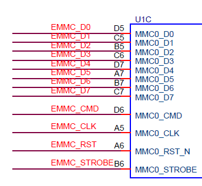
图3-23 K230 eMMC电路
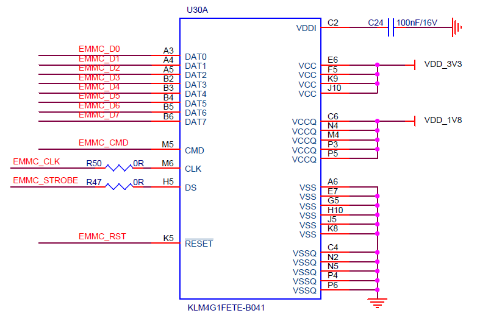
图3-24 eMMC颗粒电路

请按照eMMC厂家要求连接对应管脚。如无特殊要求，直连对应管脚即可。

#### MMC1

MMC1控制器有以下特点：

- 支持SDIO3.0，工作于4/1-bits mode，最高支持SDR104
- 支持SD卡所需3.3V和1.8V电压的转换

MMC1接口性能和管脚数量无法满足控制eMMC电路的要求，只能用于控制SD/TF卡电路。
参考原理图如图3-25、图3-26和图3-27。

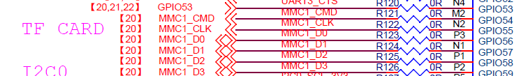
图3-25 K230 SD卡接口电路
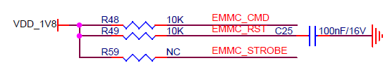
图3-26 SD卡上拉电路
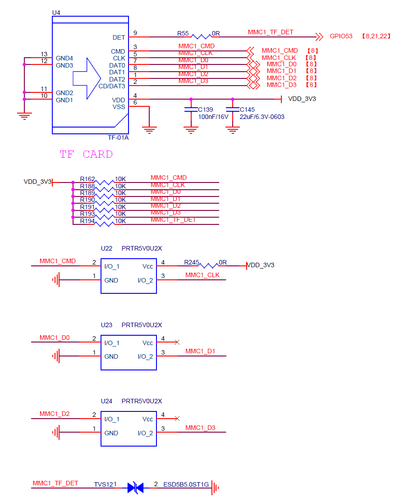
图3-27 SD卡卡座电路

SD卡电路设计时需注意：

- SD卡引脚的电压去耦电容不得删减，要靠近卡座放置
- 各信号在SD卡座附近均需放置ESD器件
- 各信号均需上拉电阻
- 推荐根据参考电路进行设计

### 3.3.  USB电路

K230芯片内置两个USB2.0 OTG控制器，控制器有以下特点：

- 支持USB2.0协议，向下兼容USB 1.1 协议
- 支持Host模式或者Device模式，可选支持动态切换
- Host模式支持480Mbps,12Mbps,1.5Mbps 传输速率
- Device模式支持480Mbps,12Mbps传输模式

USB电路参考原理图如图3-28和图3-29.

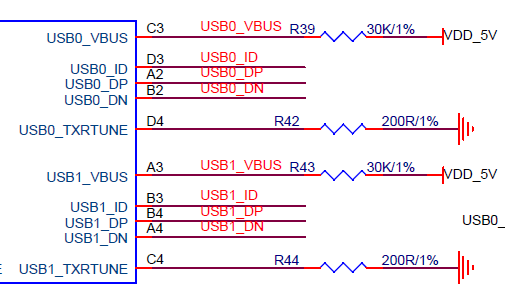
图3-28 K230 USB电路
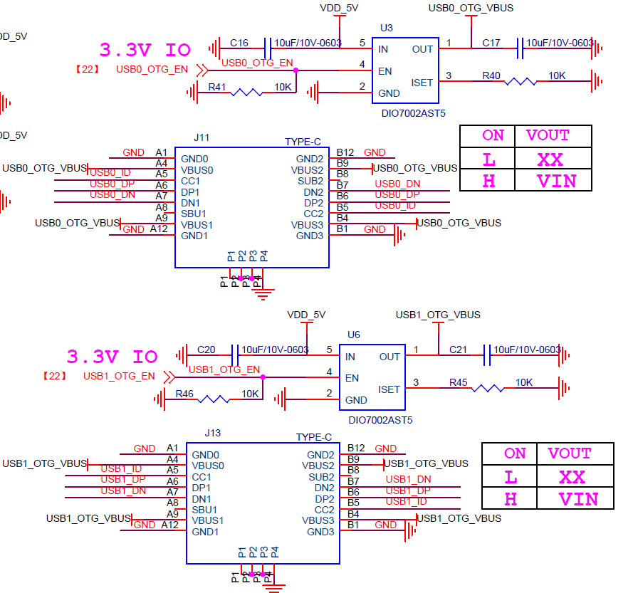
图3-29 USB接口电路

注意：

- 各信号在USB座附近均需放置ESD器件
- K230的USB_VBUS电源，必须串联30kΩ(1%)电阻到5V电源，不能直接连接电源
- 为保证信号质量，K230的USB_TXRTUNE管脚必须接200Ω(1%)电阻到地
- USB_ID可用于OTG设备的身份识别，其接地时，K230作为HOST端，其浮空或拉高时，K230作SLAVE端

### 3.4.  音频电路

#### 3.4.1 I2S

K230芯片有一个I2S控制器，其有以下特点：

- 拥有两路输入和输出
- 支持PHILIP I2S标准
- 支持左右、PCM格式
- 同步工作模式
- 主或从模式可选
- 可调接口电压
- 采样速率8k到384kHz

I2S接口拥有3个引脚分别是I2S_CLK、I2S_WS和I2S_SD。
I2S_CK是串行时钟信号，I2S_WS是数据帧控制信号， I2S_SD是串行数据信号。
I2S接口通常用于连接解码器等音频外设。
图3-30和图3-31为K230 I2S接口电路和部分外设电路。
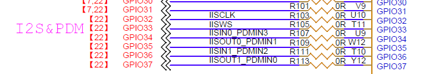
图3-30 K230 I2S接口电路
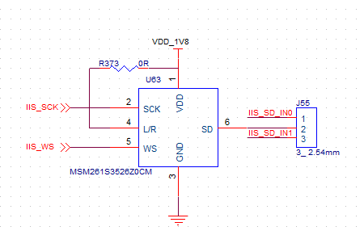
图3-31 K230 I2S参考外设

#### 3.4.2 PDM

K230支持4路PDM信号输入。采样速率从8k到384kHz。
PDM接口通常用于接入数字麦克风等具有PDM接口的音频设备。
图3-32为K230的PDM外设电路。
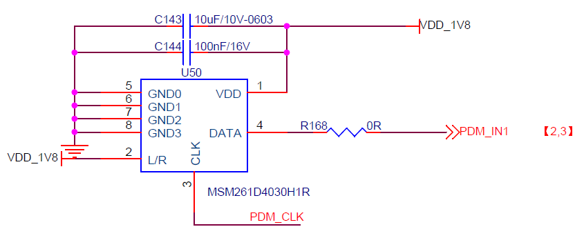
图3-32 K230 PDM外设电路

#### 3.4.3 模拟音频接口

K230芯片的模拟音频部分有以下特点：

- 支持2路DAC和2路ADC
- DAC支持差分输出和单端输出，ADC支持差分输入和单端输入
- 支持低噪声模拟麦克风偏置输出

模拟音频的参考电路如图3-33和图3-34
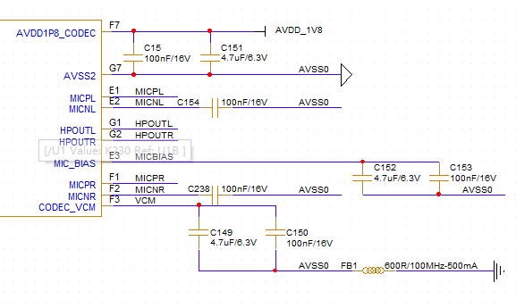
图3-33 K230 模拟音频接口电路
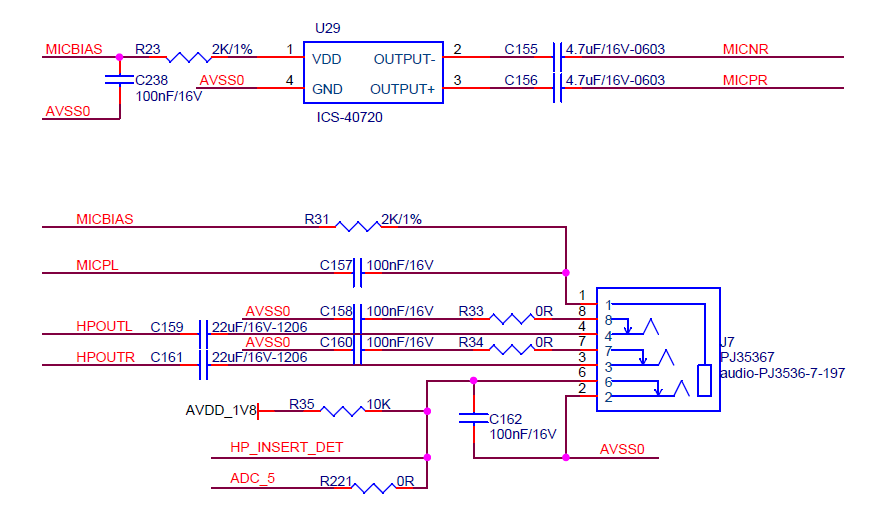
图3-34 音频接口电路

注意，为获得更好的音质，建议考虑使用以下措施：

- 电源引脚同时使用大容量和小容量的低ESR陶瓷电容
- MICBIAS管脚需要放置大容量低ESR电容
- 音频输入的隔直电容靠近K230芯片放置
- 输出管脚需要放置滤波电路或隔直电容

### 3.5.  视频电路

#### 3.5.1 MIPI DSI

K230的MIPI DSI控制器有以下特点：

- 支持1路信号输出
- 支持1/2/4lane 模式
- 最高速率可达1.5Gbps

MIPI DSI各信号均直连。
参考硬件设计如图3-35和图3-36

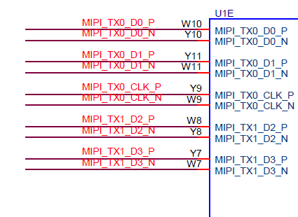
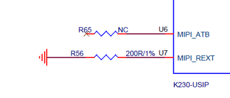
图3-35 K230 MIPI DSI接口电路
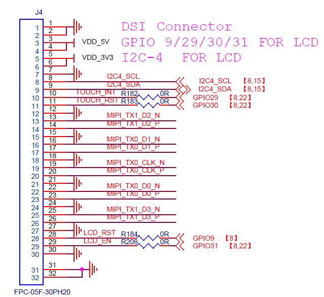
图3-36 屏幕接口电路
注意：

- MIPI_ATB引脚必须浮空
- MIPI_REXT引脚必须接200Ω(1%)电阻到地
- 该连接器电路各引脚仅适配今朝辉屏幕，请根据自有屏幕模组设计电路

### 3.6.  摄像头电路

#### 3.6.1 MIPI CSI

K230的MIPI CSI控制器有以下特点：

- 最高支持3路MIPI信号输入，支持1/2/4lane 模式
- 最高可配置为3路2lane信号输入或1路4lane、1路2lane信号输入
- 最高速率可达1.5Gbps

MIPI CSI信号推荐直连。
参考硬件设计如图3-37和图3-38
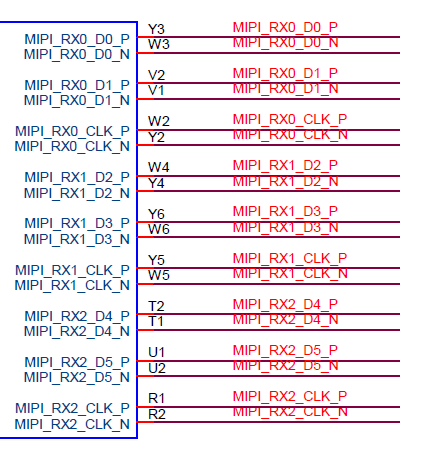
图3-37 K230 MIPI CSI接口电路
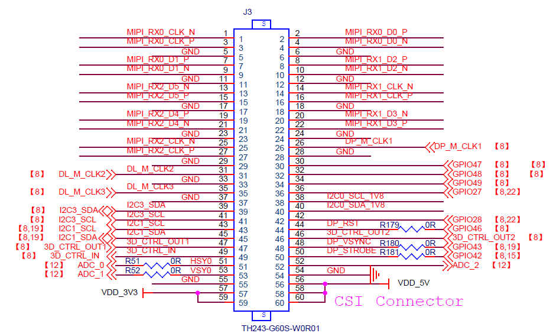
图3-38 摄像头连接器电路
注意：

- 该连接器电路仅供内部测试使用，实际使用请根据需要自行设计电路

### 3.7.  低速子系统电路

#### 3.7.1 I2C电路

K230芯片支持5路I2C接口，具有以下功能：

- 支持I2C总线主模式
- 支持7/10 bit地址
- 支持I2C速率最高到3.4Mbit/s

在使用I2C外设时，需要注意对应电源域供电，必须保持一致。
I2C信号的SCL和SDA需要外接上拉电阻，根据总线负载和总线速率的不同，选择不同阻值的电阻。

- 在不大于400kb/s的系统中，推荐阻值为4.7kΩ；
- 在大于400kb/s小于3.4Mb/s的系统中，推荐上拉电阻为2.2 kΩ。

#### 3.7.2 UART电路

K230支持5路UART信号，其具有以下特点：

- 支持2线UART和4线UART
- 支持RS485接口
- 支持波特率最高可达3.125M
- 支持软硬件流控，符合16750标准
- 支持IrDA 1.0 SIR接收

在使用UART外设时，需要注意对应电源域供电，必须保持一致。

#### 3.7.3 PWM电路

K230支持6路PWM信号，其有以下特点：

- 支持任意占空比
- 支持输出波形可编程
- 支持产生周期性的脉冲信号和一次性的脉冲信号
- 可作为周期精确的中断发生器
- 支持输出毛刺消除

#### 3.7.4 MCLK电路

K230支持输出3路MCLK信号。该信号可作为摄像头的驱动时钟。
支持输出时钟频率如表3-4：

|        |        |      |      |      |      |      |      |
| :----: | :----: | :---: | :---: | :---: | :---: | :---: | :---: |
|  792  |  132  | 66.67 | 46.59 |  36  | 28.57 | 23.76 | 18.56 |
|  594  | 118.8 |  66  | 45.69 | 34.94 | 28.29 | 23.53 | 18.18 |
|  400  | 113.14 |  66  | 44.44 | 34.43 | 28.29 | 22.85 | 17.39 |
|  396  |  100  | 60.92 |  44  | 33.33 | 27.31 | 22.22 | 16.67 |
|  297  |   99   | 59.4 | 42.43 |  33  |  27  |  22  |  16  |
|  264  |   99   | 57.14 | 41.68 |  33  | 26.67 | 21.21 | 15.38 |
|  200  |   88   | 56.57 |  40  | 31.68 | 26.4 | 21.05 | 14.81 |
|  198  | 84.86 |  54  | 39.6 | 31.26 | 25.83 | 20.48 | 14.29 |
|  198  |   80   | 52.8 | 39.6 | 30.77 | 25.55 |  20  | 13.79 |
| 158.4 |  79.2  |  50  | 37.71 | 30.46 |  25  | 19.8 | 13.33 |
| 148.5 | 74.25 | 49.5 | 37.13 | 29.7 | 24.75 | 19.16 | 12.9 |
| 133.33 |   72   | 49.5 | 36.36 | 29.33 | 24.75 | 19.05 | 12.5 |

表3-4 MCLK输出时钟频率（单位：MHz）

#### 3.7.5 ADC电路

K230集成了一个分辨率为11bit（有效分辨率）的SARADC，最高采样率不小于1MHz。
其有以下特点：

- 信号输入范围：0-1.8V
- 支持6个通道输入
- 支持单次采样和连续采样
- 内部集成信号调理电路，截止频率在1/2带宽处。ADC可直接进行信号采样，或按需进行外围电路设计

#### 3.7.6 PMU电路

K230的PMU模块用于控制管理芯片内部和外部电源。
其内置RTC电路，支持6路输入。其功能如表:

| 中断源 | 沿触发 | 电平触发 | 去抖动 | 边沿数量检测 | 长短按检测 |
| :----: | :----: | :------: | :----: | :----------: | :--------: |
| INT_0 |  支持  |   支持   |  支持  |      -      |    支持    |
| INT_1 |  支持  |   支持   |  支持  |     支持     |     -     |
| INT_2 |  支持  |   支持   |   -   |      -      |     -     |
| INT_3 |  支持  |   支持   |   -   |      -      |     -     |
| INT_4 |   -   |   支持   |   -   |      -      |     -     |
| INT_5 |   -   |   支持   |   -   |      -      |     -     |

支持两路输出OUT0和OUT1，可用于使能电源。
在冷启动状态，PMU仅使能了INT0的长按中断和INT4的高电平输入中断，作为PMU模块启动的触发源。OUT0和OUT1默认输出低电平，初始下拉电阻约为40Ω。
在收到以上两种中断之一时，OUT0拉高，OUT1约50ms后拉高。
OUT0和OUT1可用于控制外部PMIC的使能管脚或用于其他用途。

### 3.8.  电源设计

#### 3.8.1 K230电源需求

| 模块          | 电源管脚        | 描述                                                    |
| ------------- | --------------- | ------------------------------------------------------- |
| CORE          | VDD0P8_CORE     | CPU0和其他单元电源                                      |
| CPU           | VDD0P8_CPU      | CPU1电源                                                |
| KPU           | VDD0P8_KPU      | KPU电源                                                 |
| DDR控制器     | VDD0P8_DDR_CORE | DDR的数字CORE电源,可掉电                                |
|               | VDD1P1_DDR_IO   | DDR的IO电源                                             |
|               | VAA_DDR         | DDR锁相环电源                                           |
| USB           | AVDD3P3_USB     | USB PHY使用的3.3V电源，不使用时可不上电                 |
|               | AVDD1P8_USB     | USB PHY使用的1.8V电源，不使用时可不上电                 |
| PLL           | AVDD0P8_PLL     | PLL电源                                                 |
| MIPI          | AVDD0P8_MIPI    | MIPI 0.8V电源，不使用时可不上电                         |
|               | AVDD1P8_MIPI    | MIPI 1.8V电源，不使用时可不上电                         |
| VDD1P8        | VDD1P8          | 1.8V模块电源                                            |
| ADC           | AVDD1P8_ADC     | ADC电源，不使用时可不上电                               |
| CODEC         | AVDD1P8_CODEC   | CODEC电源，不使用时可不上电                             |
| PMU           | AVDD1P8_RTC     | PMU内置RTC电源，不使用时可不上电                        |
|               | AVDD1P8_LDO     | PMU内置LDO电源，不使用时可不上电                        |
| MMC           | VDD3P3_SD       | 3.3V输出buffer和pre-buffer I/O电源，不使用时可不上电    |
| IO            | VDDIO3P3_0      | IO_2-IO_13电源，电压可选择1.8V或3.3V，不使用时可不上电  |
|               | VDDIO3P3_1      | IO_14-IO_25电源，电压可选择1.8V或3.3V，不使用时可不上电 |
|               | VDDIO3P3_2      | IO_26-IO_37电源，电压可选择1.8V或3.3V，不使用时可不上电 |
|               | VDDIO3P3_3      | IO_38-IO_49电源，电压可选择1.8V或3.3V，不使用时可不上电 |
|               | VDDIO3P3_4      | IO_50-IO_61电源，电压可选择1.8V或3.3V，不使用时可不上电 |
|               | VDDIO3P3_5      | IO_62-IO_63电源，电压可选择1.8V或3.3V，不使用时可不上电 |
| K230D DDR部分 | VDD1P8_DDR_VDD1 | K230D中DDR颗粒电源，K230没有此管脚                      |
|               | VDD1P1_DDR_VDD2 | K230D中DDR颗粒电源，K230没有此管脚，不可掉电            |
|               | VDD1P1_DDR_VDDQ | K230D中DDR颗粒电源，K230没有此管脚，可掉电              |

表3-6 K230电源需求表

#### 3.8.2 上电时序

VDD0P8_CORE上电必须早于VDD1P8、VDDIO3P3_0到VDDIO3P3_5的IO接口上电，AVDD0P8_MIPI上电必须早于AVDD1P8_MIPI，AVDD1P8_RTC不晚于AVDD1P8_LDO，其余顺序无要求。

#### 3.8.3 电源设计建议

##### PMU

| 模块名称 | 管脚        | 最小电压(V) | 典型电压 (V) | 最大电压(V) | 电流 (mA) | 注意事项        |
| -------- | ----------- | ----------- | ------------ | ----------- | --------- | --------------- |
| PMU      | AVDD1P8_RTC | 1.674       | 1.8          | 1.98        | 10        | 建议使用LDO供电 |
|          | AVDD1P8_LDO | 1.674       | 1.8          | 1.98        | 10        | 建议使用LDO供电 |

##### 核心模块

| 模块名称 | 管脚        | 最小电压(V) | 典型电压 (V) | 最大电压(V) | 电流 (mA) | 注意事项                                      |
| -------- | ----------- | ----------- | ------------ | ----------- | --------- | --------------------------------------------- |
| CORE     | VDD0P8_CORE | 0.72        | 0.8          | 0.88        | 2250      | 建议使用供电能力不小于3A，纹波噪声较低的DC/DC |
| CPU      | VDD0P8_CPU  | 0.72        | 0.8          | 0.88        | 1000      | 建议使用供电能力不小于2A，纹波噪声较低的DC/DC |
| KPU      | VDD0P8_KPU  | 0.72        | 0.8          | 0.88        | 3000      | 建议使用供电能力不小于4A，纹波噪声较低的DC/DC |

##### DDR

| 模块名称 | 管脚                  | 最小电压(V) | 典型电压 (V) | 最大电压(V) | 电流 (mA) | 注意事项                                              |
| -------- | --------------------- | ----------- | ------------ | ----------- | --------- | ----------------------------------------------------- |
| DDR      | VDD0P8_DDR_CORE       | 0.744       | 0.8          | 0.88        | 400       | 电源纹波要求在4%以内，建议使用可输出大电流的低噪声LDO |
|          | VDD1P1_DDR_IO(LPDDR4) | 1.06        | 1.1          | 1.17        | 800       | LP4纹波要求5%以内，建议使用可输出大电流的低噪声LDO    |
|          | VDD1P1_DDR_IO(LPDDR3) | 1.14        | 1.2          | 1.3         | 800       | LP3纹波要求10%以内，建议使用可输出大电流的低噪声LDO   |
|          | VAA_DDR               | 1.674       | 1.8          | 1.98        | 10        | 纹波要求在典型电压5%以内                              |

##### K230D DDR Die

| 模块名称      | 管脚            | 最小电压(V) | 典型电压 (V) | 最大电压(V) | 电流 (mA) | 注意事项                                                |
| ------------- | --------------- | ----------- | ------------ | ----------- | --------- | ------------------------------------------------------- |
| K230D DDR die | VDD1P8_DDR_VDD1 | 1.7         | 1.8          | 1.95        | 75        | 纹波要求在典型电压5%以内，与DDR控制器电源在同一电源网络 |
|               | VDD1P1_DDR_VDD2 | 1.06        | 1.1          | 1.17        | 450       | 与VDD1P1_DDR_IO在同一电源网络                           |
|               | VDD1P1_DDR_VDDQ | 1.06        | 1.1          | 1.17        | 300       | 建议使用可输出大电流的低噪声LDO                         |

##### I/O

| 模块名称 | 管脚       | 最小电压(V) | 典型电压 (V) | 最大电压(V) | 电流 (mA) | 注意事项                                                                                                                                                                                   |
| -------- | ---------- | ----------- | ------------ | ----------- | --------- | ------------------------------------------------------------------------------------------------------------------------------------------------------------------------------------------ |
| IO       | VDDIO3P3_0 | 1.62/2.97   | 1.8/3.3      | 1.98/3.63   | 50        | IO单元共有5组电压,均可配置为1.8V或3.3V，每组电压控制了该组I/O口的输出电压和输入电压，也控制I/O复用后功能的输出电压和输入电压。IO电压请与所需连接的外设保持一致，如不一致则需进行电平转换。 |
|          | VDDIO3P3_1 | 1.62/2.97   | 1.8/3.3      | 1.98/3.63   | 50        |                                                                                                                                                                                            |
|          | VDDIO3P3_2 | 1.62/2.97   | 1.8/3.3      | 1.98/3.63   | 50        |                                                                                                                                                                                            |
|          | VDDIO3P3_3 | 1.62/2.97   | 1.8/3.3      | 1.98/3.63   | 50        |                                                                                                                                                                                            |
|          | VDDIO3P3_4 | 1.62/2.97   | 1.8/3.3      | 1.98/3.63   | 50        |                                                                                                                                                                                            |
|          | VDDIO3P3_5 | 1.62/2.97   | 1.8/3.3      | 1.98/3.63   | 50        |                                                                                                                                                                                            |

##### USB

| 模块名称 | 管脚        | 最小电压(V) | 典型电压 (V) | 最大电压(V) | 电流 (mA) | 注意事项            |
| -------- | ----------- | ----------- | ------------ | ----------- | --------- | ------------------- |
| USB      | AVDD3P3_USB | 3.07        | 3.3          | 3.63        | 50        | 建议使用LDO进行供电 |
|          | AVDD1P8_USB | 1.674       | 1.8          | 1.98        | 60        | 建议使用LDO进行供电 |

##### PLL

| 模块名称 | 管脚        | 最小电压(V) | 典型电压 (V) | 最大电压(V) | 电流 (mA) | 注意事项                  |
| -------- | ----------- | ----------- | ------------ | ----------- | --------- | ------------------------- |
| PLL      | AVDD0P8_PLL | 0.72        | 0.8          | 0.88        | 120       | 建议使用高精度LDO进行供电 |

##### MIPI

| 模块名称 | 管脚         | 最小电压(V) | 典型电压 (V) | 最大电压(V) | 电流 (mA) | 注意事项            |
| -------- | ------------ | ----------- | ------------ | ----------- | --------- | ------------------- |
| MIPI     | AVDD0P8_MIPI | 0.744       | 0.8          | 0.88        | 100       | 建议使用LDO进行供电 |
|          | AVDD1P8_MIPI | 1.674       | 1.8          | 1.98        | 30        | 建议使用LDO进行供电 |

##### ADC

| 模块名称 | 管脚        | 最小电压(V) | 典型电压 (V) | 最大电压(V) | 电流 (mA) | 注意事项                  |
| -------- | ----------- | ----------- | ------------ | ----------- | --------- | ------------------------- |
| ADC      | AVDD1P8_ADC | 1.62        | 1.8          | 1.98        | 10        | 建议使用高精度LDO进行供电 |

##### CODEC

| 模块名称 | 管脚          | 最小电压(V) | 典型电压 (V) | 最大电压(V) | 电流 (mA) | 注意事项                  |
| -------- | ------------- | ----------- | ------------ | ----------- | --------- | ------------------------- |
| CODEC    | AVDD1P8_CODEC | 1.62        | 1.8          | 1.98        | 100       | 建议使用高精度LDO进行供电 |

##### 其他

| 模块名称 | 管脚      | 最小电压(V) | 典型电压 (V) | 最大电压(V) | 电流 (mA) | 注意事项 |
| -------- | --------- | ----------- | ------------ | ----------- | --------- | -------- |
| 其他     | VDD3P3_SD | 2.7         | 3.3          | 3.63        | 50        |          |
|          | VDD1P8    | 1.62        | 1.8          | 1.98        | 500       |          |

注意：

- 对于K230需要使用的DDR颗粒，电源需与主芯片电源在同一电源网络。
- 在满足电压精度要求和电流要求的情况下，电压要求相同的模块可使用同一电压源。对于精度要求不高的场合，ADC等模拟模块也可在隔离后接入数字模块所使用的的电源。
- K230内部集成DDR_Vref电源给芯片DDR控制器，对于外部颗粒，LPDDR3的VREF电源参考设计如图3-39

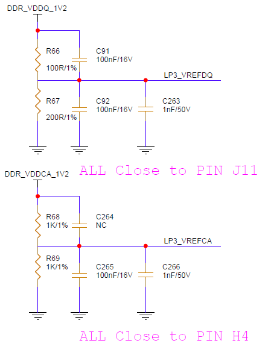
图3-39 LPDDR3颗粒Vref电路

分压电阻建议使用精度为±1%的电阻。
LPDDR4的外部颗粒VREF电源参考设计如图3-40。

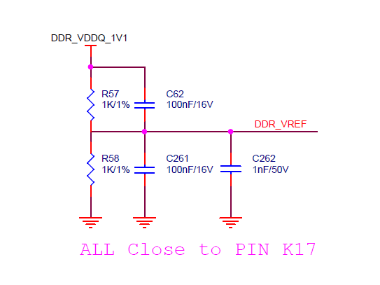
图3-40 LPDDR4颗粒Vref电路

K230D的DDR模块VREF电源参考设计如图3-41

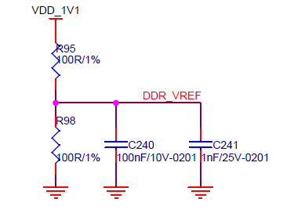
图3-41 K230D版本DDR Vref电路

#### 3.8.4 动态调压

K230的CPU和KPU电源支持动态调压，以确保同时满足高性能和低功耗的需求。
CPU的可调电压节点如表3-7

| 电压节点    | 电压(V) |
| ----------- | ------- |
| V_typical   | 0.8     |
| V_high      | 0.9     |
| V_ultrahigh | 1.0     |
| V_low       | 0.7     |
| V_retention | 0.48    |

表3-8 CPU可调电压节点

其中，V_retention是针对DDR retention功能的电压节点。
KPU的可调电压节点如表3-8

| 电压节点    | 电压(V) |
| ----------- | ------- |
| V_typical   | 0.8     |
| V_high      | 0.9     |
| V_ultrahigh | 1.0     |
| V_low       | 0.7     |

表3-9 KPU可调电压节点

## 4. PCB设计建议

### 4.1高速PCB设计建议

#### 4.1.1 DDR设计

阻抗控制：DDR单线60Ω，差分（时钟clk，数据dqs）120Ω；
串扰要求：遵循3W原则
等长要求：同类型信号线经过过孔数量保持一致；
芯片内部DDR走线长度如表4-1，在PCB走线时务必考虑，保证内外走线之和满足等长要求。
PCB设计强烈建议参考K230 EVB的设计，包括走线和电容的选型及摆放。

| 管脚编号 | 管脚名称         | 长度(μm) | 长度(mil) |
| -------- | ---------------- | --------- | --------- |
| N17      | DDR_CKE0_CKEA0   | 3725.8    | 146.8     |
| P18      | DDR_CKE1_CKEA1   | 4338.56   | 170.94    |
| T20      | DDR_CS0_CSA0     | 5839.03   | 230.06    |
| T19      | DDR_CS1_CSA1     | 5528.07   | 217.81    |
| R19      | DDR_CKP_CKAP     | 6252.24   | 246.34    |
| R20      | DDR_CKN_CKAN     | 6050.13   | 238.38    |
| N18      | DDR_NC_NC        | 3937.42   | 155.13    |
| M17      | DDR_NC_NC        | 1925.8    | 75.88     |
| P19      | DDR_CA9_CAA5     | 5809.3    | 228.89    |
| M18      | DDR_CA8_CAA4     | 4033.87   | 158.93    |
| N20      | DDR_CA7_CAA3     | 4888.23   | 192.6     |
| N19      | DDR_CA6_CAA2     | 4415.08   | 173.95    |
| L16      | DDR_CA5_CAA1     | 2171.4    | 85.55     |
| M19      | DDR_CA4_CAA0     | 4599.65   | 181.23    |
| L17      | DDR_CA3_NC       | 2258.98   | 89        |
| M20      | DDR_CA2_NA       | 4190.42   | 165.1     |
| L20      | DDR_CA1_NC       | 5108.55   | 201.28    |
| K20      | DDR_CA0_NC       | 4832.33   | 190.39    |
| L18      | DDR_ODT_NC       | 3849.11   | 151.65    |
| J18      | DDR_NC_CKEB0     | 2599.43   | 102.42    |
| J17      | DDR_NC_CKEB1     | 2792.84   | 110.04    |
| J19      | DDR_NC_CSB1      | 4018.49   | 158.33    |
| J20      | DDR_NC_CSB0      | 4941.35   | 194.69    |
| G20      | DDR_NC_CKBP      | 5403.63   | 212.9     |
| F20      | DDR_NC_CKBN      | 5418.33   | 213.48    |
| H18      | DDR_NC_NC        | 4350.39   | 171.41    |
| H19      | DDR_NC_NC        | 4900.25   | 193.07    |
| E20      | DDR_NC_CAB0      | 5468.25   | 215.45    |
| G19      | DDR_NC_CAB1      | 4067.91   | 160.28    |
| G18      | DDR_NC_CAB2      | 3807.29   | 150.01    |
| H17      | DDR_NC_CAB3      | 3113.45   | 122.67    |
| F17      | DDR_NC_CAB4      | 2757.73   | 108.65    |
| F19      | DDR_NC_CAB5      | 4558.27   | 179.6     |
| D20      | DDR_NC_NC        | 6535.69   | 257.51    |
| G17      | DDR_NC_NC        | 3477.72   | 137.02    |
| D19      | DDR_NC_NC        | 5257.59   | 207.15    |
| F18      | DDR_NC_NC        | 4584.72   | 180.64    |
| C20      | DDR_NC_NC        | 6979.27   | 274.98    |
| U17      | DDR_DQ29_DQA7    | 4829.45   | 190.28    |
| Y18      | DDR_DQ28_DQA6    | 6467.43   | 254.82    |
| V18      | DDR_DQ25_DQA5    | 5047.5    | 198.87    |
| W18      | DDR_DQ24_DQA4    | 5267.44   | 207.54    |
| Y16      | DDR_DQ27_DQA3    | 5846.86   | 230.37    |
| V16      | DDR_DQ26_DQA2    | 4311.64   | 169.88    |
| T16      | DDR_DQ30_DQA1    | 3576.39   | 140.91    |
| U16      | DDR_DQ31_DQA0    | 3132.83   | 123.43    |
| V17      | DDR_DM3_DMIA0    | 4110.44   | 161.95    |
| W17      | DDR_DQS3P_DQSA0P | 6342.48   | 249.89    |
| Y17      | DDR_DQS3N_DQSA0N | 6135.17   | 241.73    |
| R17      | DDR_DQ10_DQA8    | 4018.24   | 158.32    |
| T18      | DDR_DQ12_DQA9    | 5760.1    | 226.95    |
| R18      | DDR_DQ8_DQA10    | 4540.62   | 178.9     |
| U20      | DDR_DQ13_DQA11   | 5625.11   | 221.63    |
| W19      | DDR_DQ11_DQA12   | 6897.92   | 271.78    |
| U18      | DDR_DQ14_DQA13   | 4908.14   | 193.38    |
| P16      | DDR_DQ9_DQA14    | 2036.92   | 80.25     |
| T17      | DDR_DQ15_DQA15   | 4492.07   | 176.99    |
| P17      | DDR_DM1_DMIA1    | 4129.14   | 162.69    |
| V20      | DDR_DQS1P_DQSA1P | 7005.11   | 276       |
| V19      | DDR_DQS1N_DQSA1N | 6768.98   | 266.7     |
| C17      | DDR_DQ0_DQB4     | 4038.16   | 159.1     |
| D16      | DDR_DQ1_DQB1     | 3663.33   | 144.34    |
| D17      | DDR_DQ2_DQB0     | 4242.29   | 167.15    |
| C18      | DDR_DQ3_DQB5     | 5598.19   | 220.57    |
| E18      | DDR_DQ4_DQB2     | 3830.51   | 150.92    |
| E17      | DDR_DQ5_DQB3     | 4273.06   | 168.36    |
| B19      | DDR_DQ6_DQB7     | 6879.01   | 271.03    |
| C19      | DDR_DQ7_DQB6     | 6640.84   | 261.65    |
| D18      | DDR_DM0_DMIB0    | 5275.38   | 207.85    |
| B18      | DDR_DQS0P_DQSB0P | 6516.79   | 256.76    |
| A18      | DDR_DQS0N_DQSB0N | 6628.66   | 261.17    |
| C14      | DDR_DQ16_DQB11   | 2966.98   | 116.9     |
| D14      | DDR_DQ20_DQB8    | 2708.03   | 106.7     |
| B14      | DDR_DQ17_DQB10   | 4486.79   | 176.78    |
| A14      | DDR_DQ21_DQB9    | 5608.52   | 220.98    |
| A17      | DDR_DQ19_DQB14   | 5037.71   | 198.49    |
| B16      | DDR_DQ23_DQB15   | 4419.48   | 174.13    |
| C16      | DDR_DQ18_DQB13   | 4381.95   | 172.65    |
| B17      | DDR_DQ22_DQB12   | 5515.88   | 217.33    |
| C15      | DDR_DM2_DMIB1    | 4509.87   | 177.69    |
| B15      | DDR_DQS2P_DQSB1P | 4623.9    | 182.18    |
| A15      | DDR_DQS2N_DQSB1N | 4942.59   | 194.74    |

表4-1 芯片内部DDR走线长度

##### LPDDR3部分

- 数据线内部等长要求：（DQ to DQS domain）DQS_P/N and DQ[7:0] & DM for each byte lane, the length of DQ = DQS +/- 10ps
- 地址线内部等长要求：（CS, ODT, CKE, Cmd, Add to CK/CK#）
- When routing CK_P/N and CA signals for the memory interface, the length of the CA = CK +/- 10ps
- DQS与CK之间的等长要求：（DQS to CK domain）When routing DQS for each byte lane, the length of each DQS pair must be (CK – 85ps) <= DQS <= CK

##### LPDDR4部分

- 数据线内部等长要求：DQS_P/N and DQ[7:0] & DM for each byte lane, the length of DQ = DQS +/- 10ps
- 地址线内部等长要求：（CS, ODT, CKE, Cmd, Add to CK/CK#）When routing CK_P/N and CA signals for the memory interface, the length of the CA = CK +/- 10ps
- DQS与CK之间的等长要求：When routing DQS for each byte lane, the length of each DQS pair must be (CK – 60ps) <= DQS <= CK

#### 4.1.2 USB2.0设计

- 阻抗控制：差分90Ω。
- 差分对内skew不超过4ps,最大允许过孔数量不超过6个。

#### 4.1.3 MIPI设计

- 阻抗控制：MIPI_DSI差分100Ω，MIPI_CSI差分100Ω
- 线对之内等长控制在0.3mm。
