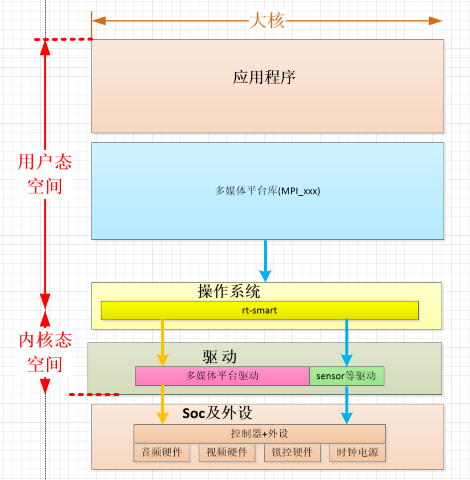
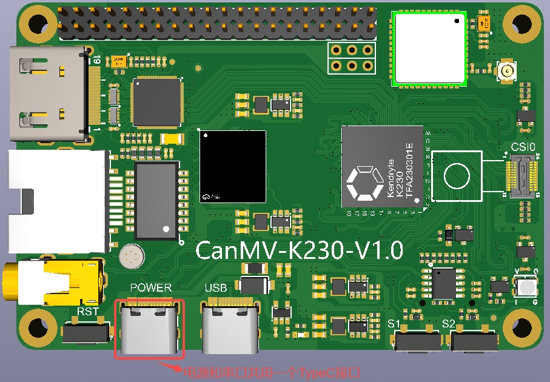
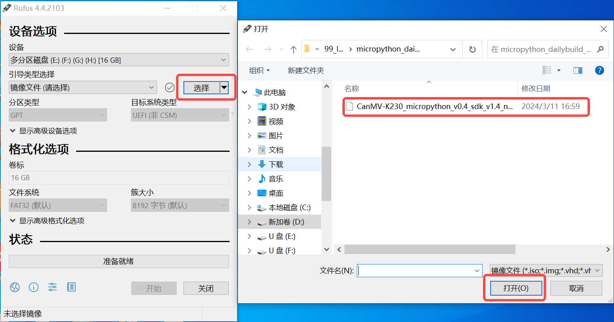
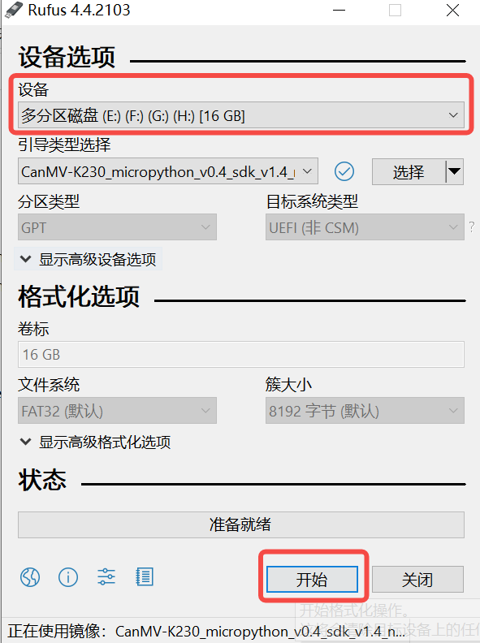
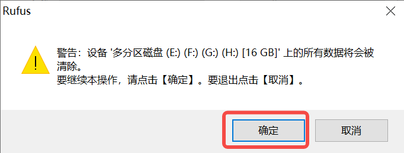
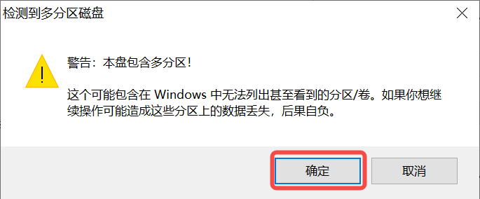
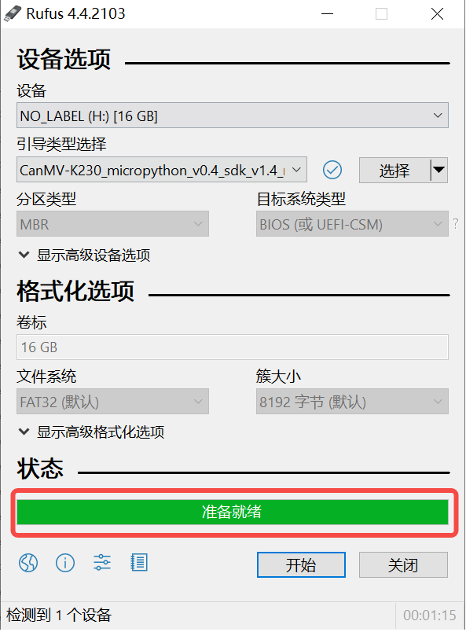

# K230 SDK使用说明


版权所有©2023北京嘉楠捷思信息技术有限公司

<div style="page-break-after:always"></div>

## 免责声明

您购买的产品、服务或特性等应受北京嘉楠捷思信息技术有限公司（“本公司”，下同）及其关联公司的商业合同和条款的约束，本文档中描述的全部或部分产品、服务或特性可能不在您的购买或使用范围之内。除非合同另有约定，本公司不对本文档的任何陈述、信息、内容的正确性、可靠性、完整性、适销性、符合特定目的和不侵权提供任何明示或默示的声明或保证。除非另有约定，本文档仅作为使用指导参考。

由于产品版本升级或其他原因，本文档内容将可能在未经任何通知的情况下，不定期进行更新或修改。

## 商标声明

、“嘉楠”和其他嘉楠商标均为北京嘉楠捷思信息技术有限公司及其关联公司的商标。本文档可能提及的其他所有商标或注册商标，由各自的所有人拥有。

**版权所有 © 2023北京嘉楠捷思信息技术有限公司。保留一切权利。**
非经本公司书面许可，任何单位和个人不得擅自摘抄、复制本文档内容的部分或全部，并不得以任何形式传播。

<div style="page-break-after:always"></div>

## 目录

[TOC]

## 前言

### 概述

本文档主要介绍K230 SDK 的安装和使用。

### 读者对象

本文档（本指南）主要适用于以下人员：

- 技术支持工程师
- 软件开发工程师

### 缩略词定义

| 简称 | 说明 |
|------|------|
|      |      |

### 修订记录

| 文档版本号 | 修改说明                   | 修改者 | 日期       |
| ---------- | -------------------------- | ------ | ---------- |
| V1.0       | 初版                       | 杨光   | 2023-03-10 |
| V1.1       | 新增安全镜像及emmc烧录说明    | 王建新 | 2023-04-07 |
| V1.2       | 新增spinor镜像烧录说明       | 王建新 | 2023-05-05 |
| V1.3       | 快起和安全镜像说明           | 王建新 | 2023-05-29 |
| V1.4       | 大核自启动程序说明           | 郝海波 | 2023-06-1  |
| v1.5       | usip lp4                  | 王建新 | 2023-06-12 |
| V1.6       | 修改大核自启动程序说明           | 赵忠祥 | 2023-06-28  |
| v1.7 | 增加启动介质分区章节,镜像烧录章节调整 | 王建新 | 2023-07-05 |
| v1.8 | 增加CanMV-K230主板信息 | 陈海斌 | 2023-10-11 |

## 1. 概述

### 1.1 SDK软件架构概述

K230 SDK 是面向K230 开发板的软件开发包，包含了基于Linux&RT-smart 双核异构系统及RT-smart单系统开发需要用到的源代码，工具链和其他相关资源。

K230 SDK Linux+RT-smart双系统软件架构层次如图 1-1 所示：


图1-1 K230 SDK 软件架构图

K230 SDK RT-smart 单系统软件架构层次如图 1-2 所示：



## 2. 开发环境搭建

### 2.1 支持的硬件

K230平台支持的硬件信息文档可以参考目录:[00_hardware](../../00_hardware) , 其中不同主板的硬件信息文档目录如下:

| 主板类型  | 主板硬件参考目录|
| --- | --- |
| CanMV-K230 | 具体硬件信息参考: [00_hardware](../../00_hardware/CanMV_K230)|

### 2.2 开发环境搭建

#### 2.2.1 编译环境

| 主机环境                    | 描述                                                 |
|-----------------------------|------------------------------------------------------|
| Docker编译环境              | SDK提供了dockerfile，可以生成docker镜像，用于编译SDK |
| Ubuntu 20.04.4 LTS (x86_64) | SDK可以在ubuntu 20.04环境下编译                      |

K230 SDK需要在linux环境下编译，SDK支持docker环境编译，SDK开发包中发布了docker file（`tools/docker/Dockerfile`），可以生成docker镜像。具体dockerfile使用和编译步骤，详见4.3.1章节。

SDK使用的Docker 镜像以ubuntu 20.04 为基础，如果不使用docker编译环境，可以在ubuntu 20.04 主机环境下参考dockerfile的内容，安装相关HOST package和工具链后，编译SDK。

K230 SDK没有在其他Linux版本的主机环境下验证过，不保证SDK可以在其他环境下编译通过。

#### 2.2.2 SDK开发包

K230 SDK以压缩包的形式发布，或者自己使用`git clone https://github.com/kendryte/k230_sdk`命令下载。

### 2.3 单板准备

本章节以CanMV-K230 主板使用为例

#### 2.3.1 CanMV-K230

请准备如下硬件：

- CanMV-K230
- TypeC USB线  至少1根
- 网线一根(可选)
- HDMI线一根
- SD卡
- 支持HDMI的显示器

说明：CanMV-K230主板电源和串口共用一个TypeC口，如下图：



#### 2.3.3 串口

K230 主板通过USB提供两路调试串口，windows下使用调试串口，需要安装USB转串口驱动程序，驱动下载链接如下：

`https://ftdichip.com/wp-content/uploads/2021/11/CDM-v2.12.36.4.U-WHQL-Certified.zip`

安装了驱动后，板子上电，PC使用type C数据线连接主板的调试串口后，可以发现两个USB串口设备，如下图所示：


图2-1 USB串口设备

以上图为例，`COM47`为小核的调试串口，`COM48`为大核的调试串口。

串口波特率设置： `115200 8N1`

## 3. SDK 安装准备工作

### 3.1 安装SDK

K230 SDK开发包采用压缩包的方式发布，在linux环境下使用。

### 3.2 SDK 目录结构

K230 SDK目录结构如下图所示：

```shell
k230_sdk
├── configs
│   ├── k230_canmv_defconfig
│   └── k230_canmv_only_rtt_defconfig
├── Kconfig
├── LICENSE
├── Makefile
├── parse.mak
├── README.md
├── repo.mak
├── src
│   ├── big
│   │   ├── mpp
│   │   ├── rt-smart
│   │   └── unittest
│   ├── common
│   │   ├── cdk
│   │   └── opensbi
│   ├── little
│   │   ├── buildroot-ext
│   │   ├── linux
│   │   └── uboot
│   └── reference
│       ├── ai_poc
│       ├── business_poc
│       └── fancy_poc
├── board
│   ├── common
│   │   ├── env
│   │   └── gen_image_cfg
│   │   ├── gen_image_script
│   │   └── post_copy_rootfs
│   ├── k230_evb_doorlock
│   └── k230_evb_peephole_device
└── tools
    ├── docker
    │   └── Dockerfile
    ├── doxygen
    ├── firmware_gen.py
    └── get_download_url.sh
```

各个目录用途描述如下：

- `configs`： 存放SDK的板级默认配置，主要包含如下信息：参考板类型，toolchain路径，

    内存布局规划，存储规划配置等

- `src`：源代码目录，分为 大核代码（`big`），公共组件（`common`），小核代码（`little`）三个目录。

    大核代码包含：`rt-smart`操作系统代码，`mpp`代码，`unittest`代码

    公共组件包含：`cdk`代码和`opensbi`代码

    小核代码包含：`linux`内核代码，`buildroot`代码，`uboot`代码

- `tools`：存放各种工具，脚本等。例如`kconfig`，`doxygen`，`dockerfile`等
- `board`：环境变量、镜像配置文件、文件系统等

## 4. SDK 编译

### 4.1 SDK 编译介绍

K230 SDK支持一键编译大小核操作系统和公共组件，生成可以烧写的镜像文件，用于部署到开发板启动运行。设备上linux系统的用户名是root无密码；

### 4.2 SDK 配置

K230 SDK采用Kconfig作为SDK配置接口，默认支持的板级配置放在configs目录下。

#### 4.2.1 部分配置文件说明

`k230_canmv_defconfig` ：基于CanMV-K230 V1.0/V1.1 的Linux+RTT双系统配置文件，为默认配置文件

`k230_canmv_only_rtt_defconfig` ：基于Canmv-K230 V1.0/V1.1 板RT-smart单系统配置文件

### 4.3 编译 SDK

#### 4.3.1 编译步骤

说明：本章节命令仅供参考，文件名请根据实际情况进行替换。
Setp 1：下载代码

`git clone https://github.com/kendryte/k230_sdk`

Step 2：进入SDK根目录

`cd k230_sdk`

Step 3：下载toolchain

```shell
source tools/get_download_url.sh && make prepare_sourcecode
```

>`make prepare_sourcecode` will download both Linux and RT-Smart toolchain, buildroot package and AI package from Microsoft Azure cloud server with CDN, the download cost time may based on your network connection speed.

Step 4：生成docker镜像（第一次编译需要，已经生成docker镜像后跳过此步骤）

`docker build -f tools/docker/Dockerfile -t k230_docker tools/docker`

Step 5: 进入docker环境，

`docker run -u root -it -v $(pwd):$(pwd) -v $(pwd)/toolchain:/opt/toolchain -w $(pwd) k230_docker /bin/bash`

Step 6: Docker环境下执行下面命令进行编译SDK

```bash
make CONF=k230_canmv_defconfig  #编译CanMV-K230 1.0/1.1 板子Linux+RTT双系统镜像
make CONF=k230_canmv_only_rtt_defconfig  #编译CanMV-K230 1.0/1.1 板子RTT-only系统镜像
```
>
> 备注：
sdk不支持多进程编译，不要增加类似-j32多进程编译参数。

#### 4.3.2 编译输出产物

编译完成后，在`output/xx_defconfig/images`目录下可以看到编译输出产物。ls


图4-1 编译产物

`images`目录下镜像文件说明如下：

`sysimage-sdcard.img` -------------是sd和emmc的非安全启动镜像；

`sysimage-sdcard.img.gz` --------是SD和emmc的非安全启动镜像压缩包(sysimage-sdcard.img文件的gzip压缩包)，烧录时需要先解压缩。

`sysimage-sdcard_aes.img.gz`是SD和emmc的aes安全启动镜像压缩包，烧录时需要先解压缩。

`sysimage-sdcard_sm.img.gz`是SD和emmc的sm安全启动镜像压缩包，烧录时需要先解压缩。

安全镜像默认不会产生，如果需要安全镜像请参考4.3.4使能安全镜像。

大核系统的编译产物放在`images/big-core`目录下。

小核系统的编译产物放在`images/little-core`目录下。

#### 4.3.3 非快起镜像

sdk默认编译的是快起镜像(uboot直接启动系统，不会进入uboot命令行)，如果需要进入uboot命令行，请参考下面取消`CONFIG_QUICK_BOOT`配置：

在sdk主目录 执行 `make menuconfig` ，选择`board configuration`，取消`quick boot` 配置选项。

非快起系统变快起系统方法：进入uboot命行执行`setenv quick_boot true;saveenv;`

#### 4.3.4 安全镜像

sdk默认不产生安全镜像，如果需要安全镜像，请参考下面增加CONFIG_GEN_SECURITY_IMG配置：

在sdk主目录 执行`make menuconfig` ，选择`board configuration`，配上`create security image` 选项。

#### 4.3.5 debug镜像

sdk默认产生release镜像，如果需要调试镜像，请参考下面增加CONFIG_BUILD_DEBUG_VER配置：

在sdk主目录 执行`make menuconfig` ，选择`build debug/release version`，配上`debug` 选项。

## 5. SDK 镜像烧写

根据不同主板的硬件特性和软件需求，请选择支持的镜像烧写方式。
> CanMV-K230主板仅支持sd卡镜像启动。

### 5.1 sd卡镜像烧录

#### 5.1.1 ubuntu下烧录

在sd卡插到宿主机之前，输入：

`ls -l /dev/sd\*`

查看当前的存储设备。

将sd卡插入宿主机后，再次输入：

`ls -l /dev/sd\*`

查看此时的存储设备，新增加的就是 sd 卡设备节点。

假设/dev/sdc 就是 sd卡设备节点，执行如下命令烧录SD卡：

`sudo dd if=sysimage-sdcard.img of=/dev/sdc bs=1M oflag=sync`

说明：`sysimage-sdcard.img`可以是`images`目录下的`sysimage-sdcard.img`文件，或者`sysimage-sdcard_aes.img.gz`、`sysimage-sdcard.img.gz`、`sysimage-sdcard_sm.img.gz`文件解压缩后的文件。

#### 5.1.2 Windows下烧录

Windows下可通过rufus工具对TF卡进行烧录（rufus工具下载地址 `http://rufus.ie/downloads/`）。

1）将TF卡插入PC，然后启动rufus工具，点击工具界面的"选择”按钮，选择待烧写的固件。



2）点击“开始”按钮开始烧写，烧写过程有进度条展示，烧写结束后会提示“准备就绪”。






### 5.2 Emmc镜像烧写参考

#### 5.2.1 Linux下烧写emm参考

1)把镜像的压缩包下载到sd卡

从sd卡启动linux，在linux下可以参考如下命令把镜像的压缩包下载到sd卡

```shell
ifconfig eth0 up;udhcpc;mount /dev/mmcblk1p4 /mnt;cd /mnt/;

scp wangjianxin@10.10.1.94:/home/wangjianxin/k230_sdk/output/k230_evb_defconfig/images/sysimage-sdcard.img.gz  .
```

2)把压缩包解压缩到emmc

`gunzip sysimage-sdcard.img.gz -c >/dev/mmcblk0`

3)切成emmc启动，重启板子

> RTT-only无法使用此方法

#### 5.2.1 Uboot下烧写emmc参考

1）把ssysimage-sdcard.img.gz镜像下载到内存。

```bash
usb start; dhcp;  tftp 0x900000010.10.1.94:wjx/sysimage-sdcard.img.gz;
 #注意：需要根据内存大小替换下0x9000000，比如内存只有128M的话，可以替换为0x2400000
```

2）把镜像写到emmc

```bash
gzwrite mmc  0   0x${fileaddr}  0x${filesize};
```

3）重启板子

## 6. SDK内存配置

在k230_sdk下运行`make menuconfig->Memory configuration`可以配置各个区域使用的内存空间，也可以直接编译configs/k230_canmv_defconfig修改，各区域说明如下

``` shell
CONFIG_MEM_TOTAL_SIZE="0x20000000"      #内存总体容量          不支持配置
CONFIG_MEM_PARAM_BASE="0x00000000"      #参数分区起始地址       不支持配置
CONFIG_MEM_PARAM_SIZE="0x00100000"      #参数分区大小           不支持配置
CONFIG_MEM_IPCM_BASE="0x00100000"       #核间通讯起始地址       不支持配置
CONFIG_MEM_IPCM_SIZE="0x00100000"       #核间通讯共享内存大小    不支持配置
CONFIG_MEM_RTT_SYS_BASE="0x00200000"    #大核RTT起始地址        支持配置
CONFIG_MEM_RTT_SYS_SIZE="0x07E00000"    #大核RTT使用的地址范围   支持配置
CONFIG_MEM_AI_MODEL_BASE="0x1FC00000"   #AI模型加载起始地址      支持配置
CONFIG_MEM_AI_MODEL_SIZE="0x00400000"   #AI模型加载地址区域      支持配置
CONFIG_MEM_LINUX_SYS_BASE="0x08000000"  #小核linux起始地址       支持配置
CONFIG_MEM_LINUX_SYS_SIZE="0x08000000"  #小核linux地址区域       支持配置
CONFIG_MEM_MMZ_BASE="0x10000000"        #mmz共享内存其实地址     支持配置
CONFIG_MEM_MMZ_SIZE="0x0FC00000"        #mmz 共享内存区域       支持配置
CONFIG_MEM_BOUNDARY_RESERVED_SIZE="0x00001000"  #隔离区         不支持配置
```

> CONFIG_MEM_LINUX_SYS_BASE 地址需要2MB对齐
>
> RTT-only系统没有Linux内存的配置

## 8. SDK单板调试

> CanMV-K230主板由于的调试口默认是串口功能，如果需要调试请参考[sdk常见问题解答](../../03_other/K230_SDK常见问题解答_C.md)。

### 8.1 调试前准备

1.从 T-Head官网 `https://www.xrvm.cn/community/download` 下载`XuanTie DebugServer`软件和《Debugger Server User Guide(ZH-CN).pdf》，并参考《Debugger Server User Guide(ZH-CN).pdf》在pc电脑上安装`XuanTie DebugServer`软件；


2.准备下图所示平头哥 cklink、usb线、k230 evb板


### 8.2 调试

1.参考下图把cklink 、k230 evb板子、pc电脑 连接起来，随后给evb上电。


2.电脑上打开第1步安装的T-HeadDebugServer软件，看到类似如下图打印说明连接成功，如果连接失败请参考《DebugServer User Guide 》排查失败原因。


3.在编译代码的服务器上启动riscv64-unknown-linux-gnu-gdb执行target remote xx.xx.xx.xx1025 命令连接板子,连接成功后进行gdb调试。


## 9. SDK启动

当前版本默认编译生成的镜像，烧录到板子上后，大核会自动运行一个人脸检测程序,显示屏上会显示摄像头采集的图片;启动后可以在大核的控制台端输入'q'退出该程序。

> 1. EVB系列主板如果没有连接IMX335摄像头,则自启动程序报错，程序自动退出,按回车即可回到控制台。
> 1. 若需要取消大核的自启动功能，需将 `k230_sdk/src/big/rt-smart/init.sh` 中的内容注释掉。

## 10.k230 debian和ubuntu 镜像说明

镜像及构建方法详见[K230_debian_ubuntu说明.md](../../../zh/03_other/K230_debian_ubuntu说明.md)

> 上文有关Linux相关的内容不适用于RTT-only系统
