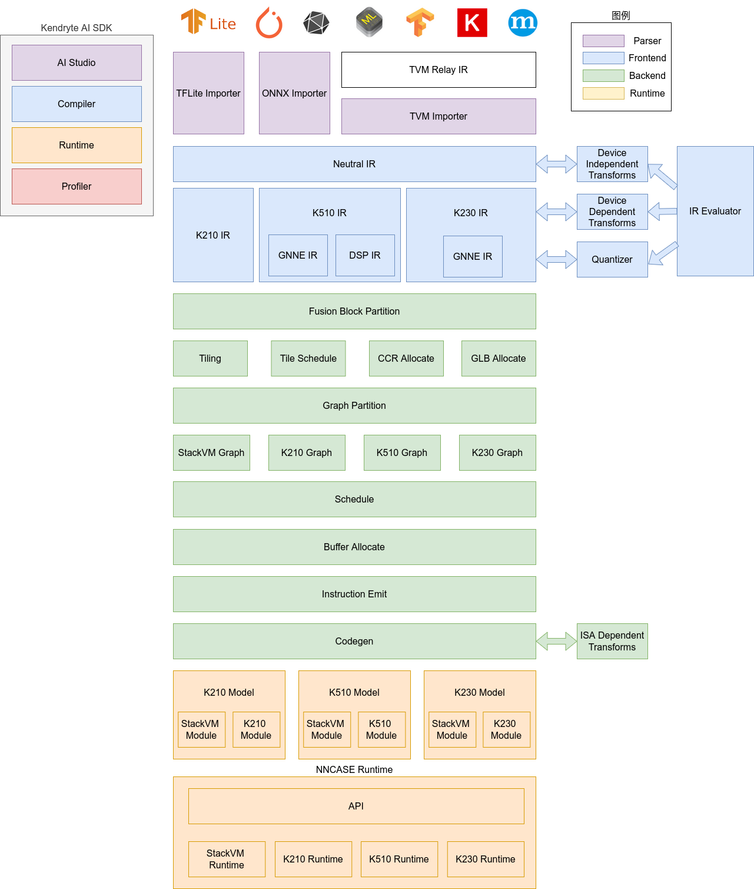
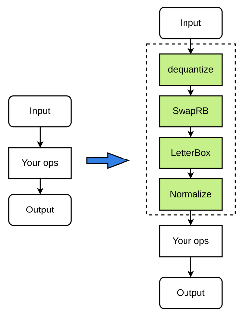

# K230 nncase开发指南


版权所有©2023北京嘉楠捷思信息技术有限公司

<div style="page-break-after:always"></div>

## 免责声明

您购买的产品、服务或特性等应受北京嘉楠捷思信息技术有限公司（“本公司”，下同）及其关联公司的商业合同和条款的约束，本文档中描述的全部或部分产品、服务或特性可能不在您的购买或使用范围之内。除非合同另有约定，本公司不对本文档的任何陈述、信息、内容的正确性、可靠性、完整性、适销性、符合特定目的和不侵权提供任何明示或默示的声明或保证。除非另有约定，本文档仅作为使用指导参考。

由于产品版本升级或其他原因，本文档内容将可能在未经任何通知的情况下，不定期进行更新或修改。

## 商标声明

、“嘉楠”和其他嘉楠商标均为北京嘉楠捷思信息技术有限公司及其关联公司的商标。本文档可能提及的其他所有商标或注册商标，由各自的所有人拥有。

**版权所有 © 2023北京嘉楠捷思信息技术有限公司。保留一切权利。**
非经本公司书面许可，任何单位和个人不得擅自摘抄、复制本文档内容的部分或全部，并不得以任何形式传播。

<div style="page-break-after:always"></div>

## 目录

[TOC]

## 前言

### 概述

本文档为K230 nncase的使用说明文档，提供给用户如何安装nncase, 如何调用compiler APIs编译神经网络模型和runtime APIs编写AI推理程序.

### 读者对象

本文档（本指南）主要适用于以下人员：

- 技术支持工程师
- 软件开发工程师

### 缩略词定义

| 简称 | 说明                                   |
| ---- | -------------------------------------- |
| PTQ  | Post-training quantization, 训练后量化 |
| MSE  | mean-square error, 均方误差            |

### 修订记录

| 文档版本号 | 修改说明                                            | 修改者             | 日期     |
| ---------- | --------------------------------------------------- | ------------------ | -------- |
| V1.0       | 文档初版                                            | 张扬/霍成海        | 2023/4/7 |
| V1.1       | 统一改成word格式， 完善ai2d                         | 张扬/霍成海        | 2023/5/5 |
| V1.2       | nncase v2新架构                                     | 张扬/郑启航/霍成海 | 2023/6/2 |
| V1.3       | nncase_k230_v2.1.0, ai2d/runtime_tensor支持物理地址 | 张扬               | 2023/7/3 |

## 1. 概述

### 1.1 什么是nncase

nncase是一个为 AI 加速器设计的神经网络编译器, 目前支持的 target有cpu/K210/K510/K230等.

nncase提供的功能

- 支持多输入多输出网络，支持多分支结构
- 静态内存分配，不需要堆内存
- 算子合并和优化
- 支持 float 和uint8/int8量化推理
- 支持训练后量化，使用浮点模型和量化校准集
- 平坦模型，支持零拷贝加载

nncase支持的神经网络模型格式

- tflite
- onnx

### 1.2 nncase架构



nncase软件栈包括compiler和runtime两部分。

Compiler: 用于在PC上编译神经网络模型，最终生成kmodel文件。主要包括importer, IR, Evaluator, Quantize, Transform优化, Tiling, Partition, Schedule, Codegen等模块。

- Importer: 将其它神经网络框架的模型导入到nncase中
- IR: 中间表示, 分为importer导入的Neutral IR(设备无关)和Neutral IR经lowering转换生成的Target IR(设备相关)
- Evaluator: Evaluator提供IR的解释执行能力，常被用于Constant Folding/PTQ Calibration等场景
- Transform: 用于IR转换和图的遍历优化等
- Quantize: 训练后量化, 对要量化的tensor加入量化标记, 根据输入的校正集, 调用 Evaluator进行解释执行, 收集tensor的数据范围, 插入量化/反量化结点, 最后优化消除不必要的量化/反量化结点等
- Tiling: 受限于NPU较低的存储器容量，需要将大块计算进行拆分. 另外, 计算存在大量数据复用时选择Tiling参数会对时延和带宽产生影响
- Partition: 将图按ModuleType进行切分, 切分后的每个子图会对应RuntimeModule, 不同类型的RuntimeModule对应不同的Device(cpu/K230)
- Schedule: 根据优化后图中的数据依赖关系生成计算顺序并分配Buffer
- Codegen: 对每个子图分别调用ModuleType对应的codegen，生成RuntimeModule

Runtime: 集成于用户App， 提供加载kmodel/设置输入数据/KPU执行/获取输出数据等功能.

### 1.3 开发环境

#### 1.3.1 操作系统

支持的操作系统包括Ubuntu 18.04/Ubuntu 20.04

#### 1.3.2 软件环境

| 序号 | 软件            | 版本号               |
| ---- | --------------- | -------------------- |
| 1    | python          | 3.6/3.7/3.8/3.9/3.10 |
| 2    | pip             | \>=20.3              |
| 3    | numpy           | 1.19.5               |
| 4    | onnx            | 1.9.0                |
| 5    | onnx-simplifier | 0.3.6                |
| 6    | Onnxoptimizer   | 0.2.6                |
| 7    | Onnxruntime     | 1.8.0                |
| 8    | dotnet-runtime  | 7.0                  |

#### 1.3.3 硬件环境

K230 evb

## 2. 编译模型APIs(Python)

nncase提供了Python APIs, 用于在PC上编译神经网络模型

### 2.1 支持的算子

#### 2.1.1 tflite算子

| Operator                | Is Supported |
| ----------------------- | ------------ |
| ABS                     | Yes          |
| ADD                     | Yes          |
| ARG_MAX                 | Yes          |
| ARG_MIN                 | Yes          |
| AVERAGE_POOL_2D         | Yes          |
| BATCH_MATMUL            | Yes          |
| CAST                    | Yes          |
| CEIL                    | Yes          |
| CONCATENATION           | Yes          |
| CONV_2D                 | Yes          |
| COS                     | Yes          |
| CUSTOM                  | Yes          |
| DEPTHWISE_CONV_2D       | Yes          |
| DIV                     | Yes          |
| EQUAL                   | Yes          |
| EXP                     | Yes          |
| EXPAND_DIMS             | Yes          |
| FLOOR                   | Yes          |
| FLOOR_DIV               | Yes          |
| FLOOR_MOD               | Yes          |
| FULLY_CONNECTED         | Yes          |
| GREATER                 | Yes          |
| GREATER_EQUAL           | Yes          |
| L2_NORMALIZATION        | Yes          |
| LEAKY_RELU              | Yes          |
| LESS                    | Yes          |
| LESS_EQUAL              | Yes          |
| LOG                     | Yes          |
| LOGISTIC                | Yes          |
| MAX_POOL_2D             | Yes          |
| MAXIMUM                 | Yes          |
| MEAN                    | Yes          |
| MINIMUM                 | Yes          |
| MUL                     | Yes          |
| NEG                     | Yes          |
| NOT_EQUAL               | Yes          |
| PAD                     | Yes          |
| PADV2                   | Yes          |
| MIRROR_PAD              | Yes          |
| PACK                    | Yes          |
| POW                     | Yes          |
| REDUCE_MAX              | Yes          |
| REDUCE_MIN              | Yes          |
| REDUCE_PROD             | Yes          |
| RELU                    | Yes          |
| PRELU                   | Yes          |
| RELU6                   | Yes          |
| RESHAPE                 | Yes          |
| RESIZE_BILINEAR         | Yes          |
| RESIZE_NEAREST_NEIGHBOR | Yes          |
| ROUND                   | Yes          |
| RSQRT                   | Yes          |
| SHAPE                   | Yes          |
| SIN                     | Yes          |
| SLICE                   | Yes          |
| SOFTMAX                 | Yes          |
| SPACE_TO_BATCH_ND       | Yes          |
| SQUEEZE                 | Yes          |
| BATCH_TO_SPACE_ND       | Yes          |
| STRIDED_SLICE           | Yes          |
| SQRT                    | Yes          |
| SQUARE                  | Yes          |
| SUB                     | Yes          |
| SUM                     | Yes          |
| TANH                    | Yes          |
| TILE                    | Yes          |
| TRANSPOSE               | Yes          |
| TRANSPOSE_CONV          | Yes          |
| QUANTIZE                | Yes          |
| FAKE_QUANT              | Yes          |
| DEQUANTIZE              | Yes          |
| GATHER                  | Yes          |
| GATHER_ND               | Yes          |
| ONE_HOT                 | Yes          |
| SQUARED_DIFFERENCE      | Yes          |
| LOG_SOFTMAX             | Yes          |
| SPLIT                   | Yes          |
| HARD_SWISH              | Yes          |

#### 2.1.2 onnx算子

| Operator              | Is Supported |
| --------------------- | ------------ |
| Abs                   | Yes          |
| Acos                  | Yes          |
| Acosh                 | Yes          |
| And                   | Yes          |
| ArgMax                | Yes          |
| ArgMin                | Yes          |
| Asin                  | Yes          |
| Asinh                 | Yes          |
| Add                   | Yes          |
| AveragePool           | Yes          |
| BatchNormalization    | Yes          |
| Cast                  | Yes          |
| Ceil                  | Yes          |
| Celu                  | Yes          |
| Clip                  | Yes          |
| Compress              | Yes          |
| Concat                | Yes          |
| Constant              | Yes          |
| ConstantOfShape       | Yes          |
| Conv                  | Yes          |
| ConvTranspose         | Yes          |
| Cos                   | Yes          |
| Cosh                  | Yes          |
| CumSum                | Yes          |
| DepthToSpace          | Yes          |
| DequantizeLinear      | Yes          |
| Div                   | Yes          |
| Dropout               | Yes          |
| Elu                   | Yes          |
| Exp                   | Yes          |
| Expand                | Yes          |
| Equal                 | Yes          |
| Erf                   | Yes          |
| Flatten               | Yes          |
| Floor                 | Yes          |
| Gather                | Yes          |
| GatherElements        | Yes          |
| GatherND              | Yes          |
| Gemm                  | Yes          |
| GlobalAveragePool     | Yes          |
| GlobalMaxPool         | Yes          |
| Greater               | Yes          |
| GreaterOrEqual        | Yes          |
| GRU                   | Yes          |
| Hardmax               | Yes          |
| HardSigmoid           | Yes          |
| HardSwish             | Yes          |
| Identity              | Yes          |
| InstanceNormalization | Yes          |
| LayerNormalization    | Yes          |
| LpNormalization       | Yes          |
| LeakyRelu             | Yes          |
| Less                  | Yes          |
| LessOrEqual           | Yes          |
| Log                   | Yes          |
| LogSoftmax            | Yes          |
| LRN                   | Yes          |
| LSTM                  | Yes          |
| MatMul                | Yes          |
| MaxPool               | Yes          |
| Max                   | Yes          |
| Min                   | Yes          |
| Mul                   | Yes          |
| Neg                   | Yes          |
| Not                   | Yes          |
| OneHot                | Yes          |
| Pad                   | Yes          |
| Pow                   | Yes          |
| PRelu                 | Yes          |
| QuantizeLinear        | Yes          |
| RandomNormal          | Yes          |
| RandomNormalLike      | Yes          |
| RandomUniform         | Yes          |
| RandomUniformLike     | Yes          |
| ReduceL1              | Yes          |
| ReduceL2              | Yes          |
| ReduceLogSum          | Yes          |
| ReduceLogSumExp       | Yes          |
| ReduceMax             | Yes          |
| ReduceMean            | Yes          |
| ReduceMin             | Yes          |
| ReduceProd            | Yes          |
| ReduceSum             | Yes          |
| ReduceSumSquare       | Yes          |
| Relu                  | Yes          |
| Reshape               | Yes          |
| Resize                | Yes          |
| ReverseSequence       | Yes          |
| RoiAlign              | Yes          |
| Round                 | Yes          |
| Rsqrt                 | Yes          |
| Selu                  | Yes          |
| Shape                 | Yes          |
| Sign                  | Yes          |
| Sin                   | Yes          |
| Sinh                  | Yes          |
| Sigmoid               | Yes          |
| Size                  | Yes          |
| Slice                 | Yes          |
| Softmax               | Yes          |
| Softplus              | Yes          |
| Softsign              | Yes          |
| SpaceToDepth          | Yes          |
| Split                 | Yes          |
| Sqrt                  | Yes          |
| Squeeze               | Yes          |
| Sub                   | Yes          |
| Sum                   | Yes          |
| Tanh                  | Yes          |
| Tile                  | Yes          |
| TopK                  | Yes          |
| Transpose             | Yes          |
| Trilu                 | Yes          |
| ThresholdedRelu       | Yes          |
| Upsample              | Yes          |
| Unsqueeze             | Yes          |
| Where                 | Yes          |

### 2.2 APIs

目前编译模型APIs支持tflite/onnx/caffe等格式的深度学习模型。

#### 2.2.1 CompileOptions

【描述】

CompileOptions类, 用于配置nncase编译选项

【定义】

```python
class CompileOptions:
    benchmark_only: bool
    dump_asm: bool
    dump_dir: str
    dump_ir: bool
    swapRB: bool
    input_range: List[float]
    input_shape: List[int]
    input_type: str
    is_fpga: bool
    mean: List[float]
    std: List[float]
    output_type: str
    preprocess: bool
    quant_type: str
    target: str
    w_quant_type: str
    use_mse_quant_w: bool
    input_layout: str
    output_layout: str
    letterbox_value: float
    tcu_num: int

    def __init__(self) -> None:
        self.benchmark_only = False
        self.dump_asm = True
        self.dump_dir = "tmp"
        self.dump_ir = False
        self.is_fpga = False
        self.quant_type = "uint8"
        self.target = "cpu"
        self.w_quant_type = "uint8"
        self.use_mse_quant_w = True
        self.tcu_num = 0

        self.preprocess = False
        self.swapRB = False
        self.input_range = []
        self.input_shape = []
        self.input_type = "float32"
        self.mean = [0, 0, 0]
        self.std = [1, 1, 1]
        self.input_layout = ""
        self.output_layout = ""
        self.letterbox_value = 0
```

【属性】

| 名称            | 类型   | 描述                                                         |
| --------------- | ------ | ------------------------------------------------------------ |
| dump_asm        | bool   | 指定是否dump asm汇编文件, 默认为True                         |
| dump_dir        | bool   | 前面指定dump_ir等开关后, 这里指定dump的目录, 默认为"tmp"     |
| dump_ir         | bool   | 指定是否dump IR, 默认为False                                 |
| swapRB          | bool   | 是否交换RGB输入数据的红和蓝两个通道(RGB--\>BGR或者BGR--\>RGB)，默认为False |
| input_range     | list   | 输入数据反量化后对应浮点数的范围，默认为`[0，1]`             |
| input_shape     | list   | 指定输入数据的shape，input_shape的layout需要与input layout保持一致，输入数据的input_shape与模型的input shape不一致时会进行letterbox操作(resize/pad等) |
| input_type      | string | 指定输入数据的类型, 默认为'float32'                          |
| mean            | list   | 前处理标准化参数均值，默认为`[0, 0, 0]`                      |
| std             | list   | 前处理标准化参数方差，默认为`[1, 1, 1]`                      |
| output_type     | string | 指定输出数据的类型, 如'float32', 'uint8'(仅用于指定量化情况下) |
| preprocess      | bool   | 是否开启前处理，默认为False                                  |
| target          | string | 指定编译目标, 如'k210', 'k510', ‘k230’                       |
| letterbox_value | float  | 指定前处理letterbox的填充值                                  |
| input_layout    | string | 指定输入数据的layout, 如'NCHW', 'NHWC'. 若输入数据layout与模型本身layout不同, nncase会插入transpose进行转换 |
| output_layout   | string | 指定输出数据的layout, 如'NCHW', 'NHWC'. 若输出数据layout与模型本身layout不同, nncase会插入transpose进行转换. |

【注意】

1. input range为浮点数的范围，即如果输入数据类型为uint8，则input range为反量化到浮点之后的范围（可以不为0\~1），可以自由指定.
1. input_shape需要按照input_layout进行指定，以`[1，224，224，3]`为例，如果input_layout为NCHW，则input_shape需指定为`[1,3,224,224]`;input_layout为NHWC，则input_shape需指定为`[1,224,224,3]`.
1. mean和std为浮点数进行normalize的参数，用户可以自由指定.
1. 使用letterbox功能时，需要限制输入size在1.5MB内，单channel的size在0.75MB内.

例如:

1. 输入数据类型设定为uint8，input_range设定为`[0,255]`，则反量化的作用只是进行类型转化，将uint8的数据转化为float32，mean和std参数仍然可以按照0\~255的数据进行指定.
1. 输入数据类型设定为uint8，input_range设定为`[0,1]`，则会将定点数反量化为范围为`[0,1]`的浮点数, mean 和std需要按照新的浮点数范围进行指定。

前处理流程如下(图中绿色节点皆为可选)：



【示例】

实例化CompileOptions, 配置各属性的值

```python
# compile_options                                                                
compile_options = nncase.CompileOptions()                                           
compile_options.target = args.target                                                
compile_options.preprocess = True                                                   
compile_options.swapRB = False                                                      
compile_options.input_shape = input_shape                                           
compile_options.input_type = 'uint8'                                                
compile_options.input_range = [0, 255]                                              
compile_options.mean = [127.5, 127.5, 127.5]                                        
compile_options.std = [127.5, 127.5, 127.5]                                         
compile_options.input_layout = 'NCHW'                                               
compile_options.dump_ir = True                                                      
compile_options.dump_asm = True                                                     
compile_options.dump_dir = dump_dir                                                 
```

#### 2.2.2 ImportOptions

【描述】

ImportOptions类, 用于配置nncase导入选项

【定义】

```python
class ImportOptions:
    def __init__(self) -> None:
        pass
```

【示例】

实例化ImportOptions, 配置各属性的值

```python
#import_options
import_options = nncase.ImportOptions()
```

#### 2.2.3 PTQTensorOptions

【描述】

PTQTensorOptions类, 用于配置nncase PTQ选项

【定义】

```python
class PTQTensorOptions:
    calibrate_method: str
    input_mean: float
    input_std: float
    samples_count: int
    quant_type: str
    w_quant_type: str
    finetune_weights_method: str
    use_mix_quant: bool
    quant_scheme: str
    export_quant_scheme: bool
    export_weight_range_by_channel: bool
    cali_data: List[RuntimeTensor]

    def __init__(self) -> None:
        self.calibrate_method: str = "Kld"
        self.input_mean: float = 0.5
        self.input_std: float = 0.5
        self.samples_count: int = 5
        self.quant_type: str = "uint8"
        self.w_quant_type: str = "uint8"
        self.finetune_weights_method: str = "NoFineTuneWeights"
        self.use_mix_quant: bool = False
        self.quant_scheme: str = ""
        self.export_quant_scheme: bool = False
        self.export_weight_range_by_channel: bool = False
        self.cali_data: List[RuntimeTensor] = []

    def set_tensor_data(self, data: List[List[np.ndarray]]) -> None:
        reshape_data = list(map(list, zip(*data)))
        self.cali_data = [RuntimeTensor.from_numpy(
            d) for d in itertools.chain.from_iterable(reshape_data)]
```

【属性】

| 名称                    | 类型   | 描述                                                         |
| ----------------------- | ------ | ------------------------------------------------------------ |
| calibrate_method        | string | 校准方法 , 支持'NoClip', 'Kld',  默认值为'Kld'               |
| input_mean              | float  | 用户指定输入的均值，默认值为0.5                              |
| input_std               | float  | 用户指定输入的方差，默认值为0.5                              |
| samples_count           | Int    | 样本个数                                                     |
| quant_type              | string | 指定数据量化类型, 如'uint8', 'int8'， 默认值为'uint8'        |
| w_quant_type            | string | 指定权重量化类型, 如'uint8', 'int8', 默认值为’uint8’         |
| finetune_weights_method | string | 调整权重方法，有'NoFineTuneWeights', 'UseSquant'，默认值为'NoFineTuneWeights' |
| use_mix_quant           | bool   | 是否使用混合量化，默认值为False                              |

【示例】

```python
# ptq_options
ptq_options = nncase.PTQTensorOptions()
ptq_options.samples_count = 6
ptq_options.set_tensor_data(generate_data(input_shape, ptq_options.samples_count, args.dataset))
compiler.use_ptq(ptq_options)
```

#### 2.2.4 set_tensor_data

【描述】

设置tensor数据

【定义】

```python
    def set_tensor_data(self, data: List[List[np.ndarray]]) -> None:
        reshape_data = list(map(list, zip(*data)))
        self.cali_data = [RuntimeTensor.from_numpy(
            d) for d in itertools.chain.from_iterable(reshape_data)]
```

【参数】

| 名称       | 类型   | 描述           |
| ---------- | ------ | -------------- |
| data | List[List[np.ndarray] | 读取的校准数据 |

【返回值】

无

【示例】

```shell
# ptq_options
ptq_options = nncase.PTQTensorOptions()
ptq_options.samples_count = 6
ptq_options.set_tensor_data(generate_data(input_shape, ptq_options.samples_count, args.dataset))
compiler.use_ptq(ptq_options)
```

#### 2.2.5 Compiler

【描述】

Compiler类, 用于编译神经网络模型

【定义】

```python
class Compiler:
    _target: _nncase.Target
    _session: _nncase.CompileSession
    _compiler: _nncase.Compiler
    _compile_options: _nncase.CompileOptions
    _quantize_options: _nncase.QuantizeOptions
    _module: IRModule
```

#### 2.2.6 import_tflite

【描述】

导入tflite模型

【定义】

```python
def import_tflite(self, model_content: bytes, options: ImportOptions) -> None:
    self._compile_options.input_format = "tflite"
    self._import_module(model_content)
```

【参数】

| 名称           | 类型          | 描述           |
| -------------- | ------------- | -------------- |
| model_content  | byte\[\]        | 读取的模型内容 |
| import_options | ImportOptions | 导入选项       |

【返回值】

无

【示例】

```python
model_content = read_model_file(model)
compiler.import_tflite(model_content, import_options)
```

#### 2.2.7 import_onnx

【描述】

导入onnx模型

【定义】

```python
def import_onnx(self, model_content: bytes, options: ImportOptions) -> None:
    self._compile_options.input_format = "onnx"
    self._import_module(model_content)
```

【参数】

| 名称           | 类型          | 描述           |
| -------------- | ------------- | -------------- |
| model_content  | byte\[\]        | 读取的模型内容 |
| import_options | ImportOptions | 导入选项       |

【返回值】

无

【示例】

```python
model_content = read_model_file(model)
compiler.import_onnx(model_content, import_options)
```

#### 2.2.8 use_ptq

【描述】

设置PTQ配置选项.

- K230默认必须使用量化。

【定义】

`use_ptq(ptq_options)`

【参数】

| 名称        | 类型             | 描述        |
| ----------- | ---------------- | ----------- |
| ptq_options | PTQTensorOptions | PTQ配置选项 |

【返回值】

无

【示例】

`compiler.use_ptq(ptq_options)`

#### 2.2.9 compile

【描述】

编译神经网络模型

【定义】

`compile()`

【参数】

无

【返回值】

无

【示例】

`compiler.compile()`

#### 2.2.10 gencode_tobytes

【描述】

生成kmodel字节流

【定义】

`gencode_tobytes()`

【参数】

无

【返回值】

`bytes[]`

【示例】

```python
kmodel = compiler.gencode_tobytes()
with open(os.path.join(infer_dir, 'test.kmodel'), 'wb') as f:
    f.write(kmodel)
```

### 2.3 示例

下面示例中使用到的模型和python编译脚本

- 原始模型文件位于/path/to/k230_sdk/src/big/nncase/examples/models目录
- python编译脚本位于/path/to/k230_sdk/src/big/nncase/examples/scripts目录

#### 2.3.1 编译tflite模型

mbv2_tflite.py脚本如下

```python
import os
import argparse
import numpy as np
from PIL import Image
import nncase

def read_model_file(model_file):
    with open(model_file, 'rb') as f:
        model_content = f.read()
    return model_content

def generate_data(shape, batch, calib_dir):
    img_paths = [os.path.join(calib_dir, p) for p in os.listdir(calib_dir)]
    data = []
    for i in range(batch):
        assert i < len(img_paths), "calibration images not enough."
        img_data = Image.open(img_paths[i]).convert('RGB')
        img_data = img_data.resize((shape[3], shape[2]), Image.BILINEAR)
        img_data = np.asarray(img_data, dtype=np.uint8)
        img_data = np.transpose(img_data, (2, 0, 1))
        data.append([img_data[np.newaxis, ...]])
    return data

def main():
    parser = argparse.ArgumentParser(prog="nncase")
    parser.add_argument("--target", type=str, help='target to run')
    parser.add_argument("--model", type=str, help='model file')
    parser.add_argument("--dataset", type=str, help='calibration_dataset')
    args = parser.parse_args()

    input_shape = [1, 3, 224, 224]
    dump_dir = 'tmp/mbv2_tflite'

    # compile_options
    compile_options = nncase.CompileOptions()
    compile_options.target = args.target
    compile_options.preprocess = True
    compile_options.swapRB = False
    compile_options.input_shape = input_shape
    compile_options.input_type = 'uint8'
    compile_options.input_range = [0, 255]
    compile_options.mean = [127.5, 127.5, 127.5]
    compile_options.std = [127.5, 127.5, 127.5]
    compile_options.input_layout = 'NCHW'
    compile_options.dump_ir = True
    compile_options.dump_asm = True
    compile_options.dump_dir = dump_dir

    # compiler
    compiler = nncase.Compiler(compile_options)

    # import
    model_content = read_model_file(args.model)
    import_options = nncase.ImportOptions()
    compiler.import_tflite(model_content, import_options)

    # ptq_options
    ptq_options = nncase.PTQTensorOptions()
    ptq_options.samples_count = 6
    ptq_options.set_tensor_data(generate_data(input_shape, ptq_options.samples_count, args.dataset))
    compiler.use_ptq(ptq_options)

    # compile
    compiler.compile()

    # kmodel
    kmodel = compiler.gencode_tobytes()
    with open(os.path.join(dump_dir, 'test.kmodel'), 'wb') as f:
        f.write(kmodel)

if __name__ == '__main__':
    main()
```

执行如下命令即可编译mobilenetv2的tflite模型, target为k230

```sh
root@c285a41a7243:/mnt/# cd src/big/nncase/examples
root@c285a41a7243:/mnt/src/big/nncase/examples# python3 ./scripts/mbv2_tflite.py --target k230 --model models/mbv2.tflite --dataset calibration_dataset
```

#### 2.3.2 编译onnx模型

针对onnx模型, 建议先使用[ONNX Simplifier](https://github.com/daquexian/onnx-simplifier)进行简化, 然后再使用nncase编译.

yolov5s_onnx.py 脚本如下

```python
import os
import argparse
import numpy as np
from PIL import Image
import onnxsim
import onnx
import nncase

def parse_model_input_output(model_file):
    onnx_model = onnx.load(model_file)
    input_all = [node.name for node in onnx_model.graph.input]
    input_initializer = [node.name for node in onnx_model.graph.initializer]
    input_names = list(set(input_all) - set(input_initializer))
    input_tensors = [
        node for node in onnx_model.graph.input if node.name in input_names]

    # input
    inputs = []
    for _, e in enumerate(input_tensors):
        onnx_type = e.type.tensor_type
        input_dict = {}
        input_dict['name'] = e.name
        input_dict['dtype'] = onnx.mapping.TENSOR_TYPE_TO_NP_TYPE[onnx_type.elem_type]
        input_dict['shape'] = [(i.dim_value if i.dim_value != 0 else d) for i, d in zip(
            onnx_type.shape.dim, [1, 3, 224, 224])]
        inputs.append(input_dict)

    return onnx_model, inputs


def onnx_simplify(model_file, dump_dir):
    onnx_model, inputs = parse_model_input_output(model_file)
    onnx_model = onnx.shape_inference.infer_shapes(onnx_model)
    input_shapes = {}
    for input in inputs:
        input_shapes[input['name']] = input['shape']

    onnx_model, check = onnxsim.simplify(onnx_model, input_shapes=input_shapes)
    assert check, "Simplified ONNX model could not be validated"

    model_file = os.path.join(dump_dir, 'simplified.onnx')
    onnx.save_model(onnx_model, model_file)
    return model_file


def read_model_file(model_file):
    with open(model_file, 'rb') as f:
        model_content = f.read()
    return model_content

def generate_data_ramdom(shape, batch):
    data = []
    for i in range(batch):
        data.append([np.random.randint(0, 256, shape).astype(np.uint8)])
    return data


def generate_data(shape, batch, calib_dir):
    img_paths = [os.path.join(calib_dir, p) for p in os.listdir(calib_dir)]
    data = []
    for i in range(batch):
        assert i < len(img_paths), "calibration images not enough."
        img_data = Image.open(img_paths[i]).convert('RGB')
        img_data = img_data.resize((shape[3], shape[2]), Image.BILINEAR)
        img_data = np.asarray(img_data, dtype=np.uint8)
        img_data = np.transpose(img_data, (2, 0, 1))
        data.append([img_data[np.newaxis, ...]])
    return data

def main():
    parser = argparse.ArgumentParser(prog="nncase")
    parser.add_argument("--target", type=str, help='target to run')
    parser.add_argument("--model", type=str, help='model file')
    parser.add_argument("--dataset", type=str, help='calibration_dataset')

    args = parser.parse_args()

    input_shape = [1, 3, 320, 320]

    dump_dir = 'tmp/yolov5s_onnx'
    if not os.path.exists(dump_dir):
        os.makedirs(dump_dir)

    # onnx simplify
    model_file = onnx_simplify(args.model, dump_dir)

    # compile_options
    compile_options = nncase.CompileOptions()
    compile_options.target = args.target
    compile_options.preprocess = True
    compile_options.swapRB = False
    compile_options.input_shape = input_shape
    compile_options.input_type = 'uint8'
    compile_options.input_range = [0, 255]
    compile_options.mean = [0, 0, 0]
    compile_options.std = [255, 255, 255]
    compile_options.input_layout = 'NCHW'
    compile_options.output_layout = 'NCHW'
    compile_options.dump_ir = True
    compile_options.dump_asm = True
    compile_options.dump_dir = dump_dir

    # compiler
    compiler = nncase.Compiler(compile_options)

    # import
    model_content = read_model_file(model_file)
    import_options = nncase.ImportOptions()
    compiler.import_onnx(model_content, import_options)

    # ptq_options
    ptq_options = nncase.PTQTensorOptions()
    ptq_options.samples_count = 6
    ptq_options.set_tensor_data(generate_data(input_shape, ptq_options.samples_count, args.dataset))
    compiler.use_ptq(ptq_options)

    # compile
    compiler.compile()

    # kmodel
    kmodel = compiler.gencode_tobytes()
    with open(os.path.join(dump_dir, 'test.kmodel'), 'wb') as f:
        f.write(kmodel)

if __name__ == '__main__':
    main()
```

执行如下命令即可编译onnx模型, target为k230

```sh
root@c285a41a7243:/mnt/# cd src/big/nncase/examples
root@c285a41a7243: /mnt/src/big/nncase/examples # python3 ./scripts/yolov5s_onnx.py --target k230 --model models/yolov5s.onnx --dataset calibration_dataset
```

## 3. 模拟器APIs(Python)

除了编译模型APIs, nncase还提供了推理模型的APIs, 在PC上可推理编译模型生成的kmodel, 用来验证nncase推理结果和相应深度学习框架的runtime的结果是否一致等.

### 3.1 APIs

#### 3.1.1 MemoryRange

【描述】

MemoryRange类, 用于表示内存范围

【定义】

```python
py::class_<memory_range>(m, "MemoryRange")
    .def_readwrite("location", &memory_range::memory_location)
    .def_property(
        "dtype", [](const memory_range &range) { return to_dtype(range.datatype); },
        [](memory_range &range, py::object dtype) { range.datatype = from_dtype(py::dtype::from_args(dtype)); })
    .def_readwrite("start", &memory_range::start)
    .def_readwrite("size", &memory_range::size);
```

【属性】

| 名称     | 类型           | 描述                                                                       |
| -------- | -------------- | -------------------------------------------------------------------------- |
| location | int            | 内存位置, 0表示input, 1表示output, 2表示rdata, 3表示data, 4表示shared_data |
| dtype    | python数据类型 | 数据类型                                                                   |
| start    | int            | 内存起始地址                                                               |
| Size     | int            | 内存大小                                                                   |

【示例】

`mr = nncase.MemoryRange()`

#### 3.1.2 RuntimeTensor

【描述】

RuntimeTensor类, 用于表示运行时tensor

【定义】

```python
py::class_<runtime_tensor>(m, "RuntimeTensor")
    .def_static("from_numpy", [](py::array arr) {
        auto src_buffer = arr.request();
        auto datatype = from_dtype(arr.dtype());
        auto tensor = host_runtime_tensor::create(
            datatype,
            to_rt_shape(src_buffer.shape),
            to_rt_strides(src_buffer.itemsize, src_buffer.strides),
            gsl::make_span(reinterpret_cast<gsl::byte *>(src_buffer.ptr), src_buffer.size * src_buffer.itemsize),
            [=](gsl::byte *) { arr.dec_ref(); })
                          .unwrap_or_throw();
        arr.inc_ref();
        return tensor;
    })
    .def("copy_to", [](runtime_tensor &from, runtime_tensor &to) {
        from.copy_to(to).unwrap_or_throw();
    })
    .def("to_numpy", [](runtime_tensor &tensor) {
        auto host = tensor.as_host().unwrap_or_throw();
        auto src_map = std::move(hrt::map(host, hrt::map_read).unwrap_or_throw());
        auto src_buffer = src_map.buffer();
        return py::array(
            to_dtype(tensor.datatype()),
            tensor.shape(),
            to_py_strides(runtime::get_bytes(tensor.datatype()), tensor.strides()),
            src_buffer.data());
    })
    .def_property_readonly("dtype", [](runtime_tensor &tensor) {
        return to_dtype(tensor.datatype());
    })
    .def_property_readonly("shape", [](runtime_tensor &tensor) {
        return to_py_shape(tensor.shape());
    });
```

【属性】

| 名称  | 类型           | 描述             |
| ----- | -------------- | ---------------- |
| dtype | python数据类型 | Tensor的数据类型 |
| shape | list           | tensor的形状     |

#### 3.1.3 from_numpy

【描述】

从numpy.ndarray构造RuntimeTensor对象

【定义】

`from_numpy(py::array arr)`

【参数】

| 名称 | 类型          | 描述              |
| ---- | ------------- | ----------------- |
| Arr  | numpy.ndarray | numpy.ndarray对象 |

【返回值】

RuntimeTensor

【示例】

`tensor = nncase.RuntimeTensor.from_numpy(self.inputs[i]['data'])`

#### 3.1.4 copy_to

【描述】

拷贝RuntimeTensor

【定义】

`copy_to(RuntimeTensor to)`

【参数】

| 名称 | 类型          | 描述              |
| ---- | ------------- | ----------------- |
| to   | RuntimeTensor | RuntimeTensor对象 |

【返回值】

无

【示例】

`sim.get_output_tensor(i).copy_to(to)`

#### 3.1.5 to_numpy

【描述】

将RuntimeTensor转换为numpy.ndarray对象

【定义】

`to_numpy()`

【参数】

无

【返回值】

numpy.ndarray对象

【示例】

`arr = sim.get_output_tensor(i).to_numpy()`

#### 3.1.6 Simulator

【描述】

Simulator类, 用于在PC上推理kmodel

【定义】

```python
py::class_<interpreter>(m, "Simulator")
    .def(py::init())
    .def("load_model", [](interpreter &interp, gsl::span<const gsl::byte> buffer) { interp.load_model(buffer).unwrap_or_throw(); })
    .def_property_readonly("inputs_size", &interpreter::inputs_size)
    .def_property_readonly("outputs_size", &interpreter::outputs_size)
    .def("get_input_desc", &interpreter::input_desc)
    .def("get_output_desc", &interpreter::output_desc)
    .def("get_input_tensor", [](interpreter &interp, size_t index) { return interp.input_tensor(index).unwrap_or_throw(); })
    .def("set_input_tensor", [](interpreter &interp, size_t index, runtime_tensor tensor) { return interp.input_tensor(index, tensor).unwrap_or_throw(); })
    .def("get_output_tensor", [](interpreter &interp, size_t index) { return interp.output_tensor(index).unwrap_or_throw(); })
    .def("set_output_tensor", [](interpreter &interp, size_t index, runtime_tensor tensor) { return interp.output_tensor(index, tensor).unwrap_or_throw(); })
    .def("run", [](interpreter &interp) { interp.run().unwrap_or_throw(); });
```

【属性】

| 名称         | 类型 | 描述     |
| ------------ | ---- | -------- |
| inputs_size  | int  | 输入个数 |
| outputs_size | int  | 输出个数 |

【示例】

`sim = nncase.Simulator()`

#### 3.1.7 load_model

【描述】

加载kmodel

【定义】

`load_model(model_content)`

【参数】

| 名称          | 类型   | 描述         |
| ------------- | ------ | ------------ |
| model_content | byte\[\] | kmodel字节流 |

【返回值】

无

【示例】

`sim.load_model(kmodel)`

#### 3.1.8 get_input_desc

【描述】

获取指定索引的输入的描述信息

【定义】

`get_input_desc(index)`

【参数】

| 名称  | 类型 | 描述       |
| ----- | ---- | ---------- |
| index | int  | 输入的索引 |

【返回值】

MemoryRange

【示例】

`input_desc_0 = sim.get_input_desc(0)`

#### 3.1.9 get_output_desc

【描述】

获取指定索引的输出的描述信息

【定义】

`get_output_desc(index)`

【参数】

| 名称  | 类型 | 描述       |
| ----- | ---- | ---------- |
| index | int  | 输出的索引 |

【返回值】

MemoryRange

【示例】

`output_desc_0 = sim.get_output_desc(0)`

#### 3.1.10 get_input_tensor

【描述】

获取指定索引的输入的RuntimeTensor

【定义】

`get_input_tensor(index)`

【参数】

| 名称  | 类型 | 描述             |
| ----- | ---- | ---------------- |
| index | int  | 输入tensor的索引 |

【返回值】

RuntimeTensor

【示例】

`input_tensor_0 = sim.get_input_tensor(0)`

#### 3.1.11 set_input_tensor

【描述】

设置指定索引的输入的RuntimeTensor

【定义】

`set_input_tensor(index, tensor)`

【参数】

| 名称   | 类型          | 描述             |
| ------ | ------------- | ---------------- |
| index  | int           | 输入tensor的索引 |
| tensor | RuntimeTensor | 输入tensor       |

【返回值】

无

【示例】

`sim.set_input_tensor(0, nncase.RuntimeTensor.from_numpy(self.inputs[0]['data']))`

#### 3.1.12 get_output_tensor

【描述】

获取指定索引的输出的RuntimeTensor

【定义】

`get_output_tensor(index)`

【参数】

| 名称  | 类型 | 描述             |
| ----- | ---- | ---------------- |
| index | int  | 输出tensor的索引 |

【返回值】

RuntimeTensor

【示例】

`output_arr_0 = sim.get_output_tensor(0).to_numpy()`

#### 3.1.13 set_output_tensor

【描述】

设置指定索引的输出的RuntimeTensor

【定义】

`set_output_tensor(index, tensor)`

【参数】

| 名称   | 类型          | 描述             |
| ------ | ------------- | ---------------- |
| index  | int           | 输出tensor的索引 |
| tensor | RuntimeTensor | 输出tensor       |

【返回值】

无

【示例】

`sim.set_output_tensor(0, tensor)`

#### 3.1.14 run

【描述】

运行kmodel推理

【定义】

`run()`

【参数】

无

【返回值】

无

【示例】

`sim.run()`

### 3.2 示例

**前置条件**: yolov5s_onnx.py脚本已编译过yolov5s.onnx模型

yolov5s_onnx_simu.py位于/path/to/k230_sdk/src/big/nncase/examples/scripts子目录， 内容如下

```python
import os
import copy
import argparse
import numpy as np
import onnx
import onnxruntime as ort
import nncase

def read_model_file(model_file):
    with open(model_file, 'rb') as f:
        model_content = f.read()
    return model_content

def cosine(gt, pred):
    return (gt @ pred) / (np.linalg.norm(gt, 2) * np.linalg.norm(pred, 2))

def main():
    parser = argparse.ArgumentParser(prog="nncase")
    parser.add_argument("--model", type=str, help='original model file')
    parser.add_argument("--model_input", type=str, help='input bin file for original model')
    parser.add_argument("--kmodel", type=str, help='kmodel file')
    parser.add_argument("--kmodel_input", type=str, help='input bin file for kmodel')
    args = parser.parse_args()

    # cpu inference
    ort_session = ort.InferenceSession(args.model)
    output_names = []
    model_outputs = ort_session.get_outputs()
    for i in range(len(model_outputs)):
        output_names.append(model_outputs[i].name)
    model_input = ort_session.get_inputs()[0]
    model_input_name = model_input.name
    model_input_type = np.float32
    model_input_shape = model_input.shape
    model_input_data = np.fromfile(args.model_input, model_input_type).reshape(model_input_shape)
    cpu_results = []
    cpu_results = ort_session.run(output_names, { model_input_name : model_input_data })

    # create simulator
    sim = nncase.Simulator()

    # read kmodel
    kmodel = read_model_file(args.kmodel)

    # load kmodel
    sim.load_model(kmodel)

    # read input.bin
    # input_tensor=sim.get_input_tensor(0).to_numpy()
    dtype = sim.get_input_desc(0).dtype
    input = np.fromfile(args.kmodel_input, dtype).reshape([1, 3, 320, 320])

    # set input for simulator
    sim.set_input_tensor(0, nncase.RuntimeTensor.from_numpy(input))

    # simulator inference
    nncase_results = []
    sim.run()
    for i in range(sim.outputs_size):
        nncase_result = sim.get_output_tensor(i).to_numpy()
        nncase_results.append(copy.deepcopy(nncase_result))

    # compare
    for i in range(sim.outputs_size):
        cos = cosine(np.reshape(nncase_results[i], (-1)), np.reshape(cpu_results[i], (-1)))
        print('output {0} cosine similarity : {1}'.format(i, cos))

if __name__ == '__main__':
    main()
```

执行推理脚本

```shell
root@5f718e19f8a7:/mnt/# cd src/big/nncase/examples
root@5f718e19f8a7:/mnt/src/big/nncase/examples # export PATH=$PATH:/usr/local/lib/python3.8/dist-packages/
root@5f718e19f8a7:/mnt/src/big/nncase/examples # python3 scripts/yolov5s_onnx_simu.py --model models/yolov5s.onnx --model_input object_detect/data/input_fp32.bin --kmodel tmp/yolov5s_onnx/test.kmodel --kmodel_input object_detect/data/input_uint8.bin
```

nncase simulator和cpu推理结果对比如下

```sh
output 0 cosine similarity : 0.9997244477272034
output 1 cosine similarity : 0.999757707118988
output 2 cosine similarity : 0.9997308850288391
```

## 4. KPU运行时APIs(C++)

### 4.1 简介

KPU运行时APIs用于在AI设备加载kmodel，设置输入数据，执行kpu/cpu计算， 获取输出数据等.

目前只提供C++ APIs, 相关的头文件和静态库在/path/to/k230_sdk/src/big/nncase/riscv64目录下.

```shell
$ tree -L 3 riscv64/
riscv64/
├── gsl
│   └── gsl-lite.hpp
├── nncase
│   ├── include
│   │   └── nncase
│   └── lib
│       ├── cmake
│       ├── libfunctional_k230.a
│       ├── libnncase.rt_modules.k230.a
│       └── libNncase.Runtime.Native.a
└── rvvlib
    ├── include
    │   ├── k230_math.h
    │   ├── nms.h
    │   └── rvv_math.h
    └── librvv.a

8 directories, 8 files
```

### 4.2 APIs

#### 4.2.1 hrt::create

【描述】

创建runtime_tensor

【定义】

```cpp
(1) NNCASE_API result<runtime_tensor> create(typecode_t datatype, dims_t shape, memory_pool_t pool = pool_shared_first) noexcept;
(2) NNCASE_API result<runtime_tensor> create(typecode_t datatype, dims_t shape, gsl::span<gsl::byte> data, bool copy,
       memory_pool_t pool = pool_shared_first) noexcept;
(3)NNCASE_API result<runtime_tensor>create(typecode_t datatype, dims_t shape, strides_t strides, gsl::span<gsl::byte> data, bool copy, memory_pool_t pool = pool_shared_first, uintptr_t physical_address = 0) noexcept;
```

【参数】

| 名称             | 类型                   | 描述                                  |
| ---------------- | ---------------------- | ------------------------------------- |
| datatype         | typecode_t             | 数据类型, 如dt_float32, dt_uint8等    |
| shape            | dims_t                 | tensor的形状                          |
| data             | gsl::span\<gsl::byte\> | 用户态数据buffer                      |
| copy             | bool                   | 是否拷贝                              |
| pool             | memory_pool_t          | 内存池类型, 默认值为pool_shared_first |
| physical_address | uintptr_t              | 用户指定buffer的物理地址              |

【返回值】

`result<runtime_tensor>`

【示例】

```cpp
// create input tensor
auto input_desc = interp.input_desc(0);
auto input_shape = interp.input_shape(0);
auto input_tensor = host_runtime_tensor::create(input_desc.datatype, input_shape, hrt::pool_shared).expect("cannot create input tensor");
```

#### 4.2.2 hrt::sync

【描述】

同步tensor的cache。

- 对用户的输入数据， 需要调用 此接口的sync_write_back确保数据已刷入ddr.
- 对gnne/ai2d计算后输出数据，默认gnne/ai2d runtime已做了sync_invalidate处理。

【定义】

`NNCASE_API result<void> sync(runtime_tensor &tensor, sync_op_t op, bool force = false) noexcept;`

【参数】

| 名称   | 类型           | 描述                                                         |
| ------ | -------------- | ------------------------------------------------------------ |
| tensor | runtime_tensor | 要操作的tensor                                               |
| op     | sync_op_t      | sync_invalidate(将tensor的cache invalidate)或sync_write_back(将tensor的cache写入ddr) |
| force  | bool           | 是否强制执行                                                 |

【返回值】

`result<void>`

【示例】

```cpp
hrt::sync(input_tensor, sync_op_t::sync_write_back, true).expect("sync write_back failed");
```

#### 4.2.3 interpreter::load_model

【描述】

加载kmodel模型

【定义】

`NNCASE_NODISCARD result<void> load_model(gsl::span<const gsl::byte> buffer) noexcept;`

【参数】

| 名称   | 类型                          | 描述          |
| ------ | ----------------------------- | ------------- |
| buffer | gsl::span \<const gsl::byte\> | kmodel buffer |

【返回值】

`result<void>`

【示例】

```cpp
interpreter interp;
auto model = read_binary_file<unsigned char>(kmodel);
interp.load_model({(const gsl::byte *)model.data(), model.size()}).expect("cannot load model.");
```

#### 4.2.4 interpreter::inputs_size

【描述】

获取模型输入的个数

【定义】

`size_t inputs_size() const noexcept;`

【参数】

无

【返回值】

`size_t`

【示例】

`auto inputs_size = interp.inputs_size();`

#### 4.2.5 interpreter::outputs_size

【描述】

获取模型输出的个数

【定义】

`size_t outputs_size() const noexcept;`

【参数】

无

【返回值】

`size_t`

【示例】

`auto outputs_size = interp.outputs_size();`

#### 4.2.6 interpreter:: input_shape

【描述】

获取模型指定输入的形状

【定义】

`const runtime_shape_t &input_shape(size_t index) const noexcept;`

【参数】

| 名称  | 类型   | 描述       |
| ----- | ------ | ---------- |
| index | size_t | 输入的索引 |

【返回值】

`runtime_shape_t`

【示例】

`auto shape = interp.input_shape(0);`

#### 4.2.7 interpreter:: output_shape

【描述】

获取模型指定输出的形状

【定义】

`const runtime_shape_t &output_shape(size_t index) const noexcept;`

【参数】

| 名称  | 类型   | 描述       |
| ----- | ------ | ---------- |
| index | size_t | 输出的索引 |

【返回值】

`runtime_shape_t`

【示例】

`auto shape = interp.output_shape(0);`

#### 4.2.8 interpreter:: input_tensor

【描述】

获取/设置指定索引的输入 tensor

【定义】

```cpp
(1) result<runtime_tensor> input_tensor(size_t index) noexcept;
(2) result<void> input_tensor(size_t index, runtime_tensor tensor) noexcept;
```

【参数】

| 名称   | 类型           | 描述                     |
| ------ | -------------- | ------------------------ |
| index  | size_t         | 输入的索引               |
| tensor | runtime_tensor | 输入对应的runtime tensor |

【返回值】

```cpp
(1) result<runtime_tensor>
(2) result<void>
​```cpp

【示例】

​```cpp
// set input
interp.input_tensor(0, input_tensor).expect("cannot set input tensor");
```

#### 4.2.9 interpreter:: output_tensor

【描述】

获取/设置指定索引的输出tensor

【定义】

```cpp
(1) result<runtime_tensor> output_tensor(size_t index) noexcept;
(2) result<void> output_tensor(size_t index, runtime_tensor tensor) noexcept;
```

【参数】

| 名称   | 类型           | 描述                     |
| ------ | -------------- | ------------------------ |
| index  | size_t         | 输出的索引               |
| tensor | runtime_tensor | 输出对应的runtime tensor |

【返回值】

```cpp
(1) result<runtime_tensor>
(2) result<void>
```

【示例】

```cpp
// get output
auto output_tensor = interp.output_tensor(0).expect("cannot get output tensor");
```

#### 4.2.10 interpreter:: run

【描述】

执行kpu计算

【定义】

`result<void> run() noexcept;`

【参数】

无

【返回值】

返回result \<void\>

【示例】

```cpp
// run
interp.run().expect("error occurred in running model");
```

### 4.3 示例

```cpp
#include <chrono>
#include <fstream>
#include <iostream>
#include <nncase/runtime/interpreter.h>
#include <nncase/runtime/runtime_op_utility.h>

#define USE_OPENCV 1
#define preprocess 1

#if USE_OPENCV
#include <opencv2/highgui.hpp>
#include <opencv2/imgcodecs.hpp>
#include <opencv2/imgproc.hpp>
#endif

using namespace nncase;
using namespace nncase::runtime;
using namespace nncase::runtime::detail;

#define INTPUT_HEIGHT 224
#define INTPUT_WIDTH 224
#define INTPUT_CHANNELS 3

template <class T>
std::vector<T> read_binary_file(const std::string &file_name)
{
    std::ifstream ifs(file_name, std::ios::binary);
    ifs.seekg(0, ifs.end);
    size_t len = ifs.tellg();
    std::vector<T> vec(len / sizeof(T), 0);
    ifs.seekg(0, ifs.beg);
    ifs.read(reinterpret_cast<char *>(vec.data()), len);
    ifs.close();
    return vec;
}

void read_binary_file(const char *file_name, char *buffer)
{
    std::ifstream ifs(file_name, std::ios::binary);
    ifs.seekg(0, ifs.end);
    size_t len = ifs.tellg();
    ifs.seekg(0, ifs.beg);
    ifs.read(buffer, len);
    ifs.close();
}

static std::vector<std::string> read_txt_file(const char *file_name)
{
    std::vector<std::string> vec;
    vec.reserve(1024);

    std::ifstream fp(file_name);
    std::string label;

    while (getline(fp, label))
    {
        vec.push_back(label);
    }

    return vec;
}

template<typename T>
static int softmax(const T* src, T* dst, int length)
{
    const T alpha = *std::max_element(src, src + length);
    T denominator{ 0 };

    for (int i = 0; i < length; ++i) {
        dst[i] = std::exp(src[i] - alpha);
        denominator += dst[i];
    }

    for (int i = 0; i < length; ++i) {
        dst[i] /= denominator;
    }

    return 0;
}

#if USE_OPENCV
std::vector<uint8_t> hwc2chw(cv::Mat &img)
{
    std::vector<uint8_t> vec;
    std::vector<cv::Mat> rgbChannels(3);
    cv::split(img, rgbChannels);
    for (auto i = 0; i < rgbChannels.size(); i++)
    {
        std::vector<uint8_t> data = std::vector<uint8_t>(rgbChannels[i].reshape(1, 1));
        vec.insert(vec.end(), data.begin(), data.end());
    }

    return vec;
}
#endif

static int inference(const char *kmodel_file, const char *image_file, const char *label_file)
{
    // load kmodel
    interpreter interp;
    auto kmodel = read_binary_file<unsigned char>(kmodel_file);
    interp.load_model({ (const gsl::byte *)kmodel.data(), kmodel.size() }).expect("cannot load model.");

    // create input tensor
    auto input_desc = interp.input_desc(0);
    auto input_shape = interp.input_shape(0);
    auto input_tensor = host_runtime_tensor::create(input_desc.datatype, input_shape, hrt::pool_shared).expect("cannot create input tensor");
    interp.input_tensor(0, input_tensor).expect("cannot set input tensor");

    // create output tensor
    // auto output_desc = interp.output_desc(0);
    // auto output_shape = interp.output_shape(0);
    // auto output_tensor = host_runtime_tensor::create(output_desc.datatype, output_shape, hrt::pool_shared).expect("cannot create output tensor");
    // interp.output_tensor(0, output_tensor).expect("cannot set output tensor");

    // set input data
    auto dst = input_tensor.impl()->to_host().unwrap()->buffer().as_host().unwrap().map(map_access_::map_write).unwrap().buffer();
#if USE_OPENCV
    cv::Mat img = cv::imread(image_file);
    cv::resize(img, img, cv::Size(INTPUT_WIDTH, INTPUT_HEIGHT), cv::INTER_NEAREST);
    auto input_vec = hwc2chw(img);
    memcpy(reinterpret_cast<char *>(dst.data()), input_vec.data(), input_vec.size());
#else
    read_binary_file(image_file, reinterpret_cast<char *>(dst.data()));
#endif
    hrt::sync(input_tensor, sync_op_t::sync_write_back, true).expect("sync write_back failed");

    // run
    size_t counter = 1;
    auto start = std::chrono::steady_clock::now();
    for (size_t c = 0; c < counter; c++)
    {
        interp.run().expect("error occurred in running model");
    }
    auto stop = std::chrono::steady_clock::now();
    double duration = std::chrono::duration<double, std::milli>(stop - start).count();
    std::cout << "interp.run() took: " << duration / counter << " ms" << std::endl;

    // get output data
    auto output_tensor = interp.output_tensor(0).expect("cannot set output tensor");
    dst = output_tensor.impl()->to_host().unwrap()->buffer().as_host().unwrap().map(map_access_::map_read).unwrap().buffer();
    float *output_data = reinterpret_cast<float *>(dst.data());
    auto out_shape = interp.output_shape(0);
    auto size = compute_size(out_shape);

    // postprogress softmax by cpu
    std::vector<float> softmax_vec(size, 0);
    auto buf = softmax_vec.data();
    softmax(output_data, buf, size);
    auto it = std::max_element(buf, buf + size);
    size_t idx = it - buf;

    // load label
    auto labels = read_txt_file(label_file);
    std::cout << "image classify result: " << labels[idx] << "(" << *it << ")" << std::endl;

    return 0;
}

int main(int argc, char *argv[])
{
    std::cout << "case " << argv[0] << " built at " << __DATE__ << " " << __TIME__ << std::endl;
    if (argc != 4)
    {
        std::cerr << "Usage: " << argv[0] << " <kmodel> <image> <label>" << std::endl;
        return -1;
    }

    int ret = inference(argv[1], argv[2], argv[3]);
    if (ret)
    {
        std::cerr << "inference failed: ret = " << ret << std::endl;
        return -2;
    }

    return 0;
}
```

## 5. AI2D 运行时APIs(C++)

### 5.1 简介

AI2D运行时APIs用于在AI设备配置AI2D的参数，生成相关寄存器配置，执行AI2D计算等.

#### 5.1.1   支持的格式转换

| 输入格式         | 输出格式               | 备注                  |
| ---------------- | ---------------------- | --------------------- |
| YUV420_NV12      | RGB_planar/YUV420_NV12 |                       |
| YUV420_NV21      | RGB_planar/YUV420_NV21 |                       |
| YUV420_I420      | RGB_planar/YUV420_I420 |                       |
| YUV400           | YUV400                 |                       |
| NCHW(RGB_planar) | NCHW(RGB_planar)       |                       |
| RGB_packed       | RGB_planar/RGB_packed  |                       |
| RAW16            | RAW16/8                | 深度图，执行shift操作 |

#### 5.1.2   功能描述

| 功能                | 描述                                                                                                            | 备注              |
| ------------------- | --------------------------------------------------------------------------------------------------------------- | ----------------- |
| 仿射变换            | 支持输入格式YUV420、YUV400、RGB（planar/packed）  支持深度图RAW16格式  支持输出格式YUV400、RGB、深度图          |                   |
| Crop/Resize/Padding | 支持输入YUV420、YUV400、RGB  支持深度图RAW16格式  Resize支持中间NCHW的排列格式  支持输出格式YUV420、YUV400、RGB | 只支持padding常数 |
| Shift               | 支持输入格式Raw16  支持输出格式Raw8                                                                             |                   |
| 符号位              | 支持有符号和无符号输入                                                                                          |                   |

### 5.2 APIs

#### 5.2.1 ai2d_format

【描述】

ai2d_format用于配置输入输出的可选数据格式.

【定义】

```cpp
enum class ai2d_format
{
    YUV420_NV12 = 0,
    YUV420_NV21 = 1,
    YUV420_I420 = 2,
    NCHW_FMT = 3,
    RGB_packed = 4,
    RAW16 = 5,
}
```

#### 5.2.2 ai2d_interp_method

【描述】

ai2d_interp_method用于配置可选的插值方式.

【定义】

```cpp
 enum class ai2d_interp_method
{
    tf_nearest = 0,
    tf_bilinear = 1,
    cv2_nearest = 2,
    cv2_bilinear = 3,
}
```

#### 5.2.3 ai2d_interp_mode

【描述】

ai2d_interp_mode 用于配置可选的插值模式.

【定义】

```cpp
enum class ai2d_interp_mode
{
    none = 0,
    align_corner = 1,
    half_pixel = 2,
}
```

#### 5.2.4 ai2d_pad_mode

【描述】

ai2d_pad_mode用于配置可选的padding模式， 目前只支持常数padding.

【定义】

```cpp
enum class ai2d_pad_mode
{
    constant = 0,
    copy = 1,
    mirror = 2,
}
```

#### 5.2.5 ai2d_datatype_t

【描述】

ai2d_datatype_t 用于设置AI2D计算过程中的数据类型.

【定义】

```cpp
struct ai2d_datatype_t
{
    ai2d_format src_format;
    ai2d_format dst_format;
    datatype_t src_type;
    datatype_t dst_type;
    ai2d_data_loc src_loc = ai2d_data_loc::ddr;
    ai2d_data_loc dst_loc = ai2d_data_loc::ddr;
}
```

【参数】

| 名称       | 类型          | 描述                  |
| ---------- | ------------- | --------------------- |
| src_format | ai2d_format   | 输入数据格式          |
| dst_format | ai2d_format   | 输出数据格式          |
| src_type   | datatype_t    | 输入数据类型          |
| dst_type   | datatype_t    | 输出数据类型          |
| src_loc    | ai2d_data_loc | 输入数据位置，默认ddr |
| dst_loc    | ai2d_data_loc | 输出数据位置，默认ddr |

【示例】

```cpp
ai2d_datatype_t ai2d_dtype { ai2d_format::RAW16, ai2d_format::NCHW_FMT, datatype_t::dt_uint16, datatype_t::dt_uint8 };
```

#### 5.2.6 ai2d_crop_param_t

【描述】

ai2d_crop_param_t用于配置crop相关的参数.

【定义】

```cpp
struct ai2d_crop_param_t
{
    bool crop_flag = false;
    int32_t start_x = 0;
    int32_t start_y = 0;
    int32_t width = 0;
    int32_t height = 0;
}
```

【参数】

| 名称      | 类型 | 描述               |
| --------- | ---- | ------------------ |
| crop_flag | bool | 是否开启crop功能   |
| start_x   | int  | 宽度方向的起始像素 |
| start_y   | int  | 高度方向的起始像素 |
| width     | int  | 宽度方向的crop长度 |
| height    | int  | 高度方向的crop长度 |

【示例】

```cpp
ai2d_crop_param_t crop_param { true, 40, 30, 400, 600 };
```

#### 5.2.7 ai2d_shift_param_t

【描述】

ai2d_shift_param_t用于配置shift相关的参数.

【定义】

```cpp
struct ai2d_shift_param_t
{
    bool shift_flag = false;
    int32_t shift_val = 0;
}
```

【参数】

| 名称       | 类型 | 描述              |
| ---------- | ---- | ----------------- |
| shift_flag | bool | 是否开启shift功能 |
| shift_val  | int  | 右移的比特数      |

【示例】

`ai2d_shift_param_t shift_param { true, 2 };`

#### 5.2.8 ai2d_pad_param_t

【描述】

ai2d_pad_param_t 用于配置pad相关的参数.

【定义】

```cpp
struct ai2d_pad_param_t
{
    bool pad_flag = false;
    runtime_paddings_t paddings;
    ai2d_pad_mode pad_mode = ai2d_pad_mode::constant;
    std::vector<int32_t> pad_val; // by channel
}
```

【参数】

| 名称     | 类型                   | 描述                                                                                                  |
| -------- | ---------------------- | ----------------------------------------------------------------------------------------------------- |
| pad_flag | bool                   | 是否开启pad功能                                                                                       |
| paddings | runtime_paddings_t     | 各个维度的padding, shape=`[4, 2]`，分别表示dim0到dim4的前后padding的个数，其中dim0/dim1固定配置{0, 0} |
| pad_mode | ai2d_pad_mode          | padding模式，只支持constant padding                                                                   |
| pad_val  | std::vector\<int32_t\> | 每个channel的padding value                                                                            |

【示例】

```cpp
ai2d_pad_param_t pad_param { false, { { 0, 0 }, { 0, 0 }, { 0, 0 }, { 60, 60 } }, ai2d_pad_mode::constant, { 255 } };
```

#### 5.2.9 ai2d_resize_param_t

【描述】

ai2d_resize_param_t 用于配置resize相关的参数.

【定义】

```cpp
struct ai2d_resize_param_t
{
    bool resize_flag = false;
    ai2d_interp_method interp_method = ai2d_interp_method::tf_bilinear;
    ai2d_interp_mode interp_mode = ai2d_interp_mode::none;
}
```

【参数】

| 名称          | 类型               | 描述               |
| ------------- | ------------------ | ------------------ |
| resize_flag   | bool               | 是否开启resize功能 |
| interp_method | ai2d_interp_method | resize插值方法     |
| interp_mode   | ai2d_interp_mode   | resize模式         |

【示例】

```cpp
ai2d_resize_param_t resize_param { true, ai2d_interp_method::tf_bilinear, ai2d_interp_mode::half_pixel };
```

#### 5.2.10 ai2d_affine_param_t

【描述】

ai2d_affine_param_t 用于配置affine相关的参数.

【定义】

```cpp
struct ai2d_affine_param_t
{
    bool affine_flag = false;
    ai2d_interp_method interp_method = ai2d_interp_method::cv2_bilinear;
    uint32_t cord_round = 0;
    uint32_t bound_ind = 0;
    int32_t bound_val = 0;
    uint32_t bound_smooth = 0;
    std::vector<float> M;
}
```

【参数】

| 名称          | 类型                 | 描述                                                                                                                         |
| ------------- | -------------------- | ---------------------------------------------------------------------------------------------------------------------------- |
| affine_flag   | bool                 | 是否开启affine功能                                                                                                           |
| interp_method | ai2d_interp_method   | Affine采用的插值方法                                                                                                         |
| cord_round    | uint32_t             | 整数边界0或者1                                                                                                               |
| bound_ind     | uint32_t             | 边界像素模式0或者1                                                                                                           |
| bound_val     | uint32_t             | 边界填充值                                                                                                                   |
| bound_smooth  | uint32_t             | 边界平滑0或者1                                                                                                               |
| M             | std::vector\<float\> | 仿射变换矩阵对应的vector，仿射变换为$Y=\[a_0, a_1; a_2, a_3\] \cdot X + \[b_0, b_1\] $, 则 $ M=\{a_0,a_1,b_0,a_2,a_3,b_1\} $ |

【示例】

```cpp
ai2d_affine_param_t affine_param { true, ai2d_interp_method::cv2_bilinear, 0, 0, 127, 1, { 0.5, 0.1, 0.0, 0.1, 0.5, 0.0 } };
```

#### 5.2.11 ai2d_builder:: ai2d_builder

【描述】

ai2d_builder的构造函数.

【定义】

```cpp
ai2d_builder(dims_t &input_shape, dims_t &output_shape, ai2d_datatype_t ai2d_dtype, ai2d_crop_param_t crop_param, ai2d_shift_param_t shift_param, ai2d_pad_param_t pad_param, ai2d_resize_param_t resize_param, ai2d_affine_param_t affine_param);
```

【参数】

| 名称         | 类型                | 描述           |
| ------------ | ------------------- | -------------- |
| input_shape  | dims_t              | 输入形状       |
| output_shape | dims_t              | 输出形状       |
| ai2d_dtype   | ai2d_datatype_t     | ai2d数据类型   |
| crop_param   | ai2d_crop_param_t   | crop相关参数   |
| shift_param  | ai2d_shift_param_t  | shift相关参数  |
| pad_param    | ai2d_pad_param_t    | pad相关参数    |
| resize_param | ai2d_resize_param_t | resize相关参数 |
| affine_param | ai2d_affine_param_t | affine相关参数 |

【返回值 】

无

【示例】

```cpp
dims_t in_shape { 1, ai2d_input_c_, ai2d_input_h_, ai2d_input_w_ };          
auto out_span = ai2d_out_tensor_.shape();                                    
dims_t out_shape { out_span.begin(), out_span.end() };                       
ai2d_datatype_t ai2d_dtype { ai2d_format::NCHW_FMT, ai2d_format::NCHW_FMT, typecode_t::dt_uint8, typecode_t::dt_uint8 };
ai2d_crop_param_t crop_param { false, 0, 0, 0, 0 };                          
ai2d_shift_param_t shift_param { false, 0 };                                 
ai2d_pad_param_t pad_param { true, { { 0, 0 }, { 0, 0 }, { 0, 0 }, { 70, 70 } }, ai2d_pad_mode::constant, { 0, 0, 0 } };
ai2d_resize_param_t resize_param { true, ai2d_interp_method::tf_bilinear, ai2d_interp_mode::half_pixel };
ai2d_affine_param_t affine_param { false };                                  
ai2d_builder_.reset(new ai2d_builder(in_shape, out_shape, ai2d_dtype, crop_param, shift_param, pad_param, resize_param, affine_param));
```

#### 5.2.12 ai2d_builder:: build_schedule

【描述】

生成AI2D计算需要的参数.

【定义】

```c++
result<void> build_schedule();
```

【参数】

无

【返回值】

`result<void>`

【示例】

```c++
ai2d_builder_->build_schedule();
```

#### 5.2.13 ai2d_builder:: invoke

【描述】

配置寄存器并启动AI2D的计算.

【定义】

```c++
result<void> invoke(runtime_tensor &input, runtime_tensor &output);
```

【参数】

| 名称   | 类型           | 描述       |
| ------ | -------------- | ---------- |
| input  | runtime_tensor | 输入tensor |
| output | runtime_tensor | 输出tensor |

【返回值 】

result\<void\>

【示例】

```c++
// run ai2d                                                                  
ai2d_builder_->invoke(ai2d_in_tensor, ai2d_out_tensor_).expect("error occurred in ai2d running");
```

### 5.3 示例

```cpp
static void test_pad_mini_test(const char *gmodel_file, const char *expect_file)
{
    // input tensor
    dims_t in_shape { 1, 100, 150, 3 };
    auto in_tensor = host_runtime_tensor::create(dt_uint8, in_shape, hrt::pool_shared).expect("cannot create input tensor");
    auto mapped_in_buf = std::move(hrt::map(in_tensor, map_access_t::map_write).unwrap());
    read_binary_file(gmodel_file, reinterpret_cast<char *>(mapped_in_buf.buffer().data()));
    mapped_in_buf.unmap().expect("unmap input tensor failed");
    hrt::sync(in_tensor, sync_op_t::sync_write_back, true).expect("write back input failed");

    // output tensor
    dims_t out_shape { 1, 100, 160, 3 };
    auto out_tensor = host_runtime_tensor::create(dt_uint8, out_shape, hrt::pool_shared).expect("cannot create output tensor");

    // config ai2d
    ai2d_datatype_t ai2d_dtype { ai2d_format::RGB_packed, ai2d_format::RGB_packed, dt_uint8, dt_uint8 };
    ai2d_crop_param_t crop_param { false, 0, 0, 0, 0 };
    ai2d_shift_param_t shift_param { false, 0 };
    ai2d_pad_param_t pad_param { true, { { 0, 0 }, { 0, 0 }, { 0, 0 }, { 10, 0 } }, ai2d_pad_mode::constant, { 255, 10, 5 } };
    ai2d_resize_param_t resize_param { false, ai2d_interp_method::tf_bilinear, ai2d_interp_mode::half_pixel };
    ai2d_affine_param_t affine_param { false };

    // run
    ai2d_builder builder { in_shape, out_shape, ai2d_dtype, crop_param, shift_param, pad_param, resize_param, affine_param };
    auto start = std::chrono::steady_clock::now();
    builder.build_schedule().expect("error occurred in ai2d build_schedule");
    builder.invoke(in_tensor, out_tensor).expect("error occurred in ai2d invoke");
    auto stop = std::chrono::steady_clock::now();
    double duration = std::chrono::duration<double, std::milli>(stop - start).count();
    std::cout << "ai2d run: duration = " << duration << " ms, fps = " << 1000 / duration << std::endl;

    // compare
    auto mapped_out_buf = std::move(hrt::map(out_tensor, map_access_t::map_read).unwrap());
    auto actual = mapped_out_buf.buffer().data();
    auto expected = read_binary_file<unsigned char>(expect_file);
    int ret = memcmp(reinterpret_cast<void *>(actual), reinterpret_cast<void *>(expected.data()), expected.size());
    if (!ret)
    {
        std::cout << "compare output succeed!" << std::endl;
    }
    else
    {
        auto cos = cosine(reinterpret_cast<const uint8_t *>(actual), reinterpret_cast<const uint8_t *>(expected.data()), expected.size());
        std::cerr << "compare output failed: cosine similarity = " << cos << std::endl;
    }
}
```

### 5.4 注意事项

1. Affine和Resize功能是互斥的，不能同时开启
1. Shift功能的输入格式只能是Raw16
1. Pad value是按通道配置的，对应的list元素个数要与channel数相等
1. 当前版本中，当只需要AI2D的一个功能时，其他参数也需要配置，flag置为false即可，其他字段不用配置。
1. 当配置了多个功能时，执行顺序是Crop->Shift->Resize/Affine->Pad, 配置参数时注意要匹配。

## 6. FAQ

### 6.1 安装wheel包时报错: `xxx.whl is not a supported wheel on this platform.`

Q: 安装nncase wheel包, 出现ERROR: nncase-1.0.0.20210830-cp37-cp37m-manylinux_2_24_x86_64.whl is not a supported wheel on this platform.

A： 升级 pip \>= 20.3

```shell
sudo pip install --upgrade pip
```

### 6.2 编译模型时报错`python: symbol lookup error`

Q: 编译模型报错`python: symbol lookup error: /usr/local/lib/python3.8/dist-packages/libnncase.modules.k230.so: undefined symbol: \_ZN6nncase2ir5graph14split_subgraphESt4spanIKPNS0_4nodeELm18446744073709551615EEb`

A: 查看nncase和nncase-k230 wheel包版本是否匹配

```shell
root@a829814d14b7:/mnt/examples# pip list
Package      Version
------------ --------------
gmssl        3.2.1
nncase       1.8.0.20220929
nncase-k230  1.9.0.20230403
numpy        1.24.2
Pillow       9.4.0
pip          23.0
pycryptodome 3.17
setuptools   45.2.0
wheel        0.34.2
```

### 6.3 上板运行App推理程序时报错`std::bad_alloc`

Q: 上板运行App推理程序, 抛出`std::bad_alloc`异常

```shell
$ ./cpp.sh
case ./yolov3_bfloat16 build at Sep 16 2021 18:12:03
terminate called after throwing an instance of 'std::bad_alloc'
  what():  std::bad_alloc
```

A: std::bad_alloc异常通常是因为内存分配失败导致的, 可做如下排查.

- 检查生成的kmodel是否超过当前系统可用内存
- 检查App是否存在内存泄露

### 6.4 上板运行App推理程序时报错`data.size_bytes() == size = false (bool)`

Q: 运行App推理程序, 抛出`[..t_runtime_tensor.cpp:310 (create)] data.size_bytes() == size = false (bool)`异常

A: 检查设置的输入tensor信息, 重点是输入shape和每个元素占用的字节数(fp32/uint8)是否和模型一致
