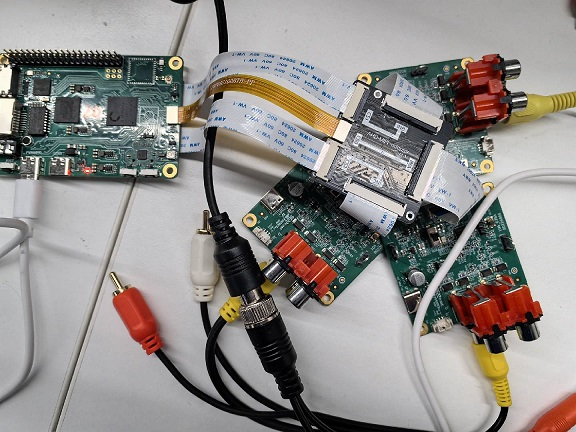

# K230 SDK CanMV Board Demo使用指南


版权所有©2023北京嘉楠捷思信息技术有限公司

<div style="page-break-after:always"></div>

## 免责声明

您购买的产品、服务或特性等应受北京嘉楠捷思信息技术有限公司（“本公司”，下同）及其关联公司的商业合同和条款的约束，本文档中描述的全部或部分产品、服务或特性可能不在您的购买或使用范围之内。除非合同另有约定，本公司不对本文档的任何陈述、信息、内容的正确性、可靠性、完整性、适销性、符合特定目的和不侵权提供任何明示或默示的声明或保证。除非另有约定，本文档仅作为使用指导参考。

由于产品版本升级或其他原因，本文档内容将可能在未经任何通知的情况下，不定期进行更新或修改。

## 商标声明

、“嘉楠”和其他嘉楠商标均为北京嘉楠捷思信息技术有限公司及其关联公司的商标。本文档可能提及的其他所有商标或注册商标，由各自的所有人拥有。

**版权所有 © 2023北京嘉楠捷思信息技术有限公司。保留一切权利。**
非经本公司书面许可，任何单位和个人不得擅自摘抄、复制本文档内容的部分或全部，并不得以任何形式传播。

<div style="page-break-after:always"></div>

## 目录

[TOC]

## 前言

### 概述

本文档主要介绍K230 SDK中提供适配Canmv-K230开发板上的demo程序。

### 读者对象

本文档（本指南）主要适用于以下人员：

- 技术支持工程师
- 软件开发工程师

### 缩略词定义

| 简称 | 说明                                                        |
|------|-------------------------------------------------------------|
| UVC  | USB video class（USB摄像头）                                |
| VVI  | virtual video input，虚拟视频输入，主要用于 pipeline 的调试 |

### 修订记录

| 文档版本号 | 修改说明  | 修改者 | 日期  |
|---|---|---|---|
| V1.0       | 初版 | 系统软件部 | 2023-10-11 |

## 1. 概述

此文档介绍K230 SDK提供的demo功能，使用方法等。其中rt-smart上的可执行程序都默认编译到了小核/sharefs目录下, 测试大核程序时，需要等待小核完全启动，之后在大核的msh中进入/sharefs/app目录内测试。各测试demo用到的音视频资源文件，可到以下链接地址获取
<https://kendryte-download.canaan-creative.com/k230/downloads/test_resource/>

## 2. Demo介绍

### 2.1 Display_demo

#### 2.1.1 display_demo简介

VO（Video Output，视频输出）模块主动从内存相应位置读取视频和图形数据，并通过相应的显示设备输出视频和图形。芯片支持的显示/回写设备、视频层和图形层情况。

#### 2.1.2 Feature说明

video ouput 包含了一个用例，即vo osd层插入帧的测试

#### 2.1.3 依赖资源

带HDMI接口的显示器及HDMI连接线，显示器要求支持1080P30，否则无法显示

#### 2.1.4 使用说明

##### 2.1.4.1 编译

软件编译参考release sdk软件包中的README.md

##### 2.1.4.2 执行

vo osd 层插入帧

`./sample_vo.elf 15`

执行完命令后、按一次回车会插入一张纯绿色图片、再按一次回车程序退出

显示效果如下：


### 2.2 Venc_demo

#### 2.2.1 Venc_demo简介

Venc demo实现对vi接收到到图形进行编码，并且可以对输入图像进行画框和OSD叠加。支持编码协议为H.264/H.265/JPEG。编码结果可以存储成文件，导出到本地，使用视频软件播放。

#### 2.2.2 Feature说明

只支持1280x720分辨率。

#### 2.2.3 依赖资源

摄像头

#### 2.2.4 使用说明

##### 2.2.4.1 mpp_demo执行

执行`./sample_venc.elf -h`后，输出demo的使用说明，如下：

```shell
Usage : ./sample_venc.elf [index] -sensor [sensor_index] -o [filename]
index:
    0) H.265e.
    1) JPEG encode.
    2) OSD + H.264e.
    3) OSD + Border + H.265e.

sensor_index: see vicap doc
```

sensor_index取值参看`k230_docs/zh/01_software/board/mpp/K230_Camera_Sensor适配指南.md`文档中关于k_vicap_sensor_type的描述，默认值为7

举例：

```shell
./sample_venc.elf 0 -sensor 24 -o out.265 // Canmv-K230-V1.0/1.1板
./sample_venc.elf 0 -sensor 39 -o out.265 // Canmv-K230-V2.0板
```

##### 2.2.4.2 MAPI编码demo

sample_venc默认使用的sensor类型是IMX335_MIPI_2LANE_RAW12_1920X1080_30FPS_LINEAR，目前该demo支持3路编码，可通过命令行传参的方式修改sensor类型以及其他参数，具体说明如下：

启动开发板后:

1. 通过 ` lsmod ` 检查小核侧是否加载k_ipcm模块，如未加载，执行 `insmod k_ipcm.ko` 加载k_ipcm模块
1. 在大核侧启动核间通信进程，执行 `./sample_sys_inif.elf`
1. 在小核侧 /mnt 目录下，执行 `./sample_venc`，默认执行1路h264视频编码，分辨率为1280x720，生成的码流文件存放在 /tmp 目录下面，如需传参可参考如下参数说明：

```shell
Usage: ./sample_venc -s 24 -n 2 -o /tmp -t 0            // Canmv-K230-V1.0/1.1板
                     -s or --sensor_type [sensor_index],\n");
                            see vicap doc
                     -n or --chn_num [number], 1, 2, 3
                     -t or --type [type_index]
                            0: h264 type
                            1: h265 type
                            2: jpeg type
                     -o or --out_path [output_path]
                     -h or --help, will print usage

Usage: ./sample_venc -s 39 -n 2 -o /tmp -t 0            // Canmv-K230-V2.0板
```

sensor_index取值参看`k230_docs/zh/01_software/board/mpp/K230_Camera_Sensor适配指南.md`文档中关于k_vicap_sensor_type的描述，默认值为7

可通过` ctrl+c `停止运行，根据不同的编码类型，会在小核指定的输出目录下生成不同的码流文件，对于h264类型，会生成形如`stream_chn0.264`文件，其中 0 代表0通道；对于h265类型，会生成形如 `stream_chn0.265`文件，同样 0 代表0通道；对于jpeg类型，会生成形如`chn0_0.jpg`的jpg图片，代表0通道第0张图片，默认会生成10张jpg图片。

##### 2.2.4.3 查看结果

输出文件可以导出到本地，用视频播放软件查看。

### 2.3 Nonai_2d_demo

#### 2.3.1 Nonai_2d_demo简介

Nonai_2d demo对输入文件实现图像叠加的功能。

#### 2.3.2 Feature说明

Nonai_2d通过读取yuv(I420格式）文件，进行图像叠加运算。

#### 2.3.3 依赖资源

无。

#### 2.3.4 使用说明

输入参数如下：

| 参数名 | 描述 | 默认值 |
|---|---|---|
| -i | 输入文件名 | - |
| -w | 图像宽度  | - |
| -h | 图像高度  | - |
| -o | 输出文件名 | - |

##### 2.3.4.1 执行

举例：

```shell
./sample_nonai_2d.elf -i /sharefs/foreman_128x64_3frames.yuv -w 128 -h 64 -o /sharefs/out_2d.yuv
```

##### 2.3.4.2 查看结果

输出文件可以导出到本地，用yuv播放软件查看。

### 2.4 Vdec_demo

#### 2.4.1 Vdec_demo简介

Vdec demo实现视频解码的功能。解码功能支持H.264/H.265/JPEG解码。支持的输入数据格式为.264/.265/.jpeg。

#### 2.4.2 Feature说明

Vdec demo通过读取流文件进行解码。解码输出结果通过屏幕显示。

#### 2.4.3 依赖资源

无。

#### 2.4.4 使用说明

##### 2.4.4.1 执行

执行`./sample_vdec.elf -help`，可以看到可配置参数及说明，其默认值如下表所示：

| 参数名 | 说明                                       | 默认值 |
|--------|--------------------------------------------|--------|
| i      | 输入文件名，需要后缀名分别为.264/.265/.jpg | -    |
| type | vo connector type, 参看vo 文档描述 | 0 |

其中type取值参看`k230_docs/zh/01_software/board/mpp/K230_视频输出_API参考.md`中关于k_connector_type的描述，设置为0

###### 2.4.4.1.1 VDEC绑定VO解码显示

`./sample_vdec.elf -type 1 -i canaan.264`

###### 2.4.4.1.2 MAPI VDEC绑定VO解码显示

`./sample_vdec.elf -type 1 -i canaan.264`

##### 2.4.4.2 查看结果

解码结果可以在屏幕上查看。

### 2.5 Audio_demo

#### 2.5.1 audio_demo简介

audio demo通过调用api接口来实现音频输入和输出功能。音频输入输出均使用i2s模块。demo中包含了可以单独测试音频输入或音频输出用例，也包含音频输入和输出同时测试的用例。

#### 2.5.2 Feature说明

##### 2.5.2.1 音频输入

音频输入通过采集环境中的声音并将其保存成文件来分析是否正常。

demo中采集15s钟的音频数据，采集到的文件格式为wav，可使用vlc直接播放。

##### 2.5.2.2 音频输出

音频输出通过播放wav文件，插上耳机听声音来判断是否正常。

demo中通过播放wav来测试音频输出功能,可上传不同音频格式的wav文件来测试音频输出功能。

##### 2.5.2.3 音频输入输出

音频输入和输出可同时测试。

1. 测试i2s模块功能，即:通过i2s音频输入实时采集环境中声音并通过i2s音频输出，接上耳机可实时听到环境中的声音。

##### 2.5.2.4 音频编解码

内置g711a/u 16bit 音频编解码器，用户可以注册其他外置编解码器。

#### 2.5.3 使用说明

##### 2.5.3.1 编译

1. 软件编译环境参考SDK中的`README.md`。

##### 2.5.3.2 执行

进入rt-smart系统后，进入/sharefs/app目录下，`sample_audio.elf`为测试demo。

- 可输入`./sample_audio.elf -help`查看demo使用方法。
- `-type`选项来测试不同模块功能；
- `-samplerate`选项来配置音频输入和输出不同采样率（8k-192k）,默认为44.1k；
- `-enablecodec`使用内置codec或者片外的音频子板；
- `-loglevel`打印内核日志等级；
- `-bitwidth`设置音频采样精度(16/24/32);
- `-filename`加载或存储wav/g711文件名称。


###### 2.5.3.2.1 I2S音频输入测试

- 输入`./sample_audio.elf -type 0`来采集15s中的pcm音频数据，
- `-samplerate`选项来选择采集不同采样率的音频,
- `-bitwidth` 来来设置不同的采样精度，
- `-enablecodec`设置是否使用内置codec，
- `-filename` 保存数据到文件。采集15s数据后，demo自动退出。

demo实现思路:该测试通过循环调用api函数:`kd_mpi_ai_get_frame`和`kd_mpi_ai_release_frame`来采集数据。注意i2s对应的ai dev号为0。


###### 2.5.3.2.2 I2S音频输出测试

支持播放wav文件，需将wav文件拷贝到sharefs路径下。该demo会循环播放wav文件（其他任意wav文件也可），用户可以按任意键来退出该功能测试。

demo实现思路:该测试通过循环调用api函数：`kd_mpi_ao_send_frame`来实时输出声音。


###### 2.5.3.2.3 I2S音频输入输出api接口测试

输入`./sample_audio.elf -type 3 -bitwidth 16`，通过api接口实时测试音频输入输出功能。

通过调用api接口：`kd_mpi_ai_get_frame`获取音频数据并调用`kd_mpi_ao_send_frame`输出音频数据来测试音频输入和输出整体功能。用户可以按任意键来退出该功能测试。测试过程中会实时输出ai采集到的时间戳信息。


###### 2.5.3.2.4 I2S音频输入和输出模块的系统绑定测试

输入`./sample_audio.elf -type 4`，通过ai和ao模块绑定实时测试音频输入输出功能。

通过调用系统绑定api接口：`kd_mpi_sys_bind`将ai和ao模块绑定，来测试音频输入和输出整体功能。用户可以按任意键来退出该功能测试。


###### 2.5.3.2.5 编码测试

获取ai数据并编码保存到文件。编解码只支持g711a/u，16bit。

系统绑定方式:`./sample_audio.elf -type 7 -bitwidth 16 -enablecodec 1 -filename /sharefs/i2s_codec.g711a`


api接口方式:`./sample_audio.elf -type 9 -bitwidth 16 -enablecodec 1 -filename /sharefs/i2s_codec.g711a`


###### 2.5.3.2.6 解码测试

读取文件数据并解码播放。编解码只支持g711a/u，16bit。

系统绑定方式:`./sample_audio.elf -type 8 -filename /sharefs/gyz.g711a -enablecodec 1 -bitwidth 16`


api接口方式:`./sample_audio.elf -type 10 -filename /sharefs/gyz.g711a -enablecodec 1 -bitwidth 16`


###### 2.5.3.2.7 音频全流程测试

1)录制模块ai-\>aenc-\>file 和播放模块 file-\>adec-\>ao 两条链路同时运行，模拟语音对讲的场景。使用内置codec，16bit精度来模拟。`-filename`来选择待播放的文件，为g711a格式，`-samplerate`选择采样精度。录制文件名称:为播放文件名称后+`_rec`:如-filename为`/sharefs/test.g711a`,则录制文件名为:`/sharefs/test.g711a_rec`.


2)ai-\>aenc ，adec-\>ao两条链路绑定回环测试。使用内置codec，16bit精度来模拟。

同时测试g711编码后的stream 时间戳。


输入`cat /proc/umap/sysbind` 可查看模块间系统绑定。


###### 2.5.3.2.8 mapi音频测试

确保大核已启动核间通信进程：先确认小核加载k_ipcm.ko模块，再确认大核启动:`/sharefs/app/sample_sys_init.elf &`

- 可输入`/mnt/sample_audio -help`查看demo使用方法。
- `-type`选项来测试不同模块功能。
- `-samplerate`选项来配置音频输入和输出不同采样率（8k-192k）,默认为44.1k。
- `-enablecodec`使用内置codec或者片外的音频子板，默认使用内置codec。
- `-filename`加载或存储g711文件名称。
- `-channels`:指定声道数。8


- ai->aenc测试

小核上执行命令:`/mnt/sample_audio -type 0 -filename test.g711a`,按q键可退出测试。demo能够实时采集音频数据并编码成g711a格式并保存到文件中。


- adec->ao测试

小核上执行命令:`/mnt/sample_audio -type 1 -filename tes.g711a`,按q键可退出测试。demo能够循环解码播放本地g711a格式的文件。


- ai->aenc adec->ao loopback测试

小核上执行命令:/mnt/sample_audio -type 2 ,按q键可退出测试。demo能够实时采集音频数据并编码成g711a格式，再解码g711a格式数据后播放输出。


### 2.6 Vicap_demo

#### 2.6.1 vicap_demo简介

vicap demo通过调用mpi接口实现摄像头数据采集预览功能。

#### 2.6.2 Feature说明

CanMV开发板默认使用OV5647摄像头模组，支持单个摄像头最多输出三路数据流。

#### 2.6.3 依赖资源

摄像头模组

#### 2.6.4 使用说明

##### 2.6.4.1 编译

软件编译环境参考SDK中的`README.md`。

1. 在k230_sdk目录下执行`make mpp-clean && rt-smart && make build-image`，将大核的修改编译进sd卡镜像中，会在`k230_sdk/output/k230_evb_defconfig/images/`目录下生成镜像文件`sysimage-sdcard.img`。

##### 2.6.4.2 执行

1. 将 `src/big/mpp/userapps/sample/elf/sample_vicap.elf`文件拷贝至本地指定的目录
1. 将该目录通过nfs挂载至小核Linux的`/sharefs`
1. 在大核端，通过`cd /sharefs` 命令进入`/sharefs`
1. 在该目录下执行`./sample_vicap`命令获取命令帮助信息

当输入：`sample_vicap`命令后打印如下提示信息：

```shell
usage: ./sample_vicap -mode 0 -dev 0 -sensor 23 -chn 0 -chn 1 -ow 640 -oh 480 -preview 1 -rotation 1      // Canmv-K230-V1.0/1.1板
usage: ./sample_vicap -mode 0 -dev 0 -sensor 33 -chn 0 -chn 1 -ow 640 -oh 480 -preview 1 -rotation 1      // Canmv-K230-V2.0板
Options:
 -mode:         vicap work mode[0: online mode, 1: offline mode. only offline mode support multiple sensor input]     default 0
 -dev:          vicap device id[0,1,2]        default 0
 -dw:           enable dewarp[0,1]    default 0
 -sensor:       sensor type[0: ov9732@1280x720, 1: ov9286_ir@1280x720], 2: ov9286_speckle@1280x720]
 -ae:           ae status[0: disable AE, 1: enable AE]        default enable
 -awb:          awb status[0: disable AWB, 1: enable AWb]     default enable
 -chn:          vicap output channel id[0,1,2]        default 0
 -ow:           the output image width, default same with input width
 -oh:           the output image height, default same with input height
 -ox:           the output image start position of x
 -oy:           the output image start position of y
 -crop:         crop enable[0: disable, 1: enable]
 -ofmt:         the output pixel format[0: yuv, 1: rgb888, 2: rgb888p, 3: raw], only channel 0 support raw data, default yuv
 -preview:      the output preview enable[0: disable, 1: enable], only support 2 output channel preview
 -rotation:     display rotaion[0: degree 0, 1: degree 90, 2: degree 270, 3: degree 180, 4: unsupport rotaion]
 -help:         print this help
```

参数说明如下：

| **参数名称** | **可选参数值** | **参数说明** |
|---|---|---|
| -dev         | 0：vicap设备0 1：vicap设备1 2：vicap设备2.                             | 指定当前使用的vicap设备，系统最多支持三个vicap设备。通过指定设备号实现sensor与不同vicap设备之间的绑定关系。 例如： -dev 1 -sensor 0即表示将ov9732 1280x720 RGB图像输出绑定到vicap设备1.                   |
| -mode | 0：在线模式；1：离线模式 | 指定vicap设备工作模式，当前之前在线模式和离线模式。对于多个sensor输入，必须指定为离线模式。 |
| -conn | 0: 屏 hx8399； 1: HDMI lt9611-1920x1080p60； 2: HDMI lt9611-1920x1080p30  |   指定显示方式，可以选择屏或者HDMI 默认为0 |
| -sensor      | 23：OV5647（Canmv-K230-V1.0/1.1板） 33：OV5647（Canmv-K230-V2.0板） | 指定当前使用的sensor类型                                                         |
| -chn         | 0：vicap设备输出通道0 1：vicap设备输出通道1 2：vicap设备输出通道2.     | 指定当前使用的vicap设备的输出通道，一个vicap设备最多支持三路输出，仅通道0支持RAW图像格式输出  |
| -ow          |                                                                         | 指定输出图像宽度，默认为输入图像宽度。宽度需要16字节对齐。 如果默认宽度超过显示屏输出最大宽度，则使用显示输出宽度作为图像最终输出宽度 如果输出宽度小于输入图像宽度，且未指定ox或者oy参数，则默认为缩放输出 |
| -oh          |                                                                         | 指定输出图像高度，默认为输入图像高度。 如果默认高度超过显示屏输出最大高度，则使用显示输出高度作为图像最终输出高度 如果输出高度小于输入图像高度，且未指定ox或者oy参数，则默认为缩放输出  |
| -ox          |                                                                         | 指定图像输出水平起始位置，该参数大于0将执行输出裁剪操作  |
| -oy          |                                                                         | 指定图像输出垂直起始位置，该参数大于0将执行输出裁剪操作 |
| -crop        | 0：禁用裁剪功能 1：使能裁剪功能                                         | 当输出图像尺寸小于输入图像尺寸时，默认未缩放输出，如果指定了该标志，则为裁剪输出  |
| -ofmt        | 0：yuv格式输出 1：rgb格式输出 2：raw格式输出                            | 指定输出图像格式，默认为yuv输出。  |
| -preview     | 0：禁用预览显示 1：使能预览显示                                         | 指定输出图像预览显示功能。默认为使能。当前最多支持2路输出图像同时预览。 |
| -rotation    | 0：旋转0度 1：旋转90度 2：旋转180度 3：旋转270度 4：不支持旋转          | 指定预览显示窗口旋转角度。默认仅第一路输出图像窗口支持旋转功能。 |

示例1：

`./sample_vicap -conn 1 -dev 0 -sensor 23 -chn 0 -chn 1 -ow 640 -oh 480 -preview 0  // Canmv-K230-V1.0/1.1板`

`./sample_vicap -conn 1 -dev 0 -sensor 33 -chn 0 -chn 1 -ow 640 -oh 480 -preview 0  // Canmv-K230-V2.0板`

说明：将ov5647@1920x1080 RGB输出 绑定到vicap设备0,并使能vicap设备输出通道0和通道1，其中通道0输出大小默认为输入图像大小（1920x1080），通道1输出图像大小为640x480

示例2：ov5647三摄


注意：背面的两个ov5647可以使用树莓派的ov5647摄像头，Canmv-K230 V1.0 V1.1版本的板子需要更换LDO为1.8V，如RT9013-18。如下图所示


如果不方便更换LDO可以等待后续的V1.2版本的板子。

`./sample_vicap.elf -conn 1 -mode 1 -dev 0 -sensor 23 -chn 0 -ow 320 -oh 240 -dev 1 -sensor 26 -chn 0 -ow 320 -oh 240 -dev 2 -sensor 27 -chn 0 -ow 320 -oh 240 -ofmt 1  // Canmv-K230-V1.0/1.1板`

`./sample_vicap.elf -conn 1 -mode 1 -dev 0 -sensor 31 -chn 0 -ow 320 -oh 240 -dev 1 -sensor 32 -chn 0 -ow 320 -oh 240 -dev 2 -sensor 33 -chn 0 -ow 320 -oh 240 -ofmt 1  // Canmv-K230-V2.0板`


### 2.7 DMA_demo

#### 2.7.1 DMA_demo简介

##### 2.7.1.1 非绑定模式

dma 通道 0-3 是 gdma，4-7 是 sdma。

- 通道 0 连续输入分辨率为 1920x1080 的图像，8bit，YUV400，单通道模式，旋转 90 度后输出，和 golden 数据比对
- 通道 1 连续输入分辨率为 1280x720 的图像，8bit，YUV420，双通道模式，旋转180 度后输出，和 golden 数据比对
- 通道 2 连续输入分辨率为 1280x720 的图像，10bit，YUV420，三通道模式，x-mirror，y-mirror 后输出，和 golden 数据比对
- 通道 4 为 1d 模式循环传输一段数据，传输完成后和 golden 数据比对
- 通道 5 为 2d 模式循环传输一段数据，传输完成后和 golden 数据比对

##### 2.7.1.2 绑定模式

使用 vvi 作为 dma 模拟输入，vvi 设备 0 的通道 0 绑定 dma 的通道 0，vvi 设备 0 的通道 1 绑定 dma 的通道 1。vvi 每隔一秒，向通道 0 输入 640x320，YUV400，8bit，旋转 90° 的图像，向通道 1 输入 640x320，YUV400，8bit，旋转 180° 的图像。

#### 2.7.2 Feature说明

包括 dma 设备属性配置，通道属性配置，图形输入、输出、释放，pipeline 绑定等功能。

#### 2.7.3 依赖资源

无

#### 2.7.4 使用说明

##### 2.7.4.1 编译

软件编译参考 release sdk 软件包中的 README.md。

##### 2.7.4.2 执行

1. 非绑定模式 demo 运行

`/sharefs/app/sample_dma.elf`

会有测试信息在屏幕上显示出来，输入 q 结束运行。

1. 绑定模式 demo 运行

`/sharefs/app/sample_dma_bind.elf`

会有测试信息在屏幕上显示出来，输入 q 结束运行。

### 2.8 USB_demo

#### 2.8.1 USB_demo简介

USB demo目前调试了4个功能，

作为device，模拟U盘，模拟鼠标键盘。

作为host，连接U盘，连接鼠标键盘。

#### 2.8.2 Feature说明

USB demo的功能是linux系统原始集成的功能。

#### 2.8.3 依赖资源

typeC线，typeC转typeA。

#### 2.8.4 使用说明

##### 2.8.4.1 作为device模拟U盘

```shell
#规划一块内存空间作为模拟U盘的磁盘空间。
[root@canaan / ]#gadget-storage-mem.sh
2+0 records in
2+0 records out
mkfs.fat 4.1 (2017-01-24)
[ 1218.882053] Mass Storage Function, version: 2009/09/11
[ 1218.887308] LUN: removable file: (no medium)
[ 1218.895464] dwc2 91500000.usb-otg: bound driver configfs-gadget
[root@canaan / ]#[ 1219.019554] dwc2 91500000.usb-otg: new device is high-speed
[ 1219.056629] dwc2 91500000.usb-otg: new address 5

##使用SD/eMMC的FAT分区当作模拟U盘的磁盘空间。
[root@canaan ~ ]#gadget-storage.sh
[  359.995510] Mass Storage Function, version: 2009/09/11
[  360.000762] LUN: removable file: (no medium)
[  360.013138] dwc2 91500000.usb-otg: bound driver configfs-gadget
[root@canaan ~ ]#[  360.136809] dwc2 91500000.usb-otg: new device is high-speed
[  360.173543] dwc2 91500000.usb-otg: new address 43
```

连接开发板的USB口，typeC连接PC，PC上显示U盘连接。

##### 2.8.4.2 作为HOST连接U盘

K230开发板USB口通过typeC转typeA连接U盘。

##### 2.8.4.3 作为device模拟鼠标键盘

K230开发板USB口通过typeC连接另外一台电脑设备来进行测试

```shell
[root@canaan / ]#gadget-hid.sh

[root@canaan / ]#hid_gadget_test /dev/hidg0 mouse
#根据提示输入相应的操作，比如-123 -123，可以看到PC上的鼠标指针移动。

[root@canaan / ]#hid_gadget_test /dev/hidg1 keyboard
#根据提示输入相应的操作，可以看到PC上的类似键盘输入。比如a b c --return
```

##### 2.8.4.4 作为HOST连接鼠标键盘

K230开发板USB通过typeC转typeA连接鼠标或键盘。

```shell
#通过以下命令确定input设备对应的event。K230开发板如果没有连接屏幕，连接鼠标键盘对应的event会改变。
[root@canaan ~ ]#cat /proc/bus/input/devices
...
I: Bus=0003 Vendor=046d Product=c52f Version=0111
N: Name="Logitech USB Receiver"
P: Phys=usb-91500000.usb-otg-1/input0
S: Sysfs=/devices/platform/soc/91500000.usb-otg/usb1/1-1/1-1:1.0/0003:046D:C52F.0001/input/input2
U: Uniq=
H: Handlers=event2
B: PROP=0
B: EV=17
B: KEY=ffff0000 0 0 0 0
B: REL=1943
B: MSC=10
```

```shell
[root@canaan / ]$ test_mouse /dev/input/event2
#点击或移动鼠标，串口会有对应的显示。

[root@canaan / ]$ test_keyboard /dev/input/event2
#按下键盘不同的按键，串口会有对应的显示。
```

### 2.9 GPU_demo

#### 2.9.1 GPU_demo简介

GPU demo共包含三个可执行程序

- `tiger`：绘制老虎的矢量图示例
- `linearGrad`: 绘制线性渐变示例
- `imgIndex`: 绘制颜色查找表示例

#### 2.9.2 Feature说明

GPU demo主要覆盖GPU的矢量绘制、线性渐变（通过pattern实现）、颜色查找表三个功能。

#### 2.9.3 依赖资源

文件系统可写。

#### 2.9.4 使用说明

进入一个可写的目录，执行程序

##### 2.9.4.1 tiger

运行`tiger`命令，执行完成后在当前目录下生成tiger.png，如下图所示


##### 2.9.4.2 linearGrad

运行`linearGrad`命令，执行完成后在当前目录生成linearGrad.png，如下图所示


##### 2.9.4.3 imgIndex

运行`imgIndex`命令，执行完成后在当前目录生成4个图片文件，如下图所示

- `imgIndex1.png`: index1模式，支持2种颜色


- `imgIndex2.png`: index2模式，支持4种颜色


- `imgIndex4.png`: index4模式，支持16种颜色


- `imgIndex8.png`: index8模式，支持256种颜色


##### 2.9.4.4 vglite_drm

运行`vglite_drm`命令，会在LCD屏幕上显示由GPU绘制的图案，再按一次`Enter`键显示下一个图案，如图所示


##### 2.9.4.5 vglite_cube

运行`vglite_cube`命令，会在LCD屏幕上显示由GPU绘制的旋转的正方体，如下图所示


这个demo运行时内核会有大量的打印消息，如果不希望显示这些消息可以降低内核打印级别

```shell
sysctl -w kernel.printk=6
```

### 2.10 DRM显示demo

#### 2.10.1 demo使用简介

该demo运行在K230小核的Linux系统上，具体是将图片显示到屏幕上。

#### 2.10.2 Features说明

1. DRM支持5个图层操作，具体包括：1个video层和4个OSD层；
1. video层支持NV12、NV21、NV16、NV61颜色空间
1. OSD层支持ARGB8888、ARGB4444、RGB888、RGB565颜色空间

#### 2.10.3 依赖资源

HDMI显示器

#### 2.10.4 使用说明

##### 2.10.4.1 编译

软件编译参考release sdk软件包中的README.md

##### 2.10.4.2 执行

```shell
modetest -M canaan-drm -D 0 -a -s 38@36:1920x1080-30  -P 32@36:1920x1080@AR24 -v -F smpte
```

执行完上述命令，会在HDMI显示器上显示彩条，具体如下所示：


### 2.11 LVGL demo

#### 2.11.1 demo使用简介

该demo运行在K230小核的Linux系统上，会在HDMI显示器上显示一个配置界面。

#### 2.11.3 依赖资源

HDMI显示器

#### 2.11.3 使用说明

##### 2.11.3.1 编译

软件编译参考release sdk软件包中的README.md

##### 2.11.3.2 执行

```shell
lvgl_demo_widgets
```

执行完上述命令，会在HDMI显示器上显示配置界面，具体如下所示：


### 2.12 Rtsp推流Demo

#### 2.12.1 Demo简介

该demo实现rtsp推流。

#### 2.12.2 Feature说明

该demo支持音视频码流同时推流到rtsp server上，其中通过`mapi venc&aenc`接口实现对音视频的编码；推流之后通过url进行拉取，目前该demo支持3路url推拉流。

#### 2.12.3 依赖资源

需要usb转eth网口转换器，将开发板连接网线

#### 2.12.4 使用说明

##### 2.12.4.1 编译

参考release sdk软件包中的`README.md`中介绍，在docker环境编译cdk-user即可，编译完成后在`k230_sdk/src/common/cdk/user/out/little`下生成可执行程序rtsp_demo

##### 2.12.4.2 执行

rtsp_demo默认使用的sensor类型是IMX335_MIPI_2LANE_RAW12_1920X1080_30FPS_LINEAR，可通过命令行传参的方式修改sensor类型以及其他参数，具体说明如下：

启动开发板后:

1. 通过 ` lsmod ` 检查小核侧是否加载k_ipcm模块，如未加载，执行 `insmod k_ipcm.ko` 加载k_ipcm模块
1. 在大核侧启动核间通信进程，执行 `./sample_sys_inif.elf`
1. 在小核侧/mnt目录下，执行 ` ./rtsp_demo `，默认为1路h265视频编码推流，分辨率为1280x720，如需传参参看如下参数说明，当推流mjpeg码流时，分辨率目前最大支持2032x1944，最小分辨率为640x480.

```shell
Usage: ./rtsp_demo -s 24 -n 2 -t h265 -w 1280 -h 720 -a 0  // Canmv-K230-V1.0/1.1板
Usage: ./rtsp_demo -s 39 -n 2 -t h265 -w 1280 -h 720 -a 0  // Canmv-K230-V2.0板
                    -s: the sensor type:
                        see vicap doc
                    -n: the session number, range: 1, 2，3
                    -t: the video encoder type: h264/h265/mjpeg
                    -w: the video encoder width
                    -h: the video encoder height
                    -a: audio input type(0:mic input  1:headphone input):default 0.
```

其中sensor类型取值查看`k230_docs/zh/01_software/board/mpp/K230_Camera_Sensor适配指南.md`文档中关于k_vicap_sensor_type的描述
音频输入类型可选择：板载mic或者耳机输入。

小核上正常运行rtsp_demo后，会打印出形如：`rtsp://ip:8554/session0` 的url地址，其中 0 代表第0路，可通过vlc拉取url的流进行播放；如需停止运行，请先停止vlc拉流，然后执行` ctrl+c `停止运行 rtsp_demo。

### 2.13 FaceAeDemo

#### 2.13.1 Demo介绍

该demo在大核使用，是VICAP、KPU、VO（视频输出）、AERoi联调的demo，可通过人脸检测的接口适当调节人脸曝光亮度。

#### 2.13.2 编译

1. 首先参考release sdk软件包中的README.md，使用docker编译镜像。
1. 编译完成后，默认将该sample（sample_face_ae.elf）存放在该路径下`k230_sdk/src/big/mpp/userapps/sample/elf`
1. 由于KPU联动需要使用检测模型test.kmodel，编译后存放路径`k230_sdk/src/big/mpp/userapps/sample/elf`

#### 2.13.3 执行

```shell
cd /sharefs/app
./sample_face_ae.elf test.kmodel 1 # arg1: 模型名称， arg2： 开启face ae
等待初始化完成提示任意字母+enter
键入a，键入回车，运行face ae demo
执行成功后，会打印每一帧图像的物理地址
```

### 2.14 FFT Demo

#### 2.14.1 Demo 简介

本 demo 用于验证fft api使用，测试fft功能，代码见src/big/mpp/userapps/sample/sample_fft/

#### 2.14.2 Feature说明

先进行fft计算，在进行ifft计算

#### 2.14.3 依赖资源

无

#### 2.14.4 使用说明

##### 2.14.4.1 编译

> 请参考release sdk软件包中的README.md。

##### 2.14.4.2 执行

1. 大小核系统都起来后，在大核命令行执行下面命令：

   ```bash
   cd /sharefs/app;./sample_fft.elf
   ```

   大核串口输出内容如下：

   ```text
   msh /sharefs/app>./sample_fft.elf 1 0
   -----fft ifft point 0064  -------
       max diff 0003 0001
       i=0045 real  hf 0000  hif fc24 org fc21 dif 0003
       i=0003 imag  hf ffff  hif 0001 org 0000 dif 0001
   -----fft ifft point 0064 use 133 us result: ok


   -----fft ifft point 0128  -------
       max diff 0003 0002
       i=0015 real  hf 0001  hif fca1 org fc9e dif 0003
       i=0031 imag  hf 0001  hif fffe org 0000 dif 0002
   -----fft ifft point 0128 use 121 us result: ok


   -----fft ifft point 0256  -------
       max diff 0003 0001
       i=0030 real  hf 0000  hif fca1 org fc9e dif 0003
       i=0007 imag  hf ffff  hif 0001 org 0000 dif 0001
   -----fft ifft point 0256 use 148 us result: ok


   -----fft ifft point 0512  -------
       max diff 0003 0003
       i=0060 real  hf 0000  hif fca1 org fc9e dif 0003
       i=0314 imag  hf 0001  hif fffd org 0000 dif 0003
   -----fft ifft point 0512 use 206 us result: ok


   -----fft ifft point 1024  -------
       max diff 0005 0002
       i=0511 real  hf 0000  hif fc00 org fc05 dif 0005
       i=0150 imag  hf 0000  hif fffe org 0000 dif 0002
   -----fft ifft point 1024 use 328 us result: ok


   -----fft ifft point 2048  -------
       max diff 0005 0003
       i=1022 real  hf 0000  hif fc00 org fc05 dif 0005
       i=1021 imag  hf 0000  hif 0003 org 0000 dif 0003
   -----fft ifft point 2048 use 574 us result: ok


   -----fft ifft point 4096  -------
       max diff 0005 0002
       i=4094 real  hf 027b  hif 041f org 0424 dif 0005
       i=0122 imag  hf 0000  hif 0002 org 0000 dif 0002
   -----fft ifft point 4096 use 1099 us result: ok

   ```

### 2.15 SDIO WIFI

#### 2.15.1 Demo介绍

CANMV开发板上使用了一颗支持2.4G的SDIO WIFI，AP6212。支持STA与softAP模式。

#### 2.15.2 编译

k230_sdk编译CANMV的配置默认是支持AP6212 WIFI的。

make menuconfig

```shell
K230 SDK Configuration
    wifi configurations  --->
        [*] enable ap6212a
```

使能ap6212a后，k230_sdk 会把WIFI需要的固件或nvram配置拷贝到文件系统中。

make linux-menuconfig

```shell
Linux/riscv 5.10.4 Kernel Configuration
    Device Drivers  --->
        [*] Network device support  --->
            [*]   Wireless LAN  --->
                <M>   Broadcom FullMAC wireless cards support
                (/etc/firmware/fw_bcm43456c5_ag.bin) Firmware path
                (/etc/firmware/nvram.txt) NVRAM path
                    Enable Chip Interface (SDIO bus interface support)  --->
                    Interrupt type (In-Band Interrupt)  --->
```

配置LINUX编译WIFI驱动，CANMV默认WIFI的STA与softAP共存模式。源码路径：

src/little/linux/drivers/net/wireless/bcmdhd

make buildroot-menuconfig

```shell
Buildroot 2021.02-git Configuration
    Target packages  --->
        Networking applications  --->
            [*] hostapd
            [*]   Enable hostap driver
            [*]   Enable nl80211 driver
            [ ]   Enable wired driver
            [*]   Enable ACS
            [*]   Enable EAP
            [*]   Enable WPS
            [*]   Enable WPA3 support
            [*]   Enable VLAN support
            [*]     Enable dynamic VLAN support
            [*]     Use netlink-based API for VLAN operations

            [*] wireless tools
                [*]   Install shared library

            [*] wpa_supplicant
                [*]   Enable nl80211 support
                [*]   Enable AP mode
                [*]     Enable Wi-Fi Display
                [*]     Enable mesh networking
                [*]   Enable autoscan
                [*]   Enable EAP
                [*]   Enable HS20
                [*]   Enable syslog support
                [*]   Enable WPS
                [*]   Enable WPA3 support
                [*]   Install wpa_clibinary
                [ ]   Install wpa_client shared library
                [*]   Install wpa_passphrase binary
                [*]   Enable support for the DBus control interface
```

编译buildroot，增加无线使用的工具。

WIFI模块在系统启动时在uboot中进行复位。源码：

src/little/uboot/board/canaan/k230_canmv/board.c : board_late_init

WIFI模块在系统启动后，if wlan down/up 对WIFI模块进行上电下电操作。源码：

```c
&gpio1 {
    status = "okay";
};

&mmc_sd0{
    status = "okay";
    io_fixed_1v8;
    rx_delay_line = <0x00>;
    tx_delay_line = <0x00>;
    bcmdhd_wlan {
        compatible = "android,bcmdhd_wlan";
        gpio_wl_reg_on = <&port1 0 GPIO_ACTIVE_HIGH>;
    };
};
```

#### 2.14.5 执行

STA是Station的缩写，它是无线网络中的一个终端站点设备，可以看成是一个客户端，一般来说，处在STA模式下的设备本身不接受无线的接入，该设备连接到AP节点进行网络访问，我们的手机就是作为STA连接路由器。

AP是Access Point的缩写，即无线接入点，它是一个无线网络的中心节点，可以看成是一个服务器。它作为一个网络的中心节点，提供无线接入服务，其他的无线设备允许接入该节点，所有接入该节点设备的无线信号数据都要通过它才能进行交换和互相访问。一般的无线路由器、网关、热点就是工作在AP模式下，AP节点和AP节点之间允许相互连接。

##### 2.14.5.1 STA测试

```shell
ifconfig -a
ifconfig  wlan0 up
wpa_supplicant -D nl80211 -i wlan0 -c /etc/wpa_supplicant.conf -B
wpa_cli -i wlan0 scan
wpa_cli -i wlan0 scan_result
wpa_cli -i wlan0 add_network
wpa_cli -i wlan0 set_network 1 psk '"12345678"'
wpa_cli -i wlan0 set_network 1 ssid '"wifi_test"'
wpa_cli -i wlan0 select_network 1
udhcpc -i wlan0 -q
```

##### 2.14.5.2 AP测试

```shell
[root@canaan ~ ]#cat /etc/hostapd.conf
ctrl_interface=/var/run/hostapd
driver=nl80211
ieee80211n=1
interface=wlan1
hw_mode=g
channel=6
beacon_int=100
dtim_period=1
ssid=k230_ap
auth_algs=1
ap_isolate=0
ignore_broadcast_ssid=0
```

```shell
ifconfig wlan1 192.168.1.1
udhcpd /etc/udhcpd.conf &
hostapd /etc/hostapd.conf &
```

sta可以直接连接无密码的k230_ap热点。

### 2.15 UVC_demo

#### 2.15.1 uvc_demo简介

uvc demo把K230开发板当作一个USB摄像头，USB线连接到PC，PC的播放器可以播放真实摄像头的图像。

#### 2.15.2 Feature说明

当前版本支持bulk传输与ISO传输。

当前版本只支持640x480 NV12格式图像 1280x720 H264/MJPEG格式图像。

支持PID、VID以及设备名称通过修改shell脚本配置。

#### 2.15.3 依赖资源

type c线连接USB0与PC

PC的相机应用或安装PotPlayer软件

#### 2.15.4 使用说明

##### 2.15.4.1 编译

软件编译环境参考SDK中的README.md。

1. 小核用户程序源码位于`cdk/user/mapi/sample/camera`
1. 小核驱动程序位于`linux/drivers/usb/dwc2`
1. 小核驱动程序位于`linux/drivers/usb/gadget`
1. 大核程序涉及到mpp仓库以及cdk

大核rtt实现摄像头驱动功能。

小核linux实现USB驱动功能，通过mapi从大核获取摄像头图像。

参考 [K230_USB应用实战_UVC传输YUV及编码码流](../../../../zh/02_applications/tutorials/K230_USB应用实战_UVC传输YUV及编码码流.md)

##### 2.15.4.2 执行

进入大核rt-smart系统后，进入/bin目录下，执行

```shell
msh /sharefs/app>./sample_sys_init.elf
```

进入小核linux系统后，进入`/mnt`目录下，执行

```shell
./canaan-camera.sh start otg0

./camera -t 24
```

typec USB线连接USB0与PC，potplayer播放器播放摄像头。

默认使用BULK传输，使用以下命令可以更改为ISO传输。

```shell
./canaan-camera.sh stop

./canaan-camera.sh start otg0 iso

./camera -i -t 24  // Canmv-K230-V1.0/1.1板
./camera -i -t 39  // Canmv-K230-V2.0板
```

-t 选项用于指定vicap sensor 类型，请参考`k230_docs/zh/01_software/board/mpp/K230_Camera_Sensor适配指南.md`文档中关于k_vicap_sensor_type的描述，CanMV需指定为24。

进入PotPlayer -> `选项` -> `设备` -> `摄像头` 界面,
`视频录制设备`->`设备`，选择`UVC Camera`
`视频录制设备`-> `格式`，选择`H264 1280*720 30(P 16:9)`或`MJPG 1280*720 30(P 16:9)`或`NV12 640*360p 30(P 16:9)`

PotPlayer -> `打开` -> `摄像头/其他设备`

### 2.16 YUV Sensor demo

#### 2.16.1 Demo简介

三路YUV sensor输入，通过vicap的MCM硬件输出yuv444 packed格式到ddr，利用nonai_2d硬件的CSC功能转成nv12格式。

vicap绑定nonai_2d，nonai_2d一出二绑定venc和vo，做rtsp推流和屏显。

#### 2.16.2 Feature说明

只支持1280x720分辨率。

#### 2.16.3 依赖资源

依赖特殊的转接板硬件，见下图：



#### 2.16.4 使用说明

进入大核rt-smart系统后，执行

```shell
/sharefs/app/sample_yuv_sensor.elf
```

进入小核linux系统后，执行

```shell
/mnt/yuv_sensor_demo -n 3
```

小核上正常运行rtsp_demo后，会打印出形如：`rtsp://10.100.228.150:8554/BackChannelTest0` 的url地址，其中 0 代表第0路，可通过vlc拉取url的流进行播放，也可接HDMI输出到屏幕观看
