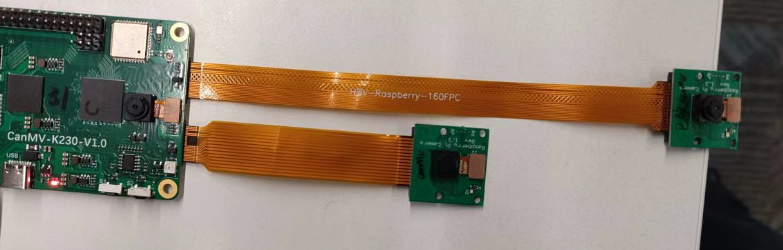
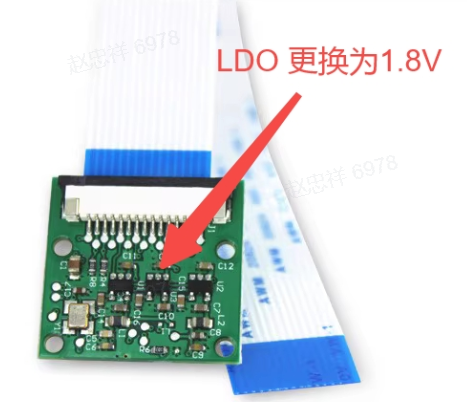
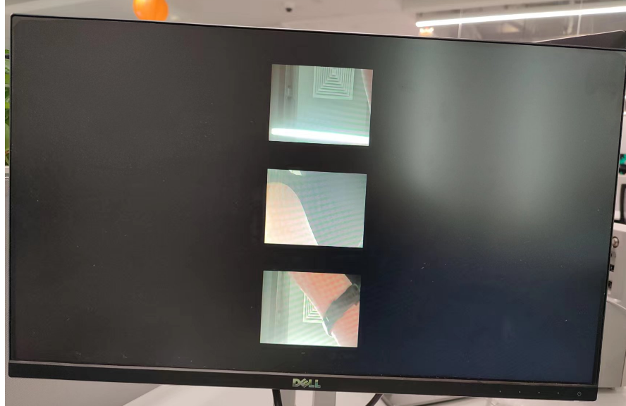

# K230 SDK CanMV Board Demo使用指南


版权所有©2023北京嘉楠捷思信息技术有限公司

<div style="page-break-after:always"></div>

## 免责声明

您购买的产品、服务或特性等应受北京嘉楠捷思信息技术有限公司（“本公司”，下同）及其关联公司的商业合同和条款的约束，本文档中描述的全部或部分产品、服务或特性可能不在您的购买或使用范围之内。除非合同另有约定，本公司不对本文档的任何陈述、信息、内容的正确性、可靠性、完整性、适销性、符合特定目的和不侵权提供任何明示或默示的声明或保证。除非另有约定，本文档仅作为使用指导参考。

由于产品版本升级或其他原因，本文档内容将可能在未经任何通知的情况下，不定期进行更新或修改。

## 商标声明

、“嘉楠”和其他嘉楠商标均为北京嘉楠捷思信息技术有限公司及其关联公司的商标。本文档可能提及的其他所有商标或注册商标，由各自的所有人拥有。

**版权所有 © 2023北京嘉楠捷思信息技术有限公司。保留一切权利。**
非经本公司书面许可，任何单位和个人不得擅自摘抄、复制本文档内容的部分或全部，并不得以任何形式传播。

<div style="page-break-after:always"></div>

## 目录

[TOC]

## 前言

### 概述

本文档主要介绍K230 SDK中提供适配Canmv-K230开发板上的demo程序。

### 读者对象

本文档（本指南）主要适用于以下人员：

- 技术支持工程师
- 软件开发工程师

### 缩略词定义

| 简称 | 说明                                                        |
|------|-------------------------------------------------------------|
| UVC  | USB video class（USB摄像头）                                |
| VVI  | virtual video input，虚拟视频输入，主要用于 pipeline 的调试 |

### 修订记录

| 文档版本号 | 修改说明  | 修改者 | 日期  |
|---|---|---|---|
| V1.0       | 初版 | 系统软件部 | 2023-10-11 |

## 1. 概述

此文档介绍K230 SDK提供的demo功能，使用方法等。其中rt-smart上的可执行程序都默认编译到了小核/sharefs目录下, 测试大核程序时，需要等待小核完全启动，之后在大核的msh中进入/sharefs/app目录内测试。各测试demo用到的音视频资源文件，可到以下链接地址获取
<https://kendryte-download.canaan-creative.com/k230/downloads/test_resource/>

## 2. Demo介绍

### 2.1 Display_demo

#### 2.1.1 display_demo简介

VO（Video Output，视频输出）模块主动从内存相应位置读取视频和图形数据，并通过相应的显示设备输出视频和图形。芯片支持的显示/回写设备、视频层和图形层情况。

#### 2.1.2 Feature说明

video ouput 包含了一个用例，即vo osd层插入帧的测试

#### 2.1.3 依赖资源

带HDMI接口的显示器及HDMI连接线，显示器要求支持1080P30，否则无法显示

#### 2.1.4 使用说明

##### 2.1.4.1 编译

软件编译参考release sdk软件包中的README.md

##### 2.1.4.2 执行

vo osd 层插入帧

`./sample_vo.elf 15`

执行完命令后、按一次回车会插入一张纯绿色图片、再按一次回车程序退出

显示效果如下：


### 2.2 Venc_demo

#### 2.2.1 Venc_demo简介

Venc demo实现对vi接收到到图形进行编码，并且可以对输入图像进行画框和OSD叠加。支持编码协议为H.264/H.265/JPEG。编码结果可以存储成文件，导出到本地，使用视频软件播放。

#### 2.2.2 Feature说明

只支持1280x720分辨率。

#### 2.2.3 依赖资源

摄像头

#### 2.2.4 使用说明

##### 2.2.4.1 mpp_demo执行

执行`./sample_venc.elf -h`后，输出demo的使用说明，如下：

```shell
Usage : ./sample_venc.elf [index] -sensor [sensor_index] -o [filename]
index:
    0) H.265e.
    1) JPEG encode.
    2) OSD + H.264e.
    3) OSD + Border + H.265e.

sensor_index: see vicap doc
```

sensor_index取值参看`k230_docs/zh/01_software/board/mpp/K230_Camera_Sensor适配指南.md`文档中关于k_vicap_sensor_type的描述，默认值为7

举例：

```shell
./sample_venc.elf 0 -sensor 24 -o out.265 // Canmv-K230-V1.0/1.1板
./sample_venc.elf 0 -sensor 39 -o out.265 // Canmv-K230-V2.0板
```

##### 2.2.4.2 查看结果

输出文件可以导出到本地，用视频播放软件查看。

### 2.3 Nonai_2d_demo

#### 2.3.1 Nonai_2d_demo简介

Nonai_2d demo对输入文件实现图像叠加的功能。

#### 2.3.2 Feature说明

Nonai_2d通过读取yuv(I420格式）文件，进行图像叠加运算。

#### 2.3.3 依赖资源

无。

#### 2.3.4 使用说明

输入参数如下：

| 参数名 | 描述 | 默认值 |
|---|---|---|
| -i | 输入文件名 | - |
| -w | 图像宽度  | - |
| -h | 图像高度  | - |
| -o | 输出文件名 | - |

##### 2.3.4.1 执行

举例：

```shell
./sample_nonai_2d.elf -i foreman_128x64_3frames.yuv -w 128 -h 64 -o out_2d.yuv
```

如果测试程序跑在sd上，不挂载nfs，2d使用nfs，测试报错。

##### 2.3.4.2 查看结果

输出文件可以导出到本地，用yuv播放软件查看。

### 2.4 Vdec_demo

#### 2.4.1 Vdec_demo简介

Vdec demo实现视频解码的功能。解码功能支持H.264/H.265/JPEG解码。支持的输入数据格式为.264/.265/.jpeg。

#### 2.4.2 Feature说明

Vdec demo通过读取流文件进行解码。解码输出结果通过屏幕显示。

#### 2.4.3 依赖资源

无。

#### 2.4.4 使用说明

##### 2.4.4.1 执行

执行`./sample_vdec.elf -help`，可以看到可配置参数及说明，其默认值如下表所示：

| 参数名 | 说明                                       | 默认值 |
|--------|--------------------------------------------|--------|
| i      | 输入文件名，需要后缀名分别为.264/.265/.jpg | -    |
| type | vo connector type, 参看vo 文档描述 | 0 |

其中type取值参看`k230_docs/zh/01_software/board/mpp/K230_视频输出_API参考.md`中关于k_connector_type的描述，设置为0

###### 2.4.4.1.1 VDEC绑定VO解码显示

`./sample_vdec.elf -type 1 -i canaan.264`

##### 2.4.4.2 查看结果

解码结果可以在屏幕上查看。

### 2.5 Audio_demo

#### 2.5.1 audio_demo简介

audio demo通过调用api接口来实现音频输入和输出功能。音频输入输出均使用i2s模块。demo中包含了可以单独测试音频输入或音频输出用例，也包含音频输入和输出同时测试的用例。

#### 2.5.2 Feature说明

##### 2.5.2.1 音频输入

音频输入通过采集环境中的声音并将其保存成文件来分析是否正常。

demo中采集15s钟的音频数据，采集到的文件格式为wav，可使用vlc直接播放。

##### 2.5.2.2 音频输出

音频输出通过播放wav文件，插上耳机听声音来判断是否正常。

demo中通过播放wav来测试音频输出功能,可上传不同音频格式的wav文件来测试音频输出功能。

##### 2.5.2.3 音频输入输出

音频输入和输出可同时测试。

1. 测试i2s模块功能，即:通过i2s音频输入实时采集环境中声音并通过i2s音频输出，接上耳机可实时听到环境中的声音。

##### 2.5.2.4 音频编解码

内置g711a/u 16bit 音频编解码器，用户可以注册其他外置编解码器。

#### 2.5.3 使用说明

##### 2.5.3.1 编译

1. 软件编译环境参考SDK中的`README.md`。

##### 2.5.3.2 执行

启动rt-smart系统后，进入/sharefs/app目录下，`sample_audio.elf`为测试demo。

- 可输入`./sample_audio.elf -help`查看demo使用方法。

| 参数名 | 说明                                       | 默认值 |
|--------|--------------------------------------------|--------|
| type      | 测试不同模块功能[0,12] | -    |
| samplerate | 配置音频输入和输出不同采样率（8k-192k) | 44100 |
| enablecodec | 是否启用内置codec[0,1]。 1:使用内置codec | 0 |
| bitwidth | 设置音频采样精度[16,24,32]。| 16 |
| filename | 加载或存储wav/g711文件名称。| - |
| channels | 设置音频声道数，单声道或双声道[1,2]。| 2 |
| monochannel | 如何设置为单声道，设置单声道类型[0,1]。0:板载mic，1：耳机输入| 0 |
| audio3a | 是否启用audio3a:enable_ans:0x01,enable_agc:0x02,enable_aec:0x04,可叠加多个使能项| 0 |

```shell
msh /sharefs/app>./sample_audio.elf
Please input:
-type: test audio function[0-12]
  type 0:sample ai i2s module
  type 1:sample ai pdm module
  type 2:sample ao i2s module
  type 3:sample ai(i2s) to ao (api) module
  type 4:sample ai(i2s) to ao (sysbind) module
  type 5:sample ai(pdm) to ao (api) module
  type 6:sample ai(pdm) bind ao (sysbind) module
  type 7:sample aenc(ai->aenc->file) (sysbind) module
  type 8:sample adec(file->adec->ao) (sysbind) module
  type 9:sample aenc(ai->aenc->file) (api) module
  type 10:sample adec(file->adec->ao) (api) module
  type 11:sample overall test (ai->aenc->file file->adec->ao) module
  type 12:sample overall test (ai->aenc  adec->ao loopback ) module
-samplerate: set audio sample(8000 ~ 192000)
-enablecodec: enable audio codec(0,1)
-loglevel: show kernel log level[0,7]
-bitwidth: set audio bit width(16,24,32)
-channels: channel count
-monochannel:0:mic input 1:headphone input
-filename: load or save file name
-audio3a: enable audio3a:enable_ans:0x01,enable_agc:0x02,enable_aec:0x04
```

###### 2.5.3.2.1 I2S音频输入测试

输入`./sample_audio.elf -type 0 -enablecodec 1 -bitwidth 16 -filename test.wav -audio3a 1`来采集15s中的pcm音频数据,并保存为wav格式文件，

```shell
./sample_audio.elf -type 0 -enablecodec 1 -bitwidth 16 -filename test.wav -audio3a 1
audio type:0,sample rate:44100,bit width:16,channels:2,enablecodec:1,monochannel:0
mmz blk total size:7.46 MB
vb_set_config ok
sample ai i2s module
audio i2s set clk freq is 2822400(2822400),ret:1
audio codec adc clk freq is 11289600(11289600)
ans_enable
========ans_enable:1,agc_enable:0,aec_enable:0
audio_save_init get vb block size:2646044
======kd_mpi_sys_mmap total size:2646044
[0s] timestamp 0 us,curpts:1505976917
[1s] timestamp 1000000 us,curpts:1506976917
[2s] timestamp 2000000 us,curpts:1507976917
[3s] timestamp 3000000 us,curpts:1508976917
[4s] timestamp 4000000 us,curpts:1509976917
[5s] timestamp 5000000 us,curpts:1510976917
[6s] timestamp 6000000 us,curpts:1511976917
[7s] timestamp 7000000 us,curpts:1512976917
[8s] timestamp 8000000 us,curpts:1513976917
[9s] timestamp 9000000 us,curpts:1514976917
[10s] timestamp 10000000 us,curpts:1515976917
[11s] timestamp 11000000 us,curpts:1516976917
[12s] timestamp 12000000 us,curpts:1517976917
[13s] timestamp 13000000 us,curpts:1518976917
dump binary memory test1.wav 0x10225000 0x104ab01c
[14s] timestamp 14000000 us,curpts:1519976917
destroy vb block
sample done
```

###### 2.5.3.2.2 I2S音频输出测试

支持播放wav文件，需将wav文件拷贝到sharefs路径下。该demo会循环播放wav文件（其他任意wav文件也可），用户可以按任意键来退出该功能测试。
输入`./sample_audio.elf -type 2 -filename test.wav -enablecodec 1`播放wav音频。

```shell
./sample_audio.elf -type 2 -filename test.wav -enablecodec 1
audio type:2,sample rate:44100,bit width:16,channels:2,enablecodec:1,monochannel:0
mmz blk total size:7.46 MB
vb_set_config ok
enter q key to exit
sample ao i2s module
========read_wav_header:headerlen:44,channel:2,samplerate:44100,bitpersample:16
open file:test.wav ok,file size:2646044,data size:2646000,wav header size:44
=======_get_audio_frame virt_addr:0x1002aa000
audio i2s set clk freq is 2822400(2822400),ret:1
audio init codec dac clk freq is 11289600
audio set codec dac clk freq is 11289600(11289600)
q
diable ao audio
destroy vb block
sample done
```

###### 2.5.3.2.3 I2S音频输入输出api接口测试

输入`./sample_audio.elf -type 3 -bitwidth 16 -enablecodec 1 -samplerate 8000 -audio3a 1`，通过api接口实时测试音频输入输出功能。

```shell
./sample_audio.elf -type 3 -bitwidth 16 -enablecodec 1 -samplerate 8000 -audio3a 1
audio type:3,sample rate:8000,bit width:16,channels:2,enablecodec:1,monochannel:0
mmz blk total size:1.35 MB
vb_set_config ok
enter q key to exit
sample ai(i2s) to ao module
audio i2s set clk freq is 512000(512000),ret:1
audio codec adc clk freq is 2048000(2048000)
ans_enable
========ans_enable:1,agc_enable:0,aec_enable:0
audio i2s set clk freq is 512000(512000),ret:1
audio init codec dac clk freq is 2048000
audio set codec dac clk freq is 2048000(2048000)
[0s] timestamp 0 us,curpts:2017301433
[1s] timestamp 1000000 us,curpts:2018301433
[2s] timestamp 2000000 us,curpts:2019301433
[3s] timestamp 3000000 us,curpts:2020301433
[4s] timestamp 4000000 us,curpts:2021301433
[5s] timestamp 5000000 us,curpts:2022301433
[6s] timestamp 6000000 us,curpts:2023301433
[7s] timestamp 7000000 us,curpts:2024301433
[8s] timestamp 8000000 us,curpts:2025301433
[9s] timestamp 9000000 us,curpts:2026301433
[10s] timestamp 10000000 us,curpts:2027301433
[11s] timestamp 11000000 us,curpts:2028301433
[12s] timestamp 12000000 us,curpts:2029301433
[13s] timestamp 13000000 us,curpts:2030301433
[14s] timestamp 14000000 us,curpts:2031301433
[15s] timestamp 15000000 us,curpts:2032301433
q
[16s] timestamp 16000000 us,curpts:2033301433
diable ao module
diable ai module
release vb block
destroy vb block
sample done
```

###### 2.5.3.2.4 I2S音频输入和输出模块的系统绑定测试

输入`./sample_audio.elf -type 4 -bitwidth 16 -enablecodec 1 -samplerate 8000 -audio3a 1`，通过ai和ao模块绑定实时测试音频输入输出功能。

通过调用系统绑定api接口：`kd_mpi_sys_bind`将ai和ao模块绑定，来测试音频输入和输出整体功能。用户可以按任意键来退出该功能测试。

```shell
./sample_audio.elf -type 4 -bitwidth 16 -enablecodec 1 -samplerate 8000 -audio3a 1
audio type:4,sample rate:8000,bit width:16,channels:2,enablecodec:1,monochannel:0
mmz blk total size:1.35 MB
vb_set_config ok
enter q key to exit
sample ai(i2s) bind ao module
audio i2s set clk freq is 512000(512000),ret:1
audio codec adc clk freq is 2048000(2048000)
ans_enable
========ans_enable:1,agc_enable:0,aec_enable:0
audio i2s set clk freq is 512000(512000),ret:1
audio init codec dac clk freq is 2048000
audio set codec dac clk freq is 2048000(2048000)
q
diable ao module
diable ai module
release vb block
destroy vb block
sample done

```

###### 2.5.3.2.5 编码测试

获取ai数据并编码保存到文件。编解码只支持g711a/u/lpcm，16bit。

系统绑定方式:`./sample_audio.elf -type 7 -bitwidth 16 -enablecodec 1 -filename /sharefs/i2s_codec.g711a -audio3a 1`

```shell
./sample_audio.elf -type 7 -bitwidth 16 -enablecodec 1 -filename /sharefs/i2s_codec.g711a -audio3a 1
audio type:7,sample rate:44100,bit width:16,channels:2,enablecodec:1,monochannel:0
mmz blk total size:7.46 MB
vb_set_config ok
enter q key to exit
sample aenc module (sysbind)
audio i2s set clk freq is 2822400(2822400),ret:1
audio codec adc clk freq is 11289600(11289600)
ans_enable
========ans_enable:1,agc_enable:0,aec_enable:0
q
destroy vb block
sample done
```

api接口方式:`./sample_audio.elf -type 9 -bitwidth 16 -enablecodec 1 -filename /sharefs/i2s_codec.g711a -audio3a 1`

```shell
./sample_audio.elf -type 9 -bitwidth 16 -enablecodec 1 -filename /sharefs/i2s_codec.g711a -audio3a 1
audio type:9,sample rate:44100,bit width:16,channels:2,enablecodec:1,monochannel:0
mmz blk total size:7.46 MB
vb_set_config ok
enter q key to exit
sample aenc module (api)
audio i2s set clk freq is 2822400(2822400),ret:1
audio codec adc clk freq is 11289600(11289600)
ans_enable
========ans_enable:1,agc_enable:0,aec_enable:0
q
destroy vb block
sample done
```

###### 2.5.3.2.6 解码测试

读取文件数据并解码播放。编解码只支持g711a/u/lpcm，16bit。

系统绑定方式:`./sample_audio.elf -type 8 -filename /sharefs/i2s_codec.g711a -enablecodec 1 -bitwidth 16`

```shell
./sample_audio.elf -type 8 -filename /sharefs/i2s_codec.g711a -enablecodec 1 -bitwidth 16
audio type:8,sample rate:44100,bit width:16,channels:2,enablecodec:1,monochannel:0
mmz blk total size:7.46 MB
vb_set_config ok
enter q key to exit
sample adec module (sysbind)
audio i2s set clk freq is 2822400(2822400),ret:1
audio init codec dac clk freq is 11289600
audio set codec dac clk freq is 11289600(11289600)
adec_bind_call_back dev_id:0 chn_id:0
read file again
q
adec_bind_call_back dev_id:0 chn_id:0
destroy vb block
sample done
```

api接口方式:`./sample_audio.elf -type 10 -filename /sharefs/i2s_codec.g711a -enablecodec 1 -bitwidth 16`

```shell
./sample_audio.elf -type 10 -filename /sharefs/i2s_codec.g711a -enablecodec 1 -bitwidth 16
audio type:10,sample rate:44100,bit width:16,channels:2,enablecodec:1,monochannel:0
mmz blk total size:7.46 MB
vb_set_config ok
enter q key to exit
sample adec module (api)
audio i2s set clk freq is 2822400(2822400),ret:1
audio init codec dac clk freq is 11289600
audio set codec dac clk freq is 11289600(11289600)
read file again
q
destroy vb block
sample done
```

###### 2.5.3.2.7 音频全流程测试

1)录制模块ai-\>aenc-\>file 和播放模块 file-\>adec-\>ao 两条链路同时运行，模拟语音对讲的场景。使用内置codec，16bit精度来模拟。`-filename`来选择待播放的文件，为g711a格式，`-samplerate`选择采样精度。录制文件名称:为播放文件名称后+`_rec`:如-filename为`/sharefs/test.g711a`,则录制文件名为:`/sharefs/test.g711a_rec`.

```shell
./sample_audio.elf -type 11 -filename /sharefs/i2s_codec.g711a -audio3a 1
audio type:11,sample rate:44100,bit width:16,channels:2,enablecodec:0,monochannel:0
mmz blk total size:7.46 MB
vb_set_config ok
enter q key to exit
sample ai->aenc->file file->adec->ao module
Force the sampling accuracy to be set to 16,use inner cocdec
audio i2s set clk freq is 2822400(2822400),ret:1
audio init codec dac clk freq is 11289600
audio set codec dac clk freq is 11289600(11289600)
adec_bind_call_back dev_id:0 chn_id:0
=====start play thread
audio i2s set clk freq is 2822400(2822400),ret:1
audio codec adc clk freq is 11289600(11289600)
ans_enable
========ans_enable:1,agc_enable:0,aec_enable:0
=====start record thread,record file:/sharefs/i2s_codec.g711a_rec
read file again
q
adec_bind_call_back dev_id:0 chn_id:0
destroy vb block
sample done
```

2)ai-\>aenc ，adec-\>ao两条链路绑定回环测试。使用内置codec，16bit精度来模拟。

同时测试g711编码后的stream 时间戳。

```shell
./sample_audio.elf -type 12 -samplerate 48000 -enablecodec 1 -audio3a 1 &
audio type:12,sample rate:48000,bit width:16,channels:2,enablecodec:1,monochannel:0
mmz blk total size:8.12 MB
vb_set_config ok
enter q key to exit
sample ai->aenc  adec->ao module (loopback)
Force the sampling accuracy to be set to 16,use inner cocdec
audio i2s set clk freq is 3072000(3072000),ret:1
audio codec adc clk freq is 12288000(12288000)
audio i2s set clk freq is 3072000(3072000),ret:1
audio init codec dac clk freq is 11289600
audio set codec dac clk freq is 12288000(12288000)
adec_bind_call_back dev_id:0 chn_id:0
[0s] g711 stream timestamp 0 us,curpts:341326051
[1s] g711 stream timestamp 1000000 us,curpts:342326051
[2s] g711 stream timestamp 2000000 us,curpts:343326051
[3s] g711 stream timestamp 3000000 us,curpts:344326051
[4s] g711 stream timestamp 4000000 us,curpts:345326051
[5s] g711 stream timestamp 5000000 us,curpts:346326051
q
adec_bind_call_back dev_id:0 chn_id:0
destroy vb block
sample done
```

输入`cat /proc/umap/sysbind` 可查看模块间系统绑定。

```shell
-----BIND RELATION TABLE--------------------------------------------------------
  FirMod  FirDev  FirChn  SecMod  SecDev  SecChn  TirMod  TirDev  TirChn    SendCnt     rstCnt
      ai       0       0    aenc       0       0    null       0       0        310          0
    adec       0       0      ao       0       0    null       0       0        310          0
```

###### 2.5.3.2.8 mapi音频测试

系统启动后，现在大核输入命令:`/sharefs/app/sample_sys_init.elf &`

- 在小核端可输入`/mnt/sample_audio -help`查看demo使用方法。

| 参数名 | 说明                                       | 默认值 |
|--------|--------------------------------------------|--------|
| type      | 测试不同模块功能[0,4] | -    |
| samplerate      | 音频输入和输出不同采样率（8k-192k) | 44100    |
| enablecodec | 是否启用内置codec[0,1]。 1:使用内置codec | 0 |
| filename | 加载或存储wav/g711文件名称。| - |
| channels | 设置音频声道数，单声道或双声道[1,2],使用单声道时，固定采集板载mic声音.| 2 |

```shell
./sample_audio
Please input:
-type: test mapi audio function[0-2]
  type 0:sample ai->aenc module
  type 1:sample adec->ao module
  type 2:sample ai->aenc adec->ao loopback module
  type 3:play wav
  type 4:sample ai->aenc module(lpcm)
-samplerate: set audio sample(8000 ~ 192000)
-filename: load or save file name
-enablecodec: enable audio codec(0,1)
-channels: audio channels(1,2)
```

注:默认启用软件音频降噪（ans）。

- ai->aenc测试

小核上执行命令:`/mnt/sample_audio -type 0 -filename test.g711a`,按q键可退出测试。demo能够实时采集音频数据并编码成g711a格式并保存到文件中。

```shell
/mnt/sample_audio -type 0 -filename test.g711a
audio type:0,sample rate:44100,channels:2,enablecodec:1,filename:test.g711a
mmz blk total size:2.07 MB
@@@@enable vqe ans
[AENC_S] [Func]:_init_datafifo [Line]:174 [Info]:_aenc_datafifo_init_slave ok,datafifo_phyaddr:0x1021b000,data_hdl:0x1021b000
enter 'q' key to exit
_aenc_dataproc chn_num:0,stream data:0x10015000,data len:3528,seq:0,timestamp:79247530
_aenc_dataproc chn_num:0,stream data:0x1001f800,data len:3528,seq:1,timestamp:79287530
_aenc_dataproc chn_num:0,stream data:0x1002a000,data len:3528,seq:2,timestamp:79327530
_aenc_dataproc chn_num:0,stream data:0x10034800,data len:3528,seq:3,timestamp:79367530
_aenc_dataproc chn_num:0,stream data:0x1003f000,data len:3528,seq:4,timestamp:79407530
_aenc_dataproc chn_num:0,stream data:0x10049800,data len:3528,seq:5,timestamp:79447530
_aenc_dataproc chn_num:0,stream data:0x10054000,data len:3528,seq:6,timestamp:79487530
_aenc_dataproc chn_num:0,stream data:0x1005e800,data len:3528,seq:7,timestamp:79527530
_aenc_dataproc chn_num:0,stream data:0x10069000,data len:3528,seq:8,timestamp:79567530
_aenc_dataproc chn_num:0,stream data:0x10073800,data len:3528,seq:9,timestamp:79607530
_aenc_dataproc chn_num:0,stream data:0x1007e000,data len:3528,seq:10,timestamp:79647530
_aenc_dataproc chn_num:0,stream data:0x10088800,data len:3528,seq:11,timestamp:79687530
_aenc_dataproc chn_num:0,stream data:0x10093000,data len:3528,seq:12,timestamp:79727530
_aenc_dataproc chn_num:0,stream data:0x1009d800,data len:3528,seq:13,timestamp:79767530
_aenc_dataproc chn_num:0,stream data:0x100a8000,data len:3528,seq:14,timestamp:79807530
_aenc_dataproc chn_num:0,stream data:0x100b2800,data len:3528,seq:15,timestamp:79847530
_aenc_dataproc chn_num:0,stream data:0x100bd000,data len:3528,seq:16,timestamp:79887530
_aenc_dataproc chn_num:0,stream data:0x100c7800,data len:3528,seq:17,timestamp:79927530
_aenc_dataproc chn_num:0,stream data:0x100d2000,data len:3528,seq:18,timestamp:79967530
_aenc_dataproc chn_num:0,stream data:0x100dc800,data len:3528,seq:19,timestamp:80007530
_aenc_dataproc chn_num:0,stream data:0x100e7000,data len:3528,seq:20,timestamp:80047530
_aenc_dataproc chn_num:0,stream data:0x100f1800,data len:3528,seq:21,timestamp:80087530
_aenc_dataproc chn_num:0,stream data:0x100fc000,data len:3528,seq:22,timestamp:80127530
_aenc_dataproc chn_num:0,stream data:0x10106800,data len:3528,seq:23,timestamp:80167530
_aenc_dataproc chn_num:0,stream data:0x10111000,data len:3528,seq:24,timestamp:80207530
_aenc_dataproc chn_num:0,stream data:0x10118000,data len:3528,seq:25,timestamp:80247530
```

- adec->ao测试

小核上执行命令:`/mnt/sample_audio -type 1 -filename test.g711a`,按q键可退出测试。demo能够循环解码播放本地g711a格式的文件。

```shell
/mnt/sample_audio -type 1 -filename test.g711a
audio type:1,sample rate:44100,channels:2,enablecodec:1,filename:test.g711a
mmz blk total size:2.07 MB
[ADEC_S] [Func]:_init_datafifo [Line]:189 [Info]:_adec_datafifo_init_slave ok,datafifo_phyaddr:0x1021b000,data_hdl:0x1021b000
enter 'q' key to exit
[ADEC_S] [Func]:_datafifo_release_func [Line]:157 [Info]:_datafifo_release_func,adec_hdl:0
read file again
```

- ai->aenc adec->ao loopback测试

小核上执行命令:/mnt/sample_audio -type 2 ,按q键可退出测试。demo能够实时采集音频数据并编码成g711a格式，再解码g711a格式数据后播放输出。

```shell
/mnt/sample_audio -type 2
audio type:2,sample rate:44100,channels:2,enablecodec:1,filename:
mmz blk total size:2.07 MB
[AENC_S] [Func]:_init_datafifo [Line]:174 [Info]:_aenc_datafifo_init_slave ok,datafifo_phyaddr:0x1021b000,data_hdl:0x1021b000
[ADEC_S] [Func]:_init_datafifo [Line]:189 [Info]:_adec_datafifo_init_slave ok,datafifo_phyaddr:0x1021c000,data_hdl:0x1021c000
@@@@enable vqe ans
enter 'q' key to exit
[ADEC_S] [Func]:_datafifo_release_func [Line]:157 [Info]:_datafifo_release_func,adec_hdl:0
q
sample done
```

### 2.6 Vicap_demo

#### 2.6.1 vicap_demo简介

vicap demo通过调用mpi接口实现摄像头数据采集预览功能。

#### 2.6.2 Feature说明

CanMV开发板默认使用OV5647摄像头模组，支持单个摄像头最多输出三路数据流。

#### 2.6.3 依赖资源

摄像头模组

#### 2.6.4 使用说明

##### 2.6.4.1 编译

软件编译环境参考SDK中的`README.md`。

1. 在k230_sdk目录下执行`make mpp-clean && rt-smart && make build-image`，将大核的修改编译进sd卡镜像中，会在`k230_sdk/output/k230_evb_defconfig/images/`目录下生成镜像文件`sysimage-sdcard.img`。

##### 2.6.4.2 执行

1. 将 `src/big/mpp/userapps/sample/elf/sample_vicap.elf`文件拷贝至本地指定的目录
1. 将该目录通过nfs挂载至小核Linux的`/sharefs`
1. 在大核端，通过`cd /sharefs` 命令进入`/sharefs`
1. 在该目录下执行`./sample_vicap`命令获取命令帮助信息

当输入：`sample_vicap`命令后打印如下提示信息：

```shell
usage: ./sample_vicap -mode 0 -dev 0 -sensor 23 -chn 0 -chn 1 -ow 640 -oh 480 -preview 1 -rotation 1      // Canmv-K230-V1.0/1.1板
usage: ./sample_vicap -mode 0 -dev 0 -sensor 33 -chn 0 -chn 1 -ow 640 -oh 480 -preview 1 -rotation 1      // Canmv-K230-V2.0板
Options:
 -mode:         vicap work mode[0: online mode, 1: offline mode. only offline mode support multiple sensor input]     default 0
 -dev:          vicap device id[0,1,2]        default 0
 -dw:           enable dewarp[0,1]    default 0
 -sensor:       sensor type[0: ov9732@1280x720, 1: ov9286_ir@1280x720], 2: ov9286_speckle@1280x720]
 -ae:           ae status[0: disable AE, 1: enable AE]        default enable
 -awb:          awb status[0: disable AWB, 1: enable AWb]     default enable
 -chn:          vicap output channel id[0,1,2]        default 0
 -ow:           the output image width, default same with input width
 -oh:           the output image height, default same with input height
 -ox:           the output image start position of x
 -oy:           the output image start position of y
 -crop:         crop enable[0: disable, 1: enable]
 -ofmt:         the output pixel format[0: yuv, 1: rgb888, 2: rgb888p, 3: raw], only channel 0 support raw data, default yuv
 -preview:      the output preview enable[0: disable, 1: enable], only support 2 output channel preview
 -rotation:     display rotaion[0: degree 0, 1: degree 90, 2: degree 270, 3: degree 180, 4: unsupport rotaion, 17: gdma-degree 90, 18: gdma-degree 180, 19: gdma-degree 270]
 -help:         print this help
```

参数说明如下：

| **参数名称** | **可选参数值** | **参数说明** |
|---|---|---|
| -dev         | 0：vicap设备0 1：vicap设备1 2：vicap设备2.                             | 指定当前使用的vicap设备，系统最多支持三个vicap设备。通过指定设备号实现sensor与不同vicap设备之间的绑定关系。 例如： -dev 1 -sensor 0即表示将ov9732 1280x720 RGB图像输出绑定到vicap设备1.                   |
| -mode | 0：在线模式；1：离线模式 | 指定vicap设备工作模式，当前之前在线模式和离线模式。对于多个sensor输入，必须指定为离线模式。 |
| -conn | 0: 屏 hx8399； 1: HDMI lt9611-1920x1080p60； 2: HDMI lt9611-1920x1080p30  |   指定显示方式，可以选择屏或者HDMI 默认为0 |
| -sensor      | 23：OV5647（Canmv-K230-V1.0/1.1板） 33：OV5647（Canmv-K230-V2.0板） | 指定当前使用的sensor类型                                                         |
| -chn         | 0：vicap设备输出通道0 1：vicap设备输出通道1 2：vicap设备输出通道2.     | 指定当前使用的vicap设备的输出通道，一个vicap设备最多支持三路输出，仅通道0支持RAW图像格式输出  |
| -ow          |                                                                         | 指定输出图像宽度，默认为输入图像宽度。宽度需要16字节对齐。 如果默认宽度超过显示屏输出最大宽度，则使用显示输出宽度作为图像最终输出宽度 如果输出宽度小于输入图像宽度，且未指定ox或者oy参数，则默认为缩放输出 |
| -oh          |                                                                         | 指定输出图像高度，默认为输入图像高度。 如果默认高度超过显示屏输出最大高度，则使用显示输出高度作为图像最终输出高度 如果输出高度小于输入图像高度，且未指定ox或者oy参数，则默认为缩放输出  |
| -ox          |                                                                         | 指定图像输出水平起始位置，该参数大于0将执行输出裁剪操作  |
| -oy          |                                                                         | 指定图像输出垂直起始位置，该参数大于0将执行输出裁剪操作 |
| -crop        | 0：禁用裁剪功能 1：使能裁剪功能                                         | 当输出图像尺寸小于输入图像尺寸时，默认未缩放输出，如果指定了该标志，则为裁剪输出  |
| -ofmt        | 0：yuv格式输出 1：rgb格式输出 2：raw格式输出                            | 指定输出图像格式，默认为yuv输出。  |
| -preview     | 0：禁用预览显示 1：使能预览显示                                         | 指定输出图像预览显示功能。默认为使能。当前最多支持2路输出图像同时预览。 |
| -rotation    | 0：旋转0度 1：旋转90度 2：旋转180度 3：旋转270度 4：不支持旋转 17：使用GDMA旋转90度 18：使用GDMA旋转180度 19：使用GDMA旋转270度 | 指定预览显示窗口旋转角度。仅第一路输出图像窗口支持VO旋转功能，所有输出图像窗口均支持GDMA旋转。 |

示例1：

`./sample_vicap -conn 1 -dev 0 -sensor 24 -chn 0 -chn 1 -ow 640 -oh 480 -preview 0  // Canmv-K230-V1.0/1.1板`

`./sample_vicap -conn 1 -dev 0 -sensor 34 -chn 0 -chn 1 -ow 640 -oh 480 -preview 0  // Canmv-K230-V2.0板`

说明：将ov5647@1920x1080 RGB输出 绑定到vicap设备0,并使能vicap设备输出通道0和通道1，其中通道0输出大小默认为输入图像大小（1920x1080），通道1输出图像大小为640x480

示例2：ov5647三摄



注意：背面的两个ov5647可以使用树莓派的ov5647摄像头，Canmv-K230 V1.0 V1.1版本的板子需要更换LDO为1.8V，如RT9013-18。如下图所示



如果不方便更换LDO可以等待后续的V1.2版本的板子。

`./sample_vicap.elf -conn 1 -mode 1 -dev 0 -sensor 24 -chn 0 -ow 320 -oh 240 -dev 1 -sensor 27 -chn 0 -ow 320 -oh 240 -dev 2 -sensor 28 -chn 0 -ow 320 -oh 240 -ofmt 1  // Canmv-K230-V1.0/1.1板`

`./sample_vicap.elf -conn 1 -mode 1 -dev 0 -sensor 37 -chn 0 -ow 320 -oh 240 -dev 1 -sensor 38 -chn 0 -ow 320 -oh 240 -dev 2 -sensor 39 -chn 0 -ow 320 -oh 240 -ofmt 1  // Canmv-K230-V2.0板`



### 2.7 DMA_demo

#### 2.7.1 DMA_demo简介

##### 2.7.1.1 非绑定模式

dma 通道 0-3 是 gdma，4-7 是 sdma。

- 通道 0 连续输入分辨率为 1920x1080 的图像，8bit，YUV400，单通道模式，旋转 90 度后输出，和 golden 数据比对
- 通道 1 连续输入分辨率为 1280x720 的图像，8bit，YUV420，双通道模式，旋转180 度后输出，和 golden 数据比对
- 通道 2 连续输入分辨率为 1280x720 的图像，10bit，YUV420，三通道模式，x-mirror，y-mirror 后输出，和 golden 数据比对
- 通道 4 为 1d 模式循环传输一段数据，传输完成后和 golden 数据比对
- 通道 5 为 2d 模式循环传输一段数据，传输完成后和 golden 数据比对

##### 2.7.1.2 绑定模式

使用 vvi 作为 dma 模拟输入，vvi 设备 0 的通道 0 绑定 dma 的通道 0，vvi 设备 0 的通道 1 绑定 dma 的通道 1。vvi 每隔一秒，向通道 0 输入 640x320，YUV400，8bit，旋转 90° 的图像，向通道 1 输入 640x320，YUV400，8bit，旋转 180° 的图像。

#### 2.7.2 Feature说明

包括 dma 设备属性配置，通道属性配置，图形输入、输出、释放，pipeline 绑定等功能。

#### 2.7.3 依赖资源

无

#### 2.7.4 使用说明

##### 2.7.4.1 编译

软件编译参考 release sdk 软件包中的 README.md。

##### 2.7.4.2 执行

非绑定模式 demo 运行：

`./sample_dma.elf`

会有测试信息在屏幕上显示出来，输入 q 结束运行。

绑定模式 demo 运行：

`./sample_dma_bind.elf`

会有测试信息在屏幕上显示出来，输入 q 结束运行。

### 2.8 USB_demo

### 2.9 Rtsp推流Demo

多媒体demo可参看[../middleware/K230_RTT_only_多媒体中间件_API参考.md](../middleware/K230_RTT_only_多媒体中间件_API参考.md)中demo章节。

### 2.10 FaceAeDemo

#### 2.10.1 Demo介绍

该demo在大核使用，是VICAP、KPU、VO（视频输出）、AERoi联调的demo，可通过人脸检测的接口适当调节人脸曝光亮度。

#### 2.10.2 编译

1. 首先参考release sdk软件包中的README.md，使用docker编译镜像。
1. 编译完成后，默认将该sample（sample_face_ae.elf）存放在该路径下`k230_sdk/src/big/mpp/userapps/sample/elf`
1. 由于KPU联动需要使用检测模型test.kmodel，编译后存放路径`k230_sdk/src/big/mpp/userapps/sample/elf`

#### 2.10.3 执行

```shell
cd /sharefs/app
./sample_face_ae.elf test.kmodel 1 # arg1: 模型名称， arg2： 开启face ae
等待初始化完成提示任意字母+enter
键入a，键入回车，运行face ae demo
执行成功后，会打印每一帧图像的物理地址
```

### 2.11 FFT Demo

#### 2.11.1 Demo 简介

本 demo 用于验证fft api使用，测试fft功能，代码见src/big/mpp/userapps/sample/sample_fft/

#### 2.11.2 Feature说明

先进行fft计算，在进行ifft计算

#### 2.11.3 依赖资源

无

#### 2.11.4 使用说明

##### 2.11.4.1 编译

> 请参考release sdk软件包中的README.md。

##### 2.11.4.2 执行

1. 大小核系统都起来后，在大核命令行执行下面命令：

   ```bash
   cd /sharefs/app;./sample_fft.elf
   ```

   大核串口输出内容如下：

   ```text
   msh /sharefs/app>./sample_fft.elf 1 0
   -----fft ifft point 0064  -------
       max diff 0003 0001
       i=0045 real  hf 0000  hif fc24 org fc21 dif 0003
       i=0003 imag  hf ffff  hif 0001 org 0000 dif 0001
   -----fft ifft point 0064 use 133 us result: ok


   -----fft ifft point 0128  -------
       max diff 0003 0002
       i=0015 real  hf 0001  hif fca1 org fc9e dif 0003
       i=0031 imag  hf 0001  hif fffe org 0000 dif 0002
   -----fft ifft point 0128 use 121 us result: ok


   -----fft ifft point 0256  -------
       max diff 0003 0001
       i=0030 real  hf 0000  hif fca1 org fc9e dif 0003
       i=0007 imag  hf ffff  hif 0001 org 0000 dif 0001
   -----fft ifft point 0256 use 148 us result: ok


   -----fft ifft point 0512  -------
       max diff 0003 0003
       i=0060 real  hf 0000  hif fca1 org fc9e dif 0003
       i=0314 imag  hf 0001  hif fffd org 0000 dif 0003
   -----fft ifft point 0512 use 206 us result: ok


   -----fft ifft point 1024  -------
       max diff 0005 0002
       i=0511 real  hf 0000  hif fc00 org fc05 dif 0005
       i=0150 imag  hf 0000  hif fffe org 0000 dif 0002
   -----fft ifft point 1024 use 328 us result: ok


   -----fft ifft point 2048  -------
       max diff 0005 0003
       i=1022 real  hf 0000  hif fc00 org fc05 dif 0005
       i=1021 imag  hf 0000  hif 0003 org 0000 dif 0003
   -----fft ifft point 2048 use 574 us result: ok


   -----fft ifft point 4096  -------
       max diff 0005 0002
       i=4094 real  hf 027b  hif 041f org 0424 dif 0005
       i=0122 imag  hf 0000  hif 0002 org 0000 dif 0002
   -----fft ifft point 4096 use 1099 us result: ok

   ```

### 2.12 SDIO WIFI
