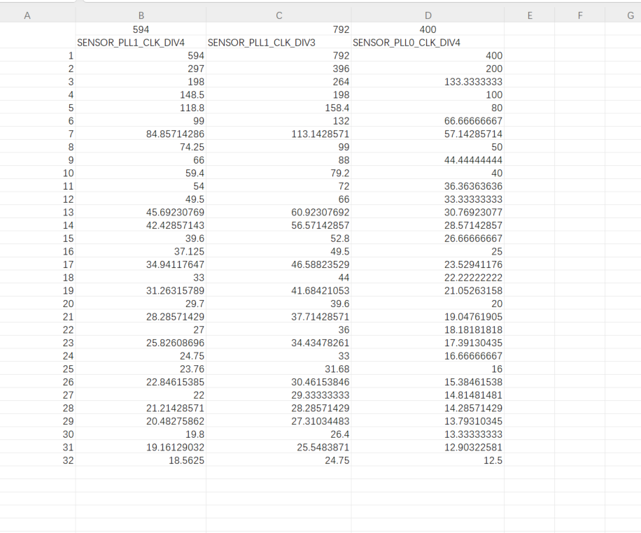
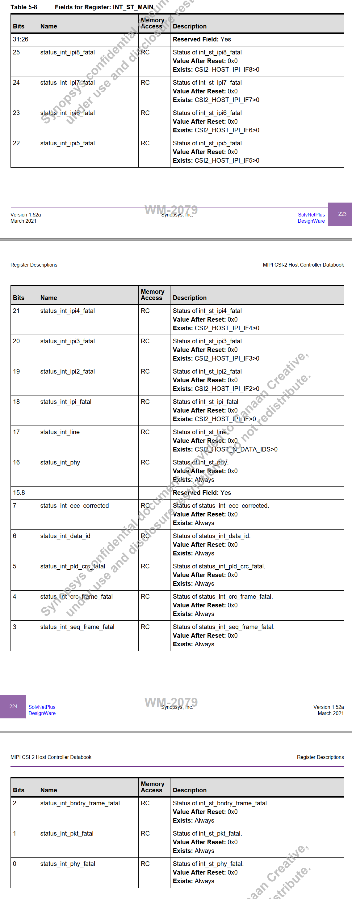

# K230 Camera Sensor适配指南


版权所有©2023北京嘉楠捷思信息技术有限公司

<div style="page-break-after:always"></div>

## 免责声明

您购买的产品、服务或特性等应受北京嘉楠捷思信息技术有限公司（“本公司”，下同）及其关联公司的商业合同和条款的约束，本文档中描述的全部或部分产品、服务或特性可能不在您的购买或使用范围之内。除非合同另有约定，本公司不对本文档的任何陈述、信息、内容的正确性、可靠性、完整性、适销性、符合特定目的和不侵权提供任何明示或默示的声明或保证。除非另有约定，本文档仅作为使用指导参考。

由于产品版本升级或其他原因，本文档内容将可能在未经任何通知的情况下，不定期进行更新或修改。

## 商标声明

、“嘉楠”和其他嘉楠商标均为北京嘉楠捷思信息技术有限公司及其关联公司的商标。本文档可能提及的其他所有商标或注册商标，由各自的所有人拥有。

**版权所有 © 2023北京嘉楠捷思信息技术有限公司。保留一切权利。**
非经本公司书面许可，任何单位和个人不得擅自摘抄、复制本文档内容的部分或全部，并不得以任何形式传播。

<div style="page-break-after:always"></div>

## 目录

[TOC]

## 前言

### 概述

本文档主要描述K230平台Camera Sensor框架以及如何新增支持一款新的Camera Sensor。

### 读者对象

本文档（本指南）主要适用于以下人员：

- 技术支持工程师
- 软件开发工程师

### 缩略词定义

| 简称 | 说明 |
| ---- | ---- |
|      |      |
|      |      |

### 修订记录

| 文档版本号 | 修改说明  | 修改者 | 日期  |
|---|---|---|---|
| V1.0       | 初版 | 汪成根 | 2023-05-30 |
| V1.1       | 示例修改为ov5647并添加4.4章节 | 赵忠祥 | 2023-04-11  |
|            |          |        |            |

## 1. 概述

本文档主要描述K230平台Camera Sensor基本框架以及如何新增支持一款新的Camera Sensor。

K230平台支持多种接口类型的sensor，我们以当前最常用的MIPI CSI接口Sensor为例进行说明。Sensor与主控平台的硬件连接示意图如下：


主控通过I2C接口下发配置寄存器控制sensor的工作方式，sensor通过MIPI CSI接口将图像数据发送至主控SOC。

## 2. Camera Sensor框架

### 2.1 框架简介

Camera Sensor框架如图2-1所示，最底层是sensor驱动层


图2-1 camera sensor框架

从上到下依次是：媒体接口层，驱动层以及硬件层

- 媒体接口层：该层对上提供kd_mpi_sensor_xxx接口给外部模块操作和访问sensor设备，对下通过ioctl操作具体的sensor设备
- 驱动层：该层包括sensor公共操作接口具体的sensor设备驱动。公共操作接口主要是ioctl操作命令和sensor i2c读写接口，sensor驱动主要提供设备节点以及操作接口的实现。这部分也是sensor适配的主要工作。
- 硬件层：对应各个具体的sensor硬件

## 3. Sensor适配准备工作

用户在适配新的sensor之前需要做以下一些准备工作：

1. 从正规渠道获取 Sensor datasheet、初始化序列。
1. 查看 Sensor datasheet 和相关应用手册，特别关注 Sensor 曝光、增益控制方法，不同模式下曝光和增益的限制，长曝光实现方法，黑电平值，bayer 数据输出顺序等。
1. 跟 Sensor 厂家索要所需模式初始化序列，了解各序列的数据数率，Sensor 输出总的宽高，精确的帧率是多少等。
1. 确认 Sensor 控制接口是 I2C、SPI 还是其他接口，Sensor 的设备地址可以通过硬件设置。对于多个摄像头的场景，sensor 尽量不要复用 I2C 总线。不同场景的Sensor IO 电平可能是 1.8V 或者 3.3V，设计时需要保证 sensor 的 IO 电平与SOC 对应的 GPIO 供电电压一致。如 sensor 电平是 1.8V，则用于 sensor 控制的GPIO，如 Reset，I2C，PRDN，需要使用 1.8V 供电。
1. 确认 Sensor 输出数据接口和协议类型。当前仅支持MIPI CSI接口。
1. 确认 wdr mode 是 VC、DT 或者 DOL 等。
1. 确认不同时序是否需要图像裁剪。

## 4. Sensor适配示例

本节将按照如何增加支持一个新的camera sensor的步骤来进行详细描述。

这里以ov5647驱动作为示例进行说明，对应的驱动文件源码路径如下：

```shell
src/big/mpp/kernel/sensor/src/ov5647_drv.c
```

### 4.1 定义支持的sensor类型

系统支持的Sensor类型是由如下枚举变量定义：

```c
typedef enum {
    OV_OV9732_MIPI_1280X720_30FPS_10BIT_LINEAR = 0,
    OV_OV9286_MIPI_1280X720_30FPS_10BIT_LINEAR_IR = 1,
    OV_OV9286_MIPI_1280X720_30FPS_10BIT_LINEAR_SPECKLE = 2,

    OV_OV9286_MIPI_1280X720_60FPS_10BIT_LINEAR_IR = 3,
    OV_OV9286_MIPI_1280X720_60FPS_10BIT_LINEAR_SPECKLE = 4,

    OV_OV9286_MIPI_1280X720_30FPS_10BIT_LINEAR_IR_SPECKLE = 5,
    OV_OV9286_MIPI_1280X720_60FPS_10BIT_LINEAR_IR_SPECKLE  = 6,

    IMX335_MIPI_2LANE_RAW12_1920X1080_30FPS_LINEAR = 7,
    IMX335_MIPI_2LANE_RAW12_2592X1944_30FPS_LINEAR = 8,
    IMX335_MIPI_4LANE_RAW12_2592X1944_30FPS_LINEAR = 9,
    IMX335_MIPI_2LANE_RAW12_1920X1080_30FPS_MCLK_7425_LINEAR = 10,
    IMX335_MIPI_2LANE_RAW12_2592X1944_30FPS_MCLK_7425_LINEAR = 11,
    IMX335_MIPI_4LANE_RAW12_2592X1944_30FPS_MCLK_7425_LINEAR = 12,

    IMX335_MIPI_4LANE_RAW10_2XDOL = 13,
    IMX335_MIPI_4LANE_RAW10_3XDOL = 14,

    SC_SC035HGS_MIPI_1LANE_RAW10_640X480_120FPS_LINEAR = 15,
    SC_SC035HGS_MIPI_1LANE_RAW10_640X480_60FPS_LINEAR = 16,
    SC_SC035HGS_MIPI_1LANE_RAW10_640X480_30FPS_LINEAR = 17,

    OV_OV9286_MIPI_1280X720_30FPS_10BIT_MCLK_25M_LINEAR_SPECKLE = 18,
    OV_OV9286_MIPI_1280X720_30FPS_10BIT_MCLK_25M_LINEAR_IR = 19,
    OV_OV9732_MIPI_1280X720_30FPS_10BIT_MCLK_16M_LINEAR = 20,

    OV_OV5647_MIPI_1920X1080_30FPS_10BIT_LINEAR = 21,
    OV_OV5647_MIPI_2592x1944_10FPS_10BIT_LINEAR = 22,
    OV_OV5647_MIPI_640x480_60FPS_10BIT_LINEAR = 23,
    OV_OV5647_MIPI_CSI0_1920X1080_30FPS_10BIT_LINEAR = 24,

    SC_SC201CS_MIPI_1LANE_RAW10_1600X1200_30FPS_LINEAR = 25,
    SC_SC201CS_SLAVE_MODE_MIPI_1LANE_RAW10_1600X1200_30FPS_LINEAR = 26,

    OV_OV5647_MIPI_CSI1_1920X1080_30FPS_10BIT_LINEAR = 27,
    OV_OV5647_MIPI_CSI2_1920X1080_30FPS_10BIT_LINEAR = 28,

    XS9922B_MIPI_CSI0_1280X720_30FPS_YUV422_DOL3 = 29,

    XS9950_MIPI_CSI0_1280X720_30FPS_YUV422 = 30,
    XS9950_MIPI_CSI1_1280X720_30FPS_YUV422 = 31,
    XS9950_MIPI_CSI2_1280X720_30FPS_YUV422 = 32,
    XS9950_MIPI_CSI0_1920X1080_30FPS_YUV422 = 33,

    OV_OV9286_MIPI_1280X720_30FPS_10BIT_MCLK_25M_LINEAR_SPECKLE_V2 = 34,
    OV_OV9286_MIPI_1280X720_30FPS_10BIT_MCLK_25M_LINEAR_IR_V2 = 35,
    OV_OV9732_MIPI_1280X720_30FPS_10BIT_MCLK_16M_LINEAR_V2 = 36,

    OV_OV5647_MIPI_CSI0_1920X1080_30FPS_10BIT_LINEAR_V2 = 37,
    OV_OV5647_MIPI_CSI1_1920X1080_30FPS_10BIT_LINEAR_V2 = 38,
    OV_OV5647_MIPI_CSI2_1920X1080_30FPS_10BIT_LINEAR_V2 = 39,

    GC2053_MIPI_CSI0_1920X1080_30FPS_10BIT_LINEAR = 40,

    SENSOR_TYPE_MAX,
} k_vicap_sensor_type;
```

用户需要增加新的sensor支持类型时，首先需要在这里增加对应类型的定义，**该类型是应用程序获取sensor配置的唯一标志**

### 4.2 sensor驱动适配

sensor驱动适配在整个环节中最重要的环节，用户可以通过拷贝现有的sensor驱动文件来修改，其中关于sensor的AE相关寄存器配置和计算方式需要查看对应的手册或者寻求专业人事协助。

#### 4.2.1 定义sensor寄存器配置列表

sensor寄存器配置由数据类型 k_sensor_reg_list 定义：

```c
typedef struct {
    k_u16 reg_addr;
    k_u8  reg_val;
} k_sensor_reg_list;
```

以下是ov5647的寄存器配置列表

```c
static const k_sensor_reg ov5647_mipi2lane_1080p_30fps_linear[] = {
    //pixel_rate = 81666700
    {0x0103, 0x01},
    {0x0100, 0x00},
    {0x3034, 0x1a},
    {0x3035, 0x21},
    ...
    {0x3501, 0x02},
    {0x3502, 0xa0},
    {0x3503, 0x07},
    {0x350b, 0x10},
    {REG_NULL, 0x00},
};
```

#### 4.2.2 定义sensor支持的模式

sensor的模式参数由数据类型k_sensor_mode 定义

```c
typedef struct {
    k_u32 index;
    k_vicap_sensor_type sensor_type;
    k_sensor_size size;
    k_u32 fps;
    k_u32 hdr_mode;
    k_u32 stitching_mode;
    k_u32 bit_width;
    k_sensor_data_compress compress;
    k_u32 bayer_pattern;
    k_sensor_mipi_info mipi_info;
    k_sensor_ae_info ae_info;
    k_sensor_reg_list *reg_list;
} k_sensor_mode;
```

以下是ov5647的支持的模式

```c
static k_sensor_mode ov5647_mode_info[] = {
    {
        .index = 0,
        .sensor_type = OV_OV5647_MIPI_1920X1080_30FPS_10BIT_LINEAR,
        .size = {
            .bounds_width = 1920,
            .bounds_height = 1080,
            .top = 0,
            .left = 0,
            .width = 1920,
            .height = 1080,
        },
    ......
}
```

#### 4.2.3 实现sensor操作接口

sensor的操作接口由数据类型k_sensor_function定义，用户根据实际情况实现相关的操作接口，不是所有接口都必须实现。

```c
typedef struct {
    k_s32 (*sensor_power) (void *ctx, k_s32 on);
    k_s32 (*sensor_init) (void *ctx, k_sensor_mode mode);
    k_s32 (*sensor_get_chip_id)(void *ctx, k_u32 *chip_id);
    k_s32 (*sensor_get_mode)(void *ctx, k_sensor_mode *mode);
    k_s32 (*sensor_set_mode)(void *ctx, k_sensor_mode mode);
    k_s32 (*sensor_enum_mode)(void *ctx, k_sensor_enum_mode *enum_mode);
    k_s32 (*sensor_get_caps)(void *ctx, k_sensor_caps *caps);
    k_s32 (*sensor_conn_check)(void *ctx, k_s32 *conn);
    k_s32 (*sensor_set_stream)(void *ctx, k_s32 enable);
    k_s32 (*sensor_get_again)(void *ctx, k_sensor_gain *gain);
    k_s32 (*sensor_set_again)(void *ctx, k_sensor_gain gain);
    k_s32 (*sensor_get_dgain)(void *ctx, k_sensor_gain *gain);
    k_s32 (*sensor_set_dgain)(void *ctx, k_sensor_gain gain);
    k_s32 (*sensor_get_intg_time)(void *ctx, k_sensor_intg_time *time);
    k_s32 (*sensor_set_intg_time)(void *ctx, k_sensor_intg_time time);
    k_s32 (*sensor_get_exp_parm)(void *ctx, k_sensor_exposure_param *exp_parm);
    k_s32 (*sensor_set_exp_parm)(void *ctx, k_sensor_exposure_param exp_parm);
    k_s32 (*sensor_get_fps)(void *ctx, k_u32 *fps);
    k_s32 (*sensor_set_fps)(void *ctx, k_u32 fps);
    k_s32 (*sensor_get_isp_status)(void *ctx, k_sensor_isp_status *staus);
    k_s32 (*sensor_set_blc)(void *ctx, k_sensor_blc blc);
    k_s32 (*sensor_set_wb)(void *ctx, k_sensor_white_balance wb);
    k_s32 (*sensor_get_tpg)(void *ctx, k_sensor_test_pattern *tpg);
    k_s32 (*sensor_set_tpg)(void *ctx, k_sensor_test_pattern tpg);
    k_s32 (*sensor_get_expand_curve)(void *ctx, k_sensor_compand_curve *curve);
    k_s32 (*sensor_get_otp_data)(void *ctx, void *data);
} k_sensor_function;
```

以下是ov5647的支持的模式

```c
    .sensor_func = {
        .sensor_power = ov5647_sensor_power_on,
        .sensor_init = ov5647_sensor_init,
        .sensor_get_chip_id = ov5647_sensor_get_chip_id,
        .sensor_get_mode = ov5647_sensor_get_mode,
        .sensor_set_mode = ov5647_sensor_set_mode,
        .sensor_enum_mode = ov5647_sensor_enum_mode,
        .sensor_get_caps = ov5647_sensor_get_caps,
        .sensor_conn_check = ov5647_sensor_conn_check,
        .sensor_set_stream = ov5647_sensor_set_stream,
        .sensor_get_again = ov5647_sensor_get_again,
        .sensor_set_again = ov5647_sensor_set_again,
        .sensor_get_dgain = ov5647_sensor_get_dgain,
        .sensor_set_dgain = ov5647_sensor_set_dgain,
        .sensor_get_intg_time = ov5647_sensor_get_intg_time,
        .sensor_set_intg_time = ov5647_sensor_set_intg_time,
        .sensor_get_exp_parm = ov5647_sensor_get_exp_parm,
        .sensor_set_exp_parm = ov5647_sensor_set_exp_parm,
        .sensor_get_fps = ov5647_sensor_get_fps,
        .sensor_set_fps = ov5647_sensor_set_fps,
        .sensor_get_isp_status = ov5647_sensor_get_isp_status,
        .sensor_set_blc = ov5647_sensor_set_blc,
        .sensor_set_wb = ov5647_sensor_set_wb,
        .sensor_get_tpg = ov5647_sensor_get_tpg,
        .sensor_set_tpg = ov5647_sensor_set_tpg,
        .sensor_get_expand_curve = ov5647_sensor_get_expand_curve,
        .sensor_get_otp_data = ov5647_sensor_get_otp_data,
    },
```

#### 4.2.4 定义sensor驱动结构体

sensor驱动结构体由 struct sensor_driver_dev 定义，主要包括sensor I2C配置信息，sensor驱动名称以及sensor操作集合

```c
struct sensor_driver_dev {
    k_sensor_i2c_info i2c_info;
    k_u8 *sensor_name;
    k_sensor_function sensor_func;
    k_sensor_mode *sensor_mode;
    k_sensor_ae_info ae_info;
    k_s32 pwd_gpio;
    k_s32 reset_gpio;
};
```

ov5647驱动结构体定义及初始化内容如下：

```c
struct sensor_driver_dev ov5647_sensor_drv = {
    .i2c_info = {
        .i2c_bus = NULL,
        .i2c_name = OV5647_IIC,
        .slave_addr = 0x36,
        .reg_addr_size = SENSOR_REG_VALUE_16BIT,
        .reg_val_size = SENSOR_REG_VALUE_8BIT,
    },
    .sensor_name = "ov5647",
    .sensor_func = {
        .sensor_power = ov5647_sensor_power_on,
        .sensor_init = ov5647_sensor_init,
        .sensor_get_chip_id = ov5647_sensor_get_chip_id,
        .sensor_get_mode = ov5647_sensor_get_mode,
        .sensor_set_mode = ov5647_sensor_set_mode,
        ......
    },
};
```

#### 4.2.5 更新sensor驱动列表

将上一节定义的sensor驱动结构体添加到sensor_common.c中的sensor_drv_list数组中。
当前系统支持的sensor列表如下：

```c
struct sensor_driver_dev *sensor_drv_list[SENSOR_NUM_MAX] = {
    &ov9732_sensor_drv,
    &ov9286_sensor_drv,
    &imx335_sensor_drv,
    &sc035hgs_sensor_drv,
    &ov5647_sensor_drv,
};
```

### 4.3 更新sensor配置信息列表

sensor配置信息有结构体k_vicap_sensor_info定义：

```shell
typedef struct {
    const char *sensor_name; /*sensor名字*/
    const char *calib_file; /*sensor标定文件名*/
    k_u16 width; /*sensor输出图像宽度*/
    k_u16 height; /*sensor输出图像高度*/
    k_vicap_csi_num csi_num; /*sensor硬件连接使用的CSI总线标号*/
    k_vicap_mipi_lanes mipi_lanes; /*sensor硬件连接使用的MIPI LANE个数*/
    k_vicap_data_source source_id; /*数据源ID*/
    k_bool is_3d_sensor; /*是否为3D sensor*/

    k_vicap_mipi_phy_freq phy_freq; /*MIPI PHY速率*/
    k_vicap_csi_data_type data_type; /*CSI数据类型*/
    k_vicap_hdr_mode hdr_mode; /*HDR模式*/
    k_vicap_vi_flash_mode flash_mode; /*flash模式选择*/
    k_vicap_vi_first_frame_sel first_frame;
    k_u16 glitch_filter;
    k_vicap_sensor_type sensor_type; /*sensor类型*/
} k_vicap_sensor_info;
```

在userapps/src/sensor/mpi_sensor.c中ov5647对应的配置信息：

```shell
const k_vicap_sensor_info sensor_info_list[] = {
    {
        "ov5647",
        1920,
        1080,
        VICAP_CSI2,
        VICAP_MIPI_2LANE,
        VICAP_SOURCE_CSI2,
        K_TRUE,
        VICAP_MIPI_PHY_800M,
        VICAP_CSI_DATA_TYPE_RAW10,
        VICAP_LINERA_MODE,
        VICAP_FLASH_DISABLE,
        VICAP_VI_FIRST_FRAME_FS_TR0,
        0,
        OV_OV5647_MIPI_1920X1080_30FPS_10BIT_LINEAR,
    },
```

用户每增加一个sensor配置模式，就需要在sensor_info_list这个结构体中增加一项对应模式的配置。

### 4.4 增加sensor配置文件

当前SDK版本sensor配置文件包括xml文件和json文件，文件存放路径如下：

```shell
src/big/mpp/userapps/src/sensor/config/
```

以下是ov5647对应的配置文件：

```shell
ov5647.xml  ov5647_auto.json  ov5647_manual.json
```

对于新增加的sensor，可以通过拷贝修改现有文件实现支持，其中的calibration和tuning参数可以通过相关工具修改导出。

### 4.5 现有sensor驱动的移植

如果重新打板，一般情况下可能会修改的sensor的reset、shutdown、CSI、I2C。仍然以canmv的ov5647为例。

ov5647的reset使用的是K230的GPIO0, I2C使用的是i2c3。

```c
int ov5647_power_rest(k_s32 on)
{
    rt_kprintf("ov5647_power_rest OV5647_CAM_PIN is %d \n", OV5647_CAM_PIN);
    // rst
    kd_pin_mode(OV5647_CAM_PIN, GPIO_DM_OUTPUT);
    kd_pin_write(OV5647_CAM_PIN, GPIO_PV_HIGH);

    if (on)
    {
        rt_thread_mdelay(DELAY_MS_SENSOR_DEFAULT);
        kd_pin_write(OV5647_CAM_PIN, GPIO_PV_LOW);  //GPIO_PV_LOW  GPIO_PV_HIGH
        rt_thread_mdelay(DELAY_MS_SENSOR_DEFAULT);
        kd_pin_write(OV5647_CAM_PIN, GPIO_PV_HIGH);
    }
```

```c
struct sensor_driver_dev ov5647_sensor_drv = {
    .i2c_info = {
        .i2c_bus = NULL,
        .i2c_name = OV5647_IIC, // "i2c3"
        .slave_addr = 0x36,
        .reg_addr_size = SENSOR_REG_VALUE_16BIT,
        .reg_val_size = SENSOR_REG_VALUE_8BIT,
    },
```

OV5647_CAM_PIN和OV5647_IIC 定义在mpp/include/comm/k_board_config_comm.h。该头文件根据板子类型来配置驱动中的变量。

```c
#elif defined(CONFIG_BOARD_K230_CANMV)
#define DISPLAY_LCD_RST_GPIO                            20
#define DISPLAY_LCD_BACKLIGHT_EN                        25
#define VICAP_IMX335_RST_GPIO                           46
#define VICAP_IMX335_MASTER_GPIO                        28
#define VICAP_OV9286_RST_GPIO                           23
#define OV5647_IIC "i2c3"
#define OV5647_CAM_PIN                                  0
```

如果reset或者i2c有变化，可以在驱动中直接修改，也可以在该头件中修改。

如果使用CSI有变化，例如将CSI0改为了CSI1，可以修改mpp/userapps/src/sensor/mpi_sensor.c中

```c
    static const k_vicap_sensor_info sensor_info_list[] = {
        {
            "ov5647",
            1920,
            1080,
            VICAP_CSI0,
            VICAP_MIPI_2LANE,
            VICAP_SOURCE_CSI0,
            K_TRUE,
            VICAP_MIPI_PHY_800M,
            VICAP_CSI_DATA_TYPE_RAW10,
            VICAP_LINERA_MODE,
            VICAP_FLASH_DISABLE,
            VICAP_VI_FIRST_FRAME_FS_TR0,
            0,
            OV_OV5647_MIPI_CSI0_1920X1080_30FPS_10BIT_LINEAR_V2,
        },
    }
```

VICAP_CSI0和VICAP_SOURCE_CSI0修改为VICAP_CSI1和VICAP_SOURCE_CSI1。
按照上边的方式已经将一个sensor的driver驱动写完了，下边是一些sensor测试方式和注意事项。
注意事项如下：

- 如果使用的是k230 芯片提供的clk、需要注意配置参数是正确的，sensor 的clk 配置如下 对应的不同的分频和不同的参数
- 配置下边几处的参数要一致才行，主要是bounds_width ，width 和 sensor_info_list 中的 width，还有对用的xml 中配置，否则就会报错



 ```c
 {
        .index = 2,
        .sensor_type = IMX335_MIPI_4LANE_RAW12_2592X1944_30FPS_LINEAR,
        .size = {
            .bounds_width = 2592,
            .bounds_height = 1944,
            .top = 0,
            .left = 0,
            .width = 2592,
            .height = 1944,
        },
        .fps = 30000,
        .hdr_mode = SENSOR_MODE_LINEAR,
        .bit_width = 12,
        .bayer_pattern = BAYER_PAT_RGGB,
        .mipi_info = {
            .csi_id = 0,
            .mipi_lanes = 4,
            .data_type = 0x2C,
        },
        .reg_list = imx335_mipi_4lane_raw12_2592x1944_30fps_mclk_24m_regs,
    },
```

```c
    static const k_vicap_sensor_info sensor_info_list[] = {
        {
            "ov5647",
            1920,
            1080,
            VICAP_CSI0,
            VICAP_MIPI_2LANE,
            VICAP_SOURCE_CSI0,
            K_TRUE,
            VICAP_MIPI_PHY_800M,
            VICAP_CSI_DATA_TYPE_RAW10,
            VICAP_LINERA_MODE,
            VICAP_FLASH_DISABLE,
            VICAP_VI_FIRST_FRAME_FS_TR0,
            0,
            OV_OV5647_MIPI_CSI0_1920X1080_30FPS_10BIT_LINEAR_V2,
        },
    }
```

```c
这个是xml 中的文件
<name index="1" type="char" size="[1 9]">
    1920x1080
</name>
<id index="1" type="char" size="[1 10]">
    0x00000001
</id>
<width index="1" type="double" size="[1 1]">
    [ 1920]
</width>
<height index="1" type="double" size="[1 1]">
    [ 1080]
</height>
```

- 再就是 所有的 sensor_func 必须都得写、可以参考代码中的自己去写，也就是下边func 实现

```c
struct sensor_driver_dev sc035hgs_sensor_drv = {
    .i2c_info = {
        .i2c_bus = NULL,
        .i2c_name = "i2c3",
        .slave_addr = 0x30,
        .reg_addr_size = SENSOR_REG_VALUE_16BIT,
        .reg_val_size = SENSOR_REG_VALUE_8BIT,
    },
    .sensor_name = SC035HGS_NAME,
    .sensor_func = {
        .sensor_power = sc035hgs_sensor_power_on,
        .sensor_init = sc035hgs_sensor_init,
        .sensor_get_chip_id = sc035hgs_sensor_get_chip_id,
        .sensor_get_mode = sc035hgs_sensor_get_mode,
        .sensor_set_mode = sc035hgs_sensor_set_mode,
        .sensor_enum_mode = sc035hgs_sensor_enum_mode,
        .sensor_get_caps = sc035hgs_sensor_get_caps,
        .sensor_conn_check = sc035hgs_sensor_conn_check,
        .sensor_set_stream = sc035hgs_sensor_set_stream,
        .sensor_get_again = sc035hgs_sensor_get_again,
        .sensor_set_again = sc035hgs_sensor_set_again,
        .sensor_get_dgain = sc035hgs_sensor_get_dgain,
        .sensor_set_dgain = sc035hgs_sensor_set_dgain,
        .sensor_get_intg_time = sc035hgs_sensor_get_intg_time,
        .sensor_set_intg_time = sc035hgs_sensor_set_intg_time,
        .sensor_get_exp_parm = sc035hgs_sensor_get_exp_parm,
        .sensor_set_exp_parm = sc035hgs_sensor_set_exp_parm,
        .sensor_get_fps = sc035hgs_sensor_get_fps,
        .sensor_set_fps = sc035hgs_sensor_set_fps,
        .sensor_get_isp_status = sc035hgs_sensor_get_isp_status,
        .sensor_set_blc = sc035hgs_sensor_set_blc,
        .sensor_set_wb = sc035hgs_sensor_set_wb,
        .sensor_get_tpg = sc035hgs_sensor_get_tpg,
        .sensor_set_tpg = sc035hgs_sensor_set_tpg,
        .sensor_get_expand_curve = sc035hgs_sensor_get_expand_curve,
        .sensor_get_otp_data = sc035hgs_sensor_get_otp_data,
        .sensor_mirror_set = sc035hgs_sensor_mirror_set,
    },
};
```

注意事项就是这些，下边将一下调试方法，出了问题可以先按照下边的方式查找

- 首先就是你运行发现报错了，你就需要看一下上边的注意事项是不是都是满足的，这个一般是报connecot err 什么的
- 第一种错误 iic read chip id err 这种错误基本就是snesor iic 配置出问题了、需要查一下，可以用示波器量取iic 信号、看看是否iic 正常通信，如果你的sensor pwdn、reset 的状态不对、iic 是可能不应答的。

 如果什么错都没有报，程序正常运行、可以按照下边的流程和方法看一下是哪块的错误

- 首先cat /proc/umap/vicap 看一下是不是所有的参数都是0 、是的话就是没有数据进来、就是前级的问题、否则就得看一下你配置的sensor 的输入size 和 给isp 配置的size 一致

- 然后去用示波器量一下mipi 波形、看看是否有波形、可以看一下有效的行数是不是你配置sensor 输出的行数，如果行数不对，就是sensor 的配置不对了。量一下mipi 的clk 是多少、这个需要配置VICAP_MIPI_PHY_800M 这个与你量到的相近的最好。

- 读取 芯片测寄存器，查看是否有err，csi0 是0x9000980c, csi1 是 0x9000a00c ，csi2 是 0x9000a80c ，如果都是0 就证明csi 是没有错误的。错误码如下


这两个就是错误码、常见的如下

- bit0 是phy 的err 、证明 sensor 发的数据是错误的
- ipi ecc 和 crc 的err 一般都是 配置raw 格式不对、当然可能是sensor 发送的数据不对。

剩下的就是需要和厂商沟通或者和自己看sensor 寄存器自己调试了。
