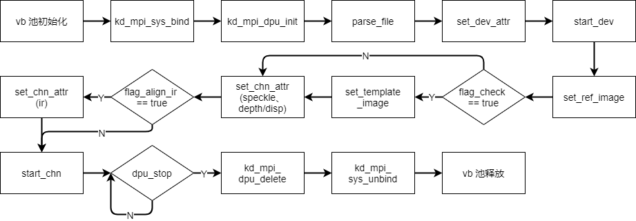
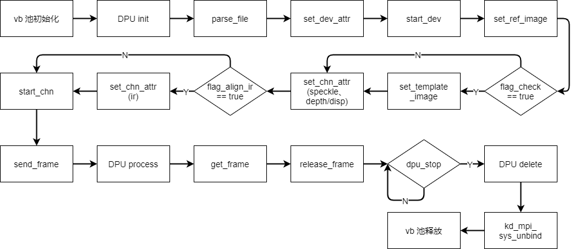

# K230 DPU API参考


版权所有©2023北京嘉楠捷思信息技术有限公司

<div style="page-break-after:always"></div>

## 免责声明

您购买的产品、服务或特性等应受北京嘉楠捷思信息技术有限公司（“本公司”，下同）及其关联公司的商业合同和条款的约束，本文档中描述的全部或部分产品、服务或特性可能不在您的购买或使用范围之内。除非合同另有约定，本公司不对本文档的任何陈述、信息、内容的正确性、可靠性、完整性、适销性、符合特定目的和不侵权提供任何明示或默示的声明或保证。除非另有约定，本文档仅作为使用指导参考。

由于产品版本升级或其他原因，本文档内容将可能在未经任何通知的情况下，不定期进行更新或修改。

## 商标声明

、“嘉楠”和其他嘉楠商标均为北京嘉楠捷思信息技术有限公司及其关联公司的商标。本文档可能提及的其他所有商标或注册商标，由各自的所有人拥有。

**版权所有 © 2023北京嘉楠捷思信息技术有限公司。保留一切权利。**
非经本公司书面许可，任何单位和个人不得擅自摘抄、复制本文档内容的部分或全部，并不得以任何形式传播。

<div style="page-break-after:always"></div>

## 目录

[TOC]

## 前言

### 概述

本文档主要介绍 K230 DPU 软件的使用，内容主要包括 DPU API 的使用及 demo 介绍。

### 读者对象

本文档（本指南）主要适用于以下人员：

- 技术支持工程师
- 软件开发工程师

### 缩略词定义

| 简称 | 说明                                           |
|------|------------------------------------------------|
| DPU  | Depth Process Unit，深度处理单元               |
| LCN  | Local Contrast Normalization，局部对比度归一化 |

### 修订记录

| 文档版本号 | 修改说明                                                                                                                                | 修改者 | 日期      |
|------------|-----------------------------------------------------------------------------------------------------------------------------------------|--------|-----------|
| v1.0       | 初版                                                                                                                                    | 刘孙涛 | 2023/3/30 |
| v1.1       | 增加了配置离线处理后的参考图的接口函数 [kd_mpi_dpu_set_processed_ref_image](#217-kd_mpi_dpu_set_processed_ref_image)； 增加了模块调试信息。 | 刘孙涛 | 2023/4/20 |
| V1.2       | 增加了 buffer 可配置的功能                             | 刘孙涛 | 2023/5/31 |

## 1. 概述

### 1.1 概述

DPU 主要负责 3D 结构光的深度计算，为 3D 人脸识别提供深度信息。

### 1.2 功能描述

#### 1.2.1 绑定模式调用流程



#### 1.2.2 非绑定模式调用流程



## 2. API 参考

### 2.1 DPU 使用

该功能模块提供以下API：

- [kd_mpi_dpu_init](#211-kd_mpi_dpu_init)
- [kd_mpi_dpu_delete](#212-kd_mpi_dpu_delete)
- [kd_mpi_dpu_parse_file](#213-kd_mpi_dpu_parse_file)
- [kd_mpi_dpu_set_dev_attr](#214-kd_mpi_dpu_set_dev_attr)
- [kd_mpi_dpu_get_dev_attr](#215-kd_mpi_dpu_get_dev_attr)
- [kd_mpi_dpu_set_ref_image](#216-kd_mpi_dpu_set_ref_image)
- [kd_mpi_dpu_set_processed_ref_image](#217-kd_mpi_dpu_set_processed_ref_image)
- [kd_mpi_dpu_set_template_image](#218-kd_mpi_dpu_set_template_image)
- [kd_mpi_dpu_start_dev](#219-kd_mpi_dpu_start_dev)
- [kd_mpi_dpu_set_chn_attr](#2110-kd_mpi_dpu_set_chn_attr)
- [kd_mpi_dpu_get_chn_attr](#2111-kd_mpi_dpu_get_chn_attr)
- [kd_mpi_dpu_start_chn](#2112-kd_mpi_dpu_start_chn)
- [kd_mpi_dpu_stop_chn](#2113-kd_mpi_dpu_stop_chn)
- [kd_mpi_dpu_send_frame](#2114-kd_mpi_dpu_send_frame)
- [kd_mpi_dpu_get_frame](#2115-kd_mpi_dpu_get_frame)
- [kd_mpi_dpu_release_frame](#2116-kd_mpi_dpu_release_frame)

#### 2.1.1 kd_mpi_dpu_init

【描述】

初始化 dpu 设备

【语法】

k_s32 kd_mpi_dpu_init(k_dpu_init_t \*init);

【参数】

| 参数名称 | 描述                           | 输入/输出 |
|----------|--------------------------------|-----------|
| init     | 初始化 dpu 设备的结构体指针。  | 输入      |

【返回值】

| 返回值 | 描述                 |
|--------|----------------------|
| 0      | 成功                 |
| 非0    | 失败，其值参见错误码 |

【芯片差异】

无。

【需求】

- 头文件：mpi_dpu_api.h
- 库文件：libdpu.a

【注意】

无

【举例】

无

【相关主题】

[k_dpu_init_t](#311-k_dpu_init_t)

#### 2.1.2 kd_mpi_dpu_delete

【描述】

删除已经初始化的 dpu 设备。

【语法】

k_s32 kd_mpi_dpu_delete();

【参数】

| 参数名称 | 描述 | 输入/输出 |
|----------|------|-----------|
| 无       | 无   | 无        |

【返回值】

| 返回值 | 描述                 |
|--------|----------------------|
| 0      | 成功                 |
| 非0    | 失败，其值参见错误码 |

【芯片差异】

无

【需求】

- 头文件：mpi_dpu_api.h
- 库文件：libdpu.a

【注意】

需要在对 dpu 设备初始化以后才可以调用此函数 delete dpu。

【举例】

无

【相关主题】

无

#### 2.1.3 kd_mpi_dpu_parse_file

【描述】

从 dpu 配置文件中解析 dpu 配置参数。

【语法】

k_s32 kd_mpi_dpu_parse_file(const k_char \*param_path, k_dpu_dev_param_t \*param, k_dpu_lcn_param_t \*lcn_param, k_dpu_ir_param_t \*ir_param, k_dpu_user_space_t \*g_temp_space);

【参数】

| 参数名称     | 描述                                                                       | 输入/输出 |
|--------------|----------------------------------------------------------------------------|-----------|
| param_path   | 配置文件的路径                                                             | 输入      |
| param        | dpu 设备参数的结构体指针，从配置文件中解析出来的设备参数保存在此结构体中   | 输出      |
| lcn_param    | lcn 通道参数的结构体指针，从配置文件中解析出来的通道参数保存在此结构体中。 | 输出      |
| ir_param     | ir 通道参数的结构体指针，从配置文件中解析出来的通道参数保存在此结构体中。  | 输出      |
| g_temp_space | 模板图结构体指针，从配置文件中解析出来的模板图首地址保存在此结构体中。     | 输出      |

【返回值】

| 返回值 | 描述                 |
|--------|----------------------|
| 0      | 成功                 |
| 非0    | 失败，其值参见错误码 |

【芯片差异】

无

【需求】

- 头文件：mpi_dpu_api.h
- 库文件：libdpu.a

【注意】

- dpu 设备参数包括长周期参数和短周期参数。
- lcn_param 和 ir_param 这两个通道参数是 dpu 设备参数的子集，如果已经配置了 dpu 设备参数，可以忽略这两个通道参数。如果需要更改这两个通道参数结构体中的参数，既可以更改通道参数以后调用 kd_mpi_dpu_set_chn_attr 来使更改生效，也可以更改设备参数以后调用 kd_mpi_dpu_set_dev_attr 来使更改生效。如果只更改了通道参数，那么调用 kd_mpi_dpu_set_chn_attr 效率更高。
- 模板图结构体中包含了从配置文件中解析出来的模板图的虚拟地址和物理地址，以及模板图的大小。

【举例】

无

【相关主题】

[k_dpu_dev_param_t](#312-k_dpu_dev_param_t)

#### 2.1.4 kd_mpi_dpu_set_dev_attr

【描述】

配置 dpu 设备属性。

【语法】

k_s32 kd_mpi_dpu_set_dev_attr(k_dpu_dev_attr_t \*attr);

【参数】

| 参数名称 | 描述         | 输入/输出 |
|----------|--------------|-----------|
| attr     | dpu 设备属性 | 输入      |

【返回值】

| 返回值 | 描述                 |
|--------|----------------------|
| 0      | 成功                 |
| 非0    | 失败，其值参见错误码 |

【芯片差异】

无

【需求】

- 头文件：mpi_dpu_api.h
- 库文件：libdpu.a

【注意】

- 只有对 dpu 设备初始化以后才可以调用此函数配置 dpu 设备属性。
- 在首次配置 dpu 设备属性时，应该将 attr 中的 tytz_temp_recfg 和 align_depth_recfg 配置为 K_TRUE，以使 dpu 加载对应参数。后续更改 dpu 设备属性时，如果对应的长周期参数没有改变，将这两个成员配置为 K_FALSE，可以节省 dpu 再次加载长周期参数的时间。

【举例】

无

【相关主题】

[k_dpu_dev_attr_t](#316-k_dpu_dev_attr_t)

#### 2.1.5 kd_mpi_dpu_get_dev_attr

【描述】

获取 dpu 设备属性。

【语法】

k_s32 kd_mpi_dpu_set_dev_attr(k_dpu_dev_attr_t \*attr);

【参数】

| 参数名称 | 描述         | 输入/输出 |
|----------|--------------|-----------|
| attr     | dpu 设备属性 | 输出      |

【返回值】

| 返回值 | 描述                 |
|--------|----------------------|
| 0      | 成功                 |
| 非0    | 失败，其值参见错误码 |

【芯片差异】

无

【需求】

- 头文件：mpi_dpu_api.h
- 库文件：libdpu.a

【注意】

无

【举例】

无

【相关主题】

[k_dpu_dev_attr_t](#316-k_dpu_dev_attr_t)

#### 2.1.6 kd_mpi_dpu_set_ref_image

【描述】

配置 dpu 参考图。

【语法】

k_s32 kd_mpi_dpu_set_ref_image(const k_char \*ref_path);

【参数】

| 参数名称 | 描述       | 输入/输出 |
|----------|------------|-----------|
| ref_path | 参考图路径 | 输入      |

【返回值】

| 返回值 | 描述                 |
|--------|----------------------|
| 0      | 成功                 |
| 非0    | 失败，其值参见错误码 |

【芯片差异】

无

【需求】

- 头文件：mpi_dpu_api.h
- 库文件：libdpu.a

【注意】

- 需要在配置 dpu 设备属性以后再调用此函数配置参考图。

【举例】

无

【相关主题】

无

#### 2.1.7 kd_mpi_dpu_set_processed_ref_image

【描述】

配置离线处理后的 dpu 参考图。

【语法】

k_s32 kd_mpi_dpu_set_processed_ref_image(const k_char \*ref_path);

【参数】

| 参数名称 | 描述               | 输入/输出 |
|----------|--------------------|-----------|
| ref_path | 处理后的参考图路径 | 输入      |

【返回值】

| 返回值 | 描述                 |
|--------|----------------------|
| 0      | 成功                 |
| 非0    | 失败，其值参见错误码 |

【芯片差异】

无

【需求】

- 头文件：mpi_dpu_api.h
- 库文件：libdpu.a

【注意】

- 需要在配置 dpu 设备属性以后再调用此函数配置参考图，配置的参考图需要离线处理好，调用此函数可以比 [kd_mpi_dpu_set_ref_image](#216-kd_mpi_dpu_set_ref_image) 节省约 70ms 时间。

【举例】

无

【相关主题】

无

#### 2.1.8 kd_mpi_dpu_set_template_image

【描述】

配置 dpu 模板图

【语法】

k_s32 kd_mpi_dpu_set_template_image(k_dpu_user_space_t \*temp_space);

【参数】

| 参数名称   | 描述           | 输入/输出 |
|------------|----------------|-----------|
| temp_space | 模板图结构体。 | 输入      |

【返回值】

| 返回值 | 描述                 |
|--------|----------------------|
| 0      | 成功                 |
| 非0    | 失败，其值参见错误码 |

【芯片差异】

无

【需求】

- 头文件：mpi_dpu_api.h
- 库文件：libdpu.a

【注意】

- 需要在配置 dpu 设备属性以后再调用此函数配置参考图。
- temp_space 需要在 [kd_mpi_dpu_parse_file](#213-kd_mpi_dpu_parse_file) 时作为参数传入，以从配置文件中获取模板图信息。

【举例】

无

【相关主题】

[k_dpu_user_space_t](#315-k_dpu_user_space_t)
[kd_mpi_dpu_parse_file](#213-kd_mpi_dpu_parse_file)

#### 2.1.9 kd_mpi_dpu_start_dev

【描述】

启动 dpu 设备

【语法】

k_s32 kd_mpi_dpu_start_dev();

【参数】

| 参数名称 | 描述 | 输入/输出 |
|----------|------|-----------|
| 无       | 无   | 无        |

【返回值】

| 返回值 | 描述                 |
|--------|----------------------|
| 0      | 成功                 |
| 非0    | 失败，其值参见错误码 |

【芯片差异】

无

【需求】

- 头文件：mpi_dpu_api.h
- 库文件：libdpu.a

【注意】

无

【举例】

无

【相关主题】

无

#### 2.1.10 kd_mpi_dpu_set_chn_attr

【描述】

配置 dpu 通道属性

【语法】

k_s32 kd_mpi_dpu_set_chn_attr(k_dpu_chn_lcn_attr_t \*lcn_attr, k_dpu_chn_ir_attr_t \*ir_attr);

【参数】

| 参数名称 | 描述             | 输入/输出 |
|----------|------------------|-----------|
| lcn_attr | 散斑图通道属性。 | 输入      |
| ir_attr  | 红外图通道属性。 | 输入      |

【返回值】

| 返回值 | 描述                 |
|--------|----------------------|
| 0      | 成功                 |
| 非0    | 失败，其值参见错误码 |

【芯片差异】

无

【需求】

- 头文件：mpi_dpu_api.h
- 库文件：libdpu.a

【注意】

- 当前 dpu 设备一共有两个通道：0 和 1。通过配置 lcn_attr-\>chn_num 和 ir_attr-\>chn_num（如果开启了红外图通道） 来指明散斑图和红外图各自的输入输出通道。
- 在首次启动 dpu 设备 [kd_mpi_dpu_start_dev](#219-kd_mpi_dpu_start_dev) 以后，应该调用此函数来配置通道属性，其中散斑图通道必须配置，红外图通道如果没有开启可以不配置（配置为 NULL）。
- 在运行过程中如果只需要更改某个通道的属性，可以只传入该通道的结构体参数，另一个通道的参数可以为 NULL。也可以同时传入两个通道的参数。如果两个通道的参数都为 NULL，则该次配置是不会生效的。

【举例】

无

【相关主题】

[k_dpu_chn_lcn_attr_t](#317-k_dpu_chn_lcn_attr_t)
[k_dpu_chn_ir_attr_t](#318-k_dpu_chn_ir_attr_t)

#### 2.1.11 kd_mpi_dpu_get_chn_attr

【描述】

获取 dpu 通道属性。

【语法】

k_s32 kd_mpi_dpu_get_chn_attr(k_dpu_chn_lcn_attr_t \*lcn_attr, k_dpu_chn_ir_attr_t \*ir_attr);

【参数】

| 参数名称 | 描述             | 输入/输出 |
|----------|------------------|-----------|
| lcn_attr | 散斑图通道属性。 | 输出      |
| ir_attr  | 红外图通道属性。 | 输出      |

【返回值】

| 返回值 | 描述                 |
|--------|----------------------|
| 0      | 成功                 |
| 非0    | 失败，其值参见错误码 |

【芯片差异】

无

【需求】

- 头文件：mpi_dpu_api.h
- 库文件：libdpu.a

【注意】

无

【举例】

无

【相关主题】

[k_dpu_chn_lcn_attr_t](#317-k_dpu_chn_lcn_attr_t)
[k_dpu_chn_ir_attr_t](#318-k_dpu_chn_ir_attr_t)

#### 2.1.12 kd_mpi_dpu_start_chn

【描述】

启动 dpu 通道

【语法】

k_s32 kd_mpi_dpu_start_chn(k_u32 chn_num);

【参数】

| 参数名称 | 描述   | 输入/输出 |
|----------|--------|-----------|
| chn_num  | 通道号 | 输入      |

【返回值】

| 返回值 | 描述                 |
|--------|----------------------|
| 0      | 成功                 |
| 非0    | 失败，其值参见错误码 |

【芯片差异】

无

【需求】

- 头文件：mpi_dpu_api.h
- 库文件：libdpu.a

【注意】

- 通道号应该为 0 或 1。

【举例】

无

【相关主题】

无

#### 2.1.13 kd_mpi_dpu_stop_chn

【描述】

停止 dpu 通道

【语法】

k_s32 kd_mpi_dpu_stop_chn(k_u32 chn_num);

【参数】

| 参数名称 | 描述   | 输入/输出 |
|----------|--------|-----------|
| chn_num  | 通道号 | 输入      |

【返回值】

| 返回值 | 描述                 |
|--------|----------------------|
| 0      | 成功                 |
| 非0    | 失败，其值参见错误码 |

【芯片差异】

无

【需求】

- 头文件：mpi_dpu_api.h
- 库文件：libdpu.a

【注意】

- 通道号应为 0 或 1。

【举例】

无

【相关主题】

无

#### 2.1.14 kd_mpi_dpu_send_frame

【描述】

在非绑定模式下，向 dpu 发送一帧数据。

【语法】

k_s32 kd_mpi_dpu_send_frame(k_u32 chn_num, k_u64 addr, k_s32 s32_millisec);

【参数】

| 参数名称     | 描述                                                                                                                                                                                        | 输入/输出 |
|--------------|---------------------------------------------------------------------------------------------------------------------------------------------------------------------------------------------|-----------|
| chn_num      | 通道号                                                                                                                                                                                      | 输入      |
| addr         | 发送数据的物理地址                                                                                                                                                                          | 输入      |
| s32_millisec | 等待时间。 当此参数设置为 -1 时，阻塞模式，直到发送成功才会返回； 当此参数设置为 0 时，非阻塞模式，发送成功立即返回零，发送失败立即返回其他值，具体失败信息参考 [dpu 错误码](#41-dpu-错误码)； | 输入      |

【返回值】

| 返回值 | 描述                 |
|--------|----------------------|
| 0      | 成功                 |
| 非0    | 失败，其值参见错误码 |

【芯片差异】

无

【需求】

- 头文件：mpi_dpu_api.h
- 库文件：libdpu.a

【注意】

- 如果同时开启了散斑图和红外图通路，需要红外图和散斑图严格交叉输入。

【举例】

无

【相关主题】

无

#### 2.1.15 kd_mpi_dpu_get_frame

【描述】

从 dpu 获取一帧数据。

【语法】

k_s32 kd_mpi_dpu_get_frame(k_u32 chn_num, k_dpu_chn_result_u \*result, k_s32 s32_millisec);

【参数】

| 参数名称     | 描述                                                                                                                                                                                                     | 输入/输出 |
|--------------|----------------------------------------------------------------------------------------------------------------------------------------------------------------------------------------------------------|-----------|
| chn_num      | 通道号                                                                                                                                                                                                   | 输入      |
| result       | dpu 输出结果联合体，其成员变量分别是 k_dpu_chn_lcn_result_t 和 k_dpu_chn_ir_result_t 。选择哪个成员作为该通道的输出结果由用户根据 [kd_mpi_dpu_set_chn_attr](#2110-kd_mpi_dpu_set_chn_attr) 的配置来自行决定。 | 输出      |
| s32_millisec | 等待时间。 当此参数设置为 -1 时，阻塞模式，直到获取成功才会返回； 当此参数设置为 0 时，非阻塞模式，获取成功立即返回零，获取失败立即返回其他值，具体失败信息参考 [dpu 错误码](#41-dpu-错误码)；              | 输入      |

【返回值】

| 返回值 | 描述                 |
|--------|----------------------|
| 0      | 成功                 |
| 非0    | 失败，其值参见错误码 |

【芯片差异】

无

【需求】

- 头文件：mpi_dpu_api.h
- 库文件：libdpu.a

【注意】

- 如果同时开启了红外图和散斑图，注意及时取走两个通道的输出结果，否则 buffer 中的结果会溢出造成无法继续输入的情况。

【举例】

无

【相关主题】

[k_dpu_chn_result_u](#319-k_dpu_chn_result_u)
[k_dpu_chn_lcn_result_t](#3110-k_dpu_chn_lcn_result_t)
[k_dpu_chn_ir_result_t](#3111-k_dpu_chn_ir_result_t)
[k_dpu_disp_out_t](#3112-k_dpu_disp_out_t)
[k_dpu_depth_out_t](#3113-k_dpu_depth_out_t)
[k_dpu_ir_out_t](#3114-k_dpu_ir_out_t)
[k_dpu_qlt_out_t](#3115-k_dpu_qlt_out_t)

#### 2.1.16 kd_mpi_dpu_release_frame

【描述】

在非绑定模式下，释放已经获取的结果。

【语法】

k_s32 kd_mpi_dpu_release_frame();

【参数】

无

【返回值】

| 返回值 | 描述                 |
|--------|----------------------|
| 0      | 成功                 |
| 非0    | 失败，其值参见错误码 |

【芯片差异】

无

【需求】

- 头文件：mpi_dpu_api.h
- 库文件：libdpu.a

【注意】

- 此函数会依次释放 buffer 中的数据，先生成的结果先释放。目前 dpu buffer 为 3，使用完 [kd_mpi_dpu_get_frame](#2115-kd_mpi_dpu_get_frame) 获取的结果以后请尽快释放。

【举例】

无

【相关主题】

无

## 3. 数据类型

### 3.1 公共数据类型

本模块有如下数据类型：

- [k_dpu_init_t](#311-k_dpu_init_t)
- [k_dpu_dev_param_t](#312-k_dpu_dev_param_t)
- [k_dpu_lcn_param_t](#313-k_dpu_lcn_param_t)
- [k_dpu_ir_param_t](#314-k_dpu_ir_param_t)
- [k_dpu_user_space_t](#315-k_dpu_user_space_t)
- [k_dpu_dev_attr_t](#316-k_dpu_dev_attr_t)
- [k_dpu_chn_lcn_attr_t](#317-k_dpu_chn_lcn_attr_t)
- [k_dpu_chn_ir_attr_t](#318-k_dpu_chn_ir_attr_t)
- [k_dpu_chn_result_u](#319-k_dpu_chn_result_u)
- [k_dpu_chn_lcn_result_t](#3110-k_dpu_chn_lcn_result_t)
- [k_dpu_chn_ir_result_t](#3111-k_dpu_chn_ir_result_t)
- [k_dpu_disp_out_t](#3112-k_dpu_disp_out_t)
- [k_dpu_depth_out_t](#3113-k_dpu_depth_out_t)
- [k_dpu_ir_out_t](#3114-k_dpu_ir_out_t)
- [k_dpu_qlt_out_t](#3115-k_dpu_qlt_out_t)

#### 3.1.1 k_dpu_init_t

【说明】

dpu 设备初始化结构体

【定义】

```c
typedef struct {
    k_u32 start_num;
    k_u32 buffer_num;
} k_dpu_init_t;
```

【成员】

| 成员名称  | 描述                                                |
|-----------|-----------------------------------------------------|
| start_num | dpu 设备起始帧号（即 dpu 计算出来的第一帧的帧号）。   |
| buffer_num| dpu 缓存 buffer 的数量，至少为 1                    |

【注意事项】

无

【相关数据类型及接口】

[kd_mpi_dpu_init](#211-kd_mpi_dpu_init)

#### 3.1.2 k_dpu_dev_param_t

【说明】

dpu 设备参数结构体。

【定义】

```c
typedef struct
{
    k_dpu_long_parameter_t lpp;
    k_dpu_short_parameter_t spp;
} k_dpu_dev_param_t;
```

【成员】

| 成员名称 | 描述                 |
|----------|----------------------|
| lpp      | dpu 长周期参数结构体 |
| spp      | dpu 短周期参数结构体 |

【注意事项】

- 用户需要对长周期参数中的值进行改变时，应该使用虚拟地址成员变量。

【相关数据类型及接口】

[k_dpu_long_parameter_t](#321-k_dpu_long_parameter_t)
[kd_mpi_dpu_parse_file](#213-kd_mpi_dpu_parse_file)

#### 3.1.3 k_dpu_lcn_param_t

【说明】

散斑图通道参数结构体。

【定义】

```c
typedef struct {
    k_u8 matching_length_left_p0;
    k_u8 matching_length_right_p0;

    float image_check_match_threshold;
    float depth_p1;
    float depth_p2;
    float depth_precision;
} k_dpu_lcn_param_t;
```

【成员】
| 成员名称                    | 描述                                                                 |
|-----------------------------|---------------------------------------------------------------------|
| matching_length_left_p0     | 粗搜索：视差计算向左搜索范围，取值：0~256，整型                        |
| matching_length_right_p0    | 粗搜索：视差计算向右搜索范围，取值：0~256，整型                        |
| image_check_match_threshold | 散斑图质量评定：模板匹配阈值，取值范围：0.0~1.0，浮点型：0.01精度       |
| depth_p1                    | 视差转深度：深度数值计算系数p1，取值范围：0.0~50000.0，浮点型：0.01精度 |
| depth_p2                    | 视差转深度：深度数值计算系数p2，取值范围：-5.0~100.0，浮点型：0.01精度  |
| depth_precision             | 视差转深度：深度数值精度（倍数），取值范围：0.0~100.0，浮点型：0.1精度  |

【注意事项】

- 此通道结构体参数是设备结构体参数的子集，如果已经配置了设备参数，且通道参数和设备参数相同，可以不配置通道参数。

【相关数据类型及接口】

[kd_mpi_dpu_parse_file](#213-kd_mpi_dpu_parse_file)

#### 3.1.4 k_dpu_ir_param_t

【说明】

红外图通道参数结构体。

【定义】

```c
typedef struct {
    float depth_k1;
    float depth_k2;
    float tz;
} k_dpu_ir_param_t;
```

【成员】
| 成员名称 | 描述 |
|---|---|
| depth_k1 | 直接完全对应一个寄存器。三图对齐：深度数值计算系数k1，取值范围：2e-4~1e-2，浮点型：1e-5精度 |
| depth_k2 | 直接完全对应一个寄存器。三图对齐：深度数值计算系数k2，取值范围：0.5~1.5，浮点型：0.001精度 |
| tz | 直接完全对应一个寄存器。三图对齐：投射器z方向偏移量（毫米），取值范围：-5.0~5.0，浮点型：0.001精度 |

【注意事项】

- 此通道结构体参数是设备结构体参数的子集，如果已经配置了设备参数，且通道参数和设备参数相同，可以不配置通道参数。

【相关数据类型及接口】

[kd_mpi_dpu_parse_file](#213-kd_mpi_dpu_parse_file)

#### 3.1.5 k_dpu_user_space_t

【说明】

用户获取模板图结构体参数。

【定义】

```c
typedef struct {
    k_bool used;
    k_u32 size;
    k_u64 phys_addr;
    void *virt_addr;
} k_dpu_user_space_t;
```

【成员】

| 成员名称  | 描述                   |
|-----------|------------------------|
| used      | 用户不需要关注         |
| size      | 用户获取的模板图的大小 |
| phys_addr | 模板图的物理地址       |
| virt_addr | 模板图的虚拟地址       |

【注意事项】

无

【相关数据类型及接口】

[kd_mpi_dpu_parse_file](#213-kd_mpi_dpu_parse_file)

#### 3.1.6 k_dpu_dev_attr_t

【说明】

配置 dpu 设备属性结构体。

【定义】

```c
typedef struct {
    k_dpu_mode_e mode;
    k_bool tytz_temp_recfg;
    k_bool align_depth_recfg;
    k_bool ir_never_open;
    k_u32 param_valid;
    k_dpu_dev_param_t dev_param;
} k_dpu_dev_attr_t;
```

【成员】

| 成员名称          | 描述                                                                                                                     |
|-------------------|--------------------------------------------------------------------------------------------------------------------------|
| mode              | dpu 运行模式，包括绑定模式和非绑定模式。                                                                                 |
| tytz_temp_recfg   | 是否更新加载 SAD 温度补偿参数和 TyTz 行补偿计算算数。当此标志位为 K_FALSE 时表明不更新，当此标志位为 K_TRUE 时表明更新。 |
| align_depth_recfg | 是否更新加载三图对齐/转深度计算参数。当此标志位为 K_FALSE 时表明不更新，当此标志位为 K_TRUE 时表明更新。                 |
| ir_never_open     | vb 池是在启动 dpu 设备时配置的，直到暂停 dpu 设备时释放。其大小在启动设备时进行初始化，因此在启动设备时就预留了深度/视差图、红外输出、质量检测、粗细列视差、初始行列式差共五部分的空间。用户可以在使用周期内通过 dev_param.spp.flag_align 来选择是否开启三图对齐。  如果在整个使用周期内都不会有红外图的输出，就不需要为红外图预留空间。配置为 K_TRUE 表明不需要为红外图输出预留空间，配置为 K_FALSE 表明需要为红外图输出预留空间。 |
| param_valid       | 用户配置 dpu 设备属性时，将此成员设置为一个任意的非零值，当设备属性生效时，会在对应生效的帧的输出结果中返回该任意值。    |
| dev_param         | dpu 设备参数结构体。                                                                                                     |

【注意事项】

- 在首次配置 dpu 设备属性时，应该将 tytz_temp_recfg 和 align_depth_recfg 配置为 K_TRUE，以使 dpu 加载对应参数。

【相关数据类型及接口】

[k_dpu_dev_param_t](#312-k_dpu_dev_param_t)
[kd_mpi_dpu_set_dev_attr](#214-kd_mpi_dpu_set_dev_attr)

#### 3.1.7 k_dpu_chn_lcn_attr_t

【说明】

配置散斑图通道属性结构体

【定义】

```c
typedef struct {
    k_u8 param_valid;
    k_s32 chn_num;
    k_dpu_lcn_param_t lcn_param;
} k_dpu_chn_lcn_attr_t;
```

【成员】

| 成员名称    | 描述                                                                                                                                                         |
|-------------|--------------------------------------------------------------------------------------------------------------------------------------------------------------|
| param_valid | 用户配置散斑图通道属性时，将此成员设置为一个任意的非零值，当设备属性生效时，会在对应生效的帧的输出结果中返回该任意值。                                       |
| chn_num     | 通道号。当前 dpu 设备一共有两个通道，用户可以将此通道号设为 0 或 1，散斑图通道将在对应通道中输入输出。如果开启了红外图通道，此通道号应该与红外图通道号不同。 |
| lcn_param   | 散斑图通道参数。                                                                                                                                             |

【注意事项】

无

【相关数据类型及接口】

[kd_mpi_dpu_set_chn_attr](#2110-kd_mpi_dpu_set_chn_attr)

#### 3.1.8 k_dpu_chn_ir_attr_t

【说明】

配置红外图通道属性结构体

【定义】

```c
typedef struct {
    k_u8 param_valid;
    k_s32 chn_num;
    k_dpu_ir_param_t ir_param;
} k_dpu_chn_ir_attr_t;
```

【成员】

| 成员名称    | 描述                                                                                                                                   |
|-------------|----------------------------------------------------------------------------------------------------------------------------------------|
| param_valid | 用户配置散斑图通道属性时，将此成员设置为一个任意的非零值，当设备属性生效时，会在对应生效的帧的输出结果中返回该任意值。                 |
| chn_num     | 通道号。当前 dpu 设备一共有两个通道，用户可以将此通道号设为 0 或 1，红外图通道将在对应通道中输入输出。此通道号应该与散斑图通道号不同。 |
| ir_param    | 红外图通道参数。                                                                                                                       |

【注意事项】

无

【相关数据类型及接口】

[kd_mpi_dpu_set_chn_attr](#2110-kd_mpi_dpu_set_chn_attr)

#### 3.1.9 k_dpu_chn_result_u

【说明】

获取 dpu 输出结果的联合体

【定义】

```c
typedef union {
    k_dpu_chn_lcn_result_t lcn_result;
    k_dpu_chn_ir_result_t ir_result;
} k_dpu_chn_result_u;
```

【成员】

| 成员名称   | 描述                                                                        |
|------------|-----------------------------------------------------------------------------|
| lcn_result | 散斑图通道输出结果结构体。[k_dpu_chn_lcn_result_t](#3110-k_dpu_chn_lcn_result_t) |
| ir_result  | 红外图通道输出结果结构体。[k_dpu_chn_ir_result_t](#3111-k_dpu_chn_ir_result_t)   |

【注意事项】

- 用户选择哪个成员作为输出结果需要根据用户自己的配置来选择。在 [kd_mpi_dpu_set_chn_attr](#2110-kd_mpi_dpu_set_chn_attr) 中用户配置了通道号和通道类型的对应关系。

【相关数据类型及接口】

[k_dpu_chn_lcn_result_t](#3110-k_dpu_chn_lcn_result_t)
[k_dpu_chn_ir_result_t](#3111-k_dpu_chn_ir_result_t)
[kd_mpi_dpu_get_frame](#2115-kd_mpi_dpu_get_frame)

#### 3.1.10 k_dpu_chn_lcn_result_t

【说明】

dpu 散斑图通道输出结果的结构体

【定义】

```c
typedef struct {
    k_u32 time_ref;
    k_u64 pts;
    k_dpu_disp_out_t disp_out;
    k_dpu_depth_out_t depth_out;
    k_dpu_qlt_out_t qlt_out;
    k_dpu_param_flag_t flag;
} k_dpu_chn_lcn_result_t;
```

【成员】

| 成员名称  | 描述                                                                                                                                                                                                                   |
|-----------|------------------------------------------------------------------------------------------------------------------------------------------------------------------------------------------------------------------------|
| pts       | 时间戳，绑定模式下有效。                                                                                                                                                                                               |
| disp_out  | 视差图输出结果结构体。                                                                                                                                                                                                 |
| depth_out | 深度图输出结果结构体。                                                                                                                                                                                                 |
| qlt_out   | 质量检测输出结果结构体。包括质量检测结果、粗细_列视差（初始分辨率）结果、初始行列式差结果。                                                                                                                            |
| flag      | 此结构体用来标记用户配置的参数在哪一帧生效了。结构体中包含了 [k_dpu_dev_attr_t](#316-k_dpu_dev_attr_t)、[k_dpu_chn_lcn_attr_t](#317-k_dpu_chn_lcn_attr_t)、[k_dpu_chn_ir_attr_t](#318-k_dpu_chn_ir_attr_t) 中的 param_valid 变量。 |

【注意事项】

无

【相关数据类型及接口】

[k_dpu_disp_out_t](#3112-k_dpu_disp_out_t)
[k_dpu_depth_out_t](#3113-k_dpu_depth_out_t)
[k_dpu_qlt_out_t](#3115-k_dpu_qlt_out_t)
[kd_mpi_dpu_get_frame](#2115-kd_mpi_dpu_get_frame)

#### 3.1.11 k_dpu_chn_ir_result_t

【说明】

dpu 红外图通道输出结果的结构体

【定义】

```c
typedef struct {
    k_u32 time_ref;
    k_u64 pts;
    k_dpu_ir_out_t ir_out;
    k_dpu_param_flag_t flag;
} k_dpu_chn_ir_result_t;
```

【成员】

| 成员名称 | 描述                                                                                                                                                                                                                   |
|----------|------------------------------------------------------------------------------------------------------------------------------------------------------------------------------------------------------------------------|
| pts      | 时间戳，绑定模式下有效。                                                                                                                                                                                               |
| ir_out   | 红外图输出结果结构体。                                                                                                                                                                                                 |
| flag     | 此结构体用来标记用户配置的参数在哪一帧生效了。结构体中包含了 [k_dpu_dev_attr_t](#316-k_dpu_dev_attr_t)、[k_dpu_chn_lcn_attr_t](#317-k_dpu_chn_lcn_attr_t)、[k_dpu_chn_ir_attr_t](#318-k_dpu_chn_ir_attr_t) 中的 param_valid 变量。 |

【注意事项】

无

【相关数据类型及接口】

[k_dpu_ir_out_t](#3114-k_dpu_ir_out_t)
[kd_mpi_dpu_get_frame](#2115-kd_mpi_dpu_get_frame)

#### 3.1.12 k_dpu_disp_out_t

【说明】

视差图输出结果的结构体

【定义】

```c
typedef struct {
    k_bool valid;
    k_u32 length;
    k_u64 disp_phys_addr;
    k_u64 disp_virt_addr;
} k_dpu_disp_out_t;
```

【成员】

| 成员名称       | 描述                                                   |
|----------------|--------------------------------------------------------|
| valid          | K_TRUE：表明输出结果有效； K_FALSE：表明输出结果无效。 |
| length         | 输出结果长度。                                         |
| disp_phys_addr | 视差图输出结果物理地址。                               |
| disp_virt_addr | 视差图输出结果虚拟地址。                               |

【注意事项】

无

【相关数据类型及接口】

[k_dpu_chn_lcn_result_t](#3110-k_dpu_chn_lcn_result_t)
[kd_mpi_dpu_get_frame](#2115-kd_mpi_dpu_get_frame)

#### 3.1.13 k_dpu_depth_out_t

【说明】

深度图输出结果的结构体

【定义】

```c
typedef struct {
    k_bool valid;
    k_u32 length;
    k_u64 depth_phys_addr;
    k_u64 depth_virt_addr;
} k_dpu_depth_out_t;
```

【成员】

| 成员名称        | 描述                                                   |
|-----------------|--------------------------------------------------------|
| valid           | K_TRUE：表明输出结果有效； K_FALSE：表明输出结果无效。 |
| length          | 输出结果长度。                                         |
| depth_phys_addr | 深度图输出结果物理地址。                               |
| depth_virt_addr | 深度图输出结果虚拟地址。                               |

【注意事项】

无

【相关数据类型及接口】

[k_dpu_chn_lcn_result_t](#3110-k_dpu_chn_lcn_result_t)
[kd_mpi_dpu_get_frame](#2115-kd_mpi_dpu_get_frame)

#### 3.1.14 k_dpu_ir_out_t

【说明】

红外图输出结果的结构体

【定义】

```c
typedef struct {
    k_bool valid;
    k_u32 length;
    k_u64 ir_phys_addr;
    k_u64 ir_virt_addr;
} k_dpu_ir_out_t;
```

【成员】

| 成员名称     | 描述                                                   |
|--------------|--------------------------------------------------------|
| valid        | K_TRUE：表明输出结果有效； K_FALSE：表明输出结果无效。 |
| length       | 输出结果长度。                                         |
| ir_phys_addr | 红外图输出结果物理地址。                               |
| ir_virt_addr | 红外图输出结果虚拟地址。                               |

【注意事项】

无

【相关数据类型及接口】

[k_dpu_chn_ir_result_t](#3111-k_dpu_chn_ir_result_t)
[kd_mpi_dpu_get_frame](#2115-kd_mpi_dpu_get_frame)

#### 3.1.15 k_dpu_qlt_out_t

【说明】

质量检测输出结果的结构体

【定义】

```c
typedef struct {
    k_bool valid;
    k_u32 qlt_length;
    k_u32 sad_disp_length;
    k_u32 init_sad_disp_length;
    k_u64 qlt_phys_addr;
    k_u64 qlt_virt_addr;
    k_u64 sad_disp_phys_addr;
    k_u64 sad_disp_virt_addr;
    k_u64 init_sad_disp_phys_addr;
    k_u64 init_sad_disp_virt_addr;
} k_dpu_qlt_out_t;
```

【成员】

| 成员名称                | 描述                                                   |
|-------------------------|--------------------------------------------------------|
| valid                   | K_TRUE：表明输出结果有效； K_FALSE：表明输出结果无效。 |
| qlt_length              | 质量检测输出结果长度。                                 |
| sad_disp_length         | 粗细列视差（初始分辨率）输出结果长度。                 |
| init_sad_disp_length    | 初始行列式差输出结果长度。                             |
| qlt_phys_addr           | 质量检测输出结果物理地址。                             |
| qlt_virt_addr           | 质量检测输出结果虚拟地址。                             |
| sad_disp_phys_addr      | 粗细列视差（初始分辨率）输出结果物理地址。             |
| sad_disp_virt_addr      | 粗细列视差（初始分辨率）输出结果虚拟地址。             |
| init_sad_disp_phys_addr | 初始行列式差输出结果物理地址。                         |
| init_sad_disp_virt_addr | 初始行列式差输出结果虚拟地址。                         |

【注意事项】

无

【相关数据类型及接口】

[k_dpu_chn_lcn_result_t](#3110-k_dpu_chn_lcn_result_t)
[kd_mpi_dpu_get_frame](#2115-kd_mpi_dpu_get_frame)

### 3.2 长短周期参数类型

本模块有如下数据类型：

- [k_dpu_long_parameter_t](#321-k_dpu_long_parameter_t)
- [k_dpu_short_parameter_t](#322-k_dpu_short_parameter_t)

#### 3.2.1 k_dpu_long_parameter_t

【说明】

dpu 长周期参数结构体

【定义】

长周期参数成员过多，不在此展示，可以参见 K230_SDK 中 k_dpu_comm.h 中的结构体 k_dpu_long_parameter_t。

【注意事项】

- 用户需要对长周期参数中的值进行改变时，应该使用虚拟地址成员变量。

【相关数据类型及接口】

[k_dpu_dev_param_t](#312-k_dpu_dev_param_t)
[kd_mpi_dpu_parse_file](#213-kd_mpi_dpu_parse_file)
[kd_mpi_dpu_set_dev_attr](#214-kd_mpi_dpu_set_dev_attr)

#### 3.2.2 k_dpu_short_parameter_t

【说明】

dpu 短周期参数结构体

【定义】

短周期参数成员过多，不在此展示，可以参见 K230_SDK 中 k_dpu_comm.h 中的结构体 k_dpu_short_parameter_t。

【注意事项】

无

【相关数据类型及接口】

[k_dpu_dev_param_t](#312-k_dpu_dev_param_t)
[kd_mpi_dpu_set_dev_attr](#214-kd_mpi_dpu_set_dev_attr)
[kd_mpi_dpu_get_dev_attr](#215-kd_mpi_dpu_get_dev_attr)

## 4. 错误码

### 4.1 dpu 错误码

表 41

| 错误代码    | 宏定义                  | 描述                         |
|-------------|-------------------------|------------------------------|
| 0xa00118001 | K_ERR_DPU_INVALID_DEVID | 无效的设备号                 |
| 0xa00118002 | K_ERR_DPU_INVALID_CHNID | 无效的通道号                 |
| 0xa00118003 | K_ERR_DPU_ILLEGAL_PARAM | 参数错误                     |
| 0xa00118004 | K_ERR_DPU_EXIST         | DPU 设备已经存在             |
| 0xa00118005 | K_ERR_DPU_UNEXIST       | DPU 设备不存在               |
| 0xa00118006 | K_ERR_DPU_NULL_PTR      | 空指针错误                   |
| 0xa00118007 | K_ERR_DPU_NOT_CONFIG    | 尚未配置 DPU                 |
| 0xa00118008 | K_ERR_DPU_NOT_SUPPORT   | 不支持的功能                 |
| 0xa00118009 | K_ERR_DPU_NOT_PERM      | 操作不允许                   |
| 0xa0011800c | K_ERR_DPU_NOMEM         | 分配内存失败，如系统内存不足 |
| 0xa0011800d | K_ERR_DPU_NOBUF         | BUFF 不足                    |
| 0xa0011800e | K_ERR_DPU_BUF_EMPTY     | BUFF 为空                    |
| 0xa0011800f | K_ERR_DPU_BUF_FULL      | BUFF 已满                    |
| 0xa00118010 | K_ERR_DPU_NOTREADY      | 设备未就绪                   |
| 0xa00118011 | K_ERR_DPU_BADADDR       | 错误的地址                   |
| 0xa00118012 | K_ERR_DPU_BUSY          | DPU 处与忙状态               |

## 5. 调试信息

### 5.1 概述

调试信息采用了 proc 文件系统，可实时反映当前系统的运行状态，所记录的信息可供问题定位及分析时使用

【文件目录】

/proc/

【文件清单】

| 文件名称  | 描述                        |
|-----------|-----------------------------|
| umap/dpu  | 记录当前 dpu 模块的一些信息 |

### 5.2 调试信息

【调试信息】

```shell
----------------------DPU Device Information----------------------
--------------------Pathway Switch Information--------------------
downScale: false align: false
align_ir: false align_rgbCoord: false
depthout: false denoise: false
median_p0: false median_denoise: false
median_post: false median_ir: false
check: false

----------------------Image Size Information----------------------
width_speckle: 0 height_speckle: 0
width_color: 0 height_color: 0
width_output: 0 height_output: 0

---------------------Result Length Information--------------------
sad_disp_x: 0 init_sad_disp_xy: 0
quanlity_check: 0 ir: 0
disp/depth: 0

----------------------------Frame Count---------------------------
from open to close, dpu has send 0 frames
```

【通路选择信息】

| 参数           | **描述**                              |
|----------------|---------------------------------------|
| downScale      | 是否粗搜索降分辨率                    |
| align          | 是否三图对齐                          |
| align_ir       | 是否红外图对齐                        |
| align_rgbCoord | 是否视差数值对齐到彩色图坐标系        |
| depthout       | 是否输出深度图                        |
| denoise        | 是否视差图去噪                        |
| median_p0      | 是否粗搜索中值滤波                    |
| median_denoise | 是否视差去噪内部中值滤波              |
| median_post    | 是否视差后处理/三图对齐视差图中值滤波 |
| median_ir      | 是否三图对齐红外图中值滤波            |
| check          | 是否物体散斑图质量检测及初始搜索      |

【图像大小信息】

| 参数           | **描述**                           |
|----------------|------------------------------------|
| width_speckle  | 原始散斑图/红外图宽度像素数        |
| height_speckle | 原始散斑图/红外图高度像素数        |
| width_color    | 原始彩色图宽度像素数               |
| height_color   | 原始彩色图高度像素数               |
| width_output   | 输出视差图/深度图/红外图宽度像素数 |
| height_output  | 输出视差图/深度图/红外图高度像素数 |

【结果长度信息】

| 参数             | **描述**                         |
|------------------|----------------------------------|
| sad_disp_x       | 粗细列视差（初始分辨率）结果长度 |
| init_sad_disp_xy | 初始行列视差输出结果长度         |
| quanlity_check   | 质量检测结果长度                 |
| ir               | 红外图结果长度                   |
| disp/depth       | 视差图/深度图结果长度            |

调测信息需要在 dpu 运行过程中查看，dpu 结束运行以后，当前所有信息会重置为零。

## 6. demo 描述

### 6.1 dpu demo 简介

dpu demo 实现了绑定和非绑定两种模式。在 msh 中输入 /bin/sample_dpu.elf 执行非绑定模式，运行十帧后结束；在 msh 中输入 /bin/sample_dpu.elf BOUND 执行绑定模式，以 vvi 作为模拟上级不停的输入数据给 dpu，dpu 计算完成后显示信息。

### 6.2 Feature 说明

demo 中包含了初始化和删除 dpu，从配置文件解析参数，配置设备属性，配置通道属性，启动和暂停设备，启动和暂停通道，输入输出数据，pipeline 绑定等功能。

#### 6.2.1 非绑定模式

通过调用 API 完成 dpu 设备的初始化，从配置文件中解析参数，根据解析参数配置设备属性，调用 API 设置参考图和模板图，启动 dpu 设备，配置散斑图和红外图通道属性，启动通道，循环输入十帧并比对结果后停止，停止通道，停止设备，删除设备。

#### 6.2.2 绑定模式

通过调用 API 完成 dpu 设备的初始化，从配置文件中解析参数，绑定 vvi 和 dpu 通道，根据解析参数配置设备属性，调用 API 设置参考图和模板图，启动 dpu 设备，配置散斑图和红外图通道属性，启动 dpu 通道，启动 vvi 通道，vvi 作为模拟上级数据不停的输入数据给 dpu。用户输入 e 以后停止通道和设备。

#### 6.2.3 编译和执行

编译和执行可以参考文档《K230 SDK Demo使用指南》。
