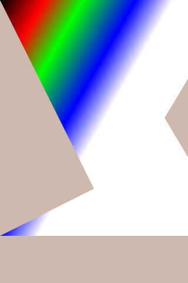
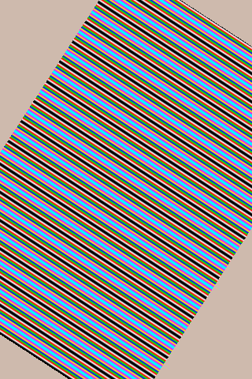

# K230 GPU API参考

版权所有©2023北京嘉楠捷思信息技术有限公司

## 免责声明

您购买的产品、服务或特性等应受北京嘉楠捷思信息技术有限公司（“本公司”，下同）及其关联公司的商业合同和条款的约束，本文档中描述的全部或部分产品、服务或特性可能不在您的购买或使用范围之内。除非合同另有约定，本公司不对本文档的任何陈述、信息、内容的正确性、可靠性、完整性、适销性、符合特定目的和不侵权提供任何明示或默示的声明或保证。除非另有约定，本文档仅作为使用指导参考。

由于产品版本升级或其他原因，本文档内容将可能在未经任何通知的情况下，不定期进行更新或修改。

## 商标声明

、“嘉楠”和其他嘉楠商标均为北京嘉楠捷思信息技术有限公司及其关联公司的商标。本文档可能提及的其他所有商标或注册商标，由各自的所有人拥有。

**版权所有 © 2023北京嘉楠捷思信息技术有限公司。保留一切权利。**
非经本公司书面许可，任何单位和个人不得擅自摘抄、复制本文档内容的部分或全部，并不得以任何形式传播。

## 目录

[TOC]

## 前言

### 概述

本文档描述K230芯片2.5D GPU模块的使用指南。

### 读者对象

本文档（本指南）主要适用于以下人员：

- 技术支持工程师
- 软件开发工程师

### 缩略词定义

| 简称 | 全称                  |
|------|-----------------------|
| GPU  | Graphics Process Unit |
| BLIT | Bit Block Transfer    |
| CLUT | Color Look Up Table   |

### 修订记录

| 版本版本号 | 修改说明 | 修改者 | 日期       |
|------------|----------|--------|------------|
| V1.0       | 正式发布 | 黄子懿 | 2023/04/06 |
| V1.1       | 调整格式 | 黄子懿 | 2023/05/06 |

## 1. 功能介绍

本模块主要用于加速矢量图形的绘制，可用于绘制菜单等页面等，支持加速部分lvgl绘制。GPU有一系列绘制指令，将绘制指令写入内存，提交地址及指令总长度给GPU后即可开始绘制。本模块支持多边形、二次贝塞尔曲线、三次贝塞尔曲线和椭圆曲线的填充绘制，支持线性渐变色填充，支持颜色查找表，支持图像合成和混合以及BLIT。

## 2. 数据流向

GPU软件驱动部分包括设备/dev/vg_lite及其内核模块驱动程序vg_lite.ko，以及用户态函数库libvg_lite.so，libvg_lite.so会打开/dev/vg_lite设备，通过ioctl()及mmap()与内核态的驱动程序进行交互。内核态驱动主要由vg_lite_hal.c实现，vg_lite.c中的函数通过vg_lite_kernel函数调用vg_lite_hal.c中的函数，执行实际的寄存器操作。

注意：驱动不会检查绘制指令中的物理地址，调用VGLite API可以间接读写DDR内存的所有物理地址。

## 3. 软件接口

软件接口详见软件包中的头文件vg_lite.h。

### 3.1 主要类型及定义

#### 3.1.1 参数类型

| 名称             | 类型定义               | 含义                                                                                                                                                                                                                        |
|------------------|------------------------|-----------------------------------------------------------------------------------------------------------------------------------------------------------------------------------------------------------------------------|
| Int32_t          | int                    | 32位有符号整数                                                                                                                                                                                                              |
| uint32_t         | Unsigned int           | 32位无符号整数                                                                                                                                                                                                              |
| VG_LITE_S8       | enum vg_lite_format_t  | 8位有符号整数坐标                                                                                                                                                                                                           |
| VG_LITE_S16      | enum vg_lite_format_t  | 16位有符号整数坐标                                                                                                                                                                                                          |
| VG_LITE_S32      | enum vg_lite_format_t  | 32位有符号整数坐标                                                                                                                                                                                                          |
| vg_lite_float_t  | float                  | 单精度浮点数                                                                                                                                                                                                                |
| vg_lite_color_t  | uint32_t               | 32位颜色值 颜色值指定了各种功能中使用的颜色。颜色是用8位RGBA通道形成的。红色通道在颜色值的最低8位，其次是绿色和蓝色通道。alpha通道在颜色值的最高8位。 对于L8目标格式，通过使用默认的ITU-R BT.709转换规则将RGB颜色转换为L8。 |

#### 3.1.2 错误类型 vg_lite_error_t

| 枚举                       | 描述                 |
|----------------------------|----------------------|
| VG_LITE_GENERIC_IO         | 无法与内核驱动通信   |
| VG_LITE_INVALID_ARGUMENT   | 非法参数             |
| VG_LITE_MULTI_THREAD_FAIL  | 多线程错误           |
| VG_LITE_NO_CONTEXT         | 无上下文错误         |
| VG_LITE_NOT_SUPPORT        | 功能不支持           |
| VG_LITE_OUT_OF_MEMORY      | 无可分配的驱动堆内存 |
| VG_LITE_OUT_OF_RESOURCES   | 无可分配的系统堆内存 |
| VG_LITE_SUCCESS            | 成功                 |
| VG_LITE_TIMEOUT            | 超时                 |
| VG_LITE_ALREADY_EXISTS     | 对象已存在           |
| VG_LITE_NOT_ALIGNED        | 数据对齐错误         |

#### 3.1.3 功能枚举

| 枚举                              | 描述          |
|-----------------------------------|---------------|
| gcFEATURE_BIT_VG_BORDER_CULLING   | 边界剪裁      |
| gcFEATURE_BIT_VG_GLOBAL_ALPHA     | 全局Alpha     |
| gcFEATURE_BIT_VG_IM_FASTCLEAR     | 快速清除      |
| gcFEATURE_BIT_VG_IM_INDEX_FORMAT  | 颜色索引      |
| gcFEATURE_BIT_VG_PE_PREMULTIPLY   | Alpha通道预乘 |
| gcFEATURE_BIT_VG_RADIAL_GRADIENT  | 径向灰度      |
| gcFEATURE_BIT_VG_RGBA2_FORMAT     | RGBA2222格式  |

### 3.2 GPU控制

如果没有特殊说明，那么在调用任何API函数之前，应用程序必须通过调用[vg_lite_init](#3212-vg_lite_init)来初始化GPU隐式（全局）上下文，该函数将填充特征表、重置快速清除缓冲区、重置合成目标缓冲区，以及分配命令和细分缓冲区。

GPU驱动程序**只支持一个当前上下文和一个线程来向GPU发布命令**。GPU驱动程序不支持在多个线程/进程中同时运行的多个并发上下文，因为GPU内核驱动程序不支持上下文切换。GPU应用程序在任何时候都只能使用一个上下文来向GPU硬件发出命令。如果GPU应用程序需要切换上下文，应该调用[vg_lite_close](#3213-vg_lite_close)来关闭当前线程中的当前上下文，然后可以调用[vg_lite_init](#3212-vg_lite_init)来初始化当前线程中或其他线程/进程中的新上下文。

如果没有特殊说明，则所有函数都返回[vg_lite_error_t](#312-错误类型-vg_lite_error_t)。

#### 3.2.1 上下文初始化和控制函数

##### 3.2.1.1 vg_lite_set_command_buffer_size

- 描述

    这个函数是可选的。如果需要修改命令缓冲区的大小，必须在vg_lite_init前调用。命令缓冲区大小默认为64KB，这并不是说一帧的命令就必须小于64KB，当缓冲区填满时会直接提交渲染以清空缓冲区，更大的缓冲区意味着更低频率的渲染提交，可以减少系统调用开销。

- 参数

| 参数名称 | 描述           | 输入/输出 |
|----------|----------------|-----------|
| size     | 命令缓冲区长度 | 输入      |

##### 3.2.1.2 vg_lite_init

- 描述

    该函数初始化GPU绘图/填充功能所需的内存和数据结构，为命令缓冲区和指定大小的嵌片缓冲区分配内存。嵌片缓冲区的宽度和高度必须是16的倍数。嵌片窗口可以根据系统中可用的内存量和所需的性能来指定。一个较小的窗口可以有较少的内存占用，但可能会导致较低的性能。可用于镶嵌的最小窗口是16x16。如果高度或宽度小于0，那么就不会创建嵌片缓冲区，可以用于只有填充的情况。

    如果这将是第一个访问硬件的上下文，硬件将被打开并初始化。如果需要初始化一个新的上下文，必须调用vg_lite_close来关闭当前的上下文。否则，vg_lite_init将返回一个错误。

- 参数

| 参数名称            | 描述                                                                                                               | 输入/输出 |
|---------------------|--------------------------------------------------------------------------------------------------------------------|-----------|
| tessellation_width  | 嵌片窗口宽度。必须是16的整数倍，最小为16，最大不能大于帧宽度，如果为0表示不使用tessellation，那么GPU将只运行blit。 | 输入      |
| tessellation_height | 嵌片窗口高度。必须是16的整数倍，最小为16，最大不能大于帧宽度，如果为0表示不使用tessellation，那么GPU将只运行blit。 | 输入      |

##### 3.2.1.3 vg_lite_close

- 描述

    删除所有的资源，并释放先前由vg_lite_init函数初始化的所有内存。如果这是唯一的活动上下文，它还会自动关闭硬件。

##### 3.2.1.4 vg_lite_finish

- 描述

    这个函数明确地将命令缓冲区提交给GPU，并等待其完成。

##### 3.2.1.5 vg_lite_flush

- 描述

    这个函数明确地将命令缓冲区提交给GPU，而不等待它的完成。

#### 3.2.2 像素缓冲区

##### 3.2.2.1 内存对齐要求

###### 3.2.2.1.1 源图像对齐要求

GPU硬件要求光栅化图像的宽度是16像素的倍数。这一要求适用于所有图像格式。因此，用户需要将任意的图像宽度垫成16像素的倍数，以便GPU硬件能够正确工作。

像素的字节对齐要求取决于具体的像素格式。

| 图像格式                    | 每像素比特数 | 对齐要求 | 支持作为源图像 | 支持作为目标图像 |
|-----------------------------|--------------|----------|----------------|------------------|
| VG_LITE_INDEX1              | 1            | 8B       | 是             | 否               |
| VG_LITE_INDEX2              | 2            | 8B       | 是             | 否               |
| VG_LITE_INDEX4              | 4            | 8B       | 是             | 否               |
| VG_LITE_INDEX8              | 8            | 16B      | 是             | 否               |
| VG_LITE_A4                  | 4            | 8B       | 是             | 否               |
| VG_LITE_A8                  | 8            | 16B      | 是             | 是               |
| VG_LITE_L8                  | 8            | 16B      | 是             | 是               |
| VG_LITE_ARGB2222组          | 8            | 16B      | 是             | 是               |
| VG_LITE_RGB565组            | 16           | 32B      | 是             | 是               |
| VG_LITE_ARGB1555组          | 16           | 32B      | 是             | 是               |
| VG_LITE_ARGB4444组          | 16           | 32B      | 是             | 是               |
| VG_LITE_ARGB8888/XRGB8888组 | 32           | 64B      | 是             | 是               |

###### 3.2.2.1.2 渲染目标缓冲区对齐要求

GPU硬件要求像素缓冲区的宽度是16像素的倍数。这一要求适用于所有图像格式。因此，用户需要将任意的像素缓冲区宽度对齐成16像素的倍数，以便GPU硬件能够正确工作。像素的字节对齐要求取决于具体的像素格式。

请参阅本文件后面的对齐说明表2：图像源对齐摘要。

像素缓冲区的起始地址对齐要求取决于缓冲区布局格式是平铺还是线性（vg_lite_buffer_layout_t enum）。

\- 如果格式是平铺（4x4平铺），起始地址和stride需要64字节对齐。

\- 如果格式是线性的，起始地址和stride没有对齐要求。

##### 3.2.2.2 像素缓存

GPU包括两个完全关联的高速缓存。每个缓存有8行，每行有64字节。在这种情况下，一个缓存行可以容纳一个4x4像素的Tile或一个16x1像素的行。

#### 3.2.3 枚举类型

##### 3.2.3.1 vg_lite_buffer_format_t

- 这个枚举类型指定了用于缓冲区的颜色格式。

    注意：关于图像格式的对齐要求汇总，请参见数值描述后的[内存对齐要求](#3221-内存对齐要求)。

| vg_lite_buffer_format_t | 描述                          | 支持作为源 | 支持作为目标 | 对齐（字节） |
|-------------------------|-------------------------------|------------|--------------|--------------|
| VG_LITE_ABGR8888        | 每个通道8bits，alpha在低8bits | 是         | 是           | 64           |
| VG_LITE_ARGB8888        |                               | 是         | 是           | 64           |
| VG_LITE_BGRA8888        |                               | 是         | 是           | 64           |
| VG_LITE_RGBA8888        |                               | 是         | 是           | 64           |
| VG_LITE_BGRX8888        |                               | 是         | 是           | 64           |
| VG_LITE_RGBX8888        |                               | 是         | 是           | 64           |
| VG_LITE_XBGR8888        |                               | 是         | 是           | 64           |
| VG_LITE_XRGB8888        |                               | 是         | 是           | 64           |
| VG_LITE_ABGR1555        |                               | 是         | 是           | 32           |
| VG_LITE_ARGB1555        |                               | 是         | 是           | 32           |
| VG_LITE_BGRA5551        |                               | 是         | 是           | 32           |
| VG_LITE_RGBA5551        |                               | 是         | 是           | 32           |
| VG_LITE_BGR565          |                               | 是         | 是           | 32           |
| VG_LITE_RGB565          |                               | 是         | 是           | 32           |
| VG_LITE_ABGR4444        |                               | 是         | 是           | 32           |
| VG_LITE_ARGB4444        |                               | 是         | 是           | 32           |
| VG_LITE_BGRA4444        |                               | 是         | 是           | 32           |
| VG_LITE_RGBA4444        |                               | 是         | 是           | 32           |
| VG_LITE_A4              | 4bits alpha, 无RGB            | 是         | 否           | 8            |
| VG_LITE_A8              | 8bits alpha, 无RGB            | 是         | 是           | 16           |
| VG_LITE_ABGR2222        |                               | 是         | 是           | 16           |
| VG_LITE_ARGB2222        |                               | 是         | 是           | 16           |
| VG_LITE_BGRA2222        |                               | 是         | 是           | 16           |
| VG_LITE_RGBA2222        |                               | 是         | 是           | 16           |
| VG_LITE_INDEX_1         | 1-bit 索引格式                | 是         | 否           | 8            |
| VG_LITE_INDEX_2         | 2-bit索引格式                 | 是         | 否           | 8            |
| VG_LITE_INDEX_4         | 4-bit索引格式                 | 是         | 否           | 8            |
| VG_LITE_INDEX_8         | 8-bit索引格式                 | 是         | 否           | 8            |

##### 3.2.3.2 vg_lite_buffer_image_mode_t

- 指定如何将图像渲染到缓冲区。

| 枚举                        | 描述                 |
|-----------------------------|----------------------|
| VG_LITE_NORMAL_IMAGE_MODE   | 用混合模式绘制的图像 |
| VG_LITE_NONE_IMAGE_MODE     | 图像输入被忽略       |
| VG_LITE_MULTIPLY_IMAGE_MODE | 图像与绘制颜色相乘   |

##### 3.2.3.3 vg_lite_buffer_layout_t

- 指定内存中的缓冲区数据布局。

| 枚举           | 描述                                                                                    |
|----------------|-----------------------------------------------------------------------------------------|
| VG_LITE_LINEAR | 线性（扫描线）布局。注意：这种布局对缓冲区没有对齐要求。                                |
| VG_LITE_TILED  | 数据被组织成4x4像素的嵌片。注意：对于这种布局，缓冲区的起始地址和跨度需要以64字节对齐。 |

##### 3.2.3.4 vg_lite_buffer_transparency_mode_t

- 指定一个缓冲区的透明模式。

| 枚举                      | 描述                                                                                                                                           |
|---------------------------|------------------------------------------------------------------------------------------------------------------------------------------------|
| VG_LITE_IMAGE_OPAQUE      | 不透明的图像：所有的图像像素都被复制到VG PE进行光栅化。                                                                                        |
| VG_LITE_IMAGE_TRANSPARENT | 透明图像：只有非透明的图像像素被复制到VG PE中。 注意：这种模式只有在图像模式为VG_LITE_NORMAL_IMAGE_MODE或VG_LITE_MULTIPLY_IMAGE_MODE时才有效。 |

#### 3.2.4 结构体

##### 3.2.4.1 vg_lite_buffer_t

- 该结构定义了GPU使用的图像或内存数据的缓冲区布局。

| 字段               | 类型                               | 描述           |
|--------------------|------------------------------------|----------------|
| width              | int32_t                            | 缓冲区像素宽度 |
| height             | int32_t                            | 缓冲区像素高度 |
| stride             | int32_t                            | 一行的字节数   |
| tiled              | vg_lite_buffer_layout_t            | 线性或平铺     |
| format             | vg_lite_buffer_format_t            | 颜色类型       |
| handle             | void \*                            | 内存句柄       |
| memory             | void \*                            | 映射的虚拟地址 |
| address            | uint32_t                           | 物理地址       |
| yuv                | N/A                                | N/A            |
| image_mode         | vg_lite_buffer_image_mode_t        | Blit模式       |
| transparency_mode  | vg_lite_buffer_transparency_mode_t | 透明模式       |

#### 3.2.5 函数

##### 3.2.5.1 vg_lite_allocate

- 描述

    这个函数用于在blit或draw函数中使用缓冲区之前分配内存。

    为了让硬件访问一些内存，如源图像或目标缓冲区，需要首先分配。提供的[vg_lite_buffer_t](#3241-vg_lite_buffer_t)结构需要用所请求的缓冲区的大小（宽度和高度）和格式进行初始化。如果stride被设置为0，这个函数将把它填进去。这个函数的唯一输入参数是指向缓冲区结构的指针。如果该结构有所有需要的信息，将为该缓冲区分配适当的内存。

    这个函数将调用内核来实际分配内存。[vg_lite_buffer_t](#3241-vg_lite_buffer_t)结构中的内存句柄、逻辑地址和硬件地址将由内核填入。

- 参数

    [vg_lite_buffer_t](#3241-vg_lite_buffer_t) \*buffer: 指向缓冲区的指针，该指针持有被分配的缓冲区的大小和格式。

##### 3.2.5.2 vg_lite_free

- 描述

    这个函数用来取消先前分配的缓冲区，释放出该缓冲区的内存。

- 参数

    [vg_lite_buffer_t](#3241-vg_lite_buffer_t) \*buffer: 指向被vg_lite_allocate填入的缓冲区结构的指针。

##### 3.2.5.3 vg_lite_buffer_upload

- 描述

    该函数将像素数据上传到GPU内存。注意，要上传的数据（像素）的格式必须与缓冲区对象中描述的相同。输入的数据内存缓冲区应该包含足够的数据，以便上传到输入参数 "buffer "所指向的GPU缓冲区。

- 参数

    vg_lite_buffer_t \*buffer: 指向被vg_lite_allocate填入的缓冲区结构的指针。

    uint8_t \*data\[3\]: 指向像素数据的指针。

    uint32_t stride\[3\]: 像素数据的行跨度。

##### 3.2.5.4 vg_lite_map

- 描述

    这个函数是用来将 DMABUF 导入 GPU 中进行使用，在调用前需要配置好 buffer 的 width, height, format, stride, memory 属性，具体用法可以参考 vglite_drm 这个示例。

- 参数

    vg_lite_buffer_t \*buffer: 指向被[vg_lite_allocate](#3251-vg_lite_allocate)填入的缓冲区结构的指针。
    vg_lite_map_flag_t flag: 目前只支持 VG_LITE_MAP_DMABUF
    int32_t fd: DMABUF fd

##### 3.2.5.5 vg_lite_unmap

- 描述

    这个函数解除了缓冲区的映射，并释放了之前调用vg_lite_map分配的任何内存资源。

- 参数

    vg_lite_buffer_t \*buffer: 指向被[vg_lite_map](#3254-vg_lite_map)填入的缓冲区结构的指针。

##### 3.2.5.6 vg_lite_set_CLUT

- 描述

    该函数在上下文状态下为索引彩色图像设置颜色查找表（CLUT）。一旦CLUT被设置（非空），用于索引格式图像渲染的图像像素颜色将根据像素的颜色索引值从颜色查找表（CLUT）中获得。

- 参数

    uint32_t count: 颜色查找表中的颜色计数。

    对于INDEX_1，表中最多可以有2种颜色。

    对于INDEX_2，表中最多可以有4种颜色。

    对于INDEX_4，表中最多可以有16种颜色。

    对于INDEX_8，表中最多可以有256种颜色。

    uint32_t \*colors: 该指针指向的颜色查找表（CLUT）将被存储在上下文中，并在需要时被编程到命令缓冲区。在命令缓冲区被提交给硬件之前，CLUT不会生效。颜色为ARGB格式，A在最高位。

    注意：驱动程序不验证来自应用程序的CLUT内容。

### 3.3 矩阵

#### 3.3.1 结构体

##### 3.3.1.1 vg_lite_matrix_t

- 描述

    定义了一个3x3浮点数矩阵。

#### 3.3.2 函数

##### 3.3.2.1 vg_lite_identity

- 描述

    将矩阵设为单位矩阵。

- 参数

    vg_lite_matrix_t \*matrix: 指向[vg_lite_matrix_t](#3311-vg_lite_matrix_t)结构体的指针，该结构体将被加载单位矩阵。

##### 3.3.2.2 vg_lite_perspective

- 描述

    对矩阵进行透视变换。

- 参数

    vg_lite_float_t px: 透视变换矩阵的。

    vg_lite_float_t py: 透视变换矩阵的

    vg_lite_matrix_t \*matrix: 指向将被透视变换的[vg_lite_matrix_t](#3311-vg_lite_matrix_t)结构的指针。

##### 3.3.2.3 vg_lite_rotate

- 描述

    对矩阵进行指定角度的旋转变换。

- 参数

    vg_lite_float_t degrees: 旋转矩阵的度数（角度制），正数表示顺时针旋转。

    vg_lite_matrix_t \*matrix: 指向将被旋转的[vg_lite_matrix_t](#3311-vg_lite_matrix_t)结构的指针。

##### 3.3.2.4 vg_lite_scale

- 描述

    对矩阵进行垂直和水平缩放。

- 参数

    vg_lite_float_t scale_x: 水平方向缩放因子。

    vg_lite_float_t scale_y: 竖直方向缩放因子。

    vg_lite_matrix_t \*matrix: 指向将被缩放的[vg_lite_matrix_t](#3311-vg_lite_matrix_t)结构的指针。

##### 3.3.2.5 vg_lite_translate

- 描述

    对矩阵进行平移变换。

- 参数

    vg_lite_float_t x: 水平方向的平移。

    vg_lite_float_t y: 竖直方向的平移。

    vg_lite_matrix_t \*matrix: 指向将被平移的[vg_lite_matrix_t](#3311-vg_lite_matrix_t)结构的指针。

### 3.4 用于合成和混合的BLITs

#### 3.4.1 枚举类型

##### 3.4.1.1 vg_lite_blend_t

该枚举定义了一些VGLite API函数所支持的混合模式。S和D代表源和目标颜色通道，Sa和Da代表源和目标alpha通道。

颜色以100%和50%的不透明度显示。

| vg_lite_blend_t        | 描述                     |
|------------------------|--------------------------|
| VG_LITE_BLEND_ADDITIVE | S+D                      |
| VG_LITE_BLEND_DST_IN   | Sa\*D                    |
| VG_LITE_BLEND_DST_OVER | (1-Da)\*S+D              |
| VG_LITE_BLEND_MULTIPLY | S\*(1-Da)+D\*(1-Sa)+S\*D |
| VG_LITE_BLEND_NONE     | S                        |
| VG_LITE_BLEND_SCREEN   | S+D-S\*D                 |
| VG_LITE_BLEND_SRC_IN   | Da\*S                    |
| VG_LITE_BLEND_SRC_OVER | S+(1-Sa)\*D              |
| VG_LITE_BLEND_SUBTRACT | D\*(1-Sa)                |

##### 3.4.1.2 vg_lite_filter_t

指定blit和draw APIs中的样本过滤模式。

| vg_lite_filter_t          | 描述                                          |
|---------------------------|-----------------------------------------------|
| VG_LITE_FILTER_POINT      | 只取最近的图像像素。                          |
| VG_LITE_FILTER_LINEAR     | 使用沿水平线的线性内插。                      |
| VG_LITE_FILTER_BI_LINEAR  | 在图像像素周围使用一个2x2的盒子，并进行插值。 |

##### 3.4.1.3 vg_lite_global_alpha_t

指定blit APIs中的全局alpha模式。

| vg_lite_global_alpha_t  | 描述                                                   |
|-------------------------|--------------------------------------------------------|
| VG_LITE_NORMAL          | 使用原始的src/dst alpha值。                            |
| VG_LITE_GLOBAL          | 使用全局的src/dst alpha值来替换原始的src/dst alpha值。 |
| VG_LITE_SCALED          | 将全局的src/dst alpha值与原src/dst alpha值相乘。       |

#### 3.4.2 结构体

##### 3.4.2.1 vg_lite_rectangle_t

该结构体定义了一个矩形的数据的组织。

| 字段    | 类型     | 描述                |
|---------|----------|---------------------|
| x       | int32_t  | x坐标，左上角为原点 |
| y       | int32_t  | Y坐标，左上角为原点 |
| width   | int32_t  | 宽度                |
| height  | int32_t  | 高度                |

##### 3.4.2.2 vg_lite_point_t

该结构体定义了一个2D点。

| 字段 | 类型     | 描述  |
|------|----------|-------|
| x    | int32_t  | X坐标 |
| y    | int32_t  | Y坐标 |

##### 3.4.2.3 vg_lite_point4_t

该结构体定义了四个构成多边形的二维点。这些点是由结构vg_lite_point_t定义的。

| 字段              | 类型          | 描述        |
|-------------------|---------------|-------------|
| vg_lite_point\[4\]  | int32_t each  | 4个点的数组 |

#### 3.4.3 函数

##### 3.4.3.1 vg_lite_blit

- 描述

    BLIT函数。BLIT操作是通过一个源缓冲区和一个目标缓冲区进行的。源缓冲区和目标缓冲区结构是用vg_lite_buffer_t结构体定义的。BLIT用指定的矩阵将源图像复制到目标缓冲区，该矩阵可以包括平移、旋转、缩放和透视校正。注意，vg_lite_buffer_t不支持覆盖采样抗锯齿，所以目标缓冲区的边缘可能不光滑，尤其是旋转矩阵。而路径渲染可以用来实现高质量的覆盖样本抗锯齿（16X，4X）渲染效果。

- 参数

    vg_lite_buffer_t \*target: 指向定义目标缓冲区的vg_lite_buffer_t结构体。关于blit功能的有效目标颜色格式，请参见[源图像对齐要求](#32211-源图像对齐要求)。

    vg_lite_buffer_t \*source: 指向源缓冲区的vg_lite_buffer_t结构体。[vg_lite_buffer_format_t](#3231-vg_lite_buffer_format_t)枚举中的所有颜色格式都是blit函数的有效源格式。

    vg_lite_matrix_t \*matrix: 指向一个vg_lite_matrix_t结构，它定义了源像素到目标像素的3x3变换矩阵。如果矩阵为NULL，则假定是一个单位矩阵，这意味着源像素将被直接复制到目标像素的（0,0）位置。

    vg_lite_blend_t blend: 指定硬件支持的混合模式之一，以应用于每个图像像素。如果不需要混合，将此值设置为VG_LITE_BLEND_NONE。注意：如果"matrix"参数被指定为旋转或透视，而"blend"参数被指定为VG_LITE_BLEND_NONE、VG_LITE_BLEND_SRC_IN或VG_LITE_BLEND_DST_IN时，驱动程序将覆盖应用程序对BLIT操作的设置，透明度模式将始终被设置为TRANSPARENT。这是由于GPU硬件的一些限制。

    vg_lite_color_t color: 如果不为零，这个颜色值被用作混合色。在混合发生之前，混合色会与每个源像素相乘。如果你不需要混合色，把颜色参数设为0。

    vg_lite_filter_t filter: 指定过滤模式的类型。vg_lite_filter_t枚举中的所有格式都是这个函数的有效格式。

##### 3.4.3.2 vg_lite_blit_rect

- 描述

    BLIT矩形函数。

- 参数

    vg_lite_buffer_t \*target: 参考vg_lite_blit。

    vg_lite_buffer_t \*source: 参考vg_lite_blit。

    uint32_t \*rect: 指定要BLIT的矩形区域。

    vg_lite_matrix_t \*matrix: 参考vg_lite_blit。

    vg_lite_blend_t \*blend: 参考vg_lite_blit。

    vg_lite_color_t color: 参考vg_lite_blit。

    vg_lite_filter_t filter: 参考vg_lite_blit。

##### 3.4.3.3 vg_lite_get_transform_matrix

- 描述

    这个函数从源坐标和目标坐标得到一个3x3的同质变换矩阵。

- 参数

    vg_lite_point4_t src: 指向一组构成源多边形的四个二维点的指针。

    vg_lite_point4_t dst: 指向一组构成目标多边形的四个二维点的指针。

    vg_lite_matrix_t \*mat: 输出参数，指向一个3x3的同质矩阵，将源多边形转换为目标多边形。

##### 3.4.3.4 vg_lite_clear

- 描述

    这个函数执行清除操作，用一个明确的颜色清除/填充指定的像素缓冲区（整个缓冲区或缓冲区中的部分矩形）。

- 参数

    vg_lite_buffer_t \*target: 参考vg_lite_blit。

    vg_lite_rectangle_t \*rectangle: 指向vg_lite_rectangle_t结构的指针，指定要填充的区域。如果该矩形为NULL，那么整个目标缓冲区将被填充指定的颜色。

    vg_lite_color_t color: 填充的颜色，如vg_lite_color_t枚举中指定的，这是用于填充缓冲区的颜色值。如果缓冲区是L8格式的，RGBA颜色将被转换为亮度值。

#### 3.4.4 全局Alpha函数

##### 3.4.4.1 vg_lite_set_image_global_alpha

- 描述

    这个函数将设置图像/源全局alpha并返回一个状态错误代码。

- 参数

    vg_lite_global_alpha_t alpha_mode: 全局Alpha模式，参见[vg_lite_global_alpha_t](#3413-vg_lite_global_alpha_t).

    uint32_t alpha_value: 要设置的 图像/源 全局Alpha值。

##### 3.4.4.2 vg_lite_set_dest_global_alpha

- 描述

    这个函数将设置目标全局alpha，并返回一个状态错误代码。

- 参数

    vg_lite_global_alpha_t alpha_mode: 全局Alpha模式，参见[vg_lite_global_alpha_t](#3413-vg_lite_global_alpha_t).

    uint32_t alpha_value: 要设置的目标全局Alpha值。

### 3.5 矢量路径控制

#### 3.5.1 枚举类型

##### 3.5.1.1 vg_lite_quality_t

指定硬件辅助抗锯齿的级别。

| vg_lite_quality_t  | 描述                                                 |
|--------------------|------------------------------------------------------|
| VG_LITE_HIGH       | 高质量：16倍覆盖率采样抗锯齿                         |
| *VG_LITE_UPPER*    | *高质量：8倍覆盖率采样抗锯齿（从2020年6月起取消）。* |
| VG_LITE_MEDIUM     | 中等质量：4倍覆盖率采样抗锯齿                        |
| VG_LITE_LOW        | 低质量：无抗锯齿                                     |

#### 3.5.2 结构体

##### 3.5.2.1 vg_lite_hw_memory

该结构体简单地记录了内核的内存分配信息。

| 字段      | 类型      | 描述                                                                                            |
|-----------|-----------|-------------------------------------------------------------------------------------------------|
| handle    | void \*   | GPU内存对象句柄                                                                                 |
| memory    | void \*   | 逻辑地址                                                                                        |
| address   | uint32_t  | GPU内存地址                                                                                     |
| bytes     | uint32_t  | 大小                                                                                            |
| property  | uint32_t  | 第0位用于表示路径上传。 0: 禁用路径数据上传（总是嵌入到命令缓冲区）。 1: 启用自动路径数据上传。 |

##### 3.5.2.2 vg_lite_path_t

该结构描述了矢量路径数据。

路径数据由操作码和坐标组成。操作码的格式总是VG_LITE_S8。关于操作码的详细情况，请参考本文件中关于[矢量路径操作码](#354-矢量路径操作码)的部分。

| 字段             | 类型                   | 描述                                               |
|------------------|------------------------|----------------------------------------------------|
| bounding_box\[4\]  | vg_lite_float_t        | 路径的包围盒。 \[0\] 左侧 \[1\] 顶部 \[2\] 右侧 \[3\] 底部 |
| quality          | vg_lite_quality_t      | 路径质量的枚举类型，抗锯齿级别                     |
| format           | enum vg_lite_format_t  | 坐标格式的枚举类型                                 |
| uploaded         | vg_lite_hw_memory_t    | 带有已上传到GPU可寻址内存的路径数据的结构体        |
| path_length      | int32_t                | 路径的字节数                                       |
| path             | void \*                | 路径数据指针                                       |
| path_changed     | int32_t                | 0: 未改变; 1: 改变.                                |

关于坐标格式与数据的对齐方式。

| vg_lite_format_t  | 路径数据对齐 |
|-------------------|--------------|
| VG_LITE_S8        | 8 bit        |
| VG_LITE_S16       | 2 bytes      |
| VG_LITE_S32       | 4 bytes      |

###### 3.5.2.2.1 路径对象的特别说明

- 端序没有影响，因为它是靠边界对齐的。
- 多个连续的操作码应该按照指定的数据格式的大小进行打包。例如，对于VG_LITE_S16按2个字节打包，对于VG_LITE_S32按4个字节打包。由于操作码是8位（1字节），对于16位（2字节）或32位（4字节）数据类型：

...

\<opcode1_that_needs_data \>，操作码为8位。

\<align_to_data_size\>（对准数据）。

\<opcode1的数据\> \<align_to_data_size\> \<data_for_opcode1\>

\<opcode2_that_doesnt_need_data\> \<opcode2_that_doesnt_need_data\>

\<opcode3_that_needs_data\>\</p\>\<p\>\<p\>

\<align_to_data_size

\<data_for_opcode3\> \<data_for_opcode3\>

...

数组中的路径数据应该总是1，2，或4字节对齐，这取决于格式。例如，对于32位（4字节）的数据类型。

...

\<opcode1_that_needs_data \>\<opcode1_that_needs_data\>?

\<pad to 4 bytes

\<4 byte data_for_opcode1\>（4个字节）。

\<opcode2_that_doesnt_need_data\> \<opcode2_that_doesnt_need_data\>

\<opcode3_that_needs_data\>

\<pad to 4 bytes

\<4 byte data_for_opcode3\>

...

对于float类型，使用IEEE754编码规范，此时操作码仍然为8位有符号整数，可能需要软件进行特殊处理。

#### 3.5.3 函数

##### 3.5.3.1 vg_lite_path_calc_length

- 描述

    这个函数计算路径命令的缓冲区长度（以字节为单位）。应用程序可以根据这个函数计算的缓冲区长度分配一个缓冲区作为命令缓冲区使用。

- 参数

    uint8_t \*cmd: 指向用于构建路径的操作码数组的指针。

    uint32_t count: 操作码数量。

    vg_lite_format_t format: 坐标数据格式，所有可用于vg_lite_format_t的格式都是该函数的有效格式。

##### 3.5.3.2 vg_lite_path_append

- 描述

    这个函数为路径组装命令缓冲区，这个函数根据输入的操作码（cmd）和坐标（data）为路径制作最终的GPU命令。

- 参数

    vg_lite_path_t \*path: 指向带有路径定义的vg_lite_path_t结构体的指针。

    uint8_t \*cmd: 指向用于构建路径的操作码数组的指针。

    void \*data: 指向用于构建路径的坐标数据数组的指针。

    uint32_t seg_count: 操作码数量。

##### 3.5.3.3 vg_lite_init_path

- 描述

    这个函数用指定的值初始化一个路径定义。

- 参数

    vg_lite_path_t \*path: 指向路径对象的vg_lite_path_t结构的指针，要用指定的成员值进行初始化。

    vg_lite_format_t data_format: 坐标数据格式。vg_lite_format_t枚举中的所有格式都是该函数的有效格式。

    vg_lite_quality_t quality: 路径对象的质量。vg_lite_quality_t枚举中的所有格式都是这个函数的有效格式。

    uint32_t path_length: 路径数据的长度（以字节为单位）。

    void \*path_data: 路径数据的指针。

    vg_lite_float_t min_x, vg_lite_float_t min_y, vg_lite_float_t max_x, vg_lite_float_t max_y: 最小和最大的x和y值，指定路径的包围盒。

##### 3.5.3.4 vg_lite_init_arc_path

- 描述

    这个函数用指定的值初始化一个弧形路径定义。

- 参数

    vg_lite_path_t \*path: 参考vg_lite_init_path。

    vg_lite_format_t data_format: 参考vg_lite_init_path。

    vg_lite_quality_t quality: 参考vg_lite_init_path。

    uint32_t path_length: 参考vg_lite_init_path。

    void \*path_data: 参考vg_lite_init_path。

    vg_lite_float_t min_x, vg_lite_float_t min_y, vg_lite_float_t max_x, vg_lite_float_t max_y: 参考vg_lite_init_path。

##### 3.5.3.5 vg_lite_upload_path

- 描述

    该函数用于上传路径到GPU内存。

    在正常情况下，GPU驱动程序会在运行期间将任何路径数据复制到一个命令缓冲区结构中。如果有很多路径需要渲染，这确实需要一些时间。另外，在嵌入式系统中，路径数据通常不会发生变化，所以将路径数据以GPU可以直接访问的形式上传到GPU内存是有意义的。这个函数将提示驱动程序分配一个缓冲区，该缓冲区将包含路径数据和所需的命令缓冲区的头和脚的数据，以便GPU直接访问这些数据。在路径使用完毕后，调用vg_lite_clear_path来释放这个缓冲区。

- 参数

    vg_lite_path_t \*path: 指向vg_lite_path_t结构体的指针，该结构体包含要上传的路径。

##### 3.5.3.6 vg_lite_clear_path

- 描述

    这个函数将清除和重置路径成员值。如果路径已经被上传，它将释放上传路径时分配的GPU内存。

- 参数

    vg_lite_path_t \*path: 指向要清除的vg_lite_path_t路径定义的指针。

#### 3.5.4 矢量路径操作码

以下操作码是可用于矢量路径数据的路径绘制命令。

一个路径操作是以\[操作码\|坐标\]的形式提交给GPU的。操作代码以VG_LITE_S8的形式存储，而坐标则通过vg_lite_format_t指定。

| 操作码 | 参数                               | 描述                                                                                                                                                                                                                   |
|--------|------------------------------------|------------------------------------------------------------------------------------------------------------------------------------------------------------------------------------------------------------------------|
| 0x00   | None                               | END. 完成，闭合所有开放的路径。                                                                                                                                                                                        |
| 0x02   | (x,y)                              | MOVE. 移动到给定的顶点。闭合所有开放的路径。 𝑠𝑡𝑎𝑟𝑡𝑥=𝑥 𝑠𝑡𝑎𝑟𝑡𝑦=𝑦                                                                                                                                                         |
| 0x03   | (Δx,Δy)                            | MOVE_REL. 移动到给定的相对点。闭合所有开放的路径。 𝑠𝑡𝑎𝑟𝑡𝑥=𝑠𝑡𝑎𝑟𝑡𝑥+Δ𝑥 𝑠𝑡𝑎𝑟𝑡𝑦=𝑠𝑡𝑎𝑟𝑡𝑦+Δ𝑦                                                                                                                                   |
| 0x04   | (x,y)                              | LINE. 画一条直线到给定的顶点。 𝐿𝑖𝑛𝑒(𝑠𝑡𝑎𝑟𝑡𝑥,𝑠𝑡𝑎𝑟𝑡𝑦,𝑥,𝑦) 𝑠𝑡𝑎𝑟𝑡𝑥=𝑥 𝑠𝑡𝑎𝑟𝑡𝑦=𝑦                                                                                                                                               |
| 0x05   | (Δx,Δy)                            | LINE_REL. 画一条直线到相对位置的顶点。 𝑥=𝑠𝑡𝑎𝑟𝑡𝑥+Δ𝑥 𝑦=𝑠𝑡𝑎𝑟𝑡𝑦+Δ𝑦 𝐿𝑖𝑛𝑒(𝑠𝑡𝑎𝑟𝑡𝑥,𝑠𝑡𝑎𝑟𝑡𝑦,𝑥,𝑦) 𝑠𝑡𝑎𝑟𝑡𝑥=𝑥 𝑠𝑡𝑎𝑟𝑡𝑦=𝑦                                                                                                               |
| 0x06   | (cx,cy) (x,y)                      | QUAD. 使用指定的控制点绘制一条通往给定端点的二次曲线。 𝑄𝑢𝑎𝑑(𝑠𝑡𝑎𝑟𝑡𝑥,𝑠𝑡𝑎𝑟𝑡𝑦,𝑐𝑥,𝑐𝑦,𝑥,𝑦) 𝑠𝑡𝑎𝑟𝑡𝑥=𝑥 𝑠𝑡𝑎𝑟𝑡𝑦=𝑦                                                                                                                 |
| 0x07   | (Δcx,Δcy)  (Δx,Δy)                 | QUAD_REL. 使用指定的相对控制点绘制一条通往给定的相对位置端点的二次曲线。 𝑐𝑥= 𝑠𝑡𝑎𝑟𝑡𝑥+Δ𝑐𝑥 𝑐𝑦=𝑠𝑡𝑎𝑟𝑡𝑦+Δ𝑐𝑦 𝑥= 𝑠𝑡𝑎𝑟𝑡𝑥+Δ𝑥 𝑦=𝑠𝑡𝑎𝑟𝑡𝑦+Δ𝑦 𝑄𝑢𝑎𝑑(𝑠𝑡𝑎𝑟𝑡𝑥,𝑠𝑡𝑎𝑟𝑡𝑦,𝑐𝑥,𝑐𝑦,𝑥,𝑦) 𝑠𝑡𝑎𝑟𝑡𝑥=𝑥 𝑠𝑡𝑎𝑟𝑡𝑦=𝑦                                         |
| 0x08   | (cx1,cy1) (cx2,cy2) (x,y)          | CUBIC. 使用指定的控制点绘制一条到给定端点的三次曲线。 𝐶𝑢𝑏𝑖𝑐(𝑠𝑡𝑎𝑟𝑡𝑥,𝑠𝑡𝑎𝑟𝑡𝑦,𝑐𝑥1,𝑐𝑦1,𝑐𝑥2,𝑐𝑦2,𝑥,𝑦) 𝑠𝑡𝑎𝑟𝑡𝑥=𝑥 𝑠𝑡𝑎𝑟𝑡𝑦=𝑦                                                                                                       |
| 0x09   | (Δcx1,Δcy1)  (Δcx2,Δcy2)  (Δx,Δy)  | CUBIC_REL. 使用指定的控制点绘制一条到给定相对位置端点的三次曲线。 𝑐𝑥1= 𝑠𝑡𝑎𝑟𝑡𝑥+Δ𝑐𝑥1 𝑐𝑦1=𝑠𝑡𝑎𝑟𝑡𝑦+Δ𝑐𝑦1 𝑐𝑥2=𝑠𝑡𝑎𝑟𝑡𝑥+Δ𝑐𝑥2 𝑐𝑦2=𝑠𝑡𝑎𝑟𝑡𝑦+Δ𝑐𝑦2 𝑥=𝑠𝑡𝑎𝑟𝑡𝑥+Δ𝑥 𝑦=𝑠𝑡𝑎𝑟𝑡𝑦+Δ𝑦 𝐶𝑢𝑏𝑖𝑐(𝑠𝑡𝑎𝑟𝑡𝑥,𝑠𝑡𝑎𝑟𝑡𝑦,𝑐𝑥1,𝑐𝑦1,𝑐𝑥2,𝑐𝑦2,𝑥,𝑦) 𝑠𝑡𝑎𝑟𝑡𝑥=𝑥 𝑠𝑡𝑎𝑟𝑡𝑦=𝑦  |
| 0x0A   | (rh,rv,rot,x,y)                    | SCCWARC. 使用指定的半径和旋转角度绘制一个小的CCW弧线到给定的端点。 𝑺𝑪𝑪𝑾𝑨𝑹𝑪(𝒓𝒉,𝒓𝒗,𝒓𝒐𝒕,𝒙,𝒚) 𝒔𝒕𝒂𝒓𝒕𝒙=𝒙 𝒔𝒕𝒂𝒓𝒕𝒚=𝒚                                                                                                            |
| 0x0B   | (rh,rv,rot,x,y)                    | SCCWARC_REL. 使用指定的半径和旋转角度向给定的相对端点绘制一个小的CCW弧线。 𝑥=𝑠𝑡𝑎𝑟𝑡𝑥+Δ𝑥 𝑦=𝑠𝑡𝑎𝑟𝑡𝑦+Δ𝑦 𝑆𝐶𝐶𝑊𝐴𝑅𝐶(𝑟ℎ,𝑟𝑣,𝑟𝑜𝑡,𝑥,𝑦) 𝑠𝑡𝑎𝑟𝑡𝑥=𝑥 𝑠𝑡𝑎𝑟𝑡𝑦=𝑦                                                                            |
| 0x0C   | (rh,rv,rot,x,y)                    | SCWARC. 使用指定的半径和旋转角度绘制一个小的CW弧线到给定的端点。 𝑆𝐶𝑊𝐴𝑅𝐶(𝑟ℎ,𝑟𝑣,𝑟𝑜𝑡,𝑥,𝑦) 𝑠𝑡𝑎𝑟𝑡𝑥=𝑥 𝑠𝑡𝑎𝑟𝑡𝑦=𝑦                                                                                                               |
| 0x0D   | (rh,rv,rot,x,y)                    | SCWARC_REL. 使用指定的半径和旋转角度绘制一个小的CW弧线到给定的相对端点。 𝑥=𝑠𝑡𝑎𝑟𝑡𝑥+Δ𝑥 𝑦=𝑠𝑡𝑎𝑟𝑡𝑦+Δ𝑦 𝑆𝐶𝑊𝐴𝑅𝐶(𝑟ℎ,𝑟𝑣,𝑟𝑜𝑡,𝑥,𝑦) 𝑠𝑡𝑎𝑟𝑡𝑥=𝑥 𝑠𝑡𝑎𝑟𝑡𝑦=𝑦                                                                               |
| 0x0E   | (rh,rv,rot,x,y)                    | LCCWARC. 使用指定的半径和旋转角度向给定的端点绘制一个大的CCW弧线。 𝐿𝐶𝐶𝑊𝐴𝑅𝐶(𝑟ℎ,𝑟𝑣,𝑟𝑜𝑡,𝑥,𝑦) 𝑠𝑡𝑎𝑟𝑡𝑥=𝑥 𝑠𝑡𝑎𝑟𝑡𝑦=𝑦                                                                                                            |
| 0x0F   | (rh,rv,rot,x,y)                    | LCCWARC_REL. 使用指定的半径和旋转角度向给定的相对端点绘制一个大的CCW弧线。 𝑥=𝑠𝑡𝑎𝑟𝑡𝑥+Δ𝑥 𝑦=𝑠𝑡𝑎𝑟𝑡𝑦+Δ𝑦 𝐿𝐶𝐶𝑊𝐴𝑅𝐶(𝑟ℎ,𝑟𝑣,𝑟𝑜𝑡,𝑥,𝑦) 𝑠𝑡𝑎𝑟𝑡𝑥=𝑥 𝑠𝑡𝑎𝑟𝑡𝑦=𝑦                                                                            |
| 0x10   | (rh,rv,rot,x,y)                    | LCWARC. 使用指定的半径和旋转角度绘制一个大的CW弧线到给定的端点。 𝐿𝐶𝑊𝐴𝑅𝐶(𝑟ℎ,𝑟𝑣,𝑟𝑜𝑡,𝑥,𝑦) 𝑠𝑡𝑎𝑟𝑡𝑥=𝑥 𝑠𝑡𝑎𝑟𝑡𝑦=𝑦                                                                                                               |
| 0x11   | (rh,rv,rot,x,y)                    | LCWARC_REL. 使用指定的半径和旋转角度绘制一个大的CW弧线到给定的相对端点。 𝑥=𝑠𝑡𝑎𝑟𝑡𝑥+Δ𝑥 𝑦=𝑠𝑡𝑎𝑟𝑡𝑦+Δ𝑦 𝐿𝐶𝑊𝐴𝑅𝐶(𝑟ℎ,𝑟𝑣,𝑟𝑜𝑡,𝑥,𝑦) 𝑠𝑡𝑎𝑟𝑡𝑥=𝑥 𝑠𝑡𝑎𝑟𝑡𝑦=𝑦                                                                               |

### 3.6 基于矢量的绘制操作

#### 3.6.1 枚举类型

##### 3.6.1.1 vg_lite_fill_t

这个枚举用于指定要使用的填充规则。对于绘制任何路径，硬件都支持非零和奇偶的填充规则。

为了确定任何一个点是否包含在一个物体内，想象一下从该点向任何方向画一条线到无限远，使该线不与路径的任何顶点交叉。对于被线穿过的每条边，如果边是从左到右穿过的，则在计数器上加1，就像观察者从线上走向无限远处看到的那样；如果边是从右到左穿过的，则减去1。这样一来，平面的每个区域都会得到一个整数值。

非零填充规则说，如果所得之和不等于零，那么一个点就在形状内。偶数/奇数规则说，如果结果的总和是奇数，那么一个点就在形状里面，而不考虑符号。

| vg_lite_fill_t        | 描述                                                             |
|-----------------------|------------------------------------------------------------------|
| VG_LITE_FILL_NON_ZERO | 非零填充规则。如果一个像素至少与一个路径像素相交，就会被画出来。 |
| VG_LITE_FILL_EVEN_ODD | 偶数填充规则。如果一个像素与奇数的路径像素相交，就会被画出来。   |

##### 3.6.1.2 vg_lite_pattern_mode_t

定义图像图案外的区域如何被填充到路径上。

| vg_lite_pattern_mode_t  | 描述                                     |
|-------------------------|------------------------------------------|
| VG_LITE_PATTERN_COLOR   | 按颜色填充图案的外部。                   |
| VG_LITE_PATTERN_PAD     | 图案边框的颜色被扩大以填充图案外的区域。 |

#### 3.6.2 结构体

##### v3.6.2.1 g_lite_color_ramp_t

这个结构体定义了径向梯度的止点。五个参数提供了停止点的偏移量和颜色。每个停止点都是由一组浮点值定义的，这些浮点值指定了偏移量以及sRGBA颜色和alpha值。颜色通道的值是以非重乘（R、G、B、alpha）四边形的形式存在。所有的参数都在\[0,1\]的范围内。红、绿、蓝、α值\[0,1\]被映射到8位像素值\[0,255\]。

定义径向梯度停止的最大数量是MAX_COLOR_RAMP_STOPS，即256。

| 字段   | 类型             | 描述                    |
|--------|------------------|-------------------------|
| stop   | vg_lite_float_t  | 颜色停止点的偏移量      |
| red    | vg_lite_float_t  | 红色停止点的偏移量      |
| green  | vg_lite_float_t  | 绿色停止点的偏移量      |
| blue   | vg_lite_float_t  | 蓝色停止点的偏移量      |
| alpha  | vg_lite_float_t  | Alpha通道停止点的偏移量 |

##### 3.6.2.2 vg_lite_linear_gradient_t

该结构定义了VGLite数据中的线性梯度的组织。线性渐变被应用于填充路径。它将根据设置生成一个256x1的图像。

| 字段                  | 类型              | 描述                           |
|-----------------------|-------------------|--------------------------------|
| colors\[VLC_MAX_GRAD\]  | uint32_t          | 渐变的颜色数组                 |
| count                 | uint32_t          | 颜色数量                       |
| stops\[VLC_MAX_GRAD\]   | uint32_t          | 色阶数，从0到255               |
| matrix                | vg_lite_matrix_t  | 转换梯度颜色斜率的矩阵结构体   |
| image                 | vg_lite_buffer_t  | 表示颜色斜率的图像对象结构体。 |

其中VLC_MAX_GRAD最大为16，VLC_GRADBUFFER_WIDTH最大为256.

#### 3.6.3 函数

##### 3.6.3.1 vg_lite_draw

- 描述

    执行硬件加速的2D矢量绘制操作。

    嵌片缓冲区的大小可以在初始化时指定，该大小将被内核调整为硬件所需的最小对齐方式。如果你把嵌片缓冲区做得更小，分配的内存就会更少，但是一个路径可能会被多次下发到硬件，因为硬件会用提供的嵌片窗口大小来行走目标，所以性能可能会降低。良好的做法是将嵌片缓冲区的大小设置为最常见的路径大小。例如，如果你所做的只是渲染最高24pt的字体，你可以将嵌片缓冲区设置为24x24。

- 参数

    vg_lite_buffer_t \*target: 指向目标缓冲区的vg_lite_buffer_t结构体的指针。所有在vg_lite_buffer_format_t枚举中的颜色格式都是绘图函数的有效目标格式。

    vg_lite_path_t \*path: 指向vg_lite_path_t结构体的指针，该结构体包含描述要绘制的路径数据。关于操作码的详细内容，请参考本文件中关于[矢量路径操作码](#354-矢量路径操作码)的部分。

    vg_lite_fill_t fill_rule: 为路径的填充规则指定vg_lite_fill_t的枚举值。

    vg_lite_matrix_t \*matrix: 指向vg_lite_matrix_t结构体的指针，该结构体定义了路径的仿射变换矩阵。如果矩阵为NULL，则假定是一个单位矩阵。注意：vg_lite_draw不支持非仿射变换，所以透视变换矩阵对路径没有影响。

    vg_lite_blend_t blend: 在vg_lite_blend_t枚举中选择一种硬件支持的混合模式，应用于每个绘制的像素。如果不需要混合，请将此值设置为VG_LITE_BLEND_NONE，即0。

    vg_lite_color_t color: 应用于路径绘制的每个像素的颜色。

##### 3.6.3.2 vg_lite_draw_gradient

- 描述

    该函数用于根据指定的填充规则用渐变色填充路径。指定的路径将根据选定的矩阵进行转换，并渐变填充。

- 参数

    vg_lite_buffer_t \*target: 参照vg_lite_draw.

    vg_lite_path_t \*path: 参照vg_lite_draw.

    vg_lite_fill_t fill_rule: 参照vg_lite_draw.

    vg_lite_matrix_t \*matrix: 参照vg_lite_draw.

    vg_lite_linear_gradient_t \*grad: 指向vg_lite_linear_gradient_t结构体的指针，该结构体包含用于填充路径的值。

    vg_lite_blend_t blend: 参照vg_lite_draw.

##### 3.6.3.3 vg_lite_draw_pattern

- 描述

    这个函数用图像图案填充一个路径。路径将根据指定的矩阵进行转换，并以转换后的图像图案填充。

- 参数

    vg_lite_buffer_t \*target: 参照vg_lite_draw.

    vg_lite_path_t \*path: 参照vg_lite_draw.

    vg_lite_fill_t fill_rule: 参照vg_lite_draw.

    vg_lite_matrix_t \*matrix0: 指向vg_lite_matrix_t结构体的指针，它定义了路径的3x3变换矩阵。如果矩阵为NULL，就会假定是一个单位矩阵。

    vg_lite_buffer_t \*source: 指向描述图像模式来源的vg_lite_buffer_t结构体的指针。

    vg_lite_matrix_t \*matrix1: 指向一个vg_lite_matrix_t结构体的指针，该矩阵定义了源像素到目标像素的3x3变换。如果矩阵为NULL，则假定是一个单位矩阵，这意味着源像素将被直接复制到目标像素的0,0位置。

    vg_lite_blend_t blend: 参照vg_lite_draw.

    vg_lite_pattern_mode_t pattern mode: 指定vg_lite_pattern_mode_t值，它定义了如何填充图像图案外的区域。

    vg_lite_color_t pattern_color: 指定一个32bpp的ARGB颜色（vg_lite_color_t），当pattern_mode值为VG_LITE_PATTERN_COLOR时，应用于图像图案区域外的填充。

    vg_lite_filter_t filter: 指定过滤器的类型。vg_lite_filter_t枚举中的所有格式都是这个函数的有效格式。值为零（0）表示VG_LITE_FILTER_POINT。

#### 3.6.4 线性渐变初始化和控制函数

##### 3.6.4.1 vg_lite_init_grad

- 描述

    此函数以默认设置初始化线性梯度对象的内部缓冲区，用于渲染。

- 参数

    vg_lite_linear_gradient_t \*grad: 指向vg_lite_linear_gradient_t结构体的指针，该结构定义了要被初始化的渐变。使用默认值。

##### 3.6.4.2 vg_lite_set_grad

- 描述

    该函数用于设置vg_lite_linear_gradient_t结构成员的值。

    注意：在输入参数不完整或无效的情况下，采用以下规则设置默认梯度颜色。

  1. 如果没有指定有效的止点（例如，由于空的输入数组、超出范围或超出顺序的止点），则隐含地定义一个具有（R, G, B, α）颜色（0.0, 0\.0, 0\.0, 1\.0）（不透明的黑色）的0停止点和一个具有颜色（1\.0, 1\.0, 1\.0）（不透明的白色）的1止点。
  1. 如果至少指定了一个有效的停止点，但没有定义偏移量为0的停止点，那么将添加一个隐含的停止点，偏移量为0，颜色与第一个用户定义的停止点相同。
  1. 如果至少指定了一个有效的停止，但没有定义偏移量为1的停止，则添加一个隐式停止，其偏移量为1，颜色与最后一个用户定义的停止相同。

- 参数

    vg_lite_linear_gradient_t \*grad: 指向要设置的vg_lite_linear_gradient_t结构体的指针。

    uint32_t count: 线性渐变中颜色的计数。最大的色块计数是由VLC_MAX_GRAD定义的，即16。

    uint32_t \*colors: 指定渐变的颜色数组，ARGB8888格式，Alpha在最高位。

    uint32_t \*stops: 指向渐变停止的偏移量的指针。

##### 3.6.4.3 vg_lite_update_grad

- 描述

    这个函数用于更新或生成一个将要被渲染的图像对象的值。vg_lite_linear_gradient_t对象有一个图像缓冲区，用于渲染渐变图案。该图像缓冲区将被创建或更新为相应的渐变参数。

- 参数

    vg_lite_linear_gradient_t \*grad: 指向vg_lite_linear_gradient_t结构体的指针，该结构体包含要用于渲染对象的更新值。

##### 3.6.4.4 vg_lite_get_grad_matrix

- 描述

    这个函数用来获取渐变对象的变换矩阵的指针，这允许应用程序操作矩阵以促进渐变色路径的正确渲染。

- 参数

    vg_lite_linear_gradient_t \*grad: 指向vg_lite_linear_gradient_t结构体的指针，该结构体包含要检索的矩阵。

##### 3.6.4.5 vg_lite_clear_grad

- 描述

    该函数用于清除线性渐变对象的值，释放图像缓冲区的内存。

- 参数

    vg_lite_linear_gradient_t \*grad: 指向要清除的vg_lite_linear_gradient_t结构的指针。

## 4. 约束条件

GPU驱动程序**只支持一个当前上下文和一个线程来向GPU发布命令**。GPU驱动程序**不支持**在多个线程/进程中同时运行的多个并发上下文，因为GPU内核驱动程序不支持上下文切换。GPU应用程序在任何时候都只能使用一个上下文来向GPU硬件发出命令。如果GPU应用程序需要切换上下文，应该调用[vg_lite_close](#3213-vg_lite_close)来关闭当前线程中的当前上下文，然后可以调用[vg_lite_init](#3212-vg_lite_init)来初始化当前线程中或其他线程/进程中的新上下文。

## 5. 性能建议与最佳实践

### 5.1 Cache vs Non-cache

在加载vg_lite.ko模块时，通过cached参数可以配置是否关闭cache（默认启用cache），cache模式下在提交命令给GPU硬件之前会驱动会刷新CPU缓存（D-cache和L2-cache），而non-cache模式下会将command buffer及显存映射到用户态地址空间时设置为non-cache。一般情况下cache模式具有更好的性能，CPU写入command buffer以及读取显存都更快。

目前刷新cache使用dcache.cipa指令，这个指令一次只能刷一个缓存行即64Bytes，对于较大的缓冲区例如1920x1080@ARGB32，大约需要循环129600次，其中大部分是未命中的，会带来一定的性能开销，而如果使用dcache.ciall指令可以刷新所有cache，但是可能会影响其他进程所以没有使用。

### 5.2 内存使用

vg_lite.ko模块加载后会占用大约130KB内存，除command buffer及显存外几乎不会占用更多空间，每个由vg_lite_hal_allocate_contiguous分配的内存除内存本身外还需要相应的页表资源以及一个大小为64B的节点。

### 5.3 绘制流程

使用VGLite API进行操作

1. 调用[vg_lite_init](#3212-vg_lite_init)初始化GPU
1. 如果需要使用GPU显存，调用[vg_lite_allocate](#3251-vg_lite_allocate)分配和映射
1. 使用API绘制
1. 调用[vg_lite_finish](#3214-vg_lite_finish)或[vg_lite_flush](#3215-vg_lite_flush)提交命令进行渲染，等待绘制结束
1. 进程结束前，调用[vg_lite_close](#3213-vg_lite_close)关闭GPU

## 6. 示例

K230 SDK 中包含了多个 GPU 示例，源码放置在 `src/little/buildroot-ext/package/vg_lite/test/samples`，在 buildroot 中打开 BR2_PACKAGE_VG_LITE_DEMOS 即可构建并添加到生成的系统镜像中（默认打开）。

### 6.1 tiger

这是一个绘制老虎图像的示例，运行后会在当前目录下生成 `tiger.png`。

### 6.2 linearGrad

这是一个线性渐变的图像示例，运行后会在当前目录下生成 `linearGrad.png`。

### 6.3 imgIndex

这是一个使用了颜色查找表的示例，运行后会在当前目录下生成 `imgIndex1.png`、`imgIndex2.png`、`imgIndex4.png` 和 `imgIndex8.png`，分别使用了不同数量的颜色索引。

### 6.4 vglite_drm

这是一个 GPU + DRM 显示联动的示例，

注意：由于 linux 下的视频输出驱动并**不包含**初始化功能，所以需要在运行前确保屏幕已经在使用，例如可以在大核上运行 `sample_vo.elf 3`。

### 6.5 vglite_cube

这是一个 GPU + DRM 显示联动的示例，在屏幕上绘制一个不停旋转的正方体。

注意：由于 linux 下的视频输出驱动并**不包含**初始化功能，所以需要在运行前确保屏幕已经在使用，例如可以在大核上运行 `sample_vo.elf 3`。
