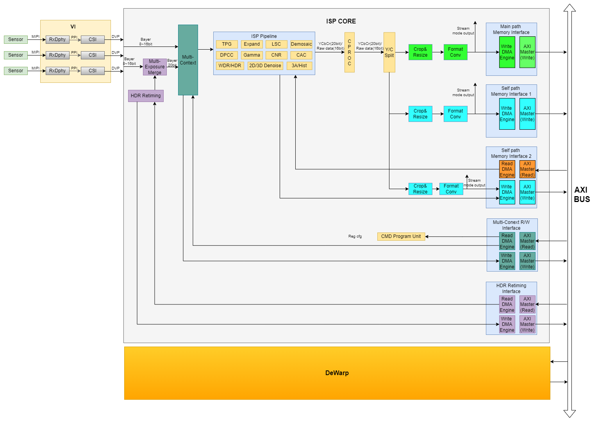
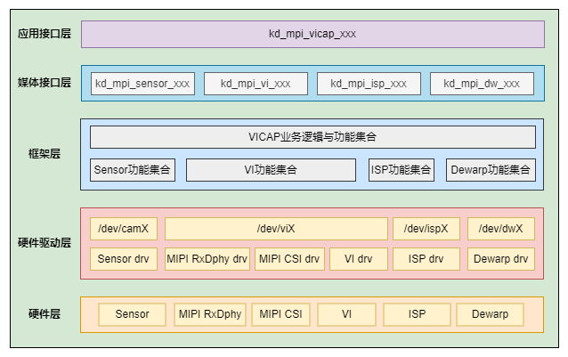
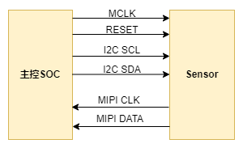

# K230 VICAP API参考


版权所有©2023北京嘉楠捷思信息技术有限公司

<div style="page-break-after:always"></div>

## 免责声明

您购买的产品、服务或特性等应受北京嘉楠捷思信息技术有限公司（“本公司”，下同）及其关联公司的商业合同和条款的约束，本文档中描述的全部或部分产品、服务或特性可能不在您的购买或使用范围之内。除非合同另有约定，本公司不对本文档的任何陈述、信息、内容的正确性、可靠性、完整性、适销性、符合特定目的和不侵权提供任何明示或默示的声明或保证。除非另有约定，本文档仅作为使用指导参考。

由于产品版本升级或其他原因，本文档内容将可能在未经任何通知的情况下，不定期进行更新或修改。

## 商标声明

、“嘉楠”和其他嘉楠商标均为北京嘉楠捷思信息技术有限公司及其关联公司的商标。本文档可能提及的其他所有商标或注册商标，由各自的所有人拥有。

**版权所有 © 2023北京嘉楠捷思信息技术有限公司。保留一切权利。**
非经本公司书面许可，任何单位和个人不得擅自摘抄、复制本文档内容的部分或全部，并不得以任何形式传播。

<div style="page-break-after:always"></div>

## 目录

[TOC]

## 前言

### 概述

本文档主要指导应用开发者通过如何通过VICAP模块获取图像数据，描述了各个模块API的基本功能。

### 读者对象

本文档（本指南）主要适用于以下人员：

- 技术支持工程师
- 软件开发工程师

### 缩略词定义

| 简称 | 说明 |
|------|------|
|      |      |

### 修订记录

| 文档版本号 | 修改说明                                                                                                                                   | 修改者        | 日期      |
|------------|--------------------------------------------------------------------------------------------------------------------------------------------|---------------|-----------|
| V1.0       | 初版                                                                                                                                       | 汪成根        | 2023/4/4  |
| V1.1       | 修改VICAP概述 2、添加API、数据类型的跳转                                                                                                   | 赵忠祥        | 2023/4/6  |
| V1.2       | 移除ISP相关接口 增加API及数据类型描述 将sensor接口从libvicap库分离出来独立为libsensor库 增加ov9286红外/散斑类型 更新VICAP描述 更新文档格式 | 郭世栋 汪成根 | 2023/4/26 |

## 1. 概述

### 1.1 概述

VICAP子系统是K230 SOC中负责视频图像输入捕获处理的子系统。通过对sensor输出的信号进行实时处理，得到经过复原、增强后的数字图像，使其更接近现实中人眼所见的图像。主要包括MIPI RxDphy、MIPI CSI、ISP和DW。MIPI用于接收sensor传来的高速差分信号，并将其转为DVP接口，供ISP处理；ISP用于图像信息的处理；DW用于鱼眼矫正和多路resize输出。

本文档主要描述VICAP模块应用编程接口，它提供了应用开发者通过VICAP模块捕获视频图像数据的操作接口和配置参数。

### 1.2 功能描述

#### 1.2.1 VICAP

VICAP模块是对整个图像采集处理单元的抽象描述。

VICAP硬件由Sensor，VI，ISP，Dewarp四大模块组成（如下图1-1所示）。最多支持3路sensor同时接入，ISP内部通过的MCM模块实现多路sensor的时分复用管理，多路sensor输出数据通过MCM的Memory Interface的Write接口写入DDR，再通过Read接口读入并装载到ISP Pipeline进行处理。

、

图1-1 VICAP硬件架构图

VICAP软件架构如图1-2所示，从上到下依次是：应用接口层，媒体接口层，系统框架层，驱动层和硬件层。

- 应用层接口： 提供kd_mapi_vicap_xxx形式的API接口及使用说明。它是对媒体接口层各个子模块提供的功能接口的进一步封装，简化应用开发流程。
- 媒体接口层：该层由VICAP各个子模块组成，每个子模块提供各自的媒体接口API封装。
- 框架层：负责VICAP整个系统软件功能与业务逻辑的控制与管理。通过将各个子模块提供的接口与功能整合统一形成一套完整的VICAP系统控制逻辑和流程。
- 驱动层：VICAP各个硬件模块的内核驱动功能的集合。

硬件层：VICAP各个具体硬件模块的集合，包括sensor。



#### 1.2.2 Sensor

Sensor模块是VICAP捕获图像的数据源之一，负责配置图像感光单元的运行参数及工作模式。

K230平台支持多种接口类型的sensor，我们以当前最常用的MIPI CSI接口Sensor为例进行说明。Sensor与主控平台的硬件连接示意图如下：



图1-3

主控通过I2C接口下发配置寄存器控制sensor的工作方式，sensor通过MIPI CSI接口将图像数据发送至主控SOC。

Sensor模块系统架构如下图1-4所示：


图1-4 sensor系统架构图

从上到下依次是：媒体接口层，硬件驱动层以及硬件层

- 媒体接口层：提供kd_mpi_sensor_xxx接口给外部模块操作和访问sensor设备。
- 驱动层：该层主要包两部分，分别是：sensor_dev，sensor_drv。
- sensor_dev：负责设备驱动文件的注册，提供文件操作接口的实现流程。通过注册设备文件节点/dev/sensorxx供用户空间的程序访问内核驱动。
- sensor_drv：具体sensor的硬件驱动，并将针对sensor的操作封装为统一的接口。
- 硬件层：sensor模组硬件，当前系统中最多同时支持三路硬件sensor。

## 2. API 参考

### 2.1 VICAP

该功能模块提供以下API：

- [kd_mpi_vicap_get_sensor_info](#211-kd_mpi_vicap_get_sensor_info)
- [kd_mpi_vicap_set_dev_attr](#212-kd_mpi_vicap_set_dev_attr)
- [kd_mpi_vicap_get_dev_attr](#213-kd_mpi_vicap_get_dev_attr)
- [kd_mpi_vicap_set_chn_attr](#214-kd_mpi_vicap_set_chn_attr)
- [kd_mpi_vicap_get_chn_attr](#215-kd_mpi_vicap_get_chn_attr)
- [kd_mpi_vicap_init](#216-kd_mpi_vicap_init)
- [kd_mpi_vicap_deinit](#217-kd_mpi_vicap_deinit)
- [kd_mpi_vicap_start_stream](#218-kd_mpi_vicap_start_stream)
- [kd_mpi_vicap_stop_stream](#219-kd_mpi_vicap_stop_stream)
- [kd_mpi_vicap_dump_frame](#2110-kd_mpi_vicap_dump_frame)
- [kd_mpi_vicap_dump_release](#2111-kd_mpi_vicap_dump_release)

#### 2.1.1 kd_mpi_vicap_get_sensor_info

【描述】

根据指定的sensor配置类型获取sensor配置信息

【语法】

k_s32 kd_mpi_vicap_get_sensor_info(k_vicap_sensor_type sensor_type, k_vicap_sensor_info \*sensor_info)

【参数】

| **参数名称** | **描述**       | **输入/输出** |
|--------------|----------------|---------------|
| sensor_type  | Sensor配置类型 | 输入          |
| sensor_info  | Sensor配置信息 | 输出          |

【返回值】

| **返回值** | **描述**               |
|------------|------------------------|
| 0          | 成功。                 |
| 非0        | 失败，参考错误码定义。 |

【芯片差异】

无。

【需求】

- 头文件：mpi_vicap_api.h
- 库文件：libvicap.a

【注意】

应用开发者根据需要要使用的sensor配置类型，需要首先调用该API获取sensor配置信息，并根据配置信息调用后续接口对VICAP其他模块进行初始化。

【举例】

无。

【相关主题】

#### 2.1.2 kd_mpi_vicap_set_dev_attr

【描述】

设置VICAP设备属性

【语法】

k_s32 kd_mpi_vicap_set_dev_attr(k_vicap_dev dev_num, k_vicap_dev_attr dev_attr)

【参数】

| **参数名称** | **描述**      | **输入/输出** |
|--------------|---------------|---------------|
| dev_num      | VICAP设备号   | 输入          |
| dev_attr     | VICAP设备属性 | 输入          |

【返回值】

| **返回值** | **描述**               |
|------------|------------------------|
| 0          | 成功。                 |
| 非0        | 失败，参考错误码定义。 |

【芯片差异】

无。

【需求】

- 头文件：mpi_vicap_api.h
- 库文件：libvicap.a

【注意】

无。

【举例】

无。

【相关主题】

#### 2.1.3 kd_mpi_vicap_get_dev_attr

【描述】

获取VICAP设备属性

【语法】

k_s23 kd_mpi_vicap_set_chn_attr(k_vicap_dev dev, k_vicap_chn_attr chn_attr)

【参数】

| **参数名称** | **描述**      | **输入/输出** |
|--------------|---------------|---------------|
| dev_num      | VICAP设备号   | 输入          |
| dev_attr     | VICAP设备属性 | 输出          |

【返回值】

| **返回值** | **描述**               |
|------------|------------------------|
| 0          | 成功。                 |
| 非0        | 失败，参考错误码定义。 |

【芯片差异】

无。

【需求】

- 头文件：mpi_vicap_api.h
- 库文件：libvicap.a

【注意】

无。

【举例】

无。

【相关主题】

#### 2.1.4 kd_mpi_vicap_set_chn_attr

【描述】

设置VICAP设备属性

【语法】

k_s32 kd_mpi_vicap_set_chn_attr(k_vicap_dev dev_num, k_vicap_chn chn_num, k_vicap_chn_attr chn_attr)

【参数】

| **参数名称** | **描述**          | **输入/输出** |
|--------------|-------------------|---------------|
| dev_num      | VICAP设备号       | 输入          |
| chn_num      | VICAP输出通道号   | 输入          |
| chn_attr     | VICAP输出通道属性 | 输入          |

【返回值】

| **返回值** | **描述**               |
|------------|------------------------|
| 0          | 成功。                 |
| 非0        | 失败，参考错误码定义。 |

【芯片差异】

无。

【需求】

- 头文件：mpi_vicap_api.h
- 库文件：libvicap.a

【注意】

无。

【举例】

无。

【相关主题】

#### 2.1.5 kd_mpi_vicap_get_chn_attr

【描述】

获取VICAP设备属性

【语法】

k_s32 kd_mpi_vicap_get_chn_attr(k_vicap_dev dev_num, k_vicap_chn chn_num, k_vicap_chn_attr \*chn_attr)

【参数】

| **参数名称** | **描述**          | **输入/输出** |
|--------------|-------------------|---------------|
| dev_num      | VICAP设备号       | 输入          |
| chn_num      | VICAP输出通道号   | 输入          |
| chn_attr     | VICAP输出通道属性 | 输出          |

【返回值】

| **返回值** | **描述**               |
|------------|------------------------|
| 0          | 成功。                 |
| 非0        | 失败，参考错误码定义。 |

【芯片差异】

无。

【需求】

- 头文件：mpi_vicap_api.h
- 库文件：libvicap.a

【注意】

无。

【举例】

无。

【相关主题】

#### 2.1.6 kd_mpi_vicap_init

【描述】

VICAP设备初始化

【语法】

k_s32 kd_mpi_vicap_init(k_vicap_dev dev_num)

【参数】

| **参数名称** | **描述**    | **输入/输出** |
|--------------|-------------|---------------|
| dev_num      | VICAP设备号 | 输入          |

【返回值】

| **返回值** | **描述**               |
|------------|------------------------|
| 0          | 成功。                 |
| 非0        | 失败，参考错误码定义。 |

【芯片差异】

无。

【需求】

- 头文件：mpi_vicap_api.h
- 库文件：libvicap.a

【注意】

使用该接口之前需要先调用kd_mpi_vicap_set_dev_attr设置设备属性，再调用kd_mpi_vicap_set_chn_attr 设置输出通道属性。

【举例】

无

【相关主题】

#### 2.1.7 kd_mpi_vicap_deinit

【描述】

VICAP设备去初始化

【语法】

k_s32 kd_mpi_vicap_deinit(k_vicap_dev dev_num)

【参数】

| **参数名称** | **描述**    | **输入/输出** |
|--------------|-------------|---------------|
| dev_num      | VICAP设备号 | 输入          |

【返回值】

| **返回值** | **描述**               |
|------------|------------------------|
| 0          | 成功。                 |
| 非0        | 失败，参考错误码定义。 |

【芯片差异】

无。

【需求】

- 头文件：mpi_vicap_api.h
- 库文件：libvicap.a

【注意】

无。

【举例】

无。

【相关主题】

#### 2.1.8 kd_mpi_vicap_start_stream

【描述】

启动VICAP设备输出数据流

【语法】

k_s32 kd_mpi_vicap_start_stream(k_vicap_dev dev_num)

【参数】

| **参数名称** | **描述**    | **输入/输出** |
|--------------|-------------|---------------|
| dev_num      | VICAP设备号 | 输入          |

【返回值】

| **返回值** | **描述**               |
|------------|------------------------|
| 0          | 成功。                 |
| 非0        | 失败，参考错误码定义。 |

【芯片差异】

无。

【需求】

- 头文件：mpi_vicap_api.h
- 库文件：libvicap.a

【注意】

无。

【举例】

无。

【相关主题】

#### 2.1.9 kd_mpi_vicap_stop_stream

【描述】

停止VICAP设备数据流输出

【语法】

k_s32 kd_mpi_vicap_stop_stream(k_vicap_dev dev_num)

【参数】

| **参数名称** | **描述**    | **输入/输出** |
|--------------|-------------|---------------|
| dev_num      | VICAP设备号 | 输入          |

【返回值】

| **返回值** | **描述**               |
|------------|------------------------|
| 0          | 成功。                 |
| 非0        | 失败，参考错误码定义。 |

【芯片差异】

无。

【需求】

- 头文件：mpi_vicap_api.h
- 库文件：libvicap.a

【注意】

无

【举例】

无。

【相关主题】

#### 2.1.10 kd_mpi_vicap_dump_frame

【描述】

根据指定的设备和输出通道dump vicap数据

【语法】

k_s32 kd_mpi_vicap_dump_frame(k_vicap_dev dev_num, k_vicap_chn chn_num, k_vicap_dump_format foramt,

k_video_frame_info \*vf_info, k_u32 milli_sec)

【参数】

| **参数名称** | **描述**        | **输入/输出** |
|--------------|-----------------|---------------|
| dev_num      | VICAP设备号     | 输入          |
| chn_num      | VICAP输出通道号 | 输入          |
| foramt       | Dump数据类型    | 输入          |
| vf_info      | Dump帧信息      | 输出          |
| milli_sec    | 超时时间        | 输入          |

【返回值】

| **返回值** | **描述**               |
|------------|------------------------|
| 0          | 成功。                 |
| 非0        | 失败，参考错误码定义。 |

【芯片差异】

无。

【需求】

- 头文件：mpi_vicap_api.h
- 库文件：libvicap.a

【注意】

无。

【举例】

无。

【相关主题】

#### 2.1.11 kd_mpi_vicap_dump_release

【描述】

释放dump数据帧

【语法】

k_s32 kd_mpi_vicap_dump_release(k_vicap_dev dev_num, k_vicap_chn chn_num, const k_video_frame_info \*vf_info)

【参数】

| **参数名称** | **描述**        | **输入/输出** |
|--------------|-----------------|---------------|
| dev_num      | VICAP设备号     | 输入          |
| chn_num      | VICAP输出通道号 | 输入          |
| vf_info      | Dump帧信息      | 输入          |

【返回值】

| **返回值** | **描述**               |
|------------|------------------------|
| 0          | 成功。                 |
| 非0        | 失败，参考错误码定义。 |

【芯片差异】

无。

【需求】

- 头文件：mpi_vicap_api.h
- 库文件：libvicap.a

【注意】

无。

【举例】

无。

【相关主题】

#### 2.1.12 kd_mpi_vicap_set_vi_drop_frame

【描述】

设置硬件丢帧

【语法】

k_s32 kd_mpi_vicap_set_vi_drop_frame(k_vicap_csi_num csi, k_vicap_drop_frame *frame, k_bool enable)

【参数】

| **参数名称** | **描述**        | **输入/输出** |
|--------------|-----------------|---------------|
| csi         | VICAP设备号     | 输入          |
| frame        | 结构体，见下 |               |
| m | 每隔 m 帧丢 n 帧| 输入 |
| n | 每隔 m 帧丢 n 帧| 输入 |
| mode | hdr mode | 输入 |
| enable       | 是否开启 | 输入 |

【返回值】

| **返回值** | **描述**               |
|------------|------------------------|
| 0          | 成功。                 |
| 非0        | 失败，参考错误码定义。 |

【芯片差异】

无。

【需求】

- 头文件：mpi_vicap_api.h
- 库文件：libvicap.a

#### 2.1.13 kd_mpi_vicap_set_mclk

【描述】

设置 MCLK 频率

【语法】

k_s32 kd_mpi_vicap_set_mclk(k_vicap_mclk_id id, k_vicap_mclk_sel sel, k_u8 mclk_div, k_u8 mclk_en)

【参数】

| **参数名称** | **描述**        | **输入/输出** |
|--------------|-----------------|---------------|
| id         | MCLK ID     | 输入          |
| sel | 时钟源 | 输入 |
| mclk_div | 分频系数 | 输入 |
| mclk_en | 是否开启 | 输入 |

【返回值】

| **返回值** | **描述**               |
|------------|------------------------|
| 0          | 成功。                 |
| 非0        | 失败，参考错误码定义。 |

【芯片差异】

无。

【需求】

- 头文件：mpi_vicap_api.h
- 库文件：libvicap.a

### 2.2 Sensor

该功能模块提供以下API：

- [kd_mpi_sensor_open](#221-kd_mpi_sensor_open)
- [kd_mpi_sensor_close](#222-kd_mpi_sensor_close)
- [kd_mpi_sensor_power_set](#223-kd_mpi_sensor_power_set)
- [kd_mpi_sensor_id_get](#224-kd_mpi_sensor_id_get)
- [kd_mpi_sensor_init](#225-kd_mpi_sensor_init)
- [kd_mpi_sensor_reg_read](#226-kd_mpi_sensor_reg_read)
- [kd_mpi_sensor_reg_write](#227-kd_mpi_sensor_reg_write)
- [kd_mpi_sensor_mode_get](#228-kd_mpi_sensor_mode_get)
- [kd_mpi_sensor_mode_set](#229-kd_mpi_sensor_mode_set)
- [kd_mpi_sensor_stream_enable](#2210-kd_mpi_sensor_stream_enable)
- [kd_mpi_sensor_again_set](#2211-kd_mpi_sensor_again_set)
- [kd_mpi_sensor_again_get](#2212-kd_mpi_sensor_again_get)
- [kd_mpi_sensor_dgain_set](#2213-kd_mpi_sensor_dgain_set)
- [kd_mpi_sensor_dgain_get](#2214-kd_mpi_sensor_dgain_get)
- [kd_mpi_sensor_intg_time_set](#2215-kd_mpi_sensor_intg_time_set)
- [kd_mpi_sensor_intg_time_get](#2216-kd_mpi_sensor_intg_time_get)

#### 2.2.1 kd_mpi_sensor_open

【描述】

根据sensor设备名称打开sensor设备

【语法】

k_s32 kd_mpi_sensor_open(const char \*sensor_name)

【参数】

| **参数名称** | **描述**       | **输入/输出** |
|--------------|----------------|---------------|
| sensor_name  | Sensor设备名称 | 输入          |

【返回值】

| **返回值** | **描述**               |
|------------|------------------------|
| 正值       | 成功。返回设备描述符   |
| 负值       | 失败，参考错误码定义。 |

【芯片差异】

无。

【需求】

- 头文件：mpi_sensor_api.h
- 库文件：libsensor.a

【注意】

无。

【举例】

无。

【相关主题】

#### 2.2.2 kd_mpi_sensor_close

【描述】

关闭sensor设备

【语法】

k_s32 kd_mpi_sensor_close (k_s32 fd)

【参数】

| **参数名称** | **描述**             | **输入/输出** |
|--------------|----------------------|---------------|
| fd           | Sensor设备文件描述符 | 输入          |

【返回值】

| **返回值** | **描述**               |
|------------|------------------------|
| 0          | 成功。                 |
| 非0        | 失败，参考错误码定义。 |

【芯片差异】

无。

【需求】

- 头文件：mpi_sensor_api.h
- 库文件：libsensor.a

【注意】

无。

【举例】

无。

【相关主题】

#### 2.2.3 kd_mpi_sensor_power_set

【描述】

设置sensor电源状态

【语法】

k_s32 kd_mpi_sensor_power_set(k_s32 fd, k_bool on)

【参数】

| **参数名称** | **描述**                                      | **输入/输出** |
|--------------|-----------------------------------------------|---------------|
| fd           | Sensor设备文件描述符                          | 输入          |
| on           | 设置sensor上电状态，K_TRUE:上电，K_FALSE:下电 | 输入          |

【返回值】

| **返回值** | **描述**               |
|------------|------------------------|
| 0          | 成功。                 |
| 非0        | 失败，参考错误码定义。 |

【芯片差异】

无。

【需求】

- 头文件：mpi_sensor_api.h
- 库文件：libsensor.a

【注意】

无。

【举例】

无。

【相关主题】

#### 2.2.4 kd_mpi_sensor_id_get

【描述】

获取sensor id

【语法】

k_s32 kd_mpi_sensor_id_get(k_s32 fd, k_u32 \*sensor_id)

【参数】

| **参数名称** | **描述**             | **输入/输出** |
|--------------|----------------------|---------------|
| fd           | Sensor设备文件描述符 | 输入          |
| sensor_id    | 获取的sensor id      | 输出          |

【返回值】

| **返回值** | **描述**               |
|------------|------------------------|
| 0          | 成功。                 |
| 非0        | 失败，参考错误码定义。 |

【芯片差异】

无。

【需求】

- 头文件：mpi_sensor_api.h
- 库文件：libsensor.a

【注意】

无。

【举例】

无。

【相关主题】

#### 2.2.5 kd_mpi_sensor_init

【描述】

Sensor初始化

【语法】

k_s32 kd_mpi_sensor_init(k_s32 fd, k_sensor_mode mode)

【参数】

| **参数名称** | **描述**                                    | **输入/输出** |
|--------------|---------------------------------------------|---------------|
| fd           | Sensor设备文件描述符                        | 输入          |
| mode         | 根据指定的sensor mode初始化sensor配置寄存器 | 输入          |

【返回值】

| **返回值** | **描述**               |
|------------|------------------------|
| 0          | 成功。                 |
| 非0        | 失败，参考错误码定义。 |

【芯片差异】

无。

【需求】

- 头文件：mpi_sensor_api.h
- 库文件：libsensor.a

【注意】

无。

【举例】

无。

【相关主题】

#### 2.2.6 kd_mpi_sensor_reg_read

【描述】

读取sensor寄存器内容

【语法】

k_s32 kd_mpi_sensor_reg_read(k_s32 fd, k_u32 reg_addr, k_u32 \*reg_val)

【参数】

| **参数名称** | **描述**             | **输入/输出** |
|--------------|----------------------|---------------|
| fd           | Sensor设备文件描述符 | 输入          |
| reg_addr     | Sensor寄存器地址     | 输入          |
| reg_val      | 读取寄存器内容       | 输出          |

【返回值】

| **返回值** | **描述**               |
|------------|------------------------|
| 0          | 成功。                 |
| 非0        | 失败，参考错误码定义。 |

【芯片差异】

无。

【需求】

- 头文件：mpi_sensor_api.h
- 库文件：libsensor.a

【注意】

无。

【举例】

无。

【相关主题】

#### 2.2.7 kd_mpi_sensor_reg_write

【描述】

写sensor寄存器内容

【语法】

k_s32 kd_mpi_sensor_reg_write(k_s32 fd, k_u32 reg_addr, k_u32 reg_val)

【参数】

| **参数名称** | **描述**             | **输入/输出** |
|--------------|----------------------|---------------|
| fd           | Sensor设备文件描述符 | 输入          |
| reg_addr     | Sensor寄存器地址     | 输入          |
| reg_val      | 写入sensor寄存器内容 | 输入          |

【返回值】

| **返回值** | **描述**               |
|------------|------------------------|
| 0          | 成功。                 |
| 非0        | 失败，参考错误码定义。 |

【芯片差异】

无。

【需求】

- 头文件：mpi_sensor_api.h
- 库文件：libsensor.a

【注意】

无。

【举例】

无。

【相关主题】

#### 2.2.8 kd_mpi_sensor_mode_get

【描述】

获取sensor mode配置

【语法】

k_s32 kd_mpi_sensor_mode_get(k_s32 fd, k_sensor_mode \*mode)

【参数】

| **参数名称** | **描述**                      | **输入/输出** |
|--------------|-------------------------------|---------------|
| fd           | Sensor设备文件描述符          | 输入          |
| mode         | 返回获取的sensor mode配置参数 | 输出          |

【返回值】

| **返回值** | **描述**               |
|------------|------------------------|
| 0          | 成功。                 |
| 非0        | 失败，参考错误码定义。 |

【芯片差异】

无。

【需求】

- 头文件：mpi_sensor_api.h
- 库文件：libsensor.a

【注意】

无。

【举例】

无。

【相关主题】

#### 2.2.9 kd_mpi_sensor_mode_set

【描述】

设置sensor mode配置

【语法】

k_s32 kd_mpi_sensor_mode_get(k_s32 fd, k_sensor_mode mode)

【参数】

| **参数名称** | **描述**                | **输入/输出** |
|--------------|-------------------------|---------------|
| fd           | Sensor设备文件描述符    | 输入          |
| mode         | 设置sensor mode配置参数 | 输入          |

【返回值】

| **返回值** | **描述**               |
|------------|------------------------|
| 0          | 成功。                 |
| 非0        | 失败，参考错误码定义。 |

【芯片差异】

无。

【需求】

- 头文件：mpi_sensor_api.h
- 库文件：libsensor.a

【注意】

无。

【举例】

无。

【相关主题】

#### 2.2.10 kd_mpi_sensor_stream_enable

【描述】

设置sensor mode配置

【语法】

k_s32 kd_mpi_sensor_stream_enable(k_s32 fd, k_s32 enable)

【参数】

| **参数名称** | **描述**                                         | **输入/输出** |
|--------------|--------------------------------------------------|---------------|
| fd           | Sensor设备文件描述符                             | 输入          |
| enable       | 设置sensor流输出状态，0：禁止输出，非0：使能输出 | 输入          |

【返回值】

| **返回值** | **描述**               |
|------------|------------------------|
| 0          | 成功。                 |
| 非0        | 失败，参考错误码定义。 |

【芯片差异】

无。

【需求】

- 头文件：mpi_sensor_api.h
- 库文件：libsensor.a

【注意】

无。

【举例】

无。

【相关主题】

#### 2.2.11 kd_mpi_sensor_again_set

【描述】

设置sensor 模拟增益

【语法】

k_s32 kd_mpi_sensor_again_set(k_s32 fd, k_sensor_gain gain)

【参数】

| **参数名称** | **描述**             | **输入/输出** |
|--------------|----------------------|---------------|
| fd           | Sensor设备文件描述符 | 输入          |
| gain         | gain配置参数         | 输入          |

【返回值】

| **返回值** | **描述**               |
|------------|------------------------|
| 0          | 成功。                 |
| 非0        | 失败，参考错误码定义。 |

【芯片差异】

无。

【需求】

- 头文件：mpi_sensor_api.h
- 库文件：libsensor.a

【注意】

无。

【举例】

无。

【相关主题】

#### 2.2.12 kd_mpi_sensor_again_get

【描述】

获取sensor 模拟增益

【语法】

k_s32 kd_mpi_sensor_again_set(k_s32 fd, k_sensor_gain \*gain)

【参数】

| **参数名称** | **描述**             | **输入/输出** |
|--------------|----------------------|---------------|
| fd           | Sensor设备文件描述符 | 输入          |
| gain         | gain配置参数         | 输出          |

【返回值】

| **返回值** | **描述**               |
|------------|------------------------|
| 0          | 成功。                 |
| 非0        | 失败，参考错误码定义。 |

【芯片差异】

无。

【需求】

- 头文件：mpi_sensor_api.h
- 库文件：libsensor.a

【注意】

无。

【举例】

无。

【相关主题】

#### 2.2.13 kd_mpi_sensor_dgain_set

【描述】

设置sensor 数字增益

【语法】

k_s32 kd_mpi_sensor_dgain_set(k_s32 fd, k_sensor_gain gain)

【参数】

| **参数名称** | **描述**             | **输入/输出** |
|--------------|----------------------|---------------|
| fd           | Sensor设备文件描述符 | 输入          |
| gain         | gain配置参数         | 输入          |

【返回值】

| **返回值** | **描述**               |
|------------|------------------------|
| 0          | 成功。                 |
| 非0        | 失败，参考错误码定义。 |

【芯片差异】

无。

【需求】

- 头文件：mpi_sensor_api.h
- 库文件：libsensor.a

【注意】

无。

【举例】

无。

【相关主题】

#### 2.2.14 kd_mpi_sensor_dgain_get

【描述】

获取sensor 数字增益

【语法】

k_s32 kd_mpi_sensor_dgain_get(k_s32 fd, k_sensor_gain \*gain)

【参数】

| **参数名称** | **描述**             | **输入/输出** |
|--------------|----------------------|---------------|
| fd           | Sensor设备文件描述符 | 输入          |
| gain         | gain配置参数         | 输出          |

【返回值】

| **返回值** | **描述**               |
|------------|------------------------|
| 0          | 成功。                 |
| 非0        | 失败，参考错误码定义。 |

【芯片差异】

无。

【需求】

- 头文件：mpi_sensor_api.h
- 库文件：libsensor.a

【注意】

无。

【举例】

无。

【相关主题】

#### 2.2.15 kd_mpi_sensor_intg_time_set

【描述】

设置sensor 积分时间

【语法】

k_s32 kd_mpi_sensor_intg_time_set(k_s32 fd, k_sensor_intg_time time)

【参数】

| **参数名称** | **描述**             | **输入/输出** |
|--------------|----------------------|---------------|
| fd           | Sensor设备文件描述符 | 输入          |
| time         | 积分时间配置参数     | 输入          |

【返回值】

| **返回值** | **描述**               |
|------------|------------------------|
| 0          | 成功。                 |
| 非0        | 失败，参考错误码定义。 |

【芯片差异】

无。

【需求】

- 头文件：mpi_sensor_api.h
- 库文件：libsensor.a

【注意】

无。

【举例】

无。

【相关主题】

#### 2.2.16 kd_mpi_sensor_intg_time_get

【描述】

获取sensor 积分时间

【语法】

k_s32 kd_mpi_sensor_intg_time_get(k_s32 fd, k_sensor_intg_time \*time)

【参数】

| **参数名称** | **描述**             | **输入/输出** |
|--------------|----------------------|---------------|
| fd           | Sensor设备文件描述符 | 输入          |
| time         | 积分时间配置参数     | 输出          |

【返回值】

| **返回值** | **描述**               |
|------------|------------------------|
| 0          | 成功。                 |
| 非0        | 失败，参考错误码定义。 |

【芯片差异】

无。

【需求】

- 头文件：mpi_sensor_api.h
- 库文件：libsensor.a

【注意】

无。

【举例】

无。

【相关主题】

## 3. 数据类型

### 3.1 VICAP

该功能模块的相关数据类型定义如下：

- [k_vicap_sensor_type](#311-k_vicap_sensor_type)
- [k_vicap_dev](#312-k_vicap_dev)
- [k_vicap_chn](#313-k_vicap_chn)
- [k_vicap_csi_num](#314-k_vicap_csi_num)
- [k_vicap_mipi_lanes](#315-k_vicap_mipi_lanes)
- [k_vicap_csi_data_type](#316-k_vicap_csi_data_type)
- [k_vicap_data_source](#317-k_vicap_data_source)
- [k_vicap_vi_dvp_port](#318-k_vicap_vi_dvp_port)
- [k_vicap_vi_flash_mode](#319-k_vicap_vi_flash_mode)
- [k_vicap_img_window](#3110-k_vicap_img_window)
- [k_vicap_work_mode](#3111-k_vicap_work_mode)
- [k_vicap_sensor_info](#3112-k_vicap_sensor_info)
- [k_vicap_dump_format](#3113-k_vicap_dump_format)
- [k_vicap_dev_attr](#3114-k_vicap_dev_attr)
- [k_vicap_chn_attr](#3115-k_vicap_chn_attr)

#### 3.1.1 k_vicap_sensor_type

【说明】当前系统支持的sensor类型定义

【定义】

```c
typedef enum {
OV_OV9732_MIPI_1920X1080_30FPS_10BIT_LINEAR,
OV_OV9732_MIPI_1920X1080_30FPS_10BIT_HDR,
OV_OV9732_MIPI_1280X720_30FPS_10BIT_LINEAR,
OV_OV9286_MIPI_1920X1080_30FPS_10BIT_LINEAR,
OV_OV9286_MIPI_1920X1080_30FPS_10BIT_HDR,
OV_OV9286_MIPI_1280X720_30FPS_10BIT_LINEAR_IR,
OV_OV9286_MIPI_1280X720_30FPS_10BIT_LINEAR_SPECKLE,
SENSOR_TYPE_MAX,
} k_vicap_sensor_type;
```

【成员】

| **成员名称**                                       | **描述**                                |
|----------------------------------------------------|-----------------------------------------|
| OV_OV9732_MIPI_1920X1080_30FPS_10BIT_LINEAR        | OV9732 1080P 10bit 30帧线性输出配置     |
| OV_OV9732_MIPI_1920X1080_30FPS_10BIT_HDR           | OV9732 1080P 10bit 30帧HDR输出配置      |
| OV_OV9732_MIPI_1280X720_30FPS_10BIT_LINEAR         | OV9732 720P 10bit 30帧线性输出配置      |
| OV_OV9286_MIPI_1920X1080_30FPS_10BIT_LINEAR        | OV9286 1080P 10bit 30帧线性输出配置     |
| OV_OV9286_MIPI_1920X1080_30FPS_10BIT_HDR           | OV9286 1080P 10bit 30帧HDR输出配置      |
| OV_OV9286_MIPI_1280X720_30FPS_10BIT_LINEAR_IR      | OV9286 720P 10bit 30帧线性输出 红外配置 |
| OV_OV9286_MIPI_1280X720_30FPS_10BIT_LINEAR_SPECKLE | OV9286 720P 10bit 30帧线性输出 散斑配置 |

【注意事项】

1. 该列表需要有sensor驱动开发人员维护，应用开发者通过此处定义的sensor type来打开指定类型的sensor设备
1. 当前版本支持如下类型：

    OV_OV9732_MIPI_1280X720_30FPS_10BIT_LINEAR

    OV_OV9286_MIPI_1280X720_30FPS_10BIT_LINEAR_IR

    OV_OV9286_MIPI_1280X720_30FPS_10BIT_LINEAR_SPECKLE

#### 3.1.2 k_vicap_dev

【说明】vicap设备号定义

【定义】

```c
typedef enum {
VICAP_DEV_ID_0 = 0,
VICAP_DEV_ID_1 = 1,
VICAP_DEV_ID_2 = 2,
VICAP_DEV_ID_MAX,
} k_vicap_dev;
```

【成员】

| **成员名称**   | **描述**   |
|----------------|------------|
| VICAP_DEV_ID_0 | VICAP设备0 |
| VICAP_DEV_ID_1 | VICAP设备1 |
| VICAP_DEV_ID_2 | VICAP设备2 |

#### 3.1.3 k_vicap_chn

【说明】vicap输出通道号定义

【定义】

```c
typedef enum {
VICAP_CHN_ID_0 = 0,
VICAP_CHN_ID_1 = 1,
VICAP_CHN_ID_2 = 2,
VICAP_CHN_ID_MAX,
} k_vicap_chn;
```

【成员】

| **成员名称**   | **描述**       |
|----------------|----------------|
| VICAP_CHN_ID_0 | VICAP输出通道0 |
| VICAP_CHN_ID_1 | VICAP输出通道1 |
| VICAP_CHN_ID_2 | VICAP输出通道2 |

#### 3.1.4 k_vicap_csi_num

【说明】vicap csi标号定义

【定义】

```c
typedef enum {
VICAP_CSI0 = 1,
VICAP_CSI1 = 2,
VICAP_CSI2 = 3,
} k_vicap_csi_num;
```

【成员】

| **成员名称** | **描述** |
|--------------|----------|
| VICAP_CSI0   | CSI0     |
| VICAP_CSI1   | CSI1     |
| VICAP_CSI2   | CSI2     |

【注意事项】

Sensor连接的CSI号由硬件物理连接决定。

#### 3.1.5 k_vicap_mipi_lanes

【说明】vicap mipi通道数定义

【定义】

```c
typedef enum {
VICAP_MIPI_1LANE = 0,
VICAP_MIPI_2LANE = 1,
VICAP_MIPI_4LANE = 3,
} k_vicap_mipi_lanes;
```

【成员】

| **成员名称**     | **描述** |
|------------------|----------|
| VICAP_MIPI_1LANE | 1 lane   |
| VICAP_MIPI_2LANE | 2 lane   |
| VICAP_MIPI_4LANE | 4 lane   |

【注意事项】

Sensor连接使用的mipi 通道个数由硬件物理连接决定，当使用4lane时，最多只能连接两个sensor。

#### 3.1.6 k_vicap_csi_data_type

【说明】vicap mipi通道数定义

【定义】

```c
typedef enum {
VICAP_CSI_DATA_TYPE_RAW8 = 0x2A,
VICAP_CSI_DATA_TYPE_RAW10 = 0x2B,
VICAP_CSI_DATA_TYPE_RAW12 = 0x2C,
VICAP_CSI_DATA_TYPE_RAW14 = 0x2D,
} k_vicap_csi_data_type;
```

【成员】

| **成员名称**              | **描述** |
|---------------------------|----------|
| VICAP_CSI_DATA_TYPE_RAW8  | RAW8     |
| VICAP_CSI_DATA_TYPE_RAW10 | RAW10    |
| VICAP_CSI_DATA_TYPE_RAW12 | RAW12    |
| VICAP_CSI_DATA_TYPE_RAW14 | RAW14    |

【注意事项】

无

#### 3.1.7 k_vicap_data_source

【说明】vicap 数据源

【定义】

```c
typedef enum {
VICAP_SOURCE_CSI0 = 0, /**< vicap acquire data from the csi0*/
VICAP_SOURCE_CSI1 = 1, /**< vicap acquire data from the csi0*/
VICAP_SOURCE_CSI1_FS_TR0 = 2, /**<vicap acquire data from the csi1 for flash trigger 0*/
VICAP_SOURCE_CSI1_FS_TR1 = 3, /**<vicap acquire data from the csi0 for flash trigger 1*/
VICAP_SOURCE_CSI2 = 4, /**< vicap acquire data from the csi2*/
} k_vicap_data_source;
```

【成员】

| **成员名称**             | **描述**                            |
|--------------------------|-------------------------------------|
| VICAP_SOURCE_CSI0        | VICAP数据来源为CSI0                 |
| VICAP_SOURCE_CSI1        | VICAP数据来源为CSI1                 |
| VICAP_SOURCE_CSI1_FS_TR0 | VICAP数据来源为CSI1 Flash trigger 0 |
| VICAP_SOURCE_CSI1_FS_TR1 | VICAP数据来源为CSI1 Flash trigger 1 |
| VICAP_SOURCE_CSI2        | VICAP数据来源为CSI2                 |

【注意事项】

#### 3.1.8 k_vicap_vi_dvp_port

【说明】vicap vi dvp端口号

【定义】

```c
typedef enum {
VICAP_VI_DVP_PORT0 = 0,
VICAP_VI_DVP_PORT1 = 1,
VICAP_VI_DVP_PORT2 = 2,
VICAP_VI_DVP_PORT_MAX,
} k_vicap_vi_dvp_port;
```

【成员】

| **成员名称**       | **描述**  |
|--------------------|-----------|
| VICAP_VI_DVP_PORT0 | DVP 端口0 |
| VICAP_VI_DVP_PORT1 | DVP端口1  |
| VICAP_VI_DVP_PORT2 | DVP端口2  |

【注意事项】

1. 默认端口0对应CSI0，端口1对应CSI1，端口2对应CSI2
1. 只有端口0支持HDR sensor，当用户需要使用HDR模式时，必需要将其绑定到DVP端口0。
1. 当用户需要改变端口映射关系时需要执行绑定操作

#### 3.1.9 k_vicap_vi_flash_mode

【说明】vicap 闪光灯光源控制模式

【定义】

```c
typedef enum {
VICAP_FLASH_FOLLOW_STROBE = 0,
VICAP_FLASH_FOLLOW_STROBE_BASE_PWM = 1,
VICAP_FLASH_NORMAL_PWM = 2,
VICAP_FLASH_DISABLE = 3, /**< disable flash light*/
} k_vicap_vi_flash_mode;
```

【成员】

| **成员名称**                       | **描述**                    |
|------------------------------------|-----------------------------|
| VICAP_FLASH_FOLLOW_STROBE          | 由strobe信号控制            |
| VICAP_FLASH_FOLLOW_STROBE_BASE_PWM | 基于PWM模式由strobe信号控制 |
| VICAP_FLASH_NORMAL_PWM             | 由PWM信号控制               |
| VICAP_FLASH_DISABLE                | 禁用                        |

【注意事项】

#### 3.1.10 k_vicap_img_window

【说明】VICAP图像窗口定义

【定义】

```c
typedef struct {
k_u16 h_start;
k_u16 v_start;
k_u16 width;
k_u16 height;
} k_vicap_img_window;
```

【成员】

| **成员名称** | **描述**     |
|--------------|--------------|
| h_start      | 水平起始位置 |
| v_start      | 垂直起始位置 |
| width        | 图像宽度     |
| height       | 图像高度     |

#### 3.1.11 k_vicap_work_mode

【说明】vicap工作模式

【定义】

```c
typedef enum {
VICAP_WORK_ONLINE_MODE,
VICAP_WORK_OFFLINE_MODE,
} k_vicap_work_mode;
```

【成员】

| **成员名称**            | **描述** |
|-------------------------|----------|
| VICAP_WORK_ONLINE_MODE  | 在线模式 |
| VICAP_WORK_OFFLINE_MODE | 离线模式 |

【注意事项】支持多个摄像头输入时，必须指定为离线模式。

#### 3.1.12 k_vicap_sensor_info

【说明】VICAP sensor配置信息

【定义】

```c
typedef struct {
const char *sensor_name;
k_vicap_csi_num csi_num; /**< CSI NUM that the sensor connects to*/
k_vicap_mipi_lanes mipi_lanes; /**< MIPI lanes that the sensor connects to*/
k_vicap_data_source source_id; /**<source id that the sensor used to*/
k_bool is_3d_sensor;
k_vicap_mipi_phy_freq phy_freq;
k_vicap_csi_data_type data_type;
k_vicap_hdr_mode hdr_mode;
k_vicap_vi_flash_mode flash_mode;
k_vicap_sensor_type sensor_type;
} k_vicap_sensor_info;
```

【成员】

| **成员名称** | **描述**                              |
|--------------|---------------------------------------|
| sensor_name  | Sensor名字                            |
| csi_num      | 当前sensor硬件连接的CSI号             |
| mipi_lanes   | 当前sensor硬件连接的使用的MIPI 通道数 |
| source_id    | 当前sensor使用的VICAP数据源标号       |
| is_3d_sensor | 是否为3Dsensor                        |
| phy_freq     | PHY频率                               |
| data_type    | MIPI CSI数据类型                      |
| hdr_mode     | HDR模式                               |
| flash_mode   | 闪光灯配置模式                        |
| sensor_type  | Sensor配置类型                        |

#### 3.1.13 k_vicap_dump_format

【说明】VICAPdumo数据帧格式

【定义】

```c
typedef enum {
VICAP_DUMP_YUV = 0,
VICAP_DUMP_RGB = 1,
VICAP_DUMP_RAW = 2,
} k_vicap_dump_format;
```

【成员】

| **成员名称**   | **描述**     |
|----------------|--------------|
| VICAP_DUMP_YUV | Dump YUV数据 |
| VICAP_DUMP_RGB | Dump RGB数据 |
| VICAP_DUMP_RAW | Dump RAW数据 |

#### 3.1.14 k_vicap_dev_attr

【说明】VICAP设备属性

【定义】

```c
typedef struct {
    k_vicap_window acq_win;
    k_vicap_work_mode mode;
    k_vicap_isp_pipe_ctrl pipe_ctrl;
    k_u32 cpature_frame;
    k_vicap_sensor_info sensor_info;
    k_bool dw_enable;
    k_u32 buffer_num;
    k_u32 buffer_size;
} k_vicap_dev_attr;
```

【成员】

| **成员名称**  | **描述**                                                     |
| ------------- | ------------------------------------------------------------ |
| acq_win       | 图像捕获窗口                                                 |
| mode          | Vicap工作模式。当支持多个摄像头输入时，必须指定为离线模式。  |
| pipe_ctrl     | ISP pipeline 控制开关。                                      |
| cpature_frame | 指定采集数据的帧数，输入范围\[0,1023\]，0：持续采集          |
| sensor_info   | Sensor配置信息                                               |
| dw_enable     | Dewarp使能（详见 [K230_SDK_Dewarp使用指南.md](../../pc/dewarp/K230_SDK_Dewarp使用指南.md)） |
| buffer_num    | 离线模式下，配置sensor接收数据的缓冲区个数                   |
| buffer_size   | 离线模式下，配置sensor接收数据的缓冲区大小                   |

【注意事项】对于小内存应用场景，建议关闭3DNR模块，减小内存占用。关闭方式为应用设置设备属性时，将 pipe_ctrl.bits.dnr3_enable 设置为0

#### 3.1.15 k_vicap_chn_attr

【说明】VICAP设备属性

【定义】

```c
typedef struct {
    k_vicap_window out_win;
    k_vicap_window crop_win;
    k_vicap_window scale_win;
    k_bool crop_enable;
    k_bool scale_enable;
    k_bool chn_enable;
    k_pixel_format pix_format;
    k_u32 buffer_num;
    k_u32 buffer_size;
    k_u8 alignment;
} k_vicap_chn_attr;
```

【成员】

| **成员名称** | **描述**                 |
| ------------ | ------------------------ |
| out_win      | 输出窗口大小             |
| crop_win     | 裁剪窗口大小             |
| scale_win    | 缩放窗口大小             |
| crop_enable  | 裁剪使能                 |
| scale_enable | 缩放使能                 |
| chn_enable   | 通道使能                 |
| pix_format   | 输出像素格式             |
| buffer_num   | 当前通道使用的缓冲区个数 |
| buffer_size  | 缓冲区大小               |
| alignment    | 缓冲区对齐方式           |

### 3.2 Sensor

该功能模块的相关数据类型定义如下：

- [k_sensor_bayer_pattern](#321-k_sensor_bayer_pattern)
- [k_sensor_exp_frame_type](#322-k_sensor_exp_frame_type)
- [k_sensor_exposure_param](#323-k_sensor_exposure_param)
- [k_sensor_intg_time](#324-k_sensor_intg_time)
- [k_sensor_gain](#325-k_sensor_gain)
- [k_sensor_size](#326-k_sensor_size)
- [k_sensor_ae_info](#327-k_sensor_ae_info)
- [k_sensor_mode](#328-k_sensor_mode)

#### 3.2.1 k_sensor_bayer_pattern

【定义】sensor 输出的拜耳模式定义

```c
typedef enum {
BAYER_RGGB = 0,
BAYER_GRBG = 1,
BAYER_GBRG = 2,
BAYER_BGGR = 3,
BAYER_BUTT } k_sensor_bayer_pattern;
```

【成员】

| **成员名称** | **描述** |
|--------------|----------|
| BAYER_RGGB   | RGGB模式 |
| BAYER_GRBG   | GRBG模式 |
| BAYER_GBRG   | GBRG模式 |
| BAYER_BGGR   | BGGR模式 |

#### 3.2.2 k_sensor_exp_frame_type

【说明】

【定义】

```c
typedef enum {
SENSOR_EXPO_FRAME_TYPE_1FRAME = 0,
SENSOR_EXPO_FRAME_TYPE_2FRAMES = 1,
SENSOR_EXPO_FRAME_TYPE_3FRAMES = 2,
SENSOR_EXPO_FRAME_TYPE_4FRAMES = 3,
SENSOR_EXPO_FRAME_TYPE_MAX } k_sensor_exp_frame_type;
```

【成员】

| **成员名称**                   | **描述**           |
|--------------------------------|--------------------|
| SENSOR_EXPO_FRAME_TYPE_1FRAME  | 线性模式，单帧曝光 |
| SENSOR_EXPO_FRAME_TYPE_2FRAMES | 2帧HDR曝光模式     |
| SENSOR_EXPO_FRAME_TYPE_3FRAMES | 2帧HDR曝光模式     |
| SENSOR_EXPO_FRAME_TYPE_4FRAMES | 4帧HDR曝光模式     |

#### 3.2.3 k_sensor_exposure_param

【说明】sensor曝光参数定义

【定义】

```c
typedef struct {
k_u8 exp_frame_type;
float gain[SENSOR_EXPO_FRAME_TYPE_MAX];
float exp_time[SENSOR_EXPO_FRAME_TYPE_MAX];
} k_sensor_exposure_param;
```

【成员】

| **成员名称**   | **描述** |
|----------------|----------|
| exp_frame_type | 曝光类型 |
| gain           | 曝光增益 |
| exp_time       | 曝光时间 |

#### 3.2.4 k_sensor_intg_time

【说明】sensor曝光时间定义

【定义】

```c
typedef struct {
k_u8 exp_frame_type;
float intg_time[SENSOR_EXPO_FRAME_TYPE_MAX];
} k_sensor_intg_time;
```

【成员】

| **成员名称**   | **描述** |
|----------------|----------|
| exp_frame_type | 曝光类型 |
| intg_time      | 积分时间 |

#### 3.2.5 k_sensor_gain

【说明】曝光增益定义

【定义】

```c
typedef struct {
k_u8 exp_frame_type;
float gain[SENSOR_EXPO_FRAME_TYPE_MAX];
} k_sensor_gain;
```

【成员】

| **成员名称**   | **描述** |
|----------------|----------|
| exp_frame_type | 曝光类型 |
| gain           | 曝光增益 |

#### 3.2.6 k_sensor_size

【说明】sensor支持的图像尺寸定义

【定义】

```c
typedef struct {
k_u32 bounds_width;
k_u32 bounds_height;
k_u32 top;
k_u32 left;
k_u32 width;
k_u32 height;
} k_sensor_size;
```

【成员】

| **成员名称**  | **描述** |
|---------------|----------|
| bounds_width  | 宽度边界 |
| bounds_height | 高度边界 |
| top           | 顶部边界 |
| left          | 左边界   |
| width         | 宽度     |
| height        | 高度     |

#### 3.2.7 k_sensor_ae_info

【说明】ae参数配置

【定义】

```c
typedef struct {
k_u16 frame_length;
k_u16 cur_frame_length;
float one_line_exp_time;
k_u32 gain_accuracy;
float min_gain;
float max_gain;
float integration_time_increment;
float gain_increment;
k_u16 max_long_integraion_line;
k_u16 min_long_integraion_line;
k_u16 max_integraion_line;
k_u16 min_integraion_line;
k_u16 max_vs_integraion_line;
k_u16 min_vs_integraion_line;
float max_long_integraion_time;
float min_long_integraion_time;
float max_integraion_time;
float min_integraion_time;
float max_vs_integraion_time;
float min_vs_integraion_time;
float cur_long_integration_time;
float cur_integration_time;
float cur_vs_integration_time;
float cur_long_gain;
float cur_long_again;
float cur_long_dgain;
float cur_gain;
float cur_again;
float cur_dgain;
float cur_vs_gain;
float cur_vs_again;
float cur_vs_dgain;
k_sensor_gain_info long_gain;
k_sensor_gain_info gain;
k_sensor_gain_info vs_gain;
k_sensor_gain_info a_long_gain;
k_sensor_gain_info a_gain;
k_sensor_gain_info a_vs_gain;
k_sensor_gain_info d_long_gain;
k_sensor_gain_info d_gain;
k_sensor_gain_info d_vs_gain;
k_u32 max_fps;
k_u32 min_fps;
k_u32 cur_fps;
k_sensor_auto_fps afps_info;
k_u32 hdr_ratio;
} k_sensor_ae_info;
```

【成员】

| **成员名称**               | **描述**              |
|----------------------------|-----------------------|
| frame_length               | 帧长度                |
| cur_frame_length           | 当前帧长度            |
| one_line_exp_time          | 行曝光时间（单位：s） |
| gain_accuracy              | Gain精度              |
| min_gain                   | 最小增益              |
| max_gain                   | 最大增益              |
| integration_time_increment | 积分时间的增量        |
| gain_increment             | 增益的增量            |
| max_long_integraion_line   | 最大长帧积分行        |
| min_long_integraion_line   | 最小长帧积分行        |
| max_integraion_line        | 最大中帧积分行        |
| min_integraion_line        | 最小中帧积分行        |
| max_vs_integraion_line     | 最大短帧积分行        |
| min_vs_integraion_line     | 最小短帧积分行        |
| max_long_integraion_time   | 最大长帧积时间        |
| min_long_integraion_time   | 最小长帧积时间        |
| max_integraion_time        | 最大中帧积时间        |
| min_integraion_time        | 最小中帧积时间        |
| max_vs_integraion_time     | 最大短帧积时间        |
| min_vs_integraion_time     | 最小短帧积时间        |
| cur_long_integration_time  | 当前长帧积分时间      |
| cur_integration_time       | 当前帧积分时间        |
| cur_vs_integration_time    | 当前短帧积分时间      |
| cur_long_gain              | 当前长帧增益          |
| cur_long_again             | 当前长帧模拟增益      |
| cur_long_dgain             | 当前长帧数字增益      |
| cur_gain                   | 当前帧增益            |
| cur_again                  | 当前帧模拟增益        |
| cur_dgain                  | 当前帧数字增益        |
| cur_vs_gain                | 当前短帧增益          |
| cur_vs_again               | 当前短帧模拟增益      |
| cur_vs_dgain               | 当前短帧数字增益      |
| long_gain                  | 长帧增益              |
| gain                       | 中增益                |
| vs_gain                    | 短帧增益              |
| a_long_gain                | 长帧模拟增益          |
| a_gain                     | 中帧模拟增益          |
| a_vs_gain                  | 短帧模拟增益          |
| d_long_gain                | 长帧数字增益          |
| d_gain                     | 中帧数字增益          |
| d_vs_gain                  | 短帧数字增益          |
| max_fps                    | 最大帧率              |
| min_fps                    | 最小帧率              |
| cur_fps                    | 当前帧率              |
| hdr_ratio                  | HDR 比率              |

#### 3.2.8 k_sensor_mode

【说明】sensor模式参数

【定义】

```c
typedef struct {
k_u32 index;
k_vicap_sensor_type sensor_type;
k_sensor_size size;
k_u32 fps;
k_u32 hdr_mode;
k_u32 stitching_mode;
k_u32 bit_width;
k_u32 bayer_pattern;
k_sensor_mipi_info mipi_info;
k_sensor_ae_info ae_info;
k_sensor_reg_list *reg_list;
} k_sensor_mode;
```

【成员】

| **成员名称**   | **描述**                 |
|----------------|--------------------------|
| index          | 当前模式索引             |
| sensor_type    | Sensor配置类型           |
| size           | 当前模式sensor尺寸       |
| fps            | 帧率                     |
| hdr_mode       | HDR模式                  |
| stitching_mode | HDR stiching模式         |
| bit_width      | 输出数据宽度             |
| bayer_pattern  | 拜耳模式                 |
| mipi_info      | MIPI参数信息             |
| ae_info        | AE参数信息               |
| reg_list       | 当前模式的寄存器配置列表 |

## 4. MAPI

该功能模块提供以下API：

- [kd_mapi_vicap_get_sensor_fd]
- [kd_mapi_vicap_get_sensor_info]
- [kd_mapi_vicap_set_dev_attr]
- [kd_mapi_vicap_set_chn_attr]
- [kd_mapi_vicap_start]
- [kd_mapi_vicap_stop]
- [kd_mapi_vicap_dump_frame]
- [kd_mapi_vicap_release_frame]
- [kd_mapi_vicap_set_vi_drop_frame]
- [kd_mapi_vicap_set_mclk]
- [kd_mapi_vicap_tuning]
- [kd_mapi_isp_ae_get_roi]
- [kd_mapi_isp_ae_set_roi]

### 4.1 API

#### 4.1.1 kd_mapi_vicap_get_sensor_fd

【描述】

根据指定的sensor获取文件描述符

【语法】

k_s32 kd_mapi_vicap_get_sensor_fd(k_vicap_sensor_attr \*sensor_attr)

【参数】

| **参数名称** | **描述**       | **输入/输出** |
|--------------|----------------|---------------|
| sensor_attr  | Sensor属性 | 输入 & 输出     |

【返回值】

| **返回值** | **描述**               |
|------------|------------------------|
| 0          | 成功。                 |
| 非0        | 失败，参考错误码定义。 |

【芯片差异】

无。

【需求】

- 头文件：mapi_vicap_api.h
- 库文件：libmapi.a

#### 4.1.2 kd_mapi_vicap_get_sensor_info

【描述】

根据指定的sensor配置类型获取sensor配置信息，参见[kd_mpi_vicap_get_sensor_info](#211-kd_mpi_vicap_get_sensor_info)，将 `sensor_type` 放入 `sensor_info.sensor_type` ，用法一致

【语法】

k_s32 kd_mapi_vicap_get_sensor_info(k_vicap_sensor_info \*sensor_info)

【返回值】

| **返回值** | **描述**               |
|------------|------------------------|
| 0          | 成功。                 |
| 非0        | 失败，参考错误码定义。 |

【芯片差异】

无。

【需求】

- 头文件：mapi_vicap_api.h
- 库文件：libmapi.a

#### 4.1.3 kd_mapi_vicap_set_dev_attr

【描述】

设置VICAP设备属性，参见[kd_mpi_vicap_set_dev_attr](#212-kd_mpi_vicap_set_dev_attr)，将 `dev_num` 放入 `dev_info.vicap_dev`，用法一致

【语法】

k_s32 kd_mapi_vicap_set_dev_attr(k_vicap_dev_set_info dev_info)

【返回值】

| **返回值** | **描述**               |
|------------|------------------------|
| 0          | 成功。                 |
| 非0        | 失败，参考错误码定义。 |

【芯片差异】

无。

【需求】

- 头文件：mapi_vicap_api.h
- 库文件：libmapi.a

#### 4.1.4 kd_mapi_vicap_set_chn_attr

【描述】

设置VICAP通道属性，参见[kd_mpi_vicap_set_chn_attr](#214-kd_mpi_vicap_set_chn_attr)，将 `dev_num` 放入 `chn_info.vicap_dev`，将 `chn_num` 放入 `chn_info.vicap_chn`，用法一致

【语法】

k_s32 kd_mapi_vicap_set_chn_attr(k_vicap_chn_set_info chn_info)

【返回值】

| **返回值** | **描述**               |
|------------|------------------------|
| 0          | 成功。                 |
| 非0        | 失败，参考错误码定义。 |

【芯片差异】

无。

【需求】

- 头文件：mapi_vicap_api.h
- 库文件：libmapi.a

#### 4.1.5 kd_mapi_vicap_start

【描述】

[kd_mpi_vicap_init](#216-kd_mpi_vicap_init) + [kd_mpi_vicap_start_stream](#218-kd_mpi_vicap_start_stream)

【语法】

k_s32 kd_mapi_vicap_start(k_vicap_dev vicap_dev)

【返回值】

| **返回值** | **描述**               |
|------------|------------------------|
| 0          | 成功。                 |
| 非0        | 失败，参考错误码定义。 |

【芯片差异】

无。

【需求】

- 头文件：mapi_vicap_api.h
- 库文件：libmapi.a

#### 4.1.6 kd_mapi_vicap_stop

【描述】

[kd_mpi_vicap_stop_stream](#219-kd_mpi_vicap_stop_stream) + [kd_mpi_vicap_deinit](#217-kd_mpi_vicap_deinit)

【语法】

k_s32 kd_mapi_vicap_stop(k_vicap_dev vicap_dev)

【返回值】

| **返回值** | **描述**               |
|------------|------------------------|
| 0          | 成功。                 |
| 非0        | 失败，参考错误码定义。 |

【芯片差异】

无。

【需求】

- 头文件：mapi_vicap_api.h
- 库文件：libmapi.a

#### 4.1.7 kd_mapi_vicap_dump_frame

【描述】

根据指定的设备和输出通道dump vicap数据，参见[kd_mpi_vicap_dump_frame](#2110-kd_mpi_vicap_dump_frame)

【语法】

k_s32 kd_mapi_vicap_dump_frame(k_vicap_dev dev_num, k_vicap_chn chn_num, k_vicap_dump_format foramt, k_video_frame_info *vf_info, k_u32 milli_sec)

【参数】

| **参数名称** | **描述**        | **输入/输出** |
|--------------|-----------------|---------------|
| dev_num      | VICAP设备号     | 输入          |
| chn_num      | VICAP输出通道号 | 输入          |
| foramt       | Dump数据类型    | 输入          |
| vf_info      | Dump帧信息      | 输出          |
| milli_sec    | 超时时间        | 输入          |

【返回值】

| **返回值** | **描述**               |
|------------|------------------------|
| 0          | 成功。                 |
| 非0        | 失败，参考错误码定义。 |

【芯片差异】

无。

【需求】

- 头文件：mapi_vicap_api.h
- 库文件：libmapi.a

#### 4.1.8 kd_mapi_vicap_release_frame

【描述】

释放dump数据帧，参见[kd_mpi_vicap_dump_release](#2111-kd_mpi_vicap_dump_release)

【语法】

k_s32 kd_mapi_vicap_release_frame(k_vicap_dev dev_num, k_vicap_chn chn_num, const k_video_frame_info *vf_info)

【参数】

| **参数名称** | **描述**        | **输入/输出** |
|--------------|-----------------|---------------|
| dev_num      | VICAP设备号     | 输入          |
| chn_num      | VICAP输出通道号 | 输入          |
| vf_info      | Dump帧信息      | 输入          |

【返回值】

| **返回值** | **描述**               |
|------------|------------------------|
| 0          | 成功。                 |
| 非0        | 失败，参考错误码定义。 |

【芯片差异】

无。

【需求】

- 头文件：mapi_vicap_api.h
- 库文件：libmapi.a

#### 4.1.9 kd_mapi_vicap_set_vi_drop_frame

【描述】

设置硬件丢帧，参见[kd_mpi_vicap_set_vi_drop_frame](#419-kd_mapi_vicap_set_vi_drop_frame)

【语法】

k_s32 kd_mapi_vicap_set_vi_drop_frame(k_vicap_csi_num csi, k_vicap_drop_frame *frame, k_bool enable)

【参数】

| **参数名称** | **描述**        | **输入/输出** |
|--------------|-----------------|---------------|
| csi         | VICAP设备号     | 输入          |
| frame        | 结构体，见下  | |
| m | 每隔 m 帧丢 n 帧| 输入 |
| n | 每隔 m 帧丢 n 帧| 输入 |
| mode | hdr mode | 输入 |
| enable       | 是否开启 | 输入 |

【返回值】

| **返回值** | **描述**               |
|------------|------------------------|
| 0          | 成功。                 |
| 非0        | 失败，参考错误码定义。 |

【芯片差异】

无。

【需求】

- 头文件：mapi_vicap_api.h
- 库文件：libmapi.a

#### 4.1.10 kd_mapi_vicap_set_mclk

【描述】

设置 MCLK 频率，参见[kd_mpi_vicap_set_mclk](#2113-kd_mpi_vicap_set_mclk)

【语法】

k_s32 kd_mapi_vicap_set_mclk(k_vicap_mclk_id id, k_vicap_mclk_sel sel, k_u8 mclk_div, k_u8 mclk_en)

【参数】

| **参数名称** | **描述**        | **输入/输出** |
|--------------|-----------------|---------------|
| id         | MCLK ID     | 输入          |
| sel | 时钟源 | 输入 |
| mclk_div | 分频系数 | 输入 |
| mclk_en | 是否开启 | 输入 |

【返回值】

| **返回值** | **描述**               |
|------------|------------------------|
| 0          | 成功。                 |
| 非0        | 失败，参考错误码定义。 |

【芯片差异】

无。

【需求】

- 头文件：mapi_vicap_api.h
- 库文件：libmapi.a

#### 4.1.11 kd_mapi_vicap_tuning

【描述】

用于处理 tuning client 发送的命令

【语法】

k_s32 kd_mapi_vicap_tuning(char\* string, k_u32 size, char\*\* response, k_u32\* response_len)

【返回值】

| **返回值** | **描述**               |
|------------|------------------------|
| 0          | 成功。                 |
| 非0        | 失败，参考错误码定义。 |

【芯片差异】

无。

【需求】

- 头文件：mapi_vicap_api.h
- 库文件：libmapi.a

#### 4.1.12 kd_mapi_isp_ae_get_roi

【描述】

获取 AE ROI 配置

【语法】

k_s32 kd_mapi_isp_ae_get_roi(k_vicap_dev dev_num, k_isp_ae_roi \*ae_roi)

【返回值】

| **返回值** | **描述**               |
|------------|------------------------|
| 0          | 成功。                 |
| 非0        | 失败，参考错误码定义。 |

【芯片差异】

无。

【需求】

- 头文件：mapi_isp_api.h
- 库文件：libmapi.a

#### 4.1.13 kd_mapi_isp_ae_set_roi

【描述】

设置 AE ROI

【语法】

k_s32 kd_mapi_isp_ae_set_roi(k_vicap_dev dev_num, k_isp_ae_roi ae_roi)

【返回值】

| **返回值** | **描述**               |
|------------|------------------------|
| 0          | 成功。                 |
| 非0        | 失败，参考错误码定义。 |

【芯片差异】

无。

【需求】

- 头文件：mapi_isp_api.h
- 库文件：libmapi.a

## 5. 错误码

表 41 VICAP API 错误码

| 错误代码   | 宏定义                    | 描述                                         |
|------------|---------------------------|----------------------------------------------|
| 0xA0158001 | K_ERR_VICAP_INVALID_DEVID | 设备 ID 超出合法范围                         |
| 0xA0158002 | K_ERR_VICAP_INVALID_CHNID | 通道 ID 超出合法范围                         |
| 0xA0158003 | K_ERR_VICAP_ILLEGAL_PARAM | 参数超出合法范围                             |
| 0xA0158004 | K_ERR_VICAP_EXIST         | 试图申请或者创建已经存在的设备、通道或者资源 |
| 0xA0158005 | K_ERR_VICAP_UNEXIST       | 试图使用或者销毁不存在的设备、通道或者资源   |
| 0xA0158006 | K_ERR_VICAP_NULL_PTR      | 函数参数中有空指针                           |
| 0xA0158007 | K_ERR_VICAP_NOT_CONFIG    | 使用前未配置                                 |
| 0xA0158008 | K_ERR_VICAP_NOT_SUPPORT   | 不支持的参数或者功能                         |
| 0xA0158009 | K_ERR_VICAP_NOT_PERM      | 该操作不允许，如试图修改静态配置参数         |
| 0xA015800C | K_ERR_VICAP_NOMEM         | 分配内存失败，如系统内存不足                 |
| 0xA015800D | K_ERR_VICAP_NOBUF         | 分配缓存失败，如申请的数据缓冲区太大         |
| 0xA015800E | K_ERR_VICAP_BUF_EMPTY     | 缓冲区中无数据                               |
| 0xA015800F | K_ERR_VICAP_BUF_FULL      | 缓冲区中数据满                               |
| 0xA0158010 | K_ERR_VICAP_NOTREADY      | 系统没有初始化或没有加载相应模块             |
| 0xA0158011 | K_ERR_VICAP_BADADDR       | 地址超出合法范围                             |
| 0xA0158012 | K_ERR_VICAP_BUSY          | VICAP系统忙                                  |

## 6. 调试信息

VICAP内存管理和和系统绑定调试信息，请参考《K230 系统控制 API参考》。
