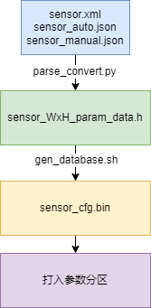
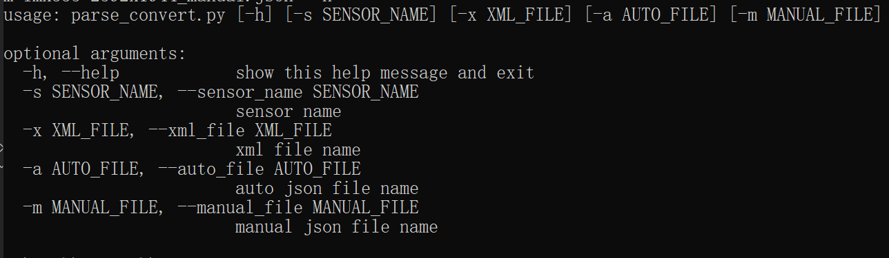
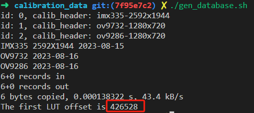

# K230 VICAP SENSOR 参数分区参考


版权所有©2023北京嘉楠捷思信息技术有限公司

<div style="page-break-after:always"></div>

## 免责声明

您购买的产品、服务或特性等应受北京嘉楠捷思信息技术有限公司（“本公司”，下同）及其关联公司的商业合同和条款的约束，本文档中描述的全部或部分产品、服务或特性可能不在您的购买或使用范围之内。除非合同另有约定，本公司不对本文档的任何陈述、信息、内容的正确性、可靠性、完整性、适销性、符合特定目的和不侵权提供任何明示或默示的声明或保证。除非另有约定，本文档仅作为使用指导参考。

由于产品版本升级或其他原因，本文档内容将可能在未经任何通知的情况下，不定期进行更新或修改。

## 商标声明

、“嘉楠”和其他嘉楠商标均为北京嘉楠捷思信息技术有限公司及其关联公司的商标。本文档可能提及的其他所有商标或注册商标，由各自的所有人拥有。

**版权所有 © 2023北京嘉楠捷思信息技术有限公司。保留一切权利。**
非经本公司书面许可，任何单位和个人不得擅自摘抄、复制本文档内容的部分或全部，并不得以任何形式传播。

<div style="page-break-after:always"></div>

## 目录

[TOC]

## 前言

### 概述

本文档主要指导图像调优和应用开发者如何制作用于SPI NOR FLASH模式下的VICAP调试参数文件。

### 读者对象

本文档（本指南）主要适用于以下人员：

- 技术支持工程师
- 软件开发工程师
- 图像调优工程师

### 缩略词定义

| 简称 | 说明 |
|------|------|
|      |      |

### 修订记录

| 文档版本号 | 修改说明                                                                                                                                   | 修改者        | 日期      |
|------------|--------------------------------------------------------------------------------------------------------------------------------------------|---------------|-----------|
| V1.0       | 初版                                                                                                                                       | 郭世栋        | 2023/10/07  |

## 1. 概述

### 1.1 概述

ISP对sensor输出的信号进行实时处理的过程中，调优参数和标定参数对ISP处理方式以及图像的复原、增强有着关键的作用。在SDK中默认使用标定xml、auto json、manual json文件作为VICAP运行时导入的调优参数和标定参数配置。在快速启动模式下，默认参数导入方式耗时较高，因此提供了参数分区导入配置参数的方案。

本文档主要描述了制作参数分区及VICAP使用该分区的方法。

## 2. 制作流程参考

### 2.1 流程图

制作流程图如下：



图2-1 参数分区制作流程图

制作步骤如下：

- [第一步，转换头文件](#221-转换头文件)
- [第二步，转换二进制文件](#222-转换二进制文件)
- [第三步，使用方法](#223-使用方法)
- [注意事项](#224-注意事项)

### 2.2 制作步骤

#### 2.2.1 转换头文件

以senosr：IMX335，分辨率：2592x1944为例

拷贝参数文件到转换头文件的目录

```shell
cp k230_sdk/src/big/mpp/userapps/src/sensor/config/imx335-2592x1944.xml k230_sdk/src/big/mpp/userapps/src/vicap/src/isp/sdk/t_frameworks/t_database_c/calibration_data/
cp k230_sdk/src/big/mpp/userapps/src/sensor/config/imx335-2592x1944_auto.json k230_sdk/src/big/mpp/userapps/src/vicap/src/isp/sdk/t_frameworks/t_database_c/calibration_data/
cp k230_sdk/src/big/mpp/userapps/src/sensor/config/imx335-2592x1944_manual.json k230_sdk/src/big/mpp/userapps/src/vicap/src/isp/sdk/t_frameworks/t_database_c/calibration_data/
```

跳转至转换操作目录（工具源码及脚本存放目录）

```shell
cd k230_sdk/src/big/mpp/userapps/src/vicap/src/isp/sdk/t_frameworks/t_database_c/calibration_data/
```

执行转换头文件工具 *parse_convert.py* ，将拷贝的三个配置文件解析并转换为一个参数头文件（转换工具建议使用python3.x）



```shell
python parse_convert.py -s imx335 -x imx335-2592x1944.xml -a imx335-2592x1944_auto.json -m imx335-2592x1944_manual.json > imx335_2592x1944_param_data.h
```

```c
#ifndef __IMX335_CALIBRATION_H__
#define __IMX335_CALIBRATION_H__

#include "isp_database.h"
#include "k_autoconf_comm.h"
static const TUNING_PARAM_T database_tuning_param =
{
    /* calib data */
    ...
    /* auto data */
    ...
    /* manual data */
    ...
    /* dewarp data */
    ...
    /* version_info */
}
#endif
```

转换后将得到如上的结构体，共五个部分：

calib data、auto data、manual data分别由外部指定的配置文件解析生成

dewarp data需要根据实际配置替换在结构体中，参考[dewarp参数配置](#2224-dewarp参数配置)

version info为转变换工具自动生成，描述sensor name以及创建日期

#### 2.2.2 转换二进制文件

二进制文件由header、配置参数、padding、dewarp参数四个文件拼接而成，考虑到参数分区的实际分配大小，建议最多添加三组配置文件

- [第一步，header制作](#2221-header制作)
- [第二步，配置参数二进制文件制作](#2222-配置参数二进制文件制作)
- [第三步，padding文件制作](#2223-padding生成)
- [第四步，dewarp参数配置](#2224-dewarp参数配置)
- [第五步，合并文件](#2225-合并文件)
- [其他，脚本化制作方法（推荐使用）](#2226-脚本化制作二进制文件)

##### 2.2.2.1 header制作

修改 *gen_database_param_bin_calib_header.c* 中的FILENAME_00、FILENAME_01、FILENAME_02的定义，示例如下：

```c
#define FILENAME_00 "imx335-2592x1944"
#define FILENAME_01 "ov9732-1280x720"
#define FILENAME_02 "ov9286-1280x720"
```

格式要求为驱动中对应的sensor名称-宽x高，如imx335-2592x1944的配置在驱动中对应的sensor name为imx335且分辨率为2592x1944，则修改FILENAME_0X为"imx335-2592x1944"，该定义将作为使用参数分区时的校验头，如果校验头不匹配，则会默认使用配置文件加载的方式进行读取，并在log中打印相应的警告提示，且校验头定义的名称唯一，不能重复。

可添加三组校验头，一旦顺序固定，则参数分区的顺序也需要与校验头同步，同步方法参考后文[二进制文件制作](#2222-配置参数二进制文件制作)。

修改定义后将该源码编译为可执行程序并执行，得到header: sensor_cfg_calib_header.bin

```shell
gcc -o main_header gen_database_param_bin_calib_header.c
./main_header
# 得到sensor_cfg_calib_header.bin
```

##### 2.2.2.2 配置参数二进制文件制作

修改 *gen_database_param_bin.c* 中的 DATABASE_SELECT定义，通过外部编译时传入不同参数制作不同的配置二进制文件，示例如下：

```c
#if DATABASE_SELECT == 0
#include "imx335_2592x1944_param_data.h"
#elif DATABASE_SELECT == 1
#include "ov9732_param_data.h"
#elif DATABASE_SELECT == 2
#include "ov9286_param_data.h"
// will append new header file to convert bin, you can make DATABASE_SELECT++, build need add flag "-DDATABASE_SELECT=?, ?:0, 1, 2..."
#endif
```

DATABASE_SELECT的编号决定了不同sensor配置参数的排列顺序，此顺序需要与header的顺序进行同步。示例中imx335_2592x1944_param_data.h、ov9732_param_data.h、ov9286_param_data.h由三组xml json生成。

编译源码并执行

```shell
DATABASE_CURRENT_DIR=$PWD
DATABASE_CFLAGS="-I$DATABASE_CURRENT_DIR/../include \
 -I$DATABASE_CURRENT_DIR/../../t_common_c/include/  \
 -I$DATABASE_CURRENT_DIR/../../t_json_c/include/    \
 -I$DATABASE_CURRENT_DIR/../../t_mxml_c/mxml-3.3.1/ \
 -I$DATABASE_CURRENT_DIR/../../../../../../../../../include/comm"
gcc -o main_01 gen_database_param_bin.c $DATABASE_CFLAGS -DDATABASE_SELECT=0
gcc -o main_02 gen_database_param_bin.c $DATABASE_CFLAGS -DDATABASE_SELECT=1
gcc -o main_03 gen_database_param_bin.c $DATABASE_CFLAGS -DDATABASE_SELECT=2
$DATABASE_CURRENT_DIR/main_01 0
$DATABASE_CURRENT_DIR/main_02 1
$DATABASE_CURRENT_DIR/main_03 2
# 得到文件sensor_cfg_00.bin(imx335)、sensor_cfg_01.bin(ov9732)、sensor_cfg_02.bin(ov9286)
```

编译多个执行程序，并执行，执行时传入的0 1 2参数为生成的二进制文件名中的序号。

##### 2.2.2.3 padding生成

padding文件存在的目的是为了后续dewarp参数的对齐，方便使用，padding长度会根据header+参数结构体的总长度进行变化，由脚本自动生成。

##### 2.2.2.4 dewarp参数配置

参数分区中定义了dewarp的lut表基本参数，根据此参数可在使用分区时正确的找到dewarp对应的lut文件

```c
typedef struct {
    uint8_t has_lut;
    uint64_t lut_offset;
    uint8_t split_enable;
    uint16_t split_horizon_line;
    uint16_t split_vertical_line_up;
    uint16_t split_vertical_line_down;
} DEWARP_SPLIT_T;
```

has_lut: 是否存在dewarp lut文件，此成员设置为0则表示不需要使用dewarp参数，设置为1时表示需要使用dewarp参数

lut_offset: 当has_lut设置为1时，该成员生效，值将对应dewarp参数在参数分区中所在地址的偏移量，具体计算方法为 参数分区基地址 + header size + 参数结构体size + padding size，参数分区基地址在k_autoconf_comm.h中定义为*CONFIG_MEM_SENSOR_CFG_BASE*，该定义随编译的硬件不同有所改变。可通过sdk提供的*gen_database.sh*脚本进行计算，执行时会进行打印：



图2-2 参数分区自动计算dewarp偏移量

split_enable: 默认设置为0

split_horizon_line: 默认8191

split_vertical_line_up: 默认8191

split_vertical_line_down: 默认8191

dewarp的参数文件需要在制作脚本中指定路径，参考后文

示例如下分别为使用dewarp和不使用dewarp时的配置

```c
// 使用dewarp的配置
/* dewarp data */
{
    /* has_lut */
    1,
    /* lut_offset */
    CONFIG_MEM_SENSOR_CFG_BASE + 426528, // 426528通过脚本计算得出
    /* split_enable */
    0,
    /* split_horizon_line */
    8191,
    /* split_vertical_line_up */
    8191,
    /* split_vertical_line_down */
    8191,
},

// 不使用dewarp的配置
/* dewarp data */
{
    /* has_lut */
    0,
    /* lut_offset */
    0,
    /* split_enable */
    0,
    /* split_horizon_line */
    8191,
    /* split_vertical_line_up */
    8191,
    /* split_vertical_line_down */
    8191,
},

```

##### 2.2.2.5 合并文件

通过2.2.2.1 - 2.2.2.4产出的文件如下：
| **文件名** | **描述**                       |
|------------|--------------------------------|
| sensor_cfg_calib_header.bin | header文件    |
| sensor_cfg_0X.bin           | 配置参数文件  |
| padding.bin                 | 用于对齐的文件|
| imx335-2592x1944.bin        | dewarp参数文件，生成方法参考dewarp使用指南|

合并上述文件得到最终用于参数分区的二进制文件 *sensor_cfg.bin*

```shell
cat sensor_cfg_calib_header.bin \
    sensor_cfg_00.bin sensor_cfg_01.bin \
    sensor_cfg_02.bin \
    padding.bin \
    ../../../../../../../sensor/dewarp/imx335-2592x1944.bin > sensor_cfg.bin
```

按顺序，最后合并的文件为k230_sdk/src/big/mpp/userapps/src/sensor/dewarp中生成的dewarp参数文件，若添加新的dewarp参数文件，按顺序在末尾追加即可。

##### 2.2.2.6 脚本化制作二进制文件

sdk中提供了串联流程2.2.2.1 - 2.2.2.5的半自动化脚本 *gen_database.sh* ，用户在完成header、dewarp、参数解析的源码定义后，可通过执行该脚本进行制作，甚至不需要手动执行该脚本，直接编译sdk即可。

```shell
#!/bin/sh
DATABASE_CURRENT_DIR=$PWD
DATA_SAVE_PATH=../../../../../../../../../../../../tools/gen_image_cfg/data/
DATABASE_CFLAGS="-I$DATABASE_CURRENT_DIR/../include \
 -I$DATABASE_CURRENT_DIR/../../t_common_c/include/  \
 -I$DATABASE_CURRENT_DIR/../../t_json_c/include/    \
 -I$DATABASE_CURRENT_DIR/../../t_mxml_c/mxml-3.3.1/ \
 -I$DATABASE_CURRENT_DIR/../../../../../../../../../include/comm"

# DATABASE_SELECT 0: imx335 2592x1944, 1: ov9732 1280x720, 2: ov9286 1280x720, ...
echo -n

gcc -o main_01 gen_database_param_bin.c $DATABASE_CFLAGS -DDATABASE_SELECT=0
gcc -o main_02 gen_database_param_bin.c $DATABASE_CFLAGS -DDATABASE_SELECT=1
gcc -o main_03 gen_database_param_bin.c $DATABASE_CFLAGS -DDATABASE_SELECT=2

gcc -o main_header gen_database_param_bin_calib_header.c

$DATABASE_CURRENT_DIR/main_header
$DATABASE_CURRENT_DIR/main_01 0
$DATABASE_CURRENT_DIR/main_02 1
$DATABASE_CURRENT_DIR/main_03 2

rm $DATABASE_CURRENT_DIR/main_header
rm $DATABASE_CURRENT_DIR/main_01
rm $DATABASE_CURRENT_DIR/main_02
rm $DATABASE_CURRENT_DIR/main_03

FILE_LENGTH=$(wc -c < sensor_cfg_calib_header.bin)
FILE_LENGTH=$(expr $FILE_LENGTH + $(wc -c < sensor_cfg_00.bin))
FILE_LENGTH=$(expr $FILE_LENGTH + $(wc -c < sensor_cfg_01.bin))
FILE_LENGTH=$(expr $FILE_LENGTH + $(wc -c < sensor_cfg_02.bin))
PADDING_LENGTH=$(expr 16 - $FILE_LENGTH % 16)
dd if=/dev/zero of=padding.bin bs=1 count=$PADDING_LENGTH
echo "The first LUT offset is "$(expr $PADDING_LENGTH + $FILE_LENGTH)

cat sensor_cfg_calib_header.bin\
    sensor_cfg_00.bin sensor_cfg_01.bin\
    sensor_cfg_02.bin\
    padding.bin\
    ../../../../../../../sensor/dewarp/imx335-2592x1944.bin > sensor_cfg.bin
```

##### 2.2.2.6 打入参数分区

制作二进制文件完成后，需要将该文件置于参数分区存放位置，该操作由sdk编译脚本完成，不需要用户自行操作。只需要在k230_sdk/src/big/mpp/userapps/src/vicap/src/isp/sdk/t_frameworks/t_database_c/calibration_data/中制作好文件即可在编译时自动打入。

#### 2.2.3 使用方法

在完成正确的制作流程后，通过VICAP提供的API进行使用

【说明】vicap 解析配置参数的模式

【定义】

```c
typedef enum {
    VICAP_DATABASE_PARSE_XML_JSON = 0,
    VICAP_DATABASE_PARSE_HEADER = 1,
} k_vicap_database_parse_mode;
```

【成员】

| **成员名称**                       | 值   | **描述**                    |
|------------------------------------| ---- |-----------------------------|
| VICAP_DATABASE_PARSE_XML_JSON      | 0    | 使用xml、auto json、manual json模式|
| VICAP_DATABASE_PARSE_HEADER        | 1    | 使用参数分区加载模式  |

【注意事项】
内部只校验0和1，其他值无效

【说明】vicap设置参数加载模式

【描述】

根据dev_num，设置不同vicap设备加载ISP参数的方式，默认为0

【语法】

k_s32 kd_mpi_vicap_set_database_parse_mode(k_vicap_dev dev_num, k_vicap_database_parse_mode parse_mode)

【参数】

| **参数名称** | **描述**       | **输入/输出** |
|--------------|----------------|---------------|
| dev_num      | VICAP设备号    | 输入          |
| parse_mode   | 参数加载模式   | 输入          |

【返回值】

| **返回值** | **描述**               |
|------------|------------------------|
| 正值       | 成功。返回设备描述符   |
| 负值       | 失败，参考错误码定义。 |

【芯片差异】

无。

【需求】

- 头文件：mpi_vicap_api.h
- 库文件：libvicap.a

【注意】

需要在kd_mpi_vicap_init之前完成调用

【举例】

```c
typedef enum {
    VICAP_DEV_ID_0 = 0,
    VICAP_DEV_ID_1 = 1,
    VICAP_DEV_ID_2 = 2,
    VICAP_DEV_ID_MAX,
} k_vicap_dev;

int ret = 0;
k_vicap_dev vicap_dev = VICAP_DEV_ID_0;
ret = kd_mpi_vicap_set_database_parse_mode(vicap_dev, VICAP_DATABASE_PARSE_HEADER);
if (ret) {
    printf("kd_mpi_vicap_set_database_parse_mode failed, %d\n", ret);
    return ret;
}
```

#### 2.2.4 注意事项

1. 在生成参数头文件时，dewarp的结构体为默认值，需要根据实际情况填入，并计算偏移值，偏移值可以通过执行 *gen_database.sh* 来自动计算，计算后填入对应的位置
1. *gen_database_param_bin.c* 根据gcc -D的编译选项定义DATABASE_SELECT的值来决定包含哪组头文件并将其制作为参数文件，顺序要与header中定义的顺序编号相同
1. 参数分区功能目前仅在spi nor flash模式下使用，其他模式无参数分区，即使加载也无法使用
1. header制作源码中对于FILENAME_0X的定义格式为：sensor_name-宽x高，该header会在VICAP内部使用时进行校验，VICAP内部采用拼接方式生成校验头进行对比，校验头格式为 驱动配置中使用的sensor_name-输入宽x输入高
1. 转换工具与标定xml、auto json、manual json以及vicap版本匹配，不同版本不兼容
1. 使用参数分区时，VICAP会根据当前使用的sensor配置以及设置的解析模式自行对参数分区进行校验，当校验成功后会取出该组参数进行加载，无需用户额外设置。当校验头对比失败时，自动切换回默认配置参数解析模式
